# 주요정보통신기반시설 관리·물리적 취약점 분석·평가 방법 안내서.pdf

> Converted: 2026-03-27 19:20

---
<!-- Page 1 -->
2026
주요정보통신기반시설
관리·물리적 취약점 분석·평가방법
안내서

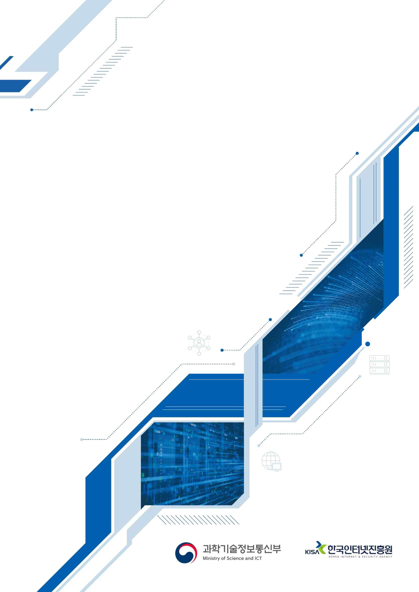

---
<!-- Page 2 -->

Ÿ 본 안내서는 관리·물리적 취약점 분석·평가 항목별 점검 방법의 이해를 돕기 위해 발간된 것으로, 수록된 내용은
취약점 분석:평가 수행 중 활용할 수 있는 참조의 대상일 뿐, 절대적이지 않습니다. 따라서 본 안내서에 수록된 내용
이외에도 다양한 점검 방법을 사용하여 취약점 분석·평가를 수행하시기 바랍니다.
Ÿ 본 점검항목은 각 기반시설 현업에 적용되고 있는 다양한 정책 및 운용 상황을 고려하여 취약점 분석·평가 수행자가
최종적으로 결정하여야 합니다. 예를 들어 본 안내서에 수록된 내용에 의하여 취약 판단을 받게 되어도 그 위험을
부담할 수 있는 합당한 보안조치와 근거를 수반하고 있다면 양호로 판단할 수 있습니다.
Ÿ 본 안내서를 교육기관 등에서 교육 자료로 활용하는 것을 권장하지 않습니다. 또한 수록된 참고 자료, 서식 등의
내용은 모든 관리기관이 동일하게 적용하여야 하는 것이 아니므로 반드시 참고 용도로 활용하시기 바랍니다.
Ÿ 개선 사항(점검 항목별 세부 설명, 고려사항, 관계법규, 확인대상 등)에 대한 의견을 향상 소중히 듣겠습니다.
※ E-mail : ciip@kisa.or.kr
(한국인터넷진흥원)

---
<!-- Page 3 -->
I. 개요···································································································································6

## 1. 개요··········································································································································································7

## 2. 목적 및 구성······························································································································································7

## 3. 점검 요령···································································································································································8

## 4. 활용 시 고려사항························································································································································8

II. 관리적 분야 기본 항목········································································································9

## 1. 정보보호 정책··························································································································································17

## 2. 정보보호 조직··························································································································································29

## 3. 자산분류··································································································································································33

## 4. 위험관리··································································································································································41

## 5. 감사········································································································································································47

## 6. 인적보안··································································································································································51

## 7. 외부자보안······························································································································································59

## 8. 교육 및 훈련····························································································································································73

## 9. 인증 및 권한관리······················································································································································83

## 10. 접근통제································································································································································91

## 11. 운영관리······························································································································································116

## 12. 보안관리······························································································································································164

## 13. 사고대응······························································································································································191

## 14. 업무 연속성·························································································································································207

III. 물리적 분야 기본 항목···································································································215

## 1. 물리보안································································································································································217

IV. 부록1. 참고 자료··········································································································243
<참고 제1호> 정보보호 정책 목차 (예시) ·······················································································································244
<참고 제2호> 정보보호 정책 타당성 검토 체크리스트 (예시) ···························································································245
CONTENTS

---
<!-- Page 4 -->
<참고 제3호> 정보보호 예산 기준································································································································246
<참고 제4호> 외부용역업체 보안관리 준수사항 (예시) ···································································································249
<참고 제5호> 사업자 보안위규 처리기준 (예시) ·············································································································251
<참고 제6호> 사업자 보안위약금 부과 기준 (예시) ·········································································································253
<참고 제7호> 자산의 보안등급 분류 기준 (예시) ············································································································254
<참고 제8호> 정보시스템 저장매체ㆍ자료별 삭제방법 (예시) ·························································································255
<참고 제9호> 무선랜 보안관리 절차서 (예시) ················································································································256
<참고 제10호> 무선AP 점검항목 (예시) ·······················································································································257
<참고 제11호> 정보보안 점검항목 (예시) ······················································································································258
<참고 제12호> 정보보호시스템 도입 요건 (공공기관 사전인증 제품 도입 시) ···································································260
<참고 제13호> DDoS 공격 유형 및 대응 방안··············································································································261
<참고 제14호> 집적정보통신시설 보호조치 세부기준·····································································································264
<참고 제15호> 인터넷 전화망과 전산망의 분리 지침······································································································268
V. 부록2. 서식 예시···········································································································270
<서식 제1호> 연간 정보보호 업무 계획·························································································································273
<서식 제2호> 연간 정보보호 업무 심사분석··················································································································274
<서식 제3호> 표준 개인정보처리 위탁계약서················································································································275
<서식 제4호> 정보시스템 반입, 반출 신청서·················································································································278
<서식 제5호> 정보보호 교육 참가자 명단······················································································································279
<서식 제6호> 단말기 사용 신청서································································································································280
<서식 제7호> 무선랜 설치 신청서································································································································281
<서식 제8호> 무선랜 설치 확인서································································································································282
<서식 제9호> 무선랜 사용 신청서································································································································283
<서식 제10호> 무선랜 AP 관리대장·····························································································································284
<서식 제11호> 무선랜 AP 사용관리대장······················································································································285
<서식 제12호> 시스템 조사표······································································································································286
<서식 제13호> 정보보호시스템 도입 시 확인사항··········································································································287
<서식 제14호> 네트워크 장비 도입 시 보안요구사항······································································································288
<서식 제15호> 정보보호시스템 도입 시 보안요구사항···································································································290
<서식 제16호> 시스템 운영 전 보안요구사항················································································································293
<서식 제17호> 비밀관리기록부····································································································································295
<서식 제18호> 정보통신 침해사고 신고서·····················································································································296

---
<!-- Page 5 -->
<서식 제19호> 정보통신 침해사고 결과서·····················································································································297
<서식 제20호> 보호구역 관리대장·······························································································································298
<서식 제21호> 제한구역⦁통제구역 출입자 명부···········································································································299
<서식 제22호> 정보보호위원회 회의록·························································································································300
<서식 제23호> 정보보호위원회 의견서·························································································································302
<서식 제24호> 직무기술서··········································································································································303
<서식 제25호> 퇴직자 권한회수 및 서약 집행···············································································································304
<서식 제26호> 퇴직자 보안 서약서······························································································································305
<서식 제27호> 수탁자 대상, 보안 점검표······················································································································306
<서식 제28호> 중요정보 파기 확인서···························································································································307
<서식 제29호> 외부자 보안서약서·······························································································································308
<서식 제30호> 자산목록표··········································································································································309
<서식 제31호> 휴대용 저장매체(전산장비 포함) 반출⦁입 대장······················································································310
<서식 제32호> 휴대용 저장매체 관리대장 (일반용) ········································································································311
<서식 제33호> 휴대용 저장매체 관리대장 (비밀용) ········································································································312
<서식 제34호> 휴대용 저장매체 점검대장·····················································································································313
<서식 제35호> 보안교육 설문지 (Excel) ······················································································································314
<서식 제36호> 보안교육 설문분석도구 (Excel) ·············································································································316
<서식 제37호> 정보보호시스템 접근규칙 검토 결과서···································································································317
<서식 제38호> 침입차단시스템 서비스포트 허용/차단 요청서························································································318
<서식 제39호> 계정등록(변경⦁삭제)신청서·················································································································319
<서식 제40호> 네트워크 변경내용 신청서·····················································································································320
<서식 제41호> 정보시스템 접근기록 검토결과서···········································································································322
<서식 제42호> 암호화키 관리대장(대외비) ····················································································································323
<서식 제43호> 암호화키 복구대장(대외비) ····················································································································324
Ⅵ. 부록3. 법규 및 가이드 예시···························································································325
1, 법규 및 지침··························································································································································326

## 2. 가이드 및 매뉴얼····················································································································································331

---
<!-- Page 6 -->

## 1. 개요····························································································································7

## 2. 목적 및 구성················································································································7

## 3. 점검 요령····················································································································8

## 4. 활용 시 고려사항··········································································································8

개요
Chapter 01
6
2026 주요정보통신기반시설 관리·물리적 취약점 분석·평가 방법 안내서

---
<!-- Page 7 -->
7
01
개요
｢정보통신기반 보호법｣ 제9조에 따라, 주요정보통신기반시설 관리기관은 매년 취약점 분석ㆍ평가를 실시하여야
하며 관리적·물리적 항목의 경우 136개의 항목을 점검한다.
한편 취약점 분석ㆍ평가를 수행함에 있어 관리 및 물리적 점검은 정보보호 정책/지침/절차/서식 등의 문서
점검과 관련자 대상 인터뷰는 물론 시스템, 설비, 보호구역 등에 대한 현장 실사 등의 복합적인 점검요령과 다양한
지식이 요구되기 때문에 주요정보통신기반시설 담당자들의 어려움이 따르게 된다.
이러한 관리 및 물리적 점검에 대한 어려움을 해소하고 주요정보통신기반시설 담당자들의 이해를 돕기 위해,
전체 135개 관리 및 물리적 점검항목에 대한 해설, 관계 법규 및 확인대상 등을 포함하는 안내서를 개발하게
되었다.
특히 각각의 점검항목 별 소관 주요정보통신기반시설에 적용이 요구되는 관계 법규 및 관련 준수사항 제시를
통하여 각 산업 영역별 특화된 보호조치 원칙을 손쉽게 확인할 수 있도록 하였고, 조치를 위해 요구되는 참고 자료,
업무서식 등을 부록에 포함시켜 관리기관의 업무환경에 따른 관리체계 수립에 도움이 될 수 있기를 기대한다.
정보통신기반보호법 제9조(취약점의 분석ㆍ평가) ① 관리기관의 장은 대통령령이 정하는 바에 따라 정기적으로 소관
주요정보통신기반시설의 취약점을 분석·평가하여야 한다.
② 중앙행정기관의 장은 다음 각 호의 어느 하나에 해당하는 경우 해당 관리기관의 장에게 주요정보통신기반시설의
취약점을 분석ㆍ평가하도록 명령할 수 있다.

## 1. 새로운 형태의 전자적 침해행위로부터 주요정보통신기반시설을 보호하기 위하여 필요한 경우

## 2. 주요정보통신기반시설에 중대한 변화가 발생하여 별도의 취약점 분석ㆍ평가가 필요한 경우

02
목적 및 구성
목적 : 주요정보통신기반시설 담당자의 기반시설 보호 역량강화를 위한 관리·물리 안내서 제공
대상 : 주요정보통신기반시설 담당자
범위 : 주요정보통신기반시설 관리 및 물리적 취약점 분석‧평가
구성: 관리 및 물리적 점검 기준(136개 항목)의 관련조직, 세부 설명, 고려 사항, 관계 법규, 확인 대상(예시),
참고자료, 부록(참고 자료, 참고 서식, 법규·가이드 목록)
활용 : 주요정보통신기반시설 관리 및 물리적 취약점 보안조치 시 활용

---
<!-- Page 8 -->
| 한국인터넷진흥원 |
8
03
점검 요령
점검을 위해 조직, 문서, 실사 등 점검 대상에 대한 종합적인 검토를 수행하여 점검 항목과의 부합 여부를
판단하고, 점검 항목에 명확히 부합하는 경우 “양호”, 일부 만족하고 개선이 필요한 요소가 존재할 경우 “부분
이행”, 점검 항목에 부합하지 못한 경우 “취약”으로 판단한다.
04
활용 시 고려사항
본 안내서는 주요정보통신기반시설의 관리 및 물리적 보안을 관리기관 스스로 점검하고 예산, 인력 및 관계
법규에 따른 적절한 보안대책을 수립할 수 있도록 하는데 목적이 있다.
따라서 안내서에서 제시하는 참고 자료, 서식 등의 내용은 반드시 모든 관리기관이 동일하게 적용하여야 하는
것이 아니며, 관계 법규에 따라서는 더 높은 보안 수준을 요구할 수 있기 때문에 반드시 참고서 용도로 활용하기를
당부한다.

---
<!-- Page 9 -->

## 1. 정보보호 정책············································································································17

## 2. 정보보호 조직············································································································29

## 3. 자산분류···················································································································33

## 4. 위험관리···················································································································41

## 5. 감사··························································································································47

## 6. 인적보안···················································································································51

## 7. 외부자보안················································································································59

## 8. 교육 및 훈련··············································································································73

## 9. 인증 및 권한관리·······································································································83

## 10. 접근통제·················································································································91

## 11. 운영관리···············································································································116

## 12. 보안관리···············································································································164

## 13. 사고대응···············································································································191

## 14. 업무 연속성···········································································································207

관리적 분야 기본 항목
Chapter 02

2026 주요정보통신기반시설 관리·물리적 취약점 분석·평가 방법 안내서

---
<!-- Page 10 -->
| 한국인터넷진흥원 |
10
l 정보보호정책
번호
취약점 점검 항목
A-1
조직 전반에 적용하고 있는 정보보호 정책/지침 수립 및 경영진의 승인 획득
A-2
정보보호 정책의 시행을 위해 필요한 방법, 절차, 주기 등을 정의하고 문서화
A-3
정보보호 정책 및 시행문서를 모든 임직원 및 관련자에게 접근하기 쉬운 형태로 제공
A-4
정보보호 정책 및 시행문서에 대한 타당성을 주기적으로 또는 중대한 변화 발생 시 검토·평가하여 수정 및 보완
A-5
정보보호 정책 및 시행문서의 제·개정 시 이해관계자의 검토를 받고 해당 내용 반영
A-6
연도별 정보보호 업무 세부추진 계획을 수립·이행
A-7
기관의 정보보호 강화를 위한 중장기(3년 이상) 계획 수립·이행
l 정보보호조직
번호
취약점 점검 항목
A-8
정보보호 활동을 계획, 실행, 검토하는 전담 조직 및 담당자 구성
A-9
정보보호위원회가 구성되어 있으며 위원회의 역할 및 책임을 문서화
l 자산분류
번호
취약점 점검 항목
A-10
주요정보통신기반시설 내 모든 자산(인력, 시설, 장비 등)을 식별하여 자산분류기준을 수립하고 문서화
A-11
정보자산을 보안등급과 중요도 등에 따라 분류하여 관리
A-12
조직의 주요 자산 목록을 작성하고, 정기적인 자산 현황 조사 결과 및 변경 사항(취득, 폐기, 양도 등) 등을
자산 목록에 반영하여 변경이력을 최신으로 유지 관리
A-13
자산의 등급에 따른 취급절차(생성·도입, 저장, 이용, 파기) 및 보호대책을 수립·이행
A-14
정보자산별로 관리자 및 관리 책임자가 지정되어 있으며, 목록을 최신으로 유지·관리
l 위험관리
번호
취약점 점검 항목
A-15
주요정보통신기반시설의 서비스 현황을 식별하고 업무 절차와 흐름을 파악하여 문서화

---
<!-- Page 11 -->

## 02. 관리적 분야 기본 항목

2026 주요정보통신기반시설 관리·물리적 취약점 분석·평가 방법 안내서
11
l 감사
번호
취약점 점검 항목
A-18
법적 요구사항의 준수여부를 연 1회 이상 정기적 검토
A-19
주기적으로 정보보호 감사 계획 수립·이행
A-20
감사결과를 경영진에게 보고하여 적정한 사후관리를 시행
l 인적보안
번호
취약점 점검 항목
A-21
정보보호 관련 직무자의 책임과 역할을 명확히 정의하여 문서화
A-22
기반시설 업무 담당자 지정 시 신원, 업무능력, 교육정도, 경력 등에 대한 적격심사 수행
A-23
기반시설 업무 담당자 지정 시 보안 서약서나 비밀유지 확약서 작성
A-24
기반시설 업무 담당자 지정 해제 시 별도의 비밀유지 확약서 작성
A-25
기반시설 업무 담당자 지정 해제 시 지체 없는 정보자산 반납, 접근권한 회수·조정, 결과 확인 등의 절차 수립·이행
A-26
기반시설 업무 관련자가 정보보호  정책을 위반할 경우 이에 대한 징계와 관련된 사항을 규정에 명시
l 외부자보안
번호
취약점 점검 항목
A-16
연 1회 이상 정기적으로 위험 평가 수행
A-17
위험평가에 따른 연간 보호대책 이행계획 수립 및 경영진 보고
번호
취약점 점검 항목
A-27
외부 서비스 이용 및 업무 위탁에 따른 신규 외부자에 대한 보안 서약서 작성
A-28
기반시설 범위 내에서 발생하고 있는 외부 서비스 이용 및 업무 위탁 현황을 식별 및 관리
A-29
외부 서비스 이용 및 업무 위탁에 따른 정보보호 요구사항을 식별하고 이를 계약서 또는 협정서에 명시
A-30
유지보수 등을 위한 외부자 임시 방문 시 정보 및 자산 접근에 대한 보안 규정 사전 고지
A-31
외부자가 계약서, 협정서, 내부정책에 명시된 정보보호 요구사항을 준수하고 있는지 주기적으로 점검 또는 감사를 수행
A-32
외부자의 보안 관련 사항 위반이나 침해사고 발생 시, 이에 따른 조치 수행
A-33
외부자의 계약만료, 업무 종료, 담당자 변경 시 자산 반납, 접근권한 삭제 및 비밀유지 확약서 작성 등이

---
<!-- Page 12 -->
| 한국인터넷진흥원 |
12
l 교육 및 훈련
l 인증 및 권한관리
번호
취약점 점검 항목
A-39
담당 업무에 따라 시스템에 접근할 수 있는 사용자 계정 및 접근권한 부여 방법과 범위 등을 정의 및 이행
A-40
내·외부에서 시스템 접근 시 안전한 인증 방법 및 절차를 마련하고 이에 따라 이행
A-41
시스템에 대한 안전한 사용자 비밀번호 관리 절차 및 작성 규칙 수립·이행
A-42
시스템에 대한 사용자 계정 및 접근권한의 적정성 검토 기준, 검토 주체, 검토 방법, 주기 등을 수립하여 이행
l 접근통제
번호
취약점 점검 항목
A-34
정보보호 인식제고를 위한 교육 및 훈련 계획을 종합적으로 수립하여 정기적으로 실시
A-35
전체 임직원 및 외부자에 대하여 정보보호 교육 및 훈련 수행
A-36
교육 및 훈련은 대상자의 직위 및 업무 특성에 따라 차등화하여 실시
A-37
교육 및 훈련의 효과가 측정·분석되어 차기 교육 및 훈련에 반영
A-38
유관기관에서 공유한 보안공지·권고문 등에 대한 내용을 임직원 및 외부자에게 공유하고 조치요령을 안내
번호
취약점 점검 항목
A-43
네트워크 접근통제 유지를 위해 접근권한 통제, 원격접속 관리, 네트워크 분리 등의 내용을 포함한 네트워크
운영 보안 정책을 수립·이행
A-44
시스템의 목적 및 민감도 등에 따라 네트워크를 분리 운영하고 각 영역 간 접근통제를 적용
A-45
접근통제 규칙은 관리자의 승인을 거쳐서 설정 또는 변경
A-46
접근통제 정책의 적합성 여부에 대해 주기적 검토
A-47
방화벽, 침입탐지시스템 구축 등 안전한 네트워크를 위한 대책을 마련
A-48
외부 네트워크를 통한 원격작업(재택근무, 장애대응 등)에 대한 책임자 승인, 작업내용 및 범위, 기간 설정,
접근 로그 기록/검토 등이 포함된 정책(절차) 수립·이행
A-49
네트워크를 통해 시스템을 운영하는 경우 원칙적으로 시스템 관리는 내부의 특정 단말기에서만 할 수 있도록 제한
번호
취약점 점검 항목
이루어질 수 있도록 보안대책 수립·이행

---
<!-- Page 13 -->

## 02. 관리적 분야 기본 항목

2026 주요정보통신기반시설 관리·물리적 취약점 분석·평가 방법 안내서
13
l 운영관리
번호
취약점 점검 항목
A-50
외부에서 내부 시스템 접속 시 VPN 등 안전한 접속 수단 적용
A-51
내부망(업무망)과 인터넷망을 분리하여 운용
A-52
망분리 후 안전한 자료전송을 위한 시스템을 도입하여 사용
A-53
인터넷 전화망과 일반 전산망은 분리하여 운용
A-54
내부에 상주하는 외부자에 대하여 네트워크를 분리하여 운영
A-55
무선네트워크 사용 시 상급기관장의 보안성 검토를 필하거나 안전한 암호화 알고리즘 및 암호키 설정 등의
적절한 보안조치를 적용
A-56
인가된 임직원만이 인가된 단말을 이용하여 무선네트워크를 사용할 수 있도록 사용 신청 및 해지 절차를 수립·이행
A-57
무선네트워크 무단 사용 여부, 비인가 무선 중계기(AP) 설치 여부, 우회 정보통신망 사용 차단 여부 등을
주기적으로 점검
번호
취약점 점검 항목
A-58
자산 및 시스템을 신규 도입·개발 또는 변경하는 경우 법, 규제, 계약상의 요구사항을 정의하여 문서화
A-59
자산 및 시스템을 신규 도입·개발 또는 변경하는 경우 보안성 검토 및 호환성 검토 수행하고 보안책임자는
이를 확인 및 승인
A-60
시스템의 변경관리 절차 수립·이행
A-61
정보보호시스템은 국내용 CC인증을 받았거나, 보안적합성 검증 수행
A-62
제품 및 서비스에서 계약 등으로 협의된 사항 이외 이상행위가 발생하는지 모니터링
A-63
개발 및 테스트 설비는 실제 운영 설비와 분리하여 운영
A-64
개발자와 운영자의 접근 권한 분리
A-65
업무용 시스템(ERP, 그룹웨어 등)의 소스코드 접근권한을 차등 부여하고 별도 저장장치에 보관
A-66
업무용 시스템(ERP, 그룹웨어 등)의 소스코드 변경 시 보안약점 분석도구를 통해 취약점 점검
A-67
주요 시스템 및 정보보호제품의 변경을 위한 공식적인 절차 수립·이행
A-68
유지보수 작업 전 공식적인 작업 신청 및 수행절차를 수립·이행하고 작업 기록을 주기적으로 검토
A-69
장애탐지, 장애기록, 장애분석, 장애복구, 장애보고 등의 사항을 포함하는 시스템의 장애관리 지침 문서화
A-70
백업 대상, 주기, 방법, 보관 장소, 보관기간, 소산 등을 포함한 백업 절차 수립·이행
A-71
백업된 정보의 완전성과 정확성, 복구절차의 적절성을 확인하기 위하여 정기적으로 복구 테스트 수행
A-72
전자기록 보관을 위한 별도의 방법(아카이빙)을 마련하고, 이를 통해 관리

---
<!-- Page 14 -->
| 한국인터넷진흥원 |
14
l 보안관리
번호
취약점 점검 항목
A-73
시스템 및 정보보호시스템에 대한 접근기록(로그 등)을 생성·보관하고, 이에 대한 비인가 열람, 훼손 등을
방지하기 위한 보호대책 운영
A-74
시스템과 네트워크의 오류, 오·남용(비인가접속, 과다조회 등), 부정행위 등 이상징후를 인지할 수 있도록
로그 검토 주기, 대상, 방법 등을 포함한 로그 검토 및 모니터링 절차 수립·이행
A-75
로그 및 모니터링 결과를 월 1회 이상 책임자에게 보고
A-76
정보나 매체가 용도 폐기되기 위한 폐기 방법 수립·이행
A-77
보안규정의 이행여부를 확인하는 주기적인 보안점검 및 불시 보안점검 수행
A-78
비밀(대외비 포함)을 비밀관리기록부 등에 등재하여 관리
A-79
출력된 비밀문서의 경우 잠금장치가 있는 캐비넷 등에 안전하게 보관
A-80
비밀 등 중요정보의 안전한 처리를 위한 보호대책을 마련하거나 시스템을 도입하여 사용
A-81
정보통신망 세부 구성현황(IP 정보 등)등을 비공개 이상으로 관리
A-82
중요 데이터와 일반 데이터를 다른 서버에 분리 보관
A-83
홈페이지 게시 자료에 대해 게시 절차를 마련하고 시행
A-84
개인정보 및 주요정보의 보호를 위하여 법적 요구사항을 반영한 암호화 대상, 암호강도, 암호사용, 암호키
관리 등이 포함된 암호정책 수립·이행
A-85
암호키를 복구하기 위한 복구 절차를 수립하고 복구 내역 검토
번호
취약점 점검 항목
A-86
침입차단 및 탐지 도구는 조직의 보안 정책과 규칙에 적합하게 설치하여 운영
A-87
외부자와 정보 공유, 네트워크 공유 등에 따른 보안위협에 대한 대책 운영
A-88
정보통신망에 비인가 PC, 노트북 등을 연결 시 차단 및 차단 이력 주기적 검토
A-89
이동형 장치(노트북, 태블릿, 보조저장매체 등)의 사용 및 반출입에 대한 통제절차 수립·이행
A-90
이동형 장치(노트북, 태블릿, 보조저장매체 등)의 반출입 시 통제 절차에 따른 기록 유지 관리하고 절차
준수여부를 확인할수 있도록 반출입 이력을 주기적으로 점검
A-91
스마트폰·개인휴대단말기(태블릿)·전자제어장비 등 정보통신기기를 활용하는 경우, 업무자료 등 중요정보
보호 및 안전한 전송을 위한 방안 마련
A-92
보조저장매체의 사용을 주기적으로 점검하고 운영 현황을 최신화
A-93
노트북, 보조저장매체 등 이동형 장치의 분실을 통한 자료 유출 대비책 마련

---
<!-- Page 15 -->

## 02. 관리적 분야 기본 항목

2026 주요정보통신기반시설 관리·물리적 취약점 분석·평가 방법 안내서
15
l 사고대응
번호
취약점 점검 항목
A-104
침해사고 및 개인정보 유출사고를 예방하고 사고 발생 시 신속하고 효과적으로 대응하기 위한 체계와 절차 수립
A-105
침해사고 발생 시 신속한 보안사고 보고를 위한 절차를 문서화하고 있고 이에 따라 신속한 보고 수행
A-106
침해사고 시 외부기관 및 전문가들과의 대응협조체계 구축
A-107
사이버위기 ‘주의’ 이상 경보 발령 및 피해발생 등 필요 시 대응할 수 있는 ‘긴급대응반’을 구성
A-108
부정접근 사례나 보안사고 내역을 지속적으로 모니터링
A-109
침해사고 발생에 대비한 대응절차 및 방법 숙지를 위한 주기적인 교육·훈련 실시
A-110
보안사고 유형, 범위, 영향 등을 포함한 보안사고 분석 결과를 기록 및 관리
A-111
보안 취약점 및 사고 발생 시 이에 대한 보완작업 절차 마련
A-112
사이버침해사고 발생 후 재발방지 대책 수립·이행
A-113
침해사고 처리, 계약증빙 및 소송 등을 위한 적정한 증거자료 확보에 관한 지침 수립·이행
번호
취약점 점검 항목
A-94
서버, 네트워크시스템, 보안시스템, PC 등 자산별 특성 및 중요도에 따라 운영체제(OS)와 소프트웨어의
패치관리 정책 및 절차 수립·이행
A-95
서버, 네트워크시스템, 보안시스템, PC 등의 운영체제, 소프트웨어 등이 개발사로부터 보안 지원이 되지 않을
경우 해당 제품을 교체하거나 보안대책 마련
A-96
바이러스 등 악성프로그램을 대비한 보안프로그램의 설치·운영 등 보호대책 운영
A-97
‘사이버보안진단의 날’ 등과 같이 월별 보안 중점점검사항에 대해 매월 보안점검 및 조치활동 수행
A-98
네트워크, 메신저 등으로부터의 허가되지 않았거나 불분명한 파일의 다운로드를 금지하고, 부득이하게
다운로드 받을 경우 바이러스 검사 수행
A-99
스팸 메일 수신을 줄이기 위한 방안(스팸차단 솔루션)을 마련
A-100
개인정보의 유출 등을 방지하기 위해 접근 권한의 관리, 접근통제, 암호화, 접속기록의 보관 및 점검 등
개인정보의 안전성 확보에 필요한 조치 이행
A-101
서비스 거부(DDoS) 공격 방지를 위한 대응방안(그린DDoSZone 등) 수립 및 운영
A-102
주요정보통기반시설과 직·간접적으로 연계된 시스템을 대상으로 모의해킹 수행 및 보안대책 마련
A-103
시스템 및 사용 장비에 대한 보안 취약점에 대한 주기적 검토 및 보완 프로세스 운영

---
<!-- Page 16 -->
| 한국인터넷진흥원 |
16
l 업무연속성
번호
취약점 점검 항목
A-114
기반시설의 서비스(업무) 연속성을 위협할 수 있는 IT 재해 유형을 식별하고 유형별 피해규모 및 업무에
미치는 영향을 분석하여 핵심 IT 서비스(업무) 및 시스템을 식별
A-115
핵심 IT서비스(업무) 및 시스템의 특성에 따른 복구 목표시간, 복구 목표시점을 정의
A-116
재해 및 재난 발생 시에도 기반시설 서비스 및 시스템의 연속성을 보장할 수 있도록 복구 전략 및 대책, 비상시
복구 조직, 비상연락체계, 복구 절차 등 재해 복구 계획 수립·이행
A-117
보안중요성이 높은 등급의 시스템들은 이중화하여 관리
A-118
모의 훈련 등을 통해 업무 연속성을 지속적으로 검토 및 관리하고, 조직 내의 변경이 있을 경우 이에 대한 사항을 반영

---
<!-- Page 17 -->

## 02. 관리적 분야 기본 항목

2026 주요정보통신기반시설 관리·물리적 취약점 분석·평가 방법 안내서
17
01
정보보호 정책
A-1
관리적 분야 > 1. 정보보호 정책
조직 전반에 적용하고 있는 정보보호 정책/지침 수립 및 경영진의 승인 획득
관련 조직
정보보호 부서
세부 설명
§ 기관 자체의 최상위 정보보호 정책을 수립하여 조직이 수행하는 정보보호 활동의 근거와 기준을 명확하게  제시할 수
있도록 하여야 한다.
§ 정보보호에 대한 경영진의 방향, 역할 및 책임, 정책의 대상과 범위, 활동의 근거 등 조직 전반에 적용하고 있는
정보보호 활동과 관련된 핵심 사항이 모두 포함할 수 있도록 하여야 한다.
§ 최상위 정보보호 정책에 대한 승인은 최고경영자(기관장)가 공식적으로 승인하여야 하며, 이를 통해 경영진의
의지를 조직 전체에 명확히 전달할 수 있어야 한다.
고려 사항
§ 최상위 정보보호 정책은 관련 법률 및 상급 기관의 정책을 준수할 수 있도록 그 내용을 구성하되, 관리기관 내
사업 특성, 조직 구성 등의 환경을 고려해 각 기관의 특성에 맞도록 구체적인 내용을 수립하여야 한다.
§ 최상위 정책 하위의 시행 지침 및 세부 절차는 정보보호책임자의 승인을 받을 수 있지만, 최상위 정책은
최고경영자(기관장)의 공식적인 승인을 받아야 하며, 그 기록을 명확하게 관리해야 한다.
§ 최상위 정보보호 정책 하위에 특정 대상(예: 조직, 사업, 시스템 등)에 따른 세부 업무 지침 또는 절차를
추가적으로 수립하여야 한다.

---
<!-- Page 18 -->
| 한국인터넷진흥원 |
18
[그림1] 정보보호 정책 문서 및 시행문서 구성(예시)
관계 법규
공통
정보통신기반 보호법 제10조(보호지침)
개인정보 보호법 제29조(안전조치의무)
개인정보의 안전성 확보조치 기준 제4조(내부 관리계획의 수립ㆍ시행 및 점검)
공공기관
국가 정보보안 기본지침 제4조(책무), 제5조(정보보안담당관 운영, 제7조(정보보안 내규)
금융회사
전자금융거래법 제21조(안전성의 확보의무)
전자금융감독규정 제8조(인력, 조직, 교육 및 예산))
ICT기업
정보보호 및 개인정보보호 관리체계 인증 등에 관한 고시 [별표7] 1.1.5 정책 수립
확인 대상(예시)
☐기관 자체의 최상위 정보보호 정책 문서
☐최고경영자(기관장)의 승인을 확인할 수 있는 내부 결재문 또는 서명본
☐(참고 자료 제1호) 정보보호 정책 목차 (예시)

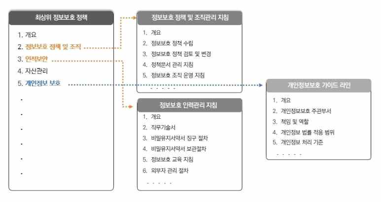

---
<!-- Page 19 -->

## 02. 관리적 분야 기본 항목

2026 주요정보통신기반시설 관리·물리적 취약점 분석·평가 방법 안내서
19
A-2
관리적 분야 > 1. 정보보호 정책
정보보호 정책의 시행을 위해 필요한 방법, 절차, 주기 등을 정의하고 문서화
관련 조직
정보보호 부서, 시스템 운영 부서
세부 설명
§ 정보보호 정책을 구체적으로 시행하기 위해 세부적인 방법, 절차, 주기 등이 포함된 시행문서(지침, 절차,
가이드라인, 매뉴얼 등)를 수립하여 문서화해야 한다.
§ 시행문서는 정보보호 정책에서 수립한 규정을 실제로 수행하기 위한 문서이므로 해당 문서를 기반으로
정보보호 활동을 원활하게 수행할 수 있도록 구체적으로 작성되어야 한다.
§ 문서화된 정책 및 시행문서는 제·개정 내역에 대한 승인절차와 개정이력 관리가 지속적으로 이루어져야 하며
관련 법규의 개정 등에 따라 정보보호 정책 및 시행문서의 변경이 필요한 경우 법적 요구사항을 반영하여
개정하여야 한다.
고려 사항
§ 조직의 특성에 맞게 수립된 시행문서는 정보보호 활동의 근거를 구체적으로 제시할 수 있어야 하며, 정책 및
시행문서에 포함된 내용은 일관성이 있어야 한다.
§ 지침, 절차, 가이드라인, 매뉴얼 등은 조직이 수행하는 모든 정보보호 활동의 구체적인 근거를 명확히
제시하여야 하며 보호 대상이나 수행 주체 등 다양한 관점을 고려하여 조직의 특성에 맞게 수립되어야 한다.
관계 법규
공통
정보통신기반 보호법 제10조(보호지침)
개인정보 보호법 제29조(안전조치의무)
개인정보의 안전성 확보조치 기준 제4조(내부 관리계획의 수립ㆍ시행 및 점검)
공공기관
국가 정보보안 기본지침 제4조(책무), 제6조(연도 추진계획 수립), 제7조(정보보안내규)
금융회사
전자금융거래법 제21조(안전성의 확보의무)
전자금융감독규정 제8조(인력, 조직, 교육 및 예산)
ICT기업
정보보호 및 개인정보보호 관리체계 인증 등에 관한 고시 [별표7] 1.1.5 정책 수립
확인 대상(예시)
☐정보시스템 운영에 관한 지침 또는 절차(문서)
☐정보시스템 운영에 관한 지침 또는 절차의 제·개정 승인 이력

---
<!-- Page 20 -->
| 한국인터넷진흥원 |
20
A-3
관리적 분야 > 1. 정보보호 정책
정보보호 정책 및 시행문서를 모든 임직원 및 관련자에게 접근하기 쉬운 형태로 제공
관련 조직
정보보호 부서
세부 설명
§ 정보보호 정책 및 시행문서는 확인하기 쉬운 형태(예: 사내게시판 공지, 전자우편, 책자 등)로 배포하여 모든
임직원 및 관련자가 최신본을 인지할 수 있도록 하여야 한다.
§ 정보보호 정책 및 시행문서 제·개정 시 최신본은 임직원 및 관련자가 손쉽게 접근할 수 있는 형태로
전달되어야 하고, 제·개정 사실을 모든 임직원 및 관련자들이 알 수 있도록 공지하여야 한다.
고려 사항
§ 정보보호 정책 및 시행문서는 제‧개정사항이 발생하면 즉시 공표하고 최신본을 유지하여야 한다.
§ 정보보호 정책 및 시행문서는 내용에 따라 대외비 이상의 보안등급 분류가 이루어질 수 있으나, 정책 적용의
대상들이 정보보호 원칙을 이해하고 준수할 수 있도록 널리 배포되어야 한다.
§ 정보보호 정책 및 시행문서의 공개 방법은 그룹웨어 공지, 이메일, 사내 게시물, 인쇄본 교부 등 다양할 수
있으며 모든 임직원 및 관련자가 확인하기 쉬운 방법으로 선정하여 공개한다.
[그림2] 정보보호 정책 및 지침 개정 안내(메일)(예시)

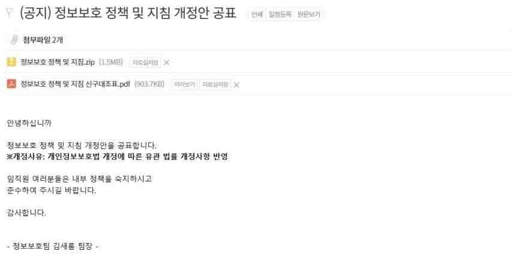

---
<!-- Page 21 -->

## 02. 관리적 분야 기본 항목

2026 주요정보통신기반시설 관리·물리적 취약점 분석·평가 방법 안내서
21
관계 법규
공통
정보통신기반 보호법 제10조(보호지침)
개인정보 보호법 제29조(안전조치의무)
개인정보의 안전성 확보조치 기준 제4조(내부 관리계획의 수립ㆍ시행 및 점검)
공공기관
국가 정보보안 기본지침 제4조(책무), 제7조(정보보안내규)
금융회사
전자금융거래법 제21조(안전성의 확보의무)
전자금융감독규정 제8조(인력, 조직, 교육 및 예산)
ICT기업
정보보호 및 개인정보보호 관리체계 인증 등에 관한 고시 [별표7] 1.1.5 정책 수립
확인 대상(예시)
☐기관 자체의 최상위 정보보호 정책 및 시행문서 최신본
☐정보보호 정책 및 시행문서가 공개된 방법(또는 위치)
☐정책 및 시행문서 제·개정 공지 이력

---
<!-- Page 22 -->
| 한국인터넷진흥원 |
22
A-4
관리적 분야 > 1. 정보보호 정책
정보보호 정책 및 시행문서에 대한 타당성을 주기적으로 또는 중대한 변화 발생 시 검토·평가하여 수정
및 보완
관련 조직
정보보호 부서
세부 설명
§ 정보보호 정책 및 시행문서에 대한 공식적인 타당성 검토 절차를 수립하고 연 1회 이상 정기적으로 수행하여
필요 시 수정 및 보완될 수 있도록 하여야 한다.
§ 정기적 검토 이외에 내부적(예: 조직, 물리, ICT 환경변화) 또는 외부적(예: 법규 변화) 변화가 발생하는 경우
그에 맞추어 조직의 역할을 변경하거나 법규제에 따른 정보보호 관련 요건의 변경을 반영하여 정책 및
시행문서를 개정하여야 한다.
고려 사항
§ 대·내외 환경에 중대한 변화 발생 시 정보보호 정책 및 시행 문서에 미치는 영향을 검토하고 필요 시 변경된
법규를 준수할 수 있도록 제·개정하여야 한다.
※ 대·내외 환경 변화 예시
- 정보보호 관련 법규 제·개정
- 비즈니스 환경의 변화(신규 서비스 도입, 조직개편 등)
- IT 환경의 중대한 변화(신규 시스템 도입 등)
- 내·외부의 보안사고 발생
- 새로운 위협 또는 취약성 발견
- 보안점검 및 내부감사 결과 반영 등
§ 정보보호 정책의 개정이 적시에 이루어지지 않으면 부적절한 내부 보안통제가 적용되거나 변경된 법규제를
만족하지 못할 우려가 있으므로 최소 연 1회 이상 정기적으로 타당성 검토를 수행하여야 한다.
§ 정보보호 이행점검, 내부감사 등과 같은 보안활동을 수행할 때 정책 및 시행문서 개정의 필요성을 검토하여야 한다.
§ 타당성 검토는 검토를 수행하는 인원에 따라 평가 수준이 다를 수 있으므로 별도의 체크리스트 등을 통해
반드시 검토가 필요한 기준을 명확하게 설정하는 것이 효과적이다.

---
<!-- Page 23 -->

## 02. 관리적 분야 기본 항목

2026 주요정보통신기반시설 관리·물리적 취약점 분석·평가 방법 안내서
23
관계 법규
공통
정보통신기반 보호법 제10조(보호지침)
개인정보 보호법 제29조(안전조치의무)
개인정보의 안전성 확보조치 기준 제4조(내부 관리계획의 수립ㆍ시행 및 점검)
공공기관
국가 정보보안 기본지침 제7조(정보보안내규)
금융회사
전자금융거래법 제21조(안전성의 확보의무)
전자금융감독규정 제8조(인력, 조직, 교육 및 예산)
ICT기업
정보보호 및 개인정보보호 관리체계 인증 등에 관한 고시 [별표7] 2.1.1 정책의 유지관리
확인 대상(예시)
☐연 1회 이상의 정보보호 정책 및 시행문서 타당성 검토 결과 (예: 개정 의견 문건)
☐타당성 검토 결과에 따른 제·개정 이력(예: 개정 의견 및 개정 승인 문건)
☐(참고 자료 제2호) 정보보호 정책 타당성 검토 체크리스트 (예시)

---
<!-- Page 24 -->
| 한국인터넷진흥원 |
24
A-5
관리적 분야 > 1. 정보보호 정책
정보보호 정책 및 시행문서의 제·개정 시 이해관계자의 검토를 받고 해당 내용 반영
관련 조직
정보보호 부서
세부 설명
§ 정보보호 정책 및 시행문서를 제·개정하는 경우 이해관계자의 검토를 통해 업무에 끼치는 영향, 법적 준거성
등을 고려하여 타당성을 검토하여야 한다.
§ 이해관계자란 정보보호 정책 및 시행문서의 직접적인 영향을 받는 조직 및 담당자, 관련 분야 전문성을 보유한
조직 및 담당자 등을 의미한다.
고려 사항
§ 이해관계자에는 정보보호 및 개인정보보호 인력, IT 부서 인력, 현업부서 실무 책임자 등이 있을 수 있으며,
필요시 정보보호 관련 전문기관 또는 전문업체 등 외부 전문가 집단을 포함할 수 있다. 정보보호 정책 및
시행문서의 제·개정 시 이들로부터 자문, 협의, 점검 등을 받아 해당 내용을 반영할 수 있다.
§ 전문가 집단 및 내부 이해관계자와의 협의를 통해 정보보호 정책 및 시행문서를 제·개정하는 경우 변경으로
인한 업무 영향도 및 법적 준거성 등을 검토하여야 한다.
관계 법규
공통
정보통신기반 보호법 제7조(주요정보통신기반시설의 보호지원)
개인정보 보호법 제29조(안전조치의무)
개인정보의 안전성 확보조치 기준 제4조(내부 관리계획의 수립ㆍ시행 및 점검)
공공기관
국가 정보보안 기본지침 제7조(정보보안내규)
금융회사
전자금융감독규정 제8조의2(정보보호위원회 운영)
ICT기업
정보보호 및 개인정보보호 관리체계 인증 등에 관한 고시 [별표7] 2.1.1 정책의 유지관리
확인 대상(예시)
☐전문가 집단 및 이해관계자로부터의 자문, 협의, 점검 등의 이력(예: 검토 회의록, 계약서, 협의서, 공문 등)
☐자문, 협의, 점검 결과를 내부 보고하고 개선 조치가 이루어진 이력(예: 결과서, 개선 조치 결과서 등)

---
<!-- Page 25 -->

## 02. 관리적 분야 기본 항목

2026 주요정보통신기반시설 관리·물리적 취약점 분석·평가 방법 안내서
25
A-6
관리적 분야 > 1. 정보보호 정책
연도별 정보보호 업무 세부추진 계획을 수립·이행
관련 조직
정보보호 부서
세부 설명
§ 정보보호 업무는 관리, 물리, 기술 분야에 대해 통합적인 관리가 이루어져야 하므로 연도별 정보보호 및
개인정보보호 업무 세부추진 계획을 수립하고 추진결과에 대한 분석· 평가를 수행하여야 한다.
§ 당해 연도의 정보보호 계획의 시행 여부를 검토하고 이행하지 못한 계획이 있다면 미이행 사유 등에 대한
분석·평가를 통해 문제점을 지속적으로 관리 및 개선하여야 한다.
고려 사항
§ 해당 연도의 정보보호 및 개인정보보호 업무를 효과적으로 수행하기 위해 지속적인 관리가 요구되며, 이를
위해 연도별 정보보호 및 개인정보보호 업무 세부추진 계획을 수립하고 경영진에 보고하는 등 계획에 따른
정보보호 활동과 관리가 이루어져야 한다.
§ 개인정보보호 업무 세부추진 계획은 정보보호 업무 세부추진 계획에 포함하여 수립할 수 있다.
§ 세부추진 계획에 따른 추진결과를 분석 및 평가하여 경영진에게 보고하고 문제점이 발견된 경우 개선대책을
수립하여 이행하여야 한다.
§ 관계 법규에서 요구하는 내용이 계획과 심사분석에 반영되도록 하고, 특히 금융회사는 정보보호 예산을
수립할 때 관계 법규에서 요구하는 예산원칙을 고려하여야 한다.
§ 공공기관 정보보호 예산은 정보화 예산 대비 15% 이상을 운영할 수 있도록 노력하여야 한다.
관계 법규
공통
정보통신기반 보호법 제6조(주요정보통신기반시설보호대책의 수립 등)
개인정보 보호법 제29조(안전조치의무)
개인정보의 안전성 확보조치 기준 제4조(내부 관리계획의 수립ㆍ시행 및 점검)
공공기관
국가 정보보안 기본지침 제6조(연도 추진계획 수립)
금융회사
전자금융거래법 제21조(안전성의 확보의무)
전자금융감독규정 제8조의2(정보보호위원회 운영), 제36조의2(정보기술부문 계획서 제출 절차 등)
ICT기업
정보보호 및 개인정보보호 관리체계 인증 등에 관한 고시 [별표7] 1.1.6 자원 할당

---
<!-- Page 26 -->
| 한국인터넷진흥원 |
26
확인대상(예시)
☐당해 연도(또는 차년도) 정보보호 업무 계획서
☐전년도(또는 당해 연도) 정보보호 업무 계획에 대한 시행결과 검토서
☐(참고 자료 제3호) 정보보호 예산 기준
☐(서식 예시 제1호) 연간 정보보호 업무 계획
☐(서식 예시 제2호) 연간 정보보호 업무 심사분석

---
<!-- Page 27 -->

## 02. 관리적 분야 기본 항목

2026 주요정보통신기반시설 관리·물리적 취약점 분석·평가 방법 안내서
27
A-7
관리적 분야 > 1. 정보보호 정책
기관의 정보보호 강화를 위한 중장기(3년 이상) 계획 수립·이행
관련 조직
정보보호 부서
세부 설명
§ 기관의 정보보호는 일회성 또는 단기간에 이루어질 수 없는 부분도 존재하기 때문에 단계적이고 지속적인
정보보호 대책, 즉 중장기 정보보호 대책(정보보호 마스터플랜)을 수립하여야 한다.
§ 정보보호 마스터플랜은 식별된 위험에 따른 보호대책을 확인할 수 있는 증적 자료가 될 수 있으며 식별된
위험에 대한 처리전략(위험감소, 위험회피 등)을 수립하고 전략에 따른 적절한 중장기 계획을 수립·이행하여
거시적인 시각에서 정보보호 수준을 꾸준히 향상하여야 한다.
§ 정보보호 마스터플랜을 수립하는 과정에서 다양한 정보보호 대책이 도출되는 경우 각 대책을 언제 적용하고
예산은 어느 정도 소요될 것인가에 대한 세부사항도 함께 수립하여야 한다.
고려 사항
§ 정보보호 마스터플랜을 수립하는 방법 중 하나는 선진 사례, 정보보호 표준을 정보보호 목표로 정하고
해당하는 목표와의 차이(Gap)를 분석하여 그 차이를 줄이기 위한 정보보호 대책을 선정하는 방법이 있다.
§ 정보보호 대책 선정 시 위험의 심각성 및 예산 할당, 구현 용이성 등을 고려하여 일정, 담당 부서 및 담당자,
예산 등의 항목을 지정해 상세 계획을 수립하여야 한다.
§ 수립된 정보보호 마스터플랜은 정보보호책임자 및 개인정보 보호책임자 등 경영진에 보고하여야 한다.
§ 정보보호 현황분석을 토대로 도출한 수행과제에 대해 이행방안, 소요기간, 수행 주체, (필요 시) 예산 등을
포함하는 개별 세부계획을 수립하여 향후 정보보호 활동을 체계적으로 수행할 수 있도록 하여야 한다.
§ 아래는 국내 정보보호제도 중 정보보호 및 개인정보보호 관리체계(ISMS-P)의 인증기준을 만족하기 위한
정보보호 목표를 정하고 해당하는 정보보호 수준을 달성하기 위한 3개년 계획을 수립하는 예시이다.

---
<!-- Page 28 -->
| 한국인터넷진흥원 |
28
[그림3] 정보보호 마스터플랜 수립에 따른 추진목표, 과제, 고려사항(예시)
[그림4] 정보보호 마스터플랜 수립에 따른 세부 이행과제(예시)
관계 법규
공통
정보통신기반 보호법 제6조(주요정보통신기반시설보호계획의 수립 등)
개인정보보호법 제29조(안전조치의무)
개인정보의 안전성 확보조치 기준 제4조(내부 관리계획의 수립ㆍ시행 및 점검)
공공기관
국가 정보보안 기본지침 제6조(연도 추진계획 수립)
금융회사
전자금융거래법 제21조(안전성의 확보의무), 제8조의2(정보보호위원회 운영)
전자금융감독규정 제36조의2(정보기술부문 계획서 제출 절차 등)
ICT기업
정보보호 및 개인정보보호 관리체계 인증 등에 관한 고시 [별표7] 1.1.6 자원 할당, 1.2.4 보호대책 서정
확인 대상(예시)
☐정보보호 마스터플랜 문서
☐(참고 자료 제3호) 정보보호 예산 기준

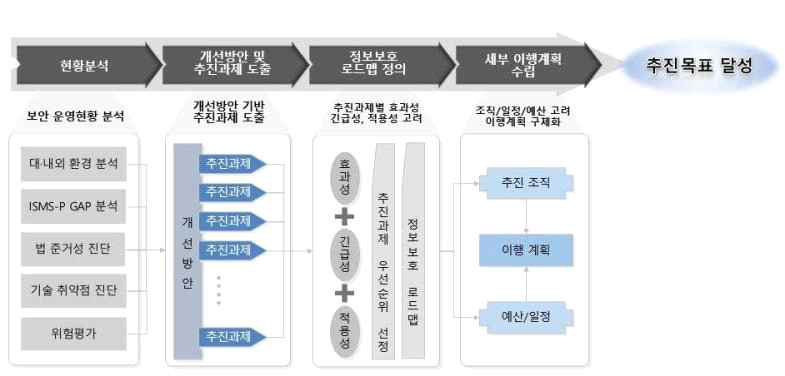

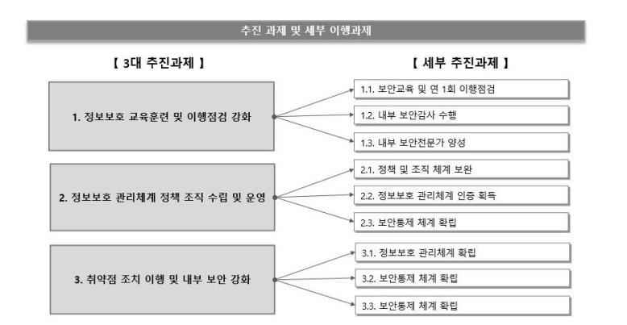

---
<!-- Page 29 -->

## 02. 관리적 분야 기본 항목

2026 주요정보통신기반시설 관리·물리적 취약점 분석·평가 방법 안내서
29
02
정보보호 조직
A-8
관리적 분야 > 2. 정보보호 조직
정보보호 활동을 계획, 실행, 검토하는 전담 조직 및 담당자 구성
관련 조직
정보보호 부서
세부 설명
§ 정보통신기반 보호법에 따라 주요정보통신기반시설 관리기관은 해당 주요정보통신기반시설의 보호를
총괄하는 정보보호책임자를 지정하여야 한다.
§ 정보보호책임자는 공공분야의 경우 4급·4급 상당 공무원, 5급, 5급 상당 공무원, 국방분야의 경우 영관급 장교,
민간분야의 경우 임원급 관리·운영자 등 주요정보통신기반시설 보호 활동을 효과적으로 추진하기 위해 이를
총괄하여 최종 의사결정을 할 수 있는 관리책임자로 지정한다.
§ 정보보호책임자는 주요정보통신기반시설 보호대책의 수립·시행, 기술적 지원의 요청, 취약점 분석·평가 및
전담반 구성, 주요정보통신기반시설 보호지침 준수 명령의 이행, 침해사고의 통지, 주요정보통신기반시설의
복구 및 보호에 필요한 조치 등 법령에 명시된 업무와 주요정보통신기반시설 보호 업무 전반을 총괄한다.
§ 금융회사 및 정보통신서비스제공자의 경우 전자금융거래법, 정보통신망법 상의 정보보호 최고책임자 지정요
건에 따라 정보보호책임자를 지정할 수 있다.
§ 정보보호책임자의 역할 지원 및 조직의 정보보호 활동을 효율적이고 체계적으로 이행하기 위해 정보보호
전문지식을 보유한 적정인력을 확보하여 정보보호 전담조직을 구성·운영하여야 한다.
§ 정보보호 전담조직의 규모는 법적 요건이 존재하는 경우 해당 법적 기준에 따라야 하며 명확한 규정이
존재하지 않을 경우 전사 조직의 규모, 업무 등을 고려하여 구성하여야 한다.
고려 사항
§ 정보보호 전담조직은 정보보호 분야에 대한 이해도가 높거나 다양한 경험으로 전문성을 갖춘 인력으로
구성하여 운영하여야 한다.
§ 정보보호 전담조직의 보안 업무는 타업무와 직무분리 등을 통해 독립성을 보장하여야 한다.
§ 공공기관 정보보호 전담인력은 정보화 인력 대비 10% 이상 운영할 수 있도록 노력하여야 한다.
§ 정보보호책임자와 정보보호 전담조직 및 담당자는 공식화되어야 하므로 인사발령 등의 절차를 통해
공식적으로 지정되어야 하고, 전체 조직도 상에서 정보보호 실무를 담당할 부서를 식별하여야 한다.

---
<!-- Page 30 -->
| 한국인터넷진흥원 |
30
§  공공분야의 경우 정보보호책임자를 정보보안담당관으로 지정하여 겸임할 수 있다.
관계 법규
공통
정보통신기반 보호법 제5조(주요정보통신기반시설보호대책의 수립 등)
정보통신기반 보호법 시행령 제9조(정보보호책임자의 지정 등)
개인정보 보호법 제29조(안전조치의무), 제31조(개인정보 보호책임자의 지정 등)
개인정보의 안전성 확보조치 기준 제4조(내부 관리계획의 수립·시행 및 점검)
공공기관
국가 정보보안 기본지침 제5조(정보보안담당관 운영)
금융회사
전자금융거래법 제21조(안전성의 확보의무)
전자금융거래법 제21조의2(정보보호최고책임자 지정)
전자금융감독규정 제8조(인력, 조직, 교육 및 예산)
ICT기업
정보통신망 이용촉진 및 정보보호 등에 관한 법률 제45조의3(정보보호 최고책임자의 지정 등)
정보보호 및 개인정보보호 관리체계 인증 등에 관한 고시 [별표7] 1.1.2 최고책임자의 지정, 1.1.3
조직 구성
확인 대상(예시)
☐정보보호 조직 구성도
☐정보보호책임자 지정 문서(예: 임명장, 승인문서)
☐정보보호 전담조직(정보보호 담당자 포함) 지정 문건(예: 인사발령, 조직도)
☐정보보호 직무기술서
☐(서식 예시 제24호) 직무기술서

---
<!-- Page 31 -->

## 02. 관리적 분야 기본 항목

2026 주요정보통신기반시설 관리·물리적 취약점 분석·평가 방법 안내서
31
A-9
관리적 분야 > 2. 정보보호 조직
정보보호위원회가 구성되어 있으며 위원회의 역할 및 책임을 문서화
관련 조직
정보보호 부서
세부 설명
§ 전사 조직의 이해관계를 대변하고 의사결정을 할 수 있도록 실질적인 의사결정 권한이 있는 임직원(예:
경영진, 임원, 정보보호책임자 및 개인정보 보호책임자 등)으로 정보보호위원회를 구성하여야 한다.
§ 정보보호위원회는 조직 전반에 걸친 주요 사안에 대한 검토, 승인 및 의사결정을 수행하는 조직으로 정보보호와
관련된 중요한 결정에 대한 공정성의 확보, 의견 조정 및 다양한 의사의 종합⋅협의⋅조정 등을 위해 설치하여야
한다.
§ 정보보호위원회를 체계적으로 운영하기 위하여 해당 위원회의 정의, 대상, 구성, 역할 및 운영에 관한 절차
등을 명문화하여야 한다.
고려 사항
§ 정보보호위원회(공공기관인 경우, 보안심사위원회와 동일)는 해당 명칭의 위원회가 존재하거나 다른 명칭(예:
경영회의)의 의사결정 모임을 정보보호위원회 형태로 운영할 수 있다.
§ 정보보호위원회의 명칭은 다양하게 표현될 수 있으므로, 단순히 명칭에 의해 파악하기보다는 위원회의 행정작용,
소관 사무, 행정조직 내 지위 등을 고려하여 그 성격과 기능을 파악하여야 한다. 즉, 정보보호위원회와 다른
명칭이더라도 정보보호에 관한 심의 의결하는 형태로 운영하여야 한다.
§ 금융회사 또는 전자금융업자는 전자금융거래법 등 관계 법규에서 정하는 정보보호위원회 구성, 심의·의결 사안,
보고 절차 등의 내용이 포함된 정보보호위원회 운영 규정이 있어야 하며, 관계 법규 및 해당 규정에 따라 위원회를
운영하여야 한다.
§ 위원회를 통해 심의(의사결정)가 이루어져야 하는 안건을 명확히 규정하되, 위원회 운영이 필요한 사안이
불시에 발생하는 경우에도 운영 지침에 따른 위원회 운영과 의사결정이 이루어져야 한다.
§ 정보보호위원회가 보다 효과적으로 운영될 수 있도록 정보보호 및 개인정보보호 담당자, 부서별 담당자로
구성된 실무협의체를 구성하여 운영하는 것을 고려할 수 있다.

---
<!-- Page 32 -->
| 한국인터넷진흥원 |
32
관계 법규
공통
정보통신기반 보호법 제5조(주요정보통신기반시설의보호대책 수립 등)
공공기관
국가 정보보안 기본지침 제7조(정보보안내규)
금융회사
전자금융거래법 제21조(안전성의 확보의무)
전자금융감독규정 제8조의2(정보보호위원회 운영)
ICT기업
정보보호 및 개인정보보호 관리체계 인증 등에 관한 고시 [별표7] 1.1.3 조직 구성
확인 대상(예시)
☐정보보호위원회 운영 규정(예: 지침, 절차)
☐정보보호위원회 운영 규정에 따른 의사결정 이력(예: 회의록 등)
☐(서식 제22호) 정보보호위원회 회의록
☐(서식 제23호) 정보보호위원회 의견서

---
<!-- Page 33 -->

## 02. 관리적 분야 기본 항목

2026 주요정보통신기반시설 관리·물리적 취약점 분석·평가 방법 안내서
33
03
자산분류
A-10
관리적 분야 > 3. 자산분류
주요정보통신기반시설 내 모든 자산(인력, 시설, 장비 등)을 식별하여 자산분류기준을 수립하고 문서화
관련 조직
정보보호 부서
세부 설명
§ 기반시설을 구성하는 중요 자산의 현황을 체계적으로 관리하기 위해 자산의 유형 별 분류 및 관리(예: 연 1회 이상
목록 현행화) 기준을 수립하여야 하며 기준에 따라 작성된 자산목록은 정기적으로 검토하여 현행화하여야 한다.
§ 자산을 식별하는 것은 조직에서 보유하고 있는 자산 중 보호하여야 할 대상을 정의하는 것으로 기반시설과 관련된
모든 자산을 확인하고 보호되어야 할 자산을 분류 기준에 따라 누락 없이 식별하여 자산목록(표) 등으로 문서화하여야
한다.
고려 사항
§ 자산의 분류는 서버, 네트워크 장비, 정보시스템(응용프로그램), 소프트웨어, 보안 장비, DBMS, 단말기
등으로 구분할 수 있으며, 기반시설 및 조직의 특성에 따라 적절한 분류 기준을 마련할 필요가 있다.
§ 자산 분류기준에 따라 자산목록을 작성할 때는 자산명, 용도, 위치, 주요 직무자, 담당자 및 책임자, 관리부서
등을 확인하여 목록에 포함하여야 한다.
§ 자산을 효과적으로 관리하기 위해 자산관리시스템을 활용하거나 다양한 형태의 문서(예: 엑셀, 워드 등)로
자산 목록을 작성하여 관리할 수 있다.
§ 자산 목록은 조직의 내부 규정에 따른 분류 기준으로 작성하는 것이 일반적이나, 관련 국내외 표준 및 인증(예:
ISMS, ISMS-P, ISO27001) 규격에 맞춰 상세한 분류 기준과 목록을 유지할 필요가 있는 경우에는 해당 표준을
준수하여 자체 규정을 수립하고 이에 따라 관리할 수 있다. 다만, 국제 표준을 완벽히 준수하기 어려운 경우에는
정보시스템을 중심으로 자산 목록을 관리하는 방안을 고려할 수 있다.
§ 자산의 분류 시 누락 되는 자산이 발생하지 않도록 범위 내 모든 자산을 식별하고 식별된 자산은 자산분류
기준에 따라 분류하여 관리하여야 한다.

---
<!-- Page 34 -->
| 한국인터넷진흥원 |
34
※ 자산 분류(예시)
유형
설명
예시
전자 정보
전자적 형태로 저장된 데이터
데이터베이스, 데이터 파일 등 전자파일
문서
종이매체로 된 자산 업무에 사용·산출되는
문서나 기록물
규정 및 지침, 계약서 및 협약서 등
소프트웨어 자산
상용 또는 자체 개발된 소프트카피·하드카피
보관중인 각종 소프트웨어 자산
애플리케이션 소프트웨어, 시스템 소프트웨어,
개발도구 및 유틸리티
하드웨어
자산
서버
대내외 서비스 및 업무를 위해 사용되는 서버 자산
유닉스 서버, 윈도우 서버 등
네트워크
장비
네트워크와 관련된 장비
라우터, 스위치, 허브 등
단말기
임직원이 업무에 사용하는 단말기
PC, 노트북, 모바일 기기 등
시설
시스템 설치·운영 장소
물리적 공간 및 각종 부대시설
전산실, 사무실, 방재실, 통신 장비실 등
지원설비
전력공급, 환기시설, 방재 시설 등
정보시스템 운영 지원하기 위한 설비
항온항습기, UPS, 공조장비 등
인력
소유자, 사용자, 운영자, 개발자 등
시스템 운영 및 업무 수행 중인 모든 인력
내부인력, 외부인력 및 협력업체 등
관계 법규
공통
정보통신기반 보호법 제5조(주요정보통신기반시설의보호대책 수립 등)
공공기관
국가 정보보안 기본지침 제50조(정보시스템 보안책임), 제81조(보호대책 수립)
금융회사
전자금융거래법 제21조(안전성의 확보의무)
전자금융감독규정 제13조(전산자료 보호대책), 제23조(비상대책 등의 수립·운용)
ICT기업
정보보호 및 개인정보보호 관리체계 인증 등에 관한 고시 [별표7] 1.2.1 정보자산 식별
확인 대상(예시)
☐자산 분류 및 관리 기준에 대한 지침
☐자산 목록(표)
☐(참고 자료 제7호) 자산의 보안등급 분류 기준 (예시)
☐(서식 예시 제30호) 자산목록표

---
<!-- Page 35 -->

## 02. 관리적 분야 기본 항목

2026 주요정보통신기반시설 관리·물리적 취약점 분석·평가 방법 안내서
35
A-11
관리적 분야 > 3. 자산분류
정보자산을 보안등급과 중요도 등에 따라 분류하여 관리
관련 조직
정보보호 부서
세부 설명
§ 정보자산에 대한 보안등급 분류기준을 관련 지침 등에 명문화하고 수립된 분류 기준에 따라 개별 정보자산에
대한 보안등급을 자산목록표로 작성하여 관리하여야 한다.
§ 정보자산(예: 서버, 네트워크 장비, 보안 장비, PC 등)을 기밀성, 무결성, 가용성 등의 정보보호 특성을 고려하여
중요도를 평가하고 자산별 특성에 따라 보안등급(예: 1, 2, 3등급)을 부여하여야 한다.
고려 사항
§ 정보자산의 유출, 장애 및 침해 발생 시 조직의 업무에 미치는 영향을 고려하여 식별된 자산의 중요도를
평가할 수 있는 기준을 수립하여야 한다.
§ 정보자산 중요도 평가 시 기밀성, 무결성, 가용성, 법적 요구사항 등을 고려할 수 있으며 이외에도 서비스 영향,
이익손실, 고객 상실, 대외 이미지 등 타 자산과의 연관성을 추가적으로 고려할 수 있다.
※ 자산 중요도 평가를 위한 주요 고려사항
기준(예시)
설명
기밀성
(Confidentiality)
자산이 접근 권한이 없는 자에게 노출되었을 때의 위험성을 파악하여 데이터가 오직 인가된
사용자만 접근할 수 있도록 보호하는 것을 의미함
무결성
(Integrity)
하드웨어/소프트웨어 변경, 데이터 값 수정 등 자산의 상태 또는 내용이 임의로 변경되었을 때의
위험성을 파악하여 데이터가 정확하고 신뢰할 수 있도록 유지하도록 보장하는 것을 의미함
가용성
(Availability)
자산이 필요 시 사용이 불가능하거나, 접근이 되지 않을 때 서비스에 미치는 영향을 파악 하여
필요한 정보에 적시에 접근할 수 있도록 보장하는 것을 의미함
§ 식별된 자산에 대한 법적 요구사항 및 업무에 미치는 영향 등을 고려하여 중요도를 결정하고 보안등급을
부여하여야 한다.
§ 자산 중요도 평가기준에 따라 자산별로 중요도를 평가하여야 한다. 또한 자산별 특성에 따라 보안등급을
부여하고 임직원이 보안등급을 쉽게 식별할 수 있도록 관리하여야 한다.

---
<!-- Page 36 -->
| 한국인터넷진흥원 |
36
§ 정보자산에 대한 보안등급은 1등급, 2등급, 3등급(또는 가등급, 나등급, 다등급 등)으로 구분할 수 있으며,
회사의 자산 관리 지침에 따라 보안등급을 부여하고 현행화하여 관리하여야 한다.
관계 법규
공통
정보통신기반 보호법 제5조(주요정보통신기반시설보호대책의 수립 등)
공공기관
국가 정보보안 기본지침 제51조(정보시스템 유지보수)
금융회사
전자금융거래법 제21조(안전성의 확보의무)
전자금융감독규정 제13조(전산자료 보호대책), 제23조(비상대책 등의 수립·운용)
ICT기업
정보보호 및 개인정보보호 관리체계 인증 등에 관한 고시 [별표7] 2.1.3 정보자산 관리
확인 대상(예시)
☐정보시스템 자산에 대한 보안등급 분류 및 관리 기준(예: 지침)
☐정보시스템별 보안등급 지정 현황(예: 시스템별 보안등급 지정 목록)
☐자산별 보안등급이 표기된 자산 목록표
☐(참고 자료 제7호) 자산의 보안등급 분류 기준 (예시)
☐(서식 예시 제30호) 자산 목록표

---
<!-- Page 37 -->

## 02. 관리적 분야 기본 항목

2026 주요정보통신기반시설 관리·물리적 취약점 분석·평가 방법 안내서
37
A-12
관리적 분야 > 3. 자산분류
조직의 주요 자산 목록을 작성하고, 정기적인 자산현황 조사 결과 및 변경 사항(취득, 폐기, 양도 등) 등
을 자산 목록에 반영하여 변경이력을 최신으로 유지·관리
관련 조직
정보보호 부서
세부 설명
§ 기반시설을 구성하는 각 자산을 문서화 또는 자산관리시스템을 활용하는 등 목록화하여 관리하고 정기적으로
점검하여 변경 사항이 발생할 경우 현행화하여야 한다.
§ 정보자산의 취득·신규 도입 변경·폐기·양도 등 발생 시 자산목록에 반영하고 그 변경이력을 최신으로
유지‧관리하여야 한다.
고려 사항
§ 명문화된 자산 분류기준에 근거하여 서버, 네트워크 장비, 보안 장비, DBMS, PC, 기타 설비 등에 대한 자산을
목록(또는 별도 업무시스템을 통한 목록화)으로 관리하고 정기적으로 자산 현황 조사를 수행하여 최신 목록을
유지하여야 한다.
§ 자산 목록을 변경할 경우 버전 및 변경일을 기재하는 등 변경이력을 관리할 수 있도록 하여야 한다.
관계 법규
공통
정보통신기반 보호법 제5조(주요정보통신기반시설보호대책의 수립 등)
개인정보 보호법 제29조(안전조치의무)
개인정보 안전성 확보조치 기준 제4조(내부관리계획의 수립·시행 및 점검)
공공기관
국가 정보보안 기본지침 제50조(정보시스템 보안책임), 제81조(보호대책 수립)
금융회사
전자금융거래법 제21조(안전성의 확보의무)
전자금융감독규정 제13조(전산자료 보호대책), 제23조(비상대책 등의 수립·운용)
ICT기업
정보보호 및 개인정보보호 관리체계 인증 등에 관한 고시 [별표7] 1.2.1 정보자산 식별
확인 대상(예시)
☐목록표에 표기된 자산의 위치(예:통신실, 서버실 등)
☐자산 변경에 따른 자산 목록 갱신 이력
☐(서식 예시 제30호) 자산 목록표

---
<!-- Page 38 -->
| 한국인터넷진흥원 |
38
A-13
관리적 분야 > 3. 자산분류
자산의 등급에 따른 취급절차(생성·도입, 저장, 이용, 파기) 및 보호대책을 수립·이행
관련 조직
정보보호 부서
세부 설명
§ 자산의 보안등급 별 취급절차(생성·도입, 저장, 이용, 파기)를 수립하고 보안등급에 따른 차별화된 보안통제를
수행할 수 있는 지침 또는 절차를 정의하여 그에 따른 이행이 이루어지도록 하여야 한다.
§ 명문화된 자산의 보안등급 기준에 근거하여 보안등급에 따른 보호절차와 접근제한을 하여야 한다.
§ 물리적인 보호구역 등급에 따른 보안통제를 차별화하고, 중요한 정보시스템에 따라 네트워크 및 시스템별
보안통제을 차별화하여야 한다.
고려 사항
§ 자산 분류 및 보안등급 산정방법 정의, 자산 목록화, 자산의 보안등급 식별(결정) 등을 전제로 보호대책을
수립하여야 한다.
§ 자산의 유형 및 특성에 따라 다르겠지만 보안등급에 따른 보안통제 원칙을 명문화하여 이행하도록 한다.
관계 법규
공통
개인정보 보호법 제29조(안전조치의무)
공공기관
국가 정보보안 기본지침 제51조(정보시스템 유지보수)
금융회사
전자금융거래법 제21조(안전성의 확보의무)
전자금융감독규정 제13조(전산자료 보호대책), 제15조(해킹 등 방지대책)
ICT기업
정보보호 및 개인정보보호 관리체계 인증 등에 관한 고시 [별표7] 2.1.3 정보자산 관리
확인 대상(예시)
☐내부규정(예: 지침 또는 절차) 중 보안등급별 보안통제에 관한 내용
☐정보자산별 보안등급 지정 현황(예: 시스템별 보안등급 지정 목록) 및 보안통제 적용 여부
☐(참고 자료 제8호) 정보시스템 저장매체·자료별 삭제방법 (예시)

---
<!-- Page 39 -->

## 02. 관리적 분야 기본 항목

2026 주요정보통신기반시설 관리·물리적 취약점 분석·평가 방법 안내서
39
A-14
관리적 분야 > 3. 자산분류
정보자산별로 관리자 및 관리 책임자가 지정되어 있으며 목록을 최신으로 유지·관리
관련 조직
정보보호 부서
세부 설명
§ 식별된 자산별로 자산 관리(도입, 변경, 폐기, 반·출입 등)를 총괄 책임질 수 있는 소유자와 자산을 실제 관리
운영하는 관리자 및 실무 담당자를 지정하여 각각의 책임과 역할을 정의하고 자산목록표 및 자산관리대장
등에 기재하여 자산에 대한 보호조치 이행 주체를 명확하게 확인할 수 있도록 하여야 한다.
§ 자산별로 지정된 책임자를 확인하기 위해서는 정보시스템 자산(예: 서버, 네트워크 장비, 보안 장비, PC 등)뿐만
아니라, 관리자 및 사용자가 접근 가능한 애플리케이션 형태의 소프트웨어 자산도 확인하여야 한다.
§ 기반시설 중 유닉스 서버가 있다면 해당 서버의 소유자를 지정하여 root 권한을 가진 관리자 및 관리부서(예:
시스템팀), 부서장, 그리고 해당 서버에 설치된 업무용 애플리케이션을 관리하는 관리자 계정을 보유한 관리자
및 관리부서(예:설비 운영팀), 부서장을 확인 할 수 있어야 한다. 또한 자산을 사용하는 내부 인력 및 외부
인력이 있다면 접근가능 한 사용자 모두를 확인하여야 한다.
고려 사항
§ 소유자, 관리자, 사용자는 다음과 같이 구분할 수 있다.
기준(예시)
설명
소유자
자산의 소유 권한과 관리에 대한 최종 책임을 지며, 자산의 취득, 사용 허가, 처분 또는 폐기
등의 관리권한을 가진 자
관리자
자산의 보관 및 운영·관리 책임이 있고, 자산의 관리위임을 받은 자
사용자
정보처리 설비 및 시스템을 활용하여 자산을 실질적으로 사용하는 자
§ 자산별 관리(담당)자, 관리부서 및 부서장은 각 자산별로 확인할 수 있도록 자산목록표에 해당 인원의 이름을
기록, 관리 하여야 한다.

---
<!-- Page 40 -->
| 한국인터넷진흥원 |
40
[그림5] 자산 목록표에 자산별 책임자 명시(예시)
§ 자산별로 관리(도입, 변경, 폐기, 반·출입 등)를 책임을 질 수 있는 책임자와 자산을 실제 관리·운영하는
관리자(또는 담당자)를 지정하고 자산 목록표에 기재하여 책임소재를 명확하게 하여야 한다.
§ 자산별 관리(담당)자, 관리부서 및 부서장은 자산 목록표에 해당 인원의 이름을 기록하여 관리한다.
§ 자산별 접근 사용자가 많은 경우는 별도의 문서화가 어렵기 때문에 해당 사용자를 서버 또는 어플리케이션
상에서 확인이 가능하도록 하여야 한다.(예: 사용자 계정별 사용 주체(이름) 목록)
§ 퇴직, 보직 이동 등 인사정보가 변경되거나 자산에 변경(도입, 변경, 폐기, 반·출입)이 발생하는 경우 자산별
책임자 및 담당자를 파악하여 자산 목록표에 반영 하여야 한다.
관계 법규
공통
정보통신기반 보호법 제5조(주요정보통신기반시설보호대책의 수립 등)
개인정보 보호법 제29조(안전조치의무), 제30조(개인정보 처리방침의 수립 및 공개)
공공기관
국가 정보보안 기본지침 제50조(정보시스템 보안책임)
금융회사
전자금융거래법 제21조(안전성의 확보의무)
전자금융감독규정 제13조(전산자료 보호대책)
ICT기업
정보보호 및 개인정보보호 관리체계 인증 등에 관한 고시 [별표7] 2.1.3 정보자산 관리
확인 대상(예시)
☐자산별 관리(담당)자, 관리부서, 부서책임자 현황(예: 자산목록표)
☐자산별 사용자 현황(예: 사용자 계정 목록)
☐(서식 예시 제30호) 자산 목록표

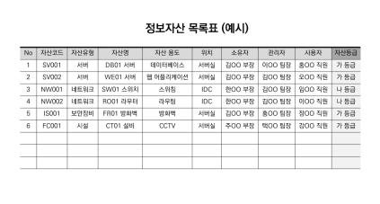

---
<!-- Page 41 -->

## 02. 관리적 분야 기본 항목

2026 주요정보통신기반시설 관리·물리적 취약점 분석·평가 방법 안내서
41
04
위험관리
A-15
관리적 분야 > 4. 위험관리
주요정보통신기반시설의 서비스 현황을 식별하고 업무 절차와 흐름을 파악하여 문서화
관련 조직
정보보호 부서
세부 설명
§ 기반시설의 관리체계 전 영역에 대한 정보서비스 현황을 식별하고, 업무 절차와 흐름을 파악하여
문서화하여야 한다.
§ 문서화된 정보서비스 흐름도는 서비스 및 업무, 자산 등의 변화를 반영할 수 있도록 주기적으로(최소 연 1회
이상) 검토하고, 최신성이 유지되도록 관리하여야 한다.
고려 사항
§ 정보서비스 흐름도는 조직의 업무 절차, 정보보호 요구사항, 보안통제의 상호연계를 도식화한 자료로써
기관의 정보보호 현황을 이해하고 위험을 관리하기 위한 핵심 자료로 구비 하여야 한다.
§ 현황 및 흐름 분석을 위해 자료 분석, 현장실사, 담당자 인터뷰 등을 수행하며 인터뷰 대상자로는 시스템
운영자, 개발자, 정보보호 담당자 등을 포함하여야 한다.
§ 정보서비스 흐름도는 개발자, 운영자 등 담당 업무별로 상세하게 나누어 작성하여야 한다.
[그림6] 정보서비스 흐름도(시스템 운영자 예시)

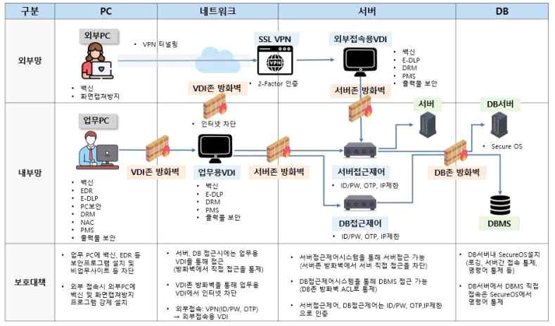

---
<!-- Page 42 -->
| 한국인터넷진흥원 |
42
§ 정보서비스 흐름도 작성 시 업무 흐름을 한눈에 이해할 수 있도록 작성하고 다음 사항들을 고려하도록 한다.
- 기반시설 관련 업무를 수행하는 인력 및 부서 등을 식별 및 구분하여 표시하고, 연계기관이 있는 경우에는 해당
기관도 포함하여 작성한다.
- 각 업무에서 기반시설의 정보서비스 업무와 관련된 처리 수단도 모두 표시한다. (예: PC, 서버, DBMS, 문서 등)
- 해당 직무 또는 담당 업무별 업무명을 이해하기 쉽게 정의하여 흐름도 상단에 기술한다.
- 개발자, 운영자 등 담당 업무별로 상세하게 구분하여 작성할 수 있으며, 필요 시 각 업무에 따라 흐름도를 분리하여
개별적으로 작성할 수 있다.
- 정보서비스 흐름 목적, 연계방식 등 정보서비스 흐름 파악에 필요한 설명을 간략히 기술한다.
- 외부에서 접속 가능한 자산은 내부 자산과 구분될 수 있도록 다른 색으로 표시하는 등의 별도의 방법으로 구별한다.
- 정보서비스 흐름 분석 및 흐름도 작성 시 나타난 주요 문제점 등은 요약하여 기술한다.
- 업무 흐름도에는 정형화된 서식이 없으므로, 해당 기관 및 직무의 특성에 따라 다르게 표현할 수 있다.
관계 법규
공통
정보통신기반 보호법 제5조(주요정보통신기반시설보호대책의 수립 등)
개인정보 보호법 제29조(안전조치의무)
개인정보의 안전성 확보조치 기준 제4조(내부 관리계획의 수립·시행 및 점검)
공공기관
국가 정보보안 기본지침 제81조(보호대책 수립)
금융회사
전자금융거래법 제21조(안전성의 확보의무)
전자금융감독규정 제15조(해킹 등 방지대책), 제23조(비상대책 등의 수립·운용)
ICT기업
정보보호 및 개인정보보호 관리체계 인증 등에 관한 고시 [별표7] 1.2.2 현황 및 흐름분석
확인 대상(예시)
☐정보서비스 현황표
☐정보서비스 업무흐름도

---
<!-- Page 43 -->

## 02. 관리적 분야 기본 항목

2026 주요정보통신기반시설 관리·물리적 취약점 분석·평가 방법 안내서
43
A-16
관리적 분야 > 4. 위험관리
연 1회 이상 정기적으로 위험 평가 수행
관련 조직
정보보호 부서
세부 설명
§ 법적·관리적·기술적·물리적 분야 등 다방면에서 발생할 수 있는 정보보호 관련 위험을 식별·평가하기 위해
위험평가 방법을 선정하고 문서화하여야 한다.
§ 위험관리 방법 및 절차를 구체화하여 위험관리계획을 수립하고 이에 따라 위험평가를 연 1회 이상 정기적으로
수행하거나 중요한 사유(예: 신규 시스템 도입, 조직의 변화 등) 발생 시에는 정기적 평가 외에 별도로 위험평가를
수행하여야 한다.
고려 사항
§ 기관의 특성 및 최신 취약점 및 위협동향 등을 반영하여 유형별 위협정보를 수집하고 조직에 적합한 위험평가
방법(예: 베이스라인 접근법, 상세위험 분석법, 복합 접근법, 위협 및 시나리오 기반 등)을 선정하여 연 1회
이상 위험을 평가하여야 한다.
§ 사전에 수립된 위험관리 방법 및 계획에 따라 체계적으로 수행하며 수용할 수 있는 위험은 경영진의 승인을
받도록 하여야 한다.
§ 위험평가 방법론은 조직의 특성에 맞게 적용하도록 하고, 다양한 위험 요인에 대해 측정 및 예측할 수 있도록
위험을 모델링하여 분석하여야 한다.
§ 위험평가는 정기적으로 수행하되 조직의 변화, 신규시스템 도입 등 중요한 사유가 발생한 경우 별도 위험평가
수행하여야 한다.
§ 최신 법률 개정사항 반영 등 정보보호 관련 법적 요구사항 준수 여부를 확인하고, 운영(현황)관리 문서에
변경된 자산, 서비스, 흐름도 등을 반영하여야 한다.
§ 각종 위험이 조직에 미치는 영향(발생가능성, 심각도 등)을 고려하여 위험도를 산정한다.
§ 기관에서 수용가능한 목표 위험수준(DoA, Degree of Assurance)을 정하여 그 수준을 초과하는 위험을
식별하여야 한다.

---
<!-- Page 44 -->
| 한국인터넷진흥원 |
44
관계 법규
공통
정보통신기반 보호법 제5조(주요정보통신기반시설보호대책의 수립 등),
제9조(취약점의 분석·평가)
개인정보 보호법 제29조(안전조치의무)
개인정보의 안전성 확보조치 기준 제4조(내부 관리계획의 수립·시행 및 점검)
공공기관
국가 정보보안 기본지침 제85조(취약점 분석·평가 결과물 관리)
금융회사
전자금융거래법 제21조의3(전자금융기반시설의 취약점 분석·평가)
전자금융감독규정 제37조의2(전자금융기반시설의 취약점 분석·평가 주기, 내용 등)
ICT기업
정보보호 및 개인정보보호 관리체계 인증 등에 관한 고시 [별표7] 1.2.3 위험 평가
확인 대상(예시)
☐위험관리 지침·매뉴얼·가이드
☐위험관리 계획서
☐위험평가 결과보고서

---
<!-- Page 45 -->

## 02. 관리적 분야 기본 항목

2026 주요정보통신기반시설 관리·물리적 취약점 분석·평가 방법 안내서
45
A-17
관리적 분야 > 4. 위험관리
위험평가에 따른 연간 보호대책 이행계획 수립 및 경영진 보고
관련 조직
정보보호 부서
세부 설명
§ 위험평가 결과에 따라 식별된 위험을 처리하기 위하여 조직에 적합한 보호대책을 선정하고, 보호대책의
우선순위와 일정·담당자·예산 등을 포함한 이행계획을 수립하여 경영진에 보고하여야 한다.
§ 수립된 연도별 정보보호 업무 계획 등의 중요한 정보보호 사안은 정보보호책임자 이상의 최고경영자(또는
기관장)까지 보고하여 경영층의 책임과 관리 아래 보호대책이 시행하여야 한다.
§ 연간 정보보호 업무 계획 이외에도 최상위 정보보호 정책의 제·개정, 정보유출 등과 같은 중요한 정보보호
사안이 발생하면 최고경영자(또는 기관장)까지 보고하여 신속한 의사결정이 이루어지도록 한다.
고려 사항
§ 위험 식별 및 평가 결과에 따른 연간 보호대책 계획은 정보보호책임자, 개인정보 보호책임자 등 경영진이
이해하기 쉽게 작성하여 보고하도록 한다.
§ 식별된 위험은 이해관계자에게 내용을 공유하여 논의하고 보호대책의 우선순위를 고려하여 일정, 담당
부서,담당자, 예산 등의 항목을 포함하여 보호대책 이행계획을 수립한다.
§ 위험 발생가능성 및 심각도 등을 고려하여 위험도 산정기준을 마련하여, 식별 위험에 대하여 위험도를
산출하여야 한다. 수용 가능한 목표 위험수준(DoA : Degree of Assurance)은 정보보호 책임자 및 경영진의
승인 하에 결정하고 식별된 위험에 대한 처리 전략(감소, 회피, 전가, 수용 등)을 수립하여 위험을 관리한다.
[그림7] 위험처리 전략(예시)

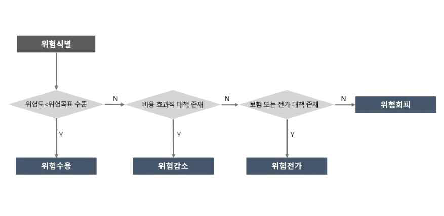

---
<!-- Page 46 -->
| 한국인터넷진흥원 |
46
관계 법규
공통
정보통신기반 보호법 제6조(주요정보통신기반시설보호계획의 수립 등)
개인정보 보호법 제29조(안전조치의무)
개인정보의 안전성 확보조치 기준 제4조(내부 관리계획의 수립·시행 및 점검)
공공기관
국가 정보보안 기본지침 제81조(보호대책 수립)
금융회사
전자금융거래법 제21조의3(전자금융기반시설의 취약점 분석·평가)
전자금융감독규정 제37조의2(전자금융기반시설의 취약점 분석·평가 주기, 내용 등)
ICT기업
정보보호 및 개인정보보호 관리체계 인증 등에 관한 고시 [별표7] 1.2.4 보호대책 선정
확인 대상(예시)
☐정보보호 위험관리계획서
☐정보보호 대책서
☐당해 연도(또는 전년도) 위험관리 보호대책에 대한 최고경영자(기관장) 보고 문건

---
<!-- Page 47 -->

## 02. 관리적 분야 기본 항목

2026 주요정보통신기반시설 관리·물리적 취약점 분석·평가 방법 안내서
47
05
감사
A-18
관리적 분야 > 5. 감사
법적 요구사항의 준수여부를 연 1회 이상 정기적 검토
관련 조직
정보보호 부서, 준법 감시 부서
세부 설명
§ 조직이 준수하여야 할 관련 법적 요구사항을 주기적으로 파악하고, 준수 여부를 연 1회 이상 정기적으로
검토하여 문제점 발견 시 신속하게 조치하여야 한다.
§ 특허권 및 저작권법 등 관련 법규를 준수하여 크랙되거나 불법 복제된 소프트웨어의 사용 금지 등의 조치를
수행하는 등 업무용 PC에서 불법 소프트웨어 사용을 금지하는 대책(예: 교육, 점검, 기술적인 차단 등)을 강구
하여야 한다.
§ 또한, 예산 및 운용 인력 여부에 따라서 불법 소프트웨어를 탐지하고 설치하지 못하도록 하는 기술적인
조치(예: 업무용 PC에 관련 에이전트 설치)를 함께 고려 하여야 한다.
고려 사항
§ 법적 요구사항의 준수 여부를 주기적으로 검토할 수 있는 절차(검토 대상, 주기, 담당자, 방법 등)를 수립하여야
한다.
§ 관련 법규의 제·개정 현황을 지속적으로 모니터링하여 중대한 변경사항이 발생한 경우, 조직에 미치는 영향을
분석하여 반영하고 내부 정책, 지침 등을 최신의 상태로 유지하여야 한다.
§ 불법 소프트웨어는 저작권자의 동의 없이 복제하여 무단으로 이용 중인 소프트웨어를 말하며 기업용
라이선스가 아닌 개인용 라이선스가 적용되는 소프트웨어도 포함된다.
§ 불법 소프트웨어는 사용자 주의와 관리적·기술적인 강제 조치가 함께 병행될 필요가 있다. 따라서
사용자(임직원 및 외부자)에 대한 교육은 반드시 이루어져야 하고 주기적인(연 1회) 자체 점검(예: 매월 불법
소프트웨어 실태점검) 등의 관리적 조치가 시행되어야 한다.

---
<!-- Page 48 -->
| 한국인터넷진흥원 |
48
관계 법규
공통
정보통신기반 보호법 제10조(보호지침)
개인정보 보호법 제29조(안전조치의무)
개인정보의 안전성 확보조치 기준 제4조(내부 관리계획의 수립·시행 및 점검)
공공기관
국가정보보안지침 제14조(검토 시기 및 절차)
금융회사
전자금융거래법 제21조(안전성의 확보의무)
전자금융감독규정 제8조(인력, 조직, 교육 및 예산)
ICT기업
정보보호 및 개인정보보호 관리체계 인증 등에 관한 고시 [별표7] 1.4.1 법적 요구사항 준수 검토
확인 대상(예시)
☐식별된 법적 요구사항 목록
☐법적 준거성 검토 내역·결과(예: 점검 체크리스트)
☐불법 소프트웨어 사용 금지조치 이행 내역

---
<!-- Page 49 -->

## 02. 관리적 분야 기본 항목

2026 주요정보통신기반시설 관리·물리적 취약점 분석·평가 방법 안내서
49
A-19
관리적 분야 > 5. 감사
주기적으로 정보보호 감사계획 수립·이행
관련 조직
정보보호 부서, 감사 부서
세부 설명
§ 정보보호 정책/지침 및 법적 요구사항 등에 따라 정보보호 활동이 수행되고 있는지 여부 등을 점검할 수
있도록 연 1회 이상 정보보호 감사계획을 수립하고 시행하여야 한다.
§ 정보보호 감사는 관계 법규에 따른 규정 요구사항을 포함하여 감사의 전문성, 독립성 및 중립성을 보장할 수
있는 감사 조직을 구성하고 감사의 주기, 기준, 범위, 방법 등을 포함하는 연간 보안 감사계획을 수립하여야 한다.
고려 사항
§ 정보보호 부서가 감사 대상부서에 해당하면 독립성의 문제가 발생할 수 있으므로, 감사 수행의 주체를 별도로
정하고 정보보호 부서는 감사업무를 지원하는 부서가 될 필요가 있다. 다만, 감사 주관부서의 전문성 문제가
우려된다면 외부 감사인(예: 보안컨설턴트, 정보보호인증심사원(예: ISMS-P 심사원))을 포함시켜, 전문성을
확보할 수 있다.
§ 보안 감사 점검 인력은 객관성과 전문성을 보유한 인력이 지정될 수 있도록 자격요건을 정의하여야 한다.
관계 법규
공통
정보통신기반 보호법 제10조(보호지침)
개인정보 보호법 제29조(안전조치의무)
개인정보의 안전성 확보조치 기준 제4조(내부 관리계획의 수립·시행 및 점검)
공공기관
국가 정보보안 기본지침 제8조(정보보안감사 등)
금융회사
전자금융거래법 제21조(안전성의 확보의무)
전자금융감독규정 제58조(금융회사의 정보기술부문 실태평가 등)
ICT기업
정보보호 및 개인정보보호 관리체계 인증 등에 관한 고시 [별표7] 1.4.2 관리체계 점검
확인 대상(예시)
☐연간 보안 감사 계획서(감사 조직 포함)
☐연간 보안 감사 결과보고서

---
<!-- Page 50 -->
| 한국인터넷진흥원 |
50
A-20
관리적 분야 > 5. 감사
감사결과를 경영진에게 보고하여 적정한 사후관리를 시행
관련 조직
정보보호 부서, 감사 부서
세부 설명
§ 보안 감사 결과 보완이 필요한 사항이 발견된 경우, 해당 사항에 대한 조치계획을 수립하여 이행하여야 한다.
§ 개선사항 및 사후관리를 포함한 감사 결과를 경영진에게 보고하여 지적사항에 대한 개선조치가 수행되도록
관리하여야 한다.
고려 사항
§ 보안 감사 결과 보완이 필요한 경우 보안 조치계획을 수립 및 이행하여 조치완료 여부를 확인하여야 한다.
§ 보안 감사 결과는 감사 수행 직후에 문제점에 대한 해당 부서의 개선계획이 포함된 감사 결과서를 작성하여
정보보호책임자에게 보고하고, 일정 기간 후 사후조치 실태를 확인하여 그 결과를 다시 정보보호 책임자에게
보고하여야 한다. 이를 통해 개선조치 책임이 있는 유관 부서의 적극적인 개선 노력을 이끌어 낼 수 있도록 한다.
관계 법규
공통
정보통신기반 보호법 제10조(보호지침)
개인정보 보호법 제29조(안전조치의무)
개인정보의 안전성 확보조치 기준 제4조(내부 관리계획의 수립·시행 및 점검)
공공기관
국가 정보보안 기본지침 제8조(정보보안감사)
금융회사
전자금융거래법 제21조(안전성의 확보의무)
전자금융감독규정 제8조(인력, 조직, 교육 및 예산)
ICT기업
정보보호 및 개인정보보호 관리체계 인증 등에 관한 고시 [별표7] 1.4.2 관리체계 점검, 1.4.3
관리체계 개선
확인 대상(예시)
☐보안 감사 계획서(사후조치 경과 포함 또는 별도 문건)
☐보안 감사 결과보고서
☐경영진에게 감사 결과 보고 이력
☐보안 감사 이행조치 결과보고서

---
<!-- Page 51 -->

## 02. 관리적 분야 기본 항목

2026 주요정보통신기반시설 관리·물리적 취약점 분석·평가 방법 안내서
51
06
인적보안
A-21
관리적 분야 > 6. 인적보안
정보보호 관련 직무자의 책임과 역할을 명확히 정의하여 문서화
관련 조직
정보보호 부서, 인사 부서
세부 설명
§ 업무 수행과 관련된 조직의 특성을 고려하여 관련 책임자와 담당자의 역할 및 책임을 구체적으로 정의하여
명시하여야 한다.
§ 정보보호관리자 및 부서별 담당자의 역할 등에 따라 정보보호 실무 인원이 구분되는 경우는 해당 직무에 대한
정의와 담당자의 자격 요건 등에 대해 문서화하여야 한다.
§ 정보보호 관련 업무를 실무적으로 지원·이행할 수 있도록 해당 직무에 대한 직무기술서 등을 통하여 책임 및
역할을 명시하여야 한다.
§ 외부 인력이 정보보호 담당자로 포함되는 경우 외부 인력의 책임과 역할 등을 구체적으로 정의하여
문서화하여야 한다.
고려 사항
§ 정보보호 전담 인원, 시스템 관리자, 정보보호 시스템 관리자, 개발보안 담당자, 개인정보보호 담당자,
시설보안 담당자, 부서별 보안담당자 등과 같은 정보보호 실무영역에 대한 직무를 구분하여 명문화하여야 한다.
§ 전사 인원에 대한 직무기술서가 아닌 정보보호 실무조직에 대한 직무기술서에 대해 구비하여야 한다.
§ 조직의 각 구성원에게 정보보호와 개인정보보호 관련 역할 및 책임을 할당하고, 그 활동을 평가할 수 있는
체계와 조직 구성원 간 상호 의사소통할 수 있는 체계를 수립하여 운영하여야 한다.
관계 법규
공통
정보통신기반 보호법 제5조(주요정보통신기반시설보호대책의 수립 등)
개인정보 보호법 제29조(안전조치의무), 제31조(개인정보 보호책임자의 지정)
개인정보의 안전성 확보조치 기준 제4조(내부 관리계획의 수립·시행 및 점검)
공공기관
국가 정보보안 기본지침 제4조(책무), 제11조(보안책임), 제73조(개별사용자 보안)

---
<!-- Page 52 -->
| 한국인터넷진흥원 |
52
확인 대상(예시)
☐직무기술서
☐정보보호 조직도
☐정보보호 인력 업무 분장표
☐의사소통 수행 이력(예 : 주간보고, 내부공지 등)
☐(서식 예시 제24호) 직무기술서
금융회사
전자금융거래법 제21조(안전성의 확보의무), 제21조의2(정보보호최고책임자 지정)
전자금융감독규정 제8조(인력, 조직, 교육 및 예산)
ICT기업
정보보호 및 개인정보보호 관리체계 인증 등에 관한 고시 [별표7] 2.1.2 조직의 유지관리

---
<!-- Page 53 -->

## 02. 관리적 분야 기본 항목

2026 주요정보통신기반시설 관리·물리적 취약점 분석·평가 방법 안내서
53
A-22
관리적 분야 > 6. 인적 보안
기반시설 업무 담당자 지정 시 신원, 업무능력, 교육정도, 경력 등에 대한 적격심사 수행
관련 조직
인사 부서
세부 설명
§ 기반시설 업무 담당자 지정 혹은 채용 시에는 신원 확인에 필요한 최소한의 개인정보, 자격증, 교육 이력, 업무
경력에 대한 사항을 확인하는 등의 적격심사를 거쳐야 한다.
§ 적격심사 승인 절차가 완료된 후에만 계정·권한을 부여하며, 이력을 기록·보관한다.
§ 관계 법규에 따른 절차가 있는 경우를 제외하고는 근로기준법 및 자체적으로 정하는 규정 등에 따라 적격심사
를 수행할 수 있다.
고려 사항
§ 적격심사는 법적 근거와 동의를 전제로 최소 수집·보관 원칙을 지키고, 적격심사 기준은 직무와 관련된
요소로만 구성한다.
관계 법규
공통
-
공공기관
국가 정보보안 기본지침 제73조(개별사용자 보안)
금융회사
-
ICT기업
-
확인 대상(예시)
☐적격심사 근거
☐적격심사 수행이력

---
<!-- Page 54 -->
| 한국인터넷진흥원 |
54
A-23
관리적 분야 > 6. 인적 보안
기반시설 업무 담당자 지정 시 보안 서약서나 비밀유지 확약서 작성
관련 조직
정보보호 부서, 인사 부서
세부 설명
§ 채용 및 보직 이동으로 인한 기반시설 담당업무 부여 시 정보보호 및 개인정보보호 책임, 관련 법규 준수, 비밀
유지 의무 등에 대하여 명시된 보안서약서나 비밀유지 확약서를 작성하여야 한다.
§ 작성자는 소관 업무의 수행에 있어 보안 관련 규정을 준수하고, 직무상 알게 된 비밀을 재직 중 및 퇴직 후에도
누설하거나 유출하지 않으며, 이를 위반할 경우 처벌을 감수할 것을 서약하여야 한다.
고려 사항
§ 기반시설 업무 담당 신규 채용 및 보직 변경 등 변동 사항이 발생하는 경우 비밀유지 의무, 법률 준수 여부
확인, 손해배상 책임 등이 포함된 별도의 보안 서약서를 징구하도록 한다.
§ 보안서약서 및 비밀유지각서는 법적 분쟁 발생 시 법률적 책임에 대한 증거자료로 사용할 수 있도록
잠금장치가 있는 캐비닛 또는 출입통제가 적용된 문서고 등에 안전하게 보관하여, 필요시 쉽게 찾아볼 수
있도록 관리한다.
§ 업무의 중요도 및 민감도 등에 따라 필요 시 보안서약서를 연 1회 이상 재작성하는 등 주기적으로 갱신하는
방안을 고려할 수 있다.
관계 법규
공통
정보통신기반 보호법 제10조(보호지침)
개인정보보호법 제28조(개인정보취급자에 대한 감독), 제29조(안전조치의무)
개인정보의 안전성 확보조치 기준 제4조(내부 관리계획의 수립·시행 및 점검)
공공기관
국가 정보보안 기본지침 제51조(정보시스템 유지보수), 제59조(원격근무 보안), 제73조(개별사용자 보안)
금융회사
전자금융거래법 제21조(안전성의 확보의무)
전자금융감독규정 제8조(인력, 조직, 교육 및 예산)
ICT기업
정보보호 및 개인정보보호 관리체계 인증 등에 관한 고시 [별표7] 2.2.3 보안 서약
확인 대상(예시)
☐서약서 징구·관리 절차
☐보안서약서 또는 비밀유지각서(최초 또는 갱신)

---
<!-- Page 55 -->

## 02. 관리적 분야 기본 항목

2026 주요정보통신기반시설 관리·물리적 취약점 분석·평가 방법 안내서
55
A-24
관리적 분야 > 6. 인적 보안
기반시설 업무 담당자 지정 해제 시 별도의 비밀유지 확약서 작성
관련 조직
정보보호 부서, 인사 부서
세부 설명
§ 기반시설 업무 담당자 퇴직 시 업무 중 알게 된 조직의 중요 정보를 유출하지 않도록 별도의 비밀유지
확약서를 받아야하며 정보유출 시 그에 따르는 법적 책임이 있음을 명확히 고지하여야 한다.
§ 보직 이동 등 고용 조건에 변화가 발생할 경우, 이전 직무에서 습득한 중요 정보를 유출하지 않고 새로운 직무
수행과 관련하여 정보보호 책임을 준수하도록 비밀유지 확약서를 작성하는 등의 조치를 수행하여야 한다.
고려 사항
§ 기반시설 업무 담당자 퇴직 시 정보유출 발생 시 그에 따르는 법적 책임이 있음을 명확히 인식시킬 수 있도록
별도의 비밀유지 확약서를 작성하도록 한다.
§ 특별히 중요하게 관리되어야 하는 회사 비밀정보는 회사 내부 규정 등에 기재할 수 있으며 비밀정보의 특성을
고려하여 기타 목적이나 사용에 관련되는 다양한 금지유형들을 규정할 필요가 있다.
§ 작성된 비밀유지 확약서는 필요시 법적 증거자료로 활용할 수 있도록 안전하게 보관하고 관리하여야 한다.
관계 법규
공통
정보통신기반 보호법 제10조(보호지침)
개인정보 보호법 제29조(안전조치의무)
개인정보의 안전성 확보조치 기준 제4조(내부 관리계획의 수립·시행 및 점검)
공공기관
국가 정보보안 기본지침 제73조(개별사용자 보안)
금융회사
전자금융감독규정 제8조(인력, 조직, 교육 및 예산)
ICT기업
정보보호 및 개인정보보호 관리체계 인증 등에 관한 고시 [별표7] 2.2.3 보안 서약
확인 대상(예시)
☐비밀유지 확약서
☐정보보호 및 개인정보보호 서약서
☐(서식 제26호) 퇴직자 보안 서약서

---
<!-- Page 56 -->
| 한국인터넷진흥원 |
56
A-25
관리적 분야 > 6. 인적 보안
기반시설 업무 담당자 지정 해제 시 지체 없는 정보자산 반납, 접근권한 회수·조정, 결과 확인 등의 절차
수립·이행
관련 조직
정보보호 부서, 인사 부서
세부 설명
§ 기반시설 업무 담당자(임직원, 임시직원, 외주용역직원 등)의 퇴사 및 직무변경 시 지체없이 해당 인원에게
제공 및 부여된 물리적, 기술적 권한을 모두 회수하는 등 절차를 수립·이행하여야 한다. 이를 위해서는 최종
퇴사 및 직무변경을 마무리하기 전에 지급된 자산과 부여된 접근권한 등을 식별하고 이를 회수했는지
확인하는 절차를 수립할 필요가 있다.
§ 퇴직, 계약 만료, 보직이동 시 해당 인력이 중요정보 및 개인정보를 보유하고 있는지 확인하고 이를
회수·파기할 수 있도록 절차를 수립·이행하여야 한다.
고려 사항
§ 업무 담당자의 퇴직 및 보직 이동 시 다음 사항을 고려하여 절차를 수립할 수 있다.
- 해당 사용자 계정 삭제·사용 중지
- 공동사용 계정 변경 및 비밀번호 변경
- 시스템, 단말기 등 자산에 대한 접근권한 회수·재조정
- 제공된 데이터 및 문서 반납 또는 파기·삭제
- 단말기 내 저장매체 데이터 삭제
- 출입카드 반납
- 비밀유지 서약서 작성
- 자산·계정·접근권한 회수 등 절차 이행여부에 대한 점검 등
§ 퇴직, 직무변경, 부서이동, 휴직 등 인사변경 사항 발생 시 인사 부서, 정보보호 부서, 개인정보보호 부서,
시스템 운영부서 등 관련 부서 간 신속히 공유되도록 한다.
§ 퇴직 및 계약 만료 등의 해당 인력이 보유한 조직의 중요한 정보 등을 파기할 때에는 해당 정보가
복구·재생되지 않도록 안전한 방법으로 파기하여야 한다.
§ 정보시스템과 담당자 PC뿐만 아니라, 메일 송수신함 등 해당 정보가 저장되어 있는 모든 장치 및 매체에 대한
삭제 조치를 하여야 한다.
§ 직무변경자 혹은 퇴직자와 불가피하게 정보시스템 및 정보보호시스템 계정(root 계정 등)을 공유하여 사용한
경우 해당 계정의 비밀번호를 즉시 변경하여야 한다.

---
<!-- Page 57 -->

## 02. 관리적 분야 기본 항목

2026 주요정보통신기반시설 관리·물리적 취약점 분석·평가 방법 안내서
57
관계 법규
공통
정보통신기반 보호법 제10조(보호지침)
개인정보 보호법 제29조(안전조치의무)
개인정보의 안전성 확보조치 기준 제5조(접근 권한의 관리)
공공기관
국가 정보보안 기본지침 제73조(개별사용자 보안), 제75조(계정 관리)
금융회사
전자금융거래법 제21조(안전성의 확보의무)
전자금융감독규정 제8조(인력, 조직, 교육 및 예산), 제13조(전산자료 보호대책)
ICT기업
정보보호 및 개인정보보호 관리체계 인증 등에 관한 고시 [별표7] 2.2.5 퇴직 및 직무변경 관리
확인 대상(예시)
☐서류상 또는 전산화된 퇴직 절차(예: 절차 및 서식, 그룹웨어 등)(서식 예시 제25호) 퇴직자 권한 회수 및
서약집행)
☐최근 1년 이내 퇴사한 직원 현황(명단)과 해당 직원에 대한 퇴직 절차 이행 근거(서식 예시 제26호) 퇴직자
보안 서약서)
☐(해당하는 경우) 인사업무를 처리하는 그룹웨어
☐해당 인원에게 지급된 접근권한(출입, 시스템 계정 등)이 적용된 시스템
☐퇴직 시 자산 및 계정 반납관리대장
☐퇴직자 보안점검 체크리스트 및 점검 내역
☐정보 및 개인정보 파기 확약서

---
<!-- Page 58 -->
| 한국인터넷진흥원 |
58
A-26
관리적 분야 > 6. 인적 보안
기반시설 업무 관련자가 정보보호 정책을 위반할 경우 이에 대한 징계와 관련된 사항을 규정에 명시
관련 조직
정보보호 부서, 인사 부서
세부 설명
§ 기반시설 업무 관련자가 법령과 규제 및 정보보호 정책에 따른 책임과 의무를 위반하는 경우 이에 대한 징계
규정을 수립하여야 한다.
§ 취업규칙, 징계규정 등 사내 규정을 통해 규정 위반에 대한 징계 기준을 명시할 수 있으나, 문서화된 별도의
징계 규정이 없는 경우에는 정보보호 정책 또는 인사 관련 규정에 징계 조항을 포함시켜야 한다.
고려 사항
§ 정보보호 및 개인정보보호 의무 위반에 대한 엄중한 책임을 묻기 위해 파면, 해임, 정직 등의 징계 규정을
마련하고, 실제 위반 행위에 대해서는 내부 절차에 따른 조치를 수행하여야 한다.
§ 공공기관의 경우 각급기관의 장은 ｢국가공무원 복무ㆍ징계 관련 예규｣ (인사혁신처) 중 “비밀 엄수의 의무
위반 처리” 등을 참고하여 정보보호 위규자에 대한 처리기준을 마련하도록 한다.
§ 금융회사 또는 전자금융업자는 전자금융감독규정에 따라 임직원이 정보보안 관련 법규를 위반하는 경우 그
제재에 관한 세부기준 및 절차를 명시적으로 마련하여야 한다.
§ 기반시설의 정보보호 책임 및 관련 법규 준수 등을 충실히 이행하였을 때의 보상 방안도 고려하여야 한다.
관계 법규
공통
정보통신기반 보호법 제27조(비밀유지의무)
공공기관
국가 정보보안 기본지침 제80조(위규자 처리)
금융회사
전자금융거래법 제21조(안전성의 확보의무)
전자금융감독규정 제8조(인력, 조직, 교육 및 예산)
ICT기업
정보보호 및 개인정보보호 관리체계 인증 등에 관한 고시 [별표7] 2.2.6 보안 위반 시 조치
확인 대상(예시)
☐정보보호 규정 등 위반 시 징계 규정
☐규정 위반자 징계 이력(내용은 비공개 가능)
☐(참고 자료 제5호) 사업자 보안위규 처리기준 (예시)

---
<!-- Page 59 -->

## 02. 관리적 분야 기본 항목

2026 주요정보통신기반시설 관리·물리적 취약점 분석·평가 방법 안내서
59
07
외부자보안
A-27
관리적 분야 > 7. 외부자보안
외부 서비스 이용 및 업무 위탁에 따른 신규 외부자에 대한 보안 서약서 작성
관련 조직
정보보호 부서, 인사 부서
세부 설명
§ 외부자의 상주 여부와 관계없이 기반시설에 접근하는 모든 외부자(임시직원, 외부용역직원 등)에 대하여 해당
서식에 따른 보안서약서 작성이 이루어져야 한다.
고려 사항
§ 용역사업 관련 인원에 대해 정보 누출 방지 조항 및 해당 인력의 자필 서명이 들어간 보안서약서를 징구하여야 한다.
※ 외부자 보안서약서 포함 사항 (예시)
- 정보보호 책임 및 의무
- 정보보호 관련 법률 및 내부 규정 준수
- 업무 수행 관련 취득한 중요정보 유출금지(비밀유지)
- 보안요구사항 위반 시 처벌, 손해배상 책임
- 침해사고 발생에 따른 보고 의무 등
§ 외부자의 업무형태에 따라 상기 사항에서 제시하고 있는 요구사항을 계약서에 반영하지 못하는 경우 타당한
사유가 있어야 한다.
§ 보안서약서의 제출 의무에 대해 외부 인력 채용 절차 중 기본적인 사항으로 인식하고 관리부서를 지정하여
보안서약서를 관리하여야 한다.
§ 관계 법규에 따라서는 외부자에 대한 보안서약서 서식이 정의되어 있을 수 있으며, 해당하는 법규가 없다면
서식 예시 등을 참고하여 적절한 외부자 보안서약서를 수립하여 징구할 수 있도록 한다.
관계 법규
공통
정보통신기반 보호법 제10조(보호지침)
개인정보 보호법 제26조(업무위탁에 따른 개인정보의 처리 제한), 제29조(안전조치의무)
개인정보의 안전성 확보조치 기준 제4조(내부 관리계획의 수립·시행 및 점검)

---
<!-- Page 60 -->
| 한국인터넷진흥원 |
60
확인 대상(예시)
☐기반시설 관련 외부 위탁 현황(예: 위탁계약서, 업체 목록, 사업명, 기간, 투입 인원 명단 등)
☐(서식 예시 제29호) 외부자 보안서약서
공공기관
국가 정보보안 기본지침 제26조(용역업체 보안), 제73조(개별사용자 보안), 제150조의2(서약서
징구시 고지 사항)
금융회사
전자금융거래법 제21조(안전성의 확보의무), 제40조(외부주문등에 대한 감독 및 검사)
전자금융감독규정 제60조(외부주문등에 대한 기준)
ICT기업
정보보호 및 개인정보보호 관리체계 인증 등에 관한 고시 [별표7] 2.2.3 보안서약, 2.3.2 외부자
계약 시 보안

---
<!-- Page 61 -->

## 02. 관리적 분야 기본 항목

2026 주요정보통신기반시설 관리·물리적 취약점 분석·평가 방법 안내서
61
A-28
관리적 분야 > 7. 외부자보안
기반시설 범위 내에서 발생하고 있는 외부 서비스 이용 및 업무 위탁 현황을 식별 및 관리
관련 조직
정보보호 부서, 인사 부서
세부 설명
§ 기반시설 범위 내에서 외부 서비스를 이용하거나 업무의 일부를 위탁하는 경우 관련 현황을 파악하고 법적
요구사항 및 외부 조직이나 서비스로부터 발생할 수 있는 위험 요소를 검토하여 필요한 보호대책을
마련하여야 한다.
고려 사항
§ 기반시설 범위 내 업무위탁 및 외부 시설·서비스 이용 현황을 명확히 식별하고 이에 대한 목록을 작성하여
지속적으로 현행화하여야 한다.
※ 업무 위탁 및 외부 시설·서비스 이용현황 목록에 포함되어야 할 사항 (예시)
- 수탁자 및 외부 시설·서비스 명칭
- 담당부서 및 담당자 명
- 위탁하는 업무의 구체적인 내용 및 외부 서비스의 세부사항
- 개인정보 처리업무 위탁 여부
- 위탁 및 서비스 이용 기간
- 계약서 작성 여부, 보안점검 여부 등 관리·감독에 관한 사항 등
§ 외부 서비스 이용 및 업무 위탁에 따른 법적 요구사항을 고려하여 위험평가를 수행하고 그 결과를 토대로
고위험 외부자에 대해서는 점검주기·점검항목 기준을 달리하여 집중 점검 수행을 하는 등 적절한 보호대책을
마련하여 관리하도록 한다.
관계 법규
공통
정보통신기반 보호법 제10조(보호지침)
개인정보 보호법 제26조(업무위탁에 따른 개인정보의 처리 제한), 제29조(안전조치의무)
개인정보의 안전성 확보조치 기준 제4조(내부 관리계획의 수립·시행 및 점검)
공공기관
국가 정보보안 기본지침 제26조(용역업체 보안)
금융회사
전자금융거래법 제21조(안전성의 확보의무), 제40조(외부주문등에 대한 감독 및 검사)
전자금융감독규정 제60조(외부주문등에 대한 기준)

---
<!-- Page 62 -->
| 한국인터넷진흥원 |
62
확인 대상(예시)
☐외부 위탁 및 외부 시설·서비스 현황
☐외부 위탁 계약서
ICT기업
정보보호 및 개인정보보호 관리체계 인증 등에 관한 고시 [별표7] 2.3.1 외부자 현황 관리

---
<!-- Page 63 -->

## 02. 관리적 분야 기본 항목

2026 주요정보통신기반시설 관리·물리적 취약점 분석·평가 방법 안내서
63
A-29
관리적 분야 > 7. 외부자보안
외부 서비스 이용 및 업무 위탁에 따른 정보보호 요구사항을 식별하고 이를 계약서 또는 협정서에 명시
관련 조직
정보보호 부서, 인사 부서
세부 설명
§ 기반시설 내 직원이 아닌 외부 인원을 통한 유지보수, 개인정보취급, 기타 용역업무 수행 시에 기반시설,
정보시스템, 데이터 등의 자산에 접근이 이루어지는 경우 해당 용역 수행주체(예: 외부자 또는
용역사업자)와의 계약 문서에 정보보호 요구사항을 포함시켜야 한다.
§ 계약 문서에 포함되는 정보보호 요구사항은 관계 법규에서 규정하는 내용이 있다면 모두 포함되어야 하고,
관계 법규가 없더라도 다음 사항이 계약 문서(또는 부속서)에 포함되도록 한다.
- 참여인력의 보안관련 준수사항
- 해당 업무 수행과 관련한 보안교육, 보안점검에 관한 사항
- 계약 기간 중 참여인원 임의교체 금지에 관한 사항
- 제공되는 자료에 대한 무단 복사 및 외부반출 등 보안조치에 관한 사항
- 기반시설 관련 장비 반·출입 시 악성코드 감염여부, 정보누출 등 점검에 관한 사항
- 소프트웨어 개발보안에 필요한 사항
- 제안요청서에 포함된 보안 관련 사항
- 계약 종료시 기반시설 관련 장비 내 저장정보 복구 불가 조치에 관한 사항
- 계약 종료시 관리적·물리적 권한 회수에 관한 사항
- 규정 위반 시 손해배상 등 책임에 관한 사항 등
고려 사항
§ 개인정보처리 업무를 위탁하는 경우는 개인정보 보호법에 따른 필수 사항이 계약 내용에 포함되도록 하여야 한다.
- 위탁업무 수행 목적 외 개인정보의 처리 금지에 관한 사항
- 개인정보의 기술적ㆍ관리적 보호조치에 관한 사항
- 위탁업무의 목적 및 범위
- 재위탁 제한에 관한 사항
- 개인정보에 대한 접근 제한 등 안전성 확보 조치에 관한 사항
- 위탁업무와 관련하여 보유하고 있는 개인정보의 관리 현황 점검 등 감독에 관한 사항
- 수탁자가 준수하여야 할 의무를 위반한 경우의 손해배상 등 책임에 관한 사항

---
<!-- Page 64 -->
| 한국인터넷진흥원 |
64
§ 용역사업에 투입되는 자료·장비 등에 대해 대외보안이 필요한 경우 정보보안의 책임을 명확히 하기 위해
계약서와 별도로 비밀유지계약서를 작성하여야 한다.
§ 용역업체가 해당 업무에 대한 하도급 계약을 체결할 경우 원래 계약 수준의 비밀 유지 조항을 포함하도록
조치하여야 한다.
관계 법규
공통
정보통신기반 보호법 제10조(보호지침)
개인정보 보호법 제26조(업무위탁에 따른 개인정보의 처리 제한)
공공기관
국가 정보보안 기본지침 제26조(용역업체 보안)
금융회사
전자금융거래법 제21조(안전성의 확보의무), 제40조(외부주문등에 대한 감독 및 검사)
전자금융감독규정 제21조(정보처리시스템 구축 및 전자금융거래 관련 계약), 제60조(외부주문등
에 대한 기준)
ICT기업
정보보호 및 개인정보보호 관리체계 인증 등에 관한 고시 [별표7] 2.3.2 외부자 계약 시 보안
확인 대상(예시)
☐용역사업 계약서 또는 협정서 중 정보보호 요구사항
☐기반시설에 대한 외주용역 현황(계약서, 업체명, 사업명, 기간, 투입인원 등)
☐(참고 자료 제4호) 외부용역업체 보안관리 준수사항 (예시)
☐(서식 예시 제3호) 표준 개인정보처리 위탁계약서

---
<!-- Page 65 -->

## 02. 관리적 분야 기본 항목

2026 주요정보통신기반시설 관리·물리적 취약점 분석·평가 방법 안내서
65
A-30
관리적 분야 > 7. 외부자보안
유지보수 등을 위한 외부자 임시 방문 시 정보 및 자산 접근에 대한 보안 규정 사전 고지
관련 조직
정보보호 부서, 인사 부서
세부 설명
§ 유지보수 등을 위해 임시적으로 외부자가 기반시설에 직·간접적으로 접근하는 경우 법적 요건 또는 내부
규정에 따른 비밀유지 의무 준수 및 위반시 처벌내용 등에 대한 사항을 업무 수행 전에 고지하여야 한다.
§ 유지보수 등을 위해 외부인력과 계약시 보안서약서 등에 외부 관계자가 준수하여야 하는 관계 법규와
발주기관의 규정 사항을 고지하여야 한다.
§ 사전 고지 시점은 외주용역사업의 발주 시점에 이루어지도록 하고 준수하여야 하는 법규 사항은 해당
발주서(RFP)에 포함시킬 수 있도록 한다.
§ 통보하여야 하는 내용에는 관계 법규 목록(정보통신기반보호법은 필수 기재) 및 발주서의 붙임 형태로
제공하는 외주용역 보안관리 기준을 포함하여야 한다.
고려 사항
§ 공공기관, 금융회사 등은 관계 법규에서 규정하는 외주용역 보안관리 기준을 준용하도록 한다.
§ 보안서약서 등에 명시하는 것 외에도 업무 수행 전 해당 내용에 대한 보안교육을 실시하여 내부 규정 및 관련
정보보호 책임에 대하여 사전에 안내하여야 한다.
§ 사전에 관련 법규 준수, 책임 및 의무, 누출금지 대상정보, 업무 종료 시 모든 권한 및 제공 자료 회수, 정보 노출
시 책임 및 처벌에 관한 사항 등을 고지하여야 한다.
§ 보안서약서 등 관련 규정사항을 안내할 때는 다음 사항을 포함하여 안내·교육하여야 한다.
- 외주용역업체 작업장소에 대한 보안요구사항
- 지정된 장소에서 설치된 지정된 단말기에서만 접속
- 지정된 단말기로 업무 목적 외에 인터넷 접속 차단
- 접속기록 1년이상 보관에 관한 사항
- 해당 업무 담당자 보안통제 하에 시설·서비스 이용
- 누출금지 대상정보 목록
- 정보누출 및 문제 발생 시 법적 책임 사항
- 누출금지 정보 외 산출물을 제3자에게 제공할 경우 발주자의 승인절차 등

---
<!-- Page 66 -->
| 한국인터넷진흥원 |
66
※ 누출금지 대상정보 (예시)
- 기반시설 내·외부 IP주소 현황
- 시스템 구성 현황 및 정보통신망 구성도
- 정보시스템 접근권한 정보
- 정보통신망 또는 정보시스템 취약점 분석·평가 결과물
- 산출물 및 관련 프로그램 소스코드(외부 유출 시 국가안보 등 피해가 우려되는 중요 용역사업인 경우)
- 암호가 주기능인 제품 및 정보보호시스템 도입·운용 현황
- 정보보호시스템 및 네트워크 장비 설정 정보
- 비공개 대상 정보로 분류된 해당 기관의 내부 문서
- 개인정보
- 비밀 및 대외비 등
관계 법규
공통
정보통신기반 보호법 제10조(보호지침)
개인정보 보호법 제26조(업무위탁에 따른 개인정보의 처리 제한)
공공기관
국가 정보보안 기본지침 제12조(보안대책 수립), 제13조(제안요청서 기재사항),
제26조(용역업체 보안)
금융회사
전자금융거래법 제21조(안전성의 확보의무), 제40조(외부주문등에 대한 감독 및 검사)
전자금융감독규정 제60조(외부주문등에 대한 기준)
ICT기업
정보보호 및 개인정보보호 관리체계 인증 등에 관한 고시 [별표7] 2.3.2 외부자 계약 시 보안,

#### 2.4.5 보호구역 내 작업

확인 대상(예시)
☐외주용역 보안관리 요구사항 (예: 발주서 표기 및 사업 착수 전 통지)
☐(참고 자료 제4호) 외부 용역업체 보안관리 준수사항

---
<!-- Page 67 -->

## 02. 관리적 분야 기본 항목

2026 주요정보통신기반시설 관리·물리적 취약점 분석·평가 방법 안내서
67
A-31
관리적 분야 > 7. 외부자보안
외부자가 계약서, 협정서, 내부정책에 명시된 정보보호 요구사항을 준수하고 있는지 주기적으로 점검
또는 감사를 수행
관련 조직
정보보호 부서, 인사 부서
세부 설명
§ 기반시설에 접근하는 외주용역 등의 외부자에 대해 계약서, 협정서, 내부정책에 명시된 정보보호 요구사항에
따라 보안관리가 이루어지는지 주기적으로 점검 및 감사를 수행하고 그 결과를 보고하여야 한다.
§ 외주용역은 정보화 사업 이외에도 기반시설에 대한 공사, 유지보수 등의 사업도 포함되어야 한다.
§ 외주용역 보안관리 기준은 관계 법규에서 정하는 기준을 따르되 만약 해당 기준이 정의되어 있지 않다면 참고
자료 등을 활용하여 자체적인 외주용역 보안관리 기준을 수립하고 이를 바탕으로 점검을 수행할 수 있다.
고려 사항
§ 정보보호 요구사항 준수여부 확인 시 다음 사항을 고려하여 주기적으로 점검 또는 감사를 수행하여야 한다.
- 계약서에 명시된 요건 및 계약 시 작성한 보안서약서에 따른 보안 요구사항 준수 여부
- 중요정보 및 누출금지 대상정보 외부 유출 여부 확인
- 외부자의 정보보호 역량, 자체 시스템 보유 여부, 처리하는 정보의 수량 및 민감도 등을 고려하여 점검 주기 및 방법 결정
- 업무 시작 전, 업무 수행 중, 계약 및 업무 종료 시점에 외부자에 대한 점검 및 감사를 진행하되 필요한 경우 수시로 진행 가능
§ 외부인력이 자체적으로 정보보호 책임자를 지정하여 점검을 수행한 경우 그 결과를 주기적으로 보고받아야 한다.
§ 공공기관, 금융회사 등은 관련 법규에서 규정하는 외주용역 보안관리 기준을 준용하도록 한다.
관계 법규
공통
정보통신기반 보호법 제10조(보호지침)
개인정보 보호법 제26조(업무위탁에 따른 개인정보의 처리 제한)
공공기관
국가 정보보안 기본지침 제26조(용역업체 보안)
금융회사
전자금융거래법 제21조(안전성의 확보의무), 제40조(외부주문등에 대한 감독 및 검사)
전자금융감독규정 제60조(외부주문등에 대한 기준)
ICT기업
정보보호 및 개인정보보호 관리체계 인증 등에 관한 고시 [별표7] 2.3.3 외부자 보안 이행 관리

---
<!-- Page 68 -->
| 한국인터넷진흥원 |
68
확인 대상(예시)
☐외주용역 보안관리 기준(예: 지침 또는 절차)
☐정보통신 기반시설에 대한 외주용역 현황(계약서, 업체목록, 사업명, 기간, 투입인원명단 등)
☐외주용역에 대한 사업자 자체 보안점검 결과
☐발주기관이 직접 외주용역에 대하여 수행한 보안점검 결과
☐(서식 예시 제27호) 수탁자 대상, 보안 점검표
☐(서식 예시 제28호) 중요정보 파기 확인서

---
<!-- Page 69 -->

## 02. 관리적 분야 기본 항목

2026 주요정보통신기반시설 관리·물리적 취약점 분석·평가 방법 안내서
69
A-32
관리적 분야 > 7. 외부자보안
외부자의 보안 관련 사항 위반이나 침해사고 발생 시, 이에 따른 조치 수행
관련 조직
정보보호 부서, 인사 부서
세부 설명
§ 외부자가 법령과 규제 및 내부정책에 따른 정보보호 책임과 의무를 위반한 경우에 대한 처벌 규정을
수립하여야 한다.
§ 정보보호에 관한 책임사항, 책임범위, 보안대책, 위반 시 손해배상 책임, 누출금지 대상정보 등을 계약서에
기록하고, 보안 위반 사항 적발 또는 침해사고 발생 시, 경위 확인 후 위규처리 기준에 따라 조치한 뒤 재발방지
대책을 요구하여야 한다.
고려 사항
§ 외부자에 대한 점검 또는 감사 결과를 공유하고 발견된 문제점에 대하여 개선계획 및 재발방지 대책을
수립·이행하고 개선 조치 완료 여부에 대한 이행점검을 수행하여야 한다.
§ 위반 사항이 적발된 경우 내부 절차에 따른 조치를 수행하고 필요한 경우 전사 공지 또는 교육 사례로 활용할
수 있다.
§ 위반사항이나 침해사고 결과가 중대하다고 판단되는 경우 외부자의 해당 업체 경영진에게 관련 사실을
통보하고 계약 제한 등의 제재를 조치하여야 한다.
관계 법규
공통
정보통신기반 보호법 제10조(보호지침)
개인정보 보호법 제26조(업무위탁에 따른 개인정보의 처리 제한)
공공기관
국가 정보보안 기본지침 제26조(용역업체 보안)
금융회사
전자금융거래법 제21조(안전성의 확보의무), 제40조(외부주문등에 대한 감독 및 검사)
전자금융감독규정 제8조의2(정보보호위원회 운영), 제60조(외부주문등에 대한 기준)
ICT기업
정보보호 및 개인정보보호 관리체계 인증 등에 관한 고시 [별표7] 2.3.3 외부자 보안 이행 관리

---
<!-- Page 70 -->
| 한국인터넷진흥원 |
70
확인 대상(예시)
☐용역수행 주체에 대한 벌칙 사항 문건(예: 입찰 공고서, 계약 문서, 자체 규정 등)
☐위반 또는 침해사고에 따른 벌칙 적용 공문
☐(참고 자료 제5호) 사업자 보안위규 처리기준 (예시)
☐(참고 자료 제6호) 사업자 보안위약금 부과 기준 (예시)

---
<!-- Page 71 -->

## 02. 관리적 분야 기본 항목

2026 주요정보통신기반시설 관리·물리적 취약점 분석·평가 방법 안내서
71
A-33
관리적 분야 > 7. 외부자보안
외부자의 계약만료, 업무 종료, 담당자 변경 시 자산 반납, 접근권한 삭제 및 비밀유지 확약서 작성 등이
이루어질 수 있도록 보안대책을 수립·이행
관련 조직
정보보호 부서, 인사 부서
세부 설명
§ 외부자 계약만료, 업무 종료, 담당자 변경 시 공식적인 절차에 따른 자산 반납, 정보시스템 접근권한 삭제,
중요정보 파기, 비밀유지 확약서 징구 등이 적시에 이루어질 수 있도록 보안대책을 수립·이행하여야 한다.
고려 사항
§ 담당조직이 외부자 계약만료, 업무 종료, 담당자 변경이 발생하였음을 신속하게 인지할 수 있도록 정보공유
방안 마련 방안을 마련하여야 한다.
§ 외부자 계약 만료 시 위탁 업무와 관련하여 외부자가 중요정보 및 개인정보를 보유하고 있는지 확인하고 이를
회수·파기할 수 있도록 절차를 수립·이행하여야 한다.
§ 업무 종료 후 최종 산출물 등 대외보안이 요구되는 자료는 대외비 이상으로 작성하여 관리하고 불필요한
자료는 삭제 및 폐기하여야 한다.
§ 외부자에게 제공한 자료, 장비, 산출물, 접근권한 등 용역과 관련된 모든 자료 및 물리적·기술적 권한은 전량
회수하고 업체에 복사본 등으로 별도 보관하는 것을 금지하여야 한다.
§ 업무 및 계약 종료 후 기반시설 관련 노트북·휴대용 저장매체 등 전자기록 저장매체는 복원이 불가능한
방법으로 완전 삭제 후 반출하여야 한다.
§ 관련자료 회수 및 삭제조치 후 관련 자료를 보유하고 있지 않다는 대표자 명의의 확약서 등을 징구 받아야 한다.
§ 관계 법규
공통
정보통신 기반시설 제10조(보호지침)
개인정보 보호법 제26조(업무위탁에 따른 개인정보의 처리 제한), 제29조(안전조치의무)
개인정보의 안전성 확보조치 기준 제4조(내부 관리계획의 수립·시행 및 점검)
공공기관
국가 정보보안 기본지침 제26조(용역업체 보안)
금융회사
전자금융거래법 제21조(안전성의 확보의무), 제40조(외부주문등에 대한 감독 및 검사)
전자금융감독규정 제60조(외부주문등에 대한 기준)
ICT기업
정보통신망 이용촉진 및 정보보호 등에 관한 법률 제50조의3(영리목적의 광고성 정보 전송의 위탁 등)
정보보호 및 개인정보보호 관리체계 인증 등에 관한 고시 [별표7] 2.3.4 외부자 계약 변경 및 만료 시 보안

---
<!-- Page 72 -->
| 한국인터넷진흥원 |
72
확인 대상(예시)
☐위탁 보안관리 지침, 체크리스트 등
☐외부자 계약종료 및 변경 절차서
☐계약 종료 및 변경 시 자산 및 계정 반납관리대장
☐외부자 정보보호 및 개인정보보호 서약서
☐외부자 비밀유지 확약서
☐파기 확인서
☐(서식 예시 제29호) 외부자 보안서약서

---
<!-- Page 73 -->

## 02. 관리적 분야 기본 항목

2026 주요정보통신기반시설 관리·물리적 취약점 분석·평가 방법 안내서
73
08
교육 및 훈련
A-34
관리적 분야 > 8. 교육 및 훈련
정보보호 인식제고를 위한 교육 및 훈련 계획을 종합적으로 수립하여 정기적으로 실시
관련 조직
정보보호 부서
세부 설명
§ 정보보호 교육 대상(예: 임직원 및 외주용역인원 포함)에 대하여 연 1회 이상 교육훈련을 위한 연간 계획을
수립하여야 한다. 이 경우 개인정보 보호교육과 같은 법정 교육 또한 해당 연간 계획에 포함한다.
§ 연간 정보보호 교육 계획은 교육의 시기, 기간, 대상, 내용, 방법 등의 내용을 구체적으로 포함하여 교육 계획을
수립하고 경영진의 승인을 받아야 한다.
고려 사항
§ 정보보호 인식제고를 위한 연간 정보보호 교육 계획서의 내용에는 다음 사항을 고려할 수 있다.
※ 연간 정보보호 교육 계획서 고려사항 (예시)
- 근거 법규 : 정보통신기반보호법 및 관계 법규
- 교육 대상 : 임직원, 관련 외부자
- 교육 내용 : 정보보호 인식제고, 주요직무자 및 수탁자 교육 등
- 교육 시기 : 최소 연 1회 이상
- 교육 방법 : 집합식 교육, 온라인 동영상 및 실시간 교육 등
- 기타 사항 : 불참자에 대해 추가 교육 및 온라인 교육 시행, 외부인력 자체 교육 시행 등
관계 법규
공통
정보통신기반 보호법 제10조(보호지침)
개인정보 보호법 제26조(업무위탁에 따른 개인정보의 처리 제한), 제28조(개인정보취급자에 대한
감독), 제29조(안전조치의무)
개인정보의 안전성 확보조치 기준 제4조(내부관리계획의 수립·시행 및 점검)
공공기관
국가 정보보안 기본지침 제9조(정보보안교육)

---
<!-- Page 74 -->
| 한국인터넷진흥원 |
74
확인 대상(예시)
☐연간 정보보호 교육계획서
☐정보보호 교육 결과 보고서(예: 교육대상, 참석증적 등)
☐(서식 예시 제5호) 정보보호 교육 참가자 명단
금융회사
전자금융거래법 제21조(안전성의 확보의무)
전자금융감독규정 제8조(인력, 조직, 교육 및 예산)
ICT기업
정보보호 및 개인정보보호 관리체계 인증 등에 관한 고시 [별표7] 2.2.4 인식제고 및 교육훈련

---
<!-- Page 75 -->

## 02. 관리적 분야 기본 항목

2026 주요정보통신기반시설 관리·물리적 취약점 분석·평가 방법 안내서
75
A-35
관리적 분야 > 8. 교육 및 훈련
전체 임직원 및 외부자에 대하여 정보보호 교육 및 훈련 수행
관련 조직
정보보호 부서
세부 설명
§ 정보보호 교육에 대한 연간 교육 계획 수립, 교육 대상과 이수 시간 등은 관계 법규에 따르며 정보보호 교육
대상에 대하여 연 1회 이상 교육훈련을 수행하여야 한다.
§ 정보보호 교육내용은 정보보호 중요성, 보안사고사례 및 대응방안, 관련 법률, 내부 보안규정 및 절차에 따른
역할과 책임, 법적 책임 등 필요한 내용을 모두 포함하여야 한다.
§ 정보보호 교육방법은 집합식, 서면, 온라인 등의 방법 중 적절한 방법을 정하여 교육 참여여부를 확인할 수
있는 증적(예: 참석자 서명, 온라인교육 로그, 수료증 등)을 교육시행 근거로 확보하여야 한다.
고려 사항
§ 임직원을 채용하거나 외부자와 신규 계약 시 업무 수행 전에 정보보호 교육을 시행하여 조직 정책, 정보보호
책임, 규정 위반 시 법적 책임 등에 대한 내용을 숙지할 수 있도록 하여야 한다.
§ 관련 법규 및 내부 규정의 중대한 변경 시 이에 대해 전체 임직원 및 외부자가 알 수 있도록 추가적으로 교육을
수행하여야 한다. 다만, 사안이 중요하지 않을 경우에는 게시판 공지, 이메일 안내, 책자 배포 등으로 모든
임직원 및 관련 인력들이 변경 사항을 쉽게 알 수 있도록 안내할 수 있다.
§ 교육 대상으로는 자산에 직·간접적으로 접근하는 임직원, 임시직원, 외주용역업체 직원 등 모든 인력을
포함하여야 한다.
§ 개인정보보호 교육의 경우 개인정보 배움터 (https://edu.privacy.go.kr/)에서 제공하는 개인정보보호 온라인
교육을 활용할 수 있다.
§ 교육에 참석하지 못한 인력에 대해서는 불참자 대상 추가 교육, 온라인 교육, 전달 교육 등 방안을 마련하고
외부 인력이나 파견된 직원인 경우 해당 업체가 직접 교육을 수행하게 하거나 자체적으로 교육 수행할 수
있도록 교육 자료를 공유하고 시행 여부를 관리·감독하여야 한다.

---
<!-- Page 76 -->
| 한국인터넷진흥원 |
76
관계 법규
공통
정보통신기반 보호법 제10조(보호지침)
개인정보 보호법 제26조(업무위탁에 따른 개인정보의 처리 제한), 제28조(개인정보취급자에 대한
감독), 제29조(안전조치의무)
개인정보의 안전성 확보조치 기준 제4조(내부 관리계획의 수립·시행 및 점검)
공공기관
국가 정보보안 기본지침 제9조(정보보안교육)
금융회사
전자금융거래법 제21조(안전성의 확보의무)
전자금융감독규정 제19조의2(인력, 조직 및 예산)
ICT기업
정보보호 및 개인정보보호 관리체계 인증 등에 관한 고시 [별표7] 2.2.4 인식제고 및 교육훈련
확인 대상(예시)
☐연간 정보보호 교육계획서
☐정보보호 교육 수행 자료
☐정보보호 교육 시행 결과(예: 교육대상, 참석증적 등)
☐(서식 예시 제5호) 정보보호 교육 참가자 명단

---
<!-- Page 77 -->

## 02. 관리적 분야 기본 항목

2026 주요정보통신기반시설 관리·물리적 취약점 분석·평가 방법 안내서
77
A-36
관리적 분야 > 8. 교육 및 훈련
교육 및 훈련은 대상자의 직위 및 업무 특성에 따라 차등화하여 실시
관련 조직
정보보호 부서
세부 설명
§ 조직 내 전체 임직원 및 관련 직무자들의 직위 및 업무특성을 파악하여 교육내용, 교육 유형, 교육 방법 등을
차등화하여 교육 및 훈련을 시행하여야 한다.
고려 사항
§ 기반시설 업무와 관련하여 정보보호책임자, 정보보호업무 담당자, 정보보호 실무자, 개발자, 일반직원 등 직무
및 업무 특성을 고려하여 차등화된 교육을 시행할 필요가 있다.
※ 직위 및 업무 특성별 교육 계획·시행 (예시)
대상자
교육과정(예시)
공통
정보보호의 이해
개인정보보호의 이해
정보보호책임자
정보보호 전략 수립
정보보호 거버넌스
정보보호업무 담당자
정보보호 수준진단
정보보호 실무자
윈도우, 리눅스, 모바일 보안
웹해킹과 대응
개인정보 취급자
개인정보보호법 실무
개발자
가명정보 처리의 이해
소프트웨어 개발 보안
일반 직원
해킹메일 대응
§ 기반시설 업무와 관련하여 직무별 전문성 제고를 위해 관련 콘퍼런스·세미나·워크숍 참가, 전문 교육기관 위탁
교육, 전문 강사 초빙 등을 통해 별도의 교육을 받을 수 있도록 하여야 한다.

---
<!-- Page 78 -->
| 한국인터넷진흥원 |
78
관계 법규
공통
정보통신기반 보호법 제10조(보호지침)
개인정보 보호법 제26조(업무위탁에 따른 개인정보의 처리 제한), 제28조(개인정보취급자에 대한
감독), 제29조(안전조치의무)
개인정보의 안전성 확보조치 기준 제4조(내부 관리계획의 수립·시행 및 점검)
공공기관
국가 정보보안 기본지침 제9조(정보보안교육)
금융회사
전자금융거래법 제21조(안전성의 확보의무)
전자금융감독규정 제8조(인력, 조직, 교육 및 예산)
ICT기업
정보보호 및 개인정보보호 관리체계 인증 등에 관한 고시 [별표7] 2.2.4 인식제고 및 교육훈련
확인 대상(예시)
☐연간 정보보호 교육 계획 중 교육대상별 교육방안
☐교육대상별 교육 실시 이력
☐직무별 교육 수행 자료
☐(서식 예시 제5호) 정보보호 교육 참가자 명단

---
<!-- Page 79 -->

## 02. 관리적 분야 기본 항목

2026 주요정보통신기반시설 관리·물리적 취약점 분석·평가 방법 안내서
79
A-37
관리적 분야 > 8. 교육 및 훈련
교육 및 훈련의 효과가 측정, 분석되어 차기 교육 및 훈련에 반영
관련 조직
정보보호 부서
세부 사항
§ 교육 수행 후 그 효과 여부에 대한 측정(예: 설문, 시험 등)을 실시하여 발견된 문제점이 차기 교육에서
재발하지 않도록 하여야 한다.
§ 이를 위해, 정보보호 인식교육은 교육 후 설문평가 등을 통해 교육효과를 측정하고 그 결과를 분석해서 차기
교육계획을 수립하는데 활용하여야 한다.
고려 사항
§ 교육시행 후 교육 공지, 교육자료, 교육 참석자 목록 등과 같은 기록을 남기고, 미리 마련된 평가기준에 따라
설문 또는 테스트 등을 통해 교육 내용 및 방법이 각 직무별 보안기준 준수 역량 제고에 적합하고
효과적이었는지 평가하여야 한다.
§ 교육평가 결과 내용에서 도출된 문제점에 대한 대책을 마련하고 차기 교육 계획 수립 시 반영하여야 한다.
관계 법규
공통
정보통신기반 보호법 제10조(보호지침)
개인정보 보호법 제26조(업무위탁에 따른 개인정보의 처리 제한), 제28조(개인정보취급자에 대한
감독), 제29조(안전조치의무)
개인정보의 안전성 확보조치 기준 제4조(내부관리계획의 수립·시행 및 점검)
공공기관
국가 정보보안 기본지침 제9조(정보보안교육)
금융회사
전자금융거래법 제21조(안전성의 확보의무)
전자금융감독규정 제8조(인력, 조직, 교육 및 예산)
ICT기업
정보보호 및 개인정보보호 관리체계 인증 등에 관한 고시 [별표7] 2.2.4 인식제고 및 교육훈련

---
<!-- Page 80 -->
| 한국인터넷진흥원 |
80
확인 대상(예시)
☐정보보호 교육 평가 서식(예: 설문지)
☐정보보호 교육 수행 설문결과(예: 설문지 원문, 설문분석 결과)
☐교육결과(미흡사항 있는 경우 그 내용 포함) 보고 문건
☐정보보호 교육 개선사항 포함 여부
☐(서식 예시 제35호) 보안교육 설문지
☐(서식 예시 제36호) 보안교육 설문분석도구 (Excel)

---
<!-- Page 81 -->

## 02. 관리적 분야 기본 항목

2026 주요정보통신기반시설 관리·물리적 취약점 분석·평가 방법 안내서
81
A-38
관리적 분야 > 8. 교육 및 훈련
유관기관에서 공유한 보안공지·권고문 등에 대한 내용을 임직원 및 외부자에게 공유하고 조치요령을
안내
관련 조직
정보보호 부서
세부 설명
§ 정보보호 환경 변화에 따라 심각한 또는 주의가 요구되는 보안권고, 보안패치, 취약점조치 등이 관계 기관 및
보안기관을 통해 전파되면 해당 내용을 관계자에게 관련 보안공지를 전달하여야 한다.
§ 한국인터넷진흥원 및 관리기관 등을 통해 보안공지가 전달된 경우, 지체없이 관계 직원에게 해당 내용을
전달하여 심각한 보안패치, 취약점 등이 신속히 조치될 수 있도록 한다.
고려 사항
§ 관계 기관, 보안기관에서 직접 보안권고 사항을 보내주지 않더라도 한국인터넷진흥원이 운영하는 KISA
보호나라&KrCERT/CC(https://www.krcert.or.kr), 국가정보원이 운영하는 국가사이버안보센터 (www.ncsc.go.kr)의
보안권고문을 직접 확인할 수 있으므로 이를 활용하여 공지한다.
[그림8] 한국인터넷진흥원 웹사이트의 보안권고문

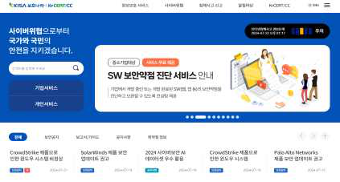

---
<!-- Page 82 -->
| 한국인터넷진흥원 |
82
[그림9] 국가정보원 웹사이트의 보안권고문
관계 법규
공통
정보통신기반 보호법 제10조(보호지침)
개인정보 보호법 제29조(안전조치의무)
개인정보의 안전성 확보조치 기준 제4조(내부 관리계획의 수립·시행 및 점검)
공공기관
국가 정보보안 기본지침 제26조(용역업체보안), 제36조(취약점 조치), 제74조(단말기 보안)
금융회사
전자금융거래법 제21조(안전성의 확보의무)
전자금융감독규정 제8조(인력, 조직, 교육 및 예산), 제15조(해킹 등 방지대책)
ICT기업
정보보호 및 개인정보보호 관리체계 인증 등에 관한 고시 [별표7] 2.2.4 인식제고 및 교육훈련,

#### 2.10.8(패치관리), 2.11.2(취약점 점검 및 조치)

확인 대상(예시)
☐관계 기관, 보안 기관 등에서 공지한 보안 권고 사항 공유 이력
☐보안공지·권고문 공유 현황(예: 그룹웨어, 이메일 시스템)

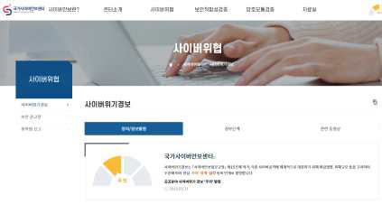

---
<!-- Page 83 -->

## 02. 관리적 분야 기본 항목

2026 주요정보통신기반시설 관리·물리적 취약점 분석·평가 방법 안내서
83
09
인증 및 권한관리
A-39
관리적 분야 > 9. 인증 및 권한관리
담당업무에 따라 시스템에 접근할 수 있는 사용자 계정 및 접근권한 부여 방법과 범위 등을 정의 및 이행
관련 조직
정보보호 부서
세부 설명
§ 기반시설에 접근할 수 있는 사용자의 직무 및 담당업무에 따라 계정 및 접근권한 부여를 달리하고 접근권한의
범위를 결정할 수 있는 방법 등을 정의하여 지침 또는 절차 형태로 문서화하여야 한다.
§ 사용자 계정 및 접근권한의 관리 범위는 기반시설 관련 모든 내부 시스템(예: 서버, 네트워크 장비, 보안 장비
등), 서비스(예: 업무시스템(Application), 홈페이지 등), 모바일기기(예: 스마트폰, 태블릿PC 등), PC(노트북
포함)와 내부망에 대한 유·무선 네트워크 접근통제를 포함하여야 한다.
고려 사항
§ 기반시설에 접근이 가능한 사용자에 대해 분류하고 각 사용자의 직무 및 담당업무에 따라 접근권한, 접근
범위를 부여할 수 있도록 정의하여야 한다.
※ 접근권한 범위 분류 (예시)
- 사용자 계정별
- 직무 및 업무 형태별(인사 담당자, 정보보호 담당자, 시스템 관리자, 경영진, 외부자, 임시직원 등)
- 시스템 기능별(관리 기능, 서비스 기능, 조회 기능, 보안 기능 등)
§ 기반시설 관련 중요정보에 대한 접근권한은 알 필요(need-to-know), 할 필요(need-to-do)의 원칙에 따라 업무상
반드시 필요한 범위에 한하여 최소한의 권한만을 차등 부여하여야 한다.
§ 불필요하거나 과도하게 권한이 부여되지 않도록 직무별 접근권한을 세분화하여야 한다.

---
<!-- Page 84 -->
| 한국인터넷진흥원 |
84
§ 사용자 계정을 등록·변경·삭제하는 경우 공식적인 절차를 수립하여야 하며 다음 절차들을 포함하여야 한다.
- 계정 발급에 대한 타당성 검토 절차
- 관리자 또는 특수권한 사용자의 계정 발급 및 변경에 대한 타당성 검토 절차
- 발급된 계정의 접근 범위 및 권한 등에 대한 사항 검토 절차
- 퇴사, 직무이동 등 인사정보 변경 시 계정 삭제에 대한 절차
- 접근권한 부여·변경·말소 기록에 대한 보관 절차
- 계정 및 접근권한 등록·변경·삭제 절차에 관한 책임자의 승인 절차
- 외부자 및 임시 사용자에 대한 임시 계정 발급 절차
관계 법규
공통
정보통신기반 보호법 제5조(주요정보통신기반시설보호대책의 수립 등)
개인정보 보호법 제29조(안전조치의무)
개인정보의 안전성 확보조치 기준 제5조(접근 권한의 관리), 제6조(접근통제)
공공기관
국가 정보보안 기본지침 제53조(서버 보안), 제75조(계정 관리)
금융회사
전자금융거래법 제21조(안전성의 확보의무)
전자금융감독규정 제13조(전산자료 보호대책)
ICT기업
정보보호 및 개인정보보호 관리체계 인증 등에 관한 고시 [별표7] 2.5.1 사용자 계정 관리, 2.5.5
특수 계정 및 권한 관리
확인 대상(예시)
☐사용자 계정 및 접근 권한 관리 지침
☐사용자 계정 및 권한 관리대장
☐정보시스템별 접근권한 분류표
☐사용자 계정 및 권한 신청서
☐(서식 예시 제39호) 계정등록(변경·삭제) 신청서

---
<!-- Page 85 -->

## 02. 관리적 분야 기본 항목

2026 주요정보통신기반시설 관리·물리적 취약점 분석·평가 방법 안내서
85
A-40
관리적 분야 > 9. 인증 및 권한관리
내·외부에서 시스템 접근 시 안전한 사용자 인증 방법을 사용하고 이에 따라 이행
관련 조직
정보보호 부서
세부 설명
§ 서버 등의 정보시스템에 대한 관리자 및 사용자에 대한 안전한 로그인 및 비밀번호 규칙, 단말기 접속 위치
제한, 1인 1계정 사용 등 사용자 식별 및 인증수단의 안전한 적용 관리 정책을 마련하고 이에 따라 이행하여야
한다.
고려 사항
§ 관계 법규에 따라 ID, 비밀번호 이외의 강화된 사용자 인증방식(예: 인증서, OTP, I-PIN, 휴대폰인증 등)을
요구하는 경우 정보시스템에 따라서 강화된 사용자 인증방식을 적용하여야 한다.
※ 사용자 인증방식 (예시)
- Type1. 지식기반 인증방식 : 비밀번호 등
- Type2. 소유기반 인증방식 : 인증서(PKI), 일회용 비밀번호(OTP), 스마트 카드, 보안토큰 등
- Type3. 생체기반 인증방식 : 지문·홍채·얼굴 인식, FIDO(Fast Identity Online) 등
- 기타 인증 방식 : IP주소·MAC주소·단말기 시리얼 번호·위치정보기반 등으로 사용자 인증 보완통제 적용
- 생체기반 인증방식 사용 시 생체인증정보는 안전하게 보관
§ 싱글사인온 등 다양한 시스템에 대한 사용자 인증을 용이하게 하는 시스템을 운영하는 경우 병목 및 침투(인증
도용 등) 시 피해 확대 가능성이 있으므로 별도의 보안대책(주요 시스템 재인증, 강화된 인증 적용 등)을
마련하여야 한다.
§ 사용자 인증수단만을 적용하는 경우 통신 보안을 위한 암호화 기술의 추가 적용이 필요할 수 있으므로 보안성
강화를 위하여 필요 시 안전한 접속수단(VPN 또는 전용선 등)도 고려하여야 한다.

---
<!-- Page 86 -->
| 한국인터넷진흥원 |
86
§ 안전한 사용자 인증 체계를 구축하기 위해 다음 사항을 참고하여 계정 도용 및 불법적인 인증 시도를 방지하는
방안을 마련하여야 한다.
구분
설명
비고
인증 실패 횟수 제한
일정 횟수 이상 인증 실패 시 접속 중단
Ÿ 사용자 계정 잠금 등의 조치를 취하거나
추가적인 인증수단을 적용하여 정당한 접근
권한자인지 확인
Ÿ 다시 접속하고자 할 때에도 최초의 로그인과
동일한 방법으로 접속
접속 유지시간 제한
접속 후 일정시간 이상 업무처리를 하지 않은
경우 자동 접속 차단
Ÿ 업무용 PC의 화면 보호기 등은 접속차단에
해당하지 않음
동시 접속 제한
동일 계정으로 동시 접속 시 접속 차단 또는
알림
-
불법 로그인 시도
경고
비정상적인 로그인 시도 시 접속 차단 및
알림 발송
Ÿ 미등록 IP 주소 및 새로운 기기에서 접속 시
차단하거나 추가 인증을 요구할 수 있음
Ÿ 다중 로그인 시도 시 관리자에게 알림
Ÿ 주말 및 야간 접속, 관리자 등 특수 권한
사용자 로그인 시 이메일 및 문자 알림
관계 법규
공통
정보통신기반 보호법 제5조(주요정보통신기반시설보호대책의 수립 등)
개인정보 보호법 제29조(안전조치의무)
개인정보의 안전성 확보조치 기준 제5조(접근 권한의 관리), 제6조(접근통제)
공공기관
국가 정보보안 기본지침 제75조(계정 관리), 제76조(비밀번호 관리)
금융회사
전자금융거래법 제21조(안전성의 확보의무),
전자금융감독규정 제14조(정보처리시스템 보호대책), 제15조(해킹 등 방지대책)
ICT기업
정보보호 및 개인정보보호 관리체계 인증 등에 관한 고시 [별표7] 2.5.3 사용자 인증
확인 대상(예시)
☐시스템 로그인 화면
☐로그인 실패 횟수 제한 및 로그인 실패 메시지 화면
☐정보시스템 계정 생성·변경·삭제 승인 절차

---
<!-- Page 87 -->

## 02. 관리적 분야 기본 항목

2026 주요정보통신기반시설 관리·물리적 취약점 분석·평가 방법 안내서
87
A-41
관리적 분야 > 9. 인증 및 권한관리
시스템에 대한 안전한 사용자 비밀번호 관리 절차 및 작성규칙 수립·이행
관련 조직
정보보호 부서
세부 설명
§ 기반시설 내 정보시스템 사용자의 안전한 비밀번호 관리를 위한 관리절차 및 작성규칙을 수립하여 적용하여야
한다.
고려 사항
§ 안전한 비밀번호는 제3자가 쉽게 알아내기 어려운 조합으로 구성되어야 하며, 비밀번호 작성 규칙은 하단의
예시를 참고하되, 서비스의 특성 및 위험도 등을 고려하여 적절한 수준으로 적용하여야 한다.
기준(예시)
설명
조합 규칙 적용
Ÿ 알파벳 대문자와 소문자, 숫자, 특수문자 중 3종류 이상을 조합하여 최소 8자리 이상
Ÿ 1종류의 문자로만 구성한 경우 최소 10자리 이상
※단, 숫자로만 구성할 경우 취약할 수 있음
변경 주기 설정
Ÿ 비밀번호 유효기간을 설정하여 주기적으로 변경
※단, 주기적 변경 여부 및 변경 주기는 위험평가 결과 등을 고려하여 자체적으로 결정
※비밀번호가 제3자에게 노출되었을 경우에는 지체없이 변경하여야함
추측하기 쉬운
비밀번호 설정 제한
Ÿ 동일한 문자 또는 숫자 반복, 키보드 상에서 나란히 있는 문자열, 일련번호, 연속적인 숫자,
생일, 전화번호 등 추측하기 쉬운 개인정보 및 아이디와 비슷한 비밀번호 사용 제한
동일한 비밀번호
재사용 제한
Ÿ 비밀번호 변경 시 이전에 사용한 비밀번호 재사용 제한
비밀번호 공유 제한
Ÿ 동일한 비밀번호를 여러 사람이 공유하여 작성·사용하는 것 제한

---
<!-- Page 88 -->
| 한국인터넷진흥원 |
88
※ 비밀번호 관리절차 (예시)
- 비밀번호 작성규칙 수립
- 주기적으로 비밀번호 변경 및 점검
- 시스템 도입 시 설정된 초기 및 임시 비밀번호 변경 후 사용
- 비밀번호 입력 시 마스킹(‘****’ 또는 ‘●●●●’ 표시 등) 처리
- 종이, 파일, 기기 등에 비밀번호 기록을 제한하고 필요한 경우에는 암호화 등의 보호대책 적용
- 침해사고 발생 또는 노출 의심 시 지체없이 비밀번호 변경
- 비밀번호 변경 시 본인확인 절차 수행
- 관리자 및 특수권한 계정의 비밀번호는 비밀등급에 준하여 관리 등
§ 비밀번호 외의 인증수단을 사용할 경우 해당 인증수단이 비인가자에게 탈취되거나 도용되지 않도록
보호대책을 적용하여야 한다.
관계 법규
공통
정보통신기반 보호법 제5조(주요정보통신기반시설보호대책의 수립 등)
개인정보 보호법 제29조(안전조치의무)
개인정보의 안전성 확보조치 기준 제5조(접근 권한의 관리)
공공기관
국가 정보보안 기본지침 제76조(비밀번호 관리)
금융회사
전자금융거래법 제21조(안전성의 확보의무)
전자금융감독규정 제19조의2(사용자 인증수단 관리), 제34조의2(이용자 비밀번호 관리)
ICT기업
정보보호 및 개인정보보호 관리체계 인증 등에 관한 고시 [별표7] 2.5.5 비밀번호 관리
확인 대상(예시)
☐비밀번호 관리 절차 및 정책
☐정보시스템에 설정된 비밀번호 규칙
☐정보시스템 및 홈페이지 비밀번호 설정 화면

---
<!-- Page 89 -->

## 02. 관리적 분야 기본 항목

2026 주요정보통신기반시설 관리·물리적 취약점 분석·평가 방법 안내서
89
A-42
관리적 분야 > 9. 인증 및 권한관리
시스템에 대한 사용자 계정 및 접근권한의 적정성 검토 기준, 검토 주체, 검토 방법, 주기 등을 수립하여
정기적 검토를 이행
관련 조직
정보보호 부서
세부 설명
§ 기반시설 정보시스템에 등록된 사용자 계정이나 접근권한이 적절하게 할당되었는지 검토 기준, 검토주체, 검
토방법, 주기 등을 수립하여 정기적으로 검토하여야 한다.
§ 정보시스템과 중요정보에 대한 사용자 계정 및 접근권한의 생성·할당·이용·변경·제거·말소 등 이력을 문서화
하고 보관하여야 한다.
§ 사용자 계정 및 접근권한 검토 결과 인사정보에 변경사항이 있거나 불필요한 계정 및 접근권한 등의 사항이 발
견된 경우 재조정하기 위한 절차를 수립하고 이행하여야 한다.
고려 사항
§ 사용자 계정 및 접근권한에 대한 신청정보(신청자, 신청일시, 사용기간 등), 승인정보(승인자, 승인·거부 사유
등), 등록정보(등록일, 등록방법 등), 관리정보(대상 시스템, 권한명, 권한내역 등) 등 필요한 사항을 모두 포함
하여 책임추적성을 확보할 수 있도록 기록하여야 한다.
§ 접근권한 기록은 법적 요구사항 등을 반영하여 최소 3년간 보관하여야 한다.
§ 사용자 계정 및 접근권한의 적정성 검토 기준, 검토주체, 검토방법, 주기 등을 수립하여 정기적 검토를 이행하
여야 하며 검토주기는 반기 1회 이상 수행하는 것을 권고한다.
※ 계정 및 접근권한 검토 시 고려사항 (예시)
- 기반시설의 환경변화 반영 여부
- 퇴직, 직무변경, 휴직 등 인사 변경 여부
- 인사변경 여부에 따라 계정 및 접근권한 회수, 재조정 사항
- 직무변경 시 기존 권한 회수 및 신규 업무 권한 부여 절차 여부
- 외부 인력에 발급·할당된 계정 현황
- 임시 계정 발급·할당·회수 절차 관리 여부
- 업무 수행에 필요한 최소한의 권한 부여에 관한 사항
- 계정 및 접근권한 할당 시 절차 준수 여부
- 계정 및 접근권한 관리대장과 실 시스템 계정 및 권한 일치 여부
- 장기간 미사용 계정(3개월 이하 권고)에 대한 현황 조사 및 조치 여부

---
<!-- Page 90 -->
| 한국인터넷진흥원 |
90
§ 검토 결과 권한의 과다 부여, 절차 위반, 권한 오·남용 등 문제가 발견된 경우 소명요청 및 원인분석 및
소명요청, 보완대책 마련, 보고체계 등 포함한 절차를 마련하고 시행하여야 한다.
§ 계정 및 접근권한 검토 후 변경사항에 대해서는 사용자 및 관리자 등에게 통지하고 문제의 근본 원인을
분석하여 재발 방지 대책을 수립하여야 한다.
관계 법규
공통
정보통신기반 보호법 제5조(주요정보통신기반시설보호대책의 수립 등)
개인정보 보호법 제29조(안전조치의무)
개인정보의 안전성 확보조치 기준 제5조(접근 권한의 관리), 제16조(공공시스템운영기관의 접근 권한의 관리)
공공기관
국가 정보보안 기본지침 제73조(개별사용자 보안)
금융회사
전자금융거래법 제21조(안전성의 확보의무)
전자금융감독규정 제13조(전산자료 보호대책)
ICT기업
정보보호 및 개인정보보호 관리체계 인증 등에 관한 고시 [별표7] 2.5.6 접근권한 검토
확인 대상(예시)
☐사용자 계정 및 접근권한 검토 기준·절차
☐사용자 계정 및 접근권한 검토 내역·결과 보고서
☐접근권한에 대한 문제 발견 시 조치 내역

---
<!-- Page 91 -->

## 02. 관리적 분야 기본 항목

2026 주요정보통신기반시설 관리·물리적 취약점 분석·평가 방법 안내서
91
10
접근통제
A-43
관리적 분야 > 10. 접근통제
네트워크 접근통제 유지를 위해 접근권한 통제, 원격접속 관리, 네트워크 분리 등의 내용을 포함한
네트워크 운영 보안 정책을 수립·이행
관련 조직
정보보호 부서
세부 설명
§ 조직 내 접근할 수 있는 모든 네트워크 경로를 식별하고 네트워크에 대한 비인가 접근과 같은 위험을 효과적으
로 예방하고 대응할 수 있도록 네트워크 운영 보안정책을 수립·이행하여야 한다.
§ 네트워크에 대한 운영보안 지침과 절차는 문서화(접근통제 정책, 원격접근 통제, 네트워크 분리 등의 내용 포
함)되고 제·개정에 대한 승인절차와 개정이력 관리가 이루어져야 한다. 또한 해당 지침과 절차에 따른 네트워
크 운영 보안이 유지되도록 하여야 한다.
§ 해당 지침과 절차의 내용은 관계 법규에서 요구하는 사항을 반영하도록 하여 법적 준거성을 확보할 수 있도록
하고 법규 개정에 따른 지침 및 절차의 개정도 이루어져야 한다.
고려 사항
§ 네트워크 운영보안이란 접근권한 통제, 원격운영 관리, 네트워크 망분리, 네트워크 장비 도입, 성능 및
용량관리, 장애관리, 무선네트워크 보안, 백업관리, 취약점 점검, 정보전송 정책, 저장매체 관리, 패치관리,
로그관리 및 모니터링 등의 네트워크 운영 전반의 보안을 의미한다.
§ 네트워크 운영보안 지침 또는 절차에 해당하는 각각의 운영업무에 대해 보안업무와 관련된 원칙과 절차를
규정하여야 한다.
※ 네트워크 운영업무 별 고려사항
구분
설명
고려사항
네트워크 접근통제
네트워크 시스템에 접근이 허용되는 사용자,
접속 위치, 접근 방법 등을 정의하여 보안정책을
수립·이행하여야 한다.
Ÿ 사용자 계정 및 접근 권한 신청·승인 절차
Ÿ 계정 사용 현황에 대한 정기적인 검토
Ÿ 접속자 IP 주소 제한 등 접속 위치 제한
Ÿ 관리자 등 특수권한에 대한 인증수단(인증서,
OTP 등) 고려
Ÿ SSH, SFTP 등 안전한 접근 수단 적용

---
<!-- Page 92 -->
| 한국인터넷진흥원 |
92
구분
설명
고려사항
Ÿ 동일 네트워크 영역 내 서버 간 접속에 대한
접근통제 사항 등
원격운영 관리
외부 네트워크를 통한 서버, 네트워크 장비,
보안 장비 등 시스템의 원격운영은 원칙적으로
금지하여야 한다. 부득이하게 허용하는 경우에는
다음 사항을 고려하여 정책을 수립·이행하여야
한다.
Ÿ 시스템의 원격운영에 대한 책임자 승인
Ÿ 안전한 인증수단(인증서, 생체인증 기술,
OTP 등) 적용
Ÿ 안전한 접속수단(VPN 등) 적용
Ÿ 문서 암호화제품(DRM 등) 문서 보호대책 적용
Ÿ 원격운영 현황 모니터링
Ÿ 주기적으로 원격접속 기록 분석 및 보고
Ÿ 원격운영 관련 보안 교육 및 훈련
Ÿ 백신, 보안패치 등 접속 단말 보안 적용 등
네트워크 망분리
내부망과 인터넷 망을 분리하여 운영하고자 할
경우
망분리에
관한
보안대책을
수립·이행하여야 한다.
Ÿ 침입차단·탐지시스템 설치 등 비인가자
침입 차단 대책
Ÿ 네트워크 접근관리시스템 설치 등 비인가자
장비 내부망 접속 차단 대책
Ÿ 내부망 정보시스템 인터넷 접속 차단 대책
Ÿ 분리된 망간 자료 전송 체계 구축·운영에
관한 사항 및 전송 기록 보관 사항 등
보안 장비·
네트워크 장비 보안
침입차단·탐지시스템,
스위치,
라우터
등
기반시설 전반에 영향을 미치는 보안·네트워크
장비를 안전하게 운용하기 위한 보호대책을
수립·이행하여야 한다.
Ÿ 물리적으로 안전한 장소에 장비 설치
Ÿ 장비
관리자
및
지정
단말기로부터
접속·관리 허용 사항
Ÿ 최초 설치 시 디폴트 계정 삭제·변경
Ÿ 관리자 계정 별도로 생성·운영
Ÿ 불필요한 서비스 포트, 개별 사용자 계정
차단·삭제
Ÿ 장비 취약점을 정기적으로 점검, 최신 버전
유지
무선 네트워크 보안
무선 네트워크를 구축·운영할 경우 무선 AP
및 네트워크 구간 보안을 위한 보호대책을
수립·이행하여야 한다.
Ÿ 무선침입방지시스템 설치 등 침입 차단 대책
Ÿ 무선
네트워크
구성요소
별
분실·탈취·훼손·오용
등에
대비한
관리적·물리적 보안대책
Ÿ 허용되지 않은 시스템이 해당 무선 네트워크
접속 방지 위한 기술적 보안대책
Ÿ 무선AP의 관리자 접근 통제
Ÿ SSID 숨김 기능 설정
Ÿ IEEE 802.1X, AAA 등 상호인증 위한
인증제품 사용 등

---
<!-- Page 93 -->

## 02. 관리적 분야 기본 항목

2026 주요정보통신기반시설 관리·물리적 취약점 분석·평가 방법 안내서
93
관계 법규
공통
정보통신기반보호법 제5조(주요정보통신기반시설보호대책의 수립 등)
개인정보 보호법 제29조(안전조치의무)
개인정보의 안전성 확보조치 기준 제6조(접근통제)
공공기관
국가 정보보안 기본지침 제40조(내부망·인터넷망 분리), 제59조(원격근무 보안)
금융회사
전자금융거래법 제21조(안전성의 확보의무)
전자금융감독규정 제15조(해킹 등 방지대책), 제18조(IP주소 관리대책)
ICT기업
정보보호 및 개인정보보호 관리체계 인증 등에 관한 고시 [별표7] 2.6. 접근통제
확인 대상(예시)
☐네트워크 구성도
☐네트워크 운영 보안 지침 또는 절차
☐네트워크 운영 보안 지침 또는 절차 제·개정 승인 이력

---
<!-- Page 94 -->
| 한국인터넷진흥원 |
94
A-44
관리적 분야 > 10. 접근통제
시스템의 목적 및 민감도 등에 따라 네트워크를 분리 운영하고 각 영역 간 접근통제를 적용
관련 조직
정보보호 부서
세부 설명
§ 시스템의 목적, 자산의 중요도 및 민감도, 법적 요구사항 등에 따라 네트워크 영역을 물리적·논리적으로
분리(DMZ, 서버팜, DB존, 개발존 등)하여 운영하고 각 영역 간 접근통제를 적용하여야 한다.
고려 사항
§ 접근통제 정책에 따라 분리된 네트워크 영역 간에는 방화벽, 네트워크 장비의 ACL 등을 활용하여 네트워크
영역 간 업무수행에 필요한 서비스의 접근만 허용하도록 통제하여야 한다.
§ 기반시설 내 중요시스템을 불가피하게 다른 정보통신망과 연결하여야 하는 경우 외부로부터 침입 및 악성코드
감염을 방지하기 위해 인터넷과 분리하는 방안을 강구하고 불가피한 사유로 인터넷 연결이 필요한 경우
보안성검토 등을 통해 보안성을 확보하여야 한다.
§ 네트워크 대역별 IP주소 부여 기준을 수립하고 주요 시스템이 외부와 연결이 필요없는 경우 사설 IP를
사용하여 외부 접근을 차단하며 IP주소 할당 현황을 최신으로 유지하여야 한다. 이에 대한 사항은 유출되지
않도록 대외비 이상으로 안전하게 관리하여야 한다.
§ 내부망에서의 주소 체계는 사설 IP주소 체계를 사용하고 NAT(Network Address Translation)를 사용하여 내부
주소 체계가 노출되지 않도록 관리한다. 사설 IP주소는 국제표준에 따른 대역을 사용한다.
※ 사설 IP 주소 대역
구분
대역
A class

#### 10.0.0.1

~

#### 10.255.255.255

B class

#### 172.16.0.1

~

#### 172.31.255.255

C class

#### 192.168.0.1

~

#### 192.168.255.255

---
<!-- Page 95 -->

## 02. 관리적 분야 기본 항목

2026 주요정보통신기반시설 관리·물리적 취약점 분석·평가 방법 안내서
95
관계 법규
공통
정보통신기반 보호법 제5조(주요정보통신기반시설보호대책의 수립 등)
개인정보 보호법 제29조(안전조치의무)
개인정보의 안전성 확보조치 기준 제6조(접근통제)
공공기관
국가 정보보안 기본지침 제40조(내부망·인터넷망 분리)
금융회사
전자금융거래법 제21조(안전성의 확보의무)
전자금융감독규정 제18조(IP주소 관리대책)
ICT기업
정보보호 및 개인정보보호 관리체계 인증 등에 관한 고시 [별표7] 2.6.1 네트워크 접근
확인 대상(예시)
☐네트워크 구성도(IP주소 포함)
☐IP주소 관리대장
☐네트워크 및 방화벽 등의 접근규칙 설정

---
<!-- Page 96 -->
| 한국인터넷진흥원 |
96
A-45
관리적 분야 > 10. 접근통제
접근통제 규칙은 관리자의 승인을 거쳐서 설정 또는 변경
관련 조직
정보보호 부서
세부 설명
§ 주요 네트워크 장비에 대한 ACL 및 방화벽의 정책(Rule) 변경이 요구될 경우 내부 승인절차에 따라 정책변경이
이루어져야 한다.
§ 특히 방화벽 등의 주요 보안 장비에 대한 정책 변경이 이루어지는 경우는 내·외부 서비스에 대한 영향 및
보안성을 검토하고 방화벽을 운용하는 부서장 등의 승인을 거쳐 변경이 이루어지도록 하여야 한다.
고려 사항
§ 방화벽 이외에도 접근통제 규칙(예: ACL 또는 Rule)을 적용하는 시스템(서버, 네트워크시스템, 보안시스템
등)이 있다면 점검대상에 포함하여야 한다.
관계 법규
공통
정보통신기반 보호법 제10조(보호지침)
개인정보 보호법 제29조(안전조치의무)
개인정보의 안전성 확보조치 기준 제6조(접근통제)
공공기관
국가 정보보안 기본지침 제40조(내부망·인터넷망 분리), 제42조(보안‧네트워크장비 보안)
금융회사
전자금융거래법 제21조(안전성의 확보의무)
전자금융감독규정 제15조(해킹 등 방지대책)
ICT기업
정보보호 및 개인정보보호 관리체계 인증 등에 관한 고시 [별표7] 2.9.1 변경관리
확인 대상
☐네트워크 장비 ACL 변경이력 및 승인 절차
☐방화벽 접근규칙(Rule) 변경이력 및 승인절차
☐(서식 예시 제38호) 침입차단시스템 서비스포트 허용/차단 요청서

---
<!-- Page 97 -->

## 02. 관리적 분야 기본 항목

2026 주요정보통신기반시설 관리·물리적 취약점 분석·평가 방법 안내서
97
A-46
관리적 분야 > 10. 접근통제
접근통제 정책의 적합성 여부에 대해 주기적 검토
관련 조직
정보보호 부서
세부 설명
§ 접근통제 정책을 주기적으로 검토하여 비인가자에 대한 접근통제 정책이 적합한지 확인하여야 한다.
§ 네트워크 장비, 보안 장비에 적용된 접근규칙(Rule)의 적절성을 주기적으로 검토하여 불필요한 접근규칙을
제거하는 등의 조치가 이루어져야 한다.
§ 접근통제 정책에 대한 검토 기준은 내부 기본 접근통제 정책을 토대로 자체적인 검토 기준을 수립하여 시행할
수 있으며, 검토 주기는 검토 대상과 범위에 따라 다를 수 있으나 최소 반기 또는 연간 단위로 정하는 것이 좋다.
§ 이 경우 주요 보안 장비(예: 방화벽)에 대하여 불필요한 관리접근 계정 및 권한 여부를 확인하고 개선하기 위해
관리접근 계정 및 권한의 타당성 검토도 함께 이루어지도록 하여야 한다.
고려 사항
§ 본 점검항목은 접근계정에 대한 권한 검토보다는 네트워크 등의 접근통제 정책에 대한 점검을 요구하는
항목이다. 따라서 다음의 접근통제 규칙(보안 장비 자체의 접근권한 포함) 검토 기준을 참고하여 자체 환경에
적합한 검토 기준을 수립하도록 한다.
- 불필요한 네트워크 접근통제 규칙
- 기간이 만료된 방화벽 접근통제 규칙
- 타 정책과 중복되거나 일부 겹치는 네트워크 및 방화벽 접근통제 규칙
- 기간이 만료된 IP 차단 정책(1년 이상 된 악성코드 경유지 IP 등)
- 보안 장비 사용자 및 관리자의 불필요한 ID 존재 여부
- 인원 및 IP 변경에 따른 방화벽 접속 관리 IP 변경 여부 등
§ 접근통제 정책의 적합성 여부를 검토할 수 있도록 접근통제 정책의 등록‧갱신 시에는 일시, 내용, 대상시스템,
사유, 요청부서(또는 요청자) 등 이력을 기록하여 관리할 필요가 있다.
관계 법규
공통
정보통신기반 보호법 제10조(보호지침)
개인정보 보호법 제29조(안전조치의무)
개인정보의 안전성 확보조치 기준 제6조(접근통제)

---
<!-- Page 98 -->
| 한국인터넷진흥원 |
98
확인 대상(예시)
☐정보시스템(네트워크 및 보안 장비 포함) 목록표
☐네트워크 및 보안 장비 접근통제 규칙 주기적 검토 내역
☐네트워크 및 보안 장비에 대한 관리 계정 권한 주기적 검토 내역
☐(서식 예시 제37호) 정보보호시스템 접근규칙 검토 결과서
☐(서식 예시 제30호) 자산목록표
공공기관
국가 정보보안 기본지침 제42조(보안·네트워크 장비 보안)
금융회사
전자금융거래법 제21조(안전성의 확보의무)
전자금융감독규정 제15조(해킹 등 방지대책)
ICT기업
정보보호 및 개인정보보호 관리체계 인증 등에 관한 고시 [별표7] 2.6.1 네트워크 접근, 2.6.2
정보시스템 접근, 2.10.1 보안시스템 운영

---
<!-- Page 99 -->

## 02. 관리적 분야 기본 항목

2026 주요정보통신기반시설 관리·물리적 취약점 분석·평가 방법 안내서
99
A-47
관리적 분야 > 10. 접근통제
방화벽, 침입탐지시스템 등 안전한 네트워크를 위한 대책을 마련
관련 조직
정보보호 부서, 시스템운영 부서
세부 설명
§ 네트워크의 비인가 접근 등 관련 위험을 예방·대응할 수 있도록 네트워크 접근에 대한 보안대책을 수립
·이행하여야 한다.
§ 인터넷 등 내·외부로부터의 침해위협을 차단하기 위하여 침입차단 및 침입탐지 시스템 등의 네트워크
접근통제 시스템을 도입 및 운영하여야 한다.
§ 업무영역에서 제어시스템의 운영 관련 정보가 필요한 경우, 제어망에서 업무망으로 전송이 가능하도록 일방향
전송장비를 설치하여 운영할 수 있으나, 업무망에서 제어망으로의 접근은 원천적 차단으로 보안을 유지하여야
한다.
고려 사항
§ 서비스, 사용자 그룹, 자산의 중요도, 법적 요구사항에 따라 네트워크 영역을 물리적 또는 논리적으로 분리하고
각 영역 간 접근통제를 적용하도록 한다.
§ 접근통제 정책에 따라 분리된 네트워크 영역 간에는 침입차단시스템, 네트워크 장비 ACL 등을 활용하여
네트워크 영역 간 업무수행에 필요한 서비스의 접근만 허용하도록 통제한다.
관계 법규
공통
정보통신기반 보호법 제10조(보호지침)
개인정보 보호법 제29조(안전조치의무)
개인정보의 안전성 확보조치 기준 제6조(접근통제)
공공기관
국가 정보보안 기본지침 제42조(보안·네트워크 장비 보안)
금융회사
전자금융거래법 제21조(안전성의 확보의무)
전자금융감독규정 제15조(해킹 등 방지대책)
ICT기업
정보통신망 이용촉진 및 정보보호 등에 관한 법률 제45조(정보통신망의 안정성 확보 등)
정보보호 및 개인정보보호 관리체계 인증 등에 관한 고시 [별표7] 2.6.1 네트워크 접근

---
<!-- Page 100 -->
| 한국인터넷진흥원 |
100
확인 대상(예시)
☐네트워크 구성도
☐네트워크 및 방화벽 등 접근규칙 설정
☐침입차단 및 침입탐지 시스템 도입 현황(CC인증서 포함)
☐침입차단 및 침입탐지 시스템 등 정보보호시스템

---
<!-- Page 101 -->

## 02. 관리적 분야 기본 항목

2026 주요정보통신기반시설 관리·물리적 취약점 분석·평가 방법 안내서
101
A-48
관리적 분야 > 10. 접근통제
외부 네트워크를 통한 원격작업(재택근무, 장애대응 등)에 대한 책임자 승인, 작업내용 및 범위, 기간
설정, 접근 로그 기록/검토 등이 포함된 정책(절차) 수립·이행
관련 조직
정보보호 부서, 시스템운영 부서
세부 설명
§ 서버, 네트워크 장비, 보안 장비, PC 등의 정보시스템 및 내부 업무시스템(Application)에 대해 인터넷 등
외부통신망을 통한 원격접속을 원칙적으로 금지하여야 하나 재택근무, 장애대응 등의 사유로 원격작업을
불가피하게 허용하는 경우 사용자의 접근신청, 책임자 승인 등을 포함하여 원격접속 보안 대책(예: 지침 또는
절차)을 수립하여야 한다.
§ 원격접속 시 통신 구간 암호화, 강화된 사용자 인증 및 안전한 접속수단(예: VPN 등)을 적용하여야 한다.
§ 유지보수 등의 목적으로 인터넷 등 외부에서 대상 시스템에 원격접속이 이루어지는 경우는 상시 접속이 아닌
해당 업무 기간 및 시간에만 접속이 이루어지도록 하여야 한다.
고려 사항
§ 인터넷 등 정보통신망을 통하여 외부에서 기반시설에 접속하려는 경우에는 법적 요구사항에 따라 안전한
인증수단을 적용하여야 한다.
- 안전한 인증수단 적용이란 개인정보처리시스템에 사용자계정과 비밀번호를 입력하여 정당한 개인정보취급자
여부를 식별·인증하는 절차 이외에 추가적인 인증 수단의 적용을 말함
- 안전한 인증수단 예시 : 인증서, 보안토큰, 일회용 비밀번호(OTP) 등
- 개인정보취급자가 정보통신망을 통하여 외부에서 개인정보처리시스템 접속 시 인증수단 적용 관련 법적 요구사항 준수
관계 법규
공통
개인정보 보호법 제29조(안전조치의무)
개인정보의 안전성 확보조치 기준 제6조(접근통제)
공공기관
국가 정보보안 기본지침 제59조(원격근무 보안)
금융회사
전자금융거래법 제21조(안전성의 확보의무)
전자금융감독규정 제15조(해킹 등 방지대책)
ICT기업
정보통신망법 제45조(정보통신망의 안정성 확보 등)
정보보호 및 개인정보보호 관리체계 인증 등에 관한 고시 [별표7] 2.6.6 원격접근 통제

---
<!-- Page 102 -->
| 한국인터넷진흥원 |
102
확인 대상(예시)
☐원격접속에 대한 접근통제 기준 지침 또는 절차
☐원격접속수단(예: VPN) 운용 이력
☐VPN 운영 현황
☐원격접속 제한 또는 예외 허용 시스템(예: 방화벽, VPN 등)
☐원격 운영 및 접속에 대한 책임자의 승인(1년 이상 보존)

---
<!-- Page 103 -->

## 02. 관리적 분야 기본 항목

2026 주요정보통신기반시설 관리·물리적 취약점 분석·평가 방법 안내서
103
A-49
관리적 분야 > 10. 접근통제
네트워크를 통해 시스템을 운영하는 경우 원칙적으로 시스템 관리는 내부의 특정 단말기에서만 할 수
있도록 제한
관련 조직
정보보호 부서, 시스템운영 부서
세부 설명
§ 정보시스템을 네트워크 상에서 접근하여야 하는 관리자는 내부의 특정 단말기(업무PC)에서만 대상 시스템을
접근할 수 있도록 하는 조치(예: IP주소 및 MAC주소 지정)가 이루어져야 한다.
§ 또한 해당 단말은 인터넷을 차단하여 관리용 단말을 통한 외부 해킹(예: 악성코드 감염 등)을 방지하여야 한다.
§ 정보시스템의 가동기록(접속일시, 접속자 등)은 일정기간(예: 1년 이상) 보관하고 주기적(예: 월 1회 이상)으로
점검하여야 한다.
고려 사항
§ 관리용 단말이란, 해당 단말을 사용하는 직원이 관리대상 시스템에 대한 운영체제 관리권한(예: root,
administrator 등)을 통해 대상 시스템의 설정, 정보 등을 변경할 목적으로 사용하는 컴퓨터를 의미한다.
관계 법규
공통
정보통신기반 보호법 제10조(보호지침)
개인정보 보호법 제29조(안전조치의무)
개인정보의 안전성 확보조치 기준 제6조(접근통제)
공공기관
국가 정보보안 기본지침 제42조(보안·네트워크 장비 보안), 제52조(지정 단말기를 통한 온라인 유지보수)
금융회사
전자금융거래법 제21조(안전성의 확보의무)
전자금융감독규정 제12조(단말기 보호대책)
ICT기업
정보통신망 이용촉진 및 정보보호 등에 관한 법률 제45조(정보통신망의 안정성 확보 등)
정보보호 및 개인정보보호 관리체계 인증 등에 관한 고시 [별표7] 2.6.1 네트워크 접근, 2.6.6 원격접근 통제
확인 대상(예시)
☐정보시스템 보안 정책(또는 지침)
☐정보시스템별 관리용 단말 지정 현황
☐시스템 관리용 단말(PC) 및 콘솔
☐정보시스템 가동기록 점검 내역

---
<!-- Page 104 -->
| 한국인터넷진흥원 |
104
A-50
관리적 분야 > 10. 접근통제
외부에서 내부 시스템의 기능을 사용할 수 있다면 VPN 등 안전한 접속 수단 적용
관련 조직
정보보호 부서, 시스템운영 부서
세부 설명
§ 인터넷 등 외부에서 내부 시스템에 대한 접근이 이루어지는 경우, 안전한 접속수단(VPN 등)을 사용하여
비인가자의 해킹 등 침해사고를 예방하기 위한 보호조치를 적용하여야 한다.
§ 외부 접속 시 안전한 접속수단(예: VPN, 전용망 등) 적요에 관한 사항을 내부 정책에 명시하고, 이를 위한
장비를 구축하고 운영하여야 한다.
고려 사항
§ 물리적으로 떨어진 IDC, 지사, 대리점, 협력업체, 고객센터 등과의 네트워크 연결 시 전용회선이나 다음과
같이 VPN(가상사설망) 등을 활용하여 안전한 접속환경을 구성하여야 한다.
- VPN(Virtual Private Network)은 기업이나 개인이 공중망(인터넷)을 이용하여 경제적이면서도 사설망과 같이
안전하게 통신할 수 있는 보안 솔루션
- 통신 상대자들끼리 암호화된 채널을 형성하여 외부에서 데이터 도청 및 변조를 방지
- 인증서, OTP(One Time Password) 등 사용자 인증방식을 추가하여 원격접속에 대한 보안 강화 가능
[그림10] 가상사설망

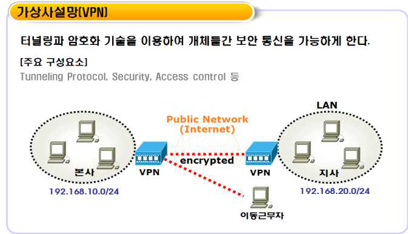

---
<!-- Page 105 -->

## 02. 관리적 분야 기본 항목

2026 주요정보통신기반시설 관리·물리적 취약점 분석·평가 방법 안내서
105
§ VPN 접근계정은 업무목적에 필요한 최소한의 기간, 권한만을 할당하고 해당 기간이 만료되면 접근할 수
없도록 설정한다.
§ VPN의 접근통제(ACL) 설정을 통해 업무상 필요한 내부시스템만 외부에서 접근할 수 있도록 하여야 한다.
관계 법규
공통
정보통신기반 보호법 제10조(보호지침)
개인정보 보호법 제29조(안전조치의무)
개인정보의 안전성 확보조치 기준 제6조(접근통제)
공공기관
국가 정보보안 기본지침 제59조(원격근무 보안)
금융회사
전자금융거래법 제21조(안전성의 확보의무)
전자금융감독규정 제15조(해킹 등 방지대책)
ICT기업
정보통신망 이용촉진 및 정보보호 등에 관한 법률 제45조(정보통신망의 안정성 확보 등)
정보보호 및 개인정보보호 관리체계 인증 등에 관한 고시 [별표7] 2.6.1 네트워크 접근, 2.6.6
원격접근 통제
확인 대상(예시)
☐네트워크 구성도
☐VPN 장비의 접근 계정(목록) 및 권한(사용기간, 접속대상 등) 설정
☐VPN 접근제어 정책 설정 현황
☐VPN 등 사외 접속 신청서

---
<!-- Page 106 -->
| 한국인터넷진흥원 |
106
A-51
관리적 분야 > 10. 접근통제
내부망(업무망)과 인터넷망을 분리하여 사용
관련 조직
정보보호 부서, 시스템운영 부서
세부 설명
§ 기반시설의 업무망에 대한 외부로부터의 침해 위협을 차단하기 위하여 내부 업무망과 인터넷망은 각각
분리하여 운영하여야 한다. 이 경우 유선은 물론 무선 인터넷 접속까지 차단할 수 있는 조치(예: PC의
무선랜카드 제거, 무선방화벽 운영 등)가 함께 이루어져야 한다.
고려 사항
§ 인터넷망 차단 조치는 물리적 방식(예: 네트워크가 분리된 2대의 PC 구성) 또는 논리적 방식(예: VDI와 같은
가상화 기술 활용)으로 수행할 수 있으며, 분리된 영역 간에는 접근 통제를 적용하여야 한다.
관계 법규
공통
정보통신기반 보호법 제10조(보호지침)
개인정보 보호법 제29조(안전조치의무)
개인정보의 안전성 확보조치 기준 제6조(접근통제)
공공기관
국가 정보보안 기본지침 제40조(내부망·인터넷망 분리)
금융회사
전자금융거래법 제21조(안전성의 확보의무)
전자금융감독규정 제15조(해킹 등 방지대책)
ICT기업
정보통신망 이용촉진 및 정보보호 등에 관한 법률 제45조(정보통신망의 안정성 확보 등)
정보보호 및 개인정보보호 관리체계 인증 등에 관한 고시 [별표7] 2.6.7 인터넷 접속 통제
확인 대상(예시)
☐네트워크 구성도
☐인터넷망 접속에 대한 통제 정책
☐인터넷망 차단조치 대상자 목록
☐인터넷 접속기록 모니터링 이력

---
<!-- Page 107 -->

## 02. 관리적 분야 기본 항목

2026 주요정보통신기반시설 관리·물리적 취약점 분석·평가 방법 안내서
107
A-52
관리적 분야 > 10. 접근통제
망분리 후 안전한 자료전송을 위한 시스템을 도입하여 사용
관련 조직
정보보호 부서, 시스템운영 부서
세부 설명
§ 내부 업무망의 인터넷 차단에 따라 외부로 자료 전송이 필요한 경우, 안전한 자료전송을 위한 시스템을
도입(예: 망간 자료전송시스템)하여 보호조치가 이루어져야 한다.
§ 이 경우, 망간 자료전송 시스템의 관리 설정(예: 용량제한, 기간제한, 파일확장자(포맷) 제한 등)을 통해 오용 및
남용을 최대한 방지해야 한다.
§ 망간 자료전송 시스템 이용 시, 결재권자의 사전 또는 사후 승인 절차를 마련하고 이를 준수하여야 한다.
§ 망분리된 환경에서 자료 전송의 안전성을 확보하고 보안사고를 사전에 방지하기 위해 자료전송 로그
(비정상적인 트래픽, 전송실패기록, 승인내역 등)를 주기적으로 모니터링하여야 한다.
고려 사항
§ 공공기관은 망간 자료전송시스템을 운영하여야 하며, 전송로그와 원본파일 보관기간은 국가정보원 지침에
규정(원본파일은 3개월 이상, 전송기록은 6개월 이상 유지)을 따라야 한다.
§ 공공기관 이외의 기관은 관계 법규에서 정하는 경우를 제외하고, 자체적인 관리 정책을 설정하여 운영한다.
§ 인터넷망에서 내부망으로 자료 전송이 필요한 경우, 악성프로그램 탐지 등의 조치를 통해 악성코드가
내부망으로 전파되지 않도록 관리한다.
관계 법규
공통
정보통신기반 보호법 제10조(보호지침)
공공기관
국가 정보보안 기본지침 제40조(내부망·인터넷망 분리)
금융회사
전자금융거래법 제21조(안전성의 확보의무)
전자금융감독규정 제15조(해킹 등 방지대책)
ICT기업
정보통신망 이용촉진 및 정보보호 등에 관한 법률 제45조(정보통신망의 안정성 확보 등)
정보보호 및 개인정보보호 관리체계 인증 등에 관한 고시 [별표7] 2.6.7 인터넷 접속 통제

---
<!-- Page 108 -->
| 한국인터넷진흥원 |
108
확인 대상(예시)
☐망간 자료전송시스템의 (정책)관리 설정 내용
☐망간 자료전송시스템의 신청·승인내역 및 사용자 이용내역 (정기)검토결과서
☐자료 전송 로그 모니터링 내역

---
<!-- Page 109 -->

## 02. 관리적 분야 기본 항목

2026 주요정보통신기반시설 관리·물리적 취약점 분석·평가 방법 안내서
109
A-53
관리적 분야 > 10. 접근통제
인터넷 전화망과 일반 전산망은 분리하여 운용
관련 조직
정보보호 부서, 시스템운영 부서
세부 설명
§ 인터넷 전화망(음성 네트워크)을 통한 침해위협으로부터 내부 전산망을 보호하기 위해 인터넷 전화망과 일반
전산망(데이터 네트워크)은 분리하여 운영하여야 한다.
§ 인터넷 전화망을 이용할 경우 제어신호 및 통화내용 암호화와 함께 인터넷 전화 전용 침입차단시스템 등
보안대책을 수립하고 시행하여야 한다.
고려 사항
§ 네트워크 분리는 물리적으로 분리하는 방법도 가능하지만, 경제성 등을 고려할 때 VLAN을 설정하여
네트워크를 논리적으로 분리하여 그룹 내에서만 통신이 가능하도록 설정할 수 있다.
관계 법규
공통
정보통신기반 보호법 제10조(보호지침)
공공기관
국가 정보보안 기본지침 제40조(내부망·인터넷망 분리), 제46조(인터넷전화 보안)
금융회사
전자금융거래법 제21조(안전성의 확보의무)
전자금융감독규정 제18조(IP주소 관리대책)
ICT기업
정보통신망 이용촉진 및 정보보호 등에 관한 법률 제45조(정보통신망의 안정성 확보 등)
정보보호 및 개인정보보호 관리체계 인증 등에 관한 고시 [별표7] 2.6.7 인터넷 접속 통제
확인 대상(예시)
☐네트워크 구성도(IP주소 포함)
☐방화벽 또는 VLAN이 설정된 네트워크 장비의 해당 접근규칙
☐인터넷전화(IP전화)망 IP할당 내역
☐제어신호 및 통화내용 암호화
☐(참고 자료 제15호) 인터넷 전화망과 전산망의 분리 지침

---
<!-- Page 110 -->
| 한국인터넷진흥원 |
110
A-54
관리적 분야 > 10. 접근통제
내부에 상주하는 외부자에 대하여 네트워크를 분리하여 운영
관련 조직
정보보호 부서, 해당 사업 부서
세부 설명
§ 내부에 상주하는 외부자가 사용하는 네트워크는 다른 업무망과 분리하여 운영하여야 하며, 기반시설에 접근
가능한 내부망에 해당한다면 인터넷 차단 등의 추가 조치를 하여야 한다.
§ 용역사업 수행 중 사용하는 PC 및 서버는 인터넷 연결을 금지하되, 연결이 필요한 경우 기관의 통제하에
제한적으로 사용하여야 한다.
고려 사항
§ 파견 근로자가 내부 직원과 동일한 사무실에서 업무하는 경우 내부 직원과 동일한 수준의 보안조치를
적용하여야 하고, 용역사업 시 내부에 상주하는 외부 직원에게 별도의 사무공간과 업무망과 분리된
네트워크를 제공하여야 한다.
관계 법규
공통
정보통신기반 보호법 제10조(보호지침)
개인정보 보호법 제29조(안전조치의무)
개인정보의 안전성 확보조치 기준 제6조(접근통제)
공공기관
국가 정보보안 기본지침 제26조(용역업체 보안), 제27조의2(발주기관내 작업장소 보안)
금융회사
전자금융거래법 제21조(안전성의 확보의무)
전자금융감독규정 제18조(IP주소 관리대책), 제60조(외부주문등에 대한 기준)
ICT기업
정보통신망 이용촉진 및 정보보호 등에 관한 법률 제45조(정보통신망의 안정성 확보 등)
정보보호 및 개인정보보호 관리체계 인증 등에 관한 고시 [별표7] 2.6.1 네트워크 접근
확인 대상(예시)
☐네트워크 구성도(외주용역의 업무망 IP주소 포함)
☐네트워크 및 방화벽 등의 접근규칙 설정
☐네트워크 보안지침

---
<!-- Page 111 -->

## 02. 관리적 분야 기본 항목

2026 주요정보통신기반시설 관리·물리적 취약점 분석·평가 방법 안내서
111
A-55
관리적 분야 > 10. 접근통제
무선네트워크 사용 시 상급기관장의 보안성 검토를 필하거나 안전한 암호화 알고리즘 및 암호키 설정
등의 적절한 보안조치를 적용
관련 조직
정보보호 부서
세부 설명
§ 무선AP(Access Point)를 사용하는 경우 정보통신기기(예: 태블릿PC, 스마트폰 등)를 통해 발생할 수 있는
불법접속 및 무선해킹 등의 위협으로부터 자산을 안전하게 보호하기 위하여 무선네트워크 도입 및 보안관리
지침을 수립하여야 한다.
§ 무선네트워크를 신규로 도입·설치할 경우, 관계 법령 등에 따라 보안성검토 또는 승인 절차를 마련하고 무선
네트워크 구축에 따른 보호대책을 적용하여야 한다.
§ 무선네트워크는 운영 전, 사전에 정의된 네트워크 보안지침에 따라 기술적인 보호조치를 적용하여야 한다.
공공기관은 국가 정보보안 기본지침을 적용하고 금융회사는 전자금융감독규정에 따른 기술적 보호조치를
적용하여야 한다.
고려 사항
§ 무선네트워크를 업무적으로 사용하는 경우 무선 AP 및 네트워크 구간 보안을 위하여 인증, 송수신 데이터
암호화 등 다음의 사항을 고려하여 보호대책을 수립·이행한다.
- 무선네트워크 장비(AP 등) 목록 관리
- 사용자 인증 및 송수신 시 안전한 암호화 기능 설정(WPA2-Enterprise mode, WPA3-Enterprise mode 등)
- 무선 AP 접속 단말 인증 방안(MAC 인증 등)
- SSID 숨김 기능 설정
- 무선네트워크에 대한 ACL 설정
- 무선 AP의 관리자 접근 통제(IP제한) 등
§ 금융회사의 경우 전자금융감독규정에 따라 전산실 내에는 무선네트워크를 설치하는 것을 원칙적으로 금지한다.
관계 법규
공통
정보통신기반 보호법 제10조(보호지침)
개인정보 보호법 제29조(안전조치의무)
개인정보의 안전성 확보조치 기준 제6조(접근통제)

---
<!-- Page 112 -->
| 한국인터넷진흥원 |
112
확인 대상(예시)
☐무선랜(Wi-Fi 등) 운용 현황(예: 네트워크 구성도, 무선AP 목록 등)
☐무선네트워크 보안지침 또는 가이드
☐보안성검토 이력
☐무선AP에 대한 기술적 보호조치 적용 증적(예: 해당 설정화면 캡쳐)
☐무선AP·비인가 무선AP 차단시스템
☐(서식 예시 제7호) 무선랜 설치 신청서
☐(서식 예시 제8호) 무선랜 설치 확인서
☐(서식 예시 제10호) 무선랜 AP 관리대장
☐(서식 예시 제11호) 무선랜 AP 사용관리대장
공공기관
국가 정보보안 기본지침 제43조(무선랜 보안)
금융회사
전자금융거래법 제21조(안전성의 확보의무)
전자금융감독규정 제11조(전산실 등에 관한 사항), 제15조(해킹 등 방지대책)
ICT기업
정보통신망 이용촉진 및 정보보호 등에 관한 법률 제45조(정보통신망의 안정성 확보 등)
정보보호 및 개인정보보호 관리체계 인증 등에 관한 고시 [별표7] 2.6.5 무선 네트워크 접근

---
<!-- Page 113 -->

## 02. 관리적 분야 기본 항목

2026 주요정보통신기반시설 관리·물리적 취약점 분석·평가 방법 안내서
113
A-56
관리적 분야 > 10. 접근통제
인가된 임직원만이 인가된 단말을 이용하여 무선네트워크를 사용할 수 있도록 사용 신청 및 해지
절차를 수립·이행
관련 조직
정보보호 부서
세부 설명
§ 인가된 임직원만이 인가된 단말을 이용하여 무선네트워크를 사용할 수 있도록 사용 신청 및 해지 절차(사용자
및 접속 단말 등록 등)를 수립·이행하여야 한다.
§ 퇴직, 기간 만료 등의 사유로 무선네트워크 사용이 필요 없는 경우 접근권한 해지 절차를 통해 지체없이
접근을 차단하고, 불필요한 권한 여부를 주기적으로 검토하여야 한다.
고려 사항
§ 외부인의 접근이 가능한 공공장소에서는 무선네트워크를 사용할 때 내부 임직원이 사용하는 무선네트워크와
분리하여 제공하여야 한다.
관계 법규
공통
정보통신기반 보호법 제10조(보호지침)
개인정보 보호법 제29조(안전조치의무)
개인정보의 안전성 확보조치 기준 제6조(접근통제)
공공기관
국가 정보보안 기본지침 제43조(무선랜 보안)
금융회사
전자금융거래법 제21조(안전성의 확보의무)
전자금융감독규정 제15조(해킹 등 방지대책)
ICT기업
정보통신망 이용촉진 및 정보보호 등에 관한 법률 제45조(정보통신망의 안정성 확보 등)
정보보호 및 개인정보보호 관리체계 인증 등에 관한 고시 [별표7] 2.6.5 무선 네트워크 접근
확인 대상(예시)
☐무선네트워크 사용 절차
☐무선네트워크 사용 신청·승인 이력
☐(참고 자료 제9호) 무선랜 보안관리 절차서 (예시)
☐(서식 예시 제9호) 무선랜 사용 신청서
☐(서식 예시 제10호) 무선랜 AP 관리대장
☐(서식 예시 제11호) 무선랜 AP 사용관리대장

---
<!-- Page 114 -->
| 한국인터넷진흥원 |
114
A-57
관리적 분야 > 10. 접근통제
무선네트워크 무단 사용 여부, 비인가 무선 중계기(AP) 설치 여부, 우회 정보통신망 사용 차단 여부
등을 주기적으로 점검
관련 조직
정보보호 부서
세부 설명
§ 무선네트워크를 운영할 경우, 사전 정의된 네트워크 보안지침을 위반하는 사례가 발생할 수 있으므로
무선네트워크 AP에 공식적으로 등록되지 않은 이용자나 사용기간이 만료된 이용자가 있는지 등을
주기적으로 점검하여야 한다.
§ 무선네트워크 AP의 설치 허가를 받지 않고 운영하는 비인가 AP가 있는지 주기적으로 점검하여야 한다.
전문적인 장비가 없어도 노트북의 무선네트워크 카드에 감지되는 AP의 신호 등을 기반으로 인접 공간에
설치된 비인가 AP를 탐색 하여야 한다.
§ 업무PC를 통해 근거리에 위치한 타 건물, 사무실 등에 설치된 AP를 연결할 경우 기관 내부 네트워크를
우회하거나 악성코드 감염 등의 위협이 발생할 수 있으므로, 이를 방지하기 위한 보호대책(예: 업무PC의
무선네트워크 장치 동작 해제)을 고려하여야 한다.
고려 사항
§ 조직 내 허가받지 않은 무선 AP를 탐지하고 차단하기 위해 WIPS(무선침입방지시스템)를 설치·운영할 수
있다. WIPS는 비인가 노드의 무선 네트워크 접근을 차단하는 시스템으로 네트워크 보안을 강화하고 무단
접근 및 잠재적 위협으로부터 자산을 보호하는 기능을 수행한다.
관계 법규
공통
정보통신기반 보호법 제10조(보호지침)
개인정보 보호법 제29조(안전조치의무)
개인정보의 안전성 확보조치 기준 제6조(접근통제)
공공기관
국가 정보보안 기본지침 제43조(무선랜 보안)
금융회사
전자금융거래법 제21조(안전성의 확보의무)
전자금융감독규정 제15조(해킹 등 방지대책)
ICT기업
정보통신망 이용촉진 및 정보보호 등에 관한 법률 제45조(정보통신망의 안정성 확보 등)
정보보호 및 개인정보보호 관리체계 인증 등에 관한 고시 [별표7] 2.6.5 무선 네트워크 접근

---
<!-- Page 115 -->

## 02. 관리적 분야 기본 항목

2026 주요정보통신기반시설 관리·물리적 취약점 분석·평가 방법 안내서
115
확인 대상(예시)
☐네트워크 구성도
☐연 1회 이상의 무선네트워크 보안점검 결과서 및 개선 결과
☐비인가 무선AP 차단시스템 운영 현황
☐무선AP·비인가 무선AP 차단시스템
☐(참고 자료 제10호) 무선 AP 점검항목 (예시)

---
<!-- Page 116 -->
| 한국인터넷진흥원 |
116
11
운영관리
A-58
관리적 분야 > 11. 운영관리
자산 및 시스템을 신규 도입·개발 또는 변경하는 경우 법, 규제, 계약상의 요구사항을 정의하여 문서화
관련 조직
정보보호 부서, 운영관리 부서
세부 설명
§ 자산 및 시스템을 신규 도입·개발 또는 변경 시 내부 점검 기준으로 정보보호 규제 준수를 점검하기 위해 관계
법규 또는 계약상의 보안 요구사항을 정의하여 문서화하여야 한다. (예: 보안성 검토, 보안 적합성 검증)
§ 특히 관계 법규(예: 기반시설의 관리·물리 (기본)점검항목, 기타 법규(예: 공공기관, 금융, 개인정보의 안전성
확보조치 기준) 등)에서 요구하는 주요 사항을 목록화하여 문서화하고 이를 자체 점검하는데 활용할 수 있도록 한다.
고려 사항
§ 관계 법규의 제·개정에 따라 법적 요구사항을 반영하여 수립된 내부 정책·지침 등이 변경될 수 있으므로,
보안점검 체크리스트는 수시 또는 주기적으로 재검토 하도록 한다.
관계 법규
공통
정보통신기반 보호법 제10조(보호지침)
개인정보 보호법 제29조(안전조치의무)
공공기관
국가 정보보안 기본지침 제20조(정보통신제품 도입), 제26조(용역업체 보안)
금융회사
전자금융거래법 제21조(안전성의 확보의무)
전자금융감독규정 제8조(인력, 조직, 교육 및 예산)
ICT기업
정보보호 및 개인정보보호 관리체계 인증 등에 관한 고시 [별표7] 2.8.1 보안 요구사항 정의
확인 대상(예시)
☐자산 및 시스템 도입·개발·변경 시 법적 보안 요구사항 목록
☐자산 및 시스템 도입·개발·변경 관련 내부 보안점검 목록(예: 보안점검 체크리스트)

---
<!-- Page 117 -->

## 02. 관리적 분야 기본 항목

2026 주요정보통신기반시설 관리·물리적 취약점 분석·평가 방법 안내서
117
A-59
관리적 분야 > 11. 운영관리
자산 및 시스템을 신규 도입·개발 또는 변경하는 경우 보안성 검토 및 호환성 검토 수행하고
보안책임자는 이를 확인 및 승인
관련 조직
정보보호 부서
세부 설명
§ 서버, 네트워크 장비, 보안 장비 등 자산 도입 및 개발 또는 변경 시 발생 가능한 보안 위협을 최소화하기
위하여 사전 보안성 검토 및 호환성 검토 절차를 거치도록 하여야 한다.
§ 보안성 검토를 위해서는 시스템이 충족하여야 하는 보안요구사항을 사전에 정의하고, 이를 만족하는지 검토한
후 그 결과에 따라 도입‧개발 또는 변경 여부를 결정한다.
§ 보안성 및 호환성 검토 결과는 수립된 절차에 따라 정보보호책임자 등에게 보고하고 승인을 받아야 한다.
고려 사항
§ 보안성 검토 시 보안취약점이 도출되거나 보안대책이 필요한 경우 개선 및 보완 조치 완료 후 시스템을
도입하도록 한다.
§ 공공기관은 국가 정보보안 기본지침에 따라 보안성 검토를 공식적이고 규제적인 절차에 따라 진행하여야
한다.
관계 법규
공통
정보통신기반 보호법 제10조(보호지침)
개인정보 보호법 제29조(안전조치의무)
공공기관
국가 정보보안 기본지침 제20조(정보통신제품 도입), 제27조(소프트웨어 개발보안), 제50조(정보
시스템 보안책임)
금융회사
전자금융거래법 제21조(안전성의 확보의무)
전자금융감독규정 제36조(자체 보안성심의)
ICT기업
정보보호 및 개인정보보호 관리체계 인증 등에 관한 고시 [별표7] 2.8.2 보안 요구사항 검토 및 심의

---
<!-- Page 118 -->
| 한국인터넷진흥원 |
118
확인 대상(예시)
☐자산 및 시스템 도입 시 보안성 검토 절차(예: 명문화된 업무 지침)
☐보안성 검토 수행 이력 및 관리책임자의 승인 이력
☐시스템 구매 예정 시 또는 구매 결정 시에 보안성 검토를 거쳐 도입이 결정된 사례
☐(서식 예시 제12호 - 시스템 조사표)
☐(서식 예식 제13호 - 정보보호시스템 도입 시 확인사항)
☐(서식 예식 제14호 - 네트워크 장비 도입 시 보안요구사항)
☐(서식 예식 제15호 - 정보보호시스템 도입 시 보안요구사항)
☐(서식 예식 제16호 - 시스템 운영 전 보안요구사항)

---
<!-- Page 119 -->

## 02. 관리적 분야 기본 항목

2026 주요정보통신기반시설 관리·물리적 취약점 분석·평가 방법 안내서
119
A-60
관리적 분야 > 11. 운영관리
시스템의 변경관리 절차 수립·이행
관련 조직
정보보호 부서, 시스템운영 부서
세부 설명
§ 서버, 네트워크, 보안 장비 등 정보시스템에 대한 변경(예: 접근권한, 설정, 패치 등)은 사전에 정의된 업무
절차 (예: 지침 및 절차, 그룹웨어 등)에 따라 검토 및 승인을 받고, 변경관리가 이루어져야 한다.
§ 시스템 변경작업 시에는 작업계획 수립, 검토 및 승인 등의 절차를 마련하고, 업무 이력을 기록 및 관리하여야
한다. ITSM(IT Service Management) 업무시스템을 구축한 경우 해당 업무시스템의 요청, 검토, 승인 절차를
따라야 하며, 이력은 관련 로그(Log) 형태로 보관하여야 한다.
§ 시스템 변경에 따른 영향을 분석하여 영향을 최소화할 수 있도록 하여야 하며, 큰 영향을 미치는 변경에
대해서는 사전에 변경내용, 일시, 시스템 변경으로 인한 영향 등을 관련자에게 공지하여야 한다.
고려 사항
§ ITSM(IT Service Management)은 국제표준 ITIL(IT Infrastructure Library)에 기반하여 각종 IT 자산의 운영
전반을 관리하는 업무체계 또는 업무시스템을 의미한다.
§ 자동화된 업무시스템을 사용하지 않는 경우, 시스템에 대한 작업 신청, 검토 및 승인을 통해 변경관리를
진행하는 것으로 볼 수 있다. 주요 시스템의 작업의 경우 상세 작업계획서 작성 후 검토 및 승인 이후 변경
작업을 진행한다.
관계 법규
공통
정보통신기반 보호법 제10조(보호지침)
개인정보 보호법 제29조(안전조치의무)
개인정보의 안전성 확보조치 기준 제4조(내부 관리계획의 수립·시행 및 점검)
공공기관
국가 정보보안 기본지침 제50조(정보시스템 보안책임)
금융회사
전자금융거래법 제21조(안전성의 확보의무)
전자금융감독규정 제14조(정보처리시스템 보호대책)
ICT기업
정보보호 및 개인정보보호 관리체계 인증 등에 관한 고시 [별표7] 2.9.1 변경관리

---
<!-- Page 120 -->
| 한국인터넷진흥원 |
120
확인 대상(예시)
☐시스템 변경 관리 절차
☐시스템 변경 검토 및 승인 내역
☐시스템 변경에 따른 영향 분석 결과
☐ ITSM 등의 업무시스템
☐(서식 예시 제40호) 네트워크 변경내용 신청서

---
<!-- Page 121 -->

## 02. 관리적 분야 기본 항목

2026 주요정보통신기반시설 관리·물리적 취약점 분석·평가 방법 안내서
121
A-61
관리적 분야 > 11. 운영관리
정보보호시스템은 국내용 CC인증을 받았거나, 보안적합성 검증 수행
관련 조직
정보보호 부서
세부 설명
§ 기반시설에 사용되는 정보보호시스템은 안전성 검증필 제품(국내용 CC인증 및 보안기능 확인서 등) 또는
보안적합성 검증 수행 제품을 사용하여야 한다.
고려 사항
§ 제품 유형별 도입기준 및 안전성 검증필 제품은 국가사이버안보센터 홈페이지 (https://www.nis.go.kr/ 참고)를 통해
확인할 수 있으며, 별도 보안적합성 검증을 수행할 시에도 홈페이지에 명시된 절차를 참고하여 도입을
진행하여야 한다.
[그림11] 보안적합성 검증 절차
관계 법규
공통
정보통신기반 보호법 제5조(주요정보통신기반시설보호대책 수립 등)
개인정보 보호법 제29조(안전조치의무)
공공기관
국가 정보보안 기본지침 제20조(정보통신제품 도입)
금융회사
전자금융거래법 제21조(안전성의 확보의무)
전자금융감독규정 제15조(해킹 등 방지대책)
ICT기업
정보보호 및 개인정보보호 관리체계 인증 등에 관한 고시 [별표7] 2.8.2 보안 요구사항 검토 및 시험

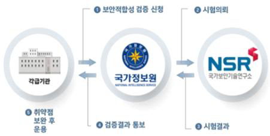

---
<!-- Page 122 -->
| 한국인터넷진흥원 |
122
확인 대상(예시)
☐정보시스템 도입 현황 (예: 정보시스템 장비 목록)
☐정보보호시스템 도입확인서
☐도입된 정보보호시스템에 대한 국내 CC인증 여부
☐(참고 자료 제12호) 정보[그림11] 보안적합성 검증 절차
☐보호시스템 도입 요건 (공공기관 사전인증 제품 도입 시)

---
<!-- Page 123 -->

## 02. 관리적 분야 기본 항목

2026 주요정보통신기반시설 관리·물리적 취약점 분석·평가 방법 안내서
123
A-62
관리적 분야 > 11. 운영관리
제품 및 서비스에서 계약 등으로 협의된 사항 이외 이상행위가 발생하는지 모니터링
관련 조직
정보보호 부서
세부 설명
§ 제품 및 서비스 계약 이행과정에서 협의 사항 이외 악용 가능 행위를 인지할 수 있도록 로그 검토 주기, 대상,
방법을 포함하여 모니터링 절차를 수립·이행하여야 한다.
§ 주기적으로 로그 검토 및 모니터링 결과를 책임자에게 보고하고, 이상행위가 감지되었을 때 신속하게 대응할
수 있도록 경고 및 알림 정책을 수립하여야 한다.
§ 이상행위를 판단하기 위한 기준과 임계치를 정의하고 정보시스템, 보안시스템, 응용프로그램, 네트워크 장비
등의 로그를 실시간으로 모니터링하여 신속하게 이상행위를 탐지하고 식별할 수 있는 체계를 갖추어야 한다.
§ 계약 시 계약서나 협약서 등을 통하여 보안 요구사항을 명확하게 명시하여야 한다.
고려 사항
§ 이상행위 발생 모니터링 체계를 수립할 때에는 이벤트 로그를 수집하거나 모니터링 하여야 할 대상 및 범위,
모니터링 방법, 담당자 및 책임자, 분석 및 모니터링 결과 보고 체계, 이상행위 발생 시 대응 절차 등을
고려하여야 한다.
§ 이상행위가 확인된 경우 규정에 따라 긴급 대응, 소명 요청, 원인 조사 등 사후조치를 수행하여야 한다.
관계 법규
공통
정보통신기반 보호법 제5조(주요정보통신기반시설보호대책 수립 등)
개인정보 보호법 제29조(안전조치의무)
개인정보의 안전성 확보조치 기준 제8조(접속기록의 보관 및 점검)
공공기관
-
금융회사
전자금융거래법 제21조(안전성의 확보의무)
전자금융감독규정 제14조(정보처리시스템 보호대책)
ICT기업
정보보호 및 개인정보보호 관리체계 인증 등에 관한 고시 [별표7] 2.11.3 이상행위 분석 및 모니터링

---
<!-- Page 124 -->
| 한국인터넷진흥원 |
124
확인 대상(예시)
☐제품 및 서비스 표준 계약서(보안 요구사항 명시)
☐로그 검토 및 모니터링 절차
☐로그 검토 및 모니터링 결과
☐이상행위 분석 및 모니터링 내역
☐이상행위 발견 시 대응 증적

---
<!-- Page 125 -->

## 02. 관리적 분야 기본 항목

2026 주요정보통신기반시설 관리·물리적 취약점 분석·평가 방법 안내서
125
A-63
관리적 분야 > 11. 운영관리
개발 및 테스트 설비는 실제 운영설비와 분리하여 운영
관련 조직
정보보호 부서, 개발 부서
세부 설명
§ 정보시스템 개발 및 테스트 설비는 원칙적으로 실제 운영설비와 물리적으로 분리하여 운영하여야 한다.
§ 개발 및 테스트를 수행하는 정보시스템과 실제 운영 중인 정보시스템은 비인가 접근 및 변경의 위험을 줄이기
위해 원칙적으로 물리적으로 분리하고, 서로 다른 네트워크 대역에 위치하도록 한다.
고려 사항
§ 네트워크 대역을 서로 분리할 때 물리적인 분리 또는 논리적인 분리 모두 가능하다.
§  VLAN 설정을 통해 개발 및 테스트망과 운영망을 분리하는 경우, ACL(Access Control List) 설정 등으로 상호
접근을 통제하여야 한다.
관계 법규
공통
정보통신기반 보호법 제5조(주요정보통신기반시설보호대책 수립 등)
개인정보 보호법 제29조(안전조치의무)
공공기관
국가 정보보안 기본지침 제27조의2(발주기관내 작업장소 보안)
금융회사
전자금융거래법 제21조(안전성의 확보의무)
전자금융감독규정 제18조(IP주소 관리대책), 제60조(외부주문등에 대한 기준)
ICT기업
정보보호 및 개인정보보호 관리체계 인증 등에 관한 고시 [별표7] 2.8.3 시험과 운영 환경 분리
확인 대상(예시)
☐네트워크 구성도(시험환경 구성 포함)
☐개발 및 테스트 서버가 위치하는 장소(예: 개발부서, 서버실)

---
<!-- Page 126 -->
| 한국인터넷진흥원 |
126
A-64
관리적 분야 > 11. 운영관리
개발자와 운영자의 접근 권한 분리
관련 조직
정보보호 부서, 개발 부서, 시스템운영 부서
세부 설명
§ 권한 오·남용 등 고의적인 행위로 발생할 수 있는 잠재적인 위협을 줄이기 위하여 개발과 운영직무는
원칙적으로 분리하여야 한다. 다만 불가피하게 직무분리가 어려운 경우 직무자간 상호검토, 직무자의
책임추적성 확보 등의 보완대책을 마련하여야 한다.
§ 개발자가 불필요하게 운영시스템에 접근할 수 없도록 개발자와 운영자의 접근 권한을 분리하고
개발시스템(테스트시스템 포함)과 운영시스템 간 접근통제를 적용하여야 한다.
고려 사항
§ 개발 및 테스트가 완료된 후 운영시스템으로의 이관은 품질보증(QA) 부서에서 진행한다. 개발자에게는
운영시스템 관리자 권한을 부여하지 않도록 하여야 한다.
§ 소규모 조직이나 인적 자원 부족 등 불가피한 사유가 있는 경우, 적절한 보안대책을 적용하여 동일 직무
수행으로 인한 부주의, 오·남용 등을 최소화하도록 조치하여야 한다.
관계 법규
공통
정보통신기반 보호법 제5조(주요정보통신기반시설보호대책 수립 등)
개인정보 보호법 제29조(안전조치의무)
공공기관
-
금융회사
전자금융거래법 제21조(안전성의 확보의무)
전자금융감독규정 제8조의2(직무의 분리)
ICT기업
정보보호 및 개인정보보호 관리체계 인증 등에 관한 고시 [별표7] 2.2.2 직무 분리, 2.8.3 시험과
운영환경 분리, 2.8.6 운영환경 이관

---
<!-- Page 127 -->

## 02. 관리적 분야 기본 항목

2026 주요정보통신기반시설 관리·물리적 취약점 분석·평가 방법 안내서
127
확인 대상(예시)
☐직무 분리 지침(예: 인적 보안 지침 등)
☐직무기술서(개발 및 운영조직)
☐직무 미분리 시 보안통제 현황
☐네트워크 구성도(IP주소 포함)
☐조직도(개발 및 운영조직 포함)
☐운영시스템의 관리자 계정 목록(해당 담당자의 부서 및 이름 포함)
☐개발 시스템, 운영 시스템
☐(서식 예시 제24호) 직무기술서

---
<!-- Page 128 -->
| 한국인터넷진흥원 |
128
A-65
관리적 분야 > 11. 운영관리
업무용 시스템(ERP, 그룹웨어 등)의 소스코드 접근권한을 차등 부여하고 별도 저장장치에 보관
관련 조직
정보보호 부서, 개발 부서
세부 설명
§ 업무용 시스템(ERP, 그룹웨어 등) 소스코드에 대한 비인가자의 접근을 통제하는 절차를 수립‧이행하고, 업무
수행 목적에 따라 소스코드 접근권한을 최소한의 범위로 차등 부여하여야 한다.
§ 소스코드는 인가된 사용자만이 접근할 수 있도록 관리하고, 운영환경에는 보관하지 않는 것을 원칙으로
하여야 한다.
§ 개발업무를 수행하는 조직은 형상관리시스템을 활용하여 개발 변경승인과 변경이력을 시스템에서 관리하고,
소스코드의 최종본이 안전하게 유지되도록 하여야 한다.
§ 소스코드는 장애 등 비상시를 대비하여 별도의 저장장치에 백업하고, 백업된 소스코드는 인가된 관리담당자만
접근할 수 있도록 접근통제를 수행하여야 한다.
고려 사항
§ 형상관리시스템에서 관리하는 구성요소는 소스코드 및 각종 문서(개발/설계/프로젝트 관리 등)와 사용자
요구사항, 참여 인원, 예산, 일정 등 개발 프로젝트의 모든 요소를 포함한다.
§ 형상관리시스템에 저장되어 있는 소스코드에 업무 연관성이 없는 개발자 등 사용자의 접근을 제한하여야
하며,변경(수정, 삭제 등)에 대한 이력 관리를 수행하여야 한다.
§ 업무적으로 불필요하거나 과도한 접근을 방지하기 위해 권한을 세분화하고, 접근 권한 부여 또는 변경 시
승인절차 등을 통해 적절성을 검토하여야 한다.
관계 법규
공통
정보통신기반 보호법 제5조(주요정보통신기반시설보호대책 수립 등)
개인정보 보호법 제29조(안전조치의무)
공공기관
국가 정보보안 기본지침 제73조(개별사용자 보안)
금융회사
전자금융거래법 제21조(안전성의 확보의무)
전자금융감독규정 제29조(프로그램 통제)
ICT기업
정보보호 및 개인정보보호 관리체계 인증 등에 관한 고시 [별표7] 2.8.5 소스 프로그램 관리

---
<!-- Page 129 -->

## 02. 관리적 분야 기본 항목

2026 주요정보통신기반시설 관리·물리적 취약점 분석·평가 방법 안내서
129
확인 대상(예시)
☐소스코드 관리 절차
☐SVN 등 형상관리시스템 운영 현황(예 : 접근권한자 목록 등)
☐소스 프로그램 변경 이력
☐소스 프로그램 백업 현황

---
<!-- Page 130 -->
| 한국인터넷진흥원 |
130
A-66
관리적 분야 > 11. 운영관리
업무용 시스템(ERP, 그룹웨어 등)의 소스코드 변경 시 보안약점 분석도구를 통해 취약점 점검
관련 조직
정보보호 부서, 개발 부서
세부 설명
§ 업무용 시스템(ERP, 그룹웨어 등)의 소스코드 변경 시 안전한 코딩 기준에 따라 안전하게 구현되었는지
점검하여야 하며, 운영환경과 동일한 환경에서 보안약점 점검도구를 통해 취약점 노출 여부를 점검하여야
한다.
§ 취약점 점검 시 이력관리가 될 수 있도록 점검일시, 점검대상, 점검방법, 점검내용 및 결과, 발견사항, 조치사항
등이 포함된 보고서를 작성하고 책임자에게 보고하여야 한다.
고려 사항
§ 보안약점 분석도구가 어떤 종류의 취약점을 검출하는지 이해하고, 시스템 사용 언어에 적합한 도구를 선택한다.
§ 발견된 취약점에 대한 조치를 수행하고, 개선 조치 완료 여부에 대하여 이행점검을 수행한다.
§ 불가피하게 조치할 수 없는 취약점에 대해서는 그 사유를 명확하게 확인하고, 이에 따른 위험성, 보완대책 등을
책임자에게 보고한다.
관계 법규
공통
정보통신기반 보호법 제5조(주요정보통신기반시설보호대책 수립 등)
개인정보 보호법 제29조(안전조치의무)
공공기관
국가 정보보안 기본지침 제27조(소프트웨어 개발보안)
금융회사
전자금융거래법 제21조(안전성의 확보의무), 제21조의3(전자금융기반시설의 취약점 분석ㆍ평가)
전자금융감독규정 제29조(프로그램 통제), 제37조의2(전자금융기반시설의 취약점 분석·평가
주기, 내용 등)
ICT기업
정보보호 및 개인정보보호 관리체계 인증 등에 관한 고시 [별표7] 2.8.2 보안 요구사항 검토 및
시험, 2.11.2 취약점 점검 및 조치

---
<!-- Page 131 -->

## 02. 관리적 분야 기본 항목

2026 주요정보통신기반시설 관리·물리적 취약점 분석·평가 방법 안내서
131
확인 대상(예시)
☐소스코드 취약점 점검 계획서
☐소스코드 취약점 점검 이력 및 결과보고서
☐소스코드 취약점 조치 계획서
☐소스코드 취약점 조치 완료 보고서(미조치 항목 사유 포함)

---
<!-- Page 132 -->
| 한국인터넷진흥원 |
132
A-67
관리적 분야 > 11. 운영관리
주요 시스템 및 정보보호제품의 변경을 위한 공식적인 절차 수립·이행
관련 조직
정보보호 부서, 시스템운영 부서
세부 설명
§ 주요 시스템 및 정보보호제품의 설정 변경을 위한 공식적인 절차를 수립하고 이행하여야 한다.
§ 제어시스템 및 보안 장비 등에 대한 설정 변경은 기반시설의 서비스와 보안에 위협이 될 수 있으므로, 변경
작업 시 작업계획, 영향검토, 승인 등의 절차가 이루어져야 한다.
고려 사항
§ 주요 시스템 및 정보보호제품의 변경을 수행하기 전에는 변경이 성능 및 보안에 미치는 영향을 분석하고,
잠재적 문제점을 파악하여야 한다. 또한, 변경에 따른 영향 최소화 및 변경 실패에 따른 복구방안을 사전에
고려하여야 한다.
관계 법규
공통
정보통신기반 보호법 제5조(주요정보통신기반시설보호대책 수립 등)
개인정보 보호법 제29조(안전조치의무)
공공기관
국가 정보보안 기본지침 제37조(형상변경 및 용도변경시 조치), 제50조(정보시스템 보안책임)
금융회사
전자금융거래법 제21조(안전성의 확보의무)
전자금융감독규정 제14조(정보처리시스템 보호대책), 제29조(프로그램 통제)
ICT기업
정보보호 및 개인정보보호 관리체계 인증 등에 관한 고시 [별표7] 2.9.1 변경관리
확인 대상(예시)
☐시스템 변경 관리 절차
☐제어시스템, 보안 장비 등의 주요 시스템 설정
☐시스템 변경 시 영향분석 내역
☐시스템 변경에 대한 신청·승인 내역

---
<!-- Page 133 -->

## 02. 관리적 분야 기본 항목

2026 주요정보통신기반시설 관리·물리적 취약점 분석·평가 방법 안내서
133
A-68
관리적 분야 > 11. 운영관리
유지보수 작업 전 공식적인 작업신청 및 수행절차를 수립 및 이행하고 작업 기록을 주기적으로 검토
관련 조직
시스템운영 부서
세부 설명
§ 유지보수 작업이 필요한 경우 작업신청 및 수행절차를 수립하고, 작업 일시, 목적 및 내용, 담당자 등을 명시한
작업 신청서를 작성하여 검토, 승인 절차를 준수하여야 한다.
§ 작업이 수행 절차를 준수하여 수행되었는지 확인하기 위해 작업 기록을 주기적으로 검토하여야 한다.
고려 사항
§ 승인된 작업은 수립된 절차에 따라 수행되어야 하며, 이 과정에서 안전 및 보안을 고려한 절차를 준수하여야 한다.
관계 법규
공통
정보통신기반 보호법 제10조(보호지침)
개인정보 보호법 제29조(안전조치의무)
공공기관
국가 정보보안 기본지침 제51조(정보시스템 유지보수)
금융회사
전자금융거래법 제21조(안전성의 확보의무)
전자금융감독규정 제14조(정보처리시스템의 보호대책)
ICT기업
정보보호 및 개인정보보호 관리체계 인증 등에 관한 고시 [별표7] 2.4.5 보호구역 내 작업
확인 대상(예시)
☐유지보수 작업수행 관련 지침(또는 절차)(예: 정보보호 정책서, 물리적보안 지침 등)
☐유지보수 작업 신청서·기록서
☐통제구역 출입 대장
☐작업 기록 검토 내역

---
<!-- Page 134 -->
| 한국인터넷진흥원 |
134
A-69
관리적 분야 > 11. 운영관리
장애탐지, 장애기록, 장애분석, 장애복구, 장애보고 등의 사항을 포함하는 시스템의 장애관리 지침 문서화
관련 조직
시스템운영 부서
세부 설명
§ 정보시스템의 성능 및 용량 요구사항(임계치)를 초과할 경우 등 장애를 즉시 인지하고 대응하기 위한 절차를
수립하여야 한다.
§ 정보시스템 장애를 즉시 인지하고 신속하게 대응하기 위하여 장애탐지, 장애기록, 장애분석, 장애복구,
장애보고 등의 사항을 포함하는 시스템 장애관리 지침을 수립하여야 한다.
§ 장애관리 지침은 장애처리 및 관리를 위한 업무시스템의 변경에 따라 개정될 수 있으므로 주기적인 제·개정에
대한 관리를 하여야 한다.
고려 사항
§ 장애관리 지침에는 장애유형 및 심각도 정의, 장애유형 및 심각도별 보고 절차, 장애유형별 탐지 방법 , 장애
대응 및 복구에 관한 책임과 역할 정의, 장애기록 및 분석, 대고객 서비스인 경우 고객 안내 절차,
비상연락체계(유지보수업체, 정보시스템 제조사) 등을 포함한다.
§ 정보시스템의 장애를 사전에 예방하고 장애 발생 징후를 신속히 탐지할 수 있도록 성능 및 용량을 지속적으로
모니터링하는 방안을 고려할 필요가 있다.
관계 법규
공통
정보통신기반 보호법 제10조(보호지침)
개인정보 보호법 제29조(안전조치의무)
공공기관
국가 정보보안 기본지침 제51조(정보시스템 유지보수), 제92조(재난 방지대책)
금융회사
전자금융거래법 제21조(안전성의 확보의무)
전자금융감독규정 제14조(정보처리시스템 보호대책), 제25조(정보처리시스템 성능관리)
ICT기업
정보보호 및 개인정보보호 관리체계 인증 등에 관한 고시 [별표7] 2.9.2 성능 및 장애관리

---
<!-- Page 135 -->

## 02. 관리적 분야 기본 항목

2026 주요정보통신기반시설 관리·물리적 취약점 분석·평가 방법 안내서
135
확인 대상(예시)
☐장애 처리 및 관리를 위한 지침(또는 절차)
☐심각도 높은 장애 처리 및 관리를 위한 지침(또는 절차)(예: 업무연속성관리(비상계획) 지침)
☐장애 처리 및 관리를 위한 업무시스템(예: 장애관리시스템, 그룹웨어 등)

---
<!-- Page 136 -->
| 한국인터넷진흥원 |
136
A-70
관리적 분야 > 11. 운영관리
백업 대상, 주기, 방법, 보관 장소, 보관기간, 소산 등을 포함한 백업 절차 수립·이행
관련 조직
정보보호 부서
세부 설명
§ 정보시스템의 가용성과 데이터 무결성을 보장하기 위해 백업체계를 마련하여야 한다. 이를 위해 시스템 손상
시 신속히 복구할 수 있도록 백업 대상, 주기, 방법, 보관 장소, 보관기간, 소산 등을 고려하여 백업 절차를
수립·이행하여야 한다.
§ 중요정보가 저장된 백업매체는 운영 중인 정보시스템 또는 백업시스템이 위치한 장소로부터, 물리적으로
떨어진 장소에 소산하여야 한다.
고려 사항
§ 백업시스템의 소산은 소산일자(반출, 반입 등), 소산 백업매체 및 백업정보 내용 등 관리대장으로 이력을
관리하고, 소산이 적절하게 이루어지고 있는지 주기적으로 점검하여야 한다.
관계 법규
공통
정보통신기반 보호법 제5조(주요정보통신기반시설보호대책 수립 등)
개인정보 보호법 제29조(안전조치의무)
개인정보의 안전성 확보조치 기준 제11조(재해·재난 대비 안전조치)
공공기관
국가 정보보안 기본지침 제92조(재난 방지대책)
금융회사
전자금융거래법 제21조(안전성의 확보의무)
전자금융감독규정 제13조(전산자료 보호대책), 제14조(정보처리시스템 보호대책), 제23조(비상대책 등의 수립ㆍ운용)
ICT기업
정보보호 및 개인정보보호 관리체계 인증 등에 관한 고시 [별표7] 2.9.3 백업 및 복구관리
확인 대상(예시)
☐정보시스템 백업 정책 문서(예: 백업 지침 또는 백업 절차서)
☐소산 백업 위치(또는 스토리지) 및 보관 장소
☐백업 기록 대장
☐소산 백업 현황

---
<!-- Page 137 -->

## 02. 관리적 분야 기본 항목

2026 주요정보통신기반시설 관리·물리적 취약점 분석·평가 방법 안내서
137
A-71
관리적 분야 > 11. 운영관리
백업된 정보의 완전성과 정확성, 복구절차의 적절성을 확인하기 위하여 정기적으로 복구 테스트 수행
관련 조직
정보보호 부서, 시스템 운영 부서
세부 설명
§ 백업된 정보의 완전성과 정확성, 복구절차의 적절성을 확인하기 위하여 다음과 같이 정기적인 복구 테스트를
수행하여야 한다.
- 복구테스트 계획(복구테스트 주기 및 시점, 담당자, 방법 등)
- 복구테스트 시나리오 수립
- 복구테스트 실시 및 결과 보고
- 복구테스트 결과 문제점 발견 시 개선계획 수립 및 이행
§ 시험결과, 정보시스템 환경변화, 법률 등에 따른 변화를 반영할 수 있도록 복구전략 및 대책을 정기적으로
검토·보완하여야 한다.
고려 사항
§ 테스트 계획에 따라 정기적으로 시험을 실시 하여 복구 전략 및 대책의 효과성을 평가하고, 비상 시 복구조직
구성원이 복구절차에 따라 신속하게 대응하는지 등을 점검한다.
§ 자연재해, 장애 발생, 사이버 공격 등 다양한 상황을 고려하여 복구 시나리오에 대한 테스트를 진행한다.
§ 복구된 시스템이 실제 운영 환경에서 요구되는 성능을 충족시킬 수 있는지 확인하여야 한다.
관계 법규
공통
정보통신기반 보호법 제5조(주요정보통신기반시설보호대책 수립 등)
개인정보 보호법 제29조(안전조치의무)
개인정보의 안전성 확보조치 기준 제11조(재해·재난 대비 안전조치)
공공기관
국가 정보보안 기본지침 제92조(재난 방지대책)
금융회사
전자금융거래법 제21조(안전성의 확보의무)
전자금융감독규정 제13조(전산자료 보호대책), 제23조(비상대책 등의 수립‧운용)
ICT기업
정보보호 및 개인정보보호 관리체계 인증 등에 관한 고시 [별표7] 2.9.3 백업 및 복구관리

---
<!-- Page 138 -->
| 한국인터넷진흥원 |
138
확인대상(예시)
☐백업 복구 절차서
☐백업 복구 테스트 계획서
☐백업 복구 테스트 결과서
☐백업 복구 테스트 수행내역

---
<!-- Page 139 -->

## 02. 관리적 분야 기본 항목

2026 주요정보통신기반시설 관리·물리적 취약점 분석·평가 방법 안내서
139
A-72
관리적 분야 > 11. 운영관리
전자기록 보관을 위한 별도의 방법(아카이빙)을 마련하고, 이를 통해 관리
관련 조직
정보보호 부서, 시스템 운영 부서
세부 설명
§ 전자기록을 안전하게 보관하기 위하여 별도의 방법(아카이빙)에 따른 절차를 마련하고 이를 통제 전자기록을
저장‧관리하여야 한다.
§ 전자기록 보관에 대한 내부 절차는 아카이빙 백업 대상, 주기, 방법, 절차 등을 포함하여 계획을 수립하여야 한다.
§ 데이터 백업본은 원본 정보시스템과는 별도의 위치(예: 백업 스토리지, 원격지 백업 등)에 저장되어야 하며,
분실 위험이 있는 저장매체(예: 백업테잎(DAT), CD, 외장HDD 등)는 지정된 안전한 장소(예: 시건된
캐비넷)에 보관하여야 한다.
고려 사항
§ 아카이빙(Archiving)은 데이터를 원래 위치에서 다른 곳으로 이동하여 장기간 보관하는 것을 의미하며, 데이터
아카이빙을 통하여 현재 운영 시스템에서 사용 빈도가 낮은 데이터를 장기간 보관할 수 있는 특수 아카이브
스토리지 시스템으로 이동하여 관리한다.
§ 별도의 장소, 공간에 데이터의 백업 매체를 보관(수 km에서 수백 km 이상 거리에 백업 데이터를 보관하는
데이터 백업 소산을 의미하는 것이 아님)하고, 백업 매체가 훼손, 변경, 분실되지 않도록 안전한 보관 방법을
마련하여야 한다.
§ 아카이빙과 백업 개념의 차이점은 다음과 같다.
구분
아카이빙(Archicing)
백업(Backup)
목적
데이터 장기 보관 및 접근
데이터 복원
용도
필요시 데이터 참조 및 증명
데이터 손실 또는 장애 발생 시 신속한 복구
접근성
접근성이 낮음
접근성이 높음
복구시간
느린 데이터 복구
신속한 데이터 복구
저장주기
조직의 설정한 정책 주기를 따름
일별, 주별, 월별 등 주기적 저장
데이터상태
원본 상태 그대로 저장
특정 시점의 복사본으로 저장
저장위치
클라우드, 테이프 등 저렴한 스토리지
디스크, 클라우드 등 백업 전용 장비

---
<!-- Page 140 -->
| 한국인터넷진흥원 |
140
관계 법규
공통
정보통신기반 보호법 제5조(주요정보통신기반시설보호대책 수립 등)
개인정보 보호법 제29조(안전조치의무)
개인정보 보호법 시행령 제30조(개인정보의 안전성 확보조치)
공공기관
국가 정보보안 기본지침 제92조(재난 방지대책)
금융회사
전자금융거래법 제21조(안전성의 확보의무)
전자금융감독규정 제13조(전산자료 보호대책), 제14조(정보처리시스템 보호대책)
ICT기업
정보보호 및 개인정보보호 관리체계 인증 등에 관한 고시 [별표7] 2.9.3 백업 및 복구관리
확인 대상(예시)
☐데이터 보안 및 저장 관리지침(아카이빙 방안 포함)
☐데이터 백업 절차서
☐백업 매체 또는 백업 스토리지가 위치한 장소
☐백업 매체

---
<!-- Page 141 -->

## 02. 관리적 분야 기본 항목

2026 주요정보통신기반시설 관리·물리적 취약점 분석·평가 방법 안내서
141
A-73
관리적 분야 > 11. 운영관리
시스템 및 정보보호시스템 접근기록(로그 등)을 생성‧보관하고, 이에 대한 비인가 열람, 훼손 등을 방지
하기 위한 보호대책 운영
관련 조직
정보보호 부서, 시스템 운영 부서
세부 설명
§ 서버, 응용프로그램, 네트워크 장비, 보안 장비(정보보호시스템)에 대해 사용자 및 관리자 등의 접근기록(로그
등)이 생성되도록 하며, 이러한 접근기록은 비인가자의 무단 열람이나 위·변조를 방지하기 위해 접근통제 등을
적용하여 안전하게 보관하여야 한다.
§ 시스템 접근기록은 공격자 및 유지보수 운영자에 의해 훼손될 우려가 있으므로, 로그 서버 운영 또는
백업매체를 통해 별도로 보관하여야 한다. 또한, 로그서버 관리자 또는 백업 관리자를 지정하여 보안을
강화하여야 한다.
§ 시스템 및 정보보호시스템 접근기록은 최소 1년 이상 보관하여야 한다
§ 관계 법규에 따라 시스템의 접속기록 보관기간(예: 개인정보처리시스템의 경우 최소 1년 이상 또는 최소 2년
이상) 등이 정해져 있는 경우가 존재하므로, 보관하여야 하는 접속기록의 대상과 기간 등에 유의하여야 한다.
고려 사항
§ 시스템 및 정보보호시스템 관리자는 접근기록의 정확성을 확보하기 위해 시간 동기화 프로토콜(NTP)을
적용하여야 한다.
§ 개인정보처리시스템에 접속한 사용자가 수행한 업무 내역은 식별자, 접속 일시, 접속지 정보, 처리한 정보주체
정보, 수행 업무 등을 포함하여 전자적으로 기록하여야 하며 접속기록 보존기간은 다음과 같다.
보존 기관
구분
최소 1년 이상
일반적 보존기간
최소 2년 이상
5만명 이상의 정보주체에 관한 개인정보를 처리하는 개인정보처리시스템
고유식별정보 또는 민감정보를 처리하는 개인정보처리시스템
개인정보처리자로서 「전기통신사업법」 제6조 제1항에 따라 등록된 기간통신사업자
§ WORM(Write Once Read Many) 스토리지 등 덮어쓰기 방지 매체에 접근기록을 저장할 경우 위‧변조, 훼손
등을 방지할 수 있다.

---
<!-- Page 142 -->
| 한국인터넷진흥원 |
142
관계 법규
공통
정보통신기반 보호법 제10조(보호지침)
개인정보 보호법 제29조(안전조치의무)
개인정보의 안전성 확보조치 기준 제8조(접속기록의 보관 및 점검)
공공기관
국가 정보보안 기본지침 제55조(로그기록 유지)
금융회사
전자금융거래법 제21조(안전성의 확보의무)
전자금융감독규정 제12조(단말기 보호대책), 제13조(전산자료 보호대책), 제15조(해킹 등
방지대책), 제18조(IP주소 관리대책)
ICT기업
정보보호 및 개인정보보호 관리체계 인증 등에 관한 고시 [별표7] 2.9.4 로그 및 접속기록 관리
확인 대상(예시)
☐로그관리 절차
☐로그기록 내역
☐로그 저장장치에 대한 접근통제 내역
☐개인정보 접속기록 내역
☐개인정보 다운로드 시 사유 확인 기준 및 결과

---
<!-- Page 143 -->

## 02. 관리적 분야 기본 항목

2026 주요정보통신기반시설 관리·물리적 취약점 분석·평가 방법 안내서
143
A-74
관리적 분야 > 11. 운영관리
시스템과 네트워크의 오류, 오·남용(비인가접속, 과다조회 등), 부정행위 등 이상징후를 인지할 수
있도록 로그 검토 주기, 대상, 방법 등을 포함한 로그 검토 및 모니터링 절차 수립 및 이행
관련 조직
정보보호 부서, 시스템 운영 부서
세부 설명
§ 시스템 및 네트워크의 오류, 오·남용(비인가접속, 과다조회 등), 부정행위 등 이상징후를 인지할 수 있도록
로그 검토 주기, 대상, 방법 등을 포함한 로그 검토 및 모니터링 절차를 수립·이행하여야 한다.
§ 서버에 대한 성능 및 용량을 관리하는 시스템(SMS; Server Management System), 네트워크에 대한 모니터링을
수행하는 시스템(NMS; Network Management System)을 이용하여 이상징후에 대한 지속적인 모니터링하여야
한다.
고려 사항
§ 개인정보 보호법에서는 개인정보처리시스템의 접속기록을 월1회 이상 점검하도록 요구하고 있으므로, 관계
법규에 따른 법적 준거성을 고려하여 접속기록 검토 절차를 수립·이행하여야 한다.
§ 내·외부에 의한 침해시도, 개인정보유출 시도, 부정행위 등 이상행위를 효과적으로 탐지할 수 있도록 각종
개별 보안솔루션 및 통합보안 모니터링 솔루션 등을 통해 이상징후에 대한 지속적인 모니터링 방안을 마련할
필요가 있다.

관계 법규
공통
정보통신기반 보호법 제10조(보호지침)
개인정보 보호법 제29조(안전조치의무)
개인정보의 안전성 확보조치 기준 제8조(접속기록의 보관 및 점검)
공공기관
국가 정보보안 기본지침 제55조(로그기록 유지)
금융회사
전자금융거래법 제21조(안전성의 확보의무)
전자금융감독규정 제14조(정보처리시스템 보호대책)
ICT기업
정보보호 및 개인정보보호 관리체계 인증 등에 관한 고시 [별표7] 2.9.5 로그 및 접속기록 점검,

#### 2.11.3(이상행위 분석 및 모니터링)

---
<!-- Page 144 -->
| 한국인터넷진흥원 |
144
확인 대상(예시)
☐서버, 네트워크 장비에 대한 성능 및 용량 모니터링 체계
☐로그 검토 및 모니터링 절차
☐로그 검토 및 모니터링 결과(검토 내역, 보고서 등)
☐이상징후 발견 시 대응 증적

---
<!-- Page 145 -->

## 02. 관리적 분야 기본 항목

2026 주요정보통신기반시설 관리·물리적 취약점 분석·평가 방법 안내서
145
A-75
관리적 분야 > 11. 운영관리
로그 및 모니터링 결과를 월 1회 이상 책임자에게 보고
관련 조직
정보보호 부서, 시스템 운영 부서
세부 설명
§ 기반시설의 정보시스템을 대상으로 로그 검토 및 모니터링을 정기적으로 수행하고 점검결과를 월 1회 이상
책임자에게 보고하여야 한다. 또한, 점검결과 비인가자의 접속시도, 자료 위변조, 정보 유출 등 의심스러운
정황이나 위반사실이 발견되면 즉시 책임자에게 보고하여야 한다.
§ 개인정보의 접속기록은 오ㆍ남용, 분실ㆍ도난ㆍ유출ㆍ위조ㆍ변조 또는 훼손 등에 대응하기 위하여 관련
법령에서 정한 기준에 따라 월 1회 이상 점검하여 책임자에게 보고하여야 한다.
고려 사항
§ 정보시스템에 비인가자 혹은 근무 시간 외 다운로드 등 이상징후가 확인된 경우, 로그검토 기준에 따라 사유를
확인하고, 그 결과를 책임자에게 보고하여야 한다.
§ 기반시설의 개인정보처리시스템에서 개인정보의 다운로드가 확인된 경우, 내부 관리계획 등 기준에 따라
사유를 확인하고, 그 결과를 책임자에게 보고하여야 한다. 개인정보의 오·남용이나 유출 목적으로 다운로드 한
것이 확인되었다면 관계 법령에 따라 유출 신고, 정보주체 통지 등을 이행하여야 하며, 개인정보를 회수하는
등 조치를 취하여야 한다.
관계 법규
공통
정보통신기반 보호법 제10조(보호지침)
개인정보 보호법 제29조(안전조치의무)
개인정보의 안전성 확보조치 기준 제8조(접속기록의 보관 및 점검)
공공기관
국가 정보보안 기본지침 제55조(로그기록 유지)
금융회사
전자금융거래법 제21조(안전성의 확보의무)
전자금융감독규정 제14조(정보처리시스템 보호대책)
ICT기업
정보보호 및 개인정보보호 관리체계 인증 등에 관한 고시 [별표7] 2.9.5 로그 및 접속기록 점검

---
<!-- Page 146 -->
| 한국인터넷진흥원 |
146
확인 대상(예시)
☐로그 검토 및 모니터링 절차
☐로그 검토 및 모니터링 결과(검토 내역, 보고서 등)
☐개인정보 접속기록 점검 내역
☐개인정보 다운로드 시 사유 확인 기준 및 결과
☐이상징후 발견 시 대응 증적
☐로그 및 모니터링 결과의 책임자 보고 및 검토 이력

---
<!-- Page 147 -->

## 02. 관리적 분야 기본 항목

2026 주요정보통신기반시설 관리·물리적 취약점 분석·평가 방법 안내서
147
A-76
관리적 분야 > 11. 운영관리
정보나 매체가 용도 폐기되기 위한 폐기 방법 수립‧이행
관련 조직
정보보호 부서
세부 설명
§ 정보나 매체의 용도 폐기 사유가 발생한 경우, 복구나 재생이 불가능하도록 안전한 폐기 절차를 수립하고
이행하여야 한다.
§ 종이 등의 기록물, 인쇄물, 복사물 등은 파쇄 또는 소각하여 폐기하고, 전산자료는 전용 소자 장비(예: 이레이저
또는 디가우저)를 이용하여 데이터가 복원되지 않도록 파기하여야 한다.
§ 자체적으로 정보 및 매체를 폐기할 경우, 관리대장을 통해 폐기 이력(폐기일자, 폐기 담당자 및 책임자 서명,
폐기방법, 폐기확인증적 등)을 기록하여야 한다.
§ 외부업체를 통하여 정보 및 매체를 폐기할 경우, 폐기 절차와 관련된 내용을 계약서에 명시하고, 폐기 절차가
제대로 이행되는지 감독하여야 한다. 또한, 완전한 폐기를 증명하는 증적(예: 사진, 동영상 등)을 보관하여야 한다.
고려 사항
§ 이레이저(Eraser)와 디가우저(Degausser)의 개념의 차이점은 다음과 같다.
이레이저(Eraser)
디가우저(Degausser)
정의
저장매체의 데이터를 수회 삭제 및 덮어쓰기를
반복하면서 원 데이터를 복원 불가능한 수준으로
완전삭제하는 장비(또는 S/W)를 의미
강력한 자기장을 이용하여 하드디스크 등의 저장
장치에 기록된 데이터를 파괴하는 장비를 의미
목적
재사용 목적
폐기(재사용 불가) 목적
§ 저장매체를 폐기할 때는 물리적 및 전자적으로 완전히 파괴하고, 재사용할 때는 완전 포맷을 통해 모든 정보를
삭제하여야 한다. 저장매체별·자료별 차별화된 삭제 방법을 다음 분류에 따른 기준 이상으로 적용하여야 한다.
저장매체\저장자료
공개자료
비공개 자료
대외비 자료
비밀 자료
자기테이프
플로피디스크
자체 판단
물리적 파괴
물리적 파괴
물리적 파괴
광디스크
(CDㆍDVD 등)
자체 판단
물리적 파괴
물리적 파괴
물리적 파괴

---
<!-- Page 148 -->
| 한국인터넷진흥원 |
148
관계 법규
공통
정보통신기반 보호법 제10조(보호지침)
개인정보 보호법 제21조(개인정보의 파기), 제29조(안전조치의무)
개인정보의 안전성 확보조치 기준 제13조(개인정보의 파기)
공공기관
국가 정보보안 기본지침 제61조(저장매체 불용처리)
금융회사
전자금융거래법 제21조(안전성의 확보의무)
전자금융감독규정 제13조(전산자료 보호대책)
ICT기업
정보보호 및 개인정보보호 관리체계 인증 등에 관한 고시 [별표7] 2.9.7 자산의 재사용 및 폐기
확인 대상(예시)
☐정보 또는 저장매체의 폐기 방법 및 지침
☐종이 또는 저장매체에 대한 폐기 기록 및 증빙(예: 요청, 승인, 수행 이력)
☐(해당하는 경우) 보안 폐기 외주용역 계약서, 폐기 확인서
저장매체\저장자료
공개자료
비공개 자료
대외비 자료
비밀 자료
반도체메모리
(SSDㆍUSB 등)
포맷 또는 삭제
완전삭제 제품
물리적 파괴
물리적 파괴
하드디스크
포맷 또는 삭제
디가우징 또는
완전삭제 제품
물리적 파괴
물리적 파괴

---
<!-- Page 149 -->

## 02. 관리적 분야 기본 항목

2026 주요정보통신기반시설 관리·물리적 취약점 분석·평가 방법 안내서
149
A-77
관리적 분야 > 11. 운영관리
보안규정의 이행여부를 확인하는 주기적인 보안점검 및 불시 보안점검 수행
관련 조직
정보보호 부서
세부 설명
§ 보안규정의 이행여부를 확인하기 위해 연 1회 이상 주기적으로 보안점검을 수행하여야 한다.
§ 보안규정에 따른 임직원 보안업무 생활화 이행여부를 확인하기 위해 불시 보안점검(생활보안 점검)을
수행하여야 한다.
§ 연 1회 이상 수행하는 보안점검은 내부 보안규정과 관리적·물리적 취약점 점검항목을 고려하여 수행하고,
발견된 문제점은 정보보호책임자(정보보안담당관)에게 보고하여야 한다.
§ 보안점검 완료 후, 보완이 필요한 사항에 대해 조치계획을 수립하고, 조치 완료 여부를 점검하여야 한다.
고려 사항
§ 정보보호 및 개인정보보호 관리체계(ISMS-P) 인증과 같은 대외 보안인증을 유지하는 경우, 해당 인증기준에
주요정보통신기반시설 보호지침에 따른 관리적·물리적 취약점 점검항목(보안인증 기준에 따른 내부 보안감사도
주기적인 보안점검으로 인정)을 포함하여 수행할 필요가 있다.
§ 보안규정의 이행여부를 확인하기 위하여 점검기준, 범위, 점검인력, 자격요건 등 점검계획을 수립하고
정보보호책임자에게 보고하여야 한다.
- 점검기준 : 조직내부에서 수립한 보안 규정
- 점검범위 : 전사 또는 기반시설 범위 포함
- 점검주기 : 최소 연 1회 이상 수행 필요
- 점검인력 자격요건 : 점검의 객관성, 독립성 및 전문성을 확보할 수 있도록 자격 요건 정의
관계 법규
공통
정보통신기반 보호법 제10조(보호지침)
개인정보 보호법 제29조(안전조치의무)
개인정보의 안전성 확보조치 기준 제4조(내부 관리계획의 수립·시행 및 점검)
공공기관
국가 정보보안 기본지침 제8조(정보보안감사 등)
금융회사
전자금융거래법 제21조(안전성의 확보의무)

---
<!-- Page 150 -->
| 한국인터넷진흥원 |
150
확인 대상(예시)
☐당해 연도(또는 전년도) 보안실태점검 계획서·결과서
☐보안실태점검 이행조치 결과서
☐(참고 자료 제11호) 정보보안 점검항목 (예시)
전자금융감독규정 제8조(인력, 조직, 교육 및 예산))
ICT기업
정보보호 및 개인정보보호 관리체계 인증 등에 관한 고시 [별표7] 1.4.2 관리체계 점검

---
<!-- Page 151 -->

## 02. 관리적 분야 기본 항목

2026 주요정보통신기반시설 관리·물리적 취약점 분석·평가 방법 안내서
151
A-78
관리적 분야 > 11. 운영관리
비밀(대외비 포함)을 비밀관리기록부 등에 등재하여 관리
관련 조직
정보보호 부서, 비밀관리 부서
세부 설명
§ 공공기관일 경우, 비밀 정보(I급, II급, III급)는 행정안전부의 ‘비밀기록물 관리 실무지침’을 참고하여 비밀관리기록부에
등재하고, 이의 열람, 파기 등의 이력을 철저히 관리하고, 안전하게 보관하여야 한다.
§ 민간 기업의 경우 대외 공개가 제한되는 문서를 대외비(Confidential)로 분류하고, 모든 문서에 보안등급
(각 등급 별로 보안 관리와 보호가 필요함을 의미)을 적용하여 각 등급에 따라 관리하여야 한다.
고려 사항
§ 공공기관의 비밀관리 절차는 법제처 웹사이트에서 보안업무규정 및 보안업무규정 시행규칙을 참고하여 관련 기준,
비밀표기 방법, 생산부터 폐기까지의 이력관리, 보관 등의 상세한 내용을 확인하여 적용하여야 한다.
§ 공공기관은 비밀등급 문서를 관리할 때, 비밀취급인가증을 소지한 인원만이 생산부터 폐기까지 모든 관리 권한을
보유한다. 비밀의 등록관리에 중점을 두며, 관련 법규에 따라 비밀취급인가에 관련된 사항을 적용하여야 한다.
§ 비밀 문서를 전사적으로 처리하고자 할 경우 안전한 암호 모듈을 사용하여 위조·변조·훼손 및 유출을 방지한다.
관계 법규
공통
정보통신기반 보호법 제10조(보호지침)
공공기관
국가 정보보안 기본지침 제63조(비밀관리시스템 운용)
보안업무규정 제22조(비밀관리기록부)
금융회사
전자금융거래법 제21조(안전성의 확보의무)
전자금융감독규정 제13조(전산자료 보호대책)
ICT기업
정보보호 및 개인정보보호 관리체계 인증 등에 관한 고시 [별표7] 2.1.3 정보자산 관리
확인 대상(예시)
☐비밀 문건 관리 기준 지침 또는 절차
☐비밀관리기록부
☐(서식 예시 제17호) 비밀관리기록부

---
<!-- Page 152 -->
| 한국인터넷진흥원 |
152
A-79
관리적 분야 > 11. 운영관리
출력된 비밀문서의 경우 잠금 장치가 있는 캐비넷 등에 안전하게 보관
관련 조직
정보보호 부서
세부 설명
§ 출력된 비밀문서(또는 전산자료가 보관된 CD, USB메모리, HDD)는 보관 관리주체(예: 총무부서)와
보관장소(예: 이중시건 캐비넷)를 정하여 일원화된 관리가 이루어지도록 하여야 한다.
§ 비밀문서는 출입이 엄격하게 통제된 장소에 보관하여야 하므로 통제구역 수준의 장소에 보관하는 것이
필요하며, 비밀문서의 규모가 크지 않아 사물함, 캐비넷 등에 보관하여야 한다면 이중시건이 가능한 장치를
설치하여 보관하여야 한다. 또한 화재 등으로부터 소실될 우려가 있다면 내화금고에 비밀문서를 보관한다.
고려 사항
§ 출력된 비밀문서를 안전하게 관리하기 위해 집적된 비밀문서는 통제구역으로 지정된 장소에 보관하거나
이중시건 캐비넷 등의 보호조치를 적용하여야 한다.
§ 공공기관의 비밀 보안등급에 따라 다음과 같이 보관 기준을 다르게 마련할 수 있다.
- I급 비밀은 반드시 금고에 보관하고, 다른 비밀과 혼합하여 보관하지 않는다.
- II급 비밀 및 III급 비밀은 금고 또는 이중시건 캐비넷 등 잠금장치가 있는 장소에 보관하여야 한다.
관계 법규
공통
정보통신기반 보호법 제10조(보호지침)
개인정보 보호법 제29조(안전조치의무)
개인정보의 안전성 확보조치 기준 제10조(물리적 안전조치), 제12조(출력ㆍ복사시 안전조치)
공공기관
국가 정보보안 기본지침 제62조(비밀의 전자적 처리)
금융회사
전자금융거래법 제21조(안전성의 확보의무)
전자금융감독규정 제13조(전산자료 보호대책)
ICT기업
정보보호 및 개인정보보호 관리체계 인증 등에 관한 고시 [별표7] 2.4.7 업무환경 보안
확인 대상(예시)
☐비밀문서 보관 통제구역
☐이중시건 캐비넷

---
<!-- Page 153 -->

## 02. 관리적 분야 기본 항목

2026 주요정보통신기반시설 관리·물리적 취약점 분석·평가 방법 안내서
153
A-80
관리적 분야 > 11. 운영관리
비밀 등 중요정보의 안전한 처리를 위한 보호대책을 마련하거나 시스템을 도입하여 사용
관련 조직
정보보호 부서
세부 설명
§ 비밀 등 중요 정보의 생성, 분류, 저장, 접근, 전송, 삭제에 관한 보호대책을 마련한다.
§ 비밀 등 중요 정보를 정보통신망을 통해 처리하는 경우 저장, 전송 시에 암호화가 이루어지도록 하는 등의
시스템화된 보호대책을 적용하여야 한다.
§ 비밀 등 중요 정보는 사용자에게 보호대책를 맡기는 관리적인 대책보다는 시스템 솔루션 등을 사용하여 보다
확실한 기술적 대책 마련을 강구하여야 한다.
§ 공공기관은 비밀 등급 자료에 대한 비밀관리시스템 등을 도입하여 안전한 정보 처리를 하여야 한다.
고려 사항
§ 보호대책 마련시 비밀 등 표시 방법, 처리 기록의 보관 및 관리, 비밀을 관리하기 위한 각종 대장 등 양식,
암호화‧접근통제 등 기술적 보호대책 등을 고려하여야 한다.
§ 비밀 등 중요 정보를 안전하게 처리하기 위해 다음과 같은 기능을 구현한 시스템을 자체 개발하거나 그 기능을
갖춘 보안시스템을 도입하는 방법으로 보호대책을 적용하여야 한다.
- 메일서버에 보안(비밀)메일 발송(예: 암호화 전송) 및 관리(예: 발송이력 확인) 기능을 포함하여 운영
- 암호화 대상 중요 정보(예: 고유식별정보)를 DB암호화하는 시스템 운영
- 중요 정보(DB)에 접근하는 기록을 모니터링하고 불법적인 접근행위를 탐지하는 시스템 운영
관계 법규
공통
정보통신기반 보호법 제10조(보호지침)
개인정보 보호법 제29조(안전조치의무)
공공기관
국가 정보보안 기본지침 제62조(비밀의 전자적 처리), 제63조(비밀관리시스템 운용)
금융회사
전자금융거래법 제21조(안전성의 확보의무)
전자금융감독규정 제13조(전산자료 보호대책)
ICT기업
정보보호 및 개인정보보호 관리체계 인증 등에 관한 고시 [별표7] 2.1.3 정보자산 관리

---
<!-- Page 154 -->
| 한국인터넷진흥원 |
154
확인 대상(예시)
☐시스템 운영(사용) 계획
☐시스템 운영(사용) 현황
☐중요 문서 접근 통제 보호 대책

---
<!-- Page 155 -->

## 02. 관리적 분야 기본 항목

2026 주요정보통신기반시설 관리·물리적 취약점 분석·평가 방법 안내서
155
A-81
관리적 분야 > 11. 운영관리
정보통신망 세부 구성현황(IP 정보 등)등을 대외비 이상으로 관리
관련 조직
정보보호 부서, 시스템 운영 부서
세부 설명
§ 정보통신망의 세부 구성현황(네트워크 구조, 장비 정보, IP 주소 등)은 정보의 유출 시 해킹, 정보 유출, 서비스
마비, 법적 책임 등 심각한 위험을 초래할 수 있으므로 외부에 유출되지 않도록 하여야 한다. 공공기관은 비공개
업무자료 이상, 민간기업은 대외비 이상 수준의 보안으로 안전하게 관리하여야 한다.
§ 관계 법규에서 엄격한 관리를 요구하는 중요정보에 대하여 적절한 보안수준으로 분류하여 관리하여야 한다.
특히 정보통신망에 대한 세부 구성현황(예: 네트워크 세부 구성도, IP 할당 현황, 정보시스템 상세 현황(목록),
중요(민감) 정보화 사업 상세 현황 등)은 반드시 비공개 업무자료 및 대외비 자료로 관리하여야 한다.
고려 사항
§ 정보시스템(서버/네트워크/애플리케이션) 구성도, IP 관리대장 등 전자 문서의 경우 문서 암호화, 워터마킹,
접근통제 등의 보호대책을 적용하여야 한다.
관계 법규
공통
정보통신기반 보호법 제10조(보호지침)
공공기관
국가 정보보안 기본지침 제71조(정보통신망 현황자료 관리)
금융회사
전자금융거래법 제21조(안전성의 확보의무)
전자금융감독규정 제18조(IP주소 관리대책)
ICT기업
정보보호 및 개인정보보호 관리체계 인증 등에 관한 고시 [별표7] 2.1.3 정보자산 관리
확인 대상(예시)
☐네트워크 구성도 및 IP자산대장 대외비 분류 현황
☐해당 대외비 보관 장소

---
<!-- Page 156 -->
| 한국인터넷진흥원 |
156
A-82
관리적 분야 > 11. 운영관리
중요 데이터와 일반 데이터를 다른 서버에 분리 보관
관련 조직
정보보호 부서, DB 운영 부서
세부 설명
§ 대외 유출이 엄격히 제한되는 중요 데이터는 일반 데이터와 구분하여 별도의 서버에 보관하여 유출 위험을
완화하여야 한다.
§  DB는 다른 용도의 서버와 함께 운영하지 않고 분리 운영하여야 하며, DB서버 용도로 구축된 전용 시스템에
보관(웹서버와 DB서버는 동일한 시스템에 구축 제한 등)하여야 한다.
고려 사항
§ 개인정보 및 중요정보의 정의 및 분류 기준은 조직에 따라 상이하므로 해당 기관의 규정을 준수하여
분류하여야 한다.
§ 분리 보관되는 개인정보 및 중요정보는 업무 목적상 필요한 최소 인원에게만 최소한의 접근권한을 부여하는
등 접근통제 방안을 적용하여야 한다.
관계 법규
공통
정보통신기반 보호법 제10조(보호지침)
개인정보 보호법 제29조(안전조치의무)
공공기관
국가 정보보안 기본지침 제53조(서버 보안)
금융회사
전자금융거래법 제21조(안전성의 확보의무)
전자금융감독규정 제13조(전산자료 보호대책)
ICT기업
정보보호 및 개인정보보호 관리체계 인증 등에 관한 고시 [별표7] 2.6.4 데이터베이스 접근
확인 대상(예시)
☐중요정보에 대한 분류 정의(예: 규정 또는 지침)
☐중요 정보시스템(예:DB 서버)
☐네트워크 구성도(서버 분리 구성 여부 표시 등)

---
<!-- Page 157 -->

## 02. 관리적 분야 기본 항목

2026 주요정보통신기반시설 관리·물리적 취약점 분석·평가 방법 안내서
157
A-83
관리적 분야 > 11. 운영관리
홈페이지 게시 자료에 대해 게시 절차를 마련하고 시행
관련 조직
정보보호 부서, 서비스 운영 부서
세부 설명
§ 홈페이지에 공식적인 자료 게시 절차가 없을 경우, 중요정보 및 개인정보 등 비공개 정보가 의도치 않게
노출될 가능성이 존재하므로, 이러한 위험에 대응할 수 있도록 게시 담당자 지정 및 책임자 승인 등의 절차를
수립‧이행하여야 한다.
고려 사항
§ 홈페이지에 비공개 정보가 무단 게시되었는지 여부를 정기적으로 점검하여야 한다.
§ 금융회사 또는 전자금융업자는 홈페이지(공개용 서버)에 자료를 게시하는 경우, 다음의 절차를 준수하는
절차를 마련하여야 한다.
- 게시자료에 대한 사전 내부 통제
- 익명, 가명에 의한 게시 금지
- 홈페이지 게시 전 사전 검토 및 승인
- 개인정보 유출 및 위ㆍ변조 방지를 위한 보호조치
관계 법규
공통
정보통신기반 보호법 제10조(보호지침)
개인정보 보호법 제29조(안전조치의무)
개인정보의 안전성 확보조치 기준 제6조(접근통제)
공공기관
국가 정보보안 기본지침 제70조(홈페이지 등 게시자료 보안)
금융회사
전자금융거래법 제21조(안전성의 확보의무)
전자금융감독규정 제17조(홈페이지 등 공개용 웹서버 관리대책)
ICT기업
정보보호 및 개인정보보호 관리체계 인증 등에 관한 고시 [별표7] 2.10.3 공개서버 보안
확인 대상(예시)
☐홈페이지 게시물 관리 지침 또는 절차(담당자 지정 여부 포함)
☐중대외 홈페이지의 게시물 등록 메뉴(예: 공지사항, 질의응답) 및 등록된 게시물
☐해당 홈페이지

---
<!-- Page 158 -->
| 한국인터넷진흥원 |
158
A-84
관리적 분야 > 11. 운영관리
개인정보 및 주요정보의 보호를 위하여 법적 요구사항을 반영한 암호화 대상, 암호강도, 암호사용, 암호
키 관리 등이 포함된 암호정책 수립·이행
관련 조직
정보보호 부서, 개발 부서
세부 설명
§ 개인정보 및 주요정보의 보호를 위하여 법적 요구사항을 반영한 암호화 정책을 수립하여야 하며, 이 정책에는
암호화 대상, 암호강도, 암호키 관리 등이 포함되어야 한다.
§ 암호키는 접근통제가 적용된 장소에 보관되어야 하며, 물리적 또는 논리적으로 접근통제를 적용하여야 한다.
§ 공개키 및 개인키의 유효기간은 최대 2년으로 정하고 유효기간을 초과한 경우 폐기하도록 하는 내용을
지침(암호키 관리서식 포함)에 반영하여야 한다.
§ 암호정책은 정기적으로 검토하고 업데이트하여 최신 보안 기준을 반영하도록 하여야 하며, 암호화 방법의
적절성과 보안성을 지속적으로 점검하여야 한다.
고려 사항
§ 암호정책에 따라 개인정보 및 중요정보의 저장, 전송, 전달 시 암호화 위치, 시스템 특성 등을 고려하여 다음과
같이 암호화 방식을 선정 및 적용하여 암호화를 수행하여야 한다.
구분
암호화 방식
정보통신망을 통한
송·수신 시

## 1. 웹서버에 SSL(Secure Socket Layer) 인증서를 설치하여 전송하는 정보를 암호화 송수신

## 2. 웹서버에 암호화 응용프로그램을 설치하여 전송하는 정보를 암호화하여 송수신

## 3. 그 밖에 암호화 기술 활용 : VPN, PGP 등

개인정보처리시스템 등
저장 시

## 1. 응용프로그램 자체 암호화(API 방식)

## 2. 데이터베이스 서버 암호화(Plug-in 방식)

3. DBMS 자체 암호화(TDE 방식)
4. DBMS 암호화 기능 호출

## 5. 운영체제 암호화(파일암호화 등)

## 6. 그 밖의 암호화 기술 활용

업무용 컴퓨터 및
모바일 기기 저장 시

## 1. 문서도구 자체 암호화(오피스 등에서 제공하는 암호 설정 기능 활용)

## 2. 암호 유틸리티를 이용한 암호화

3. DRM(Digital Right Management) 기술 적용 등
보조저장매체
저장 시

## 1. 암호화 기능을 제공하는 보안 저장매체 이용(보안USB 등)

## 2. 해당 정보를 암호화한 후 보조저장매체에 저장 등

---
<!-- Page 159 -->

## 02. 관리적 분야 기본 항목

2026 주요정보통신기반시설 관리·물리적 취약점 분석·평가 방법 안내서
159
§ 개인정보 및 주요정보의 보호를 위하여 다음과 같이 법적 요구사항을 반영한 암호화 대상, 암호강도, 암호사용
등이 포함된 암호정책을 수립하여야 한다.
구분
개인정보 보호법에 따른 암호화 대상 개인정보
이용자가 아닌 정보주체의 개인정보
이용자의 개인정보
정보통신망
을 통한
송·수신 시
정보통신망
인증정보(비밀번호, 생체인식정보 등)
※ 내부망 포함
인터넷망
개인정보
저장 시
저장 위치
무관
인증정보(비밀번호, 생체인식정보 등)
※ 단, 비밀번호는 일방향암호화
주민등록번호
※ 법 제24조의2 제2항에 따라 암호화
인터넷구간
, DMZ
고유식별정보
※ 단, 주민등록번호 외의 고유식별정보를
내부망에 저장하는 경우에는 개인정보
영향평가의 결과 또는 위험도 분석에 따른
결과에 따라 암호화의 적용여부 및
적용범위를 정하여 시행 가능
주민등록번호,
여권번호, 운전면허번호,
외국인등록번호,
신용카드번호, 계좌번호,
생체인식정보
※ 저장 위치 무관
내부망
개인정보취급자 컴퓨터,
모바일기기,
보조저장매체
등에 저장 시
고유식별정보, 생체인식정보
개인정보
§ 암호키 관리를 위한 지침을 수립하는 경우 다음 내용을 참고한다. 단, 처리속도 등 기술발전에 따라 사용 권고 암호
알고리즘 등은 달라질 수 있으므로, 암호화 적용 시 국내외 암호관련 연구기관에서 제시하는 최신 정보 확인이 필요하다.
구분
지침
암호키 생성
암호키는 중요정보를 암호화할 경우 보안강도가 높은 키길이를 갖는 안전한 알고리즘(예:
AES-128 등)을 적용하여 보안담당자의 승인을 받아 생성하고 ‘암호키 관리대장’에 기록한다.
(일방향 암호화의 경우는 SHA-256에 해당하는 해시를 적용)
암호키 사용(보관)
암호키는 비인가된 사용자가 접근하지 못하도록 가장 강력한 접근통제를 적용하여야 하며,
인가된 사용자 외에는 절대 노출되지 않도록 철저히 관리하여야 한다. 또한 암호키는 노출
위험을 최소화하기 위해 최대 2년마다 변경하여야 한다. 암호키의 생성, 사용 및 폐기 ‘암호화
관리대장’에 기록하고, 이 대장에 대한 접근은 보안담당자가 관리한다. 암호키는 내화금고 등
안전한 장소에 보관되어야 한다.
암호키 폐기
암호키는 사용 용도가 끝났거나 사용주기가 경과한 경우, 폐기하여야 한다. 암호키의 폐기는 지정된
보안담당자가 수행하며, 폐기 과정과 결과는 '암호키 관리대장'에 정확히 기록하여야 한다. 또한,
폐기된 암호키는 완전히 삭제하거나 물리적으로 파괴하여 복구가 불가능하도록 하여야 한다.

---
<!-- Page 160 -->
| 한국인터넷진흥원 |
160
§ 암호화 알고리즘은 암호화 방식(예: 일방향-해시, 양방향-대칭키) 및 강도에 따라 다르다. 안전한 보
안을 위한 보안 강도는 다음과 같이 KISA(참고: 암호 알고리즘 및 키 길이 이용 안내서)에서 권하는
기준을 참고한다.
보안강도
대칭키
암호
알고리즘
(보안강도)
해시함수
(보안강도)
공개키 암호 알고리즘
암호
알고리즘
안전성
유지기간
(년도)
인수분해
(비트)
이산대수
타원곡선
암호(비트)
공개키
(비트)
개인키
(비트)
112 비트
112
112
2048
2048
224
224
2011에서
2030년까지
128 비트
128
128
3072
3072
256
256
192 비트
192
192
7680
7680
384
384
2030년 이후
256 비트
256
256
15360
512
512
512
§ 암호키의 사용 유효기간은 미국 국립표준기술원(NIST)에서 권하는 다음 기준을 참고한다.
구분
알고리즘 명칭
사용 유효기간
송신자 사용기간
수신자 사용기간
대칭키 암호 알고리즘
비밀키
최대 2년
최대 5년
공개키 암호 알고리즘
암호화 공개키
최대 2년
복호화 개인키
최대 2년
검증용 공개키
최소 2년
서명용 개인키
최대 2년
§ 법적 요구사항 등을 고려하여 안전한 암호화 알고리즘 및 보안 강도를 선택한다.
구분
알고리즘 명칭
대칭키 암호 알고리즘
SEED, ARIA-128/192/256, AES-128/192/256, HIGHT, LEA 등
공개키 암호 알고리즘
RSAES-OAEP 등
일방향 암호 알고리즘
SHA-256/384/512 등

---
<!-- Page 161 -->

## 02. 관리적 분야 기본 항목

2026 주요정보통신기반시설 관리·물리적 취약점 분석·평가 방법 안내서
161
관계 법규
공통
정보통신기반 보호법 제10조(보호지침)
개인정보 보호법 제24조의2(주민등록번호 처리의 제한), 제29조(안전조치의무)
개인정보의 안전성 확보조치 기준 제7조(개인정보의 암호화)
공공기관
국가 정보보안 기본지침 제102조(사용 원칙), 제103조(취급인가자 지정), 제105조(암호자재 설치ㆍ운영 장소)
금융회사
신용정보의 이용 및 보호에 관한 법률 제19조(신용정보전산시스템의 안전보호)
신용정보업감독규정 제20조(기술적·물리적·관리적 보안대책), [별표 3] 기술적·물리적·관리적
보안대책 마련기준 Ⅱ기술적·물리적 보안대책, 3. 개인신용정보의 암호화
전자금융거래법 제21조(안전성 확보의무)
전자금융감독규정 제17조(홈페이지 등 공개용 웹서버 관리대책), 제19조(암호프로그램 및 키
관리 통제), 제29조의2(사용자 인증수단 관리), 제34조(전자금융거래 시 준수사항),
제34조의3(이용자 비밀번호 관리), 제60조(외부주문등에 대한 기준)
ICT기업
정보보호 및 개인정보보호 관리체계 인증 등에 관한 고시 [별표7] 2.7.1 암호정책 적용
확인 대상(예시)
☐암호정책 및 암호키 관리 지침
☐(가이드) 암호 알고리즘 및 키 길이 이용 안내서(한국인터넷진흥원, 2018)
☐암호키 관리 대장(서식 예시 제42호) 암호화키 관리대장 (대외비)
☐암호화키 및 관리대장이 보관된 장소(예: 서버, 내화금고 등)

---
<!-- Page 162 -->
| 한국인터넷진흥원 |
162
A-85
관리적 분야 > 11. 운영관리
암호키를 복구하기 위한 복구 절차를 수립하고 복구 내역 검토
관련 조직
정보보호 부서, 개발 부서
세부 설명
§ 사용자의 퇴사 또는 사용자의 부주의 등으로 암호키를 알 수 없는 경우를 대비하여 암호키 복구를 위한 절차와
방법을 명시한 정책을 수립하여야 한다.
§ 암호키의 복구가 필요한 경우 암호키 복구 이력을 기록하고 관리하여야 한다.
§ 암호키가 손상되거나 손실된 경우, 시스템 또는 암호화된 정보의 복구를 위하여 암호키는 별도의 매체에
저장한 후, 물리적으로 안전한 장소(암호키 관리시스템, 물리적 분리된 곳 등)에 보관하여야 한다.
§ 암호키 복구 및 관리 절차는 정기적으로 검토하고 업데이트하여 최신 보안 기준에 부합하도록 유지하여야 한다.
고려 사항
§ 암호키 복구를 위한 지침을 수립하는 경우 다음 내용을 참고한다.
구분
지침
암호키 복구
암호키 소유자가 퇴사 등의 사유로 암호화키를 알 수 없는 경우, 보안담당자의 승인을 받아
"암호키 복구 대장"에 복구 기록을 작성하고, 암호키 복구 절차를 진행하여야 한다. "암호키
복구 대장"에 대한 접근은 보안담당자가 관리하며, 안전한 관리를 위해 내화금고 등 물리적으로
분리된 장소에 보관하도록 한다.
관계 법규
공통
정보통신기반 보호법 제10조(보호지침)
개인정보 보호법 제29조(안전조치의무)
개인정보의 안전성 확보조치 기준 제7조(개인정보의 암호화)
공공기관
-
금융회사
신용정보의 이용 및 보호에 관한 법률 제45조(감독·검사 등)
전자금융거래법 제21조(안전성의 확보의무)
전자금융감독규정 제31조(암호프로그램 및 키 관리 통제)
ICT기업
정보보호 및 개인정보보호 관리체계 인증 등에 관한 고시 [별표7] 2.7.2 암호키 관리

---
<!-- Page 163 -->

## 02. 관리적 분야 기본 항목

2026 주요정보통신기반시설 관리·물리적 취약점 분석·평가 방법 안내서
163
확인 대상(예시)
☐암호키 관리 지침
☐암호키 관리 대장
☐암호키 복구 대장
☐암호키 관리·복구 대장이 보관된 장소(예: 내화금고 등)
☐(서식 예시 제42호) 암호화키 관리대장 (대외비)
☐(서식 예시 제43호) 암호화키 복구대장 (대외비)

---
<!-- Page 164 -->
| 한국인터넷진흥원 |
164
12
보안관리
A-86
관리적 분야 > 12. 보안관리
침입차단 및 탐지 도구는 조직의 보안 정책과 규칙에 적합하게 설치하여 운영
관련 조직
정보보호 부서, 시스템 운영 부서
세부 설명
§ 침입차단 및 탐지를 위한 보안 장비에 설정하는 접근규칙은 조직의 보안 정책과 규칙에 따라 정의하고
운영하여야 한다.
§ 보안 장비는 기본 정책으로 Inbound 및 Outbound 트래픽에 대해 모든 서비스를 차단하되, 보안성 검토(승인 절차
등)를 통해 승인된 IP 및 포트에 대해서만 허용이 이루어지도록 정책을 적용하여야 한다.
§ 외부에서 방화벽을 우회하여 내부망으로 직접 연결되는 경로(예: NAT구성을 통한 리다이렉트 설정)는
존재하지 않도록 하여야 한다.
고려 사항
§ 방화벽(Firewall) 및 IDS, IPS 등 보안시스템의 취약점 점검은 연 1회 이상 실시하여야 하며, 보안시스템에 설정된
정책(Rule)의 타당성은 주기적으로 검토하여 장기 미사용 정책, 중복된 정책, 사용기간 만료 정책 등을 수정하여야 한다.
관계 법규
공통
정보통신기반 보호법 제5조(주요정보통신기반보호대책의 수립 등)
개인정보 보호법 제29조(안전조치의무)
개인정보의 안전성 확보조치 기준 제6조(접근통제)
공공기관
국가 정보보안 기본지침 제42조(보안ㆍ네트워크 장비 보안)
금융회사
전자금융거래법 제21조(안전성의 확보의무)
전자금융감독규정 제15조(해킹 등 방지대책)
ICT기업
정보보호 및 개인정보보호 관리체계 인증 등에 관한 고시 [별표7] 2.6.1 네트워크 접근, 2.10.1
보안시스템 운영
확인 대상(예시)
☐방화벽 등 보안 장비의 기본 접근규칙(Rule)
☐취약점 점검 결과서

---
<!-- Page 165 -->

## 02. 관리적 분야 기본 항목

2026 주요정보통신기반시설 관리·물리적 취약점 분석·평가 방법 안내서
165
A-87
관리적 분야 > 12. 보안관리
외부자와 정보 공유, 네트워크 공유 등에 따른 보안위협에 대한 대책 운영
관련 조직
정보보호 부서, 해당 사업 부서
세부 설명
§ 타 기업 및 기관이 정보 공유 및 네트워크 공유 연계되는 시스템을 사용하는 경우 인증, 일방향 전송, 전송 구간
암호화, 연계구간 접근통제, 보안성 검토 등의 기술적‧관리적 보호대책을 마련하고 운영하여야 한다.
§ 기술적 보호조치 등을 포함하는 정보전송 협약을 체결하여 양 당사자의 역할과 책임을 명문화한다.
고려 사항
§ 개인정보를 외부에 제공하는 경우에는 정보전송을 협약하고 기술적인 보호조치를 강구하기 전에 제3자에게
개인정보의 제공(전송)이 법률상 가능한지 확인 후 그 여부를 결정하여야 한다.
관계 법규
공통
정보통신기반 보호법 제5조(주요정보통신기반보호대책의 수립 등)
개인정보 보호법 제29조(안전조치의무)
개인정보의 안전성 확보조치 기준 제4조(내부 관리계획의 수립·시행 및 점검)
공공기관
국가 정보보안 기본지침 제12조(보안대책 수립)
금융회사
전자금융거래법 제21조(안전성의 확보의무)
전자금융감독규정 제15조(해킹 등 방지대책)
ICT기업
정보보호 및 개인정보보호 관리체계 인증 등에 관한 고시 [별표7] 2.10.5 정보전송 보안
확인 대상(예시)
☐외부 연계시스템 구성도 및 기술적 보호조치 대책
☐외부 연계 기관 등과 체결한 정보전송 협약서
☐연계시스템 또는 서비스
☐용역업체 인수인계대상

---
<!-- Page 166 -->
| 한국인터넷진흥원 |
166
A-88
관리적 분야 > 12. 보안관리
정보통신망에 비인가 PC, 노트북 등을 연결 시 차단 및 차단 이력 주기적 검토
관련 조직
정보보호 부서
세부 설명
§ 정보통신망에 허가되지 않은 PC, 노트북 등이 연결될 경우, 악성코드 감염이나 정보 유출 등의 침해가 발생할
수 있으므로, 네트워크 접근제어(NAC) 장비 등을 활용하여 비인가 장치의 연결을 차단하고 차단 이력을
주기적으로 검토하여야 한다.
고려 사항
§ 비인가 단말기가 중요 시설에 무단 반입되어 내부망에 임의 연결되지 않도록 단말기 반입·반출 통제(장비 식별
포함)를 고려한 네트워크 연결 승인절차를 수립하여야 한다.
§ 정보통신망에 대한 비인가 단말기의 연결 여부, 예외 정책, 네트워크 연결 승인 및 차단 현황 등 네트워크
접근제어 시스템의 정책 및 차단 이력을 주기적으로 검토하고 필요시 사후조치를 수행한다.
관계 법규
공통
정보통신기반 보호법 제5조(주요정보통신기반보호대책의 수립 등)
개인정보 보호법 제29조(안전조치의무)
개인정보의 안전성 확보조치 기준 제6조(접근통제)
공공기관
국가 정보보안 기본지침 제79조(비인가 기기 통제)
금융회사
전자금융거래법 제21조(안전성의 확보의무)
전자금융감독규정 제12조(단말기 보호대책)
ICT기업
정보보호 및 개인정보보호 관리체계 인증 등에 관한 고시 [별표7] 2.10.6 업무용 단말기기 보안
확인 대상(예시)
☐비인가 PC, 노트북 등의 단말기 통제 지침(또는 절차)
☐단말기 반출입 및 네트워크 연결 승인 문건
☐네트워크 접근제어시스템
☐(서식 예시 제6호) 단말기 사용 신청서

---
<!-- Page 167 -->

## 02. 관리적 분야 기본 항목

2026 주요정보통신기반시설 관리·물리적 취약점 분석·평가 방법 안내서
167
A-89
관리적 분야 > 12. 보안관리
이동형 장치(노트북, 태블릿, 보조저장매체 등)의 사용 및 반출입에 대한 통제절차 수립‧이행
관련 조직
정보보호 부서
세부 설명
§ 이동형 장치(노트북, 태블릿, 보조저장매체 등)를 사용하거나 반입‧반출하는 경우, 정보유출, 악성코드 감염 등
보안사고 예방을 위한 통제 절차를 수립·이행하여야 한다.
§ 모든 이동형 장치는 관리번호를 부여하여 자산관리 시스템에 등록하고, 보호구역으로 지정된 곳에 보관하여야
한다.
§ 또한, 사전 승인을 받은 자만 이동형 장치를 사용할 수 있도록 하고 반출 시에는 반출 요청서를 작성하여 담당자에
게 보고한다. 보안 담당자는 반출 요청을 검토하고, 불필요한 데이터를 삭제한 후 반출 등의 이동형 장치 반출‧입
절차를 마련하여야 한다.
고려사항
§ 보안 담당자는 이동형 장치별로 구분 및 관리하고 수량과 보관 상태를 정기적으로 점검하여야 한다.
§ 공공기관은 국가 정보보안 기본지침에 따라 「USB메모리 등 휴대용 저장매체의 보안관리지침」을
준수하여야 한다.
관계 법규
공통
정보통신기반 보호법 제5조(주요정보통신기반보호대책의 수립 등)
개인정보 보호법 제29조(안전조치의무)
개인정보의 안전성 확보조치 기준 제10조(물리적 안전조치)
공공기관
국가 정보보안 기본지침 제74조(단말기 보안), 제78조(휴대용 저장매체 보안)
금융회사
전자금융거래법 제21조(안전성의 확보의무)
전자금융감독규정 제13조(전산자료 보호대책)
ICT기업
정보보호 및 개인정보보호 관리체계 인증 등에 관한 고시 [별표7] 2.4.6 반출입 기기 통제, 2.10.7
보조저장매체 관리

---
<!-- Page 168 -->
| 한국인터넷진흥원 |
168
확인 대상(예시)
☐이동형 저장매체 관리 지침 또는 절차
☐이동형 저장매체 및 정보시스템 반출입 지침(또는 절차)
☐시스템의 USB 장치 통제 방법 및 통제 여부
☐반출입 통제 방법 및 실제 통제 여부
☐사무실, 통신실, 서버실 등의 PC, 정보시스템
☐보호구역 내 반출입 신청서
☐(서식 예시 제4호) 정보시스템 반입, 반출 신청서

---
<!-- Page 169 -->

## 02. 관리적 분야 기본 항목

2026 주요정보통신기반시설 관리·물리적 취약점 분석·평가 방법 안내서
169
A-90
관리적 분야 > 12. 보안관리
이동형 장치(노트북, 태블릿, 이동식저장매체 등)의 반출입 시 통제 절차에 따른 기록 유지 관리하고 절
차 준수여부를 확인할수 있도록 반출입 이력을 주기적으로 점검
관련 조직
정보보호 부서
세부 설명
§ 이동형 장치(노트북, 태블릿, 보조저장매체 등)의 무단 반출입에 따른 내부자료 유출에 대비하여 통제 절차에
따른 기록을 유지‧관리하고, 절차 준수 여부를 확인할 수 있도록 반출입 이력을 주기적으로 점검하여야 한다.
※ 반출입 관리대장 기록사항(예시)
- 반출입 일시 및 장소
- 사용자 정보
- 기종(모델), 기기식별정보(시리얼번호 등)
- 반출입 사유
- 보안 점검 결과
- 관리자 확인 서명 등
고려사항
§ 보호구역 내 반출입 이력 점검시에는 반입·반출 미디어 장치 수량 차이 비교 등을 통해 장치 분실 및 오남용에
대한 관점을 고려하여야 한다
관계 법규
공통
정보통신기반 보호법 제5조(주요정보통신기반보호대책의 수립 등)
개인정보 보호법 제29조(안전조치의무)
개인정보의 안전성 확보조치 기준 제10조(물리적 안전조치)
공공기관
국가 정보보안 기본지침 제74조(단말기 보안), 제78조(휴대용 저장매체 보안)
금융회사
전자금융거래법 제21조(안전성의 확보의무)
전자금융감독규정 제13조(전산자료 보호대책)
ICT기업
정보보호 및 개인정보보호 관리체계 인증 등에 관한 고시 [별표7] 2.4.6 반출입 기기 통제

---
<!-- Page 170 -->
| 한국인터넷진흥원 |
170
확인대상(예시)
☐보호구역 내 반출입 신청서
☐반출입 관리대장
☐반출입 이력 검토 결과
☐(서식 예시 제31호) 휴대용 저장매체(전산장비 포함) 반출·입 대장

---
<!-- Page 171 -->

## 02. 관리적 분야 기본 항목

2026 주요정보통신기반시설 관리·물리적 취약점 분석·평가 방법 안내서
171
A-91
관리적 분야 > 12. 보안관리
스마트폰·개인휴대단말기(태블릿)·전자제어장비 등 첨단 정보통신기기를 활용하는 경우, 업무자료 등
중요정보 보호 및 안전한 전송을 위한 방안 마련
관련 조직
정보보호 부서
세부 설명
§ 스마트폰, 개인휴대단말기(태블릿), 전자제어장비 등 첨단 정보통신기기를 사용하는 경우, 중요 정보의
암호화와 안전한 전송(전송구간 암호화 등) 보호조치를 마련하여야 한다.
§ 관계 법규에 따라 특정 첨단 정보통신기기의 이용이 제한되거나 기술적인 보호조치가 요구될 수 있으므로,
해당 법규가 있는지 확인하여 해당 법규의 요건을 만족하는 보호대책을 적용하여야 한다.
고려 사항
§ 전송구간 암호화는 SSL, VPN 등의 암호화 통신 방식을 적용하며, 모바일의 경우 E2E 암호화 방식을 적용하여
인증 정보를 암호화하여 전송하는 것을 권고한다.
관계 법규
공통
정보통신기반 보호법 제5조(주요정보통신기반보호대책의 수립 등)
개인정보 보호법 제29조(안전조치의무)
개인정보의 안전성 확보조치 기준 제6조(접근통제), 제7조(개인정보의 암호화)
공공기관
국가 정보보안 기본지침 제56조(업무용 통신단말기 보안)
금융회사
전자금융거래법 제21조(안전성의 확보의무)
전자금융감독규정 제12조(단말기 보호대책), 제13조(전산자료 보호대책)
ICT기업
정보보호 및 개인정보보호 관리체계 인증 등에 관한 고시 [별표7] 2.7.1 암호정책 적용, 2.10.6
업무용 단말기기 보안
확인 대상(예시)
☐업무상 사용 허가된 스마트폰, 태블릿 등의 이용 현황
☐정보통신기기 기술적 보호대책(암호화 저장 및 전송 등) 적용 여부
☐스마트폰, 전자제어장비 등 정보통신기기

---
<!-- Page 172 -->
| 한국인터넷진흥원 |
172
A-92
관리적 분야 > 12. 보안관리
보조저장매체의 사용을 주기적으로 점검하고 운영 현황을 최신화
관련 조직
정보보호 부서
세부 설명
§ 보조저장매체의 보유 현황, 사용 및 관리 실태를 주기적으로 점검하여 운영 현황을 현행화하여야 한다.
§ 보조저장매체의 사용, 보관, 폐기, 재사용 등에 대한 관리 절차를 통해 인가된 보조저장매체를 구분ㆍ관리하고
매월 또는 분기별로 등록된 보조저장매체의 수량 및 보관 상태를 정기적으로 점검하여야 한다.
고려 사항
§ 보조저장매체 관리대장 작성 등을 통해 현황을 관리할 수 있으며, 관리대장에 등재된 보조저장매체를
무작위로 선정하여 수량 불일치 등 관리상태의 미흡 여부를 확인한다.
§ 보조저장매체를 통하여 개인정보 또는 중요정보의 유출이 발생하거나 악성코드가 감염되지 않도록 관리
절차를 수립·이행하고, 개인정보 또는 중요정보가 포함된 보조저장매체는 안전한 장소에 보관하여야 한다.
관계 법규
공통
개인정보 보호법 제29조(안전조치의무)
개인정보의 안전성 확보조치 기준 제10조(물리적 안전조치)
공공기관
국가 정보보안 기본지침 제78조(휴대용 저장매체 보안), 제79조(비인가 기기 통제)
금융회사
전자금융감독규정 제12조(단말기 보호대책), 제13조(전산자료 보호대책)
ICT기업
정보보호 및 개인정보보호 관리체계 인증 등에 관한 고시 [별표7] 2.10.7 보조저장매체 관리
확인 대상(예시)
☐인가된 보조저장매체 보유 현황
☐보조저장매체 주기적 점검 결과 보고서
☐보조저장매체 관리시스템
☐보조저장매체 사용 부서 및 PC, 노트북 등
☐(서식 예시 34호) 휴대용 저장매체 점검대장

---
<!-- Page 173 -->

## 02. 관리적 분야 기본 항목

2026 주요정보통신기반시설 관리·물리적 취약점 분석·평가 방법 안내서
173
A-93
관리적 분야 > 12. 보안관리
노트북, 보조저장매체 등 이동형 장치의 분실을 통한 자료 유출 대비책 마련
관련 조직
정보보호 부서
세부 설명
§ 이동형 장치(예: 노트북, 보조저장매체 등) 분실 시 발생할 수 있는 개인정보 및 중요정보 유출 방지를 위해
중요정보의 암호화 저장 등의 보호대책을 수립·이행하여야 한다.
§ 개인정보 및 중요정보가 포함된 이동형 장치는 잠금장치가 있는 안전한 장소에 보관하여야 한다.
§ 문서 프로그램 등의 자체 암호 설정 기능, 파일 암호화 등을 통해 이동형 장치 내 개인정보 및 중요정보를
암호화하여 관리할 수 있으며, 관리 절차 수립 및 사용자 교육 등과 같은 관리적인 조치를 통해 자료 유출에
대한 보호 대책을 마련한다.
고려 사항
§ 예산 운용이 가능하다면 보안USB 시스템, 업무용 노트북(PC)에 암호화 솔루션(예: DRM) 등의 기술적인
보호조치를 통해 장치 분실 등에 따른 유출 시에도 저장된 정보를 열람할 수 없도록 조치할 수 있다.
§ 관리 대상이 많지 않은 조직은 백신 소프트웨어의 USB 메모리 제어기능을 활용하여 기술적인 조치를 적용할
수 있다. 관리자 비밀번호 설정 및 백신 관리 정책 설정을 통해 USB 메모리의 읽기‧쓰기 기능을 제한한다.
관계 법규
공통
정보통신기반 보호법 제5조(주요정보통신기반보호대책의 수립 등)
개인정보 보호법 제29조(안전조치의무)
개인정보의 안전성 확보조치 기준 제10조(물리적 안전조치)
공공기관
국가 정보보안 기본지침 제78조(휴대용 저장매체 보안), 제79조(비인가 기기 통제)
금융회사
전자금융거래법 제21조(안전성의 확보의무)
전자금융감독규정 제12조(단말기 보호대책), 제13조(전산자료 보호대책)
ICT기업
정보보호 및 개인정보보호 관리체계 인증 등에 관한 고시 [별표7] 2.10.7 보조저장매체 관리

---
<!-- Page 174 -->
| 한국인터넷진흥원 |
174
확인 대상(예시)
☐이동형 장치 보유 현황
☐이동형 장치 분실 방지 대책
☐이동형 장치의 정보 암호화 대책
☐(서식 예시 제31호) 휴대용 저장매체(전산장비 포함) 반출·입 대장
☐(서식 예시 제32호) 휴대용 저장매체 관리대장 (일반용)
☐(서식 예시 제33호) 휴대용 저장매체 관리대장 (비밀용)

---
<!-- Page 175 -->

## 02. 관리적 분야 기본 항목

2026 주요정보통신기반시설 관리·물리적 취약점 분석·평가 방법 안내서
175
A-94
관리적 분야 > 12. 보안관리
서버, 네트워크시스템, 보안시스템, PC 등 자산별 특성 및 중요도에 따라 운영체제(OS)와
소프트웨어의 패치관리 정책 및 절차 수립‧이행
관련 조직
정보보호 부서, 시스템 운영 부서
세부 설명
§ 서버, 네트워크시스템, 보안시스템, PC 등 자산별 특성 및 중요도에 따라 OS와 소프트웨어의 패치관리 정책 및
절차를 수립·이행하여야 한다.
§ 주요 시스템의 경우 설치된 OS, 소프트웨어 패치 적용 현황을 주기적으로 점검하여 관리하여야 한다.
§ 서비스 영향도 등에 따라 취약점을 조치하기 위한 최신의 패치 적용이 어려운 경우 적절한 보완대책을
마련하여야 한다.
고려 사항
§ 자산별 특성 및 중요도에 따른 패치 적용 대상 및 주기, 테스트 및 영향 분석 방안, 패치 적용 및 미적용 패치
관리 방안을 고려하여 패치관리 정책 및 절차를 수립·이행하여야 한다.
§ 주요 시스템에 설치된 운영체제 및 소프트웨어의 버전 정보, 패치 적용현황, 패치별 적용일자 등을 확인할 수
있도록 목록으로 관리하고, 최신 보안패치 적용 필요 여부를 주기적으로 확인하여야 한다.
§ 테스트 환경에서의 테스트, 유관 부서 및 협력업체(유지보수, 벤더)와의 커뮤니케이션 등을 통해 패치 적용 시
시스템 가용성에 미칠 수 있는 영향을 분석하고, 운영시스템의 중요도와 특성에 따라 즉시 패치 적용이 어려운
경우 그 사유와 보완대책을 마련하여 책임자에게 보고하고 그 현황을 관리하여야 한다.
관계 법규
공통
정보통신기반 보호법 제5조(주요정보통신기반보호대책의 수립 등)
개인정보 보호법 제29조(안전조치의무)
개인정보의 안전성 확보조치 기준 제9조(악성프로그램 등 방지)
공공기관
국가 정보보안 기본지침 제53조(서버 보안), 제53조의2(제어시스템 보안)
금융회사
전자금융거래법 제21조(안전성의 확보의무)
전자금융감독규정 제14조(정보저치리스템 보호대책), 제15조(해킹 등 방지대책),
제16조(악성코드 감염 방지대책)
ICT기업
정보보호 및 개인정보보호 관리체계 인증 등에 관한 고시 [별표7] 2.10.8 패치관리

---
<!-- Page 176 -->
| 한국인터넷진흥원 |
176
확인 대상(예시)
☐패치 적용 관리 정책·절차
☐시스템별 패치 적용 현황
☐패치 적용 관련 영향도 분석 결과

---
<!-- Page 177 -->

## 02. 관리적 분야 기본 항목

2026 주요정보통신기반시설 관리·물리적 취약점 분석·평가 방법 안내서
177
A-95
관리적 분야 > 12. 보안관리
서버, 네트워크시스템, 보안시스템, PC 등의 운영체제, 소프트웨어 등이 개발사로부터 보안 지원이
되지 않을 경우 해당 제품을 교체하거나 보안대책 마련
관련 조직
정보보호 부서, 시스템 운영 부서
세부 설명
§ 최신의 운영체제, 소프트웨어 등이 보안 지원이 중단(EOS, EOL 등)되었을 경우를 대비한 보안대책을
수립·이행하여야 한다.
§ 서버, 네트워크시스템 보안시스템, PC 등의 운영체제, 소프트웨어 등이 개발사로부터 보안 지원이 되지 않을
경우 해당 제품을 교체하여야 하며, 불가피한 사유로 교체가 어려운 경우 향후 취약점 발생에 따른 위협에
대응할 수 있도록 보안대책을 마련하여야 한다.
§ 보안지원이 중단된 운영체제 및 소프트웨어를 파악하기 위해 사용 현황을 주기적으로 관리하여야 한다.
고려 사항
§ 자산에 대한 주기적인 현황관리 또는 패치관리 과정에서 자산별 서비스 지원 종료 시점을 확인하여 서비스
지원 종료 시점이 도래 예정이거나 종료된 자산을 식별하여야 한다.
§ 제품 교체 또는 업그레이드 시 비용 발생이 예상되는 자산의 경우 사전에 계획을 수립하여 서비스 지원 종료
시점 이전에 교체될 수 있도록 예산을 확보하여야 한다.
§ 시스템간 연동 또는 호환성 등으로 제품 교체 또는 업그레이드가 불가한 경우 사유와 함께 알려진 취약점에
대한 보호대책, 향후 적용 시점 등 보완대책을 마련하여 책임자에게 보고하고 그 현황을 관리하여야 한다.
관계 법규
공통
정보통신기반 보호법 제5조(주요정보통신기반보호대책의 수립 등)
개인정보 보호법 제29조(안전조치의무)
개인정보의 안전성 확보조치 기준 제9조(악성프로그램 등 방지)
공공기관
국가 정보보안 기본지침 제42조(보안·네트워크 장비 보안), 제53조(서버 보안),
제74조(단말기 보안)
금융회사
전자금융거래법 제21조(안전성의 확보의무)
전자금융감독규정 제14조(정보처리시스템 보호대책), 제15조(해킹 등 방지대책)
ICT기업
정보보호 및 개인정보보호 관리체계 인증 등에 관한 고시 [별표7] 2.10.8 패치관리

---
<!-- Page 178 -->
| 한국인터넷진흥원 |
178
확인 대상(예시)
☐서버 등 정보시스템 운영체제 및 소프트웨어 현황
☐보안지원 중단 운영체제 사용 현황
☐교체계획 예산이 반영되어 있는 경우 예산 결재 문서
☐호환성 등의 문제로 지연 중일 경우 제조사의 확인 서류

---
<!-- Page 179 -->

## 02. 관리적 분야 기본 항목

2026 주요정보통신기반시설 관리·물리적 취약점 분석·평가 방법 안내서
179
A-96
관리적 분야 > 12. 보안관리
바이러스 등 악성프로그램을 대비한 보안프로그램의 설치‧운영 등 보호대책 운영
관련 조직
정보보호 부서
세부 설명
§ 컴퓨터 바이러스·트로이목마 등 악성코드로부터 보호하기 위하여 백신 소프트웨어를 설치하고 해킹 메일
차단 시스템을 구축하는 등 보안대책을 수립·시행하여야 한다.
§ PC, 노트북 등의 정보시스템에 바이러스, 웜, 트로이목마, 랜섬웨어 등의 악성코드가 감염되지 않도록
백신프로그램 등을 설치·운영하여야 하며 최신의 상태로 유지하기 위해 주기적으로 업데이트를 수행하여야
한다.
§ 바이러스, 악성코드 등 이상징후가 발견되는 경우 이용자에게 통지하고 사용 중지 및 격리 조치를 수행하여야한다.
고려 사항
§ 유닉스, 리눅스 등의 서버는 윈도우 서버 대비 악성코드 감염 우려가 낮고 상용 백신프로그램이 부족하여 백신
설치가 어려운 경우 서버의 가용성, 악성코드의 감염 가능성, 기존 보안대책의 적절성 등을 종합적으로
고려하여 백신 프로그램 등 보안프로그램 설치 여부를 결정하여야 한다.
§ 외부 업데이트 서버와의 연결은 보안 위협에 노출될 수 있으므로 방화벽 규칙 설정을 통해 허용 범위를
최소화하고, 주기적인 점검 및 업데이트를 수행하는 등의 조치를 이행한다.
§ 보안프로그램의 패치오류 검증, 무결성 검증 등이 필요하여 보안프로그램의 업데이트를 즉시 적용하기 어려운
등 정당한 사유가 있는 경우에는 보안프로그램의 업데이트에 필요한 조치를 확인한 후 업데이트를 적용한다.
§ 악성프로그램 탐지 및 조치를 위한 백신 중앙 관리 서버 등을 구축하는 경우 다음의 관리설정이 필수적으로
적용되어야 한다.
- 백신프로그램을 임의 삭제하거나 환경설정 변경을 금지
- 백신프로그램이 설치되지 않은 시스템은 업무시스템 접속을 위한 내부 네트워크로의 접근 차단
§ 악성프로그램 감염 발견 시 악성코드 확산 및 피해를 최소화하기 위해 대응절차를 수립·이행하여야 한다.

---
<!-- Page 180 -->
| 한국인터넷진흥원 |
180
관계 법규
공통
정보통신기반 보호법 제5조(주요정보통신기반보호대책의 수립 등)
개인정보 보호법 제29조(안전조치의무)
개인정보의 안전성 확보조치 기준 제9조(악성프로그램 등 방지)
공공기관
국가 정보보안 기본지침 제74조(단말기 보안), 제53조의2(제어시스템 보안), 제77조(전자우편
보안)
금융회사
전자금융거래법 제21조(안전성의 확보의무)
전자금융감독규정 제16조(악성코드 감염 방지대책)
ICT기업
정보보호 및 개인정보보호 관리체계 인증 등에 관한 고시 [별표7] 2.10.9 악성코드 통제
확인 대상(예시)
☐백신 프로그램 등 보안프로그램 구매 라이선스
☐보안프로그램 관리설정 기준 및 지침
☐보안프로그램이 설치된 업무 PC 및 서버, 백신서버

---
<!-- Page 181 -->

## 02. 관리적 분야 기본 항목

2026 주요정보통신기반시설 관리·물리적 취약점 분석·평가 방법 안내서
181
A-97
관리적 분야 > 12. 보안관리
‘사이버보안진단의 날’ 등과 같이 월별 보안 중점점검사항에 대해 매월 보안점검 및 조치활동 수행
관련 조직
정보보호 부서
세부 설명
§ 매월 PC 보안점검과 같은 보안점검이 전사적으로 이루어질 수 있도록 월별 보안 중점 점검사항을 정하고 이를
모든 조직이 참여할 수 있도록 정례화(예: 사이버보안진단의 날)하여야 한다.
§ 전사적인 정보보안 강화를 위해 클린데스크, PC 보안점검, 불필요한 정보 파기 등의 이행을 의무화하고, 이를
효과적으로 관리하기 위한 점검 체계를 구축하여야 한다.
§ 공공기관의 경우 각급기관의 장은 해당 기관의 실정에 맞게 매월 세 번째 수요일 ‘사이버 보안진단의 날’에
소속 부서의 정보통신망과 정보시스템의 보안취약 여부 확인 등 보안진단을 실시하여야 한다. 다만, 부득이한
사유로 해당 일에 시행하지 못할 경우 같은 달 다른 날에 시행할 수 있다.
고려 사항
§ 보안점검항목 및 수행절차는 자체적으로 수립하여 이행할 수 있으며, 점검 시 PC 보안점검을 위한 최소한의
점검항목(예: 주요정보통신기반시설 보호지침에 따른 기술적 취약점 점검항목)은 필수적으로 수행되도록
한다.
관계 법규
공통
정보통신기반 보호법 제10조(보호지침)
개인정보 보호법 제29조(안전조치의무)
공공기관
국가 정보보안 기본지침 제10조(사이버보안진단의 날)
금융회사
전자금융거래법 제21조(안전성의 확보의무)
ICT기업
정보보호 및 개인정보보호 관리체계 인증 등에 관한 고시 [별표7] 1.3.3 운영현황 관리, 2.4.7
업무환경 보안
확인 대상(예시)
☐월별 전사 보안점검 항목 및 수행 절차(예: 사이버보안 진단의 날 운영계획)
☐월별 보안점검 수행 결과 및 보고문건

---
<!-- Page 182 -->
| 한국인터넷진흥원 |
182
A-98
관리적 분야 > 12. 보안관리
네트워크, 메신저 등으로부터의 허가되지 않았거나 불분명한 파일의 다운로드를 금지하고, 부득이하게
다운로드 받을 경우 바이러스 검사 수행
관련 조직
정보보호 부서
세부 설명
§ 악성프로그램 감염 예방을 위해 공식적으로 지정된 전자우편 및 메신저 이외에는 사용할 수 없도록 하여야
한다. 인가된 전자우편 및 메신저를 통해 파일을 다운로드할 경우, 백신 등 보안프로그램을 통해 바이러스
검사가 자동으로 이루어지도록 하여야 한다.
§ 인터넷망의 효율적인 운영관리 및 악성프로그램 유입 차단을 위하여 업무와 관련없는 웹서비스를 이용하지
못하도록 수시로 점검하고 침입차단시스템 등을 활용하여 음란, 도박, P2P 등을 차단하여야 한다.
고려 사항
§ 기반시설 내부망 PC는 보안 강화를 위해 원칙적으로 내부망 전용 메일 및 메신저 사용만 허용한다.
§ 외부에서 수신된 파일은 악성프로그램 감염 위험이 있으므로 다운로드를 금지하며, 불가피하게
다운로드하여야 할 경우 반드시 백신 등 보안프로그램을 통해 악성프로그램 검사를 진행하거나 별도의 인터넷
PC를 이용하여 안전하게 다운로드하도록 한다.
관계 법규
공통
정보통신기반 보호법 제5조(주요정보통신기반보호대책의 수립 등)
개인정보 보호법 제29조(안전조치의무)
개인정보의 안전성 확보조치 기준 제9조(악성프로그램의 방지)
공공기관
국가 정보보안 기본지침 제40조(내부망·인터넷망 분리), 제47조(인터넷 사용제한)
금융회사
전자금융거래법 제21조(안전성 확보의무)
전자금융감독규정 제15조(해킹 등 방지대책), 제16조(악성코드 감염 방지대책)
ICT기업
정보보호 및 개인정보보호 관리체계 인증 등에 관한 고시 [별표7] 2.6.7 인터넷 접속 통제, 2.10.9
악성코드통제
확인 대상(예시)
☐비업무 웹사이트 및 메신저 사용 차단 대책(예: 유해사이트 차단솔루션, UTM 등)
☐백신 서버 설정 또는 PC에 설치된 백신소프트웨어 설정

---
<!-- Page 183 -->

## 02. 관리적 분야 기본 항목

2026 주요정보통신기반시설 관리·물리적 취약점 분석·평가 방법 안내서
183
A-99
관리적 분야 > 12. 보안관리
스팸 메일 수신을 줄이기 위한 방안(스팸차단 솔루션)을 마련
관련 조직
정보보호 부서
세부 설명
§ 스팸 메일을 통한 악성프로그램 유입을 방지하기 위해 스팸차단 솔루션 등 스팸 메일을 차단할 수 있는 기술적
조치 등을 마련하여야 한다.
§ 스팸차단 솔루션 구축을 통해 스팸 및 악성코드의 공격을 차단할 수 있으며, 이를 통해 개인정보 및 중요정보
유출을 예방할 수 있다.
고려 사항
§ 스팸 메일로부터 안전하게 이메일을 이용하기 위해 스팸 필터 및 이메일 보안 소프트웨어 등 스팸차단 솔루션을
사용하여야 한다.
§ 스팸 메일로 인한 피해를 예방하기 위해 출처가 불분명한 이메일을 열지 않는 등 사용자 인식제고 활동을
수행할 필요가 있다.
관계 법규
공통
정보통신기반 보호법 제5조(주요정보통신기반보호대책의 수립 등)
개인정보 보호법 제29조(안전조치의무)
공공기관
국가 정보보안 기본지침 제77조(전자우편 보안)
금융회사
전자금융거래법 제21조(안전성의 확보의무)
전자금융감독규정 제15조(해킹 등 방지대책), 제16조(악성코드 감염 방지대책)
ICT기업
정보보호 및 개인정보보호 관리체계 인증 등에 관한 고시 [별표7] 2.10.9 악성코드 통제
확인 대상(예시)
☐스팸메일 차단 솔루션 운영 현황
☐스팸메일 차단 정책 내역

---
<!-- Page 184 -->
| 한국인터넷진흥원 |
184
A-100
관리적 분야 > 12. 보안관리
개인정보의 유출 등을 방지하기 위해 접근 권한의 관리, 접근통제, 암호화, 접속기록의 보관 및 점검 등
개인정보의 안전성 확보에 필요한 조치 이행
관련 조직
정보보호 부서, DB관리 부서
세부 설명
§ 개인정보처리자는 개인정보를 처리함에 있어서 개인정보가 분실·도난·유출·위조·변조 또는 훼손되지
아니하도록 ‘개인정보의 안전성 확보조치 기준’에 따른 기술적‧관리적 및 물리적 안전조치를 이행하여야 한다.
§ ‘개인정보의 안전성 확보조치 기준’에 따른 주요 조치사항은 다음과 같다.
구분
주요 조치 사항
내부 관리계획의
수립‧시행 및 점검
(제4조)
- 내부 의사결정절차를 통한 내부 관리계획의 수립‧시행 및 수정 이력 관리
- 개인정보 보호책임자 및 개인정보취급자 대상 차등화된 교육의 정기적 실시
- 내부 관리계획 이행 실태의 연1회 이상 점검‧관리
접근 권한의 관리
(제5조)
- 개인정보처리시스템에 대한 접근권한을 업무수행에 필요한 최소한의 범위로 차등 부여
- 개인정보취급자 또는 개인정보취급자 업무 변경시 지체없는 접근 권한 변경 또는 말소
- 접근 권한 부여, 변경 또는 말소 내역의 기록 및 최소 3년간 보관
- 개인정보취급자별 계정 발급 및 공유 금지
- 개인정보취급자 또는 정보주체의 인증수단을 안전하게 적용‧관리
- 개인정보취급자 또는 정보주체의 인증 실패 횟수 제한 조치
접근통제
(제6조)
- 정보통신망을 통한 불법적 접근 및 침해사고 방지를 위한 안전조치(접근 제한 조치 및 개인정보
유출시도 탐지‧대응 조치)
- 외부 접속시 안전한 인증수단 적용
- 인터넷 홈페이지, P2P, 공유설정 등에 대한 조치
- 세션 타임 아웃 조치
- 업무용 모바일 기기 비밀번호 설정 등 보호조치
- 인터넷망 차단조치
개인정보의 암호화
(제7조)
- 비밀번호, 생체인식정보 등 인증정보 저장 또는 송수신시 암호화(단, 비밀번호는 일방향암호화)
- 이용자의 고유식별정보, 신용카드번호, 계좌번호, 생체인식정보 저장 시 암호화
- 이용자가 아닌 정보주체의 고유식별정보 저장시 암호화
- 개인정보를 인터넷망 구간으로 송수신 시 암호화
- 컴퓨터, 모바일 기기 및 보조저장매체에 고유식별정보 등 저장 시 암호화
- 안전한 암호 키 생성, 이용, 보관, 배포 및 파기에 관한 절차 수립‧시행

---
<!-- Page 185 -->

## 02. 관리적 분야 기본 항목

2026 주요정보통신기반시설 관리·물리적 취약점 분석·평가 방법 안내서
185
고려 사항
§ 개인정보처리자는 처리하는 개인정보의 보유 수, 유형 및 정보주체에 미치는 영향 등을 고려하여 스스로의
환경에 맞는 개인정보 안전성 확보에 필요한 조치를 적용하여야 한다. 다만, ‘개인정보의 안전성 확보조치
기준’에 따른 사항은 최소한의 법적 요건이므로 반드시 준수하여야 한다.
§ 개인정보의 안전성 확보조치 기준의 세부 사항은 개인정보 포털(https://www.privacy.go.kr) 자료실의
개인정보의 안전성 확보조치 기준 안내서를 참고할 수 있다.
§ 금융회사
등이
개인신용정보를
처리하는
경우,
신용정보법
및
신용정보업감독규정
별표3
기술적‧물리적‧관리적 보안대책 마련 기준에 따른 보안대책을 적용하여야 한다.
접속기록의 보관 및
점검 (제8조)
- 개인정보처리시스템에 대한 개인정보취급자의 접속기록을 1년 이상 또는 2년 이상 보관‧관리
- 접속기록의 월 1회 이상 점검 및 다운로드 사유 확인
- 접속기록의 안전한 보관
악성프로그램 등
방지 (제9조)
- 악성프로그램 등을 방지‧치료할 수 있는 보안 프로그램 설치‧운영
- 보안프로그램의 자동 업데이트 기능 또는 정당한 사유가 없는 한 일 1회 이상 업데이트 실시
- 악성프로그램 경보 발령 또는 응용프로그램이나 운영체제 소프트웨어 제작업체에서 보안
업데이트 공지가 있는 경우 정당한 사유가 없는 한 즉시 업데이트 등 실시
물리적 안전조치
(제10조)
- 전산실, 자료보관실 등 개인정보 보관 장소에 대한 출입통제 절차 수립‧운영
- 개인정보가 포함된 서류, 보조저장매체 등을 잠금장치가 있는 안전한 장소에 보관
- 개인정보가 포함된 보조저장매체의 반출‧입 통제를 위한 보안대책 마련
재해‧재난 대비
안전조치 (제11조)
- 재해‧재난 발생 시 개인정보처리시스템 보호를 위한 위기대응 매뉴얼 등 대응절차 마련 및 정기 점검
- 개인정보처리시스템 백업 및 복구를 위한 계획 마련
출력‧복사시
안전조치 (제12조)
- 개인정보처리시스템에서 개인정보의 출력시(인쇄, 화면표시, 파일생성 등) 용도 특정 및 용도에
따라 출력항목 최소화
- 개인정보가 포함된 종이 인쇄물, 개인정보가 복사된 외부 저장매체 등 개인정보의
출력‧복사물을 안전하게 관리하기 위해 필요한 안전조치
개인정보의 파기
(제13조)
- 개인정보 파기시 복원되지 않도록 완전파괴, 전용소자장비, 초기화 또는 덮어쓰기 수행
- 개인정보의 일부만을 파기시 복구 및 재생되지 않도록 관리 및 감독
- 기술적 특성으로 완전 파기가 어려운 경우 익명처리 조치
공공시스템운영기
관 등의 개인정보
안전성
확보조치(제3장)
- 공공시스템운영기관의 안전조치 기준 적용(제14조)
- 공공시스템운영기관의 내부 관리계획의 수립‧시행(제15조)
- 공공시스템운영기관의 접근 권한의 관리(제16조)
- 공공시스템운영기관의 접속기록의 보관 및 점검(제17조)

---
<!-- Page 186 -->
| 한국인터넷진흥원 |
186
관계 법규
공통
정보통신기반 보호법 제5조(주요정보통신기반보호대책의 수립 등)
개인정보 보호법 제29조(안전조치의무)
개인정보의 안전성 확보조치 기준
공공기관
-
금융회사
신용정보의 이용 및 보호에 관한 법률 제19조(신용정보전산시스템의 안전보호)
신용정보업감독규정 제20조(기술적·물리적·관리적 보안대책), 별표3 기술적‧물리적‧관리적 보안대책
마련 기준
ICT기업
정보보호 및 개인정보보호 관리체계 인증 등에 관한 고시 [별표7] 나. 보호대책 요구사항
확인 대상(예시)
☐개인정보 내부 관리계획
☐개인정보처리시스템 현황
☐개인정보의 안전성 확보조치 기준 적용 현황
☐개인정보 내부 관리계획 이행실태 점검 결과

---
<!-- Page 187 -->

## 02. 관리적 분야 기본 항목

2026 주요정보통신기반시설 관리·물리적 취약점 분석·평가 방법 안내서
187
A-101
관리적 분야 > 12. 보안관리
서비스 거부(DDoS) 공격 방지를 위한 대응방안(그린DDoSZone 등) 수립 및 운영
관련 조직
정보보호 부서, DB관리 부서
세부 설명
§ DDoS(Distributed Denial of Service) 공격에 대응하기 위해 공격 기법, 목표 시스템, 예상 피해 규모 등 다양한
요소를 고려하여 보안대책을 수립‧운영하여야 한다.
고려 사항
§ DDoS에 대한 기술적인 대응은 일반적인 네트워크 장비 또는 보안 장비를 통해 할 수 있지만, 정확하고 신속한
대응을 위해서는 DDoS 공격에 특화된 보안대책의 적용을 고려할 필요가 있다.
§ DDoS 공격에 특화된 보안대책으로는 DDoS 대응 장비, 그린 DDoS Zone 도입(서비스 구독 형태 또는
자체구축) 등이 있다.
관계 법규
공통
정보통신기반 보호법 제5조(주요정보통신기반보호대책의 수립 등)
개인정보 보호법 제29조(안전조치의무)
공공기관
국가 정보보안 기본지침 제54조(공개서버 보안)
금융회사
전자금융거래법 제21조(안전성의 확보 의무)
전자금융감독규정 제15조(해킹 등 방지대책)
ICT기업
정보보호 및 개인정보보호 관리체계 인증 등에 관한 고시 [별표7] 2.10.1 보안시스템 운영
확인 대상(예시)
☐DDoS대응 보안시스템 구축, 운영 현황
☐DDoS 사이버대피소 운영 또는 이용 현황

---
<!-- Page 188 -->
| 한국인터넷진흥원 |
188
A-102
관리적 분야 > 12. 보안관리
주요정보통기반시설과 직·간접적으로 연계된 시스템을 대상으로 모의해킹 수행 및 보안대책 마련
관련 조직
정보보호 부서
세부 설명
§ 기반시설과 직·간접적으로 연계된 시스템을 대상으로 모의해킹을 수행하여야 한다.
§ 모의해킹 점검 절차를 수립하고, 정기적인 모의해킹 및 점검 이력을 기록 관리하여 전년도에 도출된 취약점의
재발 여부를 식별하고 이에 대한 보호대책을 마련하여야 한다.
§ 유사한 취약점이 재발되고 있는 경우 근본 원인을 분석하고 재발방지 대책을 마련하여야 한다.
고려 사항
§ 취약점 점검 시 회사의 규모 및 보유하고 있는 정보의 중요도에 따라 모의침투 테스트를 수행하는 것을
고려하여야 한다.
관계 법규
공통
정보통신기반 보호법 제5조(주요정보통신기반보호대책의 수립 등)
개인정보 보호법 제29조(안전조치의무)
공공기관
국가 정보보안 기본지침 제96조(사이버공격 대응훈련)
금융회사
전자금융거래법 제21조(안전성의 확보의무), 제21조의3(전자금융기반시설 취약점 분석·평가)
전자금융감독규정 제15조(해킹 등 방지 대책), 제37조의2(전자금융기반시설 취약점 분석·평가
주기, 내용 등)
ICT기업
정보보호 및 개인정보보호 관리체계 인증 등에 관한 고시 [별표7] 2.11.2 취약점 점검 및 조치
확인 대상(예시)
☐취약점 점검 이력
☐모의해킹 계획서/결과보고서

---
<!-- Page 189 -->

## 02. 관리적 분야 기본 항목

2026 주요정보통신기반시설 관리·물리적 취약점 분석·평가 방법 안내서
189
A-103
관리적 분야 > 12. 보안관리
시스템 및 사용 장비에 대한 보안 취약점에 대한 주기적 검토 및 보완 프로세스 운영
관련 조직
정보보호 부서, 시스템운영 부서
세부 설명
§ 정보시스템을 대상으로 유형(서버, 네트워크, 보안 장비, DBMS, 웹사이트, PC 등)에 따라 점검항목과
점검방식을 고려하여 연 1회 이상의 기술적인 보안 취약점 점검을 수행하고 그 결과에 따른 개선조치를
수행하여야 한다.
§ 보안취약점 점검은 시스템 유형별, 항목별로 수동 점검(체크리스트 이용, 인터뷰 등)을 하는 방법과
취약점진단 솔루션을 활용하여 자동 점검을 수행하는 방법이 있으며 기관 규모, 인력, 예산을 고려하여 취약점
진단을 수행하여야 한다.
고려 사항
§ 정보시스템 유형별 취약점 점검항목은 기술적 취약점 점검 해설서(한국인터넷진흥원 배포)를 참고하여 해당
시스템 관리자가 직접 점검을 수행하고 조치할 수 있다.
§ 정보시스템 점검은 시스템 가용성을 보장하기 위해 정기적인 점검 시간을 설정하고, 점검 과정에서 발생할
수 있는 시스템 장애에 대한 모니터링 및 복구절차를 마련하여야 한다. 또한, 취약점 점검 계획서를 통해
점검 범위, 방법, 일정 등을 명확히 하고, 관련 부서와의 협의를 통해 점검으로 인한 서비스 중단을
최소화하여야 한다.
관계 법규
공통
정보통신기반 보호법 제5조(주요정보통신기반보호대책의 수립 등)
개인정보 보호법 제29조(안전조치의무)
개인정보의 안전성 확보조치 기준 제4조(내부 관리계획의 수립‧시행 및 점검)
공공기관
국가 정보보안 기본지침 제97조(정보통신망 보안진단)
금융회사
전자금융거래법 제21조(안전성의 확보의무), 제21조의3(전자금융기반시설 취약점 분석·평가)
전자금융감독규정 제15조(해킹 등 방지대책), 제37조의2(전자금융기반시설 취약점 분석·평가 주기,
내용 등)
ICT기업
정보보호 및 개인정보보호 관리체계 인증 등에 관한 고시 [별표7] 2.11.2 취약점 점검 및 조치

---
<!-- Page 190 -->
| 한국인터넷진흥원 |
190
확인 대상(예시)
☐정보시스템 취약점 점검 계획서(점검대상 정보시스템 목록 포함)
☐점검 대상 시스템 취약점 점검 결과보고서
☐점검 완료 시스템 취약점 개선 조치 내역
☐취약점 점검도구 또는 시스템

---
<!-- Page 191 -->

## 02. 관리적 분야 기본 항목

2026 주요정보통신기반시설 관리·물리적 취약점 분석·평가 방법 안내서
191
13
사고대응
A-104
관리적 분야 > 13. 사고대응
침해사고 및 개인정보 유출사고를 예방하고 사고 발생 시 신속하고 효과적으로 대응하기 위한 체계와 절차 수립
관련 조직
정보보호 부서
세부 설명
§ 침해사고 및 개인정보 유출 등을 예방하고 사고 발생 시 신속하고 효과적으로 대응할 수 있도록 내·외부
침해시도의 탐지·대응·분석 및 공유를 위한 체계와 절차를 수립하고, 관련 외부기관 및 전문가들과 협조체계를
구축하여야 한다.
§ 침해사고 대응을 위한 조직 구성, 역할, 업무절차 등을 포함하여 정보보호책임자(정보보안담당관)의 공식적인
승인을 통한 침해사고 대응 계획을 문서화하여야 한다.
§ 침해사고의 예방활동은 물론 침해사고의 위기단계에 따른 실무 대응과 사후처리를 수행하는 업무, 인원이
포함되도록 명문화하여야 하며, 전담 인력 및 조직 구성이 어려울 경우 유관 부서(예: 서버운영, 네트워크운영,
개발 등)와 협력하는 형태의 비상설 조직도 가능하다.
고려 사항
§ 침해사고 대응을 위한 조직(CERT; Computer Emergency Response Team)를 구성할 시 인프라, 예산, 조직
규모 등에 따라 주요 역할은 다음과 같이 정의할 수 있다.
역할 구분
역할 정의
모니터링
모니터링 대상 주요 서비스와 관련된 URL과 포트(Port)를 점검
탐지
서비스와 관련되어 있는 모니터링 이벤트 및 사고 이벤트에 대하여 점검
분석
서버를 점검하고 관련된 로그(Log)를 분석
대응
보안 장비 점검 및 취약점 분석 등을 통하여 보안 문제점에 대한 해결방법을 수립
사후처리
보안교육 프로그램을 수립하여 중장기적인 침해사고대응 능력을 강화시키고 사후지원이
요구되는 업무를 정의하여 이를 지원

---
<!-- Page 192 -->
| 한국인터넷진흥원 |
192
§ 침해사고 대응절차는 사고전 준비, 사고탐지, 초기대응, 대응 전략 체계화, 데이터 수집, 데이터분석, 보고서 작성
등의 단계로 수립할 수 있다.
[그림12] 침해사고대응 절차(예시)
구분
내용
1단계: 사고 전 준비
사고가 발생하기 전 침해사고 대응팀과 조직적인 대응을 준비
2단계: 사고 탐지
정보보호 및 네트워크 장비에 의한 이상 징후 탐지. 관리자에 의한 침해 사고의 식별
3단계:초기 대응
초기 조사 수행, 사고 정황에 대한 기본적인 세부사항 기록, 사고대응팀 신고 및 소집, 침해사고
관련 부서에 통지
4단계: 대응 전략 체계화
최적의 전략을 결정하고 관리자 승인을 획득, 초기 조사 결과를 참고하여 소송이 필요한
사항인지를 결정하여 사고 조사 과정에 수사기관 공조 여부를 판단
5단계: 데이터 수집
데이터 분석에 필요한 로그, 파일, 증거 데이터 확보 및 무결성 유지
6단계: 데이터 분석
의사 결정자가 쉽게 이해할 수 있는 형태로 사고에 대한 정확한 보고서를 작성
7단계: 보고서 작성
차기 유사 공격을 식별 및 예방하기 위한 보안 정책의 수립, 절차 변경, 사건의 기록,
장기 보안 정책 수립, 기술 수정 계획수립 등을 결정

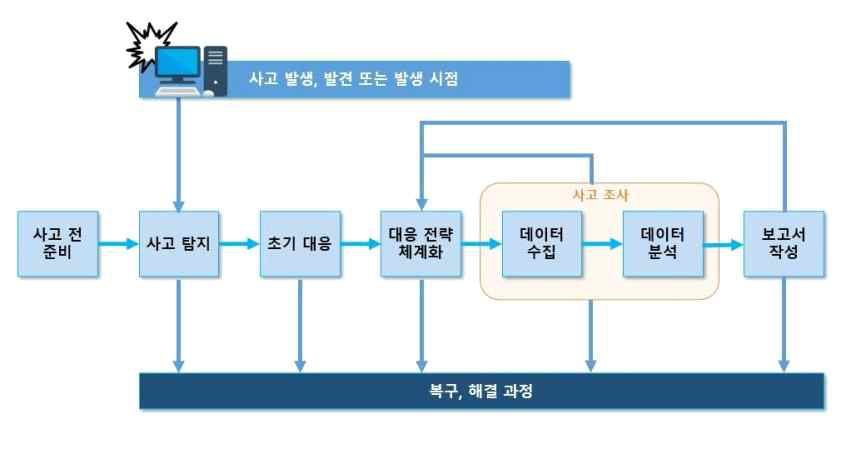

---
<!-- Page 193 -->

## 02. 관리적 분야 기본 항목

2026 주요정보통신기반시설 관리·물리적 취약점 분석·평가 방법 안내서
193
관계 법규
공통
정보통신기반 보호법 제4장(주요정보통신기반시설의 보호 및 침해사고의 대응)
개인정보 보호법 제29조(안전조치의무), 제34조(개인정보 유출 등의 통지·신고)
개인정보의 안전성 확보조치 기준 제4조(내부 관리계획의 수립‧시행 및 점검)
공공기관
-
금융회사
전자금융거래법 제21조의5(침해사고의 통지 등)
전자금융감독규정 제37조의6(침해사고대응기관 지정 및 업무범위 등)
ICT기업
정보통신망 이용촉진 및 정보보호 등에 관한 법률 제48조의4(침해사고 원인분석 등)
정보보호 관리체계 인증 등에 관한 고시 [별표7] 2.11.1 사고 예방 및 대응체계 구축
확인 대상(예시)
☐침해사고 대응 지침·절차·매뉴얼
☐침해사고 대응 조직도 및 비상연락망
☐침해사고 대응 관련 문서 최고책임자 승인 이력
☐보안관제 시스템

---
<!-- Page 194 -->
| 한국인터넷진흥원 |
194
A-105
관리적 분야 > 13. 사고대응
침해사고 발생 시 신속한 보안사고 보고를 위한 절차를 문서화하고 있고 이에 따라 신속한 보고 수행
관련 조직
정보보호 부서
세부 설명
§ 불법침입, 해킹 프로그램·웜·바이러스 유포 등과 같은 사이버 공격 발생 시 신속한 대응과 피해 확산 방지를
위해 표준화된 침해사고 대응 절차를 마련하고 이를 주기적으로 점검하여 정보시스템 및 정보통신망의 안전한
운영을 유지하여야 한다.
§ 침해사고 대응 업무절차는 신고‧접수, 대응, 복구, 보고 등 4단계의 세분화된 절차로 구분하여 정의한다.
신고‧접수 단계에서는 침해사고의 유형과 심각도를 분류하고, 침해사고의 심각 정도에 따른 대응, 복구,
보고가 이루어지도록 체계를 수립하여야 한다.
고려 사항
§ 기반시설은 정보통신기반 보호법에 따라 침해사실을 인지한 때에 관계 행정기관, 수사기관 또는 한국인터넷진흥원
(이하 "관계기관등"이라 한다)에 24시간 이내에 침해사고 발생일시 및 시설, 침해사고로 인한 피해 내역, 기타
신속한 대응·복구를 위하여 필요한 사항을 통지하여야 한다.
§ 개인정보가 유출된 경우에는 72시간 이내에 홈페이지 및 서면 등의 방법으로 해당 정보주체에게 통지를
하여야 하고, 신고 요건에 해당될 경우 72시간 이내에 개인정보보호위원회 또는 한국인터넷진흥원 등에
신고하여야 한다.
근거 법률
개인정보 보호법
신용정보법
제34조(개인정보 유출 등의 통지·신고)
제39조의4(개인신용정보 누설통지 등)
법률간의 관계
일반법
특별법
적용 대상
개인정보처리자
신용정보회사등에서의 상거래기업 및 법인에 한정
※ 그 외 신용정보회사등은 금융위원회 신고
적용 범위
개인정보 유출 등
개인신용정보 누설
의무 사항
통지 및 신고
벌칙 규정
3천만원 이하의 과태료

---
<!-- Page 195 -->

## 02. 관리적 분야 기본 항목

2026 주요정보통신기반시설 관리·물리적 취약점 분석·평가 방법 안내서
195
관계 법규
공통
정보통신기반 보호법 제13조(침해사고의 통지)
개인정보 보호법 제29조(안전조치의무), 제34조(개인정보 유출 등의 통지ㆍ신고)
개인정보 보호법 시행령 제39조(개인정보 유출 등의 통지)
공공기관
-
금융회사
신용정보법 제39조의4(개인신용정보 누설통지 등)
전자금융거래법 제21조의5(침해사고의 통지 등)
전자금융감독규정 제37조의4(침해사고대응기관 지정 및 업무법위 등)
ICT기업
정보통신망 이용촉진 및 정보보호 등에 관한 법률 제48조의3(침해사고의 신고 등)
정보보호 관리체계 인증 등에 관한 고시 [별표7] 2.11.1 사고 예방 및 대응체계 구축
확인 대상(예시)
☐침해사고 대응 업무절차서
☐침해사고 대응을 위한 비상연락망
☐침해사고 발생 신고·접수·대응·분석·보고 등의 결과문서
☐(참고 자료 제18호) 정보통신 침해사고 신고서
☐(참고 자료 제19호) 정보통신 침해사고 결과서
근거 법률
개인정보 보호법
신용정보법
제34조(개인정보 유출 등의 통지·신고)
제39조의4(개인신용정보 누설통지 등)
유출통지
규모
1명 이상
시점
72시간 이내
방법
홈페이지, 서면 등의 방법으로 개별 통지
항목
유출 등이 된 개인정보 항목, 유출 등이 된 시점과 그 경위, 유출 등으로 인하여 발생할 수 있는
피해를 최소화하기 위하여 정보주체가 할 수 있는 방법 등에 관한 정보,개인정보처리자 대응조치
및 피해 구제절차, 피해 신고·상담 부서 및 연락처 등
유출신고
규모
1. 1천명 이상 정보주체의 개인정보 유출 등

## 2. 민감정보, 고유식별정보 유출 등

## 3. 외부로부터의 불법적인 접근에 의해 개인정보가

유출 등
1만명 이상
시점
72시간 이내
기관
개인정보보호위원회 또는 한국인터넷진흥원(KISA)

---
<!-- Page 196 -->
| 한국인터넷진흥원 |
196
A-106
관리적 분야 > 13. 사고대응
침해사고 시 외부기관 및 전문가들과의 대응협조체계 구축
관련 조직
정보보호 부서
세부 설명
§ 침해사고 발생 시 관계 기관 및 외부 전문가(예: 보안컨설팅, 보안관제 등)들과의 협조체계를 통해 정확하고
정밀한 사고분석 및 대응이 이루어질 수 있도록 하여야 한다.
§ 소관 중앙행정기관, 국가정보원, 한국인터넷진흥원 등의 관계 기관과 보안관제, 보안 제품 공급 업체 등 외부
보안업체와의 비상 연락망을 구축하고, 연 1회 이상 정기적으로 업데이트하여 항상 최신 상태를 유지하여
기관, 담당, 연락처 등의 오류가 발생하지 않도록 하여야 한다.
고려 사항
§ 비상연락망에는 주요 정보통신기반시설을 관할하는 행정기관의 관련 부서, 담당자, 연락처뿐만 아니라
보안관제, 보안 장비 유지보수 등을 담당하는 계약업체의 명칭, 담당자, 연락처를 상세히 기재하여야 한다.
관계 법규
공통
정보통신기반 보호법 제15조(대책본부의 구성등), 제16조(정보공유·분석센터)
개인정보 보호법 제29조(안전조치의무), 제34조(개인정보 유출 등의 통지ㆍ신고)
공공기관
-
금융회사
신용정보의 이용 및 보호에 관한 법률 제45조(감독·검사 등)
전자금융거래법 제21조의6(침해사고의 대응)
전자금융감독규정 제37조의6(침해사고대응기관 지정 및 업무범위 등)
ICT기업
정보통신망 이용촉진 및 정보보호 등에 관한 법률 제52조(한국인터넷진흥원)
정보보호 및 개인정보보호 관리체계 인증 등에 관한 고시 [별표7] 2.11.1 사고 예방 및 대응체계 구축
확인 대상(예시)
☐보안사고 발생 시 비상연락망
☐비상연락망의 갱신 이력
☐보안관제서비스 계약서(SLA 등)
☐보안관제 시스템

---
<!-- Page 197 -->

## 02. 관리적 분야 기본 항목

2026 주요정보통신기반시설 관리·물리적 취약점 분석·평가 방법 안내서
197
A-107
관리적 분야 > 13. 사고대응
사이버위기 ‘주의’ 이상 경보 발령 및 피해발생 등 필요 시 대응할 수 있는 ‘긴급대응반’을 구성
관련 조직
정보보호 부서
세부 설명
§ 기반시설은 국가 사이버 비상경보 체계에 따른 대응과 기술적 조치를 수행하여야 한다.
§ 국가 사이버 비상경보 체계는 다음과 같이 분류되며 이 중 ‘주의’ 이상의 경보가 발령되면 자체적인
긴급대응반을 구성하고 필요시에 즉시 소집되어 대응과 기술적 조치 업무를 수행할 수 있도록 하여야 한다.
경보 단계
정의
정상 단계
- 전 분야 정상적인 활동
- 위험도 낮은 웜·바이러스 발생
- 위험도 낮은 해킹기법·보안취약점 발표
관심 단계
- 웜ㆍ바이러스, 해킹기법 등에 의한 피해 발생 가능성 증가
- 다수기관의 정보유출 등 침해사고 확산 가능성 증가
- 국내외 정치ㆍ군사적 위기발생 등 사이버 안보 위해 가능성 증가
- 상기 유형과 유사한 수준의 사이버 위기
주의 단계
- 다수기관의 정보통신망 및 정보시스템 장애 발생
- 다수기관의 정보유출 등 침해사고 확산 가능성 증가
- 국내외 정치ㆍ군사적 위기발생 등 사이버 안보 위해 가능성 고조
- 상기 유형과 유사한 수준의 사이버 위기
경계 단계
- 복수 ISP망 또는 기간망에 피해 발생
- 대규모 피해 확산 가능성 증대
- 정보유출 등 대규모 침해사고 발생
- 복수분야에서 광범위한 피해가 발생하는 등 대규모 피해로 확대될 가능성이 높아 다수기관의
공조 대응이 필요한 경우
- 상기 유형과 유사한 수준의 사이버 위기
심각 단계
- 전국적인 네트워크 및 정보시스템 사용 불가능
- 주요 핵심기반시설의 피해로 국민혼란 발생
- 정보유출 등 대규모 침해사고가 전국적으로 발생
- 국가적 차원의 평가와 조치가 필요하다고 판단되는 사고 발생

---
<!-- Page 198 -->
| 한국인터넷진흥원 |
198
고려 사항
§ 비상연락망에는 기반시설 소관 행정기관의 부서, 담당자이름, 연락처(사무실, 핸드폰, Email)와 국가정보원,
한국인터넷진흥원(KISA)의 연락처를 포함하도록 하고, 계약 관계에 있는 보안관제, 보안 장비 유지보수 등의
업체명, 담당자 이름, 연락처 정도를 포함하도록 한다.
※ 경보단계 : 주의
- 다수기관의 정보통신망 및 정보시스템 장애 발생
- 다수기관의 정보유출 등 침해사고 확산 가능성 증가
- 국내외 정치ㆍ군사적 위기발생 등 사이버 안보 위해 가능성 고조
- 상기 유형과 유사한 수준의 사이버 위기
[그림13] 사이버위기 경보 단계 별 행동요령(예시)
관계 법규
공통
정보통신기반 보호법 제10조(보호지침), 제15조(대책본부의 구성등)
개인정보 보호법 제29조(안전조치의무)
공공기관
국가 정보보안 기본지침 제96조(사이버공격 대응훈련)
금융회사
전자금융거래법 제21조의6(침해사고의 대응)
전자금융감독규정 제23조(비상대책 등의 수립·운용)

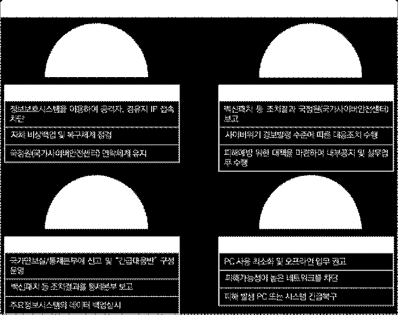

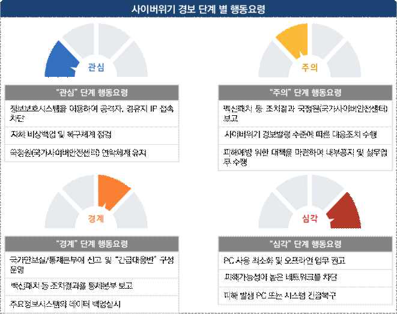

---
<!-- Page 199 -->

## 02. 관리적 분야 기본 항목

2026 주요정보통신기반시설 관리·물리적 취약점 분석·평가 방법 안내서
199
확인 대상(예시)
☐침해사고 대응 계획 문서(예: 지침, 매뉴얼, 가이드 등)
☐긴급대응반 구성 및 활동 이력
☐보안관제 시스템
ICT기업
정보통신망 이용촉진 및 정보보호 등에 관한 법률 제48조의2(침해사고의 대응 등),
제48조의4(침해사고 원인분석 등)
정보보호 관리체계 인증 등에 관한 고시 [별표7] 2.11.1 사고 예방 및 대응체계 구축

---
<!-- Page 200 -->
| 한국인터넷진흥원 |
200
A-108
관리적 분야 > 13. 사고대응
부정접근 사례나 보안사고 내역을 지속적으로 모니터링
관련 조직
정보보호 부서, 시스템운영 부서
세부 설명
§ 주요 시스템에 대한 내·외부 해킹 시도 및 오·남용 여부 등을 모니터링하기 위하여 관련 접속기록을
주기적으로 검토하고 그 결과를 보고하여야 한다.
§ 부정접근, 침해시도, 개인정보유출 시도 등의 이상행위 판단을 위해 이상행위 식별기준 및 임계치를 정의하고,
이에 따라 이상행위의 판단 및 조사 등 후속 조치가 이루어질 수 있도록 하여야 한다.
§ 최신 외부 침해동향, 보안사고 내역을 지속적으로 모니터링하고, 필요 시 최신 침해동향 및 보안사고 사례가
기반시설에 미치는 영향을 분석하여야 한다.
고려 사항
§ 내·외부에 의한 침해시도, 부정접근 등을 신속하게 탐지·대응 할 수 있도록 네트워크 및 데이터 흐름 등을
수집·분석하며, 모니터링 및 점검 결과에 대해 적시에 사후조치 진행을 위해 기관 내부 규정에 따른 주기적인
책임자 보고를 통한 이상 유·무를 관리하여야 한다.
§ 개인정보처리시스템을 운영하는 경우는 관계 법규 및 개인정보 보호법에 따라 개인정보취급자의 접속기록을
월 1회 이상 점검하여야 한다.
관계 법규
공통
정보통신기반 보호법 제12조(주요정보통신기반시설 침해행위 등의 금지),
제16조(정보공유·분석센터)
개인정보 보호법 제29조(안전조치의무)
개인정보의 안전성 확보조치 기준 제8조(접속기록의 보관 및 점검)
공공기관
국가 정보보안 기본지침 제55조(로그기록 유지)
금융회사
전자금융거래법 제21조(안전성의 확보의무)
전자금융감독규정 제13조(전산자료 보호대책), 제14조(정보처리시스템 보호대책), 제29조(거래통제 등)
ICT기업
정보보호 관리체계 인증 등에 관한 고시 [별표7] 2.9.5(로그 및 접속기록 점검), 2.11.3 이상행위
분석 및 모니터링

---
<!-- Page 201 -->

## 02. 관리적 분야 기본 항목

2026 주요정보통신기반시설 관리·물리적 취약점 분석·평가 방법 안내서
201
확인 대상(예시)
☐보안시스템의 모니터링 결과 리포트
☐개인정보취급자의 접속기록에 대한 모니터링(예: DB접근통제) 결과
☐모니터링 결과에 따른 보고 이력
☐모니터링 시스템, 보안관제 시스템

---
<!-- Page 202 -->
| 한국인터넷진흥원 |
202
A-109
관리적 분야 > 13. 사고대응
침해사고 발생에 대비한 대비한 대응절차 및 방법 숙지를 위한 주기적인 교육·훈련 실시
관련 조직
정보보호 부서
세부 설명
§ 침해사고 발생 시 효율적인 대처를 위해 교육 대상, 내용, 방법, 시기 등이 포함된 교육 계획을 수립하고
정기적으로 실시하여야 한다.
§ 침해사고 대응 절차에 따라 신속한 대응 및 복구가 이루어질 수 있도록 관련 조직 및 인력에게 교육을
수행하여 지속적으로 운영되도록 하여야 한다.
§ 침해사고 대응 절차에 대한 실효성을 검증할 수 있는 모의 훈련 계획을 수립하여 연 1회 이상 주기적으로
훈련을 실시하여 그 결과에 따른 대응체계를 검토하여야 한다.
고려 사항
§ 시나리오에 기반한 침해사고 대응 모의훈련을 실시하는 경우 계획과 훈련 실시 내용, 훈련결과보고 등이 함께
이루어지도록 하여야 한다.
§ 사고 발생 시 신속한 대응이 가능하도록 침해사고 대응과 관련된 조직이 모두 참여할 수 있도록 하여야 한다.
관계 법규
공통
정보통신기반 보호법 제11조(보호조치 명령 등)
개인정보 보호법 제29조(안전조치의무)
공공기관
국가 정보보안 기본지침 제96조(사이버공격 대응훈련)
금융회사
전자금융거래법 제21조의3(전자금융기반시설의 취약점 분석·평가), 제21조의6(침해사고의 대응)
전자금융감독규정 제23조(비상대책 등의 수립·운용), 제24조(비상대응 훈련 실시),
제37조의6(침해사고대응기관 지정 및 업무범위 등)
ICT기업
정보통신망 이용촉진 및 정보보호 등에 관한 법률 제48조의3(침해사고의 신고 등),
제48조의4(침해사고의 원인분석 등)
정보보호 관리체계 인증 등에 관한 고시 [별표7] 2.11.4 사고 대응 훈련 및 개선
확인 대상(예시)
☐침해사고 대응 교육 훈련 계획서
☐침해사고 대응 교육 훈련 자료
☐침해사고 대응 교육 훈련 결과 보고서

---
<!-- Page 203 -->

## 02. 관리적 분야 기본 항목

2026 주요정보통신기반시설 관리·물리적 취약점 분석·평가 방법 안내서
203
A-110
관리적 분야 > 13. 사고대응
보안사고 유형, 범위, 영향 등을 포함한 보안사고 분석 결과를 기록 및 관리
관련 조직
정보보호 부서
세부 설명
§ 보안사고 발생 시 침해 유형별 공격에 대한 체계적이고 신속한 대응을 위해 보안사고의 유형(예: 악성코드
공격, 서비스거부공격(DoS), 비인가 접근공격, 복합구성공격 등), 피해범위, 피해정도 등을 포함한 보안사고
분석 결과를 기록‧관리하여야 한다.
§ 보안사고 관련 서식 및 절차를 사전에 정의하여 사고 확인자, 사고내용(일시, 대상, 유형, 범위, 내용),
조치내용(원인, 피해현황, 복구결과) 등의 사항을 확인, 기록하여 보고하고 해당 보고 이력을 보관하도록 한다.
고려 사항
§ 개인정보가 유출된 경우는 법규에서 정하는 사항(유출 항목, 경위, 피해 최소화 방안 등)을 파악하여 해당
개인(정보주체)에게 통지하고 피해규모에 따른 신고 의무를 준수하여야 한다.
관계 법규
공통
정보통신기반 보호법 제4장(주요정보통신기반시설의 보호 및 침해사고의 대응)
개인정보 보호법 제29조(안전조치의무), 제34조(개인정보 유출 등의 통지·신고)
공공기관
-
금융회사
전자금융거래법 제21조의5(침해사고의 통지 등)
전자금융감독규정 제37조의4(침해사고대응기관 지정 및 업무법위 등)
ICT기업
정보통신망 이용촉진 및 정보보호 등에 관한 법률 제48조의3(침해사고의 신고 등),
제48조의4(침해사고의 원인분석 등)
정보보호 관리체계 인증 등에 관한 고시 [별표7] 2.11.1 사고 예방 및 대응체계 구축, 2.11.5(사고 대응 및 복구)
확인 대상(예시)
☐보안 사고 분석 보고서
☐보안 사고 관련 문서 관리 절차
☐보안 사고 조치 사항 보고 이력

---
<!-- Page 204 -->
| 한국인터넷진흥원 |
204
A-111
관리적 분야 > 13. 사고대응
보안 취약점 및 사고 발생시 이에 대한 보완작업 절차 마련
관련 조직
정보보호 부서
세부 설명
§ 보안사고에 따른 피해 복구를 신속하게 진행하기 위하여 사고 유형 등에 따른 복구절차를 수립하여야 한다.
§ 사이버 공격 유형별 맞춤형 대응 전략을 수립하여 신속하고 효과적인 대응 체계를 구축하여야 한다. 특히,
악성코드 감염, DDoS 공격, 비인가 접근 등 주요 공격 유형에 대한 상세한 대응 절차를 마련하여야 한다.
§ 최신 보안 취약점 발생 여부를 지속적으로 파악하고, 최신 보안 취약점이 발견된 경우 해당 보안 취약점이
정보시스템에 미치는 영향을 분석하여 필요시 대응조치를 이행하여야 한다.
고려 사항
§ 대응 및 복구를 위한 시스템 규모, 전문인력 규모 등은 조직의 특성마다 다르기 때문에 상위 기관의 매뉴얼은
참고 자료로 활용하여 자체적인 환경에 맞는 맞춤형 대응 매뉴얼을 수립하도록 한다.
§ 인프라, 인력 등의 환경을 고려하여 자체적인 대응 및 복구절차를 규정화하는 것이 필요하다.
관계 법규
공통
정보통신기반 보호법 제11조(보호조치 명령 등), 제14조(복구조치)
개인정보 보호법 제29조(안전조치의무)
공공기관
국가 정보보안 기본지침 제96조(사이버공격 대응훈련)
금융회사
전자금융거래법 제21조(안전성의 확보의무), 제21조의3(전자금융기반시설의 취약점 분석·평가)
전자금융감독규정 제23조(비상대책 등의 수립·운용)
ICT기업
정보통신망 이용촉진 및 정보보호 등에 관한 법률 제47조의4(이용자 정보보호)
정보보호 관리체계 인증 등에 관한 고시 [별표7] 2.11.2 취약점 점검 및 조치, 2.11.5 사고 대응 및 복구
확인 대상(예시)
☐보안사고에 따른 대응 및 복구 지침 또는 절차
☐최신 보안 취약점 조치 계획서 및 결과서
☐보안관제 시스템

---
<!-- Page 205 -->

## 02. 관리적 분야 기본 항목

2026 주요정보통신기반시설 관리·물리적 취약점 분석·평가 방법 안내서
205
A-112
관리적 분야 > 13. 사고대응
사이버침해사고 발생 후 재발방지 대책 수립‧이행
관련 조직
정보보호 부서
세부 설명
§ 보안사고 발생 시 유사한 사고의 재발을 방지하기 위해 철저한 원인 분석을 바탕으로 효과적인 대책을
수립하고 이를 실행하여야 한다.
§ 실제 보안사고가 발생하여 기록, 보고 및 복구조치까지 이루어진 경우 해당 사고에 대한 재발 방지 대책의
수립뿐만 아니라, 실제 실행 여부를 철저히 점검하여 유사 사고를 예방하여야 한다.
고려 사항
§ 정보시스템에 기술적 요인으로 사고가 발생한 경우 그 경위에 대해 분석하여 개선 사항을 마련하고 재발 방지
대책을 수립하여야 한다. 인적요인(Human Error)으로 발생한 경우 고의성, 타당성 등 사유에 대한 명확한
경계를 나누어 상·벌 규정 등을 수립하고 교육 및 징계 등의 재발 방지 대책을 마련하여야 한다.
관계 법규
공통
정보통신기반 보호법 제11조(보호조치 명령 등), 제14조(복구조치)
개인정보 보호법 제29조(안전조치의무)
공공기관
-
금융회사
전자금융거래법 제21조의3(전자금융기반시설의 취약점 분석·평가)
전자금융감독규정 제23조(비상대책 등의 수립·운용)
ICT기업
정보통신망
이용촉진
및
정보보호
등에
관한
법률
제47조의4(이용자
정보보호),
제48조의4(침해사고의 원인 분석 등)
정보보호 관리체계 인증 등에 관한 고시 [별표7] 2.11.5 사고대응 및 복구
확인 대상(예시)
☐보안사고 대응 및 복구에 관한 규정 또는 지침
☐보안사고 재발 방지 대책 및 그 이행 여부
☐보안관제 시스템

---
<!-- Page 206 -->
| 한국인터넷진흥원 |
206
A-113
관리적 분야 > 13. 사고대응
침해사고 처리, 계약증빙 및 소송 등을 위한 적정한 증거자료 확보에 관한 지침 수립‧이행
관련 조직
정보보호 부서
세부 설명
§ 보안사고 발생 등에 따른 사고 경위, 책임 소재를 확인하기 위하여 정보시스템 상의 접속기록, 검토 및 보고
등의 업무 이력을 확보하여 증거자료로서 법적 효력을 갖출 수 있도록 하여야 한다.
§ 업무처리 이력에 대한 문서 또는 전자문서의 안전한 보존이 이루어져야 하고 특히 정보시스템에 대한 정확한
시각이 설정되어 시스템에 대한 행위 일시가 증거로서 효력이 있도록 하여야 한다.
고려 사항
§ 각종 문서, 전자문서, 접속기록 등은 안전한 보관(예: 통제구역으로 설정된 문서고 보관, 백업 후 별도
저장매체(또는 스토리지)에 저장하여 시건 보관)을 통해 비인가자에 의한 훼손이 발생하지 않도록 하여야 한다.
관계 법규
공통
정보통신기반 보호법 제10조(보호지침)
개인정보 보호법 제29조(안전조치의무)
공공기관
국가 정보보안 기본지침 제55조(로그기록 유지)
금융회사
전자금융거래법 제21조(안전성의 확보의무), 제22조(전자금융거래기록의 생성·보존 및 파기)
전자금융감독규정 제13조(전산자료 보호대책)
ICT기업
정보통신망 이용촉진 및 정보보호에 관한 법률 제48조의4(침해사고의 원인 분석 등)
정보보호 관리체계 인증 등에 관한 고시 [별표7] 2.9.4 로그 및 접속기록 관리, 2.9.6 시간동기화
확인 대상(예시)
☐보안 사고 절차 관련 규정 또는 지침
☐보안 사고 관련 문서·접속 기록 등 보존 장소 및 방법
☐시간 동기화 설정

---
<!-- Page 207 -->

## 02. 관리적 분야 기본 항목

2026 주요정보통신기반시설 관리·물리적 취약점 분석·평가 방법 안내서
207
14
업무 연속성
A-114
관리적 분야 > 14. 업무연속성
기반시설의 서비스(업무) 연속성을 위협할 수 있는 IT 재해 유형을 식별하고 유형별 피해규모 및 업무에
미치는 영향을 분석하여 핵심 IT 서비스(업무) 및 시스템을 식별
관련 조직
정보보호 부서
세부 설명
§ 기반시설의 서비스(업무)는 IT 재해가 발생하더라도 서비스(업무)가 중단되지 않도록 핵심 IT 서비스 및
시스템을 식별하기 위해 업무영향분석(BIA)를 수행하여야 한다.
§ 기반시설의 서비스(업무) 연속성을 위협할 수 있는 IT 재해 유형을 식별하여 장애 발생 시 피해규모 및 업무에
미치는 영향을 분석하고, 분석 결과를 바탕으로 기반시설 핵심 IT 서비스(업무) 및 시스템을 식별한다.
고려 사항
§ IT 재해 유형을 식별할 때 다음과 같은 원인 등을 고려한다.
기준(예시)
설명
자연적
화재, 지진, 홍수, 태풍 등
인위적
내부요인
인재, 관리적 오류, 파업 등
외부요인
해킹, 사이버 테러, 시스템 결함, 네트워크 장애 등
§ 피해규모 및 업무에 미치는 영향을 분석할 때 다음과 같은 사항 등을 고려한다.
- 업무 중요도: 중요도가 높은 서비스(업무)의 중요도
- 복구 시간: 복구에 걸리는 시간
- 보안성: 보안성이 높은지 여부
- 연계성: 다른 시스템과 연계 정도
- 파급 효과: 대내ㆍ외 파급효과 영향
- 대체 가능성: 다른 시스템 및 서비스로 대체할 수 있는지 여부

---
<!-- Page 208 -->
| 한국인터넷진흥원 |
208
관계 법규
공통
정보통신기반 보호법 제5조(주요정보통신기반시설보호대책의 수립 등)
개인정보 보호법 제29조(안전조치의무)
개인정보의 안전성 확보조치 기준 제11조(재해·재난 대비 안전조치)
공공기관
국가 정보보안 기본지침 제92조(재난 방지대책)
금융회사
전자금융거래법 제 21조(안전성의 확보의무)
전자금융감독규정 제23조(비상대책 등의 수립ㆍ운용)
ICT기업
정보보호 관리체계 인증 등에 관한 고시 [별표7] 2.12.2 재해 복구 시험 및 개선
확인 대상(예시)
☐업무영향분석평가(BIA) 결과보고서
☐IT 재해 복구 지침 또는 절차
☐업무연속성 관리 지침

---
<!-- Page 209 -->

## 02. 관리적 분야 기본 항목

2026 주요정보통신기반시설 관리·물리적 취약점 분석·평가 방법 안내서
209
A-115
관리적 분야 > 14. 업무연속성
핵심 IT서비스(업무) 및 시스템의 특성에 따른 복구 목표시간, 복구 목표시점을 정의
관련 조직
정보보호 부서, 서비스관리 부서, 시스템운영 부서
세부 설명
§ 업무영향분석평가(BIA)를 통해 도출된 핵심 IT 서비스(업무) 및 시스템에 대하여 중요도 및 특성에 따른 복구
목표시간(RTO: Recovery Time Objective) 및 복구 목표시점(RPO: Recovery Point Objective)을 정의한다.
§ 핵심 IT 서비스(업무) 및 시스템의 중요도와 복구 우선순위를 설정하여 효율적인 복구가 이루어지도록  한다.
§ 법적 요건에 따라 금융회사의 경우 핵심업무의 복구 목표시간을 3시간 이내로 설정하여야 하며, 다만
보험회사의 핵심업무인 경우에는 24시간 이내로 설정하여야 한다.
고려 사항
§  IT재해복구전략을 수립할 때는 서비스관리 부서, 시스템운영 부서 등과 함께 복구 목표 시간(RTO) 및 복구
목표 시점(RPO), 복구를 위한 방법 등을 결정하여 수립 한다.
§ 복구 목표 시간(RTO) 및 복구 목표 시점(RPO)를 고려하여 백업 및 소산 방안, 백업센터 구축 운영 방안 등
업무연속성을 위한 전략을 수립하여야 한다.
관계 법규
공통
정보통신기반 보호법 제5조(주요정보통신기반시설보호대책의 수립 등)
개인정보 보호법 제29조(안전조치의무)
개인정보의 안전성 확보조치 기준 제11조(재해·재난 대비 안전조치)
공공기관
국가 정보보안 기본지침 제92조(재난 방지대책)
금융회사
전자금융거래법 제21조(안전성의 확보의무)
전자금융감독규정 제23조(비상대책 등의 수립ㆍ운용)
ICT기업
정보보호 관리체계 인증 등에 관한 고시 [별표7] 2.12.1 재해 재난 대비 안전조치
확인 대상(예시)
☐IT 재해 복구지침
☐IT 재해복구 계획(RTO, RPO 정의 포함)
☐소산백업 장소 또는 백업센터

---
<!-- Page 210 -->
| 한국인터넷진흥원 |
210
A-116
관리적 분야 > 14. 업무연속성
재해 및 재난 발생 시에도 기반시설 서비스 및 시스템의 연속성을 보장할 수 있도록 복구 전략 및 대책,
비상시 복구 조직, 비상연락체계, 복구 절차 등 재해 복구 계획 수립‧이행
관련 조직
정보보호 부서, 시스템 운영 부서
세부 설명
§ 재해·재난 발생 시에도 핵심 IT 서비스(업무) 및 시스템의 연속성을 보장할 수 있도록 복구 전략 및 대책,
비상시 복구 조직, 비상연락체계, 복구 절차 등 재해 복구 계획을 수립·이행하여야 한다.
§ IT 재해 발생 시 사전 정의한 서비스 및 시스템 복구 목표시간(RTO) 및 복구 목표시점(RPO)을 달성할 수
있도록 단계별로 수행할 복구 절차를 체계적으로 수립하여야 한다.
§ 관련 법률에 따라 개인정보처리자의 경우 재해·재난 발생 시 개인정보처리시스템 보호를 위한 위기대응
매뉴얼 등 대응절차를 마련하여 정기적으로 점검하고, 개인정보처리시스템 백업 및 복구를 위한 계획을
마련하여야 한다.
고려 사항
§ 비상시 복구 조직을 구성할 때는 역할과 책임을 명확히 하고 재해 발생 시 즉각적으로 연락할 수 있는
연락망을 구축하여 정기적으로 비상 연락처 정보를 갱신하여야 한다.
§ 자연재해, 통신·전력 장애, 해킹 등 조직의 핵심 서비스 및 시스템의 운영 연속성을 위협할 수 있는 재해 유형을
식별하고, 유형별 예상 피해규모 및 영향을 분석하여야 한다.
§ 복구 목표시간, 복구 목표시점을 정의하고 복구 전략 및 대책, 비상시 복구 조직, 비상연락체계, 복구 절차 등
재해 복구체계를 구축하여야 한다.
§ IT 재해 발생 시 신속한 복구가 가능하도록 다음 내용을 포함한 IT 재해 복구 체계를 구축하여야 한다.
단계
설명
재해 시 복구조직 및 역할 정의
IT 재해 발생 시 복구를 위한 관련부서 및 담당자 역할과 책임 부여
비상연락체계
조직 내 관련 부서 담당자, 유지보수 업체 등 복구 조직상 연락체계 구축
복구 전략 및 대책 수립방법론
업무영향분석, 복구 목표시간 및 복구 목표시점 정의, 핵심 IT 서비스
복구 순서 정의
복구 목표 시간별로 정보시스템의 복구 순서 정의

---
<!-- Page 211 -->

## 02. 관리적 분야 기본 항목

2026 주요정보통신기반시설 관리·물리적 취약점 분석·평가 방법 안내서
211
관계 법규
공통
정보통신기반 보호법 제5조(주요정보통신기반시설보호대책의 수립 등)
개인정보 보호법 제29조(안전조치의무)
개인정보의 안전성 확보조치 기준 제11조(재해·재난 대비 안전조치)
공공기관
국가 정보보안 기본지침 제92조(재난 방지대책)
금융회사
전자금융거래법 제21조(안전성의 확보의무)
전자금융감독규정 제23조(비상대책 등의 수립ㆍ운용)
ICT기업
정보보호 관리체계 인증 등에 관한 고시 [별표7] 2.12.1 재해 재난 대비 안전조치
확인 대상(예시)
☐IT 재해 복구 지침 또는 절차
☐IT 재해 복구 계획(RTO, RPO 정의 포함)
☐비상연락망
단계
설명
복구 절차
1단계
사고 인지 및 비상 상황 선언
2단계
초기 조치 및 비상 대응
3단계
복구 환경 전환
4단계
데이터 복구
5단계
서비스 복구
6단계
정상 운영 검증
7단계
복구 종료 및 사후 관리

---
<!-- Page 212 -->
| 한국인터넷진흥원 |
212
A-117
관리적 분야 > 14. 업무연속성
보안중요성이 높은 등급의 시스템들은 이중화하여 관리
관련 조직
정보보호 부서, 시스템 운영 부서
세부 설명
§ 기반시설의 핵심 IT 서비스(업무)는 보안중요성이 높은 등급의 시스템들을 이중화하여 관리함으로써, IT 재해
발생 시에도 서비스 연속성을 보장하여야 한다.
§ IT 재해 복구계획에 따른 복구목표 우선 순위가 높은 시스템은 이중화하여 관리한다. 특히 고가용성이
요구되는 보안시스템, 네트워크 장비, 웹서버 등의 주요 시스템은 이중화 대상으로 고려할 필요가 있다.
고려 사항
§ 이중화 대상에는 예산, 자체 기준(예: IT 재해 복구 전략)을 고려하여 이중화 여부와 대상을 결정할 수 있다.
§ 이중화가 시스템 성능에 미치는 영향을 고려하고, 부하 분산과 성능 최적화를 계획하여야 한다.
관계 법규
공통
정보통신기반 보호법 제5조(주요정보통신기반시설보호대책의 수립 등)
개인정보 보호법 제29조(안전조치의무)
개인정보의 안전성 확보조치 기준 제11조(재해·재난 대비 안전조치)
공공기관
국가 정보보안 기본지침 제92조(재난 방지대책)
금융회사
전자금융거래법 제21조(안전성의 확보의무)
전자금융감독규정 제23조(비상대책 등의 수립ㆍ운용)
ICT기업
정보보호 관리체계 인증 등에 관한 고시 [별표7] 2.12.1 재해 재난 대비 안전조치
확인 대상(예시)
☐업무영향분석평가(BIA) 결과보고서
☐IT 재해 복구 전략(복구목표 우선순위 포함)
☐네트워크 구성도(이중화 시스템 현황 포함)
☐이중화된 정보시스템

---
<!-- Page 213 -->

## 02. 관리적 분야 기본 항목

2026 주요정보통신기반시설 관리·물리적 취약점 분석·평가 방법 안내서
213
A-118
관리적 분야 > 14. 업무연속성
모의 훈련 등을 통해 업무 연속성을 지속적으로 검토 및 관리하고, 조직 내의 변경이 있을 경우 이에 대
한 사항을 반영
관련 조직
정보보호 부서, 시스템 운영 부서
세부 설명
§ 기반시설의 서비스(업무)는 모의 훈련을 통해 업무 연속성을 지속적으로 검토 및 관리하고, 재해 발생 시
적절히 대응할 수 있는 능력을 강화하여야 한다.
§ 정기적인 모의 훈련을 통하여 복구절차 및 계획이 실제 상황에서도 효과적으로 작동하는지 확인하고 개선점을
도출하여야 한다.
§ 모의훈련 시나리오를 수립하며, 관계 비상조직과 함께 모의훈련을 수행하는 내용을 포함하는 IT 재해 복구
모의훈련계획을 수립하고 모의훈련 결과를 문서화하여야 한다.
§ 모의 훈련 결과에 따라 IT 재해 복구 전략을 보완 및 개정하여, 최신 상태로 유지 및 지속적인 개선관리가 되도록 한다.
고려 사항
§ IT 재해 복구 전략을 지속적으로 현행화하여 조직 내의 변경, 업무환경과 요구사항의 변화에 대응할 수 있도록
하여야 한다.
§ IT 재해 복구 전략에 따라 효과적인 복구(예: OO시스템(또는 서비스)은 2시간 이내에 복구)가 가능한 지 IT
재해 복구 모의훈련을 실시하여야 한다. 다만 매년 동일한 수준의 훈련(예: 일부 관계자가 모여서
회의방식으로 상황 시나리오별 역할과 대응시간만 확인)만 이루어지면 복구대상/목표 및 대책(예: 이중화,
소산백업, 유휴장비 비치, 백업센터 운영 등)의 적절성 판단이 어려울 수 있다.
§ 1년 차는 IT 재해 복구 모의훈련을 계획서를 작성하고, 2년 차에는 도상훈련(시나리오 중 일부는 실 훈련), 3년
차에는 실 훈련이 가능한 시나리오 기반의 모의훈련을 수행(예: 훈련을 위한 별도 서버를 구축하는 것을
전제로, 웹사이트 장애 신고를 받고 그 원인을 확인 결과, DB서버의 디스크 오류로 확인되어 DB서버를
복구하고 웹사이트 서비스가 정상적으로 제공되는 것을 확인)하는 등 단계적으로 모의훈련 강도를 높여 실현
가능한 목표를 수립·이행하는 것을 고려할 수 있다.
§ 전자금융감독규정에 따른 요건에 해당하는 금융회사 및 전자금융업자는 매년 1회 이상 재해복구센터로 실제
전환하는 재해복구전환 훈련을 실시하여야 한다.

---
<!-- Page 214 -->
| 한국인터넷진흥원 |
214
관계 법규
공통
정보통신기반 보호법 제5조(주요정보통신기반시설보호대책의 수립 등)
개인정보 보호법 제29조(안전조치의무)
개인정보의 안전성 확보조치 기준 제11조(재해·재난 대비 안전조치)
공공기관
국가 정보보안 기본지침 제92조(재난 방지대책)
금융회사
전자금융거래법 제21조(안전성의 확보의무)
전자금융감독규정 제23조(비상대책 등의 수립ㆍ운용), 제23조(비상대응훈련 실시)
ICT기업
정보보호 관리체계 인증 등에 관한 고시 [별표7] 2.12.2 재해복구 심험 및 개선
확인 대상(예시)
☐복구 절차 및 계획 검토 내역
☐모의훈련 수행 결과 보고서
☐모의훈련 효과 분석 내역
☐IT 재해 복구 지침 또는 절차

---
<!-- Page 215 -->

## 1. 물리보안·················································································································217

물리적 분야 기본 항목
Chapter 03

2026 주요정보통신기반시설 관리·물리적 취약점 분석·평가 방법 안내서

---
<!-- Page 216 -->
| 한국인터넷진흥원 |
216
l 물리분야
번호
취약점 점검 항목
P-1
보호구역의 출입에 관한 정책과 절차를 수립하고 이에 따라 출입통제 수행
P-2
물리적 중요도에 따라 제한구역, 통제구역 등으로 분류하는 다단계 보호 대책 수행
P-3
주요 시스템에 대한 별도의 출입통제를 실시하거나 이중의 보호장치 설치
P-4
민감한 시설에 대해 물리적으로 접근하는 사람들의 출입기록 및 허가의 타당성을 주기적으로 검토
P-5
제한구역 내 작업에 대한 추가적인 통제 수단 및 안내 지침 마련
P-6
주요시설에 대한 출입기록은 출입일로부터 일정기간 이상 보관
P-7
외부인에 대해서 출입증을 발급하고, 출입권한은 출입목적이 필요한 구역내로 한정
P-8
전산 장비실에 외부협력업체 출입 시 내부 임직원이 상시 동행
P-9
시각적으로 구분이 가능한 신분증 패용
P-10
주요장비, 대체시스템 및 자료들을 화재, 습도 등의 환경재해로부터 보호되는 적절한 곳에 배치하여 보호
P-11
전원공급 이상이나 기타 전기관련 사고로부터 장비 보호(UPS, 비상발전기, 이중전원선 등의 설비)
P-12
전원공급 이상이나 기타 전기관련 사고로부터 장비를 보호하기 위해 설비 상태에 대해 정기적으로 검토
P-13
전원선 및 통신선은 도청이나 손상으로부터 보호
P-14
누전이 발생하였을 때 이를 차단할 수 있도록 누전차단기 또는 누전경보기의 설치
P-15
전산실에 24시간 항온, 항습을 유지하기 위하여 온습도 측정이 가능하도록 항온항습기 등을 설치 및 운영
P-16
주요시설(중앙감시실, 전산실, 전력관련시설, 통신장비실, 방재센터 등)에는 기존 조명설비의 작동이 멈추는
경우에도 작업이 가능하도록 비상조명을 설치
P-17
주요시설의 출입구와 전산실 및 통신장비실 내부에 CCTV를 설치
P-18
CCTV 운용 시 중계·관제서버, 관리용 PC, 정보통신망 등에 대해 보안대책을 수립

---
<!-- Page 217 -->

## 03. 물리적 분야 기본 항목

2026 주요정보통신기반시설 관리·물리적 취약점 분석·평가 방법 안내서
217
1
물리보안
P-1
관리적 분야 > 1. 물리보안
보호구역의 출입에 관한 정책과 절차를 수립하고 이에 따라 출입통제 수행
관련 조직
정보보호 부서, 시설 관리 부서
세부 설명
§ 비밀, 개인정보 및 중요정보 저장시설, 기반시설 서비스(업무)의 주요 장비가 운영되는 시설 등은 인가된
사람만이 출입하도록 접근통제 정책과 절차를 수립·이행하여야 한다.
§ 보호구역 지정기준을 마련하고 해당 기준에 따라 물리적 시설을 제한구역, 통제구역 등으로 분류하고 각
보호구역별 보호대책을 수립·이행하여야 한다.
보호구역
정의
예시
제한구역
비인가 접근을 방지하기 위해 출입 통제 장치 및 감시 시스템이
설치되어 있으며, 직원 카드와 같은 출입증이 필요한 장소
부서별 사무실,
회의실등
통제구역
제한 구역의 통제 항목을 모두 포함하며 출입 자격이 최소
인원으로 유지되고 출입을 위해 추가 절차가 필요한 장소
서버실, 전산실, 통신실, 관제실,
전원실, 공조실, 발전기실 등
§ 각 보호구역의 중요도 및 특성을 반영하여 보호대책 이행을 위한 출입통제 장비를 갖추어야 한다.
고려 사항
§ 공공기관은 지정된 보호구역에 대한 출입자 식별ㆍ인증 등을 위한 출입문 보안장치 설치 및 주·야간
감시대책을 수립하여야 한다.
§ 출입통제 장비는 지식·소유·생체 기반 중 자산의 중요도 및 통제 목적 등을 고려하여 디지털도어락, ID카드,
지문인식기 등을 선택하여 통제하여야 한다.
§ 출입통제 장비에 출입 및 접근 이력이 기록되지 않을 경우 이력관리를 위해 출입관리대장 등을 작성하여야 한다.
§ 개별 출입 통제 장비를 통합하여 출입 보안 시스템을 구축함으로써 종합적인 물리보안 체계를 마련하여
위험요소가 최소화된 환경을 조성하는 것을 고려할 수 있다.

---
<!-- Page 218 -->
| 한국인터넷진흥원 |
218
§ 출입통제시스템이 있더라도 필요시 출입하는 인원에 대한 출입 및 접근현황을 목록으로 관리할 수 있는
별도의 출입관리대장을 비치하여 관리한다.
관계 법규
공통
정보통신기반 보호법 제5조(주요정보통신기반시설보호대책의 수립 등)
개인정보 보호법 제29조(안전조치의무)
개인정보의 안전성 확보조치 기준 제10조(물리적 안전조치)
공공기관
국가 정보보안 기본지침 제87조(정보통신시설 보호대책), 제88조(정보통신시설 출입관리)
금융회사
전자금융거래법 제21조(안전성의 확보의무)
전자금융감독규정 제9조(건물에 관한 사항), 제11조(전산실 등에 관한 사항)
ICT기업
정보통신망 이용촉진 및 정보보호 등에 관한 법률 제46조(집적된 정보통신시설의 보호)
정보보호 및 개인정보보호 관리체계 인증 등에 관한 고시 [별표7] 2.4.1 보호구역 지정, 2.4.2
출입통제
확인 대상(예시)
☐보호구역(물리적) 보안 지침
☐보호구역 지정 현황
☐제한구역·통제구역 표시
☐보호구역별 설치된 보호설비
☐출입통제시스템
☐(서식 자료 제20호) 보호구역 관리대장
☐(서식 자료 제21호) 제한구역· 통제구역 출입자 명부

---
<!-- Page 219 -->

## 03. 물리적 분야 기본 항목

2026 주요정보통신기반시설 관리·물리적 취약점 분석·평가 방법 안내서
219
P-2
관리적 분야 > 1. 물리보안
물리적 중요도에 따라 제한구역, 통제구역 등으로 분류하는 다단계 보호 대책 수행
관련 조직
정보보호 부서, 시설 관리 부서
세부 설명
§ 보호구역은 그 중요도에 따라 제한구역, 통제구역 등으로 차등화하고 중요 구역에 따른 차별화된 보호 대책을
강구하여야 하며, 보호구역 내 작업 절차를 수립하고 필요 설비를 갖추어야 한다.
§ 보호구역별 내부 직원, 외부 직원(유지보수 등)의 출입에 대한 출입 절차를 수립하여 적용하여야 한다.
§ 통제구역은 제한구역의 통제 항목을 모두 포함하여 보호대책을 수립·이행하고 외부인 또는 비인가자의
출입을 통제할 수 있도록 ‘출입통제구역’임을 표시하여 최소한으로 제한한 인가자만을 출입 허용하여야 한다.
§ 비인가자의 접근이 엄격히 통제되어야 하는 장소(예:정보통신실, 서버실 등)는 출입을 통제할 수 있는
기술적인 출입통제 조치를 하여야 하며, 관계 법규에 따른 요건이 있는 경우 이를 준수하여야 한다.
고려 사항
§ 공공기관 등에 적용되는 보안업무규정 시행규칙 제54조(보호지역의 구분)에서는 제한지역, 제한구역,
통제구역 등의 보호구역을 다음과 같이 정의한다.
구분
정의
제한지역
비밀 또는 국·공유재산의 보호를 위하여 울타리 또는 방호·경비인력에 의하여 승인을 받지
않은 사람의 접근이나 출입에 대한 감시가 필요한 지역
제한구역
비인가자가 비밀, 주요시설 및 Ⅲ급 비밀 소통용 암호자재에 접근하는 것을 방지하기 위하여
안내를 받아 출입하여야 하는 구역
통제구역
보안상 매우 중요한 구역으로서 비인가자의 출입이 금지되는 구역
§ 제한구역은 접견구역 이외의 모든 장소로 지정하여 출입통제 절차(예: 사전 방문신청, 임직원 상시 동행,
신분증 패용)를 따르고, 통제구역은 연구개발실, 전산실, 기계실, 문서고로 지정하여 CCTV, 사전출입권한이
부여된 인원만 출입, 이중신원확인(예: ID카드 및 지문) 절차를 적용하여야 한다.
§ 관계 법규에 따라 공공기관, 집적정보통신시설(IDC)의 경우는 주요시설 중 중앙감시실, 전산실, 전력감시실,
통신장비실, 방재센터의 출입구에 출입자의 신원확인을 통해 개폐되는 잠금장치를 설치하고, 해당 보호구역에
반드시 ID카드 또는 지문 등 출입통제를 적용하여야 한다.

---
<!-- Page 220 -->
| 한국인터넷진흥원 |
220
관계 법규
공통
정보통신기반 보호법 제5조(주요정보통신기반시설보호대책의 수립 등)
개인정보 보호법 제29조(안전조치의무)
공공기관
국가 정보보안 기본지침 제87조(정보통신시설 보호대책)
금융회사
자금융거래법 제21조(안전성의 확보의무)
전자금융감독규정 제9조(건물에 관한 사항), 제11조(전산실 등에 관한 사항)
ICT기업
정보통신망 이용촉진 및 정보보호 등에 관한 법률 제46조(집적된 정보통신시설의 보호)
정보보호 및 개인정보보호 관리체계 인증 등에 관한 고시 [별표7] 2.4.1 보호구역 지정
확인 대상(예시)
☐보호구역(물리적) 보안 지침
☐제한구역·통제구역 표시
☐보호구역 출입 관리 대장
☐보호구역별 출입 통제 절차
☐보호구역별 설치된 보호설비

---
<!-- Page 221 -->

## 03. 물리적 분야 기본 항목

2026 주요정보통신기반시설 관리·물리적 취약점 분석·평가 방법 안내서
221
P-3
관리적 분야 > 1. 물리보안
주요 시스템에 대한 별도의 출입통제를 실시하거나 이중의 보호장치 설치
관련 조직
정보보호 부서, 시설 관리 부서
세부 설명
§ 주요 시스템이 배치된 구역은 비인가자에 대한 철저한 출입통제가 이루어지도록 별도의 출입통제 절차를
마련하여 실시하거나 이중의 출입통제장비를 설치하여야 한다.
§ 주요 시스템이 배치된 구역은 상시 이용하는 출입문은 한 곳으로 정하고 이중의 출입통제장비를 설치하여야
하며, 외벽이 유리인 경우 유리창문을 통하여 접근할 수 없도록 조치하여야 한다.
고려 사항
§ 출입통제 방법을 ID카드, 지문 등 소유·생체기반으로 적용하고, 불가피한 사유로 정보시스템을 통제구역 내에
위치시키기 어렵다면 시건 가능한 출입통제(예: 디지털 도어락)와 정보시스템이 위치한 랙(Rack)을 열쇠
시건하는 등의 이중 출입통제를 적용할 수 있다.
관계 법규
공통
정보통신기반 보호법 제5조(주요정보통신기반시설보호대책의 수립 등)
개인정보 보호법 제29조(안전조치의무)
개인정보 안전성 확보조치 기준 제10조(물리적 안전조치)
공공기관
국가 정보보안 기본지침 제87조(정보통신시설 보호대책)
금융회사
전자금융거래법 제21조(안전성의 확보의무)
전자금융감독규정 제9조(건물에 관한 사항), 제11조(전산실 등에 관한 사항)
ICT기업
정보통신망 이용촉진 및 정보보호 등에 관한 법률 제46조(집적된 정보통신시설의 보호)
정보보호 및 개인정보보호 관리체계 인증 등에 관한 고시 [별표7] 2.4.2 출입통제
확인 대상(예시)
☐보호구역(물리적) 보안 지침
☐주요 시스템 출입통제 절차 또는 방법
☐보호구역별 설치된 보호설비
☐(서식 자료 제20호) 보호구역 관리대장
☐(서식 자료 제21호) 제한구역· 통제구역 출입자 명부

---
<!-- Page 222 -->
| 한국인터넷진흥원 |
222
P-4
관리적 분야 > 1. 물리보안
민감한 시설에 대해 물리적으로 접근하는 사람들의 출입기록 및 허가의 타당성을 주기적으로 검토
관련 조직
정보보호 부서, 시설 보안 부서
세부 설명
§ 통제구역 등의 민감한 시설에 대해 출입기록 및 출입권한 타당성 검토 등을 매월 또는 분기마다 주기적으로
수행하여 불필요한 권한을 삭제하여야 한다.
§ 타당성 검토 등을 주기적으로 수행하기 위해 보호구역 별로 출입가능한 부서·직무·업무 등을 정의하고,
출입권한이 부여된 임직원을 식별하고 그 현황을 관리하여야 한다.
§ 출입권한을 보유한 인원에 대한 변경사항(임직원의 퇴사 및 부서이동, 외주용역인원의 종료 및 인원교체 등)이
발생하는 경우 지체없이 권한을 삭제하여야 한다.
고려 사항
§ 통제구역 등의 보호구역에 대한 출입권한 타당성 검토는 다음의 사항을 포함하여야 한다. 또한 검토 결과에
따라 출입권한의 변경, 삭제 등 출입권한 조정이 필요하면 관리책임자에게 승인을 받아야 한다.
No.
출입권한 타당성검토 체크리스트
1
퇴사 및 부서 이동 등의 사유로 출입권한이 불필요하게 된 인원이 있는가?
2
장기간 출입기록이 없어 출입권한이 불필요한 인원이 있는가?
3
일과 외 시간 등 출입 사유가 타당하지 않는 것으로 추정되는 출입기록(출입인원)이 있는가?
§ 시스템으로 출입 및 접근로그를 남길 수 없는 경우 기록된 출입관리대장을 검토하여야 한다.
§ 출입기록 및 출입권한 타당성 검토 시 내･외부직원의 출입기록 뿐만 아니라 외주용역인원(시설 용역원, 청소
용역원 등)의 출입기록 또한 검토하여야 한다.

---
<!-- Page 223 -->

## 03. 물리적 분야 기본 항목

2026 주요정보통신기반시설 관리·물리적 취약점 분석·평가 방법 안내서
223
관계 법규
공통
정보통신기반 보호법 제5조(주요정보통신기반시설보호대책의 수립 등)
개인정보 보호법 제29조(안전조치의무)
개인정보의 안전성 확보조치 기준 제10조(물리적 안전조치)
공공기관
국가 정보보안 기본지침 제87조(정보통신시설 보호대책), 제88조(정보통신시설 출입관리)
금융회사
전자금융거래법 제21조(안전성의 확보의무)
전자금융감독규정 제9조(건물에 관한 사항), 제11조(전산실 등에 관한 사항)
ICT기업
정보통신망 이용촉진 및 정보보호 등에 관한 법률 제46조(집적된 정보통신시설의 보호)
정보보호 및 개인정보보호 관리체계 인증 등에 관한 고시 [별표7] 2.4.2 출입통제
확인 대상(예시)
☐보호구역(물리적) 보안 지침
☐보호구역에 대한 출입기록·권한 검토 내역
☐출입통제시스템 화면(출입자 등록 현황 등)
☐출입권한 조정 승인 내역(등록, 변경, 삭제 등)
☐(서식 자료 제21호) 제한구역· 통제구역 출입자 명부

---
<!-- Page 224 -->
| 한국인터넷진흥원 |
224
P-5
관리적 분야 > 1. 물리보안
제한구역 내 작업에 대한 추가적인 통제 수단 및 안내 지침 마련
관련 조직
정보보호 부서, 시설 보안 부서
세부 설명
§ 제한구역 및 통제구역 내에서 작업이 이루어지는 경우 작업 절차, 작업 기록, 통제 수단 등의 관리지침을
수립하여고 추가적인 통제 수단 및 안내 지침을 마련하여야 한다.
§ 작업을 위해 출입하는 인원(직원 또는 외부자)에게 보안주지사항이 기록된 서약서(예: 외부자 보안서약서
등)을 통해 출입 및 작업 시 보안원칙을 이해하고 준수할 수 있도록 하여야 한다.
§ 통제구역 내 모바일기기 사용은 원칙적으로 금지하여야 하며, 휴대용 기기 반·출입을 검색할 수 있는
보안장치를 설치하고 휴대용 기기 보관용기를 비치하여야 한다.
고려 사항
§ 제한구역 및 통제구역 등의 보호구역에서 작업이 이루어지는 경우 신청, 허가, 감시(확인) 등의 관리기준이
마련되어야 하며, 작업을 위해 일정 기간 또는 시간 동안 출입하는 인원(직원 또는 외부자)에게 해당 내용을
주지시켜야 한다.
관계 법규
공통
정보통신기반 보호법 제5조(주요정보통신기반시설보호대책의 수립 등)
개인정보 보호법 제29조(안전조치의무)
개인정보의 안전성 확보조치 기준 제10조(물리적 안전조치)
공공기관
국가 정보보안 기본지침 제88조(정보통신시설 출입관리)
금융회사
전자금융거래법 제21조(안전성의 확보의무)
전자금융감독규정 제11조(전산실 등에 관한 사항)
ICT기업
정보통신망 이용촉진 및 정보보호 등에 관한 법률 제46조(집적된 정보통신시설의 보호)
정보보호 및 개인정보보호 관리체계 인증 등에 관한 고시 [별표7] 2.4.5 보호구역 내 작업, 2.4.6
반출입 기기 통제

---
<!-- Page 225 -->

## 03. 물리적 분야 기본 항목

2026 주요정보통신기반시설 관리·물리적 취약점 분석·평가 방법 안내서
225
확인 대상(예시)
☐보호구역(물리적) 보안 지침
☐제한구역‧통제구역 작업 신청서 및 작업 일지
☐보호구역 내 휴대용기기 작업통제 관련 규정 및 지침

---
<!-- Page 226 -->
| 한국인터넷진흥원 |
226
P-6
관리적 분야 > 1. 물리보안
주요시설에 대한 출입기록은 출입일로부터 일정기간 이상 보관
관련 조직
정보보호 부서, 시설 보안 부서
세부 설명
§ 주요시설이 배치된 구역은 비인가자의 접근이 엄격히 통제되어야 하는 장소로 출입기록(방문기록 포함)은
관계 법규 등을 고려하여 일정기간 이상 보관하여야 한다.
§ 보호구역(제한구역 및 통제구역)의 방문자 출입기록, ID카드(도는 지문)에 의한 출입기록, CCTV 녹화
기록(영상)은 필수로 보관하여야 한다.
고려 사항
§ 출입기록의 보관기간은 최소인원이 출입하여야 하는 통제구역의 출입기록은 최소 2개월 이상, 통제구역보다는
많은 인원이 출입하는 제한구역 및 보호구역 이외의 출입기록은 최소 1개월 이상 보관하여야 한다.
§ 보관된 출입기록의 훼손, 삭제 등이 우려되는 경우는 별도의 안전한 장소(예: 백업매체에 저장하여 캐비닛에
시건)에 보관하는 것을 고려하여야 한다.
관계 법규
공통
정보통신기반 보호법 제5조(주요정보통신기반시설보호대책의 수립 등)
개인정보 보호법 제29조(안전조치의무)
개인정보의 안전성 확보조치 기준 제10조(물리적 안전조치)
공공기관
국가 정보보안 기본지침 제87조(정보통신시설 보호대책)
금융회사
전자금융거래법 제21조(안전성의 확보의무)
전자금융감독규정 제9조(건물에 관한 사항), 제11조(전산실 등에 관한 사항)
ICT기업
정보통신망 이용촉진 및 정보보호 등에 관한 법률 제46조(집적된 정보통신시설의 보호)
정보보호 및 개인정보보호 관리체계 인증 등에 관한 고시 [별표7] 2.4.2 출입통제
확인 대상(예시)
☐통제구역 출입 관리 대장(최근 2개월)
☐제한구역 출입 관리 대장(최근 1개월)
☐출입관리시스템 및 영상보관장비(관리단말 PC)
☐출입 관리 대장 등 보관장소

---
<!-- Page 227 -->

## 03. 물리적 분야 기본 항목

2026 주요정보통신기반시설 관리·물리적 취약점 분석·평가 방법 안내서
227
P-7
관리적 분야 > 1. 물리보안
외부인에 대해서 출입증을 발급하고, 출입권한은 출입목적이 필요한 구역내로 한정
관련 조직
정보보호 부서, 시설 보안 부서
세부 설명
§ 외부인에 대하여 출입증을 발급하는 경우 출입 권한은 출입 목적에 따라 필요한 최소 구역 내로 한정하여 권한
오·남용 등이 이루어지지 않도록 하여야 한다.
§ 외부인에 대하여 출입증을 발급하는 경우 신원확인, 내부 임직원 확인 등 출입증 발급 대상의 적정성 여부
검토, 출입권한 부여, 출입증 발급 등의 출입증 발급 절차를 수립하여야 한다.
고려 사항
§ 보호구역 방문이 필요한 외부인은 사전에 홈페이지 등을 이용하여 사전 방문신청을 할 수 있다. 다만, 사전에
신청하지 못한 외부인은 출입 당일 안내데스크 등에서 방문신청서를 작성·제출하여야 한다.
§ 보호구역 이외의 장소(접견지역 등)만 출입하는 경우 출입증을 발급하지 않고 출입하는 것을 고려 하여야 한다.
§ 업무상 출입이 필요한 경우는 해당 출입구역(예: 특정 층의 특정 사무실)에만 출입이 가능하도록 권한을
부여하여야 한다.
§ 일부 보호구역(예: 스피드게이트 내의 제한구역)으로만 출입 허용이 요구되는 경우는 최소권한이 부여된
출입증을 발급하고, 스피드게이트 이외에는 출입 권한을 제한한다.
관계 법규
공통
정보통신기반 보호법 제5조(주요정보통신기반시설보호대책의 수립 등)
개인정보 보호법 제29조(안전조치의무)
개인정보의 안전성 확보조치 기준 제10조(물리적 안전조치)
공공기관
국가 정보보안 기본지침 제88조(정보통신시설 출입관리)
금융회사
전자금융거래법 제21조(안전성의 확보의무)
전자금융감독규정 제11조(전산실 등에 관한 사항)
ICT기업
정보통신망 이용촉진 및 정보보호 등에 관한 법률 제46조(집적된 정보통신시설의 보호)
정보보호 및 개인정보보호 관리체계 인증 등에 관한 고시 [별표7] 2.4.2 출입통제

---
<!-- Page 228 -->
| 한국인터넷진흥원 |
228
확인 대상(예시)
☐전산실, 기계실 등의 보호구역 외부자 출입증 발급 절차
☐외부자 출입증 출입권한 부여 내역
☐통제구역 등 출입자 목록 중 외부자 여부
☐출입관리시스템 및 영상보관장비

---
<!-- Page 229 -->

## 03. 물리적 분야 기본 항목

2026 주요정보통신기반시설 관리·물리적 취약점 분석·평가 방법 안내서
229
P-8
관리적 분야 > 1. 물리보안
전산 장비실에 외부협력업체 출입 시 내부 임직원이 상시 동행
관련 조직
정보보호 부서, 시설 보안 부서
세부 설명
§ 전산실, 장비실 등 보호구역에 외부협력업체 직원이 출입하는 경우 내부 임직원이 항상 동행하여
비인가행위가 이루어지지 않도록 하여야 한다.
§ 보호구역은 업무 목적에 따라 최소한의 인원만 출입할 수 있도록 통제하고 임시 출입허가를 받은 자가 출입 시
출입권한이 부여된 임직원(인솔자)의 인솔하에 출입하고 지시에 따르도록 하여야 한다.
고려 사항
§ 출입 이후 모든 작업 기간(시간) 동안 동행이 어려울 시에는 출입 및 작업 시점에서만 직원 동행하고 그 이후에
CCTV를 통하여 모니터링을 하는 등 별도의 통제 방안을 마련하여야 한다.
관계 법규
공통
정보통신기반 보호법 제5조(주요정보통신기반시설보호대책의 수립 등)
개인정보 보호법 제29조(안전조치의무)
개인정보의 안전성 확보조치 기준 제10조(물리적 안전조치)
공공기관
국가 정보보안 기본지침 제87조(정보통신시설 보호대책), 제88조(정보통신시설 출입관리)
금융회사
전자금융거래법 제21조(안전성의 확보의무)
전자금융감독규정 제11조(전산실 등에 관한 사항)
ICT기업
정보통신망 이용촉진 및 정보보호 등에 관한 법률 제46조(집적된 정보통신시설의 보호)
정보보호 및 개인정보보호 관리체계 인증 등에 관한 고시 [별표7] 2.4.2 출입통제, 2.4.5
보호구역 내 작업
확인 대상(예시)
☐보호구역(물리적) 보안 지침
☐전산실, 장비실 등의 보호구역
☐외부자 출입증 출입권한 부여 내역
☐제한구역 출입 관리 대장(외부자 출입 현황)

---
<!-- Page 230 -->
| 한국인터넷진흥원 |
230
☐출입관리시스템 및 영상보관장비(관리단말 PC)
☐(서식 자료 제20호) 보호구역 관리대장
☐(서식 자료 제21호) 제한구역· 통제구역 출입자 명부

---
<!-- Page 231 -->

## 03. 물리적 분야 기본 항목

2026 주요정보통신기반시설 관리·물리적 취약점 분석·평가 방법 안내서
231
P-9
관리적 분야 > 1. 물리보안
시각적으로 구분이 가능한 신분증 패용
관련 조직
정보보호 부서, 시설 보안 부서
세부 설명
§ 보호구역을 출입하는 자는 신분증을 상시 패용하여 보호구역에서의 불법행위를 방지하고 보안을 확보하여야
한다.
§ 보호구역(제한구역, 통제구역 등) 내에서 신분증(사원증, 출입증 등)을 상시 패용하여 본인을 확인할 수 있도록
하여야 한다.
고려 사항
§ 보호구역 내 컨설팅·유지보수 계약 등을 통하여 일정 기간(예: 3개월) 이상 상주하는 계약업체 소속직원은
사원증을 발급하여 업무를 수행하도록 한다.
§ 보호구역은 출입이 제한되는 곳으로서 임시출입증은 특별한 사유가 없는 경우에는 1회 발급시 90일을
초과하지 않도록 한다.

관계 법규
공통
정보통신기반 보호법 제5조(주요정보통신기반시설보호대책의 수립 등)
개인정보 보호법 제29조(안전조치의무)
개인정보의 안전성 확보조치 기준 제10조(물리적 안전조치)
공공기관
국가 정보보안 기본지침 제87조(정보통신시설 보호대책)
금융회사
전자금융거래법 제21조(안전성의 확보의무)
전자금융감독규정 제9조(건물에 관한 사항), 제11조(전산실 등에 관한 사항)
ICT기업
정보통신망 이용촉진 및 정보보호 등에 관한 법률 제46조(집적된 정보통신시설의 보호)
정보보호 및 개인정보보호 관리체계 인증 등에 관한 고시 [별표7] 2.4.2 출입통제
확인 대상(예시)
☐보호구역(물리적) 보안 지침
☐신분증(사원증, 출입증 등)

---
<!-- Page 232 -->
| 한국인터넷진흥원 |
232
P-10
관리적 분야 > 1. 물리보안
주요장비, 대체시스템 및 자료들을 화재, 습도 등의 환경재해로부터 보호되는 적절한 곳에 배치하여 보호
관련 조직
정보보호 부서, 시설 관리 부서
세부 설명
§ 전산실 등의 정보통신 시설은 화재, 습도 등 환경적 영향에 따라 정보시스템의 가동 정지, 데이터 훼손 위험이
존재하기 때문에 소방설비, 누수감지설비, 항온항습설비를 적절한 곳에 배치하여 관리하여야 한다.
고려 사항
§ 주요 장비 및 시스템이 위치한 보호구역의 특성에 따라 화재, 습도 등 환경재해 등에 대비하여 필요한 보호
설비를 갖추고 운영절차를 수립하여 운영하여야 한다.
§ 화재로부터 자산을 안전하게 보호하기 위해 화재 감지기를 적절한 간격으로 설치하고 충분한 소화시설(예:
화재 감지기, 소화설비)을 설치하고 주기적인 점검을 수행하여야 한다.
§ 소화설비란 화재시에 소화의 역할을 수행하기 위해 설치되는 기기, 장치 및 용구를 의미하며, 다음과 같이
초기 소화설비와 고정식 소화설비로 구분한다.
구분
설명
초기 소화설비
화재현장에서 사람이 사용하는 소화기구를 말하며, 소형 소화기 등이며, 소화기는 A(일반 화재)
B(기름 화재) C(전기화재)로 분류되어 있다.
고정식 소화설비
초기소화설비에서 소화하는 것이 곤란한 장소나 대량의 위험물이 존재하는 장소, 또는 화재가
확대할만한 경우에 사설 공설을 불문하고 대량의 소화약제를 투입하여야 되기 때문에 설비되는
것이며, 옥내 및 옥외 소화전설비나 설비, 화학소화설비 등이 있다. 위험물을 취급, 저장하는
장소에서는 화학소화설비, 특히 자동소화를 할 수 있으며, 연기 감지기나 열 감지기와
연동(interlock)시키는 것이 바람직하다.
§ 상하수도 배관이나 냉방 설비 결함에 의한 침수 피해를 방지하기 위해 누수감지 센서를 주요 지점에 설치하고,
누수 탐지 시 즉각 조치할 수 있는 알람 및 점검 절차를 마련하여야 한다.
§ 화재 감지기, 소화설비, 누수감지기는 작동기능 점검, 정기점검, 종합정밀 점검 등 매월 또는 분기마다
주기적으로 점검을 수행하여 항시 최적의 운영환경을 유지하도록 하여야 한다.
§ 보호구역의 온도 및 습도 유지를 위해 항온항습기 또는 에어컨 등을 설치하여 온습도를 적정한 상태로
유지하도록 하여야 한다.

---
<!-- Page 233 -->

## 03. 물리적 분야 기본 항목

2026 주요정보통신기반시설 관리·물리적 취약점 분석·평가 방법 안내서
233
관계 법규
공통
정보통신기반 보호법 제5조(주요정보통신기반시설보호대책의 수립 등)
개인정보 보호법 제29조(안전조치의무)
소방시설 설치 및 관리에 관한 법률 제12조(특정소방대상물에 설치하는 소방시설의 관리 등),
제16조(피난시설, 방화구역 및 방화시설의 관리)
공공기관
국가 정보보안 기본지침 제87조(정보통신시설 보호대책)
금융회사
전자금융거래법 제21조(안전성의 확보의무)
전자금융감독규정 제10조(전원, 공조 등 설비에 관한 사항)
ICT기업
정보통신망 이용촉진 및 정보보호등에 관한 법률 제46조(집적된 정보통신시설의 보호)
정보보호 및 개인정보보호 관리체계 인증 등에 관한 고시 [별표7] 2.4.4 보호설비 운영
확인 대상(예시)
☐화재 감지 및 소화 설비 현황
☐누수 감지 설비 현황
☐항온항습 설비 현황

---
<!-- Page 234 -->
| 한국인터넷진흥원 |
234
P-11
관리적 분야 > 1. 물리보안
전원공급 이상이나 기타 전기관련 사고로부터 장비 보호(UPS, 비상발전기, 이중전원선 등의 설비)
관련 조직
정보보호 부서, 시설 관리 부서
세부 설명
§ 전산실 등의 정보통신 시설은 전원공급이 차단되는 경우 서비스 중단으로 이어지기 때문에 무정전전원
장치(UPS), 비상발전기, 이중전원선 등의 설비를 갖춰야 한다.
고려 사항
§ 자가발전설비를 운영하는 집적정보통신시설(IDC)의 경우 최소 2시간 이상의 발전이 가능한 연료 공급 시설을
갖추어야 하며, UPS의 경우 정보시스템 장비의 3개월간 평균 순간사용전력의 130%에 해당하는 전력을 최소
15분 이상 공급할 수 있도록 하여야 한다.
관계 법규
공통
정보통신기반 보호법 제5조(주요정보통신기반시설보호대책의 수립 등)
개인정보 보호법 제29조(안전조치의무)
개인정보의 안전성 확보조치 기준 제11조(재해‧재난 대비 안전조치)
공공기관
국가 정보보안 기본지침 제87조(정보통신시설 보호대책), 제92조(재난 방지대책)
금융회사
전자금융거래법 제21조(안전성의 확보의무)
전자금융감독규정 제10조(전원, 공조 등 설비에 관한 사항)
ICT기업
정보통신망 이용촉진 및 정보보호 등에 관한 법률 제46조(집적된 정보통신시설의 보호)
정보보호 및 개인정보보호 관리체계 인증 등에 관한 고시 [별표7] 2.4. 4 보호설비 운영
확인 대상(예시)
☐UPS 용량 및 성능에 관한 문서(예: 제조사 설명서 또는 정기점검 결과)
☐비상발전기 용량 및 성능에 관한 문서(예: 정기점검 결과)
☐비상 전원 설비(예: UPS, 비상발전기, 이중전원선 등)
☐(참고 자료 제14호) 집적정보통신시설 보호조치 세부기준

---
<!-- Page 235 -->

## 03. 물리적 분야 기본 항목

2026 주요정보통신기반시설 관리·물리적 취약점 분석·평가 방법 안내서
235
P-12
관리적 분야 > 1. 물리보안
전원공급 이상이나 기타 전기관련 사고로부터 장비를 보호하기 위해 설비 상태에 대해 정기적으로 검토
관련 조직
정보보호 부서, 시설 관리 부서
세부 설명
§ 전원 공급이 이루어지지 않는 비상상황을 대비하기 위하여 무정전전원공급장치(UPS), 이중전원선, 비상발전기
등의 비상설비를 마련하고 해당 설비에 대한 정기점검을 실시하여야 한다.
§ 집적정보통신시설(IDC)인 경우는 관계 법규에 따른 전력 가용성 확보 기준에 따라 UPS, 축전지설비,
자가발전설비 등 설비를 갖춰야 하고 해당 설비에 대한 정기적인 점검을 시행하여야 한다.
§ IDC 이외의 시설에 대하여는 자체적인 비상 전력대책을 수립하고 대상 설비에 대한 정상 동작 여부를
정기적으로 점검(예: 매월 또는 분기)하여야 한다.
§ 비상 전원 설비의 안정적 운영을 위하여 연간 점검 계획을 수립하고 설비별 관리 책임자를 지정하여야 하며,
점검 결과 발견된 결함에 대해서는 즉각적인 보수 및 관리 책임자 승인 절차를 포함한 사후 관리 프로세스를
운영하여야 한다.
고려 사항
§ 비상 전원 설비는 작동기능 점검, 정기점검, 종합정밀 점검과 무부하 시험 등을 매월 또는 분기마다
주기적으로 수행하여 전원공급 차단과 같은 비상 상황에도 전원공급이 가능하게 하여야 한다.
§ 정전과 같은 비상상황에 대비하기 위한 비상발전기는 정기적인 점검과 시험이 필요하다. 이를 위해,
비상발전기에 대한 부하를 주지 않고 테스트를 수행하는 무부하 테스트를 정기적으로 실시할 필요가 있다.
※ 무부하 시험(no-load test, 無負荷試驗)이란 무부하 운전에 의한 시험을 말하며, 무부하손 측정이 가능하다.
§ 외부 전문 업체를 통한 점검 시 내부 담당자가 반드시 참관하여 실제 점검 여부를 확인하고 보고서의 적정성을
검토하여야 한다.
§ UPS 및 비상발전기의 장애 발생 시 즉시 대응할 수 있도록 원격 경보 시스템의 작동 상태를 수시로 확인하고,
소모품(축전지, 연료 등)의 교체 주기 및 적정 비축량을 체계적으로 관리하여야 한다.

---
<!-- Page 236 -->
| 한국인터넷진흥원 |
236
관계 법규
공통
정보통신기반 보호법 제5조(주요정보통신기반시설보호대책의 수립 등)
개인정보 보호법 제29조(안전조치의무)
개인정보의 안전성 확보조치 기준 제11조(재해‧재난 대비 안전조치)
공공기관
국가 정보보안 기본지침 제87조(정보통신시설 보호대책)
금융회사
전자금융거래법 제21조(안전성의 확보의무)
전자금융감독규정 제10조(전원, 공조 등 설비에 관한 사항)
ICT기업
정보통신망 이용촉진 및 정보보호 등에 관한 법률 제46조(집적된 정보통신시설의 보호)
정보보호 및 개인정보보호 관리체계 인증 등에 관한 고시 [별표7] 2.4.4 보호설비 운영
확인 대상(예시)
☐전력 체계도 또는 설비 구성 도면
☐대상 설비에 대한 정기점검 이력
☐대상 설비(예: UPS, 비상발전기 등)
☐대상 설비에 대한 연간 점검 및 운영계획서

---
<!-- Page 237 -->

## 03. 물리적 분야 기본 항목

2026 주요정보통신기반시설 관리·물리적 취약점 분석·평가 방법 안내서
237
P-13
관리적 분야 > 1. 물리보안
전원선 및 통신선은 도청이나 손상으로부터 보호
관련 조직
정보보호 부서, 해당 부서
세부 설명
§  전원 및 통신 케이블은 도청이나 손상을 통한 위협으로부터 보호하기 위해 상호 방해 및 간섭받지 않도록
물리적으로 구분·배선, 식별 표시, 상호 간섭받지 않도록 거리 유지, 케이블 매설 등의 조치를 취하여야 한다.
§ 전원선 및 통신선은 도청 및 손상 방지를 위해 이중마루 하부 또는 천장 배관을 통해 물리적으로
분리·배선하고 적정 이격 거리를 유지하여 은폐·보호되도록 설치하여야 한다.
고려 사항
§ 전원선 및 통신선은 이격하는게 원칙이나 기존 통신실에 설치가 이루어지는 경우 이격되지 않거나 이격이
불가능할 수도 있다. 이 경우 전원선 및 통신선이 손상으로부터 보호할 수 있는 보호대책을 수립·이행하여야
한다.
§ 배전반, 강전실, 약전실 등에는 인가된 최소한의 인력만 접근할 수 있도록 접근통제를 하여야 한다.
관계 법규
공통
정보통신기반 보호법 제5조(주요정보통신기반시설보호대책의 수립 등)
공공기관
국가 정보보안 기본지침 제87조(정보통신시설 보호대책)
금융회사
전자금융거래법 제21조(안전성의 확보의무)
전자금융감독규정 제10조(전원, 공조 등 설비에 관한 사항), 제11조(전산실 등에 관한 사항)
ICT기업
정보통신망 이용촉진 및 정보보호 등에 관한 법률 제46조(집적된 정보통신시설의 보호)
정보보호 및 개인정보보호 관리체계 인증 등에 관한 고시 [별표7] 2.4.3 정보시스템 보호
확인 대상(예시)
☐전원 및 통신 케이블 설치 장소
☐전원 및 통신 케이블 식별 표시 현황
☐전원 및 통신 케이블 관리 현황

---
<!-- Page 238 -->
| 한국인터넷진흥원 |
238
P-14
관리적 분야 > 1. 물리보안
누전이 발생하였을 때 이를 차단할 수 있도록 누전차단기 또는 누전경보기의 설치
관련 조직
정보보호 부서, 시설 관리 부서
세부 설명
§ 누전이 발생으로 인한 화재 및 폭발, 전로 및 기계기구의 손상 등을 예방하기 위해 누전을 차단할 수 있는
누전차단기 및 누전경보기를 설치하여야 한다.
고려 사항
§ 누전차단기 및 누전경보기는 관계 법률(소방시설 설치ㆍ유지 및 안전관리에 관한 법 등)에서 정한 기준에 따라
설치가 이루어져야 한다.
관계 법규
공통
정보통신기반 보호법 제5조(주요정보통신기반시설보호대책의 수립 등)
공공기관
국가 정보보안 기본지침 제87조(정보통신시설 보호대책)
금융회사
전자금융거래법 제21조(안전성의 확보의무)
전자금융감독규정 제10조(전원, 공조 등 설비에 관한 사항)
ICT기업
정보통신망 이용촉진 및 정보보호 등에 관한 법률 제46조(집적된 정보통신시설의 보호)
정보보호 및 개인정보보호 관리체계 인증 등에 관한 고시 [별표7] 2.4.4 보호설비 운영
확인 대상(예시)
☐특정소방대상물에 따른 누전경보기 규격서
☐설치된 누전차단기 및 경보기

---
<!-- Page 239 -->

## 03. 물리적 분야 기본 항목

2026 주요정보통신기반시설 관리·물리적 취약점 분석·평가 방법 안내서
239
P-15
관리적 분야 > 1. 물리보안
전산실에 24시간 항온, 항습을 유지하기 위하여 온습도 측정이 가능하도록 항온항습기 등을 설치 및 운영
관련 조직
정보보호 부서, 시설 관리 부서
세부 설명
§ 전산기기를 운영하는 전산실 등 정보통신 시설은 정보시스템의 가동 정지를 방지하기 위해 24시간 동안
온도와 습도를 자동으로 측정 및 조절할 수 있는 항온항습 설비를 설치 및 운영하여 적정한 온도와 습도를
유지하여야 한다.
고려 사항
§ 항온항습기는 작동기능 점검, 정기점검, 종합정밀 점검 등 매월 또는 분기마다 주기적으로 점검을 수행하여
항시 최적의 운영환경을 유지하도록 하여야 한다.
관계 법규
공통
정보통신기반 보호법 제5조(주요정보통신기반시설보호대책의 수립 등)
공공기관
국가 정보보안 기본지침 제87조(정보통신시설 보호대책)
금융회사
전자금융거래법 제21조(안전성의 확보의무)
전자금융감독규정 제10조(전원, 공조 등 설비에 관한 사항)
ICT기업
정보통신망 이용촉진 및 정보보호 등에 관한 법률 제46조(집적된 정보통신시설의 보호)
정보보호 및 개인정보보호 관리체계 인증 등에 관한 고시 [별표7] 2.4.4 보호설비 운영
확인 대상(예시)
☐항온항습 설비 현황(사양서 포함)
☐항온항습 설비의 정기점검(예: 매월 또는 분기) 이력
☐항온항습 설비

---
<!-- Page 240 -->
| 한국인터넷진흥원 |
240
P-16
관리적 분야 > 1. 물리보안
주요시설(중앙감시실, 전산실, 전력관련시설, 통신장비실, 방재센터 등)에는 기존 조명설비의 작동이 멈
추는 경우에도 작업이 가능하도록 비상조명을 설치
관련 조직
정보보호 부서, 시설 관리 부서
세부 설명
§ 주요 시설(중앙감시실, 전산실, 전력관련시설, 통신장비실, 방재센터 등)은 전력 차단 등에 따라 기존
조명설비의 작동이 멈추는 경우에도 작업이 가능하도록 비상조명(자동조명설비, 휴대용 손전등 등)을
설치하여야 한다.
고려 사항
§ 비상조명등은 작동기능 점검, 정기점검, 종합정밀 점검 등 매월 또는 분기마다 주기적으로 점검을 수행하여
기존 조명설비의 작동이 멈추는 경우에도 작업이 가능하도록 하여야 한다.
관계 법규
공통
정보통신기반 보호법 제5조(주요정보통신기반시설보호대책의 수립 등)
공공기관
국가 정보보안 기본지침 제87조(정보통신시설 보호대책)
금융회사
전자금융거래법 제21조(안전성의 확보의무)
전자금융감독규정 제10조(전원, 공조 등 설비에 관한 사항)
ICT기업
정보통신망 이용촉진 및 정보보호 등에 관한 법률 제46조(집적된 정보통신시설의 보호)
정보보호 및 개인정보보호 관리체계 인증 등에 관한 고시 [별표7] 2.4.4 보호설비 운영
확인 대상(예시)
☐비상 조명 설비의 설치 현황(사양서 포함)
☐비상 조명 설비의 점검(예: 매월 또는 분기) 이력
☐비상 조명 설비

---
<!-- Page 241 -->

## 03. 물리적 분야 기본 항목

2026 주요정보통신기반시설 관리·물리적 취약점 분석·평가 방법 안내서
241
P-17
관리적 분야 > 1. 물리보안
주요시설의 출입구와 전산실 및 통신장비실 내부에 CCTV를 설치
관련 조직
정보보호 부서, 시설 관리 부서
세부 설명
§ 제한구역, 통제구역 등의 보호구역은 실제 출입자를 영상으로 식별할 수 있도록 CCTV를 설치하여야 한다.
§ CCTV를 설치하는 위치는 출입이 엄격히 제한되는 장소의 출입구(예: 출입자 얼굴을 확인할 수 있는 위치)와
정보통신실 내의 전산 작업이 이루어지는 공간으로 출입자 신원(얼굴)과 행위를 확인할 수 있는 위치로
정하여야 한다.
고려 사항
§ 설치된 CCTV가 정상 동작하는지 정기적으로 점검하고 장애, 사각지대 등이 확인되는 경우 지체 없이
보완하여 상시적인 감시통제가 이루어지도록 하여야 한다.
§ 통제구역 내부가 어둡다면 출입자의 신원과 행위를 식별하기 불가능하므로 동작 센서를 통한 자동 점등이
이루어지게 하거나 적외선 기능을 탑재한 CCTV 카메라 설치를 고려할 필요가 있다.
§ CCTV 영상기록은 식별 가능한 수준으로 가급적 실내·외 200만 화소 이상을 유지할 필요가 있다.
§ 실외 지역이 보호구역이며 CCTV 설치가 필요하다면 저조도 기능이 탑재된 CCTV를 설치하는 것을 고려한다.
§ CCTV 영상기록은 보안사고 조사 및 출입기록 확인 등을 목적을 위해 최소 30일 이상 보관하며, 보관 기간
만료 후에는 관련 법령 및 내부 정책에 따라 안전하게 삭제하여야 한다.
관계 법규
공통
정보통신기반 보호법 제5조(주요정보통신기반시설보호대책의 수립 등)
공공기관
국가 정보보안 기본지침 제87조(정보통신시설 보호대책)
금융회사
전자금융거래법 제21조(안전성의 확보의무)
전자금융감독규정 제10조(전원, 공조 등 설비에 관한 사항), 제11조(전산실 등에 관한 사항)
ICT기업
정보통신망 이용촉진 및 정보보호 등에 관한 법률 제46조(집적된 정보통신시설의 보호)
정보보호 및 개인정보보호 관리체계 인증 등에 관한 고시 [별표7] 2.4.1 보호구역 지정, 2.4.4
보호설비 운영, 2.4.5 보호구역 내 작업
확인 대상(예시)
☐CCTV 카메라 등의 정기점검 결과
☐CCTV 설치 위치, CCTV 중앙통제실

---
<!-- Page 242 -->
| 한국인터넷진흥원 |
242
P-18
관리적 분야 > 1. 물리보안
CCTV 운용 시 중계·관제서버, 관리용 PC, 정보통신망 등에 대해 보안대책을 수립
관련 조직
정보보호 부서, 시설 관리 부서
세부 설명
§ CCTV는 폐쇄망에 운영되고 중계·관제서버, 영상기록장비(DVR NVR 등), 관리용 PC 등의 CCTV 관련
자산에 대한 보안대책을 수립‧적용하여야 한다.
§ 외부에 CCTV를 설치하는 경우 카메라, 중계서버는 비인가자가 임의로 조작하지 못하도록 물리적인
접근통제를 적용하고 내부 통신망을 통하여 구성(인터넷망과 분리하고 별도 단독망 이용)하여야 한다.
§ CCTV관제시스템이 운용되는 영역으로의 접근은 별도의 침입차단시스템(또는 네트워크 장비의 ACL 설정을
통한 접근차단)을 통해 비인가 접근을 원천 차단하여야 한다.
§ 관제시스템과 관리용 PC는 계정, 비밀번호 등의 로그인을 통해서만 접근하도록 하여야 하고, 원격에서의
접근통제를 위해 IP, MAC 등을 활용한다. 또한 관제시스템, 관리용 PC는 백신S/W를 설치하고 최신
업데이트가 적용되도록 하며 비인가 USB매체 사용 등을 차단하여야 한다.
고려 사항
§ 인터넷망을 통해 CCTV 관련 자산에 접속하는 것은 통제하여야 하나, 부득이한 경우는 암호화 통신(예: SSL
적용), 관리접속 시의 사용자 인증 강화(예: 인증서, 휴대폰인증 등) 등 보호대책을 강구하여야 한다.
관계 법규
공통
정보통신기반 보호법 제5조(주요정보통신기반시설보호대책의 수립 등)
공공기관
국가 정보보안 기본지침 제87조(정보통신시설 보호대책)
금융회사
전자금융거래법 제21조(안전성의 확보의무)
전자금융감독규정 제11조(전산실 등에 관한 사항)
ICT기업
정보통신망 이용촉진 및 정보보호 등에 관한 법률 제46조(집적된 정보통신시설의 보호)
정보보호 및 개인정보보호 관리체계 인증 등에 관한 고시 [별표7] 2.4.4 보호설비 운영, 2.6.1
네트워크 접근
확인 대상(예시)
☐네트워크 구성도(CCTV 통신망 포함)
☐보호구역 내의 CCTV 중계·관제서버, 관리용 PC 등 보호대책 적용화면

---
<!-- Page 243 -->
<참고 제1호> 정보보호 정책 목차 (예시) ········································································244
<참고 제2호> 정보보호 정책 타당성 검토 체크리스트 (예시) ············································245
<참고 제3호> 정보보호 예산 기준··················································································246
<참고 제4호> 외부용역업체 보안관리 준수사항 (예시) ·····················································249
<참고 제5호> 사업자 보안위규 처리기준 (예시) ······························································251
<참고 제6호> 사업자 보안위약금 부과 기준 (예시) ··························································253
<참고 제7호> 자산의 보안등급 분류 기준 (예시) ·····························································254
<참고 제8호> 정보시스템 저장매체ㆍ자료별 삭제방법 (예시) ···········································255
<참고 제9호> 무선랜 보안관리 절차서(예시) ···································································256
<참고 제10호> 무선AP 점검항목 (예시) ·········································································257
<참고 제11호> 정보보안 점검항목 (예시) ·······································································258
<참고 제12호> 정보보호시스템 도입 요건 (공공기관 사전인증 제품 도입 시) ····················260
<참고 제13호> DDoS 공격 유형 및 대응 방안································································261
<참고 제14호> 집적정보통신시설 보호조치 세부기준······················································264
<참고 제15호> 인터넷 전화망과 전산망의 분리 지침·······················································268

### 부록1. 참고 자료

Chapter 04
2026 주요정보통신기반시설 관리·물리적 취약점 분석·평가 방법 안내서

---
<!-- Page 244 -->
| 한국인터넷진흥원 |
244
<참고 제1호>
정보보호 정책 목차 (예시)

## 1장. 정보보호 정책 및 조직

1조(정보보호 정책), 2조(정보보호 계획 수립 및 검토) , 3조(정보보호최고책임자 지정), 4조(정보보호 실무 조직 운영)

## 2장. 인원 보안

5조(인적 보안), 6조(외부자 보안), 7조(보안교육 및 훈련)

## 3장. 자산 관리

8조(자산 분류), 9조(매체 보안관리), 10조(비밀문서 관리)

## 4장. 정보통신기술(ICT) 보안

1절. 접근통제
11조(원격접속 관리), 12조(모바일기기 보안), 13조(노트북 등 PC보안),
14조(정보보호시스템 접근기록 관리), 15조(무선랜 보안)
2절. 운영 보안
16조(개발 보안), 17조(정보시스템 도입 시 보안성검토), 18조(취약점 점검), 19조(악성코드 보안),
20조(비밀번호 관리), 21조(백업 관리), 22조(사이버보안진단의 날 운영), 23조(정보보호시스템 도입 및 운영)

## 5장. 물리적 보안

24조(보호구역 관리), 25조(주요 시설 감시 통제), 26조(출입권한 관리), 27조(전력 보호)

## 6장. 업무연속성 및 사고 대응

28조(업무연속성 계획 수립), 29조(침해사고 대응 절차), 30조(침해사고대응 훈련)

---
<!-- Page 245 -->

## 04. 부록1. 참고 자료

2026 주요정보통신기반시설 관리·물리적 취약점 분석·평가 방법 안내서
245
<참고 제2호>
정보보호 정책 타당성 검토 체크리스트 (예시)
검토일자:            년       월      일
NO
개정 필요성 검토 기준
개정
불필요
1
관계 법규의 개정이 이루어져 해당하는 정책 또는 지침의 개정 필요성이 있는가?
2
중대한 보안사고가 발생하여 정책 또는 지침의 보안 요구사항에 대한 개정 필요성이 있는가?
3
보안기관 등을 통해 알려진 심각한 위협 또는 취약성이 발견되어 정책 또는 지침의 보안
요구사항에 대한 개정 필요성이 있는가?
4
조직의 대대적인 개편이 이루어져 해당하는 정책 또는 지침의 개정 필요성이 있는가?
5
대규모 정보시스템 또는 중요 정보시스템의 물리적인(또는 기술적인) 환경 변화가 있어
해당하는 정책 또는 지침의 개정 필요성이 있는가?
※ 상기 검토 결과에 따라 개정 필요 부분에 체크가 하나 이상 이루어지면 해당 정책 또는 지침의 개정을 추진하며, 아래
검토결과에 개정 대상 정책 또는 지침을 명시한다.
검토 결과(의견)

---
<!-- Page 246 -->
| 한국인터넷진흥원 |
246
<참고 제3호>
정보보호 예산 기준
(전자금융감독규정 [별표2] 정보기술부문 및 정보보호 예산 기준)

## 1. 예산 개요

정보기술부문 예산 중 정보보호와 관련하여 소요되는 모든 경비의 합계. 다만, 정보기술부문 예산에 포함되지
아니한 경비는 제외한다.

## 2. 예산 항목

예산 항목
세부 내용
1) 정보보호 관련 인건비
① 정보보호와 관련하여 기획·개발·운영·유지·보수를 수행하는 내부 인력(정규직 및 계약직
포함)의 인건비 및 복리 후생비 등 관련 경비 일체
② 외부 주문·제휴에 따라 정보보호 관련 업무를 수행하는 외주 인력과 관련된 경비는 제외
2) 정보보호시스템
구입비 및 임차료
① 정보보호와 관련하여 하드웨어 및 소프트웨어를 구입 또는 임차(리스)하는데 소요되는 경비
일체
※ 3. 정보보호시스템 분류표 참고
3) 정보보호시스템
유지보수비
① 정보보호시스템의 성능을 최적화하고 정상적 기능을 수행할 수 있도록 정기 또는 수시로
정보보호시스템을 유지하고 관리하는데 소요되는 경비 일체
② 정보보호시스템 관련 소모품 교체 비용 포함
4) 정보보호서비스
이용료
① 정보보호와 관련하여 제공되는 서비스를 이용하거나 정보보호시스템과 관련하여 필요한
기술을 확보하는데 소요되는 경비 일체
※ 4. 정보보호서비스 분류표 참고
② 정보보호S/W라이센스비용, 정보보호기술이전·이용료 포함
5) 정보보호 관련 외주
용역비
① 외부 주문 또는 제휴에 따라 정보보호시스템과 정보보호서비스와 관련하여 기획·개발·운영·
유지·보수의 일부 또는 전부의 업무를 외부업체에 위탁(아웃소싱)하는데 소요되는 경비 일체
6) 정보보호 관련 컨설팅
비용
① 정보보호와 관련하여 외부기관으로부터 자문, 점검, 분석, 평가, 인증, 심사, 연구, 조사에
소요되는 경비 일체
※ 5. 정보보호컨설팅 분류표 참고
7) 정보보호 관
교육·훈련비
① 정보보호와 관련하여 임직원의 교육, 직무훈련·연수 및 회의·행사에 소요되는 경비 일체
8) 정보보호 관련
통신회선 이용료
① 재해복구센터용 통신회선 이용료
② 디도스공격대응용 통신회선 이용료
※ 상기 정보보호 예산 항목이외 전자금융감독규정 제2조 제5호의 규정에서 정한 정보보호와 관련된 예산 항목을 포함할 수
있다.

---
<!-- Page 247 -->

## 04. 부록1. 참고 자료

2026 주요정보통신기반시설 관리·물리적 취약점 분석·평가 방법 안내서
247

## 3. 정보보호시스템 분류표

대분류
소분류
세부항목
1) 컨텐츠
정보보호
① DB정보보호
가. DB암호화
나. DB접근통제
② 디지털저작권관리
가. 저작권관리(DRM)
나. 자료유출방지(DLP)
③ 개인정보보호
가. 정보보호서버
나. 개인정보필터링 S/W
④ 데이터백업
가. 데이터 백업·소산시스템
나. 재해복구(DR)시스템
⑤ 기타
가. 도청 및 감청 방지 제품
2) 시스템
정보보호
① 사용자 인증
가. 정보보호토큰(HSM)
나. 정보보호스마트카드
다. 일회용 비밀번호(OTP) 생성시스템
라. 생체(Bio)인식시스템
② PC정보보호
가. PC정보보호관리
나. 정보보호USB
다. 키보드해킹방지프로그램
③ Anti-Virus/Spam
가. 바이러스백신(Vaccine)
나. 바이러스월(wall)
다. 안티 스파이웨어(Spyware)
라. 스팸(Spam) 차단
마. 피싱(Phishing) 방지
④ 접근통제
가. 정보보호운영체제(SecureOS)
나. 통합접근권한관리(EAM)
다. 싱글사인온(SSO)
라. 통합계정관리시스템(IM/IAM)
3) 네트워크
정보보호
① 침입차단시스템
가. 네트워크방화벽
나. 시스템 방화벽
다. PC방화벽
라. 웹방화벽
마. 통합위협관리시스템(UTM)
② 침입방지시스템
가. 침입탐지(IDS)
나. 침입방지(IPS)
③ 가상사설망
가. VPN
④ 전자서명
가. 공개키기반(PKI)

---
<!-- Page 248 -->
| 한국인터넷진흥원 |
248
※ 상기 정보보호시스템 이외 전자금융감독규정 제2조 제6호의 규정에서 정한 정보보호시스템을 포함할 수 있다.

## 4. 정보보호서비스 분류표

대분류
소분류
세부항목
1) 정보보호
서비스
① 인증서비스
가. 공인/사설인증서비스
② 정보보호관제서비스
가. 정보보호관제서비스
③ 재해복구서비스
가. 재해복구서비스
④ 위협정보제공서비스
가. 취약점, 대응방안 등 정보제공서비스
※ 상기 정보보호서비스 이외 전자금융감독규정 제2조 제5호의 규정에서 정한 정보보호와 관련된 서비스를 포함할 수 있다.

## 5. 정보보호컨설팅 분류표

대분류
소분류
세부항목
1) 정보보호
컨설팅
① 정보보호컨설팅
가. 정보보호계획 수립·자문
나. 정보보호표준 인증 심사
다. 정보보호제품 시험·평가
라. 정보보호 연구·개발
마. 정보기술부문 감리
② 취약점 분석
가. 취약점 분석·평가
나. 모의 해킹
다. 모의 훈련
※ 상기 정보보호컨설팅 이외 전자금융감독규정 제2조 제5호의 규정에서 정한 정보보호와 관련된 컨설팅을 포함할 수 있다.
대분류
소분류
세부항목
⑤ 네트워크통제
가. 망접근제어(NAC)
⑥ 무선·모바일정보보호
가. 무선랜정보보호
나. 모바일정보보호
⑦ DDoS대응
가. DDoS대응(탐지,차단)시스템
4) 정보보호
관리
① 정보보호관리 서비스
① 네트워크정보보호관리(NMS)
가. 위협관리시스템(TMS)
나. 위험관리시스템(RMS)
다. 기업정보보호관리(ESM)
라. 패치관리시스템(PMS)
마. 로그(log) 관리·분석 툴
바. 취약점 분석·포렌식 툴

---
<!-- Page 249 -->

## 04. 부록1. 참고 자료

2026 주요정보통신기반시설 관리·물리적 취약점 분석·평가 방법 안내서
249
<참고 제4호>
외부용역업체 보안관리 준수사항 (예시)

## 1. 참여 인력에 대한 보안관리

1) 보안서약서 등 제출
① 사업 참여인원에 대해 사업투입 전 자체 보안 교육 후, 보안서약서, 기본보안교육 내용을 제출하여야 한다.
2) 보안교육 실시
① 사업자는 보안인식제고를 위해 주기적으로 자체 보안 교육을 하며, 발주기관이 요구하는 보안교육에 참석하여야 한다.
3) 인력변동 관리
① 시스템 접근 권한을 승인받은 인력 또는 해당 인력의 업무 변동이 있는 경우, 발주기관 정보보안담당에게 해당 사
유가 발생한 후 1일 내에 신고하여야 한다.

## 2. 자료⦁정보 등의 보안관리

1) 비밀 준수 대상 자료․정보
① 사업자는 아래의 자료나 정보(이하 “비밀정보”라 한다)에 대하여 비밀을 유지하여야 한다.
가. 발주기관이 본 사업의 이행을 위하여 사업자에게 서면 또는 구두 등의 방법으로 비밀에 해당한다고 고지하고
제공한 자료나 정보(DB정보, IP 정보, 상세 시스템 구성도 등)
나. 법령 또는 발주기관의 내규에 의하여 공개가 제한되거나 비밀을 유지하여야 하는 자료나 정보(미공개 계약 정보,
개인정보, 비밀지정문서 등)
다. 사업자가 본 계약의 이행 중 발주기관이 제공한 비밀정보를 이용․가공하여 얻은 자료나 정보
2) 비밀정보의 관리
① 사업자는 비밀정보의 관리를 위하여 자료명, 자료 용량․쪽수, 인계자/인수자 서명이 포함된 비밀정보 관리대장을
작성하여야 한다.
② 사업자는 비밀정보를 업무별로 지정된 사용자만 접근이 가능하도록 관리하고, 비밀정보를 다른 자료나 정보와 구
분하여 보관하여야 한다.
③ 사업자는 비밀정보 출력 시 출력물에 출력자, 출력일시, 보안경고문구 등을 표시하여야 한다.

## 3. 사무실 및 전산 장비⦁매체 보안관리

1) 사무실 보안 관리
① 사업자는 사무실 또는 용역 업무를 수행하는 공간에 대해 일일 보안점검을 하여야 하며, 발주기관 보안점검(예 :
월 1회)에 따른 지적사항 발생 시 그에 따른 벌칙 규정을 따른다.

---
<!-- Page 250 -->
| 한국인터넷진흥원 |
250
② 발주기관 외에서 사업수행을 할 수 없다.
2) 전산 장비·매체 보안 관리
① 사업자가 사용하는 모든 PC, 서버는 인터넷 연결을 금지한다. 다만, 사업 수행상 필요한 경우 발주기관 정보
보안담당과 협의하여 인터넷 전용 PC를 사용할 수 있다.
② 상기 인터넷 PC에 사업관련 자료를 저장을 금지하며, 업무용 PC 등과 완전히 분리, 구별하여야 한다.
③ 사업자는 노트북 사용을 제한하며, 데스크탑PC 사용을 원칙으로 한다.
④ 사업자는 PC, 노트북 등 전산장비를 반·출입하는 경우, 다음 사항을 사전 확인, 조치하여야 한다.
가. 반입시 : 백신, 내 PC 지키미 등 PC 보안프로그램 설치 및 악성코드 감염 여부 검사
나. 반출시 : 저장 데이터 완전 삭제(발주기관 정보보안담당의 사전 확인 필요)
⑤ 사업자는 PC 봉인을 유지하고, 봉인해제 필요시 발주기관 정보보안담당의 사전 승인을 받아야 한다.
⑥ 사업자는 보안USB 외의 기타 보조기억매체는 사용할 수 없으며, 보안USB 외에는 자료를 저장할 수 없다.
⑦ 사업자는 전산 장비·매체를 승인권자 외의 사용자가 조작·탈취할 수 있도록 방치하면 안된다.

## 4. 정보시스템 접근 보안관리

1) 사업자는 정보시스템 사용자 계정 이용 시 부여된 권한·목적 이외의 접근을 하면 안 되며, 승인된 사용자만
접근하여야 한다.
2) 사업자는 공용계정을 사용하면 안 되며, 사용하지 않는 계정은 주기적으로 삭제하여야 한다.
3) 공유 폴더는 사용해서는 안 된다.
※ 상기 사업자 보안관리 준수사항 중 예외적 허용이 필요한 경우에는, 발주기관 정보보안담당에 예외 허용사항에 대한 보안성
검토를 요청하여야 한다.

---
<!-- Page 251 -->

## 04. 부록1. 참고 자료

2026 주요정보통신기반시설 관리·물리적 취약점 분석·평가 방법 안내서
251
<참고 제5호>
사업자 보안위규 처리기준 (예시)
구분
위규사항
처리기준
심각 위규

## 1. 비밀 및 대외비 급 정보 유출 및 유출시도

가. 정보시스템에 대한 구조, 데이터베이스 등의 정보 유출
나. 개인정보·신상정보 목록 유출
다. 비공개 항공사진·공간정보 등 비공개 정보 유출

## 2. 정보시스템에 대한 불법적 행위

가. 관련 시스템에 대한 해킹 및 해킹시도
나. 시스템 구축 결과물에 대한 외부 유출
다. 시스템 내 인위적인 악성코드 유포
Ÿ 사업참여 제한
Ÿ 위규자 및 직속 감독자 등 중징계
Ÿ 재발 방지를 위한 조치계획 제출
Ÿ 위규자 대상 특별 보안교육 실시
중대 위규

## 1. 비공개 정보 관리 소홀

가. 비공개 정보를 책상 위 등에 방치
나. 비공개 정보를 휴지통·폐지함 등에 유기 또는 이면지 활용
다. 개인정보·신상정보 목록을 책상 위 등에 방치
라. 기타 비공개 정보에 대한 관리소홀
마. 참여인원에 대한 보안서약서 미징구 및 교육 미실시

## 2. 사무실(작업장)보안관리 허술

가. 출입문을 개방한 채 퇴근 등
나. 인가되지 않은 작업자의 내부 시스템 접근
다. 통제구역 내 장비·시설 등 무단 사진 촬영

## 3. 전산정보 보호대책 부실

가. 업무망 인터넷망 혼용사용, USB 등 보조기억매체 기술적 통제 미흡
나. 웹하드·P2P 등 인터넷 자료공유사이트를 활용하여 용역사업 관련
자료 수발신
다. 개발·유지관리 시 원격작업 사용
라. 저장된 비공개 정보 비밀번호 미부여
마. 인터넷망 연결 PC 하드디스크에 비공개 정보를 저장
바. 외부용 PC를 업무망에 무단 연결 사용
사. 보안관련 프로그램 강제 삭제
아. 제공된 계정관리 미흡 및 오남용(시스템 불법접근 시도 등)
자. 바이러스 백신 정품 S/W 미설치
Ÿ 위규자 및 직속 감독자 등 중징계
Ÿ 재발 방지를 위한 조치계획 제출
Ÿ 위규자 대상 특별보안교육 실시

---
<!-- Page 252 -->
| 한국인터넷진흥원 |
252
보통 위규

## 1. 기관 제공 중요정책·민감자료 관리 소홀

가. 주요 현안·보고자료를 책상 위 등에 방치
나. 정책·현안자료를 휴지통·폐지함 등에 유기 또는 이면지 활용
다. 중요정보에 대한 자료 인수·인계 절차 미이행

## 2. 사무실 보안관리 부실

가. 캐비닛·서류함·책상 등을 개방한 채 퇴근
나. 출입키를 책상 위 등에 방치

## 3. 보호구역 출입 소홀

가. 통제·제한구역 출입문을 개방한 채 근무
나. 보호구역 내 비인가자 출입 허용 등 통제 불순응

## 4. 전산정보 보호대책 부실

가. 휴대용저장매체를 서랍·책상 위 등에 방치한 채 퇴근
나. 네이트온 등 비인가 메신저 무단 사용
다. PC를 켜 놓거나 보조기억 매체(CD, USB 등)를 꽂아 놓고 퇴근
라. 부팅·화면보호 비밀번호 미부여 또는 "1111" 등 단순숫자 부여
마. PC 비밀번호를 모니터 옆 등 외부에 노출
바. 비인가 보조기억매체 무단사용
사. 정보시스템 반입시 바이러스 백신 미검사 또는 반출시 자료 삭제
미확인
아. 바이러스 백신 최신 업데이트 또는 정밀점검 미실시
Ÿ 위규자 및 직속 감독자 등 경징계
Ÿ 위규자 및 직속 감독자 사유서
/경위서 징구
Ÿ 위규자 대상 특별보안교육 실시
경미 위규

## 1. 업무 관련서류 관리 소홀

가. 진행중인 업무자료를 책상 등에 방치, 퇴근
나. 복사기·인쇄기 위에 서류 방치

## 2. 근무자 근무상태 불량

가. 각종 보안 장비 운용 미숙
나. 경보·보안장치 작동 불량

## 3. 전산정보 보호대책 부실

가. PC내 보안성이 검증되지 않은 프로그램 사용
나. 보안관련 소프트웨어의 주기적 점검 위반
다. PC 월1회 보안 점검 미이행
Ÿ 위규자 서면·구두 경고 등 문책
Ÿ 위규자 사유서/경위서 징구

---
<!-- Page 253 -->

## 04. 부록1. 참고 자료

2026 주요정보통신기반시설 관리·물리적 취약점 분석·평가 방법 안내서
253
<참고 제6호>
사업자 보안위약금 부과 기준 (예시)

## 1. 사업규모 및 위규수준 등을 고려하여 차등 부과

1)  사업 예산이 1억원 이상인 경우 : 계약 금액의 비율로 위약금 부과
구분
위규 수준
A급
B급
C급
D급
위규
심각 1건
중대 1건
보통 2건 이상
경미 3건 이상
위약금 / 처분
부정당업자 등록
건당 계약금액의 5%
계약금액의 3%
계약금액의 1%
2)  사업 예산이 1억원 미만인 경우 : 정액으로 위약금 부과
① 사업 예산이 3천만원 이상인 경우
구분
위규 수준
A급
B급
C급
D급
위규
심각 1건
중대 1건
보통 2건 이상
경미 3건 이상
위약금 / 처분
부정당업자 등록
건당 100만원
50만원
경고조치
② 사업 예산이 3천만원 미만인 경우
구분
위규 수준
A급
B급
C급
D급
위규
심각 1건
중대 1건
보통 2건 이상
경미 3건 이상
위약금 / 처분
부정당업자 등록
50만원
경고조치
주의조치

## 2. 보안 위약금은 다른 요인에 의해 상쇄, 삭감이 되지 않도록 부과

## 3. 위약금은 사업 종료 시 또는 기성대금 지급 시 지출금액 조정을 통해 정산

---
<!-- Page 254 -->
| 한국인터넷진흥원 |
254
<참고 제7호>
자산의 보안등급 분류 기준 (예시)
보안등급
등급 분류 기준
1등급
기밀성(또는 무결성), 가용성이 높거나 법적준거성이 높아야 하는 자산
※ 예시: 대외비 이상의 정보를 처리하는 시스템, 법률(개인정보 보호법)에 따른 보호조치 의무가
적용되는 시스템
2등급
기밀성(또는 무결성), 가용성이 보통 이하이고 법적준거성이 낮은 자산
※ 예시: 대외비는 아니나 외부에 공개해서는 아니 되는 정보를 처리하고 법률에 따른 보호조치
의무가 없는 시스템
3등급
기밀성(또는 무결성), 가용성, 법적준거성이 모두 낮은 자산
※ 예시: 외부에 공개 가능한 정보를 처리(예: 기관 소개 홈페이지 서버, 민원용 공용PC)하고
법률에 따른 보호조치 의무가 없는 시스템

---
<!-- Page 255 -->

## 04. 부록1. 참고 자료

2026 주요정보통신기반시설 관리·물리적 취약점 분석·평가 방법 안내서
255
<참고 제8호>
정보시스템 저장매체⦁자료별 삭제방법 (예시)
저장자료
저장매체
공개 자료
비공개 자료
대외비 자료
비밀 자료
자기테이프
플로피디스크
자체 판단
물리적 파괴
물리적 파괴
물리적 파괴
광디스크
(CDㆍDVD 등)
자체 판단
물리적 파괴
물리적 파괴
물리적 파괴
반도체메모리
(SSDㆍUSB 등)
포맷 또는 삭제
물리적 파괴
물리적 파괴
물리적 파괴
하드디스크
포맷 또는 삭제
디가우징
또는
완전삭제 S/W
물리적 파괴
물리적 파괴
1) 불용처리 시 위 분류에 따른 기준 이상으로 삭제
2) 물리적 파괴는 소각ㆍ파쇄ㆍ용해 등을 말함
3) 디가우징 또는 완적삭제 S/W는 「국가 정보보안 기본지침」 제31조(검증대상 제품)에 따라 보안적합성을
검증받았거나 국가정보원이 인정하는 인증을 받은 제품에 한함

---
<!-- Page 256 -->
| 한국인터넷진흥원 |
256
<참고 제9호>
무선랜 보안관리 절차서 (예시)
무선랜 AP를 설치하여 사용하고자 하는 경우 다음의 절차를 준수하여 사용하여야 하며, 이를 위반하는 경우는 보안규정에
따라 조치할 수 있다.

## 1. 무선랜 AP 사용 절차

1) 무선랜 AP를 설치하고자 하는 경우 장비에 대한 보안성검토를 하고, 무선랜 설치신청서(별첨<서식 제7호> 참조)를
작성하여 정보보호 부서장에게 승인을 득한다.
2) 무선랜 AP를 설치할 때는 도난 등에 대비한 물리적 보호조치와 불법접근 등을 차단하기 위한 기술적 보호조치를
취한다.
3) 기술적 보호조치는 다음 각 항에 따른다.
① SSID 이름은 추측이 어려운 문자열 조합을 사용한다.
② SSID 검색을 방지하기 위해 브로드캐스팅 기능을 중지한다.
③ WPA2 이상(256비트 이상)의 암호체계를 사용하도록 설정한다.
④ 허가된 IP와 MAC만 접근하도록 설정한다.
⑤ DHCP는 사용하지 않도록 설정한다.
⑥ 사용자 인증은 RADIUS 인증을 사용한다.
4) 기술적·물리적 보호조치를 취한 후 무선랜 설치완료 확인서(별첨<서식 제8호> 참조)를 정보보호 부서장에게 승인받고,
무선랜 AP 관리대장에 기록한다.

## 2. 무선랜 사용 절차

1) 무선랜을 사용하고자 하는 경우 무선랜사용신청서(별첨<서식 제9호> 참조)를 작성하여 정보보호 부서장에게 승인을
득한다.
2) 무선랜 관리담당자에게 무선랜사용신청서를 접수받아, 무선랜사용관리대장(별첨<서식 제11호> 참조)에 기록하거나
또는 무선랜 AP의 관리기록(Log)을 유지하며, 해당하는 무선랜AP에 무선단말기(예: 태블릿PC, 스마트폰 등)의
정보를 등록한다.
3) 1회 신청 시 최대 사용기간은 2개월이며, 2개월 이후 지속적인 사용이 필요한 경우 재신청하여야 한다.

## 3. 무선랜 보안점검

1) 매월 마지막 주 ‘사이버보안진단의 날’에 본 지침에 따른 이행점검을 수행하되, 특히 무선랜 AP의 보안패치 여부,
무선랜 무단 사용 여부, 비인가 무선 중계기(AP) 설치 여부, 우회 정보통신망 사용 차단 여부 등을 함께 점검하고
발견된 문제점을 개선조치 한다.

## 4. 절차위반에 따른 조치

1) 상기 절차를 위반하는 자는 보안규정에 따라 징계 처리한다.

---
<!-- Page 257 -->

## 04. 부록1. 참고 자료

2026 주요정보통신기반시설 관리·물리적 취약점 분석·평가 방법 안내서
257
<참고 제10호>
무선AP 점검항목 (예시)
구분
세부 점검 항목
1) 장비 관리
Ÿ 물리적 접근통제
Ÿ 주기적인 패치 및 업그레이드
2) 계정 관리
Ÿ Default, Null Password 변경
Ÿ 관리자 모드 비밀번호 설정
Ÿ 관리자 페이지 접근통제
Ÿ 무선랜 사용자 목록 관리
3) 정책 관리
Ÿ Default SSID 변경
Ÿ SSID Broadcast 설정
Ÿ 사용자 MAC 인증
Ÿ 운영정책 백업
4) 설정 관리
Ÿ 무선랜 암호화 설정
Ÿ 데이터 암호화 알고리즘 설정
Ÿ AP 채널 설정
Ÿ AP 전파 출력 조절
Ÿ DHCP 운용 설정
Ÿ IP대역 구분관리

---
<!-- Page 258 -->
| 한국인터넷진흥원 |
258
<참고 제11호>
정보보안 점검항목 (예시)
분류
점검항목
전산실
상시출입자외 출입자에 대한 책임자 승인 및 출입자관리기록부 기록‧보관 여부
무인감시카메라 또는 출입자동기록시스템 등의 정상 작동 여부
단말기
업무담당자 이외의 단말기 무단 조작 금지 조치 여부
정보처리시스템 접속 단말기의 정당한 사용자인가를 확인할 수 있는 기록 유지 여부
중요 단말기의 외부 반출 금지 여부
중요 단말기의 인터넷 접속 금지 여부
중요 단말기의 그룹웨어 접속 금지 여부
단말기에서 보조기억매체 및 휴대용 전산장비 접근 통제 여부
전산자료
개인별 사용자계정과 비밀번호 부여 여부
사용자계정과 비밀번호 등록․변경․폐기의 체계적 관리 여부
이용자 정보 조회․출력 통제 여부
테스트 시 이용자 정보사용 금지 및 불가피한 경우 이용자 정보를 변환하여 사용하고 테스트 종료
즉시 삭제 여부
단말기에 이용자 정보 등 주요정보 보관을 금지하고 불가피한 경우 책임자의 승인을 받고 있는지
여부
단말기 공유 금지 여부
전산자료 및 전산장비의 반출‧반입 통제 여부
사용자 인사 조치시 지체 없이 해당 사용자계정 삭제, 계정 사용 중지, 공동 사용 계정 변경 등
정보처리시스템 접근을 통제하고 있는지 여부
정보처리시스템
내부통신망의 비인가 전산장비‧무선통신 접속 통제 여부
해킹 등 방지대책
해킹 등을 방지하기 위한 정보보호시스템의 정상 작동 여부
정보보호시스템에 최소한의 서비스번호와 기능만을 적용하고 있는지 여부
정보보호시스템에 업무목적이외 기능 및 프로그램 제거 여부
정보보호시스템의 원격관리 금지 여부
시스템프로그램 등 긴급하고 중요한 보정사항에 대한 즉시 보정작업 실시 여부

---
<!-- Page 259 -->

## 04. 부록1. 참고 자료

2026 주요정보통신기반시설 관리·물리적 취약점 분석·평가 방법 안내서
259
무선통신망 이용 업무에 대한 승인 및 사전 지정 여부
악성코드
악성코드 검색 및 치료프로그램의 최신상태 유지 여부
중요 단말기의 악성코드 감염여부를 매일 점검하고 있는지 여부
공개용 웹서버
사용자계정에 아이디‧비밀번호 이외 추가 인증수단 적용 여부
DMZ구간 내 이용자 정보 등 주요정보를 저장, 관리하지 않는지 여부
내부사용자 비밀번호
접근자 비밀번호 설정‧운영 여부
비밀번호 보관 시 암호화 여부
이용자 비밀번호 관리
정보처리시스템 및 전산자료에 보관하고 있는 이용자 비밀번호 암호화 보관 여부
이용자 유의사항
비밀번호 유출위험 및 관리에 관한 사항의 공지 여부
제공하고 있는 이용자보호 제도에 관한 사항의 공지 여부
해킹·피싱 등 전자적 침해방지에 관한 사항의 공지 여부
전자금융 사고보고
전자적 침해행위에 대한 보고 및 조치 여부

---
<!-- Page 260 -->
| 한국인터넷진흥원 |
260
<참고 제12호>
정보보호시스템 도입 요건 (공공기관 사전인증 제품 도입 시)
※ 최신 정보보호시스템 유형별 도입 요건은 ‘국가사이버안보센터’ 홈페이지에서 확인가능
제품 유형
아래 해당되는 항목 중에서 어느 하나 필요
검증필
암호모듈
CC인증
성능평가
보안기능확인서
보안적합성검증
스마트카드
국가용
보안요구사항
또는
국가용
보호프로파일
(PP) 준수
X
O
X
X
침입차단시스템
X
국가용·일반
보안요구사항
준수
X
X
침입방지시스템
X
X
X
통합보안관리제품
X
X
X
웹 방화벽
X
X
X
운영체제(서버)접근통제제품
X
X
X
DB접근통제제품
X
X
X
네트워크접근통제제품
X
X
X
인터넷전화 보안제품
X
X
X
무선침입방지시스템
X
X
X
무선랜 인증제품
X
X
X
가상사설망제품
X
X
탑재 필요
디지털복합기
X
X
X
스마트폰 보안관리제품
X
X
X
스팸메일차단시스템
X
X
X
패치관리시스템
X
X
X
망간자료전송제품
X
X
X
DDoS 대응장비
국가용
보안요구사항
준수
X
X
안티바이러스제품(Windows)
X
X
소스코드 보안약점 분석도구
X
X
SSO 제품
X
O
X
탑재필요
네트워크 자료유출방지제품
X
X
국가용·일반
보안요구사항
준수
X
X
호스트 자료유출방지제품
X
X
X
탑재 필요
S/W기반 보안USB제품
X
X
X
탑재 필요
가상화관리제품
X
X
X
X
네트워크 장비
X
X
X
X
저장자료 완전삭제제품
X
X
X
O
X
메일 암호화제품
X
X
X
O
탑재 필요

---
<!-- Page 261 -->

## 04. 부록1. 참고 자료

2026 주요정보통신기반시설 관리·물리적 취약점 분석·평가 방법 안내서
261
<참고 제13호>
DDoS 공격 유형 및 대응 방안
(출처 : DDoS 공격 대응 가이드[한국인터넷진흥원 인터넷침해대응센터])
1. DDoS 공격 형태
DDoS 공격은 공격 형태에 따라 크게 △대역폭 공역, △자원소진 공격, △웹/DB부하 공격이 있다. 각각의 공격
형태마다 특징이 있으며, 대응하는 방법도 각기 다르다.
모든 DDoS 공격은 공격을 수행하는 봇넷의 규모에 따라 위험도가 비례하고, 통상 대부분의 공격은 여러 유형을
혼합하여 멀티벡터 공격을 사용한다. 예를 들어 웹/DB부하 공격을 대역폭 공격과 함께 사용할 경우 공격 식별 및
대응이 어려워진다.
구분
대역폭 공격
자원 소진 공격
웹/DB 부하 공격
공격 특성
Ÿ 높은 bps¹⁾
Ÿ 높은 pps²⁾
Ÿ 높은 connection³⁾
Ÿ 높은 pps
Ÿ 높은 connection
공격 유형
Ÿ UDP Flooding 및 UDP
기반 반사공격 (DNS, NTP,
CLDAP, SSDP 등)
Ÿ Tsunami syn flooding
Ÿ ICMP Flooding 등
Ÿ TCP SYN
Ÿ ACK Flooding 등
Ÿ GET Flooding
Ÿ POST Flooding 등
피해 대상
Ÿ 동일 회선을 사용하는 모든
시스템 접속 불가
Ÿ 대상 서버, 네트워크 장비
등의 과부하 발생
Ÿ 대상 웹/DB서버 과부하
발생
Protocol
Ÿ UDP, ICMP, TCP, GRE
Ÿ  TCP
Ÿ HTTP, HTTPS
IP 위/변조 여부
Ÿ 위/변조 가능
Ÿ 위/변조 가능
Ÿ 위/변조 불가능(실제
IP공격)
비고
Ÿ 일시적으로 대량의
트래픽을 발생시키기
때문에 회선 대역폭이
작으면 방어가 어려움
Ÿ 대역폭 공격에 비해 적은
트래픽으로도 서버
과부하를 유발할 수 있음
Ÿ 정상적으로 세션을 맺은 후
과도한 HTTP 요청으로
웹/DB서버의 과부하를
유도함
※ ¹⁾bps(bit per second) : 초당 bit 수를 지칭하는 약어
※ ²⁾pps(packet per second) : 초당 packet 수를 지칭하는 약어
※ ³⁾connection : 데이터를 주고 받기 위해 클라이언트와 서버 간에 서로 연결된 상태

---
<!-- Page 262 -->
| 한국인터넷진흥원 |
262
2. DDoS 공격 대응 방안
구분
종류
대응 방안
대역폭 공격
UDP, ICMP Flooding
① ICMP 패킷 차단
Ÿ  외부로부터의
ICMP를
사용하지
않는
환경이라면
외부로부터 인입되는 ICMP 패킷에 대하여 네트워크 상단의
라우터혹은 방화벽장비에서 ICMP프로토콜을 원천차단하는
설정을 적용
Ÿ ICMP를 사용한다면 임계치 설정을 적용하여 짧은 시간에
과도하게 많은 ICMP 패킷을 전달하는 IP를 차단하도록
설정(예시–초당 10개 이상의 ICMP 패킷 인입 시 해당
IP차단)
② DDoS방어 서비스 이용
Ÿ ICMP Flooding은 방어 장비가 있어도 기업 네트워크
회선의 수용가능한 트래픽 양을 초과하면 결국 서비스 장애로
이어짐
Ÿ 따라서 ICMP Flooding의 효과적인 차단을 위해서는
기업네트워크 회선에 공격트래픽이 인입되기 전에 사전
차단하는 것이 가장 효과적임
Ÿ 이를위해
DDoS방어서비스를
이용한
대응프로세스를
준비하여야함
※ 기업의 네트워크 환경/공급자에 따라서 이용할 수 있는
DDoS서비스가 다를 수 있으므로 이용가능한 DDoS서비스를
사전에 검토하여 대응프로세스를 준비하는 것을 권장
자원 소진 공격
ACK Flooding
① 임계치 기반 차단
Ÿ 정해진 임계치 이상으로 유입되는 ACK packet에 대하여
요청 IP를 확인 후 차단하도록 설정(예: 1개의 IP에서 1초
동안 1000개 이상의 ACK 패킷을 보낼 경우 해당 IP를 10초
동안 차단)
② 비정상 TCP Packet 차단
Ÿ 방화벽의
stateful
inspection
기능을
통해,
3-way-handshake를 거치지 않고 발생하는 비정상적인
ACK Packet에 대해서 차단하도록 설정
웹/DB 부하 공격
GET Flooding
① 웹서버에 존재하지 않는 URL을 과다 요청
Ÿ 서버상태코드
중
4xx(잘못된요청)를
유발시키는
악성클라이언트를 식별하여 차단 IP로 설정
Ÿ 임계치 기반 차단 룰을 적용하여 단시간에 대량의
Request를 보낸 악성 클라이언트를 식별, 차단

---
<!-- Page 263 -->

## 04. 부록1. 참고 자료

2026 주요정보통신기반시설 관리·물리적 취약점 분석·평가 방법 안내서
263
②  웹서버에 존재하는 URL을 과다요청(Case를 나눴지만 차단
방식은 동일)
Case 1. 동일한 URL을 대량으로 요청하는 경우
Ÿ 요청이 많은 URL에 임계치 차단 룰을 적용시키고 임계치를
초과한 악성 클라이언트 IP를 차단
Ÿ 클라이언트 요청에 쿠키 값을 추가하여 응답을 보낸 후, 보낸
쿠키 값을 포함하지 않은 응답은 비정상 사용자로 판단하여
차단
Case 2. 다른 URL을 대량으로 요청하는 경우
Ÿ 클라이언트 요청에 쿠키 값을 추가하여 응답을 보낸 후, 보낸
쿠키 값을 포함하지 않은 응답은 비정상 사용자로 판단하여
차단
Ÿ 클라이언트의 요청에 Javascript를 추가하여 응답을 보낸
후, 클라이언트에서 실행한 Javascript의 결과값이 서버에서
보유한 결과값과 다를 경우 비정상 사용자로 판단하여 차단

---
<!-- Page 264 -->
| 한국인터넷진흥원 |
264
<참고 제14호>
집적정보통신시설 보호조치 세부기준
구분
목표
항목
내용
물리적
·기술적
보호조치
접근제어
및
감시
BMS
Ÿ 리튬배터리 설치시설은 셀의 온도·전압 등 상태를 확인할 수 있는
전지관리 시스템(이하 BMS)을 갖추고 계측주기를 10초 이내로
설정하여야 한다.
Ÿ 리튬배터리 설치시설은 BMS 외에 화재징후를 사전탐지할 수 있는
보조적 시스템을 병행 운용하여야 한다.
구역별
전원관리
Ÿ 전력차단 시, 차단구역을 최소화하여 전력공급의 생존성을 확보할 수
있도록 전력분할관리를 하여야 한다.
전력 이중화
Ÿ 재난 발생 시에도 서버에 전원공급이 가능하도록 N+1 이상의 예비전력
이중화 체계를 갖추고 2N 이상의 이중화체계를 갖춘 경우 이중화
설비(주·예비)는 내화구조 격벽으로 분리된 공간에 설치하여야 한다.
출입통제장치
Ÿ 주요시설중 중앙감시실, 전산실, 전력감시실, 통신장비실, 방재센터의
출입구에는 출입자의 신원확인을 통해 개폐되는 잠금장치를 설치한다.
출입기록
Ÿ 주요시설에 대한 출입기록(모든 출입자의 신원과 방문목적 및 방문일시에
대한 기록, CCTV녹화, 출입통제장치의 로그기록)을 출입일로부터 2개월
이상 유지되도록 보관한다.
Ÿ 주요시설이외의 시설에 대한 출입기록(외부 방문자의 신원과 방문목적 및
방문일시에 대한 기록)을 출입일로부터 1개월 이상 유지되도록 보관한다.
고객 정보시스템
장비 보호
Ÿ 전산실내에 보관하여 관리하는 고객의 컴퓨터장비 등 정보시스템 장비는
잠금장치가 있는 구조물(Rack)에 설치한다.
중앙감시실
Ÿ 주요시설중 전산실 및 통신장비실에 대하여 각 시설의 기능별 작동상황 및
사고발생여부를 확인한다.
Ÿ CCTV가 촬영한 영상을 24시간 감시할 수 있는 모니터를 설치한다.
CCTV
Ÿ 주요시설의 출입구와 주요시설중 전산실·통신장비실·배터리실 내부에
CCTV를 설치한다.
경보 및 비상정지
장치
Ÿ 방재센터는 화재감시센서의 작동상황이 실시간으로 파악되도록 하고,
화재발생시에 경보신호를 통해 상황을 알 수 있도록 화재감지센서와
연동된 경보장치를 설치한다.
Ÿ 방재센터는 중앙감시실과 통합하여 운영할 수 있다.
Ÿ 리튬배터리 긴급상황 발생 시 자동 또는 수동으로 UPS-배터리 연결을
차단할 수 있는 체계를 운용하여야 한다. 동작시점 등에 대해서는
「한국전기설비규정」 512.1.4의 2의 ‘가’, ‘나’를 준용한다.
가용성
전력 및 관련 설비 Ÿ 전력(비상전력을 포함), 축전지설비, 자가발전설비, 수변전설비, UPS에

---
<!-- Page 265 -->

## 04. 부록1. 참고 자료

2026 주요정보통신기반시설 관리·물리적 취약점 분석·평가 방법 안내서
265
보호
대한 상황파악 및 제어가 가능하도록 전력감시실을 두되, 중앙감시실과
통합하여 운영할 수 있다.
무정전전원
장치(UPS)
Ÿ 전산실내 고객 정보시스템 장비의 3개월간 평균 순간사용전력의 130%에
해당하는 전력을 최소 15분 이상 공급할 수 있는 UPS를 설치한다.
Ÿ UPS는 재난 등으로 인한 고장 시에도 안정적으로 전원을 공급할 수
있도록 바이패스 기능을 탑재하여야하며, UPS 별 개별 전원차단이
가능하여야 한다. 특히, 재난 시 UPS의 전력차단 및 바이패스 전환이
필요하나 물리적 접근이 불가능한 경우에 대비해 원격으로 전력 차단이
가능한 UPS 제어시스템을 운용하여야 하며, UPS실이 배터리실과 같은
층에 위치한 경우에는 원격 바이패스 전환 체계를 운용하여야 한다.
축전지설비
Ÿ 리튬배터리를 사용하는 축전지실은 UPS(정류기 포함) 1개에 전력을
공급하는 배터리 용량이 20KWh를 초과하는 경우에는 다른 전기설비와
분리된 격실에 시설하여야 한다. 다만, 20KWh 미만 시에도 방화포 설치
등 재난확산 방지를 위한 조치를 실시하여야 한다.
Ÿ 리튬배터리 사용 시 축전지 간 및 축전지와 벽간 적정 이격거리를
확보하여야 한다. 다만, 랙 사이에 내화구조 격벽설치 또는 UL9540A*
또는 동등이상의 기준에 적합한 배터리의 경우 예외로 할 수 있다.
이격거리에 대해서는「한국전기설비규정」 512.1.6의 ‘다’를 준용한다.
Ÿ 축전지실 내 UPS 연결 전력선 이외 전력선은 포설하여서는 안 된다. 단,
배터리 일체형 서버를 설치·운영하는 서버실의 경우에는 예외로 한다.
자가발전설비
Ÿ 자가발전설비의 발전용량은 전산실내 고객의 정보시스템 장비 및
항온항습기와 집적정보통신시설내에 설치된 유도등의  3개월간 평균
순간사용전력의 130%에 해당하는 전력을 공급할 수 있어야 하고
추가적인 연료의 보충 없이도 2시간이상 발전할 수 있는 연료 공급
저장시설이 있어야 한다.
Ÿ 유류탱크는 반드시 방화벽으로 공간을 분리하여야 한다.
수변전설비
Ÿ 배전반에 단락·지락 및 과전류를 방지할 수 있도록 계전기(Relay)를
설치하고 누전이 발생하였을 때 이를 차단할 수 있도록 누전차단기 또는
누전경보기를 설치한다.
Ÿ 수변전설비는 중앙감시실 또는 전력감시실과 연동되어야 한다.
접지시설
Ÿ 주요시설의 정보시스템 장비 등 각종 전원장비에 대한 접지시설을 한다.
항온항습기
Ÿ 전산실에 24시간 항온·항습을 유지하기 위하여 온습도 측정이 가능하도록
항온항습기를 설치한다.
비상조명 및
유도등 설비
Ÿ 주요시설에는 기존 조명설비의 작동이 멈추는 경우에 바닥 또는 작업면의
조도가 최소 10룩스(lux)이상이 유지되도록 비상조명을 설치한다.
Ÿ 집적정보통신시설 전지역에 유도등 및 유도표지를 설치한다.
방호성
벽면의 구성
Ÿ 전산실은 천장을 통하여 외부와의 왕래가 불가능하도록 전산실의 벽면과

---
<!-- Page 266 -->
| 한국인터넷진흥원 |
266
접한 천장을 차단하는 조치를 한다.
방재성
유리창문 설비
Ÿ 주요시설관련 건물내부의 창문은 강화유리를 사용하고 개폐가 되지
않도록 설치한다.
하중안전성
Ÿ UPS, 변압기, 배전반, 자가발전설비가 설치된 장소의 바닥은 최소
500kg/㎡
이상의
하중에
견디도록
필요한
조치를
하되,
적재하중치(장비의 단위면적당 중량과 건축물의 구조를 고려하여 계산한
하중치에 2.5<안전율>를 곱한 값)가 500kg/㎡을 초과할 경우에는 그
값에 해당하는 하중에 견디도록 필요한 조치를 하여야 한다.
소방시설
Ÿ 집적정보통신시설 전 지역에 열감지 또는 연기감지 센서를 설치한다.
Ÿ 배터리 유형 등 각 시설의 특성에 맞는 적정 소화설비를 설치한다.
Ÿ 화재가 발생한 경우 주요시설로 화재가 번지는 것을 방지하기 위하여
방화문을 설치한다.
Ÿ 리튬배터리를 사용하는 축전지실 내부에 가연성가스로 인해 내부 압력이
발생하는 경우, 파열 또는 폭발을 방지하기 위한 급속 배기장치를
설치하여야 한다.
건축자재
Ÿ 집적정보통신시설의 건물은 화재 및 물리적 충격에 견디기 위해 철골조,
철근 콘크리트를 사용한 건축물이어야 한다.
Ÿ 바닥재, 내벽, 천장 등의 건물 내부에 사용하는 자재는 화재발생시에도 잘
연소되지 않는 불연재료·준불연재료 또는 난연재료를 사용한다.
Ÿ 건축물의 외벽에는 불연재료 또는 준불연재료를 마감재료로 사용한다.
수해방지
Ÿ 주요시설의 천장 및 바닥(주요시설이 지하에 위치한 경우에는 벽을
포함한다)은 수해를 방지하기 위하여 물이 들어갈 수 없도록
시공(방수시공 등) 하여야 한다.
Ÿ 특히, 주요시설이 지하공간에 있는 경우 침수피해 방지를 위해 예상침수
높이까지 물막이판 및 배수시설을 병행설치하여야 한다.
관리적
보호조치
보호관리
체계화
상근경비원
Ÿ 24시간 경비업무를 수행하는 상근 경비원을 둔다.
전문기술자
Ÿ 주요시설의 유지·관리를 위하여 시스템관리, 네트워크관리, 전기를 각각
담당하는 전문인력(관련분야 2년이상 경력자)을 두되, 해당 인력을
확보하기 어려운 경우에는 외부 전문업체에 해당 업무를 위탁할 수 있다.
관리책임자
Ÿ 집적정보통신시설내의 모든 보호조치를 계획, 감독, 통제하며 비상시
재난관리활동을 수행한다.
시설보호계획 및
업무연속성 계획
Ÿ 시설보호계획 및 업무연속성계획을 수립하는 때에는 「집적정보 통신시설
보호조침」 제6조제1항 및 제2항의 규정에 의한 내용이 포함하되, 실제
재난상황을 가정하여 구체적인 전력 유지체계, 설비운용 방안 등이 반드시
포함되어야 한다.
Ÿ 시설보호계획 및 업무연속성계획을 주된 사업장에 비치하고 교육하는 등
소속 직원이 내용을 숙지할 수 있도록 필요한 조치를 한다.

---
<!-- Page 267 -->

## 04. 부록1. 참고 자료

2026 주요정보통신기반시설 관리·물리적 취약점 분석·평가 방법 안내서
267
Ÿ 업무환경의 변화 등으로 인하여 시설보호계획 및 업무연속성계획의 수정·
보완이 필요한 경우에는 지체없이 검토·보완하여야 한다.
Ÿ 모의대응훈련은 실제 재난상황을 반영한 시나리오를 설정하여 분기별 1회
이상 실시하여야 한다. 또한, 연 1회 이상은 소방·전기 관계기관과 합동
훈련을 실시하여야 한다.

---
<!-- Page 268 -->
| 한국인터넷진흥원 |
268
<참고 제15호>
인터넷 전화망과 전산망의 분리 지침

## 1. 인터넷 전화망과 전산망의 분리

1) 인터넷전화 서비스를 안전하게 제공하기 위해서는 다음과 같이 전화망(음성네트워크)과 전산망(데이터네트워크)을
분리하여 운영
2) 물리적으로 분리하는 방법도 가능하지만 경제성 등을 고려할 때 VLAN을 사용하는 방식을 권장
(예시) VLAN을 이용한 전화망과 전산망의 분리
① VLAN 구성 방안
- VLAN을 구성하는 방법에는 ① 포트 기반, ② 장비의 MAC 주소 기반, ③ IP주소 기반, ④ IEEE 802.1Q 등을
이용하는 방법이 있음
② VLAN 간 데이터 교환 방안
- 해당기관에서 전화망과 전산망의 데이터 교환은 기본적으로 금지하여야 하나, 일부 서비스 제공을 위해 데이터
교환이 필요한 경우, 국정원과 사전 협의 후 3계층 스위치의 ACL이나 방화벽 등의 필터링 대책을 적용하여
시행 가능

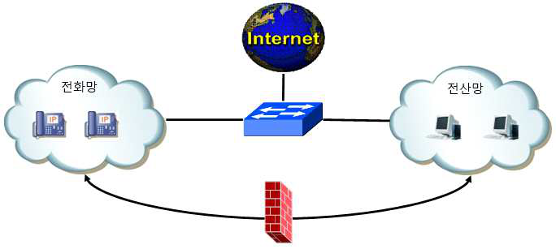

---
<!-- Page 269 -->

## 04. 부록1. 참고 자료

2026 주요정보통신기반시설 관리·물리적 취약점 분석·평가 방법 안내서
269

## 2. 인터넷전화 전용 보안 장비 도입

1) 인터넷전화 및 교환장비 대상 해킹·DDoS공격 등을 탐지·차단하기 위해서 인터넷전화 전용 침입차단·탐지시스템 사용
2) 인터넷전화 트래픽 모니터링 및 보안 장비 관리를 위한 보안 관리시스템 사용

## 3. 백업체계 구축

1) 이중화 구성 및 UPS 구축
2) 기존 유선전화 일부회선 유지

## 4. 인터넷전화 시스템 보안 관리

1) 소프트폰 사용 금지
2) 무선 네트워크 및 이동 근무자의 인터넷전화 접속 금지
3 소프트웨어 보안 업데이트
가. 인터넷전화 단말기 및 교환장비의 펌웨어, 소프트웨어 등을 주기적으로 갱신
4) 웹기반 원격 관리 보호
가. 관리자가 원격접속시 암호화 등 원격 채널 보호기술 적용
5) 사용자 계정관리
가. 인터넷전화 단말기 및 교환장비에 디폴트 비밀번호는 반드시 변경하고 주기적으로 비밀번호 변경 필요
6) 인터넷전화 단말기 및 교환장비(IP-PBX 등)에 대한 접근제어 적용
7) 감사 및 로그 관리
8) 데이터 백업 및 복구
9) 보안대책 및 운영계획 수립
※ 공공기관은 행정기관용 인터넷전화를 도입할 경우 한국정보통신기술협회(TTA) Verified Ver4 이상 보안규격
인증 제품 도입
※ 인터넷전화 시스템 구축 관련 구체사항은｢국가ㆍ공공기관 인터넷전화 보안가이드라인｣(2009.5. 국가정보원)
준수

---
<!-- Page 270 -->
<서식 제1호> 연간 정보보호 업무 계획··········································································273
<서식 제2호> 연간 정보보호 업무 심사분석····································································274
<서식 제3호> 표준 개인정보처리 위탁계약서··································································275
<서식 제4호> 정보시스템 반입, 반출 신청서···································································278
<서식 제5호> 정보보호 교육 참가자 명단·······································································279
<서식 제6호> 단말기 사용 신청서··················································································280
<서식 제7호> 무선랜 설치 신청서··················································································281
<서식 제8호> 무선랜 설치 확인서··················································································282
<서식 제9호> 무선랜 사용 신청서··················································································283
<서식 제10호> 무선랜 AP 관리대장··············································································284
<서식 제11호> 무선랜 AP 사용관리대장········································································285
<서식 제12호> 시스템 조사표·······················································································286
<서식 제13호> 정보보호시스템 도입 시 확인사항···························································287
<서식 제14호> 네트워크 장비 도입 시 보안요구사항·······················································288
<서식 제15호> 정보보호시스템 도입 시 보안요구사항·····················································290
<서식 제16호> 시스템 운영 전 보안요구사항··································································293

### 부록2. 서식 예시

Chapter 05

2026 주요정보통신기반시설 관리·물리적 취약점 분석·평가 방법 안내서

---
<!-- Page 271 -->
<서식 제17호> 비밀관리기록부·····················································································295
<서식 제18호> 정보통신 침해사고 신고서······································································296
<서식 제19호> 정보통신 침해사고 결과서······································································297
<서식 제20호> 보호구역 관리대장·················································································298
<서식 제21호> 제한구역⦁통제구역 출입자 명부····························································299
<서식 제22호> 정보보호위원회 회의록···········································································300
<서식 제23호> 정보보호위원회 의견서···········································································302
<서식 제24호> 직무기술서····························································································303
<서식 제25호> 퇴직자 권한회수 및 서약 집행·································································304
<서식 제26호> 퇴직자 보안 서약서················································································305
<서식 제27호> 수탁자 대상, 보안 점검표·······································································306
<서식 제28호> 중요정보 파기 확인서·············································································307
<서식 제29호> 외부자 보안서약서·················································································308
<서식 제30호> 자산목록표····························································································309
<서식 제31호> 휴대용 저장매체(전산장비 포함) 반출⦁입 대장·······································310
<서식 제32호> 휴대용 저장매체 관리대장 (일반용) ·························································311
<서식 제33호> 휴대용 저장매체 관리대장 (비밀용) ·························································312
<서식 제34호> 휴대용 저장매체 점검대장······································································313
<서식 제35호> 보안교육 설문지 ···················································································314
<서식 제36호> 보안교육 설문분석도구 (Excel) ······························································316
<서식 제37호> 정보보호시스템 접근규칙 검토 결과서·····················································317
<서식 제38호> 침입차단시스템 서비스포트 허용/차단 요청서··········································318
<서식 제39호> 계정등록(변경⦁삭제)신청서··································································319
<서식 제40호> 네트워크 변경내용 신청서······································································320

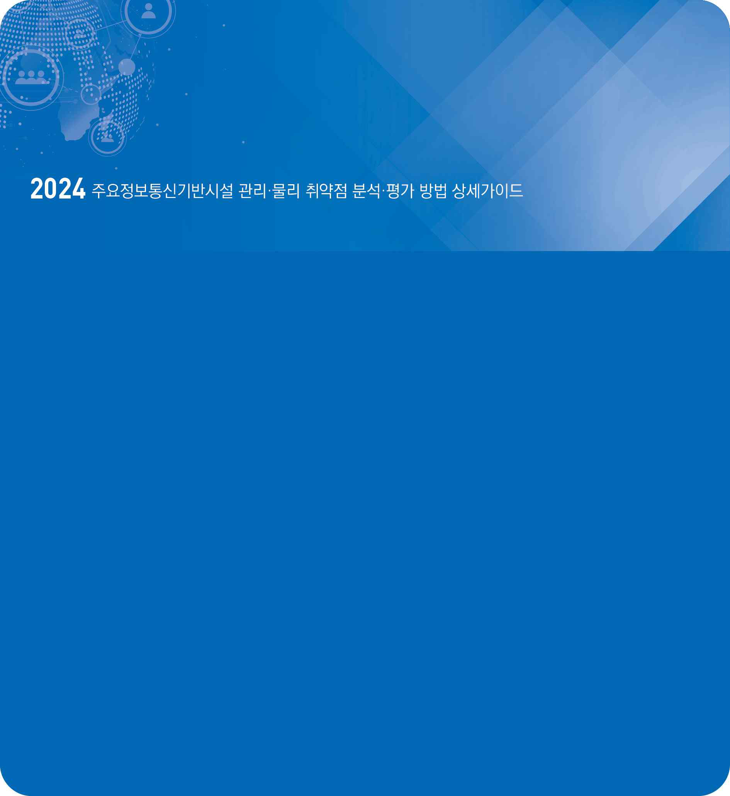

---
<!-- Page 272 -->
<서식 제41호> 정보시스템 접근기록 검토결과서····························································322
<서식 제42호> 암호화키 관리대장(대외비) ·····································································323
<서식 제43호> 암호화키 복구대장(대외비) ·····································································324

---
<!-- Page 273 -->

## 05. 부록2. 서식 예시

2026 주요정보통신기반시설 관리·물리적 취약점 분석·평가 방법 안내서
273
<서식 제1호>
연간 정보보호 업무 계획
<작성 요령>

## 1. 활동 목표

## 2. 기본 방침

## 3. 세부 추진계획

분야별
사업명
세부 추진계획
주관⦁관련 부서
비고
※ 보안성검토 대상여부 표기

## 4. 전년도 보안감사·지도방문 시 도출내용과 조치내역

도출 내용
조치내역
담당부서
※ 형식위주의 계획수립을 지양하고 소속 및 산하기관의 추진계획을 종합, 자체 설정에 맞게 작성

---
<!-- Page 274 -->
| 한국인터넷진흥원 |
274
<서식 제2호>
연간 정보보호 업무 심사분석

## 1. 총평

## 2. 주요 성과 및 추진사항

## 3. 세부 사업별 실적 분석

추진계획
추진실적
문제점
개선대책
※ 추진실적은 목표량과 대비하여 성과달성도를 계량화

## 4. 부진(미진)사업

부진사업
원인 및 이유
다음 연도 추진계획

## 5. 애로 및 건의사항

## 6. 첨부 (정보통신망 및 정보보호시스템 운용현황 등)

---
<!-- Page 275 -->

## 05. 부록2. 서식 예시

2026 주요정보통신기반시설 관리·물리적 취약점 분석·평가 방법 안내서
275
<서식 제3호>
표준 개인정보처리 위탁계약서
OOO(이하 “갑”이라 한다)과 △△△(이하 “을”이라 한다)는 “갑”의 개인정보 처리업무를 “을”에게 위탁함에
있어 다음과 같은 내용으로 본 업무위탁계약을 체결한다.
제1조 (목적) 이 계약은 “갑”이 개인정보 처리업무를 “을”에게 위탁하고, “을”은 이를 승낙하여 “을”의 책임 아래
성실하게 업무를 완성하도록 하는데 필요한 사항을 정함을 목적으로 한다.
제2조 (용어의 정의) 본 계약에서 별도로 정의되지 아니한 용어는 개인정보 보호법, 같은 법 시행령, 개인정보의
안전성 확보조치 기준(개인정보보호위원회 고시), 표준 개인정보 보호지침(개인정보보호위원회 고시) 등에서
정의된 바에 따른다.
제3조 (위탁업무의 목적 및 범위) “을”은 계약이 정하는 바에 따라 (                      ) 목적으로 다음과 같은
개인정보 처리 업무를 수행한다.1)
1. (위탁하는 개인정보 처리 업무 내용을 기재)
2. (위탁하는 개인정보 처리 업무 내용을 기재)
제4조 (위탁업무 기간) 이 계약서에 의한 개인정보 처리업무의 기간은 다음과 같다.
계약 기간 : 20     년      월      일 ~ 20     년      월      일
제5조 (재위탁 제한) ① “을”은 “갑”의 동의를 얻은 경우를 제외하고 위탁받은 개인정보 처리 업무를 제3자에게
재위탁할 수 없다.
② “을”이 “갑”의 동의를 받아 개인정보 처리 업무의 전부 또는 일부를 제3자에게 다시 위탁하는 경우에는
“갑”에게 재위탁받는 자 및 재위탁 업무의 범위를 알려야 한다. 다만, “을”이 사전에 재위탁의 범위와 재위탁
받는 자를 정하여 “갑”에게 알리고 동의를 받았을 때에는 그러하지 아니하다.
③ “을”은 이 규정에 따른 재위탁을 문서로 하여야 한다.
④ “을”은 재위탁받는 자의 명칭과 재위탁 업무의 범위를 개인정보 처리방침으로 공개하여야 한다.
제6조 (개인정보의 안전성 확보조치 등) “을”은 개인정보 보호법 제29조, 같은 법 시행령 제30조 및 개인정보의
1) 각호의 업무 예시 : 고객만족도 조사 업무, 회원가입 및 운영 업무, 사은품 배송을 위한 이름, 주소, 연락처 처리 등

---
<!-- Page 276 -->
| 한국인터넷진흥원 |
276
안전성 확보조치 기준(개인정보보호위원회 고시)에 따라 개인정보의 안전성 확보에 필요한 관리적･기술적 및
물리적 안전조치를 하여야 한다.
제7조 (개인정보의 처리 제한) “을”은 계약 기간 동안은 물론 계약 종료 후에도 위탁업무 수행 목적 범위를 넘어
개인정보를 이용하거나 이를 제3자에게 제공 또는 누설하여서는 안 된다
제8조 (수탁자에 대한 관리･감독 등) ① “갑”은 “을”에 대하여 개인정보의 처리 위탁과 관련하여 다음 각 호의
사항을 관리하도록 요구할 수 있으며, “을”은 특별한 사유가 없는 한 이에 응해야 한다.

## 1. 개인정보의 처리 현황

## 2. 개인정보의 접근 또는 접속기록

## 3. 개인정보 접근 또는 접속 대상자

## 4. 목적 외 이용･제공 및 재위탁 제한 사항 준수 여부

## 5. 암호화 등 안전성 확보조치 이행 여부

## 6. 그 밖에 개인정보의 보호를 위하여 필요한 사항

② “갑”은 “을”에 대하여 제1항 각 호의 사항에 대한 현황을 점검하거나 “을” 또는 제3자에 의한 현황 점검을
요구할 수 있고, 점검 사항에 대하여 시정을 요구할 수 있다. “을”은 특별한 사유가 없는 한 “갑”의 요구를
이행해야 한다.
③ “을”이 다음 각 호 중 어느 하나에 해당하는 경우에는 그러한 사정을 “갑”에게 알리고 위탁받은 개인정보의
처리 업무에 대한 점검 결과를 “갑”에게 [ ]개월의 단위로 정기적으로 보고하는 것으로 위 각 항에 따른 “갑”과
“을”의 의무 이행에 갈음할 수 있다. “갑”에 대한 “을”의 보고의 시기 등에 대하여는 “갑”과 “을”이 협의하여 정할
수 있다.

## 1. 개인정보 보호법 제32조의2에 따른 개인정보 보호 인증(ISMS-P)을 취득하여 주기적으로 점검을 받고 있는

경우

## 2. 그 외 위 1호에 준하는 경우로서, “갑”과 “을”이 합의하여 개인정보 보호법 제31조 제7항의 개인정보

보호책임자 협의회 등에 의한 점검 등을 주기적으로 받고 있는 경우
④ 제3항의 경우에도 “을”은 “을”의 처리위탁 업무와 관련하여 개인정보 보호법 위반 또는 본 계약 위반의
사항이 발생한 경우에는 즉시 이를 “갑”에게 통지하여야 하고, “갑”의 지시에 따라야 한다.
제9조 (수탁자에 대한 교육) ① “갑”은 개인정보 보호법 제26조 제4항에 따라 개인정보 처리 업무의 위탁으로
인하여 정보주체의 개인정보가 분실･도난･유출･변조 또는 훼손되지 아니하도록 “을”을 교육할 수 있으며, “을”은
이에 응하여야 한다. “을”은 “갑”과 협의하여 “을”의 책임 하에 그의 개인정보 취급자 등에게 교육을 실시할 수

---
<!-- Page 277 -->

## 05. 부록2. 서식 예시

2026 주요정보통신기반시설 관리·물리적 취약점 분석·평가 방법 안내서
277
있다.
② 제1항에 따른 교육은 집합교육, 온라인 교육 등의 방식 등 교육 목적을 달성할 수 있는 범위 내에서 다양한
방식으로 진행될 수 있으며, 구체적인 방식에 대하여는 “갑”과 “을”은 별도로 협의하여 정할 수 있다. 다만,
“을”이 자체적으로 또는 제3자인 전문업체를 통해 교육을 실시하는 경우에는 “을”은 교육의 시행 여부 및 결과
등을 “갑”에게 증빙자료와 함께 보고하여야 하고, “갑”은 보고 내용을 주기적으로 점검할 수 있다.
③ 그 밖에 구체적으로 교육의 시기와 방법 등에 대해서는 “갑”은 “을”과 협의하여 시행한다.
제10조 (정보주체 권리보장) “을”은 정보주체의 개인정보 열람, 정정･삭제, 처리 정지 요청 등에 대응하기 위한
연락처 등 민원 창구를 마련해야 한다.
제11조 (개인정보의 파기) ① “을”은 계약이 해지되거나 계약 기간이 만료된 경우 위탁업무와 관련하여 보유하고
있는 개인정보를 개인정보 보호법 시행령 제16조에 따라 즉시 파기하거나 “갑”에게 반환하여야 한다.
② 제1항에 따라 “을”이 개인정보를 파기한 경우에는 지체없이 “갑”에게 그 결과를 통보해야 한다.
제12조 (손해배상) ① “을”이 이 계약에 따른 의무를 위반하여 정보주체 또는 제3자에게 손해가 발생할 경우
“갑”과 “을”은 공동으로 정보주체 또는 제3자의 손해를 배상하기로 한다.
② 제1항과 관련하여 정보주체 또는 제3자의 손해를 배상한 당사자는 상대방에게 자신의 부담 비율을 초과하는
부분에 대하여 구상할 수 있다.
본 계약의 내용을 증명하기 위하여 계약서 2부를 작성하고, “위탁자”와 “수탁자”가 서명 또는 날인한 후 각 1부씩
보관한다.
20     .      .     .
위탁자(갑)
주 소 :
기관(회사)명 :
대표자 성명 :                   (인)
수탁자(을)
주 소 :
기관(회사)명 :
대표자 성명 :                   (인)

---
<!-- Page 278 -->
| 한국인터넷진흥원 |
278
<서식 제4호>
정보시스템 반입, 반출 신청서
신청인
성명
자산명
반입/반출 사유
장비내역
반입⦁반출
자산 명
수량
용도
비고
상기 장비(반입ㆍ반출)를 신청합니다.
년     월     일
위 신청인 :                 (인)
위 신청사항을 다음 조건하에 승인합니다.
<허가조건>
1.
2.
년     월     일
담당자 :                 (인)
※ 정보통신시스템 및 보조기억매체 반출시 내용삭제 확인
담당확인 :                 (인)

---
<!-- Page 279 -->

## 05. 부록2. 서식 예시

2026 주요정보통신기반시설 관리·물리적 취약점 분석·평가 방법 안내서
279
<서식 제5호>
정보보호 교육 참가자 명단
교육과정명
교육주관부서
교육일시
20    년    월    일    (시간 :                 )
참석자
순번
부서
직위
성명
서명
1
2
3
4
5
6
7
8
9
10
11
12
13
14
15
16
17
18
19
20
비고

---
<!-- Page 280 -->
| 한국인터넷진흥원 |
280
<서식 제6호>
단말기 사용 신청서
소속
신청자 성명
직위
전화번호
신청자 :                              (인)
담당자 :                              (인)
사용 단말기
사용 형태
□ 스마트폰  □ 태블릿  □ 기타모바일기기(                       )
사용 목적
사용 기한
비고
년        월       일
신청자 :                     (인)
담당자 승인 :                     (인)

---
<!-- Page 281 -->

## 05. 부록2. 서식 예시

2026 주요정보통신기반시설 관리·물리적 취약점 분석·평가 방법 안내서
281
<서식 제7호>
무선랜 설치 신청서
소속
신청자 성명
성명
전화번호
설치목적
설치장소
장비명
장비일련번호
사용기간
장비보안성검토
업무상 상기 목적에 따라서 무선랜 설치 신청서를 제출합니다.
년     월     일

신청인 :                     (인)

부서장 :                     (인)
기  관  장  귀 하

---
<!-- Page 282 -->
| 한국인터넷진흥원 |
282
<서식 제8호>
무선랜 설치 확인서
소속
신청자 성명
성명
전화번호
설치장소
장비IP
SSID
물리적 조치
□ 장비 이동이 불가하도록 고정
□ 유선 네트워크 케이블 보호조치
□ 물리적 접근 통제 적용
기술적 조치
□ SSID 브로드캐스팅 중지
□ WPA2이상(256비트 이상) 사용 설정
□ 미등록 IP, MAC 접근 차단
□ default password 변경
□ RADIUS 인증 설정
상기 본인은 무선랜 운영 절차에 따라서 무선랜을 설치하고, 기술적·물리적 조치를 취하였음을 확인합니다.
년     월     일

설치자 :                     (인)

부서장 :                     (인)
기  관  장  귀 하

---
<!-- Page 283 -->

## 05. 부록2. 서식 예시

2026 주요정보통신기반시설 관리·물리적 취약점 분석·평가 방법 안내서
283
<서식 제9호>
무선랜 사용 신청서
소속
신청자 성명
성명
전화번호
사용목적
접속AP
단말형태
MAC주소
사용기간
업무상 상기 목적에 따라서 무선랜 사용 신청서를 제출합니다.
년     월     일

신청인 :                     (인)

부서장 :                     (인)
기  관  장  귀 하

---
<!-- Page 284 -->
| 한국인터넷진흥원 |
284
<서식 제10호>
무선랜 AP 관리대장
설치일자
신청자
성명
신청자
연락처
설치목적
설치자
성명
사용기한
장비현황
비고
설치장소
장비
일련번호
IP
SSID

---
<!-- Page 285 -->

## 05. 부록2. 서식 예시

2026 주요정보통신기반시설 관리·물리적 취약점 분석·평가 방법 안내서
285
<서식 제11호>
무선랜 AP 사용관리대장
신청일자
신청자
성명
신청자
연락처
접속 AP
사용기간
사용목적
장비현황
비고
단말형태
MAC 주소

---
<!-- Page 286 -->
| 한국인터넷진흥원 |
286
<서식 제12호>
시스템 조사표
사업정보
사업명
담당자
연락처
도입금액
영업담당자
연락처
유지보수 기간
라이선스 정책
설치업체
설치자
연락처
AS연락처
제품정보
제품명
버전
일련번호
제조 업체
(국산/외산)
CPU
메모리
HDD
IP Address
소프트웨어 정보
(버전 및 SN)
운영체제
백업 소프트웨어
백신 소프트웨어
보안 OS
DB
기타 소프트웨어
제품구분
하드웨어
소프트웨어
통신장비
정보보호
서버,
스토리지,
백업장비
OS, WEB/WAS,
미들웨어, DBMS,
모델링툴, 그래픽툴,
메일, 백신,
기타
라우터,
허브,
스위치,
기타
보안 장비,
보안SW
서비스 정보
Hostname(                                                  )
포트 정보
보안조치
기본암호 변경
기본 포트 변경
웹취약점 제거
불필요서비스 제고
SSH(          )
매뉴얼 제공
운영매뉴얼
관리자매뉴얼
재기동 절차서
기타

---
<!-- Page 287 -->

## 05. 부록2. 서식 예시

2026 주요정보통신기반시설 관리·물리적 취약점 분석·평가 방법 안내서
287
<서식 제13호>
정보보호시스템 도입 시 확인사항
항목명
점검항목
결과
인증 여부
EAL 2 이상 CC인증 획득 여부
CC 인증을 받지 않은 경우, 국가용 암호제품 또는 별도 지정제품 목록 등재여부
국가정보원장이 검증한 암호모듈 탑재 여부
일치성
인증보고서 또는 운용정책문서와 도입제품 보안기능 일치성 여부
기술제안요청서(RFP)에서 요구하는 보안기능 구현 여부
운용환경
도입기관의 시스템관리자 지정여부
감사기능 지원 여부
도입기관 주요업무 및 최대사용자 등에 대한 가용성 보장 여부
시스템 장애 시 대책 수립 여부
유지보수
보안적합성 검증결과 반영 가능 여부
업체 기술지원 전담조직 운영 여부
작동중단 등 긴급상황에 대비한 지원절차 마련 여부
업체의 유지보수 매뉴얼 제공 여부
관리자 설치ㆍ운영 매뉴얼 제공 여부
업체의 제품운용교육 제공 여부
신규취약성에 대한 통보 및 처리절차 마련
※ 점검결과는 O, X로 표기

---
<!-- Page 288 -->
| 한국인터넷진흥원 |
288
<서식 제14호>
네트워크 장비 도입 시 보안요구사항
대분류
소항목
내용
점검결과
식별 및 인증
디폴트 관리자 비밀번호
강제변경 기능
Ÿ 제품 출고시 디폴트 관리자 비밀번호
설정 금지
Ÿ 디폴트 관리자 비밀번호 설정된 경우
최초 관리자 접속시 비밀번호 재설정
요청
안전한 비밀번호 설정 기능
Ÿ 최소 9자리 이상, 영문 대/소문자,
숫자, 특수문자 중 3가지 이상 규칙
조합사용
인증실패 대응 기능
Ÿ 설정된 횟수(기본값 5회이하)이상
인증 실패 시 일정시간(기본값 5분
이상) 접속 제한 등의 대응 기능 제공
인증 피드백 보호 기능
Ÿ 입력한 비밀번호 정보를 화면에서 볼
수 없도록 마스킹하는 기능
관리자/사용자 인증 정보의
안전한 저장 여부
Ÿ 평문(Base64와 같은 단순 인코딩
포함) 저장 금지
Ÿ 제품에 하드코딩 금지
별도 서버를 통한 사용자 인증기능
※ 별도 인증서버 연동을 제공하는 경우
Ÿ IEEE 802.1x지원
Ÿ RADIUS, TACACS + 서버 등 지원
정보흐름 통제
관리자가 설정한 ACL 규칙에 따라
트래픽을 제어하는 기능 제공 여부
Ÿ ACL 규칙(MAC, IP, 포트 등)을 통한
트래픽 제어지원
Ÿ IEEE
802.1Q
VLAN,
VLAN
Trunking 지원
보안관리
SNMP를 이용한 시스템 모니터링 및
관리기능 제공여부
Ÿ 초기
설정은
SNMP
서비스
비활성(Disable) 상태 유지
Ÿ 최신 SNMP 버전(V3) 지원
Ÿ Private MIB 정보 문서화 제공
관리콘솔 접속가능 IP제한 기능
Ÿ IP지정(2개 이하로 제한)
자체시험
제품
구동
시,
정규
운영동안
주기적으로 관리자 요청 시 자체 시험을
실행하는 기능 제공여부
Ÿ 제품관련 H/W(메모리, 플래시 등)
등의 자체 검사 지원
Ÿ 제품관련 S/W(커널, 운용프로그램
등) 등의 자체 검사 지원

---
<!-- Page 289 -->

## 05. 부록2. 서식 예시

2026 주요정보통신기반시설 관리·물리적 취약점 분석·평가 방법 안내서
289
관리자에게 제품 설정값 및 실행코드의
무결성을 검사하는 기능
-
펌웨어 업데이트시 펌웨어 파일의
안전한 무결성 검증방법 여부
Ÿ 전자서명 생성/검증 메커니즘 이용
등 검증기능 여부
안전한 세션관리
일정시간 관리자 활동이 없는 경우 세션
잠금 또는 세션 종료 기능
Ÿ 기본값 10분 이하
관리자의
동시
원격
접속세션을
제한하는 기능
Ÿ 하나의 관리자 세션 유지
※ 제품 운영상황 등 단순 모니터링만
수행하는 경우에는 예외적으로 허용
관리자 인증정보 재사용 방지대응기능
* 웹 UI를 제공하는 경우
Ÿ 타임스탬프 등 대응기능 제공
접근통제
다중
사용자/그룹
생성
지원
및
사용자/그룹별 접근권한 설정 기능
Ÿ 사용자별
이름(ID),
비밀번호,
접근권한 설정 지원
제품
모니터링,
설정
변경/삭제,
엔지니어 진단, 복구모드 등 운영모드의
안전한 제공
Ÿ 제품이 제공하는 운영모드 명시
Ÿ 각 모드 변경시 명시적 인증 확인
Ÿ 운영모드별 필요한 최소한의 명령만
사용 허용
전송데이터 보호
제품과 원격 연결된 모든 통신수단간
안전한 암호통신 프로토콜 사용
Ÿ 관리자 PC에서 원격으로 관리콘솔
접속시 SSL/TLS, HTTPS, SSH,
IPSEC 등 사용 지원
Ÿ 제품과 외부 서버와의 원격으로
연동시 SSL/TLS, HTTPS, SSH,
IPSEC 등 사용 지원
감사기록
감사 데이터를 생성하는 기능
Ÿ 감사의 기능의 시작/종료
Ÿ 관리자에
대한
식별
및
인증
성공/실패
Ÿ 제품
설정
변경내역,
보안기능
수행내역
감사데이터에 해당 정보 포함 여부
Ÿ 사건 발생 일시, 사건 유형
Ÿ 사전을 발생시킨 주체의 신원(가능한
경우)
Ÿ 작업 내역 및 결과(성공/실패)
감사증적의 크기가 디스크 용량 초과시
대응 행동
Ÿ 오래된 감사 레코드 덮어쓰기 등 대응
내용

---
<!-- Page 290 -->
| 한국인터넷진흥원 |
290
<서식 제15호>
정보보호시스템 도입 시 보안요구사항
대분류
보안기능 요구사항
점검결과
비고
감사기록
감사의 시작/종료, 관리자 또는 사용자에 대한 식별 및 인증
성공/실패, 제품 설정 변경내역, 보안기능 수행내역 등 감사데이터
생성
※ 네트워크 차단기능이 있는 경우 허용 및 차단된 모든 트래픽에
대한 감사데이터 생성
감사데이터는 사건 발생일시, 사건유형, 사건을 발생시킨 주체의
신원(가능 경우), 작업 내역 및 결과(성공/실패)를 상세히 포함
인가된 관리자가 제품구성요소로부터 생성된 모든 감사데이터를
검토할 수 있는 기능 제공
인가된 관리자 또는 인가된 사용자가 AND, OR 등 논리적
관계기준에 기초하여 감사레코드를 선택적으로 검토
감사 증적내 저장된 감사레코드에 대해 비인가된 삭제 또는 변경이
발생하지 않도록 보호
Ÿ 인가된 관리자라 할지라도 삭제 또는 변경할 수 없도록 삭제·변경
관련 유저인터페이스(UI)가 제공되지 않아야 함
Ÿ 감사레코드에 대한 보호대책을 제품의 보안기능으로 완전히
구현할 수 없는 경우, 운용환경의 지원을 받을 수 있음
감사 증적의 크기가 지정된 한도를 초과할 경우, 사전 정의한 방식에
따라 관리자에게 통보
감사 증적의 포화 시 적절한 방법(예 : 오래된 감사레코드 덮어쓰기
등)으로 저장 실패에 대응
주요 사건에 대한 정확한 시각 정보생성을 위해 신뢰된 OS등을
이용하여 시간 정보를 생성
식별 및 인증
잠재적인 보안위반을 탐지한 경우, 인가된 관리자가 설정한 대응(예
: 경보메시지 발송 등)을 수행
관리자 또는 사용자 신원을 검증하기 위해 식별 및 인증기능 제공
관리자 인증 실패가 설정된 횟수(기본값 5회 이하)에 도달하면,
인가된 관리자가 설정한 시간(기본값 5분 이상)동안 식별 및 인증
기능이 비활성
비밀번호 등록 시 보안성 기준(영문대문자/영문소문자/숫자/특수
문자 중 3가지 이상의 규칙조합 및 9자리 이상으로 구성)을

---
<!-- Page 291 -->

## 05. 부록2. 서식 예시

2026 주요정보통신기반시설 관리·물리적 취약점 분석·평가 방법 안내서
291
만족하는지 검증
인증이 진행되는 동안 관리자 또는 사용자에게 비밀번호가 마스킹
(예 : **** 등)되어 보이도록 하여야 함
식별 및 인증 실패 시, 실패이유에 대한 피드백(예 : ID오류,
비밀번호 오류 등)을 제공하지 않아야 함
관리자가 제품에 최초 접속 시 제품이 기본적(예 : 설치시 등)으로
제공하는 ID 및 비밀번호의 변경을 강제화하는 기능 제공
관리자의 비밀번호가 제품에 하드코딩되거나 평문(단순 인코딩
포함)으로 저장되지 않아야 함
인증정보가 재사용되는 것을 방지(타임스탬프 사용 등)하여야 함
보안관리
인가된 관리자가 보안기능, 보안정책 및 중요데이터 등을 설정 및
관리할 수 있는 보안기능 제공
사전 등록된 IP주소의 관리콘솔(관리자 IP주소 등록은 2개 이하로
제한)만 제품에 접속할 수 있도록 하여야 함.
전송 데이터 보호
물리적으로 분리된 제품 구성 요소간 전송데이터 (보안정책,
제어명령, 감사기록 등)에 대한 암호화를 통해 기밀성 및 무결성
보장
Ÿ 에이전트와 관리 서버간 전송되는 데이터에 대한 기밀성 및
무결성 보장을 위해 상호 인증을 수행
Ÿ 암호모듈 검증제도에서 검증대상으로 지정된 안전한 암호
알고리즘 사용을 권고
Ÿ 관제대상 시스템으로부터 로그를 syslog 형태로 수신하는 경우
본 요구사항은 적용되지 않음. 단, 전송과정에서 로그정보가
훼손될 수 있으므로 동일 로컬네트워크 내에서만 syslog 사용 등
보호대책을 마련하여야 함.
관리자의 웹브라우저를 이용한 접속 등 제품과 원격으로 연결된
모든 통신수단은 안전한 암호통신 프로토콜을 사용
자체시험
제품의 정확한 운영을 보장하기 위해 시동 시와 정규 운영동안
주기적으로 자체 시험을 실행
인가된 관리자에게 제품의 설정값 및 제품 자체의 무결성을
검증하는 기능 제공
안전한 세션관리
로그인 이후 일정시간(기본값 10분 이하) 동안 동작이 없을 경우
세션 잠금 또는 세션 종료 기능을 수행
로그인 이후 다른 단말에서 동일 계정 또는 동일 권한으로 로그인을
다시 수행하는 경우, 신규 접속을 차단하거나 이전 접속을 종료
※ 제품 운영상황 등에 대한 모니터링만 수행하는 관리자 계정에

---
<!-- Page 292 -->
| 한국인터넷진흥원 |
292
대해서는 중복 로그인 허용 가능
정보흐름통제
인가된 관리자에 의해 설정된 규칙에 따라 인입 및 인출 트래픽을
차단
Ÿ 정보흐름통제 규칙은 개별 또는 특정 대역의 출발지/목적지 주소
및 포트 등 다양한 정보에 의해 구성
Ÿ 3,000개 이상의 차단 규칙 생성·관리(IPS에 한함)
Ÿ 기본적으로 모든 트래픽을 차단한 뒤, 규칙에 따라 특정
서비스/포트 및 출발지/목적지 주소기반은 화이트리스트 방식이,
시그니처 또는 유해사이트 목록기반은 블랙리스트 방식을 적용을
권고하나 장애시 모든 트래픽을 통과시킬 수 있는 기능은
제공되지 않아야 함.
제품 설정 등을 통해 다음의 정보흐름 차단 가능
Ÿ 외부로부터 들어오는 트래픽 중 내부 IP주소가 출발지인 트래픽
Ÿ 내부에서 나가는 트래픽 중 외부 IP주소가 출발지인 트래픽
Ÿ 외부로부터 들어오는 트래픽 중 브로드캐스트 주소가 목적지인
트래픽
Ÿ 외부로부터 들어오는 트래픽 중 루프백 주소가 목적지인 트래픽
Ÿ 외부로부터 들어오는 트래픽 중 비정상적인 패킷 형식을 가지는
트래픽

---
<!-- Page 293 -->

## 05. 부록2. 서식 예시

2026 주요정보통신기반시설 관리·물리적 취약점 분석·평가 방법 안내서
293
<서식 제16호>
시스템 운영 전 보안요구사항
항목명
운영 점검사항
점검결과
비고
보안정책 설정
도입기관의 보안정책에 근거하여 제품의 보안기능 정책을 설정
우회방지
SSH 터널링을 통해 제품의 차단기능 우회를 방지
인증서 운영
제품의 관리 콘솔에 설정된 서버 인증서는 기관에 설치 시 발급된
유일한 인증서이어야 하며 인증서 공개키는 RSA 2048비트 이상
또는 그와 동등한 안전성을 보장하는 키 길이 이어야 한다.
인증서 서명 알고리즘 및 해시 알고리즘은 암호모듈 검증제도에서
명시된 검증대상 암호 알고리즘이어야 한다.
Ÿ 발급자 : 도입기관에서 지정한 신뢰기관 확인
Ÿ 유효기간 : 유효기간 만료 여부 확인
Ÿ 주체 : 인증서 발급 대상자 확인
Ÿ 공개키 : 제품별로 상이한 공개키가 사용되는지 다른 제품
인증서의 공개키 값과 비교
Ÿ 공개키 길이 : RSA 2048비트 이상
Ÿ 해시함수 : SHA 224, SHA 256 등(224비트 이상 출력
알고리즘)
최신버전 소프트웨어
설치
도입제품에서 사용되는 SNMP, OpenSSL, OpenSSH, DBMS
모듈이 최신 버전이 아닌 경우 취약성을 가지고 있을 수 있으므로
해당 버전을 확인
Ÿ SNMP V3 사용
Ÿ 최신 버전의 OpenSSL, OpenSSH 버전 사용
불필요한 서비스 제거
제품에 불필요한 서비스가 동작하지 않아야 함.
안전한 업데이트 적용
업데이트 대상 및 방식을 참조하여 업데이트 정책을 수립
[업데이트 대상]
Ÿ 공격 패턴 파일, 차단 엔진, 기타 실행파일/설정파일 등 제품 주요
업데이트 파일
[업데이트 방식]
Ÿ 온라인 업데이트 : 제품 개발업체 업데이트 서버를 통한 온라인
업데이트 방식의 경우 업데이트 서버에 대한 인증과 업데이트
데이터에 대한 기밀성 및 무결성 검증 기능이 제공되어야 함
Ÿ 오프라인 업데이트 : 제품 개발업체로부터 오프라인 방식으로

---
<!-- Page 294 -->
| 한국인터넷진흥원 |
294
업데이트 데이터를 제공받고 업데이트 적용 시 데이터에 대한
무결성 검증 기능이 제공되어야 함
[업데이트 관리]
Ÿ 제품이 제공하는 업데이트 방식을 확인하여 업데이트 정책을
수립하고 적절한 업데이트가 이루어질 수 있도록 하여야 함.
Ÿ 업데이트 시 제품의 주요 엔진을 변경하는 경우 도입된 CC
인증제품에 대한 형상변경을 가져올 수도 있음. 업데이트 정책
수립 시 업체와 업데이트되는 내용을 협의하여 도입 제품에
대해 무단 형상변경이 발생하지 않도록 유의하여야 함.
백업
관리자는 감사기록 유실에 대비하여 감사데이터 저장소의 여유
공간을 주기적으로 확인하고 감사기록이 소진되지 않도록 감사기록
백업 등을 수행
관리자 운영
관리서버는 인가된 관리자만이 접근 가능한 물리적으로 안전한
환경에 설치·운영되어야 하며 외부 원격관리를 허용하지 않아야 함.
원격관리는 원칙적으로 금지하나 불가피한 경우 내부망의 지정된
단말기에서만 접속하도록 통제하여야 함.
관리콘솔에 접근 가능한 관리자 IP주소는 화이트리스트 방식으로
설정

---
<!-- Page 295 -->

## 05. 부록2. 서식 예시

2026 주요정보통신기반시설 관리·물리적 취약점 분석·평가 방법 안내서
295
<서식 제17호>
비밀관리기록부
부처명 :　　　　　　　　　　　　　　　　　　　　　　　　　　　　　　　보관책임자 :
관
리
번
호
접수⦁발송
문
서
번
호
비
밀
등
급
형
태
건
명
사
본
번
호
예
고
문
보
존
기
관
보
관
장
소
처리방법
확인
연월일
발행처
수신처
(처리
담당)
등급
변경
파기
파기
확인
근거
영수
증
처리자
(인)

---
<!-- Page 296 -->
| 한국인터넷진흥원 |
296
<서식 제18호>
정보통신 침해사고 신고서
기본정보
기관명
부서
성명
직위
전자우편
연락처
전화 :
H.P :
FAX :
사고내용
사고일시
년    월    일
피해 IP주소
시    분
피해시스템
운영체제
□ 윈도우
□ 유닉스
□ 네트워크 장비
상세 버전 정보:
사고유형
피해범위
대
사고내용
조치내용
공격자 정보
피해 현황
긴급조치 시 사항
관련 보안제품 운영현황
그 밖에 사고 관련 내용을 구체적으로 서술

---
<!-- Page 297 -->

## 05. 부록2. 서식 예시

2026 주요정보통신기반시설 관리·물리적 취약점 분석·평가 방법 안내서
297
<서식 제19호>
정보통신 침해사고 결과서
기본정보
기관명
부서
성명
직위
전자우편
연락처
전화 :
H.P :
FAX :
사고내용
사고일시
년    월    일
피해 IP주소
시    분
피해시스템
운영체제
□ 윈도우
□ 유닉스
□ 네트워크 장비
상세 버전 정보:
사고유형
피해범위
대
사고내용
조치내용 요약
사고 원인
피해 현황
사고대응 조치사항
피해복구결과
기타

---
<!-- Page 298 -->
| 한국인터넷진흥원 |
298
<서식 제20호>
보호구역 관리대장
구분
장소
관리부서
사유 및 기타사항
설정 연월일
해제 연원일

---
<!-- Page 299 -->

## 05. 부록2. 서식 예시

2026 주요정보통신기반시설 관리·물리적 취약점 분석·평가 방법 안내서
299
<서식 제21호>
제한구역⦁통제구역 출입자 명부
소속
신분증 번호
직위
직급
성명
용건
출입일시
부터
까지

---
<!-- Page 300 -->
| 한국인터넷진흥원 |
300
<서식 제22호>
정보보호위원회 회의록
대외비
원본
보호기간 :                        ~로 재분류 (일자 또는 조건)
보존기간 :
사본
파      기 :                                                                        ~로 재분류 (일자 또는 조건)
정 보 보 호 위 원 회 회 의 록 ( 갑 )
◦ 일      시 :
◦ 장      소 :
◦ 참 석 자 :
◦ 안      건 :
◦ 회부기관 :
발언자
내용

---
<!-- Page 301 -->

## 05. 부록2. 서식 예시

2026 주요정보통신기반시설 관리·물리적 취약점 분석·평가 방법 안내서
301
정 보 보 호 위 원 회 회 의 록 ( 을 )
발언자
내용

---
<!-- Page 302 -->
| 한국인터넷진흥원 |
302
<서식 제23호>
정보보호위원회 의견서
대외비
원본
보호기간 :                        ~로 재분류 (일자 또는 조건)
보존기간 :
사본
파      기 :                                                                        ~로 재분류 (일자 또는 조건)
정 보 보 호 위 원 회 의 견 서
◦ 안       건 :
◦ 위원성명 :
◦ 의견진술내용 :
제목
내용

---
<!-- Page 303 -->

## 05. 부록2. 서식 예시

2026 주요정보통신기반시설 관리·물리적 취약점 분석·평가 방법 안내서
303
<서식 제24호>
직무기술서
직무기술서
직무코드
직무명
보안업무
직무수행자
소속
직책
인원
작성 연원일
직무개요 및 권한
직무내용
작성요건
학력
경력
기타사항

---
<!-- Page 304 -->
| 한국인터넷진흥원 |
304
<서식 제25호>
퇴직자 권한회수 및 서약 집행
결
재

## 1. 대상자

전소속
직급
성명
비고

## 2. 퇴직사유

## 3. 보안교육 실시

◦ 일       시 :
◦ 장       소 :
◦ 교  수  자 :
◦ 교육내용 :

## 4. 보안서약서 징구 : 별첨

---
<!-- Page 305 -->

## 05. 부록2. 서식 예시

2026 주요정보통신기반시설 관리·물리적 취약점 분석·평가 방법 안내서
305
<서식 제26호>
퇴직자 보안 서약서
본인은 20      .      .부로 퇴직(전출)함에 있어서 다음 사항을 준수할 것을 엄숙히 서약합니다.

## 1. 본인은 회사 근무 중 업무와 관련하여 지득한 기밀은 관계 법규 및 내부 규정에 의해 보호되어야 하는

기밀임을 인정한다.

## 2. 본인은 이 기밀을 누설함이 관계 법규 및 내부 규정을 위반하는 행위가 됨을 자각하여 재직 중은 물론 퇴직

후에도 지득한 제반 비밀사항을 일체 누설하지 않을 것을 서약한다.

## 3. 본인이 이 기밀을 누설한 때에는 동기여하를 막론하고 그 결과가 민사상 또는 형사상 책임이 따르는 것임을

자인하고 엄중한 처벌을 받을 것을 서약한다.
20      년      월      일
서  약  자

소     속 :
직     급 :
성     명 :
(인)
서약집행관

소 속 · 직 위 :
직     급 :
성     명 :
(인)
※ 각 기관 필요에 따라 서식내용 일부변경 활용가능

---
<!-- Page 306 -->
| 한국인터넷진흥원 |
306
<서식 제27호>
수탁자 대상, 보안 점검표

## 1. 수탁기업명 :

## 2. 업무 목적 :

## 3. 업무 책임자 이름 :

## 4. 점검일자 :

상기 수탁자는 ◯◯◯◯◯이 별도 요구하지 않는 한 개인정보 위탁업무 종료 시에 아래 점검사항을 확인하고 그
결과(또는 개선조치 결과 포함)를 해당 업무 책임자의 확인서명을 포함하여 ◯◯◯◯◯의 개인정보보호
담당자(또는 용역사업담당자)에게 회신(예: FAX, E-mail)하여야 합니다.
상기 점검사항에 대한 보호조치가 확인되었음을 다음과 같이 서약합니다.
구분
점검항목
결과
(Y, N, N/A)
비고
(N, N/A 사유)
1
위탁된 업무에 참여하는 인원에 대하여 본 용역 계약 착수 이후
개인정보보호교육이 이루어졌는가?
(증적 예시: 교육 참석자 명단(참석 서명 포함)표)
2
위탁된 업무에 참여하는 인원은 보안서약(또는 개인정보보호서약)
이 이루어졌는가?
3
위탁사로부터 제공받은 개인정보는 수탁업무 목적 범위 내에서
이용하였는가?
(만약, 목적 범위 초과 사실 또는 제3자 제공 사실이 있다면
“No”으로 결과 표시하고 그 사유를 기록)
4
개인정보를 파일 전송하는 경우, 암호화 조치 후 전송하였는가?
(예: 메일 발송 시 개인정보파일(이름, E-mail)에 암호 설정)
5
위탁자로부터 제공받은 개인정보 중 암호화 대상 정보(예:
계좌번호, 신용카드번호, 외국인등록번호   등)가 있는 경우, 해당
정보를 보관 시에 암호화 조치하였는가?
(예: PC에 저장 시에 해당 파일에 암호 설정)
6
위탁업무를 (계약)종료한 경우, 제공받은 개인정보 등은 모두
파기(예: 종이는 파쇄, 데이터는 완전삭제 등) 조치하였는가?
년          월          일
책임자 :                     (인)

---
<!-- Page 307 -->

## 05. 부록2. 서식 예시

2026 주요정보통신기반시설 관리·물리적 취약점 분석·평가 방법 안내서
307
<서식 제28호>
중요정보 파기 확인서
(위탁업체명) (이하 “당사”라 한다)는  (수탁업체명) (이하 “귀사”라 한다)(으)로부터 위탁 또는 제공받은 아래
개인정보의 취급 목적을 달성 및 종료함에 따라 아래 사항을 충분히 숙지하고 이를 성실히 준수하였음을
확인합니다.
대상정보
위탁 및 제공 목적
보유 및 이용기간
파기일

## 1. 귀사로부터 위탁 또는 제공받은 개인정보(개인의 성명, 주민등록번호, 주소, 연락처 등의 신상정보, 금융정보,

서비스 이용 내역, 통화 내역, IP 주소 등 단독 또는 결합에 의해 개인을 식별할 수 있는 부호, 문자, 음성, 영상 등의
정보를 포함한다)의 취급 목적을 달성 및 종료함에 따라 해당 개인정보 및 업무 수행 과정에서 추가 취득한
개인정보를 다음의 방법으로 파기하였습니다.
- 종이에 출력 또는 기록한 개인정보는 분쇄기로 분쇄하거나 소각
- 전자적 장치를 통해 보관하고 있는 정보는 복구할 수 없도록 완전 삭제
(DB 및 DB 백업, 개인정보취급자 PC 내 보관 파일 등 포함)

## 2. 귀사로부터 위탁 또는 제공받은 개인정보를 취급하는 과정에서 지득한 개인정보를 침해, 도용, 누설하지

않도록 지속적으로 관리하겠습니다.
당사는 위의 사항을 숙지하고 준수하였으며 이후의 관리 의무도 성실히 준수하겠습니다. 만일 이를 위반하였을
경우 관련 법령에 의한 민·형사상 일체의 책임을 다할 것이며, 이로 인하여 귀사에 손해를 끼친 경우에는 지체 없이
귀사에 대하여 그 손해를 배상할 것임을 서약합니다.
년          월          일
회 사 명 :
주      소 :
대 표 자 :                     (인)
귀중

---
<!-- Page 308 -->
| 한국인터넷진흥원 |
308
<서식 제29호>
외부자 보안서약서
본인은 ◯◯◯◯년 ◯◯월 ◯◯일부로                              (정보시스템 개발·구축 포함)과 관련한 업무(개발,
구축, 입찰, 제안서평가, 기타)를 수행함에 있어 다음 사항을 준수할 것을 엄숙히 서약합니다.

## 1. 나는 ◯◯◯부 ◯◯◯◯◯사업(정보시스템 포함)과 관련된 소관업무가 국가기밀 사항임을 인정하고 제반

보안관계규정 및 지침을 성실히 준수한다.

## 2. 나는 이 기밀을 누설함이 국가이익을 침해할 수도 있음을 인식하고 재직 중은 물론 퇴직 후에도 알게 된 모든

기밀사항을 일체 타인에게 누설하지 아니한다.

## 3. 나는 기밀을 누설한 때에는 아래의 관계법규에 따라 엄중한 처벌을 받을 것을 서약한다.

가. 전자정부법 제35조(금지행위) 및 제76조(벌칙)
년          월          일
서  약  자

소     속 :
직     급 :
생 년 월 일 :
직     위 :
성     명 :
(인)
서약집행관

소     속 :
직     급 :
생 년 월 일 :
직     위 :
성     명 :
(인)

---
<!-- Page 309 -->

## 05. 부록2. 서식 예시

2026 주요정보통신기반시설 관리·물리적 취약점 분석·평가 방법 안내서
309
<서식 제30호>
자산목록표
번호
자산
유형
자산
코드
자산명
용도
운영
체제
IP주소
소유자
위치
관리자
사용자

---
<!-- Page 310 -->
| 한국인터넷진흥원 |
310
<서식 제31호>
휴대용 저장매체(전산장비 포함) 반출⦁입 대장
부서명 :
관리책임자 :                         :
장비명
관리번호
(시리얼번호)
사용자
용도
출입 일시
(입·출 구분)
반출·입시
조치사항
확인
I.
II.
III.
IV.
V.

---
<!-- Page 311 -->

## 05. 부록2. 서식 예시

2026 주요정보통신기반시설 관리·물리적 취약점 분석·평가 방법 안내서
311
<서식 제32호>
휴대용 저장매체 관리대장 (일반용)
부서명 :
관리책임자 :                         :
NO
관리번호
(시리얼번호)
매체형태
등록일자
취급자
불용처리일자
불용처리방법
(재사용용도)
비고
VI.
VII.
VIII.
IX.
X.

---
<!-- Page 312 -->
| 한국인터넷진흥원 |
312
<서식 제33호>
휴대용 저장매체 관리대장 (비밀용)
부서명 :
관리책임자 :                         :
NO
관리번호
(시리얼번호)
등급
매체형태
등록일자
취급자
불용처리
일자
불용처리방법
(재사용용도)
비고
(사유)
XI.
XII.
XIII.
XIV.
XV.

---
<!-- Page 313 -->

## 05. 부록2. 서식 예시

2026 주요정보통신기반시설 관리·물리적 취약점 분석·평가 방법 안내서
313
<서식 제34호>
휴대용 저장매체 점검대장
부서명 :
관리책임자 :     팀장  김유신
점검일시
현 보유수량
이상유무
점검자
비고
(서명)
Ⅱ급
Ⅲ급
대외비
일반
성명
서명
06. 1. 3
1
1
3
15
이상무
차장 홍길동
홍길동
김유신
XVI.
XVII.
XVIII.
XIX.
XX.

---
<!-- Page 314 -->
| 한국인터넷진흥원 |
314
<서식 제35호>
보안교육 설문지
보안인식교육 설문지
본 교육에 참가해주셔서 감사합니다.
본 설문서는 본 교육 내용에 대한 이해도를 측정하고 보안에 대한 인식수준정도를 측정하여 정보통신기반시설의 보다 높은
보안 수준을 유지하는데 사용되어질 것입니다. 아래 5점 척도 혹은 O,X에 해당되는 부분에 O표 하시기 바랍니다.
과정명 :
교육기간 :
설문내용

## 1. 과정평가

매우만족
다소만족
보통
다소미흡
미흡
1.1
교육과정 전반에 대한 만족도는 어느 정도 입니까?
5
4
3
2
1
1.2
교육 내용에 대한 이해도는 어느 정도 입니까?
5
4
3
2
1
1.3
업무 연관성(담당업무와 본 교육 내용과의 연관성)은
어느 정도 입니까?
5
4
3
2
1

## 2. 교육 내용

매우만족
다소만족
보통
다소미흡
미흡
2.1
교육이 보안의식 고취하는데 도움이 되었는가?
5
4
3
2
1
2.2
교육 내용은 회사의 상황에 적합하였는가?
5
4
3
2
1
2.3
교육 내용에 대해 사전에 얼마나 잘 알고 있었는가?
5
4
3
2
1

## 3. 본인이 생각하는 정보보호 인식수준 평가

매우만족
다소만족
보통
다소미흡
미흡
3.1
본인의 정보보호 인식 수준 정도는?
5
4
3
2
1
3.2
근무 부서(팀)의 정보보호 수준 정도는?
5
4
3
2
1
3.3
회사 전체의 정보보호 수준 정도는?
5
4
3
2
1

## 4. 보안준수 정도

[PC 보안]
매우만족
잘함
보통
다소미흡
미흡
4.1
주기적으로 (운영체제) 보안 업데이트를 실시하도록
설정되어 있는가?
5
4
3
2
1
4.2
자신의 PC에 백신이 설치되어 있고 주기적으로
업데이트되고 있는가?
5
4
3
2
1
4.3
자신의 PC에 로그인 암호 및 화면보호기(10분)가
설정되어 있는가?
5
4
3
2
1

---
<!-- Page 315 -->

## 05. 부록2. 서식 예시

2026 주요정보통신기반시설 관리·물리적 취약점 분석·평가 방법 안내서
315
4.4
대외비, 사외비 등을 전자우편으로 보내기 전 암호
설정을 하는가?
5
4
3
2
1
4.5
대외비, 사외비 등을 휴대저장장치(USB 등), 노트북에
보관하고 있는가?
5
4
3
2
1
[ 사무실 보안 ]
매우만족
잘함
보통
다소미흡
미흡
4.6
퇴근 시 중요문서를 서랍에 보관, 시건(잠금)하는가?
5
4
3
2
1
4.7
잠시 자리를 이동하는 경우 책상 위에 중요문서를 방치해
둔적이 있는가?
5
4
3
2
1
[ 문서 보안 ]
매우만족
잘함
보통
다소미흡
미흡
4.8
중요한 문서 출력 시 잘못 출력된 문서를
파기(파쇄)하는가?
5
4
3
2
1
4.9
중요한 문서를 회사 밖으로 가져가거나 사본(복사)을
생성한 적이 있는가?
5
4
3
2
1
4.10
중요한 문서의 출력물을 이면지로 사용했던 적이 있는가?
5
4
3
2
1

## 5. 건의 사항

교육 전반에 대한 소감 및 회사 정보보호를 위한 건의사항 등을 적어주시기 바랍니다.
(예 : 교육 내용에 대한 소감, 스스로의 정보보호인식 수준에 대한 생각, 사내 정보보호를 위한 발전 방안 등)

---
<!-- Page 316 -->
| 한국인터넷진흥원 |
316
<서식 제36호>
보안교육 설문분석도구 (Excel)

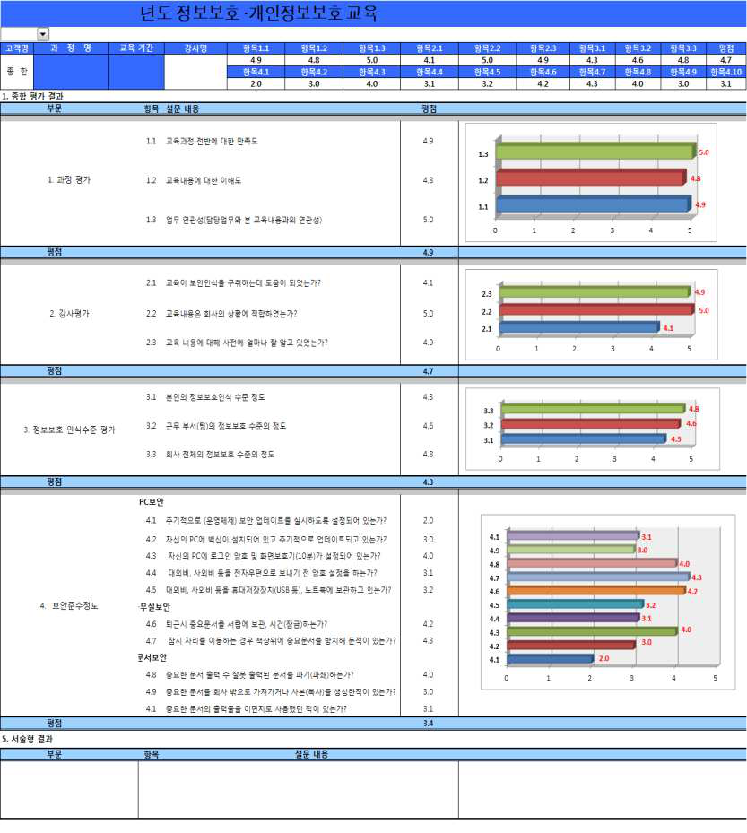

---
<!-- Page 317 -->

## 05. 부록2. 서식 예시

2026 주요정보통신기반시설 관리·물리적 취약점 분석·평가 방법 안내서
317
<서식 제37호>
정보보호시스템 접근규칙 검토 결과서
장비명
(위치)
수량
점검기간
정책현황
(점검전)
작업삭제내역
정책현황
(점검후)
정책수
기한만료
미사용
보안위배
정책수

---
<!-- Page 318 -->
| 한국인터넷진흥원 |
318
<서식 제38호>
침입차단시스템 서비스포트 허용/차단 요청서
※ 기관 요청 시는 결재 생략 가능

## 1. 신청자 정보

부서명
Tel
Fax
부서장명
직책
연락처
담당자명
직책
연락처

## 2. 서비스 신청내용

출발지(Source IP) 객체 정보
IP Address
시스템명(hostname)
시스템 용도
시스템 위치
목적지(Destination IP) 객체 정보
IP Address
시스템명(hostname)
시스템 용도
시스템 위치
IP Protocol
포트번호
차단/허용
통신방향
포트 용도
사용기간
TCP □
UDP □

차단 □
허용 □
단방향 □
양방향 □

영구 □
년  월  일부터
년  월  일까지
TCP □
UDP □

차단 □
허용 □
단방향 □
양방향 □

영구 □
년  월  일부터
년  월  일까지
TCP □
UDP □

차단 □
허용 □
단방향 □
양방향 □

영구 □
년  월  일부터
년  월  일까지
서비스요청목적(명확히 기술)
상기 요청한 보안정책은 시스템 관리/서비스를 위해 필요한 정책으로,
반드시 요청한 목적으로만 사용하도록 하겠습니다.
20     .        .
신   청   자                     (인)
결
재

---
<!-- Page 319 -->

## 05. 부록2. 서식 예시

2026 주요정보통신기반시설 관리·물리적 취약점 분석·평가 방법 안내서
319
<서식 제39호>
계정등록(변경⦁삭제)신청서
신청구분
□ 등록   □ 변경  □ 삭제
소속
성명
ID
사용자 구분
□ 시스템관리자
□ 개발자
□ 시스템운영자
□ DBMS 관리자
□ 내부 임직원
□ 외부업체 직원
신청내용
□ 특수권한 여부
(root 권한 등)
신청근거
사용기간 (처리기한)
대상시스템
담당업무
전자우편주소
전화번호
<주 의 사 항>

## 1. 계정의 관리책임은 본인에게 있음을 명심하고 타인에게 대여하거나 비밀번호를 공유하는 일이 없도록

하여야 한다.

## 2. 계정의 안전한 관리를 위하여 안전한 비밀번호를 사용하며, 분기 1회 이상 주기적으로 변경하여야 한다. 또,

계정을 생성하거나 권한을 변경한 경우 반드시 1일 이내 최초 접속하여 비밀번호를 변경하여야 한다.
상기 주의 사항을 명확히 인지하고, 조직 내 「계정관리지침」 제◯조제△항에 따라 위와 같이
사용자계정등록(변경ㆍ삭제)신청서를 제출합니다.
년     월     일
신청인                     (인)
부서장                     (인)
기  관  장  귀 하

---
<!-- Page 320 -->
| 한국인터넷진흥원 |
320
<서식 제40호>
네트워크 변경내용 신청서

## 1. 제품 개요

가. 작성자 정보 : 업체명, 작성일, 작성자 등
도입기관
개발업체
작성일
작성자
나. 검증제품 : 제품명, 버전, 펌웨어, 해시값 등
제품명
버전
펌웨어 파일명 (해시값)
검증일
다. 이전 ‘변경승인’에 관련된 내용
제품명
버전
변경승인일
변경승인내용

## 2. 변경 내역

가. 변경 전/후 시스템 구성
제품명
소프트웨어
하드웨어
변경전
변경후
변경전
변경후

---
<!-- Page 321 -->

## 05. 부록2. 서식 예시

2026 주요정보통신기반시설 관리·물리적 취약점 분석·평가 방법 안내서
321
나. 검증 제품 : 제품명, 버전, 펌웨어, 해시값 등
변경된 기능
변경 내용
다. 변경이 제품 설계에 미치는 영향
항목
영향 분석
라. 변경 부분에 대한 자체시험 테스트 결과
변경된 기능
시험내용
시험 결과

---
<!-- Page 322 -->
| 한국인터넷진흥원 |
322
<서식 제41호>
정보시스템 접근기록 검토결과서
담당자
정보보안담당관
점검일
회차(회)
점검자
점검세부내용
자산명
용도
점검항목(이상유무, O/X)
특이사항
(필요시
별도 첨부)
정책변경
설정변경
계정변경
ACL 로그
로그기록
유무
시간
동기화

---
<!-- Page 323 -->

## 05. 부록2. 서식 예시

2026 주요정보통신기반시설 관리·물리적 취약점 분석·평가 방법 안내서
323
<서식 제42호>
암호화키 관리대장(대외비)
No
일자
키사용용도
암호화키
부서명/
사용자명
사용자 서명
정보보호담당자
서명
1
키생성

#### 2015.10.1

데이터A
암호화
FACA37E0B0C8
5373DF706E73
F7C9AF86
IT보호팀/
홍길동
홍길동
김담당
키폐기

#### 2015.10.7

IT보호팀/
홍길동
홍길동
김담당
2
키생성
키폐기
3
키생성
키폐기
4
키생성
키폐기
5
키생성
키폐기
6
키생성
키폐기
7
키생성
키폐기
8
키생성
키폐기
9
키생성
키폐기
10
키생성
키폐기

---
<!-- Page 324 -->
| 한국인터넷진흥원 |
324
<서식 제43호>
암호화키 복구대장(대외비)
No
일자
암호화키
관리대장
일련번호
키복구  사유
부서명/
사용자명
사용자 서명
정보보호담당자
서명
1

#### 2015.10.20.

2
이순신의 병가로 암호화키
폐기를 위한 키 복구
IT보호팀/
김유신
김유신
김담당
2
3
4
5
6
7
8
9
10
11
12
13
14

---
<!-- Page 325 -->

## 1. 법규 및 지침············································································································326

## 2. 가이드 및 매뉴얼·····································································································331

### 부록3. 법규 및 가이드 목록

Chapter 06

2026 주요정보통신기반시설 관리·물리적 취약점 분석·평가 방법 안내서

---
<!-- Page 326 -->
| 한국인터넷진흥원 |
326

## 1. 법규 및 지침

구분
법규명
공포번호
소관부처
법
전자정부법
법률 제19030호
행정안전부
시행령
전자정부법 시행령
대통령령
제35172호
행정안전부
고시
행정기관 및 공공기관 정보시스템 구축·운영 지침
행정안전부고시
제2025-1호
행정안전부
훈령
국가사이버안전관리규정
대통령훈령
제316호
국가정보원
지침
국가 정보보안 기본지침
국가정보원
법
보안업무규정
대통령령
제31354호
국가정보원
훈령
보안업무규정 시행규칙
대통령훈령
제450호
국가정보원
법
전자금융거래법
법률
제19734호
금융위원회
시행령
전자금융거래법 시행령
대통령령
제35038호
금융위원회
고시
전자금융감독규정
금융위원회고시
제2024-4호
금융위원회
세칙
전자금융감독규정 시행세칙
금융감독원세칙
제9999호
금융감독원

---
<!-- Page 327 -->

## 06. 부록3. 법규 및 가이드 목록

2026 주요정보통신기반시설 관리·물리적 취약점 분석·평가 방법 안내서
327
고시
금융회사의 정보처리 업무 위탁에 관한 규정
금융위원회고시
제2021-9호
금융위원회
규준
금융회사의 정보통신수단 등 전산장비 이용관련
내부통제 모범 규준
금융감독원 기타
금융감독원
법
전자상거래 등에서의 소비자보호에 관한 법률
법률 제20302호
공정거래위원회
시행령
전자상거래 등에서의 소비자보호에 관한 법률
시행령
대통령령
제35257호
공정거래위원회
시행규칙
전자상거래 등에서의 소비자보호에 관한 법률
시행규칙
총리령
제2013호
공정거래위원회
법
여신전문금융업법
법률
제19260호
금융위원회
시행령
여신전문금융업법 시행령
대통령령
제35064호
금융위원회
시행규칙
여신전문금융업법 시행규칙
총리령
제1635호
금융위원회
고시
여신전문금융업감독규정
금융위원회고시
제2025-3호
금융위원회
세칙
여신전문금융업감독업무시행세칙
금융감독원세칙
제9999호
금융감독원
법
신용정보의 이용 및 보호에 관한 법률
법률
제20304호
금융위원회
시행령
신용정보의 이용 및 보호에 관한 법률 시행령
대통령령
제35227호
금융위원회

---
<!-- Page 328 -->
| 한국인터넷진흥원 |
328
시행규칙
신용정보의 이용 및 보호에 관한 법률 시행규칙
총리령
제1635호
금융위원회
고시
신용정보업감독규정
금융위원회고시
제2025-2호
금융위원회
법
정보통신기반 보호법
법률
제20068호
과학기술정보통신부
시행령
정보통신기반 보호법 시행령
대통령령
제35196호
과학기술정보통신부
시행규칙
정보통신기반 보호법 시행규칙
과학기술정보통신부령
제1호
과학기술정보통신부
훈령
과학기술정보통신부 소관
주요 정보통신기반시설 보호지침
과학기술
정보통신부훈령
제3호
과학기술정보통신부
법
정보통신망 이용촉진 및 정보보호 등에 관한 법률
법률
제20260호
과학기술정보통신부,
방송통신위원회
시행령
정보통신망 이용촉지 및 정보보호 등에 관한 법률
시행령
대통령령
제35172호
과학기술정보통신부,
방송통신위원회
시행규칙
정보통신망 이용촉진 및 정보보호 등에 관한 법률
시행규칙
과학기술정보통신부령
제71호
과학기술정보통신부,
방송통신위원회
고시
집적정보 통신시설 보호지침
과학기술
정보통신부고시
제2024-19호
과학기술
정보통신부
고시
정보보호조치에 관한 지침
과학기술
정보통신부고시
제 2017-7호
과학기술
정보통신부
법
의료법
법률
제20593호
보건복지부,
질병관리청

---
<!-- Page 329 -->

## 06. 부록3. 법규 및 가이드 목록

2026 주요정보통신기반시설 관리·물리적 취약점 분석·평가 방법 안내서
329
시행령
의료법 시행령
대통령령
제35382호
보건복지부,
질병관리청
시행규칙
의료법 시행규칙
보건복지부령 제1096호
보건복지부, 질병관리청
법
개인정보 보호법
법률
제19234호
개인정보보호위원회
시행령
개인정보 보호법 시행령
대통령령
제35343호
개인정보보호위원회
고시
개인정보의 안전성 확보조치 기준
개인정보
보호위원회고시
제 2023-6호
개인정보보호위원회
고시
표준 개인정보 보호지침
개인정보
보호위원회고시
제2024-1호
개인정보보호위원회
법
위치정보의 보호 및 이용 등에 관한 법률
법률
제18517호
방송통신위원회
시행령
위치정보의 보호 및 이용 등에 관한 법률 시행령
대통령령
제 34449호
방송통신위원회
고시
위치정보의 관리적‧기술적 보호조치 기준
방송통신위원회고시
제2022-11호
방송통신위원회
법
클라우드컴퓨팅 발전 및 이용자 보호에 관한 법률
법률
제20732호
과학기술정보통신부
시행령
클라우드컴퓨팅 발전 및 이용자 보호에 관한 법률
시행령
대통령령
제33220호
과학기술정보통신부
법
고등교육법
법률
제20662호
교육부

---
<!-- Page 330 -->
| 한국인터넷진흥원 |
330
※ 관련 법규 및 지침은 수시로 개정될 수 있으므로, 법령정보센터(www.law.go.kr) 등을 통해  최신의
법규 및 지침을 확인할 필요가 있음
시행령
고등교육법 시행령
대통령령
제35382호
교육부
법
사이버대학 설립·운영 규정
대통령령
제34517호
교육부
고시
원격교육 설비 기준 고시
교육부고시 제2019-213호
교육부
법
소방시설 설치 및 관리에 관한 법률
법률
제18522호
소방청
시행령
소방시설 설치 및 관리에 관한 법률 시행령
대통령령
제35151호
소방청
시행규칙
소방시설 설치 및 관리에 관한 법률 시행규칙
행전안전부령
제524호
소방청
법
건축법
법률
제20424호
국토교통부
시행령
건축법 시행령
대통령령
제35221호
국토교통부
시행규칙
건축법 시행규칙
국토교통부령
제1439호
국토교통부
시행규칙
건축물의 구조기준 등에 관한 규칙
국토교통부령 제1420호
국토교통부

---
<!-- Page 331 -->

## 06. 부록3. 법규 및 가이드 목록

2026 주요정보통신기반시설 관리·물리적 취약점 분석·평가 방법 안내서
331

## 2. 가이드 및 매뉴얼

NO
명칭
발간처
주요내용
1
알기쉬운 무선랜 보안 안내서
KISA
무선랜 구성요소, 무선 서비스 주요 보안 취약성과
대응기술, 보안정책, 무선인터넷 서비스 사용자
보안 권고에 대한 안내
2
알기쉬운 공중 무선랜 보안 안내서
KISA
안전한 공중 무선랜의 구축과 운영, 이용에 대한
방법
3
침해사고 분석 절차 안내서
KISA
해킹 및 개인정보 침해사고 대응하기 위한
분석절차 및 기술 제시, 악성코드 분석 및 대응,
악성코드 분석 및 대응절차
4
DDoS 공격대응 가이드
KISA
DDoS공격 발생 시 대응방안 및 대응절차 안내
5
개인정보의
안전성
확보조치
기준
해설서
KISA
개인정보보호법에
따른
안전성
확보조치
기준(고시)과 해설 제시
6
개인정보 암호화 조치 안내서
KISA
개인정보 암호화를 위한 조치 안내서
7
암호정책 수립 기준 안내서
KISA
ISMS, ISO/IEC 27001, ISO/IEC 17799에서
명시하는 요구사항에 적합한 상세 암호정책 수립
기준을 제시
8
개인정보 유출 등 사고 대응 매뉴얼
KISA
개인정보 유출 등 사고에 대한 신속한 대응과 그
피해를 최소화하기 위한 사항 안내
9
(공공기관/민간분야)
고정형
영상정보처리기기(CCTV)
설치운영
가이드라인
KISA
공공,
민간부문의
고정형
영상정보처리기기
설치·운영 및 개인영상정보 보호에 관한 준수 사항
기준 제시
10
개인정보 영향평가 수행안내서
KISA
개인정보 영향평가의 목적 및 필요성에 대해
제시하고 영향평가 절차별 수행방법을 안내
11
조직의 정보보호를 위한 자산 관리 지침
TTA
정보보호 관점에서 보호하여야할 주요 자산의 관리를
위해 이행하여야할 절차와 방법을 정의하고 절차별
주요 활동 사항 안내

---
<!-- Page 332 -->
2026
주요정보통신기반시설
관리·물리적 취약점 분석·평가방법
안내서

