# 주요정보통신기반시설 기술적 취약점 분석·평가 방법 상세가이드.pdf

> Converted: 2026-03-27 19:21

---
<!-- Page 1 -->
2026
주요정보통신기반시설
기술적 취약점 분석·평가방법
상세가이드

---
<!-- Page 2 -->
.
Ÿ 본 가이드는 기술적 취약점 분석·평가 항목별 점검 방법의 이해를 돕기 위해 발간된 것으로, 수록된 점검 방법은
취약점 분석:평가 수행 중 활용할 수 있는 참조의 대상일 뿐, 절대적이지 않습니다. 더욱이 점검 대상의 세부 버전,
패치 내용 등에 따라 점검 방법은 언제든지 변경될 수 있습니다. 따라서 본 가이드에 수록된 내용 이외에도 다양한
점검 방법을 사용하여 취약점 분석평가를 수행하시기 바랍니다.
Ÿ 본 가이드의 수록된 판단 기준은 일반적으로 통용되는 권고 사항으로, 양호 혹은 취약을 가르는 실제 판단 기준은 각
주요정보통신기반시설 현업에 적용되고 있는 다양한 정책 및 운용 상황을 고려하여 취약점 분석:평가 수행자가
최종적으로 결정해야 합니다. 예를 들어 본 가이드에 수록된 판단 기준에 의하여 취약 판단을 받게 되어도 그 위험을
부담할 수 있는 합당한 보안 조치와 근거를 수반하고 있다면 양호로 판단할 수 있습니다.
Ÿ 본 가이드를 교육기관 등에서 교육 자료로 활용하는 것을 권장하지 않습니다.
Ÿ 본 가이드에 수록된 점검 및 조치 사례는 시스템 유형별로 다음(표. 분야별 점검 대상 테스트 세부 버전) 버전에서
실증되었습니다.
Ÿ 개선 사항(취약점 개요, 점검 방법, 조치 방법 등)에 대한 의견을 향상 소중히 듣겠습니다.
※ E-mail : ciip@kisa.or.kr
(한국인터넷진흥원)

---
<!-- Page 3 -->
I. Unix 서버··························································································································7

## 1. 계정 관리···············································································································································12

## 2. 파일 및 디렉터리 관리·····························································································································39

## 3. 서비스 관리············································································································································68

## 4. 패치 관리·············································································································································160

## 5. 로그 관리·············································································································································164

II. Windows 서버·············································································································172

## 1. 계정 관리·············································································································································177

## 2. 서비스 관리··········································································································································196

## 3. 패치 관리·············································································································································233

## 4. 로그 관리·············································································································································235

## 5. 보안 관리·············································································································································241

III. 웹 서비스·····················································································································271

## 1. 계정 관리·············································································································································274

## 2. 서비스 관리··········································································································································280

## 3. 보안 설정·············································································································································325

## 4. 패치 및 로그 관리·································································································································347

CONTENTS

---
<!-- Page 4 -->
IV. 보안 장비·····················································································································353

## 1. 계정 관리·············································································································································356

## 2. 접근 관리·············································································································································363

## 3. 패치 관리·············································································································································367

## 4. 로그 관리·············································································································································368

## 5. 기능 관리·············································································································································373

Ⅴ. 네트워크 장비··············································································································387

## 1. 계정 관리·············································································································································391

## 2. 접근 관리·············································································································································406

## 3. 패치 관리·············································································································································422

## 4. 로그 관리·············································································································································424

## 5. 기능 관리·············································································································································431

Ⅵ. 제어시스템···················································································································467

## 1. 계정 관리·············································································································································472

## 2. 서비스 관리··········································································································································484

## 3. 패치 관리·············································································································································501

## 4. 네트워크 접근통제································································································································507

## 5. 물리적 접근통제····································································································································519

## 6. 보안위협 탐지·······································································································································522

## 7. 복구 대응·············································································································································525

## 8. 보안 관리·············································································································································539

## 9. 교육 훈련·············································································································································551

---
<!-- Page 5 -->
Ⅶ. PC ······························································································································552

## 1. 계정 관리·············································································································································555

## 2. 접근 관리·············································································································································561

## 3. 패치 관리·············································································································································577

## 4. 보안 관리·············································································································································580

Ⅷ. DBMS ························································································································593

## 1. 계정 관리·············································································································································596

## 2. 접근 관리·············································································································································628

## 3. 옵션 관리·············································································································································646

## 4. 패치 관리·············································································································································663

IX. 이동통신······················································································································670

## 1. 운영 관리·············································································································································672

X. Web Application(웹) ···································································································676
XI. 가상화 장비··················································································································787

## 1. 계정 관리·············································································································································790

## 2. 시스템 서비스 관리·······························································································································812

## 3. 가상 머신 관리······································································································································837

## 4. 가상 네트워크 관리·······························································································································845

---
<!-- Page 6 -->
XII. 클라우드·····················································································································851

## 1. 계정 관리·············································································································································854

## 2. 권한 관리·············································································································································858

## 3. 가상 리소스 관리···································································································································860

## 4. 운영 관리·············································································································································864

---
<!-- Page 7 -->
Unix 서버
Chapter 01

## 1. 계정 관리··················································································································12

## 2. 파일 및 디렉토리 관리································································································39

## 3. 서비스 관리···············································································································68

## 4. 패치 관리················································································································160

## 5. 로그 관리················································································································164

2026  주요정보통신기반시설 기술적 취약점 분석·평가 방법 상세가이드

---
<!-- Page 8 -->
| 한국인터넷진흥원 |
8
01
Unix 서버 취약점 분석 · 평가 항목

## 1. 계정 관리

점검항목
항목
중요도
항목코드
root 계정 원격 접속 제한
상
U-01
비밀번호 관리정책 설정
상
U-02
계정 잠금 임계값 설정
상
U-03
비밀번호 파일 보호
상
U-04
root 이외의 UID가 ‘0’ 금지
상
U-05
사용자 계정 su 기능 제한
상
U-06
불필요한 계정 제거
하
U-07
관리자 그룹에 최소한의 계정 포함
중
U-08
계정이 존재하지 않는 GID 금지
하
U-09
동일한 UID 금지
중
U-10
사용자 Shell 점검
하
U-11
세션 종료 시간 설정
하
U-12
안전한 비밀번호 암호화 알고리즘 사용
중
U-13

## 2. 파일 및 디렉토리 관리

점검항목
항목
중요도
항목코드
root 홈, 패스 디렉터리 권한 및 패스 설정
상
U-14
파일 및 디렉터리 소유자 설정
상
U-15
/etc/passwd 파일 소유자 및 권한 설정
상
U-16
시스템 시작 스크립트 권한 설정
상
U-17
/etc/shadow 파일 소유자 및 권한 설정
상
U-18

---
<!-- Page 9 -->
01. Unix 서버
2026  주요정보통신기반시설 기술적 취약점 분석·평가 방법 상세가이드
9

## 3. 서비스 관리

점검항목
항목
중요도
항목코드
/etc/hosts 파일 소유자 및 권한 설정
상
U-19
/etc/(x)inetd.conf 파일 소유자 및 권한 설정
상
U-20
/etc/(r)syslog.conf 파일 소유자 및 권한 설정
상
U-21
/etc/services 파일 소유자 및 권한 설정
상
U-22
SUID, SGID, Sticky bit 설정 파일 점검
상
U-23
사용자, 시스템 환경변수 파일 소유자 및 권한 설정
상
U-24
world writable 파일 점검
상
U-25
/dev에 존재하지 않는 device 파일 점검
상
U-26
$HOME/.rhosts, hosts.equiv 사용 금지
상
U-27
접속 IP 및 포트 제한
상
U-28
hosts.lpd 파일 소유자 및 권한 설정
하
U-29
UMASK 설정 관리
중
U-30
홈 디렉토리 소유자 및 권한 설정
중
U-31
홈 디렉토리로 지정한 디렉토리의 존재 관리
중
U-32
숨겨진 파일 및 디렉토리 검색 및 제거
하
U-33
점검항목
항목
중요도
항목코드
Finger 서비스 비활성화
상
U-34
공유 서비스에 대한 익명 접근 제한 설정
상
U-35
r 계열 서비스 비활성화
상
U-36
crontab 설정파일 권한 설정 미흡
상
U-37
DoS 공격에 취약한 서비스 비활성화
상
U-38
불필요한 NFS 서비스 비활성화
상
U-39
NFS 접근 통제
상
U-40
불필요한 automountd 제거
상
U-41

---
<!-- Page 10 -->
| 한국인터넷진흥원 |
10

## 4. 패치 관리

점검항목
항목
중요도
항목코드
주기적 보안 패치 및 벤더 권고사항 적용
상
U-64
점검항목
항목
중요도
항목코드
불필요한 RPC 서비스 비활성화
상
U-42
NIS, NIS+ 점검
상
U-43
tftp, talk 서비스 비활성화
상
U-44
메일 서비스 버전 점검
상
U-45
일반 사용자의 메일 서비스 실행 방지
상
U-46
스팸 메일 릴레이 제한
상
U-47
expn, vrfy 명령어 제한
중
U-48
DNS 보안 버전 패치
상
U-49
DNS Zone Transfer 설정
상
U-50
DNS 서비스의 취약한 동적 업데이트 설정 금지
중
U-51
Telnet 서비스 비활성화
중
U-52
FTP 서비스 정보 노출  제한
하
U-53
암호화되지 않는 FTP 서비스 비활성화
중
U-54
FTP 계정 Shell 제한
중
U-55
FTP 서비스 접근 제어 설정
하
U-56
Ftpusers 파일 설정
중
U-57
불필요한 SNMP 서비스 구동 점검
중
U-58
안전한 SNMP 버전 사용
상
U-59
SNMP Community String 복잡성 설정
중
U-60
SNMP Access Control 설정
상
U-61
로그인 시 경고 메시지 설정
하
U-62
sudo 명령어 접근 관리
중
U-63

---
<!-- Page 11 -->
01. Unix 서버
2026  주요정보통신기반시설 기술적 취약점 분석·평가 방법 상세가이드
11

## 5. 로그 관리

점검항목
항목
중요도
항목코드
NTP 및 시각 동기화 설정
중
U-65
정책에 따른 시스템 로깅 설정
중
U-66
로그 디렉터리 소유자 및 권한 설정
중
U-67

---
<!-- Page 12 -->
| 한국인터넷진흥원 |
12
U-01
(상)
UNIX > 1. 계정 관리
root 계정 원격 접속 제한
개요
점검 내용
시스템 정책에 root 계정의 원격터미널 접속 차단 설정이 적용 여부 점검
점검 목적
관리자 계정 탈취로 인한 시스템 장악을 방지하기 위해 외부 비인가자의 root 계정 접근 시도를
원천적으로 차단하기 위함
보안 위협
root 계정은 운영체제의 모든 기능을 설정 및 변경이 가능하여(프로세스, 커널 변경 등) root 계정을
탈취하여 외부에서 원격을 이용한 시스템 장악 및 각종 공격으로(무차별 대입 공격, 사전 대입 공격 등)
인한 root 계정 사용 불가 위험이 존재함
참고
※ root 계정: 여러 사용자가 사용하는 컴퓨터에서 모든 기능을 관리할 수 있는 총괄 권한을 가진 유일
한 특별 계정. 유닉스 시스템의 루트(root)는 시스템 관리자인 운용 관리자(Super User)로서 윈도
우의 Administrator보다 높은 System 계정에 해당하며, 사용자 계정을 생성하거나 소프트웨어를
설치하고, 환경 및 설정을 변경하거나 시스템의 동작을 감시 및 제어할 수 있음
※ 무차별 대입 공격(Brute Force Attack): 특정한 암호를 풀기 위해 가능한 모든 값을 대입하는 공격
방법
※ 사전 대입 공격(Dictionary Attack): 사전에 있는 단어를 입력하여 암호를 알아내거나 암호를
해독하는 데 사용되는 컴퓨터 공격 방법
※ tty(terminal-teletype): 서버와 연결된 모니터, 키보드 등을 통해 사용자가 콘솔로 직접 로그인함
※ pts(pseudo-terminal): 가상터미널을 뜻하며, Telnet, SSH 등을 이용하여 접속함
점검 대상 및 판단 기준
대상
SOLARIS, LINUX, AIX, HP-UX 등
판단 기준
양호 : 원격터미널 서비스를 사용하지 않거나, 사용 시 root 직접 접속을 차단한 경우
취약 : 원격터미널 서비스 사용 시 root 직접 접속을 허용한 경우
조치 방법
원격 접속 시 root 계정으로 접속할 수 없도록 파일 내용 설정
조치 시 영향
일반적인 경우 영향 없음
점검 및 조치 사례
l SOLARIS
[Telnet]
Step 1) /etc/default/login 파일 내에 CONSOLE 설정값 수정
CONSOLE=/dev/console

---
<!-- Page 13 -->
01. Unix 서버
2026  주요정보통신기반시설 기술적 취약점 분석·평가 방법 상세가이드
13
[SSH]
Step 1) /etc/ssh/sshd_config  파일 내의 PermitRootLogin 설정값 수정
PermitRootLogin No
l LINUX
[Telnet]
Step 1) /etc/pam.d/login 파일 내에 auth required /lib/security/pam_securetty.so 입력
Step 2) /etc/securetty 파일 내에 pts/ 설정값 주석 처리 및 제거
#pts/0
#pts/1
#pts/2
Step 3) /etc/pam.d/login 파일 내에 모듈 추가
auth required /lib/security/pam_securetty.so
※ /etc/securetty 파일 내 pts/x 관련 설정이 존재하는 경우 PAM 모듈 설정과 관계없이 root 계정 접속을 허용하
므로 반드시 제거 필요
※ CentOS 8, Ubuntu 20.04 이상부터 /etc/securetty 파일이 존재하지 않으며 기본적으로 Telnet 서비스가 비활성
화됨
[SSH]
Step 1) /etc/ssh/sshd_config 파일에 PermitRootLogin 값 수정
PermitRootLogin No
l AIX
[Telnet]
Step 1) /etc/security/user 파일에 rlogin 설정값 수정
rlogin = false
[SSH]
Step 1) /etc/ssh/sshd_config 파일에 PermitRootLogin 값 수정
PermitRootLogin No

---
<!-- Page 14 -->
| 한국인터넷진흥원 |
14
l HP-UX
[Telnet]
Step 1) etc/securetty 파일 내에 console 값 수정
console
※ /etc/securetty 파일은 기본적으로 존재하지 않으므로 해당 파일이 존재하지 않는 경우 생성 후 설정할 것
[SSH]
Step 1) /opt/ssh/etc/sshd_config 파일 내에 PermitRootLogin 값 수정
PermitRootLogin No

---
<!-- Page 15 -->
01. Unix 서버
2026  주요정보통신기반시설 기술적 취약점 분석·평가 방법 상세가이드
15
U-02
(상)
UNIX > 1. 계정 관리
비밀번호 관리정책 설정
개요
점검 내용
비밀번호 관리 정책 설정 여부 점검
점검 목적
사용자의 비밀번호 복잡성과 주기적 변경을 통해 시스템 보안을 강화하기 위함
보안 위협
비밀번호 관련 정책이 설정되지 않을 경우, 비인가자의 각종 공격(무차별 대입 공격, 사전 대입 공격
등)에 의해 비밀번호가 노출될 위험이 존재함
참고
※ 비밀번호 관리 정책: 비밀번호 복잡성 및 길이, 변경 주기 등을 포함한 비밀번호 정책
※ 비밀번호 복잡성: 비밀번호 설정 시 영문, 숫자, 특수문자를 포함하여 최소 8자리 이상
점검 대상 및 판단 기준
대상
SOLARIS, LINUX, AIX, HP-UX 등
판단 기준
양호 : 비밀번호 관리 정책이 설정된 경우
취약 : 비밀번호 관리 정책이 설정되지 않은 경우
조치 방법
root 계정을 포함한 사용자 계정의 비밀번호를 영문, 숫자, 특수문자를 포함하여 최소 8자리 이상 및
최소 사용 기간 1일, 최대 사용 기간 90일, 최근 비밀번호 기억 4회 이상으로 설정
조치 시 영향
비밀번호 변경 시 Web, WAS, DB 연동 구간에서 문제가 발생할 수 있으므로 연동 구간에 미칠 수 있는
영향을 고려하여 적용 필요
점검 및 조치 사례
l SOLARIS
Step 1) /etc/default/passwd 파일 내에 비밀번호 설정값 수정
HISTORY=4
PASSLENGTH=8
MINDIGIT=1
MINUPPER=1
MINLOWER=1
MINSPECIAL=1
WHITESPACE=NO

---
<!-- Page 16 -->
| 한국인터넷진흥원 |
16
권고값
기능
설명
HISTORY= 10
이전 비밀번호 기억 개수
이전 10개의 암호를 기억함
MINDIFF= 4
이전 암호와 차이
이전 암호와 4자 이상 차이 요구
MINALPHA= 1
최소 문자 요구
최소 1자 이상 문자 요구
MINNONALPHA= 1
최소 숫자 또는 특수문자 요구
숫자 또는 특수문자 1자 이상 요구
MINUPPER= 1
최소 대문자 요구
최소 1자 이상 대문자 요구
MINLOWER= 1
최소 소문자 요구
최소 1자 이상 소문자 요구
MAXREPEATS= 0
연속 문자 사용 허용
0일 경우 문자 연속 사용이 불가
MINSPECIAL= 1
최소 특수문자 요구
최소 1자 이상 특수문자 요구
MINDIGIT= 1
최소 숫자 요구
최소 1자 이상 숫자 요구
NAMECHECK= YES
아이디와 비밀번호 동일 검증
아이디와 동일한 비밀번호 사용 불가
MAXDAYS= 90
비밀번호 최대 유효일 수
최대 90일 비밀번호가 유효
MINDAYS= 1
비밀번호 변경 최소일 수
비밀번호 최소 1일 후 변경 가능
MAXWEEKS= 12
비밀번호 최대 유효 주 수
최대 12주 비밀번호가 유효
MINWEEKS= 1
비밀번호 변경 최소일 수
비밀번호 최소 일주일 후 변경 가능
WARNWEEKS= 1
비밀번호 만료 전 알림 주 수
비밀번호 만료 일주일 전 알림
PASSLENGTH= 8
비밀번호 최소 길이
비밀번호 최소 길이 8
WHITESPACE= NO
비밀번호 공백문자 사용 여부
비밀번호에 공백문자 사용 금지 설정
※ MINDIGIT, MINSPECIAL 설정이 적용되어 있는 경우 MINNONALPHA 설정은 적용되지 않음
※ MINDAYS 설정이 적용되어야 MAXDAYS 설정이 적용됨
※ 비밀번호 유효일 설정과 비밀번호 유효 주 설정은 중복 설정 불가함
※ WHITESPACE 기본값: YES

---
<!-- Page 17 -->
01. Unix 서버
2026  주요정보통신기반시설 기술적 취약점 분석·평가 방법 상세가이드
17
l LINUX
[Redhat]
Step 1) /etc/login.defs 파일에 PASS_MAX_DAYS / PASS_MIN_DAYS 값 수정
PASS_MAX_DAYS 90
PASS_MIN_DAYS 0
Step 2) /etc/security/pwquality.conf 파일에 정책 값 수정
minlen = 8
dcredit = -1
ucredit = -1
lcredit = -1
ocredit = -1
enforce_for_root
Step 3) /etc/security/pwhistory.conf 파일에 값 추가 및 수정
enforce_for_root
remember=4
file = /etc/security/opasswd
Step 4) /etc/pam.d/system-auth 파일에 값 수정
Step 5) /etc/login.defs 파일에 PASS_MAX_DAYS / PASS_MIN_DAYS 값 수정
PASS_MAX_DAYS 90
PASS_MIN_DAYS 1
※ pam_pwquality.so, pam_pwhistory.so 모듈은 pam_unix.so 모듈 위에 위치해야 적용됨
※ /etc/security/pwquality.conf 파일과 /etc/pam.d/system-auth 파일 중 어느 하나라도 비밀번호 관리 정책이
설정되어 있으면 양호
※ 비밀번호 복잡성 설정에서 최소 요구 항목의 값은 반드시 -1로 설정되어야 함
※ /etc/pam.d/system-auth 파일에 enforce_for_root 추가
[Debian]
Step 1) /etc/security/pwquality.conf 파일에 정책 값 수정
minlen = 8
dcredit = -1

---
<!-- Page 18 -->
| 한국인터넷진흥원 |
18
ucredit = -1
lcredit = -1
ocredit = -1
enforce_for_root
Step 2) /etc/pam.d/common-password 파일에 정책 값 수정
pam_pwquality.so, pam_pwhistory.so 모듈은 pam_unix.so 모듈 위에 위치해야 적용됨
Step 3) /etc/login.defs 파일에 값 수정
PASS_MAX_DAYS 90
PASS_MIN_DAYS 1
권고값
기능
설명
difok = N
기존 비밀번호와 비교
기존 비밀번호에 포함되지 않는 문자를 최소 N개 이상
포함하도록 설정
minlen = 8
최소 비밀번호 길이 설정
최소 8자리 이상 설정
dcredit = -1
최소 숫자 요구
최소 숫자 1자 이상 요구
ucredit = -1
최소 대문자 요구
최소 대문자 1자 이상 요구
lcredit = -1
최소 소문자 요구
최소 소문자 1자 이상 요구
ocredit = -1
최소 특수문자 요구
최소 특수문자 1자 이상 요구
remember = N
최근 비밀번호 기억
최근 변경한 비밀번호를 N개 이상 기억하여 동일한
비밀번호로 변경하지 못하도록 설정
PASS_MIN_DAYS = 1
비밀번호 최소 사용 기간 설정
비밀번호 최소 사용 기간 설정 (단위 : 일)
PASS_MAX_DAYS = 90
비밀번호 최대 사용 기간 설정
비밀번호 최대 사용 기간 설정 (단위 : 일)
※ /etc/security/pwquality.conf 파일과 /etc/pam.d/common-password(/etc/pam.d/system-auth) 파일 중 어느
하나라도 비밀번호 관리 정책이 설정되어 있으면 양호
※ 비밀번호 복잡성 설정에서 최소 요구 항목의 값은 반드시 -1로 설정되어야 함
※ /etc/pam.d/system-auth 파일에 enforce_for_root 추가
l AIX
Step 1) etc/security/user 파일에 정책 값 수정
default :
minage = 1
maxage = 12
minalpha = 2
minother = 2

---
<!-- Page 19 -->
01. Unix 서버
2026  주요정보통신기반시설 기술적 취약점 분석·평가 방법 상세가이드
19
minspecialchar = 1
minlen = 8
mindiff = 4
histsize = 4
권고값
기능
설명
histexpire= N
동일한 비밀번호 재사용 기간
비밀번호 재사용에 필요한 시간 (단위 : 주)
histsize= 4
이전 비밀번호 기억 개수
허용 비밀번호 반복 횟수
maxrepeats= 2
반복 가능한 동일 문자의 최대 수
비밀번호에서 반복될 수 있는 최대 문자 수
minalpha= 2
최소 알파벳 문자 포함
비밀번호에 필요한 최소 영문자 수
minother= 2
최소 알파벳 문자 이외의 문자 수
비밀번호에 필요한 최소 알파벳을 제외한 문자 수
minspecialchar= 1
최소 특수문자 포함
비밀번호에 필요한 최소 특수문자 수
mindiff= 4
이전 비밀번호와 동일 문자 수
이전 비밀번호와 구별되는 새 비밀번호의 최소 문자 수
minlen= 8
비밀번호 최소 길이
최소 비밀번호 길이
minage= 1
비밀번호 최소 사용 기간
비밀번호 변경에 필요한 최소 기간 (단위 : 주)
maxage= 12
비밀번호 최대 사용 기간
비밀번호 변경에 필요한 최대 시간 (단위 : 주)
l HP-UX
Step 1) /etc/default/security 파일에 정책 값 수정
MIN_PASSWORD_LENGTH=8
PASSWORD_MIN_UPPER_CASE_CHARS=1
PASSWORD_MIN_LOWER_CASE_CHARS=1
PASSWORD_MIN_DIGIT_CASE_CHARS=1
PASSWORD_MIN_SPECIAL_CASE_CHARS=1
PASSWORD_MAXDAYS=90
PASSWORD_MINDAYS=1
HISTORY=4
권고값
기능
설명
MIN_PASSWORD_LENG
TH= 8
비밀번호 최소 길이
최소 비밀번호 길이
PASSWORD_MIN_UPPE
R_CASE_CHARS= 1
최소 대문자 필요 개수
비밀번호에 필요한 최소 대문자 수
PASSWORD_MIN_LOWE 최소 소문자 필요 개수
비밀번호에 필요한 최소 소문자 수

---
<!-- Page 20 -->
| 한국인터넷진흥원 |
20
[부적절한 비밀번호 유형]
사전에 나오는 단어나 이들의 조합
길이가 너무 짧거나 NULL(공백)인 비밀번호
키보드 자판의 일련의 나열(예시 : abcd, qwert 등)
사용자 계정 정보에서 유추 가능한 단어들(예시 : 지역명, 부서명, 계정명, 사용자 이름 이니셜, root, admin 등)
[비밀번호 관리 방법]
영문, 숫자, 특수문자를 조합하여 계정명과 다른 8자 이상의 비밀번호 설정

## 1. 다음 각 항목의 문자 종류 중 2종류 이상을 조합하여 최소 10자리 이상 또는 3종류 이상을 조합하여 최소 8자리

이상의 길이로 구성
가. 영문 대문자(26개)
나. 영문 소문자(26개)
다. 숫자(10개)
라. 특수문자(32개)

## 2. 시스템마다 다른 비밀번호 사용

## 3. 비밀번호를 기록해 놓는 경우 변형하여 기록

권고값
기능
설명
R_CASE_CHARS= 1
PASSWORD_MIN_DIGIT_
CHARS= 1
최소 숫자 필요 개수
비밀번호에 필요한 최소 숫자 수
PASSWORD_MIN_SPECI
AL_CHARS= 1
최소 특수문자 필요 개수
비밀번호에 필요한 최소 특수문자 수
PASSWORD_MINDAYS=
1
비밀번호 최소 사용 기간
비밀번호 변경에 필요한 최소 기간 (단위 : 일)
PASSWORD_MAXDAYS=
90
비밀번호 최대 사용 기간
비밀번호 변경에 필요한 최대 시간 (단위 : 일)
HISTORY= 4
이전 비밀번호 기억 개수
허용 비밀번호 반복 횟수

---
<!-- Page 21 -->
01. Unix 서버
2026  주요정보통신기반시설 기술적 취약점 분석·평가 방법 상세가이드
21
U-03
(상)
UNIX > 1. 계정 관리
계정 잠금 임계값 설정
개요
점검 내용
사용자 계정 로그인 실패 시 계정 잠금 임계값이 설정 여부 점검
점검 목적
계정 탈취 목적의 무차별 대입 공격 시 해당 계정을 잠금으로써 인증 요청에 응답하는 리소스 낭비를
차단하고 대입 공격으로 인한 비밀번호 노출 공격을 무력화하기 위함
보안 위협
계정 잠금 임계값이 설정되어 있지 않을 경우, 비밀번호 탈취 공격(무차별 대입 공격, 사전 대입 공격,
추측 공격 등)의 인증 요청에 대해 설정된 비밀번호가 일치할 때까지 지속적으로 응답하여 해당 계정의
비밀번호가 유출될 위험이 존재함
참고
※ 사용자 로그인 실패 임계값: 시스템에 로그인 시 몇 번의 로그인 실패에 로그인을 차단할 것인지
결정하는 값
점검 대상 및 판단 기준
대상
SOLARIS, LINUX, AIX, HP-UX 등
판단 기준
양호 : 계정 잠금 임계값이 10회 이하의 값으로 설정된 경우
취약 : 계정 잠금 임계값이 설정되어 있지 않거나, 10회 이하의 값으로 설정되지 않은 경우
조치 방법
계정 잠금 임계값을 10회 이하로 설정
조치 시 영향
Ÿ HP-UX: Trusted Mode로 전환 시 파일 시스템 구조가 변경되어 운영 중인 서비스에 문제가 발생할
수 있으므로 충분한 테스트를 거친 후 Trusted Mode로의 전환이 필요함
Ÿ LINUX: /etc/pam.d/system-auth 파일 설정 시 라이브러리(/lib/security/pam_tally.so)가 해당
경로에 존재하는지 확인 필요 (존재하지 않는 파일의 경로로 설정하는 경우 시스템 로그인에 장애가
발생할 수 있음)
Ÿ PAM 모듈을 이용하여 설정할 때 해당 순서를 지키지 않을 경우, 로그인 실패 또는 인증 실패 등
예기치 못한 상황이 발생할 수 있으므로 반드시 순서에 맞게 설정해야 함
점검 및 조치 사례
l SOLARIS
[5.9 미만 버전]
Step 1) /etc/default/login 파일에 RETRIES 값 수정
RETRIES=10
[5.9 이상 버전]
Step 1) /etc/security/policy.conf 파일에 LOCK_AFTER_RETRIES 값 수정

---
<!-- Page 22 -->
| 한국인터넷진흥원 |
22
LOCK_AFTER_RETRIES=YES
UNLOCK_AFTER =2m
옵션
설명
RETRIES
로그인 시도 횟수
LOCK_AFTER_RETRIES
로그인 시도 횟수와 같거나 초과 되면 잠금 여부
UNLOCK_AFTER
잠금시간 분(m), 시(h), 일(d), w(주) 단위로 설정 가능

l LINUX
[Redhat 계열의 pam_tally.so 또는 pam_tally2.so]
Step 1) /etc/pam.d/system-auth 파일에 deny 값 수정
auth required /lib/security/pam_tally.so 또는 /lib/security/pam_tally2.so deny=10 unlock_time=120 no_magic_root
account required /lib/security/pam_tally.so 또는 /lib/security/pam_tally2.so no_magic_root reset
※ /etc/pam.d/system-auth 파일 수정 시 모듈이 해당 경로에 존재하지 않을 경우, 모든 계정의 로그인이 되지 않
는 등 예기치 못한 상황이 발생할 수 있으므로 반드시 올바른 경로를 작성해야 함
[Redhat 계열의 authselect]
Step 1) # authselect enable-feature with-faillock 입력하여 faillock 적용
# authselect current
Profile ID: sssd
Enabled features:
- with-fingerprint
- with-silent-lastlog
- with-faillock
Step 2) etc/securiy/faillock.conf 파일에 정책 값 수정
silent
deny = 10
unlock_time = 120
[Redhat 계열의 pam_faillock.so]
Step 1) /etc/pam.d/system-auth 파일에 모듈 값 수정

---
<!-- Page 23 -->
01. Unix 서버
2026  주요정보통신기반시설 기술적 취약점 분석·평가 방법 상세가이드
23
auth required pam_faillock.so preauth silent audit deny=10 unlock_time=120
Step 2) /etc/pam.d/password-auth 파일에 모듈 값 수정
auth required pam_faillock.so preauth silent audit deny=10 unlock_time=120
※ RHEL 8 이상부터 authselect 명령어를 이용하여 설정하는 것을 권장함
[Debian 계열의 pam_tally.so 또는 pam_tally2.so]
Step 1) /etc/pam.d/common-auth 파일에  모듈 값 수정
auth required /lib/security/pam_tally.so 또는 /lib/security/pam_tally2.so deny=10 unlock_time=120
no_magic_root
account required /lib/security/pam_tally.so 또는 /lib/security/pam_tally2.so no_magic_root reset
[Debian 계열의 pam_faillock.so]
Step 1) /etc/pam.d/common-auth 파일에 pam_faillock.so 모듈 값 수정
[ /etc/pam.d/common-auth ]
Step 2) etc/pam.d/common-account 파일에 pam_faillock.so 모듈 값 수정
[ /etc/pam.d/common-account ]

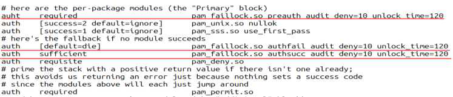

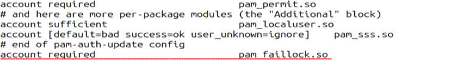

---
<!-- Page 24 -->
| 한국인터넷진흥원 |
24
※ /etc/pam.d/* 파일 수정 시 모듈이 해당 경로에 존재하지 않을 경우, 모든 계정의 로그인이 되지 않는 등
예기치 못한 상황이 발생할 수 있으므로 반드시 올바른 경로를 작성해야 함
※ no_magic_root, reset 옵션은 pam_faillock.so 모듈에서 기본으로 작동함
※ audit : 실패한 로그인 시도, 잠금 조치, 계정 차단 등의 이벤트를 로그에 기록하는 옵션
※ silent : 비밀번호 인증 실패 시 사용자에게 세부적인 오류 메시지를 표시하지 않는 옵션
l AIX
Step 1) /etc/security/user 파일에 loginretries 값 수정
loginretries = 3
l HP-UX
[11.v2 이하 버전]
Step 1) /tcb/files/auth/system/default 파일에 u_maxtries 값 수정
u_maxtries#3
※ HP-UX 서버에 계정 잠금 정책 설정을 위해서는 HP-UX 서버가 Trusted Mode로 동작하고 있어야 하므로
Trusted Mode로 전환 후 잠금 정책 적용
[11.v3 이상 버전]
Step 1) /etc/default/security 파일에 AUTH_MAXTRIES 값 수정
AUTH_MAXTRIES=3
※ Standard 모드와 Shadow 모드만 적용 가능
옵션
설명
no_magic_root
root 계정은 비밀번호 잠금 설정을 적용하지 않음
deny=N
N회 입력 실패 시 계정 잠금
unlock_time
계정이 잠긴 경우, 마지막 계정 실패 시간부터 설정된 시간이 지나면 자동으로 계정
잠금 해제 (단위 : 초)
reset
접속 시도 성공 시 실패한 횟수 초기화

---
<!-- Page 25 -->
01. Unix 서버
2026  주요정보통신기반시설 기술적 취약점 분석·평가 방법 상세가이드
25
U-04
(상)
UNIX > 1. 계정 관리
비밀번호 파일 보호
개요
점검 내용
시스템의 사용자 계정(root, 일반 사용자) 정보가 저장된 파일(/etc/passwd, /etc/shadow 등)에
사용자 계정 비밀번호가 암호화 저장 여부 점검
점검 목적
일부 오래된 시스템의 경우 /etc/passwd 파일에 비밀번호가 평문으로 저장되므로 사용자 계정
비밀번호가 암호화되어 저장되어 있는지 점검하여 비인가자의 비밀번호 파일 접근 시에도 사용자 계정
비밀번호가 안전하게 관리되고 있는지 확인하기 위함
보안 위협
사용자 계정 비밀번호가 저장된 파일이 유출 또는 탈취 시 평문으로 저장된 비밀번호 정보가 노출 위험이
존재함
참고
※ pwconv: 쉐도우 비밀번호 정책
※ pwunconv: 일반 비밀번호 정책
점검 대상 및 판단 기준
대상
SOLARIS, LINUX, AIX, HP-UX 등
판단 기준
양호 : 쉐도우 비밀번호를 사용하거나, 비밀번호를 암호화하여 저장하는 경우
취약 : 쉐도우 비밀번호를 사용하지 않고, 비밀번호를 암호화하여 저장하지 않는 경우
조치 방법
비밀번호 암호화 저장·관리 설정
조치 시 영향
HP-UX 경우 Trusted Mode로 전환 시 파일 시스템 구조가 변경되어 운영 중인 서비스에 문제가
발생할 수 있으므로 충분한 테스트를 거친 후 Trusted Mode로의 전환이 필요함
점검 및 조치 사례
l SOLARIS, LINUX
Step 1) /etc/passwd 입력 후 파일 내 두 번째 필드가 x 표시되는지 확인
root:x:0:0:root:/root:/bin/bash
Step 2) # pwconv 명령으로 쉐도우 비밀번호 적용
※ SOLARIS 11은 pwunconv 명령어가 존재하지 않음

---
<!-- Page 26 -->
| 한국인터넷진흥원 |
26
l AIX
Step 1) /etc/security/passwd 파일에 암호화 여부 확인
※ AIX는 기본적으로 /etc/security/passwd 파일에 비밀번호를 암호화하여 저장·관리함
l HP-UX
Step 1) /etc/passwd 파일에 암호화 확인
Step 2) # pwconv 명령으로 쉐도우 비밀번호 적용
※ HP-UX 서버는 Trusted Mode로 전환할 경우 비밀번호를 암호화하여 /tcb/files/auth 디렉터리에 계정 이니셜
과 계정 이름에 따라 파일로 저장·관리할 수 있으므로 Trusted Mode인지 확인 후 UnTrusted Mode인 경우 모
드를 전환함
※ Trusted mode 전환 방법 : root계정으로 아래 명령어 실행
# /etc/tsconvert
※ UnTrusted mode 전환 방법 : root계정으로 아래 명령어 실행
# /etc/tsconvert –r
※ HP-UX 11.11의 경우 Shadow Password Bundle을 설치하여야 /etc/shadow 파일 생성됨

---
<!-- Page 27 -->
01. Unix 서버
2026  주요정보통신기반시설 기술적 취약점 분석·평가 방법 상세가이드
27
U-05
(상)
UNIX > 1. 계정 관리
root 이외의 UID가 ‘0’ 금지
개요
점검 내용
사용자 계정 정보가 저장된 파일(/etc/passwd, /etc/shadow 등)에 root(UID=0) 계정과 동일한
UID를 가진 계정이 존재 여부 점검
점검 목적
root 계정과 동일한 UID가 존재하는지 점검하여 root 권한이 일반 사용자 계정이나 비인가자의 접근
위협에 안전하게 보호되고 있는지 확인하기 위함
보안 위협
Ÿ root 계정과 동일한 UID가 설정되어 있는 일반 사용자 계정도 root 권한을 부여받아 관리자가 실행할
수 있는 모든 작업이 가능한 위험이 존재함(서비스 시작, 중지, 재부팅, root 권한 파일 편집 등)
Ÿ root 계정과 동일한 UID를 사용하므로 사용자 감사 추적 시 어려움 발생 위험이 존재함
참고
※ UID(User Identification): 여러 명의 사용자가 동시에 사용하는 시스템에서 사용자가 자신을
대표하기 위해 쓰는 이름
※ OS마다 UID 체계가 달라 시스템 계정 및 일반 사용자 계정이 부여받는 값의 범위에 차이가 있으나,
관리자는 공통으로 UID=0을 부여받음
점검 대상 및 판단 기준
대상
SOLARIS, LINUX, AIX, HP-UX 등
판단 기준
양호 : root 계정과 동일한 UID를 갖는 계정이 존재하지 않는 경우
취약 : root 계정과 동일한 UID를 갖는 계정이 존재하는 경우
조치 방법
Ÿ UID가 0으로 설정된 계정을 0 이외의 중복되지 않은 UID로 변경 또는 불필요한 계정인 경우
제거하도록 설정
Ÿ (사용 중인 계정인 경우 명령어를 통한 조치가 적용되지 않을 수 있으므로 /etc/passwd 파일을 통해
변경)
조치 시 영향
해당 계정에 관리자 권한이 필요하지 않으면 일반적으로 영향 없음
점검 및 조치 사례
l SOLARIS, LINUX, AIX, HP-UX
Step 1) usermod 명령어를 이용하여 # usermod -u <변경할 UID> <사용자 이름> 명령으로 0 이외의 중복되지 않
는 UID로 변경
[ /etc/passwd 파일 구조 ]

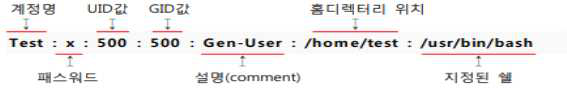

---
<!-- Page 28 -->
| 한국인터넷진흥원 |
28
※ “:”(콜론)을 사용하여 필드를 구분함
※ 세 번째 필드(UID)가 0인 경우 슈퍼 유저 권한을 가지며, 0 이외의 계정은 일반, 시스템 계정으로 볼 수 있음

---
<!-- Page 29 -->
01. Unix 서버
2026  주요정보통신기반시설 기술적 취약점 분석·평가 방법 상세가이드
29
U-06
(상)
UNIX > 1. 계정 관리
사용자 계정 su 기능 제한
개요
점검 내용
su 명령어 사용을 허용하는 사용자를 지정한 그룹이 설정 여부 점검
점검 목적
su 관련 그룹만 su 명령어 사용 권한이 부여되어 있는지 점검하여 su 그룹에 포함되지 않은 일반
사용자의 su 명령 사용을 원천적으로 차단하는지 확인하기 위함
보안 위협
무분별한 사용자 변경으로 타 사용자 소유의 파일을 변경할 수 있으며 root 계정으로 변경하는 경우
관리자 권한을 획득할 수 있는 위험이 존재함
참고
-
점검 대상 및 판단 기준
대상
SOLARIS, LINUX, AIX, HP-UX 등
판단 기준
양호 : su 명령어를 특정 그룹에 속한 사용자만 사용하도록 제한된 경우
※ 일반 사용자 계정 없이 root 계정만 사용하는 경우 su 명령어 사용 제한 불필요
취약 : su 명령어를 모든 사용자가 사용하도록 설정된 경우
조치 방법
PAM 모듈 설정 또는 su 명령어 허용 그룹 생성 후 su 명령어 일반 사용자 권한 제거하도록 설정
조치 시 영향
그룹에 추가된 계정들은 모든 Session 종료 후 재 로그인 시 su 명령어 사용 가능
점검 및 조치 사례
l SOLARIS, AIX, HP-UX
Step 1) /etc/group 파일 내 wheel 그룹 (su 명령어 사용 그룹) 및 그룹 내 구성원 존재 여부 확인
Step 2) ls –l /usr/bin/su 입력 후 wheel 그룹이 su 명령어를 사용할 수 있는지 설정 여부 확인
Step 3) wheel group 생성 (wheel 그룹이 존재하지 않는 경우)
# groupadd wheel
su 명령 그룹 변경
# chgrp wheel /usr/bin/su
su 명령어 권한 변경
# chmod 4750 /usr/bin/su
wheel 그룹에 su 명령 허용 계정 등록
# usermod -G wheel <username>
또는 직접 /etc/group 파일을 수정하여 필요한 계정 등록
wheel:x:10: -> wheel:x:10:root,admin

---
<!-- Page 30 -->
| 한국인터넷진흥원 |
30
l LINUX
[PAM 모듈 이용 중이지 않을 경우]
Step 1) /etc/group 파일 내 wheel 그룹(su 명령어 사용 그룹) 확인
Step 2) ls 명령어를 이용하여 # ls -l /usr/bin/su 입력 후 su 명령어 그룹과 권한 확인
Step 3) wheel group 생성 (wheel 그룹이 존재하지 않는 경우)
# groupadd wheel
su 명령 그룹 변경
# chgrp wheel /usr/bin/su
su 명령어 권한 변경
# chmod 4750 /usr/bin/su
wheel 그룹에 su 명령 허용 계정 등록
# usermod -G wheel <username>
※ /etc/group 파일에서 기본 그룹의 경우 사용자 이름은 생략되며 자동으로 포함됨
[PAM 모듈 이용 중인 경우]
Step 1) /etc/group 입력 후 wheel 그룹(su 명령어 사용 그룹) 확인
예시) wheel:x:1002:
Step 2) etc/pam.d/su 파일 내 su 명령어 허용 그룹 확인
Step 3) usr/bin/su 파일 내 su 명령어 그룹과 권한 확인
Step 4) /etc/pam.d/su 파일에 모듈 값 수정
auth
required pam_wheel.so use_uid
또는
auth
required pam_wheel.so group=wheel

---
<!-- Page 31 -->
01. Unix 서버
2026  주요정보통신기반시설 기술적 취약점 분석·평가 방법 상세가이드
31
U-07
(하)
UNIX > 1. 계정 관리
불필요한 계정 제거
개요
점검 내용
시스템 계정 중 불필요한 계정(퇴직, 전직, 휴직 등의 이유로 사용하지 않는 계정 및 장기적으로 사용하지
않는 계정 등)이 존재 여부 점검
점검 목적
불필요한 계정이 존재하는지 점검하여 관리되지 않은 계정에 의한 침입에 대비하는지 확인하기 위함
보안 위협
로그인이 가능하고 현재 사용하지 않는 불필요한 계정은 사용 중인 계정보다 상대적으로 관리가
취약하여 공격자의 목표가 되어 계정이 탈취될 수 있는 위험이 존재함(퇴직, 전직, 휴직 등의 사유 발생
시 즉시 권한을 회수하는 것을 권고함)
참고
※ 기본 계정: OS나 Package 설치 시 기본적으로 생성되는 계정(lp, uucp, nuucp 등)
※ 불필요한 기본 계정 제거 시 발생할 업무 영향도를 파악한 후 제거 권고
점검 대상 및 판단 기준
대상
SOLARIS, LINUX, AIX, HP-UX 등
판단 기준
양호 : 불필요한 계정이 존재하지 않는 경우
취약 : 불필요한 계정이 존재하는 경우
조치 방법
시스템에 존재하는 계정 확인 후 불필요한 계정 제거하도록 설정
조치 시 영향
일반적인 경우 영향 없음
점검 및 조치 사례
l SOLARIS, LINUX, AIX, HP-UX
[/etc/passwd 파일을 이용하여 점검]
Step 1) /etc/passwd 파일 내 계정을 확인 후 “# userdel <사용자 이름>” 명령으로 불필요한 사용자 계정 제거
※ AIX 경우 rmuser 명령어 사용
※ /etc/passwd 파일에서 계정 앞에 #을 삽입하여도 주석으로 처리되지 않으므로 조치 시에는 반드시 계정을 제
거하도록 권고함
[log를 이용하여 점검]
Step 1) last 명령어로 불필요한 계정 확인 후 제거

---
<!-- Page 32 -->
| 한국인터넷진흥원 |
32
U-08
(중)
UNIX > 1. 계정 관리
관리자 그룹에 최소한의 계정 포함
개요
점검 내용
시스템 관리자 그룹에 최소한(root 계정과 시스템 관리에 허용된 계정)의 계정만 존재 여부 점검
점검 목적
관리자 그룹에 최소한의 필요 계정만 존재하는지 확인하여 불필요한 권한 남용을 점검하기 위함
보안 위협
시스템을 관리하는 root 계정이 속한 그룹은 시스템 운영 파일에 대한 접근 권한이 부여되어 있으므로
해당 관리자 그룹에 속한 계정이 비인가자에게 유출될 경우, 관리자 권한으로 시스템에 접근하여
계정정보 유출, 환경설정 파일 및 디렉터리 변조 등의 위험이 존재함
참고
-
점검 대상 및 판단 기준
대상
SOLARIS, LINUX, AIX, HP-UX 등
판단 기준
양호 : 관리자 그룹에 불필요한 계정이 등록되어 있지 않은 경우
취약 : 관리자 그룹에 불필요한 계정이 등록된 경우
조치 방법
관리자 그룹에 등록된 계정 확인 후 불필요한 계정 제거하도록 설정
조치 시 영향
일반적인 경우 영향 없음
점검 및 조치 사례
l SOLARIS, LINUX, AIX, HP-UX
Step 1) /etc/group 파일에 root 그룹에 포함된 계정 확인
Step 2) 불필요한 계정을 그룹원에서 제거
# gpasswd -d <사용자 이름> root
※ AIX의 경우 chgrpmem -m - <사용자 이름> root 명령어 사용

---
<!-- Page 33 -->
01. Unix 서버
2026  주요정보통신기반시설 기술적 취약점 분석·평가 방법 상세가이드
33
U-09
(하)
UNIX > 1. 계정 관리
계정이 존재하지 않는 GID 금지
개요
점검 내용
그룹 설정 파일(/etc/group)에 불필요한 그룹이 존재 여부 점검
점검 목적
시스템에 불필요한 그룹이 존재하는지 점검하여 불필요한 그룹의 소유권으로 설정된 파일의 노출로 인해
발생할 수 있는 위험에 대해 대비를 하기 위함
보안 위협
계정이 존재하지 않거나 불필요한 그룹이 존재하는 경우, 해당 그룹의 소유로 설정된 파일을 통한 권한
남용 또는 의도치 않은 권한 부여, 보안 감사 및 관리의 어려움 등의 위험이 존재함
참고
※ GID(Group Identification): 다수의 사용자가 특정 개체를 공유할 수 있게 연계시키는 특정 그룹의
이름으로 주로 계정처리 목적으로 사용되며, 한 사용자는 여러 개의 GID를 가질 수 있음
점검 대상 및 판단 기준
대상
SOLARIS, LINUX, AIX, HP-UX 등
판단 기준
양호 : 시스템 관리나 운용에 불필요한 그룹이 제거된 경우
취약 : 시스템 관리나 운용에 불필요한 그룹이 존재하는 경우
조치 방법
불필요한 그룹이 존재하는 경우 관리자와 검토하여 제거하도록 설정
※ /etc/group 파일과 /etc/passwd 파일을 비교하여 점검하기를 권고함
조치 시 영향
일반적인 경우 영향 없음
점검 및 조치 사례
l SOLARIS, LINUX, AIX, HP-UX
Step 1) /etc/group, /etc/gshadow 파일에 계정이 존재하지 않거나, 불필요한 그룹 확인
Step 2) 불필요한 그룹 제거
# groupdel <그룹 이름>
※ 해당 그룹 제거 시 그룹 권한으로 존재하는 파일이 존재하는지 확인이 필요하며, 사용자가 없는 그룹이더라도
추후 권한 할당을 위해 그룹을 먼저 생성하였을 가능성도 존재하므로 확인 필요

---
<!-- Page 34 -->
| 한국인터넷진흥원 |
34
U-10
(중)
UNIX > 1. 계정 관리
동일한 UID 금지
개요
점검 내용
/etc/passwd 파일 내 UID가 동일한 사용자 계정 존재 여부 점검
점검 목적
UID가 동일한 사용자 계정을 점검함으로써 타 사용자 계정 소유의 파일 및 디렉터리로의 악의적 접근
예방 및 침해사고 시 명확한 감사 추적을 하기 위함
보안 위협
중복된 UID가 존재할 경우, 시스템은 동일한 사용자로 인식하여 소유자의 권한이 중복되어 불필요한
권한이 부여되며 시스템 로그를 이용한 감사 추적 시 사용자가 구분되지 않는 위험이 존재함
참고
※ 비밀번호 파일 수정 변경 및 신규 사용자 추가 시 UID가 동일한 계정이 존재하는지 확인해야 함
점검 대상 및 판단 기준
대상
SOLARIS, LINUX, AIX, HP-UX 등
판단 기준
양호 : 동일한 UID로 설정된 사용자 계정이 존재하지 않는 경우
취약 : 동일한 UID로 설정된 사용자 계정이 존재하는 경우
조치 방법
동일한 UID를 가진 사용자 계정의 UID를 중복되지 않도록 변경하도록 설정
조치 시 영향
운영 목적으로 동일한 UID 값을 부여하였다면 해당 계정이 사용하고 있는 파일 및 디렉터리를 검토하여
권한이 제거되어도 서비스 영향이 없는지 확인 필요
점검 및 조치 사례
l SOLARIS, LINUX, AIX, HP-UX
Step 1) /etc/passwd 파일에 동일한 UID가 존재하는지 확인
Step 2) 명령으로 중복된 UID로 변경
#  usermod -u <변경할 UID> <사용자 이름>
※ AIX의 경우 chuser id=<변경할 UID> <사용자 이름> 명령어 사용

---
<!-- Page 35 -->
01. Unix 서버
2026  주요정보통신기반시설 기술적 취약점 분석·평가 방법 상세가이드
35
U-11
(하)
UNIX > 1. 계정 관리
사용자 shell 점검
개요
점검 내용
로그인이 불필요한 계정(adm, sys, daemon 등)에 쉘 부여 여부 점검
점검 목적
로그인이 불필요한 계정에 부여된 쉘을 제거하여, 로그인이 필요하지 않은 계정을 통한 시스템 명령어를
실행하지 못하게 하기 위함
보안 위협
로그인이 불필요한 계정에 쉘이 부여될 경우, 비인가자가 해당 기본 계정으로 시스템에 접근 위험이 존재함
참고
※ 쉘(Shell): 대화형 사용자 인터페이스로써, 운영체제(OS) 가장 외곽계층에 존재하여 사용자의
명령어를 이해하고 실행함
※ /bin/false: 시스템 접근을 항상 실패로 처리해 로그인을 차단하고, 사용자에게 메시지를 출력하지
않으며, 서비스 계정의 직접 접근 차단에 사용됨
※ /sbin/nologin: 로그인 시 “This account is currently not available” 메시지를 출력하며 접근을
차단하고, FTP와 같은 일부 서비스의 접근은 허용됨
점검 대상 및 판단 기준
대상
SOLARIS, LINUX, AIX, HP-UX 등
판단 기준
양호 : 로그인이 필요하지 않은 계정에 /bin/false(/sbin/nologin) 쉘이 부여된 경우
취약 : 로그인이 필요하지 않은 계정에 /bin/false(/sbin/nologin) 쉘이 부여되지 않은 경우
조치 방법
로그인이 필요하지 않은 계정에 대해 /bin/false(/sbin/nologin) 쉘 부여 설정
조치 시 영향
일반적인 경우 영향 없음
점검 및 조치 사례
l SOLARIS, LINUX, AIX, HP-UX
Step 1) /etc/passwd 파일을 참고하여 로그인이 불필요한 계정에 /bin/false(/sbin/nologin) 쉘 부여 여부 확인
# cat /etc/passwd | grep –E “^daemon|^bin|^sys|^adm|^listen|^nobody|^nobody4|^noaccess|^diag|^operator|^
games|^gopher” | grep -v admin
Step 2) 로그인이 불필요한 계정에 /bin/false 또는 /sbin/nologin 쉘 부여
# usermod -s /bin/false <계정명>
# usermod –s /sbin/nologin <계정명>
로그인이 불필요한 계정 목록
deamon, bin, sys, adm, listen, nobody, nobody4, noaccess, diag, operator, games, gopher

---
<!-- Page 36 -->
| 한국인터넷진흥원 |
36
U-12
(하)
UNIX > 1. 계정 관리
세션 종료 시간 설정
개요
점검 내용
사용자 쉘에 대한 환경설정 파일에서 Session Timeout 설정 여부 점검
점검 목적
사용자의 고의 또는 실수로 시스템에 계정이 접속된 상태로 방치됨을 차단하기 위함
보안 위협
Session timeout 값이 설정되지 않을 경우, 유휴 시간 내 비인가자가 시스템에 접근하여 불필요한 내부
정보를 노출할 위험이 존재함
참고
※ Session: 프로세스들 사이에 통신을 수행하기 위해서 메시지 교환을 통해 서로를 인식한 이후부터
통신을 마칠 때까지의 시간
점검 대상 및 판단 기준
대상
SOLARIS, LINUX, AIX, HP-UX 등
판단 기준
양호 : Session Timeout이 600초(10분) 이하로 설정된 경우
취약 : Session Timeout이 600초(10분) 이하로 설정되지 않은 경우
조치 방법
600초(10분) 동안 입력이 없는 경우 접속된 Session을 끊도록 설정
조치 시 영향
모니터링 용도일 경우 세션 타임 설정 시 모니터링 업무가 불가할 수 있으므로 예외 처리 필요
점검 및 조치 사례
l SOLARIS, LINUX, AIX, HP-UX
[sh, ksh, bash]
Step 1) /etc/profile 파일 내 TMOUT 값 설정
TMOUT=600
export TMOUT
[csh]
Step 1) /etc/csh.cshrc 또는 /etc/csh.login 파일 내 autologout 값 설정
set autologout=10

---
<!-- Page 37 -->
01. Unix 서버
2026  주요정보통신기반시설 기술적 취약점 분석·평가 방법 상세가이드
37
U-13
(중)
UNIX > 1. 계정 관리
안전한 비밀번호 암호화 알고리즘 사용
개요
점검 내용
안전한 비밀번호 암호화 알고리즘을 사용 여부 점검
점검 목적
안전한 비밀번호 암호화 알고리즘을 사용하여 사용자 계정정보를 보호하기 위함
보안 위협
취약한 비밀번호 암호화 알고리즘을 사용할 경우, 노출된 계정에 대해 비인가자가 암호 복호화 공격을
통해 비밀번호를 획득할 위험이 존재함
참고
※ 비밀번호 암호화 알고리즘 저장 방식을 바꾸어도 passwd 명령을 이용하여 재설정해야 변경된
비밀번호 암호화 알고리즘이 적용되므로 취약한 비밀번호 암호화 알고리즘을 사용하고 있는 모든
계정 비밀번호 재설정 필요
※ 비밀번호 암호화 알고리즘: $1 : MD5 / $2 : Blowfish / $5 : SHA-256 / $6 : SHA-512
점검 대상 및 판단 기준
대상
SOLARIS, LINUX, AIX, HP-UX 등
판단 기준
양호 : SHA-2 이상의 안전한 비밀번호 암호화 알고리즘을 사용하는 경우
취약 : 취약한 비밀번호 암호화 알고리즘을 사용하는 경우
조치 방법
SHA-2 이상의 안전한 비밀번호 암호화 알고리즘 적용 설정
조치 시 영향
일반적인 경우 영향 없음
점검 및 조치 사례
l SOLARIS
Step 1) /etc/passwd 파일 내 암호화 필드 값 확인
Step 2) /etc/security/policy.conf 파일 내 CRYPT_DEFAULT 값 설정
CRYPT_DEFAULT = 5 또는 6
※ CRYPT_DEFAULT = 5: SHA-256 / 6 : SHA-512
l LINUX
[Redhat]
Step 1) /etc/shadow(또는 /etc/passwd) 파일 내 암호화 필드 값 확인
Step 2) /etc/login.defs 파일 내 ENCRYPT_METHOD 값 설정
ENCRYPT_METHOD  <SHA-2 이상 암호화 알고리즘(SHA-256 또는 SHA-512)>

---
<!-- Page 38 -->
| 한국인터넷진흥원 |
38
Step 3) /etc/pam.d/system-auth 파일 내 안전한 알고리즘 설정
password   sufficient   pam_unix.so  <SHA-2 이상 암호화 알고리즘>
[Debian]
Step 1) /etc/shadow(또는 /etc/passwd) 파일 내의 암호화 필드 값 확인
Step 2) /etc/login.defs 파일 내 ENCRYPT_METHOD 값 설정
ENCRYPT_METHOD  <SHA-2 이상 암호화 알고리즘(SHA-256 또는 SHA-512 또는 yescrypt)>
Step 3) /etc/pam.d/common-password 파일 내 안전한 알고리즘 설정
password[success=2 default=ignore] pam_unix.so <SHA-2 이상 암호화 알고리즘>
l AIX
Step 1) /etc/security/passwd 파일 내 비밀번호 암호화 알고리즘 확인
password = {<암호화 알고리즘>}<해시값>
Step 2) 안전한 암호화 알고리즘 설정
# chsec -f /etc/security/login.cfg –s usw –a pwd_algorithm=<SHA-2 이상 암호화 알고리즘(SHA-256 또는 SHA-512)>
※ /etc/security/pwdalg.cfg 파일을 참조하여 OS에서 정의된 암호화 알고리즘 확인 가능
l HP-UX
Step 1) /etc/shadow 파일 내의 암호화 필드 값 확인
Step 2) /etc/default/security 파일 내 CRYPT_DEFAULT 값 설정
CRYPT_DEFAULT = 5 또는 6
※ HP-UX 11i v2 이상이며, PHI 및 shadow password를 사용하지 않는 경우 취약
※ CRYPT_DEFAULT = 5: SHA-256 / 6 : SHA-512

---
<!-- Page 39 -->
01. Unix 서버
2026  주요정보통신기반시설 기술적 취약점 분석·평가 방법 상세가이드
39
U-14
(상)
UNIX > 2. 파일 및 디렉토리 관리
root 홈, 패스 디렉터리 권한 및 패스 설정
개요
점검 내용
root 계정의 PATH 환경변수에 “.”(마침표)이 포함 여부 점검
점검 목적
비인가자가 불법적으로 생성한 디렉터리 및 명령어를 우선으로 실행되지 않도록 설정하기 위함
보안 위협
root 계정의 PATH 환경변수에 정상적인 관리자 명령어(ls, mv, cp 등)의 디렉터리 경로보다 현재
디렉터리를 지칭하는 “.” 표시가 우선하면 현재 디렉터리에 변조된 명령어를 삽입하여 관리자 명령어
입력 시 악의적인 기능이 실행될 수 있는 위험이 존재함
참고
※ 환경변수: 프로세스가 컴퓨터에서 동작하는 방식에 영향을 미치는 동적인 값들의 집합으로 PATH
환경변수는 실행 파일을 찾는 경로에 대한 변수를 뜻함
점검 대상 및 판단 기준
대상
SOLARIS, LINUX, AIX, HP-UX 등
판단 기준
양호 : PATH 환경변수에 “.” 이 맨 앞이나 중간에 포함되지 않은 경우
취약 : PATH 환경변수에 “.” 이 맨 앞이나 중간에 포함된 경우
조치 방법
root 계정의 환경설정 파일(/.profile, /.bashrc 등)과 시스템 환경설정 파일(/etc/profile 등)에 설정된
PATH 환경변수에서 현재 디렉터리를 나타내는 “.”을 PATH 환경변수의 마지막으로 이동하도록 설정
※ /etc/profile 파일, root 계정, 일반 사용자 계정의 환경설정 파일을 순차적으로 검색하여 확인
조치 시 영향
일반적인 경우 영향 없음
점검 및 조치 사례
l SOLARIS, LINUX, AIX, HP-UX
Step 1) PATH 환경변수 확인
# echo $PATH
Step 2) 환경설정 파일 내 PATH 변숫값 수정
PATH=$PATH:$HOME/bin:<상대 경로> 또는 상대 경로 삭제
Shell 종류별 환경설정 파일
Bourne Shell(sh)
/etc/profile, $HOME/.profile
C Shell(csh)
/etc/csh.cshrc, /etc/csh.login, $HOME/.cshrc, $HOME/.login
Korn Shell(ksh)
/etc/profile, $HOME/.profile, $HOME/.kshrc
Bash Shell(bash)
/etc/profile, $HOME/.bash_profile, $HOME/.bashrc, /etc/bash.bashrc

---
<!-- Page 40 -->
| 한국인터넷진흥원 |
40
U-15
(상)
UNIX > 2. 파일 및 디렉토리 관리
파일 및 디렉터리 소유자 설정
개요
점검 내용
소유자가 존재하지 않는 파일 및 디렉터리의 존재 여부 점검
점검 목적
소유자가 존재하지 않는 파일 및 디렉터리를 제거 또는 관리하여 임의의 사용자가 해당 파일을 열람,
수정하는 행위를 사전에 차단하기 위함
보안 위협
소유자가 존재하지 않는 파일의 UID와 동일한 값으로 특정 계정의 UID를 변경하면 해당 파일의
소유자가 되어 모든 작업이 가능한 위험이 존재함
참고
※ 소유자가 존재하지 않는 파일 및 디렉터리는 일반적으로 퇴직자의 자료, 관리 소홀로 인해 생긴 파일
또는 해킹으로 인한 공격자가 만들어 놓은 악의적인 파일임
점검 대상 및 판단 기준
대상
SOLARIS, LINUX, AIX, HP-UX 등
판단 기준
양호 : 소유자가 존재하지 않는 파일 및 디렉터리가 존재하지 않는 경우
취약 : 소유자가 존재하지 않는 파일 및 디렉터리가 존재하는 경우
조치 방법
소유자가 존재하지 않는 파일 및 디렉터리 제거 또는 소유자 변경 설정
조치 시 영향
일반적인 경우 영향 없음
점검 및 조치 사례
l SOLARIS, LINUX, AIX, HP-UX
Step 1) 소유자와 그룹이 존재하지 않는 파일 및 디렉터리 확인
# find / \( -nouser -o -nogroup \) -xdev -ls 2>/dev/null
Step 2) 소유자가 존재하지 않는 파일 또는 디렉터리 제거
# rm <파일 이름>
# rm -r <디렉터리 이름>
Step 3) 사용 중인 파일 및 디렉터리의 경우 소유자 및 그룹 변경
# chown <사용자 이름> <파일 및 디렉터리 이름>
# chgrp <그룹 이름> <파일 및 디렉터리 이름>
※ 소유자 또는 그룹이 존재하지 않는 파일은 파일 속성의 해당 필드에 UID, GID가 숫자로 표시됨

---
<!-- Page 41 -->
01. Unix 서버
2026  주요정보통신기반시설 기술적 취약점 분석·평가 방법 상세가이드
41
U-16
(상)
UNIX > 2. 파일 및 디렉토리 관리
/etc/passwd 파일 소유자 및 권한 설정
개요
점검 내용
/etc/passwd 파일 권한 적절성 여부 점검
점검 목적
/etc/passwd 파일을 관리자만 제어할 수 있게 하여 비인가자들의 임의적인 파일 변조를 방지하기 위함
보안 위협
비인가자가 /etc/passwd 파일의 사용자 정보를 변조하여 Shell 변경, 사용자 추가/제거 등 root
계정을 포함한 사용자 권한 획득 위험이 존재함
참고
※ /etc/passwd: 사용자의 ID, UID, GID, 홈 디렉터리, 쉘 정보를 담고 있는 파일
점검 대상 및 판단 기준
대상
SOLARIS, LINUX, AIX, HP-UX 등
판단 기준
양호 : /etc/passwd 파일의 소유자가 root이고, 권한이 644 이하인 경우
취약 : /etc/passwd 파일의 소유자가 root가 아니거나, 권한이 644 이하가 아닌 경우
조치 방법
/etc/passwd 파일 소유자 및 권한 변경 설정
조치 시 영향
일반적인 경우 영향 없음
점검 및 조치 사례
l SOLARIS, LINUX, AIX, HP-UX
Step 1) /etc/passwd 파일 소유자 및 권한 확인
# ls -l /etc/passwd
Step 2) /etc/passwd 파일 소유자 및 권한 변경
# chown root /etc/passwd
# chmod 644 /etc/passwd

---
<!-- Page 42 -->
| 한국인터넷진흥원 |
42
U-17
(상)
UNIX > 2. 파일 및 디렉토리 관리
시스템 시작 스크립트 권한 설정
개요
점검 내용
시스템 시작 스크립트 파일 권한 적절성 여부 점검
점검 목적
시스템 시작 스크립트 파일을 관리자만 제어할 수 있게 하여 비인가자들의 임의적인 파일 변조를
방지하기 위함
보안 위협
시스템 시작 스크립트 파일의 소유권 및 권한 설정이 미흡할 경우, 비인가자가 스크립트의 내용 변경
등을 통해 시스템 침입 등 악용할 위험이 존재함
참고
※ 시스템 시작 스크립트: 운영체제 부팅 시 자동으로 실행되어 시스템 초기화 작업을 수행하고, 필요한
서비스와 데몬을 시작하는 스크립트
점검 대상 및 판단 기준
대상
SOLARIS, LINUX, AIX, HP-UX 등
판단 기준
양호 : 시스템 시작 스크립트 파일의 소유자가 root이고, 일반 사용자의 쓰기 권한이 제거된 경우
취약 : 시스템 시작 스크립트 파일의 소유자가 root가 아니거나, 일반 사용자의 쓰기 권한이 부여된 경우
조치 방법
시스템 시작 스크립트 파일 소유자 및 권한 변경 설정
조치 시 영향
일반적인 경우 영향 없음
점검 및 조치 사례
l SOLARIS
Step 1) 시스템 시작 스크립트 파일 소유자 및 권한 확인
# ls -al `readlink -f /etc/rc*.d/ | sed ‘s/$/*/’`
Step 2) 시스템 시작 스크립트 파일 소유자 및 권한 변경
# chown root <파일 이름>
# chmod o-w <파일 이름>
l LINUX
[init]
Step 1) 시스템 시작 스크립트 파일 소유자 및 권한 확인
# ls -al `readlink -f /etc/rc.d/*/* | sed ‘s/$/*/’`

---
<!-- Page 43 -->
01. Unix 서버
2026  주요정보통신기반시설 기술적 취약점 분석·평가 방법 상세가이드
43
Step 2) 시스템 시작 스크립트 파일 소유자 및 권한 변경
# chown root <파일 이름>
# chmod o-w <파일 이름>
[systemd]
Step 1) 시스템 시작 스크립트 파일 소유자 및 권한 확인
# ls -al `readlink -f /etc/systemd/system/* | sed ‘s/$/*/’`
Step 2) 시스템 시작 스크립트 파일 소유자 및 권한 변경
# chown root /etc/systemd/system/<파일 이름>
# chmod o-w /etc/systemd/system/<파일 이름>
l AIX
Step 1) 시스템 시작 스크립트 파일 소유자 및 권한 확인
# find /etc/rc.d/*/* -type l -exec ls -l {} +
Step 2) 시스템 시작 스크립트 파일 소유자 및 권한 변경
# chown root <파일 이름>
# chmod o-w <파일 이름>
l HP-UX
Step 1) 시스템 시작 스크립트 파일 소유자 및 권한 확인
# find /sbin/rc*.d/ -type l -exec ls -l {} +
Step 2) 시스템 시작 스크립트 파일 소유자 및 권한 변경
# chown root <파일 이름>
# chmod o-w <파일 이름>

---
<!-- Page 44 -->
| 한국인터넷진흥원 |
44
U-18
(상)
UNIX > 2. 파일 및 디렉토리 관리
/etc/shadow 파일 소유자 및 권한 설정
개요
점검 내용
/etc/shadow 파일 권한 적절성 여부 점검
점검 목적
/etc/shadow 파일을 관리자만 제어할 수 있게 하여 비인가자들의 임의적인 파일 변조를 방지하기 위함
보안 위협
/etc/shadow 파일에 저장된 암호화된 해시값을 복호화하여(크래킹) 비밀번호를 탈취할 위험이 존재함
참고
※ /etc/shadow: 시스템에 등록된 모든 계정의 비밀번호를 암호화된 형태로 저장 및 관리하는 파일
점검 대상 및 판단 기준
대상
SOLARIS, LINUX, AIX, HP-UX 등
판단 기준
양호 : /etc/shadow 파일의 소유자가 root이고, 권한이 400 이하인 경우
취약 : /etc/shadow 파일의 소유자가 root가 아니거나, 권한이 400 이하가 아닌 경우
조치 방법
/etc/shadow 파일 소유자 및 권한 변경 설정
조치 시 영향
일반적인 경우 영향 없음
점검 및 조치 사례
l SOLARIS, LINUX
Step 1) /etc/shadow 파일 소유자 및 권한 변경
# chown root /etc/shadow
# chmod 400 /etc/shadow
l AIX
Step 1) /etc/security/passwd 파일 소유자 및 권한 변경
# chown root /etc/security/passwd
# chmod 400 /etc/security/passwd
l HP-UX
Step 1) /tcb/files/auth/ 디렉터리 소유자 및 권한 변경
# chown root /tcb/files/auth
# chmod 400 /tcb/files/auth

---
<!-- Page 45 -->
01. Unix 서버
2026  주요정보통신기반시설 기술적 취약점 분석·평가 방법 상세가이드
45
U-19
(상)
UNIX > 2. 파일 및 디렉토리 관리
/etc/hosts 파일 소유자 및 권한 설정
개요
점검 내용
/etc/hosts 파일의 권한 적절성 여부 점검
점검 목적
/etc/hosts 파일을 관리자만 제어할 수 있게 하여 비인가자들의 임의적인 파일 변조를 방지하기 위함
보안 위협
Ÿ /etc/hosts 파일에 비인가자가 쓰기 권한이 부여된 경우, 공격자는 /etc/hosts 파일에 악의적인
시스템을 등록하여, 이를 통해 정상적인 DNS를 우회하여 악성 사이트로의 접속을 유도하는
파밍(Pharming) 공격 등에 악용될 수 있는 위험이 존재함
Ÿ /etc/hosts 파일에 소유자의 쓰기 권한이 부여된 경우, 일반 사용자 권한으로 /etc/hosts 파일에
변조된 IP주소를 등록하여 정상적인 DNS를 방해하고 악성 사이트로의 접속을 유도하는
파밍(Pharming) 공격 등에 악용될 수 있는 위험이 존재함
참고
※ /etc/hosts: IP주소와 호스트 이름을 매핑하는 파일. 일반적으로 인터넷 통신 시 주소를 찾기 위해
도메인 네임 서비스(DNS)보다 /etc/hosts 파일을 먼저 참조함. /etc/hosts 파일은 문자열
주소로부터 IP주소를 수신받는 DNS 서버와는 달리 파일 내에 직접 문자열 주소와 IP주소를
매핑하여 기록하며, DNS 서버 접근 이전에 확인하여 해당 문자열 주소가 목록에 존재할 시 그
문자열 주소에 해당하는 IP주소로 연결함
※ 파밍(Pharming): 사용자의 DNS 또는 /etc/hosts 파일을 변조함으로써 정상적인 사이트로
오인하여 접속하도록 유도한 뒤 개인정보를 훔치는 새로운 컴퓨터 범죄 수법
점검 대상 및 판단 기준
대상
SOLARIS, LINUX, AIX, HP-UX 등
판단 기준
양호 : /etc/hosts 파일의 소유자가 root이고, 권한이 644 이하인 경우
취약 : /etc/hosts 파일의 소유자가 root가 아니거나, 권한이 644 이하가 아닌 경우
조치 방법
/etc/hosts 파일 소유자 및 권한 변경 설정
조치 시 영향
/etc/hosts 파일에 시스템 정보가 설정된 경우 해당 파일을 참조하는 서비스에 영향을 미칠 수 있음
점검 및 조치 사례
l SOLARIS, LINUX, AIX, HP-UX
Step 1) /etc/hosts 파일 소유자 및 권한 변경
# chown root /etc/hosts
# chmod 644 /etc/hosts

---
<!-- Page 46 -->
| 한국인터넷진흥원 |
46
U-20
(상)
UNIX > 2. 파일 및 디렉토리 관리
/etc/(x)inetd.conf 파일 소유자 및 권한 설정
개요
점검 내용
/etc/(x)inetd.conf 파일 권한 적절성 여부 점검
점검 목적
/etc/(x)inetd.conf 파일을 관리자만 제어하여 비인가자들의 임의적인 파일 변조를 방지하기 위함
보안 위협
/etc/(x)inetd.conf 파일에 소유자 외 쓰기 권한이 부여된 경우, 일반 사용자 권한으로 해당 파일에
등록된 서비스를 변조하거나 악의적인 프로그램(서비스)을 등록할 수 있는 위험이 존재함
참고
※ (x)inetd(슈퍼데몬): 자주 사용하지 않는 서비스가 상시 실행되어 메모리를 점유하는 것을 방지하기
위해 (x)inetd(슈퍼데몬)에 자주 사용하지 않는 서비스를 등록하여 요청이 있을 시에만 해당
서비스를 실행하고 요청이 끝나면 서비스를 종료하는 역할 수행
점검 대상 및 판단 기준
대상
SOLARIS, LINUX, AIX, HP-UX 등
판단 기준
양호 : /etc/(x)inetd.conf 파일의 소유자가 root이고, 권한이 600 이하인 경우
취약 : /etc/(x)inetd.conf 파일의 소유자가 root가 아니거나, 권한이 600 이하가 아닌 경우
조치 방법
/etc/(x)inetd.conf 파일 소유자 및 권한 변경 설정
조치 시 영향
일반적인 경우 영향 없음
점검 및 조치 사례
l SOLARIS, AIX, HP-UX
Step 1) /etc/inetd.conf 파일 소유자 및 권한 변경
# chown root /etc/inetd.conf
# chmod 600 /etc/inetd.conf
l LINUX
[inetd]
Step 1) /etc/inetd.conf 파일 소유자 및 권한 변경
# chown root /etc/inetd.conf
# chmod 600 /etc/inetd.conf

---
<!-- Page 47 -->
01. Unix 서버
2026  주요정보통신기반시설 기술적 취약점 분석·평가 방법 상세가이드
47
[xinetd]
Step 1) /etc/xinetd.conf 파일 소유자 및 권한 변경
# chown root /etc/xinetd.conf
# chmod 600 /etc/xinetd.conf
Step 2) /etc/xinetd.d/ 디렉터리 내 모든 파일의 소유자 및 권한 변경
# chown -R root /etc/xinetd.d/
# chmod - R 600 /etc/xinetd.d/
[systemd]
Step 1) /etc/systemd/system.conf 파일 소유자 및 권한 변경
# chown root /etc/systemd/system.conf
# chmod 600 /etc/systemd/system.conf
Step 2) /etc/systemd/ 디렉터리 내 모든 파일의 소유자 및 권한 변경
# chown -R root /etc/systemd/
# chmod - R 600 /etc/systemd/

---
<!-- Page 48 -->
| 한국인터넷진흥원 |
48
U-21
(상)
UNIX > 2. 파일 및 디렉토리 관리
/etc/(r)syslog.conf 파일 소유자 및 권한 설정
개요
점검 내용
/etc/(r)syslog.conf 파일 권한 적절성 여부 점검
점검 목적
/etc/(r)syslog.conf 파일의 권한 적절성을 점검하여, 비인가자의 임의적인 /etc/(r)syslog.conf 파일
변조를 방지하기 위함
보안 위협
/etc/(r)syslog.conf 파일의 설정 내용을 참조하여 로그의 저장 위치가 노출되며 로그를 기록하지
않도록 설정하거나 대량의 로그를 기록하게 하여 시스템 과부하를 유도할 수 있는 위험이 존재함
참고
※ /etc/(r)syslog.conf: (r)syslogd 데몬 실행 시 참조되는 설정 파일로 시스템 로그 기록의 종류,
위치 및 Level을 설정할 수 있음
점검 대상 및 판단 기준
대상
SOLARIS, LINUX, AIX, HP-UX 등
판단 기준
양호 : /etc/(r)syslog.conf 파일의 소유자가 root(또는 bin, sys)이고, 권한이 640 이하인 경우
취약 : /etc/(r)syslog.conf 파일의 소유자가 root(또는 bin, sys)가 아니거나, 권한이 640 이하가 아닌
경우
조치 방법
/etc/(r)syslog.conf 파일 소유자 및 권한 변경 설정
조치 시 영향
일반적인 경우 영향 없음
점검 및 조치 사례
l SOLARIS, LINUX, AIX, HP-UX
Step 1) /etc/(r)syslog.conf 파일 소유자 및 권한 변경
# chown root /etc/(r)syslog.conf
# chmod 640 /etc/(r)syslog.conf

---
<!-- Page 49 -->
01. Unix 서버
2026  주요정보통신기반시설 기술적 취약점 분석·평가 방법 상세가이드
49
U-22
(상)
UNIX > 2. 파일 및 디렉토리 관리
/etc/services 파일 소유자 및 권한 설정
개요
점검 내용
/etc/services 파일 권한 적절성 여부 점검
점검 목적
/etc/services 파일을 관리자만 제어할 수 있게 하여 비인가자들의 임의적인 파일 변조를 방지하기
위함
보안 위협
/etc/services 파일의 접근 권한이 적절하지 않을 경우, 비인가 사용자가 운영 포트 번호를 변경하여
정상적인 서비스를 제한하거나 허용되지 않은 포트를 오픈하여 악성 서비스를 의도적으로 실행할 수
있는 위험이 존재함
참고
※ /etc/services: 서비스 관리를 위해 사용되는 파일. 해당 파일에 서버에서 사용하는 모든 포트에
대해 정의되어 있으며, 필요시 서비스 기본 사용 포트를 변경하여 네트워크 서비스를 운용할 수 있음
점검 대상 및 판단 기준
대상
SOLARIS, LINUX, AIX, HP-UX 등
판단 기준
양호 : /etc/services 파일의 소유자가 root(또는 bin, sys)이고, 권한이 644 이하인 경우
취약 : /etc/services 파일의 소유자가 root(또는 bin, sys)가 아니거나, 권한이 644 이하가 아닌 경우
조치 방법
/etc/ services 파일 소유자 및 권한 변경 설정
조치 시 영향
일반적인 경우 영향 없음
점검 및 조치 사례
l SOLARIS, LINUX, AIX, HP-UX
Step 1) /etc/services 파일 소유자 및 권한 변경
# chown root /etc/services
# chmod 644 /etc/services

---
<!-- Page 50 -->
| 한국인터넷진흥원 |
50
U-23
(상)
UNIX > 2. 파일 및 디렉토리 관리
SUID, SGID, Sticky bit 설정 파일 점검
개요
점검 내용
불필요하거나 악의적인 파일에 SUID, SGID, Sticky bit 설정 여부 점검
점검 목적
불필요한 SUID, SGID, Sticky bit 설정 제거로 악의적인 사용자의 권한 상승을 방지하기 위함
보안 위협
SUID, SGID, Sticky bit 설정이 적절하지 않을 경우, SUID, SGID, Sticky bit가 설정된 파일로 특정
명령어를 실행하여 root 권한 획득이 가능한 위험이 존재함
참고
※ SUID: 설정된 파일 실행 시, 특정 작업 수행을 위하여 일시적으로 파일 소유자의 권한을 얻게 됨
※ SGID: 설정된 파일 실행 시, 특정 작업 수행을 위하여 일시적으로 파일 소유 그룹의 권한을 얻게 됨
※ Sticky bit: 설정된 파일의 수정/삭제는 소유자만 가능한 권한
점검 대상 및 판단 기준
대상
SOLARIS, LINUX, AIX, HP-UX 등
판단 기준
양호 : 주요 실행 파일의 권한에 SUID와 SGID에 대한 설정이 부여되어 있지 않은 경우
취약 : 주요 실행 파일의 권한에 SUID와 SGID에 대한 설정이 부여된 경우
조치 방법
Ÿ 불필요한 SUID, SGID 권한 또는 해당 파일 제거하도록 설정
Ÿ 애플리케이션에서 생성한 파일이나 사용자가 임의로 생성한 파일 등 의심스럽거나 특이한 파일에
SUID 권한이 부여된 경우 제거하도록 설정
조치 시 영향
SUID, SGID, Sticky bit 설정 파일 제거 시, OS 및 응용프로그램 등 서비스 정상 작동 확인 필요
점검 및 조치 사례
l SOLARIS, LINUX, AIX, HP-UX
Step 1) SUID, SGID가 설정된 파일 확인
# find / -user root -type f \( -perm -04000 -o -perm -02000 \) -xdev -exec ls -al {} \;
Step 2) 불필요한 특수 권한 제거
# chmod -s <파일 이름>
Step 3) 반드시 사용이 필요한 경우 특정 그룹에서만 사용하도록 제한하여 일반 사용자의 Setuid 사용 제한
# chgrp <그룹 이름> <SUID를 설정할 파일>
# chmod 4750 <SUID를 설정할 파일>

---
<!-- Page 51 -->
01. Unix 서버
2026  주요정보통신기반시설 기술적 취약점 분석·평가 방법 상세가이드
51
U-24
(상)
UNIX > 2. 파일 및 디렉토리 관리
사용자, 시스템 환경변수 파일 소유자 및 권한 설정
개요
점검 내용
홈 디렉터리 내의 환경변수 파일에 대한 소유자 및 접근 권한이 관리자 또는 해당 계정으로 설정 여부 점검
점검 목적
비인가자의 환경변수 조작으로 인한 보안 위험이 존재함
보안 위협
홈 디렉터리 내의 사용자 파일 및 사용자별 시스템 시작 파일 등과 같은 환경변수 파일의 접근 권한
설정이 적절하지 않을 경우, 비인가자가 환경변수 파일을 변조하여 정상 사용 중인 사용자의 서비스가
제한될 수 있는 위험이 존재함
참고
※ 환경변수 파일 종류: .profile, .kshrc, .cshrc, .bashrc, .bash_profile, .login, .exrc, .netrc 등
점검 대상 및 판단 기준
대상
SOLARIS, LINUX, AIX, HP-UX 등
판단 기준
양호 : 홈 디렉터리 환경변수 파일 소유자가 root 또는 해당 계정으로 지정되어 있고, 홈 디렉터리
환경변수 파일에 root 계정과 소유자만 쓰기 권한이 부여된 경우
취약 : 홈 디렉터리 환경변수 파일 소유자가 root 또는 해당 계정으로 지정되지 않거나, 홈 디렉터리
환경변수 파일에 root 계정과 소유자 외에 쓰기 권한이 부여된 경우
조치 방법
환경변수 파일의 일반 사용자 쓰기 권한 제거하도록 설정
조치 시 영향
일반적인 경우 영향 없음
점검 및 조치 사례
l SOLARIS, LINUX, AIX, HP-UX
Step 1) 홈 디렉터리 환경변수 파일 소유자 및 권한 확인
# ls -l <홈 디렉터리 환경변수 파일>
환경변수 파일 종류: .profile, .kshrc, .cshrc, .bashrc, .bash_profile, .login, .exrc, .netrc 등
Step 2) 홈 디렉터리 환경변수 파일 소유자 및 권한 변경
# chown <root 또는 파일 소유자> <홈 디렉터리 환경변수 파일>
# chmod o-w <홈 디렉터리 환경변수 파일>

---
<!-- Page 52 -->
| 한국인터넷진흥원 |
52
U-25
(상)
UNIX > 2. 파일 및 디렉토리 관리
world writable 파일 점검
개요
점검 내용
불필요한 world writable 파일 여부 점검
점검 목적
world writable 파일을 이용한 시스템 접근 및 악의적인 코드 실행을 방지하기 위함
보안 위협
시스템 파일과 같은 중요 파일에 world writable이 적용될 경우, 일반 사용자 및 비인가자가 해당
파일을 임의로 수정, 제거할 위험이 존재함
참고
※ world writable 파일: 모든 사용자에게 쓰기 권한이 부여된 파일
(예시 : -rwxrwxrwx root root <파일명>)
점검 대상 및 판단 기준
대상
SOLARIS, LINUX, AIX, HP-UX 등
판단 기준
양호 : world writable 파일이 존재하지 않거나, 존재 시 설정 이유를 인지하고 있는 경우
취약 : world writable 파일이 존재하나 설정 이유를 인지하지 못하고 있는 경우
조치 방법
world writable 파일 존재 여부를 확인하고 불필요한 경우 제거하도록 설정
조치 시 영향
일반적인 경우 영향 없음
점검 및 조치 사례
l SOLARIS, LINUX, AIX, HP-UX
[일반 사용자 쓰기 권한 제거]
Step 1) world writable 파일 확인
# find / -type f -perm -2 -exec ls -l {} \;
Step 2) 일반 사용자 쓰기 권한 제거
# chmod o-w <파일 이름>
Step 3) 불필요한 world writable 파일 제거
# rm <파일 이름>

---
<!-- Page 53 -->
01. Unix 서버
2026  주요정보통신기반시설 기술적 취약점 분석·평가 방법 상세가이드
53
U-26
(상)
UNIX > 2. 파일 및 디렉토리 관리
/dev에 존재하지 않는 device 파일 점검
개요
점검 내용
허용할 호스트에 대한 접속 IP주소 제한 및 포트 제한 설정 여부 점검
점검 목적
허용한 호스트만 서비스를 사용하게 하여 서비스 취약점을 이용한 외부자 공격을 방지하기 위함
보안 위협
공격자는 rootkit 설정 파일들을 서버 관리자가 쉽게 발견하지 못하도록 /dev 디렉터리에 device
파일인 것처럼 위장하는 수법을 사용하는 위험이 존재함
참고
※ /dev 디렉터리: 논리적 장치 파일을 담고 있는 디렉터리이며 /devices 디렉터리에 있는 물리적
장치 파일에 대한 심볼릭 링크임. 예를 들어 rmt0를 rmto로 잘못 입력한 경우, rmto 파일이 새로
생성되는 것과 같이 디바이스 이름 입력 오류 시 root 파일 시스템이 에러를 일으킬 때까지 /dev
디렉터리에 계속해서 파일을 생성함
※ /dev 디렉터리 내 mqueue, shm 파일은 시스템에서 생성 또는 제거가 주기적으로 일어나므로 예외
점검 대상 및 판단 기준
대상
SOLARIS, LINUX, AIX, HP-UX 등
판단 기준
양호 : /dev 디렉터리에 대한 파일 점검 후 존재하지 않는 device 파일을 제거한 경우
취약 : /dev 디렉터리에 대한 파일 미점검 또는 존재하지 않는 device 파일을 방치한 경우
조치 방법
major, minor number를 가지지 않는 device 파일 제거하도록 설정
조치 시 영향
일반적인 경우 영향 없음
점검 및 조치 사례
l SOLARIS, LINUX, AIX, HP-UX
Step 1) /dev 디렉터리 내 불필요하거나 존재하지 않는 device 파일 확인 및 삭제
# find /dev -type f -exec ls -l {} \;
# rm <파일 이름>

---
<!-- Page 54 -->
| 한국인터넷진흥원 |
54
U-27
(상)
UNIX > 2. 파일 및 디렉토리 관리
$HOME/.rhosts, hosts.equiv 사용 금지
개요
점검 내용
$HOME/.rhosts 및 /etc/hosts.equiv 파일에 대해 적절한 소유자 및 접근 권한 설정 여부 점검
점검 목적
r-command를 통한 별도의 인증 없는 관리자 권한 원격 접속을 차단하기 위함
보안 위협
Ÿ r-command(rlogin, rsh 등)에 보안 설정이 적용되지 않을 경우, 원격지의 공격자가 관리자
권한으로 목표 시스템상 임의의 명령을 수행시킬 수 있으며, 명령어 원격실행을 통해 중요 정보유출
및 시스템 장애를 유발 또는 공격자의 백도어 등으로도 활용될 수 있는 위험이 존재함
Ÿ 해당 파일은 r-command 서비스의 접근통제에 관련된 파일이며, 권한 설정이 부적절한 경우
r-command 서비스 사용 권한을 임의로 등록하여 무단 사용 위험이 존재함
참고
※ /etc/hosts.equiv: 서버 설정 파일
※ $HOME/.rhosts: 개별 사용자의 설정 파일
※ + +: 모든 호스트의 계정 신뢰
※ + <사용자 이름>: 모든 호스트의 해당 사용자 계정 신뢰
※ <호스트 이름> +: 해당 호스트의 모든 계정 신뢰
점검 대상 및 판단 기준
대상
SOLARIS, LINUX, AIX, HP-UX 등
판단 기준
양호 : rlogin, rsh, rexec 서비스를 사용하지 않거나, 사용 시 아래와 같은 설정이 적용된 경우
1. /etc/hosts.equiv 및 $HOME/.rhosts 파일 소유자가 root 또는 해당 계정인 경우
2. /etc/hosts.equiv 및 $HOME/.rhosts 파일 권한이 600 이하인 경우
3. /etc/hosts.equiv 및 $HOME/.rhosts 파일 설정에 “+” 설정이 없는 경우
취약 : rlogin, rsh, rexec 서비스를 사용하며 아래와 같은 설정이 적용되지 않은 경우
1. /etc/hosts.equiv 및 $HOME/.rhosts 파일 소유자가 root 또는 해당 계정이 아닌 경우
2. /etc/hosts.equiv 및 $HOME/.rhosts 파일 권한이 600을 초과한 경우
3. /etc/hosts.equiv 및 $HOME/.rhosts 파일 설정에 “+” 설정이 존재하는 경우
조치 방법
/etc/hosts.equiv, $HOME/.rhosts 파일 소유자 및 권한 변경, 허용 호스트 및 계정 등록 설정
조치 시 영향
일반적인 경우 영향 없음
점검 및 조치 사례
l SOLARIS, LINUX, AIX, HP-UX
Step 1) /etc/hosts.equiv, $HOME/.rhosts 파일 소유자 및 권한 변경
# chown <root 또는 해당 계정> /etc/hosts.equiv
# chmod 600 /etc/hosts.equiv

---
<!-- Page 55 -->
01. Unix 서버
2026  주요정보통신기반시설 기술적 취약점 분석·평가 방법 상세가이드
55
# chown <root 또는 해당 계정> $HOME/.rhosts
# chmod 600 $HOME/.rhosts
Step 2) /etc/hosts.equiv, $HOME/.rhosts 파일 내 “+” 옵션이 부여된 계정 확인
Step 3) /etc/hosts.equiv, vi $HOME/.rhosts 파일 내 “+” 옵션 제거 후 허용 호스트 및 계정 등록

---
<!-- Page 56 -->
| 한국인터넷진흥원 |
56
U-28
(상)
UNIX > 2. 파일 및 디렉토리 관리
접속 IP 및 포트 제한
개요
점검 내용
허용할 호스트에 대한 접속 IP주소 제한 및 포트 제한 설정 여부 점검
점검 목적
허용한 호스트만 서비스를 사용하게 하여 서비스 취약점을 이용한 외부자 공격을 방지하기 위함
보안 위협
허용할 호스트에 대한 IP 및 포트 제한이 적용되지 않을 경우, Telnet, FTP 같은 보안에 취약한
네트워크 서비스를 통하여 불법적인 접근 및 시스템 침해사고가 발생할 수 있는 위험이 존재함
참고
※ TCP Wrapper: 네트워크 서비스에 관련한 트래픽을 제어하고 모니터링할 수 있는 UNIX 기반의
방화벽 툴
※ IPFilter: 유닉스 계열에서 사용하는 공개형 방화벽 프로그램으로써 Packet Filter로 시스템 및
네트워크 보안에 아주 강력한 기능을 보유한 프로그램
※ IPtables: 리눅스 커널 방화벽이 제공하는 테이블들과 그것을 저장하는 체인, 규칙들을 구성할 수
있게 해주는 응용프로그램
점검 대상 및 판단 기준
대상
SOLARIS, LINUX, AIX, HP-UX 등
판단 기준
양호 : 접속을 허용할 특정 호스트에 대한 IP주소 및 포트 제한을 설정한 경우
취약 : 접속을 허용할 특정 호스트에 대한 IP주소 및 포트 제한을 설정하지 않은 경우
조치 방법
OS에 기본으로 제공하는 방화벽 애플리케이션이나 TCP Wrapper와 같은 호스트별 서비스 제한
애플리케이션을 사용하여 접근 허용 IP 등록 설정
조치 시 영향
허용되지 않은 IP는 서비스 사용이 불가함
점검 및 조치 사례
l SOLARIS
[TCP Wrapper]
Step 1) TCP Wrapper에 설정된 접근제한 확인
Step 2) 서비스 차단 및 허용 설정값 수정
# vi /etc/hosts.deny
ALL:ALL
# vi /etc/hosts.allow
<허용할 서비스> : <허용할 IP주소>
예시) sshd : 192.168.18.129, 192.168.18.180

---
<!-- Page 57 -->
01. Unix 서버
2026  주요정보통신기반시설 기술적 취약점 분석·평가 방법 상세가이드
57
※ TCP Wrapper 접근제어 가능 서비스 : SYSTAT, FINGER, FTP, TELNET, RLOGIN, RSH, TALK, EXEC,
TFTP, SSH
※ hosts.allow, hosts.deny 두 파일이 존재하지 않는 경우 모든 접근을 허용함
[Packet Filter]
Step 1) Packet Filter에 설정된 접근제한 확인 및 수정
Step 2) /etc/firewall/pf.conf 파일에 허용할 IP 및 포트 정책 추가
예시) SSH 서비스 제한
# pass in quick proto tcp from 192.168.1.0/24 to any port = 22 keep state
# block in quick proto tcp from any to any port = 22 keep state
Step 3) 설정한 접근제한 정책 적용
# svcadm refresh svc:/network/firewall:default
l LINUX
[TCP Wrapper]
Step 1) TCP Wrapper에 설정된 접근제한 확인
Step 2) 서비스 차단 및 허용 설정값 수정
# vi /etc/hosts.deny
ALL:ALL
# vi /etc/hosts.allow
<허용할 서비스> : <허용할 IP주소>
예시) sshd : 192.168.18.129, 192.168.18.180
※ TCP Wrapper 접근제어 가능 서비스 : SYSTAT, FINGER, FTP, TELNET, RLOGIN, RSH, TALK, EXEC,
TFTP, SSH
※ hosts.allow, hosts.deny 두 파일이 존재하지 않는 경우 모든 접근을 허용함
[Iptables]
Step 1) Iptables에 설정된 접근제한 확인
# iptables -L
Step 2) Iptables에 허용할 IP 및 포트 정책 추가

---
<!-- Page 58 -->
| 한국인터넷진흥원 |
58
# iptables -A INPUT -p <프로토콜> -s <IP주소> --dport <목적지 포트> -j ACCEPT
Step 3) 설정한 접근제한 정책 적용
# iptables-save
[Firewalld]
Step 1) Firewalld에 설정된 접근제한 확인
# firewall-cmd --list-all
Step 2) 허용할 IP 및 포트 정책 추가
# firewall-cmd --permanent --add-rich-rule=“rule family=“ipv4” source address=“<IP주소>” port protocol
=“<프로토콜>” port=“<포트 번호>” accept”
Step 3) 설정한 접근제한 정책 적용
# firewall-cmd --reload
[UFW]
Step 1) UFW에 설정된 접근제한 확인
# ufw status numbered
Step 2) 허용할 IP 및 포트 정책 추가
# ufw allow from <IP주소> to any <포트 번호>
Step 3) 설정한 접근제한 정책 적용
# ufw reload
l AIX
[TCP Wrapper]
Step 1) TCP Wrapper에 설정된 접근제한 확인
Step 2) 서비스 차단 및 허용 설정값 수정
# vi /etc/hosts.deny
ALL:ALL
# vi /etc/hosts.allow
<허용할 서비스> : <허용할 IP주소>
예시) sshd : 192.168.18.129, 192.168.18.180

---
<!-- Page 59 -->
01. Unix 서버
2026  주요정보통신기반시설 기술적 취약점 분석·평가 방법 상세가이드
59
※ TCP Wrapper 접근제어 가능 서비스 : SYSTAT, FINGER, FTP, TELNET, RLOGIN, RSH, TALK, EXEC,
TFTP, SSH
※ hosts.allow, hosts.deny 두 파일이 존재하지 않는 경우 모든 접근을 허용함
[IPfilter]
Step 1) IPfilter에 설정된 접근제한 확인 및 수정
# vi /etc/ipf/ipf.conf
Step 2) /etc/ipf/ipf.conf 파일에 허용할 IP 및 포트 정책 추가
예시) SSH 서비스 제한
# pass in quick proto tcp from 192.168.1.0/24 to any port = 22 keep state
# block in quick proto tcp from any to any port = 22 keep state
Step 3) IPfilter 서비스 재시작
l HP-UX
[/var/adm/inetd.sec]
Step 1) inetd.sec에 설정된 접근제한 확인 및 수정
# vi /var/adm/inetd.sec
Step 2) 아래와 같이 수정 또는 삽입
특정 서비스로의 모든 IP 접근 차단 시 : <서비스>  deny *.*.*.*
특정 서비스로의 일부 IP 접근 허용 시 : <서비스>  allow < 접속을 허용할 IP주소>
[TCP Wrapper]
Step 1) TCP Wrapper에 설정된 접근제한 확인
Step 2) 서비스 차단 및 허용 설정값 수정
# vi /etc/hosts.deny
ALL:ALL
# vi /etc/hosts.allow
<허용할 서비스> : <허용할 IP주소>
예시) sshd : 192.168.18.129, 192.168.18.180

---
<!-- Page 60 -->
| 한국인터넷진흥원 |
60
※ TCP Wrapper 접근제어 가능 서비스 : SYSTAT, FINGER, FTP, TELNET, RLOGIN, RSH, TALK, EXEC,
TFTP, SSH
※ hosts.allow, hosts.deny 두 파일이 존재하지 않는 경우 모든 접근을 허용함
[IPfilter]
Step 1) IPfilter에 설정된 접근제한 확인
Step 2) /etc/ipf/ipf.conf 파일에 허용할 IP 및 포트 정책 추가
예시) SSH 서비스 제한
# pass in quick proto tcp from 192.168.1.0/24 to any port = 22 keep state
# block in quick proto tcp from any to any port = 22 keep state
Step 3) IPfilter 서비스 재시작

---
<!-- Page 61 -->
01. Unix 서버
2026  주요정보통신기반시설 기술적 취약점 분석·평가 방법 상세가이드
61
U-29
(하)
UNIX > 2. 파일 및 디렉토리 관리
hosts.lpd 파일 소유자 및 권한 설정
개요
점검 내용
/etc/hosts.lpd 파일의 제거 및 권한 적절성 여부 점검
점검 목적
비인가자의 임의적인 /etc/hosts.lpd 변조를 막기 위해 /etc/hosts.lpd 파일 제거 또는 소유자 및 권한
관리하기 위함
보안 위협
/etc/hosts.lpd 파일의 접근 권한이 적절하지 않을 경우, 비인가자가 /etc/hosts.lpd 파일을 수정하여
허용된 사용자의 서비스를 방해할 수 있으며, 호스트 정보를 획득할 수 있는 위험이 존재함
참고
※ /etc/hosts.lpd 파일: 로컬 프린트 서비스를 사용할 수 있는 허가된 호스트(사용자) 정보를 담고
있는 파일 (hostname 또는 IP주소를 포함하고 있음)
점검 대상 및 판단 기준
대상
SOLARIS, LINUX, AIX, HP-UX 등
판단 기준
양호 : /etc/hosts.lpd 파일이 존재하지 않거나, 불가피하게 사용 시 /etc/hosts.lpd 파일의 소유자가
root이고, 권한이 600 이하인 경우
취약 : /etc/hosts.lpd 파일이 존재하며, 파일의 소유자가 root가 아니거나, 권한이 600 이하가 아닌
경우
조치 방법
/etc/hosts.lpd 파일 제거 또는 /etc/hosts.lpd 파일 소유자 및 권한 변경 설정
조치 시 영향
일반적인 경우 영향 없음
점검 및 조치 사례
l SOLARIS, LINUX, AIX, HP-UX
Step 1) /etc/hosts.lpd 파일 소유자 및 권한 확인 및 수정
# ls –l /etc/hosts.lpd
# chown root /etc/hosts.lpd
# chmod 600 /etc/hosts.lpd

---
<!-- Page 62 -->
| 한국인터넷진흥원 |
62
U-30
(중)
UNIX > 2. 파일 및 디렉토리 관리
UMASK 설정 관리
개요
점검 내용
시스템 UMASK 값이 022 이상 설정 여부 점검
점검 목적
잘못 설정된 UMASK 값으로 인해 신규 파일에 대한 권한이 과도하게 부여되는 것을 방지하기 위함
보안 위협
잘못 설정된 UMASK로 인해 파일 및 디렉터리 생성 시 과도한 권한이 부여되어 무단 액세스 및 데이터
유출의 위험이 존재함
참고
※ UMASK: 파일 및 디렉터리 생성 시 기본 권한을 지정해 주는 명령어
※ 시스템 내에서 사용자가 새로 생성하는 파일의 접근 권한은 UMASK 값에 따라 정해지며, 계정의
환경설정 파일에 설정을 변경하면 사용자가 로그인한 후에도 변경된 UMASK 값을 적용받게 됨
※ Start Profile: /etc/profile, /etc/default/login, .cshrc, .kshrc, .bashrc, .login, .profile 등
점검 대상 및 판단 기준
대상
SOLARIS, LINUX, AIX, HP-UX 등
판단 기준
양호 : UMASK 값이 022 이상으로 설정된 경우
취약 : UMASK 값이 022 미만으로 설정된 경우
조치 방법
설정 파일에 UMASK 값을 022로 설정
조치 시 영향
일반적인 경우 영향 없음
점검 및 조치 사례
l SOLARIS
[/etc/profile]
Step 1) /etc/profile 파일 내 UMASK 설정 확인 및 수정
# vi /etc/profile
umask 022
export umask
[/etc/default/login]
Step 1) /etc/default/login 파일 내 UMASK 설정 확인 및 수정
# vi /etc/default/login
UMASK=022

---
<!-- Page 63 -->
01. Unix 서버
2026  주요정보통신기반시설 기술적 취약점 분석·평가 방법 상세가이드
63
l LINUX
[/etc/profile]
Step 1) /etc/profile 파일 내 UMASK 설정 확인 및 수정
# vi /etc/profile
umask 022
export umask
[/etc/login.defs]
Step 1) /etc/login.defs 파일 내 UMASK 설정 확인 및 수정
# vi /etc/login.defs
UMASK 022
l AIX
[/etc/profile]
Step 1) /etc/profile 파일 내 UMASK 설정 확인 및 수정
# vi /etc/profile
umask 022
export umask
[/etc/security/user]
Step 1) /etc/security/user 파일 내 UMASK 설정 확인 및 수정
# vi /etc/security/user
default : umask = 022 또는 <사용자 이름> : umask = 022
l HP-UX
[/etc/profile]
Step 1) /etc/profile 파일 내 UMASK 설정 확인 및 수정
# vi /etc/profile
umask 022
export umask
[/etc/default/securitz]

---
<!-- Page 64 -->
| 한국인터넷진흥원 |
64
Step 1) /etc/default/securitz 파일 내 UMASK 설정 수정
UMASK = 022
l FTP UMASK 설정
[vsFTP]
Step 1) {설치경로}/vsftpd.conf 파일 내 UMASK 설정 확인 및 수정
# cat vsftpd.conf | grep local_umask
local_umask=022
[ProFTP]
Step 2) {설치경로}/proftpd.conf 파일 내 UMASK 설정 확인 및 수정
# cat proftpd.conf | grep umask
Umask      022

---
<!-- Page 65 -->
01. Unix 서버
2026  주요정보통신기반시설 기술적 취약점 분석·평가 방법 상세가이드
65
U-31
(중)
UNIX > 2. 파일 및 디렉토리 관리
홈디렉토리 소유자 및 권한 설정
개요
점검 내용
홈 디렉토리의 소유자 외 타 사용자가 해당 홈 디렉토리를 수정할 수 없도록 제한 설정 여부 점검
점검 목적
사용자 홈 디렉토리 내 설정 파일이 비인가자에 의한 변조를 방지하기 위함
보안 위협
홈 디렉토리 내 설정 파일 변조 시 정상적인 서비스 이용이 제한될 위험이 존재함
참고
-
점검 대상 및 판단 기준
대상
SOLARIS, LINUX, AIX, HP-UX 등
판단 기준
양호 : 홈 디렉토리 소유자가 해당 계정이고, 타 사용자 쓰기 권한이 제거된 경우
취약 : 홈 디렉토리 소유자가 해당 계정이 아니거나, 타 사용자 쓰기 권한이 부여된 경우
조치 방법
사용자별 홈 디렉토리 소유주를 해당 계정으로 변경하고, 타 사용자의 쓰기 권한 제거하도록 설정
(/etc/passwd 파일에서 홈 디렉토리 확인, 사용자 홈 디렉토리 외 개별적으로 만들어 사용하는 사용자
디렉토리 존재 여부 확인하여 점검)
조치 시 영향
일반적인 경우 영향 없음
점검 및 조치 사례
l SOLARIS, LINUX, AIX, HP-UX
Step 1) 사용자별 홈 디렉토리 확인
# cat /etc/passwd
Step 2) 사용자별 홈 디렉토리 소유자 및 권한 확인
# ls -ald <사용자 홈 디렉토리>
Step 3) 사용자별 홈 디렉토리 소유자를 해당 사용자로 변경 및 일반 사용자 권한 제거
# chown <사용자 이름> <사용자 홈 디렉토리>
# chmod o-w <사용자 홈 디렉토리>

---
<!-- Page 66 -->
| 한국인터넷진흥원 |
66
U-32
(중)
UNIX > 2. 파일 및 디렉토리 관리
홈 디렉토리로 지정한 디렉토리의 존재 관리
개요
점검 내용
사용자 계정과 홈 디렉토리의 일치 여부 점검
점검 목적
/home 디렉토리 이외의 사용자의 홈 디렉토리 존재 여부를 점검하여 비인가자가 시스템 명령어의 무단
사용을 방지하기 위함
보안 위협
/etc/passwd 파일에 설정된 홈 디렉토리가 존재하지 않는 경우, 해당 계정으로 로그인 시 홈
디렉토리가 루트 디렉토리(/)로 할당되어 접근이 가능한 위험이 존재함
참고
※ 홈 디렉토리: 사용자가 로그인한 후 작업을 수행하는 디렉토리
※ 일반 사용자의 홈 디렉토리 위치: /home/<user 명>
점검 대상 및 판단 기준
대상
SOLARIS, LINUX, AIX, HP-UX 등
판단 기준
양호 : 홈 디렉토리가 존재하지 않는 계정이 발견되지 않는 경우
취약 : 홈 디렉토리가 존재하지 않는 계정이 발견된 경우
조치 방법
홈 디렉토리가 존재하지 않는 계정에 홈 디렉토리 설정 또는 계정 제거하도록 설정
조치 시 영향
일반적인 경우 영향 없음
점검 및 조치 사례
l SOLARIS, LINUX, AIX, HP-UX
Step 1) 사용자별 홈 디렉토리 확인
# cat /etc/passwd
Step 2) 홈 디렉토리가 존재하지 않는 사용자 계정이 불필요한 계정일 경우, 해당 계정 삭제
# userdel <사용자 이름>
Step 3) 사용중인 계정일 시, 해당 계정의 홈 디렉토리 설정
# vi /etc/passwd
예시) example:x:1000:1000::/home/example:/bin/bash

---
<!-- Page 67 -->
01. Unix 서버
2026  주요정보통신기반시설 기술적 취약점 분석·평가 방법 상세가이드
67
U-33
(하)
UNIX > 2. 파일 및 디렉토리 관리
숨겨진 파일 및 디렉토리 검색 및 제거
개요
점검 내용
숨겨진 파일 및 디렉토리 내 의심스러운 파일 존재 여부 점검
점검 목적
숨겨진 파일 및 디렉토리 중 의심스러운 내용은 정상 사용자가 아닌 공격자에 의해 생성되었을 가능성이
높으므로 이를 제거하여 보안 위협을 방지하기 위함
보안 위협
숨겨진 파일 및 디렉토리를 방치할 경우, 비인가자가 생성한 악성 파일 또는 백도어 등을 탐지하지 못할
위험이 존재함
참고
-
점검 대상 및 판단 기준
대상
SOLARIS, LINUX, AIX, HP-UX 등
판단 기준
양호 : 불필요하거나 의심스러운 숨겨진 파일 및 디렉토리를 제거한 경우
취약 : 불필요하거나 의심스러운 숨겨진 파일 및 디렉토리를 제거하지 않은 경우
조치 방법
ls -al 명령어로 숨겨진 파일 존재 파악 후 불법적이거나 의심스러운 파일을 제거하도록 설정
조치 시 영향
일반적인 경우 영향 없음
점검 및 조치 사례
l SOLARIS, LINUX, AIX, HP-UX
Step 1) 특정 디렉토리 내 불필요한 파일 확인
# ls -al <디렉토리 이름>
Step 2) 숨겨진 파일 및 디렉토리 확인
# find / -type f –name “.*”
# find / -type d -name “.*”
Step 3) 불필요하거나 의심스러운 숨겨진 파일 및 디렉토리 제거
# rm <파일 이름>
# rm -r <디렉토리 이름>

---
<!-- Page 68 -->
| 한국인터넷진흥원 |
68
U-34
(상)
UNIX > 3. 서비스 관리
Finger 서비스 비활성화
개요
점검 내용
Finger 서비스 비활성화 여부 점검
점검 목적
Finger 서비스를 통해 네트워크 외부에서 해당 시스템에 등록된 사용자 정보를 확인할 수 있어
비인가자에게 사용자 정보가 조회되는 것을 방지하기 위함
보안 위협
Finger 서비스가 활성화되어 있을 경우, 비인가자가 Finger 서비스를 사용하여 사용자 정보를 조회한
후 비밀번호 공격을 통해 계정을 탈취할 위험이 존재함
참고
※ Finger(사용자 정보 확인 서비스): who 명령어가 현재 사용 중인 사용자들에 대한 간단한 정보만을
보여주는 데 반해 Finger 명령은 옵션에 따른 시스템에 등록된 사용자뿐만 아니라 네트워크를
통하여 연결되어 있는 다른 시스템에 등록된 사용자들에 대한 자세한 정보를 보여줌
점검 대상 및 판단 기준
대상
SOLARIS, LINUX, AIX, HP-UX 등
판단 기준
양호 : Finger 서비스가 비활성화된 경우
취약 : Finger 서비스가 활성화된 경우
조치 방법
Finger 서비스 비활성화 설정
조치 시 영향
일반적인 경우 영향 없음
점검 및 조치 사례
l SOLARIS(5.9 이하 버전)
Step 1) /etc/inetd.conf 파일 내 Finger 서비스 활성화 여부 확인 및 비활성화
Finger 서비스 항목 주석 처리
예시) #finger stream tcp nowait bin /usr/lbin/fingered fingerd
Step 2) inetd 서비스 재시작
l SOLARIS(5.10 이상 버전)
Step 1) Finger 서비스 활성화 여부 확인
# inetadm | grep finger
Step 2) Finger 서비스 데몬 중지
#inetadm -d svc:/network/finger:default

---
<!-- Page 69 -->
01. Unix 서버
2026  주요정보통신기반시설 기술적 취약점 분석·평가 방법 상세가이드
69
l LINUX
[inetd]
Step 1) /etc/inetd.conf 파일 내 Finger 서비스 활성화 여부 확인 및 비활성화
Finger 서비스 항목 주석 처리
예시) #finger stream tcp nowait bin /usr/lbin/fingered fingerd
Step 2) inetd 서비스 재시작
[xinetd]
Step 1) /etc/xinetd.d/finger 파일 내 Finger 서비스 활성화 여부 확인 및 비활성화
finger의 disable 옵션을 yes로 수정
Step 2) 설정 적용 및 xinetd 서비스 재시작
# systemctl restart xinetd
l AIX, HP-UX
Step 1) /etc/inetd.conf 파일 내 Finger 서비스 활성화 여부 확인 및 비활성화
Finger 서비스 항목 주석 처리
예시) #finger stream tcp nowait bin /usr/lbin/fingered fingerd
Step 2) inetd 서비스 재시작

---
<!-- Page 70 -->
| 한국인터넷진흥원 |
70
U-35
(상)
UNIX > 3. 서비스 관리
공유 서비스에 대한 익명 접근 제한 설정
개요
점검 내용
공유 서비스의 익명 접근 제한 설정 여부 점검
점검 목적
공유 서비스의 익명 접근을 제한하여 중요 정보의 노출을 방지하기 위함
보안 위협
공유 서비스의 익명 접근을 허용할 경우, 비인가자의 무단 접근으로 인한 중요 정보 탈취 또는 변조,
악성 코드 유포 등의 위험이 존재함
참고
※ 익명 접속이 허용된 서버에 익명 사용자에 대해 쓰기 권한이 부여되어 있는 경우, 정상 파일에 대해
변조가 가능하므로 공개된 디렉터리 내 중요 데이터 여부를 주기적으로 확인해야 함
※ 공유 서비스를 사용하지 않는 경우 양호 또는 N/A
점검 대상 및 판단 기준
대상
SOLARIS, LINUX, AIX, HP-UX 등
판단 기준
양호 : 공유 서비스에 대해 익명 접근을 제한한 경우
취약 : 공유 서비스에 대해 익명 접근을 허용한 경우
조치 방법
공유 서비스의 익명 접근 제한 설정
조치 시 영향
일반적인 경우 영향 없음
점검 및 조치 사례
l SOLARIS
[기본 FTP]
Step 1) FTP 계정 확인
# cat /etc/passwd | grep ftp
# cat /etc/passwd | grep anonymous
Step 2) FTP 계정 제거
# userdel ftp
# userdel anonymous
[vsFTP]
Step 1) Anonymous FTP 활성화 여부 확인
# cat /etc/vsftpd/vsftpd.conf | grep anonymous_enable

---
<!-- Page 71 -->
01. Unix 서버
2026  주요정보통신기반시설 기술적 취약점 분석·평가 방법 상세가이드
71
Step 2) Anonymous FTP 비활성화
# vi /etc/vsftpd/vsftpd.conf
anonymous_enable 옵션을 NO로 수정
[ProFTP]
Step 1) Anonymous FTP 활성화 여부 확인
# sed –n ‘/<Anonymous ~ftp>/,/<\/Anonymous>/p’ /etc/proftpd/proftpd.conf
Step 2) Anonymous FTP 비활성화
# vi /etc/proftpd/proftpd.conf
Anonymous 필드 주석 처리
※ User, UserAlias 옵션이 설정된 경우 익명 접근이 활성화되어 있는 상태
[NFS]
Step 1) 익명 접근 활성화 여부 확인
# cat /etc/dfs/dfstab | grep anon
Step 2) 익명 접근 비활성화
# vi /etc/dfs/dfstab
anon 옵션을 -1로 수정
예시) share -F nfs -o rw, anon=-1 /home/example
Step 3) NFS 서비스 재시작
# exportfs –u
# exportfs –a
[Samba]
Step 1) 익명 접근 허용 여부 확인
# cat /etc/samba/smb.conf | grep “guset ok”
Step 2) 익명 사용자 접근 비활성화
# vi /etc/samba/smb.conf
guest ok 옵션을 no로 수정
Step 3) 변경된 설정 적용 및 재시작

---
<!-- Page 72 -->
| 한국인터넷진흥원 |
72
# svcadm refresh samba
l LINUX
[기본 FTP]
Step 1) FTP 계정 확인
# cat /etc/passwd | grep ftp
# cat /etc/passwd | grep anonymous
Step 2) FTP 계정 제거
# userdel ftp
# userdel anonymous
[vsFTP]
Step 1) Anonymous FTP 활성화 여부 확인
# cat /etc/vsftpd.conf | grep anonymous_enable
# cat /etc/vsftpd/vsftpd.conf | grep anonymous_enable
Step 2) Anonymous FTP 비활성화
# vi /etc/vsftpd/vsftpd.conf
anonymous_enable 옵션을 NO로 수정
Step 3) 변경된 설정 적용 및 재시작
# systemctl restart vsftpd
[ProFTP]
Step 1) Anonymous FTP 활성화 여부 확인
# sed -n ‘/<Anonymous ~ftp>/,/<\/Anonymous>/p’ /etc/proftpd.conf
# sed –n ‘/<Anonymous ~ftp>/,/<\/Anonymous>/p’ /etc/proftpd/proftpd.conf
Step 2) Anonymous FTP 비활성화
# vi /etc/proftpd/proftpd.conf
Anonymous 필드 주석 처리
Step 3) 변경된 설정 적용 및 재시작
# systemctl restart proftpd
※ User, UserAlias 옵션이 설정된 경우 익명 접근이 활성화되어 있는 상태

---
<!-- Page 73 -->
01. Unix 서버
2026  주요정보통신기반시설 기술적 취약점 분석·평가 방법 상세가이드
73
[NFS]
Step 1) 익명 접근 활성화 여부 확인
# cat /etc/exports | grep -E “anonuid|anongid”
Step 2) 익명 접근 비활성화
# vi /etc/exports
anon 옵션값 삭제
예시) /home/nfs-server *(rw,sync,no_subtree_check)
Step 3) NFS 서비스 재시작
# exportfs –ra
※ anon 옵션이 설정된 경우 익명 접근이 활성화되어 있는 상태
[Samba]
Step 1) 익명 접근 허용 여부 확인
# cat /etc/samba/smb.conf | grep “guset ok”
Step 2) 익명 사용자 접근 비활성화
# vi /etc/samba/smb.conf
guest ok 옵션을 no로 수정
Step 3) 변경된 설정 적용 및 재시작
# smbcontrol all reload-config
l AIX
[기본 FTP]
Step 1) FTP 계정 확인
# cat /etc/passwd | grep ftp
# cat /etc/passwd | grep anonymous
Step 2) FTP 계정 제거
# rmuser ftp
# rmuser anonymous

---
<!-- Page 74 -->
| 한국인터넷진흥원 |
74
[vsFTP]
Step 1) Anonymous FTP 활성화 여부 확인
# cat /etc/vsftpd.conf | grep anonymous_enable
Step 2) Anonymous FTP 비활성화
# vi /etc/vsftpd.conf
anonymous_enable 옵션을 NO로 수정
Step 3) 서비스 재시작
# kill -1 <PID>
[ProFTP]
Step 1) Anonymous FTP 활성화 여부 확인
# sed -n ‘/<Anonymous ~ftp>/,/<\/Anonymous>/p’ /etc/proftpd.conf
Step 2) Anonymous FTP 비활성화
# vi /etc/proftpd.conf
Anonymous 필드 주석 처리
Step 3) 서비스 재시작
# kill –1 <PID>
※ User, UserAlias 옵션이 설정된 경우 익명 접근이 활성화되어 있는 상태
[NFS]
Step 1) 익명 접근 활성화 여부 확인
# cat /etc/exports | grep anon
Step 2) 익명 접근 비활성화
# vi /etc/exports
anon 옵션을 -1로 수정
예시) /home/example -sec=sys:krb5p:krb5i:krb5:dh,ro=host1, access=host1, anon=-1
Step 3) NFS 서비스 재시작
# exportfs –u
# exportfs –a
※ anon 옵션이 -1이 아닌 경우 익명 접근이 활성화되어 있는 상태

---
<!-- Page 75 -->
01. Unix 서버
2026  주요정보통신기반시설 기술적 취약점 분석·평가 방법 상세가이드
75
[Samba]
Step 1) 익명 접근 허용 여부 확인
# cat /usr/lib/smb.conf | grep “guset ok”
Step 2) 익명 사용자 접근 비활성화
# vi /usr/lib/smb.conf
guest ok 옵션을 no로 수정
Step 3) Samba 서비스 중지 및 재실행
# stopsrc –s smbd
# startsrc -s smbd
l HP-UX
[기본 FTP]
Step 1) FTP 계정 확인
# cat /etc/passwd | grep ftp
# cat /etc/passwd | grep anonymous
Step 2) FTP 계정 제거
# userdel ftp
# userdel anonymous
[vsFTP]
Step 1) Anonymous FTP 활성화 여부 확인
# cat /etc/vsftpd.conf | grep anonymous_enable
Step 2) Anonymous FTP 비활성화
# vi /etc/vsftpd.conf
anonymous_enable 옵션을 NO로 수정
Step 3) 서비스 재시작
# kill -1 <PID>
[ProFTP]
Step 1) Anonymous FTP 활성화 여부 확인

---
<!-- Page 76 -->
| 한국인터넷진흥원 |
76
# sed -n ‘/<Anonymous ~ftp>/,/<\/Anonymous>/p’ /etc/proftpd.conf
Step 2) Anonymous FTP 비활성화
# vi /etc/proftpd.conf
Anonymous 필드 주석 처리
Step 3) 서비스 재시작
# kill –1 <PID>
[NFS]
Step 1) 익명 접근 활성화 여부 확인
# cat /etc/exports | grep anon
# cat /etc/dfs/dfstab | grep anon
Step 2) 익명 접근 비활성화
# vi /etc/exports
# vi /etc/dfs/dfstab
anon 옵션을 -1로 수정
예시) /home/example –access=bear,anon=-1,ro
예시) share -F nfs -o rw, anon=-1 /home/example
Step 3) NFS 서비스 재시작
# exportfs –u
# exportfs –a
※ HP-UX 11i v3에서는 /etc/dfs/dfstab 파일을 사용함
※ anon 옵션이 -1이 아닌 경우 익명 접근이 활성화되어 있는 상태
[Samba]
Step 1) 익명 접근 허용 여부 확인
# cat /usr/lib/smb.conf | grep “guset ok”
Step 2) 익명 사용자 접근 비활성화
# vi /usr/lib/smb.conf
guest ok 옵션을 no로 수정
Step 3) 서비스 재시작
# kill –1 <PID>

---
<!-- Page 77 -->
01. Unix 서버
2026  주요정보통신기반시설 기술적 취약점 분석·평가 방법 상세가이드
77
U-36
(상)
UNIX > 3. 서비스 관리
r 계열 서비스 비활성화
개요
점검 내용
r-command 서비스 비활성화 여부 점검
점검 목적
r-command 사용을 통한 원격 접속은 NET Backup 또는 클러스터링 등 용도로 사용되기도 하나,
인증 없이 관리자 원격 접속이 가능하여 이에 대한 보안 위협을 방지하기 위함
보안 위협
rlogin, rsh, rexec 등의 r-command를 이용하여 원격에서 인증 절차 없이 터미널 접속, 쉘 명령어를
실행이 가능한 위험이 존재함
참고
※ r-command: 인증 없이 관리자의 원격 접속을 가능하게 하는 명령어들로 rsh(remsh), rlogin,
rexec, rsync 등이 있음
점검 대상 및 판단 기준
대상
SOLARIS, LINUX, AIX, HP-UX 등
판단 기준
양호 : 불필요한 r 계열 서비스가 비활성화된 경우
취약 : 불필요한 r 계열 서비스가 활성화된 경우
조치 방법
불필요한 r 계열 서비스 중지 및 비활성화 설정
※ NET Backup 등 특별한 용도로 사용하지 않는다면 shell(514), login(513), exec(512) 서비스 중
지
※ rlogin, rsh, rexec 서비스는 backup, 클러스터링 등의 용도로 종종 사용되고 있으므로 해당 서비
스 사용 유무를 확인하여 미사용시 서비스 중지
※ /etc/hosts.equiv 또는 $HOME/.rhosts 파일을 통해 해당 서비스 사용 여부 확인 (파일이 존재
하지 않거나 해당 파일 내에 설정이 없다면 사용하지 않는 것으로 간주)
조치 시 영향
일반적인 경우 영향 없음
점검 및 조치 사례
l SOLARIS(5.9 이하 버전)
Step 1) /etc/inetd.conf 파일 내 불필요한 r 계열 서비스 활성화 여부 확인
# vi /etc/inetd.conf
Step 2) 불필요한 r 계열 서비스 관련 필드 주석처리
예시) #shell  stream  tcp   nowait  root  /usr/sbin/in.rshd    in.rshd
Step 3) 서비스 재시작
# kill -HUP [inetd PID]

---
<!-- Page 78 -->
| 한국인터넷진흥원 |
78
l SOLARIS(5.10 이상 버전)
Step 1) 불필요한 r 계열 서비스 활성화 여부 확인
# inetadm | egrep “shell|rlogin|rexec”
Step 2) 불필요한 r 계열 서비스 데몬 중지
# inetadm -d <rcommand 데몬>
l LINUX
[inetd]
Step 1) /etc/inetd.conf 파일 내 불필요한 r 계열 서비스 활성화 여부 확인
Step 2) 불필요한 r 계열 서비스 관련 필드 주석 처리
# vi /etc/inetd.conf
예시) # rlogin  stream  tcp  nowait  root  /usr/sbin/in.rlogind  in.rlogind
Step 3) inetd 서비스 재시작
[xinetd]
Step 1) /etc/xinetd.d/<파일 이름> 파일 내 불필요한 r 계열 서비스 활성화 여부 확인
Step 2) 불필요한 r 계열 서비스 비활성화
disable 값을 yes로 수정
Step 3) 설정 적용 및 서비스 재시작
# systemctl restart xinetd
[systemd]
Step 1) 불필요한 r 계열 서비스 활성화 여부 확인
# systemctl list-units --type=service | grep –E “rlogin|rsh|rexec”
Step 2) 현재 가동되고 있는 r 계열 서비스 중지
# systemctl stop <서비스 이름>
Step 3) 불필요한 r 계열 서비스 비활성화
# systemctl disable <서비스 이름>

---
<!-- Page 79 -->
01. Unix 서버
2026  주요정보통신기반시설 기술적 취약점 분석·평가 방법 상세가이드
79
l AIX, HP-UX
[inetd]
Step 1) /etc/inetd.conf 파일 내 불필요한 r 계열 서비스 활성화 여부 확인
Step 2) 불필요한 r 계열 서비스 관련 필드 주석 처리
# vi /etc/inetd.conf
예시) #login   stream  tcp6    nowait  root    /usr/sbin/rlogind      rlogind
Step 3) 변경된 설정 적용
- AIX : # refresh –s inetd
-HP-UX : # inetd -c
[r-command]
Step 1) /etc/inetd.conf 파일 내 불필요한 r 계열 서비스 활성화 여부 확인
Step 2) /etc/hosts.equiv, $HOME/.rhosts 파일에 접근을 허용할 사용자 이름 또는 IP주소 설정
Step 3) /etc/hosts.equiv, $HOME/.rhosts 파일 권한을  600 이하로 설정

---
<!-- Page 80 -->
| 한국인터넷진흥원 |
80
U-37
(상)
UNIX > 3. 서비스 관리
crontab 설정파일 권한 설정 미흡
개요
점검 내용
crontab 및 at 서비스 관련 파일의 권한 적절성 여부 점검
점검 목적
관리자 외에는 서비스를 사용할 수 없도록 설정하고 있는지 점검하기 위함
보안 위협
일반 사용자가 crontab 및 at 서비스를 사용할 수 있을 경우, 고의 또는 실수로 불법적인 예약 파일
실행으로 시스템 피해를 일으킬 수 있는 위험이 존재함
참고
※ cron 시스템: 특정 작업을 정해진 시간에 주기적이고 반복적으로 실행하기 위한 데몬 및 설정
※ cron.allow: 사용자 ID를 등록하면 등록된 사용자는 crontab 명령어 사용이 가능함
※ cron.deny: 사용자 ID를 등록하면 등록된 사용자는 crontab 명령어 사용이 불가능함
※ at 서비스(일회성 작업 예약): 지정한 시간에 어떠한 작업이 실행될 수 있도록 작업 스케줄을 예약
처리해 주는 기능을 제공함. /etc/at.allow 파일에 등록된 사용자만이 at 명령을 사용할 수 있음
※ 기반시설 시스템에서 at 서비스의 이용은 원칙적으로 금지하나, 불가피하게 사용 시 소유자 및 권한
설정 등의 보안 조치를 반드시 적용해야 함
점검 대상 및 판단 기준
대상
SOLARIS, LINUX, AIX, HP-UX 등
판단 기준
양호 : crontab 및 at 명령어에 일반 사용자 실행 권한이 제거되어 있으며, cron 및 at 관련 파일 권한이
640 이하인 경우
취약 : crontab 및 at 명령어에 일반 사용자 실행 권한이 부여되어 있으며, cron 및 at 관련 파일 권한이
640 이상인 경우
조치 방법
crontab 및 at 명령어 파일 권한 750 이하, cron 및 at 관련 파일 소유자 및 파일 권한 640 이하 설정
조치 시 영향
일반적인 경우 영향 없음
점검 및 조치 사례
l SOLARIS
Step 1) crontab, cron 작업 목록 파일, cron 관련 파일 소유자 및 권한 확인
# ls –l /usr/bin/crontab
# ls -l /var/spool/cron/crontabs/<cron 작업 목록 파일>
# ls -l /etc/cron.d/<cron 관련 파일>
Step 2) at, at 작업 목록 파일 소유자 및 권한 확인
# ls –l /usr/bin/at
# ls -l /var/spool/cron/atjobs/<at 작업 목록 파일>

---
<!-- Page 81 -->
01. Unix 서버
2026  주요정보통신기반시설 기술적 취약점 분석·평가 방법 상세가이드
81
Step 3) crontab 파일 및 at 파일 소유자를 root로, 파일 권한을 750으로 변경
Step 4) cron 작업 목록 파일, cron 관련 파일 및 at 작업 목록 파일 소유자를 root로, 파일 권한을 640으로 변경
※ crontab 및 at 명령어는 SUID가 설정되어 있으므로 SUID 설정 제거 필요
l LINUX
Step 1) crontab, cron 작업 목록 파일, cron 관련 파일 소유자 및 권한 확인
# ls –l /usr/bin/crontab
# ls -l /var/spool/cron/<cron 작업 목록 파일>, # ls -l /var/spool/cron/crontabs/<cron 작업 목록 파일>
# ls -l /etc/<cron 관련 파일>
Step 2) at, at 작업 목록 파일 소유자 및 권한 확인
# ls –l /usr/bin/at
# ls -l /var/spool/at/<at 작업 목록 파일>, # ls -l /var/spool/cron/atjobs/<at 작업 목록 파일>
Step 3) crontab 파일 및 at 파일 소유자를 root로, 파일 권한을 750으로 변경
Step 4) cron 작업 목록 파일, cron 관련 파일 및 at 작업 목록 파일 소유자를 root로, 파일 권한을 640으로 변경
※ crontab 및 at 명령어는 SUID가 설정되어 있으므로 SUID 설정 제거 필요
l AIX, HP-UX
Step 1) crontab, cron 작업 목록 파일, cron 관련 파일 소유자 및 권한 확인
# ls –l /usr/bin/crontab
# ls -l /var/spool/cron/crontabs/<cron 작업 목록 파일>
# ls -l /var/adm/cron/<cron 관련 파일>
Step 2) at, at 작업 목록 파일 소유자 및 권한 확인
# ls –l /usr/bin/at
# ls -l /var/spool/cron/atjobs/<at 작업 목록 파일>
Step 3) crontab 파일 및 at 파일 소유자를 root로, 파일 권한을 750으로 변경
Step 4) cron 작업 목록 파일, cron 관련 파일 및 at 작업 목록 파일 소유자를 root로, 파일 권한을 640으로 변경
※ crontab 및 at 명령어는 SUID가 설정되어 있으므로 SUID 설정 제거 필요

---
<!-- Page 82 -->
| 한국인터넷진흥원 |
82
cron 관련 설정 파일
설명
crontab
예약 작업을 등록하는 파일
cron.hourly
시간 단위 예약 실행 스크립트 등록 파일
cron.daily
일 단위 예약 실행 스크립트 등록 파일
cron.weekly
주 단위 예약 실행 스크립트 등록 파일
cron.monthly
월 단위 예약 실행 스크립트 등록 파일
cron.allow
crontab 명령어 허용 사용자 등록 파일
cron.deny
crontab 명령어 차단 사용자 등록 파일
/var/spool/cron 또는
/var/spool/cron/crontab
사용자별 설정된 cron 작업 목록
※ cron.allow, cron.deny 두 파일 모두 존재하지 않을 시, root 계정만 cron 등록 가능
at 관련 설정 파일
설명
at
예약 작업을 등록하는 파일
at.allow
at 명령어 허용 사용자 등록 파일
at.deny
at 명령어 차단 사용자 등록 파일
/var/spool/at 또는
/var/spool/cron/atjobs
사용자별 설정된 at 작업 목록
※ at.allow, at.deny 두 파일 모두 존재하지 않을 시, root 계정만 at 등록 가능

---
<!-- Page 83 -->
01. Unix 서버
2026  주요정보통신기반시설 기술적 취약점 분석·평가 방법 상세가이드
83
U-38
(상)
UNIX > 3. 서비스 관리
DoS 공격에 취약한 서비스 비활성화
개요
점검 내용
사용하지 않는 DoS 공격에 취약한 서비스의 실행 여부 점검
점검 목적
많은 취약점을 가진 echo, discard, daytime, chargen, ntp, snmp 등의 서비스를 중지하여
시스템의 보안성을 높이기 위함
보안 위협
해당 서비스가 활성화된 경우, 시스템 정보 유출 및 DoS 공격의 대상이 될 수 있는 위험이 존재함
참고
※ DoS(Denial of Service attack): 시스템을 악의적으로 공격해 해당 시스템의 자원을 부족하게
하여 원래 의도된 용도로 사용하지 못하게 하는 공격. 특정 서버에게 수많은 접속 시도를 만들어
다른 이용자가 정상적으로 서비스 이용을 하지 못하게 하거나, 서버의 TCP 연결을 바닥내는 등의
공격이 이 범위에 포함됨
점검 대상 및 판단 기준
대상
SOLARIS, LINUX, AIX, HP-UX 등
판단 기준
양호 : DoS 공격에 취약한 서비스가 비활성화된 경우
취약 : DoS 공격에 취약한 서비스가 활성화된 경우
조치 방법
echo, discard, daytime, chargen, ntp, dns, snmp 등의 서비스 비활성화 설정
조치 시 영향
일반적인 경우 영향 없음
점검 및 조치 사례
l SOLARIS
Step 1) 서비스 데몬 활성화 여부 확인
# inetadm | grep enable | egrep “echo|discard|daytime|chargen”
Step 2) 불필요한 서비스 데몬 중지
# inetadm -d <중지하고자 하는 서비스 데몬>
l LINUX
[inetd]
Step 1) /etc/inetd.conf 파일 내 서비스 활성화 여부 확인
서비스 대상: echo, discard, daytime, chargen
Step 2) /etc/inetd.conf  파일 수정(주석 제거)

---
<!-- Page 84 -->
| 한국인터넷진흥원 |
84
예시) echo  stream  tcp  nowait  root  internal
Step 3) inetd 서비스 재시작
# inetd
[xinetd]
Step 1) /etc/xinetd.d/<파일명> 파일 내 서비스 활성화 여부 확인
예시) service echo{
disable         = no
...
}
Step 2) 서비스 비활성화
disable = yes
Step 3) 설정 적용 및 서비스 재시작
# service xinetd restart
[systemd]
Step 1) 서비스 활성화 여부 확인
# systemctl list-units --type=service | grep -E “echo|discard|daytime|chargen”
Step 2) 서비스 중지
# systemctl stop <서비스명>
Step 3) 서비스 비활성화
# systemctl disable <서비스명>
l AIX, HP-UX
Step 1) /etc/inetd.conf 파일 내 서비스 활성화 여부 확인
대상 서비스: echo, discard, daytime, chargen
Step 2) /etc/inetd.conf 파일 수정(주석 처리)
# echo stream  tcp     nowait  root    internal
# discard
stream  tcp     nowait  root    internal
# chargen stream  tcp     nowait  root    internal
# daytime stream  tcp     nowait  root    internal

---
<!-- Page 85 -->
01. Unix 서버
2026  주요정보통신기반시설 기술적 취약점 분석·평가 방법 상세가이드
85
# echo dgram   udp     wait    root    internal
# discard
dgram   udp     wait    root    internal
# chargen dgram   udp     wait    root    internal
# daytime dgram   udp     wait    root    internal
Step 3) 설정 적용
[AIX]
refresh –s inetd
[HP-UX]
inetd -c
DoS 공격에 취약한 서비스 예시
서비스 (포트)
설명
echo (7)
클라이언트에서 보내는 메시지를 단순히 재전송하는 서비스
discard (9)
수신되는 임의 사용자의 데이터를 폐기하는 서비스
daytime (13)
클라이언트의 질의에 응답하여 아스키 형태로 현재 시간과 날짜를 출력하는 서비스
chargen (19)
임의 길이의 문자열을 반환하는 서비스
NTP (123)
네트워크로 연결되어 있는 컴퓨터들끼리 시각을 동기화하는 서비스
DNS (53)
호스트의 도메인 이름을 호스트의 네트워크 주소로 바꾸거나 그 반대의 변환을 수행하는
서비스
SNMP (161/162)
네트워크 장비들로부터 필요한 정보를 가져와 장비 상태를 모니터링하거나, 설정값을
변경하는 등의 작업을 하여 네트워크 장비를 관리하는데 사용되는 서비스
SMTP (25)
인터넷에서 메일을 보내기 위해 사용되는 서비스

---
<!-- Page 86 -->
| 한국인터넷진흥원 |
86
U-39
(상)
UNIX > 3. 서비스 관리
불필요한 NFS 서비스 비활성화
개요
점검 내용
불필요한 NFS 서비스 사용 여부 점검
점검 목적
NFS(Network File System) 서비스는 한 서버의 파일을 많은 서비스 서버들이 공유하여 사용할 때
이용하는 서비스지만 이를 이용한 침해사고 위험성이 높으므로 사용하지 않는 경우 중지하기 위함
보안 위협
NFS 서비스는 서버의 디스크를 클라이언트와 공유하는 서비스로 적정한 보안 설정이 적용되어 있지
않다면 불필요한 파일 공유로 인한 유출 위험이 존재함
참고
※ NFS(Network File System): 원격 컴퓨터의 파일 시스템을 로컬 시스템에 마운트하여 로컬 파일
시스템처럼 사용할 수 있는 프로그램
※ NFS 서비스 사용은 원칙적으로 금지되어 있지만 불가피하게 사용 시 필요한 경우 U-40 항목을
참조하여 통제해야 함
점검 대상 및 판단 기준
대상
SOLARIS, LINUX, AIX, HP-UX 등
판단 기준
양호 : 불필요한 NFS 서비스 관련 데몬이 비활성화된 경우
취약 : 불필요한 NFS 서비스 관련 데몬이 활성화된 경우
조치 방법
NFS 서비스를 사용하지 않는 경우 서비스 중지 및 비활성화 설정
※ 로컬 서버에 마운트 되어 있는 디렉터리 제거 및 공유 디렉터리 제거 후 서비스 중지 가능
조치 시 영향
일반적인 경우 영향 없음
점검 및 조치 사례
l SOLARIS
Step 1) NFS 서비스 데몬 활성화 확인
# inetadm | egrep “nfs|statd|lockd”
Step 2) 불필요한 서비스 데몬 중지
# inetadm -d <중지하고자 하는 서비스 데몬>
l LINUX
Step 1) NFS 서비스 활성화 여부 확인
# systemctl list-units --type=service | grep nfs
Step 2) 불필요한 NFS 서비스 중지

---
<!-- Page 87 -->
01. Unix 서버
2026  주요정보통신기반시설 기술적 취약점 분석·평가 방법 상세가이드
87
# systemctl stop <서비스명>
Step 3) NFS 서비스 비활성화
# systemctl disable <서비스명>
l AIX
[process 점검]
Step 1) NFS 프로세스 활성화 여부 확인
# ps -ef | grep nfsd
Step 2) NFS 서비스 관련 데몬 중지
# kill –9 <PID>
Step 3) NFS 시동 스크립트 위치 확인
# ls -al /etc/rc.d/rc*.d/* | grep nfs
Step 4) NFS 시동 스크립트 이름 변경
# mv /etc/rc.d/rc2.d/S60nfs /etc/rc.d/rc2.d/_S60nfs
[service 점검]
Step 1) NFS 서비스 활성화 여부 확인
# lssrc -a | grep nfs
Step 2) NFS 서비스 관련 데몬 중지
# stopsrc -g nfs
Step 3) /etc/inittab 파일 수정(주석 처리)
# rcnfs:23456789:wait:/etc/rc.nfs > /dev/console
# Start NFS Daemons
Step 4) /etc/inittab 파일 설정 적용
#init q
l HP-UX
Step 1) NFS 서비스 활성화 여부 확인 및 관련 데몬 PID 확인
# ps -ef | grep -E “nfsd|statd|lockd”
Step 2) NFS 서비스 관련 데몬 중지
# kill -9 <PID>

---
<!-- Page 88 -->
| 한국인터넷진흥원 |
88
Step 3) /etc/rc.config.d/nfsconf 파일 수정
NFS_SERVER=0
Step 4) 설정 적용
# /usr/sbin/nfs.server start

---
<!-- Page 89 -->
01. Unix 서버
2026  주요정보통신기반시설 기술적 취약점 분석·평가 방법 상세가이드
89
U-40
(상)
UNIX > 3. 서비스 관리
NFS 접근 통제
개요
점검 내용
NFS(Network File System)의 접근 통제 설정 적용 여부 점검
점검 목적
접근 권한이 없는 비인가자의 접근을 통제하기 위함
보안 위협
접근 통제 설정이 적절하지 않을 경우, 인증 절차 없이 비인가자가 디렉터리나 파일의 접근이 가능하며,
해당 공유 시스템에 원격으로 마운트하여 중요 파일을 변조하거나 유출할 위험이 존재함
참고
※ NFS 서비스 사용 금지가 원칙이나, 불가피하게 사용 시 NFS v2, v3는 평문으로 전송되는
취약점이 있으므로 암호화되는 v4를 사용하는 것을 권고함
※ NFS 서비스를 사용해야 하는 경우, NFS 설정 파일에 꼭 필요한 디렉터리만 설정하고, 허가된
사용자만 접근할 수 있도록 올바른 접근 통제를 설정해야 함
점검 대상 및 판단 기준
대상
SOLARIS, LINUX, AIX, HP-UX 등
판단 기준
양호 : 접근 통제가 설정되어 있으며 NFS 설정 파일 접근 권한이 644 이하인 경우
취약 : 접근 통제가 설정되어 있지 않고 NFS 설정 파일 접근 권한이 644를 초과하는 경우
조치 방법
Ÿ NFS 서비스를 사용하지 않는 경우 서비스 중지 및 비활성화 설정
Ÿ 불가피하게 사용 시 접근 통제 설정 및 NFS 설정 파일 접근 권한 644 설정
조치 시 영향
일반적인 경우 영향 없음
점검 및 조치 사례
l SOLARIS
Step 1) 파일 소유자 및 권한 확인
# ls -l /etc/dfs/dfstab
# ls -l /etc/dfs/sharetab
Step 2) /etc/dfs/dfstab 파일 내 공유 중인 디렉터리에 접근할 수 있는 사용자 및 부여 권한 확인
Step 3) 파일 소유자를 root로 변경
# chown root /etc/dfs/dfstab
Step 4) 파일 권한을 644로 변경
# chmod 644 /etc/dfs/dfstab

---
<!-- Page 90 -->
| 한국인터넷진흥원 |
90
Step 5) /etc/dfs/dfstab 파일에 디렉터리 공유를 허용할 사용자 및 해당 사용자의 권한 설정
예시) 사용자의 읽기, 쓰기 권한 접속 허용 : share -F nfs -o rw, ro /export/home/example
사용자의 권한 접속 제한 : share -F nfs -o rw=client1:client2, ro=client1:client2 /export/home/example
Step 6) NFS 서비스 설정 적용
# shareall
※ 읽기(ro), 쓰기(rw) 권한에 각각 사용자를 설정하여야 읽기, 쓰기 권한 모두 제한 가능
l LINUX
Step 1) 파일 소유자 및 권한 확인
# ls -l /etc/exports
Step 2) /etc/exports 파일 내 공유 중인 디렉터리에 접근할 수 있는 사용자 및 부여 권한 확인
# cat /etc/exports
Step 3) 파일 소유자를 root로 변경
# chown root /etc/exports
Step 4) 파일 권한을 644로 변경
# chmod 644 /etc/exports
Step 5) /etc/exports 파일에 디렉터리 공유를 허용할 사용자 및 해당 사용자의 권한 설정
예시) /home/example
host1 (ro, root_squash)
Step 6) NFS 서비스 설정 적용
# exportfs -ra
l AIX
Step 1) 파일 소유자 및 권한 확인
# ls -l /etc/exports
Step 2) /etc/exports 파일 내 공유 중인 디렉터리에 접근할 수 있는 사용자 및 부여 권한 확인
# cat /etc/exports
Step 3) 파일 소유자를 root로 변경
# chown root /etc/exports
Step 4) 파일 권한을 644로 변경
# chmod 644 /etc/exports

---
<!-- Page 91 -->
01. Unix 서버
2026  주요정보통신기반시설 기술적 취약점 분석·평가 방법 상세가이드
91
Step 5) /etc/exports 파일에 디렉터리 공유를 허용할 사용자 및 해당 사용자의 권한 설정
예시) /home/example –sec=sys:krb5p:krb5i:krb5:dh,ro=host1, access=host1
Step 6) NFS 서비스 재시작
# exportfs -u, exportfs –a
l HP-UX
[/etc/dfs/dfstab]
Step 1) 파일 소유자 및 권한 확인
# ls -l /etc/dfs/dfstab
# ls -l /etc/dfs/sharetab
Step 2) /etc/dfs/dfstab 파일 내 공유 중인 디렉터리에 접근할 수 있는 사용자 및 부여 권한 확인
# cat /etc/dfs/dfstab
Step 3) 파일 소유자를 root로 변경
# chown root /etc/dfs/dfstab
Step 4) 파일 권한을 644로 변경
# chmod 644 /etc/dfs/dfstab
Step 5) /etc/dfs/dfstab 파일에 디렉터리 공유를 허용할 사용자 및 해당 사용자의 권한 설정
예시) 사용자의 읽기, 쓰기 권한 접속 허용 : share -F nfs -o rw, ro /export/home/example
사용자의 권한 접속 제한 : share -F nfs -o rw=client1:client2, ro=client1:client2 /export/home/example
Step 6) NFS 서비스 설정 적용
# shareall
※ 읽기(ro), 쓰기(rw) 권한에 각각 사용자를 설정하여야 읽기, 쓰기 권한 모두 제한 가능
[/etc/exports]
Step 1) 파일 소유자 및 권한 확인
# ls -l /etc/exports
Step 2) /etc/exports 파일 내 디렉터리에 접근할 수 있는 사용자 및 부여 권한 확인
# cat /etc/exports
Step 3) 파일 소유자를 root로 변경
# chown root /etc/exports

---
<!-- Page 92 -->
| 한국인터넷진흥원 |
92
Step 4) 파일 권한을 644로 변경
# chmod 644 /etc/exports
Step 5) /etc/exports 파일에 디렉터리 공유를 허용할 사용자 및 해당 사용자의 권한 설정
예시) /home/example
host1 (ro, root_squash)
Step 6) NFS 서비스 설정 적용
# exportfs -ra

---
<!-- Page 93 -->
01. Unix 서버
2026  주요정보통신기반시설 기술적 취약점 분석·평가 방법 상세가이드
93
U-41
(상)
UNIX > 3. 서비스 관리
불필요한 automountd 제거
개요
점검 내용
automountd 서비스 데몬의 실행 여부 점검
점검 목적
로컬 공격자가 automountd 데몬에 RPC(Remote Procedure Call)를 보낼 수 있는 취약점이
존재하기 때문에 해당 서비스를 중지시키기 위함
보안 위협
파일 시스템의 마운트 옵션을 변경하여 root 권한을 획득할 수 있으며, 로컬 공격자가 automountd
프로세스 권한으로 임의의 명령을 실행할 수 있는 위험이 존재함
참고
※ automountd: 클라이언트에서 자동으로 서버에 마운트를 시키고 일정 시간 사용하지 않으면
unmount 시켜 주는 기능을 말함
※ RPC(Remote Procedure Call): 별도의 원격 제어를 위한 코딩 없이 다른 주소 공간에서 함수나
프로시저를 실행할 수 있게 하는 프로세스 간 프로토콜
점검 대상 및 판단 기준
대상
SOLARIS, LINUX, AIX, HP-UX 등
판단 기준
양호 : automountd 서비스가 비활성화된 경우
취약 : automountd 서비스가 활성화된 경우
조치 방법
automountd 서비스 비활성화 설정
조치 시 영향
NFS 및 삼바(Samba) 서비스에서 사용 시 automountd 사용 여부 확인이 필요하며, 적용 시
CD-ROM의 자동 마운트는 이뤄지지 않음 (/etc/auto.*, /etc/auto_* 파일을 확인하여 필요 여부
확인)
점검 및 조치 사례
l SOLARIS
Step 1) automount 서비스 데몬 확인
#svcs -a | grep autofs
Step 2) autofs 서비스 데몬 확인
# svcs -l svc:/system/filesystem/autofs:default
Step 3) 서비스 데몬 중지
# svcadm disable <중지하고자 하는 서비스 데몬>
Step 4) autumount 또는 autofs 데몬 제거
# pkg uninstall <삭제할 관련 데몬의 패키지명>

---
<!-- Page 94 -->
| 한국인터넷진흥원 |
94
l LINUX
Step 1) automount 또는 autofs 서비스 활성화 여부 확인
# systemctl list-units --type=service | grep -E “automount|autofs”
Step 2) automount 또는 autofs 서비스 중지
# systemctl stop <서비스명>
Step 3) automount 또는 autofs 서비스 비활성화
# systemctl disable <서비스명>
l AIX
[process 점검]
Step 1) automount 또는 autofs 서비스 활성화 여부 확인
# ps -ef | grep automountd
# ps -ef | grep autofs
Step 2) autumount 또는 autofs 서비스 중지
# kill -9 <PID>
Step 3)  autumount 또는 autofs 데몬 제거
# installp –u <삭제할 관련 데몬의 패키지명>
[service 점검]
Step 1) automount 또는 autofs 서비스 활성화 여부 확인
# lssrc -a | grep -E “automountd|autofs”
Step 2) automount 또는 autofs 서비스 중지
# stopsrc –s automountd
# stopsrc -s autofs
Step 3) /etc/inittab 파일 수정(주석 처리)
#automountd:2:once:/usr/sbin/automountd > /dev/console 2>$1
Step 4) /etc/inittab 파일 설정 적용
# init q

---
<!-- Page 95 -->
01. Unix 서버
2026  주요정보통신기반시설 기술적 취약점 분석·평가 방법 상세가이드
95
l HP-UX
Step 1) automount 또는 autofs 서비스 활성화 여부 확인
# ps -ef | grep automountd
# ps -ef | grep autofs
Step 2) autumount 또는 autofs 서비스 중지
# kill -9 <PID>
Step 3) /etc/rc.config.d/nfsconf  파일 수정
AUTOFS=0

---
<!-- Page 96 -->
| 한국인터넷진흥원 |
96
U-42
(상)
UNIX > 3. 서비스 관리
불필요한 RPC 서비스 비활성화
개요
점검 내용
불필요한 RPC 서비스의 실행 여부 점검
점검 목적
많은 취약점(버퍼 오버플로우, DoS, 원격 실행 등)이 존재하는 RPC 서비스를 비활성화하여 시스템의
보안성을 높이기 위함
보안 위협
RPC 서비스의 취약점을 통해 비인가자가 root 권한 획득 및 각종 공격을 시도할 위험이 존재함
참고
※ 불필요한 RPC 서비스: rpc.cmsd, rpc.ttdbserverd, sadmind, rusersd, walld, sprayd,
rstatd, rpc.nisd, rexd, rpc.pcnfsd, rpc.statd, rpc.ypupdated, rpc.rquotad, kcms_server,
cachefsd
점검 대상 및 판단 기준
대상
SOLARIS, LINUX, AIX, HP-UX 등
판단 기준
양호 : 불필요한 RPC 서비스가 비활성화된 경우
취약 : 불필요한 RPC 서비스가 활성화된 경우
조치 방법
불필요한 RPC 서비스 중지 및 비활성화 설정
조치 시 영향
일반적인 경우 영향 없음
점검 및 조치 사례
l SOLARIS
Step 1) RPC 서비스 관련 데몬 확인
# inetadm | grep rpc | grep enabled | egrep “ttdbserver|rex|rstart|rusers|spray|wall|rquota”
Step 2) 불필요한 RPC 서비스 확인
# inetadm | egrep “ttbd|rex|rstat|ruser|spray|wall|rquoata
Step 3) 서비스 데몬 중지
# svcadm disable <서비스 데몬>
l LINUX
[inetd]
Step 1) /etc/inetd.conf 파일 내 불필요한 RPC 서비스 활성화 여부 확인
# cat /etc/inetd.conf

---
<!-- Page 97 -->
01. Unix 서버
2026  주요정보통신기반시설 기술적 취약점 분석·평가 방법 상세가이드
97
Step 2) etc/inetd.conf  파일 수정(주석 처리)
#rpc.cmsd/2-4 dgram rpc/udp wait root /usr/dt/bin/rpc.cmsd rpc.cmsd
Step 3) inetd 서비스 재시작
# systemctl restart inetd
[xinetd]
Step 1) /etc/xinetd.d/ 디렉터리 내 존재하는 불필요한 RPC 서비스 활성화 여부 확인
#cat /etc/xinetd.d/<파일명>
예시) service rpc-statd{
disable         = no
...
}
Step 2) /etc/xinetd.d/ 디렉터리 내 존재하는 불필요한 rpc 파일을 열어 disable 설정값 수정
disable = yes
Step 3) 설정 적용 및 서비스 재시작
# systemctl restart xinetd
[systemd]
Step 1) 불필요한 RPC 서비스 활성화 여부 확인
# systemctl list-units --type=service | grep rpc
Step 2) 불필요한 RPC 서비스 중지
# systemctl stop <서비스명>
Step 3) 불필요한 RPC 서비스 비활성화
# systemctl disable <서비스명>
l AIX, HP-UX
Step 1) /etc/inetd.conf 파일 내 불필요한 RPC 서비스 활성화 여부 확인
Step 2) /etc/inetd.conf 파일 수정(주석 처리)
# rexd   sunrpc_tcp      tcp     wait   root    /usr/sbin/rpc.rexd rexd 100017 1
# rstatd  sunrpc_udp     udp     wait   root  /usr/sbin/rpc.rstatd rstatd 100001 1-3
Step 3) inetd 설정 적용

---
<!-- Page 98 -->
| 한국인터넷진흥원 |
98
[AIX]
refresh –s inetd
[HP-UX]
inetd –c

---
<!-- Page 99 -->
01. Unix 서버
2026  주요정보통신기반시설 기술적 취약점 분석·평가 방법 상세가이드
99
U-43
(상)
UNIX > 3. 서비스 관리
NIS, NIS+ 점검
개요
점검 내용
안전하지 않은 NIS 서비스의 비활성화, 안전한 NIS+ 서비스의 활성화 여부 점검
점검 목적
안전하지 않은 NIS 서비스를 비활성화하고 안전한 NIS+ 서비스를 활성화하여 시스템의 보안성을
높이기 위함
보안 위협
NIS 서비스가 활성화된 경우, 비인가자가 타 시스템의 root 권한까지 탈취할 수 있는 위험이 존재함
참고
※ NIS 주 서버는 정보표를 소유하여 NIS 대응 파일들로 변환하고, 이 대응 파일들이 네트워크를 통해
제공됨으로써 모든 컴퓨터에 정보가 갱신되도록 함. 네트워크를 통한 공유로부터 관리자와
사용자들에게 일관성 있는 시스템 환경을 제공함
점검 대상 및 판단 기준
대상
SOLARIS, LINUX, AIX, HP-UX 등
판단 기준
양호 : NIS 서비스가 비활성화되어 있거나, 불가피하게 사용 시 NIS+ 서비스를 사용하는 경우
취약 : NIS 서비스가 활성화된 경우
조치 방법
NIS 관련 서비스 비활성화 설정
조치 시 영향
일반적인 경우 영향 없음
점검 및 조치 사례
l SOLARIS
Step 1)  NIS 서비스 데몬 구동 여부 확인
# svcs -a |grep nis
Step 2) NIS 관련 서비스 데몬 확인
# svcs -a | grep nis
Step 3) NIS 서비스 데몬 중지
# svcadm disable <서비스 데몬>
l LINUX
Step 1)  NIS 관련 서비스 데몬 활성화 여부 확인
# systemctl list-units --type=service | grep –E “ypserv|ypbind|ypxfrd|rpc.yppasswdd|rpc.ypupdated”

---
<!-- Page 100 -->
| 한국인터넷진흥원 |
100
Step 2) NIS 관련 서비스 데몬 중지
# systemctl stop <서비스명>
Step 3) NIS 관련 서비스 데몬 비활성화
# systemctl disable <서비스명>
※ Redhat 계열 리눅스는 RHEL 8 버전부터 NIS(yp rpms) 패키지가 제거되었음
l AIX
[process 점검]
Step 1) NIS 관련 서비스 데몬 활성화 여부 확인
# ps -ef | grep -E “ypserv|ypbind|ypxfrd|rpc.yppasswdd|rpc.ypupdated”
Step 2) NIS 관련 서비스 중지
# kill –9 <PID>
Step 3) NIS 관련 서비스 시동 스크립트 위치 확인
# ls -al /etc/rc.d/rc*.d/* | grep –E “ypserv|ypbind|ypxfrd|rpc.yppasswdd|rpc.ypupdated”
Step 4) NIS 관련 서비스 시동 스크립트 이름 변경
# mv /etc/rc.d/rc2.d/S73ypbind /etc/rc.d/rc2.d/_S73ypbind
[service 점검]
Step 1) NIS 관련 서비스 데몬 활성화 여부 확인
# lssrc -a | grep -E “ypserv|ypbind|ypxfrd|rpc.yppasswdd|rpc.ypupdated”
Step 2) NIS 관련 서비스 중지
# stopsrc -s <NIS 관련 서비스명>
Step 3) etc/inittab 파일 수정(주석 처리)
#ypserv:2:wait:/usr/lib/netsvc/yp/ypserv >> /dev/console 2>&1
#ypbind:2:wait:/usr/lib/netsvc/yp/ypbind >> /dev/console 2>&1
Step 4) /etc/inittab 파일 설정 적용
# init q
l HP-UX
Step 1) NIS 관련 서비스 데몬 활성화 여부 확인

---
<!-- Page 101 -->
01. Unix 서버
2026  주요정보통신기반시설 기술적 취약점 분석·평가 방법 상세가이드
101
# ps -ef | grep -E “ypserv|ypbind|ypxfrd|rpc.yppasswdd|rpc.ypupdated”
Step 2) NIS 관련 서비스 중지
# kill -9 <PID>
Step 3) etc/rc.config.d/namesrvs 파일 수정
NIS_MASTER_SERVER=0
NIS_SLAVE_SERVER=0
NIS_CLIENT_SERVER=0
NIS 관련 서비스 데몬
설명
ypserv
master와 slave 서버에서 실행되며 클라이언트로부터의 ypbind 요청에 응답
ypbind
모든 NIS 시스템에서 실행되며 클라이언트와 서버를 바인딩하고 초기화함
rpc.yppasswdd
사용자들이 비밀번호를 변경하기 위해 사용
ypxfrd
NIS 마스터 서버에서만 실행되며 고속으로 NIS 맵 전송
rpc.ypupdated
NIS 마스터 서버에서만 실행되며 고속으로 암호화하여 NIS 맵 전송

---
<!-- Page 102 -->
| 한국인터넷진흥원 |
102
U-44
(상)
UNIX > 3. 서비스 관리
tftp, talk 서비스 비활성화
개요
점검 내용
tftp, talk, ntalk 서비스의 활성화 여부 점검
점검 목적
안전하지 않거나 불필요한 서비스를 제거함으로써 시스템 보안성 및 리소스의 효율적 운용하기 위함
보안 위협
사용하지 않는 서비스나 취약점이 발표된 서비스 운용 시 공격 시도 가능한 위험이 존재함
참고
※ tftp: 파일 전송을 위한 프로토콜로서 FTP 서비스보다 구조가 단순하며 적은 양의 데이트를 보낼 때
사용됨. 주로 원격의 부팅 파일을 불러오거나 설치 프로세스를 시작하기 위한 초기 데이터 호출
용도로 사용. 서비스 사용 시 인증 절차가 없어 보안에 취약함
※ talk: 사용자가 시스템에 원격으로 연결하여 다른 시스템에 로그인하고 있는 사용자와 대화 세션을
시작할 수 있음
※ ntalk: 서로 다른 시스템 간에 채팅을 가능하게 하는 서비스
점검 대상 및 판단 기준
대상
SOLARIS, LINUX, AIX, HP-UX 등
판단 기준
양호 : tftp, talk, ntalk 서비스가 비활성화된 경우
취약 : tftp, talk, ntalk 서비스가 활성화된 경우
조치 방법
불필요한 tftp, talk, ntalk 서비스 비활성화 설정
조치 시 영향
일반적인 경우 영향 없음
점검 및 조치 사례
l SOLARIS
Step 1) tftp, talk 서비스 활성화 여부 확인
# inetadm | egrep “tftp|talk”
Step 2) 불필요한 서비스 데몬 중지
# inetadm -d <서비스 데몬명>
l LINUX
[inetd]
Step 1) /etc/inetd.conf 파일 내 tftp, talk, ntalk 서비스 활성화 여부 확인
# cat /etc/inetd.conf

---
<!-- Page 103 -->
01. Unix 서버
2026  주요정보통신기반시설 기술적 취약점 분석·평가 방법 상세가이드
103
Step 2) /etc/inetd.conf 파일 수정(주석 처리)
#tftp   dgram  udp  nobody   /usr/sbin/tftpd  tftpd -n
#talk   stream  tcp  wait  root    /usr/sbin/talkd  talkd
#ntalk  dgram  udp  wait  root    /usr/sbin/talkd  talkd
Step 3) inetd 서비스 재시작
# systemctl restart inetd
[xinetd]
Step 1)  /etc/xinetd.d/ 디렉터리 내 존재하는 tftp, talk, ntalk 파일에 대해 서비스 활성화 여부 확인
예시) service tftp{
disable         = no
...
}
Step 2) /etc/xinetd.d/ 디렉터리 내 존재하는 tftp, talk, ntalk 파일에 대한 설정값 변경
disable = yes
Step 3) 설정 적용 및 서비스 재시작
# systemctl restart xinetd
[systemd]
Step 1) 서비스 활성화 여부 확인
# systemctl list-units --type=service | grep -E “tftp|talk|ntalk”
Step 2) tftp, talk,  ntalk 서비스 중지
systemctl stop <서비스명>
Step 3) tftp, talk,  ntalk 서비스 비활성화
# systemctl disable <서비스명>
※ Redhat 계열 리눅스는 RHEL 7 버전부터 talk 패키지가 제거되었음
l AIX, HP-UX
Step 1) 서비스 활성화 여부 확인
# /etc/inetd.conf | grep -E “tftp|talk|ntalk” tftp, talk, ntalk

---
<!-- Page 104 -->
| 한국인터넷진흥원 |
104
Step 2) /etc/inetd.conf 파일 수정(주석 처리)
#tftp    dgram   udp6    SRC    nobody  /usr/sbin/tftpd       tftpd -n
#talk    dgram   udp     wait    root     /usr/sbin/talkd       talkd
#ntalk   dgram   udp     wait    root     /usr/sbin/talkd       talkd
Step 3) intetd 설정 적용
[AIX]
refresh –s inetd
[HP-UX]
inetd –c
서비스 (포트)
설명
TFTP (69)
파일 전송을 위한 프로토콜로써 FTP 서비스보다 구조가 단순하며 적은 양의
데이터를 보낼 때 사용됨. 주로 원격의 부팅 파일을 불러오거나 설치 프로세스를
시작하기 위한 초기 데이터 호출 용도로 사용함. 서비스 사용 시 인증 절차가 없어
보안에 취약함
TALK (517)
사용자가 시스템에 원격으로 연결하여 다른 시스템에 로그인하고 있는 사용자와 대화
세션을 시작할 수 있음
NTALK (518)
서로 다른 시스템과 채팅을 가능하게 하는 서비스

---
<!-- Page 105 -->
01. Unix 서버
2026  주요정보통신기반시설 기술적 취약점 분석·평가 방법 상세가이드
105
U-45
(상)
UNIX > 3. 서비스 관리
메일 서비스 버전 점검
개요
점검 내용
취약한 버전의 메일 서비스 이용 여부 점검
점검 목적
메일 서비스 사용 목적 검토 및 취약점이 없는 버전의 사용 유무 점검으로 최적화된 메일 서비스의
운영하기 위함
보안 위협
취약점이 발견된 메일 버전의 경우 버퍼 오버플로우(Buffer Overflow) 공격에 의한 시스템 권한 획득
및 주요 정보 노출의 위험이 존재함
참고
-
점검 대상 및 판단 기준
대상
SOLARIS, LINUX, AIX, HP-UX 등
판단 기준
양호 : 메일 서비스 버전이 최신 버전인 경우
취약 : 메일 서비스 버전이 최신 버전이 아닌 경우
조치 방법
Ÿ 메일 서비스를 사용하지 않는 경우 서비스 중지 및 비활성화 설정
Ÿ 메일 서비스 사용 시 패치 관리 정책을 수립하여 주기적으로 패치 적용 설정
조치 시 영향
패치 적용 시 시스템 및 서비스의 영향 정도를 충분히 고려해야 함
점검 및 조치 사례
l SOLARIS
[Sendmail 메일 서비스를 사용하는 경우]
Step 1) Sendmail 버전 확인
# /usr/sbin/sendmail -d grep Version
Step 2) 최신 버전 확인 및 보안 패치 진행
Sendmail 홈페이지(http://www.sendmail.org/)에 접속하여 다운로드 및 보안 패치 적용
[Sendmail 메일 서비스를 사용하지 않는 경우]
Step 1) Sendmail 서비스 활성화 여부 확인
# svcs -a | grep sendmail
Step 2) Sendmail 서비스 비활성화
# svcadm disable sendmail

---
<!-- Page 106 -->
| 한국인터넷진흥원 |
106
[Postfix 메일 서비스를 사용하는 경우]
Step 1) Postfix 버전 확인
# /usr/lib/postfix/postconf | grep mail_version
Step 2) 최신 버전 확인 및 보안 패치 진행
postfix 홈페이지(https://www.postfix.org/packages.html)에 접속하여 해당 OS 패키지 주소로 접속 후
다운로드 및 보안 패치 적용
[Postfix 메일 서비스를 사용하지 않는 경우]
Step 1) Postfix 서비스 활성화 여부 확인
# svcs -a | grep postfix
Step 2)  Postfix 서비스 비활성화
# svcadm disable postfix
[Exim 메일 서비스를 사용하는 경우]
Step 1) Exim 버전 확인
# usr/sbin/exim -bV
Step 2) 최신 버전 확인 및 보안 패치 진행
Exim 홈페이지(https://www.exim.org/)에 접속하여 다운로드 및 보안 패치 적용
[Exim 메일 서비스를 사용하지 않는 경우]
Step 1) Exim 서비스 활성화 여부 확인
# svcs -a | grep exim
Step 2)  Exim 서비스 비활성화
# svcadm disable exim
l LINUX
[Sendmail 메일 서비스를 사용하는 경우]
Step 1) Sendmail 버전 확인
# sendmail –d0 -bt
Step 2) 최신 버전 확인 및 보안 패치 진행
Sendmail 홈페이지(http://www.sendmail.org/)에 접속하여 다운로드 및 보안 패치 적용

---
<!-- Page 107 -->
01. Unix 서버
2026  주요정보통신기반시설 기술적 취약점 분석·평가 방법 상세가이드
107
[Sendmail 메일 서비스를 사용하지 않는 경우]
Step 1) Sendmail 서비스 활성화 여부 확인
# systemctl list-units --type=service | grep sendmail
Step 2) Sendmail 서비스 중지
# systemctl stop sendmail
Step 3) Sendmail 서비스 비활성화
# systemctl disable sendmail
[Postfix 메일 서비스를 사용하는 경우]
Step 1) Postfix 버전 확인
# postconf mail_version
Step 2) 최신 버전 확인 및 보안 패치 진행
postfix 홈페이지(https://www.postfix.org/packages.html)에 접속하여 해당 OS 패키지 주소로 접속 후
다운로드 및 보안 패치 적용
[Postfix 메일 서비스를 사용하지 않는 경우]
Step 1) Postfix 서비스 활성화 여부 및 PID 확인
# ps -ef | grep postfix
Step 2) Postfix 서비스 종료
# kill -9 <PID>
[Exim 메일 서비스를 사용하는 경우]
Step 1) Exim 서비스 활성화 여부 확인
# systemctl list-units --type=service | grep exim
Step 2) 최신 버전 확인 및 보안 패치 진행
Exim 홈페이지(https://www.exim.org/)에 접속하여 다운로드 및 보안 패치 적용
[Exim 메일 서비스를 사용하지 않는 경우]
Step 1) Exim 서비스 활성화 여부 및 PID 확인
# ps -ef | grep exim
Step 2) Exim 서비스 종료

---
<!-- Page 108 -->
| 한국인터넷진흥원 |
108
# kill -9 <PID>
l AIX
[Sendmail 메일 서비스를 사용하는 경우]
Step 1) Sendmail 버전 확인
# sendmail –d0 -bt
Step 2) 최신 버전 확인 및 보안 패치 진행
Sendmail 홈페이지(http://www.sendmail.org/)에 접속하여 다운로드 및 보안 패치 적용
[Sendmail 메일 서비스를 사용하지 않는 경우]
Step 1) Sendmail 서비스 활성화 여부 확인
# lssrc -a | grep sendmail
Step 2) Sendmail 서비스 중지
# stopsrc -s sendmail
Step 3) /etc/rc.tcpip 파일 수정(주석 처리)
#start /usr/lib/sendmail “$src_running” “-bd -q${qpi}”
[Postfix 메일 서비스를 사용하는 경우]
Step 1) Postfix 버전 확인
# postconf mail_version
Step 2) 최신 버전 확인 및 보안 패치 진행
postfix 홈페이지(https://www.postfix.org/packages.html)에 접속하여 해당 OS 패키지 주소로 접속 후
다운로드 및 보안 패치 적용
[Postfix 메일 서비스를 사용하지 않는 경우]
Step 1) Postfix 서비스 활성화 여부 및 PID 확인
# ps -ef | grep postfix
Step 2) Postfix 서비스 종료
# kill –9 <PID>

---
<!-- Page 109 -->
01. Unix 서버
2026  주요정보통신기반시설 기술적 취약점 분석·평가 방법 상세가이드
109
[Exim 메일 서비스를 사용하는 경우]
Step 1) Exim 버전 확인
# exim -bV
Step 2) 최신 버전 확인 및 보안 패치 진행
Exim 홈페이지(https://www.exim.org/)에 접속하여 다운로드 및 보안 패치 적용
[Exim 메일 서비스를 사용하지 않는 경우]
Step 1) Exim 서비스 활성화 여부 및 PID 확인
# ps -ef | grep exim
Step 2) Exim 서비스 종료
# kill -9 <PID>
l HP-UX
[Sendmail 메일 서비스를 사용하는 경우]
Step 1) Sendmail 버전 확인
# sendmail –d0 –bt
Step 2) 최신 버전 확인 및 보안 패치 진행
Sendmail 홈페이지(http://www.sendmail.org/)에 접속하여 다운로드 및 보안 패치 적용
[Sendmail 메일 서비스를 사용하지 않는 경우]
Step 1) Sendmail 서비스 활성화 여부 및 PID 확인
# ps -ef | grep sendmail
Step 2) Sendmail 서비스 종료
# kill -9 <PID>
Step 3) /etc/rc.config.d/mailservs 파일 수정
SENDMAIL_SERVER=0
[Postfix 메일 서비스를 사용하는 경우]
Step 1) Postfix 버전 확인
# postconf mail_version

---
<!-- Page 110 -->
| 한국인터넷진흥원 |
110
Step 2) 최신 버전 확인 및 보안 패치 진행
postfix 홈페이지(https://www.postfix.org/packages.html)에 접속하여 해당 OS 패키지 주소로 접속 후
다운로드 및 보안 패치 적용
[Postfix 메일 서비스를 사용하지 않는 경우]
Step 1) Postfix 서비스 활성화 여부 및 PID 확인
# ps -ef | grep postfix
Step 2) Postfix 서비스 종료
# kill -9 <PID>
[Exim 메일 서비스를 사용하는 경우]
Step 1) Exim 버전 확인
# exim –bV
Step 2) 최신 버전 확인 및 보안 패치 진행
Exim 홈페이지(https://www.exim.org/)에 접속하여 다운로드 및 보안 패치 적용
[Exim 메일 서비스를 사용하지 않는 경우]
Step 1) Exim 서비스 활성화 여부 및 PID 확인
# ps -ef | grep exim
Step 2) Exim 서비스 종료
# kill -9 <PID>

---
<!-- Page 111 -->
01. Unix 서버
2026  주요정보통신기반시설 기술적 취약점 분석·평가 방법 상세가이드
111
U-46
(상)
UNIX > 3. 서비스 관리
일반 사용자의 메일 서비스 실행 방지
개요
점검 내용
SMTP 서비스 사용 시 일반 사용자의 q 옵션 제한 여부 점검
점검 목적
일반 사용자의 q 옵션을 제한하여 메일 서비스 설정 및 메일 큐를 강제적으로 drop 시킬 수 없게 하여
비인가자에 의한 SMTP 서비스 오류 방지하기 위함
보안 위협
일반 사용자가 q 옵션을 이용해서 메일 큐, 메일 서비스 설정을 보거나 메일 큐를 강제적으로 drop 시킬
수 있어 악의적으로 SMTP 서버의 오류를 발생시킬 위험이 존재함
참고
※ SMTP(Simple Mail Transfer Protocol): 인터넷상에서 전자우편(E-mail)을 전송할 때 이용하게
되는 표준 통신 규약을 말함
점검 대상 및 판단 기준
대상
SOLARIS, LINUX, AIX, HP-UX 등
판단 기준
양호 : 일반 사용자의 메일 서비스 실행 방지가 설정된 경우
취약 : 일반 사용자의 메일 서비스 실행 방지가 설정되어 있지 않은 경우
조치 방법
Ÿ 메일 서비스를 사용하지 않는 경우 서비스 중지 및 비활성화 설정
Ÿ 메일 서비스 사용 시 메일 서비스의 q 옵션 제한 설정
조치 시 영향
일반적인 경우 영향 없음
점검 및 조치 사례
l SOLARIS, LINUX, AIX, HP-UX
[Sendmail]
Step 1) /etc/mail/sendmail.cf 파일 내 PrivacyOptions 설정에 restrictqrun 값 추가
PrivacyOptions = authwarnings, novrfy, noexpn, restrictqrun
Step 2) Sendmail 서비스 재시작
[Postfix]
Step 1) 일반 사용자 실행 권한 확인
# ls -l /usr/sbin/postsuper
Step 2) 일반 사용자 실행 권한 제거
# chmod o-x /usr/sbin/postsuper
[Exim]

---
<!-- Page 112 -->
| 한국인터넷진흥원 |
112
Step 1) 일반 사용자 실행 권한 확인
# ls -l /usr/sbin/exiqgrep
Step 2) 일반 사용자 실행 권한 제거
# chmod o-x /usr/sbin/exiqgrep

---
<!-- Page 113 -->
01. Unix 서버
2026  주요정보통신기반시설 기술적 취약점 분석·평가 방법 상세가이드
113
U-47
(상)
UNIX > 3. 서비스 관리
스팸 메일 릴레이 제한
개요
점검 내용
SMTP 서버의 릴레이 기능 제한 여부 점검
점검 목적
스팸 메일 서버로의 악용 방지 및 서버 과부하를 방지하기 위함
보안 위협
SMTP 서버의 릴레이 기능을 제한하지 않을 경우, 악의적인 사용 목적을 가진 사용자들이 스팸 메일
서버로 사용하거나 DoS 공격의 위험이 존재함
참고
※ SMTP(Simple Mail Transfer Protocol) 서버: SMTP에 의해 전자 메일을 발신하는 서버(server)
를 SMTP 서버라고 함
※ 메일 서비스를 사용하지 않는 경우 양호 또는 N/A
점검 대상 및 판단 기준
대상
SOLARIS, LINUX, AIX, HP-UX 등
판단 기준
양호 : 릴레이 제한이 설정된 경우
취약 : 릴레이 제한이 설정되어 있지 않은 경우
조치 방법
Ÿ 메일 서비스를 사용하지 않는 경우 서비스 중지 및 비활성화 설정
Ÿ 메일 서비스 사용 시 릴레이 방지 설정 또는 릴레이 대상 접근 제어 설정
조치 시 영향
일반적인 경우 영향 없음
점검 및 조치 사례
l SOLARIS, LINUX, AIX, HP-UX
[Sendmail 8.9 이상 버전]
Step 1) /etc/mail/sendmail.cf 파일 내 릴레이 허용 설정 여부 확인
Step 2) /etc/mail/sendmail.mc 파일 수정
FEATURE(`promiscuous_relay’)dnl <해당 설정 제거>
Step 3) sendmail.cf 설정 파일 재생성
# m4 /etc/mail/sendmail.mc > /etc/mail/sendmail.cf
Step 4) /etc/mail/access 파일에 특정 IP, Domain, Email 주소, 네트워크에 대한 접근제한 설정
예시) localhost.localdomain    RELAY
localhost               RELAY

#### 127.0.0.1               RELAY

---
<!-- Page 114 -->
| 한국인터넷진흥원 |
114
spam.com              REJECT
§ /etc/mail/access 파일을 생성하거나 수정하였을 경우
# makemap hash /etc/mail/access.db < /etc/mail/access 명령으로 DB 파일 생성
Step 5) 설정 적용 및 재시작
# systemctl restart sendmail
※ Sendmail 8.9 이상 버전부터는 기본적으로 스팸 메일 릴레이 제한 설정이 적용됨
[Sendmail 8.9 미만 버전]
Step 1) /etc/mail/sendmail.cf 파일 내 릴레이 제한 설정 확인
# cat /etc/mail/sendmail.cf | grep “R$\*” | grep “Relaying denied”
Step 2) /etc/mail/sendmail.cf 파일 수정
# R$*    $#error $@ 5.7.1 $: “550 Relaying denied”
Step 3) /etc/mail/access 파일에 특정 IP, Domain, Email 주소, 네트워크에 대한 접근제한 설정
예시) localhost.localdomain    RELAY
localhost               RELAY

#### 127.0.0.1               RELAY

spam.com              REJECT
Step 4) Sendmail 서비스 재시작
※ 파일이 존재하지 않는 경우 생성하여 설정
※ /etc/mail/access 파일을 생성하거나 수정하였을 경우
# makemap hash /etc/mail/access.db < /etc/mail/access 명령으로 DB 파일 생성
[Postfix]
Step 1) /etc/postfix/main.cf 파일 내 릴레이 정책 설정 확인
# cat /etc/postfix/main.cf | grep -E “smtpd_recipient_restrictions|mynetworks”
Step 2) /etc/postfix/main.cf 파일 수정
mynetworks = <허용할 네트워크 주소>

---
<!-- Page 115 -->
01. Unix 서버
2026  주요정보통신기반시설 기술적 취약점 분석·평가 방법 상세가이드
115
Step 3) 설정 적용
# postfix reload
[Exim]
Step 1) /etc/exim/exim.conf, /etc/exim4/exim4.conf 파일 내 릴레이 설정이 허용된 네트워크 주소 확인
cat <파일명> | grep -E “relay_from_hosts|hosts =”
Step 2) /etc/exim/exim.conf 또는 /etc/exim4/exim4.conf 파일 수정
hostlist   relay_from_hosts = <허용할 네트워크 주소>
accept hosts         = +relay_from_hosts 또는 <허용할 네트워크 주소>
Step 3) Exim 서비스 재시작

---
<!-- Page 116 -->
| 한국인터넷진흥원 |
116
U-48
(중)
UNIX > 3. 서비스 관리
expn, vrfy 명령어 제한
개요
점검 내용
SMTP 서비스 사용 시 expn, vrfy 명령어 사용 금지 설정 여부 점검
점검 목적
SMTP 서비스의 expn, vrfy 명령을 통한 정보 유출을 방지하기 위함
보안 위협
expn, vrfy 명령어를 통하여 특정 사용자 계정의 존재 여부를 알 수 있고, 사용자의 정보를 외부로
유출할 수 있는 위험이 존재함
참고
※ expn(메일링 리스트 확장): 메일 전송 시 포워딩하기 위한 명령어
※ vrfy: SMTP 클라이언트가 SMTP 서버에 특정 아이디에 대한 메일이 있는지 검증하기 위해 보내는
명령어
※ goway: authwarnings, noexpn, novrfy, noveb, needmailhelo, needexpnhelo, needvrfyhelo,
nobodyreturn 옵션을 통합한 단축 옵션
※ 메일 서비스를 사용하지 않는 경우 양호 또는 N/A
점검 대상 및 판단 기준
대상
SOLARIS, LINUX, AIX, HP-UX 등
판단 기준
양호 : noexpn, novrfy 옵션이 설정된 경우
취약 : noexpn, novrfy 옵션이 설정되어 있지 않은 경우
조치 방법
Ÿ 메일 서비스를 사용하지 않는 경우 서비스 중지 및 비활성화 설정
Ÿ 메일 서비스 사용 시 메일 서비스 설정 파일에 noexpn, novrfy 또는 goaway 옵션 추가 설정
조치 시 영향
일반적인 경우 영향 없음
점검 및 조치 사례
l SOLARIS, LINUX, AIX, HP-UX
[Sendmail]
Step 1) /etc/mail/sendmail.cf 파일 내 PrivacyOptions 설정 확인
Step 2) PrivacyOptions 옵션 수정
PrivacyOptions = authwarnings, novrfy, noexpn, restrictqrun
또는
PrivacyOptions = restrictqrun, goaway
Step 3) Sendmail 서비스 재시작

---
<!-- Page 117 -->
01. Unix 서버
2026  주요정보통신기반시설 기술적 취약점 분석·평가 방법 상세가이드
117
※ goaway : authwarnings, noexpn, novrfy, noveb, needmailhelo, needexpnhelo, needvrfyhelo, nobodyreturn 기능
이 통합된 단축 옵션
[Postfix]
Step 1) /etc/postfix/main.cf 파일 내 vrfy 설정 확인
Step 2) disable_vrfy_command 옵션을 yes로 수정
disable_vrfy_command = yes
Step 3) postfix 설정 적용 및 재시작
# postfix reload
※ Postfix는 기본적으로 expn 기능 및 설정을 허용하지 않음
[Exim]
Step 1) /etc/exim/exim.conf 또는 /etc/exim4/exim4.conf 파일 내 expn, vrfy 설정 확인
Step 2) 해당 옵션이 허용된 경우 설정 제거
acl_smtp_vrfy = acceptacl_smtp_expn = accept 주석 처리 혹은 명령어 줄 삭제
Step 3) Exim 서비스 재시작

---
<!-- Page 118 -->
| 한국인터넷진흥원 |
118
U-49
(상)
UNIX > 3. 서비스 관리
DNS 보안 버전 패치
개요
점검 내용
BIND 최신 버전 사용 유무 및 주기적 보안 패치 여부 점검
점검 목적
취약점이 발표되지 않은 BIND 버전을 사용하여 시스템 보안성을 높이기 위함
보안 위협
취약점이 내포된 BIND 버전을 사용할 경우, DoS 공격, 버퍼 오버플로우(Buffer Overflow) 및 DNS
서버 원격 침입 등의 위험이 존재함
참고
※ BIND(Berkeley Internet Name Domain): BIND는 BSD 기반의 유닉스 시스템을 위해 설계된
DNS로 서버와 resolver 라이브러리로 구성되어 있음. 네임 서버는 클라이언트들이 이름
자원들이나 Object들에 접근하여, 네트워크 내의 다른 Object들과 함께 정보를 공유할 수 있게
해주는 네트워크 서비스로 사실상 컴퓨터 네트워크 내의 Object들을 위한 분산 데이터베이스
시스템임
점검 대상 및 판단 기준
대상
SOLARIS, LINUX, AIX, HP-UX 등
판단 기준
양호 : 주기적으로 패치를 관리하는 경우
취약 : 주기적으로 패치를 관리하고 있지 않은 경우
조치 방법
Ÿ DNS 서비스를 사용하지 않는 경우 서비스 중지 및 비활성화 설정
Ÿ DNS 서비스 사용 시 패치 관리 정책 수립 및 주기적으로 패치 적용 설정
※ DNS 서비스의 경우 대부분의 버전에서 취약점이 보고되고 있으므로 OS 관리자, 서비스 개발자가
패치 적용에 따른 서비스 영향 정도를 정확히 파악하여 주기적인 패치 적용 정책 수리 후 적용
조치 시 영향
패치 적용 시 시스템 및 서비스 영향 정도를 충분히 고려해야 함
점검 및 조치 사례
l SOLARIS
Step 1) DNS 서비스 활성화 여부 확인
# svcs -a | grep bind
Step 2) DNS 서비스 비활성화
# svcadm disable bind
Step 3) BIND 버전 확인
# named -v
Step 4) DNS 서비스 최신 패치 버전 확인 및 업데이트

---
<!-- Page 119 -->
01. Unix 서버
2026  주요정보통신기반시설 기술적 취약점 분석·평가 방법 상세가이드
119
ISC 홈페이지 https://www.isc.org/downloads/
※ BIND 9 취약점 정보(BIND 9 Vulnerability matrix) https://kb.isc.org/v1/docs/en/aa-00913
l LINUX
Step 1) DNS 서비스 활성화 여부 확인
# systemctl list-units --type=service | grep named
Step 2) DNS 서비스 비활성화
# systemctl stop named
Step 3) BIND 버전 확인
# named –v
Step 4) DNS 서비스 최신 패치 버전 확인 및 업데이트
ISC 홈페이지 https://www.isc.org/downloads/
※ BIND 9 취약점 정보(BIND 9 Vulnerability matrix) https://kb.isc.org/v1/docs/en/aa-00913
l AIX
Step 1) DNS 서비스 활성화 여부 확인
lssrc -a | grep named
Step 2) DNS 서비스 비활성화
# stopsrc -s named
Step 3) BIND 버전 확인
# named –v
Step 4) DNS 서비스 최신 패치 버전 확인 및 업데이트
ISC 홈페이지 https://www.isc.org/downloads/
※ BIND 9 취약점 정보(BIND 9 Vulnerability matrix) https://kb.isc.org/v1/docs/en/aa-00913

---
<!-- Page 120 -->
| 한국인터넷진흥원 |
120
l HP-UX
Step 1)  DNS 서비스 활성화 여부 확인
# ps -ef | grep named
Step 2) DNS 서비스 중지
# /sbin/init.d/named stop
Step 3) etc/rc.config.d/namesrvs 파일 내 NAMED 값을 0으로 수정
NAMED=0
Step 4) BIND 버전 확인
# named –v
Step 5) DNS 서비스 최신 패치 버전 확인 및 업데이트
ISC 홈페이지 https://www.isc.org/downloads/
※ BIND 9 취약점 정보(BIND 9 Vulnerability matrix) https://kb.isc.org/v1/docs/en/aa-00913

---
<!-- Page 121 -->
01. Unix 서버
2026  주요정보통신기반시설 기술적 취약점 분석·평가 방법 상세가이드
121
U-50
(상)
UNIX > 3. 서비스 관리
DNS ZoneTransfer 설정
개요
점검 내용
Secondary Name Server로만 Zone 정보 전송 제한 여부 점검
점검 목적
DNS Zone Transfer 설정을 통해 비인가자에 대한 무단 접근을 방지하기 위함
보안 위협
Zone Transfer를 모든 사용자에게 허용할 경우, 비인가자에게 호스트 정보, 시스템 정보 등 중요 정보가
유출될 위험이 존재함
참고
※ DNS Zone Transfer는 Primary Name Server와 Secondary Name Server 간에 Zone 정보를
일관성 있게 유지하기 위하여 사용하는 기능
점검 대상 및 판단 기준
대상
SOLARIS, LINUX, AIX, HP-UX 등
판단 기준
양호 : Zone Transfer를 허가된 사용자에게만 허용한 경우
취약 : Zone Transfer를 모든 사용자에게 허용한 경우
조치 방법
Ÿ DNS 서비스를 사용하지 않는 경우 서비스 중지 및 비활성화 설정
Ÿ DNS 서비스 사용 시 DNS Zone Transfer를 허가된 사용자에게만 전송 허용하도록 설정
조치 시 영향
Zone Transfer 설정에서 허용할 대상을 정상적으로 등록하였다면 일반적으로 영향 없음
점검 및 조치 사례
l SOLARIS, LINUX, AIX, HP-UX
Step 1) xfrnets 설정 확인
# cat /etc/named.boot | grep xfrnets 또는 # cat /etc/bind/named.boot | grep xfrnets
Step 2)  allow-transfer 설정 확인
# cat /etc/named.conf | grep allow-transfer 또는 # cat /etc/bind/named.conf.options | grep allow-transfer
Step 3) / etc(/bind)/named.boot 파일의 xfrnets 설정값 수정
xfrnets <zone transfer를 허용할 IP>
Step 4) /etc(/bind)/named.conf 파일의 allow-transfer 설정값 수정
allow-transfer { <zone transfer를 허용할 IP>; };
Step 5) DNS 서비스 재시작
※ DNS 서비스 Zone 파일명은 임의 지정이 가능하므로 DNS 설정 파일의 Include 구문으로 참조하는 파일명 점검

---
<!-- Page 122 -->
| 한국인터넷진흥원 |
122
U-51
(중)
UNIX > 3. 서비스 관리
DNS 서비스의 취약한 동적 업데이트 설정 금지
개요
점검 내용
DNS 서비스의 취약한 동적 업데이트 설정 여부 점검
점검 목적
DNS 서비스의 동적 업데이트를 비활성화함으로써 신뢰할 수 없는 원본으로부터 업데이트를
받아들이는 위험을 차단하기 위함
보안 위협
DNS 서버에서 동적 업데이트를 사용할 경우, 악의적인 사용자에 의해 신뢰할 수 없는 데이터가
받아들여질 위험이 존재함
참고
※ DNS 동적 업데이트: DNS 정보에 변경 사항이 있을 때마다 DNS 클라이언트 컴퓨터가 자신의
리소스 레코드(zone 파일)를 DNS 서버에 자동으로 업데이트하는 기능으로 영역 레코드 수동 관리
작업을 줄일 수 있음
점검 대상 및 판단 기준
대상
SOLARIS, LINUX, AIX, HP-UX 등
판단 기준
양호 : DNS 서비스의 동적 업데이트 기능이 비활성화되었거나, 활성화 시 적절한 접근통제를 수행하고
있는 경우
취약 : DNS 서비스의 동적 업데이트 기능이 활성화 중이며 적절한 접근통제를 수행하고 있지 않은 경우
조치 방법
Ÿ DNS 서비스를 사용하지 않는 경우 서비스 중지 및 비활성화 설정
Ÿ DNS 서비스 사용 시 일반적으로 동적 업데이트 기능이 필요 없으나 확인 필요함
조치 시 영향
일반적인 경우 영향 없음
점검 및 조치 사례
l SOLARIS, LINUX, AIX, HP-UX
[DNS 동적 업데이트가 필요하지 않은 경우]
Step 1) allow-update 설정 확인
# cat /etc/named.conf | grep allow-update 또는 # cat /etc/bind/named.conf.options | grep allow-update
Step 2) /etc(/bind)/named.conf 파일의 allow-update 설정값 수정
allow-update { none; };
Step 3) DNS 서비스 재시작

---
<!-- Page 123 -->
01. Unix 서버
2026  주요정보통신기반시설 기술적 취약점 분석·평가 방법 상세가이드
123
[DNS 동적 업데이트가 필요한 경우]
Step 1) allow-update 설정 확인
# cat /etc/named.conf | grep allow-update” 또는 # cat /etc/bind/named.conf.options | grep allow-update
Step 2) /etc(/bind)/named.conf 파일의 allow-update 설정값 수정
allow-update { <DNS update를 허용할 IP>; };
Step 3) DNS 서비스 재시작
※ DNS 서비스 Zone 파일명은 임의 지정이 가능하므로 DNS 설정 파일의 Include 구문으로 참조하는 파일명 점검

---
<!-- Page 124 -->
| 한국인터넷진흥원 |
124
U-52
(중)
UNIX > 3. 서비스 관리
Telnet 서비스 비활성화
개요
점검 내용
원격 접속 시 Telnet 프로토콜 사용 여부 점검
점검 목적
취약한 Telnet 프로토콜을 비활성화함으로써 계정 및 중요 정보 유출 방지하기 위함
보안 위협
원격 접속 시 Telnet 프로토콜을 사용할 경우, 데이터가 평문으로 전송되어 비인가자가 스니핑을 통해
계정 및 중요 정보를 외부로 유출할 위험이 존재함
참고
※ 스니핑: 컴퓨터 네트워크상에 흘러 다니는 트래픽을 도청하는 행위
점검 대상 및 판단 기준
대상
SOLARIS, LINUX, AIX, HP-UX 등
판단 기준
양호 : 원격 접속 시 Telnet 프로토콜을 비활성화하고 있는 경우
취약 : 원격 접속 시 Telnet 프로토콜을 사용하는 경우
조치 방법
Telnet, FTP 등 안전하지 않은 서비스 사용을 중지하고 SSH 설치 및 사용하도록 설정
조치 시 영향
일반적인 경우 영향 없음
점검 및 조치 사례
l SOLARIS
Step 1) Telnet 서비스 활성화 여부 확인
# svcs -a | grep telnet
Step 2) Telnet 서비스 비활성화
# svcadm disable svc:/network/telnet:default
Step 3) SSH 서비스 실행
# svcadm enable ssh
l LINUX
[inetd]
Step 1) /etc/inetd.conf 파일 내 Telnet 서비스 활성화 여부 확인
Step 2) 해당 옵션이 허용된 경우 설정 제거
예시) telnet  stream  tcp     nowait  root    /usr/sbin/in.telnetd 주석 처리 혹은 명령어 줄 삭제
Step 3) inetd 서비스 재시작

---
<!-- Page 125 -->
01. Unix 서버
2026  주요정보통신기반시설 기술적 취약점 분석·평가 방법 상세가이드
125
# service inetd restart
Step 4) SSH 서비스 실행
# service sshd start
[xinetd]
Step 1) /etc/xinetd.d/telnet 파일 내 Telnet 서비스 활성화 여부 확인
# cat /etc/xinetd.d/telnet
Step 2) /etc/xinetd.d/telnet 파일의 disable 설정값 수정
disable = yes
Step 3) 설정 적용 및 서비스 재시작
# systemctl restart xinetd
Step 4) SSH 서비스 실행
# systemctl start sshd
[systemd]
Step 1) Telnet 서비스 활성화 여부 확인
# systemctl list-units --type=socket | grep telnet
Step 2) Telnet 서비스 중지
# systemctl stop telnet.socket
Step 3) Telnet 서비스 비활성화
# systemctl disable telnet.socket
Step 4) SSH 서비스 실행
# systemctl start sshd
l AIX
Step 1) /etc/inetd.conf 파일 내 Telnet 서비스 활성화 여부 확인
Step 2) 해당 옵션이 허용된 경우 설정 제거
예시) telnet  stream  tcp6    nowait  root    /usr/sbin/telnetd      telnetd –a 주석 처리 혹은 명령어 줄 삭제
Step 3) inetd 설정 적용
# refresh –s inetd
Step 4) SSH 서비스 실행

---
<!-- Page 126 -->
| 한국인터넷진흥원 |
126
# startsrc -s sshd
l HP-UX
Step 1) /etc/inetd.conf 파일 내 Telnet 서비스 활성화 여부 확인
# cat /etc/inetd.conf | grep telnet
Step 2) 해당 옵션이 허용된 경우 설정 제거
#　telnet  stream  tcp6    nowait  root    /usr/sbin/telnetd      telnetd –a 주석 처리 혹은 명령어 줄 삭제
Step 3) inetd 설정 적용
# inetd –c
Step 4) SSH 서비스 실행
# /sbin/init.d/secsh start

---
<!-- Page 127 -->
01. Unix 서버
2026  주요정보통신기반시설 기술적 취약점 분석·평가 방법 상세가이드
127
U-53
(하)
UNIX > 3. 서비스 관리
FTP 서비스 정보 노출 제한
개요
점검 내용
FTP 서비스 정보 노출 여부 점검
점검 목적
FTP 서비스 접속 배너를 통한 불필요한 정보 노출을 방지하기 위함
보안 위협
서비스 접속 배너가 차단되지 않을 경우, 비인가자가 FTP 접속 시도 시 노출되는 접속 배너 정보를
수집하여 악의적인 공격에 이용할 위험이 존재함
참고
-
점검 대상 및 판단 기준
대상
SOLARIS, LINUX, AIX, HP-UX 등
판단 기준
양호 : FTP 접속 배너에 노출되는 정보가 없는 경우
취약 : FTP 접속 배너에 노출되는 정보가 있는 경우
조치 방법
Ÿ FTP 서비스를 사용하지 않는 경우 서비스 중지 및 비활성화 설정
Ÿ FTP 서비스 사용 시 FTP 설정 파일을 통해 접속 배너 설정
※ 접속 배너에 서비스 이름이나 버전 정보를 노출하지 않는 것을 권고
조치 시 영향
일반적인 경우 영향 없음
점검 및 조치 사례
l SOLARIS, LINUX
[vsFTP]
Step 1) 배너 설정 확인
# cat /etc/vsftpd.conf | grep ftpd_banner 또는
# cat /etc/vsftpd/vsftpd.conf | grep ftpd_banner
Step 2) 해당 옵션이 설정되지 않은 경우 주석 제거 및 옵션 설정
# ftpd_banner=<변경할 배너>
Step 3) vsFTP 서비스 재시작
# systemctl restart vsftpd
[ProFTP]
Step 1) 배너 설정 확인

---
<!-- Page 128 -->
| 한국인터넷진흥원 |
128
# cat /etc/proftpd.conf | grep ServerIdent 또는 # cat /etc/proftpd/proftpd.conf | grep ServerIdent
Step 2) /etc(/proftpd)/proftpd.conf 파일의 ServerIdent 설정값 수정
ServerIdent off 또는 ServerIdent on “<변경할 배너>”
Step 3) ProFTP 서비스 재시작
# systemctl restart proftpd
l AIX
[FTP]
Step 1) 메시지 카탈로그 파일 추출
# dspcat -g /usr/lib/nls/msg/en_US/ftpd.cat > /tmp/ftpd.msg
Step 2) 배너 설정 확인
# cat /tmp/ftpd.msg
“(%s) FTP server (%s) ready.”
Step 3) /tmp/ftpd.msg 파일 내 배너 설정 변경
“<변경할 배너>”
Step 4) ftpd.cat 파일 생성
# gencat /usr/lib/nls/msg/en_US/ftpd.cat /tmp/ftpd.msg
[vsFTP]
Step 1) 배너 설정 확인
# cat /etc/vsftpd.conf | grep ftpd_banner
Step 2) 해당 옵션이 설정되지 않은 경우 주석 제거 및 옵션 설정
ftpd_banner=<변경할 배너>
Step 3) vsFTP 서비스 PID 확인
# ps -ef | grep vsftp
Step 4) vsFTP 서비스 재시작
# kill -1 <PID>

---
<!-- Page 129 -->
01. Unix 서버
2026  주요정보통신기반시설 기술적 취약점 분석·평가 방법 상세가이드
129
[ProFTP]
Step 1) 배너 설정 확인
# cat /etc/proftpd.conf | grep ServerIdent
Step 2) /etc/proftpd.conf 파일 내 ServerIdent 설정값 변경
ServerIdent off 또는 ServerIdent on “<변경할 배너>”
Step 3) ProFTP 서비스 PID 확인
# ps -ef | grep proftp
Step 4) ProFTP 서비스 재시작
# kill –1 <PID>
l HP-UX
[FTP]
Step 1) FTP 설정 파일 경로 확인
# cat /etc/inetd.conf | grep ftp
Step 2) ftpaccess 설정 확인
# cat /etc/ftpd/ftpaccess
Wu-ftpd v2.4 미만 : suppresshostname, suppressversion, banner <파일 경로> 설정 확인
Wu-ftpd v2.4 이상 : greeting, banner <파일 경로> 설정 확인
Step 3) 배너 설정 확인
# cat <기본 FTP 배너 설정 파일 경로>
Step 4) /etc/inetd.conf 파일 설정값 변경
ftp stream tcp nowait root /usr/lbin/ftpd ftpd –a /etc/ftpd/ftpaccess
Step 5) 배너 파일 수정
vi 편집기를 이용하여 배너 파일을 열어 변경할 배너 작성
Step 6) /etc/ftpd/ftpaccess 파일의 suppresshostname, suppressversion, greeting 옵션 설정값 변경
Wu-ftpd v2.4 미만 : suppresshostname yes
suppressversion  yes
banner <경고 메시지가 작성된 파일 경로>
Wu-ftpd v2.4 이상 : greeting  terse
banner <경고 메시지가 작성된 파일 경로>

---
<!-- Page 130 -->
| 한국인터넷진흥원 |
130
Step 7) inetd 설정 적용
# inetd –c
※ 해당 파일이 존재하지 않는 경우 “cp /usr/newconfig/etc/ftpd/examples/ftpaccess /etc/ftpd/ftpaccess”
명령으로 파일 생성
[vsFTP]
Step 1) 배너 설정 확인
# cat /etc/vsftpd.conf | grep ftpd_banner
Step 2) /etc/vsftpd.conf 파일의 ftpd_banner 설정값 변경
ftpd_banner=<변경할 배너>
Step 3) vsFTP 서비스 PID 확인
# ps -ef | grep vsftp
Step 4) vsFTP 서비스 재시작
# kill -1 <PID>
[ProFTP]
Step 1) 배너 설정 확인
# cat /etc/proftpd.conf | grep ServerIdent
Step 2) /etc/proftpd.conf 파일의 설정값 변경
ServerIdent off 또는 ServerIdent on “<변경할 배너>”
Step 3) ProFTP 서비스 PID 확인
# ps -ef | grep proftp
Step 4) ProFTP 서비스 재시작
# kill -1 <PID>

---
<!-- Page 131 -->
01. Unix 서버
2026  주요정보통신기반시설 기술적 취약점 분석·평가 방법 상세가이드
131
U-54
(중)
UNIX > 3. 서비스 관리
암호화되지 않는 FTP 서비스 비활성화
개요
점검 내용
암호화되지 않은 FTP 서비스 비활성화 여부 점검
점검 목적
암호화되지 않은 FTP 서비스를 비활성화함으로써 계정 및 중요 정보 유출 방지하기 위함
보안 위협
암호화되지 않은 FTP 서비스를 사용할 경우, 데이터가 평문으로 전송되어 비인가자가 스니핑을 통해
계정 및 중요 정보를 외부로 유출할 위험이 존재함
참고
※ 기반시설 시스템에서 FTP 서비스의 이용은 원칙적으로 금지하나, 불가피하게 사용 시 SFTP 사용 권고
※ 암호화되지 않은 FTP 서비스 종류 : FTP
※ 암호화되어 있는 FTP 서비스 종류 : SFTP, FTP over SSH(Secure FTP), FTPS
점검 대상 및 판단 기준
대상
SOLARIS, LINUX, AIX, HP-UX 등
판단 기준
양호 : 암호화되지 않은 FTP 서비스가 비활성화된 경우
취약 : 암호화되지 않은 FTP 서비스가 활성화된 경우
조치 방법
암호화되지 않은 FTP 서비스 중지 및 비활성화 설정
조치 시 영향
일반적인 경우 영향 없음
점검 및 조치 사례
l SOLARIS
[vsFTP]
Step 1) FTP 서비스 활성화 여부 확인
# svcs -a | grep vsftpd
Step 2) FTP 서비스 비활성화
# svcadm disable vsftpd
[ProFTP]
Step 1) FTP 서비스 활성화 여부 확인
# svcs -a | grep proftpd

---
<!-- Page 132 -->
| 한국인터넷진흥원 |
132
Step 2) FTP 서비스 비활성화
# svcadm disable proftpd
l LINUX
[inetd]
Step 1) /etc/inetd.conf 파일 내 FTP 서비스 활성화 여부 확인
Step 2) /etc/inetd.conf 파일의 설정값 변경(주석 처리)
# ftp  stream  tcp  nowait  root  /usr/sbin/tcpd /usr/sbin/in.ftpd
Step 3) inetd 서비스 재시작
# service inetd restart
[xinetd]
Step 1) /etc/xinetd.d/ftp 파일 내 FTP 서비스 활성화 여부 확인
service ftp 단락 확인
Step 2) /etc/xinetd.d/ftp 파일의 설정값 변경
service ftp{disable         = yes}
Step 3) 설정 적용 및 재시작
# systemctl restart xinetd
[vsFTP]
Step 1) FTP 서비스 활성화 여부 확인
# systemctl list-units --type=service | grep vsftpd
Step 2)  FTP 서비스 중지
# systemctl stop vsftpd
Step 3) FTP 서비스 비활성화
# systemctl disable vsftpd
[ProFTP]
Step 1) FTP 서비스 활성화 여부 확인
# systemctl list-units --type=service | grep proftp
Step 2) FTP 서비스 중지

---
<!-- Page 133 -->
01. Unix 서버
2026  주요정보통신기반시설 기술적 취약점 분석·평가 방법 상세가이드
133
# systemctl stop proftpd
Step 3) FTP 서비스 비활성화
# systemctl disable porftpd
l AIX, HP-UX
[FTP]
Step 1) /etc/inetd.conf 파일 내 FTP 서비스 활성화 여부 확인
# cat /etc/inetd.conf
Step 2) /etc/inetd.conf 파일의 설정값 변경(주석 처리)
# ftp  stream  tcp  nowait  root  /usr/sbin/tcpd /usr/sbin/in.ftpd
Step 3) inetd 설정 적용
# refresh -s inetd
[vsFTP]
Step 1) vsFTP 서비스 활성화 여부 확인
# ps -ef | grep vsftp
Step 2) vsFTP 서비스 PID 확인
# ps -ef | grep vsftp
Step 3) vsFTP 서비스 중지
# kill -9 <PID>
[ProFTP]
Step 1) ProFTP 서비스 활성화 여부 확인
# ps -ef | grep proftp
Step 2) ProFTP 서비스 PID 확인
# ps -ef | grep proftp
Step 3) ProFTP 서비스 중지
# kill -9 <PID>

---
<!-- Page 134 -->
| 한국인터넷진흥원 |
134
U-55
(중)
UNIX > 3. 서비스 관리
FTP 계정 shell 제한
개요
점검 내용
FTP 기본 계정에 쉘 설정 여부 점검
점검 목적
FTP 계정의 쉘을 통한 시스템 접근을 차단하기 위함
보안 위협
FTP 기본 계정에 쉘이 부여될 경우, 비인가자가 해당 기본 계정으로 시스템에 접근할 위험이 존재함
참고
※ 기반시설 시스템에서 FTP 서비스의 이용은 원칙적으로 금지하나, 불가피하게 사용 시 shell 제한
등의 보안 조치를 반드시 적용해야 함
점검 대상 및 판단 기준
대상
SOLARIS, LINUX, AIX, HP-UX 등
판단 기준
양호 : FTP 계정에 /bin/false(/sbin/nologin) 쉘이 부여된 경우
취약 : FTP 계정에 /bin/false(/sbin/nologin) 쉘이 부여되어 있지 않은 경우
조치 방법
Ÿ FTP 서비스를 사용하지 않는 경우 서비스 중지 및 비활성화 설정
Ÿ FTP 서비스 사용 시 FTP 계정에 /bin/false 쉘 부여 설정
조치 시 영향
일반적인 경우 영향 없음
점검 및 조치 사례
l SOLARIS, LINUX, AIX, HP-UX
Step 1) ftp 계정의 일곱 번째 필드에 등록된 로그인 쉘 확인
# cat /etc/passwd | grep ftp
예시) ftp:x:134:65534::/srv/ftp:/usr/sbin/nologin
Step 2) ftp 계정 로그인 쉘 변경
/etc/passwd 파일 직접 수정 : ftp:x:134:65534::/srv/ftp:/bin/false 또는 /sbin/nologin
usermod 명령어를 사용하여 수정
# usermod -s /bin/false <계정>

---
<!-- Page 135 -->
01. Unix 서버
2026  주요정보통신기반시설 기술적 취약점 분석·평가 방법 상세가이드
135
U-56
(하)
UNIX > 3. 서비스 관리
FTP 서비스 접근 제어 설정
개요
점검 내용
FTP 서비스에 비인가자의 접근 가능 여부 점검
점검 목적
접근 권한이 없는 비인가자의 접근을 통제하기 위함
보안 위협
FTP 서비스의 접근제한 설정이 적절하지 않을 경우, 인증 절차 없이 비인가자가 디렉터리나 파일에
접근할 수 있어 중요 파일 변조 및 유출을 시도할 위험이 존재함
참고
※ 기반시설 시스템에서 FTP 서비스의 이용은 원칙적으로 금지하나, 불가피하게 사용 시 접근 제어
설정 등의 보안 조치를 반드시 적용해야 함
점검 대상 및 판단 기준
대상
SOLARIS, LINUX, AIX, HP-UX 등
판단 기준
양호 : 특정 IP주소 또는 호스트에서만 FTP 서버에 접속할 수 있도록 접근 제어 설정을 적용한 경우
취약 : FTP 서버에 접근 제어 설정을 적용하지 않은 경우
조치 방법
Ÿ FTP 서비스를 사용하지 않는 경우 서비스 중지 및 비활성화 설정
Ÿ FTP 서비스 사용 시 접근 제어 설정
조치 시 영향
특정 IP주소 또는 호스트에서만 FTP 접속이 가능함
점검 및 조치 사례
l SOLARIS, LINUX, AIX, HP-UX
[FTP – ftpusers]
Step 1) ftpusers 파일 소유자 및 권한 확인
# ls -l /etc/ftpusers 또는 # ls -l /etc/ftpd/ftpusers
Step 2) 접근 제한 설정 확인
# cat /etc/ftpusers 또는 # cat /etc/ftpd/ftpusers
Step 3) 파일 소유자를 root로 변경
# chown root /etc/ftpusers 또는 # chown root /etc/ftpd/ftpusers
Step 4) 파일 권한을 640으로 변경
# chmod 640 /etc/ftpusers 또는 # chmod 640 /etc/ftpd/ftpusers
Step 5) /etc(/ftpd)/ftpusers 파일에 FTP 서비스에 접근을 차단할 사용자 설정

---
<!-- Page 136 -->
| 한국인터넷진흥원 |
136
[vsFTP – ftpusers]
Step 1) userlist_enable 설정값 확인
# cat /etc/vsftpd.conf | grep userlist_enable 또는 # cat /etc/vsftpd/vsftpd.conf | grep userlist_enable”
userlist_enable = NO
Step 2) 파일 소유자 및 권한 확인
# ls -l /etc/vsftpd.ftpusers 또는 # ls -l /etc/vsftpd/ftpusers
Step 3) 접근 제한 설정 확인
# cat /etc/vsftpd.ftpusers 또는 # cat /etc/vsftpd/ftpusers
Step 4) 파일 소유자를 root로 변경
# chown root /etc/vsftpd.ftpusers 또는 # chown root /etc/vsftpd/ftpuser
Step 5) 파일 권한을 640으로 변경
# chmod 640 /etc/vsftpd.ftpusers 또는 # chmod 640 /etc/vsftpd/ftpusers
Step 6) /etc/vsftpd.ftpusers 또는 /etc/vsftpd/ftpusers 파일에 FTP 서비스에 접근을 차단할 사용자 설정
[vsFTP – user_list]
Step 1) userlist_enable 설정값 확인
# cat /etc/vsftpd.conf | grep userlist_enable 또는 # cat /etc/vsftpd/vsftpd.conf | grep userlist_enable
userlist_enable = YES
Step 2) 파일 소유자 및 권한 확인
# ls -l /etc/vsftpd.user_list 또는 # ls -l /etc/vsftpd/user_list
Step 3) 접근 제한 설정 확인
# cat /etc/vsftpd.user_list 또는 # cat /etc/vsftpd/user_list
Step 4) 파일 소유자를 root로 변경
# chown root /etc/vsftpd.user_list 또는 # chown root /etc/vsftpd/user_list
Step 5) 파일 권한을 640으로 변경
# chmod 640 /etc/vsftpd.user_list 또는 # chmod 640 /etc/vsftpd/user_list
Step 6) /etc(/vsftpd)/vsftpd.conf 파일의 userlist_deny 옵션 설정
user_list에 등록된 사용자만 접속 허가 : userlist_deny=no
user_list에 등록된 사용자 접속 차단 : userlist_deny=yes
Step 7) /etc(/vsftpd)/vsftpd.conf 파일에 FTP 서비스에 접근을 허가/차단할 사용자 설정

---
<!-- Page 137 -->
01. Unix 서버
2026  주요정보통신기반시설 기술적 취약점 분석·평가 방법 상세가이드
137
[ProFTP – ftpusers]
Step 1) UseFtpUsers 설정 확인
# cat /etc/proftpd.conf | grep UseFtpUsers 또는 # cat /etc/proftpd/proftpd.conf | grep UseFtpUsers
UseFtpUsers on (기본 설정 : on)
Step 2) 파일 소유자 및 권한 확인
# ls -l /etc/ftpusers 또는 # ls -l /etc/ftpd/ftpusers
Step 3) 접근 제한 설정 확인
# cat /etc/ftpusers 또는 # cat /etc/ftpd/ftpusers
Step 4) 파일 소유자를 root로 변경
# chown root /etc/ftpusers 또는 # chown root /etc/ftpd/ftpusers
Step 5) 파일 권한을 640으로 변경
# chmod 640 /etc/ftpusers 또는 # chmod 640 /etc/ftpd/ftpusers
Step 6) /etc/(/ftpd)ftpusers 파일에 FTP 서비스에 접근을 차단할 사용자 설정
[ProFTP – proftpd.conf]
Step 1) UseFtpUsers 설정 확인
# cat /etc/proftpd.conf | grep UseFtpUsers 또는 # cat /etc/proftpd/proftpd.conf | grep UseFtpUsers
UseFtpUsers off
Step 2) 파일 소유자 및 권한 확인
# cat /etc/proftpd.conf 또는 # cat /etc/proftpd/proftpd.conf
Step 3) 접근 제한 설정 확인
# sed -n ‘/<Limit LOGIN>/, /<\/Limit>/p’ /etc/proftpd.conf 또는 # sed -n ‘/<Limit LOGIN>/, /<\/Limit>/p’
/etc/proftpd/proftpd.conf”
Step 4) 파일 소유자를 root로 변경
# chown root /etc/proftpd.conf 또는 # chown root /etc/proftpd/proftpd.conf
Step 5) 파일 권한을 640으로 변경
# chmod 640 /etc/proftpd.conf 또는 # chmod 640 /etc/proftpd/proftpd.conf
Step 6) /etc(/proftpd)/proftpd.conf 파일 수정 및 삽입
<Limit LOGIN>
Order Deny,Allow
AllowUser <사용자 이름> 또는 Allow from <IP주소>

---
<!-- Page 138 -->
| 한국인터넷진흥원 |
138
DenyUser <사용자 이름> 또는 Deny from <IP주소>
</Limit>
Step 7) ProFTP 서비스 재시작
※ Order : 먼저 정의된 설정 우선 적용

---
<!-- Page 139 -->
01. Unix 서버
2026  주요정보통신기반시설 기술적 취약점 분석·평가 방법 상세가이드
139
U-57
(중)
UNIX > 3. 서비스 관리
Ftpusers 파일 설정
개요
점검 내용
FTP 서비스에 root 계정 접근 제한 설정 여부 점검
점검 목적
root 계정의 FTP 직접 접속을 제한하여 root 비밀번호 정보 노출을 방지하기 위함
보안 위협
FTP 서비스에 root 계정으로 접근할 경우, 데이터가 평문으로 전송되어 비인가자가 스니핑을 통해
관리자 계정 및 중요 정보를 외부로 유출할 위험이 존재함
참고
※ 기반시설 시스템에서 FTP 서비스의 이용은 원칙적으로 금지하나, 불가피하게 사용 시 root 계정
접근 제한 등의 보안 조치를 반드시 적용해야 함
점검 대상 및 판단 기준
대상
SOLARIS, LINUX, AIX, HP-UX 등
판단 기준
양호 : root 계정 접속을 차단한 경우
취약 : root 계정 접속을 허용한 경우
조치 방법
Ÿ FTP 서비스를 사용하지 않는 경우 서비스 중지 및 비활성화 설정
Ÿ FTP 서비스 사용 시 root 계정으로 직접 접속할 수 없도록 설정
조치 시 영향
애플리케이션에서 root 계정으로 직접 접속하여 FTP를 사용하고 있는 경우 확인 필요
점검 및 조치 사례
l SOLARIS, LINUX, AIX, HP-UX
[기본 FTP – ftpusers]
Step 1) root 계정 접근 제한 설정 확인
# cat /etc/ftpusers 또는 # cat /etc/ftpd/ftpusers
Step 2) /etc(/ftpd)/ftpusers 파일의 설정값 변경(#root 주석 제거)
[vsFTP – ftpusers]
Step 1) userlist_enable 설정 확인
# cat /etc/vsftpd.conf | grep userlist_enable 또는 # cat /etc/vsftpd/vsftpd.conf | grep userlist_enable
userlist_enable = NO
Step 2) root 계정 접근제한 설정 확인
# cat /etc/ftpusers 또는 # cat /etc/vsftpd/ftpusers

---
<!-- Page 140 -->
| 한국인터넷진흥원 |
140
Step 3) /etc/vsftpd.ftpusers 또는 /etc/vsftpd/ftpusers 파일의 설정값 변경(#root 주석 제거)
[vsFTP – user_list]
Step 1) userlist_enable 설정 확인
# cat /etc/vsftpd.conf | grep userlist_enable 또는 # cat /etc/vsftpd/vsftpd.conf | grep userlist_enable”
userlist_enable = YES
Step 2) root 계정 접근제한 설정 확인
# cat /etc/vsftpd.user_list 또는 # cat /etc/vsftpd/user_list
Step 3) /etc/vsftpd.user_list 또는 /etc/vsftpd/user_list 파일의 설정값 변경(#root 주석 제거)
※ vsftpd.conf 파일에서 user_list deny 옵션이 yes로 설정된 경우에만 root 계정 차단이 적용됨
[ProFTP – ftpusers]
Step 1) UseFtpUsers 설정 확인
# cat /etc/proftpd.conf | grep UseFtpUsers 또는 # cat /etc/proftpd/proftpd.conf | grep UseFtpUsers
UseFtpUsers on (기본 설정 : on)
Step 2) root 계정 접근제한 설정 확인
# cat /etc/ftpusers 또는 # cat /etc/ftpd/ftpuser
Step 3) /etc(/ftpd)/ftpusers 파일의 설정값 변경(#root 주석 제거)

[ProFTP – proftpd.conf]
Step 1) UseFtpUsers 설정 확인
# cat /etc/proftpd.conf | grep UseFtpUsers 또는 # cat /etc/proftpd/proftpd.conf | grep UseFtpUser
UseFtpUsers off
Step 2) root 계정 접근제한 설정 확인
# cat /etc/proftpd.conf | grep RootLogin 또는 # cat /etc/proftpd/proftpd.conf | grep RootLogin
Step 3) /etc(/proftpd)/proftpd.conf 파일의 설정값 변경
RootLogin off
Step 4) ProFTP 서비스 재시작
# systemctl restart proftpd

---
<!-- Page 141 -->
01. Unix 서버
2026  주요정보통신기반시설 기술적 취약점 분석·평가 방법 상세가이드
141
U-58
(중)
UNIX > 3. 서비스 관리
불필요한 SNMP 서비스 구동 점검
개요
점검 내용
SNMP 서비스 활성화 여부 점검
점검 목적
불필요한 SNMP 서비스를 비활성화하여 필요 이상의 정보가 노출되는 것을 방지하기 위함
보안 위협
SNMP 서비스가 활성화되어 있을 경우, 비인가자가 시스템의 중요 정보를 유출하거나 불법적으로
수정할 위험이 존재함
참고
※ SNMP(Simple Network Management Protocol): TCP/IP 기반 네트워크상의 각 호스트에서
정기적으로 여러 정보를 자동으로 수집하여 네트워크 관리를 하기 위한 프로토콜을 의미함
※ 기반시설 시스템에서 SNMP 서비스의 이용은 원칙적으로 금지하나, 불가피하게 사용 시 기본
Comunity String 변경, 네트워크 모니터링 등의 보안 조치를 반드시 적용해야 함
점검 대상 및 판단 기준
대상
SOLARIS, LINUX, AIX, HP-UX 등
판단 기준
양호 : SNMP 서비스를 사용하지 않는 경우
취약 : SNMP 서비스를 사용하는 경우
조치 방법
SNMP 서비스를 사용하지 않는 경우 서비스 중지 및 비활성화 설정
조치 시 영향
일반적인 경우 영향 없음
점검 및 조치 사례
l SOLARIS(5.9 이하 버전)
Step 1) SNMP 서비스 활성화 여부 및 경로 확인
# ps -ef | grep snmp
Step 2) 서비스 중지 및 이름 변경
# /etc/init.d/init.snmpdx stop
# mv /etc/rc3.d/S76snmpdx /etc/rc3.d/_S76snmpdx
※ rc*/_S**snmpdx 의 *수치는 각각 다름

---
<!-- Page 142 -->
| 한국인터넷진흥원 |
142
l SOLARIS(5.10 이상 버전)
Step 1) SNMP 서비스 활성화 여부 확인
# svcs -a | grep snmp
Step 2) 불필요한 SNMP 서비스가 활성화 중인 경우 데몬 중지
# svcadm disable svc:/application/management/snmpd:default
l LINUX
Step 1) SNMP 서비스 활성화 여부 확인
# systemctl list-units --type=service | grep snmpd
Step 2) 불필요한 SNMP 서비스가 활성화(loaded active running)인 경우 서비스 중지 및 비활성화
# systemctl stop snmpd
# systemctl disable snmpd
l AIX
Step 1) SNMP 서비스 활성화 여부 확인
# lssrc -a | grep snmp
Step 2) 불필요한 SNMP 서비스가 활성화(active) 중인 경우 서비스 중지
# stopsrc –s snmpd
Step 3) /etc/rc.tcpip 파일 내에 SNMP설정값 주석 처리
# start /usr/sbin/snmpd $src_running
Step 4) 설정 적용
# /etc/rc.tcpip
l HP-UX
Step 1) SNMP 서비스 활성화 여부 확인
# ps -ef | grep snmp
Step 2) 불필요한 SNMP 서비스가 활성화(active) 중인 경우 서비스 중지
# /sbin/init.d/snmpd stop

---
<!-- Page 143 -->
01. Unix 서버
2026  주요정보통신기반시설 기술적 취약점 분석·평가 방법 상세가이드
143
U-59
(상)
UNIX > 3. 서비스 관리
안전한 SNMP 버전 사용
개요
점검 내용
안전한 SNMP 버전 사용 여부 점검
점검 목적
안전한 SNMP 버전 사용으로 전송되는 데이터를 보호하기 위함
보안 위협
SNMP 버전이 기준보다 낮을 경우, 응답 패킷이 평문으로 전송되어 스니핑 위험이 존재함
참고
※ SNMP(Simple Network Management Protocol): TCP/IP 기반 네트워크상의 각 호스트에서
정기적으로 여러 정보를 자동으로 수집하여 네트워크 관리를 하기 위한 프로토콜을 의미하며 v1,
v2, v3 세 가지 버전이 존재하는데 v1, v2는 요청 및 응답 패킷이 평문으로 전송되기 때문에
스니핑이 가능하지만 v3 이상부터는 HMAC-MD5 또는 HMAC-SHA 알고리즘 기반의 인증을
제공함
점검 대상 및 판단 기준
대상
SOLARIS, LINUX, AIX, HP-UX 등
판단 기준
양호 : SNMP 서비스를 v3 이상으로 사용하는 경우
취약 : SNMP 서비스를 v2 이하로 사용하는 경우
조치 방법
Ÿ SNMP 서비스를 사용하지 않는 경우 서비스 중지 및 비활성화 설정
Ÿ SNMP 서비스 사용 시 SNMP 버전을 v3 이상으로 적용하도록 설정
조치 시 영향
일반적인 경우 영향 없음
점검 및 조치 사례
l SOLARIS, LINUX, AIX, HP-UX
Step 1) SNMP v3 사용 여부 확인
# snmpwalk -v3 -l authPriv -u <사용자 이름> -a <사용자 인증 프로토콜> -A <사용자 인증 암호> -x <사
용자 암호화 프로토콜> -X <사용자 암호화 암호> <SNMP 서버 IP주소>
(SHA 인증 프로토콜, AES 암호화 프로토콜 사용 예시)
# snmpwalk -v3 -l authPriv -u myuser -a SHA -A myauthpass -x AES -X myprivpass 192.168.18.190
Step 2) 사용하지 않을 경우 snmp v3 사용자 생성
# net-snmp-create-v3-user -ro -A <사용자 인증 암호> -X <사용자 암호화 암호> -a <사용자 인증 프로토
콜> -x <사용자 암호화 프로토콜> <사용자 이름>
예시) # net-snmp-create-v3-user -ro -A myauthpass -X myprivpass -a SHA -x AES myuser
Step 3) /etc/snmp/snmpd.conf 파일 내의 SNMPv3 사용자 추가

---
<!-- Page 144 -->
| 한국인터넷진흥원 |
144
# createUser <사용자 이름> <사용자 인증 프로토콜> <사용자 인증 암호> <사용자 암호화 프로토콜>
<사용자 암호화 암호>
SHA 인증 프로토콜, AES 암호화 프로토콜 사용 예시)
# createUser myuser SHA myauthpass AES myprivpass
Step 4) SNMPv3 사용자 읽기/쓰기 권한 추가
<읽기/쓰기 권한> <사용자 이름>
# rouser myuser
Step 5) SNMP 서비스 실행

---
<!-- Page 145 -->
01. Unix 서버
2026  주요정보통신기반시설 기술적 취약점 분석·평가 방법 상세가이드
145
U-60
(중)
UNIX > 3. 서비스 관리
SNMP Community String 복잡성 설정
개요
점검 내용
SNMP Community String 복잡성 설정 여부 점검
점검 목적
SNMP 서비스의 Community String의 복잡성 설정을 통해 비인가자의 비밀번호 추측 공격에
대비하기 위함
보안 위협
Community String에 복잡성 설정이 되어 있지 않을 경우, 비인가자가 비밀번호 추측 공격을 통해
계정 탈취 시 환경설정 파일 열람 및 수정, 각종 정보수집, 관리자 권한 획득 등 다양한 위험이 존재함
참고
※ NMS(Network Management System): 네트워크상의 모든 장비의 중앙 감시 체제를 구축하여
모니터링, 플래닝, 분석을 시행하고 관련 데이터를 보관하여 필요 즉시 활용할 수 있게 하는 관리
시스템을 말함
※ Community String: SNMP는 MIB라는 정보를 주고받기 위해 인증 과정에서 일종의 비밀번호인
Community String을 사용함
※ 기반시설 시스템에서 SNMP 서비스의 이용은 원칙적으로 금지하나, 불가피하게 사용 시 기본
Comunity String 변경, 네트워크 모니터링 등의 보안 조치를 반드시 적용해야 함
점검 대상 및 판단 기준
대상
SOLARIS, LINUX, AIX, HP-UX 등
판단 기준
양호 : SNMP Community String 기본값인 “public”, “private”이 아닌 영문자, 숫자 포함 10자리
이상 또는 영문자, 숫자, 특수문자 포함 8자리 이상인 경우
※ SNMP v3의 경우 별도 인증 기능을 사용하고, 해당 비밀번호가 복잡도를 만족하는 경우 양호
취약 : 아래의 내용 중 하나라도 해당되는 경우
1. SNMP Community String 기본값인 “public”, “private”일 경우

## 2. 영문자, 숫자 포함 10자리 미만인 경우

## 3. 영문자, 숫자, 특수문자 포함 8자리 미만인 경우

조치 방법
Ÿ SNMP 서비스를 사용하지 않는 경우 서비스 중지 및 비활성화 설정
Ÿ SNMP 서비스 사용 시 SNMP Community String 기본값인 “public”, “private”이 아닌 영문자,
숫자 포함 10자리 이상 또는 영문자, 숫자, 특수문자 포함 8자리 이상으로 설정
조치 시 영향
일반적인 경우 영향 없음
점검 및 조치 사례
l SOLARIS(9 이하 버전)
Step 1) /etc/snmp/conf/snmpd.conf 파일 내의 Community String 설정 값 수정
read-community <변경 값>

---
<!-- Page 146 -->
| 한국인터넷진흥원 |
146
write-community <변경 값>
Step 2) SNMP 서비스 재시작
l SOLARIS(10 버전)
Step 1) /etc/snmp/conf/snmpd.conf 파일 내의 Community String 설정 값 수정
rocommunity <변경 값>
rwcommunity <변경 값>
Step 2) 출력여부 확인
# svcs -a | grep snmpdx
예시) svcadm enable svc:/application/management/snmpdx:default
l SOLARIS(11 버전)
Step 1) /etc/net-snmp/snmp/snmpd.conf 파일 내의 Community String 설정 값 수정
rocommunity <변경 값> default
rwcommunity <변경 값> default
Step 2) 설정 적용 및 SNMP 서비스 재시작
# svcadm refresh net-snmp
l LINUX
[Redhat 계열]
Step 1) /etc/snmp/snmpd.conf 파일 내의 Community String 설정 값 수정
com2sec notConfigUser  default       <변경 값>
Step 2) 설정 적용 및 SNMP 서비스 재시작
# systemctl restart snmpd
[Debian 계열]
Step 1) /etc/snmp/snmpd.conf 파일 내의 Community String 설정 값 수정
rocommunity <변경 값> default
rwcommunity <변경 값> default
Step 2) 설정 적용 및 SNMP 서비스 재시작
# systemctl restart snmpd

---
<!-- Page 147 -->
01. Unix 서버
2026  주요정보통신기반시설 기술적 취약점 분석·평가 방법 상세가이드
147
l AIX
Step 1) /etc/snmpdv3.conf 파일 내의  Community String 설정 값 수정
COMMUNITY  <새로운 Community String>  <새로운 Community String>  noAuthNoPriv  0.0.0.0  0.0.0.0  -
Step 2) SNMP 서비스 중지 및 실행
# stopsrc -s snmpd
# startsrc -s snmpd
l HP-UX
Step 1) /etc/snmpd.conf 파일 내의 Community String 설정 값 수정
get-community-name :  <변경 값>
set-community-name :  <변경 값>
Step 2) SNMP 서비스 재시작

---
<!-- Page 148 -->
| 한국인터넷진흥원 |
148
U-61
(상)
UNIX > 3. 서비스 관리
SNMP Access Control 설정
개요
점검 내용
SNMP 접근 제어 설정 여부 점검
점검 목적
SNMP 접근 제어 설정을 통해 비인가자의 접근을 차단하기 위함
보안 위협
SNMP 서비스에 접근 제어가 설정되어 있지 않을 경우, 비인가자의 접근, 네트워크 정보 유출, 시스템
및 네트워크 설정 변경, DoS 공격 등의 위험이 존재함
참고
-
점검 대상 및 판단 기준
대상
SOLARIS, LINUX, AIX, HP-UX 등
판단 기준
양호 : SNMP 서비스에 접근 제어 설정이 되어 있는 경우
취약 : SNMP 서비스에 접근 제어 설정이 되어 있지 않은 경우
조치 방법
Ÿ SNMP 서비스를 사용하지 않는 경우 서비스 중지 및 비활성화 설정
Ÿ SNMP 서비스 사용 시 SNMP 접근 제어 설정하도록 설정
조치 시 영향
일반적인 경우 영향 없음
점검 및 조치 사례
l SOLARIS
Step 1) /etc/net-snmp/snmp/snmpd.conf 파일 내의 SNMP 접근 제어 설정
rocommunity <String값> <허용할 네트워크 주소 추가>
rwcommunity <String값> <허용할 네트워크 주소 추가>
Step 2) 설정 적용 및 SNMP 서비스 재시작
# svcadm restart net-snmp
l LINUX
[Redhat 계열]
Step 1) /etc/snmp/snmpd.conf 파일 내의 SNMP 접근 제어 설정
com2sec  notConfigUser  <허용할 네트워크 주소 추가> <String값>
Step 2) 설정 적용 및 SNMP 서비스 재시작
# systemctl restart snmpd

---
<!-- Page 149 -->
01. Unix 서버
2026  주요정보통신기반시설 기술적 취약점 분석·평가 방법 상세가이드
149
[Debian 계열]
Step 1) /etc/snmp/snmpd.conf 파일 내의 SNMP 접근 제어 설정
rocommunity <String값> <허용할 네트워크 주소 추가>
rwcommunity <String값> <허용할 네트워크 주소 추가>
Step 2) 설정 적용 및 SNMP 서비스 재시작
# systemctl restart snmpd
l AIX
Step 1) /etc/snmpdv3.conf 파일 내의 SNMP 접근 제어 설정
COMMUNITY <String값>    <String값>     noAuthNoPriv   <허용할 네트워크 주소>   <허용할 넷마스크 주소>
Step 2) SNMP 서비스 중지 및 실행
# stopsrc –s snmpd
# startsrc –s snmpd
l HP-UX
Step 1) /etc/snmpd.conf 파일 내의 SNMP 접근 제어 설정
trap-dest : <허용할 네트워크 주소 추가>
Step 2) SNMP 서비스 재시작

---
<!-- Page 150 -->
| 한국인터넷진흥원 |
150
U-62
(하)
UNIX > 3. 서비스 관리
로그인 시 경고 메시지 설정
개요
점검 내용
서버 및 서비스에 로그온 시 불필요한 정보 차단 설정 및 불법적인 사용에 대한 경고 메시지 출력 여부
점검
점검 목적
비인가자들에게 서버에 대한 불필요한 정보를 제공하지 않고, 서버 접속 시 관계자만 접속해야 한다는
경각심을 심어 주기 위함
보안 위협
로그온 시 경고 메시지가 설정되어 있지 않을 경우, 기본 설정값엔 서버 OS 버전 및 서비스 버전이
비인가자에게 노출되어 해당 정보를 통해 서비스의 취약점을 이용하여 공격을 시도할 위험이 존재함
참고
※ 로그온 시 경고 메시지는 공격자의 활동을 주시하고 있다는 생각을 상기시킴으로써 간접적으로
공격 피해를 감소시키는 효과를 줄 수 있음
점검 대상 및 판단 기준
대상
SOLARIS, LINUX, AIX, HP-UX 등
판단 기준
양호 : 서버 및 Telnet, FTP, SMTP, DNS 서비스에 로그온 시 경고 메시지가 설정된 경우
취약 : 서버 및 Telnet, FTP, SMTP, DNS 서비스에 로그온 시 경고 메시지가 설정되어 있지 않은 경우
조치 방법
Telnet, FTP, SMTP, DNS 서비스를 사용하는 경우 설정 파일을 통해 로그온 시 경고 메시지 설정
조치 시 영향
일반적인 경우 영향 없음
점검 및 조치 사례
l SOLARIS
[서버]
Step 1) /etc/motd 파일과 /etc/issue 파일 내에 로그온 시 경고 메시지 입력
[Telnet]
Step 1) /etc/issue.net 파일 내에 로그온 시 경고 메시지 입력
Step 2) /etc/default/telnetd 파일 내에 배너 경고 메시지 수정
BANNER=<로그온 시 경고 메시지>
[SSH]
Step 1) /etc/motd 파일 내 로그온 시 경고 메시지 입력
Step 2) /etc/ssh/sshd_config 파일 내에 배너 경고 메시지 수정

---
<!-- Page 151 -->
01. Unix 서버
2026  주요정보통신기반시설 기술적 취약점 분석·평가 방법 상세가이드
151
Banner <경고 메시지가 작성된 파일 경로>
Step 3) <SSH Banner 설정 파일 경로> 파일 내에 로그온 경고 메시지 수정
(일반적으로 /etc/issue 또는 /etc/issue.net 파일 사용)
[Sendmail]
Step 1) /etc/mail/sendmail.cf 파일 내에 SmtpGreetingMessage 로그온 경고 메시지 수정
SmtpGreetingMessage=<로그온 시 경고 메시지>
Step 2) 설정 적용 및 재시작
# svcadm refresh sendmail
[Postfix]
Step 1) /etc/postfix/main.cf 파일 내에 SMTP 서버 로그온 경고 메시지 수정
smtpd_banner = <로그온 시 경고 메시지>
Step 2) 설정 적용 및 재시작
# svcadm refresh postfix
[Exim]
Step 1) /exim/exim.conf 파일 내에 SMTP 서버 로그온 경고 메시지 수정
smtp_banner = <로그온 시 경고 메시지>
Step 2) 설정 적용 및 재시작
# svcadm refresh exim
[기본 FTP]
Step 1) /etc/default/ftpd 파일 내에 경고 메시지 수정
BANNER=“<로그온 시 경고 메시지>”
[vsFTP]
Step 1) /etc/vsftpd/vsftpd.conf 파일 내에 FTP 서버 로그온 경고 메시지 수정
ftpd_banner=<변경할 배너>
Step 2) 설정 적용 및 재시작
# svcadm refresh vsftpd

---
<!-- Page 152 -->
| 한국인터넷진흥원 |
152
[ProFTP]
Step 1) /etc/proftpd/proftpd.conf 파일 내에 welcome.msg 파일 경로 확인 및 수정
DisplayLogin <welcome.msg 파일 경로>
Step 2) <welcome.msg 파일 경로> 파일 내에 설정된 FTP 서버 로그온 경고 메시지 수정
Step 3) 설정 적용 및 재시작
# svcadm refresh proftpd
l LINUX
[서버]
Step 1) /etc/motd, /etc/issue 파일 내에 경고 메시지 수정
[Telnet]
Step 1) /etc/issue.net 파일 내에 로그온 경고 메시지 수정
[SSH]
Step 1) /etc/ssh/sshd_config 파일 내에 설정된 배너 경고 메시지 파일 경로 확인 및 수정
Banner /etc/issue.net <경고 메시지가 작성된 파일 경로>
Step 2) <SSH 배너 설정 파일 경로> 파일 내에 경고 메시지 수정
(일반적으로 /etc/issue 또는 /etc/issue.net 파일 사용)
Step 3) 설정 적용 및 재시작
# systemctl restart sshd
[Sendmail]
Step 1) /etc/mail/sendmail.cf 파일 내에 설정된 SMTP 서버 로그온 시 경고 메시지 수정
SmtpGreetingMessage=<경고 메시지>
Step 2) 설정 적용 및 재시작
# systemctl restart sendmail
[Postfix]
Step 1) /etc/postfix/main.cf 파일 내에 설정된 SMTP 서버 로그온 시 경고 메시지 수정
smtpd_banner = <경고 메시지>

---
<!-- Page 153 -->
01. Unix 서버
2026  주요정보통신기반시설 기술적 취약점 분석·평가 방법 상세가이드
153
Step 2) 설정 적용 및 재시작
# systemctl restart postfix
[Exim]
Step 1) /exim/exim.conf 또는 /exim4/exim4.conf 파일 내에 설정된 SMTP 서버 로그온 시 경고 메시지 수정
Step 2) /exim/exim.conf 또는 /exim4/exim4.conf 파일 내에 설정된 SMTP 경고 메시지 수정
smtp_banner = <경고 메시지>
Step 3) 설정 적용 및 재시작
# systemctl restart exim
[vsFTP]
Step 1) /etc/vsftpd.conf 또는 /etc/vsftpd/vsftpd.conf 파일 내에 설정된 FTP 서버 로그온 시 경고 메시지 수정
ftpd_banner=<경고 메시지>
Step 2) 설정 적용 및 재시작
# systemctl restart vsftpd
[ProFTP]
Step 1) /etc/proftpd.conf 또는 /etc/proftpd/proftpd.conf 파일 내에 설정된 welcome.msg 파일 경로 확인 및 수정
DisplayLogin <welcome.msg 파일 경로>
Step 2) <welcome.msg 파일 경로> 파일 내에 설정된 FTP 서버 로그온 시 경고 메시지 수정
Step 3) 설정 적용 및 재시작
# systemctl restart proftpd
[DNS]
Step 1) /etc/named.conf 또는 /etc/bind/named.conf.options 파일 내에 설정된 경고 메시지 수정
version <경고 메시지>;
Step 2) 설정 적용 및 재시작
# systemctl restart named

---
<!-- Page 154 -->
| 한국인터넷진흥원 |
154
l AIX
[서버]
Step 1) /etc/motd, /etc/issue 파일 내에 설정된 서버 로그온 경고 메시지 수정
[Telnet]
Step 1) /etc/security/login.cfg 파일 내에 설정된 경고 메시지 수정
default:
~~이하 생략~~
herald=<경고 메시지>
[SSH]
Step 1) /etc/ssh/sshd_config 파일 내에 설정된 경고 메시지 파일 경로 확인 및 수정
Banner <경고 메시지가 작성된 파일 경로>
Step 2) <SSH 배너 설정 파일 경로> 파일 내에 설정된 경고 메시지 수정
(일반적으로 /etc/issue 또는 /etc/issue.net 파일 사용)
Step 3) SSH 서비스 중지 및 실행
# stopsrc -s sshd
# startsrc -s sshd
[Sendmail]
Step 1) /etc/mail/sendmail.cf 파일 내에 설정된 SMTP 서버 로그온 시 경고 메시지 수정
SmtpGreetingMessage=<경고 메시지>
Step 2) Sendmail 서비스 중지 및 실행
# stopsrc -s sendmail
# startsrc -s sendmail
[Postfix]
Step 1) /etc/postfix/main.cf 파일 내에 설정된 SMTP 서버 로그온 시 경고 메시지 수정
smtpd_banner = <경고 메시지>
Step 2) Postfix 서비스 재시작
# kill -1 <PID>

---
<!-- Page 155 -->
01. Unix 서버
2026  주요정보통신기반시설 기술적 취약점 분석·평가 방법 상세가이드
155
[Exim]
Step 1) /exim/exim.conf 파일 내에 설정된 SMTP 서버 로그온 시 경고 메시지 수정
smtp_banner = <경고 메시지>
Step 2) Exim 서비스 재시작
# kill -1 <PID>
[기본 FTP]
Step 1) 메시지 카탈로그 파일 생성
# dspcat -g /usr/lib/nls/msg/en_US/ftpd.cat > /tmp/ftpd.msg
Step 2) /tmp/ftpd.msg 파일 내에 설정된 FTP 서버 로그온 시 경고 메시지 수정
<변경할 배너>
Step 3) ftpd.cat 파일 생성
# gencat /usr/lib/nls/msg/en_US/ftpd.cat /tmp/ftpd.msg
[vsFTP]
Step 1) /etc/vsftpd.conf 파일 내에 설정된 FTP 서버 로그온 시 경고 메시지 수정
ftpd_banner=<경고 메시지>
Step 2) vsFTP 서비스 재시작
# kill -1 <PID>
[ProFTP]
Step 1) /etc/proftpd.conf 파일 내에 설정된 welcome.msg 파일 경로 확인 및 수정
DisplayLogin <welcome.msg 파일 경로>
Step 2) <welcome.msg 파일 경로> 파일 내에 설정된 FTP 서버 로그온 시 경고 메시지 수정
Step 3) ProFTP 서비스 재시작
# kill -1 <PID>
[DNS]
Step 1) /etc/named.conf 파일 내에 설정된 경고 메시지 수정
version <경고 메시지>;

---
<!-- Page 156 -->
| 한국인터넷진흥원 |
156
Step 2) DNS 서비스 중지 및 실행
# stopsrc –s named
# startsrc -s named
l HP-UX
[서버]
Step 1) /etc/motd, /etc/issue 파일 내에 설정된 로그온 경고 메시지 수정
[Telnet]
Step 1) /etc/inetd.conf 파일 내에 설정된 경고 메시지 파일 경로 확인 및 수정
telnet stream tcp6 nowait root /usr/lbin/telnetd telnetd -b /etc/issue 또는 <Telnet 배너 설정 파일 경로>
Step 2) <Telnet 배너 설정 파일 경로> 파일 내에 설정된 경고 메시지 수정
(일반적으로 /etc/issue 파일 사용)
Step 3) inetd 설정 적용
# inetd –c
[SSH]
Step 1) /etc/ssh/sshd_config 파일 내에 설정된 경고 메시지 파일 경로 확인 및 수정
Banner <경고 메시지가 작성된 파일 경로>
Step 2) <SSH 배너 설정 파일 경로> 파일 내에 설정된 경고 메시지 수정
(일반적으로 /etc/issue 또는 /etc/issue.net 파일 사용)
Step 3) SSH 서비스 재시작
# kill -1 <PID>
[Sendmail]
Step 1) /etc/mail/sendmail.cf 파일 내에 설정된 SMTP 서버 로그온 시 경고 메시지 수정
SmtpGreetingMessage=<경고 메시지>
Step 2) Sendmail 서비스 재시작
# kill –1 <PID>

---
<!-- Page 157 -->
01. Unix 서버
2026  주요정보통신기반시설 기술적 취약점 분석·평가 방법 상세가이드
157
[Postfix]
Step 1) /etc/postfix/main.cf 파일 내에 설정된 SMTP 서버 로그온 시 경고 메시지 수정
smtpd_banner = <경고 메시지>
Step 2) Postfix 서비스 재시작
# kill -1 <PID>
[Exim]
Step 1) /exim/exim.conf 파일 내에 설정된 SMTP 서버 로그온 시 경고 메시지 수정
smtp_banner = <경고 메시지>
Step 2) Exim 서비스 재시작
# kill -1 <PID>
[기본 FTP]
Step 1) /etc/inetd.conf 파일 내에 설정된 FTP 설정 파일 경로 확인 및 수정
ftp stream tcp nowait root /usr/lbin/ftpd ftpd –a /etc/ftpd/ftpaccess
Step 2) <기본 FTP 배너 설정 파일 경로> 파일 내에 경고 메시지 수정
Step 3) /etc/ftpd/ftpaccess 파일 내에 설정값 수정
[Wu-ftpd v2.4 미만인 경우]
suppresshostname yes
suppressversion yes
banner <경고 메시지가 작성된 파일 경로>
[Wu-ftpd v2.4 이상인 경우]
greeting terse
banner <경고 메시지가 작성된 파일 경로>
# cp /usr/newconfig/etc/ftpd/examples/ftpaccess /etc/ftpd/ftpaccess
Step 4) inetd 설정 적용
# inetd -c
[vsFTP]

---
<!-- Page 158 -->
| 한국인터넷진흥원 |
158
Step 1) /etc/vsftpd.conf 파일 내에 설정된 FTP 서버 로그온 시 경고 메시지 수정
ftpd_banner=<경고 메시지>
Step 2) vsFTP 서비스 재시작
# kill -1 <PID>
[ProFTP]
Step 1) /etc/proftpd.conf 파일 내에 설정된 welcome.msg 파일 경로 확인 및 수정
DisplayLogin <welcome.msg 파일 경로>
Step 2) <welcome.msg 파일 경로> 파일 내에 설정된 FTP 서버 로그온 시 경고 메시지 수정
Step 3) ProFTP 서비스 재시작
# kill -1 <PID>
[DNS]
Step 1) /etc/named.conf 파일 내에 설정된 경고 메시지 확인
version <경고 메시지>;
Step 2) DNS 서비스 실행
# kill -1 <PID>

---
<!-- Page 159 -->
01. Unix 서버
2026  주요정보통신기반시설 기술적 취약점 분석·평가 방법 상세가이드
159
U-63
(중)
UNIX > 3. 서비스 관리
sudo 명령어 접근 관리
개요
점검 내용
/etc/sudoers 파일 권한 적절성 여부 점검
점검 목적
비인가자가 관리자 권한을 남용하여 시스템 손상, 악성 코드 실행, 민감한 데이터 유출 등의 보안 위협을
방지하기 위함
보안 위협
sudo 명령어 접근을 제한하지 않을 경우, 비인가자가 관리자 권한으로 허가되지 않은 명령어를
사용하여 루트 권한 오용, 악성 코드 실행, 데이터 유출 등의 시도를 할 위험이 존재함
참고
※ sudo(SuperUser DO): root 권한으로 명령어를 실행함
※ /etc/sudoers: sudo 명령을 사용하여 다른 명령을 실행할 수 있는 사용자를 지정하는 파일
점검 대상 및 판단 기준
대상
SOLARIS, LINUX, AIX, HP-UX 등
판단 기준
양호 : /etc/sudoers 파일 소유자가 root이고, 파일 권한이 640인 경우
취약 : /etc/sudoers 파일 소유자가 root가 아니거나, 파일 권한이 640을 초과하는 경우
조치 방법
/etc/sudoers 파일 소유자 및 권한 변경 설정
조치 시 영향
일반적인 경우 영향 없음
점검 및 조치 사례
l SOLARIS, LINUX, AIX, HP-UX
Step 1) /etc/sudoers 파일 소유자 및 권한 확인
# ls -l /etc/sudoers
Step 2) /etc/sudoers 파일 소유자를 root, 권한 640으로 변경
# chown root /etc/sudoers
# chmod 640 /etc/sudoer
Step 3) s

---
<!-- Page 160 -->
| 한국인터넷진흥원 |
160
U-64
(상)
UNIX > 4. 패치 관리
주기적 보안 패치 및 벤더 권고사항 적용
개요
점검 내용
시스템에서 최신 패치가 적용 여부 점검
점검 목적
주기적인 패치 적용을 통해 시스템 안정성 및 보안성을 확보하기 위함
보안 위협
최신 보안패치가 적용되지 않을 경우, 이미 알려진 취약점을 통하여 공격자에 의해 시스템 침해사고
발생할 위험이 존재함
참고
※ 최신 버전의 Kernel을 사용하도록 권고하고 있으나, 시스템 운영상 적용이 어려운 경우 최신 버전이
아닌 취약점이 존재하지 않는 Kernel 버전도 허용하고 있음
점검 대상 및 판단 기준
대상
SOLARIS, LINUX, AIX, HP-UX 등
판단 기준
양호 : 패치 적용 정책을 수립하여 주기적으로 패치 관리를 하고 있으며, 패치 관련 내용을 확인하고
적용하였을 경우
취약 : 패치 적용 정책을 수립하지 않고 주기적으로 패치 관리를 하지 않거나, 패치 관련 내용을
확인하지 않고 적용하지 않고 있는 경우
조치 방법
OS 관리자, 서비스 개발자가 패치 적용에 따른 서비스 영향 정도를 파악하여 OS 관리자 및 벤더에서
적용하도록 설정
※ OS 패치의 경우 지속해서 취약점이 발표되고 있으므로 O/S 관리자, 서비스 개발자가 패치 적용에
따른 서비스 영향 정도를 정확히 파악하여 주기적인 패치 적용 정책을 수립하여 적용해야 함
조치 시 영향
일반적인 경우 영향 없음
점검 및 조치 사례
l SOLARIS
[Oracle support이 존재하지 않는 경우]
Step 1) IFO에 ‘i’가 있는 곳에 설치된 패키지 확인
# pkg list -af entire | head -5 IFO
예시) NAME (PUBLISHER)
VERSION
IFO
entire
11.4-11.4.42.0.0.11.0
i--
entire
11.4-11.4.0.0.1.15.0
---
entire

#### 0.5.11-0.175.3.1.0.5.3

---
entire

#### 0.5.11-0.175.3.1.0.5.2

---

---
<!-- Page 161 -->
01. Unix 서버
2026  주요정보통신기반시설 기술적 취약점 분석·평가 방법 상세가이드
161
Step 2) 최신 패키지 확인
# pkg list -af entire@latest
예시) NAME (PUBLISHER)
VERSION
IFO
entire
11.4-11.4.42.0.0.11.0
i--
Step 3) OS 버전으로 업데이트 후 재부팅
# pkg update --accept
[Oracle support이 존재하는 경우]
Step 1) IFO에 ‘i’ 가 있는 곳에 설치된 패키지 확인
# pkg list -af entire | head -5
예시) NAME (PUBLISHER)
VERSION
IFO
entire
11.4-11.4.42.0.0.11.0
i--
entire
11.4-11.4.0.0.1.15.0
---
entire

#### 0.5.11-0.175.3.1.0.5.3

---
entire

#### 0.5.11-0.175.3.1.0.5.2

---
Step 2) 최신 패키지 확인
# pkg list -af entire@latest
예시) NAME (PUBLISHER)
VERSION
IFO
entire
11.4-11.4.42.0.0.11.0
i--
Step 3) 업데이트 프리뷰
# pkg update –nv entire@버전 이름
Step 4) 업데이트 후 재부팅
# pkg update —accept entire@버전 이름
※ Oracle support 있는지 구분하려면 pkg publisher 명령어를 사용하여 support 리포지토리(repository)가 있어야
https://pkg.oracle.com/solaris/support/
※ Oracle support 없으면 분기별로만 업데이트가 가능함
※ Oracle support 있다면 매달 업데이트(SRU)와 Critical Patch Updates가 support 리포지토리에 담겨 있음
※ Critical Patch Updates에 대하여 자세한 사항은 아래 링크 참고
https://docs.oracle.com/en/operating-systems/solaris/oracle-solaris/11.4/update-sys-add-sw/critical-patch-updat
e-packages.html
※ 자세한 Oracle support 내용은 아래 링크 참고

---
<!-- Page 162 -->
| 한국인터넷진흥원 |
162
https://docs.oracle.com/en/operating-systems/solaris/oracle-solaris/11.4/update-sys-add-sw/accessing-support-u
pdates.html
l LINUX
Step 1) OS 및 커널 버전 확인
# hostnamectl
Step 2) EOL 상태가 아닌 Linux OS 버전으로 업데이트
Step 3) 최신 보안 패치가 적용된 Kernel 버전으로 업데이트
l AIX
[패치 적용 방법]
Step 1) 설치된 OS 또는 버전 확인
# oslevel -s
Step 2) 서버에 적용되어 있는 패치 리스트 확인
# instfix -i | grep ML
# instfix -i | grep SP
Step 3) 아래 사이트에 접속하여 최신 패치를 찾아 업데이트
https://www.ibm.com/support/fixcentral
Step 4) 최신 패치를 다운로드 받은 후 OS 패치 설치 진행
# smitty installp
Step 5) Install Software 선택 후 INPUT device / directory for software 항목에 패치 파일 경로 입력
Step 6) SOFTWARE to install 항목에서 all-latest 선택
Step 7) ACCEPT new license agreements 항목을 yes로 설정 후 설치 진행
※ 패치 진행 중 문제가 발생한 경우, Apply 설치만 기본 버전으로 재설정 가능
※ Apply, Commit 된 패키지 확인은 lslpp -l 명령어로 확인 가능

[패치 롤백 적용 방법]
Step 1) 설치된 OS 또는 버전 확인
# oslevel -s
Step 2) 서버에 적용되어 있는 패치 리스트 확인
# instfix -i | grep ML

---
<!-- Page 163 -->
01. Unix 서버
2026  주요정보통신기반시설 기술적 취약점 분석·평가 방법 상세가이드
163
# instfix -i | grep SP
Step 3) OS 패치 롤백 진행
# smitty install_reject
Step 4) SOFTWARE name 항목에서 Apply 설치된 OS Patch 선택
Preview 항목 Yes로 설정
Step 5) 소프트웨어 제거에 문제가 없는지 확인 후 진행
l HP-UX
[패치 적용 방법]
Step 1) 서버에 적용된 패치 리스트 확인
# swlist –l product
Step 2) 아래 사이트에 접속 후 패치를 찾아 업데이트
https://support.hpe.com/hpsc/patch/content?action=home
Step 3) patch 파일을 /tmp 디렉터리 내 저장
예시) /tmp/patch_10
Step 4) HP-UX에서 shell archive를 품
# sh patch_10
- patch_10.depot, patch_10.text가 생성됨
Step 5) patch_10.depot 설치
# swinstall -s /tmp/patch_10.depot (절대경로 입력)
# swinstall -x autoreboot=true -x patch_match_target=true \ -s /tmp/patch_10.depot

---
<!-- Page 164 -->
| 한국인터넷진흥원 |
164
U-65
(중)
UNIX > 5. 로그 관리
NTP 및 시각 동기화 설정
개요
점검 내용
NTP 및 시각 동기화 설정 여부 점검
점검 목적
인증 및 감사 목적을 위한 시간 동기화는 필수적이며, 안전하고 승인된 NTP 서비스와 동기화하기 위함
보안 위협
시스템 간 시간 동기화 미흡으로 보안 사고 및 장애 발생 시 로그에 대한 신뢰도 확보 미흡 위험이
존재함
참고
-
점검 대상 및 판단 기준
대상
SOLARIS, LINUX, AIX, HP-UX 등
판단 기준
양호 : NTP 및 시각 동기화 설정이 기준에 따라 적용된 경우
취약 : NTP 및 시각 동기화 설정이 기준에 따라 적용되어 있지 않은 경우
조치 방법
NTP 설정 및 동기화 주기 설정
조치 시 영향
일반적인 경우 영향 없음
점검 및 조치 사례
l SOLARIS, AIX, HP-UX
Step 1) 동기화된 NTP 서버 확인
# ntpq -pn
예시) <IP 주소1> <IP 주소2>    3 u   67   64   12     3.11  -425167 7877.17
Step 2) /etc/ntp.conf 파일 내의 NTP 설정값 수정(필요시 기존 서버 제거 후 새로운 NTP 서버 추가)
server <NTP 서버>
Step 3) NTP 서비스 재시작
l LINUX
[NTP]
Step 1) NTP 서비스 활성화 여부 확인
# systemctl list-units --type=service | grep ntp
Step 2) 동기화된 NTP 서버 확인
# ntpq -pn

---
<!-- Page 165 -->
01. Unix 서버
2026  주요정보통신기반시설 기술적 취약점 분석·평가 방법 상세가이드
165
예시) *<IP 주소1>     133.243.238.244  2 u   53   64  377    5.730   +2.025   8.323
+<IP 주소2> <IP 주소3>   3 u   49   64  377    5.838  -16.050  16.484
-<IP 주소4>   <IP 주소5>     2 u    2   64  377  187.934   -8.059  81.846
(이하 생략)
Step 3) /etc/ntp.conf 파일 내에 NTP 서버 추가
server <NTP 서버>
Step 4) 설정 적용 및 재시작
# systemctl restart ntp
※ Redhat 계열 리눅스는 RHEL 8 버전부터 Chrony 서비스로 변경
[Chrony]
Step 1) Chrony 서비스 활성화 여부 확인
# systemctl list-units --type=service | grep chrony
Step 2) 동기화된 Chrony 서버 확인
# chronyc sources
예시) ^- <IP 주소>                3   6    37     4   -135us[ +209us] +/-   56ms
^- <IP 주소>                3   6    37     5   +841us[+1184us] +/-   57ms
(이하 생략)
Step 3) /etc/chrony.conf 파일 내에 NTP 서버 추가
server <NTP 서버>
Step 4) 설정 적용 및 재시작
# systemctl restart chrony

---
<!-- Page 166 -->
| 한국인터넷진흥원 |
166
U-66
(중)
UNIX > 5. 로그 관리
정책에 따른 시스템 로깅 설정
개요
점검 내용
내부 정책에 따른 시스템 로깅 설정 여부 점검
점검 목적
보안 사고 발생 시 원인 파악 및 각종 침해 사실 확인을 하기 위함
보안 위협
로깅 설정이 되어 있지 않을 경우, 원인 규명이 어려우며 법적 대응을 위한 충분한 증거로 사용할 수
없는 위험이 존재함
참고
※ 감사 설정이 너무 높으면 보안 로그에 불필요한 항목이 많이 기록되어 매우 중요한 항목과 혼동할
수 있으며 시스템 성능에도 심각한 영향을 줄 수 있으므로 법적 요구 사항과 조직의 정책에 따라
필요한 로그를 남기도록 설정해야 함
점검 대상 및 판단 기준
대상
SOLARIS, LINUX, AIX, HP-UX 등
판단 기준
양호 : 로그 기록 정책이 보안 정책에 따라 설정되어 수립되어 있으며, 로그를 남기고 있는 경우
취약 : 로그 기록 정책 미수립 또는 정책에 따라 설정되어 있지 않거나, 로그를 남기고 있지 않은 경우
조치 방법
로그 기록 정책을 수립하고, 정책에 따라 (r)syslog.conf 파일을 설정
조치 시 영향
아래 제시한 모든 로그를 설정할 경우, 시스템 성능과 로그 저장에 따른 서버 용량 부족 문제가 발생할
수 있으므로 시스템 운영 환경과 특성을 고려하여 적용
점검 및 조치 사례
l SOLARIS
[syslog]
Step 1) /etc/syslog.conf 파일 내에 설정된 로그 기록 정책 수정
Step 2) 설정 적용 및 재시작
로그
로그 파일 경로
mail.debug
/var/log/mail.log
*.info
/var/log/syslog.log
*.alert
/var/log/syslog.log
*.alert
/dev/console
*.alert
root
*.emerg
*

---
<!-- Page 167 -->
01. Unix 서버
2026  주요정보통신기반시설 기술적 취약점 분석·평가 방법 상세가이드
167
# svcadm refresh svc:/system/system-log:default
[rsyslog]
Step 1) /etc/rsyslog.conf 파일 내에 설정된 로그 기록 정책 수정
로그
로그 파일 경로
*.info;mail.none;authpriv.none;cron.none
/var/log/messages
authpriv.*
/var/log/auth.log
mail.*
/var/log/mail.log
cron.*
/var/log/cron.log
alert.*
/dev/console
emerg.*
*
Step 2) 설정 적용 및 재시작
# svcadm resfresh svc:/system/system-log:rsyslog
l LINUX
Step 1) /etc/rsyslog.conf 또는 /etc/rsyslog.d/default.conf 파일 내에 설정된 로그 기록 정책 수정
Step 2) 설정 적용 및 재시작
# systemctl restart rsyslog
l AIX
로그
로그 파일 경로
*.info;mail.none;authpriv.none;cron.none
/var/log/messages
auth,authpriv.*
/var/log/secure
mail.*
/var/log/maillog
cron.*
/var/log/cron
*.alert
/dev/console
*.emerg
*

---
<!-- Page 168 -->
| 한국인터넷진흥원 |
168
Step 1) /etc/syslog.conf 파일 내에 설정된 로그 기록 정책 수정
로그
로그 파일 경로
*.emerg
*
*.alert
/dev/console
*.alert
/var/adm/alert.log
*.err
/var/adm/error.log
mail.info
/var/adm/mail.log
auth.info
/var/adm/auth.log
daemon.info
/var/adm/daemon.log
*.emerg;*.alert;*.crit;*.err;*.warning;*.notice;*.info
/var/adm/messages
Step 2) 설정 적용
# refresh -s syslogd
l HP-UX
Step 1) /etc/syslog.conf 파일 내에 설정된 로그 기록 정책 수정
로그
로그 파일 경로
*.emerg
*
*.alert
/dev/console
*.alert
root
*.err
/var/adm/syslog/error.log
mail.info
/var/adm/syslog/mail.log
auth.info
/var/adm/syslog/auth.log
*.emerg;*.alert;*.crit;*.err;*.warning;*.notice;*.info
/var/adm/syslog/syslog.log
Step 2) SYSLOG 데몬 재시작
# kill -1 <PID>

---
<!-- Page 169 -->
01. Unix 서버
2026  주요정보통신기반시설 기술적 취약점 분석·평가 방법 상세가이드
169
구분
왼쪽 필드
오른쪽 필드
형식
A, B
C
예시
mail.debug;cron.crit;auth.info
/var/log/syslog.log
설명
A 서비스 데몬의 B 로그 레벨 이상
A 서비스 데몬의 B 로그 레벨 이상
[syslog.conf 파일 형식]
[오른쪽 필드 로그 형식 종류]
/var/log/syslog.log : 해당 파일에 로그를 기록
/dev/console : 모니터 화면과 같은 지정된 콘솔로 메시지 출력
user : 지정된 사용자의 화면에 메시지 출력
* : 현재 로그인되어 있는 모든 사용자의 화면에 메시지 출력
@192.168.0.1 : 지정된 호스트로 로그 전송
서비스 데몬 종류
메시지
설명
auth
로그인 등의 인증 프로그램 유형에서 발행된 메시지
authpriv
개인 인증을 요구하는 프로그램 유형에서 발행된 메시지
cron
cron, at 데몬에서 발행된 메시지
daemon
Telnet, FTP 등 데몬에서 발행한 메시지
kern
커널에서 발행된 메시지
lpr
프린터 유형의 프로그램에서 발행된 메시지
mail
메일 시스템에서 발행된 메시지
news
유즈넷 뉴스 프로그램에서 발행된 메시지
syslog
syslog 프로그램 유형에서 발행된 메시지
user
사용자 프로세스 관련 메시지
uucp
시스템에서 발행된 메시지
local0
여분으로 남겨둔 유형

---
<!-- Page 170 -->
| 한국인터넷진흥원 |
170
메시지 우선 순위
등급
메시지
설명
4 (높음)
Emergency[emerg]
매우 위험한 상황
3
Alert[alert]
즉각적인 조치를 해야 하는 상황
2
Critical[crit]
하드웨어 등의 심각한 오류가 발생한 상황
1
Error[err]
에러 발생 시
0
Warning[warning]
주의를 요구하는 메시지
-1
Notice[notice]
에러가 아닌 알림에 관한 메시지
-2
Information[info]
단순한 프로그램에 대한 정보 메시지
-3 (낮음)
Debug[Dedug]
프로그램 실행 오류 발생 시

---
<!-- Page 171 -->
01. Unix 서버
2026  주요정보통신기반시설 기술적 취약점 분석·평가 방법 상세가이드
171
U-67
(중)
UNIX > 5. 로그 관리
로그 디렉터리 소유자 및 권한 설정
개요
점검 내용
로그에 대한 접근 통제 및 관리 여부 점검
점검 목적
로그 파일을 관리자만 제어할 수 있게 하여 비인가자의 임의적인 파일 훼손 및 변조를 방지하기 위함
보안 위협
로그에 대한 접근 통제가 미흡할 경우, 비인가자가 로그에서 정보를 획득하거나 로그 자체를 변조할 수
있는 위험이 존재함
참고
-
점검 대상 및 판단 기준
대상
SOLARIS, LINUX, AIX, HP-UX 등
판단 기준
양호 : 디렉터리 내 로그 파일의 소유자가 root이고, 권한이 644 이하인 경우
취약 : 디렉터리 내 로그 파일의 소유자가 root가 아니거나, 권한이 644를 초과하는 경우
조치 방법
디렉터리 내 로그 파일 소유자 및 권한 변경 설정
조치 시 영향
일반적인 경우 영향 없음
점검 및 조치 사례
l SOLARIS, LINUX
Step 1) /var/log/ 디렉터리 내 로그 파일의 소유자 및 권한 변경
# chown root /var/log/<파일 이름>
# chmod 644 /var/log/<파일 이름>
l AIX
Step 1) /var/adm/ 디렉터리 내 로그 파일의 소유자 및 권한 변경
# chown root /var/adm/<파일 이름>
# chmod 644 /var/adm/<파일 이름>
l HP-UX
Step 1) /var/adm/syslog/ 디렉터리 내 로그 파일의 소유자 및 권한 변경
# chown root /var/adm/syslog/<파일 이름>
# chmod 644 /var/adm/syslog/<파일 이름>

---
<!-- Page 172 -->
Windows 서버

## 1. 계정 관리················································································································177

## 2. 서비스 관리·············································································································196

## 3. 패치 관리················································································································233

## 4. 로그 관리················································································································235

## 5. 보안 관리················································································································241

Chapter 02

2026  주요정보통신기반시설 기술적 취약점 분석·평가 방법 상세가이드

---
<!-- Page 173 -->
02. Windows 서버
2026  주요정보통신기반시설 기술적 취약점 분석·평가 방법 상세가이드
173
01
Windows 서버 취약점 분석 · 평가 항목

## 1. 계정 관리

점검항목
항목
중요도
항목코드
Administrator 계정 이름 변경 등 보안성 강화
상
W-01
Guest 계정 비활성화
상
W-02
불필요한 계정 제거
상
W-03
계정 잠금 임계값 설정
상
W-04
해독 가능한 암호화를 사용하여 암호 저장 해제
상
W-05
관리자 그룹에 최소한의 사용자 포함
상
W-06
Everyone 사용 권한을 익명 사용자에게 적용
중
W-07
계정 잠금 기간 설정
중
W-08
비밀번호 관리정책 설정
상
W-09
마지막 사용자 이름 표시 안 함
중
W-10
로컬 로그온 허용
중
W-11
익명 SID/이름 변환 허용 해제
중
W-12
콘솔 로그온 시 로컬 계정에서 빈 암호 사용 제한
중
W-13
원격터미널 접속 가능한 사용자 그룹 제한
중
W-14

## 2. 서비스 관리

점검항목
항목
중요도
항목코드
사용자 개인키 사용 시 암호 입력
상
W-15
공유 권한 및 사용자 그룹 설정
상
W-16
하드디스크 기본 공유 제거
상
W-17
불필요한 서비스 제거
상
W-18

---
<!-- Page 174 -->
| 한국인터넷진흥원 |
174

## 3. 패치 관리

점검항목
항목
중요도
항목코드
주기적 보안 패치 및 벤더 권고사항 적용
상
W-38
백신 프로그램 업데이트
상
W-39
점검항목
항목
중요도
항목코드
불필요한 IIS 서비스 구동 점검
상
W-19
NetBIOS 바인딩 서비스 구동 점검
상
W-20
암호화되지 않는 FTP 서비스 비활성화
상
W-21
FTP 디렉토리 접근권한 설정
상
W-22
공유 서비스에 대한 익명 접근 제한 설정
상
W-23
FTP 접근 제어 설정
상
W-24
DNS Zone Transfer 설정
상
W-25
RDS(Remote Data Services)제거
상
W-26
최신 Windows OS Build 버전 적용
상
W-27
터미널 서비스 암호화 수준 설정
중
W-28
불필요한 SNMP 서비스 구동 점검
중
W-29
SNMP Community String 복잡성 설정
중
W-30
SNMP Access control 설정
중
W-31
DNS 서비스 구동 점검
중
W-32
HTTP/FTP/SMTP 배너 차단
하
W-33
Telnet 서비스 비활성화
중
W-34
불필요한 ODBC/OLE-DB 데이터 소스와 드라이브 제거
중
W-35
원격터미널 접속 타임아웃 설정
중
W-36
예약된 작업에 의심스러운 명령이 등록되어 있는지 점검
중
W-37

---
<!-- Page 175 -->
02. Windows 서버
2026  주요정보통신기반시설 기술적 취약점 분석·평가 방법 상세가이드
175

## 4. 로그 관리

점검항목
항목
중요도
항목코드
정책에 따른 시스템 로깅 설정
중
W-40
NTP 및 시각 동기화 설정
중
W-41
이벤트 로그 관리 설정
하
W-42
이벤트 로그 파일 접근 통제 설정
중
W-43

## 5. 보안 관리

점검항목
항목
중요도
항목코드
원격으로 액세스할 수 있는 레지스트리 경로
상
W-44
백신 프로그램 설치
상
W-45
SAM 파일 접근 통제 설정
상
W-46
화면보호기 설정
상
W-47
로그온하지 않고 시스템 종료 허용
상
W-48
원격 시스템에서 강제로 시스템 종료
상
W-49
보안 감사를 로그할 수 없는 경우 즉시 시스템 종료
상
W-50
SAM 계정과 공유의 익명 열거 허용 안 함
상
W-51
Autologon 기능 제어
상
W-52
이동식 미디어 포맷 및 꺼내기 허용
상
W-53
Dos공격 방어 레지스트리 설정
중
W-54
사용자가 프린터 드라이버를 설치할 수 없게 함
중
W-55
SMB 세션 중단 관리 설정
중
W-56
로그온 시 경고 메시지 설정
하
W-57
사용자별 홈 디렉터리 권한 설정
중
W-58
LAN Manager 인증 수준
중
W-59
보안 채널 데이터 디지털 암호화 또는 서명
중
W-60

---
<!-- Page 176 -->
| 한국인터넷진흥원 |
176
점검항목
항목
중요도
항목코드
파일 및 디렉토리 보호
중
W-61
시작프로그램 목록 분석
중
W-62
도메인 컨트롤러-사용자의 시간 동기화
중
W-63
윈도우 방화벽 설정
중
W-64

---
<!-- Page 177 -->
02. Windows 서버
2026  주요정보통신기반시설 기술적 취약점 분석·평가 방법 상세가이드
177
W-01
(상)
Windows 서버 > 1. 계정 관리
Administrator 계정 이름 변경 등 보안성 강화
개요
점검 내용
윈도우 최상위 관리자 계정인 Administrator의 계정명 변경 또는 보안을 고려한 비밀번호 설정 여부
점검
점검 목적
윈도우 기본 관리자 계정인 Administrator의 이름을 변경 또는 보안을 고려한, 잘 알려진 계정을 통한
악의적인 패스워드 추측 공격을 차단하기 위함
보안 위협
Ÿ 일반적으로 관리자 계정으로 잘 알려진 Administrator를 변경하지 않는 경우 악의적인 사용자의
패스워드 추측 공격을 통해 사용 권한 상승의 위험이 있으며, 관리자를 유인하여 침입자의 액세스를
허용하는 악성코드를 실행할 위험이 존재함
Ÿ 윈도우 최상위 관리자 계정인 Administrator는 기본적으로 삭제하거나 잠글 수 없어 악의적인
사용자의 목표가 될 위험이 존재함
참고
※ 윈도우 서버는 Administrator 계정을 비활성화할 수 있으나 안전 모드로 컴퓨터를 시작할 경우 본
계정은 자동으로 활성화됨
점검 대상 및 판단 기준
대상
Windows NT, 2000, 2003, 2008, 2012, 2016, 2019, 2022
판단 기준
양호 : Administrator 기본 계정 이름을 변경하거나 강화된 비밀번호를 적용한 경우
취약 : Administrator 기본 계정 이름을 변경하지 않거나 단순 비밀번호를 적용한 경우
조치 방법
Administrator 기본 계정 이름 변경 및 보안성이 있는 비밀번호 설정
조치 시 영향
일반적인 경우 영향 없음
점검 및 조치 사례
l Windows NT, 2000, 2003, 2008, 2012, 2016, 2019, 2022
Step 1) 시작 ＞ 제어판 > 관리 도구 > 관리 보안 정책 > 로컬 정책 > 보안 옵션
Step 2) “계정: Administrator 계정 이름 바꾸기”를 유추하기 어려운 계정 이름으로 변경
[ Administrator 계정 이름 변경 ]

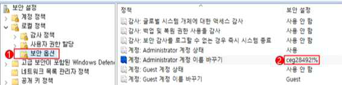

---
<!-- Page 178 -->
| 한국인터넷진흥원 |
178
W-02
(상)
Windows 서버 > 1. 계정 관리
Guest 계정 비활성화
개요
점검 내용
Guest 계정 비활성화 여부 점검
점검 목적
Guest 계정을 비활성화하여 불특정 다수의 임시적인 시스템 접근을 차단하기 위함
보안 위협
Guest 계정은 시스템에 임시로 액세스해야 하는 사용자용 계정으로, 해당 계정을 사용하여 권한 없는
사용자가 시스템에 익명으로 액세스할 수 있으므로 비인가자 접근, 정보 유출 등 보안 위험이 존재함
참고
※ Windows Guest 계정은 삭제 불가능한 built-in 계정으로 보안 강화 목적으로 반드시 비활성화 처
리해야 함
점검 대상 및 판단 기준
대상
Windows NT, 2000, 2003, 2008, 2012, 2016, 2019, 2022
판단 기준
양호 : Guest 계정이 비활성화되어 있는 경우
취약 : Guest 계정이 활성화되어 있는 경우
조치 방법
Guest 계정 비활성화
조치 시 영향
일반적인 경우 영향 없음
점검 및 조치 사례
l Windows NT
Step 1) 시작 > 프로그램 > 관리 도구 > 도메인 사용자 관리 > Guest 계정 선택 > 등록정보
Step 2) “계정 사용 안 함” 설정
l Windows 2000, 2003, 2008, 2012, 2016, 2019, 2022
Step 1) 시작 > 제어판 > 관리 도구 > 로컬 보안 정책 > 로컬 정책 > 보안 옵션 > 계정: Guest 계정 상태
Step 2) 계정 “사용 안 함” 설정
[ Guest 계정 상태 사용 안 함 설정 ]

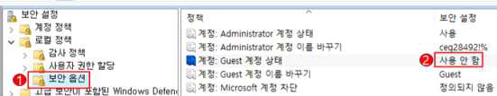

---
<!-- Page 179 -->
02. Windows 서버
2026  주요정보통신기반시설 기술적 취약점 분석·평가 방법 상세가이드
179
W-03
(상)
Windows 서버 > 1. 계정 관리
불필요한 계정 제거
개요
점검 내용
시스템 내 불필요한 계정 및 의심스러운 계정의 존재 여부를 점검
점검 목적
퇴직, 전직, 휴직 등의 이유로 사용하지 않는 계정, 불필요한 계정 및 의심스러운 계정을 삭제하여,
일반적으로 로그인이 필요치 않은 해당 계정들을 통한 로그인을 차단하고, 계정의 패스워드 추측 공격
시도를 차단하기 위함
보안 위협
관리되지 않은 불필요한 계정은 장기간 비밀번호가 변경되지 않아 무차별 대입 공격(Brute Force
Attack)이나 비밀번호 추측 공격(Password Guessing Attack)의 가능성이 존재하며, 또한 이런
공격으로 계정정보가 유출되어도 유출 사실을 인지하기 어려워 초기 대응이 불가능한 위험이 존재함
참고
※ 무차별 대입 공격(Brute Force Attack): 특정 암호를 해독하기 위해 가능한 모든 값을 대입하는
공격 방법
점검 대상 및 판단 기준
대상
Windows NT, 2000, 2003, 2008, 2012, 2016, 2019, 2022
판단 기준
양호 : 불필요한 계정이 존재하지 않는 경우
취약 : 불필요한 계정이 존재하는 경우
조치 방법
현재 계정 현황 확인 후 불필요한 계정 삭제
조치 시 영향
명확하게 파악되지 않은 계정을 삭제하는 경우 해당 계정과 관련한 업무에 장애 발생 가능성이 존재함
점검 및 조치 사례
l Windows NT
Step 1) 시작 > 프로그램 > 관리 도구 > 도메인 사용자 관리> 계정 선택> 등록 정보
Step 2) “계정 사용 안 함” 설정 또는 계정 삭제
l Windows 2000, 2003, 2008, 2012, 2016, 2019, 2022
Step 1) 시작 > 제어판 > 관리 도구 > 컴퓨터 관리 > 로컬 사용자 및 그룹 > 사용자
Step 2) 등록된 계정 중 불필요한 사용자 선택 > 속성 > “계정 사용 안 함” 설정 또는 계정 삭제
[ 사용자 계정 확인 ]

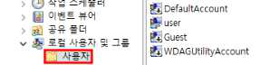

---
<!-- Page 180 -->
| 한국인터넷진흥원 |
180
W-04
(상)
Windows 서버 > 1. 계정 관리
계정 잠금 임계값 설정
개요
점검 내용
계정 잠금 임계값의 설정 여부 점검
점검 목적
계정 잠금 임계값을 설정하여 공격자의 자유로운 자동화 암호 유추 공격을 차단하기 위함
보안 위협
공격자는 시스템의 계정 잠금 임계값이 설정되지 않는 경우, 자동화된 방법을 이용하여 모든 사용자
계정에 대해 암호 조합 공격을 자유롭게 시도할 수 있으므로 사용자 계정 정보의 노출 위험이 존재함
참고
※ 계정 잠금 임계값 설정은 사용자 계정이 잠기는 로그온 실패 횟수를 결정하며 잠긴 계정은 관리자가
재설정하거나 해당 계정의 잠금 유지 시간이 만료되어야 사용할 수 있음
※ 계정 잠금 정책: 해당 계정이 시스템으로부터 잠기는 환경과 시간을 결정하는 정책으로 ‘계정 잠금 기
간’, ‘계정 잠금 임계값’, ‘다음 시간 후 계정 잠금 수를 원래대로 설정’의 세 가지 하위 정책을 가짐
※ 관련 점검 항목: W-08(중)
점검 대상 및 판단 기준
대상
Windows NT, 2000, 2003, 2008, 2012, 2016, 2019, 2022
판단 기준
양호 : 계정 잠금 임계값이 5 이하의 값으로 설정된 경우
취약 : 계정 잠금 임계값이 5 초과의 값으로 설정된 경우
조치 방법
계정 잠금 임계값을 5 이하의 값으로 설정
조치 시 영향
Administrator 계정은 잠기지 않으며, 일반 계정의 경우 5회 패스워드 입력 실패 시 잠김
점검 및 조치 사례
l Window NT
Step 1) 시작 > 프로그램 > 관리 도구 > 도메인 사용자 관리자 > 정책 > 계정 정책
Step 2) “계정 잠금” 선택 후 “잠금”에 “5” 이하의 값 설정
l Windows 2000, 2003, 2008, 2012, 2016, 2019, 2022
Step 1) 시작 > 제어판 > 관리 도구 > 로컬 보안 정책 > 계정 정책 > 계정 잠금 정책
Step 2) “계정 잠금 임계값”을 “5” 이하의 값으로 설정
[ 계정 잠금 임계값 설정 ]

---
<!-- Page 181 -->
02. Windows 서버
2026  주요정보통신기반시설 기술적 취약점 분석·평가 방법 상세가이드
181
W-05
(상)
Windows 서버 > 1. 계정 관리
해독 가능한 암호화를 사용하여 암호 저장 해제
개요
점검 내용
해독 가능한 암호화 사용 여부 점검
점검 목적
“해독 가능한 암호화를 사용하여 암호 저장” 정책이 설정되어 사용자 계정 비밀번호가 해독 가능한
텍스트 형태로 저장되는 것을 차단하기 위함
보안 위협
위 정책이 설정된 경우 운영체제에서 사용자 계정, 비밀번호를 입력받아 인증을 진행하는 응용 프로그램
프로토콜 지원 시 운영체제는 사용자의 비밀번호를 해독 가능한 방식으로 저장하기 때문에, 노출된
계정에 대해 공격자가 비밀번호 복호화 공격으로 비밀번호를 획득하여 네트워크 리소스에 접근할
위험이 존재함
참고
※ “해독 가능한 암호화를 사용하여 암호 저장” 정책은 암호를 암호화하지 않은 상태로 저장하여 일반
텍스트 버전의 암호를 저장하는 것과 같으나 시스템에서 기본적으로 동작하지는 않음
점검 대상 및 판단 기준
대상
Windows NT, 2000, 2003, 2008, 2012, 2016, 2019, 2022
판단 기준
양호 : “해독 가능한 암호화를 사용하여 암호 저장” 정책이 “사용 안 함”으로 설정된 경우
취약 : “해독 가능한 암호화를 사용하여 암호 저장” 정책이 “사용”으로 설정된 경우
조치 방법
“해독 가능한 암호화를 사용하여 암호 저장”을 “사용 안 함”으로 설정
조치 시 영향
일반적인 경우 영향 없음
점검 및 조치 사례
l Window NT, 2000, 2003, 2008, 2012, 2016, 2019, 2022
Step 1) 시작 > 제어판 > 관리 도구 > 로컬 보안 정책 > 계정 정책 > 암호 정책
Step 2) “해독 가능한 암호화를 사용하여 암호 저장”을 “사용 안 함”으로 설정
[ 해독 가능한 암호화를 사용하여 암호 저장 정책 설정 ]

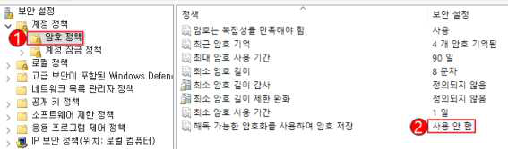

---
<!-- Page 182 -->
| 한국인터넷진흥원 |
182
W-06
(상)
Windows 서버 > 1. 계정 관리
관리자 그룹에 최소한의 사용자 포함
개요
점검 내용
관리자 그룹에 불필요한 사용자의 포함 여부 점검
점검 목적
관리자 그룹 구성원에 불필요한 사용자의 포함 여부를 점검하여, 관리 권한 사용자를 최소화하고자 함
보안 위협
Administrators와 같은 관리자 그룹에 속한 구성원은 컴퓨터 시스템에 대한 완전하고 제한 없는
액세스 권한을 가지므로, 사용자를 관리자 그룹에 포함하면 비인가 사용자에 대한 과도한 관리 권한이
부여되어 내부 정보 유출 위험이 존재함
참고
※ 관리 권한의 오남용으로 인한 시스템 피해를 줄이기 위해서 관리 업무를 위한 계정과 일반 업무를
위한 계정을 분리하여 사용하는 것이 바람직함
※ 시스템 관리를 위해서 관리 권한 계정과 일반 권한 계정을 분리하여 운영하는 것을 권고
※ 시스템 관리자는 원칙적으로 1명 이하로 유지하고, 부득이하게 2명 이상의 관리 권한자를 유지해야
할 경우, 관리자 그룹에는 최소한의 사용자만 포함하도록 해야 함
점검 대상 및 판단 기준
대상
Windows NT, 2000, 2003, 2008, 2012, 2016, 2019, 2022
판단 기준
양호 : Administrators 그룹의 구성원을 1명 이하로 유지하거나, 불필요한 관리자 계정이 존재하지 않
는 경우
취약 : Administrators 그룹에 불필요한 관리자 계정이 존재하는 경우
조치 방법
Administrators 그룹에 포함된 불필요한 계정 제거
조치 시 영향
Administrator 그룹에 있는 계정을 잘못 삭제하는 경우 해당 업무에 장애 발생 가능성이 있음
점검 및 조치 사례
l Window NT
Step 1) 시작 > 프로그램 > 관리 도구 > 도메인 사용자 관리 > Administrators 그룹 > 등록 정보
Step 2) Administrator 그룹에서 불필요한 계정 제거 후 그룹 변경

---
<!-- Page 183 -->
02. Windows 서버
2026  주요정보통신기반시설 기술적 취약점 분석·평가 방법 상세가이드
183
l Windows 2000, 2003, 2008, 2012, 2016, 2019, 2022
Step 1) 시작 > 제어판 > 관리 도구 > 컴퓨터 관리 > 로컬 사용자 및 그룹 > 그룹 > Administrators > 속성
Step 2) Administrators 그룹에서 불필요한 계정 제거 후 그룹 변경
[ 관리자 계정 그룹 불필요한 계정 확인 ]

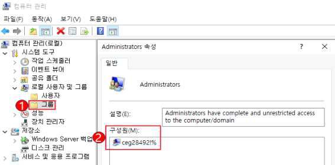

---
<!-- Page 184 -->
| 한국인터넷진흥원 |
184
W-07
(중)
Windows 서버 > 1. 계정 관리
Everyone 사용 권한을 익명 사용자에 적용
개요
점검 내용
“Everyone 사용 권한을 익명 사용자에 적용” 정책의 설정 여부 점검
점검 목적
익명 사용자가 Everyone 그룹으로 사용 권한을 준 모든 리소스에 접근하는 것을 차단하여 비인가자에
의한 접근 가능성을 제한하기 위함
보안 위협
해당 정책이 “사용”으로 설정될 경우 권한이 없는 사용자가 익명으로 계정 이름 및 공유 리소스를
나열하고 이 정보를 사용하여 암호를 추측하거나 DoS(Denial of Service) 공격을 실행할 위험이
존재함
참고
※ DoS(Denial of Service): 관리자 권한 없이도 특정 서버에 처리할 수 없을 정도로 대량의 접속 신
호를 한꺼번에 보내 해당 서버가 마비되도록 하는 해킹 기법
점검 대상 및 판단 기준
대상
2003, 2008, 2012, 2016, 2019, 2022
판단 기준
양호 : “Everyone 사용 권한을 익명 사용자에게 적용” 정책이 “사용 안 함”으로 되어 있는 경우
취약 : “Everyone 사용 권한을 익명 사용자에게 적용” 정책이 “사용”으로 되어 있는 경우
조치 방법
“Everyone 사용 권한을 익명 사용자에게 적용”정책을 “사용 안 함”으로 설정
조치 시 영향
응용프로그램이나 Backup 용도로 Everyone 공유를 사용하지 않는지 확인 필요
점검 및 조치 사례
l Windows 2003, 2008, 2012, 2016, 2019, 2022
Step 1) 시작 > 제어판 > 관리 도구 > 로컬 보안 정책 > 로컬 정책 > 보안 옵션
Step 2) “Everyone 사용 권한을 익명 사용자에게 적용”을 “사용 안 함”으로 설정
[ Everyone 사용 권한을 익명 사용자에게 적용 정책 설정 ]

---
<!-- Page 185 -->
02. Windows 서버
2026  주요정보통신기반시설 기술적 취약점 분석·평가 방법 상세가이드
185
W-08
(중)
Windows 서버 > 1. 계정 관리
계정 잠금 기간 설정
개요
점검 내용
사용자 계정 잠금 기간 정책 설정 여부 점검
점검 목적
로그인 실패 임계값 초과 시 일정 시간 동안 계정 잠금을 실시하여 공격자의 자유로운 비밀번호 유추
공격을 차단하기 위함
보안 위협
로그인 실패 시 일정 시간 동안 계정 잠금을 하지 않은 경우, 공격자의 자동화된 비밀번호 추측 공격이
가능하여, 사용자 계정의 비밀번호 정보가 유출될 위험이 존재함
참고
※ 계정 잠금 기간 설정은 계정 잠금 임계값을 초과한 사용자 계정이 잠기는 시간을 결정함. 잠긴 계정
은 관리자가 재설정하거나 해당 계정의 잠금 유지 시간이 만료되어야 사용할 수 있음
※ 계정 잠금 기간 설정을 사용하면 해당 기간 잠긴 계정은 사용할 수 없으며, 계정 잠금이 해제될 때까
지 접근할 수 없음
※ 계정 잠금 정책: 해당 계정이 시스템으로부터 잠기는 환경과 시간을 결정하는 정책으로 ‘계정 잠금
기간’, ‘계정 잠금 임계값’, ‘다음 시간 후 계정 잠금 수를 원래대로 설정’의 세 가지 하위 정책을 가
짐
점검 대상 및 판단 기준
대상
Windows NT, 2000, 2003, 2008, 2012, 2016, 2019, 2022
판단 기준
양호 : “계정 잠금 기간” 및 “계정 잠금 기간 원래대로 설정 기간”이 60분 이상으로 설정된 경우
취약 : “계정 잠금 기간” 및 “잠금 기간 원래대로 설정 기간”이 설정되지 않거나 60분 미만으로 설정된
경우
조치 방법
“계정 잠금 기간” 및 “잠금 기간 원래대로 설정 기간” 60분 이상으로 설정
조치 시 영향
일반적인 경우 영향 없음
점검 및 조치 사례
l Window NT
Step 1) 시작 > 프로그램 > 관리 도구 > 도메인 사용자 관리자 > 정책 > 계정 정책
Step 2) “횟수 다시 설정”을 “60분”으로 설정, “잠금 유지 기간”의 “시간제한”을 “60분”으로 설정

---
<!-- Page 186 -->
| 한국인터넷진흥원 |
186
l Windows 2000, 2003, 2008, 2012, 2016, 2019, 2022
Step 1) 시작 > 제어판 > 관리 도구 > 로컬 보안 정책 > 계정 정책 > 계정 잠금 정책
Step 2) “계정 잠금 기간”, “다음 시간 후 계정 잠금 수를 원래대로 설정”에 대해 각각 “60분” 설정
[ 계정 잠금 정책 설정 ]

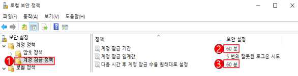

---
<!-- Page 187 -->
02. Windows 서버
2026  주요정보통신기반시설 기술적 취약점 분석·평가 방법 상세가이드
187
W-09
(상)
Windows 서버 > 1. 계정 관리
비밀번호 관리 정책 설정
개요
점검 내용
계정 비밀번호 관리 정책 설정 여부 점검
점검 목적
비밀번호 설정 시 복잡성, 최소 비밀번호 길이, 최대/최소 사용 기간을 만족하도록 함
보안 위협
사용자 비밀번호 관리 정책 설정을 만족하지 못하면 무차별 대입 공격(Brute Force Attack)이나
비밀번호 추측 공격(Password Guessing Attack)에 쉽게 크랙 될 위험이 존재함
참고
-
점검 대상 및 판단 기준
대상
Windows NT, 2000, 2003, 2008, 2012, 2016, 2019, 2022
판단 기준
양호 : 계정 비밀번호 관리 정책이 모두 적용된 경우
취약 : 계정 비밀번호 관리 정책이 모두 적용되어 있지 않은 경우
조치 방법
비밀번호 복잡성, 최소 비밀번호 길이, 최대/최소 사용 기간을 기준에 맞게 설정
조치 시 영향
일반적인 경우 영향 없음
점검 및 조치 사례
l Windows NT
Step 1) 시작 > 프로그램 > 관리 도구 > 도메인 사용자 관리자 > 정책 > 계정
Step 2) “최소 암호 길이”에 “최소”를 “8문자”로 설정
Step 3) “최대 암호 사용 기간”의 “사용 기간”을 “90일”로 설정
Step 4) “최소 암호 사용 기간”에서 “사용 기간”을 “1일”로 설정
Step 5) “암호 유일성”에서 “기억”을 “4개”로 설정
l Windows NT, 2000, 2003, 2008, 2012, 2016, 2019, 2022
Step 1) 시작 > 제어판 > 관리 도구 > 로컬 보안 정책 > 계정 정책 > 암호 정책
Step 2) “암호는 복잡성을 만족해야 함”을 “사용”으로 설정
Step 3) “최근 암호 기억”을 “4개 암호 기억됨”으로 설정
Step 4) “최대 암호 사용 기간”의 다음 이후 암호 만료 기간을 “90일”로 설정
Step 5) “최소 암호 길이”를 “8문자”로 설정
Step 6) “최소 암호 사용 기간”을 “1일”로 설정

---
<!-- Page 188 -->
| 한국인터넷진흥원 |
188
[ 암호 정책 설정 ]
※ 해당 정책 설정은 비밀번호를 변경하거나 새로운 비밀번호 생성 시 아래와 같은 일련의 규정을 만족하는지
결정함. 영문, 숫자, 특수문자 중 2종류 이상을 조합하여 최소 10자리 이상 또는 3종류 이상을 조합하여 최소
8자리 이상의 길이로 구성
가. 영문 대문자(26개)
나. 영문 소문자(26개)
다. 숫자(10개)
라. 특수문자(32개)

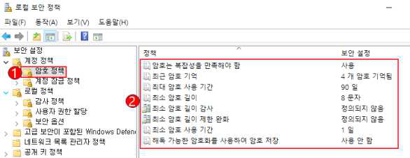

---
<!-- Page 189 -->
02. Windows 서버
2026  주요정보통신기반시설 기술적 취약점 분석·평가 방법 상세가이드
189
W-10
(중)
Windows 서버 > 1. 계정 관리
마지막 사용자 이름 표시 안 함
개요
점검 내용
로그인 화면에 마지막 로그온 사용자 이름을 표시하지 않도록 설정되었는지를 점검
점검 목적
Windows 로그인 화면에 마지막 로그온한 사용자 이름이 표시되지 않도록 하여 악의적인 사용자에게
계정 정보가 노출되는 것을 차단하고자 함
보안 위협
마지막으로 로그온한 사용자의 이름이 로그온 대화상자에 표시될 경우 공격자는 이를 획득하여
비밀번호를 추측하거나 무작위 공격을 시도할 위험이 존재함
참고
※ Windows 로그인 화면에 마지막 로그온한 사용자 이름이 표시될 경우 주로 콘솔 사용자 및 터미널
서비스 이용자에게 시스템에 존재하는 사용자 계정 정보를 노출함
점검 대상 및 판단 기준
대상
Windows NT, 2000, 2003, 2008, 2012, 2016, 2019, 2022
판단 기준
양호 : “마지막 사용자 이름 표시 안 함”이 “사용”으로 설정된 경우
취약 : “마지막 사용자 이름 표시 안 함”이 “사용 안 함”으로 설정된 경우
조치 방법
※ Windows NT: 마지막으로 로그온한 사용자 이름 표시 안 함 설정
※ Windows 2000: 로그온 스크린에 마지막 사용자 이름 표시 안 함 사용 설정
※ Windows 2003, 2008, 2012, 2016, 2019, 2022: 대화형 로그온: 마지막 사용자 이름 표시 안
함 사용 설정
조치 시 영향
일반적인 경우 영향 없음
점검 및 조치 사례
l Windows NT
Step 1) 시작 > 프로그램 > 관리 도구 > 시스템 정책 편집기 > 파일 > 레지스트리 열기 > 로컬 컴퓨터 > 편집 > 등
록 정보 > Windows NT 시스템 > 로그온 > “마지막으로 로그온한 사용자 이름 표시 안 함”을 설정한 후
저장
l Windows 2000
Step 1) 시작 > 제어판 > 관리 도구 > 로컬 보안 정책 > 로컬 정책 > 보안 옵션
Step 2) “로그온 스크린에 마지막 사용자 이름 표시 안 함”을 “사용”으로 설정

---
<!-- Page 190 -->
| 한국인터넷진흥원 |
190
l Windows 2003, 2008, 2012, 2016, 2019, 2022
Step 1) 시작 > 제어판 > 관리 도구 > 로컬 보안 정책 > 로컬 정책 > 보안 옵션
Step 2) “대화형 로그온: 마지막 사용자 이름 표시 안 함”을 “사용”으로 설정
[ 마지막 로그인 사용자 이름 표시 안 함 ]

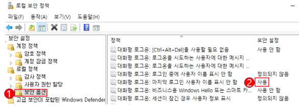

---
<!-- Page 191 -->
02. Windows 서버
2026  주요정보통신기반시설 기술적 취약점 분석·평가 방법 상세가이드
191
W-11
(중)
Windows 서버 > 1. 계정 관리
로컬 로그온 허용
개요
점검 내용
불필요한 계정의 로컬 로그온을 허용 여부 점검
점검 목적
불필요한 계정에 로컬 로그온이 허용될 경우를 찾아 비인가자의 불법적인 시스템 로컬 접근을
차단하고자 함
보안 위협
불필요한 사용자에게 로컬 로그온이 허용될 경우 비인가자를 통한 권한 상승을 위한 악성 코드 실행
위험이 존재함
참고
※ “로컬로 로그온 허용” 권한은 시스템 콘솔에 로그인을 허용하는 권한으로 반드시 콘솔 접근이 필요
한 사용자 계정에만 해당 권한을 부여해야 함
※ IIS 서비스를 사용할 경우 이 권한에 IUSR_<ComputerName > 계정을 할당함
점검 대상 및 판단 기준
대상
Windows NT, 2000, 2003, 2008, 2012, 2016, 2019, 2022
판단 기준
양호 : 로컬 로그온 허용 정책에 Administrators, IUSR_ 만 존재하는 경우
취약 : 로컬 로그온 허용 정책에 Administrators, IUSR_ 외 다른 계정 및 그룹이 존재하는 경우
조치 방법
Administrators, IUSR_ 외 다른 계정 및 그룹의 로컬 로그온 제한
조치 시 영향
Administrators, IUSR_ 계정 외 로컬에서 접속이 필요한 계정 삭제 시 사용 중인 서비스에 장애를 줄
수 있음
점검 및 조치 사례
l Windows NT, 2000, 2003, 2008, 2012, 2016, 2019, 2022
Step 1) 시작 > 제어판 > 관리 도구 > 로컬 보안 정책 > 로컬 정책 > 사용자 권한 할당
Step 2) “로컬 로그온 허용(또는, 로컬 로그온)” 정책에 “Adminstrators”, “IUSR_” 외 다른 계정 및 그룹 제거
[ 로컬 로그온 허용 정책 설정 ]

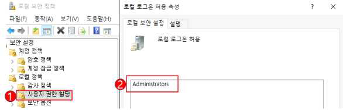

---
<!-- Page 192 -->
| 한국인터넷진흥원 |
192
W-12
(중)
Windows 서버 > 1. 계정 관리
익명 SID/이름 변환 허용 해제
개요
점검 내용
익명 SID/이름 변환 정책 적용 여부 점검
점검 목적
익명 SID/이름 변환 정책을 “사용 안 함”으로 설정하여, SID(보안 식별자)를 사용하여 관리자 이름을
찾을 수 없도록 하기 위함
보안 위협
해당 정책이 “사용함”으로 설정될 경우 로컬 접근 권한이 있는 사용자가 잘 알려진 Administrator
SID를 사용하여 Administrator 계정의 실제 이름을 알아낼 수 있으며 암호 추측 공격 위험이 존재함
참고
※ 해당 정책이 설정될 경우 익명 사용자가 다른 사용자의 SID(보안 식별자) 특성을 요청할 수 있음
※ “사용 안 함”으로 정책을 설정할 경우 Windows NT 도메인 환경에서 통신 불가능하게 될 수 있음
점검 대상 및 판단 기준
대상
Windows 2003, 2008, 2012, 2016, 2019, 2022
판단 기준
양호 : “익명 SID/이름 변환 허용” 정책이 “사용 안 함”으로 설정된 경우
취약 : “익명 SID/이름 변환 허용” 정책이 “사용”으로 설정된 경우
조치 방법
“네트워크 액세스: 익명 SID/이름 변환 허용” 정책 “사용 안 함” 설정
조치 시 영향
일반적인 경우 영향 없음
점검 및 조치 사례
l Windows 2003, 2008, 2012, 2016, 2019, 2022
Step 1) 시작 > 제어판 > 관리 도구 > 로컬 보안 정책 > 로컬 정책 > 보안 옵션
Step 2) “네트워크 액세스: 익명 SID/이름 변환 허용” 정책이 “사용 안 함”으로 설정
[익명 SID/이름 변환 허용]
※ Windows Server 2000 이하 버전 해당 사항 없음

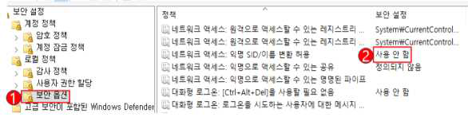

---
<!-- Page 193 -->
02. Windows 서버
2026  주요정보통신기반시설 기술적 취약점 분석·평가 방법 상세가이드
193
W-13
(중)
Windows 서버 > 1. 계정 관리
콘솔 로그온 시 로컬 계정에서 빈 암호 사용 제한
개요
점검 내용
콘솔 로그인 시 빈 비밀번호 사용 가능 여부 점검
점검 목적
빈 비밀번호를 가진 계정의 콘솔 및 네트워크 서비스 접근을 차단하기 위함
보안 위협
해당 정책이 “사용 안 함”으로 설정될 경우 빈 비밀번호를 가진 로컬 계정에 대하여 터미널 서비스(원격
데스크톱 서비스), Telnet 및 FTP와 같은 네트워크 서비스의 원격 대화형 로그온이 가능하여, 시스템
내부 정보 유출 위험이 존재함
참고
※ 윈도우 원격 제어(mstsc)는 보안상 계정에 비밀번호가 걸린 계정만 접속하도록 하고 있으나 해당
정책을 활성화하면 계정에 비밀번호가 걸려 있지 않아도 원격 제어가 가능함
점검 대상 및 판단 기준
대상
Windows 2003, 2008, 2012, 2016, 2019, 2022
판단 기준
양호 : “콘솔 로그온 시 로컬 계정에서 빈 암호 사용 제한” 정책이 “사용”인 경우
취약 : “콘솔 로그온 시 로컬 계정에서 빈 암호 사용 제한” 정책이 “사용 안 함”인 경우
조치 방법
“계정: 콘솔 로그온 시 로컬 계정에서 빈 암호 사용 제한” 정책을 “사용”으로 설정
조치 시 영향
일반적인 경우 영향 없음
점검 및 조치 사례
l Windows 2003, 2008, 2012, 2016, 2019, 2022
Step 1) 시작 > 제어판 > 관리 도구 > 로컬 보안 정책 > 로컬 정책 > 보안 옵션
Step 2) “계정: 콘솔 로그온 시 로컬 계정에서 빈 암호 사용 제한” 정책을 “사용”으로 설정
[ 콘솔 로그온 시 로컬 계정에서 빈 암호 사용 제한 설정 ]

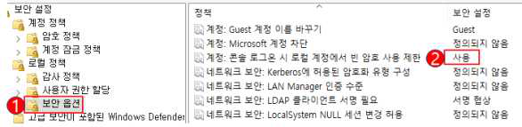

---
<!-- Page 194 -->
| 한국인터넷진흥원 |
194
W-14
(중)
Windows 서버 > 1. 계정 관리
원격터미널 접속 가능한 사용자 그룹 제한
개요
점검 내용
원격터미널 사용자 그룹 내 비인가자 포함 여부 점검
점검 목적
비인가자의 원격터미널 접속을 제한하기 위함
보안 위협
원격터미널의 그룹이나 계정을 제한하지 않으면 임의의 사용자가 원격으로 접속하여 해당 서버에
정보를 변경하거나 정보가 유출될 위험이 존재함
참고
※ 컴퓨터 관리 > 로컬 사용자 및 그룹 > Remote Desktop Users 그룹에서 추가 가능
점검 대상 및 판단 기준
대상
Windows 2003, 2008, 2012, 2016, 2019, 2022
판단 기준
양호 : (관리자 계정을 제외한) 원격 접속이 가능한 계정을 생성하여 타 사용자의 원격 접속을 제한하고,
원격 접속 사용자 그룹에 불필요한 계정이 등록되어 있지 않은 경우
취약 : (관리자 계정을 제외한) 원격 접속이 가능한 별도의 계정이 존재하지 않는 경우
조치 방법
관리자 계정과 이외의 계정을 생성, 권한을 제한 사용 설정
조치 시 영향
일반적인 경우 영향 없음
점검 및 조치 사례
l Windows 2003
Step 1) 제어판 > 사용자 계정 > 관리자 계정 이외의 계정 생성한 후
Step 2) 제어판 > 시스템 > [원격] 탭 > [원격] 탭 메뉴에서 “사용자가 이 컴퓨터에 원격으로 연결할 수 있음”에
체크 > “원격 사용자 선택”에서 원격 사용자 지정 후 확인
l Windows 2008
Step 1) 제어판 > 사용자 계정 > 관리자 계정 이외의 계정 생성한 후
Step 2) 제어판 > 시스템 > 원격 설정 > [원격] 탭 > [원격 데스크톱] 메뉴 > “모든 버전의 원격 데스크톱을 실행
중인 컴퓨터에서 연결 허용(보안 수준 낮음)” 또는 “네트워크 수준 인증을 사용하여 원격 데스크톱을 실
행하는 컴퓨터에서만 연결 허용(보안 수준 높음)” 중 하나에 체크 > “사용자 선택”에서 원격 사용자 지정
후 확인

---
<!-- Page 195 -->
02. Windows 서버
2026  주요정보통신기반시설 기술적 취약점 분석·평가 방법 상세가이드
195
l Windows 2012, 2016, 2019, 2022
Step 1) 시작 > 제어판 > 사용자 계정 > 계정 관리 > 관리자 계정 이외의 계정 생성
Step 2) 시작 > 제어판 > 시스템 > 원격 설정 > [원격] 탭 > [원격 데스크톱] 메뉴 > “이 컴퓨터에 대한 원격 연결
허용” 에 체크 > “사용자 선택”에서 원격 사용자 지정 후 확인
[ 원격 데스크톱 사용자 지정 설정 ]

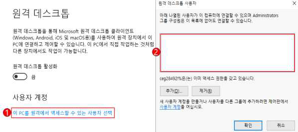

---
<!-- Page 196 -->
| 한국인터넷진흥원 |
196
W-15
(상)
Windows 서버 > 2. 서비스 관리
사용자 개인키 사용 시 암호 입력
개요
점검 내용
사용자 개인 키 사용 시 비밀번호 입력 여부 점검
점검 목적
디지털 인증서 소유자와 발급 기관 모두 컴퓨터, 저장 장치 또는 개인 키를 보관 사용하는 보호 해야 함
보안 위협
사용자 개인 키 암호 입력을 사용하지 않을 경우, 공격자는 해당 키를 사용하여 네트워크 인프라에
액세스해 데이터 유출 등의 위험이 존재함
참고
※ PKI의 초석은 정보를 암호화하거나 디지털 서명하는 데 사용되는 개인 키로 도난당하게 되면 공격
자가 개인 키를 사용하여 문서에 디지털 서명하고 인증된 사용자인 것처럼 가장할 수 있으므로 PKI
를 통해 얻은 인증 및 부인 방지가 손상됨
점검 대상 및 판단 기준
대상
Windows 2016, 2019, 2022
판단 기준
양호 : 사용자 개인 키를 사용할 때마다 암호 입력을 받는 경우
취약 : 사용자 개인 키를 사용할 때마다 암호 입력을 받지 않는 경우
조치 방법
“시스템 암호화: 컴퓨터에 저장된 사용자 키에 대해 강력한 키 보호 사용” 정책을 “키를 사용할 때마다
암호를 매 번 입력해야 함”으로 적용
조치 시 영향
일반적인 경우 영향 없음
점검 및 조치 사례
l Windows 2016, 2019, 2022
Step 1) 시작 > 제어판 > 관리 도구 > 로컬 보안 정책 > 로컬 정책 > 보안 옵션
Step 2) “시스템 암호화: 컴퓨터에 저장된 사용자 키에 대해 강력한 키 보호 사용” 정책을 “키를 사용할 때마다
암호를 매 번 입력해야 함”으로 적용
[ 컴퓨터에 저장된 사용자 키에 대해 강력한 키 보호 사용 설정 ]

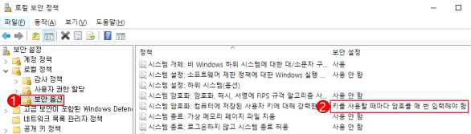

---
<!-- Page 197 -->
02. Windows 서버
2026  주요정보통신기반시설 기술적 취약점 분석·평가 방법 상세가이드
197
W-16
(상)
Windows 서버 > 2. 서비스 관리
공유 권한 및 사용자 그룹 설정
개요
점검 내용
공유 디렉터리 내 Everyone 권한 존재 여부 점검
점검 목적
기본 공유인 C$, D$, Admin$, IPC$ 등을 제외한 공유 폴더에 Everyone 그룹으로 공유되는 것을
금지하여 익명 사용자의 접근을 차단하기 위함
보안 위협
Everyone이 공유계정에 포함되어 있으면 익명 사용자의 접근이 가능하여 내부 정보 유출 및 악성 코드
감염 위험이 존재함
참고
-
점검 대상 및 판단 기준
대상
Windows NT, 2000, 2003, 2008, 2012, 2016, 2019, 2022
판단 기준
양호 : 일반 공유 디렉터리가 없거나 공유 디렉터리 접근 권한에 Everyone 권한이 없는 경우
취약 : 일반 공유 디렉터리의 접근 권한에 Everyone 권한이 있는 경우
조치 방법
공유 디렉터리 접근 권한에서 Everyone 권한 제거 후 필요한 계정 추가
조치 시 영향
응용프로그램이나 Backup 용도로 Everyone 공유를 사용하는 경우 해당 작업에 영향 가능
점검 및 조치 사례
l Windows NT
Step 1) 프로그램 > 관리 도구 > 서버 관리자 > 컴퓨터 > 공유 디렉터리 > 등록 정보 > 사용 권한에서 Everyone
으로 설정된 공유를 제거하고 접근이 필요한 계정에 적절한 권한 추가
l Windows 2000, 2003, 2008, 2012, 2016, 2019, 2022
Step 1) 시작 > 실행 > FSMGMT.MSC > 공유
Step 2) 사용 권한에서 Everyone으로 된 공유를 제거하고 접근이 필요한 계정의 적절한 권한 추가
[ 공유 폴더 사용 권한 설정 ]

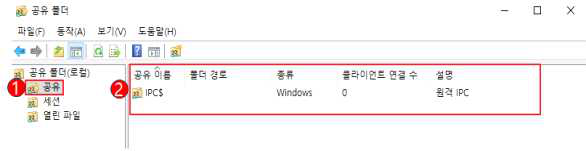

---
<!-- Page 198 -->
| 한국인터넷진흥원 |
198
W-17
(상)
Windows 서버 > 2. 서비스 관리
하드디스크 기본 공유 제거
개요
점검 내용
하드디스크 기본 공유 제거 여부 점검
점검 목적
하드디스크 기본 공유를 제거하여 시스템 정보 노출을 차단하고자 함
보안 위협
Windows는 프로그램 및 서비스를 네트워크나 컴퓨터 환경에서 관리하기 위해 시스템 기본 공유
항목을 자동으로 생성함. 이를 제거하지 않으면 비인가자가 모든 시스템 자원에 접근할 수 있는 위험한
상황이 발생할 수 있으며 이러한 공유 기능의 경로를 이용하여 바이러스가 침투 위험이 존재함
참고
※ 기본 공유: 관리 목적으로 자동 생성되는 공유 드라이브(Administrative share). 이러한 드라이브
들은 C$, D$, E$ 등과 같이 이름 뒤에 $가 붙어서 숨겨진 공유로 처리되며, Windows 2000, XP
에서는 관리자 ID와 Password를 알고 있으면 네트워크를 통해 이러한 공유 드라이브들에 자유롭
게 접근할 수 있음. 그러나 이후 버전 Windows에서는 보안상의 이유로 로컬 시스템의 관리자가 네
트워크를 통해 시스템을 관리하지 못하도록 기본적으로 차단됨
점검 대상 및 판단 기준
대상
Windows NT, 2000, 2003, 2008, 2012, 2016, 2019, 2022
판단 기준
양호 : 레지스트리의 AutoShareServer (WinNT: AutoShareWks)가 0이며 기본 공유가 존재하지 않
는 경우
취약 : 레지스트리의 AutoShareServer (WinNT: AutoShareWks)가 1이거나 기본 공유가 존재하는
경우
조치 방법
기본 공유 중지 후 레지스트리 값 설정(IPC$, 일반 공유 제외)
조치 시 영향
Active Directory, Clustered system에서 적용 시 영향 있음
Active Directory: 중앙 집중화된 자원 관리를 위한 계층적 디렉터리 서비스
Clustered system: 여러 개의 시스템을 결합하여 사용함
점검 및 조치 사례
l Windows NT
Step 1) 프로그램 > 관리도구 > 서버 관리자 > 컴퓨터 > 공유 디렉터리 > 공유 > 공유 중지

---
<!-- Page 199 -->
02. Windows 서버
2026  주요정보통신기반시설 기술적 취약점 분석·평가 방법 상세가이드
199
l Windows 2000, 2003, 2008, 2012, 2016, 2019, 2022
Step 1) 시작 > 실행 > FSMGMT.MSC > 공유 > 기본 공유(Default share) 선택 > 마우스 우클릭 > 공유 중지
[ 기본 공유 폴더 중지 설정 ]
Step 2) 시작 > 제어판 > 관리 도구 > 레지스트리 편집기
아래 레지스트리 값을 0으로 수정(키 값이 없을 경우 새로 생성)
“HKLM\SYSTEM\CurrentControlSet\Services\lanmanserver\parameters\”
Step 3) AutoShareServer(Windows NT: AutoShareWks)을  “0”으로 수정
[ AutoShareServer 값 설정 ]
※ 방화벽과 라우터에서 135~139(TCP/UDP) Port를 차단하여 외부로부터의 위험을 제거함으로써 보안성을 높
일 수 있음

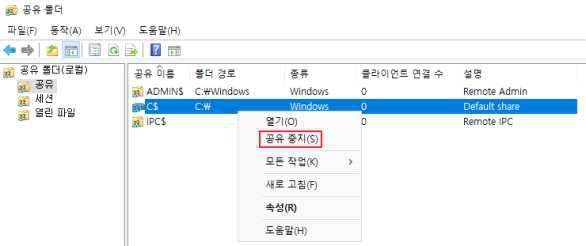

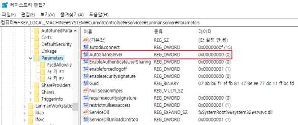

---
<!-- Page 200 -->
| 한국인터넷진흥원 |
200
W-18
(상)
Windows 서버 > 2. 서비스 관리
불필요한 서비스 제거
개요
점검 내용
불필요한 서비스 가동 여부 점검
점검 목적
사용자 환경에 필요하지 않은 서비스 및 실행 파일을 제거하거나 비활성화 처리하여 이를 통한 악의적인
공격을 차단하기 위함
보안 위협
시스템에 기본적으로 설치되는 불필요한 취약 서비스들이 제거되지 않은 경우, 해당 서비스의
취약점으로 인한 공격이 가능하며, 네트워크 서비스의 경우 열린 Port를 통한 외부 침입 위험이 존재함
참고
※ OS 버전에 따라 ‘일반적으로 불필요한 서비스’ 목록에 나열된 서비스가 제공되지 않을 수 있음
점검 대상 및 판단 기준
대상
Windows NT, 2000, 2003, 2008, 2012, 2016, 2019, 2022
판단 기준
양호 : 일반적으로 불필요한 서비스(아래 목록 참조)가 중지된 경우
취약 : 일반적으로 불필요한 서비스(아래 목록 참조)가 구동 중인 경우
조치 방법
서비스 중지 후 “사용 안 함” 설정
조치 시 영향
일반적인 경우 영향 없음
점검 및 조치 사례
l Windows NT
Step 1) 시작 > 설정 > 제어판 > 서비스를 선택하여 불필요한 서비스를 중지하고, 시작 옵션에서 "시작 유형"을 "
사용 안 함"으로 수정
Step 2) 해당 서비스를 선택하고 오른쪽 메뉴에서 "시작 옵션"을 클릭하면 시스템이 시작할 때에 해당 서비스의
시작 유형을 선택할 수 있음. 만약, 시스템 시작 시 자동으로 시작되게 하려면 [자동], 수동으로 서비스를
시작하려면 [수동], 서비스 자체를 사용하지 않으려면 [사용 안 함]을 선택한 후 [확인]을 클릭함

---
<!-- Page 201 -->
02. Windows 서버
2026  주요정보통신기반시설 기술적 취약점 분석·평가 방법 상세가이드
201
l Windows 2000, 2003, 2008, 2012, 2016, 2019, 2022
Step 1) 시작 > 제어판 > 서비스 > "해당 서비스" 선택 > 속성
Step 2) 시작 유형 - > 사용 안 함
Step 3) 서비스 상태 - > 중지 설정
[ 불필요한 서비스 중지 설정 ]
※ 특별한 목적을 위해 사용하는 서비스가 아니라면 시스템의 업무에 부합되는 서비스가 아닌 기타 기본 서비스
를 사용하지 않는 것을 권고하며, 시스템 관리자는 대상 시스템의 용도를 정확히 파악해 불필요한 서비스를
제거해야 함
서비스 시작 유형
설명
사용 안 함
설치되어 있으나 실행되지 않음
수동
다른 서비스나 응용 프로그램에서 해당 기능을 필요로 할 때만 시작됨
자동
부팅 시에 해당 장치 드라이버가 로드된 후에 운영체제에 의해 시작됨
※ 각 서비스마다 옵션을 설정할 수 있으며 해당 서비스의 시작 유형을 선택할 수 있으며 시작 시 로그온 계정을
별도로 설정할 수 있음. 만약, 시스템 시작 시 자동으로 시작되게 하려면 [자동], 수동으로 서비스를 시작하려
면 [수동], 서비스 자체를 사용하지 않으려면 [사용 안 함]을 선택

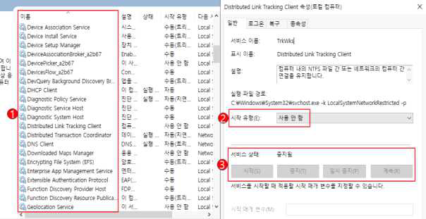

---
<!-- Page 202 -->
| 한국인터넷진흥원 |
202
※ 일반적으로 불필요한 서비스
서비스명
기능 및 설명
Alerter
네트워크상에서 사용자와 컴퓨터에 관리용 경고 메시지를 전송하는 기능
Automatic Updates
중요한 윈도우 업데이트를 다운로드하고 설치할 수 있도록 하는 응용프로그램. 수동
패치를 적용하거나, MS 패치 관리 서버로 패치를 일괄적으로 관리하는 경우 불필요한
서비스
Clipbook
서버 내 Clipbook을 다른 클라이언트와 공유
Computer Browser
네트워크에 있는 모든 컴퓨터의 목록을 업데이트하고 관리하는 기능
Cryptographic Services
윈도우 파일의 서명을 확인하는 카탈로그 데이터베이스 서비스를 총괄
DHCP Client
IP주소와 DNS 이름을 DHCP 서버에 등록하거나 DHCP 서버로부터 동적으로 IP주소를
가져오는 기능을 수행. 단독으로 시스템을 수행하며 고정 IP를 사용하는 경우 불필요한
서비스
Distributed Link Tracking
Client, Server
네트워크 도메인의 여러 컴퓨터나 일반 컴퓨터에서 NTFS 파일간의 연결을 관리하는 도구.
Active Directory가 구성되어 있지 않은 서버에서는 불필요한 서비스
DNS Client
컴퓨터에 대한 도메인 이름 시스템(DNS) 이름을 확인하고 캐시에 보관하는 기능. DNS
서버가 아닌 시스템에서는 유명무실하나, IPSEC을 사용하는 경우에는 필요할 수 있음
Error reporting
Service
프로그램 오류가 발생 시 응용프로그램의 오류를 MS에 보고한다는 내용을 표시하는 기능
Human Interface
Device Access
키보드 또는 기타 멀티미디어 장치에 사전 정의된 버튼들을 사용하는 HID 장치들을 위한
서비스
IMAPI CD-Burning
COM Service
서버에 CD-RW 또는 DVD-RW가 장착되어 보조백업장치 역할을 하기 위해서 자체
레코딩 백업을 할 수 있음
Infrared Monitor
사용자 적외선 연결을 통해 파일 및 이미지를 공유할 수 있도록 함
Messenger
클라이언트와 서버 사이에 netsend 및 경고서비스 메시지를 전송하는 기능
NetMeeting Remote
Desktop Sharing
윈도우9X 운영체제부터 인증된 사용자가 넷미팅을 사용해서 원격으로 컴퓨터에 접근할 수
있도록 하는 기능
Portable Media Serial
Number
컴퓨터에 연결된 이동성 음악 연주기(미디어기기)의 등록번호를 복원하는 기능
Print Spooler
인쇄 과정에 있는 스풀링을 관리하는 서비스. 프린터가 있는 경우 필수 서비스이지만,
프린터가 연결되지 않은 시스템에서는 불필요함
Remote Registry
원격 사용자가 이 컴퓨터에서 레지스트리 설정을 수정할 수 있도록 설정하는 응용프로그램
Simple TCP/IP
Services
Echo, Discard, Character Generator, Daytime, Quote of the Day 지원

---
<!-- Page 203 -->
02. Windows 서버
2026  주요정보통신기반시설 기술적 취약점 분석·평가 방법 상세가이드
203
※ 운영 중인 시스템에서 필수 서비스를 정의하는 것은 매우 복잡한 과정으로 서비스 사용 여부는 시스템의 영
향성을 고려하여 신중하게 평가되어야 하므로 Microsoft에서 권고하는 가이드에 따라 전략적으로 적용해야
함
※ https://technet.microsoft.com/ko-kr/library/dd547941.aspx (서비스 및 서비스 계정 보안 계획 가이드) 참고
※ 윈도우 시스템 설치 시 기본적으로 설치되는 서비스에 대한 상세 설명은 아래 주소 참조
https://technet.microsoft.com/ko-kr/library/dd547949.aspx
서비스명
기능 및 설명
Universal Plug and
Play Device Host
네트워크 장치에 대해 피어-투-피어 UPnP(범용 플러그 앤 플레이) 기능을 지원
Wireless Zero
Configuration

### 802.11 어댑터에 대해 자동 구성을 공급하는 기본적인 도구

---
<!-- Page 204 -->
| 한국인터넷진흥원 |
204
W-19
(상)
Windows 서버 > 2. 서비스 관리
불필요한 IIS 서비스 구동 점검
개요
점검 내용
불필요한 IIS 서비스 구동 여부 점검
점검 목적
불필요한 IIS 서비스가 구동 상태인지를 점검하여 제거하고, 해당 서비스가 취약점이 제거되지 않은
상태로 외부 위협에 노출되지 않도록 하기 위함
보안 위협
IIS 서비스의 WEB, FTP 등 기능이 보편적으로 사용되나, 프로파일링, 서비스 거부, 불법적인 접근,
임의의 코드 실행, 정보 공개, 바이러스, 웜, 트로이목마 등의 공격 위험이 존재함
참고
-
점검 대상 및 판단 기준
대상
Windows NT, 2000, 2003, 2008, 2012, 2016, 2019, 2022
판단 기준
양호 : IIS 서비스를 사용하지 않는 경우 또는 필요에 의해 IIS 서비스를 사용하는 경우
취약 : IIS 서비스를 불필요하게 사용하는 경우
조치 방법
IIS 서비스가 불필요한 경우 IIS 서비스 중지
조치 시 영향
일반적인 경우 영향 없음
점검 및 조치 사례
l Windows NT, 2000, 2003, 2008, 2012, 2016, 2019, 2022
Step 1) 시작 > 제어판 > 서비스 > World Wide Web Publishing 서비스(IISADMIN) > 속성 > "시작 유형"을 "사
용 안 함" 설정 후 중지
※ IIS 미설치 시 SERVICES.MSC 에 출력되지 않음
[ IIS 서비스 사용 안 함 설정 ]

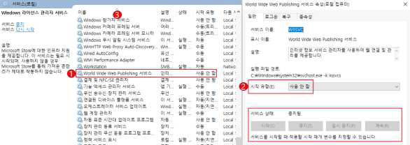

---
<!-- Page 205 -->
02. Windows 서버
2026  주요정보통신기반시설 기술적 취약점 분석·평가 방법 상세가이드
205
W-20
(상)
Windows 서버 > 2. 서비스 관리
NetBIOS 바인딩 서비스 구동 점검
개요
점검 내용
NetBIOS 바인딩 서비스 구동 여부 점검
점검 목적
NetBIOS와 TCP/IP 바인딩을 제거하여 TCP/IP를 거치게 되는 파일 공유 서비스를 제공하지 못하도록
하고, 인터넷에서의 공유자원에 대한 접근시도를 방지하고자 함
보안 위협
인터넷에 직접 연결된 윈도우 시스템에서 NetBIOS TCP/IP 바인딩이 활성화되어 있으면 공격자가
네트워크 공유자원을 사용할 위험이 존재함
참고
※ NetBIOS(Network Basic Input/Output System)는 별개의 컴퓨터상에 있는 응용프로그램들이
근거리통신망 내에서 서로 통신할 수 있게 해주는 API. 이름 서비스, 세션 서비스, 데이터그램 서비
스를 제공하며, 주로 네트워크 장치 간의 통신을 지원
점검 대상 및 판단 기준
대상
Windows NT, 2000, 2003, 2008, 2012, 2016, 2019, 2022
판단 기준
양호 : TCP/IP와 NetBIOS 간의 바인딩이 제거되어 있는 경우
취약 : TCP/IP와 NetBIOS 간의 바인딩이 제거되어 있지 않은 경우
조치 방법
네트워크 제어판을 이용하여 TCP/IP와 NetBIOS 간의 바인딩(binding) 제거
조치 시 영향
TCP/IP을 거치게 되는 파일 공유 서비스가 제공되지 않음
인터넷에서의 공유자원에 대한 접근시도가 불가능함
(라우터를 거치지 않은 내부 네트워크에서는 가능함)
점검 및 조치 사례
l Windows NT, 2000, 2003, 2008, 2012, 2016, 2019, 2022
Step 1) 시작 > 제어판 > 네트워크 및 공유 센터 > 어댑터 설정 변경 > 로컬 영역 연결 > 속성 > TCP/IP > [일반]
탭에서 [고급] 클릭

---
<!-- Page 206 -->
| 한국인터넷진흥원 |
206
Step 2) [WINS] 탭에서 TCP/IP에서 “NetBIOS 사용 안 함” 또는, “NetBIOS over TCP/IP 사용 안 함” 선택
[ NetBIOS 사용 안 함 설정 ]

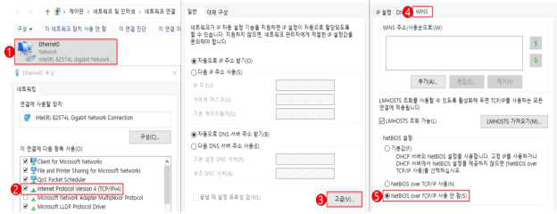

---
<!-- Page 207 -->
02. Windows 서버
2026  주요정보통신기반시설 기술적 취약점 분석·평가 방법 상세가이드
207
W-21
(상)
Windows 서버 > 2. 서비스 관리
암호화되지 않는 FTP 서비스 비활성화
개요
점검 내용
시스템 내 FTP 서비스 구동 여부 점검
점검 목적
인증정보가 기본적으로 평문 전송되는 취약한 프로토콜인 FTP의 사용을 제한하기 위함
보안 위협
OS에서 제공하는 기본적인 FTP 서비스를 사용할 경우 계정과 패스워드가 암호화되지 않은 채로
전송되어 Sniffer에 의한 계정정보의 노출 위험이 존재함
참고
※ Sniffer: 네트워크 트래픽을 감시하고 분석하는 프로그램
※ 관련 점검항목: W-22(상), W-23(상), W-24(상)
점검 대상 및 판단 기준
대상
Windows NT, 2000, 2003, 2008, 2012, 2016, 2019, 2022
판단 기준
양호 : FTP 서비스를 사용하지 않는 경우 또는 Secure FTP 서비스를 사용하는 경우
취약 : 암호화되지 않는 FTP 서비스를 사용하는 경우
조치 방법
FTP 서비스가 필요하지 않다면 서비스 중지 또는 Secure FTP 응용 프로그램 사용
조치 시 영향
일반적인 경우 영향 없음
점검 및 조치 사례
l Windows NT, 2000, 2003, 2008, 2012, 2016, 2019, 2022
Step 1) 시작 > 실행 > SERVICES.MSC > FTP Publishing Service(Windows 2012 이상 : Microsoft FTP Service)
> 속성 >
Step 2) 시작 유형을 “사용 안 함”으로 설정한 후, FTP 서비스 중지
[ FTP 서비스 사용 안 함 설정 ]

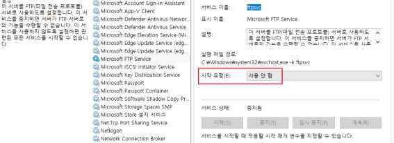

---
<!-- Page 208 -->
| 한국인터넷진흥원 |
208
W-22
(상)
Windows 서버 > 2. 서비스 관리
FTP 디렉토리 접근권한 설정
개요
점검 내용
FTP 홈 디렉터리의 접근 권한 적절성 점검
점검 목적
FTP 서비스 디렉터리의 접근 권한을 적절하게 설정하여 의도치 않은 정보 유출을 방지하기 위함
보안 위협
FTP 홈 디렉터리에 과도한 권한(예. Everyone Full Control)이 부여된 경우 임의의 사용자가 쓰기,
수정이 가능하여 정보 유출, 파일 위‧변조 등의 위험이 존재함
참고
※ 기반시설 시스템은 FTP 서비스를 사용하지 않는 것이 원칙이나, 조직 내에서 해당 서비스를 부득이
사용해야 하는 경우 관련 보호 대책을 수립 및 적용하여 활용해야 함
※ 관련 점검항목: W-21(상), W-23(상), W-24(상)
점검 대상 및 판단 기준
대상
Windows NT, 2000, 2003, 2008, 2012, 2016, 2019, 2022
판단 기준
양호 : FTP 홈 디렉터리에 Everyone 권한이 없는 경우
취약 : FTP 홈 디렉터리에 Everyone 권한이 있는 경우
조치 방법
FTP 홈 디렉터리에서 Everyone 권한 삭제, 각 사용자에게 적절한 권한 부여
조치 시 영향
일반적인 경우 영향 없음
점검 및 조치 사례
l Windows NT(IIS 4.0), 2000(IIS 5.0), 2003(IIS 6.0)
Step 1) 인터넷 정보 서비스(IIS) 관리 > FTP 사이트 > 해당 FTP 사이트 > 속성 > [홈 디렉터리] 탭에서 FTP 홈
디렉터리 확인
Step 2) 탐색기 > 홈 디렉터리 > 속성 > [보안] 탭에서 Everyone 권한 제거

---
<!-- Page 209 -->
02. Windows 서버
2026  주요정보통신기반시설 기술적 취약점 분석·평가 방법 상세가이드
209
l Windows 2008(IIS 7.0), 2012(IIS 8.0), 2016, 2019, 2022(IIS 10.0)
Step 1) 제어판 > 관리 도구 > 인터넷 정보 서비스(IIS) 관리 > 사이트 > 해당 FTP 사이트 > FTP 권한 부여 규칙
선택
Step 2) 허용 권한 부여 규칙에서 “지정한 사용자” 지정
[ FTP 권한 부여 규칙 ]
[ 지정한 사용자 설정 ]

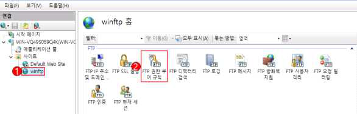

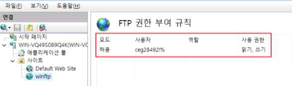

---
<!-- Page 210 -->
| 한국인터넷진흥원 |
210
W-23
(상)
Windows 서버 > 2. 서비스 관리
공유 서비스에 대한 익명 접근 제한 설정
개요
점검 내용
공유 서비스의 익명(Anonymous) 접속 허용 여부 점검
점검 목적
공유 익명 접속을 제한하여, 중요 정보의 불법 유출을 차단하기 함
보안 위협
공유 익명 접속이 허용되면 핵심 기밀 자료나 내부 정보의 불법 유출 위험이 존재함
참고
※ 만약 익명 접속이 허용된 공유 서버에 익명 사용자에 관해 쓰기 권한이 부여된 경우, 정상적으로 업
로드한 파일들의 변조가 가능하므로 공개한 디렉터리 내 중요 데이터가 보관되어 있는지를 추가로
확인해야 함
※ 공유 서비스: FTP, SMB, NFS, TFTP 등
※ 관련 점검항목: W-21(상), W-22(상), W-24(상)
점검 대상 및 판단 기준
대상
Windows NT, 2000, 2003, 2008, 2012, 2016, 2019, 2022
판단 기준
양호 : 공유 서비스를 사용하지 않거나, 익명 인증 사용 안 함으로 설정된 경우
취약 : 공유 서비스를 사용하거나, 익명 인증 사용함으로 설정된 경우
조치 방법
공유 서비스를 사용하지 않는 경우 서비스 중지, 사용할 경우 익명 인증 사용 안 함 설정 적용
조치 시 영향
응용프로그램에서 익명 연결을 사용할 경우를 제외하고, 일반적인 경우 영향 없음
점검 및 조치 사례
l Windows NT(IIS 4.0), 2000(IIS 5.0), 2003(IIS 6.0)
Step 1) 인터넷 정보 서비스(IIS) 관리 > FTP 사이트 > 속성 > [보안 계정] 탭에서 “익명 연결 허용” 체크박스 해
제 (만약 개별 FTP 사이트에 적용할 경우 해당 사이트에만 설정이 적용되고, 기본 설정은 적용받지 않음)

---
<!-- Page 211 -->
02. Windows 서버
2026  주요정보통신기반시설 기술적 취약점 분석·평가 방법 상세가이드
211
l Windows 2008(IIS 7.0), 2012(IIS 8.0), 2016, 2019, 2022(IIS 10.0)
Step 1) 제어판 > 관리 도구 > 인터넷 정보 서비스(IIS) 관리 > 해당 FTP 사이트 > FTP 인증 선택
[ FTP 인증 설정 ]
Step 2) FTP 인증 화면에서 익명 인증 사용 안 함 설정
[ 익명 인증 사용 안 함 설정 ]

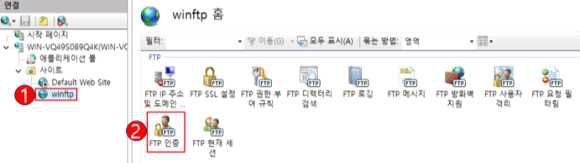

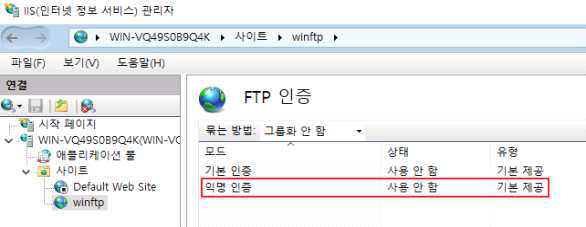

---
<!-- Page 212 -->
| 한국인터넷진흥원 |
212
W-24
(상)
Windows 서버 > 2. 서비스 관리
FTP 접근 제어 설정
개요
점검 내용
FTP 접속 가능한 IP주소 지정 여부 점검
점검 목적
FTP 접근 시 특정 IP주소에 대해 콘텐츠 접근을 허용하여 서비스 보안성을 강화하기 위함
보안 위협
FTP 프로토콜은 로그온 시 지정된 자격 증명이나 데이터 자체가 암호화되지 않고 모든 자격 증명을
일반 텍스트로 네트워크를 통해 전송되는 특성상 서버 클라이언트 간 트래픽 스니핑을 통해 인증 정보가
쉽게 노출될 위험이 존재함
참고
※ 기반시설 시스템은 FTP 서비스를 사용하지 않는 것이 원칙이나, 조직 내에서 해당 서비스를 부득이
사용해야 하는 경우 관련 보호 대책을 수립 및 적용하여 활용해야 함
※ 관련 점검항목: W-21(상), W-22(상), W-23(상)
점검 대상 및 판단 기준
대상
Windows NT, 2000, 2003, 2008, 2012, 2016, 2019, 2022
판단 기준
양호 : 특정 IP주소에서만 FTP 서버에 접속하도록 접근 제어 설정을 적용한 경우
취약 : 특정 IP주소에서만 FTP 서버에 접속하도록 접근 제어 설정을 적용하지 않는 경우
※ 조치 시 마스터 속성과 모든 사이트에 적용함
조치 방법
특정 IP주소에서만 FTP 서버에 접속하도록 접근 제어 설정
조치 시 영향
일반적인 경우 영향 없음
점검 및 조치 사례
l Windows NT(IIS 4.0), 2000(IIS 5.0), 2003(IIS 6.0)
Step 1) 인터넷 정보 서비스(IIS) 관리 > FTP 사이트 > 속성 > [디렉터리 보안] 탭에서 “액세스 거부” 선택 후 접
근 가능 IP주소 추가 (만약 개별 FTP 사이트에 적용할 경우 해당 사이트에만 설정이 적용되고, 기본 설정
은 적용받지 않음)
※ 액세스 허가: 모든 액세스를 허용 후 액세스를 거부할 컴퓨터, 그룹, 도메인 추가
액세스 거부: 모든 액세스를 거부 후 액세스를 허용할 컴퓨터, 그룹, 도메인 추가

---
<!-- Page 213 -->
02. Windows 서버
2026  주요정보통신기반시설 기술적 취약점 분석·평가 방법 상세가이드
213
l Windows 2008(IIS 7.0), 2012(IIS 8.0), 2016, 2019, 2022(IIS 10.0)
Step 1) 제어판 > 관리 도구 > 인터넷 정보 서비스(IIS) 관리 > 해당 FTP 사이트 > FTP IPv4 주소 및 도메인 제한
Step 2) [작업]의 허용 항목 추가에서 FTP 접속을 허용할 IP 입력
Step 3) [작업]의 기능 설정 편집에서 지정되지 않은 클라이언트에 대한 액세스를 거부 선택
[ FTP IP주소 및 도메인 제한 설정 ]
[ 허용 IP주소 설정 ]

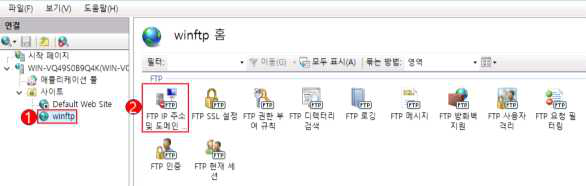

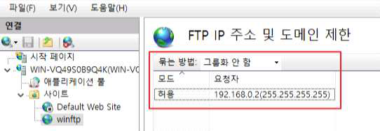

---
<!-- Page 214 -->
| 한국인터넷진흥원 |
214
W-25
(상)
Windows 서버 > 2. 서비스 관리
DNS Zone Transfer 설정
개요
점검 내용
DNS Zone Transfer 차단 설정 여부 점검
점검 목적
DNS Zone Transfer 차단 설정을 적용하여 도메인 정보의 불법 외부 유출을 방지하기 위함
보안 위협
DNS Zone Transfer 차단 설정이 적용되지 않는 경우 DNS 서버에 저장된 도메인 정보를 승인된 DNS
서버가 아닌 외부로 유출 위험이 존재함
참고
※ Zone Transfer: 영역(zone) 전송이라고 하며 master와 slave 간에 또는 primary와 secondary
DNS 간에 zone 파일을 동기화하기 위한 용도로 사용되는 기술
점검 대상 및 판단 기준
대상
Windows NT, 2000, 2003, 2008, 2012, 2016, 2019, 2022
판단 기준
양호 : 아래 기준에 해당하는 경우
1. DNS 서비스가 비활성화인 경우

## 2. 영역 전송 허용을 하지 않는 경우

## 3. 특정 서버로만 설정이 되어있는 경우

취약 : 위 3개 기준 중 하나라도 해당하지 않는 경우
조치 방법
불필요 시 서비스 중지/사용 안 함 설정, 사용하는 경우 영역 전송을 특정 서버로 제한하거나 “영역 전송
허용”에 체크 해제
조치 시 영향
영역 전송 시 서버를 지정할 경우 영향 없음
점검 및 조치 사례
l Windows NT
Step 1) 시작 > 프로그램 > 관리 도구 > DNS 관리자 > 각 조회 영역 > 해당 영역 > 등록 정보 >알림
Step 2) “알림 목록에 있는 보조 영역에서만 액세스 허용” 선택 후 서버 IP 추가

---
<!-- Page 215 -->
02. Windows 서버
2026  주요정보통신기반시설 기술적 취약점 분석·평가 방법 상세가이드
215
l Windows 2000, 2003, 2008, 2012, 2016, 2019, 2022
Step 1) 시작 > 제어판 > 관리 도구 > DNS > 각 조회 영역 > 해당 영역 > 속성 > 영역 전송
Step 2) “다음 서버로만” 선택 후 전송할 서버 IP 추가
[ 영역 전송 IP주소 지정 ]
Step 3) 불필요 시 해당 서비스 중지
시작 > 실행 > SERVICES.MSC > DNS 서버 > 속성 [일반] 탭에서 “시작 유형”을 “사용 안 함”으로 설정
한 후, DNS 서비스 중지
[ DNS Server 사용 안 함 설정 ]

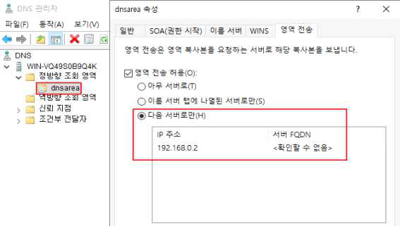

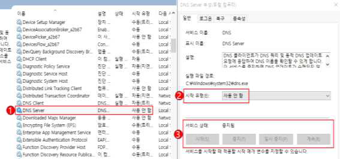

---
<!-- Page 216 -->
| 한국인터넷진흥원 |
216
W-26
(상)
Windows 서버 > 2. 서비스 관리
RDS(Remote Data Services)제거
개요
점검 내용
RDS(Remote Data Services) 비활성화 여부 점검
점검 목적
취약한 RDS 서비스를 제거하여 불법적인 원격 공격을 차단하기 위함
보안 위협
취약한 플랫폼의 RDS가 사용되는 경우 서비스 거부 공격이나 원격에서 관리자 권한으로 임의의 명령을
실행할 수 있는 위험이 존재함
참고
※ MDAC 2.7 미만의 버전에서 웹 서버와 웹 클라이언트 모두 취약점으로 인해 위험해질 수 있으므로
RDS가 불필요할 경우 제거하는 것이 안전함
※ RDS(Remote Data Services): MDAC(Microsoft Data Access Components)의 한
컴포넌트로 클라이언트에 있는 데이터를 다룰 수 있도록 하는 서비스
점검 대상 및 판단 기준
대상
Windows NT, 2000, 2003
판단 기준
양호 : 다음 중 한 가지라도 해당하는 경우
1. IIS를 사용하지 않는 경우
2. Windows 2008 이상 버전을 사용하는 경우
3. Windows 2000 서비스팩 4, Windows 2003 서비스팩 2 이상 설치된 경우

## 4. 기본 웹 사이트에 MSADC 가상 디렉터리가 존재하지 않는 경우

## 5. 해당 레지스트리 값이 존재하지 않는 경우

취약 : 양호 기준에 한 가지도 해당하지 않는 경우
조치 방법
사용하지 않는 경우 IIS 서비스 중지/사용 안 함, 사용할 경우 레지스트리 키 값 제거 또는 관련 패치
적용
조치 시 영향
WAS와 연동될 경우 일부 RDS를 사용할 수가 있으며 사용할 경우 레지스트리 키 값 제거가 요구됨
점검 및 조치 사례
l Windows NT, 2000, 2003
Step 1) 시작 > 실행 > INETMGR > 웹 사이트 선택 후 디렉터리에서 msadc 제거
Step 2) 다음의 레지스트리 키/디렉터리 제거
HKEY_LOCAL_MACHINE\SYSTEM\CurrentControlSet\Services\W3SVC\Parameters\ADCLaunch
1. RDSServer.DataFactory
2. AdvancedDataFactory
3. VbBusObj.VbBusObjCls

---
<!-- Page 217 -->
02. Windows 서버
2026  주요정보통신기반시설 기술적 취약점 분석·평가 방법 상세가이드
217
W-27
(상)
Windows 서버 > 2. 서비스 관리
최신 Windows OS Build 버전 적용
개요
점검 내용
최신 Build 적용 여부 점검
점검 목적
시스템을 최신 버전으로 유지하여 새로운 위협 및 진행 중인 위협으로부터 중요 정보와 시스템을
보호하기 위함
보안 위협
보안 업데이트를 적용하지 않으면 시스템 및 응용 프로그램의 취약성으로 인해 권한 상승, 원격 코드
실행, 보안 기능 우회 등의 위험이 존재함
참고
※ Build: Windows 패치 버전
점검 대상 및 판단 기준
대상
Windows NT, 2000, 2003, 2008, 2012, 2016, 2019, 2022
판단 기준
양호 : 최신 Build가 설치되어 있으며 적용 절차 및 방법이 수립된 경우
취약 : 최신 Build가 설치되지 않거나, 적용 절차 및 방법이 수립되지 않은 경우
조치 방법
설치에 따른 영향도 확인 후 최신 Build 설치(설치 후 시스템 재시작 필요)
조치 시 영향
설치 후 시스템 재시작이 필요하며 설치에 따른 시스템 영향 정도를 확인해야 함
점검 및 조치 사례
l Windows NT, 2000, 2003, 2008, 2012, 2016, 2019, 2022
Step 1) 시작 > 실행 > Winver
Step 2) Build 버전 확인 후 최신 Build 다운로드 후 설치 또는 자동업데이트 활용
※ 인터넷 웜(Worm)이 Windows의 취약점을 이용하여 공격하기 때문에 최신 패치 설치 시에는 네트워크와 분
리된 상태에서 설치할 것을 권장
[ Windows Build 버전 확인 ]

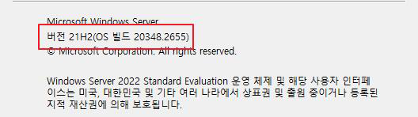

---
<!-- Page 218 -->
| 한국인터넷진흥원 |
218
W-28
(중)
Windows 서버 > 2. 서비스 관리
터미널 서비스 암호화 수준 설정
개요
점검 내용
원격 데스크톱 서비스 암호화 수준 적절성 점검
점검 목적
원격 데스크톱 서비스 암호화 설정으로 데이터를 암호화하여 클라이언트와 서버 간의 통신에서
전송되는 데이터를 보호하기 위함
보안 위협
서버 접속 시에 낮은 암호화 수준을 적용할 경우 악의적인 사용자에 의해 서버와 클라이언트 간
주고받는 정보가 노출될 위험이 존재함
참고
※ 기반시설 시스템은 원격 데스크톱 서비스의 사용을 원칙적으로 금지하나, 부득이 해당 서비스를 사
용해야 하는 경우 클라이언트 서버 간의 데이터 전송 시 암호화하여 보호해야 함
점검 대상 및 판단 기준
대상
Windows NT, 2000, 2003, 2008, 2012, 2016, 2019, 2022
판단 기준
양호 : 원격 데스크톱 서비스를 사용하지 않거나 사용 시 암호화 수준을 “클라이언트와 호환 가능(중간)”
이상으로 설정한 경우
취약 : 원격 데스크톱 서비스를 사용하고 암호화 수준이 “낮음”으로 설정한 경우
조치 방법
원격 데스크톱 서비스의 가동을 ‘중지’ 및 ‘사용 안 함’ 설정을 하거나, 부득이하게 사용할 경우 암호화
수준 설정 적용
조치 시 영향
암호화 수준 변경 시 일반적으로 영향 없음
점검 및 조치 사례
l Windows NT
Step 1) 시작 > 실행 > regedit
Step 2) HKLM\SYSTEM\CurrentControlSet\Control\Terminal Server\WinStations\RDP-Tcp\
MinEncryptionLevel 값을 2(중간) 이상으로 설정
l Windows 2000
Step 1) 시작 > 실행 > TSCC.MSC > “해당 서비스” 선택 > 속성
Step 2) 암호화 수준 → 중간(Windows 2000) 이상으로 설정

---
<!-- Page 219 -->
02. Windows 서버
2026  주요정보통신기반시설 기술적 취약점 분석·평가 방법 상세가이드
219
l Windows 2003
Step 1) Windows 2003: 시작 > 실행 > TSCC.MSC > “해당 서비스” 선택 > 속성
Step 2) [일반] 탭에서 암호화 수준 설정 → 클라이언트 호환 가능
l Windows 2008, 2012, 2016, 2019, 2022
Step 1) 시작 > 실행 > GPEDIT.MSC(로컬 그룹 정책 편집기)
Step 2) 컴퓨터 구성 > 관리 템플릿 > 터미널 서비스 > 원격 데스크톱 세션 호스트 > 보안
Step 3) [클라이언트 연결 암호화 수준 설정] > [암호화 수준]을 클라이언트 호환 가능으로 설정
[ 암호화 수준 설정 ]
※ 원격 데스크톱 서비스가 필요한 경우 추가 보완 대책

## 1. 관리자 이외의 일반 사용자의 터미널 서비스 접속을 허용하지 않음

## 2. 방화벽에서 원격 데스크톱 서비스 포트의 사용을 관리자 컴퓨터의 IP로 제한

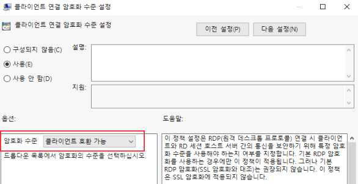

---
<!-- Page 220 -->
| 한국인터넷진흥원 |
220
W-29
(중)
Windows 서버 > 2. 서비스 관리
불필요한 SNMP 서비스 구동 점검
개요
점검 내용
SNMP 서비스 구동 여부 점검
점검 목적
취약한 SNMP 서비스를 비활성화하여 시스템의 주요 정보 유출 및 불법 수정을 방지하기 위함
보안 위협
취약한 SNMP 서비스를 사용하는 경우 서비스 거부 공격(DoS, DDoS), 버퍼 오버플로우, 비인가 접속
등의 공격 위험이 존재함
참고
※ SNMP: SNMP(Simple Network Management Protocol)는 MIB(Management Information
Base)에 기반을 둔 네트워크망을 관리하기 위한 목적으로 만들어진 프로토콜로, 간단한 명령으로
원격 시스템의 CPU 정보에서부터, 인터페이스별 트래픽량 등 여러 가지 정보를 확인 가능
※ 관련 점검항목: W-30(중), W-31(중)
점검 대상 및 판단 기준
대상
Windows 2000, 2003, 2008, 2012, 2016, 2019, 2022
판단 기준
양호 : SNMP 서비스를 사용하지 않는 경우 또는 Community String을 설정하여 SNMP 서비스를
사용하는 경우
취약 : 불필요하게 SNMP 서비스를 사용하는 경우
조치 방법
불필요 시 서비스 중지/사용 안 함
조치 시 영향
NMS 또는, 별도의 툴에서 SNMP 서비스를 이용하여 서버를 모니터링 하는 경우, 통신하고자 하는 Ser
ver/Client에 모두 같은 Community String을 사용해야 함(서비스 > SNMP > 등록 정보 > 종속성 참
고)
NMS(Network Management System): 네트워크 관리 시스템
점검 및 조치 사례
l Windows 2000, 2003, 2008, 2012, 2016, 2019, 2022
Step 1) 불필요 시 해당 서비스 중지
시작 > 제어판 > 관리 도구 > 서비스 > SNMP Service(또는, SNMP 서비스) > 속성에서 “시작 유형”을
“사용 안 함”으로 설정한 후, SNMP 서비스 중지
[ SNMP 서비스 사용 안 함 설정 ]

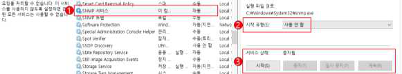

---
<!-- Page 221 -->
02. Windows 서버
2026  주요정보통신기반시설 기술적 취약점 분석·평가 방법 상세가이드
221
W-30
(중)
Windows 서버 > 2. 서비스 관리
SNMP Community String 복잡성 설정
개요
점검 내용
SNMP 서비스 Community String 적절성 점검
점검 목적
SNMP에서 일종의 비밀번호로 사용하는 Community String을 유추할 수 없는 복잡한 값으로
변경하여 불필요한 시스템 정보 노출을 차단하기 위함
보안 위협
Community String을 변경하지 않고 public, private 등 기본 설정값으로 사용하는 경우, 기본 Com
munity String 값을 통한 시스템의 주요 정보 및 설정 상태가 비인가자에게 노출될 수 있는 위험이
존재함
참고
※ 관련 점검항목: W-29(중), W-31(중)
점검 대상 및 판단 기준
대상
2000, 2003, 2008, 2012, 2016, 2019, 2022
판단 기준
양호 : SNMP 서비스를 사용하지 않거나 Community String이 public, private 이 아닌 경우
취약 : SNMP 서비스를 사용하며, Community String이 public, private인 경우
조치 방법
불필요 시 서비스 중지/사용 안 함, 사용 시 기본 Community String 변경
조치 시 영향
NMS 또는, 별도의 도구에서 SNMP 서비스를 이용하여 서버를 모니터링하는 경우, 통신하고자 하는 S
erver/Client에 모두 같은 Community String을 사용해야 함. (서비스 > SNMP > 등록 정보 > 종속성
참고)
점검 및 조치 사례
l Windows 2000, 2003, 2008, 2012, 2016, 2019, 2022
Step 1) 시작 > 제어판 > 관리 도구 > 서비스 > SNMP Service(또는, SNMP 서비스) > 속성 > 보안 > [인증 트랩
보내기] > [추가]
Step 2) Community String을 읽기 전용으로 설정 후 public/private이 아닌 이름을 추가
Step 3) 불필요 시 해당 서비스 중지
시작 > 실행 > SERVICES.MSC > SNMP Service(또는, SNMP 서비스) > 속성 [일반] 탭에서 “시작 유형”
을 “사용 안 함”으로 설정한 후, SNMP 서비스 중지
[ SNMP Community String 설정 ]

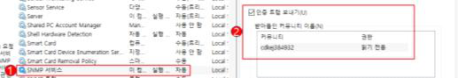

---
<!-- Page 222 -->
| 한국인터넷진흥원 |
222
W-31
(중)
Windows 서버 > 2. 서비스 관리
SNMP Access Control 설정
개요
점검 내용
SNMP 패킷 Access Control(접근 제어) 설정 여부 점검
점검 목적
SNMP 트래픽에 대한 Access Control 설정을 적용하여 내부 네트워크로부터의 악의적인 공격을
차단하기 위함
보안 위협
SNMP Access Control 설정을 적용하지 않아 인증되지 않은 내부 서버로부터의 SNMP 트래픽을
차단하지 않을 경우, 장치 구성 변경, 라우팅 테이블 조작, 악의적인 TFTP 서버 구동 등의 SNMP 공격
에 노출될 위험이 존재함
참고
※ 관련 점검항목: W-29(중), W-30(중)
점검 대상 및 판단 기준
대상
Windows 2000, 2003, 2008, 2012, 2016, 2019, 2022
판단 기준
양호 : SNMP 서비스를 사용하지 않거나 특정 호스트로부터 SNMP 패킷 받아들이기가 설정된 경우
취약 : 모든 호스트로부터 SNMP 패킷 받아들이기가 설정된 경우
조치 방법
불필요 시 서비스 중지/사용 안 함, 사용 시 SNMP 패킷 수령 호스트 지정
조치 시 영향
일반적인 경우 영향 없음
점검 및 조치 사례
l Windows 2000, 2003, 2008, 2012, 2016, 2019, 2022
Step 1) 시작 > 제어판 > 관리 도구 > 서비스 > SNMP Service(또는, SNMP 서비스) > 속성 > 보안
Step 2) “인증 트랩 보내기” 및 “다음 호스트로부터 SNMP 패킷 받아들이기” 선택
Step 3) SNMP 호스트 등록
[ SNMP 보안 설정 ]

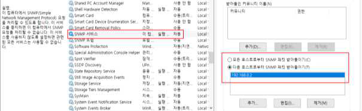

---
<!-- Page 223 -->
02. Windows 서버
2026  주요정보통신기반시설 기술적 취약점 분석·평가 방법 상세가이드
223
W-32
(중)
Windows 서버 > 2. 서비스 관리
DNS 서비스 구동 점검
개요
점검 내용
DNS 서비스의 동적 업데이트 설정 여부 점검
점검 목적
DNS 동적 업데이트를 비활성화함으로 신뢰할 수 없는 원본으로부터 업데이트를 받아들이는 위험을
차단하기 위함
보안 위협
DNS 서버에서 동적 업데이트를 사용할 경우 악의적인 사용자에 의해 신뢰할 수 없는 데이터가
받아들여질 위험이 존재함
참고
※ 동적 업데이트: DNS 정보에 변경 사항이 있을 때마다 DNS 클라이언트 컴퓨터가 자신의 리소스 레
코드(zone 파일)를 DNS 서버에 자동으로 업데이트하는 기능으로 영역 레코드 수동 관리 작업을 줄
일 수 있음
점검 대상 및 판단 기준
대상
Windows 2000, 2003, 2008, 2012, 2016, 2019, 2022
판단 기준
양호 : DNS 서비스를 사용하지 않거나 동적 업데이트 “없음(아니오)”으로 설정된 경우
취약 : 서비스를 사용하며 동적 업데이트가 설정된 경우
조치 방법
DNS 서비스의 동적 업데이트 비활성화 설정
조치 시 영향
일반적인 경우 영향 없음
점검 및 조치 사례
l Windows 2000, 2003, 2008, 2012, 2016, 2019, 2022
Step 1) 시작 > 제어판 > 관리 도구 > DNS > 각 조회 영역 > 해당 영역 > 속성 > 일반
Step 2) 동적 업데이트 → 없음 (또는 아니오) 선택
[ 동적 업데이트 없음 설정 ]

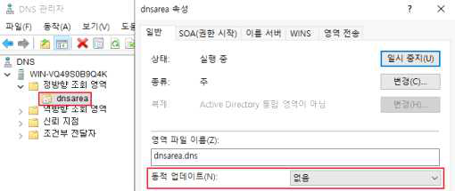

---
<!-- Page 224 -->
| 한국인터넷진흥원 |
224
Step 3) 불필요 시 해당 서비스 중지
시작 > 제어판 > 관리 도구 > 서비스 > DNS Server > 속성 [일반] 탭에서 "시작 유형"을 "사용 안 함"으로
설정한 후, DNS Server 서비스 중지
[ DNS Server 사용 안 함 설정 ]

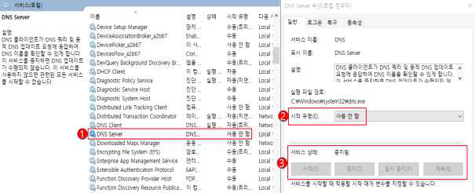

---
<!-- Page 225 -->
02. Windows 서버
2026  주요정보통신기반시설 기술적 취약점 분석·평가 방법 상세가이드
225
W-33
(하)
Windows 서버 > 2. 서비스 관리
HTTP/FTP/SMTP 배너 차단
개요
점검 내용
HTTP/FTP/SMTP 서비스 배너 차단 적용 여부 점검
점검 목적
HTTP/FTP/SMTP 서비스 접속 배너를 통한 불필요한 정보 노출을 방지하기 위함
보안 위협
서비스 접속 배너가 차단되지 않는 경우 임의의 사용자가 HTTP, FTP, SMTP 접속 시도 시 노출되는
접속 배너 정보를 수집하여 악의적인 공격에 이용할 위험이 존재함
참고
-
점검 대상 및 판단 기준
대상
Windows NT, 2000, 2003, 2008, 2012, 2016, 2019, 2022
판단 기준
양호 : HTTP, FTP, SMTP 접속 시 배너 정보가 보이지 않는 경우
취약 : HTTP, FTP, SMTP 접속 시 배너 정보가 보이는 경우
조치 방법
사용하지 않는 경우 IIS 서비스 중지/사용 안 함, 사용 시 속성값 수정
조치 시 영향
일반적인 경우 영향 없음
점검 및 조치 사례
l HTTP
[Server 헤더 제거]
Step 1) Microsoft 다운로드 센터에서 URL Rewrite 다운로드 후 설치
https://www.iis.net/downloads/microsoft/url-rewrite
Step 2) 제어판 > 관리 도구 > IIS(인터넷 정보 서비스) 관리자 > 해당 웹 사이트 > [URL 재작성]
Step 3) 작업 탭 > [서버 값 관리 – 서버 변수 보기...] > 서버 변수 이름 추가
[ 서버 변수 추가 ]

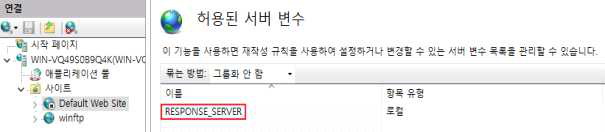

---
<!-- Page 226 -->
| 한국인터넷진흥원 |
226
Step 4) [URL 재작성] > 작업 탭 > [규칙 추가...] > 아웃바운드 규칙 > 빈 규칙 > 다음 사항 적용
- 이름(N): Remove Server
- 검색 범위: 서버 변수
- 서버 변수 이름: RESPONSE_SERVER
- 패턴(T): .*
[ 아웃바운드 규칙 추가 ]
[X-Powered-By 헤더 제거]
Step 1) 제어판 > 관리 도구 > IIS(인터넷 정보 서비스) 관리자 > 해당 웹 사이트 > [HTTP 응답 헤더]
Step 2) [X-Powered-By] 설정 제거
[ X-Powered-By 헤더 제거 ]

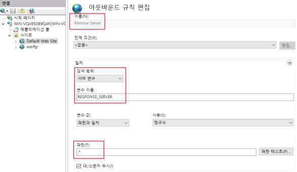

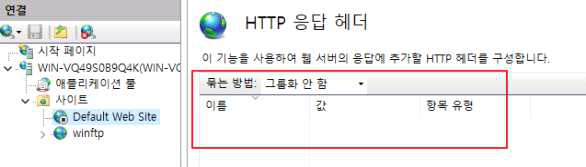

---
<!-- Page 227 -->
02. Windows 서버
2026  주요정보통신기반시설 기술적 취약점 분석·평가 방법 상세가이드
227
l FTP
Step 1) IIS(인터넷 정보 서비스) 관리자 > FTP 메시지 > 기본 배너 숨기기 설정
[ FTP 기본 배너 숨기기 설정 ]
l SMTP
Step 1) 시작 > 실행 > cmd > adsutil.vbs 파일이 있는 디렉터리로 이동
- 명령어: cd C:\inetpub\AdminScripts
- adsutil.vbs를 사용하기 위해 서버 관리자에서 역할 추가 필요 → ”웹 서버(IIS) > 관리 도구 > IIS 6 관리
호환성 > IIS 6 스크립팅 도구“ 설치 필요
Step 2) IIS에서 서비스 중인 SMTP 서비스 목록 확인
- 명령어: cscript adsutil.vbs enum /p smtpsvc
Step 3) SMTP 서비스에 connectresponse 속성 값에서 배너 문구 수정
- 명령어: cscript adsutil.vbs set smtpsvc/1/connectresponse “Banner Text”
Step 4) SMTP 서비스 재시작
- 명령어: net stop smtpsvc (중지)
- 명령어: net start smtpsvc (시작)

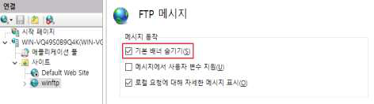

---
<!-- Page 228 -->
| 한국인터넷진흥원 |
228
W-34
(중)
Windows 서버 > 2. 서비스 관리
Telnet 서비스 비활성화
개요
점검 내용
Telnet 서비스 활성화 및 취약한 인증 사용 여부 점검
점검 목적
취약 프로토콜인 Telnet 서비스의 사용을 원칙적으로 금지하고, 부득이 이용할 경우 네트워크상으로
비밀번호를 전송하지 않는 NTLM 인증을 사용하도록 하여 인증 정보의 노출을 차단하기 위함
보안 위협
Telnet 서비스는 평문으로 데이터를 송수신하기 때문에 비밀번호 방식으로 인증을 수행할 경우 ID 및
비밀번호가 외부로 노출될 위험이 존재함
참고
※ Windows 서버의 Telnet 서비스의 두 가지 인증 방법
Ÿ NTLM 인증: 암호를 전송하지 않고 negotiate/challenge/response 절차로 인증 수행
Ÿ Password 인증: 관리자 및 Telnet Clients 그룹에 포함된 ID/PW로 인증 수행
※ Windows 2016 이상 버전에서는 보안상 이슈로 인해 Telnet 서버 설치 제공하지 않음
점검 대상 및 판단 기준
대상
Windows NT, 2000, 2003, 2008, 2012
판단 기준
양호 : Telnet 서비스가 구동되어 있지 않거나 인증 방법이 NTLM인 경우
취약 : Telnet 서비스가 구동되어 있으며 인증 방법이 NTLM이 아닌 경우
조치 방법
불필요 시 서비스 중지/사용 안 함 설정, 사용 시 인증 방법으로 NTLM만 사용
조치 시 영향
일반적인 경우 영향 없음
점검 및 조치 사례
l Windows NT, 2000
Step 1) 시작 > 설정 > 제어판 > 관리 도구 > 텔넷 서버 설정
Step 2) NTLM 인증 방식만 사용
l Windows 2003, 2008, 2012
Step 1) 시작 > 실행 > cmd > tlntadmn config
Step 2) tlntadmn config sec = +NTLM -passwd (passwd 인증 방식을 제외하고 NTLM 방식만 사용)
Step 3) 불필요 시 해당 서비스 중지
시작 > 실행 > SERVICES.MSC > Telnet > 속성 [일반] 탭에서 "시작 유형"을 "사용 안 함"으로 설정한
후 Telnet 서비스 중지

---
<!-- Page 229 -->
02. Windows 서버
2026  주요정보통신기반시설 기술적 취약점 분석·평가 방법 상세가이드
229
W-35
(중)
Windows 서버 > 2. 서비스 관리
불필요한 ODBC/OLE-DB 데이터 소스와 드라이브 제거
개요
점검 내용
불필요한 ODBC/OLE-DB 데이터 소스와 드라이브 제거 여부 점검
점검 목적
불필요한 데이터 소스 및 드라이버를 ODBC 데이터 소스 관리자 도구를 이용해 제거하여 비인가자에
의한 데이터베이스 접속 및 자료 유출을 차단하기 위함
보안 위협
불필요한 ODBC/OLE-DB 데이터 소스를 통한 비인가자에 의한 데이터베이스 접속 및 자료 유출 이
존재함
참고
※ 특정 샘플 응용프로그램은 샘플 데이터베이스를 위해 ODBC 데이터 소스를 설치하거나 불필요한
ODBC/OLE-DB 데이터베이스 드라이버를 설치하므로 불필요한 데이터 소스나 드라이버는
ODBC 데이터 소스 관리자 도구를 이용해서 제거하는 것이 바람직함
점검 대상 및 판단 기준
대상
Windows NT, 2000, 2003, 2008, 2012, 2016, 2019, 2022
판단 기준
양호 : 시스템 DSN 부분의 데이터 소스를 현재 사용하고 있는 경우
취약 : 시스템 DSN 부분의 데이터 소스를 현재 사용하고 있지 않은 경우
조치 방법
사용하지 않는 불필요한 ODBC 데이터 소스 제거
조치 시 영향
응용프로그램에서 사용할 경우 양호
점검 및 조치 사례
l Windows NT
Step 1) 시작 > 설정 > 제어판 > 데이터 원본(ODBC) > 시스템 DSN > 해당 드라이브 클릭
Step 2) 사용하지 않은 데이터 소스 제거
l Windows 2000, 2003, 2008, 2012, 2016, 2019, 2022
Step 1) 시작 > 제어판 > 관리 도구 > ODBC 데이터 원본 > 시스템 DSN > 해당 드라이브 클릭
Step 2) 사용하지 않는 데이터 소스 제거
[ 불필요 ODBC 데이터 소스 확인 및 제거 ]

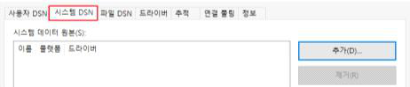

---
<!-- Page 230 -->
| 한국인터넷진흥원 |
230
W-36
(중)
Windows 서버 > 2. 서비스 관리
원격터미널 접속 타임아웃 설정
개요
점검 내용
원격터미널 접속 Timeout 설정 여부 점검
점검 목적
조직에서 부득이 원격터미널 접속을 허용해야 할 경우, 원격터미널 접속 후 일정 시간 동안 이벤트가
발생하지 않은 호스트의 접속을 차단하여 비인가자의 불필요한 접근을 차단하고 정보의 노출을
방지하기 위함
보안 위협
접속 Timeout 값이 설정되지 않으면 유휴 시간 내 비인가자의 시스템 접근으로 인해 불필요한 내부
정보의 노출 위험이 존재함
참고
※ 기반시설 시스템에서 원격터미널 서비스의 이용은 원칙적으로 금지하나, 부득이하게 해당 기능을
활용해야 하는 경우 접속 Timeout 설정 등의 보안 설정을 적용해야 함
점검 대상 및 판단 기준
대상
Windows 2000, 2003, 2008, 2012, 2016, 2019, 2022
판단 기준
양호 : 원격 제어 시 Timeout 제어 설정을 30분 이하로 설정한 경우
취약 : 원격 제어 시 Timeout 제어 설정을 적용하지 않거나 30분 초과로 설정한 경우
조치 방법
Timeout 제어 설정 적용
조치 시 영향
일반적인 경우 영향 없음
점검 및 조치 사례
l Windows 2000, 2003, 2008
Step 1) 시작 > 실행 > 열기 > TSCC.MSC 실행(Windows 2008은 TSCONFIG.MC)
Step 2) RDP-Tcp connection에서 우클릭 > 속성 실행
Step 3) [세션] 탭에서 사용자 설정 무시(Override user settings)를 적용하고 유휴 시 세션이 끊어지도록 “유휴 세
션 제한 시간”을 “30분” 이하로 설정

---
<!-- Page 231 -->
02. Windows 서버
2026  주요정보통신기반시설 기술적 취약점 분석·평가 방법 상세가이드
231
l Windows 2012, 2016, 2019, 2022
Step 1) 시작 > 실행 > GPEDIT.MSC(로컬 그룹 정책 편집기)
Step 2) 컴퓨터 구성 > 관리 템플릿 > 터미널 서비스 > 원격 데스크톱 세션 호스트 > 세션 시간 제한 >
Step 3) [활성 상태지만 유휴 터미널 서비스 세션에 시간 제한 설정] > [유휴 세션 제한]을 30분 이하로 설정
[ 유휴 세션 제한 설정 ]

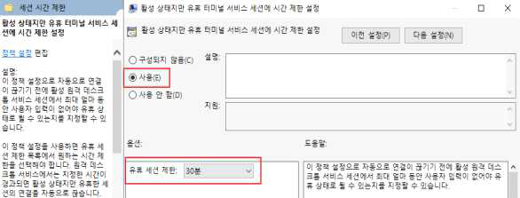

---
<!-- Page 232 -->
| 한국인터넷진흥원 |
232
W-37
(중)
Windows 서버 > 2. 서비스 관리
예약된 작업에 의심스러운 명령이 등록되어 있는지 점검
개요
점검 내용
예약된 작업에 의심스러운 명령의 등록 여부 점검
점검 목적
외부 무단 침입 시 설정될 수 있는 불필요한 예약 작업의 등록 여부를 확인하기 위함
보안 위협
일정 시간마다 미리 설정해둔 프로그램을 실행할 수 있는 예약된 작업은 시작 프로그램과 더불어서
해킹과 트로이목마, 백도어를 설치하여 공격하기 좋은 경로로 사용될 위험이 존재함
참고
-
점검 대상 및 판단 기준
대상
Windows 2000, 2003, 2008, 2012, 2016, 2019, 2022
판단 기준
양호 : 불필요한 명령어나 파일 등 주기적인 예약 작업의 존재 여부를 주기적으로 점검하고 제거한 경우
취약 : 불필요한 명령어나 파일 등 주기적인 예약 작업의 존재 여부를 주기적으로 점검하지 않거나, 불필
요한 작업을 제거하지 않은 경우
조치 방법
예약 작업에 대한 주기적인 확인
조치 시 영향
예약 작업을 잘못 삭제하는 경우 관련된 작업이 실행되지 않을 수 있음
점검 및 조치 사례
l Windows 2000, 2003, 2008, 2012, 2016, 2019, 2022
Step 1) 시작 > 설정 > 제어판 > 예약된 작업 확인
Step 2) 등록된 예약 작업을 선택하여 상세 내역 확인
Step 3) 불필요한 작업 존재 시 삭제
[ 불필요한 작업 제거 ]
※ 2008, 2012, 2016, 2019 는 제어판 > 관리 도구 > 작업 스케줄러에서 확인

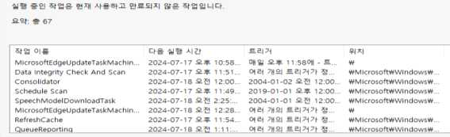

---
<!-- Page 233 -->
02. Windows 서버
2026  주요정보통신기반시설 기술적 취약점 분석·평가 방법 상세가이드
233
W-38
(상)
Windows 서버 > 3. 패치 관리
주기적 보안 패치 및 벤더 권고사항 적용
개요
점검 내용
최신 보안 패치 적용 여부 점검
점검 목적
최신 보안 패치를 설치하여 시스템 및 응용프로그램의 취약성을 제거하기 위함
보안 위협
최신 보안 패치가 즉시 적용되지 않으면 알려진 취약성으로 인한 시스템 공격 위험이 존재함
참고
※ 보안 패치보다 취약성을 이용한 공격 도구가 먼저 출현할 수 있으므로 보안 패치는 발표 후 가능한
한 빨리 설치할 것을 권장함
점검 대상 및 판단 기준
대상
Windows NT, 2000, 2003, 2008, 2012, 2016, 2019, 2022
판단 기준
양호 : 패치 절차를 수립하여 주기적으로 패치를 확인 및 설치하는 경우
취약 : 패치 절차가 수립되어 있지 않거나 주기적으로 패치를 설치하지 않는 경우
조치 방법
주기적인 보안 패치 확인 및 설치 적용
조치 시 영향
설치 후 시스템 재시작이 필요한 경우가 존재하며 설치에 따른 영향도 검사가 필요함
점검 및 조치 사례
l Windows NT, 2000, 2003, 2008, 2012, 2016, 2019, 2022
[수동 HOT FIX 적용]
Step 1) 패치 리스트를 조회하여, 서버에 필요한 패치를 선별하여 수동으로 설치함.
https://technet.microsoft.com/ko-kr/security/
https://msrc.microsoft.com/update-guide
[자동 HOT FIX 적용]
Step 1) Windows 자동업데이트 기능을 이용한 설치
제어판 > windows update

---
<!-- Page 234 -->
| 한국인터넷진흥원 |
234
W-39
(상)
Windows 서버 > 3. 패치 관리
백신 프로그램 업데이트
개요
점검 내용
사용 백신 프로그램의 최신 업데이트 여부 점검
점검 목적
백신 프로그램의 최신 업데이트 상태를 유지하기 위함
보안 위협
백신 프로그램이 지속적, 주기적으로 업데이트되지 않으면 계속되는 신종 바이러스의 출현으로 인한
시스템 공격 위험이 존재함
참고
※ 네트워크망이 격리된 기반 보호 시설의 경우, 시스템에 설치된 백신 프로그램의 최신 업데이트 상태
유지를 위해 적절한 업데이트 절차 및 적용 방법 수립이 필요함
※ 관련 점검항목 : W-45(상)
점검 대상 및 판단 기준
대상
Windows NT, 2000, 2003, 2008, 2012, 2016, 2019, 2022
판단 기준
양호 : 바이러스 백신 프로그램의 최신 엔진 업데이트가 설치되어 있거나, 망 격리 환경의 경우 백신
업데이트를 위한 절차 및 적용 방법이 수립된 경우
취약 : 바이러스 백신 프로그램의 최신 엔진 업데이트가 설치되어 있지 않거나, 망 격리 환경의 경우
백신 업데이트를 위한 절차 및 적용 방법이 수립되지 않은 경우
조치 방법
백신 프로그램 환경설정 메뉴를 통해 DB 및 엔진의 최신 업데이트를 하도록 설정
조치 시 영향
일반적인 경우 영향 없음
점검 및 조치 사례
l Windows NT, 2000, 2003, 2008, 2012, 2016, 2019, 2022
Step 1) 긴급한 경우 수시로 업데이트 진행
(백신 프로그램 종류마다 다소 차이는 있으나 매주 업데이트가 진행됨)
Step 2) 정기적인 업데이트를 통해 검색엔진을 최신 버전으로 유지하고, 백신 프로그램 제조사에서 발표하는
경보 주시
Step 3) 백신 프로그램의 자동 업데이트 기능 이용 시 온라인을 통해 변동 사항을 자동으로 업데이트하여 알 수 있음

---
<!-- Page 235 -->
02. Windows 서버
2026  주요정보통신기반시설 기술적 취약점 분석·평가 방법 상세가이드
235
W-40
(중)
Windows 서버 > 4. 로그 관리
정책에 따른 시스템 로깅 설정
개요
점검 내용
시스템 로깅 설정 여부 및 적절성 점검
점검 목적
적절한 로깅 설정으로 유사시 책임 추적을 위한 로그를 확보하기 위함
보안 위협
감사 설정이 구성되어 있지 않거나 감사 설정 수준이 너무 낮은 경우 보안 관련 문제 발생 시 원인을
파악하기 어려우며 법적 대응을 위한 충분한 증거 확보가 어려운 위험이 존재함
참고
※ 감사 정책을 과도하게 설정할 경우, 보안 로그에 불필요한 항목이 많이 기록되므로 중요한 감사 항
목 식별이 어려울 수 있으며, 시스템 성능에도 심각한 영향을 줄 수 있으므로 법적 요구 사항과 조직
의 정책에 따라 꼭 필요한 로그를 남기도록 설정해야 함
※ Windows 시스템은 보안 로그가 가득 차게 되는 경우 가장 오래된 감사 항목이 덮어 씌워짐
점검 대상 및 판단 기준
대상
Windows NT, 2000, 2003, 2008, 2012, 2016, 2019, 2022
판단 기준
양호 : 감사 정책 권고 기준에 따라 감사 설정이 되어 있는 경우
취약 : 감사 정책 권고 기준에 따라 감사 설정이 되어 있지 않은 경우
조치 방법
이벤트에 대한 감사 설정
조치 시 영향
일반적인 경우 영향 없음
점검 및 조치 사례
l Windows NT
Step 1) 시작 > 프로그램 > 관리 도구 > 도메인 사용자 관리자 > 정책 > 감사
§ 로그온 및 로그오프, 보안 정책 바꾸기: 성공/실패 감사
§ 사용자 권한 사용, 사용자 및 그룹 관리: 실패 감사

---
<!-- Page 236 -->
| 한국인터넷진흥원 |
236
l Windows 2000, 2003, 2008, 2012, 2016, 2019, 2022
Step 1) 시작 > 제어판 > 관리 도구 > 로컬 보안 정책 > 로컬 정책 > 감사 정책
<감사 정책 권고 기준>
§ 계정 관리: 실패 감사
§ 계정 로그온 이벤트 : 성공/실패 감사
§ 권한 사용 : 성공/실패 감사
§ 디렉터리 서비스 액세스 : 실패 감사
§ 로그온 이벤트 : 성공/실패 감사
§ 정책 변경 : 성공/실패 감사
[ 감사 정책 설정 ]

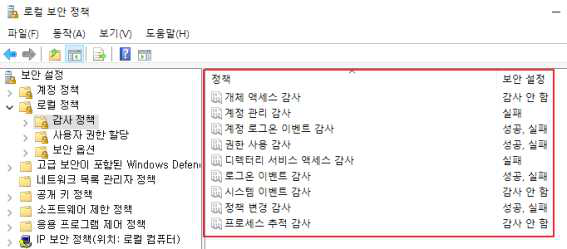

---
<!-- Page 237 -->
02. Windows 서버
2026  주요정보통신기반시설 기술적 취약점 분석·평가 방법 상세가이드
237
W-41
(중)
Windows 서버 > 4. 로그 관리
NTP 및 시각 동기화 설정
개요
점검 내용
NTP 및 시각 동기화 설정 여부 점검
점검 목적
안전하고 승인된 Windows 시간 서비스 또는 자체 구축한 NTP 서버와 동기화하여 인증 및 감사하기
위함
보안 위협
시스템 간 시각 동기화 미흡으로 보안 사고 및 장애 발생 시 초기 대응이 불가한 위험이 존재함
참고
-
점검 대상 및 판단 기준
대상
Windows NT, 2000, 2003, 2008, 2012, 2016, 2019, 2022
판단 기준
양호 : NTP 및 시각 동기화를 설정한 경우
취약 : NTP 및 시각 동기화를 설정하지 않은 경우
조치 방법
NTP 및 시각 동기화 설정
조치 시 영향
일반적인 경우 영향 없음
점검 및 조치 사례
l Windows 2000, 2003, 2008, 2012, 2016, 2019, 2022
[인터넷 동기화 설정 시]
Step 1) 제어판 > 시계 및 국가 > 날짜 및 시간 > 인터넷 시간 > 설정 변경 > 인터넷 시간 서버와 동기화
Step 2) 신뢰할 수 있는 NTP 서버 입력 후 적용
[ NTP 설정 및 동기화 ]

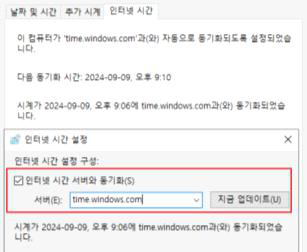

---
<!-- Page 238 -->
| 한국인터넷진흥원 |
238
[내부 NTP 서버 사용 시]
Step 1) 시간 동기화 정보 확인 (Client)
CMD > w32tm /dumpreg /subkey:parameters
Step 2) 내부 NTP서버로 시간동기화 설정 (Client)
(설정) CMD > w32tm /config /syncfromflags:manual /manualpeerlist:{NTP서버 IP or 도메인} /update
(적용 확인) CMD > w32tm /dumpreg /subkey:parameters
※ Client에서 동기화 설정 후 ‘SpecialPollInterval’ ‘MaxPosPhaseCorrection’ 설정에 따라 주기적으로
자동으로 동기화가 적용되지만 NTP Server에서 다음 명령어로 즉시 적용 가능함.
CMD > w32tm /resync
Step 1) 동기화 시간차 확인
CMD > w32tm /stripchart /dataonly /computer:{NTP서버 IP or 도메인}

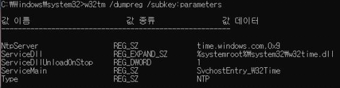

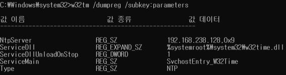

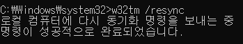

---
<!-- Page 239 -->
02. Windows 서버
2026  주요정보통신기반시설 기술적 취약점 분석·평가 방법 상세가이드
239
W-42
(하)
Windows 서버 > 4. 로그 관리
이벤트 로그 관리 설정
개요
점검 내용
이벤트 로그 파일 용량 및 보관 기간 설정 점검
점검 목적
유사시 책임추적을 위해 주요 이벤트가 누락 되지 않도록 이벤트 로그 파일의 크기 및 보관 기간을
적절하게 유지하기 위함
보안 위협
이벤트 로그 파일의 크기가 충분하지 않으면 중요 로그가 저장되지 않을 위험이 있으며, 최대 보존
크기를 초과하는 경우 자동으로 덮어씀으로써 중요 로그의 손실 위험이 존재함
참고
-
점검 대상 및 판단 기준
대상
Windows NT, 2000, 2003, 2008, 2012, 2016, 2019, 2022
판단 기준
양호 : 최대 로그 크기 “10,240KB 이상”으로 설정, “90일 이후 이벤트 덮어씀”을 설정한 경우
취약 : 최대 로그 크기 “10,240KB 미만”으로 설정, 이벤트 덮어씀 기간이 “90일 이하로 설정된 경우
조치 방법
최대 로그 크기 “10,204KB”, “90일 이후 이벤트 덮어씀” 설정
조치 시 영향
일반적인 경우 영향 없음
점검 및 조치 사례
l Windows NT, 2000, 2003, 2008, 2012, 2016, 2019, 2022
Step 1) 시작 > 제어판 > 관리 도구 > 이벤트 뷰어 > 해당 로그 > 속성 > 일반
Step 2) 최대 로그 크기 → 10240KB
최대 로그 크기에 도달할 때: 다음보다 오래된 이벤트 덮어쓰기 → 90일
[ 이벤트 로그 덮어쓰기 설정 ]
※ Windows 2008, 2012, 2016, 2019 서버의 경우 덮어쓰기 날짜 지정 불가능

---
<!-- Page 240 -->
| 한국인터넷진흥원 |
240
W-43
(중)
Windows 서버 > 4. 로그 관리
이벤트 로그 파일 접근 통제 설정
개요
점검 내용
원격에서 로그 파일의 접근을 차단하기 위한 권한 적절성 점검
점검 목적
원격에서 로그 파일에 접근하는 것을 차단하여 로그 파일의 훼손 및 변조를 차단하기 위함
보안 위협
원격 익명 사용자의 시스템 로그 파일에 접근이 가능한 경우 ‘중요 시스템 로그’ 파일 및 ‘응용프로그램
로그’ 등 중요 보안 감사 정보의 변조·삭제·유출의 위험이 존재함
참고
※ 로그 디렉터리 기본 위치
Ÿ 시스템 로그 디렉터리: %systemroot%\system32\config
Ÿ IIS 로그 디렉터리: %systemroot%\system32\LogFiles
점검 대상 및 판단 기준
대상
Windows NT, 2000, 2003, 2008, 2012, 2016, 2019, 2022
판단 기준
양호 : 로그 디렉터리의 접근 권한에 Everyone 권한이 없는 경우
취약 : 로그 디렉터리의 접근 권한에 Everyone 권한이 있는 경우
조치 방법
로그 디렉터리의 접근 권한에 Everyone 제거
조치 시 영향
일반적인 경우 영향 없음
점검 및 조치 사례
l Windows NT, 2000, 2003, 2008, 2012
Step 1) 탐색기 > 로그 디렉터리 > 속성 > 보안
Step 2) Everyone 권한 제거
l Windows 2016, 2019, 2022
Step 1) 탐색기 > 로그 디렉터리 > 속성 > 보안 > 고급
Step 2) Everyone 권한 제거
[ 로그 디렉터리 권한 확인 ]

---
<!-- Page 241 -->
02. Windows 서버
2026  주요정보통신기반시설 기술적 취약점 분석·평가 방법 상세가이드
241
W-44
(상)
Windows 서버 > 5. 보안 관리
원격으로 액세스할 수 있는 레지스트리 경로
개요
점검 내용
원격 레지스트리 서비스 사용 여부 점검
점검 목적
원격 레지스트리 서비스를 비활성화하여 레지스트리에 대한 원격 접근을 차단하기 위함
보안 위협
Ÿ 원격 레지스트리 서비스는 액세스에 대한 인증이 취약하여 관리자 계정 외 다른 계정들에도 원격
레지스트리 액세스를 허용할 우려가 있으며, 레지스트리에 대한 권한 설정이 잘못되어 있는 경우
원격에서 레지스트리를 통해 임의의 파일을 실행할 위험이 존재함
Ÿ 레지스트리 서비스의 장애는 전체 시스템에 영향을 줄 수 있어 서비스 거부 공격(DoS) 공격에 이용될
위험이 존재함
참고
※ 레지스트리: Windows를 실행하는데 필요한 모든 환경설정 데이터를 모아 두는 중앙 저장소
※ 원격 레지스트리 서비스: 원격지에 있는 컴퓨터를 한곳에서 집중적으로 관리하기 위한 목적으로
원격 컴퓨터의 레지스트리에 접근할 수 있도록 하는 서비스
점검 대상 및 판단 기준
대상
Windows NT, 2000, 2003, 2008, 2012, 2016, 2019, 2022
판단 기준
양호 : Remote Registry Service가 중지된 경우
취약 : Remote Registry Service가 사용 중인 경우
조치 방법
불필요 시 서비스 중지 및 사용 안 함으로 설정
조치 시 영향
Remote Registry Service를 사용하는지 확인 필요
(서비스 > Remote Registry Service > 등록 정보 > 종속성 참고)
점검 및 조치 사례
l Windows NT, 2000, 2003, 2008, 2012, 2016, 2019, 2022
Step 1) 시작 > 제어판 > 관리 도구 > 서비스 > Remote Registry > 속성
Step 2) 시작 유형을 “사용 안 함”으로 설정한 후 서비스 중지
[ Remote Registry 사용 중지 설정 ]

---
<!-- Page 242 -->
| 한국인터넷진흥원 |
242
점검 및 조치 사례
l Windows NT, 2000, 2003, 2008, 2012, 2016, 2019, 2022
※ 백신 프로그램에 대한 인지도, 효과성 등을 검토하여 설치할 수 있음
W-45
(상)
Windows 서버 > 5. 보안 관리
백신 프로그램 설치
개요
점검 내용
시스템 내 백신 프로그램 설치 여부 점검
점검 목적
적절한 백신 프로그램을 설치하여 바이러스 감염 여부 진단, 치료 및 파일 보호를 통해 보안 사고를
예방하기 위함
보안 위협
백신 프로그램이 설치되지 않으면 웜, 트로이목마 등의 악성 바이러스로 인한 시스템 피해 위험이
존재함
참고
※ 웜: 악의적인 목적을 가지고 자기 자신을 복제해 전파하며 주로 네트워크 공유 폴더나 메일로 전파됨
※ 트로이목마: 고의로 악의적 목적이 있는 파일, 주로 다른 악성 코드나 위장된 프로그램으로 전파되
거나 인터넷을 통해 다운로드 됨
※ 관련 점검항목 : W-39(상)
점검 대상 및 판단 기준
대상
Windows NT, 2000, 2003, 2008, 2012, 2016, 2019, 2022
판단 기준
양호 : 바이러스 백신 프로그램이 설치된 경우
취약 : 바이러스 백신 프로그램이 설치되어 있지 않은 경우
조치 방법
백신 프로그램 설치
조치 시 영향
일반적인 경우 영향 없음

---
<!-- Page 243 -->
02. Windows 서버
2026  주요정보통신기반시설 기술적 취약점 분석·평가 방법 상세가이드
243
W-46
(상)
Windows 서버 > 5. 보안 관리
SAM 파일 접근 통제 설정
개요
점검 내용
SAM 파일 접근 통제 설정 여부 점검
점검 목적
Administrator 및 System 그룹만 SAM 파일에 접근할 수 있도록 제한하여 악의적인 계정 정보
유출을 차단하기 위함
보안 위협
SAM 파일이 노출될 경우 비밀번호 공격 시도로 인해 계정 및 비밀번호 데이터베이스 정보가 탈취될
위험이 존재함
참고
※ SAM(Security Account Manager): 사용자와 그룹 계정의 비밀번호를 관리하고, LSA(Lo cal
Security Authority)를 통한 인증을 제공함
점검 대상 및 판단 기준
대상
Windows NT, 2000, 2003, 2008, 2012, 2016, 2019, 2022
판단 기준
양호 : SAM 파일 접근 권한에 Administrator, System 그룹만 모든 권한으로 설정된 경우
취약 : SAM 파일 접근 권한에 Administrator, System 그룹 외 다른 그룹에 권한이 설정된 경우
조치 방법
SAM 파일 권한 확인 후 Administrator, System 그룹 외 다른 그룹에 설정된 권한 제거
조치 시 영향
일반적인 경우 영향 없음
점검 및 조치 사례
l Windows NT, 2000, 2003, 2008, 2012, 2016, 2019, 2022
Step 1) %systemroot%\system32\config\SAM > 속성 > 보안
Step 2) Administrator, System 그룹 외 다른 사용자 및 그룹 권한 제거
[ SAM 파일 권한 확인 ]

---
<!-- Page 244 -->
| 한국인터넷진흥원 |
244
W-47
(하)
Windows 서버 > 5. 보안 관리
화면 보호기 설정
개요
점검 내용
시스템 화면보호기 설정 여부 점검
점검 목적
사용자가 일정 시간 동안 아무런 작업을 수행하지 않으면 자동으로 로그오프 되거나 워크스테이션이
잠기도록 설정하여, 유휴 시간 내 불법적인 시스템 접근을 차단하기 위함
보안 위협
화면보호기 설정을 하지 않으면 사용자가 자리를 비운 사이에 임의의 사용자가 해당 시스템에 접근하여
중요 정보를 유출하거나, 악의적인 행위를 통해 시스템 운영에 악영향을 미칠 위험이 존재함
참고
-
점검 대상 및 판단 기준
대상
Windows NT, 2000, 2003, 2008, 2012, 2016, 2019, 2022
판단 기준
양호 : 화면 보호기를 설정하고 대기 시간이 10분 이하의 값으로 설정되어 있으며, 화면 보호기 해제를
위한 암호를 사용하는 경우
취약 : 화면 보호기가 설정되지 않았거나 암호를 사용하지 않거나, 화면 보호기 대기 시간이 10분을
초과한 값으로 설정된 경우
조치 방법
화면 보호기 사용, 대기 시간 10분 이하, 해제를 위한 암호 사용
조치 시 영향
일반적인 경우 영향 없음
점검 및 조치 사례
l Windows NT, 2000
Step 1) 바탕화면 > 등록 정보 > 화면 보호기
Step 2) “암호 사용” 설정 및 대기 시간 “10분” 이하로 설정
l Windows 2003
Step 1) 바탕화면 > 마우스 우클릭 > 속성 > 디스플레이 등록 정보 > [화면 보호기]
Step 2) "다시 시작할 때 암호로 보호" 설정 및 대기 시간 “10분” 이하로 설정

---
<!-- Page 245 -->
02. Windows 서버
2026  주요정보통신기반시설 기술적 취약점 분석·평가 방법 상세가이드
245
l Windows 2008, 2012
Step 1) 제어판 > 디스플레이 > 화면 보호기 변경
Step 2)  "다시 시작할 때 로그온 화면 표시" 설정 및 대기 시간 “10분” 이하로 설정
l Windows 2016, 2019, 2022
Step 1) 설정 > 개인 설정 > 잠금 화면 > 화면 보호기 설정
Step 2)  "다시 시작할 때 로그온 화면 표시" 설정 및 대기 시간 “10분” 이하로 설정
[ 화면 보호기 설정 ]

---
<!-- Page 246 -->
| 한국인터넷진흥원 |
246
W-48
(상)
Windows 서버 > 5. 보안 관리
로그온하지 않고 시스템 종료 허용
개요
점검 내용
비 로그온 사용자의 시스템 종료 허용 여부 점검
점검 목적
시스템 로그온 화면의 종료 버튼을 비활성화함으로써 허가되지 않은 사용자를 통한 불법적인 시스템
종료를 방지하고자 함
보안 위협
로그온 화면에 “시스템 종료” 버튼이 활성화되어 있으면 로그인을 하지 않고도 불법적인 시스템 종료가
가능하여 정상적인 서비스 운영에 영향을 줌
참고
-
점검 대상 및 판단 기준
대상
Windows NT, 2000, 2003, 2008, 2012, 2016, 2019, 2022
판단 기준
양호 : “로그온하지 않고 시스템 종료 허용”이 “사용 안 함”으로 설정된 경우
취약 : “로그온하지 않고 시스템 종료 허용”이 “사용”으로 설정된 경우
조치 방법
“시스템 종료: 로그온하지 않고 시스템 종료” 정책을 “사용 안 함” 설정
조치 시 영향
일반적인 경우 영향 없음
점검 및 조치 사례
l Windows NT
Step 1) 시작 > 제어판 > 관리 도구 > 레지스트리 편집기
Step 2) 다음의 레지스트리 값 추가 또는 변경
HKEY_LOCAL_MACHINE\SOFTWARE\Microsoft\Windows NT\CurrentVersion\Winlogon\
ShutdownWithoutLogon = 0
l Windows 2000
Step 1) 시작 > 실행 > SECPOL.MSC > 로컬 정책 > 보안 옵션
Step 2) “로그온하지 않고 시스템 종료 허용”을 “사용 안 함”으로 설정

---
<!-- Page 247 -->
02. Windows 서버
2026  주요정보통신기반시설 기술적 취약점 분석·평가 방법 상세가이드
247
l Windows 2003, 2008, 2012, 2016, 2019, 2022
Step 1) 시작 > 제어판 > 관리 도구 > 로컬 보안 정책 > 로컬 정책 > 보안 옵션
Step 2) “시스템 종료: 로그온하지 않고 시스템 종료 허용”을 “사용 안 함”으로 설정
[ 로그온하지 않고 시스템 종료 허용 사용 안 함 설정 ]

---
<!-- Page 248 -->
| 한국인터넷진흥원 |
248
W-49
(상)
Windows 서버 > 5. 보안 관리
원격 시스템에서 강제로 시스템 종료
개요
점검 내용
원격 시스템 종료 정책 적절성 점검
점검 목적
원격에서 네트워크를 통하여 운영체제를 종료할 수 있는 사용자나 그룹을 설정하여 특정 사용자만
시스템 종료를 허용하기 위함
보안 위협
원격 시스템 강제 종료 설정이 부적절한 경우 서비스 거부 공격 등에 악용될 위험이 존재함
참고
-
점검 대상 및 판단 기준
대상
Windows NT, 2000, 2003, 2008, 2012, 2016, 2019, 2022
판단 기준
양호 : “원격 시스템에서 강제로 시스템 종료” 정책에 “Administrators”만 존재하는 경우
취약 : “원격 시스템에서 강제로 시스템 종료” 정책에 “Administrators” 외 다른 계정 및 그룹이 존재하
는 경우
조치 방법
“원격 시스템에서 강제로 시스템 종료” 정책에 “Administrators” 외 다른 계정 및 그룹 제거
조치 시 영향
일반적인 경우 영향 없음
점검 및 조치 사례
l Windows NT, 2000, 2003, 2008, 2012, 2016, 2019, 2022
Step 1) 시작 > 제어판 > 관리 도구 > 로컬 보안 정책 > 로컬 정책 > 사용자 권한 할당
Step 2) “원격 시스템에서 강제로 시스템 종료” 정책에 Administrators 외 다른 계정 및 그룹 제거
[ 원격 시스템에서 강제 종료 ]

---
<!-- Page 249 -->
02. Windows 서버
2026  주요정보통신기반시설 기술적 취약점 분석·평가 방법 상세가이드
249
W-50
(상)
Windows 서버 > 5. 보안 관리
보안 감사를 로그 할 수 없는 경우 즉시 시스템 종료
개요
점검 내용
‘보안 감사를 로그 할 수 없는 경우 즉시 시스템 종료’ 정책 설정 여부 점검
점검 목적
해당 정책을 비활성화함으로써 로그 용량 초과 등의 이유로 이벤트를 기록할 수 없는 경우, 해당
정책으로 인해 시스템이 비정상적으로 종료되는 것을 방지하기 위함
보안 위협
해당 정책이 활성화되어 있는 경우 악의적인 목적으로 시스템 종료를 유발하여 서비스 거부 공격에
악용될 수 있으며, 비정상적인 시스템 종료로 인해 시스템 및 데이터에 손상을 입힐 위험이 존재함
참고
※ 일반적으로 보안 감사 로그가 꽉 찼을 때 보안 로그에 대한 보존 방법이 [이벤트를 덮어쓰지 않음]
또는 [매일 이벤트 덮어쓰기]인 경우 이벤트가 로그 되지 않음. 보안 로그가 꽉 차고 기존 항목을 덮
어쓸 수 없을 때 해당 정책을 사용하는 경우 다음과 같은 중지 오류가 출력됨
중지: C0000244 {감사 실패}
보안 감사를 만들려고 했으나 만들지 못했습니다.
복구하려면 관리자가 로그온하여 로그를 보관한 다음 로그를 지우고 이 옵션을 원하는 대로 다시 설
정해야 합니다. 이 보안 설정을 다시 설정할 때까지는 보안 로그가 꽉 차지 않았더라도
Administrators 그룹의 구성원이 아니면 어떤 사용자도 시스템에 로그온할 수 없습니다.
점검 대상 및 판단 기준
대상
Windows NT, 2000, 2003, 2008, 2012, 2016, 2019, 2022
판단 기준
양호 : “보안 감사를 로그 할 수 없는 경우 즉시 시스템 종료” 정책이 “사용 안 함”으로 되어있는 경우
취약 : “보안 감사를 로그 할 수 없는 경우 즉시 시스템 종료” 정책이 “사용”으로 되어있는 경우
조치 방법
“보안 감사를 로그 할 수 없는 경우 즉시 시스템 종료” 정책을 “사용 안 함”으로 설정
조치 시 영향
일반적인 경우 영향 없음
점검 및 조치 사례
l Windows NT, 2000
Step 1) 시작 > 실행 > SECPOL.MSC > 로컬 정책 > 보안 옵션
Step 2) “보안 감사를 로그 할 수 없는 경우 즉시 시스템 종료” 정책을 “사용 안 함”으로 설정

---
<!-- Page 250 -->
| 한국인터넷진흥원 |
250
l Windows 2003, 2008, 2012, 2016, 2019, 2022
Step 1) 시작 > 제어판 > 관리 도구 > 로컬 보안 정책 > 로컬 정책 > 보안 옵션
Step 2) “감사: 보안 감사를 로그 할 수 없는 경우 즉시 시스템 종료” 정책을 “사용 안 함”으로 설정
[ 감사 정책 사용 안 함 설정 ]

---
<!-- Page 251 -->
02. Windows 서버
2026  주요정보통신기반시설 기술적 취약점 분석·평가 방법 상세가이드
251
W-51
(상)
Windows 서버 > 5. 보안 관리
SAM 계정과 공유의 익명 열거 허용 안 함
개요
점검 내용
“SAM 계정과 공유의 익명 열거 허용 안 함” 정책 설정 여부 점검
점검 목적
익명 사용자에 의한 악의적인 계정 정보 탈취를 방지하기 위함
보안 위협
Windows에서는 익명의 사용자가 도메인 계정(사용자, 컴퓨터 및 그룹)과 네트워크 공유 이름의 열거
작업을 수행할 수 있으므로 SAM(보안 계정 관리자) 계정과 공유의 익명 열거가 허용될 경우 악의적인
사용자가 계정 이름 목록을 확인하고 이 정보를 사용하여 암호를 추측하거나 사회 공학적 공격기법을
수행할 위험이 존재함
참고
※ 방화벽과 라우터에서 135~139(TCP, UDP) Port 차단을 통해 외부로부터의 위협을 차단함
※ 네트워크 및 전화 접속 연결 > 로컬 영역 > 등록 정보 > 고급 > 고급 설정 > Microsoft 네트워크 파일
및 프린트 공유를 해제해야 함
점검 대상 및 판단 기준
대상
Windows NT, 2000, 2003, 2008, 2012, 2016, 2019, 2022
판단 기준
양호 : “SAM 계정과 공유의 익명 열거 허용 안 함”이 “사용”으로 설정된 경우
취약 : “SAM 계정과 공유의 익명 열거 허용 안 함”이 “사용 안 함”으로 설정된 경우
조치 방법
레지스트리 값 또는, 로컬 보안 정책 설정
조치 시 영향
Active Directory, Clustered system에서는 적용 시 영향 있음
점검 및 조치 사례
l Windows NT
Step 1) 시작 > 제어판 > 관리 도구 > 레지스트리 편집기
HKLM\SYSTEM\CurrentControlSet\Control\LSA
Step 2) RestrictAnonymous 값을 “1”로 설정
l Windows 2000
Step 1) 시작 > 실행 > SECPOL.MSC > 로컬 정책 > 보안 옵션
Step 2) “익명의 연결에 추가적인 제한”에 “명백한 익명의 사용 권한이 없으면 액세스 제한” 선택

---
<!-- Page 252 -->
| 한국인터넷진흥원 |
252
l Windows 2003, 2008, 2012, 2016, 2019, 2022
Step 1) 시작 > 제어판 > 관리 도구 > 로컬 보안 정책 > 로컬 정책 > 보안 옵션
Step 2) "네트워크 액세스 : SAM 계정과 공유의 익명 열거 허용 안 함”과 “네트워크 액세스 : SAM 계정의 익명
열거 허용 안 함”에 “사용” 선택
[ 익명 열거 허용 안 함 사용 설정 ]

---
<!-- Page 253 -->
02. Windows 서버
2026  주요정보통신기반시설 기술적 취약점 분석·평가 방법 상세가이드
253
W-52
(상)
Windows 서버 > 5. 보안 관리
Autologon 기능 제어
개요
점검 내용
Autologon 기능 제어 설정 여부 점검
점검 목적
Autologon 기능을 사용하지 않도록 설정하여 시스템 계정 정보 노출을 차단하기 위함
보안 위협
Autologon 기능을 사용하면 침입자가 해킹 도구를 이용하여 레지스트리에 저장된 로그인 계정 및
비밀번호 정보 유출 위험이 존재함
참고
※ Autologon: 레지스트리에 암호화되어 저장된 대체 증명을 사용하여 자동으로 로그인하는 기능
※ AutoAdminLogon 키가 없는 경우 기본값 비활성화
점검 대상 및 판단 기준
대상
Windows NT, 2000, 2003, 2008, 2012, 2016, 2019, 2022
판단 기준
양호 : AutoAdminLogon 값이 없거나 0으로 설정된 경우
취약 : AutoAdminLogon 값이 1로 설정된 경우
조치 방법
해당 레지스트리 값이 존재하는 경우 0으로 설정
조치 시 영향
반드시 자동 로그인을 사용하여야 할 경우를 제외하고는 일반적으로 영향 없음
점검 및 조치 사례
l Windows NT, 2000, 2003, 2008, 2012, 2016, 2019, 2022
Step 1) 시작 > 제어판 > 관리 도구 > 레지스트리 편집기
HKLM\SOFTWARE\Microsoft\WindowsNT\CurrentVersion\Winlogon
Step 2) “AutoAdminLogon” 값을 “0”으로 설정
Step 3) “Default Password” 존재 시 제거
[ AutoAdminLogon 값 확인 ]

---
<!-- Page 254 -->
| 한국인터넷진흥원 |
254
W-53
(상)
Windows 서버 > 5. 보안 관리
이동식 미디어 포맷 및 꺼내기 허용
개요
점검 내용
관리자 이외 NTFS 미디어 포맷 및 꺼내기 허용 여부 점검
점검 목적
이동식 미디어의 NTFS 포맷 및 꺼내기가 허용되는 사용자를 관리 권한자로 제한함으로써 관리 권한이
없는 사용자 및 비인가자에 의한 불법적인 이동식 미디어의 포맷 및 이동을 차단하기 위함
보안 위협
관리자 이외 사용자에게 해당 정책이 설정된 경우 비인가자에 의한 불법적인 매체 처리를 허용할 위험이
존재함
참고
※ 해당 보안 설정은 이동식 NTFS 미디어를 포맷하거나 꺼낼 수 있는 사용자를 결정하는 옵션으로
Administrators, Administrators 및 Power Users, Administrators 및 Interactive Users 그
룹에 이 기능을 허용할 수 있음
점검 대상 및 판단 기준
대상
Windows NT, 2000, 2003, 2008, 2012, 2016, 2019, 2022
판단 기준
양호 : “이동식 미디어 포맷 및 꺼내기 허용” 정책이 “Administrators”로 되어있는 경우
취약 : “이동식 미디어 포맷 및 꺼내기 허용” 정책이 “Administrators”로 되어있지 않은 경우
조치 방법
“이동식 NTFS 미디어 꺼내기 허용” 정책을 “Administrators”로 설정
조치 시 영향
일반적인 경우 영향 없음
점검 및 조치 사례
l Windows NT, 2000
Step 1) 시작 > 실행 > SECPOL.MSC > 로컬 정책 > 보안 옵션
Step 2) “이동식 NTFS 미디어 꺼내기 허용” 정책을 “Administrators”로 설정
l Windows 2003, 2008, 2012, 2016, 2019, 2022
Step 1) 시작 > 제어판 > 관리 도구 > 로컬 보안 정책 > 로컬 정책 > 보안 옵션
Step 2) “장치 : 이동식 미디어 포맷 및 꺼내기 허용” 정책을 “Administrators”로 설정
[ 이동식 미디어 포맷 및 꺼내기 허용 ]

---
<!-- Page 255 -->
02. Windows 서버
2026  주요정보통신기반시설 기술적 취약점 분석·평가 방법 상세가이드
255
W-54
(중)
Windows 서버 > 5. 보안 관리
Dos 공격 방어 레지스트리 설정
개요
점검 내용
DoS 공격 방어 레지스트리 설정 여부 점검
점검 목적
TCP/IP 스택(Stack)을 강화하는 레지스트리 값 변경을 통하여 DoS 공격을 방어하기 위함
보안 위협
DoS 방어 레지스트리를 설정하지 않은 경우, DoS 공격에 의한 시스템 다운으로 서비스 제공이 중단될
위험이 존재함
참고
※ DoS(서비스 거부 공격): 네트워크 사용자가 컴퓨터나 컴퓨터의 특정 서비스를 사용할 수 없도록 만
들기 위한 네트워크 공격
점검 대상 및 판단 기준
대상
Windows NT, 2000, 2003, 2008, 2012, 2016, 2019, 2022
판단 기준
양호 : 아래 4가지 DoS 방어 레지스트리를 설정한 경우
Ÿ SynAttackProtect → 1이상
Ÿ EnableDeadGWDetect → 0
Ÿ KeepAliveTime → 300,000
Ÿ NoNameReleaseOnDemand → 1
취약 : DoS 방어 레지스트리 값이 설정되어 있지 않은 경우
조치 방법
레지스트리 값을 추가 또는 수정
조치 시 영향
잘못된 값으로 설정할 경우 운영체제 재설치를 요구할 수 있음
점검 및 조치 사례
l Windows NT, 2000, 2003, 2008, 2012, 2016, 2019, 2022
Step 1) 시작 > 제어판 > 관리 도구 > 레지스트리 편집기
HKLM\System\CurrentControlSet\Services\Tcpip\Parameters\ 폴더
Step 2) 다음의 DoS 방어 레지스트리 값 추가 또는 변경
§ SynAttackProtect = REG_DWORD 0(False) - > 1 이상
§ EnableDeadGWDetect = REG_DWORD 1(True) - > 0
§ KeepAliveTime = REG_DWORD 7,200,000(2시간) - > 300,000(5분)
§ NoNameReleaseOnDemand = REG_DWORD 0(False) - > 1

---
<!-- Page 256 -->
| 한국인터넷진흥원 |
256
W-55
(중)
Windows 서버 > 5. 보안 관리
사용자가 프린터 드라이버를 설치할 수 없게 함
개요
점검 내용
사용자의 프린터 드라이버 설치 차단 여부 점검
점검 목적
일반 사용자를 통한 프린터 드라이버 설치를 차단하여 의도하지 않은 시스템 손상을 방지하기 위함
보안 위협
서버에 프린터 드라이버를 설치하는 경우 악의적인 사용자가 고의로 잘못된 프린터 드라이버를
설치하여 컴퓨터를 손상할 수 있으며, 프린터 드라이버로 위장한 악성코드를 설치할 위험이 존재함
참고
-
점검 대상 및 판단 기준
대상
Windows NT, 2000, 2003, 2008, 2012, 2016, 2019, 2022
판단 기준
양호 : “사용자가 프린터 드라이버를 설치할 수 없게 함” 정책이 “사용”인 경우
취약 : “사용자가 프린터 드라이버를 설치할 수 없게 함” 정책이 “사용 안 함”인 경우
조치 방법
“사용자가 프린터 드라이버를 설치할 수 없게 함” 정책을 “사용”으로 설정
조치 시 영향
일반적인 경우 영향 없음
점검 및 조치 사례
l Windows NT, 2000
Step 1) 시작 > 실행 > SECPOL.MSC > 로컬 정책 > 보안 옵션
Step 2) “사용자가 프린터 드라이버를 설치할 수 없게 함” 정책을 “사용”으로 설정
l Windows 2003, 2008, 2012, 2016, 2019, 2022
Step 1) 시작 > 제어판 > 관리 도구 > 로컬 보안 정책 > 로컬 정책 > 보안 옵션
Step 2) “장치: 사용자가 프린터 드라이버를 설치할 수 없게 함” 정책을 “사용”으로 설정
[ 장치: 사용자가 프린터 드라이버를 설치할 수 없게 함 적용 ]

---
<!-- Page 257 -->
02. Windows 서버
2026  주요정보통신기반시설 기술적 취약점 분석·평가 방법 상세가이드
257
W-56
(중)
Windows 서버 > 5. 보안 관리
SMB 세션 중단 관리 설정
개요
점검 내용
Session 연결 중단 시 유휴 시간 설정 여부 점검
점검 목적
Session이 중단되기 전에 SMB(서버 메시지 블록) Session에서 보내야 하는 연속 유휴 시간을
결정하여 서비스 거부 공격 등에 악용되지 않도록 하기 위함
보안 위협
SMB Session에서는 서버 리소스를 사용하며, NULL Session 수가 많으면 서버 속도가 느려지거나
서버에 오류를 발생시킬 수 있으므로 공격자는 이를 악용하여 SMB Session을 반복 설정하여 서버의
SMB 서비스가 느려지거나 응답하지 않게 하여 서비스 거부 공격을 실행할 위험이 존재함
참고
※ Administrator는 해당 정책을 활성화하여 컴퓨터가 비활성 SMB Session을 중단하는 시점을 제
어할 수 있으며, 클라이언트를 다시 시작하면 해당 Session은 자동으로 다시 연결됨. 해당 정책의
값을 0으로 설정하면 가능한 한 빨리 유휴 Session 연결은 끊어지며, 최댓값은 99999(208일)로
사실상 정책 설정 해제를 의미함
※ SMB(서버 메시지 블록): LAN이나 컴퓨터 간의 통신에서 데이터 송수신을 하기 위한 프로토콜
점검 대상 및 판단 기준
대상
Windows NT, 2000, 2003, 2008, 2012, 2016, 2019, 2022
판단 기준
양호 : “로그온 시간이 만료되면 클라이언트 연결 끊기” 정책을 “사용”으로, “세션 연결을 중단하기 전에
필요한 유휴 시간” 정책을 “15분” 이하로 설정한 경우
취약 : “로그온 시간이 만료되면 클라이언트 연결 끊기” 정책이 “사용 안 함” 또는 “세션 연결을
중단하기 전에 필요한 유휴 시간” 정책이 “15분” 초과로 설정한 경우
조치 방법
Ÿ “로그인 시간이 만료되면 클라이언트 연결 끊기” 정책 “사용” 설정
Ÿ “세션 연결을 중단하기 전에 필요한 유휴 시간” 정책 “15분” 이하로 설정
조치 시 영향
일반적인 경우 영향 없음
점검 및 조치 사례
l Windows NT, 2000
Step 1) 시작 > 실행 > SECPOL.MSC > 로컬 정책 > 보안 옵션
Step 2) “로그인 시간이 만료되면 클라이언트 연결 끊기” 정책 “사용” 설정
“세션 연결을 중단하기 전에 필요한 유휴 시간” 정책 “15분” 이하로 설정

---
<!-- Page 258 -->
| 한국인터넷진흥원 |
258
l Windows 2003, 2008, 2012, 2016, 2019, 2022
Step 1) 시작 > 제어판 > 관리 도구 > 로컬 보안 정책 > 로컬 정책 > 보안 옵션
Step 2) “Microsoft 네트워크 서버: 로그온 시간이 만료되면 클라이언트 연결 끊기” 정책 “사용” 설정
“Microsoft 네트워크 서버: 세션 연결을 중단하기 전에 필요한 유휴 시간” 정책 “15분” 이하로 설정
[ 로그온 시간이 만료되면 클라이언트 연결 끊기 “사용” 설정 ]
[ 세션을 중단하기 전에 필요한 유휴 시간 “15분” 설정 ]

---
<!-- Page 259 -->
02. Windows 서버
2026  주요정보통신기반시설 기술적 취약점 분석·평가 방법 상세가이드
259
W-57
(하)
Windows 서버 > 5. 보안 관리
로그온 시 경고 메시지 설정
개요
점검 내용
로그온 시 경고 메시지 출력 여부 점검
점검 목적
로그온 시 경고 메시지를 설정하여 시스템에 로그온을 시도하는 사용자들에게 관리자는 시스템의
불법적인 사용에 대하여 경고 창을 띄움으로써 경각심을 주기 위함
보안 위협
로그온 경고 메시지가 없는 경우 악의적인 사용자에게 관리자가 적절한 보안 수준으로 시스템을
보호하고 있으며, 공격자의 활동을 주시하고 있다는 생각을 상기시킬 수 없어 간접적인 공격 기회를
제공할 위험이 존재함
참고
-
점검 대상 및 판단 기준
대상
Windows NT, 2000, 2003, 2008, 2012, 2016, 2019, 2022
판단 기준
양호 : 로그인 경고 메시지 제목 및 내용이 설정된 경우
취약 : 로그인 경고 메시지 제목 및 내용이 설정되어 있지 않은 경우
조치 방법
로그인 메시지 제목 및 메시지 내용에 경고 문구 삽입
조치 시 영향
일반적인 경우 영향 없음
점검 및 조치 사례
l Windows NT
Step 1) 시작 > 제어판 > 관리 도구 > 레지스트리 편집기
HKEY_LOCAL_MACHINE\SOFTWARE\Microsoft\WindowsNT\CurrentVersion\Winlogon
Step 2) LegalNoticeCaption: 제목
Step 3) LegalNoticeText: 메시지 내용
※ 변경된 레지스트리 키의 내용은 시스템을 로그오프 한 후 반영됨
l Windows 2000
Step 1) 시작 > 실행 > SECPOL.MSC > 로컬 정책 > 보안 옵션
Step 2) 로그온 시도하는 사용자에 대한 메시지 제목: 배너 제목 입력
Step 3) 로그온 시도하는 사용자에 대한 메시지 텍스트: 배너 내용 입력

---
<!-- Page 260 -->
| 한국인터넷진흥원 |
260
l Windows 2003, 2008, 2012, 2016, 2019, 2022
Step 1) 시작 > 제어판 > 관리 도구 > 로컬 보안 정책 > 로컬 정책 > 보안 옵션
Step 2) 대화형 로그온: 로그온 시도하는 사용자에 대한 메시지 제목: 배너 제목 입력
Step 3) 대화형 로그온: 로그온 시도하는 사용자에 대한 메시지 텍스트: 배너 내용 입력
[ 로그온 시도 경고 메시지 설정 ]

---
<!-- Page 261 -->
02. Windows 서버
2026  주요정보통신기반시설 기술적 취약점 분석·평가 방법 상세가이드
261
W-58
(중)
Windows 서버 > 5. 보안 관리
사용자별 홈 디렉터리 권한 설정
개요
점검 내용
사용자 홈 디렉터리 권한 적절성 점검
점검 목적
사용자 홈 디렉터리에 적절한 권한을 부여하여 비인가 사용자에 의한 불필요한 정보 노출을 방지하기
위함
보안 위협
사용자 계정별 홈 디렉터리의 권한이 제한되어 있지 않으면 임의의 사용자나 다른 사용자의 홈
디렉터리에 악의적인 목적으로 접근할 수 있으며, 접근 후 의도 또는, 의도하지 않은 행위로 시스템에
악영향을 미칠 위험이 존재함
참고
-
점검 대상 및 판단 기준
대상
Windows NT, 2000, 2003, 2008, 2012, 2016, 2019, 2022
판단 기준
양호 : 홈 디렉터리에 Everyone 권한이 없는 경우 (All Users, Default User 디렉터리 제외)
취약 : 홈 디렉터리에 Everyone 권한이 있는 경우
조치 방법
Everyone 권한 제거
조치 시 영향
일반적인 경우 영향 없음
점검 및 조치 사례
l Windows NT
Step 1) Windows NT: C:\WinNT\Profiles\사용자 홈 디렉터리 > 등록 정보 > 보안
Step 2) Everyone 권한 제거(All Users, Default User 디렉터리는 제외)
l Windows 2000, 2003
Step 1) C:\Documents and Settings\사용자 홈 디렉터리 > 속성 > 보안
Step 2) Everyone 권한 제거(All Users, Default User 디렉터리는 제외)
l Windows 2008
Step 1) C:\사용자\<사용자 계정>
Step 2) 해당 사용자에 대한 권한 외 일반 계정 삭제

---
<!-- Page 262 -->
| 한국인터넷진흥원 |
262
l Windows 2012, 2016, 2019, 2022
Step 1) C:\사용자\<사용자 계정>
Step 2) 해당 사용자에 대한 권한 외 일반 계정 삭제
[ 사용자 권한 설정 확인 ]

---
<!-- Page 263 -->
02. Windows 서버
2026  주요정보통신기반시설 기술적 취약점 분석·평가 방법 상세가이드
263
W-59
(중)
Windows 서버 > 5. 보안 관리
LAN Manager 인증 수준
개요
점검 내용
LAN Manager 인증 수준 적절성 점검
점검 목적
LAN Manager 인증 수준 설정을 통해 네트워크 로그온에 사용할 Challenge/ Response 인증
프로토콜을 결정하며, 안전한 인증 절차를 적용하기 위함
보안 위협
안전하지 않은 LAN Manager 인증 수준을 사용하는 경우 인증 트래픽을 가로채기를 통해 악의적인
계정 정보 노출 위험이 존재함
참고
※ LAN Manager는 네트워크를 통한 파일 및 프린터 공유 등과 같은 작업 시 인증을 담당. NTLMv2
는 Windows 2000, 2003, XP 이상에서 지원되며, Windows 98, NT 버전과 통신하면 패치를
설치해야 함
점검 대상 및 판단 기준
대상
Windows NT, 2000, 2003, 2008, 2012, 2016, 2019, 2022
판단 기준
양호 : "LAN Manager 인증 수준" 정책에 "NTLMv2 응답만 보냄"이 설정되어 있는 경우
취약 : "LAN Manager 인증 수준" 정책에 "LM" 및 "NTLM"인증이 설정되어 있는 경우
조치 방법
- Windows 2000
: LAN Manager 인증 7수준 - > NTLMv2 응답만 보내기
- Windows 2003, 2008, 2012, 2016, 2019
: 네트워크 보안: LAN Manager 인증 수준 - > NTMLv2 응답만 보내기
조치 시 영향
일반적인 경우 영향 없음
점검 및 조치 사례
l Windows NT, 2000
Step 1) 시작 > 실행 > SECPOL.MSC > 로컬 정책 > 보안 옵션
Step 2) “LAN Manager 인증 수준” 정책에 “NTLMv2 응답만 보내기” 설정

---
<!-- Page 264 -->
| 한국인터넷진흥원 |
264
l Windows 2003, 2008, 2012, 2016, 2019, 2022
Step 1) 시작 > 제어판 > 관리 도구 > 로컬 보안 정책 > 로컬 정책 > 보안 옵션
Step 2) “네트워크 보안: LAN Manager 인증 수준” 정책에 NTLMv2 응답만 보내기” 설정
[ LAN Manager 인증 수준 설정 ]

---
<!-- Page 265 -->
02. Windows 서버
2026  주요정보통신기반시설 기술적 취약점 분석·평가 방법 상세가이드
265
W-60
(중)
Windows 서버 > 5. 보안 관리
보안 채널 데이터 디지털 암호화 또는 서명
개요
점검 내용
‘보안 채널 데이터 디지털 암호화 또는 서명’ 정책 적절성 점검
점검 목적
해당 정책을 활성화하여 보안 채널의 서명 또는 암호화를 협상하지 않는 한 보안 채널을 확립하지 않기
위함
보안 위협
보안 채널이 암호화되지 않으면 인증 트래픽 끼어들기 공격, 반복 공격 및 기타 유형의 네트워크 공격
등의 위험이 존재함
참고
-
점검 대상 및 판단 기준
대상
Windows NT, 2000, 2003, 2008, 2012, 2016, 2019, 2022
판단 기준
양호 : 아래 3가지 정책 모두 “사용"으로 되어있는 경우
Ÿ 도메인 구성원: 보안 채널 데이터를 디지털 암호화 또는 서명(항상)
Ÿ 도메인 구성원: 보안 채널 데이터를 디지털 암호화(가능한 경우)
Ÿ 도메인 구성원: 보안 채널 데이터 디지털 서명(가능한 경우)
취약 : 아래 3가지 정책 중 일부가 "사용 안 함"으로 되어있는 경우
Ÿ 도메인 구성원: 보안 채널 데이터를 디지털 암호화 또는 서명(항상)
Ÿ 도메인 구성원: 보안 채널 데이터를 디지털 암호화(가능한 경우)
Ÿ 도메인 구성원: 보안 채널 데이터 디지털 서명(가능한 경우)
조치 방법
보안 채널 데이터를 디지털 암호화·서명 관련 3개 정책 → 사용
조치 시 영향
도메인 구성원만 해당하며, Windows 98/NT와 파일 및 프린터 공유 등의 작업하지 않는 경우
일반적으로 영향 없음
점검 및 조치 사례
l Windows NT, 2000
Step 1) 시작 > 실행 > SECPOL.MSC > 로컬 정책 > 보안 옵션
Step 2) 아래 3가지 정책을 모두 "사용"으로 설정
• 도메인 구성원: 보안 채널 데이터를 디지털 암호화 또는 서명 (항상)
• 도메인 구성원: 보안 채널 데이터 디지털 서명 (가능한 경우)
• 도메인 구성원: 보안 채널 데이터를 디지털 암호화 (가능한 경우)

---
<!-- Page 266 -->
| 한국인터넷진흥원 |
266
l Windows 2003, 2008, 2012, 2016, 2019, 2022
Step 1) 시작 > 제어판 > 관리 도구 > 로컬 보안 정책 > 로컬 정책 > 보안 옵션
Step 2) 아래 3가지 정책을 모두 "사용"으로 설정
• 도메인 구성원: 보안 채널 데이터를 디지털 암호화 또는 서명 (항상)
• 도메인 구성원: 보안 채널 데이터 디지털 서명 (가능한 경우)
• 도메인 구성원: 보안 채널 데이터를 디지털 암호화 (가능한 경우)
[ 보안 채널 데이터 설정 적용 ]

---
<!-- Page 267 -->
02. Windows 서버
2026  주요정보통신기반시설 기술적 취약점 분석·평가 방법 상세가이드
267
W-61
(중)
Windows 서버 > 5. 보안 관리
파일 및 디렉토리 보호
개요
점검 내용
NTFS 파일 시스템 사용 여부 점검
점검 목적
FAT 파일 시스템에 비해 더 강화된 보안 기능을 제공하는 파일 시스템을 사용하기 위함 (파일과
디렉터리에 소유권과 사용 권한 설정이 가능하고 ACL(접근통제 목록)을 제공)
보안 위협
FAT 파일 시스템 사용 시 사용자별 접근통제를 적용할 수 없어 중요 정보에 대한 책임 추적성 확보가
어려운 위험이 존재함
참고
※ 기존에 FAT 파일 시스템을 사용하다가 NTFS로 변환하기 위해서는 convert.exe 명령을 사용할 수
있지만, FAT 파일 시스템으로 운영 중 변환해야 하는 경우 Default ACL이 적용되지 않으므로 가능
한 초기 설치 시 NTFS 파일 시스템을 선택하는 것을 권장함
※ 최근 운영체제 버전에서는 FAT32 파일 시스템을 지원하지 않으나 기존 FAT32에서 NTFS 변환
가능
※ NTFS, FAT 파일 시스템 비교: FAT32에는 NTFS가 제공하는 보안 기능이 없으므로 컴퓨터에
FAT32 파티션 또는, 볼륨이 있는 경우 컴퓨터에 액세스 가능한 모든 사용자가 파일을 읽을 수
있으며 FAT32에는 크기 제한이 있음.
점검 대상 및 판단 기준
대상
Windows NT, 2000, 2003, 2008, 2012, 2016, 2019, 2022
판단 기준
양호 : NTFS 파일 시스템을 사용하는 경우
취약 : FAT 파일 시스템을 사용하는 경우
조치 방법
FAT 파일 시스템을 사용 시 가능한 NTFS 파일 시스템 변환 설정
조치 시 영향
파일 시스템을 변환할 경우 기존 파일 시스템에 영향을 줄 수 있음
점검 및 조치 사례
l Windows NTM, 2000, 2003, 2008, 2012, 2016, 2019, 2022
Step 1) 시작 > 실행 > CMD > fsutil fsinfo volumeinfo (해당 드라이브)
Step 2) FAT 파일 시스템 사용 시 아래 명령으로 NTFS 변환
시작 > 실행 > CMD > convert 드라이브명: /fs:ntfs
(예) convert F: /fs/ntfs라고 입력 시 F 드라이브는 NTFS 형식으로 변환됨

---
<!-- Page 268 -->
| 한국인터넷진흥원 |
268
W-62
(중)
Windows 서버 > 5. 보안 관리
시작 프로그램 목록 분석
개요
점검 내용
시작 프로그램 목록 내 불필요한 항목 존재 여부 점검
점검 목적
불필요한 시작 프로그램을 삭제하거나 비활성화하여 악의적인 공격을 차단하기 위함
보안 위협
Windows 시작 시 너무 많은 시작 프로그램이 동시에 실행되면 속도가 저하되는 문제가 발생하며,
공격자가 심어놓은 악성 프로그램이나 해킹 도구가 실행되어 시스템에 피해를 줄 위험이 존재함
참고
-
점검 대상 및 판단 기준
대상
Windows 2000, 2003, 2008, 2012, 2016, 2019, 2022
판단 기준
양호 : 시작 프로그램 목록을 정기적으로 검사하고 불필요한 서비스를 비활성화한 경우
취약 : 시작 프로그램 목록을 정기적으로 검사하지 않고, 부팅 시 불필요한 서비스도 실행되고 있는 경우
조치 방법
시작 프로그램 목록의 정기적인 검사 실시 및 불필요한 서비스 비활성화 설정
조치 시 영향
일반적인 경우 영향 없음
점검 및 조치 사례
l Windows 2000, 2003, 2008
Step 1) 시작 > 검색 > msconfig
Step 2) 시작 프로그램 탭 클릭 > 시작 프로그램 목록 중 불필요하거나 의심스러운 항목 체크 표시 해제
l Windows 2012, 2016, 2019, 2022
Step 1) Windows 2012 서버 이후 버전의 경우 시작 프로그램 목록 편집이 불가능하며 별도의 편집이나 등록을
위해서는 배치파일이나 레지스트리 값 추가를 이용해서 개인화를 통해 사용할 수 있으나 보안상 권장하
지 않음

---
<!-- Page 269 -->
02. Windows 서버
2026  주요정보통신기반시설 기술적 취약점 분석·평가 방법 상세가이드
269
W-63
(중)
Windows 서버 > 5. 보안 관리
도메인 컨트롤러-사용자의 시간 동기화
개요
점검 내용
도메인 컨트롤러와 사용자의 시간 동기화 여부 점검
점검 목적
이 설정은 Kerberos가 클라이언트 시계의 시간과 서버 시계의 시간 사이에서 허용되는 최대 시간
차이(분)를 결정하는 동시에 두 시계의 동기를 고려하여, 재전송 공격을 방지하기 위함
보안 위협
Replay Attack 이란 프로토콜 상 메시지를 복사한 후 재전송함으로써 승인된 사용자로 오인하게
만들어 내부 침입 및 정보 유출 위험이 존재함
참고
-
점검 대상 및 판단 기준
대상
Windows 2012, 2016, 2019, 2022
판단 기준
양호 : 컴퓨터 시계 동기화 최대 허용 오차값이 5분 이하인 경우
취약 : 컴퓨터 시계 동기화 최대 허용 오차값이 5분 초과인 경우
조치 방법
Kerberos 사용 시 컴퓨터 시계 동기화 최대 허용 오차값 5분 이하로 설정
조치 시 영향
일반적인 경우 영향 없음
점검 및 조치 사례
l Windows 2012, 2016, 2019, 2022
Step 1) 시작 > 제어판 > 관리 도구 > 로컬 보안 정책 > 계정 정책 > Kerberos 정책
컴퓨터 시계 동기화 최대 허용 오차 5분으로 설정
[ 컴퓨터 시계 동기화 최대 허용 오차 ]

---
<!-- Page 270 -->
| 한국인터넷진흥원 |
270
W-64
(중)
Windows 서버 > 5. 보안 관리
윈도우 방화벽 설정
개요
점검 내용
시스템의 방화벽 기능이 활성화되어 있는지 점검
점검 목적
방화벽 기능 활성화 여부를 점검하여 시스템에서 외부망의 비인가 접근 및 외부망으로 통신을 시도하는
프로그램에 대해 통제하고 있는지 확인하기 위함
보안 위협
방화벽 기능이 비활성화되어 있으면, 외부 및 내부의 접근통제가 되지 않아 유해 정보가 유입되거나
시스템 사용자의 파일이나 폴더가 외부로 유출될 위험이 존재함
참고
※ 방화벽: 인터넷 또는 외부 네트워크에서 유입되는 트래픽을 통제하는 솔루션으로써 외부의 불법 침
입으로부터 내부의 정보 자산을 보호하고 외부로부터 유해 정보 유입을 차단하기 위한 정책과 이를
지원하는 하드웨어와 소프트웨어를 총칭함
점검 대상 및 판단 기준
대상
Windows 2000, 2003, 2008, 2012, 2016, 2019, 2022
판단 기준
양호 : Windows 방화벽 “사용”으로 설정된 경우
취약 : Windows 방화벽 “사용 안 함”으로 설정된 경우
조치 방법
Windows 방화벽 “사용”으로 설정
조치 시 영향
일반적인 경우 영향 없음
점검 및 조치 사례
l Windows 2000, 2003, 2008, 2012, 2016, 2019, 2022
Step 1)  시작 > 제어판 > Windows Defender 방화벽 > Windows 방화벽 설정 또는 해제
(또는 시작 > 실행 > “firewall.cpl” 입력)
Step 2) Windows Defender 방화벽 “사용” 설정
[ 방화벽 “사용” 설정 ]

---
<!-- Page 271 -->
웹 서비스
Chapter 03

## 1. 계정 관리················································································································274

## 2. 서비스 관리·············································································································280

## 3. 보안 설정················································································································325

## 4. 패치 및 로그 관리····································································································347

2026  주요정보통신기반시설 기술적 취약점 분석·평가 방법 상세가이드

---
<!-- Page 272 -->
| 한국인터넷진흥원 |
272
01
웹 서비스 취약점 분석 · 평가 항목

## 1. 계정 관리

점검항목
항목
중요도
항목코드
Default 관리자 계정명 변경
상
WEB-01
취약한 비밀번호 사용 제한
상
WEB-02
비밀번호 파일 권한 관리
상
WEB-03

## 2. 서비스 관리

점검항목
항목
중요도
항목코드
웹 서비스 디렉터리 리스팅 방지 설정
상
WEB-04
지정하지 않은 CGI/ISAPI 실행 제한
상
WEB-05
웹 서비스 상위 디렉터리 접근 제한 설정
상
WEB-06
웹 서비스 경로 내 불필요한 파일 제거
중
WEB-07
웹 서비스 파일 업로드 및 다운로드 용량 제한
하
WEB-08
웹 서비스 프로세스 권한 제한
상
WEB-09
불필요한 프록시 설정 제한
상
WEB-10
웹 서비스 경로 설정
중
WEB-11
웹 서비스 링크 사용 금지
중
WEB-12
웹 서비스 설정 파일 노출 제한
상
WEB-13
웹 서비스 경로 내 파일의 접근 통제
상
WEB-14
웹 서비스의 불필요한 스크립트 매핑 제거
상
WEB-15
웹 서비스 헤더 정보 노출 제한
중
WEB-16
웹 서비스 가상 디렉토리 삭제
중
WEB-17
웹 서비스 WebDAV 비활성화
상
WEB-18

---
<!-- Page 273 -->

## 03. 웹 서비스

2026  주요정보통신기반시설 기술적 취약점 분석·평가 방법 상세가이드
273

## 3. 보안 설정

점검항목
항목
중요도
항목코드
웹 서비스 SSI(Server Side Includes) 사용 제한
중
WEB-19
SSL/TLS 활성화
상
WEB-20
HTTP 리디렉션
중
WEB-21
에러 페이지 관리
하
WEB-22
LDAP 알고리즘 적절하게 구성
중
WEB-23

## 4. 패치 및 로그 관리

점검항목
항목
중요도
항목코드
별도의 업로드 경로 사용 및 권한 설정
중
WEB-24
주기적 보안 패치 및 벤더 권고사항 적용
상
WEB-25
로그 디렉터리 및 파일 권한 설정
중
WEB-26

---
<!-- Page 274 -->
| 한국인터넷진흥원 |
274
WEB-01
(상)
웹 서비스 > 1. 계정 관리
Default 관리자 계정명 변경
개요
점검 내용
웹 서비스 설치 시 기본적으로 설정된 관리자 계정의 변경 후 사용 여부 점검
점검 목적
기본 관리자 계정명과 같은 알려진 계정명을 유추하기 어려운 계정명으로 변경 후 사용하여 공격자에
의한 추측 공격 및 무단 접근 등을 방지하고 보안을 강화하기 위함
보안 위협
기본 관리자 계정명을 변경하지 않고 사용할 경우, 공격자에 의한 계정 및 비밀번호 추측 공격이 가능하고,
이를 통해 불법적인 접근, 데이터 유출, 시스템 장애 등의 보안 사고가 발생할 수 있는 위험이 존재함
참고
※ 기본 계정: 웹 서비스 설치 시 기본적으로 생성되는 관리자 콘솔 계정
※ 서비스별 기본 계정: IIS(Administrator), Tomcat(tomcat, admin), JEUS(administrator)
점검 대상 및 판단 기준
대상
Tomcat, JEUS
판단 기준
양호 : 관리자 페이지를 사용하지 않거나, 계정명이 기본 계정명으로 설정되어 있지 않은 경우
취약 : 계정명이 기본 계정명으로 설정되어 있거나, 추측하기 쉬운 문자 조합으로 이루어진 계정명을
사용하는 경우
조치 방법
기본 관리자 계정명을 추측하기 어려운 계정명으로 설정
조치 시 영향
일반적인 경우 영향 없음
점검 및 조치 사례
l Tomcat
Step 1) 기본 계정명 변경 또는 관리자 페이지 비활성화(기본값: 비활성화)
# vi <Tomcat 설치 디렉터리>/conf/server.xml
예시) <user username="admin" password="XNDJxndn264!@" roles="manager-gui"/>
Step 2) Tomcat 재구동
# systemctl restart tomcat
※ “roles = manager-gui, manager-script, manager-jmx, manager-status” 설정 시 관리자 계정 및 페이지 활성화 상태

---
<!-- Page 275 -->

## 03. 웹 서비스

2026  주요정보통신기반시설 기술적 취약점 분석·평가 방법 상세가이드
275
l JEUS
Step 1) Security > Security Domains 페이지 해당 도메인 > Account & Policies Management > Users > 기본
관리자 계정의 Name 확인
[ 기본 관리자 계정 확인 ]
Step 1) Lock & EDIT > Security > Security Domains 페이지 해당 도메인 > Account & Policies Management >
Users > ADD > 기본 관리자 계정의 Name을 유추하기 어려운 계정 이름 입력 > Administrators 그룹
체크 후 확인 > Accounts & Policies Management > policies > Role Permissions > AdministratorsRole >
“Activate Changes”을 눌러 설정 저장(웹 서비스명과 연관된 단어 “administrator” 계정명 사용금지) >
“Activate Changes”을 눌러 설정 저장
Step 2) JEUS 재구동
# ./stopServer –host [도메인명]:[포트 번호]
# ./startDomainAdminServer –host [도메인명]:[포트 번호]
※ 기본 계정명 변경이 불가능할 경우 초기 비밀번호 변경으로 보완 필요

---
<!-- Page 276 -->
| 한국인터넷진흥원 |
276
WEB-02
(상)
웹 서비스 > 1. 계정 관리
취약한 비밀번호 사용 제한
개요
점검 내용
관리자 계정의 취약한 비밀번호 설정 여부 점검
점검 목적
관리자 계정의 비밀번호가 복잡도 기준에 맞게 적용되어 있는지 점검하여, 비인가자에 의한 비밀번호
유추 공격 및 관리자 권한 탈취 등을 방지하기 위함
보안 위협
관리자 계정의 비밀번호를 취약하게 설정하여 사용하는 경우, 비인가자의 비밀번호 유추 공격으로
관리자 권한 탈취 및 시스템 침입 등의 위험이 존재함
참고
-
점검 대상 및 판단 기준
대상
Tomcat, IIS, JEUS
판단 기준
양호 : 관리자 비밀번호가 암호화되어 있거나, 유추하기 어려운 비밀번호로 설정된 경우
취약 : 관리자 비밀번호가 암호화되어 있지 않거나, 유추하기 쉬운 비밀번호로 설정된 경우
조치 방법
복잡도 기준에 맞는 추측하기 어려운 비밀번호 설정
조치 시 영향
일반적인 경우 영향 없음
점검 및 조치 사례
l Tomcat
Step 1) 복잡도를 만족하는 비밀번호 설정
# vi <Tomcat 설치 디렉터리>/conf/server.xml
<user username="admin" password="XNDJxndn264!@" roles="manager-gui"/>
Step 2) Tomcat 재시작
# systemctl restart tomcat
l JEUS
Step 1) Lock & EDIT > Security > Security Domains 페이지 해당 도메인 > Account & Policies Management >
Users > 기본 관리자 계정의 비밀번호 변경 > 확인 > “Activate Changes”을 눌러 설정 저장

---
<!-- Page 277 -->

## 03. 웹 서비스

2026  주요정보통신기반시설 기술적 취약점 분석·평가 방법 상세가이드
277
[ 관리자 비밀번호 설정 ]
※ SHA-256 이상 암호화 방식 비밀번호로 설정
[비밀번호 설정 기준 ]

## 1. 영문, 숫자, 특수문자를 조합하여 계정명과 상이한 8자 이상의 비밀번호 설정

※ 다음 각 항목의 문자 종류 중 2종류 이상을 조합하여 최소 10자리 이상 또는 3종류 이상을 조합하여 최소
8자리 이상의 길이로 구성
(1) 영문 대문자(26개)
(2) 영문 소문자(26개)
(3) 숫자(10개)
(4) 특수문자(32개)

## 2. 비밀번호는 비인가자에 의한 추측이 어렵게 다음의 사항을 반영하여 설계

(1) Null(공백) 비밀번호 사용금지
(2) 문자 또는 숫자만으로 구성 금지
(3) 사용자 ID와 같거나 유사하지 않은 비밀번호 금지
(4) 연속적인 문자나 숫자 사용
예시) 1111, 1234, abcd 사용금지
(5) 주기성 비밀번호 재사용 금지
(6) 전화번호, 생일과 같이 추측하기 쉬운 개인정보를 비밀번호로 사용금지
1. SAM 파일에 암호를 저장하기 위해 사용되는 LANMan 알고리즘은 8자 단위로 글자를 나누어 암호화하기
때문에 8의 배수가 되는 암호 사용 권장 (8자로 이루어진 암호 사용 권장)

## 3. 아래와 같은 암호 설정 지양

(1) Null, 계정과 같거나 유사한 스트링, 지역명, 부서명, 담당자명, 대표 업무명 “root”, “rootroot”, “root123”,
“123root”, “admin”, “admin123”, “123admin”, “osadmin”, “adminos”

---
<!-- Page 278 -->
| 한국인터넷진흥원 |
278
WEB-03
(상)
웹 서비스 > 1. 계정 관리
비밀번호 파일 권한 관리
개요
점검 내용
비밀번호 파일에 대해 적절한 접근 권한 설정 여부 점검
점검 목적
비밀번호 파일의 접근 권한을 적절하게 설정하여 비인가자가 비밀번호 파일에 무단 접근 및 유출 등을
방지하기 위함
보안 위협
비밀번호 파일의 권한을 적절하게 설정하지 않은 경우, 비인가자에게 비밀번호 정보가 노출될 수 있고 웹
서버에 접속하는 등의 침해사고가 발생할 위험이 존재함
참고
-
점검 대상 및 판단 기준
대상
Tomcat, IIS, JEUS
판단 기준
양호 : 비밀번호 파일에 권한이 600 이하로 설정된 경우
취약 : 비밀번호 파일에 권한이 600 초과로 설정된 경우
조치 방법
비밀번호 파일 권한 600 이하로 설정
조치 시 영향
일반적인 경우 영향 없음

점검 및 조치 사례
l Tomcat
Step 1) tomcat-users.xml 파일 권한 변경
# chmod 600 /<Tomcat 설치 디렉터리>/tomcat-users.xml
l IIS
Step 1) “%systemroot%\system32\config\SAM” 파일 속성 > 보안 > 편집 > Administrators, SYSTEM을 제외한
계정 및 그룹 권한 제거
[ SAM 파일 권한 설정 ]

---
<!-- Page 279 -->

## 03. 웹 서비스

2026  주요정보통신기반시설 기술적 취약점 분석·평가 방법 상세가이드
279
l JEUS
Step 1) [비밀번호 파일] 또는 [Role 파일] 권한 설정
# chmod 600 /<JEUS 설치 디렉터리>/jeus_domain/config/security/SYSTEM_DOMAIN/accounts.xml
# chmod 600 /<JEUS 설치 디렉터리>/jeus_domain/config/security/SYSTEM_DOMAIN/policies.xml
Step 2) JEUS 재시작
# ./stopServer –host <도메인명>:<포트 번호>
# ./startDomainAdminServer –host <도메인명>:<포트 번호>

---
<!-- Page 280 -->
| 한국인터넷진흥원 |
280
WEB-04
(상)
웹 서비스 > 2. 서비스 관리
웹 서비스 디렉터리 리스팅 방지 설정
개요
점검 내용
디렉터리 리스팅 기능 차단 여부 점검
점검 목적
웹 서버에 대한 디렉터리 리스팅 기능을 차단하여 디렉터리 내의 모든 파일에 대한 접근 및 정보 노출을
차단하기 위함
보안 위협
디렉터리 리스팅 기능이 차단되지 않은 경우, 비인가자가 해당 디렉터리 내의 모든 파일의 리스트 확인
및 접근이 가능하고, 웹 서버의 구조 및 백업 파일이나 소스 파일 등 공개되면 안 되는 중요 파일들이
노출될 위험이 존재함
참고
※ 디렉터리 리스팅(Directory Listing): 웹 서버의 취약한 설정으로 인해 웹 서버의 파일 시스템
목록을 보여주는 것
점검 대상 및 판단 기준
대상
Apache, Tomcat, Nginx, IIS, JEUS, WebtoB
판단 기준
양호 : 디렉터리 리스팅이 설정되지 않은 경우
취약 : 디렉터리 리스팅이 설정된 경우
조치 방법
디렉터리 리스팅 기능 차단 설정
조치 시 영향
일반적인 경우 영향 없음
점검 및 조치 사례
l Apache
Step 1) httpd.conf 파일 내 모든 디렉터리의 Options 지시자에서 Indexes 옵션 제거
# vi /<Apache 설치 디렉터리>/httpd.conf(또는 apache.conf)
<Directory />
Options Indexes  삭제 (또는 –Indexes 설정)
</Directory>
Step 2) Apache 재시작
# systemctl restart apache2
※ httpd.conf 뿐 아니라 sites-available 디렉터리 내 모든 사이트에 적용
※ 파일 위치 및 서비스명은 사용하는 운영체제에 따라 달라질 수 있음

---
<!-- Page 281 -->

## 03. 웹 서비스

2026  주요정보통신기반시설 기술적 취약점 분석·평가 방법 상세가이드
281
l Tomcat
Step 1) web.xml 파일 내 listings 옵션 비활성화
# vi /<Tomcat 설치 디렉터리>/web.xml
<init-param>
<param-name>listings</param-name>
<param-value>false</param-value>
</init-param>
l Nginx
Step 1) nginx.conf 파일 내 autoindex 지시자 off 설정
# vi /<Nginx 설치 디렉터리>/conf/nginx.conf
server {
autoindex off;
}
Step 2) Nginx 재시작
# systemctl restart nginx
l IIS
Step 1) 시작 > Windows 관리 도구 > 인터넷 정보 서비스(IIS) 관리자 > 해당 웹 사이트 > IIS > 디렉터리 검색
선택, 사용”을 “사용 안 함”으로 설정
[ 디렉터리 검색 기능 비활성화 ]

---
<!-- Page 282 -->
| 한국인터넷진흥원 |
282
l JEUS
Step 1) jeus-web-dd.xml 파일 내 디렉터리 리스팅 설정 변경
# vi /<JEUS 설치 디렉터리>/WEB-INF/jeus-web-dd.xml
<allow-indexing>false</allow-indexing>
l WebtoB
Step 1) *Node, *URL 절에 Options 지시자 설정 삭제 또는 “-Indexes”로 설정
# nano /<WebtoB 설치 디렉터리>/config/http.m
*NODE
imuser   WEBTOBDIR="/root/webtob",
Options = "-Indexes",
Step 2) 설정 파일 컴파일 및 재시작
# wscfl -I http.m
# wsdown
# wsboot

---
<!-- Page 283 -->

## 03. 웹 서비스

2026  주요정보통신기반시설 기술적 취약점 분석·평가 방법 상세가이드
283
WEB-05
(상)
웹 서비스 > 2. 서비스 관리
지정하지 않은 CGI/ISAPI 실행 제한
개요
점검 내용
웹 서비스 CGI 실행 제한 설정 여부 점검
점검 목적
CGI 스크립트를 정해진 디렉터리에서만 실행되도록 하여 악의적인 파일의 업로드 및 실행을 방지하기 위함
보안 위협
게시판이나 자료실과 같이 업로드되는 파일이 저장되는 디렉터리에 CGI 스크립트가 실행 가능한 경우
악의적인 파일을 업로드하고 이를 실행하여 시스템의 중요 정보가 노출될 수 있으며 침해사고의 경로로
이용될 위험이 존재함
참고
※ CGI(Common Gateway Interface): 사용자가 서버로 보낸 데이터를 서버에서 작동 중인 데이터
처리프로그램에 전달하고, 여기에서 처리된 데이터를 다시 서버로 되돌려 보내는 등의 일을 하는
표준 인터페이스 규격
점검 대상 및 판단 기준
대상
Apache, Tomcat, Nginx, IIS, WebtoB
판단 기준
양호 : CGI 스크립트를 사용하지 않거나 CGI 스크립트가 실행 가능한 디렉터리를 제한한 경우
취약 : CGI 스크립트를 사용하고 CGI 스크립트가 실행 가능한 디렉터리를 제한하지 않은 경우
조치 방법
CGI 스크립트를 정해진 디렉터리 내에서만 실행할 수 있도록 설정
조치 시 영향
해당 디렉터리 확인 후 추가적인 파일이 없다면 영향 없음
점검 및 조치 사례
l Apache
Step 1) apache 설정 파일 내 CGI 모듈 비활성화 또는 주석 처리
#  vi /<Apache 설치 디렉터리>/httpd.conf(또는 apache.conf)
#LoadModule cgi_module modules/mod_cgi.so
#LoadModule cgid_module modules/mod_cgid.so
Step 2) apache 설정 파일 내 설정된 모든 디렉터리의 Options 지시자에서 ExecCGI 옵션 제거
# vi /<Apache 설치 디렉터리>/apache.conf(또는 httpd.conf)
<Directory "/var/www/cgi-bin">
Options -ExecCGI
</Directory>
Step 3) Apache 재시작

---
<!-- Page 284 -->
| 한국인터넷진흥원 |
284
l Tomcat
Step 1) web.xml 파일 내 CGI 매핑 비활성화
<!-- <servlet-mapping>
<servlet-name>cgi</servlet-name>
<url-pattern>/cgi-bin/*</url-pattern>
</servlet-mapping> -->
Step 2) Tomcat 재시작
l Nginx
Step 1) nginx.conf 파일 내 Fastcgi 사용 여부 확인
# cat /<Nginx 설치 디렉터리>/conf/nginx.conf
location ~ \.cgi$ {
#fastcgi_pass <FastCGI 서버 주소>:<FastCGI 서버 통신 포트>;
#include fastcgi_params;
}
Step 2) Nginx 재시작
l IIS
Step 1) CGI 디렉터리 설정 해제
IIS 관리자 > 서버 선택 > ISAPI 및 CGI 제한 > 기능 열기 > 작업 > 기능 설정 편집 > 사용하지 않는
CGI/ISAPI 모듈 설정 해제
[ CGI/ISAPI 모듈 설정 확인 ]

---
<!-- Page 285 -->

## 03. 웹 서비스

2026  주요정보통신기반시설 기술적 취약점 분석·평가 방법 상세가이드
285
l WebtoB
Step 1) http.m 파일 내 활성화되어 있는 *SVRGROUP, *SERVER, *URI 절에서 CGI 옵션 제거 또는 비활성화
# vi /<WebtoB 설치 디렉터리>/config/http.m“
*SVRGROUP
htmlg
SVRTYPE = HTML
#cgig
SVRTYPE = CGI
ssig
SVRTYPE = SSI
jsvg
SVRTYPE = JSV
*SERVER
#cgi
SVGNAME = cgig, MinProc = 2, MaxProc = 10, ASQCount = 1
ssi
SVGNAME = ssig, MinProc = 2, MaxProc = 10, ASQCount = 1
MyGroup
SVGNAME = jsvg, MinProc = 20, MaxProc = 20
*URI
#uri1
Uri = "/cgi-bin/",   Svrtype = CGI
Step 2) 설정 파일 컴파일 및 재구동
# wscfl -I http.m
# wsdown
# wsboot
※ 필요한 경우 해당 디렉터리만 제한적으로 CGI 스크립트 실행 설정

---
<!-- Page 286 -->
| 한국인터넷진흥원 |
286
WEB-06
(상)
웹 서비스 > 2. 서비스 관리
웹 서비스 상위 디렉터리 접근 제한 설정
개요
점검 내용
“..” 와 같은 문자사용 등을 통한 상위 디렉터리 접근 제한 여부 점검
점검 목적
상위 디렉터리 접근 제한 설정을 통해 비인가자의 특정 디렉터리에 대한 접근 및 열람을 제한하여 중요
파일 및 데이터를 보호하고, Unicode 버그 및 서비스 거부 공격 등을 방지하기 위함
보안 위협
Ÿ 상위 디렉터리로 이동하는 것이 가능할 경우 접근하고자 하는 디렉터리의 하위 경로에서 상위로
이동하며 정보 탐색이 가능하여 중요 정보가 노출될 위험이 존재함
Ÿ 악의적인 목적을 가진 사용자가 중요 파일 및 디렉터리의 접근이 가능하여 데이터가 유출될 위험이
존재함
참고
※ “..” 는 Unicode 버그, 서비스 거부와 같은 공격에 쉽게 이용되므로 허용하지 않는 것을 권장함
점검 대상 및 판단 기준
대상
Apache, Tomcat, Nginx, IIS, WebtoB
판단 기준
양호 : 상위 디렉터리 접근 기능을 제거한 경우
취약 : 상위 디렉터리 접근 기능을 제거하지 않은 경우
조치 방법
상위 디렉터리 접근 기능 제거 설정
조치 시 영향
웹 서버 및 웹 서비스의 특성에 따라 영향을 줄 수 있음
점검 및 조치 사례
l Apache
Step 1) AllowOverride 지시자 Authconfig 옵션 설정 확인
# vi /<Apache 설치 디렉터리>/httpd.conf(또는 apache.conf)
<Directory “/usr/local/apache2/htdocs”>
AllowOverride None
</Directory>
Step 2) AllowOverride 지시자 AuthConfig 옵션 설정
#  vi /<Apache 설치 디렉터리>/httpd.conf(또는 apache.conf)
<Directory “/usr/local/apache2/htdocs”>
AllowOverride AuthConfig
</Directory>

---
<!-- Page 287 -->

## 03. 웹 서비스

2026  주요정보통신기반시설 기술적 취약점 분석·평가 방법 상세가이드
287
Step 3) 사용자 인증을 설정할 디렉터리에 .htaccess 파일 생성
AuthName “디렉터리 사용자 인증”
AuthType Basic
AuthUserFile /usr/local/apache/test/.auth
Require valid-user
지시자
설명
AuthName
인증 영역(웹 브라우저의 인증 창에 표시되는 문구)
AuthType
인증 형태(Basic 또는, Digest)
AuthUserFile
사용자 정보(아이디 및 비밀번호) 저장 파일 위치
AuthGroupFile
그룹 파일의 위치(옵션)
Require
접근을 허용할 사용자 또는, 그룹 정의
Step 4) 사용자 인증에 사용할 아이디 및 비밀번호 생성
# htpasswd /<Apache 설치 디렉터리>/.htpasswd [사용자명]
New password: <비밀번호 입력>
Re-type new password: <비밀번호 재입력>
Adding password for user <사용자명>
Step 5) Apache 재구동
# systemctl restart apache2
l Tomcat
Step 1) server.xml 파일 내 Context 요소에서 allowLinking 옵션 확인
# vi /<Tomcat 설치 디렉터리>/conf/server.xml
<Context allowLinking=“true”>
<WatchedResource>WEB-INF/web.xml</WatchedResource>
<WatchedResource>WEB-INF/tomcat-web.xml</WatchedResource>
<WatchedResource>${catalina.base}/conf/web.xml</WatchedResource>
</Context>
Step 2) server.xml 파일 내 Context 요소에서 allowLinking 옵션 제거
#vi /<Tomcat 설치 디렉터리>/conf/server.xml
<Context>

---
<!-- Page 288 -->
| 한국인터넷진흥원 |
288
<WatchedResource>WEB-INF/web.xml</WatchedResource>
<WatchedResource>WEB-INF/tomcat-web.xml</WatchedResource>
<WatchedResource>${catalina.base}/conf/web.xml</WatchedResource>
</Context>
l Nginx
Step 1) nginx.conf 파일 내 디렉터리 접근을 기본 인증으로 제한 설정
# cat /<Nginx 설치 디렉터리>/conf/nginx.conf
location /<접근제한 디렉터리>/ {
auth_basic "Restricted Content";
auth_basic_user_file /etc/nginx/.htpasswd;
}
l IIS 6.0 이하
Step 1) 부모 경로 사용 설정
시작 > Windows 관리 도구 > 인터넷 정보 서비스(IIS) 관리자 > 웹 사이트 > IIS > ASP > “부모 경로
사용” 항목 “False” 설정
[ 부모 경로 설정 확인 ]
l IIS 7.0 이상
Step 1) 제어판 > 관리 도구 > 인터넷 정보 서비스(IIS) 관리자 > 해당 웹사이트 > 사이트 편집에서 루트
디렉터리 > 루트 디렉터리의 web.config 파일에서 “enableParentPaths” 요소를 “False”로 설정
<configuration>
<system.web>

---
<!-- Page 289 -->

## 03. 웹 서비스

2026  주요정보통신기반시설 기술적 취약점 분석·평가 방법 상세가이드
289
<httpRuntime enableParentPaths="false" />
</system.web>
</configuration>
※ web.config 파일이 없으면 사이트 홈 디렉터리에 새로 생성
l WebtoB
Step 1) http.m 파일 내 활성화되어 있는 UpperDirRestrict 옵션 제거 또는 비활성화
# vi /<WebtoB 설치 디렉터리>/config/http.m
UpperDirRestrict = N
Step 2) 확인 후 설정 파일 컴파일 및 재구동
# wscfl -I http.m
# wsdown
# wsboot

---
<!-- Page 290 -->
| 한국인터넷진흥원 |
290
WEB-07
(중)
웹 서비스 > 2. 서비스 관리
웹 서비스 경로 내 불필요한 파일 제거
개요
점검 내용
웹 서비스 설치 시 기본으로 생성되는 불필요한 파일 및 디렉터리 제거 여부 점검
점검 목적
웹 서비스 설치 시 기본으로 생성되는 샘플, 매뉴얼 파일 등 서비스에 불필요한 파일을 제거하여
불필요한 공격 대상으로 이용되는 것을 방지하기 위함
보안 위협
웹 서비스 설치 시 기본으로 생성되는 파일 및 디렉터리나 백업, 테스트 파일 등을 제거하지 않은 경우,
비인가자에게 시스템 관련 정보 및 웹 서버 정보가 노출되거나 해킹에 악용될 수 있음
참고
※ 불필요한 파일: 샘플 파일, 매뉴얼 파일, 임시 파일, 테스트 파일, 백업 파일 등
점검 대상 및 판단 기준
대상
Apache, Tomcat, Nginx, IIS, JEUS, WebtoB
판단 기준
양호 : 기본으로 생성되는 불필요한 파일 및 디렉터리가 존재하지 않을 경우
취약 : 기본으로 생성되는 불필요한 파일 및 디렉터리가 존재하는 경우
조치 방법
불필요한 파일 및 디렉터리를 제거하도록 설정
조치 시 영향
일반적인 경우 영향 없음
점검 및 조치 사례
l Apache
Step 1) rm 명령어로 확인된 불필요한 매뉴얼 디렉터리 및 파일 제거
# rm –rf /<Apache 설치 디렉터리>/htdocs/manual
# rm –rf /<Apache 설치 디렉터리>/manual
※ 2.4 버전 이상은 htdocs 디렉터리가 기본 제공되지 않으므로 /var/www/html 사용
l Tomcat
Step 1) rm 명령어로 확인된 불필요한 매뉴얼 디렉터리 및 파일 제거
# rm –rf  /<Tomcat 설치 디렉터리>/webapps/docs/<불필요 파일>
※ BUILDING.txt, RELEASE-NOTES.txt, jndi-resources-howto.html 등 매뉴얼 파일 포함

---
<!-- Page 291 -->

## 03. 웹 서비스

2026  주요정보통신기반시설 기술적 취약점 분석·평가 방법 상세가이드
291
l Nginx
Step 1) rm 명령어로 확인된 불필요한 매뉴얼 디렉터리 및 파일 제거
# rm –rf /<Nginx 설치 디렉터리>/html/index.html
l IIS
Step 1) 샘플 디렉터리 존재여부 확인 및 제거
샘플 디렉터리 경로 예시
c:\inetpub\iissamples
c:\winnt\help\iishelp
c:\program files\common files\system\msadc\sample
%SystemRoot%\System32\Inetsrv\IISADMPWD
l JEUS
Step 1) rm 명령어로 확인된 불필요한 매뉴얼 디렉터리 및 파일 제거
# rm –rf /<JEUS 설치 디렉터리>/docs/manuals/default/web-manager/<불필요 파일>
# rm –rf /<JEUS 홈 디렉터리>/samples/ <불필요 파일>
l WebtoB
Step 1) rm 명령어로 확인된 불필요한 매뉴얼 디렉터리 및 파일 제거
# rm –rf /<WebtoB 설치 디렉터리>/docs/manuals/<불필요 파일>
# rm –rf /<WebtoB 홈 디렉터리>/samples/ <불필요 파일>

---
<!-- Page 292 -->
| 한국인터넷진흥원 |
292
WEB-08
(하)
웹 서비스 > 2. 서비스 관리
웹 서비스 파일 업로드 및 다운로드 용량 제한
개요
점검 내용
파일 업로드 및 다운로드의 용량 제한 설정 여부 점검
점검 목적
기반시설 시스템은 원칙적으로 파일 업로드 및 다운로드를 금지하지만 불가피하게 파일의 업로드 및
다운로드 기능이 필요한 경우, 파일의 용량 제한을 설정하여 불필요한 업로드 및 다운로드를 방지해
서버의 과부하를 예방하고, 웹 서버 자원을 효율적으로 관리하기 위함
보안 위협
웹 서비스의 파일 업로드 및 다운로드의 용량을 제한하지 않은 경우, 악의적인 목적을 가진 사용자가
반복 업로드 및 웹 쉘 공격 등으로 시스템 권한을 탈취하거나 대용량 파일의 업로드 및 다운로드로 서버
자원을 고갈시켜 서비스 장애를 발생시킬 위험이 존재함
참고
※ 불필요한 업로드 및 다운로드: 내부 정책에 맞지 않는 업로드와 다운로드
점검 대상 및 판단 기준
대상
Apache, Tomcat, Nginx, IIS, JEUS, WebtoB
판단 기준
양호 : 파일 업로드 및 다운로드 용량을 제한한 경우
취약 : 파일 업로드 및 다운로드 용량을 제한하지 않은 경우
조치 방법
파일 업로드 및 다운로드 용량을 허용 가능한 최소 범위로 제한하여 설정
조치 시 영향
일반적인 경우 영향 없음
점검 및 조치 사례
l Apache
Step 1) 설정 파일 내 LimitRequestBody 지시자에서 파일 용량 제한 설정
<Directory />
LimitRequestBody 5000000
</Directory>
l Tomcat
Step 1) server.xml 파일 내 maxPostSize 요소 설정
#vi /<Tomcat 설치 디렉터리>/conf/server.xml
<Connector port=“<사용 포트>” protocol=“HTTP/1.1”
connectionTimeout=“20000”
redirectPort=“<사용 포트>”

---
<!-- Page 293 -->

## 03. 웹 서비스

2026  주요정보통신기반시설 기술적 취약점 분석·평가 방법 상세가이드
293
maxParameterCount=“1000”
maxPostSize=“5242880”
// maxPostSize=5242880=5MB
/>
Step 2) web.xml 파일 내 multipart-config 요소 설정
# vi /<Tomcat 설치 디렉터리>/conf/web.lxml
<multipart-config>
<max-file-size>2097152</max-file-size>
<max-request-size>4194304</max-request-size>
<file-size-threshold>0</file-size-threshold>
</multipart-config>
l Nginx
Step 1) nginx.conf 파일 내 client_max_body_size 요소 파일 용량 제한 설정
# vi /<Nginx 설치 디렉터리>/nginx.conf
<Directory/>
client_max_body_size 5M; (설정 단위: byte)
</Directory>
Step 2) Nginx 데몬 재구동
# systemctl restart nginx
l IIS
Step 1) 루트 디렉터리 web.config 파일 설정 파일 내 “maxAllowedContentLength” 설정 확인
[ 최대 컨텐츠 파일 용량 제한 설정 확인 ]
Step 2) 루트 디렉터리 web.config 파일 설정 파일 내 “maxAllowedContentLength” 제한 설정 (기본값: 30MB)

---
<!-- Page 294 -->
| 한국인터넷진흥원 |
294
Step 3) applicationHost.config 파일 내 “bufferingLimit” 및 “maxRequestEntity Allowed” 설정
(기본값: bufferingLimit - 4MB, maxRequestEntityAllowed – 0.2MB)
[ 파일 다운로드 및 파일 업로드 용량 설정 ]
※ web.config 파일이 없으면 사이트 홈 디렉터리에 새로 생성
l JEUS
Step 1) web.xml 파일 내 max-file-size 지시자에서 파일 용량 제한 설정
#vi /[JEUS 설치 디렉터리]/WEB-INF/web.xml
<multipart-config>
<max-file-size>5242880</max-file-size>
</multipart-config>
※ 출력값이 존재하지 않는 경우 용량을 제한하고 있지 않은 상태로 취약
l WebtoB
Step 1) LimitRequestBody 지시자를 사용하여 파일 업로드 및 다운로드 용량 제한 설정
# vi /[WebtoB 설치 디렉터리]/conf/http.m
*NODE
imuser   WEBTOBDIR="/home/tmax/webtob/",
SHMKEY = 54000,
DOCROOT="/home/tmax/webtob/docs",
*ALIAS
alias1   URI = "/cgi-bin/", RealPath = "/home/webtob/webtob/cgi-bin/"
LimitRequestBody = 2048000
※ 업로드 및 다운로드 파일이 5MB를 넘지 않도록 설정 권고

---
<!-- Page 295 -->

## 03. 웹 서비스

2026  주요정보통신기반시설 기술적 취약점 분석·평가 방법 상세가이드
295
WEB-09
(상)
웹 서비스 > 2. 서비스 관리
웹 서비스 프로세스 권한 제한
개요
점검 내용
웹 서비스 프로세스의 관리자 권한 구동 여부 점검
점검 목적
웹 프로세스가 웹 서비스 운영에 필요한 최소한의 권한만을 갖도록 제한함으로써 웹 사이트 방문자가 웹
서비스의 취약점을 이용해 시스템에 대한 어떤 권한도 획득할 수 없도록 하여 침해사고 발생 시 피해
범위 확산을 방지하기 위함
보안 위협
웹 프로세스 권한을 제한하지 않은 경우, 웹 사이트 방문자가 웹 서비스의 취약점을 이용하여 시스템
권한을 획득할 수 있으며, 웹 취약점을 통해 접속 권한을 획득한 경우에는 관리자 권한을 획득하여
서버에 접속 후 정보의 변경, 훼손 및 유출될 위험이 존재함
참고
-
점검 대상 및 판단 기준
대상
Apache, Tomcat, Nginx, IIS, JEUS, WebtoB
판단 기준
양호 : 웹 프로세스(웹 서비스)가 관리자 권한이 부여된 계정이 아닌 운영에 필요한 최소한의 권한을 가진
별도의 계정으로 구동되고 있는 경우
취약 : 웹 프로세스(웹 서비스)가 관리자 권한이 부여된 계정으로 구동되고 있는 경우
조치 방법
웹 서비스 프로세스 구동 시 관리자 권한이 아닌 운영에 필요한 최소한의 권한을 가진 계정으로 구동 설정
조치 시 영향
일반적인 경우 영향 없음
점검 및 조치 사례
l Apache
Step 1) envvars 파일 내 실행 계정을 관리자 계정이 아닌 별도의 계정으로 변경
# vi /[Apache 설치 디렉터리]/envvars
export APACHE_RUN_USER=www-data
export APACHE_RUN_GROUP=www-data
Step 2) Apache 서비스 파일 소유권 변경
# chown -R www-data:www-data /etc/apache2/
# chown -R www-data:www-data /var/www/
# chown -R www-data:www-data /var/log/apache2/
Step 3) 웹 서비스 실행 계정 로그인 제한 설정
# usermod -s /sbin/nologin [사용자명]

---
<!-- Page 296 -->
| 한국인터넷진흥원 |
296
Step 4) Apache 재구동
# systemctl restart apache2 또는 httpd
l Tomcat
Step 1) tomcat.service 파일 내 Tomcat 데몬 구동 권한을 관리자 계정이 아닌 별도 계정으로 변경
# vi /etc/systemd/system/tomcat.service
[Service]
User=tomcat
Group=tomcat
Step 2) Tomcat 서비스 파일 소유권 변경
# chown -R tomcat:tomcat /[Tomcat 설치 디렉터리]/usr/share/tomcat9/
# chown -R tomcat:tomcat /[Tomcat 설치 디렉터리]/tomcat9/temp
# chown -R tomcat:tomcat / [Tomcat 설치 디렉터리]/logs
# chown -R tomcat:tomcat /usr/share/tomcat9/webapps
# chown -R tomcat:tomcat /usr/share/tomcat9/work
Step 3) 웹서비스 실행 계정 로그인 제한 설정
# usermod -s /sbin/nologin [사용자명]
Step 4) Tomcat 서비스 재구동
# systemctl restart tomcat
l Nginx
Step 1) nginx.conf 파일 내 Nginx 데몬 구동 권한을 관리자 계정이 아닌 별도 계정으로 변경
# vi /[Nginx 설치 디렉터리]/conf/nginx.conf
User nginx nginx;
Step 2) Nginx 전용 계정 생성 및 Nginx 전용 그룹 추가
# adduser --system --no-create-home --shell /bin/false nginx
# groupadd nginx && sudo usermod -aG nginx nginx
Step 3) 웹서비스 실행 계정 로그인 제한 설정
# usermod –s /sbin/nologin [사용자명]
Step 4) Nginx 서비스 재구동
# systemctl restart nginx

---
<!-- Page 297 -->

## 03. 웹 서비스

2026  주요정보통신기반시설 기술적 취약점 분석·평가 방법 상세가이드
297
l IIS
Step 1) 웹 사이트 응용프로그램 풀 이름 확인
제어판 > 관리 도구 > 인터넷 정보 서비스(IIS) 관리자 > 해당 웹 사이트 > 고급 설정 > ‘응용프로그램 풀
이름(DefaultAppPool)’ 확인
[ 응용프로그램 풀 이름 확인 ]
Step 2) 웹 사이트 응용프로그램 풀 ID 확인
제어판 > 관리 도구 > 인터넷 정보 서비스(IIS) 관리자 > 응용프로그램 풀 > ‘응용프로그램 풀
이름(DefaultAppPool)’ 선택 > 고급 설정 > ID > 확인
[ 응용프로그램 풀 ID 확인 ]
Step 3) 웹사이트 응용프로그램 풀 ID 설정
제어판 > 관리 도구 > 인터넷 정보 서비스(IIS) 관리자 > 응용프로그램 풀 > ‘용용 프로그램 풀 이름
(DefaultAppPool)’ 선택 > 고급 설정 > ID > ApplicationPoolIdentity 선택

---
<!-- Page 298 -->
| 한국인터넷진흥원 |
298
[ 응용프로그램 풀 ID 설정 ]
l JEUS
Step 1) JEUS 데몬 구동 권한 확인
# ps–-ef |grep jeus
jeus   25305   4223 99 09:54 pts/5   00:03:31 /usr/lib/jvm/java-11-openjdk-amd64/bin/java-DadminServer...
Step 2) JEUS 데몬 구동 권한을 관리자 계정이 아닌 별도 계정으로 변경
# useradd –m jeus
# mv /[JEUS 설치 디렉터리]/home/jeus
Step 3) [JEUS 설치 디렉터리] 소유자 및 그룹 소유자를 JEUS 계정으로 변경
# chown –R jeus:jeus /home/jeus/
l WebtoB
Step 1) 소유자 및 그룹 소유자 변경
chown –R [WebtoB 전용 계정]:[WebtoB 전용 계정] /[WebtoB 디렉터리]
Step 2) http.m 파일 내 기존 경로 변경
*NODE절의 WEBTOBDIR, DOCROOT을 변경한 디렉터리로 설정
예시) *NODE
imuser   WEBTOBDIR="/home/tmax/webtob/",
SHMKEY = 54000,
DOCROOT="/home/tmax/webtob/docs",
*ALIAS절의 alias1을 변경한 디렉터리로 설정
예시) *ALIAS

---
<!-- Page 299 -->

## 03. 웹 서비스

2026  주요정보통신기반시설 기술적 취약점 분석·평가 방법 상세가이드
299
alias1   URI = "/cgi-bin/", RealPath = "/home/webtob/webtob/cgi-bin/"
*LOGGING절의 syslog, log1, log2을 변경한 디렉터리로 설정
예시) *LOGGING
syslog   Format = "SYSLOG", FileName = "/home/tmax/webtob/log/system.log>
Option = "sync"
log1      Format = "DEFAULT", FileName = "/home/tmax/webtob/log/access.lo>
Option = "sync"
log2      Format = "ERROR", FileName = "/home/tmax/webtob/log/error.log_%>
Option = "sync"
Step 3) 변경한 디렉터리명 환경변수에 추가
# export WEBTOB=/[WebtoB 디렉터리]
# source ~/.bashrc
Step 4) libwbiconv.so 파일을 직접 /usr/lib로 복사
# cp /webtob/lib/libwbiconv.so /usr/lib/
Step 5) 라이브러리 캐시 업데이트
# ldconfig
Step 6) 설정 파일 컴파일
# wscfl –i http.m

---
<!-- Page 300 -->
| 한국인터넷진흥원 |
300
WEB-10
(상)
웹 서비스 > 2. 서비스 관리
불필요한 프록시 설정 제한
개요
점검 내용
웹 서비스 불필요한 Proxy 설정제한 여부 점검
점검 목적
불필요한 Proxy 설정을 제한하여 자원 낭비 예방 및 관리의 복잡성을 감소시키며, 중간자 공격 등의
해킹 공격으로부터 시스템 관련 정보가 노출되거나 악용되는 것을 방지하기 위함
보안 위협
불필요한 Proxy 설정을 제한하지 않는 경우 공격자가 Proxy 서버를 이용하여 원래 의도되지 않은
방식으로 시스템에 접근하거나 시스템 관련 정보가 유출될 위험이 존재함
참고
-
점검 대상 및 판단 기준
대상
Apache, Tomcat, Nginx, IIS, JEUS, WebtoB
판단 기준
양호 : 불필요한 Proxy 설정을 제한한 경우
취약 : 불필요한 Proxy 설정을 제한하지 않은 경우
조치 방법
불필요한 Proxy 설정 존재 여부 점검 및 제한 설정
조치 시 영향
일반적인 경우 영향 없음
점검 및 조치 사례
l Apache
Step 1) apache2.conf (또는 /conf/httpd.conf) 파일 내 불필요한 Proxy 제거
<VirtualHost *:80>
ServerName www.example.com
ProxyPreserveHost On
ProxyRequests Off
ProxyPass / http://backend-server.example.com/
ProxyPassReverse / http://backend-server.example.com/
</VirtualHost>
l Tomcat
Step 1) server.xml 파일 내 Connector 요소에서 불필요한 Proxy 설정 제거
<Connector port="8080" protocol="HTTP/1.1"

---
<!-- Page 301 -->

## 03. 웹 서비스

2026  주요정보통신기반시설 기술적 취약점 분석·평가 방법 상세가이드
301
redirectPort="8443"
proxyName="proxy.example.com"
proxyPort="80" />
l Nginx
Step 1) nginx.conf 파일 내 웹 사이트에서 불필요한 Proxy 설정 제거
# cat /[Nginx 설치 디렉터리/nginx.conf
location / {
proxy_pass http://backendserver:8080;
proxy_set_header Host $host;
proxy_set_header X-Real-IP $remote_addr;
proxy_set_header X-Forwarded-For $proxy_add_x_forwarded_for;
}
l IIS
Step 1) 제어판 > 관리 도구 > 인터넷 정보 서비스(IIS) 관리자 > 해당 웹 사이트 > 루트 디렉터리에서 불필요한
Proxy 설정 제거
[ Proxy 설정 확인 및 제거 ]
l JEUS
Step 1) web.xml 파일 내 불필요한 Proxy 제거
# vi /[WebtoB 설치 디렉터리]/ReverseProxy/WEB-INF/web.xml

---
<!-- Page 302 -->
| 한국인터넷진흥원 |
302
l WebtoB
Step 1) http.m 파일 내 불필요 Proxy 설정 제거
# vi /[WebtoB 디렉터리]/conf/http.m
REVERSE_PROXY(0): Name = rproxy1,
PathPrefix = "/proxypath/",
ServerAddress = "127.0.0.1:8088",

---
<!-- Page 303 -->

## 03. 웹 서비스

2026  주요정보통신기반시설 기술적 취약점 분석·평가 방법 상세가이드
303
WEB-11
(중)
웹 서비스 > 2. 서비스 관리
웹 서비스 경로 설정
개요
점검 내용
웹 서버에 설정한 DocumentRoot 경로가 기본 경로와 분리되었는지 여부 점검
점검 목적
웹 서비스 영역 내 불필요한 경로를 분리해 웹 서비스의 침해가 시스템 영역으로 확장될 가능성을 최소화하기 위함
보안 위협
웹 서비스 경로를 기타 업무와 영역이 분리되지 않은 경로로 설정하거나, 불필요한 경로가 존재할 경우
외부에서 시스템 중요 파일이나 기능에 비인가 접근이 발생할 위험이 존재함
참고
-
점검 대상 및 판단 기준
대상
Apache, Tomcat, Nginx, IIS, JEUS, WebtoB
판단 기준
양호 : 웹 서버 경로를 기타 업무와 영역이 분리된 경로로 설정 및 불필요한 경로가 존재하지 않는 경우
취약 : 웹 서버 경로를 기타 업무와 영역이 분리되지 않은 경로로 설정하거나 불필요한 경로가 있는 경우
조치 방법
웹 서버의 경로를 별도의 경로로 변경 및 불필요한 경로 제거 설정
조치 시 영향
일반적인 경우 영향 없음
점검 및 조치 사례
l Apache
Step 1) apache2.conf (또는 /conf/httpd.conf) 파일 내 DocumentRoot를 별도의 경로로 변경
DocumentRoot [별도의 경로]
l Tomcat
Step 1) web.xml 파일 내 docBase를 별도의 경로로 변경
<Host name="localhost"  appBase="webapps" unpackWARs="true" autoDeploy="true">
<Context path="" docBase="[별도의 경로]" />
</Host>

---
<!-- Page 304 -->
| 한국인터넷진흥원 |
304
l Nginx
Step 1) sites-available 파일 내 DocumentRoot를 별도의 경로로 변경
# vi /[Nginx 설치 디렉터리]/sites-available
root [별도의 경로]
l IIS
Step 1) 기본 디렉터리 확인
시작 > Windows 관리 도구 > 인터넷 정보 서비스(IIS) 관리자 > 해당 웹 사이트 > 사이트 편집 > 기본
설정 > “실제 경로”를 별도의 경로로 변경
[ 루트 디렉터리 경로 확인 ]
l JEUS
Step 1) ws_engine.m 파일 내 Docroot을 별도의 경로로 변경
Docroot = “[별도의 경로]”
l  WebtoB
Step 1) http.m 파일 내 DOCROOT를 별도의 경로로 변경
DOCROOT="[별도의 경로]",

---
<!-- Page 305 -->

## 03. 웹 서비스

2026  주요정보통신기반시설 기술적 취약점 분석·평가 방법 상세가이드
305
WEB-12
(중)
웹 서비스 > 2. 서비스 관리
웹 서비스 링크 사용 금지
개요
점검 내용
웹 서비스 링크(심볼릭 링크, aliases 등) 사용 제한 여부 점검
점검 목적
무분별한 심볼릭 링크, 별칭(aliases) 등을 제거하여 허용하지 않은 경로에서의 접근을 차단해 경로
검증을 우회한 시스템 파일 접근을 방지하기 위함
보안 위협
Ÿ 보안상 민감한 내용이 포함되어 있는 파일이 악의적인 사용자에게 노출될 경우 침해사고로 이어질
위험이 존재함
Ÿ 접근을 허용한 웹 디렉터리 내에 서버의 다른 디렉터리나 파일들에 접근할 수 있는 심볼릭 링크,
aliases, 바로가기 등이 존재하는 경우 해당 링크를 통해 허용하지 않은 다른 디렉터리에 액세스할 수
있는 위험이 존재함
참고
※ 심볼릭 링크(Symbolic link, 소프트 링크): 사용자가 심볼릭 링크 파일을 요청하면, 시스템이 해당
링크에 저장된 대상 경로를 따라가서 실제 원본 데이터를 가져와 전달
점검 대상 및 판단 기준
대상
Apache, Tomcat, Nginx, IIS, JEUS, WebtoB
판단 기준
양호 : 심볼릭 링크, aliases, 바로가기 등의 링크 사용을 허용하지 않는 경우
취약 : 심볼릭 링크, aliases, 바로가기 등의 링크 사용을 허용하는 경우
조치 방법
웹 서비스 링크 사용 제한 설정
조치 시 영향
심볼릭 링크를 이용하여 웹페이지가 구성된 경우 해당 서비스가 실행되지 않을 수 있음
점검 및 조치 사례
l Apache
Step 1) apache.conf(또는 /conf/httpd.conf) 파일 내 Options 지시자 FollowSymLinks 옵션 제거
<Directory />
Options –FollowSymLinks
#Options Indexes FollowSymLinks
</Directory>

---
<!-- Page 306 -->
| 한국인터넷진흥원 |
306
l Tomcat
Step 1) server.xml 파일 내 Context 요소 allowLinking 옵션 설정
<Context allowLiking=“true“>
<WatchedResource>WEB-INF/web.xml</WatchedResource>
<WatchedResource>WEB-INF/tomcat-web.xml</WatchedResource>
<WatchedResource>${catalina.base}/conf/web.xml</WatchedResource>
</Context>
l Nginx
Step 1) nginx.conf 파일 내 설정된 모든 디렉터리의 disable_symlinks on 설정(기본값 : 설정값 없음)
location / {
root   html;
index  index.html index.htm;
disable_symlinks on;
}
l IIS
Step 1) 홈 디렉터리 바로가기 파일 확인
제어판 > 관리 도구 > 인터넷 정보 서비스(IIS) 관리자 > 해당 웹사이트 > 기본 설정 > ‘실제 경로’로
설정된 경로로 이동 > 바로가기 파일 확인 후 제거
[ 홈 디렉터리 위치 확인 ]

---
<!-- Page 307 -->

## 03. 웹 서비스

2026  주요정보통신기반시설 기술적 취약점 분석·평가 방법 상세가이드
307
l JEUS
Step 1) jeus-web-dd.xml 파일 내 alias 요소 설정 제거
<aliasing>
<alias>
<alias-name>/images/</alias-name>
<real-path>/home/web/images/</real-path>
</alias>
</aliasing>
l WebtoB
Step 1) http.m 파일 내 ALIAS 절 요소 설정 제거
# cat /[WebtoB 설치 디렉터리]/config/http.m | grep -C 2 ALIAS
*ALIAS
alias1
URI = "/cgi-bin/", RealPath = "/home/tmax/webtob/cgi-bin/"

---
<!-- Page 308 -->
| 한국인터넷진흥원 |
308
WEB-13
(상)
웹 서비스 > 2. 서비스 관리
웹 서비스 설정 파일 노출 제한
개요
점검 내용
DB 연결 파일에 대한 접근 권한, 스크립트 매핑 등 웹 서비스에서의 DB 연결 취약점 존재 여부 점검
점검 목적
웹 서비스에서 DB 연결 파일에 대한 접근 권한 제한 및 불필요한 스크립트 매핑을 제거하여, DB 연결
정보(사용자 이름, 비밀번호 등)가 외부에 노출되거나 공격자의 DB 접근 및 관리자 권한 획득 등의
다양한 공격을 방지하기 위함
보안 위협
웹 서비스에서 DB 연결 파일에 대한 접근 권한 제한 및 불필요한 스크립트 매핑을 제거하지 않을 경우,
DB 연결 파일에 존재하는 데이터베이스 관련 정보(IP주소, DB명, 비밀번호), 서버 내부 IP주소, 웹
서비스 환경설정 정보 등 보안상 민감한 내용이 악의적인 사용자에게 노출될 위험이 존재함
참고
-
점검 대상 및 판단 기준
대상
Tomcat, IIS, JEUS
판단 기준
양호 : 일반 사용자의 DB 연결 파일에 대한 접근을 제한하고, 불필요한 스크립트 매핑이 제거된 경우
취약 : 일반 사용자의 DB 연결 파일에 대한 접근을 제한하지 않거나, 불필요한 스크립트 매핑이 제거되지
않은 경우
조치 방법
DB 연결 파일에 대한 접근 권한 제한 또는 불필요한 스크립트 매핑 제거 등을 통한 웹 서비스 내 DB
연결 취약점 제거 설정
조치 시 영향
일반적인 경우 영향 없음
점검 및 조치 사례
l Tomcat
Step 1) server.xml 파일 내 불필요한 DB 연결 리소스 설정 제거
<GlobalNamingResources>
<Resource name=“jdbc/MyDB”
auth=“Container”
type=“javax.sql.DataSource”
maxTotal=“100”
maxIdle=“30”
maxWaitMillis=“10000”
username=“dbuser”

---
<!-- Page 309 -->

## 03. 웹 서비스

2026  주요정보통신기반시설 기술적 취약점 분석·평가 방법 상세가이드
309
password=“dbpassword”
driverClassName=“com.mysql.jdbc.Driver”
url=“jdbc:mysql://localhost:3306/mydb”/>
</GlobalNamingResources>
Step 2) DB 연결 리소스가 존재하는 설정 파일 접근권한을 600으로 설정
# chmod 600 /[Tomcat 설치 디렉터리]/conf/server.xml
l IIS
Step 1) 처리기 매핑에서 불필요한 DB 매핑 설정 제거
제어판 > 관리 도구 > 인터넷 정보 서비스(IIS) 관리자 > 해당 웹사이트 > IIS > 처리기 매핑 선택, 사용
항목에 *.asa/*.asax 항목 제거
[ asa/asax 스크립트 매핑 확인 ]
Step 2) 요청 필터링에서 DB 매핑 설정제한
“허용됨” 값이 true인 매핑 제거 및 “파일 이름 확장명 거부”에 등록
[ asa/asax 파일 필터링 확인 ]
※ asa/asax 스크립트 매핑 또는 파일 필터링 중 하나라도 설정 시 취약

---
<!-- Page 310 -->
| 한국인터넷진흥원 |
310
l JEUS
Step 1) 설정 파일 내 불필요 DB 연결 리소스 설정 제거
#vi /[JEUS 설치 디렉터리]/conf/domain.xml
<datasource>
<jndi-name>jdbc/UnnecessaryDB</jndi-name>
<driver-class>com.example.Driver</driver-class>
<url>jdbc:example://localhost:1234/unnecessarydb</url>
<username>user</username>
<password>password</password>
<max-connections>10</max-connections>
</datasource>
Step 2) 설정 파일의 접근권한을 600으로 설정
# chmod 600 /[JEUS 설치 디렉터리]/conf/domain.xml
※ domain.xml 뿐 아니라 개별 웹 서비스의 설정 파일인 jeus-web-dd.xml에서도 삭제 필요

---
<!-- Page 311 -->

## 03. 웹 서비스

2026  주요정보통신기반시설 기술적 취약점 분석·평가 방법 상세가이드
311
WEB-14
(상)
웹 서비스 > 2. 서비스 관리
웹 서비스 경로 내 파일의 접근 통제
개요
점검 내용
웹 서비스 경로의 파일들에 대해 관리자를 제외한 일반 사용자의 파일 접근 권한 제거 여부 점검
점검 목적
웹 서비스 경로의 파일들에 관리자를 제외한 일반 사용자의 파일 접근 권한을 제거함으로써 인가되지
않은 사용자가 허용되지 않는 파일에 접근하는 것을 차단하기 위함
보안 위협
웹 서비스 경로 파일에 비인가자가 접근 가능한 경우, 해당 파일의 수정 및 삭제로 인해 웹 서비스 운영
장애 및 계정 비밀번호 정보 등의 중요한 정보가 노출될 위험이 존재함
참고
※ 웹 서비스 경로 내 파일/디렉터리에 접근 권한을 허용할 때는 필요한 때에만 설정하고, 필요한 특정
위치의 특정 사용자에게만 허용하도록 조치
점검 대상 및 판단 기준
대상
Apache, Tomcat, Nginx, IIS, JEUS, WebtoB
판단 기준
양호 : 주요 설정 파일 및 디렉터리에 불필요한 접근 권한이 부여되지 않은 경우
취약 : 주요 설정 파일 및 디렉터리에 불필요한 접근 권한이 부여된 경우
조치 방법
주요 설정 파일 및 디렉터리에 불필요한 접근 권한 제거 설정
조치 시 영향
일반적인 경우 영향 없음
점검 및 조치 사례
l Apache
Step 1) 루트 디렉터리 내 불필요한 권한 삭제 또는 적절한 권한 부여
# chown –R <Apache 계정>]:<Apache 그룹> apache2.conf (또는 httpd.conf)
# chmod -R 750 apache2.conf (또는 httpd.conf)
l Tomcat
Step 1) 루트 디렉터리 불필요한 권한 삭제 또는 적절한 권한 부여
# chown –R [Tomcat 계정]:[Tomcat 그룹] web.xml
# chmod -R 750 web.xml

---
<!-- Page 312 -->
| 한국인터넷진흥원 |
312
l Nginx
Step 1) 루트 디렉터리 불필요한 권한 삭제 또는 적절한 권한 부여
# chown –R <Nginx 계정>:<Nginx 그룹> web.xml
# chmod -R 750 web.xml
l IIS
Step 1) 실제 경로 디렉터리 내 불필요한 권한 삭제 또는 적절한 권한 부여
web.config > 속성 > 보안 > 편집 > “그룹 또는 사용자 이름”의 불필요 권한 제거
[ 설정 파일 권한 확인 ]
l JEUS
Step 1) 루트 디렉터리 불필요한 권한 삭제 또는 적절한 권한 부여
# chown –R <Jeus 계정>:<Jeus 그룹> accounts.xml
# chmod -R 750 accounts.xml
l WebtoB
Step 1) 루트 디렉터리 불필요한 권한 삭제 또는 적절한 권한 부여
# chown –R <WebtoB 계정>:<WebtoB 그룹> http.m
# chmod -R 750 http.m

---
<!-- Page 313 -->

## 03. 웹 서비스

2026  주요정보통신기반시설 기술적 취약점 분석·평가 방법 상세가이드
313
WEB-15
(상)
웹 서비스 > 2. 서비스 관리
웹 서비스의 불필요한 스크립트 매핑 제거
개요
점검 내용
웹 서비스 내 불필요 스크립트 매핑 제거 여부 점검
점검 목적
웹 서비스에서 사용하지 않는 불필요 스크립트 매핑이 존재하는지 점검하여 잠재적 보안 위협을 방지하기 위함
보안 위협
웹 서비스에서 불필요한 스크립트 매핑을 제거하지 않은 경우, 버퍼 오버플로우(Buffer Overflow), 서비스
거부 공격(Denial of Service), 크로스 사이트 스크립팅(Cross Site Scripting) 등의 공격 위험이 존재함
참고
※ .asp나 .shtm과 같은 확장자들은 특정 DLL 파일과 매핑되어 있어, 이러한 파일들에 대한 요청이
들어오면 해당 DLL에 의해 처리됨
※ 스크립트 매핑: 웹 서버에서 특정 파일 확장자나 URL 경로를 특정 스크립트 처리프로그램에
연결하는 설정
점검 대상 및 판단 기준
대상
Tomcat, IIS, JEUS
판단 기준
양호 : 불필요한 스크립트 매핑이 존재하지 않는 경우
취약 : 불필요한 스크립트 매핑이 존재하는 경우
조치 방법
불필요한 스크립트 매핑 존재 여부 점검 및 제거 설정
조치 시 영향
일반적인 경우 영향 없음
점검 및 조치 사례
l Tomcat
Step 1) 설정 파일의 불필요 스크립트 매핑 제거
<servlet-mapping>
<servlet-name>UnuseServlet</servlet-name>
<url-pattern>/example/*</url-pattern>
</servlet-mapping>
※ context.xml 파일 내 명시된 설정 파일에서도 DB 연결 확인 필요

---
<!-- Page 314 -->
| 한국인터넷진흥원 |
314
l IIS
Step 1) 취약한 매핑 설정 확인(.htr, .idc, .stm, .shtm, .shtml, .printer, .htw, .ida, .idq)
시작 > 실행 > INETMGR > 웹사이트 > 해당 웹사이트 > ‘처리기 매핑’ 선택 후 미사용 확장자 매핑 설정 제거
[ 웹사이트의 처리기 매핑 ]
확장자명
기능
취약점
asp
Active Server Pages 기능 지원
Buffer Overflow MS02-018
• Win 2000 SP3 이상 양호
htr
Web-based password reset: Outlook Web Access
등에서 웹 기반 응용, 프로그램으로 자신의 사용자 계정 암호 변경
.htr 소스 공개 취약점 MS01-004
• Win 2000 SP3, NT SP 7.0 이상 양호
idc
Internet Database Connector: SQL 서버에 연결하기 위한
정보 등을 관리하며, asp를 통해 같은 작업을 수행 가능
Web 디렉터리 패스 공개 Q193689
• NT4.0, NT SP6a이상 양호
stm, stml,
shtml
Server-Side Includes
Buffer Overflow MS01-044
• Win 2000 SP3 이상 양호
printer
Internet Printing: URL을 사용하여 페이지를 프린터로
인쇄할 수 있도록 함
IIS가 인터넷이나 인트라넷을 통해 인쇄 서버 기능 수행
Buffer Overflow MS01-023
• Win 2000 SP2 이상 양호
ida, idq
Index Server: idq.dll에 매핑되며 인덱스 서버 쿼리 시 사용
Buffer Overflow MS01-033
• Win 2000 SP3 이상 양호
htw
Index Server: webhits.dll에 매핑되며, 인덱스 서버 쿼리 시
사용
Webhit 소스 공개 취약점 MS00-006
• Win 2000 SP1 이상 양호

---
<!-- Page 315 -->

## 03. 웹 서비스

2026  주요정보통신기반시설 기술적 취약점 분석·평가 방법 상세가이드
315
l JEUS
Step 1) web.xml 파일 내 <servlet-mapping> 요소에서 불필요 매핑 확인
<servlet-mapping>
<url-pattern>/welcome</url-pattern>
<servlet-name>jsp</servlet-name>
</servlet-mapping>

---
<!-- Page 316 -->
| 한국인터넷진흥원 |
316
WEB-16
(중)
웹 서비스 > 2. 서비스 관리
웹 서비스 헤더 정보 노출 제한
개요
점검 내용
웹페이지 응답 헤더에서 버전 정보, 사용 중인 OS 등의 서버 정보 노출 여부 점검
점검 목적
HTTP 응답 헤더에서 웹 서버 버전 및 종류, OS 정보 등 웹 서버와 관련된 정보가 불필요하게 노출되는
것을 최소화하기 위함
보안 위협
웹 서버 및 OS 정보가 노출될 경우 공격자에 의해 해당 버전의 알려진 취약점을 이용하여 시스템 구조와
특성 노출 및 해당 취약점을 통한 공격의 위험이 존재함
참고
-
점검 대상 및 판단 기준
대상
Apache, Tomcat, Nginx, IIS, JEUS, Webtob
판단 기준
양호 : HTTP 응답 헤더에서 웹 서버 정보가 노출되지 않는 경우
취약 : HTTP 응답 헤더에서 웹 서버 정보가 노출되는 경우
조치 방법
응답 헤더에 표시되는 정보를 최소한으로 제한하여 설정
조치 시 영향
일반적인 경우 영향 없음
점검 및 조치 사례
l Apache
Step 1) httpd.conf (또는 apache2.conf) 파일 내 모든 디렉터리에 ServerTokens, ServerSignature 옵션 설정
<Directory/>
ServerTokens Prod
ServerSignature Off
</Directory>
※ ServerTokens 지시자 옵션
ServerTokens 지시자 옵션
키워드
제공하는 정보
예문
Prod
웹 서버 종류
Apache
Min
웹 서버 버전
Apache/2.2.3
OS
웹 서버의 버전 + 운영체제
Apache/2.2.3 (CentOS) 기본값
Full
웹 서버의 모든 정보
Apache/2.2.3 (CentOS) DAV/2
PHP/5.16

---
<!-- Page 317 -->

## 03. 웹 서비스

2026  주요정보통신기반시설 기술적 취약점 분석·평가 방법 상세가이드
317
l Tomcat
Step 1) server.xml 파일 내 server 값을 임의 정보로 변경
<Connector port="8080" protocol="HTTP/1.1"
connectionTimeout="20000"
redirectPort="8443"
server="{임의 정보로 변경}“
/>
Step 1) server.xml 파일 내 아래 내용 추가
<Host>
... 중략 ...
<Valve className="org.apache.catalina.valves.ErrorReportValve" showReport="true" showServerInfo
="false"/>
... 중략 ...
</Host>
l Nginx
Step 2) nginx.conf 파일 내 server_tokens 값을 “off”로 설정
server_tokens off;
l IIS
Step 1) 오류 페이지 설정 편집
제어판 > 관리 도구 > IIS(인터넷 정보 서비스) 관리자 > 해당 웹 사이트 > [오류 페이지] > [작업] 탭에서
[기능 설정 편집] > “서버 오류 발생 시 다음 반환” 항목을 “사용자 지정 오류 페이지”로 설정
[ 오류 페이지 설정 편집 ]

---
<!-- Page 318 -->
| 한국인터넷진흥원 |
318
l JEUS
[jeus 7 이전 버전]
Step 1) JEUSMain.xml 파일 내 아래 내용 추가
<jeus-system>
<node>
... 중략 ...
<engine-container>
... 중략 ...
<command-option>-Djeus.servlet.response.header.serverInfo=false</command-option>
</engine-container>
... 중략 ...
</node>
</jeus-system>
[jeus 7]
Step 2) domain.xml 파일 내 아래 내용 추가
<response-header>
<custom-header>
<header-field>
<field-name>P3P</field-name>
<field-value>CP='CAO PSA CONi OTR OUR DEM ONL'</field-value>
</header-field>
</custom-header>
</response-header>
l WebtoB
Step 1) Server 설정 파일 내부 지시자 확인(기본값: off)
# cat /[WebtoB 설치 디렉터리]/config/http.m | grep –i “ServerTokens”
Step 2) 설정 파일 내부 지시자 옵션 설정
# vi /[WebtoB 설치 디렉터리]/config/http.m
ServerTokens ProductOnly(Prod)
ServerSignature off
// Off : Response Header에 server 필드를 사용하지 않음
Step 3) ServerTokens 옵션별 반환 정보

---
<!-- Page 319 -->

## 03. 웹 서비스

2026  주요정보통신기반시설 기술적 취약점 분석·평가 방법 상세가이드
319
구분
반환되는 헤더 정보
Prod[uctOnly]
WebtoB
Min[imal]
WebtoB/4.1.3
OS
WebtoB/4.1.3 LINUX-K2.6_x86 libc2.3
Full
WebtoB/4.1.3 LINUX-K2.6_x86 libc2.3
Custom
user-specified-name

---
<!-- Page 320 -->
| 한국인터넷진흥원 |
320
WEB-17
(중)
웹 서비스 > 2. 서비스 관리
웹 서비스 가상 디렉로리 삭제
개요
점검 내용
불필요한 가상 디렉터리 삭제 여부 점검
점검 목적
불필요한 가상 디렉터리를 삭제하여 공격이 가능한 영역을 최소화하고 정보 노출 방지 및 권한 상승 공격
등의 위험을 제거하기 위함
보안 위협
불필요한 가상 디렉터리를 삭제하지 않은 경우, 취약한 가상 디렉터리를 통해 시스템 권한 탈취 및
시스템 구조 등의 중요 정보가 노출될 위험이 존재함
참고
※ 가상 디렉터리: 물리적으로 홈 디렉터리와 다른 위치에 있거나 홈 디렉터리에 종속된 디렉터리가
아니어도 웹 브라우저를 통해 사용자가 접속할 때 웹사이트의 하위 디렉터리로 인식되도록 하는 기법
점검 대상 및 판단 기준
대상
Apache, Tomcat, Nginx, WebtoB
판단 기준
양호 : 불필요한 가상 디렉터리가 존재하지 않는 경우
취약 : 불필요한 가상 디렉터리가 존재하는 경우
조치 방법
불필요한 가상 디렉터리 존재 여부 점검 및 삭제하도록 설정
조치 시 영향
일반적인 경우 영향 없음
점검 및 조치 사례
l Apache
Step 1) Alias 지시자 확인
# vi /[Apache 설치 디렉터리]/conf/httpd.conf(또는 apache2.conf)
Alias /virtual /var/www/virtual
<Directory /var/www/virtual>
Options Indexes FollowSymLinks
AllowOverride None
Require all granted
</Directory>
Step 2) 불필요한 가상 디렉터리 삭제

---
<!-- Page 321 -->

## 03. 웹 서비스

2026  주요정보통신기반시설 기술적 취약점 분석·평가 방법 상세가이드
321
l Tomcat
Step 1) ‘Context’ 블록 요소의 ‘path’ 속성값 확인
#vi /[Tomcat 설치 디렉터리]/server.xml
<Host name="localhost"  appBase="webapps" unpackWARs="true" autoDeploy="true">
<Context path="/virtual" docBase="/path/to/your/virtual/directory" reloadable="true"/>
</Host>
Step 2) Context 블록 요소 가상 디렉터리 제거
l Nginx
Step 1) Alias 지시자 확인
# vi /[Nginx  Dir]/nginx –v
location /virtual {
alias /var/www/virtual;
index index.html index.htm;
}
Step 2) 설정된 모든 디렉터리의 불필요한 Alias 지시자 제거
Step 3) Nginx 재구동
# systemctl restart nginx
l WebtoB
Step 1) NODE절의 Alias 설정 확인
# vi /[WebtoB 설치 디렉터리]/config/http.m
*ALIAS
alias1          URI = “/cgi-bin/”, RealPath = “/home/tmax/webtob/cgi-bin/”
Step 2) NODE절의 불필요한 Alias 설정 삭제

---
<!-- Page 322 -->
| 한국인터넷진흥원 |
322
WEB-18
(상)
웹 서비스 > 2. 서비스 관리
웹 서비스 WebDAV 비활성화
개요
점검 내용
웹 서비스 WebDAV 비활성화 여부 점검
점검 목적
WebDAV 서비스를 비활성화하여, WebDAV에서 발견되는 다수의 인증 우회 취약점을 제거하고자 함
보안 위협
WebDAV가 활성화되어 있는 경우 웹 서비스에 악의적으로 작성된 요청을 이용하여 인증을
우회함으로써 비밀번호로 보호된 WebDAV의 자원에 접근 (디렉터리 열람, 파일 다운로드 등)이
가능하며, WebDAV에 의해 호출된 일부 구성요소에 매개 변수를 정확하게 점검하지 않는 결함이
존재하여, 이로 인해 버퍼 오버런이 발생할 위험이 존재함
참고
※ WebDAV(Web Distributed Authoring and Versioning): 사용자가 원격 World Wide Web
서버를 이용하여 파일을 수정하거나 처리할 수 있도록 하는 HTTP의 확장 서비스. 웹상의
공동개발을 지원하기 위한 IETF 표준안(RFC 2518)으로써, 원격지 사용자 간에 인터넷상에서
파일을 공동 편집하고 관리할 수 있도록 함
점검 대상 및 판단 기준
대상
Apache, Nginx, IIS, WebtoB
판단 기준
양호 : WebDAV 서비스를 비활성화하고 있는 경우
취약 : WebDAV 서비스를 활성화하고 있는 경우
조치 방법
WebDAV 서비스 비활성화 설정
조치 시 영향
일반적인 경우 영향 없음
점검 및 조치 사례
l Apache
Step 1) httpd.conf 파일 내 모든 디렉터리에서 WebDAV 설정 확인
# cat /[Apache_Dir]/conf/httpd.conf(또는 apache2.conf)
Dav On
Step 2) 모든 디렉터리에서 WebDAV 설정 비활성화 또는 주석 처리
# vi /[Apache_Dir]/conf/httpd.conf(또는 apache2.conf)
<Directory "/path/to/directory">
Dav Off
</Directory>
Step 3) Apache 재구동
# systemctl restart apache2

---
<!-- Page 323 -->

## 03. 웹 서비스

2026  주요정보통신기반시설 기술적 취약점 분석·평가 방법 상세가이드
323
l Nginx
Step 1) nginx.conf 파일 내 모든 디렉터리에서 WebDAV 설정 확인
# cat /[Nginx 설치 디렉터리]/conf/nginx.conf
location /webdav {
root /path/to/webdav;
dav_methods PUT DELETE MKCOL COPY MOVE;
dav_access user:rw group:rw all:r;
create_full_put_path on;
}
Step 2) nginx.conf 파일 내 모든 디렉터리에서 WebDAV 설정 주석 처리 또는 제거
Step 3) Nginx 재구동
# systemctl restart nginx
l IIS
Step 1) WebDAV 금지 설정 확인
제어판 > 관리 도구 > 인터넷 정보 서비스(IIS) 관리자 > 서버 선택 > IIS > ‘ISAPI 및 CGI 제한’ 선택,
WebDAV 항목 선택 > ‘확장 경로 실행 허용(A)’ 체크 확인
[ WebDAV 제한 설정 ]

---
<!-- Page 324 -->
| 한국인터넷진흥원 |
324
Step 2) WebDAV 금지 설정 확인
제어판 > 관리 도구 > 인터넷 정보 서비스(IIS) 관리자 > 서버 선택 > IIS > ‘ISAPI 및 CGI 제한’ 선택,
WebDAV 항목 선택 > [작업]에서 제거하거나, 편집 > ‘확장 경로 실행 허용(A)’ 체크 해제
[ WebDAV 제한 설정 ]
l WebtoB
Step 1) Server 설정 파일 내 NODE절 vhost 메소드 설정 확인
# vi  /[WebtoB 설치 디렉터리]/config/http.m
*VHOST
vhost1   .
Method = “GET, POST, HEAD, OPTIONS, PROPFIND, PUT, DELETE, MKCOL, COPY, MOVE”
Step 2) NODE절 WebDAV 설정 삭제

---
<!-- Page 325 -->

## 03. 웹 서비스

2026  주요정보통신기반시설 기술적 취약점 분석·평가 방법 상세가이드
325
WEB-19
(중)
웹 서비스 > 3. 보안 설정
웹 서비스 SSI(Server Side Includes) 사용 제한
개요
점검 내용
웹 서비스 SSI 사용 제한 설정 여부 점검
점검 목적
웹 서비스 내 SSI 사용을 제한하여 불법적인 데이터 접근을 차단하여 웹 서버의 보안을 강화하기 위함
보안 위협
Ÿ 웹 서비스 내 SSI 사용을 제한하지 않을 경우, 공격자가 SSI 기능을 이용하여 시스템 명령 실행 및 중요
파일 탈취 등 공격이 가능하며, 이를 통해 서버 시스템 침해, 데이터 유출 등이 발생할 위험이 존재함
Ÿ SSI 공격 시 HTML 페이지에 스크립트를 삽입하거나 원격으로 코드를 실행하여 웹 서비스를 악용할
위험이 존재함
참고
※ SSI(Server-Side Includes): CGI 프로그램을 작성하거나 혹은 서버 사이드 스크립트를 사용하는
언어로, 웹 서버가 사용자에게 페이지를 제공하기 전에 구문을 해석하도록 지시하는 역할을 함
※ SSI(Server-Side Includes) Injection: HTML 문서 내 입력받은 변수값을 서버 측에서 처리할 때
부적절한 명령문이 포함 및 실행되어 서버의 데이터가 유출되는 취약점
점검 대상 및 판단 기준
대상
Apache, Tomcat, Nginx, IIS, WebtoB
판단 기준
양호 : 웹 서비스 SSI 사용 설정이 비활성화되어 있는 경우
취약 : 웹 서비스 SSI 사용 설정이 활성화되어 있는 경우
조치 방법
웹 서비스 내 불필요한 SSI 사용 제한 설정
조치 시 영향
일반적인 경우 영향 없음
점검 및 조치 사례
l Apache
Step 1) Options 지시자 Includes 옵션 확인
# vi /[Apache 설치 디렉터리]/conf/httpd.conf(또는 /conf/apache.conf)
<Directory />
Options Includes
</Directory>
Step 2) Options 지시자 Includes 옵션 제거
# vi /[Apache 설치 디렉터리]/conf/httpd.conf(또는 /conf/apache.conf)
<Directory />
Options
</Directory>

---
<!-- Page 326 -->
| 한국인터넷진흥원 |
326
l Tomcat
Step 1) web.xml 파일 내 SSI 서블릿 또는 필터 사용 설정 확인
#cat /[Tomcat 설치 디렉터리]/tomcat-users.xml | grep ‘SSIServlet\|SSIFilter’
<servlet-mapping>
<servlet-name>SSIServlet</servlet-name>
<url-pattern>*.shtml</url-pattern>
</servlet-mapping>
또는
<filter-mapping>
<filter-name>SSIFilter</filter-name>
<url-pattern>*.shtml</url-pattern>
</filter-mapping>
Step 2) web.xml 파일 내 SSI 서블릿 및 필터 설정 삭제 또는 주석 처리
Step 3) web.xml 파일 내에서 SSI와 관련한 불필요 mapping 제거 또는 주석 처리
Step 4) Tomcat 서비스 재구동
# systemctl restart tomcat
l Nginx
Step 1) nginx.conf 파일 내 SSI 옵션 사용 여부 확인
# cat /[Nginx 설치 디렉터리]/conf/nginx.conf
location / {
ssi on;
}
Step 2) nginx.conf 파일 내 모든 디렉터리의 SSI 옵션 설정
# vi /[Nginx 설치 디렉터리]/conf/nginx.conf
location / {
ssi off;
}
l IIS
Step 1) 매핑 확장자 확인

---
<!-- Page 327 -->

## 03. 웹 서비스

2026  주요정보통신기반시설 기술적 취약점 분석·평가 방법 상세가이드
327
인터넷 정보 서비스(IIS) 관리자 > 서버 선택 > IIS > “처리기 매핑” 선택, .shtml, .shtm, .stm 확장자 매핑
확인(존재할 경우 취약)
[ 처리기 매핑 확장자 확인 ]
Step 2) .shtml, .shtm, .stm과 매핑되는 항목 제거
[ 처리기 확장자 삭제 ]

---
<!-- Page 328 -->
| 한국인터넷진흥원 |
328
l WebtoB
Step 1) http.m 파일 내 SSI 서버 연결 설정 확인
# vi /[WebtoB 설치 디렉터리]/conf/http.m
*SVRGROUP
ssig         NodeName = mynode, SvrType = SSI
*SERVER
ssi          SvgName = ssig, MinProc = 10, MaxProc = 10
Step 2) SSI 서버 설정 삭제

---
<!-- Page 329 -->

## 03. 웹 서비스

2026  주요정보통신기반시설 기술적 취약점 분석·평가 방법 상세가이드
329
WEB-20
(상)
웹 서비스 > 3. 보안 설정
SSL/TLS 활성화
개요
점검 내용
서버와 클라이언트 간 통신 시 데이터 암호화 전송 여부 점검
점검 목적
서버와 클라이언트 간 통신 시 데이터의 평문 전송을 사용하지 않고 데이터가 암호화되는 SSL/TLS
인증 암호화 접속을 통해 스니핑을 통한 정보 유출의 위험을 방지하기 위함
보안 위협
Ÿ 웹상의 데이터 통신 시 서버와 클라이언트 간에 데이터를 평문 전송하는 경우, 간단한 도청(스니핑)을
통해 정보가 탈취 및 도용될 위험이 존재함
Ÿ SSL/TLS가 활성화되어 있지 않을 경우, 데이터는 암호화되지 않아 공격자가 중간에서 데이터를
가로채거나 도청할 수 있으며, 더 나아가 평문으로 전송되어 중간에서 변경될 우려가 있어 데이터의
정확성이 훼손될 위험이 존재함
참고
※ 스니핑(임의 지정): 스니퍼(Sniffer)는 "컴퓨터 네트워크상에 흘러 다니는 트래픽을 엿듣는
도청장치"라고 말할 수 있으며 "스니핑"이란 이러한 스니퍼를 이용하여 네트워크상의 데이터를 도청하는
행위를 말함
※ SSL(Secure Socket Layer): 인터넷상에서 정보를 암호화하여 송/수신하는 프로토콜. 현재
인터넷에서 널리 쓰이고 있는 www, FTP 등의 데이터를 암호화하여, 프라이버시에 관한 정보나
신용카드 번호, 기업 비밀 등을 안전하게 송/수신할 수 있음
점검 대상 및 판단 기준
대상
Apache, Nginx, IIS, WebtoB
판단 기준
양호 : SSL/TLS 설정이 활성화되어 있는 경우
취약 : SSL/TLS 설정이 비활성화되어 있는 경우
조치 방법
웹 서비스 내 SSL/TLS 활성화 설정
조치 시 영향
일반적인 경우 영향 없음
점검 및 조치 사례
l Apache
Step 1) SSL 모듈 활성화 확인
# apache2ctl –M | grep ssl
ssl_module (shared)
Step 2) SSL 가상 호스트 설정에 SSL 인증서 설정 추가
# vi /[Apache 설치 디렉터리]/sites-available/default-ssl.conf
<VirtualHost *:443>

---
<!-- Page 330 -->
| 한국인터넷진흥원 |
330
ServerAdmin webmaster@yourdomain.com
ServerName yourdomain.com
DocumentRoot /var/www/html
SSLEngine on
SSLCertificateFile /path/to/your_domain_name.crt
SSLCertificateKeyFile /path/to/your_domain_name.key
ErrorLog ${APACHE_LOG_DIR}/error.log
CustomLog ${APACHE_LOG_DIR}/access.log combined
</VirtualHost>
Step 3) SSL 가상 호스트 활성화
# a2ensite default-ssl
Step 4) Apache 재구동
# systemctl restart apache2
l Nginx
Step 1) SSL 인증서 파일 및 개인키 파일 준비
Step 2) nginx.conf 파일 내 SSL/TLS 설정
# vi /[Nginx 설치 디렉터리]/conf/nginx.conf
server {
listen 80;
server_name example.com;
location / {
return 301 https://$host$request_uri;
}
}
server {
listen 443 ssl;
server_name example.com;
ssl_certificate /etc/letsencrypt/live/example.com/fullchain.pem;
ssl_certificate_key /etc/letsencrypt/live/example.com/privkey.pem;

---
<!-- Page 331 -->

## 03. 웹 서비스

2026  주요정보통신기반시설 기술적 취약점 분석·평가 방법 상세가이드
331
ssl_protocols TLSv1.2 TLSv1.3;
ssl_prefer_server_ciphers on;
ssl_ciphers 'SSL_CIPHERS';
}
}
Step 3) Nginx 재구동
# systemctl restart nginx
l IIS
Step 1) SSL 인증서 바인딩 설정
제어판 > 관리 도구 > IIS(인터넷 정보 서비스) 관리자 > 해당 웹사이트 > [사이트 바인딩] > [편집] 탭 >
SSL 인증서 확인
[ SSL 인증서 확인 ]
Step 2) SSL 인증서 가져오기
발급받은 인증서 > 인증서 설치 > ‘로컬 컴퓨터’선택 > 다음 > ‘인증서 종류를 기준으로 인증서 저장소를
자동으로 선택’ 선택 > 다음 > 마침
Step 3) SSL 인증서 설치
C:\Windows\System32\mmc.exe > 파일 > 스냅인 추가/제거 > 인증서 > 추가 > 이 스냅인이 항상 관리할
인증서 대상 ‘컴퓨터 계정’ > 로컬 컴퓨터 > 확인

---
<!-- Page 332 -->
| 한국인터넷진흥원 |
332
[ SSL 인증서 추가 과정 1 ]
[ SSL 인증서 추가 과정 2 ]
Step 4) 추가된 인증서 확인
콘솔 루트 > 인증서(로컬 컴퓨터) > 개인용 > 인증서 > 발급된 인증서 확인
[ 추가된 인증서 확인 ]
Step 5) 인증서 등록
인터넷 정보 서비스(IIS) 관리자 > 서버 선택 및 우클릭 > “바인딩 편집” 선택 > 추가 > 종류 “https”,
IP주소, 포트, 호스트 이름, SSL 인증서 선택 > 확인

---
<!-- Page 333 -->

## 03. 웹 서비스

2026  주요정보통신기반시설 기술적 취약점 분석·평가 방법 상세가이드
333
Step 6) IIS 서버 재구동
l WebtoB
Step 1) http.m 파일 내 SSLFlag, SSLName 설정 확인
# vi  /[WebtoB 설치 디렉터리]/config/http.m
*VHOST
vhost1
...
ERRORDOCUMENT   = "400,401,403,404,405,406,503",
SSLFLAG         = Y,
SSLNAME         = "ssl_nxcore",
LOGGING         = "acc_https",
Step 2) http.m 파일 내 인증서 설정 파일 확인
*SSL
ssl_nxcore
CertificateFile         = "/sw/webtob5/ssl/2023/cert.crt",
CertificateKeyFile      = "/sw/webtob5/ssl/2023/privkey.key",
CertificateChainFile    = "/sw/webtob5/ssl/2023/chain.crt",
CACertificateFile       = "/sw/webtob5/ssl/2023/rootca.crt",
PassPhraseDialog        = "file:/sw/webtob5/ssl/passwd",
Protocols               = "-SSLv2, -SSLv3, -TLSv1, -TLSv1.1, TLSv1.2, TLSv1.3",
RequiredCiphers         = "HIGH:!RSA:!SHA1"
Step 3) CA 인증서 및 개인키를 생성해 WebtoB 설정 파일에 설정

---
<!-- Page 334 -->
| 한국인터넷진흥원 |
334
WEB-21
(중)
웹 서비스 > 3. 보안 설정
HTTP 리디렉션
개요
점검 내용
웹 서비스 접근 시 HTTP Redirection 활성화 여부 점검
점검 목적
HTTP 차단 및 HTTPS로 Redirection 활성화를 통해 평문으로 전송되는 데이터를 암호화하여
공격자의 데이터 스니핑에 대비하기 위함
보안 위협
HTTP 통신은 암호화 전송이 아닌 평문 전송을 하므로 공격자가 스니핑을 시도할 경우 관리자의 ID,
비밀번호가 노출되어 악의적 사용자가 관리자 계정을 탈취할 수 있는 위험이 존재함
참고
-
점검 대상 및 판단 기준
대상
Apache, Nginx, IIS, WebtoB
판단 기준
양호 : HTTP 접근 시 HTTPS Redirection이 활성화된 경우
취약 : HTTP 접근 시 HTTPS Redirection이 비활성화된 경우
조치 방법
HTTP Redirection 활성화 설정
조치 시 영향
일반적인 경우 영향 없음
점검 및 조치 사례
l Apache
Step 1) SSL 모듈 활성화 확인
# apache2ctl -M | grep ssl
Step 1) SSL 인증서 활성화 설정
Step 2) (미설치 시) mod_rewrite 설치
# apt install mod_ssl
Step 3) HTTP Redirection 설정 확인
# vi /[Apache 설치 디렉터리]/sites-available/default-ssl.conf
<VirtualHost *:80>
ServerName example.com
Redirect permanent / https://example.com/
</VirtualHost>

---
<!-- Page 335 -->

## 03. 웹 서비스

2026  주요정보통신기반시설 기술적 취약점 분석·평가 방법 상세가이드
335
Step 4) SSL 가상 호스트 설정
# vi /[Apache 설치 디렉터리]/sites-available/default-ssl.conf
<VirtualHost *:80>
ServerAdmin webmaster@yourdomain.com
ServerName yourdomain.com
DocumentRoot /var/www/html
RewriteEngine On
RewriteCond %{HTTPS} off
RewriteRule ^ https://%{HTTP_HOST}%{REQUEST_URI} [L,R=301]
ErrorLog ${APACHE_LOG_DIR}/error.log
CustomLog ${APACHE_LOG_DIR}/access.log combined
</VirtualHost>
Step 5) SSL 가상 호스트 활성화 및 Apache 재구동
# vi sudo a2ensite default-ssl
# systemctl restart apache2
l Nginx
Step 1) Server 블록 내 HTTPS Redirection 설정 확인
# vi /[Nginx 설치 디렉터리]/sites-available/default
server {
listen 80;
server_name yourdomain.com www.yourdomain.com;
return 301 https://$host$request_uri;
}
Step 2) SSL 활성화 설정
# vi /[Nginx 설치 디렉터리]/sites-available/default
server {
listen 80;
server_name mydomain.com www.mydomain.com;
return 301 https://$host$request_uri;
}

---
<!-- Page 336 -->
| 한국인터넷진흥원 |
336
Step 3) Nginx 재구동
# systemctl restart nginx
l IIS
Step 1) SSL 인증서 활성화
SSL 인증서 등록 과정에서 사이트 바인딩 ‘종류’를 HTTPS로 설정
[ 사이트 바인딩 확인 ]
Step 2) 등록된 SSL 인증서 바인딩 설정 확인
제어판 > 관리 도구 > IIS(인터넷 정보 서비스) 관리자 > 해당 웹사이트 > [사이트 바인딩] > [편집] 탭 >
SSL 인증서 확인
Step 3) IIS 서버 재구동
l WebtoB
Step 1) Server 설정 파일 NODE절 vhost의 URLRewrite, URLRewriteConfig 설정 확인
# vi /[WebtoB 설치 디렉터리]/config/http.m
*VHOST
vhost1
...
URLRewrite = Y,
URLRewriteConfig = "config/rewrite_ssl.conf",

---
<!-- Page 337 -->

## 03. 웹 서비스

2026  주요정보통신기반시설 기술적 취약점 분석·평가 방법 상세가이드
337
Step 2) Server 설정 파일 NODE절 vhost의 URLRewrite, URLRewriteConfig 설정
# vi /[WebtoB 설치 디렉터리]/config/http.m
*VHOST
vhost1
...
URLRewrite = Y,
URLRewriteConfig = "config/rewrite_ssl.conf",
Step 3) URLRewriteConfig 파일에서 Redirection 확인
# vi /[WebtoB 설치 디렉터리]/config/rewrite_ssel.conf
RewriteCond %{HTTPS} off
RewriteRule .* https://%{SERVER_NAME}%{REQUEST_URI} [R=307,L]
Step 4) URLRewriteConfig 파일에서 Redirection 설정
# vi /[WebtoB 설치 디렉터리]/config/rewrite_ssel.conf
RewriteCond %{HTTPS} off
RewriteRule .* https://%{SERVER_NAME}%{REQUEST_URI} [R=307,L]
Step 5) 설정 파일 컴파일 및 재구동
# wscfl -I http.m
# wsdown
# wsboot

---
<!-- Page 338 -->
| 한국인터넷진흥원 |
338
WEB-22
(하)
웹 서비스 > 3. 보안 설정
에러 페이지 관리
개요
점검 내용
에러 페이지 내 불필요 정보 노출 여부 및 필수 에러 코드에 대해 일원화된 에러 페이지 관리 여부 점검
점검 목적
에러 페이지에서 웹 서버 버전 및 종류, OS 정보 등 웹 서버와 관련된 불필요한 정보 및 에러 코드를
통한 기술적 취약점이 노출되는 것을 최소화하기 위함
보안 위협
Ÿ 에러 페이지에서 불필요한 정보가 노출될 경우 공격자에 의해 해당 버전의 알려진 취약점 등을
이용하여 시스템 구조와 특성 노출 및 해당 취약점을 통한 공격의 위험이 존재함
Ÿ 필수 에러 코드에 대해 일원화된 에러 페이지로 관리하지 않는 경우 에러 코드를 통해 각종 정보
유추의 위험이 존재함
참고
-
점검 대상 및 판단 기준
대상
Apache, Tomcat, Nginx, IIS, JEUS, WebtoB
판단 기준
양호 : 웹 서비스 에러 페이지가 별도로 지정된 경우
취약 : 웹 서비스 에러 페이지가 별도로 지정되지 않거나 에러 발생 시 중요 정보가 노출되는 경우
조치 방법
필수 에러 코드에 대해 일원화된 에러 페이지 사용 및 에러 페이지 내 불필요 정보 노출 제한 설정
조치 시 영향
일반적인 경우 영향 없음
점검 및 조치 사례
l Apache
Step 1) httpd.conf 파일 내 에러 코드별 에러 페이지 설정 정보 확인 후 별도의 일원화된 에러 페이지 설정
# vi /[Apache 설치 디렉터리]/sites-available/000-default.conf
ErrorDocument 400 /error.html
ErrorDocument 401 /error.html
(이하 생략)
Step 2) Apache 재구동
# systemctl restart apache2

---
<!-- Page 339 -->

## 03. 웹 서비스

2026  주요정보통신기반시설 기술적 취약점 분석·평가 방법 상세가이드
339
l Tomcat
Step 1) web.xml 파일 내 에러 코드별 에러 페이지 설정 정보 확인 후 별도의 일원화된 에러 페이지 설정
# vi /[Tomcat 설치 디렉터리]/conf/web.xml
<error-page>
<error-code>404</error-code>
<location>/error/404.html</location>
(이하 생략)
</error-page>
Step 2) Tomcat 재구동
# systemctl restart tomcat
l Nginx
Step 1) nginx.conf 파일 내 에러 코드별 에러 페이지 설정 정보 확인 후 별도의 일원화된 에러 페이지 설정
# vi /[Nginx 설치 디렉터리]/conf/nginx.conf
server {
...
error_page 404 /404.html;
error_page 500 502 503 504 /50x.html;
location = /404.html {
root html;
internal;
}
location = /50x.html {
root html;
internal;
}
(이하 생략)
}

---
<!-- Page 340 -->
| 한국인터넷진흥원 |
340
l IIS
Step 1) 오류 페이지 확인 후 설정
제어판 > 관리 도구 > IIS(인터넷 정보 서비스) 관리자 > 해당 웹사이트 > [오류 페이지] > [작업] 탭 내
[기능 설정 편집] > ‘서버 오류 발생 시 다음 반환’ 항목을 ‘사용자 지정 오류 페이지’로 설정
[ 오류 페이지 설정 편집 ]
l JEUS
Step 1) web.xml(또는 webcommon.xml) 파일 내 에러 메시지 설정 확인
# vi /[JEUS 설치 디렉터리]/conf/web.xml(또는 webcommon.xml)
<error-page>
<error-code>404</error-code>
<location>404.html</location>
(이하 생략)
</error-page>
Step 2) 설정한 에러 메시지 내용 확인
# vi /[WebtoB 설치 디렉터리]/docs/404.html
HTTP Error 404 - Service unavailable
Step 3) Server 설정 파일 VHOST, NODE, ERRORDOCUMENT에 오류 메시지 설정 확인
# vi /[JEUS 설치 디렉터리]/conf/web.xml(또는 webcommon.xml)
HTTP Error 404 - Service unavailable
Step 4) 일원화된 오류 메시지 설정
# vi /[JEUS 설치 디렉터리]/docs/404.html
죄송합니다. 요청하신 페이지를 찾을 수 없습니다.

---
<!-- Page 341 -->

## 03. 웹 서비스

2026  주요정보통신기반시설 기술적 취약점 분석·평가 방법 상세가이드
341
l WebtoB
Step 1) Server 설정 파일 VHOST, NODE, ERRORDOCUMENT에 설정한 오류 메시지 설정 확인 후 별도의
일원화된 에러 페이지 설정
# vi /[WebtoB 설치 디렉터리]/config/http.m
*ERRORDOCUMENT
503                     status = 503,
url = "/503.html“
Step 2) 설정한 에러 메시지 내용 확인
# vi /[WebtoB 설치 디렉터리]/docs/503.html
HTTP Error 503 - Service unavailable
Step 3) 일원화된 오류 메시지 설정
# vi /[WebtoB 설치 디렉터리]/docs/503.html
죄송합니다. 요청하신 페이지를 찾을 수 없습니다.
Step 4) 설정 파일 컴파일 및 재구동
# wscfl -I http.m
# wsdown
# wsboot
※ 일원화된 페이지에서의 불필요한 정보 노출 제한 및 웹 서비스가 제공하는 서비스에 대한 오류 코드별 에러
페이지 설정 필요
※ 예시와 같이 에러 코드 및 웹 버전이 출력되지 않도록 설정
[ 에러 페이지 출력 ]

---
<!-- Page 342 -->
| 한국인터넷진흥원 |
342
WEB-23
(중)
웹 서비스 > 3. 보안 설정
LDAP 알고리즘 적절하게 구성
개요
점검 내용
LDAP 연결 시 취약한 알고리즘 사용 제한 설정 여부 점검
점검 목적
LDAP 연결 시 안전한 비밀번호 다이제스트 알고리즘을 사용하여 비밀번호 평문 전송 시 발생할 수 있는
스니핑 등의 공격에 대비하기 위함
보안 위협
취약한 다이제스트 알고리즘을 사용하는 경우 공격자의 스니핑, 무차별 공격 등을 통해 인증 정보가
노출될 위험이 존재함
참고
※ LDAP(Lightweight Directory Access Protocol): 네트워크상에서 조직이나 개인정보 혹은
파일이나 디바이스 정보 등을 조회·관리하는 표준 프로토콜
점검 대상 및 판단 기준
대상
Tomcat
판단 기준
양호 : LDAP 연결 인증 시 안전한 비밀번호 다이제스트 알고리즘을 사용하는 경우
취약 : LDAP 연결 인증 시 안전한 비밀번호 다이제스트 알고리즘을 사용하지 않는 경우
조치 방법
LDAP 연결 인증 시 SHA-256 이상의 알고리즘을 사용하도록 설정
조치 시 영향
일반적인 경우 영향 없음
점검 및 조치 사례
l Tomcat
Step 1) 비밀번호 다이제스트 알고리즘 확인 (LDAP 종류별 암호화 알고리즘 지원 여부 확인)
# grep 'digest=' /[Tomcat 설치 디렉터리]/conf/server.xml
digest="SSHA"
Step 2) 비밀번호 다이제스트 알고리즘 설정
# vi /[Tomcat 설치 디렉터리]/conf/server.xml
digest="SHA-256"
Step 3) Tomcat 재구동
# systemctl restart tomcat
※ SHA-256 이상 암호화 알고리즘 권고

---
<!-- Page 343 -->

## 03. 웹 서비스

2026  주요정보통신기반시설 기술적 취약점 분석·평가 방법 상세가이드
343
WEB-24
(중)
웹 서비스 > 3. 보안 설정
별도의 업로드 경로 사용 및 권한 설정
개요
점검 내용
웹 서비스 제공 시 이용되는 파일 전송의 업로드 경로를 별도의 디렉터리 사용 및 적절한 권한 설정 여부 점검
점검 목적
웹 서버 루트 디렉터리 내 업로드 경로가 아닌 별도의 디렉터리에서 파일을 업로드할 수 있도록 하여
루트 디렉터리 내 악의적인 파일 업로드 및 실행을 방지하기 위함
보안 위협
웹 서버 내 별도의 파일 업로드 경로 사용 및 적절한 권한 설정을 하지 않을 경우, 악의적인 목적을 가진
파일을 업로드하여 시스템 침투, 중요 정보 유출 및 변조 등의 침해사고의 가능성이 있음
참고
-
점검 대상 및 판단 기준
대상
Apache, Tomcat, Nginx, IIS, JEUS, WebtoB
판단 기준
양호 : 별도의 업로드 경로를 사용하고 일반 사용자의 접근 권한이 부여되지 않은 경우
취약 : 별도의 업로드 경로를 사용하지 않거나, 일반 사용자의 접근 권한이 부여된 경우
조치 방법
기본 경로가 아닌 별도의 업로드 경로를 지정하고, 해당 경로에 대한 일반 사용자의 접근 권한을
제한하도록 설정
조치 시 영향
일반적인 경우 영향 없음
점검 및 조치 사례
l Apache
Step 1) apache2.conf 파일 내 업로드 경로 및 웹서비스 디렉터리 경로  확인
# vi /[Apache 설치 디렉터리]/apache2/apache2.conf(또는 apache2.conf)
<Directory /var/www/html/uploads>
Options None
AllowOverride None
Require all denied
</Directory>
Step 2) 별도 업로드 경로 생성
# mkdir [웹서비스 디렉터리 외 경로]
# mkdir /var/www/html/uploads
Step 3) 파일 실행 권한 확인
# ls -al /[Apache 업로드 디렉터리]

---
<!-- Page 344 -->
| 한국인터넷진흥원 |
344
Step 4) 업로드 디렉터리 권한 설정
# chmod 750 /var/www/html/uploads/
# chown www-data:www-data /var/www/html/uploads/
Step 5) apache2.conf 파일 내 업로드 디렉터리 접근제한 설정
# vi /[Apache 설치 디렉터리]/apache2/apache2.conf
<Directory "/var/www/html/uploads/">
Require all denied
</Directory>
l Tomcat
Step 1) server.xml 파일 내 Context 요소 allowLinking 옵션 설정 (기본값 : 업로드 디렉터리 경로 존재하지 않음)
# vi /[Tomcat 설치 디렉터리]/conf/context.xml
<servlet>
<servlet-name>fileUploadServlet</servlet-name>
<servlet-class>com.example.FileUploadServlet</servlet-class>
</servlet>
Step 2) 별도의 업로드 경로 생성
# mkdir [웹서비스 디렉터리 외 경로]
# mkdir /var/www/html/uploads
Step 3) 업로드 디렉터리 권한 설정
chmod 750 /var/www/html/uploads/
chown tomcat:tomcat /var/www/html/uploads/
Step 4) 지정한 디렉터리 권한을 웹 서비스에서 사용
l Nginx
Step 1) nginx.conf 파일 내 업로드 경로 확인 및 웹서비스 디렉터리 경로 사용 여부 확인
#vi /[Nginx 설치 디렉터리]/conf/nginx.conf
Step 2) 별도의 업로드 경로 생성
mkdir [웹서비스 디렉터리 외 경로]
mkdir /var/www/html/uploads

---
<!-- Page 345 -->

## 03. 웹 서비스

2026  주요정보통신기반시설 기술적 취약점 분석·평가 방법 상세가이드
345
Step 3) 업로드 디렉터리의 권한 설정
chmod 750 /var/www/html/uploads/
chown www-data:www-data /var/www/html/uploads/
Step 4) nginx.conf 파일 내 업로드 디렉터리 접근제한 설정
#vi /[Nginx 설치 디렉터리]/conf/nginx.conf
location /uploads/ {
alias /var/www/html/uploads/;
autoindex on;
}
Step 5) 변경된 설정 내용을 적용하기 위하여 Nginx 데몬 재구동
#systemctl restart nginx
l IIS
Step 1) 업로드 디렉터리 경로 확인
제어판 > 관리 도구 > 인터넷 정보 서비스(IIS) 관리자 > 해당 웹사이트 > 기본 설정 > ‘실제 경로’에서 홈
디렉터리 위치 확인
Step 1) 실제 경로에 입력된 홈 디렉터리로 업로드 디렉터리 확인
[ 홈 디렉터리 위치 확인 ]
Step 2) 웹 서비스 외부에 업로드 디렉터리를 생성
[외부 업로드 경로] > 새 폴더 생성 및 이름 지정
Step 3) 새로 생성한 폴더에 대한 권한 설정
[외부 업로드 파일] > 속성 > 보안 > 편집 > [IIS 구동 계정 그룹] 추가 및 쓰기 권한 부여 설정

---
<!-- Page 346 -->
| 한국인터넷진흥원 |
346
l JEUS
Step 1) web.xml 파일 내 파일 업로드 경로 확인
# vi /[JEUS 설치 디렉터리]/conf/web.xml(또는 webcommon.xml)
<context-param>
<param-name>uploadDir</param-name>
<param-value>/path/to/your/upload/directory</param-value>
</context-param>
Step 2) 파일 업로드 경로 권한 확인
# ls –al /[JEUS 업로드 디렉터리]
Step 3) 업로드 디렉터리 권한 설정
# chmod 750 # ls –al  /[JEUS 업로드 디렉터리]
# chown jeus:jeus /[JEUS 업로드 디렉터리]
l WebtoB
Step 1) http.m 파일 내 파일 업로드 경로 확인
# cat /root/webtob/config/http.m
*ALIAS
alias_upload    URI = "/upload/", RealPath = "/home/tmax/webtob/uploads/"
Step 2) 파일 업로드 경로 권한 확인
# ls –al /[WebtoB 업로드 디렉터리]
Step 3) 업로드 디렉터리의 권한 설정
# chmod 750 # ls –al /[WebtoB 업로드 디렉터리]
# chown tmax:tmax /[WebtoB 업로드 디렉터리]

---
<!-- Page 347 -->

## 03. 웹 서비스

2026  주요정보통신기반시설 기술적 취약점 분석·평가 방법 상세가이드
347
WEB-25
(상)
웹 서비스 > 4. 패치 및 로그 관리
주기적 보안 패치 및 벤더 권고사항 적용
개요
점검 내용
최신 보안 패치 적용 여부 점검
점검 목적
주기적인 최신 보안 패치를 통해 보안성 및 시스템 안정성을 확보하기 위함
보안 위협
주기적으로 최신 보안 패치를 적용하지 않을 경우, 알려진 취약점을 이용한 공격 또는 새로운 공격에
대한 침해사고 발생 위험이 존재함
참고
※ 최신 버전을 사용하도록 권고하고 있으나 시스템 운영상 적용이 어려운 경우 최신이 아닌 취약점이
존재하지 않는 버전도 허용하고 있음
점검 대상 및 판단 기준
대상
Apache, Tomcat, Nginx, IIS, JEUS, WebtoB
판단 기준
양호 : 최신 보안 패치가 적용되어 있으며, 패치 적용 정책을 수립하여 주기적인 패치 관리를 하는 경우
취약 : 최신 보안 패치가 적용되어 있지 않거나 패치 적용 정책을 수립 및 주기적인 패치 관리를 하지
않는 경우
조치 방법
패치 적용에 따른 서비스 영향 정도를 정확히 파악하여 주기적인 패치 적용 정책 수립 및 적용하도록 설정
조치 시 영향
시스템 영향도를 파악하여 충분한 테스트 후 적용 권고
점검 및 조치 사례
l Apache
Step 1) 웹 서버 버전과 최신 패치 버전을 비교하여 확인
# /[Apache 설치 디렉터리]/httpd –v
[ Apache 웹 서버 버전 확인 ]
Step 2) Apache 사이트를 통해 주기적으로 버전 점검을 하며, 최신 버전 적용 시 충분한 테스트 후 적용 권고
※ 참고 사이트: http://httpd.apache.org/download.cgi

---
<!-- Page 348 -->
| 한국인터넷진흥원 |
348
l Tomcat
Step 1) 웹 서버 버전과 최신 패치 버전을 비교하여 확인
# cd /[Tomcat 설치 디렉터리]/lib
# java -cp catalina.jar org.apache.catalina.util.ServerInfo
[ Tomcat 웹 서버 버전 확인 ]
Step 2) Tomcat 사이트를 통해 주기적으로 버전 점검을 하며, 최신 버전 적용 시 충분한 테스트 후 적용 권고
※ 참고 사이트: https://tomcat.apache.org/
l Nginx
Step 1) 웹 서버 버전과 최신 패치 버전을 비교하여 확인
# /[Nginx  Dir]/nginx –v
[ Nginx 웹 서버 버전 확인 ]
Step 2) Nginx 사이트를 통해 주기적으로 버전 점검을 하며, 최신 버전 적용 시 충분한 테스트 후 적용 권고
※ 참고 사이트: https://nginx.org/en/download.html
l IIS
Step 1) 웹 서버 버전과 최신 패치 버전을 비교하여 확인
# reg query “HKLM\SOFTWARE\Microsoft\InetStp” /v VersionString
[ Windows Server 버전 확인 ]
Step 2) IIS 사이트를 통해 주기적으로 버전 점검을 하며, 최신 버전 적용 시 충분한 테스트 후 적용 권고

---
<!-- Page 349 -->

## 03. 웹 서비스

2026  주요정보통신기반시설 기술적 취약점 분석·평가 방법 상세가이드
349
※ 참고 사이트: https://www.iis.net/downloads/microsoft
l JEUS
Step 1) 웹 서버 버전과 최신 패치 버전을 비교하여 확인
# jeusadmin -version 또는 jeusadmin –fullversion
Step 2) JEUS 사이트를 통해 주기적으로 버전 점검을 하며, 최신 버전 적용 시 충분한 테스트 후 적용 권고
※ 참고 사이트: https://technet.tmaxsoft.com/ko/front/download/findDownloadList.do
l WebtoB
Step 1) 웹 서버 버전과 최신 패치 버전을 비교하여 확인
# wscfl –version
Step 2) WebtoB 사이트를 통해 주기적으로 버전 점검을 하며, 최신 버전 적용 시 충분한 테스트 후 적용 권고
※ 참고 사이트: https://technet.tmaxsoft.com/ko/front/download/findDownloadList.do? cmProductCode=0102

---
<!-- Page 350 -->
| 한국인터넷진흥원 |
350
WEB-26
(중)
웹 서비스 > 4. 패치 및 로그 관리
로그 디렉터리 및 파일 권한 설정
개요
점검 내용
비인가자의 로그 디렉터리 및 파일의 접근을 차단하기 위한 권한 적절성 여부 점검
점검 목적
로그 파일에 공격자에게 유용한 정보가 들어있을 수 있으므로 권한 관리를 통해 비인가자에 의한
정보유출, 로그 파일의 훼손 및 변조를 방지하기 위함
보안 위협
로그 디렉터리 및 파일에 적절한 권한이 설정되어 있지 않은 경우, 비인가자가 로그 파일에 접근할 수
있으므로 사용자 및 시스템 정보유출, 로그 파일 조작 등의 공격 위험이 존재함
참고
-
점검 대상 및 판단 기준
대상
Apache, Tomcat, Nginx, IIS, JEUS, WebtoB
판단 기준
양호 : 로그 디렉터리 및 파일에 일반 사용자의 접근 권한이 없는 경우
취약 : 로그 디렉터리 및 파일에 일반 사용자의 접근 권한이 있는 경우
조치 방법
로그 디렉터리 및 파일에 일반 사용자 접근 권한 제거 설정
조치 시 영향
일반적인 경우 영향 없음
점검 및 조치 사례
l Apache
Step 1) 로그 디렉터리 및 파일 권한 확인
# ls –al <Aapche 로그 디렉터리>
Step 2) 로그 디렉터리 및 파일의 불필요 권한 삭제
# chmod o-rwx /<Apache 로그 파일>
l Tomcat
Step 1) 로그 디렉터리 및 파일 권한 확인
# ls –al /<Tomcat 로그 디렉터리>
Step 2) 로그 디렉터리 및 파일의 불필요 권한 삭제
# chmod o-rwx /<Tomcat 로그 파일>

---
<!-- Page 351 -->

## 03. 웹 서비스

2026  주요정보통신기반시설 기술적 취약점 분석·평가 방법 상세가이드
351
l Nginx
Step 1) 로그 디렉터리 및 파일의 권한 확인
# ls –al /<Nginx 로그 디렉터리>
Step 2) 로그 디렉터리 및 파일의 불필요 권한 삭제
# chmod o-rwx /<Nginx 로그 디렉터리>
l IIS
Step 1) 로그 디렉터리 및 파일의 권한 확인
파일 탐색기(C:\Windows\System32\config) > 로그 디렉터리 > 속성 > 보안 > 고급
[ config 속성 확인 ]
Step 1) Everyone 권한 제거
[ config 타 사용자 권한 확인 ]

---
<!-- Page 352 -->
| 한국인터넷진흥원 |
352
※ 일반적으로 시스템 로그는 C:\Windows\system32\config 파일에 저장되지만, 서비스 로그 파일은 각각의
서비스마다 로그 저장 위치가 다름. 웹 서버에 많이 사용하는 IIS 경우, C:\Windows\system32\LogFiles에 저장됨.
l JEUS
Step 1) 도메인별 logs 파일 권한 확인
# ls –al /[JEUS 설치 디렉터리]/domains/jeus_domain/servers/sample/logs
Step 2) 로그 디렉터리 권한을 750으로 변경
# chmod 750 /[JEUS 설치 디렉터리]/domains/jeus_domain/servers/sample/logs
Step 3) 로그 파일의 권한을 640으로 변경 (기본값: 644)
# chmod 640 /[JEUS 설치 디렉터리]/domains/jeus_domain/servers/sample/logs/[로그 파일]
※ 그 외 로그 파일의 권한도 동일하게 설정
l WebtoB
Step 1) logs 파일 권한 확인
# ls –al /home/tmax/webtob/log/
-rw-------  1 tmax tmax   674  8월 19 16:06 access.log_08192024
Step 2) 로그 디렉터리 권한을 750으로 변경
# chmod 750 /[WebtoB 설치 디렉터리]/log/
Step 3) 로그 파일의 권한을 640으로 변경 (기본값: 644)
# chmod 640 /[WebtoB 설치 디렉터리]/log/[로그 파일]
※ 그 외 로그 파일의 권한도 동일하게 설정

---
<!-- Page 353 -->
보안 장비

## 1. 계정 관리················································································································472

## 2. 접근 관리················································································································484

## 3. 패치 관리················································································································501

## 4. 로그 관리················································································································507

## 5. 기능 관리················································································································519

Chapter 04

2026  주요정보통신기반시설 기술적 취약점 분석·평가 방법 상세가이드

---
<!-- Page 354 -->
| 한국인터넷진흥원 |
354
01
보안 장비 취약점 분석 · 평가 항목

## 1. 계정 관리

점검항목
항목
중요도
항목코드
보안 장비 Default 계정 변경
상
S-01
비밀번호 관리정책 설정
상
S-02
보안 장비 계정별 권한 설정
상
S-03
보안 장비 계정 관리
상
S-04
계정 잠금 임계값 설정
상
S-05

## 2. 접근 관리

점검항목
항목
중요도
항목코드
보안장비 원격 관리 접근 통제
상
S-06
보안장비 보안 접속
상
S-07
세션 종료 시간 설정
상
S-08

## 3. 패치 관리

점검항목
항목
중요도
항목코드
주기적 보안 패치 및 벤더 권고사항 적용
상
S-09

---
<!-- Page 355 -->

## 04. 보안 장비

2026  주요정보통신기반시설 기술적 취약점 분석·평가 방법 상세가이드
355

## 4. 로그 관리

점검항목
항목
중요도
항목코드
보안장비 로그 설정
중
S-10
보안장비 로그 보관
중
S-11
보안장비 정책 백업 설정
중
S-12
원격 로그 서버 사용
중
S-13
NTP 및 시각 동기화 설정
중
S-14

## 5. 기능 관리

점검항목
항목
중요도
항목코드
정책 관리
상
S-15
NAT 설정
상
S-16
DMZ 설정
상
S-17
최소한의 서비스만 제공
상
S-18
이상징후 탐지 모니터링 수행
상
S-19
장비 사용량 검토
상
S-20
SNMP 서비스 확인
상
S-21
SNMP Community String 복잡성 설정
상
S-22
유해 트래픽 탐지/차단 정책 설정
중
S-23

---
<!-- Page 356 -->
| 한국인터넷진흥원 |
356
S-01
(상)
보안 장비 > 1. 계정 관리
보안장비 Default 계정 변경
개요
점검 내용
보안 장비에 기본적으로 설정된 관리자 계정의 변경 여부 점검
점검 목적
보안 장비의 기본 관리자 계정정보는 인터넷이나 매뉴얼 등에 공개되어 있으므로 보안 장비의 기본
관리자 계정을 변경하여 비인가자가 기본 관리자 계정을 통한 보안 장비 접근을 방지하기 위함
보안 위협
보안 장비의 기본 관리자 계정을 변경하지 않을 경우, 비인가자가 공개된 기본 관리자 계정정보를
통하여 보안 장비에 불법적인 접근 및 보안 장비 설정값을 변경함으로써 시스템 침입 경로 제공 및 보안
장비를 무력화할 수 있는 위험이 존재함
참고
※ 기본 계정: 장비 제조업체에서 출고 시 설정되어 나오는 기본 관리자 계정정보
점검 대상 및 판단 기준
대상
방화벽, VPN, IDS, IPS, Anti-DDoS, 웹 방화벽 등
판단 기준
양호 : 장비에서 제공하고 있는 기본 계정을 변경하여 사용하는 경우
(기본 계정 변경이 불가능할 경우 기본 비밀번호 변경으로 보완 필요)
취약 : 장비에서 제공하고 있는 기본 계정을 변경할 수 있으나 변경하지 않고 사용하는 경우
조치 방법
기본 계정 변경
조치 시 영향
일반적인 경우 영향 없음
점검 및 조치 사례
l 공통
Step 1) Web을 통한 접속
Step 1) 기본 계정, 비밀번호 입력
Step 2) 접속 확인
[ 접속 확인 ]

---
<!-- Page 357 -->

## 04. 보안 장비

2026  주요정보통신기반시설 기술적 취약점 분석·평가 방법 상세가이드
357
Step 2) 보안 장비에서 제공하고 있는 계정 메뉴에서 기본 계정 변경
[ 기본 계정 변경 ]
Step 3) 기본 계정 변경이 불가능할 경우 기본 비밀번호 변경으로 보완 필요

---
<!-- Page 358 -->
| 한국인터넷진흥원 |
358
S-02
(상)
보안 장비 > 1. 계정 관리
비밀번호 관리정책 설정
개요
점검 내용
보안 장비의 계정 비밀번호가 기관 정책에서 정의된 비밀번호 관리 정책 적용 여부 점검
점검 목적
비밀번호 관리 정책 적용 여부를 점검하여 비인가자의 비밀번호 추측 공격(무차별 대입 공격, 사전 대입
공격 등)에 대비가 되어있는지 확인하기 위함
보안 위협
비밀번호 관리 정책에 맞지 않는 비밀번호를 사용할 경우, 비인가자의 비밀번호 추측 공격(무차별 대입
공격, 사전 대입 공격 등)에 계정 비밀번호가 유출되어 비인가자가 보안 장비에 접근할 위험이 존재함
참고
※ 비밀번호 관리 정책: 기관 정책에서 정의된 비밀번호 복잡성, 비밀번호 최소 길이, 비밀번호 최소
사용기간, 비밀번호 최대 사용기간
※ 무차별 대입 공격(Brute Force Attack): 컴퓨터로 암호를 해독하기 위해 가능한 모든 키를
하나하나 추론해 보는 시도
※ 사전 대입 공격(Dictionary Attack): 사전에 있는 단어를 입력하여 비밀번호를 알아내거나 암호를
해독하는 데 사용되는 컴퓨터 공격 방법
점검 대상 및 판단 기준
대상
방화벽, VPN, IDS, IPS, Anti-DDoS, 웹 방화벽 등
판단 기준
양호 : 비밀번호 관리 정책에 맞는 비밀번호가 사용된 경우
취약 : 비밀번호 관리 정책에 맞지 않는 비밀번호가 사용된 경우
조치 방법
해당 기관의 비밀번호 관리 정책에 따라 적합하게 설정
조치 시 영향
일반적인 경우 영향 없음
점검 및 조치 사례
l 공통
Step 1) Web을 통한 접속
Step 2) 기본 계정, 비밀번호 입력

---
<!-- Page 359 -->

## 04. 보안 장비

2026  주요정보통신기반시설 기술적 취약점 분석·평가 방법 상세가이드
359
Step 3) 접속 확인
[ 접속 확인 ]
Step 4) 비밀번호 메뉴에서 비밀번호 변경
[ 기본 비밀번호 변경 ]
Step 5) 보안 장비가 제공하는 범위에서 비밀번호 관리 정책에 맞는 비밀번호로 변경
복잡성 및 최소 길이 : 특수문자, 숫자, 영 소문자 포함 8자리 이상, 최소 사용기간(1일) 설정

---
<!-- Page 360 -->
| 한국인터넷진흥원 |
360
S-03
(상)
보안 장비 > 1. 계정 관리
보안장비 계정별 권한 설정
개요
점검 내용
보안 장비에 등록한 계정들에 대해 업무에 불필요한 권한 여부 점검
점검 목적
보안 장비에 등록한 계정의 용도별 권한을 부여함으로써 권한 없는 사용자의 설정 변경으로 인한 시스템
침입 경로 유출 위험을 줄이고 관리자 계정이 아닌 일반 계정이 비인가자에게 탈취되었을 때 보안 장비를
장악하지 못하게 하기 위함
보안 위협
사용자별 계정의 용도 파악 및 적절한 권한을 부여하지 않을 경우, 권한 없는 사용자의 의도하지 않은
보안 정책 수정이나 보안 장비 설정값 변경을 통하여 비인가자에게 시스템 침입 경로를 제공할 위험이
존재함
참고
※ 관리자 권한은 최소한의 계정에만 부여
점검 대상 및 판단 기준
대상
방화벽, VPN, IDS, IPS, Anti-DDoS, 웹 방화벽 등
판단 기준
양호 : 사용자별 계정의 용도 파악 및 적절한 권한이 부여된 경우
취약 : 사용자별 계정의 용도 파악 및 적절한 권한이 부여되지 않은 경우
조치 방법
사용자별 계정의 용도 파악 및 적절한 권한 부여
조치 시 영향
일반적인 경우 영향 없음
점검 및 조치 사례
l 공통
Step 1) 보안 장비에서 제공하고 있는 계정 메뉴에서 계정별 권한 확인
[ 계정 권한 확인 ]
Step 2) 보안 장비에서 제공하고 있는 계정 메뉴에서 기존 계정의 권한 검토(불필요한 권한 삭제)
Step 3) 단일 계정을 여러 사용자가 공유 시 사용자별 계정 생성 및 권한 차등 부여

---
<!-- Page 361 -->

## 04. 보안 장비

2026  주요정보통신기반시설 기술적 취약점 분석·평가 방법 상세가이드
361
S-04
(상)
보안 장비 > 1. 계정 관리
보안장비 계정 관리
개요
점검 내용
보안 장비에 등록된 계정 중 사용하지 않는 계정을 제거 또는 관리 여부 점검
점검 목적
사용하지 않는 불필요한 계정을 관리함으로써 관리되지 않은 계정을 통한 공격을 차단하기 위함
보안 위협
불필요한 계정을 제거하지 않거나 관리하지 않을 경우, 비인가자의 공격을 통해 불필요한 계정 탈취의
위험이 존재함
참고
※ 공용 계정 및 휴면계정의 계정 탈취 시 침해사고 발생 후 사후 추적이 어려움
점검 대상 및 판단 기준
대상
방화벽, VPN, IDS, IPS, Anti-DDoS, 웹 방화벽 등
판단 기준
양호 : 불필요한 계정을 제거하거나 관리된 경우
취약 : 불필요한 계정을 제거하지 않거나 관리되지 않은 경우
조치 방법
불필요한 공용 계정 및 휴면계정 제거
조치 시 영향
일반적인 경우 영향 없음
점검 및 조치 사례
l 공통
Step 1) 보안 장비에서 제공하고 있는 계정 메뉴에서 계정 및 담당자 확인
[ 계정 확인 ]
Step 2) 사용하지 않는 계정 삭제
Step 1) 공용 계정 사용 시 사용자별 계정 생성 및 시스템 접근 이력을 관리하여 책임 추적성 확보
※ 시스템이 아닌 사람을 중심으로 하는 통합된 계정 관리가 중요함

---
<!-- Page 362 -->
| 한국인터넷진흥원 |
362
S-05
(상)
보안 장비 > 1. 계정 관리
계정 잠금 임계값 설정
개요
점검 내용
보안 장비에서 제공하고 있는 로그인 실패 임계값 설정 적용 여부 점검
점검 목적
보안 장비에서 제공하는 로그인 실패 임계값 설정을 통해 비인가자의 자동화된 방법을 이용한 비밀번호
추측 공격을 막기 위함
보안 위협
로그인 실패 임계값 설정을 적용하지 않을 경우, 비인가자는 자동화된 방법을 통하여 모든 계정에 대해
비밀번호 추측 공격을 자유롭게 시도하여 비밀번호 정보가 유출될 위험이 존재함
참고
※ 기종에 따라 Limited/Lockout로 표시됨
※ 보안 장비에 계정 잠금 시간 기능을 지원할 시 함께 설정하면 보안성이 향상됨
점검 대상 및 판단 기준
대상
방화벽, VPN, IDS, IPS, Anti-DDoS, 웹 방화벽 등
판단 기준
양호 : 로그인 실패 임계값을 5회 이하로 설정된 경우
취약 : 로그인 실패 임계값을 5회 이하로 설정되지 않은 경우
조치 방법
로그인 실패 임계값을 5회 이하로 제한
조치 시 영향
일반적인 경우 영향 없음
점검 및 조치 사례
l 공통
Step 1) 보안 장비에서 제공하고 있는 계정 메뉴에서 로그인 실패 임계값 확인
Step 2) 보안 장비에서 제공하고 있는 계정 메뉴에서 로그인 실패 임계값을 5회 이하로 설정
[ 로그인 임계값 확인 ]

---
<!-- Page 363 -->

## 04. 보안 장비

2026  주요정보통신기반시설 기술적 취약점 분석·평가 방법 상세가이드
363
S-06
(상)
보안 장비 > 2. 접근 관리
보안 장비 원격 관리 접근 통제
개요
점검 내용
보안 장비 원격 관리 시 관리자 IP 또는 특정 IP만 접근할 수 있도록 설정하였는지 점검
점검 목적
보안 장비에 원격으로 접근할 수 있는 특정 IP를 등록함으로써 비인가자의 보안 장비 접근을 차단하기
위함
보안 위협
보안 장비 원격 관리 시 특정 IP만 접근할 수 있도록 설정하지 않을 경우, 외부에 있는 비인가자가
탈취한 계정을 통해 보안 장비에 접근할 수 있게 되어 보안 장비 설정값을 변경하여 보안 장비를
무력화시킬 위험이 존재함
참고
※ 보안 장비에서 제공하는 관리자 접근제한 기능을 통해 관리자 단말기 또는 콘솔 장비의 허용된
IP만을 등록하고 접근을 제한할 수 있음
※ 보안 장비 원격 관리를 원칙적으로 금지하나, 부득이 사용해야 하는 경우 원격 접속을 허용할 IP나
계정을 제한하는 등 보안대책을 세워 관리해야 함
점검 대상 및 판단 기준
대상
방화벽, VPN, IDS, IPS, Anti-DDoS, 웹 방화벽 등
판단 기준
양호 : 원격 관리 시 관리자 IP 또는 특정 IP만 접근할 수 있도록 설정된 경우
취약 : 원격 관리 시 관리자 IP 또는 특정 IP만 접근할 수 있도록 설정되지 않은 경우
조치 방법
원격 관리 시 관리자 및 특정 IP만 접근 허용
조치 시 영향
일반적인 경우 영향 없음
점검 및 조치 사례
l 공통
Step 1) 보안 장비에서 제공하고 있는 메뉴에서 접속 IP나 계정 제한 확인
Step 2) 특정 IP나 계정에서만 접속할 수 있도록 설정
[ IP 접근 제어 ]

---
<!-- Page 364 -->
| 한국인터넷진흥원 |
364
S-07
(상)
보안 장비 > 2. 접근 관리
보안장비 보안 접속
개요
점검 내용
보안 장비 접속 시 암호화 프로토콜을 이용한 접속 여부 점검
점검 목적
보안 장비 접속 시 평문을 전송하는 Telnet, HTTP 접속을 사용하지 않고 데이터가 암호화되는 SSH,
SSL 인증 등의 암호화 접속을 통하여 비인가자의 데이터 스니핑에 대비하기 위함
보안 위협
보안 장비 접속 시 암호화 통신을 하지 않을 경우, 데이터가 평문으로 전송되어 비인가자가 관리자
계정을 탈취할 위험이 존재함
참고
※ 스니핑(임의 지정): 컴퓨터 네트워크상에 흘러 다니는 트래픽을 도청하는 행위
※ SSL(Secure Socket Layer): 웹사이트와 브라우저 사이에 전송되는 데이터를 암호화하여 인터넷
연결을 보호하기 위한 표준 기술
※ 보안 장비에 대한 원격 접속을 원칙적으로 금지하나, 부득이 원격 접속을 해야 하는 경우 암호화
통신 프로토콜 사용 등 보안대책을 세워 접속해야 함
점검 대상 및 판단 기준
대상
방화벽, VPN, IDS, IPS, Anti-DDoS, 웹 방화벽 등
판단 기준
양호 : 보안 장비 접속 시 암호화 통신을 하는 경우
취약 : 보안 장비 접속 시 암호화 통신을 하지 않는 경우
조치 방법
보안 장비 접속 시, 가능하다면 SSL 등의 암호화 접속 활용
조치 시 영향
일반적인 경우 영향 없음
점검 및 조치 사례
l 공통
Step 1) HTTPS 또는 SSH를 통한 접속 확인
[ 보안 장비 접속 확인 ]
Step 2) 보안 장비 접속 시, SSL, HTTPS 등의 암호화 접속 활용
※ 제품마다 상이하므로 벤더사에 문의

---
<!-- Page 365 -->

## 04. 보안 장비

2026  주요정보통신기반시설 기술적 취약점 분석·평가 방법 상세가이드
365
S-08
(상)
보안 장비 > 2. 접근 관리
세션 종료 시간 설정
개요
점검 내용
보안 장비의 정책에 Session Timeout 설정을 적용하였는지 점검
점검 목적
보안 장비 관리 작업 완료 후 사용자의 부주의로 계정이 접속한 상태로 방치되는 경우를 방지하며
사용하지 않는 세션을 종료하여 가용성을 높이기 위함
보안 위협
Session Timeout 설정을 하지 않을 경우, 보안 장비에 접속한 사용자가 자리 이탈 또는 불완전한 세션
종료로 인해 권한이 없는 사용자가 해당 세션을 재사용하여 인증 없이 보안 장비에 접근함으로써 보안
정책 변경 및 삭제 등 악의적인 행위를 할 위험이 존재함
참고
※ Session Timeout: 로컬 또는 원격에서 보안 장비에 접속한 사용자가 일정 시간 동안 통신이 없을
시 해당 세션을 종료시키는 설정
※ 보안 장비에 접속하여 이행하는 업무 특성을 고려하여 시간을 설정하도록 함
점검 대상 및 판단 기준
대상
방화벽, VPN, IDS, IPS, Anti-DDoS, 웹 방화벽 등
판단 기준
양호 : Session Timeout을 설정한 경우
취약 : Session Timeout을 설정하지 않은 경우
조치 방법
Session Timeout 시간을 설정
조치 시 영향
일반적인 경우 영향 없음
점검 및 조치 사례
l 공통
Step 1) 벤더별 설정값 확인. 대부분의 보안 장비는 기본으로 설정되어 있음
Step 2) Console, SSL, VPN, SSH 등의 모든 원격 접근에 대한 Session Timeout 설정 확인
[ Session timeout 확인 ]

---
<!-- Page 366 -->
| 한국인터넷진흥원 |
366
Step 3) 보안 장비가 제공하는 Session Timeout 기능 활성화 설정
[ Session Timeout 설정 ]

---
<!-- Page 367 -->

## 04. 보안 장비

2026  주요정보통신기반시설 기술적 취약점 분석·평가 방법 상세가이드
367
S-09
(상)
보안 장비 > 3. 패치 관리
주기적 보안 패치 및 벤더 권고사항 적용
개요
점검 내용
보안 장비 OS 및 보안 기능(IPS, 안티바이러스 등)을 주기적으로 보안 패치 여부 점검
점검 목적
주기적인 보안 패치를 통해 보안 장비 OS 취약점으로 발생하는 공격이나 보안 장비로 유입되는 최신
유해 트래픽에 대한 탐지 및 차단을 하기 위함
보안 위협
주기적 보안 패치 및 벤더 권고사항을 적용하지 않을 경우, 보안 장비 OS의 취약점을 이용한 공격이나
최신 유해 트래픽에 대한 탐지 및 차단이 제대로 이루어지지 않아 비인가자의 내부 정보시스템 침해
위험이 존재함
참고
-
점검 대상 및 판단 기준
대상
방화벽, VPN, IDS, IPS, Anti-DDoS, 웹 방화벽 등
판단 기준
양호 : 주기적 보안 패치 및 벤더 권고사항이 적용된 경우
취약 : 주기적 보안 패치 및 벤더 권고사항이 적용되지 않은 경우
조치 방법
벤더사에서 주기적으로 제공하는 장비별 최신 취약점 정보를 파악 후 최신 패치 및 업그레이드를 수행
조치 시 영향
최신 업데이트 적용 시 시스템 재시작 등의 서비스 영향도 검토 필요
점검 및 조치 사례
l 공통
Step 1) 보안 장비의 최신 패치 현황 파악 또는 벤더사에 문의하여 최신 패치 현황 파악
Step 2) 주기적으로 업데이트 필요성에 대한 검토 및 조처를 하고 있는지 문서(정기점검보고서, 검토보고서, 작
업계획서 등)를 통해 검토
Step 3) 자동 패치 기능 설정 또는 벤더사에 문의하여 수동으로 패치 수행
[ 수동 및 자동 패치 ]

---
<!-- Page 368 -->
| 한국인터넷진흥원 |
368
S-10
(중)
보안 장비 > 4. 로그 관리
보안장비 로그 설정
개요
점검 내용
보안 장비에 로그 설정이 적용되어 있는지 확인하고 로그 정책이 기관 정책에 맞게 적용되어 있는지
점검
점검 목적
로그 설정을 점검하여 보안 장비의 이상 유무와 보안 장비 및 보안 장비를 통해 보호받고 있는
정보시스템에 대한 비인가자의 침입 및 공격을 식별하고 있는지 확인하기 위함
보안 위협
로그 설정이 적용되어 있지 않을 경우, 보안 장비에 장애가 발생하거나 침해사고가 발생했을 경우 원인
분석이 어려운 위험이 존재함
참고
※ 로그 정책 설정: 로그 정책 설정 시 보안 장비에 대한 접근 이력(날짜, 시간, IP, ID, 명령어 이력 등),
보안 장비 성능 이상 유무(CPU, RAM 사용량 등), 보안 장비를 통해 유입되거나 외부로 나가는
트래픽에 대해 로그가 남도록 설정하는 것을 권장
점검 대상 및 판단 기준
대상
방화벽, VPN, IDS, IPS, Anti-DDoS, 웹 방화벽 등
판단 기준
양호 : 기관 정책에 따른 로그 설정된 경우
취약 : 기관 정책에 따른 로그 설정이 되지 않은 경우
조치 방법
기관 정책에 따른 로깅 설정
조치 시 영향
세부적인 로깅 설정은 보안 장비 성능에 영향을 미칠 수 있음
점검 및 조치 사례
l 공통
Step 1) 보안 장비의 로그 설정 메뉴 확인
Step 2) 기관 정책에 따른 로깅 설정 (각 벤더별 설정 방법이 상이함)
[ 로깅 설정 ]

---
<!-- Page 369 -->

## 04. 보안 장비

2026  주요정보통신기반시설 기술적 취약점 분석·평가 방법 상세가이드
369
S-11
(중)
보안 장비 > 4. 로그 관리
보안장비 로그 보관
개요
점검 내용
로그 보관 정책에 따라 적절하게 로그를 보관하는지 점검
점검 목적
로그 보관 설정을 점검하여 로그 검토나 보안 장비 침해사고 원인 분석에 필요한(3개월 이상) 로그를
안전(삭제, 변경 불가)하게 보관하는지 확인하기 위함
보안 위협
로그 보관 기간이 적용되어 있지 않을 경우, 보안 장비에서 로그를 자동으로 삭제하여 로그 검토나 보안
장비 침해사고 원인 분석 시 필요한 로그가 남아 있지 않아 로그 검토나 사고 원인 분석이 어려워질
위험이 존재함
참고
※ 로그 보관 기간: 「정보통신망 이용촉진 및 정보보호 등에 관한 법률」 제45조 제2항에 따른
과학기술정보통신부 고시 「정보보호조치에 관한 지침 [별표1] 보호조치의 구체적인 내용 2.2.10
로그관리」에 따라 최소 1개월 이상 로그 기록 유지·관리(정보보호시스템은 3개월)하도록 정함
점검 대상 및 판단 기준
대상
방화벽, VPN, IDS, IPS, Anti-DDoS, 웹 방화벽 등
판단 기준
양호 : 정책에 따라 로그 보관 설정된 경우
취약 : 로그 보관 정책이 없고 관리되지 않은 경우
조치 방법
보안 장비 로그를 정기적으로 분석 및 검토
조치 시 영향
일반적인 경우 영향 없음
점검 및 조치 사례
l 공통
Step 1) 보안 장비의 보관된 로그 날짜 확인
Step 2) 보안 장비 로그 보관 설정에서 로그 저장기간 확인 및 변경
(별도의 장비에 보관하고 있다면 로그 보관 정책에 맞게 보관 설정)
※ 각 벤더마다 설정 방법 상이

---
<!-- Page 370 -->
| 한국인터넷진흥원 |
370
S-12
(중)
보안 장비 > 4. 로그 관리
보안장비 정책 백업 설정
개요
점검 내용
보안 장비 설정 정보가 저장된 파일을 백업하는지 점검
점검 목적
보안 장비 설정 파일의 백업 유무를 점검하여 보안 장비 또는 보안 장비와 연결된 정보시스템에
문제(장비 이상으로 인해 장비를 교체할 경우, 보안 장비 설정을 실수로 잘못 변경하여 문제가 생긴
경우, 비인가자의 공격 및 침입에 의한 설정 변경 및 삭제 등의 침해사고가 발생했을 경우 등) 발생 시
백업된 설정 파일을 통해 즉시 복구할 수 있도록 대비하고 있는지 확인하기 위함
보안 위협
설정 파일을 백업해놓지 않으면 보안 장비에 문제 발생 시 즉시 설정 복구가 되지 않아 보안 장비에
연결된 정보시스템의 가용성(예: 웹 서버 서비스 불가)에 영향을 미칠 수 있는 위험이 존재함
참고
※ 보안 장비 설정 파일: 보안 장비의 각종 설정 및 정책(룰셋)이 저장된 파일. 보안 장비가 문제가
발생했을 경우 복구하는 용도로 활용
점검 대상 및 판단 기준
대상
방화벽, VPN, IDS, IPS, Anti-DDoS, 웹 방화벽 등
판단 기준
양호 : 보안 장비에 적용된 정책을 별도의 파일로 보관하고 있는 경우
취약 : 보안 장비에 적용된 정책을 별도의 파일로 보관하고 있지 않은 경우
조치 방법
보안 장비에 적용된 정책을 별도의 파일로 보관
조치 시 영향
일반적인 경우 영향 없음
점검 및 조치 사례
l 공통
Step 1) 보안 장비에 적용된 정책을 별도의 파일로 보관하는지 확인
Step 2) 보안 장비 설정 메뉴에서 정책 백업 설정. 별도의 파일로 보관
[ 정책 백업 설정 ]
※ 각 벤더마다 설정 방법 상이

---
<!-- Page 371 -->

## 04. 보안 장비

2026  주요정보통신기반시설 기술적 취약점 분석·평가 방법 상세가이드
371
S-13
(중)
보안 장비 > 4. 로그 관리
원격 로그 서버 사용
개요
점검 내용
보안 장비 원격 로그 설정((r)syslog)이 기관 정책에 맞게 설정되어 있으며 보안 장비 로그를 원격 로그
서버에 별도로 보관하도록 설정되어 있는지 점검
점검 목적
보안 장비 로그를 별도로 구축된 원격 로그 서버에 기관의 정책에 맞는 로그를 보관하도록 설정되어
있는지를 점검하여 로그 삭제 및 변조에 대비하고 있는지 확인하기 위함
보안 위협
별도의 원격 로그 서버가 구축되어 있지 않거나, 원격 로그 서버에 저장될 로그가 기관 정책에 맞게
설정되어 있지 않을 경우, 비인가자의 공격 및 침입 사고 또는 보안 장비 문제 발생 시 로그가
삭제되거나 변조되어 사고 원인 분석이 어려운 위험이 존재함
참고
※ 원격 로그 서버: 정보시스템(서버, 네트워크, 보안 장비 등)의 로그를 통합적으로 보관하는 서버
점검 대상 및 판단 기준
대상
방화벽, VPN, IDS, IPS, Anti-DDoS, 웹 방화벽 등
판단 기준
양호 : 별도의 원격 로그 서버가 구축되어 있고, 원격 로그 서버에 저장될 로그가 기관 정책에 맞게
설정된 경우
취약 : 별도의 원격 로그 서버가 구축되어 있지 않거나, 원격 로그 서버에 저장될 로그가 기관 정책에
맞게 설정되지 않은 경우
조치 방법
기관 정책에 맞게 원격 로그 서버에 저장될 로그 설정 후 보안 장비 로그 설정 메뉴에서 (r)syslog 설정
또는 주기적으로 별도 저장 매체에 백업((r)syslog 미지원일 경우)
조치 시 영향
일반적인 경우 영향 없음
점검 및 조치 사례
l 공통
Step 1) 보안 장비 로그 설정 메뉴에서 syslog 설정 확인
Step 2) 원격 syslog 로그 수집 서버 설정
Step 3) 로컬에서 별도의 저장매체를 통해 수동으로 로그 백업(syslog를 지원하지 않는 경우)

---
<!-- Page 372 -->
| 한국인터넷진흥원 |
372
S-14
(중)
보안 장비 > 4. 로그 관리
NTP 및 시각 동기화 설정
개요
점검 내용
보안 장비의 NTP 및 시간 동기화 설정 적용 여부 점검
점검 목적
시스템 운영 또는 보안 사고 발생으로 인한 로그 분석 과정에서 이벤트 간의 인과 관계 파악에 도움을
주고 로그 자체의 신뢰성을 갖기 위함
보안 위협
NTP 및 시간 동기화 설정이 되어있지 않을 경우, 시스템 간 시간 동기화 미흡으로 보안 사고 및 장애
발생 시 로그에 대한 신뢰도가 떨어질 위험이 존재함
참고
※ NTP(Network Time Protocol): 네트워크를 통해 컴퓨터 시스템 간의 시간을 정확하게 유지하기
위한 네트워크 프로토콜. NTP는 1985년 RFC958로 제안된 표준으로 현재 RFC5905 NTP
version 4로 대체됨
※ https://tools.ietf.org/html/rfc5905 NTP 관련 정보 참고 사이트
점검 대상 및 판단 기준
대상
방화벽, VPN, IDS, IPS, Anti-DDoS, 웹 방화벽 등
판단 기준
양호 : NTP 및 시간 동기화 설정이 되어 있는 경우
취약 : NTP 및 시간 동기화 설정이 되어 있지 않은 경우
조치 방법
보안 장비 시간 설정에서 NTP 및 시간 동기화 설정 확인
조치 시 영향
일반적인 경우 영향 없음
점검 및 조치 사례
l 공통
Step 1) 보안 장비 설정 메뉴에서 NTP 프로토콜 연동 확인 및 벤더사에 문의
Step 2) 보안 장비 설정 메뉴에서 NTP 서버 연동 설정
[ NTP 설정 ]

---
<!-- Page 373 -->

## 04. 보안 장비

2026  주요정보통신기반시설 기술적 취약점 분석·평가 방법 상세가이드
373
S-15
(상)
보안 장비 > 5. 기능 관리
정책 관리
개요
점검 내용
보안 장비 정책에 미사용 및 중복된 정책이 존재하는지 점검
점검 목적
주기적인 정책 검토를 통해 미사용 및 중복된 정책을 제거하여 향후 발생할 수 있는 보안 위협을
제거하고 보안 장비의 고가용성을 유지하기 위함
보안 위협
미사용 및 중복된 정책을 제거하지 않을 경우, 보안 장비 관리자의 업무 편의성 및 효율성이 저하되며
설정되어있는 정책 중 관리자가 인지하지 못한 정책으로 인해 네트워크 보안 체계가 약화 될 위험이
존재함
참고
※ 발생할 수 있는 보안 위협: 비인가자의 네트워크 접근 및 내부 정보 유출, 악성코드 삽입 등
점검 대상 및 판단 기준
대상
방화벽, VPN, IDS, IPS, Anti-DDoS, 웹 방화벽 등
판단 기준
양호 : 정책에 대한 주기적인 검사로 미사용 및 중복된 정책을 확인하고 제거된 경우
취약 : 정책에 대한 주기적인 검사를 하지 않고 미사용 및 중복된 정책을 확인 및 제거되지 않은 경우
조치 방법
정책에 대한 주기적인 검사로 미사용 및 중복된 정책을 확인하여 제거
조치 시 영향
일반적인 경우 영향 없음
점검 및 조치 사례
l 공통
Step 1) 정책에 대한 주기적인 검사로 미사용 & 중복된 정책 확인
Step 2) 보안 장비 정책의 주기적인 검사 및 미사용 & 중복된 정책 제거
Step 3) 정책 관리 방법

## 1. 보안 장비 정책 입력 시 IP 대신 이름을 사용하도록 함

(예시. 그룹명: OOO 부서, OOO 팀, OOO 팀의 OOO 등)

## 2. 공통 정책은 그룹으로 관리하도록 함

## 3. 사용빈도가 높은 정책은 정책 설정 시 상단에 위치하도록 함

## 4. 위 내용을 포함한 정책에 대해 주기적으로 점검하도록 함

---
<!-- Page 374 -->
| 한국인터넷진흥원 |
374
S-16
(상)
보안 장비 > 5. 기능 관리
NAT 설정
개요
점검 내용
외부 공개 필요성이 없는 정보시스템에 NAT 설정 여부를 점검
점검 목적
비인가자가 내부 시스템을 공격하기 위해서는 내부 사설 IP를 알아야 하므로 NAT 설정을 통해 내부
네트워크를 보호할 수 있음
보안 위협
NAT 설정을 하지 않을 경우, 공인 IP를 통해 시스템에 접근이 가능하여 정보 유출, 시스템 파괴,
악성코드 전파 등의 불법적 행위가 발생할 위험이 존재함
참고
※ NAT 사용 목적
1) 인터넷의 공인 IP주소 절약
2) 공공망과 연결되는 사용자들의 고유한 사설망을 침입자들로부터 보호
점검 대상 및 판단 기준
대상
방화벽, VPN 등
판단 기준
양호 : 외부 공개 필요성이 없는 서버, 단말기 등 정보시스템에 대해 NAT 설정을 적용한 경우
취약 : 외부 공개 필요성이 없는 서버, 단말기 등 정보시스템에 대해 NAT 설정을 적용하지 않은 경우
조치 방법
외부 공개 필요성이 없는 정보시스템에 대해 공인 IP 지정 여부를 확인하여 사설 IP로 변경한 후 보안
장비에서 NAT 설정을 적용
조치 시 영향
일반적인 경우 영향 없음
점검 및 조치 사례
l 공통
Step 1) 공인 IP 확인 사이트(포털 등)에 접속하여 사용 중인 단말의 IP 확인
Step 2) 대부분의 네트워크 보안 제품들은 NAT 기술을 기본으로 채택하고 있으므로 내부 사설 IP 부여 정책에
맞춰 적용하도록 함

---
<!-- Page 375 -->

## 04. 보안 장비

2026  주요정보통신기반시설 기술적 취약점 분석·평가 방법 상세가이드
375
[ NAT 설정 ]

---
<!-- Page 376 -->
| 한국인터넷진흥원 |
376
S-17
(상)
보안 장비 > 5. 기능 관리
DMZ 설정
개요
점검 내용
내부 네트워크와 외부 서비스 네트워크(DMZ)를 구분하고 있는지 점검
점검 목적
외부 네트워크로 서비스를 제공하는 호스트에서 내부 네트워크로의 접근이 통제되고 있는지 확인하기
위함
보안 위협
DMZ 설정을 통해 내부 네트워크와 외부 서비스 네트워크를 구분하도록 설정되어 있지 않을 경우, 외부
네트워크를 통해서 서비스를 제공받는 악의적인 사용자가 DMZ 내 호스트를 통해 내부 네트워크로
불법적 연결을 시도할 위험이 존재함
참고
※ DMZ: 조직의 내부 네트워크와 외부 네트워크 사이에 위치하는 네트워크 망으로 DMZ 내 컴퓨터는
외부 네트워크에만 연결할 수 있도록 하고, 내부 네트워크로는 연결할 수 없도록 구성함
점검 대상 및 판단 기준
대상
방화벽, VPN 등
판단 기준
양호 : DMZ를 구성하여 내부 네트워크를 보호하는 경우
취약 : DMZ를 구성하지 않고 사설망에서 외부 공개 서비스를 제공하는 경우
조치 방법
Ÿ DMZ를 구성하여 내부 네트워크와 외부 서비스 네트워크 분리
Ÿ 물리적(망 분리)으로 내부 네트워크와 외부 서비스 네트워크가 분리되어 있으면 해당 없음
조치 시 영향
일반적인 경우 영향 없음
점검 및 조치 사례
l 공통
Step 1) 네트워크 구성도 또는 방화벽 설정 확인
Step 2) 방화벽의 옵션 설정
각각의 네트워크는 방화벽에 서로 다른 포트를 사용하여 연결하는데 이를 삼각 방화벽 설정
(three-legged firewall set-up)이라 함

---
<!-- Page 377 -->

## 04. 보안 장비

2026  주요정보통신기반시설 기술적 취약점 분석·평가 방법 상세가이드
377
[ 방화벽 옵션 설정 ]
Step 3) 두 개의 방화벽 사용
DMZ는 두 개의 방화벽 중간에 위치하며, 두 개의 방화벽과 연결됨. 하나의 방화벽은 내부 네트워크와
연결되고 다른 하나는 외부 네트워크와 연결됨. 우연한 설정 실수를 통해 외부 네트워크가 내부 네트워
크로 연결할 수 있게 되는 상황을 방지함. 이런 구성 형식을 차단된 서브넷 방화벽(screened-subnet firewall)
이라고 함

---
<!-- Page 378 -->
| 한국인터넷진흥원 |
378
S-18
(상)
보안 장비 > 5. 기능 관리
최소한의 서비스만 제공
개요
점검 내용
보안 장비에서 필요한 서비스만 제공하고 있는지 점검
점검 목적
보안 장비 정책을 검토하여 사용하지 않는 IP와 포트를 제거하여 네트워크 및 시스템 운영의 보안성을
유지하기 위함
보안 위협
최소한의 서비스만 제공하지 않을 경우, 비인가자의 침입 또는 악성 소프트웨어 전달 등의 보안 위험이
발생할 위험이 존재함
참고
※ 방화벽 기본 정책: 방화벽은 기본적으로 All Deny 설정을 적용하며 허용할 IP와 포트만
추가함으로써 관리 포인트를 최소화함
점검 대상 및 판단 기준
대상
방화벽, VPN, 웹 방화벽 등
판단 기준
양호 : All Deny 설정 및 보안 장비에 최소 서비스만 허용하는 경우
취약 : All Deny 미설정 또는 보안 장비에 불필요한 서비스를 허용하는 경우
조치 방법
보안 장비에 최소 서비스만 허용하도록 설정함
조치 시 영향
허용되지 않은 접속은 모두 차단됨
점검 및 조치 사례
l 공통
Step 1) 방화벽에서 허용되지 않은 포트 접속 확인
Step 2) 방화벽 기본 정책인 all deny에 최소 서비스만 허용 확인
(허용된 IP와 서비스 포트만 오픈, 모든 IP 및 서비스 허용 금지)
[ 방화벽 정책 설정 ]

---
<!-- Page 379 -->

## 04. 보안 장비

2026  주요정보통신기반시설 기술적 취약점 분석·평가 방법 상세가이드
379
S-19
(상)
보안 장비 > 5. 기능 관리
이상징후 탐지 모니터링 수행
개요
점검 내용
보안 장비에 이상징후 탐지 모니터링을 수행하고 있는지 점검
점검 목적
이상징후가 탐지되는 경우 사고 예방 및 신속한 조치를 이행하기 위함
보안 위협
이상징후 탐지 모니터링을 수행하지 않을 경우, 보안 사고를 미리 방지할 수 없는 위험이 존재함
참고
※ 보안 사고 미연 방지 및 IT 컴플라이언스 준수
예시 1) 휴일 또는 업무 시간 이외에 비정상적인 패턴으로 중요 문서 또는 고객 정보 DB에
접근한다면 정보 유출 징후가 있다고 판단 가능
예시 2) 퇴사 징후가 의심되는 직원이 휴일이나 업무 시간 외에 비정상적으로 중요 문서나 고객
DB에 접근하는 경우 정보 유출 가능성이 커 이를 사전에 탐지하고 예방할 수 있음
점검 대상 및 판단 기준
대상
방화벽, VPN, IDS, IPS, Anti-DDoS, 웹 방화벽 등
판단 기준
양호 : 이상징후 탐지 모니터링을 수행하고 있는 경우
취약 : 이상징후 탐지 모니터링을 수행하고 있지 않은 경우
조치 방법
이상징후 탐지 시 담당자/관리자가 즉시 확인할 수 있도록 모니터링 수행
조치 시 영향
일반적인 경우 영향 없음
점검 및 조치 사례
l 공통
Step 1) 보안 장비의 이상징후 탐지 모니터링 기능(알람, 이메일, SMS 등)이 설정되어 담당자가 즉시 인지할 방
안이 있는지를 점검
Step 2) 장비 자체 기능 대신 Syslog를 통해 모니터링 시스템으로 전송하는 경우, 해당 시스템의 모니터링 기능
설정 여부를 점검
Step 3)  보안 장비 이상징후에 대해 실시간 모니터링 실시

---
<!-- Page 380 -->
| 한국인터넷진흥원 |
380
[ 보안 장비 모니터링 ]

---
<!-- Page 381 -->

## 04. 보안 장비

2026  주요정보통신기반시설 기술적 취약점 분석·평가 방법 상세가이드
381
S-20
(상)
보안 장비 > 5. 기능 관리
장비 사용량 검토
개요
점검 내용
보안 장비에서 제공하는 Dashboard를 통해 보안 장비의 가용성에 대한 실시간 검토 여부 점검
점검 목적
보안 장비의 가용성에 대한 검토로 인해 네트워크 트래픽의 수준을 파악하게 되고, 그에 따른 가용성
향상을 고려할 수 있음
보안 위협
보안 장비 가용성을 정기적으로 검토를 하지 않을 경우, 성능 및 회선 상태를 파악할 수 없어 보안
장비의 가용성 하락이 발생할 위험이 존재함
참고
※ 내부 정책에 맞게 일, 주, 월 등의 주기를 정하여 정기적으로 이행하도록 하며 일반적으로 월 1회
검토를 권고함
점검 대상 및 판단 기준
대상
방화벽, VPN, IDS, IPS, Anti-DDoS, 웹 방화벽 등
판단 기준
양호 : 보안 장비 가용성을 정기적으로 모니터링 및 검토할 경우
취약 : 보안 장비 가용성을 정기적으로 모니터링 및 검토하지 않을 경우
조치 방법
장비 사용량을 정기적으로 모니터링
조치 시 영향
일반적인 경우 영향 없음
점검 및 조치 사례
l 공통
Step 1) 보안 장비 사용량에 대해 정기적인 모니터링 및 검토 여부 확인
Step 2) 보안 장비의 Web Dash Board 모니터링 및 정기적인 장비 사용량 검토(정기점검보고서, 검토보고서 등)

---
<!-- Page 382 -->
| 한국인터넷진흥원 |
382
[ 장비 사용량 검토 ]

---
<!-- Page 383 -->

## 04. 보안 장비

2026  주요정보통신기반시설 기술적 취약점 분석·평가 방법 상세가이드
383
S-21
(상)
보안 장비 > 5. 기능 관리
SNMP 서비스 확인
개요
점검 내용
SNMP 서비스 사용 여부 점검
점검 목적
보안 장비 관리를 위해 NMS 솔루션과의 연동으로 SNMP 서비스 사용이 필요한 경우가 아니라면
서비스를 중지하도록 함
보안 위협
불필요한 SNMP 서비스를 사용할 경우, DoS 공격, 보안 장비 성능 저하, 크래쉬, 리로드 등의 공격
위험이 존재함
참고
※ SNMP 서비스: 네트워크 관리를 위한 프로토콜로 네트워크상의 서버, 프린터, 허브, 스위치,
라우터와 같은 네트워크 장치를 구성하고 정보를 수집하는 데 사용됨
※ SNMP 서비스를 이용해야 하는 경우 Community String을 유추할 수 없게 설정
점검 대상 및 판단 기준
대상
방화벽, VPN, IDS, IPS, Anti-DDoS, 웹 방화벽 등
판단 기준
양호 : 불필요한 SNMP 서비스를 사용하지 않을 경우
취약 : 불필요한 SNMP 서비스를 사용할 경우
조치 방법
불필요한 경우 SNMP 서비스 중지
조치 시 영향
일반적인 경우 영향 없음
점검 및 조치 사례
l 공통
Step 1) 보안 장비의 SNMP 설정 메뉴에서 확인
Step 2) 불필요하다면 SNMP 서비스를 중지하고, 관리를 위해 NMS 솔루션과의 연동이 필요하다면 SNMP
설정
[ SNMP 설정 ]

---
<!-- Page 384 -->
| 한국인터넷진흥원 |
384
S-22
(상)
보안 장비 > 5. 기능 관리
SNMP Community String 복잡성 설정
개요
점검 내용
SNMP Community String이 유추하기 어렵게 설정되어 있는지 점검
점검 목적
SNMP Community String을 유추하기 어렵게 설정하여 네트워크상에서 시스템 정보가 비인가자에게
노출되지 않도록 함
보안 위협
SNMP의 Community String을 기본값 또는 유추하기 쉬운 값으로 설정할 경우, 악의적인 사용자가
장비 설정을 쉽게 변경(RW)하여 중요 시스템 정보가 노출될 수 있는 위험이 존재함
참고
※ SNMP 버전: v1, v2 ,v3 이 존재. v1, v2는 Community String을 평문 전송하지만, v3는
암호화가 설정되어 해시값으로 전송함
점검 대상 및 판단 기준
대상
방화벽, VPN, IDS, IPS, Anti-DDoS, 웹 방화벽 등
판단 기준
양호 : SNMP 서비스를 사용하지 않거나, 유추하기 어려운 Community String을 설정한 경우
취약 : Community String을 기본값으로 사용하고 있거나, 유추하기 쉬운 Community String을
설정한 경우
조치 방법
유추하기 어려운 Community String을 설정
조치 시 영향
일반적인 경우 영향 없음
점검 및 조치 사례
l 공통
Step 1) 보안 장비의 SNMP 설정 메뉴에서 Community String 확인
Step 2) 보안 장비는 SNMP 취약성이 존재하므로 누구나 추측하기 어렵고 의미가 없는 문자열, 영문자 혼합으
로 변경
[ SNMP Community String 설정 ]

---
<!-- Page 385 -->

## 04. 보안 장비

2026  주요정보통신기반시설 기술적 취약점 분석·평가 방법 상세가이드
385
S-23
(중)
보안 장비 > 5. 기능 관리
유해 트래픽 탐지/차단 정책 설정
개요
점검 내용
유해 트래픽 탐지/차단 정책 적용 여부 점검
점검 목적
유해 트래픽(Flooding 공격, Scan 공격, 해킹 툴 공격 등)을 탐지/차단 정책을 적용하여 네트워크 운영
및 서비스의 장애 발생 가능성을 차단하기 위함
보안 위협
유해 트래픽 탐지/차단 정책이 설정되지 않을 경우, 악성코드가 네트워크를 통해 전파될 우려가 있음
참고
※ Flooding 공격: 악의적으로 한꺼번에 많은 양의 데이터를 보내 상대방의 서비스를 운용할 수 없게
만드는 서비스 거부 공격
※ Scan 공격: 네트워크, 시스템의 활성화된 포트·서비스·취약점을 식별하기 위한 행위
※ 해킹툴 공격: 공격자가 상용 해킹툴이나, 자제 제작한 해킹툴을 이용해 시스템을 침투·장악하거나
권한을 획득하는 행위
점검 대상 및 판단 기준
대상
방화벽, VPN, IDS, IPS, Anti-DDoS, 웹 방화벽 등
판단 기준
양호 : 유해 트래픽 탐지/차단 패턴이 적용된 경우
취약 : 유해 트래픽 탐지/차단 패턴이 적용되지 않은 경우
조치 방법
유해 트래팍 탐지/차단 정책 설정
조치 시 영향
오탐으로 인한 차단 정책 설정 시 서비스 영향 발생
점검 및 조치 사례
l Flooding 공격
Step 1) TCP/UDP/ICMP Flooding 공격에 대한 탐지 및 차단 패턴 적용 여부를 점검
Step 2) 인터넷 진입구간에 위치한 DDoS 차단시스템에 TCP/UDP/ICMP Flooding 공격에 대한 차단정 책 등록
여부를 점검
Step 3) TCP/UDP/ICMP Flooding 공격에 대한 탐지 및 차단 패턴 적용
Step 4) 인터넷 진입구간에 위치한 DDoS 차단시스템에 TCP/UDP/ICMP Flooding 공격에 대한 차단 정책 등록
l Scan 공격
Step 1) Port Scan에 대한 탐지 및 차단 패턴 적용 여부를 점검
Step 2) 인터넷 진입 구간에 위치한 DDoS 차단시스템에 Port Scan에 대한 차단 정책 등록 여부를 점검

---
<!-- Page 386 -->
| 한국인터넷진흥원 |
386
Step 3) Port Sacn에 대한 탐지 및 차단 패턴 적용
Step 4) 인터넷 진입 구간에 위치한 DDoS 차단시스템에 Port Scan에 대한 차단 정책 등록 여부를 점검
l 해킹툴 공격
Step 1) 악성코드에 대한 탐지 및 차단 패턴 적용 여부를 점검
Step 2) 주요 해킹 툴에 대한 탐지 및 차단정책 등록
[ 차단 정책 예시 ]

---
<!-- Page 387 -->
네트워크 장비

## 1. 계정 관리················································································································391

## 2. 접근 관리················································································································406

## 3. 패치 관리················································································································422

## 4. 로그 관리················································································································424

## 5. 기능 관리················································································································431

Chapter 05

2026  주요정보통신기반시설 기술적 취약점 분석·평가 방법 상세가이드

---
<!-- Page 388 -->
| 한국인터넷진흥원 |
388
01
네트워크 장비 취약점 분석 · 평가 항목

## 1. 계정 관리

점검항목
항목
중요도
항목코드
비밀번호 설정
상
N-01
비밀번호 복잡성 설정
상
N-02
암호화된 비밀번호 가용
상
N-03
계정 잠금 임계값 설정
상
N-04
사용자, 명령어별 권한 수준 설정
중
N-05

## 2. 접근 관리

점검항목
항목
중요도
항목코드
VTY 접근(ACL) 설정
상
N-06
세션 종료 시간 설정
상
N-07
VTY 접속 시 안전한 프로토콜 사용
중
N-08
불필요한 보조 입출력 포트 사용 금지
중
N-09
로그온 시 경고 메시지 설정
중
N-10
원격 로그서버 사용
중
N-11

## 3. 패치 관리

점검항목
항목
중요도
항목코드
주기적 보안 패치 및 벤더 권고사항 적용
상
N-12

---
<!-- Page 389 -->

## 05. 네트워크 장비

2026  주요정보통신기반시설 기술적 취약점 분석·평가 방법 상세가이드
389

## 4. 로그 관리

점검항목
항목
중요도
항목코드
로깅 버퍼 크기 설정
중
N-13
정책에 따른 로깅 설정
중
N-14
NTP 및 시각 동기화 설정
중
N-15
Timestamp 로그 설정
하
N-16

## 5. 기능 관리

점검항목
항목
중요도
항목코드
SNMP 서비스 확인
상
N-17
SNMP Community String 복잡성 설정
상
N-18
SNMP ACL 설정
상
N-19
SNMP Community 권한 설정
상
N-20
TFTP 서비스 차단
상
N-21
Spoofing 방지 필터링 적용
상
N-22
DDoS 공격 방어 설정 또는 DDoS 장비 사용
상
N-23
사용하지 않는 인터페이스 비활성화
상
N-24
TCP Keepalive 서비스 설정
중
N-25
Finger 서비스 차단
중
N-26
웹 서비스 차단
중
N-27
TCP/UDP small 서비스 차단
중
N-28
Bootp 서비스 차단
중
N-29
CDP 서비스 차단
중
N-30
Directed-broadcast 차단
중
N-31
Source 라우팅 차단
중
N-32
Proxy ARP 차단
중
N-33

---
<!-- Page 390 -->
| 한국인터넷진흥원 |
390
점검항목
항목
중요도
항목코드
ICMP unreachable, Redirect 차단
중
N-34
identd 서비스 차단
중
N-35
Domain Lookup 차단
중
N-36
pad 차단
중
N-37
mask-reply 차단
중
N-38

---
<!-- Page 391 -->

## 05. 네트워크 장비

2026  주요정보통신기반시설 기술적 취약점 분석·평가 방법 상세가이드
391
N-01
(상)
네트워크 장비 > 1. 계정 관리
비밀번호 설정
개요
점검 내용
관리 터미널(콘솔, SSH, https 등)을 통해 네트워크 장비 접근 시 기본 비밀번호(기본 관리자 계정도
함께 변경하도록 권고)를 사용하는지 점검
점검 목적
기본 비밀번호를 변경하지 않고 사용함으로써 발생할 수 있는 비인가자의 네트워크 장비 접근에 대한
통제가 이루어지는지 확인하기 위함
보안 위협
Ÿ 장비 출고 시 설정된 기본 비밀번호를 변경하지 않고 그대로 사용할 경우 비인가자가 인터넷을 통해
벤더사 별 네트워크 장비 기본 비밀번호를 쉽게 획득할 수 있음
Ÿ 획득한 비밀번호를 사용하여 기본 비밀번호를 변경하지 않고 관리 운용 중인 네트워크 장비에
접근하여 장비의 내부 설정(ACL)을 변경함으로써 해당 네트워크 장비를 통해 전송되는 데이터들이
비인가자에게 유출되거나 네트워크 장비를 통해 통신하는 정보시스템(서버, 보안 장비, 네트워크
장비) 간의 통신에 영향(데이터 전송 불가)을 미칠 수 있음
참고
※ 기본(Default) 비밀번호: 장비 제조업체에서 출고 시 설정되어 나오는 기본 관리자 계정의 비밀번호
정보
※ 기본(Default) 관리자 계정: 장비 제조업체에서 출고 시 설정되어 나오는 네트워크 장비의 관리용
계정(예: admin, manager 등)
점검 대상 및 판단 기준
대상
Cisco, Alteon, Passport, Juniper, Piolink 등
판단 기준
양호 : 기본 비밀번호를 변경한 경우
취약 : 기본 비밀번호를 변경하지 않거나 비밀번호를 설정하지 않은 경우
조치 방법
기본 비밀번호를 관리기관의 비밀번호 작성규칙을 준용하여 변경
조치 시 영향
일반적인 경우 영향 없음
점검 및 조치 사례
l Cisco IOS
Step 1) enable 비밀번호 설정 확인
Router> enable
Router# show running-config
Step 2) VTY, 콘솔, 보조(AUX) 포트의 로그인 인증 방식 및 비밀번호 설정 확인
login: 라인 비밀번호 인증
login local: 로컬 사용자 인증

---
<!-- Page 392 -->
| 한국인터넷진흥원 |
392
login authentication: AAA 인증
no login: 인증 없이 사용자 모드(User EXEC mode) 접근
Step 3) enable 비밀번호 설정
Router# config terminal (단축 명령 conf t)
Router(config)# enable secret <비밀번호> 또는 Router(config)# enable password <비밀번호>
Router(config)# end
Step 4) 가상 터미널(VTY) 비밀번호 설정
Router# config terminal
Router(config)# line vty ?
<0X4> First Line number
Router(config)# line vty 0 4
Router(config-line)# login
Router(config-line)# password <비밀번호>
Step 5) 콘솔 비밀번호 설정
Router# config terminal
Router(config)# line console ?
<0X0> First Line number
Router(config)# line console 0
Router(config-line)# login
Router(config-line)# password <비밀번호>
Step 6) 보조(AUX) 포트 비밀번호 설정
Router# config terminal
Router(config)# line aux ?
<0X0> First Line number
Router(config)# line aux 0
Router(config-line)# login
Router(config-line)# password <비밀번호>
※ AUX 포트는 일반적으로 무단 접근을 방지하기 위해 N-18 항목(불필요한 보조 입출력 포트 사용 금지)과 같
이 비활성화 설정

---
<!-- Page 393 -->

## 05. 네트워크 장비

2026  주요정보통신기반시설 기술적 취약점 분석·평가 방법 상세가이드
393
l Radware Alteon
Step 1) admpw 설정 확인
Main# /cfg/dump
Step 2) 관리자 비밀번호 변경
Main# /cfg/sys/access/user/admpw (administrator 비밀번호 변경 시)
Main# apply
Main# save
l Passport
Step 1) 비밀번호 설정 확인
# show config
Step 2) switch 접속
Step 3) 다음 해당하는 계정에 따라 명령어 실행
# config cli password ro <계정명>
# config cli password 11 <계정명>
# config cli password 12 <계정명>
# config cli password 13 <계정명>
# config cli password rw <계정명>
# config cli password rwa <계정명>
# config cli password slboper <계정명>
# config cli password 14oper <계정명>
# config cli password oper <계정명>
# config cli password slbadmin <계정명>
# config cli password 14admin <계정명>
# config cli password ssladmin <계정명>
l Juniper Junos
Step 1) root authentication 설정 확인
user@host> configure
[edit]
user@host# show

---
<!-- Page 394 -->
| 한국인터넷진흥원 |
394
Step 2) 루트 사용자 계정의 비밀번호를 변경
user@host> configure
[edit]
user@host# set system root-authentication plain-test-passwd
New password : <비밀번호>
retype new password : <비밀번호>
l Piolink PLOS
Step 1) 비밀번호 설정 확인
switch# show running-config
Step 2) 루트 사용자 계정의 비밀번호를 변경
# configure terminal
(config) # password
Changing password for root
Enter the new password (minimum of 5, maximum of 8 characters)
Enter new password: <비밀번호>
Re-enter new password: <비밀번호>

---
<!-- Page 395 -->

## 05. 네트워크 장비

2026  주요정보통신기반시설 기술적 취약점 분석·평가 방법 상세가이드
395
N-02
(상)
네트워크 장비 > 1. 계정 관리
비밀번호 복잡성 설정
개요
점검 내용
네트워크 장비에 기관 정책에 맞는 계정 비밀번호 복잡성 정책이 적용되어 있는지 점검
비밀번호 복잡성 정책 설정 기능이 장비에 존재하지 않는 경우 기관 정책에 맞게 계정 비밀번호를
설정하여 사용하는지 점검
점검 목적
비인가자의 네트워크 장비 터미널(콘솔, SSH, https 등) 접근 시도 공격(무차별 대입 공격, 사전 대입
공격 등)에 대한 대비 여부를 확인하기 위함
보안 위협
Ÿ 비밀번호 복잡성 정책이 적용되어 있지 않을 경우 계정 생성 후 초기 비밀번호 설정 및 기존 비밀번호
변경 시 비밀번호 복잡성 제약 규칙을 적용받지 않아 취약한 비밀번호(예 qwerty, 12345,
pass1234 등)를 설정할 수 있도록 허용되므로, 해당 취약점으로 인해 비인가자의 공격(무차별 대입
공격, 사전 대입 공격 등)에 계정 비밀번호가 유출되는 원인을 제공하여 유출된 비밀번호를 사용하여
비인가자가 네트워크 장비 터미널에 접근할 위험이 존재함
참고
※ 비밀번호 복잡성: 계정 비밀번호 설정 시 영문(대문자, 소문자), 숫자, 특수문자가 혼합된 비밀번호로
설정하는 것
※ 무차별 대입 공격(Brute Force Attack): 컴퓨터로 암호를 해독하기 위해 가능한 모든 키를
하나하나 추론해 보는 시도를 말함.
※ 사전 대입 공격(Dictionary Attack): 사전에 있는 단어를 입력하여 비밀번호를 알아내거나 암호를
해독하는 데 사용되는 컴퓨터 공격 방법
점검 대상 및 판단 기준
대상
공통
판단 기준
양호 : 기관 정책에 맞는 비밀번호 복잡성 정책을 설정하거나, 비밀번호 복잡성 설정 기능이 없는 장비는
기관 정책에 맞게 비밀번호를 사용하는 경우
취약 : 기관 정책에 맞지 않는 비밀번호를 설정하여 사용하는 경우
조치 방법
관리기관의 비밀번호 작성규칙에 맞게 비밀번호 복잡성 정책 및 비밀번호 설정
조치 시 영향
일반적인 경우 영향 없음
점검 및 조치 사례
l 공통
Step 1) 장비에 비밀번호 복잡성 정책을 설정하거나 비밀번호 복잡성 설정 기능이 없는 장비는 기관 정책에 따
라 비밀번호를 설정하여 사용하는지 확인

---
<!-- Page 396 -->
| 한국인터넷진흥원 |
396
Step 2) 기반시설 관리기관의 비밀번호 작성규칙과 관련 법규를 준수하여 비밀번호 복잡성 정책을 설정하고 안
전한 비밀번호를 사용
※ 비밀번호 작성규칙 예시
비밀번호는 다음 사항을 반영하고 숫자·문자·특수문자 등을 혼합하여 안전하게 설정하고 정기적으로 변경·
사용해야 함

## 1. 사용자 계정(아이디)과 동일하지 않은 것

## 2. 개인 신상 및 부서 명칭 등과 관계가 없는 것

## 3. 일반 사전에 등록된 단어의 사용을 피할 것

## 4. 동일한 단어 또는 숫자를 반복하여 사용하지 말 것

## 5. 사용된 비밀번호는 재사용하지 말 것

## 6. 동일한 비밀번호를 여러 사람이 공유하여 사용하지 말 것

## 7. 응용프로그램 등을 이용한 자동 비밀번호 입력기능을 사용하지 말 것

l Cisco IOS
Step 1) 비밀번호 복잡성 관련 설정 확인
Router# show running-config
Step 2) 비밀번호의 최소 길이 설정(기존 비밀번호는 영향을 받지 않음)
Router# config terminal
Router(config)#security passwords min-length ?
<0-16> Minimum length of all user/enable passwords
Router(config)# security passwords min-length <길이>

---
<!-- Page 397 -->

## 05. 네트워크 장비

2026  주요정보통신기반시설 기술적 취약점 분석·평가 방법 상세가이드
397
N-03
(상)
네트워크 장비 > 1. 계정 관리
암호화된 비밀번호 사용
개요
점검 내용
계정 비밀번호 암호화 설정이 적용되어 있는지 점검
점검 목적
비인가자의 네트워크 장비 터미널 접근으로 인해 발생할 수 있는 장비 내 계정 비밀번호 유출에 대비가
되어있는지 확인하기 위함
보안 위협
계정 비밀번호 암호화 기능이 설정되어 있지 않을 경우, 비인가자가 네트워크 터미널에 접근하여 장비
내에 존재하는 모든 계정의 비밀번호를 획득할 수 있는 위험이 존재함
참고
-
점검 대상 및 판단 기준
대상
Cisco, Juniper 등
판단 기준
양호 : 비밀번호 암호화 설정을 적용한 경우
취약 : 비밀번호 암호화 설정을 적용하지 않은 경우
조치 방법
비밀번호 암호화 설정 적용
조치 시 영향
일반적인 경우 영향 없음
점검 및 조치 사례
l Cisco IOS
Step 1) enable secret 사용 확인
Router# show running-config
Step 2) 계정명 secret 사용 확인
Router# show running-config
Step 3) Password-Encryption 서비스 동작 확인
Router# show running-config
Step 4) enable secret 설정
enable secret 명령어를 사용하여 enable 비밀번호를 일방향 암호화 저장
enable secret 와 enable password 명령어로 각각 비밀번호를 사용하는 경우 enable
secret 명령어의 우선순위가 높으며 보안상 비밀번호를 서로 다르게 입력해야 함
Router# config terminal
Router(config)# enable secret <비밀번호>

---
<!-- Page 398 -->
| 한국인터넷진흥원 |
398
Step 5) username secret 설정
(config)# username secret 명령어를 사용하여 로컬 사용자 비밀번호를 일방향 암호화 저장
enable secret과 enable password 명령어로 비밀번호를 설정하여 같이 사용하는 경우 enable secret 명령
어로 설정한 비밀번호의 우선순위가 높으며 보안상 비밀번호 서로 다르게 입력해야 함
Router# config terminal
Router(config)# username <사용자 이름> secret <비밀번호>
Step 6) Password-Encryption 서비스 설정
구성파일(running-config/startup-config)에 평문 비밀번호를 양방향 암호화로 저장하여 노출을 방지, 해
독 가능한 알고리즘(비즈네르 암호)을 사용하기 때문에 구성정보에서 비밀번호를 제거하고 출력해야
하는 경우 show tech-support 명령어를 사용
Router# config terminal
Router(config)# service password-encryption
Router(config)# end
Router# show running-config
enable secret 5 $1$mERr$9WCswBwUv6WeC6M8kNSs8
enable password 7 0822455D0A1648121C0A0E082F
l Juniper Junos
Step 1) root authentication 설정을 이용하여 [edit system] 레벨에서 비밀번호 암호화 설정
[edit]
user@host#show
Step 2) 기본적으로 비밀번호를 암호화 저장하며, encrypted-password 옵션은 이미 암호화된 비밀번호 해시를
직접 입력할 때 사용
[edit]
user@host# set system root-authentication encrypted-password <암호화된 비밀번호>

---
<!-- Page 399 -->

## 05. 네트워크 장비

2026  주요정보통신기반시설 기술적 취약점 분석·평가 방법 상세가이드
399
N-04
(상)
네트워크 장비 > 1. 계정 관리
계정 잠금 임계값 설정
개요
점검 내용
사용자 계정에 대해 로그인 실패 임계값이 설정되어 있는지 점검
점검 목적
로그인 실패 임계값 초과 시 일정 시간 동안 계정 잠금을 실시하여 공격자의 자유로운 암호 추측 시도 및
리소스 낭비를 차단하고 무차별 대입 공격 등 비밀번호 탈취 공격을 무력화하기 위함
보안 위협
로그인 실패 시 일정 시간 동안 계정 잠금을 하지 않은 경우, 공격자의 자동화된 암호 추측 공격이
가능하고 비밀번호 탈취 공격(무차별 대입 공격, 사전 대입 공격 등)의 인증 요청에 대해 설정된
비밀번호와 일치할 때까지 지속적으로 응답하여 해당 계정의 비밀번호가 유출될 위험이 존재함
참고
※ 로그인 실패 임계값: 시스템에 로그인 시 몇 번의 로그인 실패 이후 로그인을 차단할 것인지
결정하는 값
점검 대상 및 판단 기준
대상
Cisco, Alteon, Passport, Juniper, Piolink 등
판단 기준
양호 : 로그인 실패 임계값이 5회 이하의 값으로 설정된 경우
취약 : 로그인 실패 임계값이 설정되어 있지 않거나, 5회 초과의 값으로 설정된 경우
조치 방법
로그인 실패 임계값을 5회 이하로 설정
조치 시 영향
일반적인 경우 영향 없음
점검 및 조치 사례
l Cisco IOS
Step 1) 현재 설정된 보안 정책 확인
Router# show running-config
1. login block-for 사용 확인

## 2. 로그인 실패 임계값 확인

Step 2) 로그인 실패 임계값 설정 확인
Router# show login
로그인 실패 임계값 설정 확인
Step 3) 로그인 실패 임계값 초과 후 계정 잠금 설정
login block-for 설정
Router# config terminal
Router(config)# login block-for <계정 잠금 시간> attempts <로그인 실패 횟수(default: 3)> within <로그

---
<!-- Page 400 -->
| 한국인터넷진흥원 |
400
인 실패 허용 시간 범위(default: 15)>
l Juniper
Step 1) root authentication 설정을 이용하여 [edit system] 레벨에서 syslog 설정 확인
user@host> configure
[edit]
user@host# show version
Step 2) 로그인 실패 임계값 설정
user@host> configure
[edit system login retry-options]
user@host# set tries-before-disconnect <로그인 실패 횟수(default: 3)>
Step 3) 로그인 실패 임계값 초과 후 계정 잠금 시간 설정
user@host> configure
[edit system login retry-options]
user@host# set lockout-period <계정 잠금 시간>

---
<!-- Page 401 -->

## 05. 네트워크 장비

2026  주요정보통신기반시설 기술적 취약점 분석·평가 방법 상세가이드
401
N-05
(중)
네트워크 장비 > 1. 계정 관리
사용자·명령어별 권한 설정
개요
점검 내용
네트워크 장비 사용자의 업무에 따라 계정별로 장비 관리 권한을 차등(관리자 권한은 최소한의 계정만
허용) 부여하고 있는지 점검
점검 목적
계정별 권한에 따라 장비의 사용 및 설정 가능한 기능을 제한하는지 확인하기 위함
보안 위협
계정별 권한이 차등 부여되어 있지 않은 경우, 일반 계정으로 장비의 모든 기능을 제어할 수 있어 일반
계정이 비인가자에 노출되었을 때 비인가자가 획득한 계정 정보를 통해 네트워크 장비에 접근하여
장비의 설정(ACL) 변경, 삭제 등의 행위를 하여 장비의 가용성(해당 장비를 통해 통신하는 정보시스템
간 데이터 전송 불가) 저하 문제가 발생할 위험이 존재함
참고
※ 관리자 계정: 장비의 모든 기능(계정 생성 및 권한 부여, 장비 정책 설정, 모든 명령어 사용 가능
등)을 제한 없이 사용하거나 설정할 수 있는 계정
※ 일반 계정: 장비의 일부 기능(모니터링, 룰셋 적용, 일부 명령어만 사용 등) 만 사용하거나 설정할 수
있는 계정
점검 대상 및 판단 기준
대상
Cisco, Alteon, Juniper, Piolink 등
판단 기준
양호 : 업무에 맞게 계정의 권한이 차등 부여된 경우
취약 : 업무에 맞게 계정의 권한이 차등 부여되지 않은 경우
조치 방법
업무에 맞게 계정별 권한 차등(관리자 권한 최소화) 부여
※ 한 명의 관리자가 네트워크 장비를 관리할 경우는 해당하지 않음
조치 시 영향
해당 명령어 실행 시 권한 부족으로 실행되지 않을 수 있음
점검 및 조치 사례
l Cisco IOS
Step 1) 사용자·명령어별 레벨 설정 확인
Router# show privilege
Step 2) 사용자별 권한 수준 지정
Router# config terminal
Router(config)# 계정명 [ID] privilege [1-15] secret [PASS] 또는
Router(config)# 계정명 [ID] privilege [1-15] password [PASS]
Step 3) 명령어별 권한 수준 지정
Router(config)# privilege exec level [1-15] [서비스명]

---
<!-- Page 402 -->
| 한국인터넷진흥원 |
402
아래의 중요한 명령어에는 반드시 레벨 15를 적용해야 함
connect, telnet, rlogin, show ip access-list, show logging
Router# config terminal
Router(config)# privilege exec level 15 connect
Router(config)# privilege exec level 15 telnet
Router(config)# privilege exec level 15 rlogin
Router(config)# privilege exec level 15 show ip access-list
Router(config)# privilege exec level 15 show logging
※ 시스코 IOS에서는 0에서 15까지 16개의 서로 다른 권한 수준을 규정하고 있으며, 레벨 1과 레벨 15는 기본적
으로 정의되어 있음
※ 사용자 EXEC 모드는 레벨 1에서 실행되며 privileged EXEC 모드는 레벨 15에서 실행되고, IOS 각 명령어는
레벨 1이나 레벨 15 중 어느 하나의 레벨이 사전에 기본적으로 지정되어 있음
※ 레벨 1에서는 라우터의 설정 조회만 가능하고 레벨 15에서는 라우터의 전체 설정을 조회하고 변경할 수 있으
므로 중요한 명령어의 권한 수준을 높여서 제한하는 것이 보안상 안전함

---
<!-- Page 403 -->

## 05. 네트워크 장비

2026  주요정보통신기반시설 기술적 취약점 분석·평가 방법 상세가이드
403
l Radware Alteon
Step 1) 사용자의 접근 레벨이 7단계로 나누어져 있는지 확인
사용자 계정 / 기본 비밀번호
설명
User /User
User는 스위치 관리에 대한 직접적인 책임이 없지만 모든 스위치 상태 정보와 통계 자료를
볼 수 있음
그러나 스위치의 어떤 설정도 바꿀 수 없음
SLB Operator / slboper
SLB Operator는 Web 서버들과 다른 인터넷 서비스의 로드를 관리함
부가적으로 모든 스위치 정보와 통계를 볼 수 있으며, Server Load Balancing 운영
메뉴를 사용하는 서버의 사용 가능/사용 불가능을 설정할 수 있음
Layer4 Operator / l4oper
Layer4 Operator는 공유된 인터넷 서비스들에 따른 라인의 트래픽을 관리함
SLB Operator와 같은 접근 레벨을 가지고 있고, 공유된 인터넷 서비스들에 따른 라인의
트래픽을 관리하는 운영자를 위한 운영적인 명령어에 접근할 수 있도록 제공하는 위해서
접근 레벨은 향후에 사용하기 위해 예약되어 있음
Operator / oper
Operator는 모든 스위치의 기능을 관리함
부가적으로 SLB Operator 기능과 포트나 전반적인 스위치를 재설정할 수 있음
SLB Administrator /
slbadmin
SLB Administrator는 웹서버들과 다른 인터넷 서비스들과 그것에 대한 로드를 설정 및
관리 할 수 있음
부가적으로 SLB Operator 기능들과 설정 필터들이나 대역폭 관리를 하는 것을 제외한
Server Load Balancing 메뉴에 매개변수를 설정할 수 있음
Layer4 Administrator /
l4admin
Layer4 Administrator는 공유된 인터넷 서비스들에 따른 라인에 대한 트래픽을 설정 및
관리함
부가적으로 SLB Administrator 기능들, 설정 필터들이나 대역폭 관리 하는 것을 포함한
Server Load Balancing 메뉴에 모든 매개변수를 설정할 수 있음
Administrator / admin
superuser Administrator는 user와 administrator 비밀번호를 둘 다 변경할 수 있으며,
Web 스위치의 모든 메뉴, 정보 그리고 설정 명령어들에 사용할 수 있음
Step 2) switch로 접속
Step 3) # cfg
Step 4) # sys
Step 5) 다음 중 해당하는 경우를 선택
# /user/명령어
usrpw - user 암호 설정 및 변경
sopw - SLB operator 암호 설정 및 변경

---
<!-- Page 404 -->
| 한국인터넷진흥원 |
404
l4opw - L4 operator 암호 설정 및 변경
opw - operator 암호 설정 및 변경
sapw - SLB administrator 암호 설정 및 변경
l4apw - L4 administrator 암호 설정 및 변경
admpw - administrator 암호 설정 및 변경
Step 6) 암호 및 설정 변경
Step 7) # apply
Step 8) # save
l Juniper Junos
Step 1) [edit system login]에서 superuser, read-only 클래스를 분리, 운영하는지 확인
Step 2) [edit system login] hierarchy level:
Step 3) [edit system]
login {10
class class-name {
allow-commands “regular-expression”;
deny-commands “regular-expression”;
idle-timeout minutes;
permissions [ permissions ];
}
}
※ 장비 구성 변경 시 사용하는 superuser 클래스와 monitoring 용으로 사용하는 read-only 클래스를 분리하여 사
용할 것을 권장함. 장비 내 기본적으로 다음과 같은 클래스별 사용 권한 설정 및 세부 옵션 추가로 기능 제한
을 할 수 있고, 특정 명령어 사용 제한을 계정마다 따로 설정할 수 있으므로 특정한 사용자 계정의 생성이 필
요한 경우 사용 권한을 부여해야 함

---
<!-- Page 405 -->

## 05. 네트워크 장비

2026  주요정보통신기반시설 기술적 취약점 분석·평가 방법 상세가이드
405
Class-name
Ability
Operator
clear, network, reset, trace, view
read-only
view
Superuser
all
unauthorized
None
l Piolink PLOS
Step 1) 슈퍼 유저(root)와 일반 유저로 권한을 부여하여 관리하는지 확인
Step 2) 디폴트 계정인 슈퍼 유저(root)와 관리목적에 따라 신규로 등록할 수 있는 일반 유저, 2단계로 나누어져
있음. 슈퍼 유저는 모든 권한이 부여되어 있으나 일반 유저의 경우 장비의 설정을 변경할 수 있는 권한
이 없음. 따라서 사용자의 업무 및 권한에 따라 계정을 부여하여 관리하는 것이 보안상 중요함

---
<!-- Page 406 -->
| 한국인터넷진흥원 |
406
N-06
(상)
네트워크 장비 > 2. 접근 관리
VTY 접근(ACL) 설정
개요
점검 내용
원격 터미널(VTY)을 통해 네트워크 장비 접근 시 지정된 IP에서만 접근할 수 있도록 설정되어 있는지
점검
점검 목적
지정된 IP만 네트워크 장비에 접근하여 비인가자의 터미널 접근을 원천적으로 차단하기 위함
보안 위협
지정된 IP만 네트워크 장비에 접근하도록 설정되어 있지 않을 경우, 비인가자가 터미널 접근 시도
공격(무차별 대입 공격, 사전 대입 공격 등)을 시도하여 관리자 계정 비밀번호 획득 후 네트워크 장비에
접근하여 장비 설정(기능, ACL정책) 변경 및 삭제 등의 행위를 통해 네트워크 장비를 경유하는
데이터의 유출 및 가용성 저하 등을 발생시킬 수 있는 위험이 존재함
참고
※ VTY(Virtual Type Terminal): 가상 유형 터미널의 약어. 가상 터미널 라인(virtual terminal
line)이라는 용어가 더 흔하게 사용되며 네트워크 장비를 원격 프로토콜(ssh)에서 관리하기 위한
터미널 서비스
※ 기반시설 시스템은 VTY를 통한 접근을 원칙적으로 금지하나, 부득이 VTY를 사용하여 접근해야
하는 경우 허용한 시스템만 접근할 수 있게 하여 사용해야 함
점검 대상 및 판단 기준
대상
Cisco, Alteon, Passport, Juniper, Piolink 등
판단 기준
양호 : 가상 터미널(VTY) 접근을 제한하는 ACL을 설정한 경우
취약 : 가상 터미널(VTY) 접근을 제한하는 ACL을 설정하지 않은 경우
조치 방법
가상 터미널(VTY)에 특정 IP주소만 접근할 수 있도록 설정
조치 시 영향
access-List를 생성하면 기본 Deny가 되므로 네트워크 담당자를 통해 설정함
점검 및 조치 사례
l Cisco IOS
Step 1) Access List 설정하고 VTY 라인에 적용 여부 확인
Router# show running-config
Step 2) VTY 접근 허용 IP 설정
Router# config terminal
Router(config)# access-list <ACL 번호> permit <IP주소>
Router(config)# access-list <ACL 번호> deny any log
Router(config)# line vty ?
<0X4> First Line number

---
<!-- Page 407 -->

## 05. 네트워크 장비

2026  주요정보통신기반시설 기술적 취약점 분석·평가 방법 상세가이드
407
Router(config)# line vty 0 4
Router(config)# access-class <ACL 번호> in
l Radware Alteon
Step 1) 장비로 접속하여 Telnet 또는 SSH 사용자의 접속 IP 설정 확인(Access Policies)
Step 2) # cfg
# sys
# access
# mgmt
# add
Enter Management Network Address: <IP주소>
Enter Management Network Mask: <서브넷마스크>
# apply
# save
l Passport
Step 1) 장비로 접속하여 Telnet 또는 SSH 사용자의 접속 IP 설정 확인(Access Policies)
Step 2) # config sys access-policy
config/sys/access-policy# enable true
config/sys/access-policy# policy <pid> create
config/sys/access-policy# policy <pid>
config/sys/access-policy/policy/<pid># enable true
config/sys/access-policy/policy/<pid># accesslevel rwa
config/sys/access-policy/policy/<pid># host <ip-addr>
config/sys/access-policy/policy/<pid># service snmp enable
config/sys/access-policy/policy/<pid># service telnet enable
l Juniper Junos
Step 1) firewall filter 설정하고 루프백 인터페이스에 적용 여부 확인
[edit]
user@host# show

---
<!-- Page 408 -->
| 한국인터넷진흥원 |
408
Step 2) 관리자 IP 지정
user@host> configure
[edit]
user@host# edit policy-options
[edit policy-options]
user@host# set prefix-list <prefix-name> <IP주소>
Step 3) SSH 서비스에 관리자 IP 외에 접근을 차단하도록 방화벽 필터를 설정
[edit]
user@host# edit firewall family inet filter <filter-name>
[edit firewall family inet filter <filter-name>]
user@host# edit term <term-name-1>
[edit firewall family inet filter <filter-name> term <term-name-1>]
user@host# set from source-address 0.0.0.0/0
user@host# set from source-prefix-list <prefix-name> except
user@host# set term from protocol tcp
user@host# set from destination-port ssh
user@host# set then log
user@host# set then discard
Step 4) SNMP, ICMP, BGP, OSPF 등 다른 서비스와 프로토콜에 필요한 접근허용 필터를 설정하지 않은 경우
방화벽 필터의 영향을 받지 않도록 기본 허용으로 구성을 종료
user@host# edit firewall family inet filter <filter-name>
[edit firewall family inet filter <filter-name>]
user@host# set term <term-name-2> then accept
※ 기본 허용으로 인한 보안 위협이 존재하므로 필요한 서비스와 프로토콜을 허용하고 기본 차단으로 더 강력한
보안 필터를 구성할 수 있음
Step 5) 루프백 인터페이스에 방화벽 필터를 적용
[edit]
user@host# set interfaces lo0 unit 0 family inet filter input
<filter-name>

---
<!-- Page 409 -->

## 05. 네트워크 장비

2026  주요정보통신기반시설 기술적 취약점 분석·평가 방법 상세가이드
409
l Piolink PLOS
Step 1) Security system access policy configuration 설정 확인
(config)# show running-config
Step 2) 시스템 접근 설정 모드에서 SSH 서비스에 ACL 설정
# configure terminal
(config)# security
(config-security)# system
(config-security-system)# access
(config-security-system-access)# rule <rule-id>
(config-security-system-access-rule[id])# protocol tcp
(config-security-system-access-rule[id])# source-ip <IP주소>
(config-security-system-access-rule[id])# dest-port 22
(config-security-system-access-rule[id])# interface any
(config-security-system-access-rule[id])# policy accept
(config-security-system-access-rule[id])# apply
Step 3) 시스템 접근 제어 기능의 기본 접근 정책을 차단으로 설정
(config-security-system-access) # default-policy deny
※ 기본 접근 정책을 차단으로 변경하기 전에 관리용 포트(mgmt)와 네트워크 장비에 SNMP, ICMP 등 다른 서
비스와 프로토콜에 필요한 접근 허용 규칙을 모두 설정

---
<!-- Page 410 -->
| 한국인터넷진흥원 |
410
N-07
(상)
네트워크 장비 > 2. 접근 관리
Session Timeout 설정
개요
점검 내용
기관 정책에 맞게 Session Timeout 설정이 적용되어 있는지 점검
점검 목적
Session Timeout 설정 유무를 점검하여 터미널 접속 후 일정 시간(Session Timeout 지정 시간)이
지난 뒤 터미널 세션이 자동으로 종료되어 관리자의 부재(터미널 작업 중 자리 비움, 작업 완료 후
터미널 접속을 종료하지 않음) 시 발생 가능한 비인가자의 터미널 접근 통제가 되는지 확인하기 위함
보안 위협
Session Timeout 정책이 적용되지 않았을 경우, 관리자 부재 시 비인가자가 네트워크 장비 터미널에
접속된 컴퓨터를 통해 네트워크 장비의 정책 변경 및 삭제 등의 행위를 할 수 있는 위험이 존재함
참고
※ Session Timeout: 터미널 접속 후 유휴 상태일 때 자동으로 터미널 접속을 종료하는 시간 설정
점검 대상 및 판단 기준
대상
Cisco, Alteon, Juniper, Piolink 등
판단 기준
양호 : Session Timeout 시간을 10분 이하로 설정한 경우
취약 : Session Timeout 시간을 설정하지 않거나 10분 초과로 설정한 경우
조치 방법
Session Timeout 설정 (10분 이하 권고)
조치 시 영향
일반적인 경우 영향 없음
점검 및 조치 사례
l Cisco IOS
Step 1) 각 Line Access의 exec-timeout 설정 확인
Router# show running-config
Step 2) Console
Router# config terminal
Router(config)# line con 0
Router(config-line)# exec-timeout 5 0
Step 3) VTY
Router# config terminal
Router(config)# line vty 0 4
Router(config-line)# exec-timeout 5 0
Step 4) AUX
Router# config terminal

---
<!-- Page 411 -->

## 05. 네트워크 장비

2026  주요정보통신기반시설 기술적 취약점 분석·평가 방법 상세가이드
411
Router(config)# line aux 0
Router(config-line)# exec-timeout 5 0
l Radware Alteon
Step 1) idle timeout in minutes 설정 확인
Step 2) # cfg
# sys
# idle <idle timeout in minutes, affects both console and telnet>
# apply
# save
※ default : 5분 설정
l Juniper Junos
Step 1) idle-timeout 설정 확인
[edit]
user@host#show
Step 2) [edit login]
user@host#set class <클래스> idle-timeout <분>
l Piolink PLOS
Step 1) terminal timeout 설정 확인
Step 2) # configure terminal
(config)# terminal timeout <분>
※ 1분에서 60분 사이의 시간을 설정할 수 있음

---
<!-- Page 412 -->
| 한국인터넷진흥원 |
412
N-08
(중)
네트워크 장비 > 2. 접근 관리
VTY 접속 시 안전한 프로토콜 사용
개요
점검 내용
네트워크 장비 정책에 암호화 프로토콜(ssh)을 이용한 터미널 접근만 허용하도록 설정되어 있는지 점검
점검 목적
암호화 프로토콜을 이용한 터미널 접근만 허용하여 네트워크 터미널 접근 시 전송되는 데이터의 스니핑
공격에 대한 대비가 되어 있는지 확인하기 위함
보안 위협
암호화 프로토콜이 아닌 평문 프로토콜(telnet)을 이용하여 네트워크 장비에 접근할 경우, 네트워크
스니핑 공격으로 관리자 계정 정보(계정, 비밀번호)가 비인가자에게 유출될 위험이 존재함
참고
※ 스니핑(임의 지정) 공격: 스니퍼(Sniffer)는 "컴퓨터 네트워크상에 흘러 다니는 트래픽을 엿듣는
도청장치"라고 말할 수 있으며 "스니핑"이란 이러한 스니퍼를 이용하여 네트워크상의 데이터를
도청하는 행위를 말함
점검 대상 및 판단 기준
대상
Cisco, Alteon, Juniper, Piolink 등
판단 기준
양호 : 장비 정책에 VTY 접근 시 암호화 프로토콜(ssh) 이용한 접근만 허용하고 있는 경우
취약 : 장비 정책에 VTY 접근 시 평문 프로토콜(telnet) 이용한 접근을 허용하고 있는 경우
조치 방법
암호화 프로토콜만 VTY에 접근할 수 있도록 설정
조치 시 영향
일반적인 경우 영향 없음
점검 및 조치 사례
l Cisco IOS
Step 1) SSH 활성화 확인
Router# show ip ssh
SSH Enabled – version 1.5
Authentication timeout: 120 secs; Authentication retries: 3 (활성화)
%SSH has not been enabled (비 활성화)
Step 2) Cisco IOS 이미지 확인
Router# show version
SSHv2 서버를 지원하는 릴리즈별 k9(3DES) 소프트웨어 이미지를 사용하는지 확인
(예, 7200p-ipbasek9-mz.152-4.M11.bin)
Step 3) SSH 설정
Router# config terminal

---
<!-- Page 413 -->

## 05. 네트워크 장비

2026  주요정보통신기반시설 기술적 취약점 분석·평가 방법 상세가이드
413
Router(config)# hostname <호스트명>
Router(config)# ip domain-name <도메인명>
Router(config)# crypto key generate rsa
How many bits in the modulus [512]: 2048
Router(config)# ip ssh time-out <초>
Router(config)# ip ssh version 2 (SSH 버전 2 사용)
Router(config)# ip ssh authentication-retries [횟수] <- 재시도 횟수
Step 4) VTY 라인에 SSH 사용 설정
Router(config)# line vty 0 4
Router(config-line)# transport input ssh
l Radware Alteon
Step 1) /sys/sshd에서 SSH 활성화 확인
Step 2) SSH 설정 방법
# cfg
# /sys/sshd ena
# /sys/sshd on
# apply
# save
l Juniper Junos
Step 1) SSH 버전 확인
user@host# set ssh
Step 2) SSH 활성화
[edit]
root# set system services ssh
[edit]
root# commit
Step 3) Telnet 비활성화

---
<!-- Page 414 -->
| 한국인터넷진흥원 |
414
[edit]
root# delete system services telnet
[edit]
root# commit
l Piolink PLOS
Step 1) SSH 버전 확인
(config)# management-access
(config-management-access)# ssh status enable
Step 2) SSH 활성화
(config)# management-access
(config-management-access)# ssh status enable
(config-management-access)# apply
Step 3) Telnet 비활성화
(config)# management-access
(config-management-access)# telnet status disable
(config-management-access)# apply

---
<!-- Page 415 -->

## 05. 네트워크 장비

2026  주요정보통신기반시설 기술적 취약점 분석·평가 방법 상세가이드
415
N-09
(중)
네트워크 장비 > 2. 접근 관리
불필요한 보조 입출력 포트 사용 금지
개요
점검 내용
사용하지 않는 보조(AUX) 포트 및 콘솔 점검
장비 관리나 운용에 쓰이지 않는 포트 및 인터페이스가 비활성화되어 있는지 점검
점검 목적
사용하지 않는 보조(Auxiliary) 포트의 사용을 제한하여 불필요한 포트 및 인터페이스를 통한
비인가자의 접근을 원천적으로 차단하는지 확인하기 위함
보안 위협
불필요한 포트 및 인터페이스가 활성화되어 있는 경우, 비인가자가 활성화된 포트 및 인터페이스를 통해
네트워크 장비에 접근할 수 있는 위험이 존재함
참고
※ 보조(AUX) 포트: 모뎀과 연결하여 원격에서 전화를 걸어 접속하거나 다른 네트워크 장비와 null
modem 케이블을 연결하여 접속
점검 대상 및 판단 기준
대상
Cisco, Juniper 등
판단 기준
양호 : 불필요한 포트 및 인터페이스 사용을 제한한 경우
취약 : 불필요한 포트 및 인터페이스 사용을 제한하지 않은 경우
조치 방법
불필요한 포트 및 인터페이스 사용 제한 또는 비활성화
조치 시 영향
차단된 포트나 인터페이스를 사용해야 할 경우 별도의 활성화 설정 필요
점검 및 조치 사례
l Cisco IOS
Step 1) 불필요한 포트 및 인터페이스 사용 확인
Router# show running
불필요한 보조 입출력 포트의 오른쪽 끝부분에 Up (활성화)
불필요한 보조 입출력 포트의 오른쪽 끝부분에 Down (비활성화)
Step 2) AUX 포트 접속 차단
Router# config terminal
Router(config)# line aux 0
Router(config-line)# no password (어떤 사용자도 접속 금지)
Router(config-line)# transport input none (어떤 입력도 받지 않음)
Router(config-line)# no exec (어떤 명령도 실행 안 됨)
Router(config-line)# exec-timeout 0 1 (1초 지나면 자동 타임아웃)

---
<!-- Page 416 -->
| 한국인터넷진흥원 |
416
l Juniper Junos
Step 1) 불필요한 포트 및 인터페이스 사용 확인
user@host>configure
[edit]
user@host#show
root authentication 설정을 이용하여 [edit system] 레벨에서 interface 차단 설정 확인
Step 2) 보조(AUX) 포트 비활성화 설정
[edit system ports]
root# set auxiliary disable
[edit system ports]
root# commit

---
<!-- Page 417 -->

## 05. 네트워크 장비

2026  주요정보통신기반시설 기술적 취약점 분석·평가 방법 상세가이드
417
N-10
(중)
네트워크 장비 > 2. 접근 관리
로그인 시 경고 메시지 설정
개요
점검 내용
터미널 접속 화면에 비인가자의 불법 접근에 대한 경고 메시지를 표시하도록 설정되어 있는지 점검
점검 목적
경고 메시지 표시 설정 적용 유무를 점검하여 비인가자에게 불법적으로 터미널 접근 시 법적인 처벌에
대해 경각심을 가질 수 있게 하는지 확인하기 위함
보안 위협
터미널 접근 시 경고 메시지가 표시되도록 설정되지 않을 경우, 비인가자가 법 위반에 대한 경각심을
느끼지 않게 되어 더 많은 공격을 시도할 수 있는 원인이 됨
참고
-
점검 대상 및 판단 기준
대상
Cisco, Alteon, Juniper 등
판단 기준
양호 : 로그온 시 접근에 대한 경고 메시지를 설정한 경우
취약 : 로그온 시 접근에 대한 경고 메시지를 설정하지 않거나 시스템 관련 정보가 노출되는 경우
조치 방법
네트워크 장비 접속 시 경고 메시지 설정
조치 시 영향
일반적인 경우 영향 없음
점검 및 조치 사례
l Cisco IOS
Step 1) 배너 설정 내용 확인
Router# show running-config
Step 2) 배너 설정
Router# config terminal
Enter configuration commands, one per line. End with CNTL/Z.
Router(config)# banner motd #
Enter TEXT message. End with the character '#'.
<배너 문구 입력> #
Router(config)# banner login #
Enter TEXT message. End with the character '#'.
<배너 문구 입력> #
Router(config)# banner exec #

---
<!-- Page 418 -->
| 한국인터넷진흥원 |
418
Enter TEXT message. End with the character '#'.
<배너 문구 입력> #
Router(config)#
※ 바람직한 배너 예시
This system have to access authorized user and only use for officially.
During using equipment, privacy of individuals is not guaranteed.
All access and usage is monitored and recorded and can be provided evidence as court or related organization.
Use of this system constitutes consent to monitoring for these purposes.
l Radware Alteon
Step 1) banner <string> 설정 내용 확인
Step 2) Banner 설정
# cfg
# sys
# banner <string>
# apply
# save
l Juniper Junos
Step 1) edit system login 설정 내용 확인
Step 2) [edit system login]
message text

---
<!-- Page 419 -->

## 05. 네트워크 장비

2026  주요정보통신기반시설 기술적 취약점 분석·평가 방법 상세가이드
419
N-11
(중)
네트워크 장비 > 2. 접근 관리
원격로그 서버 사용
개요
점검 내용
네트워크 장비의 로그를 별도의 원격 로그 서버에 보관하도록 설정하였는지를 점검
점검 목적
네트워크 장비의 로그를 별도의 원격 로그 서버에 보관하도록 설정하여 네트워크 장비에 이상이
발생하거나 로그 저장 공간 부족, 공격자의 로그 삭제나 변조 위험에 대비하기 위함
보안 위협
별도의 로그 서버를 통해 로그를 관리하지 않을 경우, 네트워크 장비에 이상이 발생하거나 공격자의
로그 삭제 및 변조가 일어났을 시 사고 원인 분석에 어려움이 발생함
참고
※ 원격 로그 서버: 정보시스템(서버, 네트워크, 보안 장비 등)의 로그를 통합적으로 보관하는 서버
점검 대상 및 판단 기준
대상
Cisco, Alteon, Juniper, Piolink 등
판단 기준
양호 : 별도의 로그 서버를 통해 로그를 관리하는 경우
취약 : 별도의 로그 서버가 없는 경우
조치 방법
Syslog 등을 이용하여 로그 저장 설정
조치 시 영향
상세한 로깅 설정은 라우터의 성능에 영향을 미칠 수 있음
점검 및 조치 사례
l Cisco IOS
Step 1) Logging 설정 확인
Router# show running-config
Step 2) Log 정보 확인
Router# show logging
Step 3) 라우터 로깅 설정
Router# config terminal
Router(config)# logging on (log를 console 이외도 전달)
Router(config)# logging trap informational (severity level 설정)
Router(config)# logging 192.168.3.1 (syslog 서버)
Router(config)# logging facility local6 (syslog facility 설정)
Router(config)# logging source-interface serial 0 (syslog interface)

---
<!-- Page 420 -->
| 한국인터넷진흥원 |
420
클래스 명
설명
Operator
clear, network, reset, trace, view
read-only
view
Superuser
all
unauthorized
None
l Radware Alteon
Step 1) /syslog/host에서 syslog host 설정 확인
Step 2) switch로 접속
Step 3) # cfg
Step 4) # sys
Step 5) 다음과 같이 설정할 수 있음
# /syslog/host: first syslog host의 IP주소 설정
# /syslog/host2: second syslog host의 IP주소 설정
Step 6) # apply
Step 7) # save
l Juniper Junos
Step 1) root authentication 설정을 이용하여 [edit system] 레벨에서 syslog 설정 확인
user@host> configure
[edit]
user@host# show version
Step 2) user@host> configure
[edit]
user@host# edit system syslog
[edit system syslog]
user@host# set system syslog file message any error
user@host# set system syslog host 192.168.0.245 any any
user@host# set archive files 5 sizes 5m world-readable
(files 5 – 파일 수를 5개지 표시, 5m – 최대 사이즈를 5m까지 허용)

---
<!-- Page 421 -->

## 05. 네트워크 장비

2026  주요정보통신기반시설 기술적 취약점 분석·평가 방법 상세가이드
421
l Piolink PLOS
Step 1) configure에서 logging 서버 설정 확인
Step 2) #logging server enable
Step 3) #logging server <ip address> <event> <level>

---
<!-- Page 422 -->
| 한국인터넷진흥원 |
422
N-12
(상)
네트워크 장비 > 3. 패치 관리
주기적 보안 패치 및 벤더 권고사항 적용
개요
점검 내용
패치 적용 정책에 따라 주기적인 패치를 하고 있는지 점검
점검 목적
네트워크 장비의 보안 수준을 높이고 성능 및 기능 향상하기 위함
보안 위협
알려진 네트워크 장비의 버그나 취약점을 통한 관리자 권한 획득이나 서비스 거부 공격 등을 발생시킬
위험이 존재함
참고
-
점검 대상 및 판단 기준
대상
공통
판단 기준
양호 : 주기적으로 보안 패치 및 벤더 권고사항을 적용하는 경우
취약 : 주기적으로 보안 패치 및 벤더 권고사항을 적용하지 않는 경우
조치 방법
장비별 제공하는 최신 취약점 정보를 파악 후 최신 패치 및 업그레이드를 수행
조치 시 영향
서비스 영향을 고려하여 벤더사와 협의 후 적용
점검 및 조치 사례
l Cisco IOS
Step 1) 버전 정보 확인
Router# show version
l Juniper Junos
Step 1) 버전 정보 확인
user@host# show version
l 공통
Step 1) 주기적으로 보안 패치 및 벤더 권고사항을 검토 이후 적용
Step 2) 패치 식별

## 1. 각 네트워크 장비의 하드웨어, 소프트웨어, EOL, 패치 적용 현황을 문서화하여 관리

## 2. 운영 중인 네트워크 장비의 보안 패치 및 벤더 권고사항을 입수

---
<!-- Page 423 -->

## 05. 네트워크 장비

2026  주요정보통신기반시설 기술적 취약점 분석·평가 방법 상세가이드
423
Step 3) 패치 분석

## 1. 취약점의 영향도와 발생 가능성을 분석하여 패치 적용 여부와 우선순위를 결정

## 2. 패치 없이 네트워크 장비 설정 변경 등으로 해결이 가능한 경우 대체 조치를 수행

Step 4) 패치 테스트

## 1. 테스트베드 또는 시뮬레이션에서 운영환경과 최대한 유사하게 테스트 환경 구축

GNS3(Graphical Network Simulator): 오픈 소스·무료 소프트웨어로 가상과 실제 네트워크를 에뮬레이
션, 구성, 테스트, 문제해결을 목적으로 사용

## 2. 패치가 식별한 문제를 해결하고 정상 동작하는지 체크리스트를 구성하여 검증

Step 5) 패치 적용

## 1. 패치 적용 전에 네트워크 장비의 이미지와 설정을 백업하여 복구지점을 생성

## 2. 예비장비를 보유한 경우 운영 장비 설정과 패치를 예비장비에 적용한 후 운영 장비와 교체하고 운영

장비는 비상상황에 대비하여 일정 기간 유지

## 3. 패치 적용 후 모든 인터페이스와 중요 호스트로의 통신이 정상 동작하는지 확인)

구분
보안패치 및 보안권고 정보제공 사이트
공통
https://www.krcert.or.kr
Cisco
https://software.cisco.com
https://tools.cisco.com/security/center
Radware
https://portals.radware.com
Passport
https://support.avaya.com/downloads
https://support.avaya.com/security
Juniper
https://support.juniper.net/support/downloads
https://advisory.juniper.net
Piolink
파트너사를 통해 지원

---
<!-- Page 424 -->
| 한국인터넷진흥원 |
424
N-13
(중)
네트워크 장비 > 4. 로그 관리
로깅 버퍼 크기 설정
개요
점검 내용
버퍼 메모리의 크기를 어느 정도로 설정하고 있는지 점검
점검 목적
장비 성능을 고려하여 최대 용량에 가깝도록 버퍼 크기를 설정하도록 함
보안 위협
버퍼 메모리의 용량을 초과하는 로그가 저장될 경우 로그 정보를 잃게 되어 침해사고 발생 시 침입
흔적을 알 수 없는 상황이 발생함
참고
※ 버퍼 메모리: 일반적으로 주기억 장치와 중앙 처리 장치 사이의 명령이나 데이터를 일시 유지하는데
사용되는 고속의 기억 장치. 버퍼 메모리는 주기억 장치보다 메모리 용량은 적지만 고속의 기억
소자를 사용함으로써 주기억 장치와 중앙 처리 사이의 정보의 흐름을 원활하게 함. 버퍼 메모리를
달리 로컬 메모리 혹은 캐시(cache)라고도 함
※ 기본적으로 로그는 파일이 아닌 버퍼 메모리에 저장됨
※ 최대 버퍼 크기는 65,500byte이며 버퍼 용량을 높게 설정하면 패킷 전달이 안 되는 경우가 발생함.
일반적으로 16Kbyte에서 32Kbyte의 크기가 적당하며, 최대 용량이 16Kbyte에 못 미치는 장비의
경우 장비 성능을 고려하여 최대 용량에 가깝게 설정하는 것을 권고함
점검 대상 및 판단 기준
대상
Cisco, Piolink 등
판단 기준
양호 : 저장되는 로그 데이터보다 버퍼 용량이 큰 경우
취약 : 저장되는 로그 데이터보다 버퍼 용량이 작은 경우
조치 방법
로그에 대한 정보를 확인하여 장비 성능을 고려한 최대 버퍼 크기를 설정
조치 시 영향
버퍼 크기가 장비 성능에 비해 큰 경우 라우터의 성능에 영향을 줌
점검 및 조치 사례
l Cisco IOS
Step 1) 버퍼 메모리 설정 확인
Router> enable
Router# show logging 로그에 대한 정보를 확인
메모리(RAM)에 저장된 로그는 'show logging'으로 확인할 수 있고, 'clear logging'을 실행하거나 RAM
에 저장된 로그는 전원 종료 시 삭제

---
<!-- Page 425 -->

## 05. 네트워크 장비

2026  주요정보통신기반시설 기술적 취약점 분석·평가 방법 상세가이드
425
Step 2) 버퍼 메모리 설정
Router# config terminal
Router(config)# logging on (로그를 메모리에 백업)
Router(config)# logging buffered 16000 (16KByte 할당)
Router(config)# logging buffered information (severity 레벨 설정)
l Piolink PLOS
Step 1) (config)# show logging 로그에 대한 정보를 확인
Step 2) (config)#logging buffer <size> (설정 범위 1~1000KB, 기본설정 100KB)
(config)#logging priority <event> <level>

---
<!-- Page 426 -->
| 한국인터넷진흥원 |
426
N-14
(중)
네트워크 장비 > 4. 로그 관리
정책에 따른 로깅 설정
개요
점검 내용
정책에 따른 로깅 설정이 이루어지고 있는지 점검
점검 목적
로그 정보를 통해 장비 상태, 서비스 정상 여부 파악 및 보안사고 발생 시 원인 파악 및 각종 침해 사실에
관한 확인을 하기 위함
보안 위협
로깅 설정이 되어있지 않을 경우, 원인 규명이 어려우며, 법적 대응을 위한 충분한 증거로 사용할 수
없음
참고
※ 컴퓨터 관리 > 로컬 사용자 및 그룹 > Remote Desktop Users 그룹에서 추가 가능
점검 대상 및 판단 기준
대상
Cisco, Juniper 등
판단 기준
양호 : 로그 기록 정책에 따라 로깅 설정이 되어 있는 경우
취약 : 로그 기록 정책 미수립 또는 로깅 설정이 미흡한 경우
조치 방법
로그 기록 정책을 수립하고 정책에 따른 로깅 설정
조치 시 영향
일반적인 경우 영향 없음
점검 및 조치 사례
l Cisco IOS
Step 1) 로그에 대한 정보 확인
Router> enable
Router# show logging
l Juniper Junos
Step 1) 로그에 대한 정보 확인
user@host> configure
[edit]
user@host# show log messages

---
<!-- Page 427 -->

## 05. 네트워크 장비

2026  주요정보통신기반시설 기술적 취약점 분석·평가 방법 상세가이드
427
l Cisco IOS, Juniper Junos
Step 1) 콘솔 로깅
콘솔 로그 메시지는 오직 콘솔 포트에서만 보이므로 이 로그를 보기 위해서는 반드시 콘솔 포트에 연결해
야 함
Step 2) Buffered 로깅
Buffered 로깅은 로그를 라우터의 RAM에 저장하는데 이 버퍼가 가득 차게 되면 오래된 로그는 자동으
로 새로운 로그에 의해 대체됨
Step 3) Terminal 로깅
Terminal monitor 명령을 사용하여 로깅을 설정하면 라우터에서 발생하는 로그 메시지를 VTY terminal에
보냄
Step 4) Syslog
시스코 라우터는 라우터의 로그 메시지가 외부의 syslog 서버에 저장되도록 설정할 수 있음
Step 5) SNMP traps
SNMP trap이 설정되면 SNMP는 특별한 상황을 외부의 SNMP 서버에 전송하도록 설정할 수 있음
Step 6) ACL 침입 로깅
표준 또는, 확장된 액세스 리스트를 설정할 때 특정한 룰에 매칭하였을 경우 해당 패킷 정보를 로그에
남기도록 설정할 수 있는데, 이는 액세스 리스트 룰의 끝에 로그나 로그 인풋을 추가하면 됨
로그 인풋은 로그와는 달리 인터페이스 정보도 함께 남기게 되므로 어떤 인터페이스를 통해 로그가 남
았는지를 알 수 있음
※ 라우터에 기본적으로 설정된 로그 파일 설정을 변경하지 않으면 로깅을 효율적으로 사용할 수 없으므로 크게 6
가지로 이루어진 아래의 방법을 활용해야 함

---
<!-- Page 428 -->
| 한국인터넷진흥원 |
428
N-15
(중)
네트워크 장비 > 4. 로그 관리
NTP 및 시각 동기화 설정
개요
점검 내용
네트워크 장비의 NTP 서버 연동 및 시간 동기화 설정 적용 여부 점검
점검 목적
시스템 운영 또는 보안 사고 발생으로 인한 로그 분석 과정에서 이벤트 간의 인과 관계 파악에 도움을
주고 로그 자체의 신뢰성을 갖도록 하기 위함
보안 위협
시스템 간 시간 동기화 미흡으로 보안 사고 및 장애 발생 시 로그에 대한 신뢰도 확보가 미흡해짐
참고
※ IOS 12.2 이전 버전을 사용하는 장비에는 접근 통제(ACL) 설정이 되어 있어야 양호
점검 대상 및 판단 기준
대상
Cisco, Alteon, Juniper 등
판단 기준
양호 : NTP 서버를 통한 시스템 간 실시간 시간 동기화가 설정된 경우
취약 : NTP 서버와 연동되어 있지 않아 시스템 간 실시간 시간 동기화 설정이 되어있지 않은 경우
조치 방법
NTP 사용 시 신뢰할 수 있는 서버로 설정
조치 시 영향
일반적인 경우 영향 없음
점검 및 조치 사례
l Cisco IOS
Step 1) NTP 서버 설정 확인
Router# show running-config
Step 2) Global Configuration 모드에서 ntp server 명령을 실행
Router# config terminal
Router(config)# ntp server <NTP 서버 IP>
l Radware Alteon
Step 1) /sys/ntp에서 NTP 서버 설정 확인
Step 2) # cfg
# /sys/ntp
# on
# prisrvr [NTP 서버 IP]
# intrval [동기화 주기]

---
<!-- Page 429 -->

## 05. 네트워크 장비

2026  주요정보통신기반시설 기술적 취약점 분석·평가 방법 상세가이드
429
tzone +9:00
# apply
# save
l Juniper Junos
Step 1) root authentication 설정을 이용하여 [edit system] 레벨에서 NTP 서비스 설정 확인
user@host> configure
[edit]
user@host# show
Step 2) NTP 서버와 네트워크 장비가 부팅될 때 시간 동기화를 위한 NTP 부트 서버를 설정
user@host> configure
[edit]
user@host# edit system ntp
[edit system ntp]
user@host# set server <NTP 서버 IP>
user@host# set boot-server <NTP 부트 서버 IP>
※ 네트워크 장비와 NTP 서버 간 시간 차이가 1000초 이상 다르면 시간 동기화를 하지 않기 때문에 부팅 단계에서
정확한 시간을 확보하도록 부트 서버를 구성

---
<!-- Page 430 -->
| 한국인터넷진흥원 |
430
N-16
(하)
네트워크 장비 > 4. 로그 관리
Timestamp 로그 설정
개요
점검 내용
네트워크 장비 설정 중 timestamp를 설정하여 로그 시간을 기록할 수 있게 하였는지 점검
점검 목적
네트워크 장비 로그에 시간을 기록하게 설정하여 공격자의 악의적인 행위를 파악하기 위한 로그의
신뢰성을 확보하기 위함
보안 위협
네트워크 장비에 timestamp를 설정하지 않을 경우, 로그에 시간이 기록되지 않아 공격 및 침입시도에
관한 정보를 정확히 분석할 수 없고 로그 기록에 대한 신뢰성을 잃게 됨
참고
※ timestamp: 네트워크 장비 로그 메시지에 관리자가 지정한 형식으로 시간 정보를 남기도록 하는
설정
점검 대상 및 판단 기준
대상
Cisco 등
판단 기준
양호 : timestamp 로그 설정이 되어 있는 경우
취약 : timestamp 로그 설정이 되어 있지 않은 경우
조치 방법
로그에 시간 정보가 기록될 수 있도록 timestamp 로그 설정
조치 시 영향
일반적인 경우 영향 없음
점검 및 조치 사례
l Cisco IOS
Step 1) service timestamps 설정 확인
Router> enable
Router# show running-config
Step 2) timestamp 로그 설정

## 1. 로그 메시지의 타임스탬프를 UTC 시간대로 밀리초 단위까지 표시

Router# config terminal
Router(config)# service timestamps log datetime msec show-timezone

## 2. 로그 메시지의 타임스탬프를 로컬 시간대로 밀리초 단위까지 표시

Router(config)# clock timezone KST 9
Router(config)# service timestamps log datetime msec localtime show-timezone

---
<!-- Page 431 -->

## 05. 네트워크 장비

2026  주요정보통신기반시설 기술적 취약점 분석·평가 방법 상세가이드
431
N-17
(상)
네트워크 장비 > 5. 기능 관리
SNMP 서비스 확인
개요
점검 내용
네트워크 장비의 SNMP 서비스를 사용하지 않는 경우 비활성화 상태인지 점검
점검 목적
불필요한 SNMP 서비스 차단하여 SNMP 서비스의 취약점(조작된 MIB 정보를 통한 네트워크 설정
변경, 전송데이터 평문 전송 등)을 이용한 공격을 차단하기 위함
보안 위협
불필요한 SNMP 서비스를 비활성화하지 않은 경우, 비인가자가 SNMP에 무단 접근하여 설정 파일
열람 및 수정이나 정보 수집 및 관리자 권한 획득, DoS 등 다양한 형태의 공격 위험이 존재함
참고
※ SNMP(Simple Network Management Protocol): TCP/IP 기반 네트워크상의 각 호스트에서
정기적으로 여러 정보를 자동으로 수집하여 네트워크 관리를 하기 위한 프로토콜을 의미하며 v1,
v2, v3 세 가지 버전이 존재하는데 v2까지도 요청, 응답 패킷이 평문으로 전송되기 때문에
스니핑이 가능하지만, v3 이상부터는 HMAC-MD5 또는 HMAC-SHA 알고리즘 기반의 인증을
제공함
※ UDP(User Datagram Protocol): 인터넷상에서 서로 정보를 주고받을 때 정보를 보낸다는 신호나
받는다는 신호 절차를 거치지 않고, 보내는 쪽에서 일방적으로 데이터를 전달하는 통신 프로토콜
※ Community String: SNMP는 MIB라는 정보를 주고받기 위해 인증 과정에서 일종의 비밀번호인
'Community String'을 사용함
※ DoS(Denial of Service): 시스템을 악의적으로 공격해 해당 시스템의 자원을 부족하게 하여 원래
의도된 용도로 사용하지 못하게 하는 공격을 말하며 특정 서버에게 수많은 접속 시도를 만들어 다른
이용자가 정상적으로 서비스 이용을 하지 못하게 하거나, 서버의 TCP 연결을 바닥내는 등의 공격이
이 범위에 포함됨
점검 대상 및 판단 기준
대상
Cisco, Alteon, Passport, Juniper, Piolink 등
판단 기준
양호 : 사용하지 않는 SNMP 서비스를 비활성화한 경우
취약 : 사용하지 않는 SNMP 서비스를 비활성화하지 않은 경우
조치 방법
장비별 제공하는 최신 취약점 정보를 파악 후 최신 패치 및 업그레이드를 수행
조치 시 영향
SNMP 서비스를 사용하지 않는 경우 비활성화하고, SNMP 서비스를 사용하는 경우 이전 버전보다
보안 수준이 높은 SNMPv3 사용을 권고
점검 및 조치 사례
l Cisco IOS
Step 1) SNMP 설정 확인
Router# show running-config

---
<!-- Page 432 -->
| 한국인터넷진흥원 |
432
Step 2) SNMP 서비스 동작 확인
Router# show snmp
SNMP 서비스 비활성화 시 “%SNMP agent not enabled” 문구 출력
Step 3) Router# config terminal
Router(config)# no snmp-server
l Radware Alteon
Step 1) SNMP 서비스 확인
>> Main# /cfg/dump
/c/sys
snmp r
Step 2) >> Main# /cfg/sys/access/snmp
Current SNMP access: disabled
Enter new SNMP access (disabled/read-only/read-write) [d/r/w]:
l Passport
Step 1) SNMP 서비스가 불필요하다면 서비스 중지
l Juniper Junos
Step 1) snmp 서비스 설정 확인
user@host# show snmp
Step 2) user@host> configure
user@host# no set snmp community public
l Piolink PLOS
Step 1) SNMP 설정 확인
switch# show running-config

---
<!-- Page 433 -->

## 05. 네트워크 장비

2026  주요정보통신기반시설 기술적 취약점 분석·평가 방법 상세가이드
433
N-18
(상)
네트워크 장비 > 5. 기능 관리
SNMP Community String 복잡성 설정
개요
점검 내용
SNMP 서비스 사용 시 Community String을 기본 설정(public, private)으로 사용하고 있는지 점검
점검 목적
SNMP Community String을 공격자가 쉽게 유추하지 못하도록 설정하여 Community String
탈취에 대한 위험을 줄이기 위함
보안 위협
시스템에 기본적으로 설치되는 불필요한 취약 서비스들이 제거되지 않은 경우, 해당 서비스의
취약점으로 인한 공격이 가능하며, 네트워크 서비스의 경우 열린 포트를 통한 외부 침입의 위험이
존재함
참고
※ OS 버전에 따라 ‘일반적으로 불필요한 서비스’ 목록에 나열된 서비스가 제공되지 않을 수 있음
점검 대상 및 판단 기준
대상
Cisco, Alteon, Passport, Juniper, Piolink 등
판단 기준
양호 : SNMP 서비스를 비활성화하거나 SNMP Community String을 복잡성 기준(영어 대·소문자,
숫자, 특수문자 중 3종류 이상을 조합하여 8자리 이상)에 맞게 설정한 경우
취약 : SNMP Community String을 기본 설정(public, private)으로 사용하고 있거나, 복잡성 기준에
맞지 않게 설정한 경우
조치 방법
public, private 외 복잡성 기준에 맞는 Community String을 설정
※ SNMP Community String 복잡성 기준 : 영어 대·소문자, 숫자, 특수문자 중 3종류 이상을
조합하여 8자리 이상으로 구성
조치 시 영향
일반적인 경우 영향 없음
점검 및 조치 사례
l Cisco IOS
Step 1) SNMP 설정 확인
Router# show running-config
Step 2) Community String 문자열 변경
Router# config terminal
Router(config)# snmp-server Community <Community String>
l Radware Alteon / Passport
Step 1) SNMP 설정에서 Community String 설정 확인

---
<!-- Page 434 -->
| 한국인터넷진흥원 |
434
Step 2) Radware Alteon
# cfg/sys/ssnmp
# rcomm - SNMP read community string 을 설정 (최대 32 자, Default String – public)
# wcomm - SNMP write community string 을 설정 (최대 32 자, Default String – private)
# apply
# save
Step 3) Passport
# config snmp-v3 community commname <Comm Idx> new-commname <value>
l Juniper Junos
Step 1) snmp community 설정에서 Community String 확인
[edit]
user@host# show
Step 2) [edit]
user@host# set snmp community <Community String> authorization read-only
l Piolink PLOS
Step 1) snmp community 설정에서 community string 확인
switch# show running-config
Step 2) switch# configure
switch(config)# snmp
switch(config-snmp)# community <Community String>
switch(config-snmp)# status enable
switch(config-snmp)# apply

---
<!-- Page 435 -->

## 05. 네트워크 장비

2026  주요정보통신기반시설 기술적 취약점 분석·평가 방법 상세가이드
435
N-19
(상)
네트워크 장비 > 5. 기능 관리
SNMP ACL 설정
개요
점검 내용
SNMP 서비스 사용 시 네트워크 장비 ACL(Access List)을 설정하여 SNMP 접속 대상 호스트를
지정하여 접근이 가능한 IP를 제한하였는지 점검
점검 목적
SNMP ACL 설정을 함으로써 임의의 호스트에서 SNMP 접근을 차단하여 네트워크 정보의 노출을
제한하기 위함
보안 위협
비인가자의 SNMP 접근을 차단하지 않을 경우, 공격자가 Community String 추측 공격 후 MIB
정보를 수정하여 라우팅 정보를 변경하거나 터널링 설정을 하여 내부망에 침투할 수 있는 위험이 존재함
참고
-
점검 대상 및 판단 기준
대상
Cisco, Alteon, Passport, Juniper, Piolink 등
판단 기준
양호 : SNMP 서비스를 비활성화하거나 SNMP 접근을 제한하는 ACL을 설정한 경우
취약 : SNMP 접근을 제한하는 ACL을 설정하지 않은 경우
조치 방법
SNMP 접근에 대한 ACL(Access List) 설정
조치 시 영향
일반적인 경우 영향 없음
점검 및 조치 사례
l Cisco IOS
Step 1) SNMP 설정 확인
Router# show running-config
Step 2) Access-List 설정 확인
Router# show running-config
Step 3) 글로벌 구성 모드에서 snmp-server community 명령어로 ACL 적용
Router# config terminal
Router(config)# access-list <ACL 번호> permit <IP주소>
Router(config)# access-list <ACL 번호> deny any log
Router(config)# snmp-server community <Community String> RO <ACL 번호>

---
<!-- Page 436 -->
| 한국인터넷진흥원 |
436
l Passport
Step 1) config snmp-v3 에서 접근목록 설정 확인
Step 2) # config snmp-v3 community create <Comm Idx> <name> <security> [tag]
# config snmp-v3 group-member create <user name> <model>   [<group name>]
# config snmp-v3 group-access create <group name> <prefix> <model> <level>
# config snmp-v3 group-access view <group name> <prefix> <model> <level> [read <value>] [write
<value>] [notify <value>]
l Juniper Junos
Step 1) edit snmp 에서 접근목록 설정 확인
Step 2) [edit snmp]
user@host# edit client-list <client list name>
[edit snmp client-list <client list name>]
user@host# set default restrict
user@host# set <ip address/range>
user@host# up
[edit snmp]
user@host# edit community <community name>
[edit snmp community <community name>]
user@host#set client-list-name <client list name>
l Piolink PLOS
Step 1) configuration 모드에서 snmp 접근목록 설정 확인
Step 2) 시스템 접근 설정 모드에서 SNMP 서비스에 ACL 설정
# configure terminal
(config)# security
(config-security)# system
(config-security-system)# access
(config-security-system-access)# rule <rule-id>
(config-security-system-access-rule[id])# protocol udp
(config-security-system-access-rule[id])# source-ip <IP주소>

---
<!-- Page 437 -->

## 05. 네트워크 장비

2026  주요정보통신기반시설 기술적 취약점 분석·평가 방법 상세가이드
437
(config-security-system-access-rule[id])# dest-port 161
(config-security-system-access-rule[id])# interface any
(config-security-system-access-rule[id])# policy accept
(config-security-system-access-rule[id])# apply
Step 3) 시스템 접근제어 기능의 기본 접근 정책을 차단으로 설정
(config-security-access)# default-policy deny
※ 기본 접근 정책을 차단으로 변경하기 전에 관리용 포트(mgmt)와 네트워크 장비의 SSH, ICMP 등 다른 서비스와
프로토콜에 필요한 접근허용 규칙을 모두 설정

---
<!-- Page 438 -->
| 한국인터넷진흥원 |
438
N-20
(상)
네트워크 장비 > 5. 기능 관리
SNMP Community 권한 설정
개요
점검 내용
SNMP Community에 필요하지 않은 쓰기 권한을 허용하는지 점검
점검 목적
불필요한 SNMP Community의 쓰기 권한을 제거함으로써 공격자의 SNMP를 통한 라우터 정보
수정을 막기 위함
보안 위협
SNMP Community 권한이 불필요하게 RW로 설정된 경우, 공격자가 Community String 추측
공격을 통해 Community String을 탈취했을 시 SNMP를 이용하여 네트워크 설정 정보를 변경하여
내부망에 침투할 위험이 존재함
참고
※ SNMP Community String 권한에는 RO(Read Only)와 RW(Read Write) 모드가 있으며 RO
모드의 경우 네트워크 설정값에 대한 열람만 가능하고 RW 모드는 열람 및 수정을 할 수 있음
점검 대상 및 판단 기준
대상
Cisco, Alteon, Passport, Juniper, Piolink 등
판단 기준
양호 : SNMP 커뮤니티 권한이 읽기 전용(RO)인 경우
취약 : SNMP 커뮤니티 권한이 불필요하게 읽기 쓰기(RW)인 경우
조치 방법
SNMP Community String 권한 설정 (RW 권한 삭제 권고)
조치 시 영향
일반적인 경우 영향 없음
점검 및 조치 사례
l Cisco IOS
Step 1) SNMP 설정 확인
Router# show running-config
Step 2) SNMP Community String 권한 설정(RW 권한 삭제 권고)
Router# config terminal
Router(config)# snmp-server community <String> RO
Router(config)# snmp-server community <String> RW
l Passport
Step 1) config snmp 에서 SNMP community 권한 확인
Step 2) SNMP Community String 권한 설정(RW 권한 삭제 권고)

---
<!-- Page 439 -->

## 05. 네트워크 장비

2026  주요정보통신기반시설 기술적 취약점 분석·평가 방법 상세가이드
439
# config snmp-v3 community create <Comm Idx> <name> <security> [tag <value>]
# config snmp-v3 group-member create <user name> <model> [<group name>]
# config snmp-v3 group-access create <group name> <prefix> <model> <level>
# config snmp-v3 group-access view <group name> <prefix> <model> <level> [read<value>] [write
<value>] [notify <value>]
l Radware Alteon
Step 1) >> Main# /cfg/sys/access/snmp
Current SNMP access: read-write
Enter new SNMP access (disabled/read-only/read-write) [d/r/w]: r
>> Main# apply
l Juniper Junos
Step 1) root authentication 설정을 이용하여 [edit system] 레벨에서 SNMP community 권한 확인
[edit]
user@host# show
Step 2) 읽기 쓰기 권한을 설정한 SNMP Community 삭제
[edit snmp]
user@host# delete community <Community>
Step 3) 읽기 전용 권한으로 SNMP Community 설정
[edit snmp]
user@host# set community <Community> authorization read-only
Step 4) SNMPv3는 SNMP 그룹에 읽기 쓰기 권한 제거
[edit snmp v3 vacm access]
user@host# delete group <그룹> default-context-prefix security-model <보안모델> security-level
<보안 레벨> write-view
l Piolink PLOS
Step 1) switch# configure
switch(config)# snmp
switch(config-snmp)# policy read-only > apply

---
<!-- Page 440 -->
| 한국인터넷진흥원 |
440
N-21
(상)
네트워크 장비 > 5. 기능 관리
TFTP 서비스 차단
개요
점검 내용
네트워크 장비 서비스 중 불필요한 TFTP 서비스가 구동되어 있거나 TFTP 서비스 사용 시 ACL을
적용하여 허용된 시스템에서만 TFTP 서비스를 사용하도록 설정되어 있는지 점검
점검 목적
인증기능이 없는 TFTP 단점을 보완하기 위해 사용이 허용된 시스템만 TFTP 서비스를 사용하게 하여
TFTP를 이용한 비인가자의 내부 정보 유출을 막고 중요 정보(예: 장비 설정 파일) 등의 정보 유출을
막기 위함
보안 위협
TFTP 서비스는 인증 절차 없이 누구나 사용이 가능한 서비스로 공격자가 TFTP를 통해 악성코드가
삽입된 파일을 올려 사용자에게 배포할 수 있고, 네트워크 설정 파일이나 중요한 내부 정보를 유출할 수
있음
참고
※ TFTP(Trivial File Transfer Protocol): 임의의 시스템이 원격 시스템으로부터 부팅(Booting)코드
를 다운로드하는데 사용하는 프로토콜로 UDP 기반으로 포트는 69번을 사용함. FTP와 같은 기능을
하지만 FTP보다 구현하기 쉽고 사용하기 편하지만, 인증 절차 없이 사용할 수 있어 보안에 취약하고
데이터 전송 과정에서 데이터가 손실될 수 있는 등 불안정한 단점이 있음
점검 대상 및 판단 기준
대상
Cisco 등
판단 기준
양호 : TFTP 서비스를 차단한 경우
취약 : 네트워크 장비의 TFTP 서비스를 차단하지 않은 경우
조치 방법
네트워크 장비의 불필요한 TFTP 서비스를 비활성화 설정
조치 시 영향
일반적인 경우 영향 없음
점검 및 조치 사례
l Cisco IOS
Step 1) TFTP 설정 정보 확인
Router# show running-config
Step 2) Router# config terminal
Router(config)# no service tftp

---
<!-- Page 441 -->

## 05. 네트워크 장비

2026  주요정보통신기반시설 기술적 취약점 분석·평가 방법 상세가이드
441
N-22
(상)
네트워크 장비 > 5. 기능 관리
Spoofing 방지 필터링 적용
개요
점검 내용
사설 네트워크, 루프백 등 특수 용도로 배정하여 라우팅이 불가능한 IP주소를 스푸핑 방지
필터링(Anti-Spoofing Filtering)을 적용하여 차단하는지 점검
점검 목적
네트워크 경계에서 소스 IP주소가 명백히 위조된 트래픽을 차단하여 IP 스푸핑 기반 DoS 공격으로부터
인프라를 보호함
보안 위협
IP 스푸핑 기반 DoS 공격 트래픽이 네트워크 장비의 한계용량을 초과하는 경우 정상적인 서비스 불가
참고
※ IP Spoofing: 호스트의 원본 주소가 아닌 다른 소스 주소로 IP 데이터그램을 조작
점검 대상 및 판단 기준
대상
Cisco, Juniper 등
판단 기준
양호 : 경계 라우터 또는 보안 장비에 스푸핑 방지 필터링을 적용한 경우
취약 : 경계 라우터 또는 보안 장비에 스푸핑 방지 필터링을 적용하지 않은 경우
조치 방법
경계 라우터 또는 보안 장비에서 스푸핑 방지 필터링 적용
조치 시 영향
ACL 로그가 과도하게 발생할 경우, 네트워크 장비의 CPU 사용률 증가에 영향을 주므로 로그 설정을
비활성화
점검 및 조치 사례
l Cisco IOS
Step 1) IP spoofing 방지 설정 확인
Router# show running
Step 2) 스푸핑 방지 필터링 ACL 구성
access-list 번호는 100~199구간을 사용하여 Extended access-list를 사용
router# configure terminal
router(config)# access-list <ACL 번호> deny ip 0.0.0.0 0.255.255.255 any
router(config)# access-list <ACL 번호> deny ip 10.0.0.0 0.255.255.255 any
router(config)# access-list <ACL 번호> deny ip 127.0.0.0 0.255.255.255 any
router(config)# access-list <ACL 번호> deny ip 169.254.0.0 0.0.255.255 any
router(config)# access-list <ACL 번호> deny ip 172.16.0.0 0.15.255.255 any
router(config)# access-list <ACL 번호> deny ip 192.0.2.0 0.0.0.255 any
router(config)# access-list <ACL 번호> deny ip 192.168.0.0 0.0.255.255 any

---
<!-- Page 442 -->
| 한국인터넷진흥원 |
442
router(config)# access-list <ACL 번호> deny ip 224.0.0.0 15.255.255.255 any
router(config)# access-list <ACL 번호> permit ip any any
Step 3) 서비스제공업체(SP)와 연결된 인터페이스에 ACL 적용
router(config)# interface serial <인터페이스>
router(config-if)# ip access-group <ACL 번호> in
l Juniper Junos
Step 1) Configure Firewall Filters와 Apply Firewall Filters 설정 확인
Step 2) 스푸핑 방지 필터링 Firewall Filters 구성
Step 3) IP 대역 지정
user@host> configure
[edit]
user@host# edit policy-options
[edit policy-options]
user@host# set prefix-list <prefix-name> 0.0.0.0/8
user@host# set prefix-list <prefix-name> 10.0.0.0/8
user@host# set prefix-list <prefix-name> 127.0.0.0/8
user@host# set prefix-list <prefix-name> 169.254.0.0/16
user@host# set prefix-list <prefix-name> 172.16.0.0/12
user@host# set prefix-list <prefix-name> 192.0.2.0/24
user@host# set prefix-list <prefix-name> 192.168.0.0/16
user@host# set prefix-list <prefix-name> 224.0.0.0/4
Step 4) 방화벽 필터 설정
[edit]
user@host# edit firewall family inet filter <filter-name>
[edit firewall family inet filter <filter-name>]
user@host# edit term <term-name-1>
[edit firewall family inet filter <filter-name> term <term-name-1>]
user@host# set from source-address <prefix-name>
user@host# set then discard
user@host# up

---
<!-- Page 443 -->

## 05. 네트워크 장비

2026  주요정보통신기반시설 기술적 취약점 분석·평가 방법 상세가이드
443
[edit firewall family inet filter <filter-name>]
user@host# set term <term-name-2> then accept
Step 5) 서비스제공업체(SP)와 연결된 인터페이스에 방화벽 필터를 적용
[edit]
user@host# set interfaces <인터페이스> unit <유닛> family <패밀리>
filter input <filter-name>
l 공통
Step 1) 특수 용도 주소 차단(RFC 6890 참조)

#### 0.0.0.0/8 자체 네트워크(This host on this network, RFC1122)

#### 10.0.0.0/8 사설 네트워크(Private-Use, RFC1918)

#### 127.0.0.0/8 루프백(Loopback, RFC1122)

#### 169.254.0.0/16 링크 로컬(Link Local, RFC3927)

#### 172.16.0.0/12 사설 네트워크(Private-Use, RFC1918)

#### 192.0.2.0/24 예제 등 문서에서 사용(TEST-NET-1, RFC5737)

#### 192.168.0.0/16 사설 네트워크(Private-Use, RFC1918)

#### 224.0.0.0/4 멀티캐스트(Multicast, RFC5771)

---
<!-- Page 444 -->
| 한국인터넷진흥원 |
444
N-23
(상)
네트워크 장비 > 5. 기능 관리
DDoS 공격 방어 설정 또는 DDoS 장비 사용
개요
점검 내용
DDoS 공격 방어 설정을 적용하거나 DDoS 대응 장비를 사용하는지 점검
점검 목적
네트워크 장비 또는 DDoS 대응 장비에 DDoS 공격 방어 설정을 적용하여 DDoS 공격 발생 시 피해를
최소화
보안 위협
DDoS 공격으로 인해 사용 가능한 네트워크 및 시스템 리소스 속도가 느려지거나 서버가 손상될 수
있음
참고
※ DDoS(Distributed Denial of Service): 해커에 의해 감염된 다수의 좀비 PC로부터 다량의
트래픽이 특정 서버로 유입되어 시스템, 네트워크에 가용성을 저해시켜 서비스를 방해하는 공격
점검 대상 및 판단 기준
대상
Cisco, Juniper 등
판단 기준
양호 : 경계 라우터에서 DDoS 공격 방어 설정을 하거나 DDoS 대응 장비를 사용하는 경우
취약 : 경계 라우터에서 DDoS 공격 방어 설정을 하지 않거나 DDoS 대응 장비를 사용하지 않는 경우
조치 방법
DDoS 공격 방어 설정 점검
조치 시 영향
필터링 적용 시 사용하는 ACL은 라우터 성능에 많은 영향을 미침
점검 및 조치 사례
l Cisco IOS
Step 1) DDoS 방어 설정 요소 확인
Router# show running
l Juniper Junos
Step 1) DDoS 방어 설정 요소 확인
[edit]
user@host# show configuration
l 공통
Step 1) 스푸핑 방지 필터링 등을 제외한 DDoS 공격 방어 설정은 DDoS 공격 발생 시 공격 유형과 상황을 고려
하여 적용

---
<!-- Page 445 -->

## 05. 네트워크 장비

2026  주요정보통신기반시설 기술적 취약점 분석·평가 방법 상세가이드
445
1. ACL(Access Control List)
- 스푸핑 방지 필터링을 사전 적용(N-13)
- DDoS 공격 유형에 따라 공격 대상 IP주소, 프로토콜, 포트를 임시 차단
2. Rate limiting
- 특정 유형의 트래픽에 대역폭과 일정 시간 동안 전송량을 제한
- DDoS 공격 유형에 따라 UDP, ICMP, TCP SYN 패킷의 대역폭을 제한함으로써 다른 서비스에 필요
한 대역폭을 확보
- 하드웨어 기반 전용 모듈이 없는 경우 정책 수에 따라 라우터의 CPU 부하가 증가
3. TCP Intercept
- TCP SYN Flooding 공격로부터 서버를 보호하며 Intercept 또는 Watch 모드로 설정
- Intercept 모드는 SYN 패킷을 서버로 전송하지 않고 라우터가 대신 SYN-ACK를 응답하고 정상적
으로 TCP 3-way Handshake가 완료되면 서버로 원래 SYN을 전송
- Watch 모드는 SYN 패킷을 서버로 전달하고 30초 안에 연결 성립이 완료되지 않으면 서버에 RST를
전송하여 불완전 연결 상태를 정리
- Intercept 모드는 Watch 모드보다 라우터의 많은 메모리와 CPU를 사용

---
<!-- Page 446 -->
| 한국인터넷진흥원 |
446
N-24
(상)
네트워크 장비 > 5. 기능 관리
사용하지 않는 인터페이스 비활성화
개요
점검 내용
사용하지 않는 인터페이스가 비활성화 상태인지 점검
점검 목적
필요한 인터페이스만 활성화하여 비인가자가 사용하지 않는 인터페이스를 통하여 네트워크에 접근하는
것을 차단하기 위함
보안 위협
사용하지 않는 포트에 연결된 인터페이스를 Shutdown 하지 않을 경우, 물리적인 내부 접근을 통해
비인가자의 불법적인 네트워크 접근이 가능하게 되며 이로 인하여 네트워크 정보 유출 및 네트워크
손상이 발생할 수 있음
참고
-
점검 대상 및 판단 기준
대상
Cisco, Alteon, Juniper, Piolink 등
판단 기준
양호 : 사용하지 않는 인터페이스가 비활성화된 경우
취약 : 사용하지 않는 인터페이스가 비활성화되지 않은 경우
조치 방법
네트워크 장비에서 사용하지 않는 모든 인터페이스 비활성화 설정
조치 시 영향
사용 중인 포트를 비활성화하지 않도록 주의가 필요
점검 및 조치 사례
l Cisco IOS
Step 1) 사용하지 않는 인터페이스 확인
Router# show interface
비활성화한 인터페이스는 Administratively down으로 표시
Step 2) 사용하지 않는 인터페이스 비활성화(shutdown)
Router# config terminal
Router(config)# interface <인터페이스>
Router(config-line)# shutdown
l Radware Alteon
Step 1) 사용하지 않는 인터페이스 확인
>> Main# /cfg/dump

---
<!-- Page 447 -->

## 05. 네트워크 장비

2026  주요정보통신기반시설 기술적 취약점 분석·평가 방법 상세가이드
447
>> Main# /info/link
Step 2) 사용하지 않는 인터페이스 비활성화(dis)
>> Main# /cfg/port <포트>/dis
>> Main# apply
l Juniper Junos
Step 1) 사용하지 않는 인터페이스 확인
[edit]
user@host# show interface terse
비활성화한 인터페이스는 admin열을 down으로 표시
Step 2) 사용하지 않는 인터페이스 비활성화(disable)
[edit]
user@host# edit interfaces
[edit interfaces]
user@host# set <인터페이스> disable
l Piolink PLOS
Step 1) 사용하지 않는 인터페이스 확인
switch# show running-config
switch# show port
Step 2) 사용하지 않는 인터페이스 비활성화(status disable)
switch# configure
switch(config)# port <포트> status disable
switch(config)# apply

---
<!-- Page 448 -->
| 한국인터넷진흥원 |
448
N-25
(중)
네트워크 장비 > 5. 기능 관리
TCP Keepalive 서비스 설정
개요
점검 내용
TCP Keepalive 서비스를 사용하는지 점검
점검 목적
네트워크 장비의 Telnet 등 TCP 연결이 원격 호스트 측에 예상치 못한 장애로 비정상 종료된 경우
네트워크 장비가 해당 연결을 지속하지 않고 해제하도록 TCP Keepalive 서비스를 설정
보안 위협
유휴 TCP 세션은 무단 접근 및 하이재킹 공격에 취약
참고
※ TCP Keepalive: TCP 연결이 유효한지 확인하기 위해 유휴 연결에 주기적으로 응답을 요구하는 패
킷을 전송하고 원격 호스트가 일정 시간 동안 응답이 없으면 연결을 끊음
점검 대상 및 판단 기준
대상
Cisco 등
판단 기준
양호 : TCP Keepalive 서비스를 설정한 경우
취약 : TCP Keepalive 서비스를 설정하지 않은 경우
조치 방법
네트워크 장비에서 TCP Keepalive 서비스를 사용하도록 설정
조치 시 영향
일반적인 경우 영향 없음
점검 및 조치 사례
l Cisco IOS
Step 1) TCP Keepalive 서비스 설정 확인
Router# show running-config
Step 2) 네트워크 장비로 들어오는 TCP 연결에 TCP Keepalive 서비스를 설정
Router# config terminal
Router(config) service tcp-keepalives-in
Step 3) 네트워크 장비에서 나가는 TCP 연결에 TCP Keepalive 서비스를 설정
Router# config terminal
Router(config) service tcp-keepalives-out

---
<!-- Page 449 -->

## 05. 네트워크 장비

2026  주요정보통신기반시설 기술적 취약점 분석·평가 방법 상세가이드
449
N-26
(중)
네트워크 장비 > 5. 기능 관리
Finger 서비스 차단
개요
점검 내용
네트워크 장비 서비스 중 Finger 서비스를 비활성화하고 있는지 점검
점검 목적
Finger(사용자 정보 확인 서비스)를 통해 네트워크 외부에서 해당 시스템에 등록된 사용자 정보를
확인할 수 있어 비인가자에게 사용자 정보가 조회되는 것을 차단하고자 함
보안 위협
Ÿ Finger 서비스로 사용하여 네트워크 장비에 로그인한 계정 ID, 접속 IP 등 중요 정보 노출의 위험이
존재함
Ÿ Finger 서비스가 활성화되어 있는 경우, 장비의 접속 상태가 노출될 수 있고 VTY(Virtual Type
terminal)의 사용 현황을 원격에서 파악하여 무단 접근을 시도할 위험이 존재함
참고
※ Finger(사용자 정보 확인 서비스): finger 서비스는 접속된 시스템에 등록된 사용자뿐만 아니라
네트워크를 통하여 연결된 다른 시스템에 등록된 사용자들에 대한 자세한 정보를 보여줌
점검 대상 및 판단 기준
대상
Cisco, Juniper 등
판단 기준
양호 : Finger 서비스를 차단하는 경우
취약 : Finger 서비스를 차단하지 않는 경우
조치 방법
장비별 Finger 서비스 제한 설정
조치 시 영향
일반적인 경우 영향 없음
점검 및 조치 사례
l Cisco IOS
Step 1) Finger 서비스 설정 확인 (12.1(5) 및 12.1(5)T 이상은 기본적으로 비활성화)
Router# show running-config
Step 2) Finger 서비스 비활성화
Router# config terminal
Router(config)# no service finger (이전)
Router(config)# no ip finger
※ 최근 출시되는 IOS는 no service finger 명령 대신 no ip finger 명령을 사용하기도 함

---
<!-- Page 450 -->
| 한국인터넷진흥원 |
450
l Juniper Junos
Step 1) root authentication 설정을 이용하여 [edit system] 레벨에서 Finger 서비스 설정 확인
user@host> configure
[edit]
user@host# show
Step 2) Finger 서비스 비활성화
user@host> configure
[edit]
user@host# edit system services
[edit system services]
user@host# delete finger
[edit system services]
user@host# commit

---
<!-- Page 451 -->

## 05. 네트워크 장비

2026  주요정보통신기반시설 기술적 취약점 분석·평가 방법 상세가이드
451
N-27
(중)
네트워크 장비 > 5. 기능 관리
웹 서비스 차단
개요
점검 내용
웹 서비스를 이용하여 네트워크 장비를 관리할 경우, 웹 서비스를 비활성화하거나 허용된 IP에서만
접속할 수 있게 ACL을 적용하였는지 점검
점검 목적
허용된 IP만 웹 관리자 페이지에 접속할 수 있도록 설정하는지 점검하여 비인가자가 웹 관리자 페이지를
공격하여 네트워크 장비를 장악하지 못하도록 하기 위함
보안 위협
허용된 IP에서만 웹 관리자 페이지 접속을 가능하게 ACL 적용하지 않을 경우, 공격자가 알려진 웹
취약점(SQL injection, Command injection 등)이나 자동화된 비밀번호 대입 공격을 통하여
네트워크 장비의 관리자 권한을 획득하여 시스템 무단 변경, 서비스 중단, 데이터 유출 등이 발생할
위험이 존재함
참고
※ IOS 상의 HTTP 서버를 사용해야만 한다면, HTTP WEB_EXEC 서비스를 비활성화함으로써
위험을 감소시킬 수 있음
점검 대상 및 판단 기준
대상
Cisco 등
판단 기준
양호 : 불필요한 웹 서비스를 차단하거나 허용된 IP에서만 웹서비스 관리 페이지에 접속이 가능한 경우
취약 : 불필요한 웹 서비스를 차단하지 않은 경우
조치 방법
HTTP 서비스 차단 또는 HTTP 서버를 관리하는 관리자 접속 IP 설정
조치 시 영향
일반적인 경우 영향 없음
점검 및 조치 사례
l Cisco IOS
Step 1) 불필요한 웹서비스 확인
Router# show running-config 웹 서비스 설정 확인
Step 2) 불필요한 웹서비스 관련 설정
Router# config terminal
Router(config)# no ip http server
Router(config)# no ip http secure-server
Router# config terminal
Router(config)# ip http active-session-modules exclude_webexec
Router(config)# ip http secure-active-session-modules exclude_webexec

---
<!-- Page 452 -->
| 한국인터넷진흥원 |
452
l Radware Alteon
Step 1) 불필요한 웹서비스 확인
>> Main# /cfg/dump
>> Main# /info/link
Step 2) 불필요한 웹서비스 관련 설정
>> Main# /cfg/sys/access/https/https dis
>> Main# /cfg/sys/access/http dis (HTTP는 Alteon 29.5 버전부터 지원하지 않음)
>> Main# apply
l Juniper Junos
Step 1) 불필요한 웹서비스 확인
[edit]
user@host# show interface terse
비활성화한 인터페이스는 admin열을 down으로 표시
Step 2) 불필요한 웹서비스 관련 설정
[edit]
user@host# delete system services web-management
l Piolink PLOS
Step 1) 불필요한 웹서비스 확인
switch# show running-config
switch# show port
Step 2) 불필요한 웹서비스 관련 설정
switch# configure
(config)# management-access
(config-management-access)# http status disable
(config-management-access)# https status disable

---
<!-- Page 453 -->

## 05. 네트워크 장비

2026  주요정보통신기반시설 기술적 취약점 분석·평가 방법 상세가이드
453
N-28
(중)
네트워크 장비 > 5. 기능 관리
TCP/UDP small 서비스 차단
개요
점검 내용
TCP/UDP Small 서비스가 제한되어 있는지 점검
점검 목적
TCP/UDP Small 서비스를 차단하여 보안성을 높이고자 함
보안 위협
TCP/UDP Small 서비스를 차단하지 않을 경우, DoS 공격의 대상이 될 수 있음
참고
※ DoS 공격 대상: Cisco 제품의 경우 DoS 공격 대상이 될 수 있는 서비스인 echo, discard,
daytime, chargen 을 기본적으로 제공하며 일반적으로 거의 사용하지 않음
※ TCP/UDP Small 서비스는 IOS 11.3 이상에서는 기본적으로 서비스가 제거된 상태이므로 Small
서버들이 Default로 Disable 되어있지만 낮은 버전의 경우는 직접 설정해 주어야 함
점검 대상 및 판단 기준
대상
Cisco 등
판단 기준
양호 : TCP/UDP Small 서비스가 제한된 경우
취약 : TCP/UDP Small 서비스가 제한되지 않은 경우
조치 방법
TCP/UDP Small Service 제한 설정
조치 시 영향
일반적인 경우 영향 없음
점검 및 조치 사례
l Cisco IOS
Step 1) no service tcp-small-servers 및 no service tcp-small-servers 설정 확인
Router# show running-config
Step 2) Global Configuration 모드에서 TCP/UDP Small 서비스를 비활성화 설정
Router# config terminal
Router(config)# no service tcp-small-servers
Router(config)# no service udp-small-servers
Router(config)# end

---
<!-- Page 454 -->
| 한국인터넷진흥원 |
454
N-29
(중)
네트워크 장비 > 5. 기능 관리
Bootp 서비스 차단
개요
점검 내용
BOOTP 서비스의 차단 여부 점검
점검 목적
BOOTP 서비스를 차단하여 비인가자에게 OS 정보가 노출되는 것을 방지하기 위함
보안 위협
BOOTP 서비스를 차단하지 않을 경우, 다른 라우터 상의 OS 사본에 접속, OS 소프트웨어 복사본을
다운로드하여 시스템 취약점을 악용하거나 악성 코드 삽입의 위험이 존재함
참고
※ BOOTP 서비스: 네트워크를 이용하여 사용자가 OS를 로드할 수 있게 하며, 자동으로 IP주소를
받게 하고, 부팅 파일 정보를 서버로부터 요청하여 부팅하는 데 사용하는 프로토콜
점검 대상 및 판단 기준
대상
Cisco, Alteon, Juniper 등
판단 기준
양호 : BOOTP 서비스가 제한된 경우
취약 : BOOTP 서비스가 제한되지 않은 경우
조치 방법
장비별 BOOTP 서비스 제한 설정
조치 시 영향
일반적인 경우 영향 없음
점검 및 조치 사례
l Cisco IOS
Step 1) ip bootp server 설정 확인
Router# show running-config
Step 2) BOOTP 차단 설정
Router# config terminal
Router(config)# no ip bootp server
또는
DHCP 서비스(DHCP 서버 및 릴레이)는 유지하고 BOOTP만 차단하는 경우
Router(config)# ip dhcp bootp ignore
※ 라우터를 자동 재부팅하는 취약점이 존재하므로 서비스를 차단하여 방어하기를 권고함

---
<!-- Page 455 -->

## 05. 네트워크 장비

2026  주요정보통신기반시설 기술적 취약점 분석·평가 방법 상세가이드
455
l Radware Alteon
Step 1) #bootp disable 설정 확인
Step 2) BOOTP 차단 설정(dis)
>> Main# /cfg/sys/bootp dis
>> Main# apply
l Juniper Junos
Step 1) bootp 서비스 설정 확인
user@switch>show configuration & show interfaces detail
Step 2) DHCP 서버 IP주소와 서버가 연결된 스위치에 대한 인터페이스 지정 옵션 제거
user@switch> configure
[edit]
user@switchr# edit forwarding-options helpers bootp
[edit forwarding-options helpers bootp]
user@switch# no set interface <인터페이스 포트> server <주소>

---
<!-- Page 456 -->
| 한국인터넷진흥원 |
456
N-30
(중)
네트워크 장비 > 5. 기능 관리
CDP 서비스 차단
개요
점검 내용
CDP 서비스를 차단하는지 점검
점검 목적
동일 네트워크에 있는 다른 Cisco 장비들의 정보 유출 방지 및 DoS 공격을 차단하기 위함
보안 위협
보안이 검증되지 않은 서비스로 비인가자가 다른 Cisco 장비의 정보를 획득할 수 있으며, Routing
Protocol Attack을 통해 네트워크 장비의 DoS(서비스거부 공격)의 위험이 존재함
참고
※ CDP(Cisco Discovery Protocol): Cisco 제품의 관리를 목적으로 만든 프로토콜로 같은
네트워크에 있는 장비들과 정보를 공유하고, 같은 세그먼트에 있는 다른 라우터에 IOS version,
Model, device 등의 정보를 제공함
점검 대상 및 판단 기준
대상
Cisco 등
판단 기준
양호 : CDP 서비스를 차단하는 경우
취약 : CDP 서비스를 차단하지 않는 경우
조치 방법
Ÿ 장비별 CDP 서비스 제한 설정
Ÿ CDP는 Cisco 전용 프로토콜이지만 일부 다른 벤더도 지원하며, CDP와 유사한 IEEE 표준인
LLDP(Link Layer Discovery Protocol, IEEE 802.1AB)도 불필요할 경우 비활성화
조치 시 영향
인터넷 전화(VoIP) 구성방식에 따라 IP 전화기와 스위치가 CDP 또는 LLCP를 사용
점검 및 조치 사례
l Cisco IOS
Step 1) cdp run, global cdp 설정 확인
Router# show running-config
Router# show cdp
Step 2) cdp 서비스 차단 설정
Router# config terminal
Router(config)# no cdp run
Router(config)# interface FastEthernet0/1
Router(config-if)# no cdp enable
※ CDP를 라우터 전체에서 사용하지 못하도록 하기 위해서는 no cdp run 명령어가 사용되며, 특정 인터페이스
에서 사용하지 못하도록 하려면 no cdp enable 명령어를 사용함

---
<!-- Page 457 -->

## 05. 네트워크 장비

2026  주요정보통신기반시설 기술적 취약점 분석·평가 방법 상세가이드
457
N-31
(중)
네트워크 장비 > 5. 기능 관리
Directed-broadcast 차단
개요
점검 내용
Directed-broadcast를 차단하는지 점검
점검 목적
Directed-broadcast 서비스 차단을 통해 DoS 공격을 방지하기 위함
보안 위협
IP Directed-Broadcast는 Unicast IP 패킷이 특정 서브넷에 도착했을 때 Link-Layer Broadcast로
전환되는 것을 허용함. 이것은 보통 악의적으로 이용되며, 특히 SMURF 공격에 이용됨
참고
※ SMULF 공격: IP Broadcast나 기타 인터넷 운용 측면을 이용하여 인터넷망을 공격하는 행위로
Broadcast에 대한 응답받을 IP주소를 변조하여 해당 IP주소 호스트에 DoS 공격을 감행하는 공격
기법
점검 대상 및 판단 기준
대상
Cisco, Alteon, Passport 등
판단 기준
양호 : Directed Broadcasts를 차단하는 경우
취약 : Directed Broadcasts를 차단하지 않는 경우
조치 방법
장치별로 Directed Broadcasts 제한 설정
조치 시 영향
일반적인 경우 영향 없음
점검 및 조치 사례
l Cisco IOS
Step 1) Directed-Broadcast 설정 확인
Router# show running-config
Step 2) Interface Configuration 모드에서 no ip directed-broadcast 명령을 실행하여 비활성화
Router# config terminal
Router(config)# interface <인터페이스>
Router(config-if)# no ip directed-broadcast
l Radware Alteon
Step 1) dirbr에서 disable 설정 확인
Step 2) dirbr 서비스 비활성화
# cfg/l3/frwd

---
<!-- Page 458 -->
| 한국인터넷진흥원 |
458
# dirbr disable
# apply
# save
l Passport
Step 1) config에서 ip directed-broadcast 설정 확인
Step 2) directed-broadcast 서비스 비활성화
# config vlan <vid> ip directed-broadcast
# disable

---
<!-- Page 459 -->

## 05. 네트워크 장비

2026  주요정보통신기반시설 기술적 취약점 분석·평가 방법 상세가이드
459
N-32
(중)
네트워크 장비 > 5. 기능 관리
Source Routing 차단
개요
점검 내용
Source Routing을 차단하는지 점검
점검 목적
인터페이스마다 no ip source-route를 적용하여 ip spoofing을 차단함
보안 위협
공격자가 Source Routing 된 패킷을 네트워크 내부에 발송할 수 있는 경우, 수신된 패킷에 반응하는
메시지를 가로채어 사용자 호스트를 마치 신뢰 관계에 있는 호스트와 통신하는 것처럼 만들 수 있음
참고
※ Source Routing: 송신 측에서 routing 경로 정보를 송신 데이터에 포함해 Routing 시키는
방법으로 패킷이 전송되는 경로를 각각의 시스템이나 네트워크에 설정된 라우팅 경로를 통하지
않고 패킷 발송자가 설정할 수 있는 기능임
점검 대상 및 판단 기준
대상
Cisco, Juniper 등
판단 기준
양호 : ip-source-route를 차단하는 경우
취약 : ip-source-route를 차단하지 않는 경우
조치 방법
각 인터페이스에서 ip-source-route 차단 설정
조치 시 영향
일반적인 경우 영향 없음
점검 및 조치 사례
l Cisco IOS
Step 1) Global Configuration 모드에서 no ip source-route 명령어를 실행하여 비활성화
Router# config terminal
Router(config)# no ip source-route
l Juniper Junos
Step 1) ip source route 설정 확인
user@host# show route
Step 2) [edit]
user@host# set chassis no-source-route
※ Junos 8.5 버전 이후부터 기본적으로 IPv4 소스 라우팅 비활성화 상태

---
<!-- Page 460 -->
| 한국인터넷진흥원 |
460
N-33
(중)
네트워크 장비 > 5. 기능 관리
Proxy ARP 차단
개요
점검 내용
Proxy ARP를 차단하는지 점검
점검 목적
Proxy ARP 차단으로 IP와 MAC이 관련된 호스트에 대해 정상적인 통신을 유지함
보안 위협
Proxy ARP를 차단하지 않을 경우, 악의적인 사용자가 보낸 거짓 IP와 MAC 정보를 보관하게 되며
이로 인해 호스트와 호스트 사이에서 정상적인 통신이 이루어지지 않을 수 있음
참고
※ Proxy ARP: 동일 서브넷에서 다른 호스트를 대신하여 ARP Request에 응답하는 기술
점검 대상 및 판단 기준
대상
Cisco, Juniper 등
판단 기준
양호 : Proxy ARP를 차단하는 경우
취약 : Proxy ARP를 차단하지 않는 경우
조치 방법
각 인터페이스에서 Proxy ARP 비활성화 설정
조치 시 영향
게이트웨이 또는 서브넷마스크를 잘못 설정한 호스트가 네트워크 장비의 Proxy ARP에 의해 통신한
상태인 경우, 가능한 경우를 고려하여 사전조사 등 필요
점검 및 조치 사례
l Cisco IOS
Step 1) Interface Configuration 모드에서 no ip proxy-arp 명령어를 실행하여 비활성화
Router# config terminal
Router(config)# interface <인터페이스>
Router(config-if)# no ip proxy-arp
l Juniper Junos
Step 1) 각 인터페이스에서 proxy-arp 설정을 확인
user@host# show
Step 2) [edit interfaces <인터페이스> unit <유닛>]
user@host# delete proxy-arp

---
<!-- Page 461 -->

## 05. 네트워크 장비

2026  주요정보통신기반시설 기술적 취약점 분석·평가 방법 상세가이드
461
N-34
(중)
네트워크 장비 > 5. 기능 관리
ICMP unreachable, redirect 차단
개요
점검 내용
ICMP unreachable, ICMP redirect를 차단하는지 점검
점검 목적
Ÿ ICMP unreachable 차단으로 DoS 공격을 차단하고 공격자가 네트워크 스캔 시 소요되는 시간을
길어지게 하여 스캔 공격을 지연 및 차단함
Ÿ ICMP redirect 차단으로 라우팅 테이블이 변경되는 것을 차단하기 위함
보안 위협
Ÿ ICMP unreachable을 차단하지 않을 경우, 공격자의 스캔 공격을 통해 시스템의 현재 운영되고
있는 상태 정보가 노출될 수 있음
Ÿ ICMP redirect을 차단하지 않을 경우, 호스트 패킷 경로를 다시 지정하는 과정에서 특정 목적지로
가기 위해 고의로 패킷 경로를 변경하여 가로챌 수 있음
Ÿ 연속적으로 ICMP의 port-unreachable frame을 보내서 시스템의 성능을 저하 또는 마비시킬 수
있음
참고
※ ICMP unreachable: ICMP unreachable 메시지에는 특정 호스트 및 게이트웨이에 패킷을
보냈을 때 어떠한 이유로 전달될 수 없는지 나타내는 코드들을 포함하고 있음
※ ICMP redirect: ICMP redirect는 라우터가 송신 측 호스트에 적합하지 않은 경로로 설정되어
있으면 해당 호스트에 대한 최적 경로를 다시 지정해주는 용도로 사용됨
점검 대상 및 판단 기준
대상
Cisco, Juniper 등
판단 기준
양호 : ICMP unreachable, ICMP redirect를 차단하는 경우
취약 : ICMP unreachable, ICMP redirect를 차단하지 않는 경우
조치 방법
각 인터페이스에서 ICMP unreachables, ICMP redirects 비활성화
조치 시 영향
특정 경로를 찾아갈 때 많은 시간이 경과 될 수 있음
점검 및 조치 사례
l Cisco IOS
Step 1) 각 인터페이스에서 no ip unreachables과 no ip redirects 설정을 확인
Router> enable
Router# show running-config
※ Global Configuration 모드의 ip icmp redirects 명령어는 ICMP redirection 메시지 유형을 호스트 또는 서브넷으
로 지정하는 명령어로 ICMP redirection 차단과 무관

---
<!-- Page 462 -->
| 한국인터넷진흥원 |
462
Step 2) Interface Configuration 모드에서 no ip unreachables과 no ip redirects 명령어를 실행
Router# config terminal
Router(config)# interface <인터페이스>
Router(config-if)# no ip unreachables
Router(config-if)# no ip redirects
Router(config-if)# end
※ Null Interface는 no ip unreachables 외 다른 모든 명령어는 무시됨
l Juniper Junos
Step 1) ICMP unreachables , ICMP redirects 적용 확인
user@host# show
Step 2) ICMP redirect 차단
전체 장비에서 ICMP redirect 비활성화
[edit system]
user@host#set no-redirects
또는 특정 인터페이스에서 ICMP Redirect 비활성화
[edit interfaces]
user@host#set <인터페이스> unit <유닛> family <패밀리> no-redirects

---
<!-- Page 463 -->

## 05. 네트워크 장비

2026  주요정보통신기반시설 기술적 취약점 분석·평가 방법 상세가이드
463
N-35
(중)
네트워크 장비 > 5. 기능 관리
identd 서비스 차단
개요
점검 내용
identd 서비스를 차단하는지 점검
점검 목적
불필요한 identd 서비스를 차단하여 잠재적인 취약점 및 공격에 노출 방지
보안 위협
identd 서비스는 TCP 세션의 사용자 식별이 가능하여 비인가자에게 사용자 정보가 노출될 수 있음
참고
※ identd 서비스: 특정 TCP 연결을 시작한 사용자의 신원을 확인하는 서비스(113/TCP)
※ 사용자가 서버로 TCP 연결을 시작한 경우 서버는 클라이언트의 identd 서비스에 TCP 세션의 포트
번호를 보내 클라이언트 운영체제와 사용자 ID를 조회 가능
※ 클라이언트의 정보에 의존하기 때문에 인증 또는 접근제어 용도로 사용할 수 없음
※ IOS 12.2 이상 Default로 차단되어 있음
점검 대상 및 판단 기준
대상
Cisco 등
판단 기준
양호 : identd 서비스를 차단하는 경우
취약 : identd 서비스를 차단하지 않는 경우
조치 방법
idnetd 서비스 비활성화
조치 시 영향
일반적인 경우 영향 없음
점검 및 조치 사례
l Cisco IOS
Step 1) identd 서비스 확인
Router> enable
Router# show running-config
Step 2) Global Configuration 모드에서 no ip identd 명령어를 실행하여 비활성화
Router# config terminal
Router(config)# no ip identd
※ 기본적으로 ip identd 설정을 별도로 설정하지 않으면 비활성화 상태이며, 구성에서 no ip identd 명령어가 표시되
지 않음

---
<!-- Page 464 -->
| 한국인터넷진흥원 |
464
N-36
(중)
네트워크 장비 > 5. 기능 관리
Domain Lookup 차단
개요
점검 내용
Domain Lookup을 차단하는지 점검
점검 목적
명령어를 잘못 입력할 때 발생하는 불필요한 Domain Lookup을 차단
보안 위협
불필요한 DNS broadcast traffic과 사용자 대기시간 발생
참고
※ Domain Lookup: Cisco 장비는 Privileged Exec 모드에서 명령어가 아닌 문자열을 입력하면
호스트 이름으로 간주하고 Domain Lookup을 시도하며, DNS를 설정하지 않은 경우, DNS
Broadcast Query를 수행하는 1분여간 사용자 입력을 받지 않음
점검 대상 및 판단 기준
대상
Cisco 등
판단 기준
양호 : Domain Lookup을 차단하는 경우
취약 : Domain Lookup을 차단하지 않은 경우
조치 방법
Domain Lookup 비활성화
조치 시 영향
일반적인 경우 영향 없음
점검 및 조치 사례
l Cisco IOS
Step 1) no ip domain-lookup 설정을 확인
Router> enable
Router# show running-config
Step 2) Global Configuration 모드에서 no ip domain lookup 명령어를 실행
Router# config terminal
Router(config)# no ip domain lookup
또는
Router(config)# no ip domain-lookup
※ IOS 12.2 버전부터 ip domain-lookup을 ip domain lookup로 변경하고 두 명령어 모두 지원

---
<!-- Page 465 -->

## 05. 네트워크 장비

2026  주요정보통신기반시설 기술적 취약점 분석·평가 방법 상세가이드
465
N-37
(중)
네트워크 장비 > 5. 기능 관리
pad 차단
개요
점검 내용
PAD 서비스를 차단하는지 점검
점검 목적
X.25 프로토콜을 사용하지 않는 경우 PAD 서비스를 중지
보안 위협
PAD와 같이 불필요한 서비스를 차단하지 않을 경우, 잠재적인 취약점 및 공격에 노출될 수 있음
참고
※ PAD(Packet Assembler/Disassembler): X.25 패킷 교환망에 패킷 처리 기능이 없는 비 동기형
단말기의 연결을 제공하는 서비스, 비 동기형 단말기로부터 수신한 문자 스트림을 X.25 패킷으로
분해하고 반대로 X.25 패킷을 문자 스트림으로 재조합하여 상호 전송
※ X.25: 패킷교환 데이터 전송 서비스를 위한 ITU-T 표준 프로토콜(1976년 개발), 패킷 교환설비와
패킷형 단말기의 통신절차는 X.25, 패킷 교환설비와 비동기형 단말기의 통신절차는 X.3, X.28,
X.29를 사용
점검 대상 및 판단 기준
대상
Cisco 등
판단 기준
양호 : PAD 서비스를 차단하는 경우
취약 : PAD 서비스를 차단하지 않은 경우
조치 방법
PAD 서비스 비활성화
조치 시 영향
일반적인 경우 영향 없음
점검 및 조치 사례
l Cisco IOS
Step 1) no service pad 설정을 확인
Router> enable
Router# show running-config
Step 2) Global Configuration 모드에서 no service pad 명령어를 사용하여 비활성화
Router# config terminal
Router(config)# no service pad

---
<!-- Page 466 -->
| 한국인터넷진흥원 |
466
N-38
(중)
네트워크 장비 > 5. 기능 관리
mask-reply 차단
개요
점검 내용
mask-reply를 차단하는지 점검
점검 목적
내부 네트워크의 서브넷마스크 정보를 요청하는 ICMP 메시지에 네트워크 장비가 응답하지 않도록
mask-reply를 차단 설정
보안 위협
mask-reply를 차단하지 않는 경우 비인가자에게 내부 서브 네트워크의 서브넷마스크 정보가 노출될
수 있음
참고
※ mask-reply: 네트워크 장비는 ICMP Address Mask Request 메시지에 대한 응답으로
인터페이스의 서브넷마스크 정보를 제공
점검 대상 및 판단 기준
대상
Cisco 등
판단 기준
양호 : mask-reply를 차단하는 경우
취약 : mask-reply를 차단하지 않은 경우
조치 방법
각 인터페이스에서 mask-reply 비활성화
조치 시 영향
일반적인 경우 영향 없음
점검 및 조치 사례
l Cisco IOS
Step 1) mask-reply 차단 여부 확인
Router# show running-config
Step 2) show ip interface 실행 결과에서 ICMP Address mask-reply 차단 여부 확인
Router# show ip interface
Serial1/0 is up, line protocol is up (connected)
ICMP mask replies are never sent
Step 3) Interface Configuration 모드에서 no ip mask-reply 명령어를 사용하여 비활성화
Router# config terminal
Router(config)# interface <인터페이스>
Router(config-if)# no ip mask-reply
※ 기본적으로 ip mask-reply 명령은 비활성화 상태이기 때문에 구성 내용에서 no ip mask-reply 명령이 표시되지 않음

---
<!-- Page 467 -->
제어시스템
Chapter 06

## 1. 계정 관리················································································································472

## 2. 서비스 관리·············································································································484

## 3. 패치 관리················································································································501

## 4. 네트워크 접근통제···································································································507

## 5. 물리적 접근통제······································································································519

## 6. 보안위협 탐지··········································································································522

## 7. 복구 대응················································································································525

## 8. 보안 관리················································································································539

## 9. 교육 훈련················································································································551

2026  주요정보통신기반시설 기술적 취약점 분석·평가 방법 상세가이드

---
<!-- Page 468 -->
| 한국인터넷진흥원 |
468
01
제어시스템 장비 취약점 분석 · 평가 항목

## 1. 계정 관리

점검항목
항목
중요도
항목코드
계정 기능이 있는 제어시스템 구성요소에 대해 계정을 안전하게 설정하여 사용
상
C-01
제어시스템 계정의 로그인/로그아웃, 사용 명령 등 사용기록을 저장
상
C-02
제어시스템 계정입력 시 비밀번호 마스킹 처리, 입력값 에러 발생 시 제공 정보 제한 수행
상
C-03
제어시스템 계정을 관리, 운영, 유지보수 등 용도에 따라 분리하고 운용
중
C-04
제어시스템 계정에 대해 관리, 운영, 유지보수 등 용도에 맞는 최소 권한 부여
중
C-05
제어시스템 운전원별 유일 계정 부여 또는 시간별 사용자 기록 유지
중
C-06

## 2. 서비스 관리

점검항목
항목
중요도
항목코드
제어시스템 구성요소에 대한 시간 동기화 수행
상
C-07
제어시스템에 불필요한 서비스 및 취약한 서비스 제거 또는 보완대책 수행
상
C-08
제어시스템 구성요소에 대한 관리자 페이지 운영 시 이에 대한 접근통제(사전인가
접근만 허용) 수행
중
C-09
제어시스템 내 파일/디렉터리 접근 권한 및 신뢰 관계를 적절히 부여
중
C-10
제어시스템 내 제어와 직접적인 관련이 없는 불필요 프로그램 삭제
중
C-11
제어시스템 운영 정보, 제어 명령 등 중요 정보에 대한 위변조 및 replay 공격 방지 대책 적용
중
C-12
제어시스템 내 전달되는 제어 명령 및 파라미터의 정상 범위를 식별하고 관리
하
C-13
제어시스템 내 사용자 통신 세션에 대해 세션 타임아웃 적용
하
C-14
GPS 스푸핑/재밍 공격 등 시각 동기화 서비스를 교란하기 위한 공격에 대비한 보안 조치 수행
하
C-15

---
<!-- Page 469 -->

## 06. 제어시스템

2026  주요정보통신기반시설 기술적 취약점 분석·평가 방법 상세가이드
469

## 3. 패치 관리

점검항목
항목
중요도
항목코드
제어시스템에 대한 최신 업데이트, 보안패치를 안전하게 적용하기 위한 제조사
협력방안, 테스트 방안 등의 절차 수립
상
C-16
외부 업체, 인터넷을 통한 다운로드 등의 경로로 반입된 각종 패치·업데이트 파일에
대해 무결성 검증 및 클린 PC를 통한 악성코드 존재 여부 검사 수행
상
C-17
제어시스템 구성요소의 알려진 취약점에 대해 보안패치 적용 또는 상응하는 대응책 적용
상
C-18
운영체제, 응용프로그램, 펌웨어 등에 대한 안정성이 확인된 최신 버전의 소프트웨어
사용 및 기술지원이 종료된 제품 미사용
중
C-19
제어시스템 개선, 신규 시스템 도입, 패치 및 수정 시, 안전성을 테스트하기 위한
테스트베드 또는 시험환경을 구축
하
C-20

## 4. 네트워크 접근통제

점검항목
항목
중요도
항목코드
제어 네트워크는 업무망, 인터넷, CCTV망 등 외부망과 물리적으로 분리하여 사용
상
C-21
제어 네트워크 외부로 자료전달 시 물리적 일방향 자료전달 환경을 구축하여 외부에서
제어 네트워크로의 침입을 차단
상
C-22
제어 네트워크에 무선인터넷, 테더링, 외부 유선망 등의 외부망 연결을 제한하고
주기적으로 점검
상
C-23
제어 네트워크에 비인가된 시스템/기기에 대한 연결 및 접속을 차단
상
C-24
물리적 일방향 자료전달 환경의 올바른 동작 및 운용에 대한 주기적인 점검 수행
상
C-25
제어 네트워크를 용도에 따라 세분화하고, 접근제어를 수행하여 제어시스템 운영에
필요한 네트워크, 시스템 간의 통신만 허용
하
C-26

---
<!-- Page 470 -->
| 한국인터넷진흥원 |
470

## 5. 물리적 접근통제

점검항목
항목
중요도
항목코드
제어시스템에 대해 네트워크 포트, USB 포트 등 외부 연결 접점에 대해 허가받은
사항을 제외하고 모두 물리적 또는 논리적으로 차단
상
C-27
제어시스템 구성요소를 물리적으로 보호할 수 있는 조치 적용(잠금장치가 있는 함체,
랙, 수납 책상 등)
중
C-28

## 6. 보안위협 탐지

점검항목
항목
중요도
항목코드
백신 프로그램 설치가 가능한 제어시스템 구성요소에 대해 악성코드 감염 및 차단을
위한 백신 프로그램 설치
상
C-29
이상 트래픽 발생 탐지 등 제어시스템 내의 보안 관리를 위해 적합한 침입탐지시스템
등을 구축 및 운용하고, 구축된 보안 솔루션 및 보안 장비에서 탐지한 보안 이벤트에
대해 모니터링 수행
하
C-30

## 7. 복구 대응

점검항목
항목
중요도
항목코드
제어시스템 대상 사이버 위기대응 매뉴얼을 수립
상
C-31
제어시스템 대상 사이버 위기대응 훈련을 정기적으로 시행
상
C-32
제어시스템 침해사고 대응을 위한 제어시스템 설정, 중요 데이터 등을 백업 및 관리
상
C-33
제어시스템의 장애 발생, 사이버 공격, 물리적 테러 등에 대한 비상계획 수립
중
C-34
제어시스템의 장애 발생, 사이버 공격, 물리적 테러 등에 대한 비상계획 훈련을
정기적으로 시행
중
C-35
제어시스템 조작 불능에 대비하여 수작업 운전 매뉴얼 작성 및 교육훈련 시행
중
C-36
제어시스템의 각종 이벤트에 대한 로그를 관리하기 위한 중앙집중식 로그 관리 수행
하
C-37

---
<!-- Page 471 -->

## 06. 제어시스템

2026  주요정보통신기반시설 기술적 취약점 분석·평가 방법 상세가이드
471

## 8. 보안 관리

점검항목
항목
중요도
항목코드
제어시스템 구성요소에 대한 자산정보(담당자, 펌웨어 버전, 설치 SW 등)를 항상
최신으로 유지관리
상
C-43
제어시스템 중요 구성요소가 설치된 장소를 보호구역으로 설정
상
C-44
제어시스템에서 USB 등 이동형 저장 매체를 사용해야 하는 경우, 사전정의된 정책에
따라 사용
상
C-45
제어 네트워크에 연결되는 외부 정보통신기기 반‧출입 시 클린존 통과, 관리대장 작성
등 관리절차 마련
상
C-46
제어시스템의 특성을 반영한 정보보안 정책, 지침을 수립
중
C-47
제어시스템 운영 업무에 대해 표준 업무 절차서를 작성하고 적용
중
C-48
제어시스템 유지보수를 위한 전용 장비(노트북 등)를 마련하고 관련 정책을 시행
하
C-49
허가에 의한 로직 변경 정책 수립
상
C-50

## 9. 교육 훈련

점검항목
항목
중요도
항목코드
제어시스템 운전원, 관리자, 유지보수인력, 보안 인력에 대해 직무별 직무교육을
정기적으로 실시
하
C-51
점검항목
항목
중요도
항목코드
제어시스템 구성요소의 기준 형상을 설정하고 변경 및 업데이트 시 형상관리 수행
하
C-38
제어시스템 주요 장비 및 제어 네트워크 장비에 대해 이중화
하
C-39
제어시스템 보호를 위한 화재탐지 설비 및 화재 진압설비를 구비
하
C-40
제어시스템 보호를 위한 누수탐지 설비 및 침수 대응 장비 구비
하
C-41
제어시스템에 대하여 정기적으로 사이버 위험 시나리오를 식별하고, 완화방안 수립
하
C-42

---
<!-- Page 472 -->
| 한국인터넷진흥원 |
472
C-01
(상)
제어시스템 > 1. 계정 관리
계정 기능이 있는 제어시스템 구성요소에 대해 계정을 안전하게 설정하여 사용
개요
점검 내용
제어시스템의 계정 기능이 존재하는 모든 설비에 대해 계정을 안전하게 설정하여 인가되지 않은
사용자의 접근 차단 여부 점검
점검 목적
제어시스템 구성요소의 계정 기능을 활성화하고 안전하게 설정하여 제어시스템이 인가되지 않은
접근으로부터 보호할 수 있도록 함
보안 위협
제어시스템 구성요소에 계정을 안전하게 설정하지 않는 경우 비인가자가 구성요소에 접근하여 이를
장악하여 구성요소 내 정보 획득 및 악의적으로 조작할 수 있음
참고
※ 제어시스템의 기본 구성도 및 각 구성요소
제어시스템의 구성요소로는 크게 제어 H/W, 제어 S/W, 네트워크 장비, 정보시스템, 보안 장비로
이루어져 있으며, 이러한 구성요소에 대한 예시 및 일반적인 구성도는 다음 그림과 같음
[ 제어시스템의 기본 구성도 및 각 구성요소 예시 ]
※ HMI 및 PLC 예시
[ HMI 화면 예시 ]
[ PLC 기기 예시 ]

---
<!-- Page 473 -->

## 06. 제어시스템

2026  주요정보통신기반시설 기술적 취약점 분석·평가 방법 상세가이드
473
점검 및 조치 사례
l 공통
Step 1) 제어시스템 구성요소 전체 중 계정 기능이 있는 구성요소를 식별
§ 계정 기능이 존재하지 않은 기기에 대해서는 자체적으로 보안대책을 수립할 것을 권고
[Windows OS]
⚫운영자, 관리자별 계정 발급 확인
- 시작 > 제어판 > 사용자 계정
⚫(개선조치 시) 제어시스템 운영자, 관리자별 계정 추가
- 시작 > 제어판 > 사용자 계정 > 추가
[Unix OS]
⚫운영자, 관리자별 계정 발급 확인
- #cat /etc/passwd
⚫(개선조치 시) 제어시스템 운영자, 관리자별 계정 추가
- #useradd 계정명
Step 2) 식별된 구성요소를 대상으로 계정 기능의 활성화 여부 확인
§ PLC, DCS 등의 제어 H/W와 이를 운영하는 EWS, OWS와 같은 제어 S/W의 경우 제조사별로 계정
기능의 관리, 확인 과정이 상이하므로 해당 제품의 매뉴얼을 통해 확인하거나 개발사에 문의하여 확인
[ 제어 H/W 제품 중 식별기능 설정 화면 예시 ]
점검 대상 및 판단 기준
대상
제어시스템 구성요소 전체
판단 기준
양호 : 계정 기능을 활성화하고 안전하게 설정하여 인가된 사용자만 접근이 가능한 경우
취약 : 계정 기능을 비활성화하거나 안전하지 않게 설정하여 비인가 된 사용자가 접근이 가능한 경우
조치 방법
제어시스템 구성요소의 계정 기능을 활성화하고 안전하게 설정
조치 시 영향
일부 제어시스템 설정에 따라 접속 오류 발생 가능

---
<!-- Page 474 -->
| 한국인터넷진흥원 |
474
[ 제어 H/W 제품 중 사용자 계정 관리 화면 예시 ]
Step 3) 계정 이름 및 비밀번호를 안전하게 설정했는지 여부 확인
§ 기본 계정 및 비밀번호를 변경했는지 확인
§ 비밀번호는 문자, 숫자, 특수문자를 조합한 8자리 이상으로 설정되어 있는지 확인

---
<!-- Page 475 -->

## 06. 제어시스템

2026  주요정보통신기반시설 기술적 취약점 분석·평가 방법 상세가이드
475
C-02
(상)
제어시스템 > 1. 계정 관리
제어시스템 계정의 로그인/로그아웃, 사용 명령 등 사용기록을 저장
개요
점검 내용
운영자, 관리자 등의 계정 접근을 허용하는 제어시스템의 계정 접속 로그인 및 사용 기록(Log) 저장 여부 점검
점검 목적
제어시스템(운영체제, HMI 등)의 계정 접속 로그인 및 사용 기록(Log)이 저장되도록 하여 계정 사용에
대한 책임 추적성(Accountability)을 높일 수 있도록 함
보안 위협
계정 접속 로그인 및 사용내역 등의 접속기록(Log)이 생성되지 않거나 접속기록의 내용이 미흡(예시:
사용내역 누락)하여 책임 추적이 어려울 수 있음
참고
※ 접속기록(Log): 시스템(운영체제) 또는 응용 프로그램의 접속기록은 접속자(예시: ID), 접속일시,
접속자의 위치(예시: IP주소), 사용내역(예시: 운영체제의 명령 실행 또는 제어설비에 밸브 조작 명령
실행) 등 4가지 유형의 정보를 포함하는 데이터
점검 대상 및 판단 기준
대상
대상 시스템에 접속하기 위해 계정(ID) 접근이 요구되는 제어시스템 구성요소
판단 기준
양호 : 대상 기기에 로그인/로그아웃, 사용 명령 등의 사용기록을 저장하고 있는 경우
취약 : 대상 기기에 로그인/로그아웃, 사용 명령 등의 사용기록이 저장되지 않아 확인할 수 없는 경우
조치 방법
대상 구성요소에 사용기록이 저장되도록 설정을 적용하거나, 다른 기기를 이용하여 대상 구성요소의
사용기록이 저장되도록 설정
조치 시 영향
일반적인 경우 영향 없음
점검 및 조치 사례
l 공통
Step 1) 로그인/로그아웃, 사용 명령 등의 사용기록이 저장되도록 설정되어 있는지 확인
§ 생성된 사용기록(별도 파일 또는 DB)의 내용에 사용자의 로그인, 로그아웃, 사용 명령의 내용을 포함
하고 있는지 확인
[ 제어 H/W의 사용기록 저장 화면 확인 예시 ]

---
<!-- Page 476 -->
| 한국인터넷진흥원 |
476
[Windows OS]
⚫로깅 설정 및 로그 파일의 로깅 정보 확인
- 제어판 > 관리 도구 > 로컬 보안 정책 > 보안 설정 > 로컬 정책 > 감사 정책
- 계정 로그온 이벤트 감사 > “성공”, “실패” 설정
- 권한 사용 감사 > “성공”, “실패” 설정
[Unix OS]
⚫#cat /etc/syslog.conf 파일에서 로그 설정 확인
- #cat /var/adm/loginlog, authlog, sulog의 파일을 열어 로깅 정보 확인
⚫#vi /etc/syslog.conf 파일 설정 변경
⚫Unix 계열 운영체제의 생성 로그 종류
- auth : 로그인 등의 인증 프로그램 유형이 발생한 메시지
- authpriv : 개인인증을 요구하는 프로그램 유형이 발생한 메시지
- cron : cron이나 at과 같은 프로그램이 발생하는 메시지
- daemon : telnetd, ftpd 등과 같은 데몬이 발생한 메시지
- kern : 커널이 발생한 메시지
- lpr : 프린터 유형의 프로그램이 발생한 메시지
- mail : 메일시스템에서 발생한 메시지
- news : 유즈넷 뉴스 프로그램 유형이 발생한 메시지
- syslog : syslog 프로그램 유형이 발생한 메시지
- user : 사용자 프로세스
- uucp : 시스템이 발생한 메시지
- local0 : 여분으로 남겨둔 유형
※ 조치 시, 시스템 운영 특성상 사용기록을 남기도록 변경할 수 없는 경우, 기기 운영기관에서 자체적으로
이에 대한 보완대책 수립

---
<!-- Page 477 -->

## 06. 제어시스템

2026  주요정보통신기반시설 기술적 취약점 분석·평가 방법 상세가이드
477
C-03
(상)
제어시스템 > 1. 계정 관리
제어시스템 계정입력 시 비밀번호 마스킹 처리, 입력값 에러 발생 시 제공 정보 제한 수행
개요
점검 내용
인증과정에서 사용자가 입력하는 비밀번호의 노출을 방지하도록 마스킹 처리를 하고, 그 외 HMI 등의
제어시스템 입력창 중 문자열 입력이 가능한 경우 허용된 범위(예시: 문자 유형, 길이 등)의 값만
입력되도록 하고, 허용된 범위를 초과하는 비정상적인 값이 입력 시 오류 화면 등 발생 여부 점검
점검 목적
제어시스템 운영 중에 의도치 않은 실수로 비밀번호가 노출될 수 있으며 이를 방지하기 위해서 사용자가
입력하는 비밀번호가 노출되지 않도록 하고, 사용자의 입력에 대한 응답으로 제공되는 오류 메시지로
인해 공격자에게 제어시스템의 정보가 노출될 수 있어 이를 차단하기 위함
보안 위협
Ÿ 내부자가 자신보다 많은 권한을 가진 사용자가 입력하는 비밀번호를 획득하여 이를 이용하여
악의적인 목적으로 제어시스템 전체를 장악할 위험이 존재함
Ÿ 내부자가 HMI 등의 제어시스템 입력창에 비정상적인 값을 입력하여 그 결과 화면에 노출된 민감한
정보를 수집하여 악의적인 목적으로 사용할 위험이 존재함
Ÿ 해당 취약점이 알려져 있는 경우 이를 악용한 악성코드 감염을 통해 HMI 등의 제어시스템 권한을
이용한 제어설비 오동작 등의 피해가 발생할 위험이 존재함
참고
※ 본 취약점은 제어시스템을 개발, 납품하는 업체가 개발단계에서부터 보안 취약점이 최소화되도록
해야 하고, 운영단계에서 확인된 취약점이 있다면 제품을 이용하는 회사, 기관 등에 해당 취약점이
조치된 업데이트 및 보안패치를 배포되도록 하는 것이 바람직함
점검 대상 및 판단 기준
대상
제어시스템 구성요소 전체
판단 기준
양호 : 비밀번호 입력 시 마스킹 처리를 하고 있으며, 허용된 범위를 초과하는 값을 입력해도 불필요한
민감 정보 등이 노출되지 않는 경우
취약 : 비밀번호 입력 시 비밀번호가 노출되고 있거나, 허용된 범위를 초과하는 값을 입력하는 경우
불필요한 정보가 노출되는 오류 화면이 나타나는 경우
조치 방법
비밀번호 입력 시 반드시 마스킹 처리를 하도록 하고, 모든 사용자 입력과정에서 허용된 범위의 값만이
입력되도록 하고 비정상적인 값이 입력되더라도 불필요한 정보가 노출되는 오류 화면 등이 나타나지
않도록 설정
조치 시 영향
일반적인 경우 영향 없음
점검 및 조치 사례
l 공통
Step 1) 비밀번호 입력이 필요한 모든 제어시스템 구성요소에서 비밀번호 입력 시, 비밀번호가 마스킹 처리되고
있는지 확인

---
<!-- Page 478 -->
| 한국인터넷진흥원 |
478
[ 비밀번호 마스킹 처리 예시 ]
Step 2) HMI 등의 소프트웨어에 운영자가 입력 가능한 입력창이 있는 경우, 해당 입력창에 다음 각 호와 같은
유형의 비정상적인 값을 입력했을 때 사전 정의된 결과(예시: 정상적인 값을 입력하도록 하는 경고
메시지 출력)가 나타나는지 확인
§ 허용되는 문자 유형이 아닌 다른 문자 유형을 입력
(예시: 숫자만 입력해야 하는 입력창에 문자나 특수문자를 입력)
§ 허용되는 문자 길이를 초과하여 입력
(예시: 보통 4개 문자만 입력하면 되나 8개 문자를 입력)
§ DB 서버와 연동된 경우, DB Query 수준에 해당하는 문자열을 입력
Step 3) Step 2의 결과와 달리 비정상적인 에러 페이지가 나타나고 특히 해당 에러 페이지에 제어시스템에
관련된 주요 시스템 정보가 노출된다면 해당 소프트웨어의 설정을 변경하거나, 불가능한 경우 해당
구성요소의 개발업체와 협의하여 보완대책 마련

---
<!-- Page 479 -->

## 06. 제어시스템

2026  주요정보통신기반시설 기술적 취약점 분석·평가 방법 상세가이드
479
C-04
(중)
제어시스템 > 1. 계정 관리
제어시스템 계정을 관리, 운영, 유지보수 등 용도에 따라 분리하고 운용
개요
점검 내용
제어시스템(HMI, DCS 등)에서 사용하고 있는 계정의 업무에 따른(관리, 운영, 유지보수 등) 분리 운용
여부 점검
점검 목적
제어시스템(HMI, DCS 등)에서 사용하고 있는 계정을 용도 별로 분리 사용하도록 하여 인가되지 않은
접근을 차단하고 책임추적이 가능하도록 하기 위함
보안 위협
용도에 따라 계정을 분리, 관리하지 않는 경우, 용도별 권한 분리가 불가능하여 권한 남용, 실수로 인한
기기의 오작동 발생할 수 있으며 사고 발생 시 사고 원인 파악 및 향후 예방 활동에 필수적인 사고 분석
제한의 위험이 존재함
참고
※ 본 점검항목은 제어시스템 계정은 관리 업무, 운영 업무, 유지보수 업무에 따라 서로 다른 계정을
사용하고 있는지 점검하는 것으로, 이는 용도별 권한을 분리하여 부여하기 위한 필수 항목임
점검 대상 및 판단 기준
대상
제어시스템 운영 환경에서 계정 접근이 요구되는 전체 구성요소
판단 기준
양호 : 계정 기능을 사용하는 제어시스템 구성요소 전체에서 용도별로 계정을 분리하여 사용하고 있는 경우
취약 : 계정 기능을 사용하는 제어시스템 구성요소 전체에서 용도별로 계정을 분리하지 않고 사용하고 있는 경우
조치 방법
계정 기능을 사용하는 제어시스템 구성요소에서 용도별로 계정을 분리하여 운영하도록 설정
조치 시 영향
일부 제어시스템 설정에 따라 접속 오류 발생 가능
점검 및 조치 사례
l 공통
Step 1) 제어시스템 전체의 계정 목록을 확인하여 용도에 맞게 계정이 각각 분리되어 운영되고 있는지 확인
§ 하나의 계정으로 서로 다른 업무를 가진 사용자가 동시에 사용하고 있는 경우, 서로 다른 계정을 사용
하도록 조치
§ 관리 용도, 운영 용도, 유지보수 용도에 따라 각각 계정을 다르게 부여하고 있어야 하며, 다만 점검
대상의 필요성, 또는 환경에 따라 해당 용도별 사용자가 없는 경우 분리되지 않은 경우도 예외로 허용
가능
※ PLC, DCS 등의 제어 H/W와 이를 운영하는 EWS, OWS와 같은 제어 S/W의 경우 제조사 별로 계정 기능의
관리, 확인 과정이 상이하므로 해당 제품의 매뉴얼을 통해 확인하거나 개발사에 문의하여 확인

---
<!-- Page 480 -->
| 한국인터넷진흥원 |
480
C-05
(중)
제어시스템 > 1. 계정 관리
제어시스템 계정에 대해 관리, 운영, 유지보수 등 용도에 맞는 최소 권한 부여
개요
점검 내용
제어시스템(HMI, DCS 등)에서 사용하고 있는 계정에 대해 용도에 맞는 최소 권한 부여 여부 점검
점검 목적
제어시스템(HMI, DCS 등)에서 사용하고 있는 계정을 용도별로 권한을 부여하여 불필요한 권한으로
발생하는 업무 사고를 차단할 수 있는지 점검하기 위함
보안 위협
용도에 따라 계정을 관리하지 않는 경우, 이를 통해 불필요한 권한을 할당받은 사용자가 악의적인
목적으로 제어시스템을 공격하거나, 잘못된 운전 조작 사고 등이 발생할 위험이 존재함
참고
※ 본 점검항목은 용도별 최소 권한 부여 여부를 점검하는 것으로, 용도별 계정을 분리 사용하고 있어야 함
※ 제어시스템 기기에서는 계정 관리 기능에서 계정별 권한을 분리하여 할당할 수 있는 기능을
제공하고 있으며 이를 활용하여 용도별 권한을 분리하여 사용 가능함
[ PLC의 계정 관리 화면 예시 ]
점검 대상 및 판단 기준
대상
제어시스템 운영 환경에서 계정 접근이 요구되는 전체 구성요소
판단 기준
양호 : 계정에 따라 각 용도에 맞는 최소한의 권한을 부여하여 사용하고 있는 경우
취약 : 계정에 따라 각 용도에 맞지 않는 권한이 부여되어 사용하고 있는 경우
조치 방법
계정의 용도에 따른 별도 권한 부여 설정
조치 시 영향
일부 제어시스템 설정에 따라 접속 오류 발생 가능
점검 및 조치 사례
l 공통
Step 1) 용도별 계정으로 기기에 접근하는 경우, 용도에 맞도록 권한이 분리되고 있는지 확인
§ 관리 용도의 계정, 운영 용도의 계정, 유지보수 용도의 계정에 따라 각각 권한을 다르게 부여하고 있어
야 하며, 다만 점검 대상의 필요성, 또는 환경에 따라 용도별 구분이 없는 경우 예외로 허용 가능

---
<!-- Page 481 -->

## 06. 제어시스템

2026  주요정보통신기반시설 기술적 취약점 분석·평가 방법 상세가이드
481
(예시: 관리자 1명이 운영을 동시에 하며 다른 사용자가 없는 경우)

---
<!-- Page 482 -->
| 한국인터넷진흥원 |
482
C-06
(중)
제어시스템 > 1. 계정 관리
제어시스템 운전원별 유일 계정 부여 또는 시간별 사용자 기록 유지
개요
점검 내용
제어시스템 운전원별로 다른 계정을 사용하거나 운전 시간에 따른 사용자(운전원) 기록 유지 여부 점검
점검 목적
제어시스템 운전원별로 다른 계정을 사용하거나 운전 시간에 따른 기록을 유지하도록 하여 계정 사용에
대한 책임 추적성(Accountability)을 높일 수 있도록 하기 위함
보안 위협
편의를 위해 다수의 운전원이 공용 계정을 사용하고, 시간별 사용자 기록이 존재하지 않는 경우
비밀번호 노출, 권한 남용, 사용자 책임추적 어려움 등의 우려가 있으며, 사고 발생 시 이에 대한 분석이
제한될 위험이 존재함
참고
※ 책임 추적성(Accountability) : 정보시스템의 접속자, 접속시간, 접속 위치, 업무내역 등을 식별하여
장애 원인, 침해사고 경위 등을 조사하는 과정에서 책임을 규명할 수 있도록 하는 것을 의미
점검 대상 및 판단 기준
대상
운전원이 접근하는 모든 제어시스템 구성요소
판단 기준
양호 : 모든 운전원별로 다른 계정을 사용하거나 시간별 사용자 기록을 유지하고 있는 경우
취약 : 운전원이 공용 계정을 사용하고 시간별 사용자 기록이 존재하지 않는 경우
조치 방법
모든 운전원별로 다른 계정을 사용하도록 계정 관리 또는 시간별 사용자 기록을 작성하도록 정책 변경 설정
조치 시 영향
일부 제어시스템 설정에 따라 접속 오류 발생 가능
점검 및 조치 사례
l 공통
Step 1) HMI, PLC 등의 제어 H/W, 제어 S/W에서 각 시스템 및 기기에 접근하기 위하여 사용하는 계정(ID)
목록과 각 계정을 사용하는 운영자 및 관리자 명단을 확인하여 유일한 계정을 사용하고 있는지 확인
※ PLC, DCS 등의 제어 H/W와 이를 운영하는 EWS, OWS와 같은 제어 S/W의 경우 제조사 별로 계정 기능의
관리, 확인 과정이 상이하므로 해당 제품의 매뉴얼을 통해 확인하거나 개발사에 문의하여 확인

---
<!-- Page 483 -->

## 06. 제어시스템

2026  주요정보통신기반시설 기술적 취약점 분석·평가 방법 상세가이드
483
[ 제어 S/W의 계정 관리 기능 예시 ]
Step 2) 제어시스템 내 정보시스템의 운영체제 계정(ID) 목록과 각 계정을 사용하는 인원의 명단을 확인(이 경우
다음 사항을 포함하여 점검)
§ 공용 계정을 사용하는지 확인
[Windows OS]
⚫운영자, 관리자별 계정 발급 확인
- 시작 > 제어판 > 사용자 계정
⚫(개선조치 시) 제어시스템 운영자, 관리자별 계정 추가
- 시작 > 제어판 > 사용자 계정 > 추가
[Unix OS]
⚫운영자, 관리자별 계정 발급 확인
- #cat /etc/passwd
⚫(개선조치 시) 제어시스템 운영자, 관리자별 계정 추가
- #useradd 계정명
Step 3)  Step 1, Step 2에서 공용 계정을 사용하고 있는 경우, 제어시스템을 운영하는 사용자의 시간별
사용기록을 남기는지 확인
Step 4) 사용기록은 사용자의 신원을 식별할 수 있는 방안을 포함하는지 확인
(예시: 근무자 표 작성 및 근무자 접근 단말 기록 등)

---
<!-- Page 484 -->
| 한국인터넷진흥원 |
484
C-07
(상)
제어시스템 > 2. 서비스 관리
제어시스템 구성요소에 대한 시각 동기화 수행
개요
점검 내용
제어시스템 구성요소들이 같은 시간을 유지할 수 있도록 하는 시각 동기화 기능의 제공 여부 점검
점검 목적
제어시스템에서 시각 동기화 기능을 제공하여 제어시스템 서비스의 안정성 유지와 사고 발생 시 이에
대한 로그 분석, 원인 파악 등이 가능한지 확인하기 위함
보안 위협
시각 동기화가 이루어지지 않는 경우, 구성요소 간 주고받는 제어 명령의 안정성에 문제가 발생할 수
있으며 제어시스템의 로그 분석이 어려워 이로 인해 공격자가 발각되지 않고 공격 기법을 숨기는 등의
위험이 존재함
참고
※ 제어 H/W 등의 일부 구성요소에서 시간 동기화 기능이 NTP 또는 PTP와 같은 프로토콜을
이용하지 않으나 상시 연결되어있는 EWS 또는 OWS 등의 다른 구성요소와 시간 동기화를
수행하고 있고, 해당 구성요소가 운영체제 등을 통해 정상적으로 시간 동기화를 수행하고 있는 경우
정상적으로 시간 동기화를 수행하는 것으로 볼 수 있음
※ 정확한 시간 동기화를 위해서는 GPS 서버를 구축하여 시간 동기화에 활용할 수 있으며 이를 권장
[ 시각 동기화를 위한 GPS 서버 구축 예시 ]
점검 대상 및 판단 기준
대상
모든 제어시스템 구성요소
판단 기준
양호 : 모든 제어시스템 구성요소에서 NTP 또는 PTP 등의 시각 동기화 기능을 제공하고 있고, 설정되어
운용되고 있는 경우
취약 : 제어시스템 구성요소 중에서 시각 동기화 기능이 존재하지 않거나, 시각 동기화 설정이 정상적으로
이루어지지 않은 경우
조치 방법
시각 동기화 기능이 존재하지 않는 경우 이에 대한 보완대책을 마련하고, 모든 제어시스템 구성요소들이
같은 시간 정보를 이용할 수 있도록 시간 동기화 설정
조치 시 영향
일반적인 경우 영향 없음

---
<!-- Page 485 -->

## 06. 제어시스템

2026  주요정보통신기반시설 기술적 취약점 분석·평가 방법 상세가이드
485
점검 및 조치 사례
l 공통
Step 1) 제어시스템 구성요소에서 시각 동기화 기능을 제공하고 있는지 확인
(예시: 제어 H/W, 제어 S/W, 네트워크 장비, 정보시스템의 NTP 서버 설정 화면)
[ 제어 H/W의 NTP 서버 설정 화면 예시 ]
[ 제어 S/W의 NTP 서버 설정 화면 예시 ]
[ 네트워크 장비의 NTP 서버 설정 화면 예시 ]
[ 정보시스템의 NTP 서버 설정 화면 예시 ]
※ Cisco 스위치의 경우 ‘sh ntp status’ 명령어로 확인 가능

---
<!-- Page 486 -->
| 한국인터넷진흥원 |
486
※ Microsoft Windows 제품의 경우 명령 프롬프트에서 ‘w32tm /dumpreg /subkey:parameters’ 명령어로 확인 가능
Step 2) 확인된 시각 동기화 기능에서 설정이 정상적으로 적용되어 실제 시간 동기화가 수행되고 있는지 확인
§ Step 1)의 설정 화면에서 제어시스템 구성요소들이 같은 NTP 서버를 설정하고 있는지 확인
§ 실제 복수의 제어시스템 구성요소의 시각 정보를 확인하여 같은지 확인
※ 제어시스템 구성 특성상 독립적으로 분리된 여러 네트워크를 운용 중인 경우, 네트워크별 GPS 서버를
구축하여 시각 동기화를 수행할 것을 권장하며, 제한될 경우, 일방향 전송 장치 등을 통해 네트워크 독립성을
유지한 상태에서 시간 동기화를 수행할 것을 권장
※ 제어시스템 구성요소에서 시간 동기화 기능을 제공하지 않는 경우, 이에 대한 보완대책의 예시로 주기적인
수동 시각 점검 및 설정하도록 하는 정책 수립 등의 방안이 있으며 이 경우 해당 정책 및 시행 여부에 대한
점검도 수행할 것을 권고

---
<!-- Page 487 -->

## 06. 제어시스템

2026  주요정보통신기반시설 기술적 취약점 분석·평가 방법 상세가이드
487
C-08
(상)
제어시스템 > 2. 서비스 관리
제어시스템에 불필요한 서비스 및 취약한 서비스 제거 또는 보완대책 수행
개요
점검 내용
제어시스템 구성요소에서 불필요한 서비스와 취약한 서비스를 제거하거나 이용할 수 없도록 비활성화 여부 점검
점검 목적
제어시스템(운영체제)에 관련 소프트웨어를 위해 필요한 최소한의 서비스만 활성화하고 취약한 서비스를
제거 또는 비활성화하여 비인가자 및 악성코드에 의해 취약한 서비스 악용이 일어나지 않도록 하기 위함
보안 위협
Ÿ 불필요하거나 취약한 서비스가 활성화되어 있는 경우 공격자가 네트워크 스캐닝을 통해 취약한 서비스를
찾아내, 비인가자 접근, 악성코드 유포 등 해당 서비스를 악용한 해킹의 위험이 존재함
Ÿ 위협 사례: SMB Redirect(Redirect To SMB) 공격의 경우, Windows PC 간에 파일 공유를 위해
사용하는 SMB(Server Message Block) 프로토콜을 악용하여, 해당 네트워크 트래픽을 해커가
장악한 SMB 서버 또는 악성 웹사이트로 우회시킬 수 있는 취약점을 이용함. 이를 통해 해커는
Windows PC 사용자들의 해당 로그인 정보를 탈취할 수 있으며 이와 같은 공격에 대한 최선의
보안대책은 TCP 139와 445 포트를 차단하여 SMB 프로토콜 자체를 이용하지 못하도록 함
참고
※ 제어시스템 취약점 검색엔진: 쇼단(https://www.shodan.io)과 같은 웹사이트(Criminal IP)는
IoT, ICS 등과 같은 설비에 대해 국가, 기관, 서비스(Port), IP주소 등의 검색어 입력만으로 어떤
서비스가 활성화되어 있고 인터넷상으로 접근 가능한지 검색 가능
[ 쇼단 홈페이지에서 검색어(예: 제어기기 모델)를 통해 확인한 결과 ]
※ 제어시스템 취약점 목록 제공: 미국 국토안보부(DHS) 산하 CISA(CyberSecurity & Infrastructure)
홈페이지(https://cisa.gov/news-events/cybersecurity-advisories )에서는 ICS에서 발견된
최신 취약점 목록을 제공하고 있어, 사용 중인 제어시스템 구성요소에 취약점 존재 여부를 확인할 수
있음

---
<!-- Page 488 -->
| 한국인터넷진흥원 |
488
점검 및 조치 사례
l 공통
Step 1) 제어시스템 현황(목록)과 네트워크 구성도를 확인하고 제어시스템별 감시, 설비제어 등을 위해 필요한
서비스(Port) 종류 확인
Step 2) 구성요소 운영체제의 방화벽 기능 또는 자체적으로 활성화된 서비스 조회 기능 등을 통해 해당
구성요소에 활성화된 서비스(Port)가 불필요한 것인지 또는 취약한 것인지 점검
Step 3) Step 2)에서 확인된 불필요하거나 취약한 서비스에 대해 보안대책 적용 여부 확인
§ 보완대책으로는 제어망, 업무망의 방화벽에서 접근통제 정책으로 해당 서비스를 차단하고 있는 경우
또는 네트워크 장비의 접근규칙(ACL)을 적용하여 차단하고 있는 경우 존재
§ 불필요하거나 취약한 서비스가 제거 또는 보완대책 적용이 되어있지 않은 경우, 이를 비활성화하거나
보완대책을 적용하도록 조치
[ CISA 홈페이지에서 제공하는 ICS 취약점 목록 ]
점검 대상 및 판단 기준
대상
HMI, EWS와 같은 제어 S/W를 제외한 제어시스템 구성요소 전체
판단 기준
양호 : 제어시스템에 불필요하거나 취약한 서비스가 제거 또는 비활성화된 경우
취약 : 제어시스템에 불필요하거나 취약한 서비스가 활성화된 경우
조치 방법
제어시스템에 불필요하거나 취약한 서비스를 제거 또는 비활성화 설정
조치 시 영향
일반적인 경우 영향 없음

---
<!-- Page 489 -->

## 06. 제어시스템

2026  주요정보통신기반시설 기술적 취약점 분석·평가 방법 상세가이드
489
[Windows OS]
⚫시작 옵션에서 시작유형을 “사용 안 함”으로 설정
⚫시작 > 설정 > 제어판 > 관리 도구 > 서비스에서 불필요한 서비스 중지
⚫시작 > 설정 > 제어판 > 방화벽 설정에서 접근 가능한 IP 제한
[Unix OS]
⚫# vi /etc/inetd.conf 파일에서 불필요한 서비스 주석(#) 처리하여, 해당 서비스 비활성화
⚫# /etc/hosts.allow에 접근 가능한 서비스, IP 지정
⚫ # /etc/hosts.deny에서 차단하고자 하는 서비스, IP 지정
§ SMB(Session Message Block) 프로토콜은 Windows에서 디스크와 프린터를 네트워크상에서
공유하는 데 사용되며, TCP 139번, 445번 포트를 사용함. SMB를 비활성화하려면 다음과 같은
방법으로 TCP/IP에서 SMB를 언바인드 시킴
바탕화면 또는 제어판에서 [네트워크 환경]의 [등록정보] 실행
현재 인터넷에 접속된 연결의 [등록정보] 선택
[Microsoft 네트워크용 클라이언트] 항목과 [Microsoft 네트워크용 파일 및 프린터 공유] 항목의 체크
해제

---
<!-- Page 490 -->
| 한국인터넷진흥원 |
490
C-09
(중)
제어시스템 > 2. 서비스 관리
제어시스템 구성요소에 대한 관리자 페이지 운영 시 이에 대한 접근통제(사전인가 접근만 허용) 수행
개요
점검 내용
제어시스템 구성요소의 관리 페이지에 접근하는 관리자에 대해 사전에 인가된 접근만 가능하도록
접근통제 수행 여부 점검
점검 목적
제어시스템 구성요소를 관리하는 관리 페이지에는 사전에 인가된 관리자만 접근하도록 하여 인가되지
않거나 악의적인 접근을 차단하기 위함
보안 위협
업무를 수행하는데 권한이 없는 사용자가 악의적인 목적으로 관리자 페이지에 접근하여 권한 획득, 인증
우회 등의 공격을 시도하여 해당 장비를 장악할 위험이 존재함
참고
※ 관리자 페이지에 대한 접근통제(사전인가 접근만 허용)
일반적으로 활용하는 기법은 관리자가 접근할 수 있는 IP주소, MAC 주소 등을 사전에 인가하여
인가되지 않은 IP주소, MAC 주소 등을 통한 접근 시, 이를 차단하도록 하는 기법임
[ 네트워크 장비에서 관리자 접근을 특정 IP로 제한 예시 ]
[ 제어 S/W에서 관리자 접근을 특정 IP로 제한 예시 ]
※ 관리자 페이지 접근 시, 네트워크를 이용한 모든 접근을 차단하고 있으며 물리적으로 접근하는 콘솔
접근만 허용하고 있는 경우 양호하다고 판단 가능
점검 대상 및 판단 기준
대상
관리자 페이지가 존재하는 모든 제어시스템 구성요소 및 제어시스템을 구성하는 네트워크 전체
판단 기준
양호 : 관리자 페이지에 IP주소, MAC 주소 등을 통해 사전인가된 관리자만 접근이 가능한 경우
취약 : 모든 사용자가 관리자 페이지에 접근이 가능한 경우
조치 방법
제어시스템 구성요소의 관리자 페이지에 사전 인가된 접근만 가능하도록(IP주소 등) 설정
조치 시 영향
일부 제어시스템 설정에 따라 접속 오류 발생 가능

---
<!-- Page 491 -->

## 06. 제어시스템

2026  주요정보통신기반시설 기술적 취약점 분석·평가 방법 상세가이드
491
점검 및 조치 사례
l 공통
Step 1) 제어시스템 구성요소 현황(목록)을 확인하고 관리자 페이지가 존재하는 구성요소를 식별하여 해당
구성요소에 대해, 관리자 페이지 접근 방법 및 사전인가된 접근만 가능하도록 설정되어 있는지 확인
§ 물리적인 접근(기기 콘솔 포트를 이용한 접근 등)만 허용하고 있으며, 그 외 관리자 페이지 접근이
불가능한 구성요소의 경우 제외
Step 2)  Step 1)에서 사전 인가되지 않은 방법으로 관리자 페이지에 접근 시도
(예시: 설정되지 않은 IP주소의 기기로 접근 등)
§ 관리자 페이지가 나타날 경우, 해당 구성요소에서 접근할 수 없도록 설정 변경을 통한 조치 수행
※ 제어시스템 구성요소에서 사전에 인가된 관리자만 접근할 수 있도록 설정할 수 없는 경우, 방화벽, 네트워크
장비, 서버 등에 적용 가능한 접근통제 규칙 변경을 통해 지정된 관리자 IP만 접근할 수 있도록 설정할 수
있음

---
<!-- Page 492 -->
| 한국인터넷진흥원 |
492
C-10
(중)
제어시스템 > 2. 서비스 관리
제어시스템 내 파일/디렉터리 접근 권한 및 신뢰 관계를 적절히 부여
개요
점검 내용
제어시스템 내 구성요소에서 적절한 파일/디렉터리 접근 권한 및 신뢰 관계 부여 여부 점검
점검 목적
제어시스템 운영을 위해 파일/디렉터리 접근 권한 및 신뢰 관계를 과다하게 부여하여 인가되지 않은
사용자가 허용되지 않은 파일, 정보에 접근하는 것을 차단하기 위함
보안 위협
제어시스템과 관련된 중요 자료(도면 등)에 대해 접근 권한을 과다하게 부여하여 인가되지 않은
사용자가 해당 정보를 취득하여 외부에 공개하거나 공격을 위한 기초자료로 활용될 위험이 존재함
참고
※ 제어시스템 운영을 위해 공유 폴더 사용 시 볼륨 전체를 공유하거나 모든 사용자 계정이
읽기·쓰기·실행 권한을 가지는 등의 설정은 파일 및 디렉터리 접근 권한 과다 부여에 해당함
※ 과다한 신뢰관계란 통합인증(Single Sign-on), SSH Key의 트러스트 설정 등을 통해 제어시스템
구성요소 간 인증 없이 접근이 가능한 경우를 의미
※ 필요 이상의 다중 로그인을 허용, 세션 간 로그인 정보를 지속적으로 유지, 비밀번호 저장을 통한
자동 로그인 등 역시 과다한 신뢰 관계에 해당함
점검 대상 및 판단 기준
대상
제어시스템 내 구성요소
판단 기준
양호 : 제어시스템 내 파일/디렉터리에 접근 권한 및 신뢰 관계를 과다하게 부여하지 않은 경우
취약 : 제어시스템 내 파일/디렉터리에 접근 권한 및 신뢰 관계를 과다하게 부여한 경우
조치 방법
제어시스템 내 파일/디렉터리에 접근 권한 및 신뢰 관계를 허용할 경우, 반드시 필요한 때에만 설정하도록
하고, 반드시 필요한 특정 위치의 특정 사용자에게만 허용하도록 설정
조치 시 영향
일반적인 경우 영향 없음
점검 및 조치 사례
l 공통
Step 1)  제어시스템 내 구성요소에서 파일/디렉터리 접근 권한 설정을 확인
[Windows OS]
(1) 실행 창에서 fsmgmt.msc를 입력한 후 확인 버튼을 클릭

---
<!-- Page 493 -->

## 06. 제어시스템

2026  주요정보통신기반시설 기술적 취약점 분석·평가 방법 상세가이드
493
[ 실행 창 ]
(2) 공유 폴더‣ 공유 폴더(로컬) ‣ 공유에서 설정 확인하여 기본 공유 설정된 드라이브 또는 IPC가
존재하지 않는지 확인
[ 공유 폴더 ]
(3) 내 컴퓨터> 로컬디스크 속성> 공유> 네트워크 파일 및 폴더 공유에서 확인하여 네트워크 파일
및 폴더 공유가 사용되고 있지 않은지 확인
[ 로컬디스크 속성 ]
※ 해당 기기에서 설정 변경이 불가능할 경우, 제어시스템 개발업체와 협의하여 이에 대한 보완대책 마련 권고

---
<!-- Page 494 -->
| 한국인터넷진흥원 |
494
C-11
(중)
제어시스템 > 2. 서비스 관리
제어시스템 내 제어와 직접적인 관련이 없는 불필요 프로그램 삭제
개요
점검 내용
제어시스템 내 구성요소에 설치된 프로그램 중 제어시스템 운영과 관련이 없는 불필요한 프로그램의
삭제 여부 점검
점검 목적
제어시스템 내 구성요소에 불필요한 프로그램이 설치되어 예상하지 못한 취약점이 발생하거나
제어시스템의 가용성을 저해시킬 수 있어 안정적인 제어시스템 운영을 하기 위함
보안 위협
제어시스템 내 구성요소에 설치된 불필요한 특정 프로그램에서 발견된 취약점으로 인해 해당
정보시스템이 오동작을 일으키거나, 다른 공격에 활용될 위험이 존재함
참고
※ 제어시스템 운영과 관련 없는 불필요한 프로그램의 예시로는 게임, 인스턴트 메신저, 사용하지 않는
문서편집 및 뷰어 프로그램, 개발용이 아닌 시스템에서 사용하지 않는 컴파일러, DB, 설정 파일
등이 있을 수 있음
점검 대상 및 판단 기준
대상
제어시스템 내 구성요소
판단 기준
양호 : 제어시스템 내 구성요소에 운영에 필요하지 않은 프로그램이 존재하지 않는 경우
취약 : 제어시스템 내 구성요소에 운영에 필요하지 않은 프로그램이 존재하는 경우
조치 방법
제어시스템 운영에 불필요한 프로그램을 삭제하도록 설정
조치 시 영향
일반적인 경우 영향 없음
점검 및 조치 사례
l 공통
Step 1) 제어시스템 내 구성요소의 설치된 프로그램 목록을 확인하여 불필요한 프로그램 유제어시스템 운영에
필요한 프로그램은 제어시스템 공급사, 운영사가 확인하여 관리하는 것을 권고하며, 이러한 목록에 없는
프로그램은 모두 삭제하도록 조치

---
<!-- Page 495 -->

## 06. 제어시스템

2026  주요정보통신기반시설 기술적 취약점 분석·평가 방법 상세가이드
495
C-12
(중)
제어시스템 > 2. 서비스 관리
제어시스템 운영 정보, 제어 명령 등 중요 정보에 대한 위변조 및 replay 공격 방지 대책 적용
개요
점검 내용
HMI, PLC 등을 통해 제어설비에 전송되는 제어 명령이 스니핑(임의 지정) 등의 패킷 감청 등으로
중간에 해당 패킷을 가로채 위변조할 수 없도록 하고, 해당 패킷 재사용을 통한 제어설비 전송, 조작 여부
점검
점검 목적
제어 명령이 비인가자에게 노출되거나 중간에서 가로챌 수 없도록 하고, 이를 재사용할 수 없도록 하여
안정적인 제어시스템을 운영하기 위함
보안 위협
Ÿ 제어시스템을 구성하는 HMI, PLC 등의 제어 H/W, 제어 S/W에서 보안이 고려되지 않은
프로토콜을 이용하는 시스템에 따라서는 제어 명령을 가로챌 수 있는 취약점이 공개되어 있어 해당
취약점으로 인한 공격이 성공하는 경우 비인가자가 제어설비의 운영 권한을 획득할 위험이 존재함
Ÿ 취약점 예시: ‘20. 1. 14. 공개된 취약점으로 GE사의 PACSystems RX3i 제품군에서 조작된
패킷이 전달되면 모듈 상태가 중지 모드로 변경되어 서비스거부가 발생하는 취약점이 발견됨
(ICSA-20-014-01)(CVE-2019-13524)
참고
※ 무결성 체크: 데이터의 무결성을 확인하기 위해 SHA-256 등의 해시 함수를 이용하여 데이터가
최초 원본 상태와 다른 변형된 것이지 확인
※ Replay 공격: 네트워크상의 정보 프레임을 수집한 뒤 해당 메시지를 재전송함으로써 갱신되지 않은
정보의 전달이나, 대상 장비에게 정당한 정보 전송으로 인식시켜 오류를 유도하는 공격 기법으로,
HMI 서버와 RTU 사이의 통신선로에 인가되지 않은 해킹 기기를 접속시켜 각각 HMI 서버와
RTU에 해당 공격을 수행 가능
점검 대상 및 판단 기준
대상
운영 정보 등 중요 정보를 다루는 제어시스템 구성요소
판단 기준
양호 : 제어 명령을 암호화 전송하거나 송수신 정보의 무결성을 확인(위·변조 여부 확인)하고, 재사용
방지(인증, 시간 확인, 세션 확인 등) 과정을 거치도록 하는 경우
취약 : 제어 명령이 암호화되지 않고 평문 전송되거나, 송수신 정보의 무결성을 확인하지 않거나, 재사용
방지(인증, 시간 확인, 세션 확인 등) 과정을 거치지 않는 경우
조치 방법
전송되는 정보를 암호화하거나 무결성을 점검할 수 있도록 하고 재사용을 방지할 수 있도록 설정
변경하거나 불가능할 경우, 제조사와 협의하여 보완대책 마련
조치 시 영향
일반적인 경우 영향 없음
점검 및 조치 사례
l 공통
Step 1) 전송되는 제어 명령을 스니핑(Sniffing)하여 암호화 송수신이 이루어지는지 확인하고 암호화가

---
<!-- Page 496 -->
| 한국인터넷진흥원 |
496
필요함에도 평문 전송이 이루어지고 있다면 암호화 전송되도록 송수신 장비의 설정 변경
Step 2) 제어 명령을 수신 및 송신하는 경로의 네트워크 장비에 트래픽 수집 도구 또는 제어 명령을 수신하는
서버나 PC에서 스니핑 도구를 설치, 이용하여 전송되는 데이터가 암호화되는지 점검
※ 스니핑 도구가 설치된 시스템의 LAN 카드를 지정하면 해당 LAN 카드를 통해 송수신되는 데이터 패킷을
캡쳐하여 문자열이 평문인지 또는 암호화된 것인지 확인할 수 있음
[ WirkShark을 설치, 실행한 화면 ]
Step 3) 제어 명령을 송수신하는 서버 및 PC 등이 전송된 데이터가 원본과 일치하는지를 확인하는 무결성 체크
과정을 거치는지 점검하고 무결성 체크 없이 송수신된다면(별도 전송 장비를 사용하는 경우) 송수신
장비의 설정을 변경하거나 이에 대한 자체적인 보완대책 수립
Step 4) 해당 항목 점검방법은 송수신되는 데이터를 조작하여 발송한 뒤 무결성 점검 없이 정상 수신되는지를
확인하는 방식으로 이루어져야 하나, 점검 환경의 제약이 따르는 경우는 대상 제어시스템의 개발, 운용
확인

---
<!-- Page 497 -->

## 06. 제어시스템

2026  주요정보통신기반시설 기술적 취약점 분석·평가 방법 상세가이드
497
C-13
(하)
제어시스템 > 2. 서비스 관리
제어시스템 내 전달되는 제어 명령 및 파라미터의 정상 범위를 식별하고 관리
개요
점검 내용
제어시스템을 통해 설비에 전달되는 제어 명령의 문자열이 운영 목적에 맞는 최소 권한으로 전달되도록
불필요한 파라미터 사용 제한 여부 점검
점검 목적
제어시스템 감시 및 제어를 위한 HMI, PLC 등의 소프트웨어는 제어시스템의 운전정보를 조회하고
제어할 수 있으므로 제어 명령 제한과 파라미터값의 범위를 제한하여 운영자의 부주의(Human Error),
오·남용 및 악성코드에 의한 악의적인 운전 명령 전달 등을 차단하기 위함
보안 위협
Ÿ 정상 범위를 초과하는 제어 명령 값을 부여할 수 있다면 부주의(Human Error), 오·남용이 발생할 수
있고 특히 악성코드에 의한 악의적인 운전 명령 및 과도한 파라미터 값 전달을 통해 제어설비의
오작동 등의 피해가 발생할 수 있음
Ÿ 위협 사례: 스턱스넷은 PLC 시스템의 Profibus 메시지 버스 시스템을 감시하는 D8890 블록에
악성코드를 설치하여 특정 조건을 만족하면, 주기적으로 모터의 회전수를 1410Hz, 2Hz,
1064Hz로 변경해 모터에 과부하를 일으킴 또한 PLC 시스템에 루트킷을 설치하여 자기 자신을
숨기고, 모터의 회전수가 변경되고 있다는 것을 숨김
참고
※ HMI, PLC 등의 소프트웨어를 통해 사용 가능한 제어 명령, 파라미터값의 범위 등을 사전에
제한하여 운영자 권한 또는 악성코드에 의해 불필요한 제어 명령과 파라미터값 전송이 일어나지
않도록 제어시스템의 환경설정 강화 필요
점검 대상 및 판단 기준
대상
HMI, PLC 등의 제어 S/W
판단 기준
양호 : 운영 업무 목적에 필요한 최소한의 제어 명령과 파라미터만을 사용하도록 제한하는 경우
취약 : 운영 업무 범위를 초과하는 제어 명령과 파라미터의 사용 제한이 없는 경우
조치 방법
운영 목적에 맞는 최소한의 제어 명령과 파라미터만을 사용하도록 HMI, PLC 등의 관리설정 강화 (제어
명령 권한 조정)
조치 시 영향
일반적인 경우 영향 없음
점검 및 조치 사례
l 공통
Step 1) HMI, PLC 등을 통해 사용 가능한 제어명령어와 제어 명령 별 파라미터 등을 확인
Step 2) 확인한 결과, 운영자가 제한 없이 제어 명령 및 파라미터 사용이 가능하다면 HMI, PLC 등의 제어
S/W에서 업무 목적에 필요한 제어 명령과 파라미터 범위만을 사용할 수 있도록 제한하는 설정 조치
※ 일반적으로 HMI, PLC 설정 변경으로 취약점을 조치할 수 있으나, 개발업체의 환경, 협조 여부에 따라
조치가 어려울 수 있으며, 해당 경우 자체적으로 보완대책 마련 필요

---
<!-- Page 498 -->
| 한국인터넷진흥원 |
498
C-14
(하)
제어시스템 > 2. 서비스 관리
제어시스템 내 사용자 통신 세션에 대해 세션 타임아웃 적용
개요
점검 내용
세션 통신을 지원하는 제어시스템 구성요소의 합리적인 시간 범위 내에 세션 타임아웃 설정 운용 여부 점검
점검 목적
제어시스템 구성요소가 세션 통신을 수행하고 있을 때, 일정 시간 동안 입력이 없는 경우 세션을
종료하도록 하여 해당 세션을 가로채어 발생할 수 있는 위협으로부터 제어시스템을 보호하기 위함
보안 위협
관리자가 로그인 후, 세션을 종료하지 않고 자리를 비우는 동안 악의적인 사용자가 접속된 터미널을
이용하여 불법적인 행위를 시도할 위험이 존재함
참고
-
점검 대상 및 판단 기준
대상
사용자와 세션 통신을 지원하는 제어시스템 구성요소
판단 기준
양호 : 사용자 통신 세션 구간에서 타임아웃 기능이 설정된 경우
취약 : 사용자 통신 세션 구간에서 타임아웃 기능이 설정되지 않은 경우
조치 방법
사용자 통신 세션 구간에서 일정 시간 입력이 없는 경우 자동으로 세션을 종료하는 세션 타임아웃 기능
설정 또는 개발변경
조치 시 영향
일반적인 경우 영향 없음
점검 및 조치 사례
l 공통
Step 1) 점검 대상 장비에서 허용하는 세션 통신을 모두 식별하고, 식별된 세션에서 타임아웃 기능 설정 여부 확인
[ 타임아웃 설정 화면 예시 ]
Step 2)  Step 1)에서 확인된 설정과 같이 실제로 타임아웃이 이루어지는지 확인

---
<!-- Page 499 -->

## 06. 제어시스템

2026  주요정보통신기반시설 기술적 취약점 분석·평가 방법 상세가이드
499
C-15
(하)
제어시스템 > 2. 서비스 관리
GPS 스푸핑/재밍 공격 등 시간 동기화 서비스를 교란하기 위한 공격에 대비한 보안 조치 수행
개요
점검 내용
제어시스템에 구축한 시간 동기화 시스템이 GPS 스푸핑/재밍 공격 등에 대응하는 기능 존재 여부 점검
점검 목적
제어시스템 구성요소들이 같은 시간을 유지할 수 있도록 구축한 시간 동기화 시스템이 GPS 스푸핑/재밍
공격 등에도 같은 시간 정보를 유지하기 위함
보안 위협
GPS 스푸핑/재밍 공격은 제어시스템 구성요소의 시간 정보를 동일하게 유지시키는 NTP의 이상
동작을 발생시키고 이로 인해 제어시스템의 안정성이 저해될 위험이 존재함
참고
※ 일부 NTP/PTP 솔루션에서는 최근 발생하는 GPS 재밍, 스푸핑 공격에 대비하여 이에 대응하는
기능을 가진 제품을 판매하고 있음
점검 대상 및 판단 기준
대상
GPS 신호를 수신하는 안테나와 이를 사용하는 NTP 서버
판단 기준
양호 : GPS 스푸핑/재밍 공격 등 시간 동기화 교란 공격에 대비한 대책이 마련되어 있는 경우
취약 : GPS 스푸핑/재밍 공격 등 시간 동기화 교란 공격에 대비한 대책이 마련되지 않은 경우
조치 방법
시간 동기화 교란 공격에 대비하여 고정밀 오실레이터(예시: 세슘, 루비듐 등)를 보유한 백업용 시각장치
구비 또는 공격 차단을 위한 능동형 안테나 설치 등의 대책을 적용
조치 시 영향
일반적인 경우 영향 없음
점검 및 조치 사례
l 공통
Step 1) 제어시스템 내 NTP 서버를 구축하고 GPS 신호를 이용한 시간 정보 수신 여부를 확인
Step 2) Step 1)에서 확인된 NTP 서버가 GPS 스푸핑/재밍 공격에 대응하는 기술이 적용되어 있는지 확인
§ 세슘, 루비듐 등의 고정밀 오실레이터 내장된 백업 시각 유지 장치 등의 자체 대응 기술 여부 확인
§ 대응하는 기술이 적용되어 있지 않은 경우, 고정밀 오실레이터를 보유한 백업용 시각장치 구비 또는
공격 차단을 위한 능동형 안테나 설치 등의 조치 수행

---
<!-- Page 500 -->
| 한국인터넷진흥원 |
500
C-16
(상)
제어시스템 > 2. 서비스 관리
제어시스템에 대한 최신 업데이트, 보안패치를 안전하게 적용하기 위한 제조사 협력방안, 테스트 방안
등의 절차 수립
개요
점검 내용
제어시스템을 구성하는 소프트웨어, 시스템(OS), 장비 등에 대한 최신 업데이트, 보안패치를 적용할 수
있는 절차 수립 여부 점검
점검 목적
최신 발견된 보안취약점에 대해 이를 조치할 수 있는 업무절차가 수립되어 있는지 점검하여 향후 새로운
보안취약점이 발견되었을 때 대응할 수 있는지 확인하기 위함
보안 위협
알려진 취약점이 존재하는 제어시스템을 대상으로 해당 취약점을 악용한 비인가자의 침해 시도 또는
자동화된 악성코드의 감염 위험이 존재함
참고
※ 본 점검항목에서는 제어시스템의 업데이트, 보안패치를 안전하게 수행할 수 있는 절차에 대한 상세
점검항목이며, 취약점의 존재 유무에 대한 점검항목은 C-08 항목을 참고
※ 일반적인 IT 환경과 달리 제어시스템의 경우, 높은 가용성을 요구하는 특징에 따라 최신 업데이트 및
보안 패치가 신속하게 이루어지지 않는 경우가 있으며 이러한 경우 업데이트 및 보안 패치가
이루어질 때까지 발생할 수 있는 위협을 완화할 수 있는 방안 적용을 권고함
점검 대상 및 판단 기준
대상
전체 제어시스템 구성요소
판단 기준
양호 : 제어시스템 업데이트 및 보안패치 적용 절차가 수립된 경우
취약 : 제어시스템 업데이트 및 보안패치 적용 절차가 수립되지 않은 경우
조치 방법
제어시스템 구성요소가 안전하게 업데이트 및 보안패치를 수행할 수 있도록 하는 절차 수립
조치 시 영향
일반적인 경우 영향 없음
점검 및 조치 사례
l 공통
Step 1) 제어시스템 구성요소의 납품 계약 문서, 기타 유지보수 계약 문서 등을 통해 업데이트 및 보안패치 적용
방안이 수립되어 있는지 확인
Step 2) 수립된 보안패치 적용 방안에 따라 제어시스템 구성요소의 업데이트 및 보안패치가 가능한지 확인

---
<!-- Page 501 -->

## 06. 제어시스템

2026  주요정보통신기반시설 기술적 취약점 분석·평가 방법 상세가이드
501
C-17
(상)
제어시스템 > 3. 패치 관리
외부 업체, 인터넷을 통한 다운로드 등의 경로로 반입된 각종 패치·업데이트 파일에 대해 무결성 검증
및 클린 PC를 통한 악성코드 존재 여부 검사 수행
개요
점검 내용
외부 업체, 인터넷 등을 통해 다운로드 등의 경로로 제어망 내부에 반입되는 각종 패치, 업데이트 파일에
대해 무결성 검증 및 악성코드 검사 수행 여부 점검
점검 목적
제어망 내부로 악성코드 유입을 차단하기 위해 패치, 업데이트 수단을 안전하게 보호하기 위함
보안 위협
Ÿ 악성코드를 은밀히 유포하기 위해 업데이트 서버나 협력업체 서버, 노트북 등에 침투하여 업데이트
파일로 위장하는 사례가 있음
Ÿ 위협 사례: ‘19. 3. 25. Kaspersky Lab에서 발표한 “Operation Shadow Hammer”는 ASUS의
소프트웨어 업데이트 서버가 해킹되어 대부분의 ASUS 컴퓨터에 설치된 Asus Live Update가
추가적인 악성코드를 받을 수 있는 경로로 백도어가 포함된 버전으로 업데이트되도록 하는 공격임
참고
※ 최근 사이버 공격에 자주 활용되는 공급망 공격(Supply Chain Attack)은 직접 침투가 어려운
시설에 악성코드를 감염시키기 위해 공격 대상 시설이 사용하는 소프트웨어, 하드웨어 업체를
활용하는 공격으로, 이러한 공격 기법의 하나로 제공하는 패치, 업데이트 파일에 악성코드를 숨겨
대상 시설에 악성코드를 설치하도록 유도할 수 있음
점검 대상 및 판단 기준
대상
업데이트 또는 패치를 위해 제어망 내 반입되는 모든 외부 파일
판단 기준
양호 : 제어망 내 반입되는 패치·업데이트 파일의 무결성 검증 및 악성코드 검사가 수행되는 경우
취약 : 제어망 내 반입되는 패치·업데이트 파일의 무결성 검증 및 악성코드 검사가 이루어지지 않은 경우
조치 방법
제어망 내 반입되는 패치·업데이트 파일을 제공하는 공급사로부터 무결성을 확인받는 절차를 도입 및
악성코드를 검사할 수 있는 클린 PC를 구축하여 해당 파일의 악성코드 존재 유무 확인 후 제어시스템 설치
조치 시 영향
일반적인 경우 영향 없음
점검 및 조치 사례
l 공통
Step 1) 제어시스템 구성요소의 업데이트 또는 패치의 절차에서 무결성을 검증할 수 있는 방안이 마련되어
있는지 확인
Step 2) 제어시스템 구성요소의 업데이트 또는 패치 파일의 악성코드를 검사할 수 있는 클린 PC가 구축되어
있으며, 이를 관리 및 운용하고 있는지 확인

---
<!-- Page 502 -->
| 한국인터넷진흥원 |
502
C-18
(상)
제어시스템 > 3. 패치 관리
제어시스템 구성요소의 알려진 취약점에 대해 보안패치 적용 또는 상응하는 대응책 적용
개요
점검 내용
제어시스템 구성요소에서 알려진 취약점이 제거되어 있거나, 취약점이 존재하는 경우에 대한 대응방안
존재 여부 점검
점검 목적
최신 보안취약점의 주기적인 확인, 조치 전 영향성 검토, 취약점 조치 등의 체계적인 업무절차를
수립하고 이를 이행함으로써 알려진 취약점으로 인한 제어시스템의 보안위협을 감소시키기 위함
보안 위협
알려진 취약점에 대해 조치하지 못한 제어시스템을 대상으로 해당 취약점을 악용한 비인가자의 침해
시도 또는 자동화된 악성코드의 감염 우려가 있음
참고
※ 스턱스넷(Stuxnet)의 경우 다음과 같은 취약점을 이용하고 있으므로 다음 취약점이 조치되지 않은
경우, 매우 취약한 환경으로 볼 수 있음
[ 스턱스넷 이용 취약점 ]
※ 제어시스템 취약점 목록 제공: 미국 국토안보부(DHS) 산하 CISA(CyberSecurity & Infrastructure)
홈페이지(https://cisa.gov/news-events/cybersecurity-advisories)에서는 ICS에서 발견된 최신
취약점 목록을 제공하고 있어, 사용 중인 제어시스템 구성요소에 취약점 존재 여부를 확인할 수 있음

---
<!-- Page 503 -->

## 06. 제어시스템

2026  주요정보통신기반시설 기술적 취약점 분석·평가 방법 상세가이드
503
[ CISA 홈페이지에서 제공하는 ICS 취약점 예시 ]
[ CISA 홈페이지에서 제공하는 ICS 취약점 예시 ]
점검 대상 및 판단 기준
대상
전체 제어시스템 구성요소
판단 기준
양호 : 제어시스템 내부 구성요소에서 알려진 취약점이 없거나, 존재하는 취약점에 대한 조치방안이
이루어진 경우
취약 : 제어시스템 내부 구성요소에서 알려진 취약점이 있으며, 이에 대한 조치방안이 이루어지지 않은 경우

---
<!-- Page 504 -->
| 한국인터넷진흥원 |
504
점검 및 조치 사례
l 공통
Step 1) 제어시스템 구성요소 현황에 대해 취약점 관련 사이트에 제품명, 버전에 대한 취약점 검색 수행 후,
공개된 취약점이 있는지 확인
(예시: CISA ICS 취약점 목록, CVE 목록, 제조사의 제품 보안 관련 웹페이지 등)
조치 방법
알려진 취약점에 대한 조치방안(업그레이드 또는 패치, 이에 상응하는 대응방안 적용) 테스트 후 영향성
검토 및 승인절차를 통한 해당 취약점 조치
조치 시 영향
일반적인 경우 영향 없음

---
<!-- Page 505 -->

## 06. 제어시스템

2026  주요정보통신기반시설 기술적 취약점 분석·평가 방법 상세가이드
505
C-19
(중)
제어시스템 > 3. 패치 관리
운영체제, 응용프로그램, 펌웨어 등에 대한 안정성이 확인된 최신 버전의 소프트웨어 사용 및
기술지원이 종료된 제품 미사용
개요
점검 내용
제어시스템 구성요소의 운영체제, 응용프로그램, 펌웨어 등이 안정성이 확인된 최신 버전 S/W 사용
여부 및 해당 S/W의 기술지원 종료 여부 점검
점검 목적
제어시스템에서 사용하는 운영체제, 응용프로그램, 펌웨어 등이 기술지원이 종료되지 않은 최신
버전으로 운용하도록 하여 안정적인 제어시스템 운영이 가능하도록 하기 위함
보안 위협
기술지원이 종료된 S/W에 취약점이 발견될 경우, 이에 대한 조치가 불가능하여 해당 취약점이
지속적으로 노출될 위험이 존재함
참고
※ Microsoft Windows 7, Windows Server 2008 R2 지원 종료: ‘20. 1. 24. 이후로 Microsoft
Windows의 지원이 종료되어 업데이트, 문제 관련 기술지원, 보안 업데이트가 수행되지 않으므로,
이를 사용하지 않아야 함
점검 대상 및 판단 기준
대상
제어시스템 구성요소 전체
판단 기준
양호 : 제어시스템 구성요소가 사용하는 운영체제, 응용프로그램, 펌웨어 등이 기술지원이 종료되지 않은
최신 제품을 사용하는 경우
취약 : 제어시스템 구성요소가 사용하는 운영체제, 응용프로그램, 펌웨어 등이 기술지원이 종료되었거나,
최신 버전이 아닌 경우
조치 방법
제어시스템 구성요소가 사용하는 운영체제, 응용프로그램, 펌웨어 등이 기술지원이 종료되지 않은 최신
버전 업데이트 설정
조치 시 영향
일반적인 경우 영향 없음
점검 및 조치 사례
l 공통
Step 1) 제어시스템 구성요소 현황을 통해 제어 H/W, 정보시스템, 네트워크 장비에서 사용하는 운영체제, 펌웨어가
제조사에서 제공하는 최신 버전이 맞는지 확인하고, 제어 S/W가 제조사에서 제공하는 최신 버전이 맞는지 확인
§ 제조사에서 제공하는 최신 버전이 아닌 경우, 이에 대한 사유(제조사 공식 의견)가 안정성 확보이며,
해당 버전이 취약점이 없는 경우 양호한 것으로 판단 가능
Step 2) Step 1)에서 확인한 버전이 제조사에 확인하여 기술지원 종료 예정이 없는지 확인
※ 제어시스템에서 사용하는 운영체제, 펌웨어, 응용프로그램 등이 기술지원 종료 예정일 경우, 이에 대한
대응방안(업데이트 일정 수립, 별도 기술지원 계약 등) 수립을 권고

---
<!-- Page 506 -->
| 한국인터넷진흥원 |
506
C-20
(하)
제어시스템 > 3. 패치 관리
제어시스템 개선, 신규 시스템 도입, 패치 및 수정 시, 안전성을 테스트하기 위한 테스트베드 또는
시험환경을 구축
개요
점검 내용
제어시스템의 신규 구축 및 변경(개발수정, 업그레이드, 패치 포함) 전 안정성 테스트 등의 시험환경
구축 여부 점검
점검 목적
제어시스템은 각 제어설비를 감시, 통제하기 위한 다양한 구성요소(HMI, PLC, RTU 등)를 포함하고
있고 해당 구성요소의 신규 구축, 변경 등에 따라서 제어시스템의 일부 또는 전체의 오작동이 발생할 수
있으므로 시험환경을 구축하여 안정성을 검증한 뒤 신규 구축 및 변경 등을 적용하기 위함
보안 위협
안정성 검증 없이 신규 구축 및 변경 등을 적용하는 경우 제어시스템의 일부 또는 전체의 오작동 등의
위험이 존재함
참고
※ 시험환경의 구축 고려사항: 제어시스템은 IT와 기계적 요소가 결함된 구조를 이루고 있으므로 IT
환경과 같이 이중화, 유지보수 시간 서비스 정지, 테스트서버 구축 등의 방법 적용이 어려울 수
있으므로 기계적 요소의 오작동 가능성을 시험할 수 있는 산업특성을 고려한 자체적인 방안을
수립하는 것이 필요
점검 대상 및 판단 기준
대상
제어시스템 구성요소 전체
판단 기준
양호 : 제어시스템의 변경사항을 시험할 수 있는 환경이 구축된 경우
취약 : 제어시스템의 변경사항을 시험할 수 있는 환경이 구축되지 않은 경우
조치 방법
제어시스템의 변경사항을 테스트할 수 있는 테스트베드 구축
조치 시 영향
일반적인 경우 영향 없음
점검 및 조치 사례
l 공통
Step 1) 운영 중인 제어시스템에 대한 시험환경 구축이 되어있는지 확인
§ 운영 중인 제어시스템의 특성이 고려된 테스트베드 또는 시험할 수 있는 환경 구축이 이루어져 있는지
확인

---
<!-- Page 507 -->

## 06. 제어시스템

2026  주요정보통신기반시설 기술적 취약점 분석·평가 방법 상세가이드
507
C-21
(상)
제어시스템 > 4. 네트워크 접근통제
제어 네트워크는 업무망, 인터넷, CCTV 망 등 외부망과 물리적으로 분리하여 사용
개요
점검 내용
제어시스템을 감시, 통제하는 네트워크 구성에서 제어망(Production Control System Network)의
업무망(Business Network), 인터넷망 등으로 물리적 분리 여부 점검
점검 목적
제어시스템에 인터넷을 통한 각종 침해위협(예시: 악성코드 등)으로부터 보호하기 위함
보안 위협
Ÿ 업무망과 제어망이 분리된 경우에도 업무망 PC에서 제어망에 있는 설비를 모니터링할 수 있는 경우
해당 PC의 인터넷을 차단하지 않아 스턱스넷과 같은 악성코드에 감염되고 제어망에 있는 설비의
운영 정보 수집은 물론, 취약점을 악용한 제어시스템 마비를 초래할 위험이 존재함
Ÿ 제어망과 시설 감시를 위한 CCTV 망이 연결되어있는 경우 CCTV에서 발생시키는 다수의
트래픽으로 인해 제어망의 가용성이 침해되는 경우를 초래할 위험이 존재함
Ÿ 위협 사례: 쇼단(Shodan) 연구원에 따르면 미국은 5만 7천 개라는 전 세계에서 가장 많은 수의
산업제어시스템(ICS)을 가지고 있으며 인터넷에 연결되어있다고 밝힘. 또한, ‘14년 12월 독일 언론에
따르면, 독일의 한 제철소 용광로의 제어시스템에 대한 해킹 공격으로 제어시스템이 파괴되면서 관련
산업 전체에 큰 피해를 준 바 있으며 이는 당시 해커들은 보안 의식이 낮은 용광로 운영 직원의 인터넷
Email을 이용해 로그인 계정을 탈취한 뒤 제어시스템을 장악한 것으로 알려져 있음
참고
※  제어시스템 네트워크 구분(Segmentation):  NIST SP 800-82 Guide to Industrial Control
Systems Security에서 제어시스템의 안전한 네트워크 구성을 위해 네트워크를 도메인별로
구분하고 구분된 도메인 간 접근 통제할 것을 권장함. 이때, 네트워크를 구분하는 방식 중 물리적인
분리의 경우 두 도메인 간 통신을 완전히 막을 수 있는 방법의 하나로 제시하고 있음. 이에 따라
제어망의 경우 인터넷망과는 물리적으로 분리할 것을 권고하고, 제어시스템 운영 특성상 업무망과
연계가 필수적일 경우 C-10 항목을 참고하여 물리적 일방향 자료전달 환경 구축을 권고함
점검 대상 및 판단 기준
대상
제어시스템을 구성하는 네트워크 전체
판단 기준
양호 : 외부망(인터넷) 또는 내부망(업무망)과 분리하여 운영하는 경우
취약 : 외부망(인터넷) 또는 내부망(업무망)과 동일네트워크로 구성하여 운영하는 경우
조치 방법
제어시스템 운영망과 업무망 분리 및 인터넷 차단
조치 시 영향
일반적인 경우 영향 없음
점검 및 조치 사례
l 공통
Step 1) 제어시스템 네트워크 구성도를 검토하여 제어망, 업무망, 인터넷망 등이 모두 분리되어 접근이
차단되도록 구성되었는지 확인

---
<!-- Page 508 -->
| 한국인터넷진흥원 |
508
Step 2) 제어망의 네트워크 분리는 물리적 분리 방식이며, 제어망 내부에서 다른망으로 데이터 전달이
불가능한지 확인
§ 제어망 내 임의의 정보시스템을 선택하여 정보시스템에서 다음 명령어를 수행하고, 수행 결과 연결이
되지 않는지 확인
(1) 콘솔 창에서 ping, tracert 등의 명령어를 제어망이 아닌 업무망, 또는 다른 망의 IP와 공개 DNS
IP주소, 포털사이트의 IP주소를 대상으로 수행
§ (다른망과 연결이 되는 경우) 해당 연결의 목적, 원인을 파악하여 불필요한 연결일 경우, 연계지점을
확인하고 물리적으로 분리하도록 조치하고 반드시 필요한 연결일 경우, C-10 항목을 참고하여 일방향
자료전달 체계 구축을 권고
※ 제어시스템의 네트워크 구성
제어시스템을 운영하는 조직은 제어망(Production Control System Network)과 업무망(Business Network)을
물리적으로 분리하여 운용할 것을 권장
[ 제어망과 업무망의 물리적 분리 예시 ]

---
<!-- Page 509 -->

## 06. 제어시스템

2026  주요정보통신기반시설 기술적 취약점 분석·평가 방법 상세가이드
509
C-22
(상)
제어시스템 > 4. 네트워크 접근통제
제어 네트워크 외부로 자료전달 시 물리적 일방향 자료전달 환경을 구축하여 외부에서 제어
네트워크로의 침입을 차단
개요
점검 내용
제어 네트워크와 외부 자료 연계가 필요한 경우 제어망으로부터 업무망으로의 일방향 데이터 전송 여부 점검
점검 목적
업무망에 대한 침해위협으로 인해 제어망에 직접적인 피해(예시: 운전 조작 등)가 발생하지 않도록 하기 위함
보안 위협
제어망과 업무망 간 운전정보를 양방향 전송하게 되는 경우 업무망의 운영자 PC를 통한 내부자 부주의 또는
오·남용(예시: 운전 조작 등) 우려가 있고, 악성코드가 유입되는 경우 제어망 내부에 위치한 시스템까지
감염될 위험이 존재함
참고
※ 본 점검항목은 제어망에 위치한 설비 또는 시스템 등의 정보를 외부(내부 업무망 또는 외부 업무망)로
전송하는 경우 일방향 전송을 요구하는 항목으로 일방향 전송 장비의 예시는 다음 그림과 같음
[ 일방향 자료 전달 제품 예시 ]
점검 대상 및 판단 기준
대상
제어망으로부터 내부 업무망으로 정보 연계가 이루어지는 시스템
제어망으로부터 외부 업무망으로 제어망의 운전정보 등을 전송하는 설비 및 시스템
판단 기준
양호 : 제어망의 운전정보를 업무망으로 일방향 전송하는 경우
취약 : 제어망의 운전정보를 업무망으로 양방향 전송하는 경우
조치 방법
내·외부의 통신선로에 대한 물리적 일방향 전송이 이루어지도록 조치하거나, DMZ를 구성하고 방화벽
등을 통한 일방향 접근통제 정책(Rule) 설정
조치 시 영향
일반적인 경우 영향 없음

---
<!-- Page 510 -->
| 한국인터넷진흥원 |
510
점검 및 조치 사례
l 공통
Step 1) 제어시스템 네트워크 구성도를 검토하여 제어망으로부터 내부 업무망 또는 외부 업무망과 연계지점이
있는지 확인
Step 2) 해당 연계지점에서의 정보 전송이 다음 각 호의 방법과 같은 일방향으로 이루어지는지 확인
§ 송·수신 회선 한쪽을 물리적으로 단절
(예시: LAN, 시리얼 라인의 업무망에서 제어망으로의 TX-RX 라인을 절체)
§ 데이터 송신용 장비, 수신용 장비를 한 쌍으로 하여 일방향으로만 정보 전달이 가능하도록 개발된
전용 장비 사용
※ 물리적 일방향 자료전달 환경 구축
일방향 자료전달 환경을 구축의 방안으로는 물리적으로 절체한 일방향 전송 장비를 이용하여 구축하는
방안이 있음
[ RX 장비와 TX 장비를 활용한 일방향 전송 환경1 ]
[ RX 장비와 TX 장비를 활용한 일방향 전송 환경2 ]

---
<!-- Page 511 -->

## 06. 제어시스템

2026  주요정보통신기반시설 기술적 취약점 분석·평가 방법 상세가이드
511
C-23
(상)
제어시스템 > 4. 네트워크 접근통제
제어 네트워크에 무선인터넷, 테더링, 외부 유선망 등의 외부망 연결을 제한하고 주기적으로 점검
개요
점검 내용
제어망, 업무망, 인터넷망 등의 물리적 망 분리 이외에도 이를 우회할 수 있는 무선인터넷, 테더링 등의
통제 여부 점검
점검 목적
내부 보안정책을 우회할 수 있는 비인가 무선 AP 설치, 스마트폰의 테더링 이용 등과 같은 외부해킹 및
악성코드 감염 경로를 차단하기 위함
보안 위협
Ÿ 제어망 또는 업무망 등에 비인가 무선 AP 설치, 스마트폰의 테더링 이용 등과 같은 외부로의
인터넷 연결 점검이 생기는 경우는 물리적 망 분리를 우회할 수 있고 이를 통해 악성코드가
유입되는 경우 제어망에 위치한 시스템까지 감염될 위험이 존재함
Ÿ 무선통신 인터셉트(EM/RF Interception): 일반적인 제어시스템 통신 구간에서는 무선통신을
사용하지 않지만, RTU 하단의 제어 구성요소들과 IED에는 무선통신이 적용되는 경우가 있고 해당
통신 구간의 통신은 비인가 기기를 이용한 가로채기가 상대적으로 용이
참고
※ 제어시스템의 보안정책 우회 접근: 제어시스템을 구성하는 환경에서 내부망 내에 위치한 비인가
무선 AP(또는 외부로부터 수신되는 무선 AP), 스마트폰의 테더링 등을 이용한 외부 인터넷 연결이
이루어질 수 있으며 이를 차단하기 위해서는 비인가 기기의 반·출입 통제, 무선랜카드 사용통제
등의 물리적 통제를 함께 고려해야 함
[ 무선 AP를 이용한 제어망 무단 접근 ]
점검 대상 및 판단 기준
대상
제어시스템을 구성하는 네트워크 전체
판단 기준
양호 : 제어 시설에 비인가 장비에 대한 반입이 불가능하며, 제어망 및 내부 업무망의 유·무선 인터넷
접속차단이 이루어지는 경우
취약 : 제어 시설에 비인가 장비에 대한 반입 통제가 이루어지지 않거나, 제어망 및 내부 업무망에서
유·무선 인터넷 접속이 가능한 경우
조치 방법
외부 연계 접점 차단 설정(외부 연계일 경우 물리적 일방향 시스템 적용)
조치 시 영향
일반적인 경우 영향 없음

---
<!-- Page 512 -->
| 한국인터넷진흥원 |
512
점검 및 조치 사례
l 공통
Step 1) 제어망 및 업무망에 외부 노트북, 태블릿PC, 스마트폰 등이 반입될 때 이를 통제, 보안 조치하는 절차가
있는지 확인하고, 해당 절차가 없다면 기반시설에 대한 관리·물리 점검항목을 참조하여 개선조치
Step 2) 제어망 및 업무망의 서버, PC에 대해 인터넷 접속 사실이 있는지 다음 각 호의 방법으로 확인하고,
접속이 가능하다면 C-09(상), C-10(상) 등의 조치 방법을 참고하여 개선조치
§ Windows 환경인 경우, 웹브라우저에서 인터넷 사이트 연결 이력이 있는지 점검
(1) Windows의 레지스트리 값을 확인하는 방법으로써, CMD 창에 다음 명령어를 입력
reg query “HKCU\Software\Microsoft\Internet Explorer\TypedURLs”
(2) 상기 명령어 입력 시 웹브라우저 창에 입력한 값이 저장되는 레지스트리 값을 확인
url1
REG_SZ
http://www.kisa.or.kr/
(3) Cookie 파일 확인하는 방법으로서, Cookie 파일 안에 내용에 URL을 확인하여 인터넷 사용 여부
판단 (단, 쿠키 및 웹사이트 데이터 삭제 시는 확인 불가)
⚫CMD 창에 "HKEY_CURRENT_USER\Software\Microsoft\Windows\CurrentVersion\Explorer\Shell
Folders" | findstr "Cookies" 입력하여 쿠키 저장 위치 파악
⚫쿠키가 저장된 폴더에 들어가 쿠키 파일 내용에 포함된 URL 확인
§ 망 분리가 이루어지지 않고 외부 인터넷 서버로의 패킷 전달이 가능한지 점검
#ping 외부 IP(예시: 공개 DNS IP주소, 포털사이트의 IP주소 등)
Step 3) 노트북 등을 이용해 제어 시설을 이동하면서 근거리에서 수신되는 내부 무선 AP가 있는지 점검하고,
비인가 무선 AP가 있으면 제거
§ (내부가 아닌 외부) 무선 AP가 감지되면 해당 구역의 시스템 무선랜카드를 제거
§ (장비가 있는 경우) 무선 AP, 무선네트워크 전파 스캐너를 사용하여 점검
Step 4) 노트북 등을 이용해 제어 시설을 이동하며 근거리에서 수신되는 외부 WiFi 접속 가능성과 스마트폰의
테더링을 통한 접속 가능성이 있는지 점검하고, 가능한 경우, 다음 방법을 적용하여 조치
§ 해당 구역 내 서버 및 업무 PC의 무선랜카드를 물리적으로 제거하거나 기능 정지
§ (장비가 있는 경우) 무선 방화벽을 통한 무선망 이용 차단

---
<!-- Page 513 -->

## 06. 제어시스템

2026  주요정보통신기반시설 기술적 취약점 분석·평가 방법 상세가이드
513
C-24
(상)
제어시스템 > 4. 네트워크 접근통제
제어 네트워크에 비인가된 시스템/기기에 대한 연결 및 접속을 차단
개요
점검 내용
제어 네트워크에 비인가된 시스템/기기 등을 연결하는 경우의 연결 및 접속 차단 여부 점검
점검 목적
출입자가 비인가 기기, 서버 및 노트북 등을 반입하여 임의로 제어 네트워크에 연결할 수 없도록 하기 위함
보안 위협
악성코드가 감염된 기기, 서버 및 노트북 등을 악의적인 목적으로 반입하여 제어 네트워크에 연결하고
접속하는 경우 해당 시스템을 경유하여 업무망 또는 제어망의 취약한 시스템(예시: 특정 버전의 OPC
시스템)을 위협하고 제어설비의 권한을 획득할 위험이 존재함
[ 비인가된 기기를 통한 제어시스템 접근 및 제어명령 ]
참고
※ 제어시스템의 비인가 기기 연결통제 방안 : 제어시스템을 구성하는 환경에서 비인가 서버 및 노트북
등이 반입되고 이를 손쉽게 제어 네트워크에 연결하는 것을 차단하기 위해서는 비인가 기기의
반·출입 통제, 기기의 네트워크 연결통제 등을 함께 고려해야 함
점검 대상 및 판단 기준
대상
제어시스템을 구성하는 네트워크 전체
판단 기준
양호 : 사전 허가된 시스템 및 기기만 제어 네트워크에 연결 및 접속이 가능한 경우
취약 : 사전 허가되지 않은 임의의 시스템 및 기기가 제어 네트워크에 연결 및 접속이 가능한 경우
조치 방법
제어시스템을 구성하는 네트워크에 시스템 또는 기기를 연결하는 경우 사전 승인 및 MAC 식별 등에
의한 접근통제 조치 설정
조치 시 영향
현재 제어시스템 내 운영 서비스에 대한 정확한 파악이 되지 않은 경우, 장애 발생 가능

---
<!-- Page 514 -->
| 한국인터넷진흥원 |
514
점검 및 조치 사례
l 공통
Step 1) 제어 네트워크에 비인가 시스템 및 기기를 임의로 연결할 수 없도록 다음 각 호의 방법과 같은 조치가
적용되는지 확인
§ 연결하려는 기기의 MAC 주소 등의 정보를 식별하고 내부 신청절차에 따라 허가된 IP주소를
부여(관리적 통제)
§ NAC(Network Access Control) 등의 시스템을 적용하여 허가되지 않은 임의의 시스템 및 기기 연결을
차단(기술적 통제)
Step 2) 유지보수 등을 위해 제어망의 시스템 접근이 필요한 경우에는 사전 허가된 제어망 시스템에 대하여만
접근할 수 있도록 하는 보안대책을 적용
(예시: 방화벽을 경유한 VPN 접속)
[ 허가받지 않은 외부기기의 접속 통제 ]

---
<!-- Page 515 -->

## 06. 제어시스템

2026  주요정보통신기반시설 기술적 취약점 분석·평가 방법 상세가이드
515
C-25
(상)
제어시스템 > 4. 네트워크 접근통제
물리적 일방향 자료전달 환경의 올바른 동작 및 운용에 대한 주기적인 점검 수행
개요
점검 내용
제어망으로부터 업무망으로의 데이터 전송을 위한 물리적 일방향 전송 환경이 정상 동작하고 있는지
운용상태를 주기적으로 점검
점검 목적
물리적 일방향 자료전달을 위한 장비가 올바르게 운용되었는지 확인하여 업무망 침해위협으로 인한
제어망에 직접적인 피해(예시: 운전 조작 등)가 발생하지 않도록 하기 위함
보안 위협
제어망과 업무망 간 운전정보를 양방향 전송하게 되는 경우 업무망의 운영자 PC를 통한 내부자 부주의
또는 오·남용(예시: 운전 조작 등) 우려가 있고, 악성코드가 유입되는 경우 제어망에 위치한 시스템까지
감염될 수 있음
참고
※
본 점검항목은 제어망에 위치한 설비 또는 시스템 등의 정보를 외부(내부 업무망 또는 외부 업무망)로
전송하는 경우 물리적 일방향 전송을 위한 환경을 올바르게 설정하고 운용하고 있는지 확인함
※ 본 항목은 C-10 항목에서 확인한 일방향 전송 장비의 운용현황을 점검하는 항목으로 잘못된
운용으로 인한 분리된 네트워크의 외부 노출 가능성을 방지하기 위한 항목임
점검 대상 및 판단 기준
대상
제어망으로부터 내부 업무망으로 정보 연계가 이루어지는 시스템
제어망으로부터 외부 업무망으로 제어망의 운전정보 등을 전송하는 설비 및 시스템
판단 기준
양호 : 제어망의 운전정보를 업무망으로 일방향 전송하도록 설정한 것으로 확인되고 일방향 트래픽만
존재하는 경우
취약 : 제어망의 운전정보를 업무망으로 양방향 전송하도록 설정되거나 양방향 트래픽이 확인되는 경우
조치 방법
내·외부의 통신선로에 대한 물리적 일방향 전송이 이루어지도록 조치하거나, 방화벽 등을 통한 일방향
접근통제 정책(Rule) 설정
조치 시 영향
현재 제어시스템 내 운영 서비스에 대한 정확한 파악이 안될 경우, 장애 발생 가능
점검 및 조치 사례
l 공통
Step 1) 제어시스템 네트워크 구성도를 검토하여 제어망으로부터 내부 업무망 또는 외부 업무망과의
연계지점에 일방향 전송을 위한 장비가 구축되어 있는지 확인
Step 2) 해당 연계 지점에서의 정보 전송이 다음 각 호의 방법과 같이 운용하고 있는지 실제로 현장에서 확인
§ 송·수신 회선 한쪽을 물리적으로 단절
(예시: LAN, 시리얼 라인의 업무망에서 제어망으로의 TX-RX 라인을 절체)

---
<!-- Page 516 -->
| 한국인터넷진흥원 |
516
[ 일방향 전송을 위한 물리적 절체 ]
§ 데이터 송신용 장비, 수신용 장비를 한 쌍으로 하여 일방향으로만 정보 전달이 가능하도록 개발된
전용 장비 사용
[ RX 장비와 TX 장비를 활용한 일방향 전송 환경 ]
§ 제어망 송신자 주소에서 내·외부 업무망 수신자 주소 및 포트에 대해서만 제한적인 out-bound 정책
허용(in-bound 정책 적용은 금지)
Step 3) 제어망과 내부 업무망 또는 외부 업무망 간의 트래픽 분석 결과, 일방향 전송 트래픽만 존재하는지 확인

---
<!-- Page 517 -->

## 06. 제어시스템

2026  주요정보통신기반시설 기술적 취약점 분석·평가 방법 상세가이드
517
C-26
(하)
제어시스템 > 4. 네트워크 접근통제
제어 네트워크를 용도에 따라 세분화하고, 접근제어를 수행하여 제어시스템 운영에 필요한 네트워크,
시스템 간의 통신만 허용
개요
점검 내용
제어시스템을 구성하는 서브넷(Subnet) 등의 방법으로 세분화(예시: 제어망을 종류별로 구분)하고 이에
따른 접근통제 여부 점검
점검 목적
제어시스템 및 운영조직의 규모에 따라 네트워크 내부를 계통 및 역할에 따라 세분화하여 이에 대한
접근통제를 강화하기 위함
보안 위협
단일 네트워크 내에 있는 모든 시스템, 기기에 대해 운영자의 임의 접근이 가능하거나 악성코드 감염에
따른 피해 확산의 위험이 존재함
참고
※ 계통의 경우 에너지 생산 분야를 예로 들면, 터빈(가스, 스팀), 보일러, 전기(ECMS) 등의 각
제어시스템을 의미하며 PLC 등을 이용한 소규모 제어시스템(예시: 탈황‧탈질, 집진, 수처리 등)
각각을 뜻함
※ 역할의 경우 상기 계통을 효과적으로 운영하기 위해 구축하는 분석‧감시시스템, 패치 및 업데이트의
안정성을 확보하기 위한 시험‧평가시스템, 운전원의 교육을 위한 훈련 시스템 등을 의미
점검 대상 및 판단 기준
대상
제어시스템을 구성하는 네트워크 전체
판단 기준
양호 : 제어망 내부 네트워크를 세분화하여 구성하고 접근통제 규칙이 적용된 경우
취약 : 제어망 내부 네트워크를 단일 구성한 경우
조치 방법
제어망 내부 네트워크를 용도에 따라 세분화하여 구성하고 세분화된 네트워크 간에 접근통제 규칙을
방화벽, 스위치 등을 통해 설정
조치 시 영향
접근 정책 설정에 따라 일부 제어시스템, 설비 간의 오작동 발생 가능
점검 및 조치 사례
l 공통
Step 1) 제어시스템 네트워크 전체 구성도와 제어망 내의 상세 네트워크 구성도(IP 대역 포함)를 확인하되 다음
사항을 함께 점검
§ 제어망이 단일 네트워크로 이루어지지 않고 제어설비의 역할 따라 서브넷(Subnet) 구성
§ IP 대역을 분리, 구성한 장비(예시: 방화벽, 스위치 등)에 설정된 접근통제 규칙
Step 2) Step 1)에 따라 점검한 결과, 제어망을 세분화하여 네트워크 구성이 이루어졌고 분리 구성된 네트워크
간에 접근통제 규칙이 네트워크 장비 또는 방화벽에 적절하게 적용되었는지 점검

---
<!-- Page 518 -->
| 한국인터넷진흥원 |
518
※ 네트워크 구성을 변경하는 것은 제어시스템 일부 또는 전체에 큰 영향을 줄 수 있음 즉 서브넷 구성
실수(예시: IP주소 충돌 등)와 스위치 및 방화벽의 접근규칙 오류(예시: 서브넷 간의 IP 차단)만으로 HMI
등의 모니터링 장애, 특정 제어설비에 제어 명령 수신 오류 등의 발생 가능성이 높으므로 점검항목 C-34에
따른 시험환경 구축은 물론 긴급 상황 발생 시 복구 대책 등을 함께 고려한 뒤에 개선조치 수행을 권고
※ 계층적으로 구성된 IP 체계 예시
네트워크 단위
IP
중앙제어 네트워크

#### 10.0.0.1~255

광역 지역 제어 네트워크
광역 지역 제어 네트워크1

#### 10.10.0.1~255

광역 지역 제어 네트워크2

#### 10.20.0.1~255

광역 지역 제어 네트워크3

#### 10.30.0.1~255

지역 제어 네트워크
지역 제어 네트워크1

#### 10.30.10.1~255

지역 제어 네트워크2

#### 10.30.20.1~255

지역 제어 네트워크3

#### 10.30.30.1~255

※ 내부 네트워크의 구성을 표준적으로 요구할 수는 없기 때문에 산업특성, 규모 등을 고려해 적절한 세분화가
이루어지는 확인
[ 방화벽을 이용한 네트워크 세분화 구성 예시 ]

---
<!-- Page 519 -->

## 06. 제어시스템

2026  주요정보통신기반시설 기술적 취약점 분석·평가 방법 상세가이드
519
C-27
(상)
제어시스템 > 5. 물리적 접근 통제
제어시스템에 대해 네트워크 포트, USB 포트 등 외부 연결 접점에 대해 허가받은 사항을 제외하고 모두
물리적 또는 논리적으로 차단
개요
점검 내용
제어시스템 구성요소에 존재하는 네트워크 포트, USB 포트 등 외부 연결접점에 대한 사용 통제(예시:
원천 차단 및 허가 시 접근) 여부 점검
점검 목적
제어시스템 구성요소의 사용하지 않는 포트에 대해 봉인 및 차단을 함으로써 제어시스템의 외부 접점을
통한 허가받지 않은 사용자의 제어시스템 무단 접근을 차단하기 위함
보안 위협
Ÿ 제어시스템의 네트워크 포트를 통해 악의적인 장비가 제어망에 접근하여 공격을 시도할 위험이 존재함
Ÿ 제어시스템의 USB 포트에 안전하지 않은 이동형 저장 매체 연결 시 악성코드 감염을 통해
제어시스템의 장애 또는 정지 등의 피해가 발생할 위험이 존재함
Ÿ 제어시스템 구성요소의 디버깅 포트를 통해 구성요소에 접근하여 펌웨어 추출, 악성 펌웨어 삽입,
제어 명령 실행 등을 통해 제어시스템의 장애 또는 정지가 발생할 위험이 존재함
참고
※ 외부 연결 접점 통제방안: 제어시스템 구성요소의 물리적으로 접근 가능한 모든 인터페이스에 대해
봉인장치 또는 일련번호가 있는 보안스티커를 활용하여 봉인하거나 해당 포트의 비활성화를 통해
논리적으로 차단 및 봉인 또는 차단된 인터페이스를 불가피하게 개폐하는 경우 정보보호 책임자의
승인을 획득하고 봉인장치 관리대장에 사용내역을 기록하여 관리하도록 권고
점검 대상 및 판단 기준
대상
제어시스템 구성요소 전체
판단 기준
양호 : 사용하지 않는 네트워크 포트, USB 포트 등을 물리적 봉인장치 또는 일련번호가 있는 스티커로
봉인하거나 논리적으로 차단하는 경우
취약 : 사용하지 않는 네트워크 포트, USB 포트 등을 물리적으로 봉인하지 않고 논리적으로도 차단하지
않은 경우
조치 방법
미사용 인터페이스(네트워크 포트, USB 포트 등)에 대해 물리적 차단 조치를 적용하거나 해당 기능을
논리적으로 차단하도록 설정
조치 시 영향
일반적인 경우 영향 없음
점검 및 조치 사례
l 공통
Step 1) 제어시스템 구성요소의 미사용 인터페이스(네트워크 포트, USB 포트 등)에 대한 물리적 봉인 여부 확인
※ 점검 대상은 제어 H/W(PLC, DCS 등), 서버, PC, 현장장치(센서, 액추에이터 등), 네트워크 장치, 방화벽,
단방향 장치, 프린터, 엔지니어링 노트북 등 제어시스템에 연결 가능한 모든 구성요소임

---
<!-- Page 520 -->
| 한국인터넷진흥원 |
520
[ 네트워크 포트 봉인 예시 ]
[ USB 포트 봉인 예시 ]
Step 2) 물리적 봉인이 되지 않은 제어시스템 구성요소의 미사용 인터페이스(네트워크 포트, USB 포트 등)에
대한 논리적 차단 여부 확인
[ 네트워크 장비 미사용 인터페이스 비활성화(shutdown) 예시 ]

---
<!-- Page 521 -->

## 06. 제어시스템

2026  주요정보통신기반시설 기술적 취약점 분석·평가 방법 상세가이드
521
C-28
(중)
제어시스템 > 5. 물리적 접근 통제
제어시스템 구성요소를 물리적으로 보호할 수 있는 조치 적용(잠금장치가 있는 함체, 랙, 수납 책상 등)
개요
점검 내용
물리적으로 보호될 수 있는 잠금장치가 있는 함체, 랙, 수납 책상 등을 통한 제어시스템 구성요소 보호
여부 점검
점검 목적
제어시스템 구성요소가 물리적인 공격으로부터 보호하기 위해 인가되지 않은 물리적인 접근을 차단하고
있는지 확인하기 위함
보안 위협
제어시스템의 가용성을 방해하기 위한 여러 공격 중 하나로 제어기기에 대한 물리적인 손상이 있으며,
이를 통해 직접적인 가용성 방해 및 물리적 공격을 통한 내부정보 유출 등의 위험이 존재함
참고
※ 본 점검항목은 제어시스템 구성요소의 물리적인 보호를 위한 기초적인 보호 조치로, 물리적인 보호
조치(함체, 랙, 수납 책상 등)에 대한 무단 해제 시도 시 이를 탐지할 수 있는 방법(CCTV 등)도
적용할 것을 권고
점검 대상 및 판단 기준
대상
제어시스템 모든 구성요소
판단 기준
양호 : 제어시스템의 모든 구성요소가 잠금장치가 있는 함체, 랙, 수납 책상 등으로 보호되고 있는 경우
취약 : 제어시스템의 모든 구성요소가 별도의 보호장치 없이 바로 접근이 가능한 경우
조치 방법
별도의 보호장치 없이 노출된 제어시스템 구성요소에 잠금장치가 있는 함체, 랙, 수납 책상 등으로
인가되지 않은 물리적 접근이 불가능하도록 조치
조치 시 영향
일반적인 경우 영향 없음
점검 및 조치 사례
l 공통
Step 1) 제어시스템 구성요소가 잠금장치가 있는 함체, 랙, 수납 책상 등을 통해서 보호되고 있는지 확인
§ 특히, 현장에 설치된 제어시스템의 구성요소인 경우 인가되지 않은 물리적인 접근으로부터 보호되고
있는지 점검
§ 잠금장치가 있는 함체, 랙, 수납 책상 등으로 제어시스템 구성요소가 보호되고 있으며 인가된
사용자만 이에 대한 잠금 해제할 수 있도록 해야 하며, 보호되지 않은 제어시스템 구성요소는 이러한
보호장치를 구비하여 적용하도록 조치

---
<!-- Page 522 -->
| 한국인터넷진흥원 |
522
C-29
(상)
제어시스템 > 6. 보안위협 탐지
백신 프로그램 설치가 가능한 제어시스템 구성요소에 대해 악성코드 감염 및 차단을 위한 백신 프로그램 설치
개요
점검 내용
백신 프로그램 설치가 가능한 제어시스템 구성요소에 백신 프로그램 설치 여부 확인
점검 목적
제어시스템을 악성코드 감염으로부터 보호하기 위한 백신 설치 여부를 확인하기 위함
보안 위협
백신 프로그램이 설치되지 않은 경우, 악성 바이러스로 인한 제어시스템 장애, 정지 등의 발생 위험이 존재함
참고
※ 바이러스 : 프로그램을 통해 감염되는 악성 소프트웨어
※ 웜 : 자체 복제하고 네트워크를 통해 스스로 감염되는 악성 소프트웨어
※ 트로이목마 : 겉보기에는 정상적인 프로그램으로 보이지만 악성 루틴이 숨어 있어 실행하면 악성코드를
실행하는 소프트웨어
※ 랜섬웨어 : 특정 파일을 암호화하여 파일을 사용 불가능한 상태로 만들어 복구를 위해 돈을 요구하는
악성 소프트웨어
점검 대상 및 판단 기준
대상
제어시스템 구성요소 중 정보시스템(서버, PC 등)과 같이 백신 프로그램 설치가 가능한 구성요소
판단 기준
양호 : 백신 프로그램이 설치된 경우
취약 : 백신 프로그램이 설치되지 않은 경우
조치 방법
제어시스템 제조사와 협의하여 안정성이 보장되는 백신 프로그램을 설치
조치 시 영향
일반적인 경우 영향 없음
점검 및 조치 사례
l 공통
Step 1) 제어시스템 구성요소 중 백신 프로그램 설치가 가능한 구성요소 확인
Step 2) 백신 프로그램 설치가 가능한 구성요소에 모두 백신 프로그램이 설치되어 운용되고 있는지 확인
※ 백신 프로그램 예시
[ Windows Defender(MS) ]
[ Kaspersky Antivirus(Kaspersky) ]

---
<!-- Page 523 -->

## 06. 제어시스템

2026  주요정보통신기반시설 기술적 취약점 분석·평가 방법 상세가이드
523
[ 알약(이스트소프트) ]
[ V3(안랩) ]
※ 제어시스템 가용성 등의 문제로 인해 백신 프로그램 설치가 불가능한 구성요소의 경우 이에 대해 인지하고
보완대책 마련 필요

---
<!-- Page 524 -->
| 한국인터넷진흥원 |
524
C-30
(하)
제어시스템 > 6. 보안위협 탐지
이상 트래픽 발생 탐지 등 제어시스템 내의 보안 관리를 위해 적합한 침입탐지시스템 등을 구축 및
운용하고, 구축된 보안 솔루션 및 보안 장비에서 탐지한 보안 이벤트에 대해 모니터링 수행
개요
점검 내용
제어시스템 내에 침입탐지시스템 등의 보안 관리 방안 구축 및 구축된 보안 장비에서 탐지한 보안
이벤트에 대한 모니터링 수행 여부 점검
점검 목적
제어망 내 이상 트래픽 발생 등을 탐지하기 위해 침입탐지시스템 등을 구축하고 보안 이벤트를
모니터링하여 제어시스템을 안전하게 운용하기 위함
보안 위협
가용성을 중요시하는 제어시스템의 특성상 공격에 대한 적시 가능이 매우 중요하며 보안 이벤트에 대한
실시간 모니터링이 이루어지지 않고 있는 경우 사고 발생 시 이에 대한 탐지가 늦어 피해 파급 효과가
증대될 위험이 존재함
참고
※ 오용(Misuse) 침입탐지시스템을 구축한 경우, 공격 패턴은 물론 충분한 양의 과거 공격 패턴을
적용하여 탐지 정책을 설정해야 함
※ 비정상행위(Anomaly) 침입탐지시스템을 구축한 경우, 도입 기관의 트래픽 패턴을 분석하여
정상행위 프로파일이 최적화되어 있어야 함
점검 대상 및 판단 기준
대상
제어망 네트워크
판단 기준
양호 : 제어시스템 내에 침입탐지시스템이 구축되어 있고 이상 트래픽, 보안 이벤트 등에 대해 모니터링을
수행하는 경우
취약 : 제어시스템 내에 이상 트래픽, 보안 이벤트 등에 대해 모니터링을 수행하지 않는 경우
조치 방법
제어망 전체에 대해 이상 트래픽 발생 등을 탐지할 수 있는 침입탐지시스템 등을 구축하고 보안
이벤트를 모니터링하도록 조치
조치 시 영향
일반적인 경우 영향 없음
점검 및 조치 사례
l 공통
Step 1) 제어시스템 구성요소 현황(목록)을 활용하여 제어시스템 이상 트래픽 발생 탐지 등을 위한 장비
(침입탐지시스템 등) 구축 유무를 확인
Step 2) Step 1) 에서 확인한 구축 장비를 활용하여 탐지한 보안 이벤트를 모니터링하는지 확인
※ 이상 트래픽 탐지 장비는 제어망 내의 전체 트래픽에 대해 탐지할 수 있는 위치에 구축 및 운용되어야 함

---
<!-- Page 525 -->

## 06. 제어시스템

2026  주요정보통신기반시설 기술적 취약점 분석·평가 방법 상세가이드
525
C-31
(상)
제어시스템 > 7. 복구 대응
제어시스템 대상 사이버 위기대응 매뉴얼을 수립
개요
점검 내용
제어시스템 대상 사이버 침해사고 발생 시 대응을 위한 사이버 위기대응 매뉴얼 수립 여부 점검
점검 목적
비상상황에 의한 피해 파급 효과가 큰 제어시스템의 사이버 위협, 침해사고 발생 시 신속한 원인 규명,
복구 등이 이루어질 수 있도록 하기 위함
보안 위협
사이버 위기대응 매뉴얼이 수립되지 않은 경우, 제어시스템에 사이버 침해사고 발생 시 신속한 복구 및
안정적인 운영이 어려울 수 있음
참고
※ 본 점검항목은 사이버 침해사고 발생 시 대응을 위한 매뉴얼의 문서화 여부를 확인하는 항목으로
경보 단계별 조치사항, 사고대응 및 조치 절차, 사고신고 절차 등을 포함하고 신고 및 대응을 위한
유관 기관 연락처, 제어시스템 구성요소 제조사 및 협력업체 담당자 연락처 등이 포함되어야 함
점검 대상 및 판단 기준
대상
제어시스템 전체 및 관련 운영조직
판단 기준
양호 : 제어시스템 운용환경에 맞는 사이버 위기대응 매뉴얼이 수립되었고, 해당 자료가 모두 최신으로
개정된 경우
취약 : 제어시스템 운용환경에 맞는 사이버 위기대응 매뉴얼의 전부 또는 일부가 수립되지 않았거나,
해당 자료가 최신 시스템에 맞게 현행화(개정)되어 있지 않은 경우
조치 방법
제어시스템 환경에 맞는 사이버 위기대응 매뉴얼을 수립(문서화)하고 정기적 또는 주기적인 개정(현행화) 적용
조치 시 영향
일반적인 경우 영향 없음
점검 및 조치 사례
l 공통
Step 1) 사이버 위기대응 매뉴얼이 다음의 내용을 포함하여 수립되어 있는지 확인하고 미수립되어 있다면 해당
자료를 수립하도록 조치
§ 경보 단계별 조치사항
§ 사고대응 및 조치 절차
§ 사고신고 절차
§ 유관기관 연락처
§ 제어시스템 구성요소 제조사 담당자 연락처
§ 제어시스템 관련 협력업체 담당자 연락처
Step 2) Step 1) 에 따라 수립된 자료가 제어시스템 변경 등에 따라 현행화(개정)되어 있는지 점검하고 미흡한

---
<!-- Page 526 -->
| 한국인터넷진흥원 |
526
경우 현행화하도록 조치

---
<!-- Page 527 -->

## 06. 제어시스템

2026  주요정보통신기반시설 기술적 취약점 분석·평가 방법 상세가이드
527
C-32
(상)
제어시스템 > 7. 복구 대응
제어시스템 대상 사이버 위기대응 훈련을 정기적으로 시행
개요
점검 내용
제어시스템 대상 사이버 침해사고 발생 시 체계적인 대응을 위한 정기적인 사이버 위기대응 훈련 시행
여부 점검
점검 목적
비상상황에 의한 피해 파급 효과가 큰 제어시스템의 사이버 위협, 침해사고 발생 시 신속한 원인 규명,
복구 등이 이루어질 수 있도록 하기 위함
보안 위협
사이버 위기대응 훈련이 시행되지 않은 경우, 제어시스템에 사이버 침해사고 발생 시 체계적인 대응 및
신속한 복구 작업이 어려울 수 있음
참고
※ 본 점검항목은 사이버 침해사고 발생 시 대응을 위한 매뉴얼의 문서화 여부를 확인하는 항목으로
경보 단계별 조치사항, 사고대응 및 조치 절차, 사고신고 절차 등을 포함하고 신고 및 대응을 위한
유관 기관 연락처, 제어시스템 구성요소 제조사 및 협력업체 담당자 연락처 등이 포함되어야 함
점검 대상 및 판단 기준
대상
제어시스템 관련 조직 및 운영인력 전체
판단 기준
양호 : 제어시스템 관련 모든 인력에 대한 사이버 위기대응 훈련계획을 수립하고 정기적으로 시행한 경우
취약 : 제어시스템 관련 일부 인력에 대해서만 사이버 위기대응 훈련을 시행하거나 수행하지 않은 경우
조치 방법
제어시스템 관련 모든 인력에 대한 사이버 위기대응 훈련계획을 수립하고 정기적으로 훈련을
수행하도록 조치
조치 시 영향
일반적인 경우 영향 없음
점검 및 조치 사례
l 공통
Step 1) 정기적인 사이버 위기대응 훈련계획이 수립되어 있는지 확인하고 미수립되어 있다면 수립하도록 조치
Step 2) Step 1) 에 따라 수립된 계획에 따라 정기적으로 사이버 위기대응 훈련을 시행하고 훈련결과를 보고하였는지
점검하고 미흡한 경우 정기적인 훈련을 시행하도록 조치

---
<!-- Page 528 -->
| 한국인터넷진흥원 |
528
C-33
(상)
제어시스템 > 7. 복구 대응
제어시스템 침해사고 대응을 위한 제어시스템 설정, 중요 데이터 등을 백업 및 관리
개요
점검 내용
제어시스템의 장애 및 사고 발생 시 복구에 활용하기 위한 제어시스템의 설정, 중요 데이터 등 백업 및
관리 여부 점검
점검 목적
제어시스템의 장애 발생 시 복구에 필요한 중요 데이터를 백업함으로써 제어시스템의 운영 연속성을
확보하기 위함
보안 위협
제어시스템 설정 및 중요 데이터의 백업이 관리되지 않은 경우, 제어시스템에 사이버 침해사고 발생 시
신속한 복구 및 지속적인 운영이 어려울 수 있음
참고
※ 본 점검항목은 제어시스템 관련 데이터의 백업 및 관리 여부를 확인하는 항목으로 제어 I/O 포인트,
제어 로직, PC, 서버 관련 데이터, 설정 정보 등 제어시스템의 복구에 필요한 중요 정보를 백업하고
관리하는지 확인함
점검 대상 및 판단 기준
대상
제어시스템 구성요소 전체
판단 기준
양호 : 제어시스템의 설정, 중요 데이터 등을 백업하여 관리하는 경우
취약 : 제어시스템의 설정, 중요 데이터 등을 백업하지 않았거나 백업 데이터를 관리하지 않는 경우
조치 방법
제어시스템 구성요소의 설정 및 중요 데이터 등을 주기적으로 백업 및 관리하도록 조치
조치 시 영향
일반적인 경우 영향 없음
점검 및 조치 사례
l 공통
Step 1) 제어시스템 구성요소의 설정 및 중요 데이터에 대한 백업본이 존재하는지 확인하고 없는 경우 백업을
수행하도록 조치
Step 2) 중요 데이터에 대한 백업을 주기적으로 수행하고 있는지 확인하고 아닌 경우 주기적인 백업 작업을
수행하도록 조치
Step 3) 제어시스템 구성요소의 백업본에 중요 데이터가 모두 포함되었는지 확인하고 중요 데이터 중 빠진 것이
있으면 백업본에 포함하도록 조치
Step 4) 백업본을 안전하게 보관하고 있는지 확인하고 그렇지 않은 경우 안전하게 보관하도록 조치

---
<!-- Page 529 -->

## 06. 제어시스템

2026  주요정보통신기반시설 기술적 취약점 분석·평가 방법 상세가이드
529
C-34
(중)
제어시스템 > 7. 복구 대응
제어시스템의 장애 발생, 사이버 공격, 물리적 테러 등에 대한 비상계획 수립
개요
점검 내용
제어시스템의 장애, 사이버 공격, 물리적 테러 등이 발생하는 경우에 대비한 비상계획 수립 여부 점검
점검 목적
제어시스템의 장애, 사이버 공격, 물리적 테러 등이 발생하는 경우, 계획된 대응방안에 따라 적절한
조치를 하여 제어시스템을 복구하고 사회, 경제적 파급 효과 및 피해를 최소화하기 위함
보안 위협
제어시스템의 장애 등이 발생하는 상황에서 비상계획에 따른 적절한 대응 및 조치가 이루어지지 않아
제어시스템의 운영이 불가능할 수 있고 이에 따른 경제적, 사회적 손실이 발생할 위험이 존재함
참고
※ 본 점검항목은 제어시스템의 각종 장애 발생, 사이버 공격, 물리적 테러, 환경 재해 등의 모든
비상상황에 대비한 재난관리체계, 재난대응절차, 프로세스 및 장애의 종류에 따른 대응방안과
행동요령을 포함하는 것으로 이중 사이버 공격에 대한 대응은 C-16 항목에서 점검하고 있음
점검 대상 및 판단 기준
대상
제어시스템 전체 및 관련 운영조직
판단 기준
양호 : 제어시스템 장애 발생, 사이버 공격, 물리적 테러 등에 대한 비상계획이 수립되었고, 해당 자료가
모두 최신으로 개정된 경우
취약 : 제어시스템 장애 발생, 사이버 공격, 물리적 테러 등에 대한 비상계획이 수립되지 않았거나 해당
자료가 최신이 아닌 경우
조치 방법
제어시스템 장애 발생, 사이버 공격, 물리적 테러 등에 대한 비상계획을 모두 수립(문서화)하고 정기적
또는 주기적으로 개정하도록 조치
조치 시 영향
일반적인 경우 영향 없음
점검 및 조치 사례
l 공통
Step 1) 제어시스템 장애, 사이버 공격, 물리적 테러 등이 발생하는 경우에 대한 비상계획이 수립되어 있는지
확인하고 비상계획이 없는 경우 수립하도록 조치
§ 비상상황 발생 시 제어시스템 운영 모드 및 운영 정책
§ 비상상황 발생 시 제어시스템의 중요 데이터 보호 및 복원 절차
Step 2) 수립된 비상계획에 재난대응 절차, 재난관리체계 및 관련 인력들의 행동요령 및 협업체계 등이 모두
포함되어 있는지 확인하고 빠진 부분이 있는 경우 포함하도록 조치
Step 3) 수립된 비상계획이 최신 제어시스템에 맞추어 수립되어 있는지 확인하고 그렇지 않은 경우 최신
구성요소 및 인력, 조직에 맞추어 개정하도록 조치

---
<!-- Page 530 -->
| 한국인터넷진흥원 |
530
C-35
(중)
제어시스템 > 7. 복구 대응
제어시스템의 장애 발생, 사이버 공격, 물리적 테러 등에 대한 비상계획 훈련을 정기적으로 시행
개요
점검 내용
제어시스템의 장애 발생, 사이버 공격, 물리적 테러 등에 대비한 정기적인 비상계획 훈련 실시 여부 점검
점검 목적
제어시스템의 장애 발생, 사이버 공격, 물리적 테러 등이 발생하는 경우 수립된 비상계획에 따라 신속한
복구 및 대응을 통해 사회, 경제적 파급 효과 및 피해를 최소화하기 위함
보안 위협
비상계획 훈련을 정기적으로 실시하지 않는 경우 제어시스템의 장애 등이 발생하는 상황에서 비상계획에
따른 적절한 대응 및 조치가 이루어지지 않아 제어시스템의 운영이 불가능할 수 있고 이에 따른 경제적,
사회적 손실 발생이 발생할 위험이 존재함
참고
※ 본 점검항목은 제어시스템 장애 발생 시 대응 및 복구를 위한 훈련계획의 수립과 시행 여부를
확인하는 항목으로, 정기적인 훈련계획을 수립하여 정보보호 책임자가 승인하고 시행해야 함
※ 비상계획 훈련은 제어시스템 운전원, 제어시스템 관리자, 유지보수 인력, 전담 보안 인력 등
제어시스템 운영과 관련된 인력 전체를 훈련 참여 대상으로 함
점검 대상 및 판단 기준
대상
제어시스템 관련 운영조직 전체
판단 기준
양호 : 제어시스템의 장애 발생, 사이버 공격, 물리적 테러 등에 대한 비상계획 훈련을 정기적으로
시행하는 경우
취약 : 제어시스템의 장애 발생, 사이버 공격, 물리적 테러 등에 대한 비상계획 훈련을 정기적으로
시행하지 않는 경우
조치 방법
제어시스템 장애 발생, 사이버 공격, 물리적 테러 등에 대한 비상계획 훈련계획을 수립하고 계획에 따라
정기적으로 비상계획 훈련을 시행하도록 조치
조치 시 영향
일반적인 경우 영향 없음
점검 및 조치 사례
l 공통
Step 1) 제어시스템 장애, 사이버 공격, 물리적 테러 등이 발생하는 경우에 대비한 비상계획 훈련이 정기적으로
실시되는지 확인하고 그렇지 않은 경우 정기적인 비상계획 훈련을 실시하도록 조치
Step 2) 비상계획 훈련이 제어시스템 운전원, 관리자, 유지보수 인력 등 제어시스템 운영과 관련된 모든 인력을
대상으로 하여 실시되는지 확인하고 그렇지 않은 경우 관련 인력을 모두 포함하여 실시하도록 조치

---
<!-- Page 531 -->

## 06. 제어시스템

2026  주요정보통신기반시설 기술적 취약점 분석·평가 방법 상세가이드
531
C-36
(중)
제어시스템 > 7. 복구 대응
제어시스템 조작 불능에 대비하여 수작업 운전 매뉴얼 작성 및 교육 훈련 시행
개요
점검 내용
제어시스템의 조작 불능에 대비한 수작업 운전 매뉴얼 작성 및 이에 대한 교육 훈련 시행 여부 점검
점검 목적
제어시스템 조작에 문제가 발생하는 경우에 대비한 수작업 운전 매뉴얼을 구비하고 정기적으로 교육
훈련을 실시하여 제어시스템의 조작 불능 시에도 매뉴얼에 따라 제어시스템 가용성을 확보하기 위함
보안 위협
수작업 운전 매뉴얼이 없는 경우 제어시스템의 조작 불능 상황 발생 시 적절한 대응 및 조치가
이루어지지 않아 제어시스템의 지속적인 운영이 불가능할 수 있음
참고
※ 본 점검항목은 제어시스템의 조작 불능에 대비한 수작업 운전 매뉴얼 작성 및 이에 대한 정기적인
교육을 실시하는지 확인하는 것으로, 수작업 운전 매뉴얼은 장애 등으로 인해 제어시스템의 자동
제어가 불가능한 경우 수작업 전환에 대비하여 작성 사이버 위기대응 훈련 또는 비상계획 훈련에서
수작업 운전 훈련을 병행하는 경우 이를 수작업 운전 훈련으로 간주함
점검 대상 및 판단 기준
대상
제어시스템 전체 및 관련 운영조직
판단 기준
양호 : 제어시스템 조작 불능에 대비한 수작업 운전 매뉴얼을 작성하고 정기적으로 수작업 운전 교육
훈련을 시행하는 경우
취약 : 제어시스템 조작 불능에 대비한 수작업 운전 매뉴얼을 작성하지 않았거나 정기적으로 수작업
운전 교육 훈련을 시행하지 않는 경우
조치 방법
제어시스템 조작 불능에 대비한 수작업 운전 매뉴얼을 작성하고 정기적으로 수작업 운전 교육 훈련을
시행하도록 조치
조치 시 영향
일반적인 경우 영향 없음
점검 및 조치 사례
l 공통
Step 1) 제어시스템의 조작 불능에 대비한 수작업 운전 매뉴얼이 작성되었는지 확인하고 없는 경우 수작업 운전
매뉴얼을 작성하도록 조치
Step 2) 제어시스템의 수작업 운전에 대한 교육 및 훈련을 정기적으로 실시하는지 확인하고 그렇지 않은 경우
정기적인 교육 훈련을 시행하도록 조치

---
<!-- Page 532 -->
| 한국인터넷진흥원 |
532
C-37
(하)
제어시스템 > 7. 복구 대응
제어시스템의 각종 이벤트에 대한 로그를 관리하기 위한 중앙집중식 로그관리 수행
개요
점검 내용
제어시스템의 각종 이벤트를 관리할 수 있는 중앙집중식 로그관리 수행 여부 점검
점검 목적
중앙집중식 로그관리를 통해 제어시스템의 사고 발생 상황 시 사고 원인 파악 및 분석에 활용하여 유사
사고를 방지하기 위함
보안 위협
로그가 중앙집중식으로 관리되지 않는 경우 침해사고 발생 시 원인 파악 및 대응책 마련에 시간이
소요되어 유사한 사고가 반복하여 발생할 위험이 존재함
참고
※ 사고 발생 시 신속한 원인 분석을 위해 다음의 로그 정보 수집 및 중앙집중식 관리가 필요함
- 제어시스템 내 구성요소의 운영체제 이벤트 로그
- 네트워크 및 보안 장비 로그
- PLC, DCS 등의 제어 H/W와 EWS, HMI등의 제어를 위한 제어 S/W 관련 감사 로그
- 이상 트래픽 탐지, 백신, 미디어 통제 등의 보안 이벤트 로그
점검 대상 및 판단 기준
대상
제어시스템 전체
판단 기준
양호 : 중앙집중식 로그관리 체계를 구축하여 제어시스템의 로그를 관리하는 경우
취약 : 중앙집중식 로그관리 체계를 구축하지 않은 경우
조치 방법
중앙집중식 로그관리 체계를 구축하여 제어시스템의 로그를 관리하도록 조치
조치 시 영향
일반적인 경우 영향 없음
점검 및 조치 사례
l 공통
Step 1) 제어시스템의 이벤트를 집중하여 관리할 수 있는 중앙집중식 로그관리 시스템을 구축하였는지
확인하고 없는 경우 제어시스템의 로그를 통합하여 관리할 수 있는 시스템을 구축하여 운영하도록 조치

---
<!-- Page 533 -->

## 06. 제어시스템

2026  주요정보통신기반시설 기술적 취약점 분석·평가 방법 상세가이드
533
C-38
(하)
제어시스템 > 7. 복구 대응
제어시스템 구성요소의 기준 형상을 설정하고 변경 및 업데이트 시 형상관리 수행
개요
점검 내용
제어시스템 구성요소 각각의 기준 형상이 설정되어 있고 업데이트 또는 설정 변경이 발생하는 경우
형상관리 수행 여부 점검
점검 목적
제어시스템의 기준 형상을 설정하고 최신 형상을 지속적으로 관리하여 제어시스템의 장애, 고장 등이
발생하는 경우 복구에 활용하기 위함
보안 위협
형상관리가 이루어지지 않은 경우, 제어시스템의 재설정이 필요한 고장 또는 장애 발생 시 안정적인
제어시스템 운영이 되지 않을 수 있음
참고
※ 형상관리는 제어시스템 모든 구성요소(PLC, DCS, OWS, 네트워크 스위치, SCADA 서버 등)의
하드웨어 및 소프트웨어(OS, 미들웨어, 응용프로그램 등) 변경, 소프트웨어 버전 변경, 설정 변경,
네트워크 변경, 제어시스템 구성 변경, IP/MAC 주소의 변경, 패치 및 업데이트 등의 각종
제어시스템 형상변경에 모두 적용되어야 함
점검 대상 및 판단 기준
대상
제어시스템 구성요소 전체
판단 기준
양호 : 제어시스템 구성요소의 기준 형상을 수립하고 업데이트 시 형상관리를 수행하는 경우
취약 : 제어시스템 구성요소의 기준 형상이 없거나 업데이트 시 형상관리가 이루어지지 않는 경우
조치 방법
제어시스템 구성요소의 기준 형상을 수립하고 업데이트 시 형상관리를 수행하도록 조치
조치 시 영향
일반적인 경우 영향 없음
점검 및 조치 사례
l 공통
Step 1) 제어시스템의 모든 구성요소(PLC, DCS, OWS, SCADA 서버, 네트워크 스위치 등)에 대한 기준 형상이
수립되어 있는지 확인하고 없는 경우 기준 형상을 문서화하도록 조치
§ 장비의 설치 소프트웨어 및 버전
§ 장비의 사용 서비스 및 포트
§ 장비의 네트워크 및 보안 설정
§ 장비의 로그 설정
§ 장비의 네트워크 정책
§ 이외의 장비별 주요 형상 정보
Step 2) 제어시스템 구성요소의 업데이트 또는 설정 변경 시 형상관리가 이루어지는지 확인하고 그렇지 않은

---
<!-- Page 534 -->
| 한국인터넷진흥원 |
534
경우 형상관리를 수행하도록 조치

---
<!-- Page 535 -->

## 06. 제어시스템

2026  주요정보통신기반시설 기술적 취약점 분석·평가 방법 상세가이드
535
C-39
(히)
제어시스템 > 7. 복구 대응
제어시스템 주요 장비 및 제어 네트워크 장비에 대해 이중화
개요
점검 내용
제어시스템의 주요 장비 및 제어 네트워크 장비의 이중화 여부 점검
점검 목적
제어시스템의 주요 장비를 이중화하여 하나의 구성요소에서 장애가 발생하는 경우에도 제어시스템을
지속적으로 운용하기 위함
보안 위협
주요 장비가 이중화되어 있지 않은 경우, 해당 장비에 문제가 발생하면 제어시스템의 가용성에 문제가
발생할 위험이 존재함
참고
※ 본 점검항목은 제어시스템의 주요 장비 및 제어 네트워크 장비의 이중화를 확인하는 항목으로
제어시스템의 주요 장비는 제어를 위한 SCADA 서버, 컨트롤러 기능을 하는 DCS, PLC 등의 제어
H/W, 운영을 위한 HMI 등 핵심 운영과 관련된 장비를 기준으로 하여 선정함
점검 대상 및 판단 기준
대상
제어시스템의 주요 장비 및 제어 네트워크 장비
판단 기준
양호 : 제어시스템의 주요 장비 및 제어 네트워크 장비에 대해 이중화되어 있는 경우
취약 : 제어시스템의 주요 장비 및 제어 네트워크 장비에 대해 이중화되어 있지 않은 경우
조치 방법
제어시스템의 주요 장비 및 제어 네트워크 장비에 대해 이중화하도록 조치
조치 시 영향
일반적인 경우 영향 없음
점검 및 조치 사례
l 공통
Step 1) 제어시스템의 주요 장비(예: 핵심 운영과 관련된 DCS, PLC 컨트롤러, HMI, SCADA 등)를 식별하여
모두 이중화하였는지 확인하고 그렇지 않은 경우 이중화하도록 조치

[ 제어 H/W 이중화 및 3중화 예시 ]
Step 2) 제어 네트워크 장비가 이중화되었는지 확인하고 그렇지 않은 경우 이중화하도록 조치

---
<!-- Page 536 -->
| 한국인터넷진흥원 |
536
C-40
(하)
제어시스템 > 7. 복구 대응
제어시스템 보호를 위한 화재탐지 설비 및 화재 진압설비를 구비
개요
점검 내용
제어시스템을 보호하기 위한 화재탐지 설비 및 화재 진압설비 구비 여부 점검
점검 목적
제어시스템 설치 장소에 화재가 발생하는 경우 신속한 탐지 및 진압을 통해 운용 지속성 및 가용성을
확보하기 위함
보안 위협
화재탐지 및 진압이 신속히 되지 않는 경우 제어시스템의 운영 장애가 발생할 위험이 존재함
참고
-
점검 대상 및 판단 기준
대상
제어시스템 설치 장소 전체
판단 기준
양호 : 제어시스템 설치장소에 화재탐지 및 화재 진압설비가 구축된 경우
취약 : 제어시스템 설치장소에 화재탐지 및 화재 진압설비가 구축되지 않은 경우
조치 방법
제어시스템 설치장소에 화재탐지 및 화재 진압설비 설치
조치 시 영향
일반적인 경우 영향 없음
점검 및 조치 사례
l 공통
Step 1) 제어시스템 설치 장소에 화재탐지 설비와 화재 진압설비가 구축되어 있는지 확인하고 없는 경우
구비하도록 조치
[ 연기감지기 예시 ]
[ 화재진화기 예시 ]
[ CO2 소화기 예시 ]

---
<!-- Page 537 -->

## 06. 제어시스템

2026  주요정보통신기반시설 기술적 취약점 분석·평가 방법 상세가이드
537
C-41
(하)
제어시스템 > 7. 복구 대응
제어시스템 보호를 위한 누수탐지 설비 및 침수 대응 장비 구비
개요
점검 내용
제어시스템을 보호하기 위한 누수탐지 설비 및 침수 대응 장비 구비 여부 점검
점검 목적
제어시스템 설치장소에 누수 발생 시 신속한 탐지 및 대응을 통해 운용 지속성 및 가용성을 확보하기 위함
보안 위협
누수탐지 및 대응이 신속히 되지 않는 경우 제어시스템의 침수 등에 의해 운영 장애가 발생할 위험이 존재함
참고
-
점검 대상 및 판단 기준
대상
제어시스템 설치장소 전체
판단 기준
양호 : 제어시스템 설치장소에 누수탐지 및 침수 대응 장비가 구축된 경우
취약 : 제어시스템 설치장소에 누수탐지 및 침수 대응 장비가 구축되지 않은 경우
조치 방법
제어시스템 설치장소에 누수탐지 및 침수 대응 장비 구비
조치 시 영향
일반적인 경우 영향 없음
점검 및 조치 사례
l 공통
Step 1) 제어시스템 설치 장소에 누수, 침수 등의 탐지설비를 구축하고 있는지 확인하고 없는 경우 구비하도록
조치
[  누수알람시스템 예시 ]
Step 2) 제어시스템 설치 장소에 침수 시 대응을 위한 방수포, 배수펌프 등이 구비되어 있는지 확인하고 없는
경우 구비하도록 조치

---
<!-- Page 538 -->
| 한국인터넷진흥원 |
538
C-42
(하)
제어시스템 > 7. 복구 대응
제어시스템에 대하여 정기적으로 사이버 위험 시나리오를 식별하고, 완화방안 수립
개요
점검 내용
제어시스템의 사이버 위험 시나리오 정기적 식별 및 이를 완화하기 위한 대책 수립 여부 점검
점검 목적
제어시스템에 대한 새로운 사이버 위험 시나리오를 정기적으로 식별하고 완화방안을 수립하여 매년
증가하고 있는 제어시스템 대상의 사이버 위협에 대응하기 위함
보안 위협
제어시스템에 대한 최신 공격 기법에 대한 완화방안을 적용하지 않은 경우, 최신 사이버 공격 및 위협에
취약할 수 있음
참고
※ 제어시스템 사이버 공격 기법: 제어시스템이 점차 발전하고 고도화됨에 따라 다양한 기기들과의
연결접점이 증가하고 제어시스템 구성요소들의 취약점이 지속적으로 공개됨에 따라 사회적인 파급
효과가 큰 제어시스템을 대상으로 하는 공격은 점차 증가하고 있음
점검 대상 및 판단 기준
대상
제어시스템 전체
판단 기준
양호 : 제어시스템의 사이버 위험 시나리오를 정기적으로 식별하고 완화방안을 수립한 경우
취약 : 제어시스템의 사이버 위험 시나리오 및 완화방안을 정기적으로 수립하지 않는 경우
조치 방법
제어시스템의 사이버 위험 시나리오를 정기적으로 식별하고 완화방안을 수립하도록 조치
조치 시 영향
일반적인 경우 영향 없음
점검 및 조치 사례
l 공통
Step 1) 운영 중인 제어시스템 기능, 환경에 초점을 맞춘 각종 보안위협 및 사이버 위험 시나리오를 식별하고
이를 완화하기 위한 대책을 수립하였는지 확인하고 그렇지 않은 경우 사이버 공격 완화방안을
마련하도록 조치
Step 2) 수립한 사이버 위험 시나리오 및 완화방안을 정기적으로 업데이트하는지 확인하고 그렇지 않은 경우
정기적으로 위험 시나리오 식별 및 완화방안을 업데이트하도록 조치

---
<!-- Page 539 -->

## 06. 제어시스템

2026  주요정보통신기반시설 기술적 취약점 분석·평가 방법 상세가이드
539
C-43
(상)
제어시스템 > 8. 보안 관리
제어시스템 구성요소에 대한 자산정보(담당자, 제조사, 모델명, 펌웨어 버전, 설치 SW 등)를 항상
최신으로 유지관리
개요
점검 내용
제어시스템 구성요소에 대한 자산정보(담당자, 제조사, 모델명, IP주소, 펌웨어 버전, 설치 SW 등)
문서화 및 최신 시스템 구성에 맞는 유지관리 실시 여부 점검
점검 목적
비상상황에 의한 피해 파급 효과가 큰 제어시스템의 사이버 위협, 침해사고 발생 시 신속한 원인 규명,
복구 등이 이루어질 수 있도록 하기 위함
보안 위협
제어시스템의 현황, 네트워크 구성 등이 현행화되지 않아 장애 및 시스템 장애 발생 시 신속한 복구 및
지속적인 운영이 어려울 수 있음
참고
※ 본 점검항목은 자산정보의 문서화와 개정(현행화) 여부를 확인하는 항목이며, 제어시스템의 구성
변경 및 최신 보안위협 등에 따른 펌웨어 업데이트 등 자산의 변경이 발생할 때마다 해당 시점에서
개정 작업을 해야 함
점검 대상 및 판단 기준
대상
제어시스템 전체 및 관련 운영조직
판단 기준
양호 : 제어시스템 자산정보 자료가 존재하고 해당 자료가 모두 최신 제어시스템 구성요소 정보와
일치하는 경우
취약 : 제어시스템 자산정보 자료의 전부 또는 일부가 존재하지 않거나, 작성된 자료의 전부 또는
일부가 현행화(개정)되지 않은 경우
조치 방법
제어시스템 자산정보를 모두 문서화하고 정기적 또는 주기적으로 현행화(개정)하도록 조치
조치 시 영향
일반적인 경우 영향 없음
점검 및 조치 사례
l 공통
Step 1) 제어시스템 구성요소의 자산정보 자료가 존재하는지 확인하고 확인되지 않는 경우 해당 자료를
작성하도록 조치
Step 2) Step 1)에 따라 확인된 자산정보 자료가 제어시스템 변경 등에 따라 개정되어 있는지 다음 각 호의
사항을 고려한 점검을 수행하고 미흡한 경우 현행화하도록 조치
§ 제어설비가 위치한 곳을 실사하여 최신 자산정보 자료와 실제 제어시스템이 현재 구성된 현황과
일치하는지 확인

---
<!-- Page 540 -->
| 한국인터넷진흥원 |
540
※ 자산정보 자료는 제어시스템 구성요소 전체(PLC, DCS 컨트롤러, RTU, OWS, EWS, HSR, 서버, 네트워크
장치, 방화벽, UTM 등)에 대한 담당자, 제조사, 모델명, IP주소, 펌웨어 버전, 설치 SW 등의 정보를 포함한
자산정보 목록과 네트워크 구성도 등을 포함

---
<!-- Page 541 -->

## 06. 제어시스템

2026  주요정보통신기반시설 기술적 취약점 분석·평가 방법 상세가이드
541
C-44
(상)
제어시스템 > 8. 복구 대응
제어시스템 중요 구성요소가 설치된 장소를 보호구역으로 설정
개요
점검 내용
제어시스템 중요 구성요소가 설치된 장소(통제센터, 서버실, 기계실 등) 보호구역 설정 여부 점검
점검 목적
제어시스템 중요 구성요소가 설치된 구역을 보호구역으로 지정하여 허가받지 않은 사용자의
제어시스템에 대한 물리적 접근 경로를 차단하기 위함
보안 위협
허가받지 않은 사용자가 제어시스템 중요 구성요소에 접근할 수 있는 경우 물리적 접근을 통해 악성코드
설치, 제어시스템 오동작, 시스템 정지 등의 보안위협이 발생할 위험이 존재함
참고
※ 통제구역은 출입문을 제외하고는 외부와 완전히 차단되어 출입통제장치를 통해 출입자 식별 및
인증을 수행하여 허가받은 사람만 출입하도록 관리해야 함
※ 본 항목은 P-15 항목과 중복되는 내용이 있으나 장애 발생 시 파급 효과가 큰 제어시스템의 운영
특성을 고려하여 제어시스템 설치장소를 대상으로 “상” 항목으로 점검
점검 대상 및 판단 기준
대상
제어시스템 설치장소
판단 기준
양호 : 제어시스템 구성요소가 설치된 장소가 모두 보호구역으로 설정된 경우
취약 : 제어시스템 구성요소가 설치된 장소의 일부 또는 전체가 보호구역이 아닌 경우
조치 방법
제어시스템 구성요소가 설치된 장소를 보호구역으로 지정하도록 조치
조치 시 영향
일반적인 경우 영향 없음
점검 및 조치 사례
l 공통
Step 1) 제어시스템이 설치된 구역을 보호구역으로 설정하고 출입통제장치를 통해 출입자 식별·인증을
수행하고 있는지 확인하고 그렇지 않은 경우 보호구역으로 지정하고 출입자를 통제할 수 있는 방안을
수립하도록 조치
※ 원격지에 분산 배치된 소규모 무인 제어시스템이나 현장장치에 대해 보호구역 지정 및 출입자 통제가 어려운
경우, 점검에서 제외하고 제어시스템 구성요소에 대해 물리적 접근을 통제할 수 있는 보완대책 마련

---
<!-- Page 542 -->
| 한국인터넷진흥원 |
542
C-45
(상)
제어시스템 > 8. 보안 관리
제어시스템에서 USB 등 이동형 저장 매체를 사용해야 하는 경우, 사전 정의된 정책에 따라 사용
개요
점검 내용
제어시스템에서 USB 등의 이동형 저장 매체를 사용해야 하는 경우, 사전에 정의된 정책에 따른 사용
여부 점검
점검 목적
제어시스템에 USB 등의 이동형 저장 매체를 사용해야 하는 경우 사전 승인절차 및 안전한 저장 매체만
연결하도록 하는 등의 통제 정책을 사용하여 악성코드 감염 등의 위협을 차단하기 위함
보안 위협
Ÿ 제어시스템에 안전하지 않은 USB 등의 이동형 저장 매체 연결 시 악성코드 감염이 이루어지고 이를
통해 제어시스템의 장애 또는 정지 등의 피해가 발생할 위험이 존재함
Ÿ 위협 사례: 스턱스넷(Stuxnet)
- 이동형 저장 매체 자동실행 기능이 비활성화되어 있는 PC 환경에서 감염 및 전파를 하기 위해
MS10-046, CVE-2010-2568 등의 취약점(LNK 파일에 대한 윈도우 쉘 아이콘 처리자 취약점)을 이용
- 스턱스넷(Stuxnet)에 감염된 USB를 아직 감염되지 않은 PC에 연결하여 USB 내의 파일과
디렉터리를 검색하기 위해 브라우저 창이 열리는 순간 이동형 저장 매체상에 있는 DLL 파일을
실행하여 해당 PC 감염
[ 스턱스넷(Stuxnet)에 감염된 이동형 저장 매체(USB 메모리) 내의 디렉터리 목록 ]
참고
※ 제어시스템 내 이동형 저장 매체 사용통제 정책
- USB 등의 이동형 저장 매체는 제어시스템에 연결이 불가하도록 조치하는 것이 원칙임
- 이동형 저장 매체의 사용이 불가피한 경우, 사전에 인가된 저장 매체를 활용하고 해당 저장 매체의
사용 승인절차와 안전조치(예시: 사용 전, 사용 후 악성코드 감염 여부 검사)가 적용되도록 하는
통제절차 필요
점검 대상 및 판단 기준
대상
제어시스템을 구성하는 서버, PC 등 이동형 저장 매체가 연결 가능한 시스템
판단 기준
양호 : 이동형 저장 매체 통제 정책을 수립하고 이동형 저장 매체 사용 시 수립된 정책에 따르는 경우
취약 : 이동형 저장 매체 통제 정책을 수립하지 않았거나 이동형 저장 매체 사용 시 수립된 정책에 따르지
않는 경우
조치 방법
이동형 저장 매체에 대한 사용통제 정책을 수립하고 불가피한 경우 정책에 따라 사용하도록 조치
조치 시 영향
일반적인 경우 영향 없음

---
<!-- Page 543 -->

## 06. 제어시스템

2026  주요정보통신기반시설 기술적 취약점 분석·평가 방법 상세가이드
543
점검 및 조치 사례
l 공통
Step 1) 불가피하게 이동형 저장 매체를 사용해야 하는 경우를 위한 사용통제 정책이 수립되어 있는지 확인하고
미수립되어 있다면 해당 정책을 수립하도록 조치
[ 저장 매체 사용 통제절차 예시 ]
Step 2) 불가피하게 이동형 저장 매체를 사용해야 하는 경우, Step 1) 에서 정의한 정책에 따라 휴대용 저장 매체
사용을 관리하고 있는지 확인하고 미흡한 경우 정의된 정책에 따라 사용하도록 조치

---
<!-- Page 544 -->
| 한국인터넷진흥원 |
544
C-46
(상)
제어시스템 > 8. 복구 대응
제어 네트워크에 연결되는 외부 정보통신기기 반‧출입 시 클린존 통과, 관리대장 작성 등 관리절차 마련
개요
점검 내용
제어 네트워크에 연결되는 외부 정보통신기기의 반출·입 시 클린존 통과, 관리대장 작성 등의 관리절차
마련 여부 점검
점검 목적
제어 네트워크에 승인받은 안전한 정보통신기기만 반‧출입 되도록 하는 통제 정책을 적용하여 제어
네트워크에 통제되지 않은 기기의 접근을 차단하기 위함
보안 위협
안전하지 않은 외부 정보통신기기가 반출·입 되는 경우 네트워크 정보유출 또는 악성코드 감염의 가능성이
있으며 이를 통해 제어시스템의 사이버 공격, 장애 또는 정지 등의 피해가 발생할 위험이 존재함
참고
※ 외부 정보통신기기는 제어 네트워크에 연결이 불가하도록 조치하는 것이 원칙이나 사용이 불가피한
경우에는 사전 사용 승인절차와 안전조치를 포함한 반출·입 절차(예시: 사용 전 악성코드 감염 여부
검사, 사용 후 민감한 정보 저장 여부 확인 등)를 통해 관리해야 함
점검 대상 및 판단 기준
대상
제어 네트워크와 연결되는 모든 외부 정보통신기기
판단 기준
양호 : 외부 정보통신기기 반‧출입 시 클린존 통과, 반입 및 반출 장비에 대한 관리대장 작성 등의
관리절차를 수립하여 해당 절차에 따르는 경우
취약 : 외부 정보통신기기 반‧출입을 위한 관리절차를 마련하지 않은 경우
조치 방법
외부 정보통신기기 반·출입 시 클린존 통과, 반입 및 반출 장비에 대해 관리대장 작성 등의 관리절차를
수립하도록 조치
조치 시 영향
일반적인 경우 영향 없음
점검 및 조치 사례
l 공통
Step 1) 제어 네트워크에 연결되는 외부 정보통신기기 반출·입 시 다음의 내용을 포함한 관리절차가 수립되어
있는지 확인하고 수립되지 않은 경우 절차를 수립하도록 조치
§ 클린존에서 외부 정보통신기기 통제조치 시행
§ 외부 정보통신기기 반출·입 대장 기록 및 관리
§ 일련번호 등의 식별번호를 활용한 외부 정보통신기기 반출·입 신청 및 승인
§ 반입 시 초기화 수행 및 악성코드 존재 여부 확인
§ 반출 시 제어시스템 관련 민감 정보 수록 여부 확인

---
<!-- Page 545 -->

## 06. 제어시스템

2026  주요정보통신기반시설 기술적 취약점 분석·평가 방법 상세가이드
545
C-47
(중)
제어시스템 > 8. 복구 대응
제어시스템의 특성을 반영한 정보보안 정책, 지침을 수립
개요
점검 내용
제어시스템의 특성을 반영한 정보보안 정책 및 지침 수립 여부 점검
점검 목적
제어시스템에 특화된 정보보안 지침을 수립하여 제어시스템 보안 관리 주체를 지정하고, 제어시스템에
특화된 관리적·물리적·기술적 보안을 체계적으로 관리하기 위함
보안 위협
일반 IT시스템 중심의 보안 관리 이외에 제어시스템에 특화된 보안 관리 요소, 취약점 조치 등이
누락되어 운영인력의 부주의(Human Error) 또는 운영상의 취약점을 악용한 사이버 침해위협이 발생할
위험이 존재함
참고
※ 제어시스템 특성
- EWS, OWS, Historian 등의 제어 S/W가 포함된 운영계층, PLC, DCS, RTU, IED 등의 제어
H/W로 구성되는 제어 계층, 액추에이터, 센서 등이 포함된 현장장치 계층으로 구성됨
- 제어시스템 보안의 경우 일반 IT시스템과 달리 가용성 측면이 가장 중요하게 고려되어야 함
- 제어시스템의 경우 각자 특화된 시스템 및 기기로 구성되고 일반적인 IT시스템의 보안 기능과
우선순위에 차이점이 있으므로 제어시스템을 위한 별도의 관리적, 기술적인 정책과 지침이 필요
[ 제어시스템 운영환경 ]
점검 대상 및 판단 기준
대상
제어시스템 정보보안 정책 및 지침
판단 기준
양호 : 제어시스템의 특성을 반영한 정보보안 정책 및 지침이 별도로 수립된 경우
취약 : 제어시스템의 특성을 반영한 정보보안 정책 및 지침이 별도로 수립되지 않은 경우
조치 방법
제어시스템의 특성을 반영한 정보보안 정책 및 지침을 수립
조치 시 영향
일반적인 경우 영향 없음

---
<!-- Page 546 -->
| 한국인터넷진흥원 |
546
점검 및 조치 사례
l 공통
Step 1) 제어시스템에 대한 보안 관리 주체와 역할, 제어시스템에 대한 접근통제 및 운영 보안 등을 포함하는
제어시스템 정보보안지침이 별도 존재하는지 확인하고 존재하지 않는다면 제어시스템 정보보안지침을 수립
제 1 장  총  칙
제1조  (목적)
제2조  (적용범위)
제3조  (정의)
제 2 장  제어보안 관리체계에 대한 활동
제4조  (활동방향)
제5조  (제어보안책임자 및 제어보안담당자)
제6조  (제어보안담당자 임무)
제7조  (취약점 진단 및 보호대책 수립)
제8조  (제어보안 교육)
제9조  (긴급사태 관리)
제10조 (제어망 운영)
제11조 (보안관리 절차 수립)
제12조 (통제구역)
제13조 (백신 프로그램 운영)
제14조 (휴대용 저장매체 사용통제)
제15조 (유지보수 통제 및 기록 관리)
제16조 (원격 유지보수 제한)
제17조 (보안성 검토 및 보안적합성 검증)
제18조 (자료관리)
제19조 (계약사항)
제 3 장  보 칙
[ 제어시스템 정보보안지침 예시 ]
※ 제어시스템 정보보안지침의 목차 및 세부 내용은 제어시스템을 관리하는 조직에 따라 다를 수 있으나,
제어시스템에 대한 기반시설 취약점 점검항목(총 50개)을 고려하여 그 내용이 포함되도록 함

---
<!-- Page 547 -->

## 06. 제어시스템

2026  주요정보통신기반시설 기술적 취약점 분석·평가 방법 상세가이드
547
C-48
(중)
제어시스템 > 8. 복구 대응
제어시스템 운영 업무에 대해 표준업무 절차서를 작성하고 적용
개요
점검 내용
제어시스템의 운영 업무에 대해 표준업무 절차서 작성 및 적용 여부 점검
점검 목적
제어시스템의 운영 업무를 표준 절차에 따라 진행하여 운영자의 숙련도, 부주의나 실수에 따른 위험을
최소화하고 제어시스템의 안정적인 운영을 수행하기 위함
보안 위협
제어시스템 운영에 대한 표준업무절차가 문서화되지 않는 경우 숙련되지 않은 운영자의 부주의나
실수에 의해 제어시스템의 장애 또는 오동작이 발생할 위험이 존재함
참고
※ 본 점검항목은 제어시스템의 조작 및 운영 업무절차의 문서화 여부를 확인하는 항목으로
제어시스템의 구성 변경, 정책에 따른 조직 및 업무절차 변경 등이 발생하는 경우 개정 작업이 필요함
점검 대상 및 판단 기준
대상
제어시스템 관련 운영조직
판단 기준
양호 : 제어시스템 운영 업무에 대해 표준업무 절차서가 작성되었고, 해당 자료가 모두 최신으로 개정된 경우
취약 : 제어시스템 운영 업무에 대해 표준업무 절차서의 전부 또는 일부가 작성되지 않았거나, 절차서의
전부 또는 일부가 현행화(개정)되어 있지 않은 경우
조치 방법
제어시스템 운영 업무에 대해 표준업무절차를 모두 문서화하고 정기적 또는 주기적으로 개정(현행화)하도록 조치
조치 시 영향
일반적인 경우 영향 없음
점검 및 조치 사례
l 공통
Step 1) 제어시스템의 운영 업무에 대한 표준업무 절차서가 작성되어 있는지 확인하고 그렇지 않은 경우 해당
자료를 작성하도록 조치
Step 2) Step 1) 에 따라 작성된 자료가 제어시스템 변경 등에 따라 현행화(개정)되어 있는지 점검을 수행하고
미흡한 경우 현행화하도록 조치

---
<!-- Page 548 -->
| 한국인터넷진흥원 |
548
C-49
(하)
제어시스템 > 8. 보안 관리
제어시스템 유지보수를 위한 전용 장비(노트북 등)를 마련하고 관련 정책을 시행
개요
점검 내용
제어시스템 유지보수를 위한 전용 장비(노트북, PC 등)를 마련하고 이를 안전하게 관리하기 위한 관련
정책 수립 및 시행 여부 점검
점검 목적
제어시스템 유지보수 사유로 외부에서 관리되지 않은 장비를 반입함으로써 발생하는 위협을 차단하기 위함
보안 위협
외부에서 악성코드가 감염된 기기, 서버 및 노트북 등을 제어시스템 유지보수를 위해 연결하는 경우
제어시스템의 장애 및 오동작이 발생할 위험이 존재함
참고
※ 제어시스템은 지정·관리하는 유지·관리용 전용 장비로만 유지보수를 수행하는 것을 원칙으로 하되
부득이한 사유로 유지보수 업체의 장비나 저장 매체를 활용하여 유지·관리를 수행하는 경우
반·출입 시 철저한 통제 및 보안 조치를 수행해야 함
점검 대상 및 판단 기준
대상
제어시스템 관련 운영조직
판단 기준
양호 : 제어시스템 구성요소의 유지보수 전용 장비를 별도로 마련하고 이를 안전하게 관리하기 위한
정책을 수립·시행하는 경우
취약 : 제어시스템 구성요소의 유지보수 전용 장비를 별도로 마련하지 않았거나 유지보수용 장비를
안전하게 관리하기 위한 정책이 수립되지 않은 경우
조치 방법
제어시스템 구성요소의 유지보수 전용 장비를 별도로 마련하고 이를 안전하게 관리하기 위한 정책을
수립하여 시행하도록 조치
조치 시 영향
일반적인 경우 영향 없음
점검 및 조치 사례
l 공통
Step 1) 제어시스템 구성요소의 유지보수를 위한 전용 장비를 확인하고 해당 장비가 없는 경우 유지보수 전용
장비를 마련하도록 조치
Step 2) 제어시스템 유지보수 전용 장비의 안전한 관리 정책을 수립하여 시행하는지 확인하고 미흡한 경우
유지보수 전용 장비의 안전한 관리 정책을 수립하고 시행하도록 조치

---
<!-- Page 549 -->

## 06. 제어시스템

2026  주요정보통신기반시설 기술적 취약점 분석·평가 방법 상세가이드
549
C-50
(상)
제어시스템 > 8. 보안 관리
허가에 의한 로직 변경 정책 수립
개요
점검 내용
제어기기의 로직 변경에 대한 사전 검토 및 허가를 포함하는 로직 변경 정책 수립 및 이행 여부 점검
점검 목적
내부자(현장 엔지니어, 유지보수 작업자)에 의해서 검증되지 않은 로직이 제어기기에 다운로드 시
발생할 수 있는 제어시스템 오동작 문제를 차단하고, 제어기기의 세밀한 형상관리를 통해 제어시스템의
안정성 및 운영 영속성을 보장하기 위함
보안 위협
Ÿ 제어기기 로직은 단일 제어기기는 물론 제어시스템 전체에 영향을 끼치므로 안전성이 검증되지 않은
로직의 오작동은 전체 제어시스템의 예기치 않은 동작을 유발할 위험이 존재함
Ÿ 제어기기 로직의 오류는 시스템의 중단을 일으키거나 제어 공정의 변경을 통해서 물리적 피해를
유발할 위험이 존재함
Ÿ 위협 사례: 2010년에 발견된 스턱스넷(stuxnet)은 이란의 나탄즈(Natanz) 원자력 시설을
공격하였으며, 일련의 단계를 거쳐 시설 내 제어기기(PLC)의 로직을 변경하였고, 이를 통해서
원심분리기의 속도를 비정상적으로 조절할 수 있었으며, 결국 일부 원심분리기의 물리적 파손을 유발함
참고
※ 제어기기 로직: 프로그래머블 로직 컨트롤러(PLC), 분산 제어시스템(DCS) 컨트롤러 등의 동작을
제어하고 조정하기 위한 일련의 논리적 명령 집합이며, PLC 및 DCS 컨트롤러는 센서 및 입력
장치로부터 수신한 데이터를 처리하여 로직에 따라 출력을 발생하고 이를 통해 현장의
액추에이터를 동작하게 함
[ PLC 동작 구조 ]
점검 대상 및 판단 기준
대상
PLC, DCS 컨트롤러 등 로직에 의해서 동작하는 제어시스템 구성요소 전체
판단 기준
양호 : 로직 변경 정책이 수립되어 있고, 정책에 변경 로직에 대한 사전 검토 및 승인 후 변경하도록
절차가 마련되어 있으며, 절차를 정확히 이행하는 경우
취약 : 로직 변경 정책이 수립되어 있지 않거나, 정책이 수립되어 있더라도 변경 로직에 대한 사전 검토
및 승인절차가 포함되어 있지 않거나, 정책이 바르게 수립되어 있더라도 시행하지 않고 있는 경우
조치 방법
로직 변경 시 변경할 로직에 대해서 사전 검토 및 승인 후 변경할 로직을 적용하는 절차가 포함된 로직
변경 정책을 수립하고 문서화하며, 수립된 정책에 명시된 절차에 따라 실제 변경을 수행하도록 관리
조치 시 영향
일반적인 경우 영향 없음

---
<!-- Page 550 -->
| 한국인터넷진흥원 |
550
점검 및 조치 사례
l 공통
Step 1) 제어기기 로직 변경 정책 문서에 사전 검토 및 승인 후 설치 절차가 포함되어 있는지 확인
§ 제어기기 로직 변경 정책은 별도 문서로 관리하지 않고 조직의 보안 정책에 포함하여 관리할 수 있음
Step 2) 제어기기 로직 변경 시 정책에 명시된 절차를 준수하는지 확인
§ 변경 예정 로직의 검토 결과 문서 확인
§ 제어기기의 로직 변경 허가와 관련한 내부 문서 확인
※ 제어기기 로직 변경 여부 확인 예시
- 제어기기 로직 변경 여부를 시스템에서 확인하고자 할 경우, 제어 S/W 또는 제어기기의 로그에서 프로그램
다운로드와 관련한 로그를 확인하여 파악할 수 있음
[ 제어 S/W를 통한 제어기기의 로그 확인 예시 ]

[ 제어 S/W의 로그 확인 예시 ]

---
<!-- Page 551 -->

## 06. 제어시스템

2026  주요정보통신기반시설 기술적 취약점 분석·평가 방법 상세가이드
551
C-51
(하)
제어시스템 > 9. 교육훈련
제어시스템 운전원, 관리자, 유지보수인력, 보안 인력에 대해 직무별 직무교육을 정기적으로 실시
개요
점검 내용
제어시스템의 장애 발생, 사이버 공격, 물리적 테러 등에 대비한 정기적인 비상계획 훈련 실시 여부 점검
점검 목적
제어시스템의 장애 발생, 사이버 공격, 물리적 테러 등이 발생하는 경우 수립된 비상계획에 따라 신속한
복구 및 대응을 통해 사회, 경제적 파급 효과 및 피해를 최소화하기 위함
보안 위협
비상계획 훈련이 정기적으로 실시되지 않는 경우 제어시스템의 장애 등이 발생하는 상황에서
비상계획에 따른 적절한 대응 및 조치가 이루어지지 않아 제어시스템의 운영이 불가능할 수 있고 이에
따른 경제적, 사회적 손실이 발생할 위험이 존재함
참고
※ 본 점검항목은 제어시스템 장애 발생 시 대응 및 복구를 위한 훈련계획의 수립과 시행 여부를
확인하는 항목으로, 정기적인 훈련계획을 수립하여 정보보호 책임자가 승인하고 시행해야 함
※ 비상계획 훈련은 제어시스템 운전원, 제어시스템 관리자, 유지보수 인력, 전담 보안 인력 등
제어시스템 운영과 관련된 인력 전체를 훈련 참여 대상으로 함
점검 대상 및 판단 기준
대상
제어시스템 관련 운영조직 전체
판단 기준
양호 : 제어시스템의 장애 발생, 사이버 공격, 물리적 테러 등에 대한 비상계획 훈련을 정기적으로
시행하는 경우
취약 : 제어시스템의 장애 발생, 사이버 공격, 물리적 테러 등에 대한 비상계획 훈련을 정기적으로
시행하지 않는 경우
조치 방법
제어시스템 장애 발생, 사이버 공격, 물리적 테러 등에 대한 비상계획 훈련계획을 수립하고 계획에 따라
정기적으로 비상계획 훈련을 시행하도록 조치
조치 시 영향
일반적인 경우 영향 없음
점검 및 조치 사례
l 공통
Step 1) 제어시스템 장애, 사이버 공격, 물리적 테러 등이 발생하는 경우에 대비한 비상계획 훈련이 정기적으로
실시되는지 확인하고 그렇지 않은 경우 정기적인 비상계획 훈련을 실시하도록 조치
Step 2) 비상계획 훈련이 제어시스템 운전원, 관리자, 유지보수 인력 등 제어시스템 운영과 관련된 모든 인력을
대상으로 하여 실시되는지 확인하고 그렇지 않은 경우 관련 인력을 모두 포함하여 실시하도록 조치

---
<!-- Page 552 -->
PC

## 1. 계정 관리················································································································555

## 2. 서비스 관리·············································································································561

## 3. 패치 관리················································································································577

## 4. 보안 관리················································································································580

Chapter 07

2026  주요정보통신기반시설 기술적 취약점 분석·평가 방법 상세가이드

---
<!-- Page 553 -->
07. PC
2026  주요정보통신기반시설 기술적 취약점 분석·평가 방법 상세가이드
553
01
PC 취약점 분석 · 평가 항목

## 1. 계정 관리

점검항목
항목
중요도
항목코드
비밀번호의 주기적 변경
상
PC-01
비밀번호 관리정책 설정
상
PC-02
복구 콘솔에서 자동 로그온을 금지하도록 설정
중
PC-03

## 2. 서비스 관리

점검항목
항목
중요도
항목코드
공유 폴더 제거
상
PC-04
항목의 불필요한 서비스 제거
상
PC-05
비인가 상용 메신저 사용 금지
상
PC-06
파일 시스템이 NTFS 포맷으로 설정
중
PC-07
대상 시스템이 Windows 서버를 제외한 다른 OS로 멀티 부팅이 가능하지 않도록
설정
중
PC-08
브라우저 종료 시 임시 인터넷 파일 폴더의 내용을 삭제하도록 설정
하
PC-09

## 3. 패치 관리

점검항목
항목
중요도
항목코드
주기적 보안 패치 및 벤더 권고사항 적용
상
PC-10
지원이 종료되지 않은 Windows OS Build 적용
상
PC-11

---
<!-- Page 554 -->
| 한국인터넷진흥원 |
554

## 4. 보안 관리

점검항목
항목
중요도
항목코드
Windows 자동 로그인 점검
중
PC-12
바이러스 백신 프로그램 설치 및 주기적 업데이트
상
PC-13
바이러스 백신 프로그램에서 제공하는 실시간 감시 기능 활성화
상
PC-14
OS에서 제공하는 침입차단 기능 활성화
상
PC-15
화면보호기 대기 시간 설정 및 재시작 시 암호 보호 설정
상
PC-16
CD, DVD, USB 메모리 등과 같은 미디어의 자동실행 방지등 이동식 미디어에 대한
보안대책 수립
상
PC-17
원격 지원을 금지하도록 정책을 설정
중
PC-18

---
<!-- Page 555 -->
07. PC
2026  주요정보통신기반시설 기술적 취약점 분석·평가 방법 상세가이드
555
PC-01
(상)
PC > 1. 계정 관리
비밀번호의 주기적 변경
개요
점검 내용
최대 암호 사용 기간이 “90일” 이하 설정 여부 점검
점검 목적
비밀번호를 주기적으로 변경하여 비밀번호 크래킹의 가능성을 낮추고, 불법으로 획득한 비밀번호의 무단
사용을 방지하기 위함
보안 위협
동일한 비밀번호를 변경하지 않고 오랫동안 사용할 경우 유출이나 무차별 대입 공격에 당할 가능성이
크고 이전에 사용하던 비밀번호를 재사용한다면 비밀번호 추측 공격으로 계정을 탈취당할 위험이 존재함
참고
-
점검 대상 및 판단 기준
대상
Windows 10, Windows 11
판단 기준
양호 : 최대 암호 사용 기간이 “90일” 이하로 설정된 경우
취약 : 최대 암호 사용 기간이 “제한 없음”이거나 “90일을”을 초과하여 설정된 경우
조치 방법
※ 최대 암호 사용 기간 “90일” 설정
※ 최소 암호 사용 기간 “1일” 설정
※ 최근 암호 기억 설정 (권장: 24개의 비밀번호 기억)
※ 사용자가 새 비밀번호를 변경하기 전에 이를 유지해야 하는 일수를 결정. 비밀번호 변경 후 편의성
때문에 기존 비밀번호로 다시 설정하는 경우가 많으므로 최소 사용 기간을 설정
※ 이전 비밀번호를 다시 사용한다면 변경 주기가 의미가 없으므로 기존에 사용하던 비밀번호를
기억해서 사용하지 못하게 함
조치 시 영향
비밀번호 변경 시 기존 사용했던 비밀번호를 재사용할 수 없음
점검 및 조치 사례
l Windows 10, 11
[계정별 비밀번호 기간 설정]
Step 1) 시작 > 실행 > LUSRMGR.MSC
Step 2) 사용자 > 계정별 속성 > “암호 사용 기간 제한 없음(P)”, “계정 사용 안함(B)” 적용 해제
[ 계정별 비밀번호 정책 적용 ]

---
<!-- Page 556 -->
| 한국인터넷진흥원 |
556
[비밀번호 정책 설정]
Step 1) 시작 > Windows 관리 도구 > 로컬 보안 정책
Step 2) 보안 설정 > 계정 정책 > 암호 정책 > “최대 암호 사용 기간” 속성을 “90일”, “최근 암호 기억”을 “24개”,
“최소 암호 사용 기간”을 “1일”로 설정
[ 비밀번호 정책 적용 확인 ]

---
<!-- Page 557 -->
07. PC
2026  주요정보통신기반시설 기술적 취약점 분석·평가 방법 상세가이드
557
PC-02
(상)
PC > 1. 계정 관리
비밀번호 관리정책 설정
개요
점검 내용
비밀번호 설정 정책이 복잡성을 만족하는지 점검
점검 목적
안전한 비밀번호 (*비밀번호 설정 기준 참고)를 사용함으로써 무차별 대입 공격, 사전공격 등 비밀번호
탈취 목적의 공격에 대해 대비하기 위함
보안 위협
주기적으로 보안 패치를 적용하지 않을 경우, 버전 취약점을 이용한 공격 또는 새로운 공격에 대한 침해
사고가 발생할 수 있는 위험이 존재함
참고
-
점검 대상 및 판단 기준
대상
Windows 10, Windows 11
판단 기준
양호 : 복잡성을 만족하는 비밀번호 정책이 설정된 경우
취약 : 비밀번호를 사용하지 않거나, 추측하기 쉬운 문자조합으로 이루어진 짧은 자릿수의 비밀번호를
설정된 경우
조치 방법
비밀번호 정책을 해당 기관의 보안 정책에 적합하게 설정
조치 시 영향
일반적인 경우 영향 없음
점검 및 조치 사례
l Windows 10, Windows 11
Step 1) 시작 > Windows 관리 도구(Windows Tools ) > 로컬 보안 정책
Step 2) 보안 설정 > 계정 정책 > 암호 정책 > “최소 암호 길이” 속성을 “8문자(이상)”,
“암호는 복잡성을 만족해야함”을 “사용함”으로 설정
[ 암호 정책 적용 확인 ]

---
<!-- Page 558 -->
| 한국인터넷진흥원 |
558
[ 비밀번호 설정 기준 ]

## 1. 영문, 숫자, 특수문자를 조합하여 계정명과 상이한 8자 이상의 비밀번호 설정

※ 다음 각 항목의 문자 종류 중 2종류 이상을 조합하여 최소 10자리 이상 또는 3종류 이상을 조합하여 최소 8자
리 이상의 길이로 구성
(1) 영문 대문자(26개)
(1) 영문 소문자(26개)
(2) 숫자(10개)
(3) 특수문자(32개)

## 1. 비밀번호는 비인가자에 의한 추측이 어렵게 다음의 사항을 반영하여 설계

(1) Null(공백) 비밀번호 사용 금지
(1) 문자 또는 숫자만으로 구성 금지
(2) 사용자 ID와 같거나 유사하지 않은 비밀번호 금지
(3) 연속적인 문자나 숫자 사용 (예) 1111, 1234, abcd) 사용 금지
(4) 주기성 비밀번호 재사용 금지
(5) 전화번호, 생일과 같이 추측하기 쉬운 개인정보를 비밀번호로 사용 금지

## 2. 아래와 같은 비밀번호 설정 지양

Null, 계정과 같거나 유사한 스트링, 지역명, 부서명, 담당자명, 대표 업무명 “root”, “rootroot”, “root123”,
“123root”, “admin”, “admin123”, “123admin”, “osadmin”, “adminos”

---
<!-- Page 559 -->
07. PC
2026  주요정보통신기반시설 기술적 취약점 분석·평가 방법 상세가이드
559
PC-03
(중)
PC > 1. 계정관리
복구 콘솔에서 자동 로그온을 금지하도록 설정
개요
점검 내용
Windows 복구 콘솔 자동 로그인 설정이 허용 여부 점검
점검 목적
복구 콘솔 자동 로그온 허용을 “사용 안 함”으로 설정함으로써 비인가자의 복구 콘솔을 통한 관리자 권한
탈취 등의 위험을 방지하기 위함
보안 위협
Windows 복구 콘솔(Recovery Console) 자동 로그온 설정은 시스템 액세스 허가 전 Administrator
계정의 비밀번호 제공 여부를 결정하는 것으로 이 옵션을 사용하면 비인가자도 복구 콘솔을 이용해
관리자 권한으로 시스템에 자동으로 로그온할 수 있는 위험이 존재함
참고
※ 복구 콘솔(Recovery Console): Windows 2000, Windows XP, Windows 서버 2003 운영
체제의 기능 가운데 하나로 Windows가 그래픽 사용자 인터페이스(GUI)가 나타날 때까지 시동이
되지 않는 상황에서 관리자들이 복구할 수 있게 하는 것이 주된 기능임. 이 콘솔을 통해 관리자들이
명령줄 인터페이스를 이용하여 제한된 영역의 작업을 수행할 수 있음
점검 대상 및 판단 기준
대상
Windows 10, Windows 11
판단 기준
양호 : 복구 콘솔 자동 로그온 허용이 “사용 안 함”으로 설정된 경우
취약 : 복구 콘솔 자동 로그온 허용이 “사용”으로 설정된 경우
조치 방법
복구 콘솔 자동 로그온 허용 “사용 안 함”으로 설정
조치 시 영향
일반적인 경우 영향 없음
점검 및 조치 사례
l Windows 10, Windows 11
Step 1) 시작 > 모든 앱 > Windows Tools > 로컬 보안 정책 > 보안 설정 > 로컬 정책 > 보안 옵션
Step 2) “복구 콘솔: 자동 관리 로그온 허용” 속성 “사용 안 함” 설정

---
<!-- Page 560 -->
| 한국인터넷진흥원 |
560
[ “복구 콘솔: 자동 관리 로그온 허용” “사용 안함” 설정 ]

---
<!-- Page 561 -->
07. PC
2026  주요정보통신기반시설 기술적 취약점 분석·평가 방법 상세가이드
561
PC-04
(상)
PC > 2. 서비스 관리
공유 폴더 제거
개요
점검 내용
기본 공유 폴더(C$, D$, Admin$), 미사용 공유 폴더가 존재하는지 점검하고 공유 폴더를 사용하는
경우 공유 폴더 접근 권한에 “Everyone”이 존재하거나 접근을 위한 비밀번호 설정 여부 점검
점검 목적
사용하지 않는 불필요한 공유 폴더를 해제하거나 불가피하게 사용하고 있는 공유 폴더의 경우
비밀번호를 설정하는 등의 조치를 통해 인가된 사용자만 접근할 수 있게 함으로써 무분별한 접근을
제한하기 위함
보안 위협
Ÿ 시스템 기본 공유 폴더의 경우 기본 드라이브를 개방해놓고 사용하는 것과 같은 위험이 존재함 (예시 :
실행 창 -> \\192.168.16.xxx\C$로 C 드라이브 접근 가능)
Ÿ 접근 권한이 Everyone으로 설정된 공유 폴더는 정보 유출 및 악성코드 유포의 접점이 될 수 있는
위험이 존재함
참고
-
점검 대상 및 판단 기준
대상
Windows 10, Windows 11
판단 기준
양호 : 불필요한 공유 폴더가 존재하지 않거나 공유 폴더에 접근 권한 및 비밀번호가 설정된 경우
취약 : 불필요한 공유 폴더가 존재하거나 접근 권한 및 비밀번호 설정 없이 공유 폴더가 사용된 경우
조치 방법
Ÿ 공유 폴더 불필요 시 삭제
Ÿ 공유 폴더 필요하면 적절한 접근 권한 부여 및 비밀번호 설정
Ÿ 조치 후 “AutoShareWks”값 변경으로 자동 공유 방지
조치 시 영향
일반적인 경우 영향 없음
점검 및 조치 사례
l Windows 10, Windows 11
[기본 공유 폴더 설정]
Step 1) 기본 공유 폴더 상태 확인 및 공유 중지
시작 > 모든 앱> Windows Tools > 컴퓨터 관리 > 공유 폴더 > 공유
(시작 > 실행 > “fsmgmt.msc” 입력 > 공유)
Step 2) 불필요한 공유 폴더 확인 > 해당 공유 폴더 우클릭 > 공유 중지(S)

---
<!-- Page 562 -->
| 한국인터넷진흥원 |
562
[ 공유 폴더 “공유 중지” 설정 ]
Step 3) 시작 > 모든 앱 > Windows Tools > 레지스트리 편집기
Step 4) 레지스트리 경로로 이동
HKLM\SYSTEM\CurrentControlSet\Service\LanmanServer\Parameters
Step 1) 설정값 입력
Value name
SecurityLevel
Data Type
Dword 값
Value
0(zero)
[ “AutoShareWks” 레지스트리 값 0으로 설정 ]

---
<!-- Page 563 -->
07. PC
2026  주요정보통신기반시설 기술적 취약점 분석·평가 방법 상세가이드
563
Step 5) 값이 없는 경우, 새로 만들기 > “AutoShareWks”를 추가하고 값을 “0”으로 입력
아래 그림과 같이 “AutoShareWks”를 입력하며, 이때 값은 기본값인 “0”으로 유지
또한, 방화벽과 라우터에서 135,139(TCP/UDP) Port를 차단하여 보안성을 높일 수 있음
※ 기본 공유에 대한 조치 시 반드시 [기본 공유 삭제], [비활성화 레지스트리 값]을 모두 설정함
[일반 공유 폴더 설정]
Step 1) 일반 공유 폴더 확인 및 공유 중지
시작 > 모든 앱 > Windows Tools > 컴퓨터 관리 > 공유 폴더 > 공유
(시작 > 실행 > “fsmgmt.msc” 입력 > 공유)
Step 2) 불필요한 공유 폴더 확인 > 해당 공유 폴더 우클릭 > 공유 중지
[ 공유 중지 ]
Step 3) 일반 공유 폴더 필요한 시 권한 설정
시작 > 모든 앱 Windows Tools > 컴퓨터 관리 > 공유 폴더 > 공유

---
<!-- Page 564 -->
| 한국인터넷진흥원 |
564
Step 4) 사용할 공유 폴더 확인 선택 후 우클릭 > 속성 > [공유] 탭 > [공유 사용 권한] 탭 “Everyone”으로 된
공유를 제거하고, 접근이 필요한 계정에만 적절한 권한 추가
[ 공유 사용 권한 “Everyone” 제거 ]
[공유 폴더 접근 비밀번호 설정]
Step 1) 시작 > 설정 > 네트워크 및 인터넷 > 고급 네트워크 설정 > 고급 공유 설정 > 모든 네트워크
Step 2) “암호로 보호된 `공유” 켬 설정
Step 3) 공유 폴더 접근 가능 여부 확인
시작 > 모든 앱 > Windows Tools > 실행 > 공유 폴더 PC 계정명 또는, IP주소 입력 후 비밀번호 입력
팝업 확인
[ 공유 폴더 접근 가능 여부 확인 ]

---
<!-- Page 565 -->
07. PC
2026  주요정보통신기반시설 기술적 취약점 분석·평가 방법 상세가이드
565
[공유 폴더 설정 기준]
1. C$, D$, Admin$ 등의 기본 공유 폴더 제거

## 2. 기본 공유 폴더 제거 후 시스템 재부팅 시 “기본 공유 폴더가 자동으로 공유되는 것”을 방지하기 위해 해당

레지스트리의 “AutoShareWks” 값을 “0”으로 설정

## 3. 일반 공유 폴더 사용 시 공유 폴더 접근 권한에 “Everyone” 제거

## 4. 일반 공유 폴더 사용 시 접근이 필요한 계정에만 적절한 (읽기, 변경) 권한 설정

## 5. 일반 공유 폴더 사용 시 공유 폴더 접근을 위한 비밀번호 설정

---
<!-- Page 566 -->
| 한국인터넷진흥원 |
566
PC-05
(상)
PC > 2. 서비스 관리
항목의 불필요한 서비스 제거
개요
점검 내용
사용하지 않는 서비스나 기본으로 설치되어 실행되고 있는 서비스 여부 점검
점검 목적
사용하지 않는 서비스나 기본으로 설치된 서비스들을 제거하여 시스템 자원의 낭비를 막고 해당 서비스
포트를 통한 침입을 방지하기 위함
보안 위협
Ÿ 실질적 사용하지 않는 서비스들이 실행되어 시스템에 과부하가 발생하는 위험이 존재함
Ÿ 불필요한 서비스의 경우 사용자가 알지도 못한 서비스들이 실행되고 있는 경우가 대부분, 이 경우
해당 서비스가 이미 취약한 버전의 서비스인지도 인지하지 못하고 사용하는 위험이 존재함
참고
※ 불필요한 서비스가 시스템에 디폴트로 설치되어 실행되는 경우 시스템 자원을 낭비하게 될 뿐만 아
니라, 이 서비스를 통해 악의적인 공격자가 침입할 수 있으므로 필요하지 않은 서비스는 중지시켜야
함
※ 시스템 관리자는 대상 시스템의 용도를 정확히 파악한 후 특별한 목적으로 사용하는 업무 관련
서비스를 제외한 다른 불필요한 서비스를 제거해야 함
※ OS 버전에 따라 ‘일반적으로 불필요한 서비스’ 목록에 나열된 서비스가 제공되지 않을 수 있음
점검 대상 및 판단 기준
대상
Windows 10, Windows 11
판단 기준
양호 : 일반적으로 불필요한 서비스(아래 목록 참조)가 중지된 경우
취약 : 일반적으로 불필요한 서비스(아래 목록 참조)가 중지되지 않은 경우
조치 방법
불필요한 서비스 중지 설정
조치 시 영향
일반적인 경우 영향 없음
점검 및 조치 사례
l Windows 11
Step 1) 시작 > 모든 앱 Windows Tools > 서비스 > 해당 서비스 선택 > 속성
(시작 > 모든 앱 > Windows Tools > 실행 > “services.msc” 입력> 해당 서비스 선택> 속성에서도 설정
가능)
Step 2) 불필요한 서비스 -> 중지 / 시작 유형 -> 사용 안 함

---
<!-- Page 567 -->
07. PC
2026  주요정보통신기반시설 기술적 취약점 분석·평가 방법 상세가이드
567
[ 불필요한 서비스 선택 후 ‘사용 안 함’ 설정 ]
Step 3) 서비스마다 옵션을 설정할 수 있음
해당 서비스를 선택하고 더블 클릭하여 “시작 유형” 선택 및 “시작 시 로그온 계정” 별도 설정 가능.
시스템 시작 시 자동으로 시작되게 하려면 [자동], 수동으로 서비스를 시작하려면 [수동], 서비스 자체를
사용하지 않으려면 [사용 안 함]을 선택한 후 [확인]을 클릭
서비스 시작 유형
설명
사용 안 함
설치되어 있으나 실행되지 않음
수동
다른 서비스나 응용 프로그램에서 해당 기능을 필요로 할 때만 시작됨
자동
부팅 시에 해당 장치 드라이버가 로드된 후에 운영체제에 의해 시작됨
※ 꼭 필요한 서비스만 사용하고 나머지는 “사용 안 함”으로 설정
※ 개인 방화벽 실행
※ 백신 등에서 제공하는 방화벽 기능 활성화 사용
※ 일반적으로 불필요한 서비스
서비스명
기능 및 설명
Alerter
네트워크상에서 사용자와 컴퓨터에 관리용 경고메시지를 전송하는 기능
Automatic Updates
중요한 윈도우 업데이트를 다운로드하고 설치할 수 있도록 하는 애플리케이션. 수동패치를
적용하거나, MS패치 관리 서버로 패치를 일괄적으로 관리하는 경우 불필요한 서비스

---
<!-- Page 568 -->
| 한국인터넷진흥원 |
568
서비스명
기능 및 설명
Clipbook
서버 내 Clipbook을 다른 클라이언트와 공유
Computer Browser
네트워크에 있는 모든 컴퓨터의 목록을 업데이트하고 관리하는 기능
Cryptographic Services
윈도우 파일의 서명을 확인하는 카탈로그 데이터베이스 서비스를 총괄
DHCP Client
IP주소와 DNS 이름을 DHCP 서버에 등록하거나 DHCP 서버로부터 동적으로 IP주소를
가져오는 기능을 수행. 단독으로 시스템을 수행하며 고정IP를 사용하는 경우 불필요한
서비스
Distributed Link Tracking
Client, Server
네트워크 도메인의 여러 컴퓨터나 일반 컴퓨터에서 NTFS 파일간의 연결을 관리하는 도구.
Active Directory가 구성되어 있지 않은 서버에서는 불필요한 서비스
DNS Client
컴퓨터에 대한 도메인 이름 시스템(DNS) 이름을 확인하고 캐시에 보관하는 기능.
DNS서버가 아닌 시스템에서는 유명무실하나, IPSEC을 사용하는 경우 필요한 경우 있음
Error reporting
Service
프로그램 오류가 발생 시 응용프로그램의 오류를 MS에 보고한다는 내용을 표시하는 기능
Human Interface
Device Access
키보드 또는 기타 멀티미디어 장치에 사전 정의된 버튼들을 사용하는 HID 장치들을 위한
서비스
IMAPI CD-Burning
COM Service
서버에 CD-RW 또는 DVD-RW가 장착되어 보조백업장치 역할을 하기 위해서 자체
레코딩 백업을 할 수 있음
Infrared Monitor
사용자 적외선 연결을 통해 파일 및 이미지를 공유할 수 있도록 함
Messenger
클라이언트와 서버 사이에 netsend 및 경고서비스 메시지를 전송하는 기능
NetMeeting Remote
Desktop Sharing
윈도우9X 운영체제부터 인증된 사용자가 넷미팅을 사용해서 원격으로 컴퓨터에 접근할 수
있도록 하는 기능
Portable Media Serial
Number
컴퓨터에 연결된 이동성 미디어의 등록번호를 가져오는 기능
Print Spooler
인쇄 과정에 있는 스풀링을 관리하는 서비스. 프린터가 있는 경우 필수 서비스이나,
프린터가 연결되지 않은 시스템에서는 불필요함
Remote Registry
원격 사용자가 컴퓨터에서 레지스트리 설정을 수정할 수 있도록 설정하는 응용 프로그램
Simple TCP/IP
Services
Echo, Discard, Character Generator, Daytime, Quote of the Day 지원
Universal Plug and
Play Device Host
네트워크 장치에 대해 피어-투-피어 UPnP(범용 플러그 앤 플레이) 기능을 지원
Wireless Zero
Configuration

### 802.11 어댑터에 대해 자동 구성을 공급하는 기본적인 도구

---
<!-- Page 569 -->
07. PC
2026  주요정보통신기반시설 기술적 취약점 분석·평가 방법 상세가이드
569
※ 운영 중인 시스템에서 필수 서비스를 정의하는 것은 매우 복잡한 과정으로 서비스 사용 여부는 시스템의
영향성을 고려하여 신중하게 평가되어야 하므로 Microsoft에서 권고하는 가이드에 따라 전략적으로
적용해야 함
※ https://technet.microsoft.com/ko-kr/library/dd547941.aspx (서비스 및 서비스 계정 보안 계획 가이드) 참고
※ 윈도우 시스템 설치 시 기본적으로 설치되는 서비스에 대한 상세 설명은 아래 주소 참조
※ https://technet.microsoft.com/ko-kr/library/dd547949.aspx

---
<!-- Page 570 -->
| 한국인터넷진흥원 |
570
PC-06
(상)
PC > 2. 서비스 관리
비인가 상용 메신저 사용 금지
개요
점검 내용
사용자 PC에서 상용 메신저 사용 여부 점검
점검 목적
상용 메신저 차단을 통하여 메신저를 이용한 개인정보 및 내부 주요 정보 유출을 막기 위함
보안 위협
일반 사용자 PC에서 메신저 차단을 하지 않을 경우, 메신저를 통해 주요 정보가 유출되거나, 악성코드가
유입될 위험이 존재함
참고
※ 메신저(Messenger): 인터넷을 통해 실시간으로 대화를 나눌 수 있는 서비스.
※ 악성코드: 컴퓨터에 악영향을 끼칠 수 있는 모든 소프트웨어의 총칭
※ 상용 메신저: 네이트온, 카카오톡 PC 버전, Skype 같은 메신저 프로그램
점검 대상 및 판단 기준
대상
Windows 10, Windows 11
판단 기준
양호 : Windows Messenger가 실행 중지된 상태이거나 상용 메신저가 설치되지 않은 경우
취약 : Windows Messenger가 실행 중이거나 상용 메신저가 설치된 경우
조치 방법
“Windows Messenger를 실행하지 않음” 설정 및 상용 메신저 삭제
조치 시 영향
일반적인 경우 영향 없음
점검 및 조치 사례
l Windows 10, Windows 11
Step 1) 시작 > 모든 앱 > Windows Tools > 실행 > “gpedit.msc”입력 > 컴퓨터 구성 > 관리 템플릿 > Windows
구성 요소 > Windows Messenger
Step 2) “Windows Messenger를 실행 허용 안 함” 설정을 “사용”으로 설정
[ “Windows Messenger 실행 안 함” “사용”으로 설정 ]

---
<!-- Page 571 -->
07. PC
2026  주요정보통신기반시설 기술적 취약점 분석·평가 방법 상세가이드
571
PC-07
(중)
PC > 2. 서비스 관리
파일 시스템이 NTFS 포맷으로 설정
개요
점검 내용
하드 디스크의 파일 시스템이 NTFS를 사용 여부 점검
점검 목적
보안성 기능이 없는 FAT32를 지양하고 사용 권한 및 암호화를 통해 특정 파일에 대한 특정 사용자의
액세스를 제한할 수 있는 NTFS를 사용하여 보안성을 강화하기 위함
보안 위협
FAT32 파일 시스템을 사용하는 경우, 사용자의 컴퓨터에 액세스하는 사람은 누구나 컴퓨터 안에 있는
파일을 읽을 수 있으므로, 중요 파일에 접근할 수 없는 비인가자가 주요 정보를 유출할 수 있는 위험이
존재함
참고
※ 기존에 FAT 파일 시스템을 사용하다가 NTFS로 변환하기 위해서는 convert.exe 명령을 사용할 수
있지만, FAT 파일 시스템으로 운영 중 변환해야 하는 경우 기본 ACL이 적용되지 않으므로 가능한
초기 설치 시 NTFS 파일 시스템을 선택하는 것을 권장함
※ ACL: 프로세스가 시스템이나 파일에 읽기, 쓰기, 실행 등의 접근 여부를 허가하거나 거부하는 기능
※ NTFS, FAT32 파일 시스템 비교: FAT32에는 NTFS가 제공하는 보안 기능이 없으므로 컴퓨터에
FAT32 파티션 또는, 볼륨이 있는 경우 컴퓨터에 액세스 가능한 모든 사용자가 파일을 읽을 수
있으며 FAT32에는 크기 제한이 있음
점검 대상 및 판단 기준
대상
Windows 10, Windows 11
판단 기준
양호 : 모든 디스크 볼륨의 파일 시스템이 NTFS인 경우
취약 : 모든 디스크 볼륨의 파일 시스템이 FAT32인 경우
조치 방법
모든 디스크 볼륨에 대해 파일 시스템 NTFS로 변경
조치 시 영향
일반적인 경우 영향 없음
점검 및 조치 사례
l Windows 10, Windows 11
Step 1) 디스크 볼륨의 파일 시스템이 “NTFS”인지 확인
시작 > 모든 앱 > Windows Tools > 컴퓨터 관리 > 저장소 > 디스크 관리
시작 > 모든 앱 > Windows Tools > 실행 > “diskmgmt.msc” 입력 > 디스크 관리
Step 2) 모든 디스크 볼륨의 파일 시스템이 “NTFS”가 아닌 경우 취약점이 존재하므로, 모든 디스크 볼륨에 대해
파일 시스템을 “NTFS”로 변경

---
<!-- Page 572 -->
| 한국인터넷진흥원 |
572
[ 디스크 파일 볼륨의 파일 시스템 확인 ]
Step 3) NTFS 변경 후 폴더 및 파일에 적합한 ACL 적용

## 1. 폴더나 파일을 마우스 오른쪽 버튼 클릭 후 단축메뉴에서 [속성] 선택

2. [속성] 대화상자에서 [보안] 탭을 선택

## 3. 편집을 눌러 그룹이나 계정에 맞는 권한으로 변경

[ 폴더 및 파일 권한 편집 ]
※ 최근 OS에서는 convert.exe 기능은 기본적으로 제공하나 FAT32 파일 시스템을 지원하지 않고 exFAT 파일
시스템을 지원함

---
<!-- Page 573 -->
07. PC
2026  주요정보통신기반시설 기술적 취약점 분석·평가 방법 상세가이드
573
PC-08
(중)
PC > 2. 서비스 관리
대상 시스템이 Windows 서버를 제외한 다른 OS로 멀티 부팅이 가능하지 않도록 설정
개요
점검 내용
사용자 PC에 하나의 OS 설치 여부 점검
점검 목적
사용자 PC에서 멀티 부팅을 사용하는지를 점검하여 다른 OS를 이용한 주요 파일 시스템 접근을
차단하기 위함
보안 위협
멀티 부팅이 가능한 경우, 공격자는 해당 PC의 주요 OS 이외에 다른 OS로 부트하여 중요한 정보가
들어 있는 파일 시스템에 접근하여 주요 정보를 획득할 수 있는 위험이 존재함
참고
※ 멀티 부팅(Multi booting, 다중 시동): 한 대의 PC에서 2개 이상의 OS를 설치하는 것을 말하며, PC
전원을 켤 때 시동할 OS를 선택할 수 있음. 멀티 부팅은 개발, 테스트 목적을 위해 여러 운영체제를
돌리려고 하는 소프트웨어 개발자들이 많이 사용하며, 한 대의 PC에 이러한 시스템을 갖춤으로써
하드웨어 비용을 크게 낮출 수 있을 뿐만 아니라 새로운 운영체제를 "별도의 포맷, 다시 설치 과정
없이" 사용할 수 있다는 장점이 있음
점검 대상 및 판단 기준
대상
Windows 10, Windows 11
판단 기준
양호 : PC 내에 하나의 OS만 설치된 경우
취약 : PC 내에 2개 이상의 OS가 설치된 경우
조치 방법
하나의 OS만 설치하여 운영함
조치 시 영향
일반적인 경우 영향 없음
점검 및 조치 사례
l Windows 10, Windows 11
Step 1) PC 내 설치된 운영체제 확인
시작 > 모든 앱 > Windows Tools > 제어판 > 시스템 및 보안 > 시스템 > 고급 시스템 설정 > 시작 및 복구
> 설정(T)
(시작 > 모든 앱 > Windows Tools > 실행 > “msconfig” 입력 > 시스템 구성 [부팅] 탭에서도 확인 가능)
Step 2) “기본 운영체제” 드롭다운 메뉴에서 2개 이상의 OS가 표시되면 취약점 존재

---
<!-- Page 574 -->
| 한국인터넷진흥원 |
574
[ 멀티 부팅 여부 확인 ]
Step 3) 시스템 구성 [부팅] 탭 > 사용하지 않는 OS를 선택 후 [삭제]를 클릭

---
<!-- Page 575 -->
07. PC
2026  주요정보통신기반시설 기술적 취약점 분석·평가 방법 상세가이드
575
PC-09
(하)
PC > 2. 서비스 관리
브라우저 종료 시 임시 인터넷 파일 폴더의 내용을 삭제하도록 설정
개요
점검 내용
브라우저 인터넷 옵션에 있는 고급 설정에 “브라우저를 닫을 때 임시 인터넷 파일 폴더 비우기” 기능
활성화 여부 점검
점검 목적
브라우저 사용 시 생성되는 임시 인터넷 파일 삭제를 통하여 웹 양식에 입력한 정보(예: 이름 및 주소),
자동 로그인을 위한 웹 사이트 비밀번호 정보 등을 삭제하여 개인정보의 보안을 향상하기 위함
보안 위협
임시 인터넷 파일 폴더 내용을 삭제하지 않을 경우, 다른 계정에 저장된 임시 인터넷 파일 폴더를 통해
이메일 주소, 웹 사이트 접근 기록 등의 개인정보를 획득할 수 있는 위험이 존재함
참고
※ 임시 인터넷 파일: 웹페이지 방문 시 화면에 나타나는 웹페이지 파일이나 이미지, 플래시 등을 저장
파일
점검 대상 및 판단 기준
대상
Windows 10, Windows 11
판단 기준
양호 : "브라우저를 닫을 때 임시 인터넷 파일 폴더 비우기” 설정이 “사용”으로 설정된 경우
취약 : "브라우저를 닫을 때 임시 인터넷 파일 폴더 비우기” 설정이 “미사용”으로 설정된 경우
조치 방법
하나의 OS만 설치하여 운영함
조치 시 영향
일반적인 경우 영향 없음
점검 및 조치 사례
l Windows 10, Windows 11
[제어판에서 설정 변경]
Step 1) 인터넷 제어판에서 “브라우저를 닫을 때 임시 인터넷 파일 폴더 비우기” 설정 여부 확인
시작 > 파일 탐색기 > 내 PC > 로컬 디스크 (C:) > Windows > System32 > gpedit > 컴퓨터 구성 > 관리
템플릿 > Windows 구성 요소 > Internet Explorer > 인터넷 제어판 > 고급 페이지
Step 2) “브라우저를 닫을 때 임시 인터넷 파일 폴더 비우기”를 선택하여 “사용”으로 속성 변경
※ 해당 인터넷 제어판 메뉴는 버전에 따라 존재하지 않을 수 있음

---
<!-- Page 576 -->
| 한국인터넷진흥원 |
576
[브라우저에서 설정 변경]
Step 1) 마이크로소프트 엣지 실행 > 설정 및 기타(Alt + F) > 기타 도구 > 인터넷 옵션 > [고급] 탭 > “브라우저를
닫을 때 임시 인터넷 파일 폴더 비우기” 설정을 체크
[ 브라우저를 닫을 때 임시 인터넷 파일 폴더 비우기 체크 ]

---
<!-- Page 577 -->
07. PC
2026  주요정보통신기반시설 기술적 취약점 분석·평가 방법 상세가이드
577
PC-10
(상)
PC > 3. 패치 관리
주기적 보안 패치 및 벤더 권고사항 적용
개요
점검 내용
시스템에 관련한 공개된 취약점에 대한 최신 보안패치를 적용하였는지 점검
점검 목적
공개된 취약점을 통한 침해사고 발생을 방지하기 위함
보안 위협
HOT FIX 및 최신 보안패치 적용을 시키지 않을 경우, 이미 공개된 취약점을 통하여 비인가자의 시스템
접근 및 관리자 권한 획득이 가능해지는 위험이 존재함
참고
※ Hot Fix: 즉시 교정되어야만 하는 주요한 취약점(주로 보안과 관련)을 패치를 하기 위해 배포되는
프로그램으로 서비스팩이 발표된 이후 패치가 추가될 필요가 있을 때 별도로 발표됨
※ 업데이트(Update): 문제를 예방 또는 해결하거나 컴퓨터 작동 방식을 향상하거나 컴퓨팅 경험을
향상할 수 있도록 추가되는 소프트웨어를 말함
※ https://learn.microsoft.com/ko-kr/windows/release-health/: Windows 버전 릴리즈
※ https://support.microsoft.com/ko-kr/help/14223/windows-xp-end-of-support:
Windows XP 지원 종료
점검 대상 및 판단 기준
대상
Windows 10, Windows 11
판단 기준
양호 : HOT FIX 설치 및 자동 업데이트 설정이 되어 있고 내부적으로 관리 절차를 수립하여 이행한 경우
취약 : HOT FIX 설치되어 있지 않거나 내부적으로 관리 절차가 수립되지 않은 경우
조치 방법
Windows Update 사이트에 접속하여 최신 패치 존재 여부 확인 및 패치 적용
조치 시 영향
일반적인 경우 영향 없음
점검 및 조치 사례
l Windows 10, Windows 11
Step 1) 인터넷에 연결되는 경우 Windows Update 사이트에 접속하여 최신 패치 존재 여부 확인
[ 최신 패치 존재 여부 확인 ]

---
<!-- Page 578 -->
| 한국인터넷진흥원 |
578
Step 2) 시작 > 설정 > “업데이트 확인”, “업데이트 기록”, “고급 옵션”을 통하여 HOT FIX, 최신 보안 업데이트
등의 설치 여부 확인 및 설정 변경
[ 업데이트 기록 ]
※ Windows 업데이트를 통한 소프트웨어 업데이트가 2020년 1월 14일 종료. 기관의 경우 ESU(Extented
Security Updates) 의 구매를 통해 2023년까지 유료 업데이트 가능
※ 윔(Worm), 랜섬웨어(Ransomware) 등의 위협을 피하고자 네트워크를 물리적으로 단절한 후 서비스팩 설치
및 업데이트 진행을 권장함
- 웜(Worm): 컴퓨터 바이러스의 하나로 컴퓨터 바이러스와는 달리 다른 프로그램을 감염시키지 않고 자기
자신을 복제하면서 통신망 등을 통해 널리 퍼지는 부정 프로그램을 말함 |
- 랜섬웨어(Ransomeware): 악성코드(malware)의 일종으로, 이에 감염된 컴퓨터는 시스템에 대한 접근이
제한되며 이를 해제하기 위해서는 악성코드 제작자에게 대가로 금품을 제공해야 하는 악성 프로그램을 말함

---
<!-- Page 579 -->
07. PC
2026  주요정보통신기반시설 기술적 취약점 분석·평가 방법 상세가이드
579
PC-11
(상)
PC > 3. 패치 관리
지원이 종료되지 않은 Windows OS Build 적용
개요
점검 내용
시스템에 최신 서비스팩이 적용 여부 점검
점검 목적
최신 서비스팩이 적용되어 있는지 점검하여 시스템 취약점을 이용한 공격(익스플로잇)에 대비가
되어있는지 확인하기 위함
보안 위협
최신 서비스팩이 적용되지 않았을 경우 비인가자의 시스템 취약점을 이용한 공격(익스플로잇)에 노출될
수 있는 위험이 존재함
참고
※ 서비스 팩: 운영체제 응용프로그램의 기능 추가 및 버그나 보안 취약점을 해결한 패치 파일을 단일
묶음으로 배포하는 패키지
※ 익스플로잇: 컴퓨터의 소프트웨어나 하드웨어 또는 컴퓨터 관련 전자 제품의 버그, 보안 취약점 등
설계상 결함을 이용해 공격자의 의도된 동작을 수행하도록 만들어진 프로그램
점검 대상 및 판단 기준
대상
Windows 10, Windows 11
판단 기준
양호 : 최신 빌드가 적용되어 있고 내부적으로 관리 절차를 수립하여 이행한 경우
취약 : 최신 빌드가 적용되어 있지 않거나 내부적으로 관리 절차가 수립되지 않은 경우
조치 방법
Windows Update 사이트에 접속하여 최신 서비스팩 여부 확인 및 적용
조치 시 영향
일반적인 경우 영향 없음
점검 및 조치 사례
l Windows 10, Windows 11
Step 1) 서비스팩이 아닌 윈도우 업데이트를 통해 진행하며 HOT FIX 패치를 통해 업데이트
※ 업데이트 링크: https://www.microsoft.com/ko-kr/software-download/windows10
※ 수동업데이트 링크: https://www.microsoft.com/ko-kr/software-download/windows11
※ 윔(Worm), 랜섬웨어(Ransomware) 등의 위협을 피하기 위해 네트워크를 물리적으로 단절한 후 서비스팩
설치 및 업데이트 진행을 권장함

---
<!-- Page 580 -->
| 한국인터넷진흥원 |
580
PC-12
(중)
PC > 4. 보안 관리
Windows 자동 로그인 점검
개요
점검 내용
Windows 자동 로그인이 비활성화 여부 점검
점검 목적
Windows 자동 로그인이 비활성화되어 있는지 점검하여 비인가자의 로그인을 방지하고자 하기 위함
보안 위협
Windows 자동 로그인이 활성화되어 있을 때 비인가자가 별도의 로그인 과정을 거치지 않고 계정에
자동으로 로그인할 수 있는 위험이 존재함
참고
※ Windows 자동 로그인: 사용자 이름이나 비밀번호를 입력하지 않고 Windows에 로그인할 수 있음
점검 대상 및 판단 기준
대상
Windows 10, Windows 11
판단 기준
양호 : Windows 자동 로그인이 비활성화된 경우
취약 : Windows 자동 로그인이 활성화된 경우
조치 방법
Windows 자동 로그인 비활성화 설정
조치 시 영향
일반적인 경우 영향 없음
점검 및 조치 사례
l Windows 10, Windows 11
Step 1) 레지스트리 값 확인
시작 > Windows 관리 도구(Windows Tools) > 레지스트리 편집기 > HKEY_LOCAL_MACHINE\SOFT
WARE\Microsoft\Windows NT\CurrentVersion\Winlogon > AutoAdminLogon 확인
※ 별도의 Windows 자동 로그인 설정을 하지 않았다면 AutoAdminLogon 레지스트리가 존재하지 않음
※ 별도의 Windows 자동 로그인 설정을 하지 않았다면 Windows 자동 로그인이 비활성화되어 있으므로 양호함

---
<!-- Page 581 -->
07. PC
2026  주요정보통신기반시설 기술적 취약점 분석·평가 방법 상세가이드
581
Step 1) 레지스트리가 존재하지 않으면 “AutoAdminLogon” 문자열 값 생성함
우클릭 > 새로 만들기 > 문자열 값 클릭 > “AutoAdminLogon” 입력 > “AutoAdminLogon” 값 데이터 0
입력 > 확인
[ “AutoAdminLogon” 레지스트리 확인 ]
Step 2) 레지스트리가 존재하지 않으면 “AutoAdminLogon” 문자열 값 생성함
우클릭 > 새로 만들기 > 문자열 값 클릭 > “AutoAdminLogon” 입력 > “AutoAdminLogon” 값 데이터 0
입력 > 확인
[ “AutoAdminLogon” 설정값 0으로 설정 ]

---
<!-- Page 582 -->
| 한국인터넷진흥원 |
582
PC-13
(상)
PC > 4. 보안 관리
바이러스 백신 프로그램 설치 및 주기적 업데이트
개요
점검 내용
시스템에 백신이 설치되어 있고 백신이 주기적으로 자동 업데이트되는 설정 여부 점검
점검 목적
시스템의 백신 설치 여부와 설치된 백신이 주기적으로 업데이트가 되는지 점검하여 악성코드(바이러스,
웜, 랜섬웨어, 스파이웨어 등) 감염에 대해 대비를 하고 있는지 확인하기 위함
보안 위협
백신이 설치되지 않았거나, 백신이 설치되었어도 주기적으로 최신 업데이트가 이루어지지 않았을 경우
악성코드(바이러스, 웜, 랜섬웨어, 스파이웨어 등)의 감염이 발생하여 시스템의 중요한 파일이나 폴더의
유출 및 삭제가 발생할 위험이 존재함
참고
※ 바이러스(Virus): 바이러스는 자신을 복제하려는 명백한 의도를 갖고 만들어진 코드 사용을 통해
호스트 프로그램에 침투하여 컴퓨터 사이에서 확산을 시도함. 호스트가 실행되면 바이러스도 함께
실행되어 새로운 숙주를 감염시키는 등 시스템에 직접적인 피해를 줌. 이메일이나 다른
외부저장장치를 통해서 다른 PC들로도 전파가 가능하고 전염성이 매우 강해서 PC 내로 들어오면
다른 파일들까지 급속하게 감염시킴
※ 웜(Worm): 컴퓨터 바이러스의 하나로 컴퓨터 바이러스와 비슷하지만, 바이러스가 다른 실행
프로그램에 기생하여 실행되는 데 반해 웜은 독자적으로 실행되며, 다른 프로그램을 감염시키지
않고 자기 자신을 복제하면서 통신망 등을 통해 널리 퍼지는 부정 프로그램을 말함
※ 랜섬웨어: 사용자 파일을 암호화하여 접근을 제한하고 암호화된 파일을 복호화할 때 복호화 비용을
요구하는 악성 소프트웨어의 한 종류
※ 스파이웨어: 사용자의 동의 없이 설치되어 컴퓨터의 정보를 수집하고 전송하는 악성 소프트웨어
점검 대상 및 판단 기준
대상
Windows 10, Windows 11
판단 기준
양호 : 백신이 설치되어 있고, 최신 업데이트가 적용된 경우
취약 : 백신이 설치되어 있지 않거나, 최신 업데이트가 적용되지 않은 경우
조치 방법
바이러스 백신 설치 및 최신 업데이트 적용
조치 시 영향
일반적인 경우 영향 없음
점검 및 조치 사례
l Windows 10, Windows 11 (Windows Defender 사용 예시)
Step 1) 시작 > 설정 > 개인 정보 및 보안 > Windows 보안 > 바이러스 및 위협 방지 > 바이러스 및 위협 방지
설정 > 보호 업데이트 > 업데이트 확인

---
<!-- Page 583 -->
07. PC
2026  주요정보통신기반시설 기술적 취약점 분석·평가 방법 상세가이드
583
[ Windows Defender 업데이트 확인 ]
※ 상용 백신도 동일하게 최신 업데이트 확인

---
<!-- Page 584 -->
| 한국인터넷진흥원 |
584
PC-14
(상)
PC > 4. 보안 관리
바이러스 백신 프로그램에서 제공하는 실시간 감시 기능 활성화
개요
점검 내용
시스템에 설치된 백신 프로그램의 환경 설정에 실시간 감시기능 적용 여부 점검
점검 목적
사용자가 인터넷(이동식 저장 매체 포함)을 통해 파일을 다운로드하거나 다운로드 받은 파일을 실행할
경우 백신 프로그램이 악성코드 감염을 실시간으로 점검하고 있는지 확인하기 위함
보안 위협
백신 프로그램의 실시간 감시기능이 적용되어 있지 않을 경우, 악성코드에 대해 실시간 감지가
이루어지지 않아 시스템 사용자가 인터넷(이동식 저장 매체 포함)을 통한 파일 다운로드나 실행 시
악성코드가 감염될 위험이 존재함
참고
-
점검 대상 및 판단 기준
대상
Windows 10, Windows 11
판단 기준
양호 : 설치된 백신의 실시간 감시기능이 활성화된 경우
취약 : 백신이 설치되어 있지 않거나 실시간 감시기능이 비활성화된 경우
조치 방법
바이러스 백신 실시간 감시 기능 설정
조치 시 영향
일반적인 경우 영향 없음
점검 및 조치 사례
l Windows 10, Windows 11
Step 1) 실시간 보호 기능 활성화
시작 > 모든 앱 > Windows 보안 > 바이러스 및 위협 방지 > 설정 관리 > 실시간 보호 기능 활성화
[ 실시간 보호 기능 활성화 ]
※ 상용 백신도 동일하게 실시간 보호 기능 활성화 적용

---
<!-- Page 585 -->
07. PC
2026  주요정보통신기반시설 기술적 취약점 분석·평가 방법 상세가이드
585
PC-15
(상)
PC > 4. 보안 관리
OS에서 제공하는 침입차단 기능 활성화
개요
점검 내용
시스템의 방화벽 기능이 활성화 여부 점검
점검 목적
방화벽 기능 활성화 여부를 점검하여 시스템에서 외부망의 비인가 접근 및 외부망으로 통신을 시도하는
프로그램에 대해 통제하고 있는지 확인하기 위함
보안 위협
방화벽 기능이 비활성화되어 있으면, 외부 및 내부의 접근통제가 되지 않아 유해 정보가 유입되거나
시스템 사용자의 파일이나 폴더가 외부로 유출될 위험이 존재함
참고
※ 방화벽: 인터넷 또는 외부 네트워크에서 유입되는 트래픽을 통제하는 솔루션으로써 외부의 불법
침입으로부터 내부의 정보 자산을 보호하고 외부로부터 유해 정보 유입을 차단하기 위한 정책과
이를 지원하는 하드웨어와 소프트웨어를 총칭함
점검 대상 및 판단 기준
대상
Windows 10, Windows 11
판단 기준
양호 : Windows 방화벽 “사용”으로 설정된 경우 또는 유·무료 기타 방화벽을 사용한 경우
취약 : Windows 방화벽 “사용 안 함”으로 설정된 경우 또는 유·무료 기타 방화벽을 사용하지 않은 경우
조치 방법
Windows 방화벽 “사용”으로 설정 또는 유·무료 기타 방화벽을 사용
조치 시 영향
일반적인 경우 영향 없음
점검 및 조치 사례
l Windows 10, Windows 11
Step 1) 제어판으로 설정
시작 > 모든 앱 > Windows Tools > 제어판 > 시스템 및 보안 > Windows Defender 방화벽 > Windows
방화벽 설정 또는 해제
시작 > 모든 앱 > Windows Tools > 실행 > “firewall.cpl” 입력으로도 설정 가능
Step 2) Windows Defender 방화벽 “사용” 설정

---
<!-- Page 586 -->
| 한국인터넷진흥원 |
586
[ 방화벽 설정 화면 메뉴 ]
[ 방화벽 설정 화면 ]

---
<!-- Page 587 -->
07. PC
2026  주요정보통신기반시설 기술적 취약점 분석·평가 방법 상세가이드
587
PC-16
(상)
PC > 4. 보안 관리
화면보호기 대기 시간 설정 및 재시작 시 암호 보호 설정
개요
점검 내용
화면보호기 대기 시간 및 화면보호기 재시작 시 비밀번호 설정 여부 점검
점검 목적
사용자가 일정 시간 동안 아무런 작업을 수행하지 않을 경우, 자동으로 로그오프 되거나 워크스테이션이
잠기도록 하기 위함
보안 위협
화면보호기가 작동하지 않거나 재시작 시 비밀번호를 설정하지 않는다면, 사용자가 자리를 비운 사이
임의의 사용자가 해당 시스템에 접근하여 중요 정보를 유출하거나, 악의적인 행위를 통해 시스템 운영에
악영향을 미칠 수 있는 위험이 존재함
참고
※ 악의적인 행위: 시스템 파일 또는 시스템 폴더 삭제, 응용프로그램 폴더 삭제 등
점검 대상 및 판단 기준
대상
Windows 10, Windows 11
판단 기준
양호 : 화면보호기 설정(대기 시간 10분 이하) 및 비밀번호로 보호가 설정된 경우
취약 : 화면보호기 설정(대기 시간 10분 초과) 및 비밀번호로 보호가 설정되지 않은 경우
조치 방법
화면보호기 설정 및 비밀번호 보호 설정
조치 시 영향
일반적인 경우 영향 없음
점검 및 조치 사례
l Windows 10, Windows 11
Step 1) 시작 > 설정 > 개인설정 > 잠금화면 > 화면보호기
바탕화면 > 마우스 우클릭 > 개인설정 > 잠금화면 > 화면보호기로도 설정 가능

---
<!-- Page 588 -->
| 한국인터넷진흥원 |
588
[ 화면보호기 시간 및 비밀번호 설정 ]

---
<!-- Page 589 -->
07. PC
2026  주요정보통신기반시설 기술적 취약점 분석·평가 방법 상세가이드
589
PC-17
(상)
PC > 4. 보안 관리
CD, DVD, USB 메모리 등과 같은 미디어의 자동 실행 방지 등 이동식 미디어에 대한 보안대책 수립
개요
점검 내용
이동식 미디어에 대한 보안대책 수립 여부 점검
점검 목적
CD/DVD, USB 메모리 등과 같은 이동식 미디어를 USB port에 연결 시 자동 실행을 차단하기 위함
보안 위협
Ÿ CD/DVD, USB 메모리 등과 같은 이동식 미디어가 자동 실행되는 경우 미디어에 탑재된 “Autorun.i
nf” 파일을 통해 다른 응용 프로그램이 자동 실행될 수 있는 위험이 존재함
Ÿ 이동식 미디어가 사용될 때 읽기 기능을 통해 바이러스 감염이 생길 수 있고, 쓰기 기능을 통하여 주요
정보 유출이 발생할 수 있음
참고
※ Autorun.inf 파일: 윈도우 운영 체제의 “AutoRun”, “AutoPlay” 기능에 사용되는 텍스트 파일.
미디어 장치의 루트 디렉터리에 위치하며, 미디어(CD/DVD, USB) 연결 시 특정 프로그램이
자동으로 실행되도록 제어함
※ 다른 응용 프로그램: 사용자에게 피해를 일으키는 특정 프로그램을 말하며, 대부분 USB 관련
악성코드들은 “autorun.inf” 파일을 통해 자동 실행되도록 제작됨
점검 대상 및 판단 기준
대상
Windows 10, Windows 11
판단 기준
양호 : 미디어 사용 시 자동 실행되지 않고 내부적으로 관리 절차를 수립하여 이행된 경우
취약 : 미디어 사용 시 자동 실행되거나 내부적으로 관리 절차가 수립되지 않은 경우
조치 방법
미디어 자동 실행 방지 설정
조치 시 영향
일반적인 경우 영향 없음
점검 및 조치 사례
l Windows 10, Windows 11
조치 방법 1. 로컬 그룹 정책 편집기
Step 1) 시작 > 파일 탐색기 > 내 PC > 로컬 디스크 (C:) > Windows > System32 > gpedit > 컴퓨터 구성 > 관리
템플릿 > Windows 구성 요소 > 자동 실행 정책
Step 2) “자동 실행 끄기” 정책을 “사용 모든 드라이브”로 설정

---
<!-- Page 590 -->
| 한국인터넷진흥원 |
590
[ 자동 실행 끄기 “사용” 설정 ]
조치 방법 2. 제어판에서 자동 실행 기능 설정
※ 시작 > 모든 앱 > Windows Tools > 제어판 > 하드웨어 및 소리 > 자동 실행 > “모든 미디어 및 장치에 자동
실행 사용(U)” 체크 해제 > 저장(S)
[ “모든 미디어 및 장치에 자동 실행 사용” 체크 해제 ]

---
<!-- Page 591 -->
07. PC
2026  주요정보통신기반시설 기술적 취약점 분석·평가 방법 상세가이드
591
PC-18
(중)
PC > 4. 보안 관리
원격 지원을 금지하도록 정책이 설정
개요
점검 내용
원격 지원을 사용하지 않도록 하는지 설정 여부 점검
점검 목적
원격 지원 기능을 비활성화하여 비인가자가 원격에서 접근을 방지하기 위함
보안 위협
원격 지원 기능이 활성화되어 비인가자에게 원격에서의 접근이 허용될 경우, 시스템 제어 권한이 악용될
수 있는 위험이 존재함
참고
-
점검 대상 및 판단 기준
대상
Windows 10, Windows 11
판단 기준
양호 : 원격 지원이 “사용 안 함”으로 설정된 경우
취약 : 원격 지원이 “사용”으로 설정된 경우
조치 방법
원격 지원 서비스 비활성화
조치 시 영향
원격 지원 기능 사용 불가
점검 및 조치 사례
l Windows 10, Windows 11
Step 1) 원격 지원 설정
시작 > 파일 탐색기 > 내 PC > 로컬 디스크 (C:) > Windows > System32 > gpedit > 컴퓨터 구성 > 관리
템플릿 > 시스템 > 원격 지원 제공 구성
[ “원격 지원 제공 구성” 확인 ]

---
<!-- Page 592 -->
| 한국인터넷진흥원 |
592
Step 1) “원격 지원 제공”을 “사용 안 함”으로 설정
[ 원격 지원 제공 구성을 “사용 안 함” 설정 ]

---
<!-- Page 593 -->
DBMS
Chapter 08

## 1. 계정 관리················································································································596

## 2. 접근 관리················································································································628

## 3. 옵션 관리················································································································646

## 4. 패치 관리················································································································663

2026  주요정보통신기반시설 기술적 취약점 분석·평가 방법 상세가이드

---
<!-- Page 594 -->
| 한국인터넷진흥원 |
594
01
DBMS 서버 취약점 분석 · 평가 항목

## 1. 계정 관리

점검항목
항목
중요도
항목코드
기본 계정의 비밀번호, 정책 등을 변경하여 사용
상
D-01
데이터베이스의 불필요 계정을 제거하거나, 잠금설정 후 사용
상
D-02
비밀번호의 사용기간 및 복잡도를 기관의 정책에 맞도록 설정
상
D-03
데이터베이스 관리자 권한을 꼭 필요한 계정 및 그룹에 대해서만 허용
상
D-04
비밀번호 재사용에 대한 제약 설정
중
D-05
DB 사용자 계정을 개별적으로 부여하여 사용
중
D-06
root 권한으로 서비스 구동 제한
중
D-07
안전한 암호화 알고리즘 사용
상
D-08
일정 횟수의 로그인 실패 시 이에 대한 잠금정책 설정
중
D-09

## 2. 접근 관리

점검항목
항목
중요도
항목코드
원격에서 DB 서버로의 접속 제한
상
D-10
DBA 이외의 인가되지 않은 사용자가 시스템 테이블에 접근할 수 없도록 설정
상
D-11
안전한 리스너 비밀번호 설정 및 사용
상
D-12
불필요한 ODBC/OLE-DB 데이터 소스와 드라이브를 제거하여 사용
중
D-13
데이터베이스의 주요 설정파일, 비밀번호 파일 등과 같은 주요 파일들의 접근 권한이
적절하게 설정
중
D-14
관리자 이외의 사용자가 오라클 리스너의 접속을 통해 리스너 로그 및 trace 파일에
대한 변경 제한
하
D-15
Windows 인증 모드 사용
하
D-16

---
<!-- Page 595 -->
08. DBMS
2026  주요정보통신기반시설 기술적 취약점 분석·평가 방법 상세가이드
595

## 3. 옵션 관리

점검항목
항목
중요도
항목코드
Audit Table은 데이터베이스 관리자 계정에 접근하도록 제한
하
D-17
응용프로그램 또는 DBA 계정의 Role이 Public으로 설정되지 않도록 조정
상
D-18
OS_ROLES, REMOTE_OS_AUTHENTICATION, REMOTE_OS_ROLES를 FAL
SE로 설정
상
D-19
인가되지 않은 Object owner의 제한
하
D-20
인가되지 않은 GRANT OPTION 사용 제한
중
D-21
데이터베이스의 자원 제한 기능을 TRUE로 설정
하
D-22
xp_cmdshell 사용 제한
상
D-23
Registry Procedure 권한 제한
상
D-24

## 4. 패치 관리

점검항목
항목
중요도
항목코드
주기적 보안 패치 및 벤더 권고 사항 적용
상
D-25
데이터베이스의 접근, 변경, 삭제 등의 감사 기록이 기관의 감사 기록 정책에
적합하도록 설정
상
D-26

---
<!-- Page 596 -->
| 한국인터넷진흥원 |
596
D-01
(상)
DBMS > 1. 계정 관리
기본 계정의 비밀번호, 정책 등을 변경하여 사용
개요
점검 내용
DBMS 기본 계정의 초기 비밀번호 및 권한 정책을 변경하여 사용하는지 점검
점검 목적
DBMS 기본 계정의 초기 비밀번호 및 권한 정책 변경 사용 유무를 점검하여 비인가자의 초기 비밀번호
대입 공격을 차단하고 있는지 확인하기 위함
보안 위협
DBMS 기본 계정 초기 비밀번호 및 권한 정책을 변경하지 않을 경우 비인가자가 인터넷 통해 DBMS
기본 계정의 초기 비밀번호를 획득하여 초기 비밀번호를 그대로 사용하고 있는 DB에 접근하여 기본
계정에 부여된 권한의 취약점을 이용하여 DB 정보를 유출할 수 있는 위험이 존재함
참고
※ 기본 계정: DB 설치 후 초기에 기본으로 생성되어있는 DBMS 관리용 계정(예 : sa)
점검 대상 및 판단 기준
대상
Oracle DB, MSSQL, MySQL, Altibase, Tibero, PostgreSQL, Cubrid 등
판단 기준
양호 : 기본 계정의 초기 비밀번호를 변경하거나 잠금설정한 경우
취약 : 기본 계정의 초기 비밀번호 를 변경하지 않거나 잠금설정을 하지 않은 경우
조치 방법
기본(관리자) 계정의 초기 비밀번호 및 권한 정책 변경
조치 시 영향
불필요한 기본 계정의 사용 제한
점검 및 조치 사례
l Oracle DB
[기본 계정 비밀번호 변경]
Step 1) 기본 계정 사용 여부 및 정책 확인
SQL> SELECT USERNAME, ACCOUNT_STATUS, PROFILE FROM DBA_USERS;
Step 2) 사용되는 계정의 경우 비밀번호 변경 후 사용
SQL> ALTER USER <기본 계정명> IDENTIFIED BY <신규 비밀번호>;
[기본 계정 잠금 설정]
Step 1) 활성화 되어 있는 기본 계정 확인
SQL> SELECT USERNAME, ACCOUNT_STATUS, PROFILE FROM DBA_USERS;
Step 2) 활성화 되어 있는 기본 계정 잠금 설정
SQL> SELECT username, account_status, lock_date, expiry_date, profile FROM dba_users WHERE
account_status ='OPEN';
ALTER USER <기본 계정명> ACCLUNT LOCK;

---
<!-- Page 597 -->
08. DBMS
2026  주요정보통신기반시설 기술적 취약점 분석·평가 방법 상세가이드
597
※ Oracle DB 기본 계정 정보
l MSSQL
Step 1) sa 계정 비밀번호 변경
ALTER LOGIN sa WITH PASSWORD = '신규 비밀번호';
[ sa 계정 비밀번호 변경 ]
Step 2) 비밀번호 정책 강제 사용 적용
l MySQL
Step 1) root 계정 비밀번호 변경
[mysql 5.7]
mysql> UPDATE user SET authentication_string = PASSWORD('신규 비밀번호') WHERE User = 'root';
mysql> flush privileges;
[mysql 8.0]
mysql> ALTER USER 'root'@'localhost' IDENTIFIED BY '신규 비밀번호';
User
Password
User
Password
scott
tiger or tigger
system
manager
dbsnmp
dbsnmp
sys
changeon_install
tracesvr
trace
outln
outln
ordplugins
ordplugins
ordsys
ordsys
ctxsys
ctxsys
mdsys
mdsys
adams
wood
blake
papr
clark
clth
jones
steel
lbacsys
lbacsys
-
-

---
<!-- Page 598 -->
| 한국인터넷진흥원 |
598
mysql> flush privileges;
l Altibase
Step 1) 비밀번호 정책 설정 여부 확인
SELECT * FROM system_.sys_users_;
Step 2) ALTER USER 명령어로 비밀번호 변경
Altibase 서버에 sys 유저로 접속 후 ALTER USER 명령어로 비밀번호를 변경
ALTER USER sys IDENTIFIED BY [신규 비밀번호];
또는
altipasswd 명령어로 비밀번호 변경(Altibase 서버 온라인 상태에서 수행)
$ altipasswd
Previous Password : old_password
New Password : new_password
Retype New Password : new_password
l Tibero
Step 1) sys 계정 비밀번호 변경
ALTER USER sys IDENTIFIED BY [신규 비밀번호];
l PostgreSQL
Step 1) postgres 계정으로 접속 계정 변경 및 접속
$ sudo –u postgres psql
# ALTER USER postgres WITH PASSWORD '신규 비밀번호';
# \q
l Cubrid
Step 1) 사용자 계정 비밀번호 사용 여부 확인
csql> SELECT name, password FROM db_user;
csql> SELECT * FROM db_password;
Step 2) 사용자 계정 비밀번호 변경

---
<!-- Page 599 -->
08. DBMS
2026  주요정보통신기반시설 기술적 취약점 분석·평가 방법 상세가이드
599
csql> ALTER USER "사용자 계정명" PASSWORD '신규 비밀번호';
※ 비밀번호가 취약하게 설정된 경우 비밀번호를 다음 기준을 준수하여 변경함
< 비밀번호 관리 방법 >

## 1. 영문, 숫자, 특수문자를 조합하여 계정명과 상이한 8자 이상의 비밀번호 설정

다음의 문자 종류 중 2가지 종류 이상을 조합하여 최소 10자리 이상 또는, 3가지 종류 이상을
조합하여 최소 8자리 이상의 길이로 구성
1) 영문 대문자(26개)
2) 영문 소문자(26개)
3) 숫자(10개)
4) 특수문자(32개)

## 2. 시스템마다 상이한 비밀번호 사용

## 3. 비밀번호를 기록해 놓을 경우 변형하여 기록

## 4. 가급적 자주 비밀번호를 변경

---
<!-- Page 600 -->
| 한국인터넷진흥원 |
600
D-02
(상)
DBMS > 1. 계정 관리
데이터베이스의 불필요 계정을 제거하거나, 잠금설정 후 사용
개요
점검 내용
DBMS에 존재하는 계정 중 DB 관리나 운용에 사용하지 않는 불필요한 계정이 존재하는지 점검
점검 목적
불필요한 계정 존재 유무를 점검하여 불필요한 계정 정보(비밀번호)의 유출 시 발생할 수 있는
비인가자의 DB 접근에 대비되어 있는지 확인하기 위함
보안 위협
DB 관리나 운용에 사용하지 않는 불필요한 계정이 존재할 경우, 비인가자가 불필요한 계정을 이용하여
DB에 접근하여 데이터를 열람, 삭제, 수정할 위험이 존재함
참고
※ 불필요한 계정: SCOTT, PM, ADAMS, CLARK 등의 Demonstration 계정 및 퇴사나 직무 변경
등으로 더 이상 사용하지 않는 계정
점검 대상 및 판단 기준
대상
Oracle DB, MSSQL, MySQL, Altibase, Tibero, PostgreSQL, Cubrid 등
판단 기준
양호 : 계정 정보를 확인하여 불필요한 계정이 없는 경우
취약 : 인가되지 않은 계정, 퇴직자 계정, 테스트 계정 등 불필요한 계정이 존재하는 경우
조치 방법
계정별 용도를 파악한 후 불필요한 계정 삭제
조치 시 영향
Demonstration 계정 / Object 사용 불가 / 삭제된 계정 사용 불가
점검 및 조치 사례
l Oracle DB
Step 1) 불필요한 계정 및 Object 삭제
SQL> DROP USER [삭제할 계정];
l MSSQL
Step 1) 불필요한 계정 삭제
EXEC sp_droplogin '삭제할 계정';
l MySQL
Step 1) 불필요한 계정 삭제
DROP USER '삭제할 계정'@'호스트명 or IP';
FLUSH PRIVILEGES;

---
<!-- Page 601 -->
08. DBMS
2026  주요정보통신기반시설 기술적 취약점 분석·평가 방법 상세가이드
601
l Altibase
Step 1) 모든 사용자 확인
SELECT * FROM system_.sys_users_;
Step 2) 불필요한 계정 삭제
DROP USER user_name CASCADE;
l Tibero
Step 1) 모든 사용자 확인
Tibero에서는 사용자의 정보를 제공하기 위해 아래 나열된 정적 뷰를 제공하고 있으며, DBA나 일반 사
용자 모두 사용할 수 있다.
SELECT * FROM all_users;
SELECT * FROM dba_users;
SELECT * FROM user_users;
정적 뷰
설명
ALL_USERS
데이터베이스의 모든 사용자의 기본적인 정보를 조회하는 뷰
DBA_USERS
데이터베이스의 모든 사용자의 자세한 정보를 조회하는 뷰
USER_USERS
현재 사용자의 정보를 조회하는 뷰
Step 2) 불필요한 계정 삭제
DROP USER user_name CASCADE;
l PostgreSQL
Step 1) 모든 사용자 확인
쿼리문 조회 : SELECT * FROM system_.sys_users_;
명령어 조회 : \du
Step 2) 불필요한 계정 삭제
DROP ROLE '삭제할 계정';

---
<!-- Page 602 -->
| 한국인터넷진흥원 |
602
l Cubrid
Step 1) 사용자 계정 목록 확인
csql> SELECT name, password FROM db_user;
Step 2) 불필요한 계정 삭제
csql> DROP USER [삭제할 계정];

---
<!-- Page 603 -->
08. DBMS
2026  주요정보통신기반시설 기술적 취약점 분석·평가 방법 상세가이드
603
D-03
(상)
DBMS > 1. 계정 관리
비밀번호 사용 기간 및 복잡도를 기관의 정책에 맞도록 설정
개요
점검 내용
기관 정책에 맞게 비밀번호 사용 기간 및 복잡도 설정이 적용되어 있는지 점검
점검 목적
비밀번호 사용 기간 및 복잡도 설정 유무를 점검하여 비인가자의 비밀번호 추측 공격(무차별 대입 공격,
사전 대입 공격 등)에 대한 대비가 되어있는지 확인하기 위함
보안 위협
비밀번호 사용 기간 및 복잡도 설정이 되어있지 않으면 비인가자가 비밀번호 추측 공격을 통해 획득한
계정의 비밀번호를 이용하여 DB에 접근할 수 있는 위험이 존재함
참고
※ 무차별 대입 공격(Brute Force Attack): 특정 암호를 해독하기 위해 가능한 모든 값을 대입하는
공격 방법
※ 사전 대입 공격(Dictionary Attack): 사전에 있는 단어를 입력하여 비밀번호를 알아내거나 암호를
해독하는데 사용되는 컴퓨터 공격 방법
점검 대상 및 판단 기준
대상
Oracle DB, MSSQL, MySQL, Altibase, Tibero, PostgreSQL 등
판단 기준
양호 : 기관 정책에 맞게 비밀번호 사용 기간 및 복잡도 설정이 적용된 경우
취약 : 기관 정책에 맞게 비밀번호 사용 기간 및 복잡도 설정이 적용되지 않은 경우
조치 방법
기관 정책에 맞게 비밀번호 사용 기간 및 복잡도 정책 설정
조치 시 영향
주기적인 비밀번호 변경 필요
점검 및 조치 사례
l Oracle DB
Step 1) PASSWORD_LIFE_TIME Profile 파라미터 변경
SQL> ALTER PROFILE <프로파일명> LIMIT PASSWORD_LIFE_TIME xx;
Step 2) Profile 값과 관련된 사용자 변경
SQL> ALTER PROFILE <계정명> PROFILE <변경할 프로파일명>;
Step 3) 비밀번호 정책 설정 변경
SQL> ALTER PROFILE <프로파일명> LIMIT
FAILED_LOGIN_ATTEMPTS 3 (비밀번호 실패 3번 까지만 가능)
PASSWORD_LIFE_TIME 30 (30일 동안만 비밀번호 사용 가능
PASSWORD_REUSE_TIME 30 (사용한 비밀번호 30일 후부터 재사용 가능)
PASSWORD_VERIFY_FUNCTION verify_function (비밀번호 복잡성 검증)

---
<!-- Page 604 -->
| 한국인터넷진흥원 |
604
PASSWORD_GRACE_TIME 5; (life time이 끝나고 5일 동안 메시지를 보여줌)
l MSSQL
Step 1) 비밀번호 변경 주기는 '암호 만료 강제 적용'을 적용함으로써 주기적으로 변경할 수 있으며, 변경 기간은
OS의 '암호 정책'에서 적용받으므로 '암호 정책 > 최대 암호 사용 기간' 설정도 변경해야 함
Step 2) 암호 만료 강제 적용
보안 > 로그인 > 각 로그인 계정 > 속성 > “암호 만료 강제 적용” 설정
[ 암호 만료 강제 적용 설정 ]
Step 3) OS 암호 정책 설정
[관리 도구] > [로컬 보안 정책] > [보안 설정] > [계정 정책] > [암호 정책] > 최대 암호 사용 기간 : '60일'
설정
[ 최대 암호 사용 기간 설정 ]
l MySQL
[비밀번호 복잡도 정책 설정]
Step 1) 비밀번호 정책 확인

---
<!-- Page 605 -->
08. DBMS
2026  주요정보통신기반시설 기술적 취약점 분석·평가 방법 상세가이드
605
mysql> SHOW VARIABLES LIKE 'validate_password%';
※ component_validate_password가 설치되어 있지 않은 경우 아래와 같이 해당 컴포넌트 설치
mysql> INSTALL COMPONENT 'file://component_validate_password';
Step 2) 비밀번호 정책 설정
다음과 같은 방법으로 각각의 비밀번호 정책을 설정
SET GLOBAL validate_password.policy = 'MEDIUM';
(비밀번호 정책의 강도 LOW/MEDIUM/STRONG)
SET GLOBAL validate_password.length = 8; (비밀번호 최소 길이)
SET GLOBAL validate_password.mixed_case_count = 1; (포함되어야 하는 영문 대소문자 최소 개수)
SET GLOBAL validate_password.number_count = 1; (포함되어야 하는 숫자 최소 개수)
SET GLOBAL validate_password.special_char_count = 1; (포함되어야 하는 특수문자 최소 개수)
※ Linux계열(/etc/my.cnf 또는 /etc/mysql/my.cnf), Windows(C:\ProgramData\MySQL\MySQL Server <설치된
버전>\my.ini)의 <mysqld> 섹션에 설정을 추가하여 정책 설정 가능
※ 비밀번호 신규 적용 및 초기화 시 설정 규칙에 맞추어 관리하고, 저장 시에는 일방향 암호화 알고리즘을 통해
암호화 처리(One-Way Encryption)함
[비밀번호 LifeTime 정책 적용 ]
Step 1) 비밀번호 정책 확인
mysql> SHOW VARIABLES LIKE 'default_password_lifetime';
Step 2) 비밀번호 LifeTime 설정
mysql> SET GLOBAL default_password_lifetime=90;
※ 기본 값
- 5.7.11 이전 버전 : 0
- 5.7.11 이후 버전  및 8.0 이후 버전 : 360
Step 3) 정책 적용전에 생성된 계정의 LifeTime 변경
mysql> ALTER USER <계정명>'@'<호스트명 or IP>' PASSWORD EXPIRE INTERVAL 91 DAY;
l Altibase
Step 1) 다음 명령어를 통해 비밀번호 정책 설정 여부 확인
SELECT * FROM system_.sys_users_;

---
<!-- Page 606 -->
| 한국인터넷진흥원 |
606
Step 2) 아래 Property에 대해 비밀번호 정책 설정
CASE_SENSITIVE_PASSWORD = 1
FAILED_LOGIN_ATTEMPTS
PASSWORD_LOCK_TIME
PASSWORD_LIFE_TIME
PASSWORD_GRACE_TIME
PASSWORD_REUSE_TIME
PASSWORD_REUSE_MAX
PASSWORD_VERIFY_FUNCTION
정책 적용 시 다음 명령어를 사용
ALTER USER 계정명 LIMIT (Property 숫자);
예시) ALTER USER TESTUSER LIMIT (FAILED_LOGIN_ATTEMPTS 7, PASSWORD_LOCK_TIM
E 7);
l Tibero
Step 1) 사용자별 비밀번호 PROFILE 적용 여부 확인
비밀번호 설정 규칙에 맞추어 비밀번호를 설정할 수 있도록 시스템 차원에서 기능 제공
SELECT * FROM dba_users;
[ 사용자별 비밀번호 PROFILE 적용 여부 확인 ]
Step 2) 설정되어 있을 경우 PROFILE 설정 내용 확인
SELECT * FROM dba_profiles;

---
<!-- Page 607 -->
08. DBMS
2026  주요정보통신기반시설 기술적 취약점 분석·평가 방법 상세가이드
607
[ PROFILE 설정 내용 확인 ]
Step 3) 설정되어 있지 않을 경우 PROFILE 생성 또는 수정 시(ALTER PROFILE) 비밀번호 정책 설정 적용 시
다음 명령어를 사용
CREATE PROFILE prof LIMIT
예시) CREATE PROFILE prof LIMIT
failed_login_attempts 3
password_lock_time 1/1440
password_life_time 90
password_reuse_time unlimited
password_reuse_max 10
password_grace_time 10
password_verify_function verify_function;

---
<!-- Page 608 -->
| 한국인터넷진흥원 |
608
D-04
(상)
DBMS > 1. 계정 관리
데이터베이스 관리자 권한을 꼭 필요한 계정 및 그룹에 대해서만 허용
개요
점검 내용
관리자 권한이 필요한 계정 및 그룹에만 관리자 권한을 부여하였는지 점검
점검 목적
관리자 권한이 필요한 계정과 그룹에만 관리자 권한을 부여하였는지 점검하여 관리자 권한의 남용을
방지하여 계정 유출로 인한 비인가자의 DB 접근 가능성을 최소화하고자 함
보안 위협
관리자 권한이 필요한 계정 및 그룹에만 관리자 권한을 부여하지 않으면 관리자 권한이 부여된 계정이
비인가자에게 유출될 경우 DB에 접근할 수 있는 위험이 존재함
참고
-
점검 대상 및 판단 기준
대상
Oracle DB, MSSQL, MySQL, Altibase, Tibero, PostgreSQL, Cubrid 등
판단 기준
양호 : 관리자 권한이 필요한 계정 및 그룹에만 관리자 권한이 부여된 경우
취약 : 관리자 권한이 필요 없는 계정 및 그룹에 관리자 권한이 부여된 경우
조치 방법
관리자 권한이 필요한 계정 및 그룹에만 관리자 권한 부여
조치 시 영향
일반적인 경우 영향 없음
점검 및 조치 사례
l Oracle DB
Step 1) SYSDBA 권한 점검
SQL> SELECT username FROM v$pwfile_users WHERE username NOT IN (SELECT grantee FROM d
ba_role_privs WHERE granted_role='DBA') AND username != 'INTERNAL' AND SYSDBA = 'TRUE';
(어떠한 계정이라도 나오는 경우 취약)
Step 2) Admin에 부적합 계정 존재 여부 점검
SQL> SELECT grantee, privilege FROM dba_sys_privs WHERE grantee NOT IN ('SYS', 'SYSTEM', 'AQ_
ADMINISTRATOR_ROLE', 'DBA', 'DSYS', 'BACSYS', 'HEDULER_ADMIN', 'MSYS') AND admin_opti
on= 'YES' AND grantee NOT IN (SELECT grantee FROM dba_role_privs WHERE granted_role='DBA');
(어떠한 계정이라도 나오는 경우 취약)
Step 3) 관리자 권한이 불필요한 계정에서 관련 권한을 제거
SELECT * FROM DBA_SYS_PRIVS WHERE GRANTEE = '계정명';
불필요하게 시스템 권한을 부여한 계정의 권한 변경 필요

---
<!-- Page 609 -->
08. DBMS
2026  주요정보통신기반시설 기술적 취약점 분석·평가 방법 상세가이드
609
REVOKE <권한> FROM <계정명>;
시스템 권한 부여가 필요한 경우 필요한 테이블별 권한 부여
GRANT <권한> ON <테이블명> TO <계정명>;
인가된 사용자는 관리자 권한에 role을 grant한 후, 시스템 권한을 grant하고 role을 인가된 사용자에게
grant 함
GRANT <Role_name> TO <계정명>;
l MSSQL
Step 1) sysadmin서버 역할의 계정 목록을 확인 후 서버 역할에 불필요한 계정이 있는 경우 서버 역할에서 삭제
EXEC sp_droprolemember 'user_name', 'sysadmin';
예시) EXEC sp_dropsrvrolemember 'user01', 'sysadmin'; (user01계정을 sysadmin서버 역할에서 삭제)
[ 서버 역할에서 불필요 계정 삭제 예시 ]
l MySQL
Step 1)
Step 1) SUPER 권한(관리자 권한)이 부여되어 있는 계정 확인
SELECT
GRANTEE
FROM
INFORMATION_SCHEMA.USER_PRIVILEGES
WHERE
PRIVILEGE_TYPE = 'SUPER';
Step 2) 불필요하게 SUPER 권한이 부여되어 있는 계정에 대해 SUPER 권한 회수
REVOKE SUPER ON *.* FROM '<계정명>';
FLUSH PRIVILEGES;
※ 만약 관리자 'test'@'localhost' 계정이 바이너리 로그 정리 및 시스템 변수 수정을 위해 SUPER 권한을 필
요로 하는 경우 아래와 같은 명령문으로 필요한 권한으로 제한.
GRANT BINLOG_ADMIN, SYSTEM_VARIABLES_ADMIN ON *.* TO 'test'@'localhost';

---
<!-- Page 610 -->
| 한국인터넷진흥원 |
610
REVOKE SUPER ON *.* FROM 'test'@'localhost';
FLUSH PRIVILEGES;
l Altibase
Step 3) 계정별 부여된 시스템 권한 목록에서 grantee 확인
SELECT grantee_id FROM system_.sys_grant_system_;
Step 4) 계정별 부여된 시스템 권한 목록에서 user_id 확인
SELECT user_id, user_name FROM system_.sys_users_;
Step 5) 계정별 부여된 시스템 권한 목록에서 priv_id 확인
SELECT priv_id, priv_name FROM system_.sys_privileges_;
Step 6) 일반 사용자 계정 생성 시 시스템에 의해 부여되는 기본 권한 외 입력된 경우 해당 권한 삭제
시스템에 의해 자동으로 부여되는 권한
privileged_id
create session
215
create table
217
create sequence
210
create procedure
205
create view
229
create trigger
241
create synonym
245
create materialized view
252
create library
256
l Tibero
Step 1) 계정별 부여된 시스템 권한 목록 확인 후, 아래 명령어 모두 입력
SELECT * FROM dba_users;
SELECT * FROM dba_sys_privs;
Step 2) dba_users 결과값에서 시스템 계정, 일반 계정 확인

---
<!-- Page 611 -->
08. DBMS
2026  주요정보통신기반시설 기술적 취약점 분석·평가 방법 상세가이드
611
[ 시스템 계정, 일반 계정 확인 ]
Step 3) dba_sys_privs 결과값에서 일반 계정임에도 시스템 권한을 불필요하게 부여받고 있는지 확인
[ 일반 계정 권한 불필요하게 부여되어 있는지 확인 ]
Step 4) 일반 계정에 불필요한 시스템 권한이 부여된 경우 권한 삭제
l PostgreSQL
Step 1) 계정의 용도 파악 후 불필요한 계정은 삭제, 새로운 계정 생성 시 적절한 권한을 부여하여 생성
모든 사용자 확인
쿼리문 조회 : SELECT * FROM pg_user; or SELECT username, usesuper FROM pg_shadow;
명령어 조회 : \du
Step 2) 불필요하게 관리자 권한이 부여된 경우 권한 회수
ALTER ROLE <계정명> NOSUPERUSER;
ALTER ROLE <계정명> NOCREATEROLE;
ALTER ROLE <계정명> NOCREATEDB;
ALTER ROLE <계정명> NOREPLICATION;
ALTER ROLE <계정명> NOBYPASSRLS;
Step 3)

---
<!-- Page 612 -->
| 한국인터넷진흥원 |
612
l Cubrid
Step 1) 계정의 용도 파악 후 불필요한 계정은 삭제, 새로운 계정 생성 시 적절한 권한을 부여하여 생성
Step 2) DBA 권한을 가진 사용자 계정 확인
SELECT a.name FROM db_user a, table(direct_groups) AS t(roles) WHERE roles.name = 'DBA';
DBA 권한을 가진 사용자 중 권한이 불필요한 계정의 권한 회수 or 계정 삭제
1.  DBA가 가진 권한 한 번에 회수
REVOKE ALL PRIVILEGES ON test FROM 'GRANT_TEST';
2. DBA가 가진 권한을 명시적으로 회수
REVOKE SELECT ON test FROM 'GRANT_TEST';
REVOKE INSERT ON test FROM 'GRANT_TEST';
REVOKE UPDATE ON test FROM 'GRANT_TEST';
REVOKE DELETE ON test FROM 'GRANT_TEST';
REVOKE ALTER ON test FROM 'GRANT_TEST';
REVOKE DROP ON test FROM 'GRANT_TEST';
REVOKE EXECUTE ON test FROM 'GRANT_TEST';
REVOKE INDEX ON test FROM 'GRANT_TEST';
REVOKE REFERENCES ON test FROM 'GRANT_TEST';
3. DBA 권한을 가진 불필요 계정 삭제
DROP USER 'GRANT_TEST';
Step 3) 필요할 경우 적절한 권한을 부여하여 새로운 계정 생성
CREATE USER [계정명] PASSWORD '비밀번호' GROUPS [그룹명];
예시) CREATE USER test_db PASSWORD 'password' GROUPS DB_USER;

---
<!-- Page 613 -->
08. DBMS
2026  주요정보통신기반시설 기술적 취약점 분석·평가 방법 상세가이드
613
D-05
(중)
DBMS > 1. 계정 관리
비밀번호 재사용에 대한 제약 설정
개요
점검 내용
비밀번호 변경 시 이전 비밀번호를 재사용할 수 없도록 비밀번호 제약 설정이 되어있는지 점검
점검 목적
비밀번호 재사용 제약 설정 적용 여부를 점검하여 비밀번호 변경 시 이전 비밀번호 재사용을 제약하여
형식적인 비밀번호 변경을 원천적으로 차단하기 위함
보안 위협
비밀번호 재사용 제약 설정이 적용되어 있지 않을 경우 비밀번호 변경 전 사용했던 비밀번호를
재사용함으로써 비인가자의 계정 비밀번호 추측 공격에 대한 시간을 더 많이 허용하여 비밀번호 유출
위험이 증가함
참고
※ 비밀번호 제약 설정: 비밀번호 변경 시 이전에 사용했던 비밀번호를 재사용할 수 없게 하는
설정으로써 이전 암호 재사용 가능 기간(PASSWORD_REUSE_TIME), 이전 암호 재사용 가능
횟수(PASSWORD_REUSE_MAX) 등이 있음
점검 대상 및 판단 기준
대상
Oracle DB, Altibase, Tibero 등
판단 기준
양호 : 비밀번호 재사용 제한 설정을 적용한 경우
취약 : 비밀번호 재사용 제한 설정을 적용하지 않은 경우
조치 방법
PASSWORD_REUSE_TIME, PASSWORD_REUSE_MAX 파라미터 설정
조치 시 영향
일반적인 경우 영향 없음
점검 및 조치 사례
l Oracle DB
Step 1) SQL*Plus 설정 확인
-- Check for both reuse max and reuse time not set
SELECT profile FROM DBA_PROFILES WHERE (resource_name = 'PASSWORD_REUSE_MAX' A
ND limit IN ('UNLIMITED', 'NULL')) OR (profile IN (SELECT profile FROM DBA_PROFILES WHE
RE resource_name = 'PASSWORD_REUSE_TIME') AND limit IN ('UNLIMITED', 'NULL'));
-- Check for reuse max with value that is less than allowed minimum
SELECT profile FROM DBA_PROFILES WHERE resource_name = 'PASSWORD_REUSE_MAX' AN
D limit NOT IN ('UNLIMITED', 'NULL') AND REGEXP_LIKE(limit, '^[0-9]+$') -- Only consider nume
ric values AND TO_NUMBER(limit) < 10;

---
<!-- Page 614 -->
| 한국인터넷진흥원 |
614
-- Check for reuse time that is less than allowed minimum
SELECT profile FROM DBA_PROFILES WHERE resource_name = 'PASSWORD_REUSE_TIME' AN
D limit NOT IN ('UNLIMITED', 'NULL') AND REGEXP_LIKE(limit, '^[0-9]+$') -- Only consider nume
ric values AND TO_NUMBER(limit) < 365;
Step 2) PASSWORD_REUSE_TIME 및 PROFILE 파라미터 수정
SQL> ALTER PROFILE default LIMIT password_reuse_time 365 password_reuse_max 10;
SQL> ALTER PROFILE [프로파일명] LIMIT password_reuse_time DEFAULT password_reuse_max
default;
l Altibase
Step 1) 다음 명령어를 통해 비밀번호 정책 설정 여부 확인
SELECT * FROM system_.sys_users_;
Step 2) 아래 Property에 대해 비밀번호 정책 설정
CASE_SENSITIVE_PASSWORD
FAILED_LOGIN_ATTEMPTS
PASSWORD_LOCK_TIME
PASSWORD_LIFE_TIME
PASSWORD_GRACE_TIME
PASSWORD_REUSE_TIME
PASSWORD_REUSE_MAX
PASSWORD_VERIFY_FUNCTION
정책 적용 시 다음 명령어를 사용
ALTER USER [계정명] LIMIT (Property 숫자);
예시) ALTER USER TESTUSER LIMIT (FAILED_LOGIN_ATTEMPTS 7, PASSWORD_LOCK_TIM
E 7);

---
<!-- Page 615 -->
08. DBMS
2026  주요정보통신기반시설 기술적 취약점 분석·평가 방법 상세가이드
615
l Tibero
Step 1) 사용자별 비밀번호 PROFILE 적용 여부 확인
SELECT * FROM dba_users;
[ 사용자별 비밀번호 PROFILE 적용 여부 확인 ]
Step 2) 설정되어 있을 경우 PROFILE 설정 내용 확인
SELECT * FROM dba_users;
[ PASSWORD_REUSE_TIME, PASSWORD_REUSE_MAX 파라미터값 확인 ]
Step 3) 설정되어 있지 않을 경우 PROFILE 생성 또는 수정 시(ALTER PROFILE) 비밀번호 정책 설정 적용 시
다음 명령어를 사용
CREATE PROFILE prof LIMIT
예시) CREATE PROFILE prof LIMIT
failed_login_attempts 3
password_lock_time 1/1440
password_life_time 90
password_reuse_time unlimited
password_reuse_max 10
password_grace_time 10
password_verify_function verify_function;

---
<!-- Page 616 -->
| 한국인터넷진흥원 |
616
D-06
(중)
DBMS > 1. 계정 관리
DB 사용자 계정을 개별적으로 부여하여 사용
개요
점검 내용
DB 접근 시 사용자별로 서로 다른 계정을 사용하여 접근하는지 점검
점검 목적
사용자별 별도 DBMS 계정을 사용하여 DB에 접근하는지 점검하여 DB 계정 공유 사용으로 발생할 수
있는 로그 감사 추적 문제를 대비하고자 함
보안 위협
DB 계정을 공유하여 사용할 경우 비인가자의 DB 접근 발생 시 계정 공유 사용으로 인해 로그 감사
추적의 어려움이 발생할 위험이 존재함
참고
-
점검 대상 및 판단 기준
대상
Oracle DB, MSSQL, MySQL, Altibase, Tibero, PostgreSQL 등
판단 기준
양호 : 사용자별 계정을 사용하고 있는 경우
취약 : 공용 계정을 사용하고 있는 경우
조치 방법
사용자별 계정 생성 및 권한 부여
조치 시 영향
일반적인 경우 영향 없음
점검 및 조치 사례
l Oracle DB
Step 1) 계정 확인(SQL*Plus)
SQL> SELECT username FROM dba_users ORDER BY username;
Step 2) 공용 계정 삭제
SQL> DROP USER '공용 계정';
Step 3) 사용자별, 응용 프로그램별 계정 생성
SQL> CREATE USER '<계정명>' IDENTIFIED BY '<비밀번호>';
Step 4) 권한 부여
SQL> GRANT connect, resource TO [계정명];
l MSSQL
Step 1) 공용계정 삭제
EXEC sp_droplogin '공용 계정';

---
<!-- Page 617 -->
08. DBMS
2026  주요정보통신기반시설 기술적 취약점 분석·평가 방법 상세가이드
617
Step 2) 사용자별, 응용 프로그램별 계정 생성
CREATE LOGIN '생성 계정' WITH PASSWORD = '비밀번호';
CREATE USER '생성 계정' FOR LOGIN '생성 계정' WITH DEFAULT_SCHEMA ='생성 계정';
ALTER USER '생성 계정';
EXEC sp_adduser '생성 계정', '생성 계정', 'db_owner';
EXEC sp_adduser '생성 계정', '생성 계정', '생성 계정';
EXEC sp_grantdbaccess '생성 계정', '생성 계정';
l MySQL
Step 1) 공용용 계정 삭제
mysql> DROP USER <계정명>@<호스트명 or IP>
Step 2) 사용자별, 응용 프로그램별 계정 생성 및 권한 설정
// 사용자 계정 생성
mysql> create user '<계정명>'@'<호스트명 or IP>' identified by '비밀번호';
// 특정 데이터베이스의 특정 테이블에 select, insert 권한을 부여
mysql> grant select, insert on DB이름.테이블명 to '<계정명>'@'<호스트명 or IP>';
// 특정 데이터베이스의 모든 테이블에 모든 권한을 부여
mysql> grant all privileges on DB이름.* to '<계정명>'@'<호스트명 or IP>';
mysql> flush privileges;
※ 모든 권한을 부여할 경우, 해당 사용자는 지정된 데이터베이스에서 모든 작업의 수행이 가능하므로 사용자의
관리적 측면에서는 편리하나, 보안적 측면에서는 필요한 최소한의 권한만 부여하여 안정성을 높여야 함
l Altibase
Step 1) DB에 생성된 계정 확인
SELECT * FROM system_.sys_users_;
Step 2) 공용 계정 확인하여 삭제
DROP USER <계정명> CASCADE;
Step 3) 사용자별, 응용 프로그램별 등 목적에 맞게 계정 생성
CREATE USER <계정명> IDENTIFIED BY <비밀번호>;
l Tibero

---
<!-- Page 618 -->
| 한국인터넷진흥원 |
618
Step 1) DB에 생성된 계정 확인
SELECT * FROM dba_users_;
Step 2) Step1)의 결과에서 공용 계정 확인하여 삭제
DROP USER [삭제할 계정] CASCADE;
Step 3) 사용자별, 응용 프로그램별 등 목적에 맞게 계정 생성
CREATE USER [계정명] IDENTIFIED BY [비밀번호];
l PostgreSQL
Step 1) 모든 사용자 확인
쿼리문 조회 : SELECT * FROM pg_shadow;
명령어 조회 : \du
Step 2) 불필요 계정 삭제
DROP ROLE '삭제할 계정';
Step 3) 계정 생성 및 권한 추가
CREATE USER '생성할 계정';
ALTER ROLE '계정명' '권한명' '권한명' ····;
\du (계정 생성 및 권한 확인)
※ 계정의 용도 파악 후 불필요한 계정은 삭제, 새로운 계정 생성 시 적절한 권한을 부여하여 생성

---
<!-- Page 619 -->
08. DBMS
2026  주요정보통신기반시설 기술적 취약점 분석·평가 방법 상세가이드
619
D-07
(중)
DBMS > 1. 계정 관리
root 권한으로 서비스 구동 제한
개요
점검 내용
서비스 구동 시 root 계정 또는 root 권한으로 구동되는지 점검
점검 목적
root 권한을 제한적으로 사용함으로써 시스템의 손상, 데이터의 유출 및 변조 등을 차단하여 보안
위협을 방지하기 위함
보안 위협
root 권한으로 서비스를 구동할 경우 시스템 손상, 데이터 유출 및 변조, 감사 및 추적의 어려움 등으로
인해 서비스 공격의 표적이 될 위험이 존재함
참고
-
점검 대상 및 판단 기준
대상
Oracle DB, MySQL, Altibase, Cubrid 등
판단 기준
양호 : DBMS가 root 계정 또는 root 권한이 아닌 별도의 계정 및 권한으로 구동되고 있는 경우
취약 : DBMS가 root 계정 또는 root 권한으로 구동되고 있는 경우
조치 방법
DBMS 구동 계정 변경
조치 시 영향
일반적인 경우 영향 없음
점검 및 조치 사례
l Oracle DB
Step 1) 실행 중인 프로세스를 통한 확인
$ ps –ef | grep pmon
Step 2) Oracle Listener 프로세스 사용자 확인
$ ps –ef | grep tnslsnr
Step 3) 사용자 계정을 'Oracle'로 전환
$ su – oracle (현재 사용자/관리자 계정에서 'Oracle' 사용자로 전환)
$ lsnrctl stop (Oracle Listener 중지)
$ sqlplus / as sysdba (SQL*Plus 유틸리티를 이용하여 시스템 관리자(SYSDBA) 권한으로 로그인)
$ shutdown immediate (데이터베이스 종료)
Step 4) Oracle 서비스 재시작
$ lsnrctl start (Oracle Listener 시작)
$ sqlplus / as sysdba (SQL*Plus 유틸리티를 이용하여 시스템 관리자(SYSDBA) 권한으로 로그인)

---
<!-- Page 620 -->
| 한국인터넷진흥원 |
620
$ startup (데이터베이스 시작)
l MySQL
Step 1) 실행 중인 프로세스를 통한 확인
# ps –ef | grep mysqld
Step 2) mysql server configuration 파일에서 [mysqld] 그룹의 'user' 지시자의 설정값 확인
# cat [mysql server configuration 파일 위치] | grep user (user=mysql로 설정되어 있으면 양호)
Step 3) mysql server configuration 파일에서 [mysqld] 그룹의 'user' 지시자 설정
# vi [mysql server configuration 파일 위치] (일반적으로 /etc/my.cnf.d/mysql-server.cnf)
※ user = [mysqld를 구동할 시스템의 일반 사용자 계정]
l Altibase
Step 1) 실행 중인 프로세스를 통한 확인
# ps –ef | grep altibase | grep –v grep
Step 2) Altibase 디렉터리 및 파일을 Altibase 전용 계정으로 소유자 변경
# chown –R [계정명]:[그룹명] '[Altibase 디렉터리 위치]’
Step 3) Altibase 전용 계정으로 DB 구동
l Cubrid
Step 1) 실행 중인 프로세스를 통한 확인
# ps –ef | egrep 'cub_master|cub_broker|cub_manager' | grep –v grep
(cub_master, cub_broker, cub_manager 데몬이 root 또는 root 권한으로 구동되었는지 확인)
Step 2) 삭제 후 cubrid 계정으로 재설치 또는 같은 DB를 생성 후에 언로드/로드를 통해 기존 데이터 이관

---
<!-- Page 621 -->
08. DBMS
2026  주요정보통신기반시설 기술적 취약점 분석·평가 방법 상세가이드
621
D-08
(상)
DBMS > 1. 계정 관리
안전한 암호화 알고리즘 사용
개요
점검 내용
해시 알고리즘 SHA-256 이상의 암호화 알고리즘을 사용하는지 점검
점검 목적
안전한 해시 알고리즘 사용으로 데이터의 기밀성 및 무결성을 보장하고, 사용자 인증을 강화하기 위함
보안 위협
SHA-1이나 MD5와 같은 오래된 알고리즘 사용 시 공격자의 무차별 대입 공격 등으로 비밀번호 유추가
가능하며, 데이터 변조 및 유출의 위험이 존재함
참고
-
점검 대상 및 판단 기준
대상
Oracle DB, MSSQL, MySQL, Tibero, PostgreSQL 등
판단 기준
양호 : 해시 알고리즘 SHA-256 이상의 암호화 알고리즘을 사용하고 있는 경우
취약 : 해시 알고리즘 SHA-256 미만의 암호화 알고리즘을 사용하고 있는 경우
조치 방법
SHA-256 이상의 암호화 알고리즘 적용
조치 시 영향
일반적인 경우 영향 없음
점검 및 조치 사례
l OracleDB
Step 1) SQL*Plus 쿼리를 통한 암호화 알고리즘 확인
SELECT username, password_versions FROM dba_users;
Step 2) sqlnet.ora 파일 수정
$ vi /u01/app/oracle/product/11.2.0/xe/network/admin/sqlnet.ora
SQLNET.ALLOWED_LOGON_VERSION_SERVER = 12
SQLNET.ALLOWED_LOGON_VERSION_CLIENT = 12
※ sqlnet.ora 파일 기본 경로
Unix/Linux : $ORACLE_HOME/network/admin/sqlnet.ora
Windows : %ORACLE_HOME%\network\admin\sqlnet.ora
※ Oracle DB 알고리즘 : 10G(MD5), 11G(SHA-1), 12C(SHA-512, AES)

---
<!-- Page 622 -->
| 한국인터넷진흥원 |
622
l MSSQL
Step 1) 저장된 비밀번호 해시 값 확인
select name, password_hash from sys.sql_logins;
※ MSSQL 2012이상에서 사용자 계정의 비밀번호는 32bit Salt를 적용한 SHA-512 해시 알고리즘을 사용
[ 일반 이용자 패스워드 해시 알고리즘 변경 ]
Step 1) 데이터베이스 접속
USE <데이터베이스명>
GO
Step 1) 열 추가
ALTER TABLE <테이블명> ADD <신규 해시 칼럼명> varbinary(256)
GO
Step 2) 새로운 열에 암호화 된 데이터 저장
UPDATE <테이블명> SET <신규 해시 칼럼명> = HASHBYTES(‘SHA2_256’, <기존 해시 칼럼명>)
GO
Step 3) 기존 열 제거
ALTER TABLE <테이블명> DROP COLUMN <기존 해시 칼럼명>
GO
l MySQL
Step 1) 계정별 암호화 알고리즘 확인
[mysql 5.7]
mysql> SELECT user, host, plugin FROM mysql.user; 또는
mysql> SELECT host, user, plugin, password AS authentication_string FROM mysql.user;
[mysql 8.0]

---
<!-- Page 623 -->
08. DBMS
2026  주요정보통신기반시설 기술적 취약점 분석·평가 방법 상세가이드
623
mysql> SELECT user, host, plugin FROM mysql.user; 또는
mysql> SELECT host, user, plugin, authentication_string FROM mysql.user;
Step 2) 비밀번호 및 암호화 알고리즘 설정
[mysql 5.7]
- user 생성 시 적용
CREATE USER '계정명'@'host' IDENTIFIED BY '비밀번호';
- 기존 user 적용
ALTER USER '계정명'@'host' IDENTIFIED '신규 비밀번호';
※ mysql 5.7에서는 기본적으로 mysql_native_password 플러그인이 사용되므로 별도의 지정이 필요하지 않음
[mysql 8.0]
- user 생성 시 적용
mysql> CREATE USER '계정명'@'localhost' IDENTIFIED WITH caching_sha2_password BY '비밀번호';
- 기존 user 적용
mysql> ALTER USER '계정명'@'localhost' IDENTIFIED WITH caching_sha2_password BY '비밀번호';
※ mysql v8.0 이상부터 암호화 알고리즘으로 caching_sha2_password(SHA-256)가 적용됨
※ mysql v5.7 버전에서 사용하던 데이터베이스를 8.0으로 업그레이드하여 mysql_native_password 플러그인이 유
지되는 경우 위와 같이 caching_sha2_password 알고리즘을 지정하여 적용할 수 있음
l Tibero
Step 1) 쿼리문을 통한 암호화 알고리즘 확인
SELECT "TS#", "ENCRYPTIONALG", "ENCRYPTEDTS" FROM V$ENCRYPTED_TABLESPACES;
Step 2) 암호화 알고리즘 적용
ALTER TABLESPACE "ENCRYPTED_TS" ENCRYPTION USING '적용할 암호화 알고리즘';
l PostgreSQL
Step 1) psql 접속 후 계정별 암호화 알고리즘 확인
postgres=# SELECT usename, passwd FROM pg_shadow;
Step 2) 명령어를 통한 알고리즘 적용

---
<!-- Page 624 -->
| 한국인터넷진흥원 |
624
- user 생성 시 적용
postgres=# CREATE USER 계정명 password '설정할 비밀번호';
- 기존 user 적용
postgres=# ALTER USER 계정명 WITH password '설정할 비밀번호';
※ default 설정으로 SCRAM-SHA-256 암호화 알고리즘이 적용
※ peer : 로컬에서만 연결이 가능하며 OS에서 클라이언트의 OS 사용자 이름을 얻고 요청한 데이터베이스 사용자
이름과 일치하는지 확인하는 인증 방식

---
<!-- Page 625 -->
08. DBMS
2026  주요정보통신기반시설 기술적 취약점 분석·평가 방법 상세가이드
625
D-09
(중)
DBMS > 1. 계정 관리
일정 횟수의 로그인 실패 시 이에 대한 잠금정책 설정
개요
점검 내용
DBMS 설정 중 일정 횟수의 로그인 실패 시 계정 잠금 정책에 대한 설정이 되어있는지 점검
점검 목적
일정 횟수의 로그인 실패 시 계정 잠금 정책을 설정하여 비인가자의 자동화된 무차별 대입 공격, 사전
대입 공격 등을 통한 사용자 계정 비밀번호 유출을 방지하기 위함
보안 위협
일정한 횟수의 로그인 실패 횟수를 설정하여 제한하지 않으면 자동화된 방법으로 계정 및 비밀번호를
획득하여 데이터베이스에 접근하여 정보가 유출될 위험이 존재함
참고
-
점검 대상 및 판단 기준
대상
Oracle DB, Altibase, Tibero 등
판단 기준
양호 : 로그인 시도 횟수를 제한하는 값을 설정한 경우
취약 : 로그인 시도 횟수를 제한하는 값을 설정하지 않은 경우
조치 방법
로그인 시도 횟수 제한 값 설정
조치 시 영향
일반적인 경우 영향 없음
점검 및 조치 사례
l Oracle DB
Step 1) Failed_login_attempts Profile 파라미터 수정
SQL> ALTER PROFILE LIMIT FAILED_LOGIN_ATTEMPTS XX; (XX회 이하로 설정)
Step 2) Profile 적용
SQL> connect / as sysdba
SQL> @$Ora_Home/rdbms/admin/utlpwdmg. 또는
default profile에 unlimited로 설정하고 이 default 값을 적용하고자 하는 profile에 적용
SQL> ALTER PROFILE DEFAULT LIMIT PASSWORD_LOCK_TIME UNLIMITED;
해당 Profile이 잠길 경우 자동으로 해제되지 않음
SQL> ALTER PROFILE [Profile명] LIMIT PASSWORD_LOCK_TIME XX;
해당 Profile이 잠길 경우 XX일 이후 잠금 해제
※ utlpwdmg.sql : 비밀번호 관리 관련 기능 설정 및 Profile 수정 역할을 하는 스크립트

---
<!-- Page 626 -->
| 한국인터넷진흥원 |
626
l Altibase
Step 1) SELECT * FROM system_.sys_users_;
Step 2) 아래 Property에 대해 비밀번호 정책 설정
CASE_SENSITIVE_PASSWORD
FAILED_LOGIN_ATTEMPTS
PASSWORD_LOCK_TIME
PASSWORD_LIFE_TIME
PASSWORD_GRACE_TIME
PASSWORD_REUSE_TIME
PASSWORD_REUSE_MAX
PASSWORD_VERIFY_FUNCTION
Step 3) 정책 적용 시 다음 명령어를 사용
ALTER USER 계정명 LIMIT (Property 숫자);
예시) ALTER USER testuser LIMIT (FAILED_LOGIN_ATTEMPTS 7);
l Tibero
Step 1) 사용자별 비밀번호 PROFILE 적용 여부 확인
SELECT * FROM dba_users;
[ 사용자별 비밀번호 PROFILE 적용 여부 확인 ]
Step 2) 설정되어 있을 경우 PROFILE 설정 내용 확인
SELECT * FROM dba_profiles;
[ PROFILE 설정 내용 확인 ]

---
<!-- Page 627 -->
08. DBMS
2026  주요정보통신기반시설 기술적 취약점 분석·평가 방법 상세가이드
627
Step 3) 설정되어 있지 않을 경우 PROFILE 생성 시(또는 수정 시 ALTER PROFILE) 비밀번호 정책 설정 정책
적용 시 다음 명령어를 사용
CREATE PROFILE prof LIMIT
예시) CREATE PROFILE prof LIMIT
FAILED_LOGIN_ATTEMPTS 3
PASSWORD_LOCK_TIME 1/1440
PASSWORD_LIFE_TIME 90
PASSWORD_REUSE_TIME UNLIMITED
PASSWORD_REUSE_MAX 10
PASSWORD_GRACE_TIME 10
PASSWORD_VERIFY_FUNCTION verify_function;

---
<!-- Page 628 -->
| 한국인터넷진흥원 |
628
D-10
(상)
DBMS > 2. 접근 관리
원격에서 DB 서버로의 접속 제한
개요
점검 내용
지정된 IP주소만 DB 서버에 접근 가능하도록 설정되어 있는지 점검
점검 목적
지정된 IP주소만 DB 서버에 접근 가능하도록 설정되어 있는지 점검하여 비인가자의 DB 서버 접근을
원천적으로 차단하고자 함
보안 위협
DB 서버 접속 시 IP주소 제한이 적용되지 않은 경우 비인가자가 내·외부망 위치에 상관없이 DB 서버에
접근할 수 있는 위험이 존재함
참고
-
점검 대상 및 판단 기준
대상
Windows OS, Oracle DB, MySQL, Altibase, Tibero, PostgreSQL 등
판단 기준
양호 : DB 서버에 지정된 IP주소에서만 접근 가능하도록 제한한 경우
취약 : DB 서버에 지정된 IP주소에서만 접근 가능하도록 제한하지 않은 경우
조치 방법
DB 서버에 대해 지정된 IP주소에서만 접근 가능하도록 설정
조치 시 영향
허용되지 않은 IP에서 접속 제한
점검 및 조치 사례
l Windows OS
Step 1) 특정 IP주소에서만 접속 가능하도록 방화벽 등이 설정되어 있는지 확인
시작 > 제어판 > 시스템 및 보안 > Windows Defender 방화벽 > 고급 설정 > 고급 보안이 포함된
Windows Defender 방화벽 > 인바운드 규칙 > 원격 데스크톱 – 사용자 모드(TCP-In)/사용자 모드
(UDP-In)
[ 원격 데스크톱 방화벽 규칙 확인 ]

---
<!-- Page 629 -->
08. DBMS
2026  주요정보통신기반시설 기술적 취약점 분석·평가 방법 상세가이드
629
Step 2) DB서버에 접근 가능한 특정 IP 지정
원격 데스크톱 – 사용자 모드(TCP-In)/사용자 모드(UDP-In) 속성 > 영역 > 원격 IP주소 > 다음 IP주소 >
추가 > IP주소 입력
[ 원격 데스크톱 – 사용자 모드(TCP-In) 속성 ]

[ 원격 데스크톱 – 사용자 모드(UDP-In) 속성 ]
l Oracle DB
Step 1) oracle 계정으로 로그인
su - oracle
Step 1) 텍스트 에디터로 $ORA_NET/sqlnet.ora 파일 오픈
vi $ORA_NET/sqlnet.ora
Step 2) sqlnet.ora 파일의 끝에 다음 두 라인을 추가
tcp.validnode_checking = yes
tcp.invited_nodes = ( 127.0.0.1, [allowed IP's] )
Step 3) Listener 재시작
$ORACLE_HOME/bin/lsnrctl stop
$ORACLE_HOME/bin/lsnrctl start
l MySQL
Step 1) user 테이블을 조회하여 모든 클리이언트에서 접속 가능하도록 설정되어 있는 계정을 특정 IP에서만 접
속 가능하도록 변경
mysql> UPDATE user SET host = '<접속 IP>' WHERE user ='<계정명>' and host='%';

---
<!-- Page 630 -->
| 한국인터넷진흥원 |
630
l Altibase
Step 1) Altibase HDB Property 파일을 수정하여 접근 제어 적용
$Altibase_HOME/conf/altibase.properties의 IP Access Control Lists에서 내부 정책에 맞게 수정
※ Altibase HDB 서버가 실행되지 않은 상태에서 할 수 있는 정적인 환경설정 방법으로 Property 파일에서 해당
구성 요소를 특정 값으로 설정한 후 Altibase HDB 서버를 구동해야 수정된 값이 Altibase HDB 서버에 반영
됨
[ altibase.properties 파일 ]
Step 2) Altibase HDB 서버에 적용된 접근 제어 설정 확인
iSQL> SELECT name, value1 FROM v$property WHERE name LIKE 'ACCESS_CONTROL_%';
l PostgreSQL
Step 1) Data 디렉터리 내에 postgres.conf 파일 설정
[ postgres.conf 파일 ]
※ listen_addresses는 서버가 클라이언트 애플리케이션의 연결을 수신 대기할 TCP/IP 주소를 지정함. 호
스트 이름 및/또는 숫자 IP 주소의 쉼표로 구분된 목록 형식으로 지정할 수 있으며, *를 사용하는 경우
모든 IP에 대해 수신 대기함. 기본값은 localhost 이며 로컬 TCP/IP “루프백” 연결 만 허용
Step 2) Data 디렉터리 내에 pg_hba.conf 파일 설정
TYPE          DATABASE            USER            CIDR-ADDRESS           METHOD
--------         -----------------          ---------         -------------------------       ----------------
host                (DB명)                (사용자)            (접속 허용 IP)                   md5

---
<!-- Page 631 -->
08. DBMS
2026  주요정보통신기반시설 기술적 취약점 분석·평가 방법 상세가이드
631
[ pg_hba.conf 파일 ]
Step 3) USER에 접근 허용 '계정명'과 CIDR-ADDRESS에 접속을 '허용할 IP' 설정
※ PostgreSQL은 기본 설치 시 외부에서 접속할 수 없음
※ IP 접근 제한 설정 시 postgresql.conf와 pg_hba.conf 두 개의 설정 파일이 연계되어 있으므로 하나의 파일이라
도 설정이 잘못되어 있는 경우 DB 접속이 불가능 할 수 있음.

---
<!-- Page 632 -->
| 한국인터넷진흥원 |
632
l Tibero
Step 1) LSNR_INVITED_IP(특정 IP주소를 갖는 클라이언트만 허용, 그 외 차단)
$TB_SID.tip 파일 안에 다음 예시 내용을 참조하여 입력
LSNR_INVITED_IP=192.168.1.1;192.168.2.0/24;192.1.0.0/16
LSNR_INVITED_IP의 최대 길이는 255자이며, 256자 이상의 IP주소를 설정할 경우에는 LSNR_INVIT
ESD_IP_FILE을 사용
(특정 IP주소를 기재한 파일의 절대 경로를 LSNR_INVITED_IP_FILE에 입력)
※ 초기화 파라미터에 설정된 IP주소에 따라 클라이언트의 네트워크 접속을 허용하거나 차단
※ $TB_SID는 Tibero 설치 시 입력한 데이터베이스 이름과 동일(/ c:/tibero/tibero5/config/데이터베이스.tip)
●
$TB_SID.tip
파일에
LSNR_INVITED_IP와
LSNR_DENIED_IP가
모두
설정되어
있는
경우
LSNR_DENIED_IP의 설정은 무시되며 LSNR_INVITED_IP만 적용된다. 즉, LSNR_INVITED_IP에 설정된 IP
주소의 클라이언트를 제외하고는 모든 접속이 차단된다.
●
$TB_SID.tip 파일에 LSNR_INVITED_IP와 LSNR_DENIED_IP가 모두 설정되지 않은 경우 모든
클라이언트의 네트워크 접속이 허용된다.
●
루프백 주소(Loopback Address, 127.0.0.1)에서 접속하는 경우 LSNR_INVITED_IP 또는 LSNR_DENIED_IP
의 설정과는 무관하게 항상 허용된다. X Tibero 서버를 운영하는 중에 서버를 다시 기동하지 않고 LSNR_INVI
TED_IP 또는 LSNR_DENIED_IP의 설정을 변경하려는 경우 우선 $TB_SID.tip 파일에 LSNR_INVITED_IP
또는 LSNR_DENIED_IP의설정을 변경한 후 파일을 저장하고 다음의 명령을 실행한다.
ALTER SYSTEM LISTENER PARAMETER RELOAD;
위의 명령을 실행하면 $TB_SID.tip 파일에서 LSNR_INVITED_IP 또는 LSNR_DENIED_IP의 내용을 다시
읽어 변경된 내용을 실시간으로 적용한다.

---
<!-- Page 633 -->
08. DBMS
2026  주요정보통신기반시설 기술적 취약점 분석·평가 방법 상세가이드
633
D-11
(상)
DBMS > 2. 접근 관리
DBA 이외의 인가되지 않은 사용자가 시스템 테이블에 접근할 수 없도록 설정
개요
점검 내용
시스템 테이블에 일반 사용자 계정이 접근할 수 없도록 설정되어 있는지 점검
점검 목적
시스템 테이블의 일반 사용자 계정 접근 제한 설정 적용 여부를 점검하여 일반 사용자 계정 유출 시
발생할 수 있는 비인가자의 시스템 테이블 접근 위험을 차단하기 위함
보안 위협
시스템 테이블의 일반 사용자 계정 접근 제한 설정이 되어있지 않을 경우 Object, 사용자, 테이블 및 뷰,
작업 내역 등의 시스템 테이블에 저장된 정보가 누출될 수 있음
참고
-
점검 대상 및 판단 기준
대상
Oracle DB, MSSQL, MySQL, Altibase, Tibero, PostgreSQL 등
판단 기준
양호 : 시스템 테이블에 DBA만 접근 가능하도록 설정되어 있는 경우
취약 : 시스템 테이블에 DBA 외 일반 사용자 계정이 접근 가능하도록 설정되어 있는 경우
조치 방법
시스템 테이블에 일반 사용자 계정이 접근할 수 없도록 설정
조치 시 영향
일반 계정으로 시스템 테이블 접근 불가
점검 및 조치 사례
l Oracle DB, Tibero
Step 1) DBA만 접근 가능한 테이블의 권한 확인(SQL*Plus)
SQL> SELECT grantee, privilege, owner, table_name FROM dba_tab_privs WHERE (owner = 'SYS' or t
able_name LIKE 'DBA_%') AND privilege <> 'EXECUTE' AND grantee NOT IN ('PUBLIC', 'AQ_AD
MINISTRATOR_ROLE', 'AQ_USER_ROLE', 'AURORA$JIS$UTILITY$', 'OSE$HTTP$ADMIN', 'TR
ACESVR', 'CTXSYS', 'DBA', 'DELETE_CATALOG_ROLE', 'EXECUTE_CATALOG_ROLE', 'EXP_F
ULL_DATABASE', 'GATHER_SYSTEM_STATISTICS', 'HS_ADMIN_ROLE', 'IMP_FULL_DATAB
ASE', 'LOGSTDBY_ADMINISTRATOR', 'MDSYS', 'ODM', 'OEM_MONITOR', 'OLAPSYS', 'ORDSY
S', 'OUTLN', 'RECOVERY_CATALOG_OWNER', 'SELECT_CATALOG_ROLE', 'SNMPAGENT', 'SY
STEM', 'WKSYS', 'WKUSER', 'WMSYS', 'WM_ADMIN_ROLE', 'XDB', 'LBACSYS', 'PERFSTAT', 'X
DBADMIN') AND grantee NOT IN (SELECT grantee FROM dba_role_privs WHERE granted_role = 'D
BA') ORDER BY grantee; (어떤 계정이나 role이 나타나지 않으면 양호)

---
<!-- Page 634 -->
| 한국인터넷진흥원 |
634
Step 2) 불필요하게 테이블 접근 권한이 사용자 계정에 할당된 경우(SQL*Plus)
SQL> REVOKE <권한> ON <Object> FROM user;
l MSSQL
Step 1) system tables 접근 권한이 PUBLIC, GUEST 또는 비인가된 사용자에게 부여된 경우 접근 권한을 제거
REVOKE <권한> ON <Object> FROM [계정명]|[PUBLIC]|[GUEST];
Step 2) 시스템 테이블에 접근하기 위해서는 stored procedure 또는 information_schema views를 통해 접근해야
함
Step 3) 시스템 테이블에 접근 가능한 stored procedure는 사용이 제한되어야 함
l MySQL
Step 1) 사용자 계정에 부여된 권한 확인
SHOW GRANTS FOR <계정명>;
Step 2) 접근이 필요한 데이터베이스 및 테이블에만 권한 적용
GRANT <권한> privileges ON <DB명>.<테이블명> to '<계정명>'@'<호스트명 or IP>';
l Altibase
Step 1) sys_tables_를 조회하여 system_ 외 접근 계정 유무 확인
SELECT * FROM system_.sys_tables_;
Step 2) 불필요 계정 접근 시 해당 접근 해제
l PostgreSQL
Step 1) 사용자 및 역할 권한 정보 조회
SELECT * FROM information_schema.role_table_grants;
Step 2) 스키마명에 해당되는 Table에 대한 접근 권한을 일반 사용자로부터 제거
REVOKE [all,select,insert,update...] ON all tables IN schema '스키마명' FROM '계정명';

---
<!-- Page 635 -->
08. DBMS
2026  주요정보통신기반시설 기술적 취약점 분석·평가 방법 상세가이드
635
D-12
(상)
DBMS > 2. 접근 관리
안전한 리스너 비밀번호 설정 및 사용
개요
점검 내용
오라클 데이터베이스 Listener의 비밀번호 설정 여부 점검
점검 목적
Listener의 Owner는 DBA가 아니더라도 Listener를 shutdown 시키거나 DB 서버에 임의의 파일을
생성할 수 있으며, 원격에서 LSNRCTL 유틸리티를 사용하여 listener.ora 파일에 대한 변경이
가능하므로 Listener에 비밀번호를 설정하여 비인가자가 이를 수정하지 못하도록 하기 위함
보안 위협
Listener에 비밀번호가 설정되지 않았을 경우 DoS, 정보 획득, Listener 프로세스를 중지시킬 수 있는
위험이 존재함
참고
※ 오라클 Listener: 클라이언트가 원격에서 오라클 DB에 접근할 때 접근 요청을 처리하기 위한 서버
쪽 프로세스, 혹은 네트워크 인터페이스를 말하며 TCP/1521 포트를 사용함
※ listener.ora: 오라클 서버에서 클라이언트의 요청을 듣고, 클라이언트와의 통신 환경을 설정하는
파일
점검 대상 및 판단 기준
대상
Oracle DB
판단 기준
양호 : Listener의 비밀번호가 설정된 경우
취약 : Listener의 비밀번호가 설정되어 있지 않은 경우
조치 방법
Listener 비밀번호 설정
조치 시 영향
일반적인 경우 영향 없음
점검 및 조치 사례
l Oracle DB
Step 1) Listener 비밀번호 설정
LSNRCTL> change_password
Old password: <Old Password> (Not displayed)
New password: <New password> (Not displayed)
Reenter new password: <New password> (Not displayed)Connecting (DESCRIPTION=(ADDRESS=(PR
OTOCOL=TCP)(HOST=prolin1)(PORT=1521)(IP=FIRST)))
Password change for LISTENER
The command completed successfully
LSNRCTL> set password

---
<!-- Page 636 -->
| 한국인터넷진흥원 |
636
LSNRCTL> save_config
Step 2) Listener 매개변수 설정
1. $TNS_ADMIN/listener.ora 파일 내에 아래 Option 추가
PASSWORDS_<listener_name> = <Encrypted Password>
ADMIN_RESTRICTIONS_<listener_name> = ON
2. Listener 재시작 및 상태 확인
LSNRCTL> lsnrctl stop
LSNRCTL> lsnrctl start
LSNRCTL> lsnrctl reload
LSNRCTL> lsnrctl status
※ Oracle 12c release 2 이후 버전은 Listener 비밀번호 설정을 지원하지 않으므로 해당사항 없음

---
<!-- Page 637 -->
08. DBMS
2026  주요정보통신기반시설 기술적 취약점 분석·평가 방법 상세가이드
637
D-13
(중)
DBMS > 2. 접근 관리
불필요한 ODBC/OLE-DB 데이터 소스와 드라이브를 제거하여 사용
개요
점검 내용
사용하지 않는 불필요한 ODBC/OLE-DB가 설치되어 있는지 점검
점검 목적
불필요한 데이터 소스 및 드라이버를 제거함으로써 비인가자에 의한 데이터베이스 접속 및 자료 유출을
차단하기 위함
보안 위협
불필요한 ODBC/OLE-DB 데이터 소스를 통한 비인가자의 데이터베이스 접속 및 주요 정보유출에
대한 위험이 발생할 수 있음
참고
※ 특정 샘플 응용 프로그램은 샘플 데이터베이스를 위해 ODBC 데이터 소스를 설치하거나 불필요한
ODBC/OLE-DB 데이터베이스 드라이브를 설치하므로 불필요한 데이터 소스나 드라이버는
ODBC 데이터 소스 관리자 도구를 이용해서 제거하는 것이 바람직함
점검 대상 및 판단 기준
대상
Windows OS
판단 기준
양호 : 불필요한 ODBC/OLE-DB가 설치되지 않은 경우
취약 : 불필요한 ODBC/OLE-DB가 설치된 경우
조치 방법
불필요한 ODBC/OLE-DB 제거
조치 시 영향
일반적인 경우 영향 없음
점검 및 조치 사례
l Windows NT
Step 1) 사용하지 않는 불필요한 ODBC 데이터 소스 확인
시작> 설정 > 제어판 > 관리 도구 > 데이터 원본(ODBC) > 시스템 DSN
Step 2) 사용하지 않는 데이터 소스 제거
l Windows 2000, 2003, 2008, 2012, 2016
Step 1) 사용하지 않는 불필요한 ODBC 데이터 소스 확인
시작 > 설정 > 제어판 > 관리 도구 > 데이터 원본 (ODBC) > 시스템 DSN > 해당 드라이브 클릭

---
<!-- Page 638 -->
| 한국인터넷진흥원 |
638
Step 2) 사용하지 않는 데이터 소스 제거
[ 사용하지 않는 데이터 소스 제거 ]
l Windows 2019, 2022
Step 1) ODBC 사용하지 않는 불필요한 데이터 소스 확인
시작 > 설정 > 제어판 > 시스템 및 보안 > 관리 도구 > ODBC 데이터 원본 관리자(32비트/64비트) > 시
스템DSN > 해당 드라이브 클릭
Step 2) 사용하지 않는 데이터 소스 제거
[ 사용하지 않는 데이터 소스 제거 ]

---
<!-- Page 639 -->
08. DBMS
2026  주요정보통신기반시설 기술적 취약점 분석·평가 방법 상세가이드
639
D-14
(중)
DBMS > 2. 접근 관리
데이터베이스의 주요 설정 파일, 비밀번호 파일 등과 같은 주요 파일들의 접근 권한이 적절하게 설정
개요
점검 내용
데이터베이스의 주요 파일들에 대해 관리자를 제외한 일반 사용자의 파일 수정 권한을 제거하였는지
점검
점검 목적
데이터베이스의 주요 파일에 관리자를 제외한 일반 사용자의 파일 수정 권한을 제거함으로써
비인가자에 의한 DBMS 주요 파일 변경이나 삭제를 방지하고 주요 정보 유출을 방지할 수 있음
보안 위협
데이터베이스 주요 파일에 비인가자가 접근하여 수정 및 삭제 시 데이터베이스 운영에 장애가 발생할 수
있으며 계정 비밀번호 정보 등 중요 정보의 유출 위험이 존재함
참고
※ 데이터베이스의 주요 파일: orapw.ora, listener.ora,init<SID>.ora, redo 파일, 데이터베이스
설정 파일, 네트워크 설정 파일 등
점검 대상 및 판단 기준
대상
Oracle DB, PostgreSQL, Cubrid 등
판단 기준
양호 : 주요 설정 파일 및 디렉터리의 권한 설정 시 일반 사용자의 수정 권한을 제거한 경우
취약 : 주요 설정 파일 및 디렉터리의 권한 설정 시 일반 사용자의 수정 권한을 제거하지 않은 경우
조치 방법
주요 설정 파일 및 디렉터리의 권한 설정 변경
조치 시 영향
일반적인 경우 영향 없음
점검 및 조치 사례
l Oracle DB
[Unix OS]
Step 1) 디렉터리 또는 파일의 권한 점검
$ORACLE_HOME/bin/oracle (755)
$ORACLE_HOME/bin/[    ] (755)
→ [․sqlplus,sqlldr,sqlload,proc,oraenv,oerr,exp,imp,tkprof,tnsping,wrap]
$ORACLE_HOME/bin/[    ] (750)
→ [․svrmgrl, lsnrctl, dbsnmp]
$ORACLE_HOME/network (755)
$ORACLE_HOME/network/admin/[    ] (755)
→ [․listener.ora, sqlnet.ora 등]
$ORACLE_HOME/lib (755)

---
<!-- Page 640 -->
| 한국인터넷진흥원 |
640
$ORACLE_HOME/network/admin/[    ] (644)
→ [․tnsnames.ora, protocol.ora, sqlpnet.ora]
$ORACLE_HOME/dbs/init.ora (640)
$ORACLE_HOME/dbs/init<SID>.ora (640)
- Find $ORACLE_HOME –name init*.ora –print
- 파일 및 디렉터리의 권한 설정 변경
# chmod <적용 권한> <파일명>
Step 2) redo 파일, 데이터베이스 설정 파일, 데이터 파일 위치 확인(SQL*Plus)
SQL> Select value from v$parameter where name='spfile';
SQL> Select 'Control Files: '||value from v$parameter where name='control_files';
SQL> select 'Control Files: '||value from v$parameter where name='spfile';
SQL> select 'Logfile: '||member from v$logfile;
SQL> select 'Datafile: '||name from v$datafile;
- 파일 및 디렉터리의 권한 설정 변경
# chmod <적용 권한> <파일명>
[Windows OS]
Step 1) 패스워드 파일(orapw<SID>) 접근 권한은 administrators, system group, owner group, oracle service
count, DBA에게 모든 권한 또는, 그 이하로 설정하고 다른 그룹은 제거함
l MySQL
[Unix OS]
Step 1) 설정 파일 (my.cnf, my.ini)의 접근 권한 설정
설정 파일 (my.cnf, my.ini)의 접근 권한을 설정 파일에 대한 보호를 위하여 600 또는 640으로 설정
my.cnf 파일 위치: /etc/my.cnf, <각 홈디렉터리>/my.cnf
# chmod 600 ./my.cnf
[Windows OS]
Step 1) 설정 파일의 접근 권한은 Adminisrators, SYSTEM, Owner에게 모든 권한 또는 그 이하로 설정하고 다른
그룹은 제거함

---
<!-- Page 641 -->
08. DBMS
2026  주요정보통신기반시설 기술적 취약점 분석·평가 방법 상세가이드
641
l PostgreSQL
[Unix OS]
Step 1) 주요 설정 파일 위치 확인
postgresql.conf 파일 위치: [$datadir]
DB 접속 통제 설정 파일 위치: /postgres/data/pg_hba.conf, /postgres/data/pg_ident.conf
log_directory : /log_directory/pg_log
Step 2) 주요 설정 파일의 권한 설정
환경설정 파일(postgresql.conf)의 권한을 640 이하로 설정
# chmod 640 [$datadir]/postgresql.conf
DB접속 통제 설정 파일(pg_hba.conf, pg_ident.conf)의 권한을 640 이하로 설정
# chmod 640 ./pg_hba.conf
# chmod 640 ./pg_ident.conf
히스토리 파일 (.psql_history)의 권한을 600 이하로 설정
$chmod 600 .psql_history
Log 파일(pg_log)의 권한을 640 이하로 설정
#chmod 640 [Log 파일]
[Windows OS]
Step 1) 주요 환경설정 파일의 접근 권한은 Administrators, SYSTEM, Owner에게 모든 권한 또는 필요 권한만
부여하여 설정하고 기타 다른 그룹은 권한 제거
l Cubrid
Step 1) cubrid.conf 파일 권한 확인
# ls –l $_CUBRID_DATABASES/conf/cubrid.conf 또는
# ls –l /root/CUBRID-11.2.8.0824-bf70ab7-Linux.x86_64/conf/cubrid.conf (설치경로 직접 입력)
Step 2) cubrid.conf 파일 권한 설정
# sudo chmod 640 /root/CUBRID-11.2.8.0824-bf70ab7-Linux.x86_64/conf/cubrid.conf
※ cubrid.conf 파일의 권한이 600 또는 640일 경우 양호함

---
<!-- Page 642 -->
| 한국인터넷진흥원 |
642
D-15
(하)
DBMS > 2. 접근 관리
관리자 이외의 사용자가 오라클 리스너의 접속을 통해 리스너 로그 및 trace 파일에 대한 변경 제한
개요
점검 내용
Listener 관련 설정 파일의 접근 권한을 관리자만 가능하게 하고 Listener 파라미터의 변경 방지에
대한 옵션 설정 여부 점검
점검 목적
Listener 설정 파일 및 파라미터 변경 방지 옵션을 설정하여 비인가자의 Listener를 이용한 파라미터
변경을 방지하여 trace 파일 및 Listener 로그의 신뢰도를 유지하기 위함
보안 위협
비인가자가 Oracle의 LSNRCTL 유틸리티를 이용하여 Listener에 직접 접근할 경우, 명령어를 통해
Listener의 모든 파라미터를 변경할 수 있으며, 이로 인해 trace 파일이나 Listener 로그 파일을
변경할 위험이 존재함
참고
※ trace 파일: 데이터베이스에 문제가 발생했을 시 문제를 진단하고 디버깅할 수 있도록 다양한
정보를 제공하는 파일
점검 대상 및 판단 기준
대상
Oracle DB
판단 기준
양호 : Listener 관련 설정 파일에 대한 권한이 관리자로 설정되어 있으며, Listener로 파라미터를
변경할 수 없게 옵션이 설정된 경우
취약 : Listener 관련 설정 파일에 대한 권한이 일반 사용자로 설정되어 있고, Listener로 파라미터를
변경할 수 없게 옵션이 설정되지 않은 경우
조치 방법
주요 파일 및 로그 파일에 대한 권한을 관리자로 제한
조치 시 영향
일반적인 경우 영향 없음
점검 및 조치 사례
l Oracle DB
Step 1) 파일 권한 확인
$ORACLE_HOME/network/admin 디렉터리 권한 확인
Unix 계열 : ls –a
Windows 계열 : 파일 속성
LSNRCTL> status ListenerName (listener.ora 파일 확인)
listener.ora 파일에서 ADMIN_RESTRICTIONS_<listener name> = ON 설정 확인

---
<!-- Page 643 -->
08. DBMS
2026  주요정보통신기반시설 기술적 취약점 분석·평가 방법 상세가이드
643
Step 2) ADMIN_RESTRICTIONS_LISTENER 설정 추가
listener.ora 파일에 ADMIN_RESTRICTIONS_<listener name>=ON 라인을 추가한 후 listener를 재실행
하거나 lsnrctl reload 명령어를 실행하여 재로딩
[ ADMIN_RESTRICTIONS_<listener name>=ON 옵션 설정 ]

---
<!-- Page 644 -->
| 한국인터넷진흥원 |
644
D-16
(하)
DBMS > 2. 접근 관리
Windows 인증 모드 사용
개요
점검 내용
DB 로그인 시 Windows 인증 모드 적절성 점검
점검 목적
적절한 Windows 인증 모드를 적용하여 적합한 복잡성 수준을 유지하기 위함
보안 위협
혼합 인증 모드를 사용하고 sa 계정이 활성화되어 있는 경우, 잘 알려진 sa 계정에 대한 계정 추측
공격의 위험이 존재함
참고
※ 데이터베이스 엔진 인증 모드에는 Windows 인증 모드와 SQL Sever가 있는 혼합 모드 두 가지
구성이 있음. Windows 인증 모드 선택 시 SQL Sever 인증을 위해서 설치 프로그램은 sa라는
비활성화된 계정을 생성하고, 이 계정은 혼합 모드를 사용함으로써 활성화됨. sa 계정은 일반
사용자들에게 잘 알려진 만큼 쉽게 공격의 대상이 될 수 있으므로 꼭 필요하지 않은 경우
비활성화하고, 활성화해야 할 경우 강력한 암호 체계를 사용해야 함
※ Windows 인증은 kerberos 보안 프로토콜을 사용하며, 강력한 암호 정책을 적용하여 적합한
복잡성 수준을 유지함. 또한, 계정 잠금 및 암호만료를 지원하고 SQL 서버가 Windows에서
제공하는 자격 증명을 신뢰한 트러스트 연결을 사용하기 때문에 Windows 인증 모드 사용을
권고함
※ sa 계정: 데이터베이스 서버 설치 시 자동으로 생성되며 DB 서버 관리자 계정
※ kerberos 보안 프로토콜: 개방된 컴퓨터 네트워크 내에서 서비스 요구를 인증하기 위한 보안
시스템
점검 대상 및 판단 기준
대상
MSSQL
판단 기준
양호 : Windows 인증 모드를 사용하고 sa 계정이 비활성화되어 있는 경우
sa 계정 활성화 시 강력한 암호 정책을 설정한 경우
취약 : 혼합 인증 모드를 사용하고, 활성화된 sa 계정에 대한 강력한 암호 정책 설정을 하지 않은 경우
조치 방법
Windows 인증 모드 사용
조치 시 영향
일반적인 경우 영향 없음
점검 및 조치 사례
l MSSQL
Step 1) Windows 인증 모드 활성화
SQL Server Management Studio > 해당 서버 우클릭 > 속성 > 보안 > 서버 인증> Windows 인증 모드
(W)를 클릭하여 활성화

---
<!-- Page 645 -->
08. DBMS
2026  주요정보통신기반시설 기술적 취약점 분석·평가 방법 상세가이드
645
[ Windows 인증 모드(W) 활성화 ]

---
<!-- Page 646 -->
| 한국인터넷진흥원 |
646
D-17
(하)
DBMS > 3.옵션 관리
Audit Table은 데이터베이스 관리자 계정으로 접근하도록 제한
개요
점검 내용
Audit Table 접근 권한이 관리자 계정으로 제한되고 있는지 점검
점검 목적
Audit Table 접근 권한을 관리자 계정으로 제한함으로써 비인가자가 감사 데이터의 수정, 삭제하는
것을 방지하고, 감사 기록의 무결성과 신뢰성을 보장하기 위함
보안 위협
Audit Table이 데이터베이스 관리자 계정에 속하지 않을 경우, 비인가자가 감사 데이터의 수정, 삭제
등을 수행할 수 있으므로 보안 사고 발생 시 원인 분석이 불가능하게 되며, 이로 인해 재발 방지를 위한
조치를 할 수 없으므로 동일 유형의 공격이 반복되거나 시스템 취약점의 악용이 반복될 위험이 존재함
참고
-
점검 대상 및 판단 기준
대상
Oracle DB, Altibase, Tibero 등
판단 기준
양호 : Audit Table 접근 권한이 관리자 계정으로 설정한 경우
취약 : Audit Table 접근 권한이 일반 계정으로 설정한 경우
조치 방법
Audit Table 접근 권한을 관리자 계정으로 제한
조치 시 영향
일반적인 경우 영향 없음
점검 및 조치 사례
l Oracle DB, Tibero
Step 1) 설정 확인(SQL*Plus)
SQL> SELECT owner FROM dba_tables WHERE table_name = 'AUD$';
Step 2) Audit table에 접근할 권한이 없는 계정이 확인될 경우 권한 삭제(SYS 또는 SYSTEM 제외)
REVOKE <권한> ON <Object> FROM <계정명>;
l Altibase
Step 1) 사용자 계정을 조회하여 SYSTEM_, SYS의 USER_ID를 확인
SELECT * FROM system_.sys_users_;
Step 2) 시스템 테이블 조회 내용 중 AUDIT 관련 테이블 정보의 TABLE_ID 확인
SELECT * FROM system_.sys_tables_;
Step 3) Audit Table의 계정에 불필요한 권한이 부여되어 있는 경우 권한 삭제

---
<!-- Page 647 -->
08. DBMS
2026  주요정보통신기반시설 기술적 취약점 분석·평가 방법 상세가이드
647
REVOKE <권한> ON [audit_table] FROM [계정명];
l Tibero
감사 기록은 $TB_SID.tip 파일에 설정된 AUDIT_TRAIL 파라미터에 따라 데이터베이스 내부 또는 OS 파일에
저장할 수 있으며, OS 파일에 감사 기록을 저장하는 경우 파일의 위치와 최대 크기를 각각 $TB_SID.tip파일의
AUDIT_FILE_DEST 파라미터와 AUDIT_FILE_SIZE 파라미터로 설정할 수 있음
Step 1) <$TB_SID.tip> 파일에 아래 내용 입력
AUDIT_TRAIL=DB_EXTENDED
감사 기록에 포함되는 기본 정보 및 사용자가 실행한 SQL 문장까지 저장
※ 다음 정적뷰를 통해 감사 기록 조회가 가능
DBA_AUDIT_TRAIL (SELECT * FROM dba_audit_trail;)
USER_AUDIT_TRAIL (SELECT * FROM user_audit_trail;)
또는
AUDIT_TRAIL=OS
AUDIT_FILE_DEST=/home/Tibero/audit/audit_trail.log
AUDIT_FILE_SIZE=10M
위와 같이 설정하면 "/home/Tibero/audit/audit_trail.log"에 최대 10MB의 크기로 감사 기록이 저장됨
※ 감사 파일이 있는 디렉터리에는 일반 사용자는 접근할 수 없도록 설정

---
<!-- Page 648 -->
| 한국인터넷진흥원 |
648
D-18
(상)
DBMS > 3. 옵션 관리
응용프로그램 또는 DBA 계정의 Role이 Public으로 설정되지 않도록 조정
개요
점검 내용
응용 프로그램 또는 DBA 계정의 Role이 Public으로 설정되어 있는지 점검
점검 목적
응용 프로그램 또는 DBA 계정의 Role을 점검하여 일반 계정으로 응용 프로그램 테이블이나 DBA
테이블의 접근을 차단하기 위함
보안 위협
응용 프로그램 또는 DBA 계정의 Role이 Public으로 설정된 경우 일반 계정에서도 응용 프로그램
테이블 및 DBA 테이블로 접근할 수 있으므로 중요 정보 유출의 위험이 존재함
참고
※ Role: 사용자에게 허가할 수 있는 권한들의 집합
점검 대상 및 판단 기준
대상
Oracle DB, Altibase, Tibero, Cubrid 등
판단 기준
양호 : DBA 계정의 Role이 Public으로 설정되지 않은 경우
취약 : DBA 계정의 Role이 Public으로 설정된 경우
조치 방법
DBA 계정의 Role 설정에서 Public 그룹 권한 취소
조치 시 영향
일반적인 경우 영향 없음
점검 및 조치 사례
l Oracle DB
Step 1) DBA Role 설정 확인(SQL*Plus)
SQL> SELECT granted_role FROM dba_role_privs WHERE grantee = 'PUBLIC';
Step 2) PUBLIC 그룹의 권한 취소(SQL*Plus)
SQL> REVOKE [Role name] FROM PUBLIC;
l Altibase
Step 1) 사용자 정보를 조회하여 Object 권한, 시스템 권한이 Public 또는 Guest에게 부여되어 있는지 확인
SELECT * FROM system_.sys_users_;
SELECT * FROM system_.sys_grant_object_;
SELECT * FROM system_.sys_grant_system_;
GRANTOR_ID : 권한을 부여한 사용자의 식별자로, SYS_USERS_ 메타테이블의 한 USER_ID 값과 동일
GRANTEE_ID : 권한을 부여받은 사용자의 식별자로, SYS_USERS_ 메타테이블의 한 USER_ID 값과

---
<!-- Page 649 -->
08. DBMS
2026  주요정보통신기반시설 기술적 취약점 분석·평가 방법 상세가이드
649
동일함. 단, Object 권한을 Public에게 부여한 경우, SYS_USERS_메타테이블에 존재하지 않는
USER_ID 값인 "0"이 칼럼에 나타남
Step 2) 불필요 권한 회수
REVOKE <권한> ON <Object> FROM [계정명];
l Tibero
Step 1) 사용자 정보를 조회하여 Role 부여가 적절한지 확인
SELECT * FROM dba_role_privs;
SELECT * FROM user_role_privs;
Step 2) 불필요 권한 회수
REVOKE <권한> FROM [계정명];

---
<!-- Page 650 -->
| 한국인터넷진흥원 |
650
D-19
(상)
DBMS > 3. 옵션 관리
OS_ROLES, REMOTE_OS_AUTHENTICATION, REMOTE_OS_ROLES를 FALSE로 설정
개요
점검 내용
OS_ROLES, REMOTE_OS_AUTHENTICATION, REMOTE_OS_ROLES가 FALSE로 설정이
적용되어 있는지 점검
점검 목적
OS_ROLES, REMOTE_OS_AUTHENTICATION, REMOTE_OS_ROLES의 설정을 점검하여
비인가자들의 데이터베이스 접근을 막고 데이터베이스 관리자에 의한 사용자 Role 설정이 가능하게
하기 위함
보안 위협
Ÿ OS_ROLES가 TRUE로 설정된 경우, 데이터베이스 접근 제어로 컨트롤되지 않는 OS 그룹에 의해
GRANT 된 권한이 허락되어 악의적인 사용자가 시스템 권한을 악용할 위험이 존재
Ÿ REMOTE_OS_ROLES가 TRUE로 설정된 경우, 원격 사용자가 OS의 다른 사용자로 속여
데이터베이스에 접근할 수 있으므로 중요 정보에 대한 무단 접근 및 권한 상승의 위험이 존재함
Ÿ REMOTE_OS_AUTHENT가 TRUE로 설정된 경우, 신뢰하는 원격 호스트에서 인증 절차 없이
데이터베이스에 접속할 수 있으므로 중요 정보의 유출 위험이 존재함
참고
※ OS_ROLES: OS 그룹에 의한 사용자의 롤 부여를 가능하게 하도록 설정
※ REMOTE_OS_AUTHENT: 원격지의 OS 인증 허용 여부를 설정
※ REMOTE_OS_ROLES: OS가 원격 클라이언트에 대한 롤의 지정이 가능하도록 설정
점검 대상 및 판단 기준
대상
Oracle DB
판단 기준
양호 : OS_ROLES, REMOTE_OS_AUTHENTICATION, REMOTE_OS_ROLES 설정이 FALSE로
설정된 경우
취약 : OS_ROLES, REMOTE_OS_AUTHENTICATION, REMOTE_OS_ROLES 설정이 TRUE로
설정되지 않은 경우
조치 방법
OS_ROLES, REMOTE_OS_AUTHENTICATION, REMOTE_OS_ROLES 설정을 FALSE로 변경
조치 시 영향
일반적인 경우 영향 없음
점검 및 조치 사례
l Oracle DB
Step 1) OS_ROLES 확인
SQL> SHOW PARAMETER os_roles;
SQL> SELECT value FROM v$parameter WHERE name = 'os_roles';
Oracle_HomeDirectory/admin/pfile/init.ora에서 OS_ROLE = FALSE 추가 및 인스턴스 재시작

---
<!-- Page 651 -->
08. DBMS
2026  주요정보통신기반시설 기술적 취약점 분석·평가 방법 상세가이드
651
Step 2) REMOTE_OS_AUTHENTICATION 확인
SQL> SHOW PARAMETER remote_os_authent;
SQL> SELECT value FROM v$parameter WHERE name = 'remote_os_authent';
Oracle_HomeDirectory/admin/pfile/init.ora에서 remote_os_authent = FALSE 추가 및 인스턴스 재시작
Step 3) REMOTE_OS_ROLES 확인
SQL> SHOW PARAMETER remote_os_roles;
SQL> SELECT value FROM v$parameter WHERE name = 'remote_os_roles';
Oracle_HomeDirectory/admin/pfile/init.ora에서 remote_os_roles = FALSE 추가 및 인스턴스 재시작
※ 버전 9i 이후 버전은 SPFILE을 재생성해야 하므로, DBMS를 Shutdown시키면 spfile이 재생성 됨

---
<!-- Page 652 -->
| 한국인터넷진흥원 |
652
D-20
(하)
DBMS > 3. 옵션 관리
인가되지 않은 Object Owner의 제한
개요
점검 내용
Object Owner가 인가된 계정에게만 존재하는지 점검
점검 목적
Object Owner가 비인가자에게 존재하고 있는 경우 중요 데이터에 대한 무단 접근이 가능하여
데이터의 일관성 및 무결성을 해치는 위험이 발생할 수 있으므로 비인가 된 계정의 Object Owner를
제한하여 내부 및 외부의 보안 위협을 최소화하기 위함
보안 위협
Object Owner는 SYS, SYSTEM과 같은 데이터베이스 관리자 계정과 응용 프로그램의 관리자
계정에만 존재하여야 하며, 일반 계정이 존재할 경우 공격자가 이를 이용하여 Object의 수정, 삭제가
가능하므로 중요 정보의 유출 및 변경의 위험이 존재함
참고
※ Object(객체): ALTER, DELETE, EXECUTE, INDEX, INSERT, SELECT 등을 말함
점검 대상 및 판단 기준
대상
Oracle DB, Altibase, Tibero, PostgreSQL 등
판단 기준
양호 : Object Owner가 SYS, SYSTEM, 관리자 계정 등으로 제한된 경우
취약 : Object Owner가 일반 사용자에게도 존재하는 경우
조치 방법
Object Owner를 SYS, SYSTEM, 관리자 계정으로 제한 설정
조치 시 영향
일반적인 경우 영향 없음
점검 및 조치 사례
l Oracle DB
Step 1) 설정 확인(SQL*Plus)
SQL> SELECT DISTINCT owner FROM dba_objects WHERE owner NOT IN ('SYS', 'SYSTEM', 'MD
SYS', 'CTXSYS', 'ORDSYS', 'ORDPLUGINS', 'AURORA$JIS$UTILITY$', 'HR', 'ODM', 'ODM_MTR', '
OE', 'APDBA', 'OLAPSYS', 'OSE$HTTP$ADMIN', 'OUTLN', 'LBACSYS', 'MTSYS', 'PM', 'PUBLIC', '
QS', 'QS_ADM', 'QS_CB', 'QS_CBADM', 'DBSNMP', 'QS_CS', 'QS_ES', 'QS_OS', 'QS_WS', 'RMAN', 'S
H', 'WKSYS', 'WMSYS', 'XDB') AND owner NOT IN (SELECT grantee FROM ba_role_privs WHERE
granted_role = 'DBA');
Step 2) 권한 취소
SQL> REVOKE <권한> ON <Object> FROM user;

---
<!-- Page 653 -->
08. DBMS
2026  주요정보통신기반시설 기술적 취약점 분석·평가 방법 상세가이드
653
l Altibase
Step 1) 사용자에게 부여된 Object 권한 정보 확인
SELECT * FROM system_.sys_grant_object_;
SELECT * FROM system_.sys_privileges_;
Step 2) 부여된 권한 ID를 확인하여 불필요한 권한 회수
REVOKE <권한> ON <Object> FROM [소유자];
[ ALTIBASE HDB 지원 Object 접근 권한 ]
l Tibero
Step 1) 데이터베이스 내 모든 스키마 Object 특권의 정보를 조회하여 인가받지 않은 Object 권한 소유자가
있는지 확인
SELECT * FROM dba_tbl_privs;
Step 2) 잘못된 Object 권한 소유자 발견 시 권한 회수
l PostgreSQL
Step 1) Object 권한 정보 확인
postgres=# SELECT DISTINCT relowner FROM pg_class WHERE relowner NOT IN (SELECT
usesysid FROM pg_user WHERE usesuper = TRUE);
Step 2) 잘못된 Object 권한 소유자 발견 시 권한 회수

---
<!-- Page 654 -->
| 한국인터넷진흥원 |
654
D-21
(중)
DBMS > 3. 옵션 관리
인가되지 않은 GRANT OPTION 사용 제한
개요
점검 내용
일반 사용자에게 GRANT OPTION이 ROLE에 의하여 부여되어 있는지 점검
점검 목적
GRANT OPTION을 ROLE에 의해 설정하여 권한의 남용을 방지하고, 안정성을 확보하기 위함
보안 위협
일반 사용자에게 GRANT OPTION이 부여된 경우, 일반 사용자가 Object 소유자인 것과 같이 다른
일반 사용자에게 권한을 부여할 수 있어 권한의 무분별한 확산으로 인한 중요 정보의 유출 등의 위험이
존재함
참고
-
점검 대상 및 판단 기준
대상
Oracle DB,  MySQL, Altibase, Tibero 등
판단 기준
양호 : WITH_GRANT_OPTION이 ROLE에 의하여 설정된 경우
취약 : WITH_GRANT_OPTION이 ROLE에 의하여 설정되지 않은 경우
조치 방법
WITH_GRANT_OPTION이 ROLE에 의하여 설정되도록 변경
조치 시 영향
일반적인 경우 영향 없음
점검 및 조치 사례
l Oracle DB, Tibero
Step 1) 설정 확인(SQL*Plus)
SQL> SELECT grantee || ':' || owner || '.' || table_name FROM dba_tab_privs WHERE grantable = 'YES'
and owner NOT IN ('SYS', 'MDSYS', 'ORDPLUGINS', 'ORDSYS', 'SYSTEM', 'WMSYS', 'SDB',
'LBACSYS') AND grantee NOT IN (SELECT grantee FROM dba_role_privs WHERE granted_role =
'DBA') ORDER BY grantee; (계정이 나오는 경우 취약)
Step 2) 권한 회수, 재부여(SQL*Plus)
SQL> REVOKE role FROM user;
l
l MySQL
Step 1) 설정 확인

---
<!-- Page 655 -->
08. DBMS
2026  주요정보통신기반시설 기술적 취약점 분석·평가 방법 상세가이드
655
SELECT user, grant_priv FROM mysql.user; (계정이 나오는 경우 취약)
Step 2) 권한 회수
REVOKE <권한> ON <대상> FROM [계정명];
l Altibase
Step 1) 사용자 계정을 조회하여 일반 사용자에게 with grant option이 부여(1)되어 있는 경우 취약
SELECT * FROM system_.sys_users_;
SELECT * FROM system_.sys_grant_object_;
SELECT * FROM system_.sys_privileges_;
Step 2) 권한 회수
REVOKE <권한> ON <Object> FROM [계정명];

---
<!-- Page 656 -->
| 한국인터넷진흥원 |
656
D-22
(하)
DBMS > 3. 옵션 관리
데이터베이스의 자원 제한 기능을 TRUE로 설정
개요
점검 내용
RESOURCE_LIMIT 값이 TRUE로 설정되어 있는지 점검
점검 목적
RESOURCE_LIMIT 값을 TRUE로 설정하여 자원의 과도한 사용을 방지하여 데이터베이스의 안정성을
보장하고, 효율적인 자원 관리를 수행하기 위함
보안 위협
자원 제한 기능을 TRUE로 설정하지 않을 경우, 특정 사용자가 과도하게 많은 자원을 소비할 수 있으며
이로 인해 시스템에 과부하가 발생할 위험이 존재함
참고
-
점검 대상 및 판단 기준
대상
Oracle DB
판단 기준
양호 : RESOURCE_LIMIT 설정이 TRUE로 되어있는 경우
취약 : RESOURCE_LIMIT 설정이 FALSE로 되어있는 경우
조치 방법
RESOURCE_LIMIT 설정을 TRUE로 설정 변경
조치 시 영향
일반적인 경우 영향 없음
점검 및 조치 사례
l Oracle DB
Step 1) init.ora 설정 파일에 RESOURCE_LIMIT = TRUE 라인 추가
(Oracle_HomeDirectory/admin/pfile/init.ora)
#vi /Oracle_HomeDirectory/admin/pfile/init.ora
Step 2) SQL*Plus에서 명령어로 설정 추가 및 확인
SQL> ALTER SYSTEM SET RESOURCE_LIMIT = TRUE;
SQL> SHOW PARAMETER RESOURCE_LIMIT;

---
<!-- Page 657 -->
08. DBMS
2026  주요정보통신기반시설 기술적 취약점 분석·평가 방법 상세가이드
657
D-23
(상)
DBMS > 3. 옵션 관리
xp_cmdshell 사용 제한
개요
점검 내용
xp_cmdshell의 사용 여부 점검
점검 목적
불필요하게 활성화되어 있는 xp_cmdshell를 제한하여 공격자의 무단 접근 및 악성코드의 실행 위험을
감소시키기 위함
보안 위협
해킹 툴에서 자주 이용되고 있으며, 권한 상승이나 데이터 유출 등의 위험이 존재함
참고
-
점검 대상 및 판단 기준
대상
MSSQL
판단 기준
양호 : xp_cmdshell이 비활성화 되어 있거나, 활성화 되어 있으면 다음의 조건을 모두 만족하는 경우
1. public의 실행(Execute) 권한이 부여되어 있지 않은 경우

## 2. 서비스 계정(애플리케이션 연동)에 sysadmin 권한이 부여되어 있지 않은 경우

취약 : xp_cmdshell이 활성화 되어 있고, 양호의 조건을 만족하지 않는 경우
조치 방법
xp_cmdshell 설정 값을 0 또는 False로 설정
조치 시 영향
xp_cmdshell을 사용하여 운영체제 명령을 실행하던 서비스 및 스크립트가 동작하지 않을 수 있음
점검 및 조치 사례
l MSSQL
[ xp_cmdshell 사용이 불필요한 경우ㅣ
Step 1) SQL Server Management Studio > 개체 탐색기 > 컴퓨터 이름 우클릭 > 패싯 > 일반
Step 2) XPCmdShellEnabled 값 확인
2.1) Microsoft SQL Server Management Studio에서 확인
[ 개체 탐색기를 통한 프로시저 확인 ]
2.2) 퀴리문으로 확인

---
<!-- Page 658 -->
| 한국인터넷진흥원 |
658
SELECT name, value FROM sys.configurations WHERE name = 'xp_cmdshell’;
※ value가 1이면 활성화, 0이면 비활성화 되어 있는 상태
Step 3) XPCmdShellEnabled 값을 false로 설정
3.1) Microsoft SQL Server Management Studio에서 설정
SQL Server Management Studio > 개체 탐색기 > 컴퓨터 이름 우클릭 > 패싯 > 일반
3.2) 퀴리문으로 설정
EXEC sp_configure 'show advanced options', 1; GO
RECONFIGURE; GO
EXEC sp_configure 'xp_cmdshell', 1; GO
RECONFIGURE GO
[ xp_cmdshell 사용이 필요한 경우ㅣ
Step 1) xp_cmdshell의 public 실행 권한 제거
1.1) Microsoft SQL Server Management Studio에서 제거
SQL Server Management Studio > 개체 탐색기 > [컴퓨터 이름] > 데이터베이스 > 시스템 데이터베이스 >
master > 프로그래밍 기능 > 확장 저장 프로시저 > 시스템 확장 저장 프로시저 > sys.xp_cmdshell > 마우스
우클릭 > 속성 > 사용권한에서 public에 대한 사용권한에 ‘실행’ 권한 제거

---
<!-- Page 659 -->
08. DBMS
2026  주요정보통신기반시설 기술적 취약점 분석·평가 방법 상세가이드
659
1.2) 퀴리문으로 public에 대한 실행 권한 제거
REVOKE EXECUTE ON master.dbo.xp_cmdshell TO public
Step 1) 서비스 계정(애플리케이션 연동 등)의 sysadmin 권한 제거
2.1) Microsoft SQL Server Management Studio에서 제거
SQL Server Management Studio > 개체 탐색기 > [컴퓨터 이름] > 보안 > 로그인 > [각 계정 선택] > 마우스
우클릭 > 속성 > 서버 역할에서 sysadmin 권한 제거

---
<!-- Page 660 -->
| 한국인터넷진흥원 |
660
2.2) 퀴리문으로 서비스 계정의 sysadmin 권한 제거
- sysadmin 권한이 부여된 계정 확인
EXEC sp_helpsrvrolemember 'sysadmin’
- sysadmin 권한이 부여된 계정에 대해 권한 제거
EXEC master..sp_dropsrvrolemember @loginame = N'<계정명>', @rolename = N'sysadmin'
※

---
<!-- Page 661 -->
08. DBMS
2026  주요정보통신기반시설 기술적 취약점 분석·평가 방법 상세가이드
661
D-24
(상)
DBMS > 3. 옵션 관리
Registry Procedure 권한 제한
개요
점검 내용
Registry Procedure의 권한 설정 확인 및 점검
점검 목적
불필요한 Registry Procedure의 권한 설정을 확인하고 제한하여 시스템의 보안 및 안정성을 강화하기
위함
보안 위협
불필요한 레지스트리 접근 권한이 제한되지 않는 경우, 공격자가 시스템을 변경하거나 악성
소프트웨어를 설치하여 권한 상승, 데이터 유출, 시스템 장애를 발생시킬 위험이 존재함
참고
-
점검 대상 및 판단 기준
대상
MSSQL
판단 기준
양호 : 제한이 필요한 시스템 확장 저장 프로시저들이 DBA 외 guest/public에게 부여되지 않은 경우
취약 : 제한이 필요한 시스템 확장 저장 프로시저들이 DBA 외 guest/public에게 부여된 경우
조치 방법
guest/public에게 부여된 시스템 확장 저장 프로시저 권한 제거
조치 시 영향
일반적인 경우 영향 없음
점검 및 조치 사례
l MSSQL
Step 1) SQL Server Management Studio > 개체 탐색기 > 데이터베이스
Step 2) 시스템 데이터베이스 > master > 프로그래밍 기능 > 확장 저장 프로시저 > 시스템 확장 저장 프로시저
[ 시스템 확장 저장 프로시저 확인 ]

---
<!-- Page 662 -->
| 한국인터넷진흥원 |
662
Step 3) 각 시스템 확장 저장 프로시저 제한 > 마우스 우클릭 > 속성
[ 시스템 확장 저장 프로시저 속성 확인 ]
Step 4) 사용 권한 > public 실행 권한 제거(체크 해제)
[ public 실행 권한 제거 ]
시스템 확장 저장 프로시저 제한
sys.xp_readdmultistring
sys.xp_redeletekey
sys.xp_regdeletevalue
sys.xp_regenumvalues
sys.xp_regread
sys.xp_regremovemultistring
sys.xp_regwrite

---
<!-- Page 663 -->
08. DBMS
2026  주요정보통신기반시설 기술적 취약점 분석·평가 방법 상세가이드
663
D-25
(상)
DBMS > 4. 패치 관리
주기적 보안 패치 및 벤더 권고 사항 적용
개요
점검 내용
안전한 버전의 데이터베이스를 사용하고 있는지 점검
점검 목적
안전한 버전의 데이터베이스를 사용하여 알려진 보안 취약점으로 인한 공격을 차단하기 위함
보안 위협
안전하지 않은 버전을 사용할 경우, 알려진 보안 취약점을 통해 시스템에 침투하거나 데이터의 탈취,
악성코드 감염 및 서비스 중단 등의 보안 사고를 초래할 위험이 존재함
참고
-
점검 대상 및 판단 기준
대상
Oracle DB, MSSQL, MySQL, Altibase, Tibero, PostgreSQL, Cubrid 등
판단 기준
양호 : 보안 패치가 적용된 버전을 사용하는 경우
취약 : 보안 패치가 적용되지 않는 버전을 사용하는 경우
조치 방법
보안 패치가 적용된 버전으로 업데이트
조치 시 영향
기존 시스템 운영 등에 사용되던 시스템 구성 요소와 호환성 문제가 발생할 수 있음
점검 및 조치 사례
l Oracle DB
Step 1) 시스템에서 제품 버전 현황 확인(SQL*Plus)
SQL> SELECT banner FROM v$version WHERE banner LIKE 'Oracle%';
Step 2) Oracle 최신 버전 확인
http://www.oracle.com/technetwork/database/enterprise-edition/downloads/index.html
l MSSQL
Step 1) 시스템에서 제품 버전 현황 확인
SELECT @@version
또는
SELECT SERVERPROPERTY('productversion') AS ProductVersion, SERVERPROPERTY('productlev
el') AS ProductLevel, SERVERPROPERTY('edition') AS Edition;
Step 2) MSSQL 최신 버전 확인
http://support.microsoft.com/kb/321185/en-uswnloads/index.html

---
<!-- Page 664 -->
| 한국인터넷진흥원 |
664
l MySQL
Step 1) 시스템에서 제품 버전 현황 확인
mysql> SELECT VERSION();
Step 2) MySQL 최신 버전 확인
버그 패치된 릴리즈 사이트 http://downloads.mysql.com/archives.php
l Altibase
Step 1) 시스템에서 제품 버전 현황 확인
SELECT PRODUCT_SIGNATURE FROM v$database;
Step 2) Altibase 최신 패치 노트 확인
http://support.Altibase.com/kr/patch-note
Step 3) 패키지 인스톨러를 이용한 제품 패치
- Altibase HDB 는 제품 패치를 위한 설치 파일이 따로 존재하지 않으며, 인스톨러를 시작할 때 설치 형
태를 풀(full) 패키지 또는 패치로 선택할 수 있음
- Altibase 고객지원서비스 포털 (http://support.Altibase.com/)을 방문하여 본인의 운영체제에 적합한 인
스톨러를 다운로드 받을 수 있음
l Tibero
Step 1) 시스템에서 제품 버전 현황 확인
tbboot –v
Step 2) Tibero 최신 패치 노트 확인
http://technet.tmaxsoft.com/
※ Tibero 패치 정책 (2015.02)
매 분기 초 픽스셋 발표(년간 총 4회 배포 / fixset : hot fix 모음)
l PostgreSQL
Step 1) 시스템에서 제품 버전 현황 확인
SELECT VERSION();
Step 2) PostgreSQL 최신 버전 확인

---
<!-- Page 665 -->
08. DBMS
2026  주요정보통신기반시설 기술적 취약점 분석·평가 방법 상세가이드
665
http://www.postgresql.org/support/security
l Cubrid
Step 1) 시스템에서 제품 버전 현황 확인
cubrid_rel
Step 2) Cubrid 최신 버전 확인
패치된 릴리즈 확인 및 다운로드 https://cubrid.com/release_note/

---
<!-- Page 666 -->
| 한국인터넷진흥원 |
666
D-26
(상)
DBMS > 4. 패치 관리
데이터베이스의 접근, 변경, 삭제 등의 감사 기록이 기관의 감사 기록 정책에 적합하도록 설정
개요
점검 내용
감사 기록 정책 설정이 기관 정책에 적합하게 설정되어 있는지 점검
점검 목적
데이터, 로그, 응용 프로그램에 대한 감사 기록 정책을 수립하고 적용하여 데이터베이스에 문제 발생 시
원활하게 대응하기 위함
보안 위협
감사 기록 정책이 설정되어 있지 않을 경우, 데이터베이스에 문제 발생 시 원인을 규명할 수 있는 자료가
존재하지 않아 이에 대한 대처 및 개선방안 수립이 어려워 장기적으로 심각한 보안 위험이 존재함
참고
-
점검 대상 및 판단 기준
대상
Oracle DB, MSSQL, Altibase, Tibero, PostgreSQL 등
판단 기준
양호 : DBMS의 감사 로그 저장 정책이 수립되어 있으며, 정책 설정이 적용된 경우
취약 : DBMS에 대한 감사 로그 저장을 하지 않거나, 정책 설정이 적용되지 않은 경우
조치 방법
DBMS에 대한 감사 로그 저장 정책 수립, 적용
조치 시 영향
일반적인 경우 영향 없음
점검 및 조치 사례
l Oracle DB
Step 1) 데이터베이스 감사 기록 정책 및 백업 정책 수립
Step 2) DBMS에 대한 기본적인 감사를 설정함
아래와 같은 명령어를 통해 로그인 실패, 권한, Object 등에 대한 감사 설정
SQL> connect sys as sysdba
Enter password: ********
Connected.
SQL> ALTER SYSTEM SET AUDIT_TRAIL=DB SCOPE=SPFILE;
System altered.
SQL> shutdown immediate
Database closed.
Database dismounted.
ORACLE instance shut down.

---
<!-- Page 667 -->
08. DBMS
2026  주요정보통신기반시설 기술적 취약점 분석·평가 방법 상세가이드
667
SQL> startup
ORACLE instance started.
SQL> AUDIT SESSION WHENEVER NOT SUCCESSFUL;
Audit succeeded.
l MSSQL
데이터베이스 감사 기록 정책 및 백업 정책 수립
●
MSSQL 2000
DB 접근에 대한 보안 감사를 할 수 있도록 보안 감사 설정
[SQL SERVER] > [등록정보] > [보안] > [감사수준] > '모두' 선택
●
MSSQL 2005, 2008, 2012, 2016, 2019, 2022
[SQL SERVER] > [마우스 우클릭] > [속성] > [보안] > [로그인 감사] 옵션 > '실패한 로그인과 성공한 로그인
모두' 선택
[ 로그인 감사 설정 ]
l Altibase
Step 1) AUDIT 구문으로 감사 정책을 설정
Step 2) 정책 설정 후 감사 조건 적용
ALTER SYSTEM STOP AUDIT;
ALTER SYSTEM START AUDIT;
ALTER SYSTEM RELOAD AUDIT;
※ Altibase HDB 서버 내에서 실행되고 있는 특정 구문 또는 모든 구문을 실시간으로 추적하고, 로그를 남기는
것을 감사(Audit)라고 하며, SYS 사용자만이 이 구문을 사용해서 감사 조건을 설정할 수 있음

---
<!-- Page 668 -->
| 한국인터넷진흥원 |
668
l Tibero
Step 1) 감사 기능은 감사 대상에 따라 두 종류로 구분됨

## 1. 스키마 Object에 대한 감사

지정된 스키마 Object에 수행되는 모든 동작을 기록할 수 있음

## 2. 시스템 특권에 대한 감사

지정된 시스템 특권을 사용하는 모든 동작을 기록할 수 있음
※ 감사를 설정하거나 해제하려면 다음 명령을 사용함
- audit (감사 설정)
- noaudit (감사 해제)
[감사 설정]
Step 1) 스키마 Object에 대한 감사
다른 사용자가 소유한 스키마의 Object 또는 디렉터리 Object를 감사하기 위해서는 AUDIT ANY 시스
템 특권을 부여받아야 함
예시) AUDIT DELETE ON t BY SESSION WHENEVER SUCCESSFUL;
→ 테이블에 수행되는 모든 DELETE 문이 성공하는 경우에만 감사 기록을 남김
Step 2) 시스템 특권에 대한 감사
시스템 특권을 감사하기 위해서는 AUDIT SYSTEM 시스템 특권을 부여받아야 함
예시) AUDIT CREATE table BY Tibero;
→ Tibero라는 사용자가 테이블을 생성하려고 할 때 그것이 성공하든 실패하든 관계없이 감사 기록을 남김
[감사 해제]
Step 1) 스키마 Object에 대한 감사 해제
다른 사용자가 소유한 스키마의 Object 또는 디렉터리 Object의 감사를 해제하기 위해서는 AUDIT
ANY 시스템 특권을 부여받아야 함
예시) NOAUDIT DELETE ON t BY SESSION WHENEVER SUCCESSFUL;
→ 테이블에 수행되는 모든 DELETE문에 대해 더 이상 감사 기록을 남기지 않음
Step 2) 시스템 특권에 대한 감사 해제
시스템 특권의 감사를 해제하기 위해서는 AUDIT SYSTEM 시스템 특권을 부여받아야 함
예시) NOAUDIT CREATE table BY Tibero;
→ Tibero라는 사용자가 테이블을 생성할 때 더 이상 감사 기록을 남기지 않음

---
<!-- Page 669 -->
08. DBMS
2026  주요정보통신기반시설 기술적 취약점 분석·평가 방법 상세가이드
669
※ SYS 사용자 감사 설정 방법
<$TB_SID.tip> 파일을 아래 내용처럼 입력 또는 수정
예시) AUDIT_SYS_OPERATIONS=Y
AUDIT_FILE_DEST=/home/Tibero/audit/audit_trail.log
AUDIT_FILE_SIZE=10M
SYS사용자의 명령을 감사하도록 설정하면 수행한 모든 동작이 OS 파일에 기록되며 보안상의 이유로 데이터
베이스에는 기록되지 않음
l PostgreSQL
Step 1) Log 감사 설정 여부 확인
postgres=# SHOW logging_collector;
logging_collector
-------------------
on (1 row)
Step 2) postgresql.conf 파일 내 logging_collector을 on으로설정
logging_collector = on

---
<!-- Page 670 -->
이동통신
Chapter 09

## 1. 운영 관리················································································································672

2026  주요정보통신기반시설 기술적 취약점 분석·평가 방법 상세가이드

---
<!-- Page 671 -->

## 09. 이동통신

2026  주요정보통신기반시설 기술적 취약점 분석·평가 방법 상세가이드
671
01
이동통신 취약점 분석 · 평가 항목

## 1. 운영 관리

점검항목
항목
중요도
항목코드
이동통신망 엣지 네트워크 운영 시 인터넷 연결 등을 고려한 보안기술을 적용
상
M-01
이동통신망에서 가상화 기술 적용 시 계정 관리, 이상징후 탐지 등 보안 설정 또는 기술
적용
상
M-02
이동통신망 장비 및 SW 제조사 등과 보안 정책을 마련하여 운영
상
M-03
이동통신망 장비 구축과 네트워크 설계 시 보안 내재화를 수행
상
M-04

---
<!-- Page 672 -->
| 한국인터넷진흥원 |
672
M-01
(상)
이동통신> 1. 운영 관리
이동통신망 엣지 네트워크 운영 시 인터넷 연결 등을 고려한 보안기술을 적용
개요
점검 내용
이동통신망 관리 네트워크에 보안기술을 사용한 안전 분리 운영 여부 점검
점검 목적
이동통신망 종단에서 엣지 네트워크를 구성하여 인터넷과 통신할 경우, 5G 네트워크를 사용하는 단말
사용자의 트래픽 네트워크와 엣지 네트워크를 관리하는 네트워크를 최대한 안전한 보안기술을 사용하여
안전하게 분리하여 운영하기 위함
보안 위협
이동통신망 관리 네트워크에 보안기술이 적용되어 있지 않고 분리 운영하지 않으면 스니핑 공격 등으로
내부 정보 유출 위험이 존재함
참고
※ 스니핑: 컴퓨터 네트워크상에 흘러 다니는 트래픽을 도청하는 행위
상세 설명
§ 엣지 네트워크의 서비스를 관리하기 위한 관리자 네트워크에 대한 접근 권한을 가진 사용자 수는 최소화하여
야 하며, 접근 권한은 1인 1계정 원칙을 준수하고, 접속자, 접근 권한, 접근 목적, 접근 일시 및 주기를 사전에 문
서로 정의해야 함
§ 엣지 네트워크에 접근하기 위해서 사용자는 Token을 포함한 다중 인증을 통해서만 접속을 허용해야 하며, 접
속 성공과 실패에 대한 모든 Log를 최소 1년 이상 저장되도록 설정해야 함
§ 관리 네트워크에서 단말 사용자의 트래픽 네트워크로의 접속은 어떠한 경로로도 접근이 불가능하도록 상호 네
트워크끼리의 연결 지점이 없어야 하며, 논리적 네트워크 분리, 상호 다른 네트워크 주소 체계 사용, 최대 비트
의 암호화, 엣지 내의 저장 장치 분리 및 디스크 암호화 등으로 추가적인 보호조치를 시행해야 함
§ 엣지 네트워크에 대한 관리자 계정으로 다수의 접근시도, 다수의 접근 실패, 브로드캐스팅 통신, 디스커버리
통신 등은 실시간으로 보안담당자에게 통보되고 검토되어야 함
§ 가능하다면 관리 네트워크에 대한 접근, 관리 네트워크 내에서의 작업, 관리 네트워크 내의 시스템 권한 및 활
동에 대한 가시성을 확보하여 이상징후를 탐지할 수 있는 시스템을 구축해야 함
§ 관리 네트워크에 대한 관리자와는 직무 분리가 명확한 보안담당자에 의해 주기적인 보안 검토와 감사를 시행
해야 함

---
<!-- Page 673 -->

## 09. 이동통신

2026  주요정보통신기반시설 기술적 취약점 분석·평가 방법 상세가이드
673
M-02
(상)
이동통신> 1. 운영 관리
이동통신망에서 가상화 기술 적용 시 계정 관리, 이상징후 탐지 등 보안 설정 또는 기술 적용
개요
점검 내용
물리적 계층, 가상화 계층, 애플리케이션 계층 등의 수직적 계층에 적합한 보안기술 적용 여부 점검
점검 목적
물리적 계층, 가상화 계층, 애플리케이션 계층 등의 수직적 계층으로 구분될 시 각 계층에 적합한
보안기술이 적용되어 있어야 하며 서로 다른 보안 계층의 보안기술 조절을 위해 수직적 보안(Vertical
Security)을 고려하기 위함
보안 위협
각 계층에 적합한 보안기술이 적용되어 있지 않으면 관리자 권한 탈취, 데이터 유출 등의 위험이 존재함
참고
-
상세 설명
§ 가상화 플랫폼에서 컨트롤 영역과 사용자 데이터 영역별로 제공하는 3GPP 표준의 필수적인 보안 설정을 최대
한 적용해야 함
§ 플랫폼에서 제공하는 사용자 계정 및 권한 관리의 보안 정책을 사전에 정의된 계층별 권한에 적합하도록 사용
자 또는 그룹별로 정의하여 부여해야 하며, 보안담당자는 필요에 따라 변경 절차를 모두 정의하고 적합하게 실
행되도록 구현해야 함
§ IAM 계정 관련해서 사전 정의된 변경 절차 이외의 변경 사항 발생 시, 알람 및 경고를 통해 보안담당자가 즉시
인지할 수 있는 기능을 설정 도입해야 하며, 해당 변경 내용이 로그를 통해 기록되도록 주기적으로 검토되도록
해야 함
§ SDN/NFV 등이 플랫폼에서 기본적으로 제공하는 IAM에 통합되어야 하며 기술적 여건으로 플랫폼에 통합되
지 않는 SDN/NFV 등은 로깅, 알림, 감사에 대한 기능을 추가로 적용하여 각 서비스 슬라이싱 별로 최소한의
보안성을 유지해야 함
§ 계층별 계층 침입 탐지, 권한 탈취 식별, 데이터 유출방지, 네트워크 슬라이싱 간 격리, 보호 및 모니터링, IoT
기기 접근통제, 비정상 행위 식별 등을 보안 관제 및 관리할 수 있어야 함

---
<!-- Page 674 -->
| 한국인터넷진흥원 |
674
M-03
(상)
이동통신> 1. 운영 관리
이동통신망 장비 및 SW 제조사 등과 보안 정책을 마련하여 운영
개요
점검 내용
일정 수준의 보안 요구 수준 및 운영 계획과 수명주기를 반영하여 보안 정책 운영 여부 점검
점검 목적
장비 도입 시점부터 SLA나 운영 방법, 개통이나 서비스 적용에 대한 상세 내역을 반영하여 운영 계획과
제품에 대한 수명주기를 반영하고 보안 수준을 유지하기 위함
보안 위협
운영 계획과 수명주기를 반영하지 않고 보안 요구 수준이 낮은 환경으로 서비스 운영 시 잠재적 보안
위협으로 인한 보안 사고 발생 위험이 존재함
참고
-
상세 설명
§ 사용자 장치로부터 코어 네트워크까지의 종단 네트워크 경로에 대한 보안 수준이 유지되도록 네트워크 설계
프로세스의 일부로서 초기에 고려되어 최저 보안 기준을 수립해야 함
§ 장비를 도입하기 위한 네트워크 구축 디자인 시 전체 물리적인 도메인인 단말, 액세스 네트워크, 코어 네트워
크에 걸쳐 보안 수준이 일정 수준으로 유지되도록 서비스 레벨 정의서(Service Level Agreement : SLA)를 작성
해야 함
§ 장비 도입 시 필수적인 보안 항목과 보안 수준을 개선할 수 있는 구현 가능 항목을 포함하여 보안 표준안을 정
의하여야 하며, 개발 주기 동안 최신의 잠재적 위험을 개선할 수 있도록 피해 발생 회피와 피해 최소화를 고려
해야 함
§ 개발이 완료된 후 운영 환경에 적용하기 전에 보안 사전 테스트 및 검증을 통해 설계 시 예측하지 못한 운영상
의 취약점을 식별하고 대응해야 하며 이러한 운영 환경에 대한 위험성 검토 및 보안 개선 활동은 구축이 완료
된 이후에도 주기적으로 계획되고 실행되어야 함
§ 네트워크 접속 시 보안 요구 수준이 낮은 종단 사용자 단말기와 IoT 장비 등은 제3의 서비스 사업자가 사용하
는 API, IoT 운영 및 원격 관리에 대해서 추가적인 자동 보안 관제 장치 기술의 적용을 적극적으로 고려해야 함

---
<!-- Page 675 -->

## 09. 이동통신

2026  주요정보통신기반시설 기술적 취약점 분석·평가 방법 상세가이드
675
M-04
(상)
이동통신> 1. 운영 관리
이동통신망 장비 구축과 네트워크 설계 시 보안 내재화를 수행
개요
점검 내용
보안담당자 지정 및 보안 업무 인력이 개통 운영 참여 여부 점검
점검 목적
초기 장비 구축 전, 서비스 설계, 장비 선정, 아키텍처 구성, 디자인, 검토 심의 등 기타 모든 사항에 대한
생명 주기 전반에 대하여 초기부터 보안담당자를 지정하고, 지정된 인력이 개통부터 운영까지 참여해야
하며 관련 내용은 주기적으로 정보보호 책임자에게 보고 및 문서화 하여 보안 수준을 높이기 위함
보안 위협
보안담당자를 지정하지 않고, 보안 업무 인력이 개통 운영에 참여하지 않았을 경우 보안 요구 사항이
미흡하거나, 취약한 시스템 설계 등으로 전체적인 보안 수준이 저하되어 보안 사고 발생 위험이 존재함
참고
-
상세 설명
§ 서비스 시작 전 도입 대상 장비가 국제표준의 보안 요건을 준수하는지 서비스 제공자와 사전 검토 및 확인이
필요함
§ 장비 구축 시 보안담당자 입회하에 진행되어야 하며, 담당자는 기존 디바이스 관점의 보안이 아닌 종단 간 보
안(End to End Security)의 관점으로 전 도메인에 대한 영향도를 분석해야 함
§ 기반시설을 위한 네트워크 아키텍처 설계 시 산업용 제어 네트워크, 내부 업무용 네트워크, 인터넷 접근이 가
능한 사용자 네트워크는 각각 분리된 개별 네트워크로 구성하거나 네트워크 슬라이싱 분리를 사용하여 각각
독립적으로 분리하여 구성해야 함
§ 엣지 네트워크에 대한 관리자 계정으로 다수의 접근시도, 다수의 접근 실패, 브로드 캐스팅 통신, 디스커버리
통신 등은 실시간으로 보안담당자에게 통보되고 검토되어야 함
§ 가능하다면 관리 네트워크에 대한 접근, 관리 네트워크 내에서의 작업, 관리 네트워크 내의 시스템 권한 및 활
동에 대한 가시성을 확보하여 이상징후를 탐지할 수 있는 시스템을 구축해야 함
§ 관리 네트워크에 대한 관리자와는 직무 분리가 명확한 보안담당자에 의해 주기적인 보안 검토와 감사를 시행
해야 함

---
<!-- Page 676 -->
Web Application(웹)
Chapter 10

## 1. 코드 인젝션·············································································································679

2. SQL 인젝션············································································································693

## 3. 디렉터리 인덱싱······································································································700

## 4. 에러 페이지 적용 미흡······························································································703

## 5. 정보 누출················································································································708

## 6. 크로스사이트 스크립팅·····························································································711

## 7. 크로스사이트 요청 위조(CSRF) ················································································715

8. SSRF(Server Side Request Forgery) ···································································719

## 9. 약한 비밀번호 정책··································································································726

## 10. 불충분한 인증 절차································································································729

## 11. 불충분한 권한 검증································································································733

## 12. 취약한 비밀번호 복구 절차·····················································································739

## 13. 프로세스 검증 누락································································································739

## 14. 악성 파일 업로드···································································································744

## 15. 파일 다운로드········································································································753

## 16. 불충분한 세션 관리································································································759

## 17. 데이터 평문 전송···································································································766

## 18. 쿠키 변조··············································································································769

2026  주요정보통신기반시설 기술적 취약점 분석·평가 방법 상세가이드

---
<!-- Page 677 -->
Web Application(웹)
Chapter 10

## 19. 관리자 페이지 노출································································································775

## 20. 자동화 공격···········································································································777

## 21. 불필요한 Method 악용··························································································779

2026  주요정보통신기반시설 기술적 취약점 분석·평가 방법 상세가이드

---
<!-- Page 678 -->
| 한국인터넷진흥원 |
678
01
Web Application(웹) 취약점 분석 · 평가 항목
점검항목
항목
중요도
항목코드
코드 인젝션 (Code Injection)
상
CI
SQL 인젝션 (SQL Injection)
상
SI
디렉터리 인덱싱
상
DI
에러 페이지 적용 미흡
상
EP
정보 누출
상
IL
크로스사이트 스크립트
상
XS
크로스사이트 요청 위조(CSRF)
상
CF
서버사이드 요청 위조(SSRF)
상
SF
약한 비밀번호 정책
상
BF
불충분한 인증 절차
상
IA
불충분한 권한 검증
상
IN
취약한 비밀번호 복구 절차
상
PR
프로세스 검증 누락
상
PV
악성 파일 업로드
상
FU
파일 다운로드
상
FD
불충분한 세션 관리
상
IS
데이터 평문 전송
상
SN
쿠키 변조
상
CC
관리자 페이지 노출
상
AE
자동화 공격
상
AU
불필요한 Method 악용
상
WM

---
<!-- Page 679 -->
10. Web Application(웹) 보안
2026  주요정보통신기반시설 기술적 취약점 분석·평가 방법 상세가이드
679
CI
(상)
Web Application(웹)

## 1. 코드 인젝션 (Code Injection)

개요
점검 내용
웹 애플리케이션 내 다양한 인젝션 공격(LDAP, 운영체제 명령 실행, SSI, XPATH, XML, SSTI 인젝션
등)에 대해 외부 입력값이 쿼리나 명령어로 삽입되어 비인가된 접근이나 코드 실행의 가능 유무 점검
점검 목적
허용되지 않은 코드 및 쿼리 실행을 방지하여 비인가된 접근, 데이터 유출, 시스템 변조, 악성 코드 실행
등의 위협을 차단하여, 데이터 보호와 시스템 안정성을 확보하기 위함
보안 위협
해당 취약점이 존재하는 경우 비인가된 데이터 접근으로 민감 정보가 탈취될 수 있으며, 시스템
명령어나 스크립트가 실행되어 서버 제어나 악성 코드 실행이 가능하고, 데이터 무결성이 훼손되어
정보의 신뢰성이 떨어지며, 서비스 거부 공격(DoS)으로 시스템 가용성이 저하될 수 있음. 따라서 "|",
";", "`", "<" 등의 특수 문자에 대한 필터링 구현과 함께 입력값 검증, 화이트리스트 적용 등의 추가적인
보안 조치가 필요함
참고
※ LDAP 인젝션: 입력값이 LDAP(Lightweight Directory Access Protocol) 쿼리에 삽입되어
디렉터리 서비스 데이터에 대한 비인가된 조회, 수정, 삭제를 유발하는 공격
※ 운영체제 명령 실행: 입력값이 시스템 명령어로 실행되어 서버의 운영체제 명령을 비인가로
수행하거나 민감한 시스템 정보를 노출하는 공격
※ SSI 인젝션: 입력값이 서버 사이드 인클루드(Server Side Include) 명령어로 실행되어 웹
애플리케이션 서버에서 비인가된 스크립트 실행이나 파일 접근을 유발하는 공격
※ XPath 인젝션: 입력값이 XPath 쿼리에 삽입되어 XML 데이터의 비인가된 조회, 추가, 삭제를
유발하는 공격
※ XXE 인젝션: 입력값이 XML 문서나 쿼리에 삽입되어 XML 데이터에 대한 비인가된 접근, 외부
엔티티 참조(XML External Entities)를 통한 시스템 정보 유출을 유발하는 공격
※ SSTI 인젝션: 입력값이 서버 사이드 템플릿 엔진에 삽입되어 템플릿 렌더링 과정에서 비인가된 코드
실행이나 서버 내부 데이터 노출을 유발하는 공격
※ 소스코드 및 취약점 점검 필요
점검 대상 및 판단 기준
대상
웹 애플리케이션 소스코드, 웹 방화벽
판단 기준
양호 : 임의의 입력값에 대하여 철저한 검증이 이루어져, 허용되지 않은 값이 필터링되고 허용된 값만
처리되는 경우
취약 : 임의의 입력값에 대하여 검증 없이 명령이 실행되는 경우
조치 방법
화이트리스트 방식으로 쿼리를 허용된 값만 처리하고, 특수 문자에 대해 입력값 검증
조치 시 영향
일반적인 경우 영향 없음

---
<!-- Page 680 -->
| 한국인터넷진흥원 |
680
점검 및 조치 사례
l LDAP(Lightweght Directory Access Protocol) 인젝션
- 점검 방법
Step 1) 사용자 입력값에 대하여 변조된 LDAP 쿼리 삽입 후 실행 가능 여부 확인
[ LDAP 쿼리 삽입 ]
- 조치 방법

## 1. 사용자 입력값을 화이트리스트로 지정하여 영문(a-z, A-Z)과 숫자(0-9)만을 허용

## 2. 특수문자를 사용해야 하는 경우 입력값(DN에 사용되는 특수문자는 '\'를 붙여 이스케이프 처리, 필터에 사용

되는 특수문자는 '= + < > # \ , ; 앞뒤 공백' 등)에 대해서는 실행 명령이 아닌 일반문자로 인식되도록 처리
3. DN과 필터에 사용되는 사용자 입력값에는 특수문자 제거

## 4. 웹 방화벽에 LDAP 관련 특수문자를 필터링하도록 룰셋 적용

※ 특수문자 필터링 예시
구분
필터링 예시
변경 전
\
=
+
*
(
)
\0
변경 후
\5c
\3d
\2b
\2a
\28
\29
\00
※ 필터링 대상 예시
필터링 대상 예시
'
"
-
#
(
)
<
>
=
/*
*/
+
*
;
&
|
\
\0
:
`
%
user_tables
table_name
column_name
Syscolumns
union
select
insert
drop
update
and
or
If
join
substring
from
where
declare
substr
openrowset
xp_
sysobject

---
<!-- Page 681 -->
10. Web Application(웹) 보안
2026  주요정보통신기반시설 기술적 취약점 분석·평가 방법 상세가이드
681
l 운영체제 명령실행
- 점검 방법
Step 1) 웹 애플리케이션 기능 내 전달되는 파라미터 값에 대하여 운영체제 명령어 삽입 후 실행 여부 확인
[ 임의 운영체제 명령어 삽입 ]
- 조치 방법

## 1. 웹 애플리케이션 설계 시 운영체제로부터 명령어를 직접적으로 호출하지 않도록 구현하고, 언어/프레임워크

에서 제공하는 안전한 API 사용

## 2. 명령어를 직접 호출하는 기능이 필요한 경우에는, 데이터가 OS의 명령어 해석기에 전달되기 전에 화이트리스

트 기반으로 입력값을 검증/확인하도록 구현

## 3. 입력값에 대한 파라미터 데이터의 필터링 처리

- Unix/Linux :　&, &&, |, ||, ;, `, $(), <, > 등
- Windows : &, |, ^, % 등

## 4. 웹 서버 및 웹 애플리케이션 서버는 공개적으로 알려진 취약점이 제거된 상위 버전으로 업데이트

KISA 보호나라&KrCERT/CC
알림마당 > 보안공지(https://www.boho.or.kr/)

## 5. 웹 방화벽에 모든 사용자 입력값을 대상으로 악용될 수 있는 특수문자 및 키워드 등에 대한 룰셋 적용

※ 특수문자 필터링 처리 문자 설명

---
<!-- Page 682 -->
| 한국인터넷진흥원 |
682
구분
상세 설명
&
첫 번째 명령어는 백그라운드에서 실행되며, 두 번째 명령어는 즉시 실행
&&
첫 번째 명령어가 성공했을 때만 두 번째 명령어 실행
|
두 명령어를 연결하여, 첫 번째 명령어의 출력을 두 번째 명령어의 입력으로 전달
;
첫 번째 명령어 실행 후 성공여부와 무관하게 두 번째 명령어 실행
` ` 또는 $()
백틱 또는 괄호 안에 있는 명령어를 실행하고 그 출력을 반환
> 또는 >>
명령 실행 결과를 파일로 생성(덮어쓰기 또는 추가)
<
파일 내용을 명령어 입력으로 전달
^ (Windows)
명령어 이스케이프/제어 문자로 사용
% (Windows)
환경 변수 치환
\
이스케이프 문자 또는 뒤에 오는 특수문자를 무효화하거나 명령 연결 시 사용

---
<!-- Page 683 -->
10. Web Application(웹) 보안
2026  주요정보통신기반시설 기술적 취약점 분석·평가 방법 상세가이드
683
l SSI(Server Side Includes) 인젝션
- 점검 방법
Step 1) 사용자가 입력 가능한 파라미터 값에 <!--#echo var="DOCUMENT_ROOT" -->를 삽입하여 전송 후 반
환되는 페이지에 사이트의 홈 디렉터리가 표시되는지 확인
[ Server Side Includes 지시어 삽입 및 취약점 유무 판단 ]
Step 2) 사용자가 입력 가능한 파라미터 값에 <!-- #exec cmd="ls -al" -->를 삽입하여 전송 후 반환되는 페이지에
디렉터리의 파일 리스트가 표시되는지 확인
[ 심화 공격 수행 ]
Step 3) HTTP 요청(Request) 헤더에 명령어를 삽입하여 실행되는지 확인
GET / HTTP/1.0
Referer: <!--#exec cmd="/bin/ps ax"-->
User-Agent: <!--#include virtual="/proc/version"-->
- 조치 방법

## 1. 화이트리스트 방식으로 사용자 입력에 대한 사용 가능한 문자들을 정의하여 정해진 문자를 제외한 나머지 모

든 문자들을 필터링 처리

## 2. 필터링 해야 하는 대상은 GET 질의 문자열, POST 데이터, 쿠키, URL, 그리고 일반적으로 브라우저와 웹 서버

가 주고받는 모든 데이터를 포함하며, 아래는 특수문자에 대한 엔티티 형태를 표시한 것임

## 3. 웹 서버의 SSI 기능을 사용하지 않거나, 웹 방화벽에 특수문자를 필터링하도록 룰셋 적용

구분
필터링 예시
변경 전
<
>
"
(
)
#
&
변경 후
&lt;
&gt;
&quot;
&#40;
&#41;
&#35;
&amp;

---
<!-- Page 684 -->
| 한국인터넷진흥원 |
684
l XPath 인젝션
- 점검 방법
Step 1) 취약점 존재 유무 판단을 위한 Xpath 쿼리(' or '1'='1, ' and 'a' = 'b 등) 삽입
(※ 예시로 제시한 것으로, 웹 사이트 환경에 맞춰 점검해야 함)
[ XPath 구문 삽입 시도 및 취약점 유무 판단 ]
Step 2) 추가적인 쿼리 질의를 통하여 데이터 추출 등의 타당성 검토
' or count(parent::*[position()=1])=0 or 'a'='b
1' or string-length(username)=[COUNT] and '1'='1... 등
[ 심화 공격 수행 ]
- 조치 방법
1. XPath 쿼리에 사용자가 값을 입력할 수 있는 경우, 입력값 검증을 통해 필요 문자만을 받아들이게 함. ( ) = ' [ ]
: , * / 등의 오동작를 유발하는 특수문자는 제한하며, 특정 특수문자만을 필터링하는 것이 아닌 허용된 문자
이외의 모든 입력을 화이트리스트 방식으로 필터링 처리
2. Xpath 및 XQuery의 쿼리 삽입 시 사용되는 특수문자를 필터링하도록 웹 방화벽 룰셋 적용

---
<!-- Page 685 -->
10. Web Application(웹) 보안
2026  주요정보통신기반시설 기술적 취약점 분석·평가 방법 상세가이드
685
l XXE(XML External Entities) 인젝션
- 점검 방법
Step 1) 파일 업로드 페이지, API 엔드포인트, HTML Form 등 XML을 파싱하는 페이지 포인트 내 XML 객체 삽
입 시도 (※ 예로 제시한 것으로, 웹 사이트 환경에 맞춰 점검해야 함)
<?xml version="1.0" encoding="ISO-8859-1"?>
<!DOCTYPE foo [
<!ELEMENT foo ANY >
<!ENTITY xxe SYSTEM "file:///C:/Windows/System32/drivers/etc/hosts" >
]>
<foo>&xxe;</foo>
[ 외부 Entity 객체 삽입 및 XXE 공격 수행 ]
- 조치 방법

## 1. 허용된 태그와 속성만 사용하도록 화이트리스트 방식을 이용한 입력값 검증 로직 구현

## 2. 최근 언어별 XML 파서의 경우, 기본적으로 외부 엔티티 처리가 비활성화되어 있으나 소스코드 상에서

명시적으로 비활성화 처리하는 것이 안전한 방법

## 3. 의도하지 않은 오동작이 발생할 가능성이 존재하는 외부 엔티티 참조 명령어 및 주요 스키마 등에 대하여 웹

방화벽에 룰셋 적용

---
<!-- Page 686 -->
| 한국인터넷진흥원 |
686
※ Java
Java DTD(외부 엔티티) 비활성화 예시
...
// 공통 보안 설정
dbf.setXIncludeAware(false);
...
if (mode == SecurityMode.FULL_SECURE) {
dbf.setFeature("http://apache.org/xml/features/disallow-doctype-decl", true);
dbf.setFeature("http://xml.org/sax/features/external-general-entities", false);
dbf.setFeature("http://xml.org/sax/features/external-parameter-entities", false);
dbf.setFeature("http://apache.org/xml/features/nonvalidating/load-external-dtd", false);
} else if (mode == SecurityMode.LIMITED_SECURE) {
// DTD를 완전히 비활성화할 수 없는 경우
dbf.setFeature("http://xml.org/sax/features/external-general-entities", false);
dbf.setFeature("http://xml.org/sax/features/external-parameter-entities", false);
dbf.setFeature("http://apache.org/xml/features/nonvalidating/load-external-dtd", false);
}
...

※ ASP.NET
ASP.NET DTD(외부 엔티티) 비활성화 예시
...
// XmlDocument 객체 생성
XmlDocument doc = new XmlDocument();
// XmlResolver를 null로 설정하여 외부 엔티티의 해석을 비활성화
doc.XmlResolver = null
...
※ PHP 8.0 이전
PHP 8.0 이전 DTD(외부 엔티티) 비활성화 예시
...
libxml_disable_entity_loader(true);
...

---
<!-- Page 687 -->
10. Web Application(웹) 보안
2026  주요정보통신기반시설 기술적 취약점 분석·평가 방법 상세가이드
687
※ PHP 8.0 이후
§ libxml_disable_entity_loader() 함수가 더 이상 사용되지 않으며, 외부 엔티티 로드는 기본적으로 비활성화되
어있지만, LIBXML_NOENT 플래그로 인하여 XML 파서가 외부 엔티티를 확장하도록 설정되어있는 경우 X
XE 취약점 발생 가능
PHP 8.0 이후 DTD(외부 엔티티) 비활성화 예시
...
// DOMDocument 인스턴스 생성
$dom = new DOMDocument();
// 외부 엔티티 비활성화
$dom->loadXML($xmlfile, LIBXML_NONET);
...
l SSTI(Server Side Template Injection)
- 점검 방법
Step 1) 사용자 입력값이 서버 템플릿 엔진 내에서 처리되는지 확인하기 위해 {{7*7}} 등의 수식 삽입 시도
[ 템플릿 엔진 수식 삽입을 통한 취약점 유무 판단 ]

---
<!-- Page 688 -->
| 한국인터넷진흥원 |
688
Step 2) 상위 컨텍스트 및 객체 접근을 시도하여 원격 코드 실행의 가능 여부를 판별하기 위하여 페이로드 입력
및 실행 유무 확인
[ 심화 공격 수행 ]
- 조치 방법

## 1. 템플릿 언어에서 예약된 의미를 가지는 문자({ } < > % # @ 등)에 대하여 이스케이프 처리

## 2. 템플릿 엔진의 안전 모드를 사용함으로써 템플릿 내에서 실행할 수 있는 명령을 제한하여 임의 코드 실행 방

지

## 3. 안전 모드 및 내장 함수를 활용하여 보안 조치를 하는 경우 엔진의 버전과 그 버전에서 지원하는 기능을 고려

하여 적절한 보안 패치 진행

## 4. 에러 메시지를 통해 사용된 템플릿 언어 및 관련 취약점에 대한 유의미한 정보를 제공할 가능성이 존재하므

로, 노출되는 에러 메시지를 제한

## 5. 템플릿 엔진 내 사용되는 특수문자를 필터링하도록 웹 방화벽 룰셋 적용

※ Java
사용자 입력값 특수문자 인코딩 처리 예시
...
name = org.apache.commons.text.StringEscapeUtils.escapeHtml4(name); // 사용자 입력값 인코딩
// 사용자 입력값 이스케이프 처리
public static String escapeSpecialCharacters(String input) {

---
<!-- Page 689 -->
10. Web Application(웹) 보안
2026  주요정보통신기반시설 기술적 취약점 분석·평가 방법 상세가이드
689
§ Velocity 템플릿 엔진에서 제공하는 '$esc.html'를 사용하여 사용자 입력을  HTML 인코딩 처리
Java(Velocity) 안전한 템플릿 사용 예시
...
#set($userInput = $esc.html($params.get("userInput")))

사용자 입력: $userInput

...
§ FreeMarker 템플릿 엔진의 내장 함수인 '?html'를 사용하여 사용자 입력을 HTML 인코딩 처리
Java(FreeMarker) 안전한 템플릿 사용 예시
...

사용자 입력: ${userInput?html}!

...
※ ASP.NET
if (input == null) return null;
return input.replaceAll("([*{}\\[\\]<>%#@])", "\\\\$1");
}
사용자 입력값 특수문자 인코딩 처리 예시
// 사용자 입력값 인코딩
...
private static readonly Dictionary<char, string> HtmlEntities = new Dictionary<char, string> {
{ '*', "&#42;" },
{ '{', "&#123;" },
{ '}', "&#125;" },
{ '[', "&#91;" },
{ ']', "&#93;" },
{ '<', "&lt;" },
{ '>', "&gt;" },
{ '%', "&#37;" },
{ '#', "&#35;" },
{ '@', "&#64;" }
};
public static string EscapeHtmlEntities(string input) {

---
<!-- Page 690 -->
| 한국인터넷진흥원 |
690
※ Python
if (input == null) return null;
StringBuilder escapedString = new StringBuilder();
foreach (char ch in input) {
if (HtmlEntities.ContainsKey(ch)) {
escapedString.Append(HtmlEntities[ch]);
} else {
escapedString.Append(ch);
}
}
return escapedString.ToString();
}
...
// 사용자 입력값 이스케이프 처리
public static string EscapeSpecialCharacters(string input) {
if (input == null) return null;
return Regex.Replace(input, @"([*{}\[\]<>%#@])", @"\$1");
}
...
사용자 입력값 특수문자 인코딩 처리 예시
# 사용자 입력값 인코딩
def escape_html_entities(input_string):
if input_string is None:
return None
...
html_entities = {
'*': '&#42;',
'{': '&#123;',
'}': '&#125;',
'[': '&#91;',
']': '&#93;',
'<': '&lt;',
'>': '&gt;',
'%': '&#37;',
'#': '&#35;',

---
<!-- Page 691 -->
10. Web Application(웹) 보안
2026  주요정보통신기반시설 기술적 취약점 분석·평가 방법 상세가이드
691
§ 사용자 입력을 직접 템플릿에 삽입하는 방식은 SSTI 취약점에 노출될 수 있으므로 사용자 입력을 템플릿 변수
로 전달하는 방식을 사용하여 안전하게 처리
Python(jinja2) 안전한 템플릿 사용 예시
...
template = "userinput : {{ userinput }}"
return render_template_string(template, userinput=param)
...
※ PHP
'@': '&#64;',
...
}
return ''.join(html_entities.get(char, char) for char in input_string)
...
# 사용자 입력값 이스케이프 처리
def escape_special_characters(input_string):
if input_string is None:
return None
return re.sub(r'([*{}\[\]<>%#@])', r'\\\1', input_string)
...
PHP 사용자 입력값 특수문자 인코딩 처리 예시
...
function escape_html_entities($input_string) {
if ($input_string === null) {
return null;
}
$html_entities = [
'*' => '&#42;',
'{' => '&#123;',
'}' => '&#125;',
'[' => '&#91;',
'<' => '&lt;',
'>' => '&gt;',
'%' => '&#37;',

---
<!-- Page 692 -->
| 한국인터넷진흥원 |
692
...
];
return strtr($input_string, $html_entities);
}
// 특수 문자 앞에 백슬래시를 추가하여 이스케이프 처리
function escape_special_characters($input_string) {
if ($input_string === null) {
return null;
}
return preg_replace('/([*{}\[\]<>%#@])/', '\\\\$1', $input_string);
}
...
// htmlspecialchars 함수를 이용하여 사용자 입력값을 HTML 인코딩
$userInput = htmlspecialchars($userInput ENT_QUOTES, 'UTF-8');
...

---
<!-- Page 693 -->
10. Web Application(웹) 보안
2026  주요정보통신기반시설 기술적 취약점 분석·평가 방법 상세가이드
693
SI
(상)
Web Application(웹)
2. SQL 인젝션 (SQL Injection)
개요
점검 내용
웹 애플리케이션 내 입력값이 SQL 쿼리에 삽입되어 비인가된 데이터베이스 접근과 조작 가능 여부 점검
점검 목적
웹 애플리케이션 내 SQL문으로 해석될 수 있는 입력값 허용을 차단하고 운영 중인 데이터베이스에 대한
비인가된 접근 및 조작을 방지하여, 데이터 무결성과 보안성을 확보하기 위함
보안 위협
해당 취약점이 존재하는 경우, 입력값이 SQL 쿼리에 삽입되어 데이터베이스에 비인가된 접근을
허용하며, 공격자는 민감 데이터의 조회, 수정, 삭제를 포함한 다양한 악의적인 행위가 가능하므로
입력값에 대한 특수문자 필터링을 구현해야함
참고
※ SQL 인젝션: 사용자의 입력값으로 웹 사이트 SQL 쿼리가 완성되는 약점을 이용하여, 입력값을
변조해 비정상적인 SQL 쿼리를 조합하거나 실행하는 공격. 이는 개발자가 의도하지 않은 SQL문을
실행하게 하여 데이터베이스를 비정상적으로 조작하고, 민감한 데이터를 조회, 수정, 삭제할 수 있는
공격
※ SQL 인젝션 공격 관련 코드 검토 필요
※ 소스코드 및 취약점 점검 필요
점검 대상 및 판단 기준
대상
웹 애플리케이션 소스코드, 웹 방화벽
판단 기준
양호 : 임의로 작성된 SQL 쿼리 입력에 대한 적절한 검증을 통해 비정상적인 쿼리가 실행되지 않도록
하는 경우
취약 : 임의로 작성된 SQL 쿼리 입력에 대한 검증이 이루어지지 않아 비정상적인 쿼리가 실행되는 경우
조치 방법
소스코드 내 SQL 쿼리를 입력값으로 받는 함수나 코드를 사용할 경우, 임의의 SQL 쿼리 입력에 대한
검증 로직을 구현하여 서버에 검증되지 않는 SQL 쿼리요청 시 에러 페이지가 아닌 정상 페이지가
반환되도록 필터링 처리하고 웹방화벽에 SQL 인젝션 관련 룰셋을 적용하여 SQL 인젝션 공격을 차단함
조치 시 영향
웹 서비스에서 사용하고 있는 명령어 및 특수문자가 필터링 되어 장애가 발생 될 수 있어 사전 영향도 및
코드 분석이 필요

---
<!-- Page 694 -->
| 한국인터넷진흥원 |
694
점검 및 조치 사례
- 점검 방법
Step 1) 사용자 입력값 조건에 따른 참, 거짓 SQL 쿼리를 삽입하여, 응답의 변화(응답시간, 에러메시지, 응답 내
용 등) 유무 확인
[ DB 쿼리 삽입을 통한 취약점 유무 판단 ]
Step 2) 인증 페이지(로그인, 비밀번호 검증 등) 내 참이 되는 SQL쿼리를 삽입하여 우회 유무 확인
[ 인증 페이지 내 DB 쿼리 삽입을 통한 인증 우회 확인 ]
- 조치 방법
1. SQL 쿼리 내 사용되는 문자열의 유효성을 검증하는 로직 구현

## 2. 아래와 같은 특수문자에 대하여 사용자 입력값으로 지정 금지

문자
상세 설명
'
문자 데이터 구분 기호
;
쿼리 구분 기호
--, #
해당 라인 주석 구분 기호
/* */
/* 와 */ 사이 구문 주석
3. Prepared Statements를 사용하여 사용자 입력과 SQL 쿼리를 분리하여 처리

## 4. 시스템에서 제공하는 에러 메시지 및 DBMS에서 제공하는 에러코드가 노출되지 않도록 예외처리

## 5. 웹 방화벽(WAF)에 대하여 SQL Injection 관련 룰셋 추가

---
<!-- Page 695 -->
10. Web Application(웹) 보안
2026  주요정보통신기반시설 기술적 취약점 분석·평가 방법 상세가이드
695
※ Java
SQL 키워드 및 특수문자 필터링 로직 예시
...
public static String sanitize(String input) {
if (input == null) {
return null;
}
// 특수문자 및 키워드들을 공백으로 치환
String[] sqlKeywords = {"SELECT", "UNION", "INSERT", "UPDATE", "DELETE", "DROP", "--"};
String pattern = "(?i)\\b(" + String.join("|", sqlKeywords) + ")\\b|['\"\\\\;()<>#/*!]";
Pattern regex = Pattern.compile(pattern + "|--");
Matcher matcher = regex.matcher(input);
return matcher.replaceAll(" ");
}
...
String sanitizedInput = sanitize(userInput);
Prepared Statement 사용 로직 예시
...
String sql = "SELECT * FROM users WHERE username = ?";
PreparedStatement preparedStatement = connection.prepareStatement(sql);
preparedStatement.setString(1, userInput);
...
ResultSet resultSet = preparedStatement.executeQuery();
...
§ JDBC 표준 예외 클래스를 사용하여 다양한 데이터베이스 시스템에 일관된 방식으로 예외처리
적절한 예외 처리 예시
try {
// 데이터베이스 작업
} catch (SQLException e) {
// 브라우저에 일반적인 오류 메시지를 반환
e.printStackTrace();
System.out.println("An error occurred. Please try again later.");
}
§ 사용자 입력을 직접 쿼리에 포함시킬 시 취약점이 발생하므로, 파라미터 바인딩을 사용하여 구현

---
<!-- Page 696 -->
| 한국인터넷진흥원 |
696
§ 파라미터 바인딩 : 쿼리를 실행할 때, 쿼리 문자열과 사용자 입력값(파라미터)을 분리하여 처리하는 기법. 데
이터베이스는 쿼리 문자열을 미리 파싱하고 컴파일하며, 쿼리 실행 시점에 파싱된 쿼리 문자열에 파라미터를
바인딩하여 데이터를 전달하므로 데이터베이스는 파라미터를 데이터로만 인식함
ORM(JPA-Hibernate) 파라미터 바인딩 사용 예시
public class ItemService {
@PersistenceContext
private EntityManager em;
public List<Item> findItemsByUserInput(String userInput) {

// JPQL을 사용하여 SQL Injection 방지
String jpql = "SELECT i FROM Item i WHERE i.itemID > :userInput";
Query query = em.createQuery(jpql, Item.class);
query.setParameter("userInput", userInput);
return query.getResultList();
}
}
§ SQL Mapper(Mybatis) 내 '${}' 구문의 경우 사용자 입력값이 SQL 구문으로 해석되기 때문에 파라미터 바인딩
('#{}')을 사용하여 구현
SQL Mapper(Mybatis) 파라미터 바인딩 사용 예시
...
<!-- 학생 정보 삽입 -->
<insert id="insertStudent" parameterType="com.example.Student">
INSERT INTO STUDENTS (NUM, NAME, AGE, GRADE)
VALUES (#{num}, #{name}, #{age}, #{grade})
</insert>
<!-- 학생 정보 삭제 -->
<delete id="deleteStudent" parameterType="int">
DELETE FROM STUDENTS
WHERE NUM = #{num}
</delete>
...

---
<!-- Page 697 -->
10. Web Application(웹) 보안
2026  주요정보통신기반시설 기술적 취약점 분석·평가 방법 상세가이드
697
※ ASP.NET
§ 정규표현식을 활용하여 SQL 키워드 및 특수문자에 대하여 필터링 로직 구현
SQL 키워드 및 특수문자 필터링 로직 예시
public static string Sanitize(string input)
{
if (input == null)
{
return null;
}
// 특수문자들을 공백으로 치환
string[] sqlKeywords = { "SELECT", "UNION", "INSERT", "UPDATE", "DELETE", "DROP", "--" };
string pattern = @"(?i)\b(" + string.Join("|", sqlKeywords) + @")\b|['""\\;()<>#/!*]";
return Regex.Replace(input, pattern, " ");
}
string sanitizedInput = Sanitize(userInput);
...
Prepared Statement 사용 로직 예시
string strQry = "SELECT count(*) FROM users WHERE userName = @username
AND Password = @password";
using (SqlCommand cmd = new SqlCommand(strQry, cnx))
{
cmd.Parameters.Add(new SqlParameter("@username", SqlDbType.VarChar, 50) {
Value = txtUser.Text });
cmd.Parameters.Add(new SqlParameter("@password", SqlDbType.VarChar, 50) {
Value = txtPassword.Text });
int intRecs = (int)cmd.ExecuteScalar();
if (intRecs > 0)
{
FormsAuthentication.RedirectFromLoginPage(txtUser.Text, false);
}
else
{
lblMsg.Text = "Login attempt failed.";
}
}

---
<!-- Page 698 -->
| 한국인터넷진흥원 |
698
적절한 에러 예외처리 로직 예시
catch (SqlException ex)
{
Logger.LogError(ex);  // 로그 상세 에러 기록
// 사용자에게 일반적인 메시지 표시
lblErrorMessage.Text = "데이터베이스 작업 중 오류가 발생했습니다.";
}

※ ASP
적절한 에러 예외처리 예시
On Error Resume Next ' 에러 발생 시 계속 실행
...
If Err.Number <> 0 Then
' 에러가 발생한 경우
Err.Clear ' 에러 삭제 처리
%>

<%
response.end
End If
§ SQL Server의 xp_cmdshell 기능의 경우 SQL Server 2005 버전부터 기본적으로 비활성화 되어있음
xp_cmdshell 비활성화 처리 예시
sp_configure 'show advanced options', 1;     // SQL Server의 고급 옵션 활성화
GO
RECONFIGURE;
GO
sp_configure 'xp_cmdshell', 0;                     // xp_cmdshell 비활성화
GO
RECONFIGURE;
GO

---
<!-- Page 699 -->
10. Web Application(웹) 보안
2026  주요정보통신기반시설 기술적 취약점 분석·평가 방법 상세가이드
699
※ PHP
§ ereg_replace, eregi_replace 의 경우, PHP 5.3.0 이후 삭제되었으며, addslashes/magic_quotes_gpc의 경우 멀티
바이트 문자 입력 시 우회의 가능성이 존재하므로 preg_replace를 이용하여 구현
SQL 키워드 및 특수문자 필터링 로직 예시
function sanitize($input) {
if ($input === null) {
return null;
}
// 특수문자들을 공백으로 치환
$sqlKeywords = ["SELECT", "UNION", "INSERT", "UPDATE", "DELETE", "DROP", "--"];
$pattern = "/(?i)\\b(" . implode("|", $sqlKeywords) . ")\\b|['\"\\\\;()<>#\/!*]/";
return preg_replace($pattern, " ", $input);
}
$sanitizedInput = sanitize($userInput);
Prepared Statement 사용 로직 예시
...
$sql = "SELECT * FROM users WHERE username = ?";
$stmt = $pdo->prepare($sql);
$stmt->execute([$userInput]);
...
$results = $stmt->fetchAll(PDO::FETCH_ASSOC);
...
적절한 에러 예외처리 예시
...
try {
// 데이터베이스 작업
} catch (PDOException $e) {             // PDO 확장의 표준 예외 클래스를 사용하여 예외처리
// 브라우저에 일반적인 오류 메시지를 반환
error_log($e->getMessage());
echo 'SQL Exception';
}
...

---
<!-- Page 700 -->
| 한국인터넷진흥원 |
700
DI
(상)
Web Application(웹)

## 3. 디렉터리 인덱싱

개요
점검 내용
웹 애플리케이션 서버 내 디렉터리 인덱싱 취약점 존재 여부 점검
점검 목적
디렉터리 인덱싱 취약점을 제거하여 특정 디렉터리 내 불필요한 파일 정보의 노출 및 비인가자가 민감한
파일에 대한 접근을 차단
보안 위협
해당 취약점이 존재할 경우, 브라우저를 통해 특정 디렉터리 내 파일 리스트가 노출되어 응용 시스템의
구조가 외부에 공개될 수 있으며, 민감한 정보가 포함된 설정 파일 등이 노출될 경우 보안상 심각한
위험을 초래할 수 있음
참고
※ 디렉터리 인덱싱 취약점: 특정 디렉터리의 초기 페이지(index.html, home.html, default.asp 등)
파일이 존재하지 않을 때 디렉터리 목록을 출력하는 취약점
점검 대상 및 판단 기준
대상
웹 애플리케이션 서버
판단 기준
양호 : 디렉터리 파일 리스트가 노출되지 않는 경우
취약 : 디렉터리 파일 리스트가 노출되는 경우
조치 방법
웹 애플리케이션 서버 설정을 변경하여 디렉터리 파일 리스트가 노출되지 않도록 설정
조치 시 영향
일반적인 경우 영향 없음
점검 및 조치 사례
- 점검 방법
Step 1) URL 경로 중 확인하고자 하는 디렉터리 경로에 대하여 주소창에 입력하여 인덱싱 여부 확인
[ 디렉터리 인덱싱 취약점 유무 판단 ]

---
<!-- Page 701 -->
10. Web Application(웹) 보안
2026  주요정보통신기반시설 기술적 취약점 분석·평가 방법 상세가이드
701
- 조치 방법
l Apache
§ httpd.conf 파일 내 Indexes 옵션 제거 후 서버 재기동
Apache 서버 설정 예시
<Directory /var/www/html>
Options Indexes FollowSymLinks
# Indexes 옵션 제거
Options FollowSymLinks
</Directory>

l Tomcat
§ web.xml 파일 내 아래 지시자 수정 후 서버 재기동
Tomcat 서버 설정 예시
<init-param>
<param-name>listings</param-name>
<param-value>false</param-value>
</init-param>

l IIS (6.0 이하)
§ 인터넷 정보 서비스 → 등록 정보 → 홈 디렉터리 → 디렉터리 검색 해제
[ 디렉터리 검색 옵션 해제 설정 ]

---
<!-- Page 702 -->
| 한국인터넷진흥원 |
702
l IIS (7.0 이상)
§ IIS 관리자 → 디렉터리 검색 → 사용 안 함
[ 디렉터리 검색 기능 사용 안함 설정 ]
l Nginx
§ /etc/nginx/sites-available/default 등 파일 내 아래 지시자 수정 후 서버 재기동
Nginx 서버 설정 예시
...
server {
location / {
autoindex off;
}
}
...

---
<!-- Page 703 -->
10. Web Application(웹) 보안
2026  주요정보통신기반시설 기술적 취약점 분석·평가 방법 상세가이드
703
EP
(상)
Web Application(웹)

## 4. 에러 페이지 적용 미흡

개요
점검 내용
웹 애플리케이션 에러 페이지 내 불필요한 정보 노출 여부 점검
점검 목적
사용자 정의 에러 페이지를 설정하여 기본 서버 에러 페이지 내 불필요한 정보(서버 버전 정보, 시스템
절대 경로, 스택 트레이스 등)의 제공을 차단하기 위함
보안 위협
에러 페이지 내 서버 및 응용 시스템의 상세한 정보를 포함한 경우, 시스템 구조와 스택 트레이스,
데이터베이스 쿼리 등 민감한 정보를 노출시켜 공격 벡터로 악용할 가능성 존재
참고
※ 소스코드 및 취약점 점검 필요
점검 대상 및 판단 기준
대상
웹 애플리케이션 서버, 웹 방화벽
판단 기준
양호 : 에러 발생 시 자체 정의 에러 페이지를 출력하여 과도한 정보가 노출되지 않는 경우
취약 : 에러 발생 시 기본 에러 페이지가 출력되며, 해당 페이지에 불필요한 정보(서버 버전 정보, 시스템
경로, 스택 트레이스 등)가 노출되는 경우
조치 방법
웹 애플리케이션 서버 내 사용자 정의 에러 페이지를 적용함으로써 불필요한 정보 노출을 방지
조치 시 영향
일반적인 경우 영향 없음
점검 및 조치 사례
- 점검 방법
Step 1)  에러 유도 시 에러 페이지 내 불필요한 정보(서버 버전 정보, 시스템 절대 경로, 스택 트레이스 등)가 노
출되는지 확인
[ 에러 페이지 내 서버 버전 정보 노출 ]

---
<!-- Page 704 -->
| 한국인터넷진흥원 |
704
- 조치 방법
l Apache
§ apache2.conf 또는 httpd.conf 파일 내 아래 지시자 추가 후 서버 재기동
응답 헤더 내 서버 버전 정보 제거 예시
...
ServerTokens Prod
ServerSignature Off
...
사용자 에러 페이지 정의 예시
# 예) ErrorDocument 404 /main/error.html
ErrorDocument 404 [에러 페이지 경로]
ErrorDocument 405 [에러 페이지 경로]
# 추가적으로 에러 코드 등록하여 설정
...
l Tomcat
§ server.xml 파일 내 아래 지시자 추가 후 서버 재기동
응답 헤더 내 서버 버전 정보 제거 예시
# server.xml 파일 내 <Connector> 요소에 아래 지시자 추가 후 서버 재기동
<Connector port="8080" protocol="HTTP/1.1"
connectionTimeout="20000"
redirectPort="8443"
maxParameterCount="1000"
server=" "
/>
개발용 리포트 비활성화 예시
# server.xml 파일 내 아래 지시자 추가 후 서버 재기동
<Valve className="org.apache.catalina.valves.ErrorReportValve"
showReport="false"
showServerInfo="false" />
</Host>

---
<!-- Page 705 -->
10. Web Application(웹) 보안
2026  주요정보통신기반시설 기술적 취약점 분석·평가 방법 상세가이드
705
에러 페이지 매핑 예시
<!-- web.xml -->
<error-page>
<error-code>404</error-code>
<location>/errors/404</location>
</error-page>
<error-page>
<error-code>500</error-code>
<location>/errors/500</location>
</error-page>
<!-- 모든 예외(최상위) 공통 500 처리 -->
<error-page>
<exception-type>java.lang.Exception</exception-type>
<location>/errors/500</location>
</error-page>
l Nginx
§ nginx.conf 파일 내 아래 지시자 추가 후 서버 재기동
응답 헤더 내 서버 버전 정보 제거 예시
...
http {
server_tokens off;
...
}
...
§ /etc/nginx/sites-available/default 파일 내 아래 지시자 추가 후 서버 재기동
사용자 에러 페이지 정의 예시
server {
listen 80;
...
# 기타 설정
...

---
<!-- Page 706 -->
| 한국인터넷진흥원 |
706
l IIS (6.0 이하)
※  응답 헤더
§ Microsoft사의 URLScan 3.1 도구 지원 종료로 인한 서버 버전 제거 제한
※ 에러 페이지
§ 인터넷 정보 서비스 → 등록 정보 → 사용자 정의 오류 → 등록 정보 편집 → 별도 에러 페이지 지정
[ 사용자 정의 에러 페이지 설정 ]
error_page 400 401 402 405 /custom_4xx.html;
error_page 404 /custom_404.html;
error_page 500 502 503 504 /custom_5xx.html;
location = /custom_404.html {
root /var/www/html;
internal;
}
location = /custom_4xx.html {
root /var/www/html;
internal;
}
location = /custom_5xx.html {
root /var/www/html;
internal;
}
...
}

---
<!-- Page 707 -->
10. Web Application(웹) 보안
2026  주요정보통신기반시설 기술적 취약점 분석·평가 방법 상세가이드
707
l IIS (7.0 이상)
※ 응답 헤더
§ URL Rewrite 모듈 설치 → IIS 관리자 → URL 재작성 → 서버 변수 보기 → 추가 → RESPONSE_SERVER
변수 추가 → 규칙 추가 → 아웃바운드 규칙(빈 규칙) → 규칙 추가 → 적용
§ URL Rewrite 모듈 (https://www.iis.net/downloads/microsoft/url-rewrite)
[ 응답 헤더 내 서버 버전 정보 제거 ]
※ 에러 페이지
§ IIS 관리자 → 오류 페이지 → 기능 설정 편집 → 사용자 지정 오류 페이지
[ 사용자 정의 에러 페이지 설정 ]

---
<!-- Page 708 -->
| 한국인터넷진흥원 |
708
IL
(상)
Web Application(웹)

## 5. 정보 누출

개요
점검 내용
웹 애플리케이션 내 중요 정보(개인정보, 금융 정보 등) 및 불필요한 정보(주석 내 디버깅 정보, 초기
샘플페이지, 백업 파일 등)의 노출 여부 점검
점검 목적
웹 애플리케이션 내 중요 정보(개인정보, 금융 정보 등)에 대해 마스킹 처리를 하고, 서비스 제공 중
불필요한 정보(주석 내 디버깅 정보, 초기 샘플 페이지, 백업 파일 등)를 삭제하여 민감한 정보와 내부
시스템 정보의 노출을 차단하기 위함
보안 위협
웹 애플리케이션 운영 시 중요 정보(개인정보, 금융 정보 등)가 평문으로 노출될 경우, 개인정보 유출,
신원 도용, 피싱 공격 등의 위협이 발생할 수 있으며, 서버나 WAS의 초기 샘플 페이지, 백업 파일, 압축
파일 등이 노출될 경우, 공격자가 시스템 구조를 파악하고 보안 설정 및 접근 제어 정책을 유출하여 2차
공격에 활용할 수 있음
참고
※ 중요 정보: 고유식별정보(주민등록번호), 비밀번호(로그인 비밀번호, 계좌 비밀번호, 공인인증서
비밀번호 등), 신용정보(보안카드번호, 카드번호 등) 등
※ 중요 정보 노출(일회성 노출)이 반드시 필요한 서비스의 경우 본인인증 절차 적용 시 예외 처리
※ 소스코드 및 취약점 점검 필요
점검 대상 및 판단 기준
대상
웹 애플리케이션 소스코드, 웹 애플리케이션 서버
판단 기준
양호 : 중요 정보가 마스킹 처리되어 있으며, 서비스 운영 및 서버 사이드의 구조를 파악할 수 있는
불필요한 정보가 노출되지 않는 경우
취약 : 중요 정보가 평문으로 노출되거나, 서비스  운영 및 서버 사이드의 구조를 파악할 수 있는 과도한
정보가 노출되는 경우
조치 방법
중요 정보를 마스킹 처리하고, 샘플 페이지나 불필요한 정보를 제공하는 요소를 삭제하여 과도한 정보
노출을 최소화함으로써 민감 정보와 내부 시스템 구조의 노출을 방지함
조치 시 영향
일반적인 경우 영향 없음

---
<!-- Page 709 -->
10. Web Application(웹) 보안
2026  주요정보통신기반시설 기술적 취약점 분석·평가 방법 상세가이드
709
점검 및 조치 사례
l Apache
- 점검 방법
Step 1)  웹 애플리케이션 내 중요 정보(개인정보, 금융정보 등)의 평문 노출 여부 점검
[ 페이지 내 중요 정보 평문 노출 ]
Step 2) 서버나 WAS의 초기 샘플 페이지, 백업파일 등 불필요한 정보의 노출 유무 점검
[ 초기 샘플 페이지 내 중요 정보 노출 ]

---
<!-- Page 710 -->
| 한국인터넷진흥원 |
710
Step 3)  HTML 소스코드 내 중요 정보가 코드 및 주석을 통한 노출 여부 점검
[ HTML 주석 내 중요 정보 노출 ]
- 조치 방법
1. robots.txt, web.config, nginx.conf 파일 작성을 통해 검색 차단할 디렉터리, 확장자, 페이지 등을 지정할 수
있으며 HTML 태그 내에 META 태그를 추가하여 검색엔진의 인덱싱을 차단함

## 2. 웹 디렉터리 내 삭제해야 할 파일 태그 확장자에 포함된 백업 파일을 모두 삭제하고, *.txt 확장자와 같이 작업

중 생성된 일반 텍스트 파일이나 이미지 파일 등 불필요한 파일에 대하여 제거

## 3. 웹 서버 설정 후 초기 페이지와 초기 디렉터리 및 배너를 삭제하여 Banner Grab에 의한 시스템 정보 유출을

차단함

## 4. 아래 개인정보 마스킹 기준 예시를 참고하여 개인정보 항목의 일부를 마스킹해야 함

## 5. 개발 중 작성된 주석 문자, 디버그 정보, 시스템 구조 관련 정보 등이 외부에 노출되지 않게 제거

※ 삭제 권고 파일 확장자 예시
삭제 권고 확장자 예시
*.bak
*.backup
*.org
*.old
*.zip
*.log
*.sql
*.new
*.txt
*.tmp
*.temp
*.!
※ 개인정보 마스킹 기준 예시 (참고 문서 : 개인정보보호위원회_홈페이지 개인정보 노출방지 안내서)
개인정보
설명
예시
성명
성명 중 한 글자 이상
홍*동
주민등록번호
뒤에서부터 6자리
901231-1******
여권번호
뒤에서부터 4자리
12345****
연락처
전화번호 또는 휴대폰 뒤 4자리
010-1234-****
카드번호
7번째에서 12번째자리
9430-82**-****-2393
계좌번호
뒤에서부터 5자리
430-20-1*****

---
<!-- Page 711 -->
10. Web Application(웹) 보안
2026  주요정보통신기반시설 기술적 취약점 분석·평가 방법 상세가이드
711
XS
(상)
Web Application(웹)

## 6. 크로스사이트 스크립트

개요
점검 내용
웹 애플리케이션 내 악성 스크립트가 다른 사용자의 브라우저에서 실행되는 취약점 존재 여부 점검
점검 목적
사용자 입력값에 대한 검증을 실시하여, 사용자 세션 탈취, 악성 코드 삽입 등의 악의적인 스크립트
실행을 차단하기 위함
보안 위협
사용자 입력값에 대한 필터링이 할 경우, 공격자는 사용자 입력값 내 악의적인 스크립트(JavaScript,
VBScript, ActiveX, Flash 등)를 삽입하여 사용자의 쿠키(세션)를 탈취하거나 피싱 사이트로 유도하는
등의 악의적인 공격을 수행할 수 있음
참고
※ 크로스사이트 스크립팅: 악의적인 스크립트를 웹 페이지에 삽입하여 사용자 세션 탈취, 키로깅, 피싱
공격 등을 유발하는 기법으로, 크게 저장형(Stored)과 반사형(Reflected), DOM 기반 공격
방식으로 나뉨
※ 소스코드 및 취약점 점검 필요
점검 대상 및 판단 기준
대상
웹 애플리케이션 소스코드, 웹 방화벽
판단 기준
양호 : 사용자 입력값에 대해 검증 및 필터링이 이루어져, 악의적인 스크립트가 실행되지 않는 경우
취약 : 사용자 입력값에 대한 검증 및 필터링이 이루어지지 않으며, HTML 코드가 입력 및 실행되는 경우
조치 방법
특수문자에 대해 필터링 처리와 출력값 인코딩(HTML 엔티티, 이스케이프 등)을 적용하여 악성
스크립트 실행을 방지하며, 부득이하게 HTML 코드를 사용해야 하는 경우 화이트리스트 방식을 적용해
허용된 HTML 코드만 처리하도록 설정
조치 시 영향
일반적인 경우 영향 없음

---
<!-- Page 712 -->
| 한국인터넷진흥원 |
712
점검 및 조치 사례
- 점검 방법
Step 1) 사용자 입력값을 전달받아 HTML 상에 렌더링되는 애플리케이션(게시판, 검색 등)에 스크립트 구문
삽입 후 실행되는지 확인
§ 게시글 작성 시 스크립트 구문을 삽입하여 글 열람 시 스크립트가 동작하는 경우(Stored XSS)
[ Stored(저장형) XSS 취약점 점검 ]
§ 입력값이 HTML 상에 렌더링되어 스크립트가 삽입된 URL 접근 시 스크립트가 동작하는 경우(Reflected
XSS)
[ Reflected(반사형) XSS 취약점 점검 ]

---
<!-- Page 713 -->
10. Web Application(웹) 보안
2026  주요정보통신기반시설 기술적 취약점 분석·평가 방법 상세가이드
713
- 조치 방법

## 1. 크로스사이트 스크립팅 공격에 사용되는 특수문자에 대하여 입력값 검증 및 필터링(HTML 엔티티,

이스케이프 등)처리 로직을 서버 사이드에서 구현

## 2. 부득이하게 HTML 코드를 사용해야 하는 경우 화이트리스트 방식을 적용하여 허용된 HTML 코드만 처리

## 3. 웹 방화벽에서 웹 태그 및 스크립트 관련 특수문자 필터링 룰셋을 적용하여 추가적인 방어 확보

## 4. 세션 탈취 방지를 위해 쿠키에 HttpOnly, Secure, SameSite 옵션을 설정하여 노출되지 않도록 보호

※ 특수문자 필터링 예시
구분
필터링 예시
변경 전
<
>
"
(
)
#
&
변경 후
&lt;
&gt;
&quot;
&#40;
&#41;
&#35;
&amp;
※ Java
§ 입력 문자열 내 특수 문자를 HTML Entity로 변환하는 예시
사용자 입력값 HTML Entity 처리 로직 예시
...
public static String sanitizeInput(String input) {
if (input == null) return null;
return input.replaceAll("&", "&amp;")
.replaceAll("<", "&lt;")
.replaceAll(">", "&gt;")
.replaceAll("\"", "&quot;")
.replaceAll("'", "&#39;");
/* 필터링 문자 추가*/
}
...
※ ASP.NET
§ 입력 문자열 내 특수 문자를 HTML Entity로 변환하는 예시
사용자 입력값 HTML Entity 처리 로직 예시
StringBuilder sb = new StringBuilder();
foreach (char c in input)
{

---
<!-- Page 714 -->
| 한국인터넷진흥원 |
714
※ PHP
§ 입력 문자열 내 특수 문자를 HTML Entity로 변환하는 예시
사용자 입력값 HTML Entity 처리 로직 예시
function escapeHtml($input) {
return htmlspecialchars($input, ENT_QUOTES | ENT_HTML5, 'UTF-8', false);
}
// 추가적인 문자열 필터링이 필요한 경우
function escapeHtmlExtended($input) {
$escaped = htmlspecialchars($input, ENT_QUOTES | ENT_HTML5, 'UTF-8', false);
$additionalEscapes = [
'\\' => '&#92;',
'(' => '&#40;',
')' => '&#41;',
'#' => '&#35;'
];
return strtr($escaped, $additionalEscapes);
}
switch (c)
{
case '<':
sb.Append("&lt;");
break;
...
/* 필터링 문자 추가*/
...
default:
sb.Append(c);
break;
}
}
return sb.ToString();
...

---
<!-- Page 715 -->
10. Web Application(웹) 보안
2026  주요정보통신기반시설 기술적 취약점 분석·평가 방법 상세가이드
715
CF
(상)
Web Application(웹)

## 7. 크로스사이트 요청 위조(CSRF)

개요
점검 내용
웹 애플리케이션 내 사용자의 인증 세션을 악용하여 의도하지 않은 위조 요청 가능 여부 점검
점검 목적
사용자가 인증된 세션을 가진 상태에서 공격자가 의도한 위조 요청이 전송‧처리되지 않도록 하여
비정상적인 상태 변경을 방지하기 위함
보안 위협
CSRF 취약점이 존재할 경우, 공격자는 사용자가 로그인된 세션을 악용하여 인증정보 없이도 위조된
요청을 전송할 수 있음. 이로 인해 사용자의 의도와 무관하게 비밀번호 변경, 계좌 이체, 게시글 삭제,
개인정보 수정 등 권한 있는 사용자가 수행할 수 있는 행위가 공격자에 의해 실행될 수 있음
참고
※ CSRF(Cross Site Request Forgery): 사용자가 자신의 의지와 무관하게 공격자가 의도한
행위(수정, 삭제, 등록 등)를 특정 웹사이트에 요청하게 하는 공격 유형으로, 사용자의 인증된 세션을
악용하여 비인가된 행위 수행 가능
※ 소스코드 및 취약점 점검 필요
점검 대상 및 판단 기준
대상
웹 애플리케이션 소스코드, 웹 방화벽
판단 기준
양호 : 중요한 요청(비밀번호 변경, 송금 등)에 대해 CSRF 방어 토큰이 적용되어 있으며, 토큰 검증이
정상적으로 수행되는 경우
취약 : 중요한 요청에 대해 CSRF 토큰이 없거나, 토큰 검증을 수행하지 않아 인증된 사용자의 요청
위조가 가능한 경우
조치 방법
중요한 요청에는 CSRF 방어 토큰을 포함하고, 서버 측에서 해당 토큰의 유효성을 검증하도록 설정하며,
Referer/Origin 헤더 검증 및 SameSite 쿠키 옵션을 활용하여 불필요한 외부 도메인 요청이
차단되도록 구성
조치 시 영향
일반적인 경우 영향 없음
점검 및 조치 사례
Step 1) 크로스사이트 스크립팅(XSS) 취약점 존재 여부 확인 후 데이터 수정 기능(게시글 등록, 비밀번호 변경
등)이 존재하는 요청(Request) 정보를 분석하여 임의의 명령을 수행하는 스크립트 삽입 후 해당
게시글을 타 사용자가 열람하였을 경우 타 사용자의 권한으로 해당 스크립트의 실행 유무 확인

---
<!-- Page 716 -->
| 한국인터넷진흥원 |
716
[ CSRF 취약점 점검 ]
- 조치 방법

## 1. 주요 변경 요청(비밀번호 변경, 송금, 개인정보 수정 등)에 대해 CSRF 토큰을 발급하고 요청 시 토큰을 반드시

포함하도록 구현

## 2. 서버 측에서 CSRF 토큰의 유효성을 검증하여 토큰이 누락되거나 위조된 요청은 차단하도록 설정

3. Referer 및 Origin 헤더 검증을 통해 외부 사이트에서 발생한 요청 차단
4. SameSite 쿠키 옵션을 적용하여 외부 사이트에서 인증 쿠키가 자동 전송되지 않도록 설정
5. HTTPS 환경에서 쿠키에 Secure, HttpOnly 속성을 적용하여 세션 탈취 및 악용 가능성 최소화
※CSRF Token
§ CSRF Token은 서버에서 생성한 고유하고 예측 불가능한 값으로 각 사용자 세션 또는 요청마다 생성되며
생성된 Token은 클라이언트의 요청에 포함되어 서버로 전송되고 서버는 이를 검증하여 요청의 정상 여부 판단
CSRF Token 생성 예시
// Java
...
// CSRF Token 생성 및 세션 저장
public String index(Model model, HttpServletRequest request) {

---
<!-- Page 717 -->
10. Web Application(웹) 보안
2026  주요정보통신기반시설 기술적 취약점 분석·평가 방법 상세가이드
717
CSRF Token 생성 예시
HttpSession session = request.getSession();
String csrfToken = generateCsrfToken();
session.setAttribute("csrfToken", csrfToken);
model.addAttribute("csrfToken", csrfToken);
model.addAttribute("inputs", inputs);
return "index";
}
// CSRF Token 생성 함수
private String generateCsrfToken() {
SecureRandom secureRandom = new SecureRandom();
byte[] token = new byte[16];
secureRandom.nextBytes(token);
return Base64.getUrlEncoder().encodeToString(token);
}
// CSRF Token 검증
@PostMapping("/submit")
public String submit(@RequestParam("input") String input,
@RequestParam("csrfToken") String csrfToken,
HttpServletRequest request,
Model model) {
HttpSession session = request.getSession();
String sessionToken = (String) session.getAttribute("csrfToken");
if (sessionToken == null || !sessionToken.equals(csrfToken)) {
throw new IllegalStateException("Invalid CSRF token");
}
String sanitizedInput = sanitizeInput(input);
inputs.add(sanitizedInput);
model.addAttribute("inputs", inputs);
return "index";
}
// index.html
<form action="/submit" method="post">
<input type="hidden" name="csrfToken" th:value="${csrfToken}" />

---
<!-- Page 718 -->
| 한국인터넷진흥원 |
718
CSRF Token 생성 예시
<label for="input">Enter text:</label>
<input type="text" id="input" name="input">
<button type="submit">Add</button>
</form>
...

---
<!-- Page 719 -->
10. Web Application(웹) 보안
2026  주요정보통신기반시설 기술적 취약점 분석·평가 방법 상세가이드
719
SF
(상)
Web Application(웹)

## 8. 서버사이드 요청 위조(SSRF)

개요
점검 내용
입력값을 통해 외부에서 직접적인 접근이 제한된 내부 서버 자원에 접근하여 악의적인 요청을
처리하거나 중요 정보의 유출 여부 점검
점검 목적
입력값 검증을 통해 내부 서버 자원에 대한 비인가 접근을 차단하여 중요 정보(개인정보, 금융 정보 등)
탈취, 데이터 변조, 임의 명령 실행 등 악의적인 행위를 방지하기 위함
보안 위협
서버 간 통신 시 입력값에 대한 검증이 미흡할 경우, 외부에서 접근이 제한된 내부 서버 자원에 대한 정보
수집, 중요 정보(개인정보, 금융 정보, 인사 정보 등) 탈취, 임의 명령 실행, 클라우드 환경 내 메타데이터
수집을 통한 네트워크 인프라 장악이 가능함
참고
※ 소스코드 및 취약점 점검 필요
점검 대상 및 판단 기준
대상
웹 애플리케이션 소스코드, 웹 애플리케이션 서버, 웹 방화벽, API 서버
판단 기준
양호 : 외부 입력값이 화이트리스트 방식으로 검증되어, 허용된 URL 또는 IP 범위 내에서만 처리될 경우
취약 : 외부 입력값이 검증이 이루어지지 않고 처리되어 허용되지 않는 자원에 임의적인 접근 및 요청이
가능한 경우
조치 방법
입력값 검증 및 화이트리스트를 적용하여 허용된 URL과 IP주소만 접근 가능하도록 설정하며,
네트워크를 분리하여 내부 자원에 대한 비인가 접근을 차단
조치 시 영향
일반적인 경우 영향 없음
점검 및 조치 사례
- 점검 방법
Step 1) 사용자 입력을 통해 서버 간 통신이 이루어지는 지점에서 허용되지 않은 주소값을 입력하여 응답, 지연
시간 등을 분석해 취약점 가능성 확인
[ 서버 간 통신 유무 확인 ]

---
<!-- Page 720 -->
| 한국인터넷진흥원 |
720
[ 입력값에 대한 내부 서버 응답값 노출 여부 확인 ]
Step 2) 습득한 정보를 바탕으로 우회 기법, 포트 스캔, 내부 정보 탈취 등 익스플로잇 시도 및 영향 평가

---
<!-- Page 721 -->
10. Web Application(웹) 보안
2026  주요정보통신기반시설 기술적 취약점 분석·평가 방법 상세가이드
721
[ 심화 공격 수행 ]
- 조치 방법

## 1. 외부 요청에 대해 허용된 URL이나 IP주소를 화이트리스트로 정의하여 허용된 대상에만 접근이 가능하도록

설정

## 2. 내부 네트워크 대역 및 관리용 포트에 대한 요청을 감지하고 차단

3. URL 접근에 실패할 경우 사용자에게 에러 정보나 응답값을 노출하지 않고, 일반적인 에러메시지 출력
4. http, https 외의 다른 프로토콜 (FTP, SMB, SMTP 등)과 URL 스키마(file://, gopher://, data://, dict:// 등)에
대한 접근을 차단해야 하며, 내부 호스트명이 외부에 노출되지 않도록 DNS 설정을 조정

## 5. 애플리케이션 서버와 중요 내부 시스템간 네트워크 분리를 통하여 불필요한 통신을 제한하여 권한 없는 접근

과 외부로부터의 직접적인 접근을 방지
※ Java
화이트 리스트 방식을 이용한 URL 및 IP주소 접근 제한 로직 예시
...
private final List<String> allowedDomains = Arrays.asList("example.com", ...);
private final Map<String, List<Integer>> allowedIPsAndPorts = new HashMap<>();
public UrlValidator() {
allowedIPsAndPorts.put("192.168.1.100", Arrays.asList(80, 443, 8080));
allowedIPsAndPorts.put("10.0.0.1", Arrays.asList(80, 443));
}
...
public boolean isUrlAllowed(String urlString) {
try {

---
<!-- Page 722 -->
| 한국인터넷진흥원 |
722
※ ASP.NET
URL url = new URL(urlString);
String protocol = url.getProtocol();

// HTTP와 HTTPS 스키마만 허용
if (!("http".equalsIgnoreCase(protocol) || "https".equalsIgnoreCase(protocol))) {
return false;
}
String host = url.getHost();
int port = url.getPort() == -1 ? url.getDefaultPort() : url.getPort();
if (allowedDomains.contains(host)) {
return true;
}
if (allowedIPsAndPorts.containsKey(host)) {
return allowedIPsAndPorts.get(host).contains(port);
}
return false;
} catch (Exception e) {
return false;
}
}
...
화이트 리스트 방식을 이용한 URL 및 IP주소 접근 제한 로직 예시
...
private readonly List<string> _allowedDomains = new List<string> { "example.com", ... };
private readonly Dictionary<string, List<int>> _allowedIPsAndPorts = new Dictionary<string, List<int>>
{
{ "127.0.0.1", new List<int> { 80, 443, 8000 } },
{ "10.0.0.1", new List<int> { 80, 443 } }
};
public bool IsUrlAllowed(string urlString)
{

---
<!-- Page 723 -->
10. Web Application(웹) 보안
2026  주요정보통신기반시설 기술적 취약점 분석·평가 방법 상세가이드
723
※ PHP
if (!Uri.TryCreate(urlString, UriKind.Absolute, out Uri uri))
{
return false;
}
// HTTP와 HTTPS 스키마만 허용
if (uri.Scheme != Uri.UriSchemeHttp && uri.Scheme != Uri.UriSchemeHttps)
{
return false;
}
string host = uri.Host;
int port = uri.Port;
// 도메인 확인
if (_allowedDomains.Contains(host))
{
return true;
}
// IP주소와 포트 확인
if (_allowedIPsAndPorts.TryGetValue(host, out List<int> allowedPorts))
{
return allowedPorts.Contains(port);
}
return false;
}
...
화이트 리스트 방식을 이용한 URL 및 IP주소 접근 제한 로직 예시
...
function isUrlAllowed($url) {
$allowedDomains = ['example.com', 'api.example.com'];
$allowedIPsAndPorts = [
'192.168.10.10' => [80, 443, 8000],
'10.0.0.1' => [80, 443]
];
$parsedUrl = parse_url($url);
if (!$parsedUrl || !isset($parsedUrl['host'])) {

---
<!-- Page 724 -->
| 한국인터넷진흥원 |
724
§ php.ini 파일 내 allow_url_fopen 속성 활성화 시 file_get_contents() 함수를 이용하여 원격 URL에 대하여 접근
및 검색이 가능. 해당 속성을 비활성화하여 원격 URL을 참조할 수 없도록 제한하며 대안으로 cURL 라이브러
리 사용
return false;
}
$host = $parsedUrl['host'];
$port = isset($parsedUrl['port']) ? $parsedUrl['port'] : ($parsedUrl['scheme'] === 'https' ? 443 : 80);
// 도메인 확인
if (in_array($host, $allowedDomains, true)) {
return true;
}
// IP주소와 포트 확인
if (filter_var($host, FILTER_VALIDATE_IP)) {
if (array_key_exists($host, $allowedIPsAndPorts)) {
return in_array($port, $allowedIPsAndPorts[$host], true);
}
}
return false;
}
...
cURL 라이브러리 사용 예시
...
function fetchUrl($url) {
// cURL 세션 초기화
$ch = curl_init();
// cURL 옵션 설정
curl_setopt_array($ch, [
CURLOPT_URL => $url,
CURLOPT_RETURNTRANSFER => false,     // 결과를 문자열로 반환
CURLOPT_FOLLOWLOCATION => false,     // 리다이렉트 제한(기본값: false)
CURLOPT_MAXREDIRS => 3,             // 최대 리다이렉트 횟수 지정
CURLOPT_TIMEOUT => 30,              // 세션의 최대 허용 시간 지정 (초)

// 접근 가능한 프로토콜을 http, https로 제한
CURLOPT_PROTOCOLS => CURLPROTO_HTTP | CURLPROTO_HTTPS,

---
<!-- Page 725 -->
10. Web Application(웹) 보안
2026  주요정보통신기반시설 기술적 취약점 분석·평가 방법 상세가이드
725
§ allow_url_include 속성 활성화 시 원격 URL을 PHP의 include(), require() 함수를 통해서 사용 가능. 공격자가
악의적인 코드가 포함된 원격 파일을 실행할 수 있는 위험이 존재하므로 php.ini 파일 내 해당 속성 비활성화
allow_url_include 및 allow_url_fopen 속성 비활성화
...
;;;;;;;;;;;;;;;;;;
; Fopen wrappers ;
;;;;;;;;;;;;;;;;;;
; Whether to allow the treatment of URLs (like http:// or ftp://) as files.
; https://php.net/allow-url-fopen
allow_url_fopen=Off
; Whether to allow include/require to open URLs (like https:// or ftp://) as files.
; https://php.net/allow-url-include
allow_url_include=Off
...
CURLOPT_SSL_VERIFYPEER => true,     // SSL 인증서 검증
]);
// cURL 실행 및 결과 저장
$response = curl_exec($ch);
$error = curl_error($ch);
$info = curl_getinfo($ch);
// cURL 세션 종료
curl_close($ch);
// 결과 반환
return [
'success' => ($error === ''),
'content' => $response,
'error' => $error,
'info' => $info
];
}
...

---
<!-- Page 726 -->
| 한국인터넷진흥원 |
726
BF
(상)
Web Application(웹)

## 9. 약한 비밀번호 정책

개요
점검 내용
웹 애플리케이션 내 로그인 폼 등 비밀번호를 설정하는 단계에서 약한 강도의 문자열 사용 여부를
점검하고, 비밀번호 복잡성 요구사항(최소 길이, 대문자 및 소문자, 숫자 및 특수문자 포함 등)을 준수
여부 점검
점검 목적
유추 가능한 취약한 문자열(이름, 생년월일 등)이나 낮은 복잡성의 비밀번호 사용을 제한하여 계정 및
비밀번호 추측 공격을 방지하기 위함
보안 위협
해당 취약점이 존재할 경우, 유추가 용이한 계정 및 비밀번호 사용으로 인해 사용자 권한 탈취 위험이
있으며, 이를 방지하기 위해 비밀번호의 적절성 및 복잡성을 검증하는 로직을 구현해야 함
참고
※ 약한 비밀번호 정책 취약점: 웹 사이트에서 취약한 비밀번호로 회원가입이 가능할 경우, 공격자는
비밀번호를 추측하거나 주변 정보를 수집하여 작성한 사전 파일을 이용하여 사용자 계정의 탈취가
가능한 취약점
※ 소스코드 및 취약점 점검 필요
점검 대상 및 판단 기준
대상
웹 애플리케이션 소스코드
판단 기준
양호 : 관리자 및 사용자 계정의 비밀번호가 유추하기 어려운 값으로 설정되어 있거나 높은 복잡성의
비밀번호 정책이 설정되어 있는 경우
취약 : 관리자 및 사용자 계정의 비밀번호가 유추하기 쉬운 값으로 설정되어 있거나 낮은 복잡성의
비밀번호 정책이 설정되어 있는 경우
조치 방법
높은 복잡성의 비밀번호 설정 기준을 확립하며, 계정 및 비밀번호의 체크 로직 추가 구현
조치 시 영향
일반적인 경우 영향 없음
점검 및 조치 사례
- 점검 방법
Step 1) 웹 애플리케이션 내 추측 가능한 계정이나 비밀번호를 통하여 로그인이 가능한 계정이 존재 여부 확인
[ 취약한 계정 정보를 통한 로그인 시도 ]

---
<!-- Page 727 -->
10. Web Application(웹) 보안
2026  주요정보통신기반시설 기술적 취약점 분석·평가 방법 상세가이드
727
Step 2) 회원가입 및 사용자 정보 수정 페이지 내 비밀번호 설정 시 높은 복잡도를 요구하는지 확인
[ 높은 복잡도의 비밀번호 정책 설정 유무 확인 ]
- 조치 방법

## 1. 테스트 및 관리자 계정 사용 시 취약한 ID 및 비밀번호 사용을 제한

## 2. 사용자가 취약한 계정이나 비밀번호를 등록하지 못하도록 비밀번호 규정이 반영된 체크 로직을 회원가입,

정보 변경, 비밀번호 변경 등 적용 필요한 페이지에 모두 구현(아래의 예시와 같이 정규 표현식을 통해
비밀번호 복잡도 검증 로직을 구현)
3. KISA 지식플랫폼 → 법령·가이드라인 → 안내서에서 비밀번호 선택 및 이용 안내서를 통해 안전하게
비밀번호를 생성하고 관리하는 방법 참고
(https://www.kisa.or.kr/2060305/form?postSeq=14)
※ 취약한 ID/비밀번호 예시
구분
예시
취약한 ID
admin, administrator, manager, guest, tomcat, root, user, operator, anonymous 등
취약한 비밀번호
abcd, 1234, 1111, test, password, public, blank 비밀번호, ID와 동일한 비밀번호 등
※ 규정 예시
규정 예시
Step 1) 다음 각 목의 문자 종류 중 2종류 이상을 조합하여 최소 10자리 이상 또는 3종류 이상을 조합하여 최소 8자리
이상의 길이로 구성
(1) 영문 대문자(26개)
(2) 영문 소문자(26개)
(3) 숫자(10개)
(4) 특수문자(32개)
Step 2) 연속적인 숫자나 생일, 전화번호 등 추측하기 쉬운 개인정보 및 아이디와 비슷한 비밀번호는 사용하지 않는 것을
권고
Step 3) 비밀번호에 유효기간을 설정하여 반기별 1회 이상 변경
Step 4) 최근 사용되었던 비밀번호 재사용 금지

---
<!-- Page 728 -->
| 한국인터넷진흥원 |
728
※ Javascript
비밀번호 복잡성 검증 예시
function isPasswordStrong(password) {
const minLength = 8;
const hasUpperCase = /[A-Z]/.test(password);
const hasLowerCase = /[a-z]/.test(password);
const hasNumber = /[0-9]/.test(password);
const hasSpecialChar = /[!@#$%^&*(),.?":{}|<>]/.test(password);
return password.length >= minLength && hasUpperCase && hasLowerCase && hasNumber &&
hasSpecialChar;
}document.getElementById('password').addEventListener('input', function() {
const password = this.value;
const strengthMessage = isPasswordStrong(password) ? 'Strong' : 'Weak';
document.getElementById('strengthText').textContent = `Strength: ${strengthMessage}`;
});

## 4. 약한 비밀번호 정책을 사용하고, 비밀번호 입력 실패 횟수 제한 설정 또한 미흡한 경우 사전대입 공격 및

무차별 대입 공격을 통한 계정 탈취가 가능하므로 일정 횟수(3~5회) 이상 초과할 경우 계정이 잠기도록 서버
사이드 스크립트(PHP, ASP, JSP 등)를 통하여 임계 로직 구현 권고

---
<!-- Page 729 -->
10. Web Application(웹) 보안
2026  주요정보통신기반시설 기술적 취약점 분석·평가 방법 상세가이드
729
IA
(상)
Web Application(웹)

## 10. 불충분한 인증 절차

개요
점검 내용
중요 페이지 접근 시 추가 인증 절차 존재 여부 및 인증 로직 우회 여부 점검
점검 목적
중요 페이지 접근 시 추가 인증 절차를 도입하고, 서버 사이드에서 인증 여부를 검증하여 불필요한 정보
노출 및 변조를 차단하기 위함
보안 위협
중요 페이지 및 인증 로직(개인정보 수정, 본인인증, OTP 인증 등)에 대한 인증 절차가 미흡할 경우 무단
접근으로 인해 중요 정보가 유출되거나 변조될 가능성이 있으므로, 해당 구간에는 추가적인 인증 절차를
서버 사이드 방식으로 구현 및 검증
참고
※ 소스코드 및 취약점 점검 필요
점검 대상 및 판단 기준
대상
웹 애플리케이션 소스코드
판단 기준
양호 : 중요 정보 페이지 접근 시 추가 인증 절차가 존재하며, 인증 로직이 서버 사이드에서 구현되어
우회가 불가능한 경우
취약 : 중요 정보 페이지 접근 시 추가 인증 절차가 존재하지 않거나, 인증 로직 우회가 가능하여
비인가자가 접근 가능할 경우
조치 방법
중요 페이지에 대한 추가 인증 절차를 도입하고, 서버 사이드에서 인증 여부를 검증하는 로직 구현
조치 시 영향
일반적인 경우 영향 없음
점검 및 조치 사례
- 점검 방법
Step 1)  중요 정보(개인정보 변경 등) 페이지 접근 시 재인증 절차 존재 여부 확인
[ 2차 인증 유무 확인 ]

---
<!-- Page 730 -->
| 한국인터넷진흥원 |
730
Step 2)  로직 변조, 파라미터 변조 등의 행위를 통하여 인증 로직(OTP 인증, 휴대폰 본인인증 등)의 우회 여부
확인
[ 인증 로직 우회 여부 확인 ]
- 조치 방법

## 1. 중요 정보를 다루는 페이지에 접근 시 본인인증을 재확인하는 로직을 구현하고, 사용자 승인 여부를

페이지마다 검증

## 2. 인증 과정을 처리하는 로직 구현 시 클라이언트 사이드 방식으로 구현할 경우 사용자가 임의로 인증 과정에

대한 우회가 가능하므로 서버 사이드 방식을 이용하여 구현

## 3. 접근 통제 코드는 구조화되고 모듈화되어야 하며, 모든 페이지에 로그인 및 권한 체크 기능을 구현하고 공통

모듈 사용 권장

---
<!-- Page 731 -->
10. Web Application(웹) 보안
2026  주요정보통신기반시설 기술적 취약점 분석·평가 방법 상세가이드
731
§ 재인증 로직 구현: 중요 정보(개인정보 변경 등)를 표시하거나 수정하는 페이지에 접근 시 사용자가 최근에
본인인증을 수행했는지 확인하는 로직을 구현하며, 사용자가 페이지에 접근할 때마다 세션을 통해 인증된
사용자임을 검증
재인증 로직 구현 예시
...
public String editProfile(HttpSession session, Model model) {
User user = (User) session.getAttribute("user");
Boolean isVerified = (Boolean) session.getAttribute("isVerified");    // 세션을 통해 인증 유무 검증
if (user == null || isVerified == null || !isVerified) {
return "redirect:/user/authenticate";
}
model.addAttribute("user", user);
return "edit_profile";
}
...
@PostMapping("/verify_code")
public String verifyCode(@RequestParam String code, HttpSession session) {
if (input.equals(code)) {
session.setAttribute("isVerified", true);
return "redirect:/user/edit_profile";
} else {
return "redirect:/user/authenticate?error=true";
}
}
...
§ 접근 제어 로직을 별도의 클래스로 분리 및  관리하여 접근 통제 로직을 공통 모듈로 구현하여 코드의 일관성
유지
접근 통제 공통 모듈 예시
...
public class AccessControl {
public static boolean isAuthenticated(HttpSession session) {
return session.getAttribute("user") != null;
}

---
<!-- Page 732 -->
| 한국인터넷진흥원 |
732
§ 서버 사이드 스크립트 사용: 인증과정을 처리할 때 클라이언트 사이드 스크립트(Javascript 등)를 사용하지
않고, 서버 사이드 스크립트(PHP, Java, ASP.NET 등)를 사용하여 인증 및 필터링 과정을 수행하며, 모든 인증
및 권한 검증 로직은 서버 사이드에서 수행함으로써 클라이언트 측에서는 단순히 UI 제공 및 요청 전송 역할만
담당하도록 유도
서버 사이드 인증 모듈 예시
@PostMapping("/login")
public String login(@RequestParam String username,
@RequestParam String password,
HttpSession session,
Model model) {
User user = userService.findByUsername(username);
if (user != null && user.getPassword().equals(password)) {
session.setAttribute("user", user);
session.setAttribute("isVerified", false);     // 인증 세션 초기값 설정
return "redirect:/user/dashboard";
} else {
model.addAttribute("error", "Invalid username or password");
return "login";
}
}
...
public static boolean isVerified(HttpSession session) {
return Boolean.TRUE.equals(session.getAttribute("isVerified"));
}
}
...

---
<!-- Page 733 -->
10. Web Application(웹) 보안
2026  주요정보통신기반시설 기술적 취약점 분석·평가 방법 상세가이드
733
IN
(상)
Web Application(웹)

## 11. 불충분한 권한 검증

개요
점검 내용
타 사용자의 권한을 탈취하여 민감한 데이터 접근 및 수정 가능 여부 점검
점검 목적
사용자 검증 로직을 서버 사이드에서 구현하여 비인가자로부터 악의적인 접근을 차단하기 위함
보안 위협
패킷 변조, 클라이언트 측 로직 변조 등을 포함한 사용자 식별이 가능한 시퀀스 등의 데이터 변조를 통해
타 사용자의 권한을 탈취할 경우, 개인정보 유출 및 데이터 조작이 가능하므로 서버 사이드에서 권한
검증 로직을 구현해야 함
참고
※ 소스코드 및 취약점 점검 필요
점검 대상 및 판단 기준
대상
웹 애플리케이션 소스코드
판단 기준
양호 : 중요 페이지에 사용자 검증 로직이 구현되어 있어, 타 사용자의 권한 탈취가 제한된 경우
취약 : 중요 페이지에 사용자 검증 로직이 미흡하여, 타 사용자의 권한 탈취가 가능한 경우
조치 방법
접근 제어가 필요한 모든 페이지에 서버 사이드 방식 사용자 권한 검증 로직 구현
조치 시 영향
일반적인 경우 영향 없음
점검 및 조치 사례
- 점검 방법
Step 1) 타 사용자 접근이 제한된 페이지(비밀 게시글, 개인정보 변경 등)에서 사용되는 URL 구조와 파라미터를
분석하여 사용자 간 구분을 ID, 숫자, 일련번호 등 단순한 값의 사용 여부 확인
[ 타 사용자 권한 탈취 시도 ]

---
<!-- Page 734 -->
| 한국인터넷진흥원 |
734
Step 2) 식별된 URL 구조와 파라미터를 변조하여 타 사용자의 비공개 정보나 권한 외 리소스에 대한 접근 가능
여부 확인
[ 타 사용자 권한 탈취 유무 확인 ]
- 조치 방법

## 1. 세션을 이용한 사용자 검증 로직을 서버 측에 구현하여, 인가된 사용자만 중요 페이지에 접근할 수 있도록

구현

## 2. 각 페이지의 접근 권한을 정의하는 권한 매트릭스를 작성하고, 모든 페이지에 대해 해당 매트릭스를 참조하여

서버 사이드에서 권한 체크를 일관되게 수행
서버 사이드 세션 검증 예시
@GetMapping("/inquiry/{id}")
public String viewInquiry(@PathVariable Long id, Model model, HttpSession session) {
User currentUser = (User) session.getAttribute("currentUser"); // 세션에서 현재 사용자 정보를 가져옴

// 세션에 사용자 정보가 없으면 로그인되지 않은 상태이므로 401 Unauthorized 응답
if (currentUser == null) {
throw new ResponseStatusException(HttpStatus.UNAUTHORIZED, "Not logged in");
}
Inquiry inquiry = inquiryService.findInquiryById(id); // ID에 해당하는 문의를 데이터베이스에서 가져옴
// 현재 사용자가 문의의 작성자가 아니면 403 Forbidden 응답을 보냄
if (!inquiry.getUser().getUsername().equals(currentUser.getUsername())) {
throw new ResponseStatusException(HttpStatus.FORBIDDEN, "permission denied");
}
}
...

---
<!-- Page 735 -->
10. Web Application(웹) 보안
2026  주요정보통신기반시설 기술적 취약점 분석·평가 방법 상세가이드
735
PR
(상)
Web Application(웹)

## 12. 취약한 비밀번호 복구 절차

개요
점검 내용
비밀번호 복구 기능 사용 시, 단순 정보(이름, 사번, 아이디 등)만을 활용하거나 SMS나 이메일 인증 시
발급되는 임시 비밀번호가 동일하거나 유추 가능 여부 점검
점검 목적
비밀번호 복구 로직을 유추하기 어렵게 구현하고, 인증된 사용자 메일이나 SMS에서만 복구 비밀번호를
확인할 수 있도록 하여 비인가자가 사용자 비밀번호를 획득 및 변경하지 못하도록 방지하기 위함
보안 위협
취약한 비밀번호 복구 로직(비밀번호 찾기 등)으로 인하여 공격자가 불법적으로 다른 사용자의
비밀번호를 획득, 변경할 수 있음
참고
※ 소스코드 및 취약점 점검 필요
점검 대상 및 판단 기준
대상
웹 애플리케이션 소스코드
판단 기준
양호 : 비밀번호 재설정 시 난수를 이용하여, 인증된 사용자 메일이나 SMS로 임시 비밀번호 또는
비밀번호 재설정을 위한 링크가 전송될 경우
취약 : 비밀번호 재설정 시 일정 패턴으로 재설정되고 웹 사이트 화면에 바로 출력될 경우
조치 방법
비밀번호 복구 로직을 강화하고, 인증된 사용자 메일이나 SMS에서만 재설정된 비밀번호를 확인할 수
있도록 하여 비인가자가 비밀번호를 획득하지 못하도록 조치
조치 시 영향
일반적인 경우 영향 없음
점검 및 조치 사례
- 점검 방법
Step 1) 비밀번호 복구 기능 유무를 파악하고, 복구 과정에서 보안 질문이 추측 가능하거나 소셜 엔지니어링으로
쉽게 답을 찾을 수 있는 단순 정보를 요구하는지 확인
[ 비밀번호 복구 시 보안 질문 단순성 확인 ]

---
<!-- Page 736 -->
| 한국인터넷진흥원 |
736
Step 2) 비밀번호 복구 시 재설정된 비밀번호에 대하여 추측가능한 일정 패턴으로 발급 유무 확인
[ 발급 비밀번호에 대한 복잡성 판단 ]
Step 3) 비밀번호 복구 과정에서 해당 계정에 등록된 이메일 및 전화번호가 아닌 공격자의 정보로 변조가 가능한
포인트의 점검 및 패킷 변조를 통해 공격자 측으로 인증 번호 및 임시 비밀번호 발급 여부 확인
[ 비밀번호 초기화 시 사용자 정보에 대한 무결성 검증 ]
- 조치 방법

## 1. 추측이 어렵고 공개적으로 알 수 없는 정보를 기반으로 한 보안 질문 사용

## 2. 비밀번호 재설정 과정에서 사용자의 메일이나 SMS로 인증 코드 전송 후 이를 확인하는 2단계 인증 도입

## 3. 사용자의 개인정보(연락처, 주소, 메일 주소 등)로 비밀번호의 생성을 제한하며, 불규칙적이고 최소 길이(6자

이상 권고) 이상의 복잡도를 만족하는 비밀번호를 발급 및 웹 사이트 화면에 바로 출력하지 않고 인증된
사용자의 메일이나 SMS로 전송되게 구현

## 4. 비밀번호 재발급 검증 실패에 대한 임계값을 설정하여 일정 횟수 이상 실패한 경우 다른 방식으로 비밀번호

찾기 기능을 제공하고, 검증 후 기존의 비밀번호가 아닌 임시 비밀번호를 발급하도록 설계하며, 사용자가
임시 비밀번호를 재사용하지 못하도록 발급받은 즉시 새로운 비밀번호로 재설정하도록 구현

---
<!-- Page 737 -->
10. Web Application(웹) 보안
2026  주요정보통신기반시설 기술적 취약점 분석·평가 방법 상세가이드
737
※ Java
§ SecureRandom : 난수를 생성하는 데 사용되는 클래스로, 일반 Random 클래스와 달리 시드를 명시적으로
설정할 수 없으므로 키 생성, 보안 토큰 등 보안이 필요한 애플리케이션의 경우 SecureRandom 사용
SecureRandom 클래스를 사용하여 안전한 임시 비밀번호를 생성하는 예시
private static final String CHARACTERS =
"ABCDEFGHIJKLMNOPQRSTUVWXYZabcdefghijklmnopqrstuvwxyz0123456789";
//대소문자 영문, 숫자 조합으로 12자리의 난수 생성 규칙 정의
private static final int PASSWORD_LENGTH = 12;
private String generateTemporaryPassword() {
SecureRandom secureRandom = new SecureRandom();
StringBuilder password = new StringBuilder(PASSWORD_LENGTH);
for (int i = 0; i < PASSWORD_LENGTH; i++) {
int randomIndex = secureRandom.nextInt(CHARACTERS.length());
password.append(CHARACTERS.charAt(randomIndex));
}
return password.toString()
}  //임시 비밀번호로 사용될 난수 생성
※ ASP.NET
§ RNGCryptoServiceProvider  : 난수를 생성하는 데 사용되는 클래스로, 사전에 정의된 문자 집합에서 안전한
암호화 알고리즘을 기반으로 문자를 선택하여 복잡한 난수를 생성
RNGCryptoServiceProvider 클래스를 사용하여 안전한 임시 비밀번호를 생성하는 예시
protected void btnCheckRandom_Click(object sender, EventArgs e) {
lblRandomNumber.Text = GenerateAlphanumericRandom(12); // 자리수 정의(12)
}
private string GenerateAlphanumericRandom(int length) {
const string chars =
"ABCDEFGHIJKLMNOPQRSTUVWXYZabcdefghijklmnopqrstuvwxyz0123456789";
//대소문자 영문, 숫자 조합으로 생성 규칙 정의
StringBuilder result = new StringBuilder(length);
byte[] randomBytes = new byte[4 * length];
using (var rng = new RNGCryptoServiceProvider())
{

---
<!-- Page 738 -->
| 한국인터넷진흥원 |
738
※ PHP
§ rand 메소드 보다 random_int 메소드가 암호학적으로 안전한 난수를 생성 (PHP 7.0 버전부터 사용 가능)
random_int() 메소드를 사용하여 안전한 임시 비밀번호를 생성하는 예시
...
function generateRandomPassword($length = 12) {
$characters =
'0123456789abcdefghijklmnopqrstuvwxyzABCDEFGHIJKLMNOPQRSTUVWXYZ!@#$%^&*()';
$charactersLength = strlen($characters);
$randomPassword = '';
for ($i = 0; $i < $length; $i++) {
$randomPassword .= $characters[random_int(0, $charactersLength - 1)];
}
return $randomPassword;
}
....
if ($_SERVER['REQUEST_METHOD'] == 'POST') { //세션 정보와 'userid' 값이 일치하는지 검증
$userid = $_POST[‘userid’];
$email = $_POST[‘email’];

if (isset($_SESSION['userid']) && $_SESSION['userid'] === $userid) {
$temporaryPassword = generateRandomPassword();
updateUserPassword($userid, password_hash($temporaryPassword, PASSWORD_DEFAULT));
if (sendPasswordEmail($email, $temporaryPassword)) {
echo "귀하의 이메일로 임시 비밀번호가 발송되었습니다.";
....
rng.GetBytes(randomBytes);
for (int i = 0; i < length; i++)
{
uint randomInt = BitConverter.ToUInt32(randomBytes, i * 4);
result.Append(chars[(int)(randomInt % (uint)chars.Length)]);
}
}
return result.ToString();
}
...

---
<!-- Page 739 -->
10. Web Application(웹) 보안
2026  주요정보통신기반시설 기술적 취약점 분석·평가 방법 상세가이드
739
PV
(상)
Web Application(웹)

## 13. 프로세스 검증 누락

개요
점검 내용
서비스 제공에 필요한 사용자 입력 및 실행단계의 흐름에 대한 검증의 적절성 여부 점검
점검 목적
서버 사이드에서 적절한 검증을 통해 비정상적인 입력 및 프로세스 흐름으로 허용되지 않은 웹
애플리케이션 내 발생할 수 있는 논리적 오류를 차단하기 위함
보안 위협
웹 애플리케이션 내 프로세스 또는 기능에 대한 접근 제어 및 검증이 미흡할 경우, 비정상적인 논리
오류를 유발하여, 중요 페이지에 대한 URL 직접 접근, 가격 변조 등의 다양한 행위가 가능하며 서비스
제공에 불이익이 발생할 수 있음
참고
※ 소스코드 및 취약점 점검 필요
점검 대상 및 판단 기준
대상
웹 애플리케이션 소스코드
판단 기준
양호 : 프로세스에 대한 검증이 존재하며, 악의적인 행위(URL 직접 접근, Javascript 로직 변조 등)를
통하여 논리 오류가 발생하지 않는 경우
취약 : 프로세스에 대한 검증이 미흡하여, 논리 오류를 통한 의도된 기능이 왜곡되거나 보안 취약점이
노출되는 경우
조치 방법
프로세스 검증이 필요한 경우 각 프로세스에 대한 체크 로직 구현
조치 시 영향
일반적인 경우 영향 없음
점검 및 조치 사례
- 점검 방법
Step 1) 웹 사이트 내 기능들의 권한 종류 및 프로세스의 흐름을 파악하고 각 프로세스의 통제를 우회 및 악용
가능성 여부 점검(권한 상승, 민감 정보 획득, 가격 변조 등)
§ 비 로그인 상태로 URL 직접 접근을 통해 내부 사용자 관리 페이지로 접근할 수 있는지 확인하는 예시
[ 내부 페이지 URL 직접 접근 시도 ]

---
<!-- Page 740 -->
| 한국인터넷진흥원 |
740
§ 가격 정보에 대한 검증이 미흡하여, 파라미터 변조를 통해 변조된 가격으로 상품 구매 가능 여부 확인
[ 프록시 도구를 이용한 가격 변조 시도 ]
- 조치 방법

## 1. 모든 비즈니스 로직에서 예상된 프로세스 흐름을 검토하여, 중간 단계를 생략하거나 우회할 수 없도록 플로우

제어 로직을 추가하여, 사용자가 단계별로 진행했는지 검증하도록 구현

## 2. 인증이 필요한 주요 정보 페이지에 접근 요청자의 권한을 검증하는 로직을 구현하고 임의로 수정할 수 없도록

서버 사이드에서 구현된 프로세스를 사용(세션 기반 접근 통제, 토큰 기반 접근 통제, Referer 검증 등)
※ Java
§ 세션을 확인하여 비인가자의 접근을 통제하는 로직의 추가 예시
세션을 통한 비인가자 접근 통제 로직
public class SessionConfig implements WebMvcConfigurer {
public void addInterceptors(InterceptorRegistry registry) {
registry.addInterceptor(new SessionInterceptor())
.addPathPatterns("/home", "/board/**")
.excludePathPatterns("/login", "/register", "/error");
} //비공개 페이지와 공개용 페이지 정의
}
...
public class SessionInterceptor implements HandlerInterceptor {
public boolean preHandle(HttpServletRequest request,

---
<!-- Page 741 -->
10. Web Application(웹) 보안
2026  주요정보통신기반시설 기술적 취약점 분석·평가 방법 상세가이드
741
※ ASP.NET
§ Page_Load : ASP.NET Web Form에서 제공하는 이벤트 핸들러. 페이지 생명주기의 일부로써, 페이지의 로드
시마다 자동으로 호출. ASP.NET 런타임은 페이지 클래스에서 Page_Load라는 이름의 메서드를 찾아
자동으로 이동하며, 페이지가 로드될 때 실행해야 하는 초기화 코드를 넣는데 주로 사용
Page_Load 메서드를 통한 세션 검증 로직
protected void Page_Load(object sender, EventArgs e) {
if (Session["UserName"] == null)
{
//세션 내 UserName 키값이 존재하지 않으면 접근권한 없음
Response.Redirect("~/Login.aspx");
}
}
§ 어트리뷰트 : 코드의 메타데이터를 나타내는데 사용되는 선언적 태그. 클래스, 메서드, 속성, 이벤트, 필드
등과 같은 다양한 프로그래밍 요소에 추가 정보를 제공. [Authorize] 어트리뷰트의 경우, 컨트롤러나 액션
메서드에 대한 접근을 인증된 사용자로 제한하는 기능을 담당함
HttpServletResponse response,
Object handler) throws Exception {
if (request.getSession().getAttribute("user") == null) {
response.sendRedirect("/login");
return false;
} //보호된 페이지 접근 시 요청을 가로채, preHandle 메서드를 호출하여 세션을 검증
return true;
...
[Authorize] 어트리뷰트를 통한 특정 페이지 접근 정책 설정 예시
//설정 파일(Program.cs) 내 사용자 정의 권한 정책 생성
...
builder.Services.AddAuthorization(options =>
{    options.AddPolicy("AdminOnly", policy => policy.RequireClaim("Auth", "admin"));
});
...
//로그인 컨트롤러에서 auth값 클레임 추가

---
<!-- Page 742 -->
| 한국인터넷진흥원 |
742
※ PHP
[Authorize] 어트리뷰트를 통한 특정 페이지 접근 정책 설정 예시
...
[HttpPost]
public async Task<IActionResult> Login(string username, string password)
{    var user = _context.Users.FirstOrDefault(u => u.Username == username);
if (user != null)
{
var result = _passwordHasher.VerifyHashedPassword(user, user.Password, password);
if (result == PasswordVerificationResult.Success)
{
var claims = new List<Claim>
{
new Claim(ClaimTypes.Name, username),
new Claim("FullName", user.Name),
new Claim("Auth", user.Auth)
};
}
....
//권한 제어 페이지 컨트롤러 내 [Authorize] 어트리뷰 사용
...
[Authorize(Policy = "AdminOnly")]
public class AdminController : Controller
{
public IActionResult Index()
{
return View();
}
}
...
세션 변수 내 플로우 제어 값 설정 로직
...
session_start();
if ($step_completed) {

---
<!-- Page 743 -->
10. Web Application(웹) 보안
2026  주요정보통신기반시설 기술적 취약점 분석·평가 방법 상세가이드
743
$_SESSION['step1_completed'] = true;
header('Location: step2.php'); // 이전 단계 완료 시 2단계로 접근
exit;
}
// 2단계 직접 접근 시
if (!isset($_SESSION['step1_completed']) || $_SESSION['step1_completed'] !== true) {
header('Location: step1.php'); // 1단계를 완료하지 않은 경우, 1단계 과정으로 리다이렉트
exit;
}
...

---
<!-- Page 744 -->
| 한국인터넷진흥원 |
744
FU
(상)
Web Application(웹)

## 14. 악성 파일 업로드

개요
점검 내용
웹 애플리케이션 내 업로드 기능 이용 시 악성 파일의 업로드 및 실행 가능 여부 점검
점검 목적
업로드되는 파일의 확장자에 대한 적절성을 검증하는 로직을 구현하여 악성 파일(Server Side Script,
exe, dll, bat 등)의 업로드를 방지하고, 서버에 저장된 파일 경로를 유추하여 해당 파일의 실행을
제한하기 위함
보안 위협
해당 취약점이 존재할 경우, 공격자는 악성 파일을 서버에 업로드 및 실행하여 시스템 관리자 권한을
획득하거나 인접 서버에 대한 침입을 시도할 수 있음
참고
※ Server Side Script: 웹에서 사용되는 스크립트 언어 중 서버 측에서 실행되는 스크립트
※ 악성 콘텐츠: Flash 파일이나 dll, bat, exe 실행 파일 등 악성코드가 포함될 수 있는 콘텐츠
※ 기반시설 특성상 원칙적으로 업로드 기능을 제한해야 하나, 부득이하게 사용해야 하는 경우 특정
사용자만 허용된 확장자의 콘텐츠 파일을 업로드할 수 있도록 구현
※ 소스코드 및 취약점 점검 필요
점검 대상 및 판단 기준
대상
웹 애플리케이션 소스코드, 웹 애플리케이션 서버, 웹 방화벽
판단 기준
양호 : 업로드되는 파일에 대한 확장자 검증이 이루어지는 경우
취약 : 업로드되는 파일에 대한 확장자 검증이 이루어지지 않고 업로드 경로 접근 시 정상적으로 실행이
가능한 경우
조치 방법
업로드되는 파일에 대한 확장자 검증 및 실행 권한 제거
조치 시 영향
일반적인 경우 영향 없음
점검 및 조치 사례
l 악성 콘텐츠 업로드
- 점검 방법
Step 1) 파일 업로드 기능 이용 시 파일 확장자(.exe, .bat, .sh, .dll 등) 검증 여부 확인

[ 악성 파일 업로드 시도 ]

---
<!-- Page 745 -->
10. Web Application(웹) 보안
2026  주요정보통신기반시설 기술적 취약점 분석·평가 방법 상세가이드
745
Step 2) 임의 악성 파일에 대하여 정상적으로 업로드 가능 여부 확인
[ 악성 파일 업로드 유무 확인 ]
Step 3) 파일 다운로드 및 특정 서비스 간 실행 기능 제공 시 클라이언트/서버에 대하여 악성 코드 감염 가능성
여부 확인
[ 악성 파일에 대한 익스플로잇 및 실행 가능성 여부 확인 ]

---
<!-- Page 746 -->
| 한국인터넷진흥원 |
746
l Server Side Script 업로드
- 점검 방법
Step 1) Server Side Script 파일 업로드 및 파일 경로 확인
[ 업로드 된 악성 Server Side Script에 대한 경로 확인 ]
Step 2) 업로드된 Server Side Script 파일 경로 접근 시 파일 실행 여부 확인
[ 악성 Server Side Script 실행 유무 확인 ]
- 조치 방법

## 1. 업로드 파일명에 인코딩/디코딩, 널바이트, 태그 등을 제거할 수 있도록 정규화 및 필터링

## 2. 업로드 파일의 확장자 및 MIME 타입에 대해 화이트리스트 방식으로 검증 로직을 구현하여 서버 사이드로

하여금 허용된 파일 유형만 업로드를 허용하며 대용량 파일 업로드 시 용량 제한 구현

## 3. 업로드된 파일의 이름을 암호화 후 저장하여 파일 이름을 유추할 수 없도록 처리

## 4. 업로드된 파일의 실행 권한을 제한하여 해당 파일이 서버 사이드에서 실행되지 않도록 설정

## 5. 업로드 경로에 대하여 웹 디렉터리와 격리 조치

## 6. 주기적으로 업로드된 파일을 대상으로 바이러스 검사 실시

---
<!-- Page 747 -->
10. Web Application(웹) 보안
2026  주요정보통신기반시설 기술적 취약점 분석·평가 방법 상세가이드
747
※ Java
§ 화이트리스트 방식의 확장자 검증 및 MIME 타입 검증 로직을 구현하여 허용된 유형의 파일만 업로드 허용
파일 업로드 보안코드 예시
...
private static final String[] ALLOWED_EXTENSIONS = {"jpg", "png", "pdf", "txt"};
private static final Set<String> ALLOWED_MIME =  Set.of("image/jpeg","image/png","application/pdf",
"text/plain");
...
// 파일명 정규화
private static String normalizeFilename(String filename) {
if (filename == null) return null;
String name = java.net.URLDecoder.decode(filename, StandardCharsets.UTF_8);
name = Normalizer.normalize(name, Normalizer.Form.NFC);
name = name.replace("\0", "");
name = name.replaceAll("[<>:\"/\\\\|?*]", "");
name = name.replaceAll("^[.\\s]+|[.\\s]+$", "");
return name;
}
// 확장자 추출 + 이중 확장자 차단
private static String getExtension(String filename) {
String safe = normalizeFilename(filename);
int dotCount = safe.length() - safe.replace(".", "").length();
if (dotCount != 1) return ""; // 이중 확장자 차단
int idx = safe.lastIndexOf('.');
if (idx == -1) return "";
return safe.substring(idx+1).toLowerCase();
}
public static String saveFile(MultipartFile file, String uploadDir) throws IOException {
String original = file.getOriginalFilename();
String ext = getExtension(original);
if (!ALLOWED_EXTENSIONS.contains(ext)) {
throw new IOException("허용되지 않은 확장자");
}
// MIME 시그니처 검증

---
<!-- Page 748 -->
| 한국인터넷진흥원 |
748
Tika tika = new Tika();
String mime = tika.detect(file.getInputStream());
if (!ALLOWED_MIME.contains(mime)) {
throw new IOException("허용되지 않은 파일 유형");
}
// 파일명 난수화
String newName = UUID.randomUUID().toString().replace("-", "") + "." + ext;
java.nio.file.Path savePath = java.nio.file.Paths.get(uploadDir, newName);
file.transferTo(savePath.toFile());
return newName;
}
}
...

---
<!-- Page 749 -->
10. Web Application(웹) 보안
2026  주요정보통신기반시설 기술적 취약점 분석·평가 방법 상세가이드
749
※ ASP.NET
§ 화이트리스트 방식의 확장자 검증 로직을 통한 허용된 확장자 파일만 업로드
파일 업로드 보안 코드 예시
...
private static readonly string[] AllowedExtensions = { ".jpg", ".jpeg", ".png", ".gif", ".pdf", ".txt" };
private static readonly string[] AllowedMime = { "image/jpeg","image/png","image/gif","application/pdf",
"text/plain" };
...
// 파일명 정규화
private static string NormalizeFilename(string filename)
{
if (string.IsNullOrWhiteSpace(filename)) return string.Empty;
string name = System.Web.HttpUtility.UrlDecode(filename, Encoding.UTF8);
name = name.Normalize(NormalizationForm.FormC);
name = name.Replace("\0", "");
name = Regex.Replace(name, "[<>:\"/\\\\|?*]", "");
name = Regex.Replace(name, "^[.\\s]+|[.\\s]+$", "");
return name;
}
// 확장자 검증 (이중 확장자 차단 포함)
private static bool IsValidExtension(string filename)
{
string safeName = NormalizeFilename(filename);
if (string.IsNullOrEmpty(safeName)) return false;
// 이중 확장자 차단
if (safeName.Split('.').Length != 2) return false;
string ext = Path.GetExtension(safeName).ToLowerInvariant();
return Array.Exists(AllowedExtensions, e => e == ext);
}
protected void btnUpload_Click(object sender, EventArgs e)
{
if (FileUpload1.HasFile)
{
string safeName = NormalizeFilename(FileUpload1.FileName);

---
<!-- Page 750 -->
| 한국인터넷진흥원 |
750
// 확장자 검증
if (!IsValidExtension(safeName))
{
Response.Write("허용되지 않은 확장자입니다.");
return;
}
// MIME 타입 검증 (주의: Web Forms의 ContentType은 신뢰성이 낮음)
string mime = FileUpload1.PostedFile.ContentType.ToLowerInvariant();
if (Array.IndexOf(AllowedMime, mime) < 0)
{
Response.Write("허용되지 않은 MIME 타입입니다.");
return;
}
// 난수화된 파일명 생성
string ext = Path.GetExtension(safeName).ToLowerInvariant();
string newName = Guid.NewGuid().ToString("N") + ext;
// 저장 경로 (웹 루트 외부 권장)
string uploadPath = Server.MapPath("~/Uploads/");
if (!Directory.Exists(uploadPath))
{
Directory.CreateDirectory(uploadPath);
}
string savePath = Path.Combine(uploadPath, newName);
try
{
FileUpload1.SaveAs(savePath);
Response.Write("업로드 성공: " + HttpUtility.HtmlEncode(newName));
}
catch (Exception ex)
{
Response.Write("업로드 실패: " + HttpUtility.HtmlEncode(ex.Message));
}

---
<!-- Page 751 -->
10. Web Application(웹) 보안
2026  주요정보통신기반시설 기술적 취약점 분석·평가 방법 상세가이드
751
※ PHP
§ move_uploaded_file의 경우, php.ini 파일 내 'upload_tmp_dir' 속성에 정의된 경로에 'php***.tmp' 형식의 임시
파일로 업로드되며, 유효하지 않은 파일의 경우 삭제 처리됨
§ 화이트리스트 방식의 확장자 검증 및 MIME 타입 검증 로직을 구현하여 허용된 유형의 파일만 업로드 허용
}
else
{
Response.Write("업로드할 파일을 선택하세요.");
}
}
}
...
파일 업로드 보안 코드 예시
// 파일명 정규화
function normalize_filename($filename) {
$filename = urldecode($filename);
$filename = normalizer_normalize($filename, Normalizer::FORM_C);
$filename = str_replace("\0", "", $filename);
$filename = preg_replace('/[<>:"\/\\\\|?*]/', '', $filename);
$filename = preg_replace('/^[\.\s]+|[\.\s]+$/u', '', $filename);
return $filename;
}
// 이중 확장자 차단
function is_valid_extension($filename, $allowed_exts) {
$safe = normalize_filename($filename);
if (substr_count($safe, '.') !== 1) return false;
$ext = strtolower(pathinfo($safe, PATHINFO_EXTENSION));
return in_array($ext, $allowed_exts, true);
}
// 확장자 검증
function save_upload($file, $uploadDir) {

---
<!-- Page 752 -->
| 한국인터넷진흥원 |
752
§
$allowed_exts = ['jpg','jpeg','png','pdf','txt'];
$allowed_mime = ['image/jpeg','image/png','application/pdf','text/plain'];
if (!is_valid_extension($file['name'], $allowed_exts)) {
throw new Exception("허용되지 않은 확장자");
}
// MIME 시그니처 확인
$mime = mime_content_type($file['tmp_name']);
if (!in_array($mime, $allowed_mime, true)) {
throw new Exception("허용되지 않은 파일 유형");
}
// 파일명 난수화
$ext = strtolower(pathinfo($file['name'], PATHINFO_EXTENSION));
$newName = bin2hex(random_bytes(16)) . '.' . $ext;
$dest = rtrim($uploadDir, DIRECTORY_SEPARATOR) . DIRECTORY_SEPARATOR . $newName;
if (!move_uploaded_file($file['tmp_name'], $dest)) {
throw new Exception("파일 저장 실패");
}
return $newName;
}

---
<!-- Page 753 -->
10. Web Application(웹) 보안
2026  주요정보통신기반시설 기술적 취약점 분석·평가 방법 상세가이드
753
FD
(상)
Web Application(웹)

## 15. 파일 다운로드

개요
점검 내용
웹 사이트에서 허용된 경로 외 다른 경로의 파일 접근 및 다운로드 가능 여부 점검
점검 목적
허용된 경로 외 다른 경로의 비인가된 접근을 방지하여, 공격자가 임의의 경로에 존재하는 파일을
열람하거나 다운로드하는 것을 차단하기 위함
보안 위협
Ÿ 해당 취약점이 존재할 경우, 공격자는 파일 다운로드 시 애플리케이션의 파라미터 값을 조작하여 웹
사이트의 중요한 파일(DB 커넥션 파일, 애플리케이션 파일 등) 또는 웹 애플리케이션 서버 루트에
있는 중요한 설정 파일(/etc/passwd, /etc/shadow 등)을 다운로드할 수 있음
Ÿ CGI, JSP, PHP 등 파일 다운로드 기능을 제공하는 애플리케이션에서 입력 경로를 검증하지 않는
경우, 공격자는 임의의 문자(../.. 등)나 주요 파일명을 입력하여 웹 애플리케이션 서버의 홈
디렉터리를 벗어나 임의의 위치에 있는 파일을 열람하거나 다운로드할 수 있음
참고
※ 경로 추적: 웹 서버와 웹 애플리케이션의 파일 또는 디렉터리에 대한 접근이 적절히 통제되지 않아,
중요한 파일과 데이터에 비인가된 접근을 허용하는 취약점
※ 소스코드 및 취약점 점검 필요
점검 대상 및 판단 기준
대상
웹 애플리케이션 소스코드, 웹 애플리케이션 서버, 웹 방화벽
판단 기준
양호 : 입력값이 검증되어 허용된 경로와 파일만 접근 가능하고, 경로 조작 및 임의 시스템 파일
다운로드가 불가능하며, 다운로드 디렉터리 외의 접근과 상위 디렉터리 접근이 차단된 경우
취약 : 입력값이 검증없이 처리되어 임의의 경로로 접근이 가능하거나 비인가된 파일을 다운로드할 수
있는 경우
조치 방법
다운로드 시 허용된 경로 이외의 디렉터리와 파일에 접근할 수 없도록 구현하고, 서버 사이드에서 ../..와
같은 경로 이동 관련 문자열에 대해 입력값 검증을 수행하여 비인가된 접근을 차단함
조치 시 영향
일반적인 경우 영향 없음

---
<!-- Page 754 -->
| 한국인터넷진흥원 |
754
점검 및 조치 사례
- 점검 방법
Step 1) 웹 사이트 내 파일 다운로드 기능 식별 후 파일 다운로드 요청 및 응답 패킷 내 URL 파라미터, POST
데이터, 쿠키 등을 통해 파일 이름 및 경로 노출 여부 확인(또는 웹 사이트 내 이미지 렌더링 시 이미지
파일의 경로를 참조하는 경우)
[ 프록시 도구를 이용한 파일 다운로드 파라미터 확인 ]
Step 2) 파일 다운로드 시 요청 패킷 내 파일 경로를 상대 경로(../../ 또는 ..\..\)로 변조하여 요청할 경우
정상적으로 해당 경로 내 파일 다운로드 여부 확인
[ 프록시 도구를 이용한 경로 조작 및 임의 시스템 파일 다운로드 시도 ]

---
<!-- Page 755 -->
10. Web Application(웹) 보안
2026  주요정보통신기반시설 기술적 취약점 분석·평가 방법 상세가이드
755
Step 3) "Step 2"에서 파일 다운로드가 불가능한 경우 변조한 파일 경로를 아래의 인코딩(또는 치환, 종단 문자
추가)을 적용하여 우회 가능 여부 확인
[ 입력값 인코딩을 통한 우회 공격 시도 ]
※ 참고: 운영체제별 중요 시스템 파일 예시
구분
파일 경로
설명
Linux
/etc/passwd
시스템유저 계정 리스트
/etc/group
시스템그룹 정보 리스트
/etc/hosts
호스트명과 IP주소 매핑 정보
/var/log/message
시스템 메시지 로그
~.bash_history
사용자 명령어 기록
/etc/service
활성화된 서비스 정보
Windows
C:\Windows\System32\config\SAM
사용자 계정 및 암호의 해시 정보
C:\Windows\System32\config\SYSTEM
시스템 설정과 관련된 레지스트리 파일
C:\Windows\System32\config\AppEvent.evt
응용프로그램 이벤트 로그
C:\Windows\System32\config\SecEvent.evt
보안 이벤트 로그
C:\Windows\System32\drivers\etc\hosts
호스트명과 IP주소 매핑 정보

---
<!-- Page 756 -->
| 한국인터넷진흥원 |
756
※ 참고: 우회 방안 예시
§ 인코딩 적용 : 필터링 시스템이 특정 문자열 패턴을 차단하는 경우 문자열을 인코딩하여 우회 시도
인코딩 방식
사용 예시
16bit 유니코드 인코딩
.(%u002e), /(%u2215), \(%u2216)
URL 인코딩
.(%2e), /(%2f), \(%5c)
더블 URL 인코딩
.(%252e), /(%252f), \(%255c)
Base64인코딩
../../etc/passwd (Li4vLi4vZXRjL3Bhc3N3ZA==)
HTML 엔티티 인코딩
..&#x2F;..&#x2F;etc&#x2F;passwd
§ 특수문자 중첩 사용 : 필터링 시스템이 단일 패턴(../)을 감지하여 소거할 경우, 중복된 경로 문자를 사용하여
우회( ....// → ../ )
§ 종단 문자 추가 : 필터링 시스템이 특정 확장자만 허용할 때 Nullbyte, 개행 문자 등을 사용하여 우회([파일
명]%00.jpg , [파일명]%0a.jpg 등)
§ 문자열 패턴 검증 우회 : 시스템 파일 관련 단어(etc, passwd 등)들을 필터링할 때 대소문자 변환(EtC, PaSswD
등), URL인코딩과 조합(e%74c%2Fpa%73%73wd) 등의 방법을 사용하여 우회
- 조치 방법

## 1. 파일 다운로드의 취약점은 주로 파일 이름 조작으로 인해 발생되므로 파일의 이름을 데이터베이스에

저장하고 다운로드 수행 시 요청 파일 이름과 비교하여 적절한지 확인하여 사용자가 조작할 수 있는 공격
포인트를 제거

## 2. 파일 다운로드가 가능한 디렉터리를 별도의 파티션에서 관리하거나 특정 디렉터리로 한정하여 다른

디렉터리에서는 파일을 다운받을 수 없도록 설정
3. URL을 통해 파일 경로를 직접 노출시키지 않고, 파일 ID나 토큰을 사용하여 파일 경로를 은닉

## 4. 공격자가 입력값 변조를 통한 경로 추적이 불가하도록 파일 확장자 등의 일부 패턴을 화이트리스트로

적용하여 검증하고, 경로 추적 관련 특수문자(. / \ % 등) 필터링 로직 구현

---
<!-- Page 757 -->
10. Web Application(웹) 보안
2026  주요정보통신기반시설 기술적 취약점 분석·평가 방법 상세가이드
757
※ Java
특수문자 필터링을 통한 입력값 검증 로직 예시
public class FileDownloadUtil {
//파일 이름에 영문,숫자,일부 특수문자를 제외한 \,/ 문자 등이 탐지되었을 때 다운로드 차단
public static boolean isValidFileName(String fileName) {
return fileName != null && fileName.matches("^[a-zA-Z0-9._-]+$");
}

private static final Set<String> ALLOWED_EXTENSIONS;

//허용 확장자 리스트
static {
Set<String> tempSet = new HashSet<>();
tempSet.add("jpg");
tempSet.add("png");
ALLOWED_EXTENSIONS = Collections.unmodifiableSet(tempSet);
}
public static boolean isAllowedExtension(String filePath) {
String extension = filePath.substring(filePath.lastIndexOf(".") + 1).toLowerCase();
// 파일 확장자 검증
return ALLOWED_EXTENSIONS.contains(extension);
}
}
...
@GetMapping("/downloadFile")
public ResponseEntity<Resource> downloadFile(@RequestParam String filename,
HttpServletResponse response) throws IOException {
if(!FileDownloadUtil.isValidFileName(filename) || !FileDownloadUtil.isAllowedExtension(filename)) {

// 다운로드 컨트롤러에 검증 로직 적용
return ResponseEntity.badRequest().build();
}
...

---
<!-- Page 758 -->
| 한국인터넷진흥원 |
758
※ ASP.NET
§ 경로 정규화: 다양한 형태의 파일 경로를 표준화된 형식으로 변환시키는 과정으로 ../ 와 같은 상대 경로
참조를 해석하고 제거하여 허가되지 않은 디렉터리 접근을 차단함
경로 정규화를 통한 경로 검증 로직 예시
filename = Path.GetFileName(filename);
var uploadsFolder = Path.Combine(_environment.WebRootPath, "uploads");
//지정된 업로드 폴더와 정규화된 파일 이름을 결합
var filePath = Path.GetFullPath(Path.Combine(uploadsFolder, filename));
...
if (!filePath.StartsWith(uploadsFolder, StringComparison.OrdinalIgnoreCase)) {
//해당 파일이 업로드 폴더 내 존재하는지 검증
return BadRequest("Invalid file path.");
}
...
※ PHP
§ php.ini 에서 magic_quotes_gpc를 On으로 설정하여 .\./ 와 같은 역 슬러시 문자 입력 시 치환되도록 설정이
가능하나, PHP 5.4.0 이후로는 해당 기능이 제거됨
§ filter_input() 함수를 이용해 사용자 입력 데이터를 안전하게 필터링할 수 있으며, realpath() 함수를 이용해
경로를 정규화하고 실제 경로를 반환하므로, 이를 통해 상위 경로 탐색을 방지함
경로 정규화를 통한 경로 검증 로직 예시
// 파일 다운로드 요청 처리
if (isset($_GET['file'])) {
// file 파라미터 검증 및 처리
$file = filter_input(INPUT_GET, 'file', FILTER_SANITIZE_STRING);
$filePath = realpath('../uploads/' . $file); //지정된 업로드 디렉터리에 실제 존재하는지 확인
// 파일 경로가 지정된 디렉토리 내에 있는지 확인
if ($filePath && strpos($filePath, realpath('../uploads/')) === 0) {
downloadFile($filePath);
} else {
echo "잘못된 파일 경로입니다.";
exit;
...

---
<!-- Page 759 -->
10. Web Application(웹) 보안
2026  주요정보통신기반시설 기술적 취약점 분석·평가 방법 상세가이드
759
IS
(상)
Web Application(웹)

## 16. 불충분한 세션 관리

개요
점검 내용
세션 만료 기간 설정, 예측 가능한 세션 ID 생성, 고정된 세션 ID 발행 등 세션 관리 정책을 점검하고,
인증 토큰(JWT 등) 사용 시에도 안전한 서명 알고리즘 사용 여부, 안전한 비밀 키 사용 여부, 토큰 만료
등의 정책 점검
점검 목적
사용자의 세션 ID를 적절히 관리하여 공격자가 불법적으로 접근하거나 비인가적인 세션 탈취를
차단하기 위함
보안 위협
사용자에게 발급되는 세션 ID가 만료되지 않거나, 고정 및 예측 가능한 형태일 경우, 공격자는 해당 세션
ID를 탈취하여 타 사용자나 시스템에 무단 접근할 수 있으며, 이로 인해 중요 데이터의 무결성이 훼손될
수 있음
참고
※ 세션(Session): 일정 시간 동안 같은 사용자(브라우저)로 부터 들어오는 일련의 요구를 하나의
상태로 보고 그 상태를 일정하게 유지시키는 기술
※ JSON Web Token (JWT): 헤더, 페이로드, 서명으로 구성되는 JSON 객체 형식이며, 사용자
정보가 클라이언트에 저장되고 서버에 요청 시마다 전송하여 인증 상태를 유지시키는 기술
※ 소스코드 및 취약점 점검 필요
점검 대상 및 판단 기준
대상
웹 애플리케이션 소스코드, 웹 애플리케이션 서버
판단 기준
양호 : 추측 불가능한 세션 ID가 발급되고, 세션 종료 시간이 설정되어 있는 경우
취약 : 세션 ID가 일정한 패턴으로 발급되거나 세션 종료 시간이 설정되지 않아 세션 재사용이 가능한
경우
조치 방법
추측 불가능한 세션 ID가 발급되도록 로직을 구현하고, 세션 종료 시간 설정 또는 자동 로그아웃 기능을
구현하여 사이트 특성에 맞게 적정 시간을 설정
조치 시 영향
일반적인 경우 영향 없음

---
<!-- Page 760 -->
| 한국인터넷진흥원 |
760
점검 및 조치 사례
- 점검 방법
l 세션(Session)
Step 1) 로그인 과정에서 발급받은 세션 ID를 확인하고 로그아웃 후 재 로그인 시 각각 발급받은 세션 ID에 대해
일정한 패턴이 존재하는지 검증
§ 각각 발급받은 세션 ID를 확인하여 예측 가능한 패턴으로 생성되는지 검증
§ 각각 발급받은 세션 ID를 확인하여 고정된 값으로 생성되는지 검증
[ 세션 발급 시 동일 패턴 유무 확인 ]
Step 2) 로그인 후 웹 페이지 사용을 중지한 상태로 일정 시간이 경과하였을 때 세션이 유지되는지 확인
[ 일정 시간 경과 시 세션 만료 유무 확인 ]

---
<!-- Page 761 -->
10. Web Application(웹) 보안
2026  주요정보통신기반시설 기술적 취약점 분석·평가 방법 상세가이드
761
l JWT(JSON Web Token)
Step 1) 사용자 인증 및 상태 유지를 위해 JWT(JSON Web Token)가 사용되는지 확인
(JWT는 일반적으로 Authorization 헤더에 포함되고, 경우에 따라 Cookie 헤더에 포함, 또는 POST
데이터로 전송할 수 있음)
[ JWT 토큰 사용 유무 확인 ]
Step 2) JWT(JSON Web Token)의 헤더와 페이로드 부분을 각각 Base64 디코딩하여 내용을 확인할 수 있으며,
안전한 알고리즘을 사용하는지, 토큰 만료 설정이 적절하게 되었는지, 민감정보가 노출되는지 등을 확인
[ JWT 토큰 디코딩 시 민감정보 노출 유무 확인 ]
Step 3) 페이로드 변조 후 서명을 삭제하거나 None 알고리즘으로 변조하였을 때 토큰이 유효하여 타 계정의
권한 탈취가 가능한지 확인
[ JWT 토큰 익스플로잇 가능성 유무 확인 ]

---
<!-- Page 762 -->
| 한국인터넷진흥원 |
762
- 조치 방법
l 세션 고정 및 예측

## 1. 공격자가 하나의 유효한 세션 ID를 추측하는 것이 불가능에 가깝도록 길고 복잡한 세션 ID를 생성하여야

하며, 새 로그인 시 기존 세션 ID를 폐기하고 새로운 세션 ID로 발급해야 하며, 이용 중인 계정에 대해 접속
IP와 디바이스 정보를 통해 동시 세션 로그인 여부를 검사해야함
※ Java
세션 생성 로직 예시
@RequestMapping("/login")
public String login(HttpServletRequest request) {
request.changeSessionId(); // 신규 로그인 시 세션 ID 변경
return "redirect:/home";
}
//Spring Security 설정에서 세션 고정 방지 및 세션 ID 생성
@Override
protected void configure(HttpSecurity http) throws Exception {
http.sessionManagement()
.sessionFixation().migrateSession()
.sessionCreationPolicy(SessionCreationPolicy.IF_REQUIRED)
.maximumSessions(1).maxSessionsPreventsLogin(false)
.expiredUrl("/login?expired");
}
※ ASP.NET
web.config 파일 설정을 통한 불규칙 세션 ID 발급 설정 예시
<system.web>
...
<!--세션 고정 방지 -->
<sessionState regenerateExpiredSessionId="true">
...
<!--세션 예측 방지 -->
<machineKey validationKey="AutoGenerate,IsolateApps"
decryptionKey="AutoGenerate,IsolateApps"
validation="HMACSHA512"

---
<!-- Page 763 -->
10. Web Application(웹) 보안
2026  주요정보통신기반시설 기술적 취약점 분석·평가 방법 상세가이드
763
※ PHP
세션 생성 로직 예시
// 기존 세션을 삭제하고 새로운 세션 ID를 생성
session_start();
session_regenerate_id(true);
// 예측 불가한 안전한 세션 ID 생성
ini_set('session.entropy_length', '256');
ini_set('session.entropy_file', '/dev/urandom');
l 세션 만료

## 1. 세션 타임아웃이 미흡하게 설정되어있는 경우 사용자가 로그아웃하지 않고 시스템을 떠날 때 타 사용자가 재

사용할 수 있는 여지가 존재하므로, 세션 타임아웃 기능을 구현하고 서비스에 따라 10~60분으로 설정할 것을
권고(아래 예시들은 60분으로 설정)
※ Java
web.xml 파일 설정을 통한 세션 만료 시간 설정 예시
<session-config>
<session-timeout>60</session-timeout> <!-- 60분 -->
</session-config>
§ Spring Boot의 경우 application.properties 및 소스코드를 통하여 세션 만료 제어 가능
application.properties 파일 설정을 통한 세션 만료 시간 설정 예시
server.servlet.session.timeout=60m
소스 코드를 통한 세션 만료 시간 설정 예시
public String login(HttpSession session) {
session.setMaxInactiveInterval(3600); // 60분 (3600초)
return "Session timeout set to 60 minutes";
...
decryption="AES"
/>

---
<!-- Page 764 -->
| 한국인터넷진흥원 |
764
※ ASP.NET
web.config 파일 설정을 통한 세션 만료 시간 설정 예시
<configuration>
<system.web>
<sessionState timeout="60" /> <!-- 60분 -->
</system.web>
</configuration>
§ Global.asax 파일에서 세션을 확인하고 접근을 제어하는 로직 추가 예시
(ASP.NET Core의 경우 Startup.cs 파일에서 ConfigureServices, Configure 메소드 수정)
Global.asax 파일을 통한 세션 만료 시간 설정 예시
...
public class Global : HttpApplication {
void Session_Start(object sender, EventArgs e) {
Session.Timeout = 60; // 60분
}
}
...
※ PHP
php.ini 파일 설정을 통한 세션 만료 시간 설정 예시
session.gc_maxlifetime = 3600 ; 60분 (3600초)
session.cookie_lifetime = 3600 ; 60분 (3600초)
.htaccess 파일 설정을 통한 세션 만료 시간 설정 예시
php_value session.gc_maxlifetime 3600
php_value session.cookie_lifetime 3600
소스 코드를 통한 세션 만료 시간 설정 예시
...
ini_set('session.gc_maxlifetime', 3600); // 60분 (3600초)
ini_set('session.cookie_lifetime', 3600); // 60분 (3600초)
session_start();
...

---
<!-- Page 765 -->
10. Web Application(웹) 보안
2026  주요정보통신기반시설 기술적 취약점 분석·평가 방법 상세가이드
765
l JWT(JSON Web Token)

## 1. 서명이 없는 JWT(JSON Web Token)는 쉽게 조작할 수 있으므로, 서명이 포함된 JWT를 사용하고 해당

서명에 대한 검증 로직 구현

## 2. 취약한 서명 알고리즘을 사용하는 경우 공격자가 서명을 위조할 수 있으므로, 강력한 서명 알고리즘 사용

권고

## 3. 공격자가 JWT의 알고리즘을 none으로 설정하여 서명을 우회할 수 있으므로 토큰의 알고리즘을 명시적으로

설정
§ 안전한 서명 알고리즘을 사용하더라도 약한 키(짧거나 예측 가능한 키)는 추측될 위험이 있으므로, 강력하고
랜덤한 비밀 키를 사용하고, 유출되지 않도록 키를 안전하게 관리
§ 토큰이 재사용되지 않도록 짧은 만료 시간을 설정하고, 리프레시 토큰을 사용하여 주기적으로 토큰을 갱신
안전한 JWT 서명 알고리즘
HS256~512
비밀 키를 사용하여 메시지에 해시를 적용
(숫자가 높을수록 긴 출력 길이를 가지며, 높은 수준의 보안을 제공)
RS256~512
비대칭 키 쌍을 사용하여 서명 생성. 서명은 개인 키로 생성되고 공개 키로 검증
ES256~512
타원 곡선 암호화를 사용하여 서명을 생성
취약한 JWT 서명 알고리즘
HS1
취약한 암호화 기술인 SHA-1을 기반으로 함
RS1
취약한 암호화 기술인 SHA-1을 기반으로 함
none
서명을 생략하여 무결성 검증에 취약함
plaintext
서명을 평문으로 전달하여, 무결성 검증에 취약함

---
<!-- Page 766 -->
| 한국인터넷진흥원 |
766
SN
(상)
Web Application(웹)

## 17. 데이터 평문 전송

개요
점검 내용
서버와 클라이언트 간 통신 시 데이터의 암호화 여부 점검
점검 목적
서버와 클라이언트 간 통신 시 데이터의 암호화 전송 미흡으로 정보 유출의 위험을 방지하고자 함
보안 위협
웹 애플리케이션 통신은 주로 텍스트 기반으로 이루어지므로, 서버와 클라이언트 간 암호화 프로세스를
구현하지 않을 경우 악의적인 사용자가 네트워크 도청(Sniffing)을 통해 정보를 탈취 및 도용할 수 있음
참고
※ Sniffing : 스니퍼(sniff: 냄새를 맡다, 코를 킁킁거리다)를 이용하여 네트워크 상의 데이터를
도청하는 행위
※ 소스코드 및 취약점 점검 필요
점검 대상 및 판단 기준
대상
웹 애플리케이션 소스코드, 웹 애플리케이션 서버
판단 기준
양호 : 중요 정보 전송구간에 암호화 통신이 적용된 경우
취약 : 중요 정보 전송구간에 암호화 통신이 이루어지지 않는 경우
조치 방법
사이트의 중요 정보 전송구간(로그인, 회원가입, 회원정보관리, 게시판 등)에 대하여 암호화 통신(https,
애플리케이션방식) 적용
조치 시 영향
일반적인 경우 영향 없음
점검 및 조치 사례
- 점검 방법
Step 1) 중요 정보(인증정보, 개인정보, 로그인페이지 등)를 송수신하는 페이지 존재 여부 확인
[ 중요 정보 송수신 페이지 확인 ]

---
<!-- Page 767 -->
10. Web Application(웹) 보안
2026  주요정보통신기반시설 기술적 취약점 분석·평가 방법 상세가이드
767
Step 2) 중요 정보 송수신 페이지가 암호화 통신(https, 데이터 암호화 등)을 하는지 확인
[ 데이터 통신 시 패킷 내 중요 정보 평문 노출 유무 확인 ]
Step 3) 취약한 버전의 암호 프로토콜 사용 시 암호화된 통신 내용이 유출될 가능성이 존재하므로 취약한 버전의
SSL(SSL 2.0, 3.0) 사용 여부를 점검
[ 취약한 버전의 암호 프로토콜 사용 여부 확인 ]

---
<!-- Page 768 -->
| 한국인터넷진흥원 |
768
- 조치 방법

## 1. 웹상에서의 전송 정보를 제한하여 불필요한 비밀번호, 주민등록번호, 계좌정보와 같은 중요 정보의 전송을

최소화하여야 하며, 중요 정보에 대해서는 SSL 등의 암호화 통신을 사용하여 도청으로부터의 위험을 제거함

## 2. 쿠키와 같이 클라이언트 사이드에서 노출되는 곳에 비밀번호, 인증인식 값, 개인정보 등의 중요 정보 제거

## 3. 암호화 전송 시 프로토콜 설계의 결함이 있는 SSLv2, SSLv3은 비활성화 필수, TLSv1.2 이상 사용을 권장함

※ Apache
Apache 서버 설정을 통한 프로토콜 제어 예시
httpd-ssl.conf 또는 ssl.conf의 SSL 관련 VirtualHost 설정에 아래를 추가 SSLProtocol all -SSLv2 -SSLv3 –TLSv1
-TLSv1.1
※ IIS
IIS 서버 설정을 통한 프로토콜 제어 예시
[SSL v2 사용 안 함]
[HKEY_LOCAL_MACHINE\SYSTEM\CurrentControlSet\Control\SecurityProviders\SCHANNEL\Protocols\SS
L 2.0\Server]
하위에 '새로만들기' > 'DWord(32비트)' 값 선택 > 이름 부분에 'Enabled' 입력 > 데이터 부분에 '0' 입력 > 시스템 재부팅
[SSL v3 사용 안함]
[HKEY_LOCAL_MACHINE\SYSTEM\CurrentControlSet\Control\SecurityProviders\SCHANNEL\Protocols\SS
L 3.0\Server]
하위에 '새로만들기' > 'DWord(32비트)' 값 선택 > 이름 부분에 'Enabled' 입력 > 데이터 부분에 '0' 입력 > 시스템 재부팅

---
<!-- Page 769 -->
10. Web Application(웹) 보안
2026  주요정보통신기반시설 기술적 취약점 분석·평가 방법 상세가이드
769
CC
(상)
Web Application(웹)

## 18. 쿠키 변조

개요
점검 내용
쿠키 변조를 통한 임의의 타 사용자 권한 탈취 여부 점검
점검 목적
쿠키를 사용하는 경우, 안전한 알고리즘으로 암호화하여 공격자가 쿠키 값 변조를 통해 다른 사용자로
위장하거나 권한을 변경하는 것을 방지하기 위함
보안 위협
클라이언트에 전달되는 쿠키에 사용자 식별 값이 평문으로 노출될 경우 쿠키 변조를 통해 타 사용자의
유효한 세션을 취득할 수 있으며, 기타 중요 정보의 유출 및 변조 가능함
참고
※ 쿠키(Cookie): 서버가 사용자의 웹 브라우저에 전송하는 작은 데이터 조각. 브라우저는 그 데이터
조각들을 저장 후, 동일한 서버에 대하여 재요청 시 저장된 데이터를 함께 전송
※ 소스코드 및 취약점 점검 필요
점검 대상 및 판단 기준
대상
웹 애플리케이션 소스코드
판단 기준
양호 : 쿠키를 사용하지 않고 서버 사이드 세션을 사용하고 있거나, 쿠키를 사용하는 경우 안전한
알고리즘(SEED, 3DES, AES)이 적용되어 있는 경우
취약 : 안전한 알고리즘이 적용되지 않은 쿠키를 사용하거나, 쿠키로만 인증 및 권한 부여를 적용하는
경우
조치 방법
쿠키 대신 서버 사이드 세션 방식을 사용하거나, 쿠키를 통해 인증 등 중요한 기능을 구현해야 하는 경우
안전한 알고리즘(SEED, 3DES, AES 등)을 적용
조치 시 영향
일반적인 경우 영향 없음
점검 및 조치 사례
- 점검 방법
Step 1) 일반 사용자 계정으로 로그인 한 뒤 쿠키 내용 및 발행되는 쿠키에 중요 정보(인증을 위한 ID, 권한을
위한 구분자 등)의 노출 여부 확인 후 변조 시도
[ 쿠키 내 사용자 및 주요 권한 검증값 존재 유무 확인 ]

---
<!-- Page 770 -->
| 한국인터넷진흥원 |
770
Step 2) 쿠키 내 노출되는 중요 정보를 변조하여 다른 사용자 및 권한으로 정상 이용이 가능한지 확인
[ 쿠키 값 변조를 통한 타 사용자 권한 탈취 여부 확인 ]
- 조치 방법

## 1. 쿠키 대신 보안성이 강한 서버 사이드 세션 방식 사용. 클라이언트 사이드 방식인 쿠키는 구조상 다양한

취약점에 노출될 가능성이 존재

## 2. 쿠키를 사용해서 중요 정보나 인증을 구현해야 할 경우엔 안전한 알고리즘(SEED, 3DES, AES 등) 적용

## 3. 쿠키 서명(HMAC)을 통해 변조 여부 검증 및 HttpOnly, Secure, SameSite 속성을 적용하여 보안 강화

※ Java
AES + HMAC CookieUtil 예시
public class CookieUtil {
private static final int IV_LEN = 16, HMAC_LEN = 32;
private static final SecureRandom RNG = new SecureRandom();
private final byte[] encKey;
private final byte[] hmacKey;
public CookieUtil(byte[] encKey, byte[] hmacKey) {
if (encKey.length != 32) throw new IllegalArgumentException("AES key must be 32 bytes");
this.encKey = encKey;
this.hmacKey = hmacKey;
}
// 쿠키 생성 (HttpOnly, Secure, SameSite 설정 포함)
public void addSecureCookie(HttpServletResponse resp, String name, String plaintext, int maxAgeSec)
throws Exception {
byte[] iv = new byte[IV_LEN]; RNG.nextBytes(iv);

---
<!-- Page 771 -->
10. Web Application(웹) 보안
2026  주요정보통신기반시설 기술적 취약점 분석·평가 방법 상세가이드
771
// AES-256-CBC 암호화
Cipher cipher = Cipher.getInstance("AES/CBC/PKCS5Padding");
cipher.init(Cipher.ENCRYPT_MODE, new SecretKeySpec(encKey, "AES"), new IvParameterSpec(iv));
byte[] ciphertext = cipher.doFinal(plaintext.getBytes(StandardCharsets.UTF_8));
Mac mac = Mac.getInstance("HmacSHA256");
mac.init(new SecretKeySpec(hmacKey, "HmacSHA256"));
mac.update(iv); mac.update(ciphertext);
byte[] hmac = mac.doFinal();
byte[] payload = new byte[iv.length + hmac.length + ciphertext.length];
System.arraycopy(iv, 0, payload, 0, iv.length);
System.arraycopy(hmac, 0, payload, iv.length, hmac.length);
System.arraycopy(ciphertext, 0, payload, iv.length + hmac.length, ciphertext.length);
String encoded = Base64.getUrlEncoder().withoutPadding().encodeToString(payload);
// HttpOnly, Secure 속성 설정
Cookie cookie = new Cookie(name, encoded);
cookie.setHttpOnly(true);
cookie.setSecure(true);
cookie.setPath("/");
cookie.setMaxAge(maxAgeSec);
// SameSite 속성은 Cookie API로 직접 지정 불가 → 헤더로 세팅
String header = String.format(
"%s=%s; Max-Age=%d; Path=/; HttpOnly; Secure; SameSite=Strict",
name, encoded, maxAgeSec
);
resp.addHeader("Set-Cookie", header);
}
// 쿠키 읽기 (HMAC 검증 + 복호화)
public String readSecureCookie(String value) throws Exception {
if (value == null) return null;
byte[] data;
try { data = Base64.getUrlDecoder().decode(value); } catch (IllegalArgumentException e) { return null; }
if (data.length < IV_LEN + HMAC_LEN + 1) return null;

---
<!-- Page 772 -->
| 한국인터넷진흥원 |
772
※ ASP.NET
byte[] iv = Arrays.copyOfRange(data, 0, IV_LEN);
byte[] hmac = Arrays.copyOfRange(data, IV_LEN, IV_LEN + HMAC_LEN);
byte[] ciphertext = Arrays.copyOfRange(data, IV_LEN + HMAC_LEN, data.length);
// 복호화 전 HMAC 검증
Mac mac = Mac.getInstance("HmacSHA256");
mac.init(new SecretKeySpec(hmacKey, "HmacSHA256"));
mac.update(iv); mac.update(ciphertext);
byte[] calc = mac.doFinal();
if (!MessageDigest.isEqual(hmac, calc)) return null; // 변조 탐지 후 복호화
Cipher cipher = Cipher.getInstance("AES/CBC/PKCS5Padding");
cipher.init(Cipher.DECRYPT_MODE, new SecretKeySpec(encKey, "AES"), new IvParameterSpec(iv));
return new String(cipher.doFinal(ciphertext), StandardCharsets.UTF_8);
}
}
MachineKey 적용 예시
<!-- web.config -->
<machineKey
validationKey="AutoGenerate,IsolateApps"
decryptionKey="AutoGenerate,IsolateApps"
validation="HMACSHA256"
decryption="AES" />
<!-- cookie.aspx.cs -->
// 쿠키 발급 (FormsAuthenticationTicket 활용)
var ticket = new FormsAuthenticationTicket(
1, "username", DateTime.Now, DateTime.Now.AddMinutes(30), true, "role=admin");
string encrypted = FormsAuthentication.Encrypt(ticket); // 내부적으로 AES + HMAC 적용
var cookie = new HttpCookie("AuthCookie", encrypted) {
// 쿠키 보안 적용
HttpOnly = true,
Secure   = true,

---
<!-- Page 773 -->
10. Web Application(웹) 보안
2026  주요정보통신기반시설 기술적 취약점 분석·평가 방법 상세가이드
773
※ PHP
SameSite = SameSiteMode.Lax
};
Response.Cookies.Add(cookie);
OpenSSL + HMAC 적용 예시
<?php
function setSecureCookie($name, $value, $encKey, $hmacKey) {
$iv = random_bytes(16); // AES-256-CBC IV
$ciphertext = openssl_encrypt($value, "AES-256-CBC", $encKey, OPENSSL_RAW_DATA, $iv);
// HMAC 생성 (무결성 검증용)
$hmac = hash_hmac('sha256', $ciphertext, $hmacKey, true);
// payload = IV + HMAC + 암호문
$payload = base64_encode($iv . $hmac . $ciphertext);
setcookie($name, $payload, [
'expires' => time() + 3600,
'httponly' => true,
'secure'   => true,
'samesite' => 'Lax'
]);
}
function getSecureCookie($name, $encKey, $hmacKey) {
if (!isset($_COOKIE[$name])) return null;
$data = base64_decode($_COOKIE[$name]);
$iv = substr($data, 0, 16);
$hmac = substr($data, 16, 32);
$ciphertext = substr($data, 48);
$calcHmac = hash_hmac('sha256', $ciphertext, $hmacKey, true);
if (!hash_equals($hmac, $calcHmac)) {
return null; // 무결성 검증 실패

---
<!-- Page 774 -->
| 한국인터넷진흥원 |
774
}
return openssl_decrypt($ciphertext, "AES-256-CBC", $encKey, OPENSSL_RAW_DATA, $iv);
}
?>

---
<!-- Page 775 -->
10. Web Application(웹) 보안
2026  주요정보통신기반시설 기술적 취약점 분석·평가 방법 상세가이드
775
AE
(상)
Web Application(웹)

## 19. 관리자페이지 노출

개요
점검 내용
유추 가능한 URL 또는 설계상의 오류로 인해 관리자 페이지 및 메뉴에 접근 가능 여부 점검
점검 목적
관리자 페이지의 URL을 추측하기 어렵게 설정하고, 웹 사이트 설계 오류를 수정하여 비인가자의 관리자
메뉴 접근을 방지하기 위함
보안 위협
웹 관리자의 권한이 노출될 경우, 웹 사이트 변조뿐만 아니라 취약성 정도에 따라 웹 애플리케이션
서버의 권한까지도 노출될 가능성이 있으므로 시스템 전체의 보안이 심각하게 위협받을 수 있음
참고
※ 소스코드 및 취약점 점검 필요
점검 대상 및 판단 기준
대상
웹 애플리케이션 소스코드, 웹 애플리케이션 서버, 웹 방화벽
판단 기준
양호 : 유추하기 쉬운 URL로 관리자 페이지 접근이 불가능한 경우
취약 : 유추하기 쉬운 URL로 관리자 페이지 접근 또는 계정 로그인이 가능한 경우
조치 방법
유추하기 어려운 이름(포트 번호 변경 포함)으로 관리자 페이지를 변경하여 비인가자가 접근할 수 없도록
하고, 근본적인 해결을 위해 지정된 IP만 관리자 페이지에 접근할 수 있도록 제한함. 단, 부득이하게
관리자 페이지를 외부에 노출해야 하는 경우, 관리자 페이지 로그인 시 2차 인증(OTP, VPN, 인증서
등)을 적용
조치 시 영향
일반적인 경우 영향 없음
점검 및 조치 사례
- 점검 방법
Step 1) 유추하기 쉬운 URL, 포트 등 접속을 시도하여 관리자 페이지가 노출되는지 확인
[ 유추하기 쉬운 관리자 페이지 URL 접근 시도 ]

---
<!-- Page 776 -->
| 한국인터넷진흥원 |
776
Step 2) 추측하기 쉬운 관리자 계정(admin, adm, administrator, manager 등) 및 비밀번호를 입력하여 로그인 가능
한지 확인
[ 추측 가능한 관리자 계정 로그인 유무 확인 ]
- 조치 방법

## 1. 일반 사용자의 접근이 불필요한 관리자 로그인 페이지 주소를 유추하기 어려운 URL 및 포트로 변경

## 2. 관리자 페이지에 접근 가능한 IP를 지정하여 지정된 IP만 관리자 페이지에 접근 가능하도록 제한

## 3. 부득이하게 관리자 페이지를 외부에 노출해야 하는 경우, 관리자 페이지 로그인 시 2차 인증(OTP, VPN,

인증서 등)을 적용

## 4. 지정된 IP만 관리자 페이지에 접근 가능하도록 제한관리자 페이지의 하위 페이지 URL을 직접 입력하여

접근하지 못하도록 페이지 별 세션 검증 필요

---
<!-- Page 777 -->
10. Web Application(웹) 보안
2026  주요정보통신기반시설 기술적 취약점 분석·평가 방법 상세가이드
777
CC
(상)
Web Application(웹)

## 20. 자동화 공격

개요
점검 내용
웹 애플리케이션의 특정 프로세스(로그인 시도, 게시글 등록, SMS 발송 등)에 대한 반복적인 요청 시
통제 여부를 확인하여, 자동화 공격(봇 공격 등)을 방지 여부 점검
점검 목적
무차별 대입 공격 및 자동화 공격으로 인한 자원 고갈, 계정 탈취, 서비스 거부 상태를 방지하기 위함
보안 위협
웹 애플리케이션의 특정 프로세스에 대한 반복적인 요청을 통제하지 않을 경우, 무차별 대입 공격으로
사용자 계정을 탈취할 수 있으며, 자동화 공격을 통해 게시글 등록 또는 SMS 발송 요청을 반복하여 웹
애플리케이션 자원을 고갈시킬 수 있음
참고
※ 소스코드 및 취약점 점검 필요
점검 대상 및 판단 기준
대상
웹 애플리케이션 소스코드, 웹 방화벽
판단 기준
양호 : 웹 애플리케이션의 특정 프로세스에 대한 반복적인 요청 시 통제가 적절한 경우
취약 : 웹 애플리케이션의 특정 프로세스에 대한 반복적인 요청 시 통제가 미흡한 경우
조치 방법
웹 애플리케이션의 특정 프로세스에 대한 대량 사용을 통제하는 로직을 구현하고, 웹 방화벽의 룰셋을
설정하여 대량의 불특정 프로세스 요청을 차단
조치 시 영향
일반적인 경우 영향 없음
점검 및 조치 사례
- 점검 방법
Step 1) 로그인 실패 일정 횟수 초과 시 반복적인 요청에 대한 통제가 미흡한지 확인
[ 자동화 공격을 통한 사용자 계정 로그인 유무 확인 ]

---
<!-- Page 778 -->
| 한국인터넷진흥원 |
778
Step 2) 본인인증(계좌 인증, SMS인증 등)을 반복적으로 시도하여 반복적인 요청에 대한 통제가 미흡한지 확인
[ 자동화 공격을 통한 인증번호 탈취 유무 확인 ]
- 조치 방법

## 1. 로그인 시도, 게시글 등록, 본인인증(계좌 인증, SMS 발송 등)에 대한 사용자 요청에 대하여 횟수 제한을 설정

또는 *캡차 등 일회성 확인 로직을 구현해야 함

## 2. 자동화 공격을 시도하면 짧은 시간에 다량의 패킷이 전송되므로 이를 공격으로 감지하고 방어할 수 있는

IDS/IPS 시스템을 구축해야 함.
※ 캡차(CAPTCHA): 사람과 컴퓨터를 구분하기 위한 자동화된 테스트
[ 캡차(CAPTCHA) 예시 ]

---
<!-- Page 779 -->
10. Web Application(웹) 보안
2026  주요정보통신기반시설 기술적 취약점 분석·평가 방법 상세가이드
779
WM
(상)
Web Application(웹)

## 21. 불필요한 Method 악용

개요
점검 내용
PUT, DELETE, TRACE 등 불필요한 HTTP 메소드의 악용 여부 확인
점검 목적
불필요한 HTTP 메소드(PUT, DELETE, TRACE 등) 요청을 제한하여 서버의 무단 접근 및 악의적인
행위(임의 파일 생성, 데이터 삭제 등)를 방지하기 위함
보안 위협
PUT, DELETE, TRACE 등의 메소드가 활성화되어 있는 것만으로는 취약 여부를 판단하기 어려우나,
해당 메소드들이 악용될 경우, 조작된 Server Side Script 파일 업로드, 민감 데이터 삭제, 서버 정보
노출 등이 가능함
참고
※ Server Side Script: 웹에서 사용되는 스크립트 언어 중 서버 측에서 실행되는 스크립트
※ XST(Cross-Site Tracing): TRACE 메소드를 악용하여 httpOnly 등으로 보호된 세션 및 쿠키를
탈취할 수 있는 공격 기법
점검 대상 및 판단 기준
대상
웹 애플리케이션 서버
판단 기준
양호 : 웹 애플리케이션에 불필요한 메소드(PUT, DELETE, TRACE, CONNECT 등)로 변조한 요청
패킷 전송 시 해당 메소드를 통하여 임의의 행위로부터 악용이 제한되는 경우
취약 : 웹 애플리케이션에 불필요한 메소드(PUT, DELETE, TRACE, CONNECT 등)로 변조한 요청
패킷 전송 시 해당 메소드를 통하여 임의의 행위에 대한 악용이 가능한 경우
조치 방법
WEB/WAS의 설정파일을 변경하여 불필요한 메소드의 사용을 제한
조치 시 영향
일반적인 경우 영향 없음
점검 및 조치 사례
- 점검 방법
Step 1) PUT 메소드를 사용하여 악성 파일(Server Side Script, 악성 스크립트 등) 생성 시도

---
<!-- Page 780 -->
| 한국인터넷진흥원 |
780
[ 프록시 도구를 이용한 임의 파일 생성 시도 ]
Step 2) 생성된 악성 파일을 이용하여 웹쉘(Webshell) 업로드, 크로스사이트 스크립팅 등의 공격 수행 가능
[ 생성 파일 실행 유무 확인 ]
Step 3) DELETE 메소드를 사용하여 서버에 저장된 임의의 데이터 삭제 가능
[ 프록시 도구를 이용한 임의 파일 삭제 시도 ]

---
<!-- Page 781 -->
10. Web Application(웹) 보안
2026  주요정보통신기반시설 기술적 취약점 분석·평가 방법 상세가이드
781
- 조치 방법
1. PUT, DELETE 메소드를 이용해 파일 생성/삭제가 가능한 WebDAV(Web Distributed Authoring and
Versioning) HTTP 확장 프로그램은 비활성화를 권장하며, 부득이하게 사용해야할 경우 망 분리 되어있는
내부망에서 적절한 인증 절차를 거쳐 운용
2. RESTful API 애플리케이션 상의 PUT, DELETE 메소드의 경우 기본적으로 취약하게 설계된 메소드가
아니며, POST 메소드를 통하여 구현하는 것과 동일하게 핵심 비즈니스 로직에 대한 시큐어 코딩을 구현

## 3. 불필요하게 활성화된 메소드는 비활성화하여 잠재적인 취약점의 최소화를 권장

(웹 서버 설정 파일 구성은 리눅스 OS 내에서도 종류 및 버전에 따라 차이가 있으므로 개발 환경에 맞게
조치)
l Apache
§ 명령어를 통한 dav 및 dav_fs 모듈 비활성화(WebDAV)
WebDAV 기능 비활성화
sudo a2dismod dav
sudo a2dismod dav_fs
§ apache2.conf 파일 수정을 통한 WebDAV 서비스 비활성화
PUT, DELETE 메소드 비활성화 (WebDAV 서비스 비활성화)
/etc/apache2/apache2.conf (예시 :Apache/2.4.52-ubuntu)
...
<Directory "/var/www/html">
Dav On #On으로 활성화 되어있을 경우 Off 또는 지시어 삭제로 비활성 조치
Options Indexes FollowSymLinks
AllowOverride None
Require all granted
<LimitExcept GET POST PUT DELETE OPTIONS>
#PUT, DELETE 메소드 사용이 허용되어 있을 경우,
#PUT, DELETE 부분을 삭제하여 해당 메소드 사용을 금지
Order Allow,Deny
Deny from all
</LimitExcept>
</Directory>
...

---
<!-- Page 782 -->
| 한국인터넷진흥원 |
782
§ Apache의 경우 TRACE 메소드가 기본적으로 활성화 되어있음
§ 데비안 계열은 /etc/apache2/apache2.conf 파일 내 TraceEnable Off 지시어를 추가하는 것으로 비활성화 조치
(2.4.X 버전부터 /etc/apache2/conf-available/security.conf 파일에서 TRACE 사용을 별도로 관리하며, 기본적으
로 비활성화 되어있음)
TRACE 메소드 비활성화
# /etc/apache2/apache2.conf (예시 :Apache/2.2.8-ubuntu)
...
TraceEnable Off # 파일 내용 하단에 추가
...
§ 레드햇 계열의 경우 httpd.conf 파일 수정을 통해 TRACE 메소드 비활성화 조치
TRACE 메소드 비활성화
# /etc/httpd/conf/httpd.conf (예시: Apache/2.4.6-CentOS)
...
TraceEnable Off # 파일 내용 하단에 추가
...
§ mod_rewrite 모듈을 이용한 CONNECT 메소드 비활성화
CONNECT 메소드 비활성화
# /etc/apache2/sites-available/000-default.conf (예시: Apache/2.4.52-ubuntu)
...
<VirtualHost *:80>
...
<IfModule mod_rewrite.c>
RewriteEngine On
RewriteCond %{REQUEST_METHOD} ^CONNECT #CONNECT 비활성화
RewriteRule .* - [F]
</IfModule>
...
</VirtualHost>

---
<!-- Page 783 -->
10. Web Application(웹) 보안
2026  주요정보통신기반시설 기술적 취약점 분석·평가 방법 상세가이드
783
l Tomcat
§ WebDAV 서비스 활성화 시 PUT, DELETE 메소드를 이용하여 임의의 파일 생성 및 삭제 가능
PUT, DELETE 메소드 비활성화 (WebDAV 서비스 비활성화)
// 아래 코드를 제거하여 WebDAV 서비스 비활성화 또는 readonly 옵션을 true로 설정하여 쓰기 권한 제거
<servlet>
<servlet-name>webdav</servlet-name>
<servlet-class>org.apache.catalina.servlets.WebdavServlet</servlet-class>
<init-param>
<param-name>debug</param-name>
<param-value>1</param-value>
</init-param>
<init-param>
<param-name>listings</param-name>
<param-value>false</param-value>
</init-param>
<init-param>
<param-name>readonly</param-name>
<param-value>true</param-value> // true로 설정하여 쓰기 권한 제거
</init-param>
<load-on-startup>1</load-on-startup>
</servlet>
§server.xml 설정 파일 내 allowTrace="true" 설정 값을 제거하여 TRACE 메소드 비활성화
TRACE 메소드 비활성화
//
<Connector port="8080" protocol="HTTP/1.1"
connectionTimeout="20000"
redirectPort="8443"
maxParameterCount="1000"
allowTrace="true" // 설정 값 제거
/>
§ Tomcat의 경우 설계 목적이 웹 애플리케이션 서버임에 따라, 프록시 서버에서 주로 사용되는 CONNECT 메
소드를 기본적으로 지원하지 않음

---
<!-- Page 784 -->
| 한국인터넷진흥원 |
784
l Nginx
§ WebDAV 서비스 활성화 시 PUT, DELETE 메소드를 이용하여 임의의 파일 생성 및 삭제 가능
§ /etc/nginx/sites-available/default 설정 파일 수정(환경 : nginx/1.18)
PUT, DELETE 메소드 비활성화 (WebDAV 서비스 비활성화)
...
location /dav/ {
...
dav_methods PUT DELETE MKCOL COPY MOVE; #dav_methods 지시어 부분 삭제
...
}
§ Nginx는 보안상의 이유로 0.5.17버전 이후로 TRACE 메소드를 항상 405 응답 코드로 거부하도록 패치되었으
며, 기본적으로 포워드 프록시 기능을 지원하지 않으므로 CONNECT 메소드를 허용하지 않음
l IIS 5.0 이하
§ IIS 5.0의 경우 기본적으로 WebDAV 기능이 활성화 되어있어 PUT/DELETE 등의 메소드를 통하여 임의적인
파일 생성 삭제가 가능하므로 WebDAV 기능을 비활성화하거나 서비스 중인 애플리케이션의 디렉터리 내 '쓰
기' 권한을 제거하여 PUT/DELETE를 통한 파일 생성 삭제 제한 가능
§ 레지스트리 편집기(Regedt32.exe) → HKEY_LOCAL_MACHINE\SYSTEM\CurrentControlSet\Services\W3S
VC\Parameters → 편집 → 값 추가 → 값 이름: DisableWebDAV, 데이터형식: REG_DWORD, 데이터: 1 → II
S 재시작
[ 생성 파일 실행 유무 확인 ]

---
<!-- Page 785 -->
10. Web Application(웹) 보안
2026  주요정보통신기반시설 기술적 취약점 분석·평가 방법 상세가이드
785
§ 웹 애플리케이션 홈 디렉터리 또는 가상 디렉터리 내 쓰기 권한 제거
[ 디렉터리 쓰기 권한 제거 ]
l IIS 6.0 이상
§ IIS 6.0 이상의 버전의 경우 IIS 웹 서버 설치 시 WebDAV 기능이 비활성화 되어있으며, OPTIONS/TRACE/G
ET/HEAD/POST 메소드가 기본적으로 활성화되어있음
§ TRACE 메소드 비활성화를 위하여 요청 필터링 → HTTP 동사 → 동사 거부 메뉴에 TRACE 메소드 추가
[ IIS 관리자 요청 필터링 메뉴 접근 ]

---
<!-- Page 786 -->
| 한국인터넷진흥원 |
786
[ 동사 거부 설정 내 TRACE 메소드 추가 ]

---
<!-- Page 787 -->
가상화 장비
Chapter 11

## 1. 계정 관리················································································································790

## 2. 시스템 서비스 관리··································································································812

## 3. 가상 머신 관리·········································································································837

## 4. 가상 네트워크 관리··································································································845

2026  주요정보통신기반시설 기술적 취약점 분석·평가 방법 상세가이드

---
<!-- Page 788 -->
| 한국인터넷진흥원 |
788
01
가상화 장비 취약점 분석 · 평가 항목

## 1. 계정 관리

점검항목
항목
중요도
항목코드
계정 로그오프/세션 관리
상
HV-01
가상화 장비 외부접속 차단
상
HV-02
가상화 장비 루트계정 관리
상
HV-03
가상화 장비 계정 권한 관리
상
HV-04
가상화 장비 사용자 인증 강화
상
HV-05
비밀번호 관리정책 설정
상
HV-06
계정 잠금 임계값 설정
상
HV-07

## 2. 시스템 서비스 관리

점검항목
항목
중요도
항목코드
시스템 사용 주의사항 출력 설정
중
HV-08
NTP 및 시각 동기화 설정
중
HV-09
SNMP Community String 복잡성 적용
중
HV-10
MOB(Managed Object Browser) 서비스 비활성화
상
HV-11
ESXi Shell 비활성화
상
HV-12
ESXi Shell 세션 종료 시간 설정
상
HV-13
원격 로그 서버 이용
중
HV-14
시스템 주요 이벤트 로그 설정
상
HV-15
비휘발성 경로 내 로그 파일 저장
상
HV-16

---
<!-- Page 789 -->

## 11. 가상화 장비

2026  주요정보통신기반시설 기술적 취약점 분석·평가 방법 상세가이드
789

## 3. 가상 머신 관리

점검항목
항목
중요도
항목코드
코어덤프 수집 기능 활성화
상
HV-17
가상 머신의 장치 변경 제한 설정
상
HV-18
가상 머신의 불필요한 장치 제거
상
HV-19
가상 머신 콘솔 클립보드 복사&붙여넣기 기능 비활성화
상
HV-20
가상 머신 콘솔 드래그 앤 드롭 기능 비활성화
상
HV-21

## 4. 가상 네트워크 관리

점검항목
항목
중요도
항목코드
가상 스위치 MAC 주소 변경 정책 비활성화
상
HV-22
가상 스위치 무차별(Promiscuous) 모드 정책 비활성화
상
HV-23
가상 스위치 위조전송(Forged Transmits) 모드 정책 비활성화
상
HV-24
주기적 보안 패치 및 벤더 권고사항 적용
상
HV-25

---
<!-- Page 790 -->
| 한국인터넷진흥원 |
790
HV-01
(상)
가상화 장비 > 1. 계정 관리
계정 로그오프/세션 관리
개요
점검 내용
웹 콘솔 및 사용자 Shell Session Timeout 설정 여부 점검
점검 목적
Session Timeout 기능을 구현하여 공격자가 만료되지 않은 세션 활용을 방지하기 위함
보안 위협
세션의 만료 기간을 정하지 않거나, 만료기한이 너무 길게 설정된 경우 악의적인 사용자가 만료되지
않은 세션을 활용하여 불법적인 접근을 시도할 수 있는 위험이 존재함
참고
-
점검 대상 및 판단 기준
대상
VMware ESXi, vCenter, XenServer, KVM, Nutanix
판단 기준
양호 : 웹 콘솔 및 사용자 Shell Session Timeout 설정이 600초(10분) 이하로 설정된 경우
취약 : 웹 콘솔 및 사용자 Shell Session Timeout 설정이 600초(10분)를 초과하여 설정된 경우
조치 방법
600초(10분) 동안 입력이 없을 경우 접속된 클라이언트 세션을 끊도록 설정
조치 시 영향
일반적인 경우 영향 없음
점검 및 조치 사례
l VMware ESXi, vCenter
[웹 콘솔 Session Timeout 설정]
Step 1) Web 콘솔 페이지 접속
https://<VMware ESXi IP>
Step 2) 호스트 > 관리 > 시스템 > 고급 설정으로 이동
Step 3) UserVars.HostClientSessionTimeout 설정이 600초(10분)로 설정되어 있는지 확인
[ 웹 콘솔 Session Timeout 설정 확인 ]

---
<!-- Page 791 -->

## 11. 가상화 장비

2026  주요정보통신기반시설 기술적 취약점 분석·평가 방법 상세가이드
791
Step 4) 600초(10분) 이하로 설정되어 있지 않은 경우 [옵션 편집]을 클릭하여 아래와 같이 수정
[ 옵션 값 수정 ]
l  XenServer, KVM
[사용자 Shell Session Timeout 설정]
Step 1) 호스트에 접속
Step 2) echo $TMOUT 명령어를 이용하여 사용자 Shell Session Timeout 설정 확인
$ echo $TMOUT
9000
Step 3) Session Timeout 10분을 초과하는 경우 아래 두 라인 추가
$ vi /etc/profile
readonly TMOUT=600;
export TMOUT
Step 4) 변경된 설정 적용
$ source /etc/profile
l Nutanix
[사용자 Shell Session Timeout 설정]
Step 1) Controller VM에 접속하여 User Shell Session Timeout 설정 확인
sudo cat /etc/profile.d/os-security.sh
readonly TMOUT=9000 2> /dev/null || echo "TMOUT already set."
readonly HISTFILE
mesg n 2>/dev/null
Step 2) vi 편집기를 이용하여 User Shell Session Timeout을 10분으로 설정

---
<!-- Page 792 -->
| 한국인터넷진흥원 |
792
sudo vi /srv/salt/security/CVM/shellCVM.sls
ossecuritycreate:
file:
- managed
- name: /etc/profile.d/os-security.sh
- mode: 644
- user: root
- group: root
- contents: |
readonly TMOUT=600 2> /dev/null || echo "TMOUT already set."
Step 3) 변경된 설정 적용
sudo salt-call state.sls security/CVM/shellCVM
[SSH Idle Timeout 설정]
Step 1) Controller VM에 접속하여 SSH Idle Timeout 설정 확인
sudo cat /etc/ssh/sshd_config | grep "ClientAliveInterval"
Step 2) vi 편집기를 이용하여 SSH Idle Timeout을 10분으로 설정
sudo vi /srv/salt/security/CVM/sshd/sshdconfCVM
ClientAliveInterval 600
Step 3) 변경 설정 적용
sudo salt-call state.sls security/CVM/sshdCVM
[관리 웹 콘솔 Session Timeout 설정]
Step 1) 관리 웹 콘솔 접속
https://<Nutanix 웹 콘솔 IP:9440>
Step 2) Session Timeout 설정 적용
Settings > UI Settings > Security Setting의 SESSION TIMTOUT 설정을 10분으로 설정

---
<!-- Page 793 -->

## 11. 가상화 장비

2026  주요정보통신기반시설 기술적 취약점 분석·평가 방법 상세가이드
793
HV-02
(상)
가상화 장비 > 1. 계정 관리
가상화 장비 외부접속 차단
개요
점검 내용
허용할 호스트에 대한 접속 IP 제한 설정 여부 점검
점검 목적
허용한 호스트만 서비스를 사용하게 하여 비인가자의 무단 접근 시도를 예방하기 위함
보안 위협
호스트에서 실행되는 서비스에 대한 접근을 제한하지 않으면 비인가자의 무단 접근에 노출되어 가상화
시스템 침해사고의 위험이 존재함
참고
※ TCP Wrapper: 호스트 기반의 네트워킹 ACL(Access Control List) 시스템
※ IPTables: 리눅스 커널 방화벽이 제공하는 테이블들과 그것을 저장하는 체인, 규칙들을 구성할 수
있게 해주는 서비스
※ FirewallD: Linux 운영체제를 위한 방화벽 관리 도구
점검 대상 및 판단 기준
대상
VMware ESXi, vCenter, XenServer, KVM, Nutanix
판단 기준
양호 : 허용된 IP에서만 관리 콘솔 및 원격 접속이 가능하도록 제한된 경우
취약 : 허용된 IP에서만 관리 콘솔 및 원격 접속이 가능하도록 제한되지 않은 경우
조치 방법
호스트에서 제공하는 방화벽 애플리케이션을 이용하여 서비스 접속 허용 IP 등록 설정
조치 시 영향
IPTables의 기본 정책을 Drop으로 변경하는 경우에는 애플리케이션 간의 연결 현황을 확인 후 변경이
필요함
점검 및 조치 사례
l VMware ESXi, vCenter
[웹 콘솔 접속 IP 제한 설정]
Step 1) Web 콘솔 페이지 접속
https://<VMware ESXi IP>
Step 2) 네트워킹 > 방화벽 규칙으로 이동
Step 3) [ESXi] SSH 서버 “허용된 IP주소” 확인
Step 4) [vSphere] 웹 클라이언트 “허용된 IP주소” 확인
[ 허용된 IP주소 확인 ]

---
<!-- Page 794 -->
| 한국인터넷진흥원 |
794
Step 5) IP 제한 설정이 적용되어 있지 않은 경우 vSphere Web Client(SSH 서버) > 설정 편집 > 다음 네트워크의
연결만 허용 선택
Step 6) 접속 허용 IP 입력
[ 접속 허용 IP 입력 ]
l XenServer, KVM
[IPTables를 통한 접근 통제]
Step 1) 호스트 접속
$ iptables -nL --line-number
Chain INPUT (policy ACCEPT)
num target prot opt source destination
1 xapi_nbd_input_chain tcp -- 0.0.0.0/0 0.0.0.0/0 tcp dpt:10809
2 ACCEPT 47 -- 0.0.0.0/0 0.0.0.0/0
3 RH-Firewall-1-INPUT all -- 0.0.0.0/0 0.0.0.0/0
… 중간 생략 …
Chain RH-Firewall-1-INPUT (2 references)
num target prot opt source destination
1 ACCEPT all -- 0.0.0.0/0 0.0.0.0/0
2 ACCEPT icmp -- 0.0.0.0/0 0.0.0.0/0 icmptype 255
3 ACCEPT udp -- 0.0.0.0/0 0.0.0.0/0 udp dpt:67
4 ACCEPT all -- 0.0.0.0/0 0.0.0.0/0 ctstate RELATED,ESTABLISHED
5 ACCEPT udp -- 0.0.0.0/0 0.0.0.0/0 ctstate NEW udp dpt:694

---
<!-- Page 795 -->

## 11. 가상화 장비

2026  주요정보통신기반시설 기술적 취약점 분석·평가 방법 상세가이드
795
Step 2) IPTables 정책 목록을 통해 접속 IP 제한 설정 확인
Step 3) SSH 원격 접속을 허용된 IP로만 제한
$ iptables -I RH-Firewall-1-INPUT 1 -p tcp -s <허용 IP> --dport 22 -j
ACCEPT
$ iptables -I RH-Firewall-1-INPUT 2 -p tcp -s 0.0.0.0/0 --dport 22 -j DROP
Step 4) IPTables의 변경된 정책 저장 및 서비스 재시작
$ service iptables save
$ service iptables restart
l Nutanix
Step 1) Controller VM에 접속하여 설정 확인
sudo cat /etc/hosts.allow | grep –v "^#“
Step 2) vi 편집기를 이용하여 hosts.allow 파일에 ssh 접속이 필요한 IP만 접속을 허용 하도록 설정
sudo vi /srv/salt/security/CVM/network/hosts.allow
sshd: 192.168.100.1 : ALLOW
Step 3) 변경 설정 적용
sudo salt-call state.sls security/CVM/networkCVM
6 ACCEPT tcp -- 0.0.0.0/0 0.0.0.0/0 ctstate NEW tcp dpt:22
7 ACCEPT tcp -- 0.0.0.0/0 0.0.0.0/0 ctstate NEW tcp dpt:80
8 ACCEPT tcp -- 0.0.0.0/0 0.0.0.0/0 ctstate NEW tcp dpt:443
9 ACCEPT tcp -- 0.0.0.0/0 0.0.0.0/0 tcp dpt:21064
10 ACCEPT udp -- 0.0.0.0/0 0.0.0.0/0 multiport dports 5404,5405
11 REJECT all -- 0.0.0.0/0 0.0.0.0/0 reject-with icmp-host-prohibited

---
<!-- Page 796 -->
| 한국인터넷진흥원 |
796
HV-03
(상)
가상화 장비 > 1. 계정 관리
가상화 장비 루트계정 관리
개요
점검 내용
별도의 관리자 계정을 생성하여 관리 여부 점검
점검 목적
허용한 호스트만 서비스를 사용하게 하여 비인가자의 무단 접근 시도를 예방하기 위함
보안 위협
루트 계정은 누구나 알 수 있는 계정이기 때문에 비인가자의 접속 시도 및 비밀번호 무차별 대입 공격에
노출될 위험이 존재함
참고
※ 무차별 대입 공격(Brute-force Attack): 특정한 암호를 풀기 위해 가능한 모든 값을 대입하는 것
점검 대상 및 판단 기준
대상
VMware ESXi, vCenter
판단 기준
양호 : 별도의 관리자 계정을 생성하여 가상화 장비가 관리된 경우
취약 : 루트 계정으로 가상화 장비가 관리된 경우
조치 방법
별도의 계정을 생성하여 관리자 권한을 부여하고 루트 계정의 권한은 제거하거나 비활성화
조치 시 영향
일반적인 경우 영향 없음
점검 및 조치 사례
l VMware ESXi
Step 1) Web 콘솔 페이지 접속
https://<VMware ESXi IP>
Step 2) 호스트 > 작업 > 사용 권한으로 이동
Step 3) root 계정의 관리자 권한이 제거되고 별도의 관리자 권한이 존재하는지 확인
[ 별도의 관리자 권한 확인 ]

---
<!-- Page 797 -->

## 11. 가상화 장비

2026  주요정보통신기반시설 기술적 취약점 분석·평가 방법 상세가이드
797
Step 4) root 계정 이외에 관리자 권한이 부여된 계정이 없는 경우 별도의 계정 생성
호스트 > 관리 > 보안 및 사용자 > 사용자 추가
[ 별도의 계정 생성 ]
Step 5) 별도로 생성한 계정에 관리자 권한 부여
호스트 > 작업 > 사용 권한 > 사용자 추가
[ 계정 관리자 권한 부여 ]
Step 6) root 계정의 관리자 권한 제거
[ root 계정 관리자 권한 제거 ]

---
<!-- Page 798 -->
| 한국인터넷진흥원 |
798
HV-04
(상)
가상화 장비 > 1. 계정 관리
가상화 장비 계정 권한 관리
개요
점검 내용
공용 계정 등 불필요한 계정이 존재하는지 여부 점검
점검 목적
사용하지 않는 불필요한 계정을 관리함으로써 관리되지 않는 계정을 통한 비인가자의 무단 접속 또는
공격을 차단하기 위함
보안 위협
시스템에 등록되어 있는 불필요한 계정을 관리하지 않을 경우 비인가자의 무단 접근이 가능하며, 공용
계정 및 퇴사자 계정이 존재할 경우 해당 계정을 통한 침해사고 발생 시 사후 추적이 어려울 수 있는
위험이 존재함
참고
※ 1인 1계정 사용을 원칙으로 운영해야 하며, 공용 계정은 가급적 사용을 지양해야 함
점검 대상 및 판단 기준
대상
VMware ESXi, vCenter, XenServer, KVM, Nutanix
판단 기준
양호 : 불필요한 공용 계정 및 퇴사자 계정이 존재하지 않은 경우
취약 : 불필요한 공용 계정 및 퇴사자 계정이 존재하는 경우
조치 방법
불필요한 공용 계정 및 퇴사자 계정 제거
조치 시 영향
애플리케이션에서 사용하는 계정의 경우 삭제 시 서비스 가용성에 영향을 줄 수 있음
점검 및 조치 사례
l VMware ESXi
Step 1) Web 콘솔 페이지 접속
https://<VMware ESXi IP>
Step 2) 호스트 > 관리 > 보안 및 사용자 > 사용자로 이동
[ 등록된 계정 확인 ]

---
<!-- Page 799 -->

## 11. 가상화 장비

2026  주요정보통신기반시설 기술적 취약점 분석·평가 방법 상세가이드
799
Step 3) 불필요한 계정이 존재하는 경우 해당 계정 삭제
[ 불필요한 계정 제거 ]
l XenServer, KVM
Step 1) 호스트 접속
Step 2) 등록되어 있는 계정 확인
$ grep /bin/bash /etc/passwd | cut -f1 -d:
root
user1
Step 3) 불필요한 계정이 존재하는 경우 해당 계정 삭제
$ userdel -r <계정명>
l Nutanix
Step 1) Nutanix Web 콘솔 페이지 접속
https://<Nutanix 웹 콘솔 IP>:9440 접속
Step 2) Settings > Users an Roles > Local User Management를 선택하고 불필요한 계정이 존재하는 경우 해당
계정 삭제

---
<!-- Page 800 -->
| 한국인터넷진흥원 |
800
HV-05
(상)
가상화 장비 > 1. 계정 관리
가상화 장비 사용자 인증 강화
개요
점검 내용
사용자 계정별 적절한 권한이 부여 여부 점검
점검 목적
가상화 시스템에 등록한 계정들에 용도별 권한을 부여함으로써 권한 없는 사용자의 설정 변경으로 인한
시스템 침입 경로 유출 위험을 줄이고 관리자 계정이 아닌 일반 계정이 공격자에게 탈취되었을 때 가상화
시스템을 장악하지 못하도록 하기 위함
보안 위협
가상화 시스템에 등록된 계정이 모두 관리자 권한으로 부여된 경우 권한 없는 사용자의 의도하지 않은
설정 변경을 통하여 공격자에게 가상화 시스템 침입 경로 제공 위험이 존재함
참고
※ 최고 관리자 권한은 최소한의 계정에만 부여
점검 대상 및 판단 기준
대상
VMware ESXi, vCenter, XenServer, KVM, Nutanix
판단 기준
양호 : 계정별 불필요한 권한이 부여되지 않은 경우
취약 : 계정별 불필요한 권한이 부여된 경우
조치 방법
불필요한 권한이 부여된 계정에 대한 권한 제거
조치 시 영향
일반적 경우 영향 없음
점검 및 조치 사례
l VMware ESXi
Step 1) Web 콘솔 페이지 접속
https://<VMware ESXi IP>
Step 2) 호스트 > 작업 > 사용 권한으로 이동
Step 3) 등록된 계정별 사용 권한 확인
[ 등록된 계정별 사용 권한 확인 ]

---
<!-- Page 801 -->

## 11. 가상화 장비

2026  주요정보통신기반시설 기술적 취약점 분석·평가 방법 상세가이드
801
Step 4) 불필요한 권한이 부여되어 있는 경우 해당 계정 선택
Step 5) 역할에 맞는 권한으로 변경
[ 계정 권한 변경 ]
l XenServer
[Active Directory에 가입되어 있지 않은 경우]
Step 1) 호스트에 접속
Step 2) bash 사용자 목록 확인
$ grep /bin/bash /etc/passwd | cut -f1 -d:
root
user1
Step 3) 불필요한 계정 제거
$ gpasswd -d user1 users
[Active Directory에 가입되어 있는 경우]
Step 4) 호스트에 접속
Step 5) 계정별 부여된 권한 확인
$ xe subject-list
uuid ( RO): bb6dd239-1fa9-a06b-a497-3be28b8dca44
subject-identifier ( RO): S-1-5-21-1539997073-1618981536-2562117463-2244
other-config (MRO): subject-name: example01\user_vm_admin; subject-upn: \
user_vm_admin@XENDT.NET; subject-uid: 1823475908; subject-gid: 1823474177; \
subject-sid: S-1-5-21-1539997073-1618981536-2562117463-2244; subject-gecos: \
user_vm_admin; subject-displayname: user_vm_admin; subject-is-group: false; \
subject-account-disabled: false; subject-account-expired: false; \
subject-account-locked: false;subject-password-expired: false

---
<!-- Page 802 -->
| 한국인터넷진흥원 |
802
Step 6) 부적절한 권한이 있는 경우 기존의 역할을 제거하고 새로운 역할을 추가
$ xe subject-role-remove uuid=<subject uuid> role-name=<role_name_to_remove>
$ xe subject-role-add uuid=<subject uuid > role-name=<role_name_to_add>
l KVM
Step 1) 호스트에 접속
Step 2) bash 계정 목록 확인
$ grep /bin/bash /etc/passwd | cut -f1 -d:
root
user1
Step 3) 불필요한 계정 제거
$ gpasswd -d user1 users
l Nutanix
Step 1) 웹 콘솔에 접속하여 등록된 사용자 계정 및 권한 확인
https://<Nutanix 웹 콘솔 IP>:9440 접속
Settings > Users an Roles >  Local User Management 선택
Step 1) 불필요한 권한이 부여되어 있는 경우 해당 계정 선택
roles (SRO): vm-admin
… 이하 생략 …

---
<!-- Page 803 -->

## 11. 가상화 장비

2026  주요정보통신기반시설 기술적 취약점 분석·평가 방법 상세가이드
803
Step 2) 불필요한 권한 제거

---
<!-- Page 804 -->
| 한국인터넷진흥원 |
804
HV-06
(상)
가상화 장비 > 1. 계정 관리
비밀번호 관리정책 설정
개요
점검 내용
로그인 계정에 대한 비밀번호 관리 정책 설정 여부 점검
점검 목적
로그인 계정 비밀번호에 대한 관리 정책 미흡으로 인한 계정 탈취를 방지하기 위함
보안 위협
가상화 시스템에 등록된 계정이 유추하기 쉬운 비밀번호 설정 등 미흡한 비밀번호 관리 정책이 적용되어
있으면 무차별 대입 공격을 통한 계정 탈취로 인한 공격자에게 가상화 시스템 침입 경로 제공 위험이
존재함
참고
※ 정책 기준: 영문 숫자 특수문자 2개 조합 시 10자리 이상, 3개 조합 시 8자리 이상, 비밀번호 변경
기간 90일 이하
점검 대상 및 판단 기준
대상
VMware ESXi, vCenter, XenServer, KVM, Nutanix
판단 기준
양호 : 로그인 계정 비밀번호 관리 정책이 적용된 경우
취약 : 로그인 계정 비밀번호 관리 정책이 적용되지 않은 경우
조치 방법
로그인 계정 비밀번호를 관리 정책에 맞게 설정
조치 시 영향
일반적 경우 영향 없음
점검 및 조치 사례
l VMware ESXi
Step 1) WEB 콘솔 페이지 접속
https://<VMware ESXi IP>
Step 2) 호스트> 관리 > 시스템 > 고급 설정으로 이동
Step 3) Security.PasswordQualityControl 설정값 확인
[ Security.PasswordQualityControl 설정값 확인 ]

---
<!-- Page 805 -->

## 11. 가상화 장비

2026  주요정보통신기반시설 기술적 취약점 분석·평가 방법 상세가이드
805
Step 4) min = N0, N1, N2, N3, N4 중 N3, N4의 값이 8 미만일 경우 [옵션 편집]을 클릭하여 아래와 같이 수정
[ 옵션 값 수정 ]
Step 5) Security.PasswordMaxDays 설정값 확인
[ 최대 암호 수명 값 확인 ]
Step 6) 90일 이하로 설정되어 있지 않은 경우 [옵션 편집]을 클릭하여 아래와 같이 수정
[ 최대 암호 수명 값 90 설정 ]
※ (예시) retry = M min = N0, N1, N2, N3, N4
§ M : 암호 변경 시, 조건을 불만족하는 암호 입력 시 다시 암호를 되묻는 횟수
§ N0 : 문자 종류(대문자, 소문자, 숫자, 특수문자) 중 한 가지만 사용해 구성된 암호에 허용되는 최소 암호 글자
수
§ N1 : 문자 종류(대문자, 소문자, 숫자, 특수문자) 중 두 가지를 사용해 구성된 암호에 허용되는 최소 비밀번호
길이
§ N2 : 암호 문구 사용 시, 허용되는 최소 비밀번호 길이

---
<!-- Page 806 -->
| 한국인터넷진흥원 |
806
§ N3 : 문자 종류(대문자, 소문자, 숫자, 특수문자) 중 세 가지를 사용해 구성된 암호에 허용되는 최소 비밀번호
길이
§ N4 : 문자 종류(대문자, 소문자, 숫자, 특수문자) 중 네 가지를 사용해 구성된 암호에 허용되는 최소 비밀번호
길이
disabled : 길이에 관계 없이 해당 종류의 암호를 사용하지 않음
암호의 첫 문자로 사용되는 대문자와 마지막 문자로 사용되는 숫자는 문자 종류의 수로 포함되지 않음
l VMware vCenter
Step 1) vSphere Client 접속 후, 다음 메뉴에 접근하여 확인(vSphere Client 버전에 따라, 메뉴 명칭은 달라질 수
있음)
Step 2) (vCenter6.5) "관리" > "Single Sign On" > "구성" > "Policies" > "암호 정책" > 비밀번호 정책 확인
Step 3) (vCenter8) "관리" > "Single Sign On" > "구성" > "로컬 계정" > "암호 정책" > 비밀번호 정책 확인
Step 4) 비밀번호 정책 설정 적용
l XenServer
Step 1) XenServer 접속 >　Local Command Shell 실행
Step 2) 아래 명령어를 통해 비밀번호 설정 확인
# cat /etc/login.defs | grep –i "PASS_MAX_DAYS“
# cat /etc/login.defs | grep –i "PASS_MIN_DAYS“
# cat /etc/login.defs | grep -i "PASS_MIN_LEN"
Step 3) 아래 명령어 적용
# vi /etc/login.defs
PASS_MIN_LEN 8
PASS_MAX_DAYS 90
PASS_MIN_DAYS 7
l KVM
[RHEL 8 이후 버전 기반 리눅스]
Step 1) 아래 경로 설정 파일 확인
/etc/security/faillock.conf

---
<!-- Page 807 -->

## 11. 가상화 장비

2026  주요정보통신기반시설 기술적 취약점 분석·평가 방법 상세가이드
807
/etc/security/pwquality.conf
Step 2) 비밀번호 정책 설정이 되어 있지 않으면 적용 설정
비밀번호 정책 설정 예시(UNIX 기반)
예시)password requisite pam_cracklib.so try_first_pass retry=3 minlen=8 lcredit=-1 ucredit=-1 dcredit=-1
ocredit=-1
l Nutanix
Step 1) Controller VM에 접속하여 비밀번호 최소 사용 기간 확인
sudo cat /etc/login.defs | grep –v "^#" | grep "PASS_MAX_DAYS"
Step 2) Controller VM에 접속하여 비밀번호 최소 사용 기간을 90일로 설정
sudo vi /srv/salt/security/CVM/pamCVM.sls
passmaxdays:
file:
- replace
- name: /etc/login.defs
- pattern: ‘^PASS_MAX_DAYS.*’
- repl: ‘PASS_MAX_DAYS   90’
Step 3) 변경된 설정을 /etc/login.defs 파일에 적용
sudo salt-call state.sls security/CVM/pamCVM
Step 4) checkusergroupsCVM.sls 파일에서 admin, nutanix 계정의 비밀번호 최대 사용기간 설정 변경
sudo vi /srv/salt/security/CVM/checkusergroupsCVM.sls
nutanix:
user:
- present
- shell: /bin/bash
- home: /home/nutanix
- uid: 1000
- gid_from_name: True
- mindays: 1
- maxdays: 92
admin:
user:
- present
- shell: /bin/bash
- home: /home/admin

---
<!-- Page 808 -->
| 한국인터넷진흥원 |
808
Step 5) 변경한 설정 적용
sudo salt-call state.sls security/CVM/checkusergroupsCVM
Step 6) Controller VM에 접속하여 비밀번호 최소길이 설정 확인
cat /etc/login.defs | grep -v "^#" | grep "PASS_MIN_LEN“
Step 7) 비밀번호 최소 길이를 8자리 이상으로 변경
sudo vi /srv/salt/security/CVM/pamCVM.sls
passminlendef:
file:
- replace
- name: /etc/login.defs
- pattern: '^PASS_MIN_LEN.*'
- repl: 'PASS_MIN_LEN    9'
- onlyif:
Step 8) 변경한 설정 적용
sudo salt-call state.sls security/CVM/pamCVM
참고
※ 영문, 숫자, 특수문자 2개 조합 시 10자리 이상, 3개 조합 시 8자리 이상 설정 권고
※ 비밀번호 최대 사용 기간을 90일(3개월) 이하로 설정할 것을 권고.
※ 비밀번호 최소 사용 기간을 7일(1주) 이상으로 설정할 것을 권고.
- uid: 2000
- gid_from_name: True
- mindays: -1
- maxdays: 92

---
<!-- Page 809 -->

## 11. 가상화 장비

2026  주요정보통신기반시설 기술적 취약점 분석·평가 방법 상세가이드
809
HV-07
(상)
가상화 장비 > 1. 계정 관리
계정 잠금 임계값 설정
개요
점검 내용
로그인 계정에 대한 비밀번호 관리 정책 설정 여부 점검
점검 목적
잘못된 비밀번호 입력을 제한하지 않으면 무차별 대입 공격을 통한 계정 탈취 위협이 발생할 수 있어
실패 횟수 설정을 통해 가상화 장비 내부 침입을 방지하기 위함
보안 위협
잘못된 비밀번호 입력을 제한하지 않으면 무차별 대입 공격을 통한 계정 탈취로 공격자에게 가상화
시스템 침입 경로 제공 위험이 존재함
참고
-
점검 대상 및 판단 기준
대상
VMware ESXi, vCenter, KVM
판단 기준
양호 : 로그인 시도 실패 횟수에 따른 계정 잠금 설정이 적용된 경우
취약 : 로그인 시도 실패 횟수에 따른 계정 잠금 설정이 적용되지 않은 경우
조치 방법
로그인 시도 실패 횟수 제한 설정
조치 시 영향
일반적 경우 영향 없음
점검 및 조치 사례
l VMware ESXi
Step 1) Web 콘솔 페이지 접속
https://<VMware ESXi IP>
Step 2) 관리 > 설정 > 시스템 > 고급 설정으로 이동
Step 3) Security.AccountLockFailures 설정이 5 이하로 설정되어 있는지 확인
[ 계정 잠금 실패 값 확인 ]

---
<!-- Page 810 -->
| 한국인터넷진흥원 |
810
Step 4) 5 이하로 설정되어 있지 않은 경우 [옵션 편집]을 클릭하여 아래와 같이 수정
[ 계정 잠금 실패 값 설정 ]
Step 5) Security.AccountUnlockTime 설정이 600초(10분) 이상으로 설정되어 있는지 확인
[ 계정 잠금 해제 시간 확인 ]
Step 6) 600초(10분) 이상으로 설정되어 있지 않은 경우 [옵션 편집]을 클릭하여 아래와 같이 수정
[ 계정 잠금 해제 시간 설정 ]
※ 시스템이 관련 기능을 지원하지 않을 경우, 내부 정책 확인

---
<!-- Page 811 -->

## 11. 가상화 장비

2026  주요정보통신기반시설 기술적 취약점 분석·평가 방법 상세가이드
811
l VMware vCenter
Step 1) vSphere Client 접속 후, 다음 메뉴에 접근하여 확인(vSphere Client 버전에 따라, 메뉴 명칭은 달라질 수
있음)
(vCenter6.5) "관리" > "Single Sign On" > "구성" > "Policies" > "잠금정책(Lockout Policy)" > 접속제한
관련 설정(실패한 최대 로그인 시도 횟수, 실패 시간 간격, 잠금 해제 시간)을 확인
(vCenter8) "관리" > "Single Sign On" > "구성" > "로컬 계정" > "잠금정책(Lockout Policy)" > 접속제한
관련 설정(실패한 최대 로그인 시도 횟수, 실패 시간 간격, 잠금 해제 시간)을 확인
l KVM
Step 1) 예시) RHEL 8 이후 버전 기반 리눅스
아래 경로 설정 파일 확인
/etc/security/faillock.conf
/etc/security/pwquality.conf
Step 2) 비밀번호 정책 설정이 되어있지 않으면 적용 설정
비밀번호 정책 설정 예시
# vi /etc/pam.d/system-auth
auth required /lib/security/pam_tally.so deny=5 unlock_time=120
no_magic_root
account required /lib/security/pam_tally.so no_magic_root reset

---
<!-- Page 812 -->
| 한국인터넷진흥원 |
812
HV-08
(중)
가상화 장비 > 2. 시스템 서비스 관리
시스템 사용 주의사항 출력 설정
개요
점검 내용
원격 로그인 시 시스템 사용 주의사항 출력 여부 점검
점검 목적
원격 로그인 시 시스템 사용 주의사항을 안내해 사용자가 시스템에 접근 시 보안 정책을 인식하도록 하기
위함
보안 위협
사용자가 시스템에 접근 시 보안 정책을 인식하지 못해 인위적인 공격 또는 데이터 유출 등의 보안
위험이 존재함
참고
-
점검 대상 및 판단 기준
대상
VMware ESXi, vCenter, XenServer, KVM, Nutanix
판단 기준
양호 : 시스템 사용 주의사항이 출력된 경우
취약 : 시스템 사용 주의사항 미출력 또는 표시 문구 내에 시스템 버전 정보가 노출된 경우
조치 방법
시스템 사용 주의사항 출력 설정
조치 시 영향
일반적 경우 해당 없음
점검 및 조치 사례
l VMware ESXi
Step 1) Web 콘솔 페이지 접속
https://<VMware ESXi IP>
Step 2) 호스트 > 관리 > 시스템 > 고급 설정으로 이동
Step 3) Annotaions.WelcomeMessage 설정 값 확인
[ 시스템 사용 주의사항 출력 값 확인 ]
Step 4) 시스템 사용 주의사항 문구가 설정되어 있지 않은 경우 [옵션 편집]을 클릭하여 문구 입력

---
<!-- Page 813 -->

## 11. 가상화 장비

2026  주요정보통신기반시설 기술적 취약점 분석·평가 방법 상세가이드
813
- 다음의 파일들에 메시지 설정 존재 여부 확인
1. /etc/motd 에 시스템 사용 주의사항 설정
2. /etc/issue 파일에 로그인 경고 메시지 설정
3. /etc/ssh/sshd_config 배너 값 설정
l VMware vCenter
Step 1) vSphere Client 접속 후, 다음 메뉴에 접근하여 확인(vSphere Client 버전에 따라, 메뉴 명칭은 달라질 수
있음)
(vCenter6.5) "관리" > "Single Sign On" > "구성" > "로그인 배너" > 로그인 배너 설정 여부를 확인
(vCenter8) "관리" > "Single Sign On" > "구성" > "로그인 메시지" > 로그인 배너 설정 여부를 확인
l KVM
Step 1) 배너 설정 여부 확인
# cat  /etc/ssh/sshd_config  |  grep  "Banner"
Step 2) /etc/sshd/sshd_config 파일에 배너 내용 삽입
# vi /etc/sshd/sshd_config
Banner  /etc/issue.net
(예시) This system is for the use of authorized users only.
l XenServer
Step 1) 배너 설정 여부 확인
# cat  /etc/ssh/sshd_config  |  grep  "Banner"
Step 2) /etc/sshd/sshd_config 파일에 배너 내용 삽입
# vi /etc/sshd/sshd_config
Banner  /etc/issue.net
(예시) This system is for the use of authorized users only.
l Nutanix
[ 관리 웹 콘솔 배너 설정 ]
Step 1) 웹 콘솔에 접속
https://<Nutanix 관리 Web IP>:9440 접속

---
<!-- Page 814 -->
| 한국인터넷진흥원 |
814
Step 2) Settings > Apperance > Welcome Banner 메뉴 선택 > 배너 입력 > Enable Banner 체크 > Save 버튼 클릭
[ SSH 배너 설정 ]
■ SSH 설정 파일 직접 변경
Step 1) AHV, Controller VM에 각각 SSH 접속
Step 2) 배너 파일 내용 입력
sudo vi /etc/issue
Step 3) ssh 설정 파일에서 배너 파일 경로 설정
sudo vi /etc/ssh/sshd_config
Banner /etc/issue
Step 4) ssh 데몬 재시작
systemctl restart sshd
■ DoD 배너 설정
Step 1) Controller VM 접속하여 DoD 배너 비활성화
ncli cluster edit-hypervisor-security-params enable-banner=false
nutanix@cvm$ ncli cluster edit-cvm-security-params enable-banner=false
Step 2) AHV 접속하여 DoD 배너 파일 백업
[root@AHV-host ~]# cp -a /etc/puppet/modules/kvm/files/issue.DoD \
/etc/puppet/modules/kvm/files/issue.DoD.bak

---
<!-- Page 815 -->

## 11. 가상화 장비

2026  주요정보통신기반시설 기술적 취약점 분석·평가 방법 상세가이드
815
Step 3) AHV의 DoD 배너 파일 수정
[root@AHV-host ~]# vi /etc/issue.DoD
Step 4) Controller VM의 DoD 배너 파일 백업
nutanix@cvm$ sudo cp -a /srv/salt/security/CVM/sshd/DODbanner \
/srv/salt/security/CVM/sshd/DODbannerbak
Step 5) Controller VM의 DoD 배너 파일 수정
nutanix@cvm$ sudo vi /srv/salt/security/CVM/sshd/DODbanner
Step 6) AHV 및 Controller VM의 DoD 배너 활성화
nutanix@cvm$ ncli cluster edit-hypervisor-security-params enable-banner=true
nutanix@cvm$ ncli cluster edit-cvm-security-params enable-banner=true

---
<!-- Page 816 -->
| 한국인터넷진흥원 |
816
HV-09
(증)
가상화 장비 > 2. 시스템 서비스 관리
NTP 및 시각 동기화 설정
개요
점검 내용
NTP 설정을 통한 시간 동기화 여부 점검
점검 목적
시스템이 NTP를 통한 시간 동기화를 적용해 가상화 장비 침해, 장애 등의 위협 발생 시 원활한 로그
분석 수행이 가능하도록 하기 위함
보안 위협
시스템이 NTP를 통한 시간 동기화가 되지 않을 경우 가상화 장비 침해, 장애 등의 위협 발생 시 로그
분석을 통한 침입 경로 파악이 어려워 초기 대응 불가 위험이 존재함
참고
-
점검 대상 및 판단 기준
대상
VMware ESXi, vCenter, XenServer, KVM, Nutanix
판단 기준
양호 : NTP서버와 시간 동기화 설정을 적용한 경우
취약 : NTP 서버와 시간 동기화 설정을 적용하지 않은 경우
조치 방법
NTP 설정 및 시각 동기화 설정
조치 시 영향
일반적 경우 영향 없음
점검 및 조치 사례
l VMware ESXi
Step 1) Web 콘솔 페이지 접속
https://<VMware ESXi IP>
Step 2) 호스트 > 관리 > 시스템 > 시간 및 날짜로 이동
Step 3) NTP 설정 확인
[ NTP 설정 확인 ]

---
<!-- Page 817 -->

## 11. 가상화 장비

2026  주요정보통신기반시설 기술적 취약점 분석·평가 방법 상세가이드
817
Step 4) NTP 서버가 설정되어 있지 않은 경우, [NTP 설정 편집]을 클릭하여 NTP 서버 정보 입력
[ NTP 클라이언트 사용 설정 ]
l VMware vCenter
Step 1) vCenter Server 관리 페이지(https://<주소>:5480/) 접속 후, 다음 메뉴에 접근하여 확인(vCenter 버전에 따
라, 메뉴 명칭은 달라질 수 있음)
# "시간" > "시간 동기화" > NTP 설정 여부를 확인
l KVM
Step 1) PHC 사용 여부 확인
Step 2) 사용하지 않으면 활성화 적용
# echo ptp_kvm > /etc/modules-load.d/ptp_kvm.conf
Step 3) /dev/ptp0 시계를 chrony 구성에 대한 참조로 추가 설정
# echo "refclock PHC /dev/ptp0 poll 2" >> /etc/chrony.conf
Step 4) chrony 데몬 다시 시작
# systemctl restart chronyd
l XenServer
Step 1) XenServer 접속 > Network and Management Interface > Network Time (NTP) > Provide NTP Servers
Manually > 별도 NTP 서버 지정 설정 적용
l Nutanix
Step 1) 웹 콘솔에 접속

---
<!-- Page 818 -->
| 한국인터넷진흥원 |
818
https://<Nutanix 웹 콘솔 IP:9440>
Step 2) Settings > NTP Servers 선택하여  NTP 서버가 설정되어 있는지 확인
Step 3) 설정되어 있지 않은 경우 NTP 서버를 입력하고 Add 버튼을 클릭
Step 4) Controller VM에 접속하여 타임존 설정
ncli cluster set-timezone timezone="Asia/Seoul“
Step 5) Controller VM에 접속하여 Nutanix 호스트 타임존 설정
hostssh "date; mv /etc/localtime /etc/localtime.bak; ln -s /usr/share/zoneinfo/Asia/Seoul /etc/localtime;
date“
※ Nutanix를 처음 설치하면 타임존이 UTC로 설정되어 있어 실제 시간과 차이가 발생

---
<!-- Page 819 -->

## 11. 가상화 장비

2026  주요정보통신기반시설 기술적 취약점 분석·평가 방법 상세가이드
819
HV-10
(중)
가상화 장비 > 2. 시스템 서비스 관리
SNMP Community String 복잡성 적용
개요
점검 내용
SNMP Community String 복잡성 적용 여부 점검
점검 목적
SNMP Community String이 유추하기 어려운 문자열로 구성해 비인가자가 SNMP 서비스 무단
접근을 방지하기 위함
보안 위협
SNMP Community String이 유추하기 쉬운 문자열로 구성되어 있는 경우 비인가자가 SNMP
서비스에 무단 접근이 가능한 위험이 존재함
참고
※ SNMP v3 사용 우선 권고
점검 대상 및 판단 기준
대상
VMware ESXi, vCenter, XenServer, KVM, Nutanix
판단 기준
양호 : SNMP Community String이 복잡도를 만족하는 경우
취약 : SNMP Community String이 복잡도를 만족하지 않는 경우
조치 방법
SNMP Community String을 복잡도를 만족하는 값으로 설정
조치 시 영향
일반적 경우 영향 없음
점검 및 조치 사례
l VMware ESXi
Step 1) SSH를 통해 ESXi 호스트 서버 접속 후, 다음 명령어 실행
$ esxcli system snmp get
Step 2) 다음 명령어를 사용해 Community String 값 설정 변경
$ esxcli system snmp set --communities <변경 값>
l VMware vCenter
Step 1) SNMP 사용 확인
if [[ $(vim-cmd proxysvc/service_list | grep 'TSM') ]]; then
echo "SNMP service is running on vcenter“
else
echo "SNMP service is not running on vcenter“
fi

---
<!-- Page 820 -->
| 한국인터넷진흥원 |
820
cat /etc/vmware/snmp.xml | grep community | awk -F '"' '{print $4}'
Step 2) SNMP Community String 설정 확인
# /etc/snmpd.conf 파일에서 Community String 확인
# /usr/lib/vmware/vm-support/bin/nvpsvc -printconfig | grep –E "SNMPCommunityString|SNMPAccessC
ontrol“
l KVM
Step 1) SNMP 파일에서 Community String 값 확인
sudo vi /etc/snmp/snmpd.conf
Step 2) Community String 설정 후 snmp 서비스 재시작
sudo systemctl enable snmpd
sudo systemctl start snmpd
l XenServer
Step 1) XenCenter 접속
Step 2) 해당 서버 설정 > SNMP
Step 3) SNMP 활성화 여부 확인
Step 4) 활성화 또는 필요에 의해 사용 시 Community String 값 확인
[ SNMP Community String 값 확인 ]
l Nutanix

---
<!-- Page 821 -->

## 11. 가상화 장비

2026  주요정보통신기반시설 기술적 취약점 분석·평가 방법 상세가이드
821
[ 불필요한 경우 SNMP 서비스 비활성화 ]
Step 1) Nutanix 관리 웹 콘솔 접속
https://<Nutanix 웹 콘솔>:9440
Step 2) Settings > SNMP 선택
Step 3) Enable for Nutanix objects 체크 해제
[ SNMP Trap 설정이 필요한 경우  v3 사용 ]
Step 1) Nutanix 관리 웹 콘솔 접속
https://<Nutanix 웹 콘솔>:9440
Step 2) Settings > SNMP > Users > New User 클릭
Step 3) SNMP User 생성
Step 4) Traps > New Trap receiver 클릭

---
<!-- Page 822 -->
| 한국인터넷진흥원 |
822
Step 5) Receiver Name 및 Trap 수신 IP 설정
[ v2c를 사용해야 하는 경우 Community String 복잡도 설정 ]

---
<!-- Page 823 -->

## 11. 가상화 장비

2026  주요정보통신기반시설 기술적 취약점 분석·평가 방법 상세가이드
823
Step 1) Nutanix 관리 웹 콘솔 접속
https://<Nutanix 웹 콘솔>:9440
Step 2) Settings > SNMP > Traps > 편집 버튼
Step 3) SNMP Community String이 복잡도를 만족하도록 설정

---
<!-- Page 824 -->
| 한국인터넷진흥원 |
824
HV-11
(상)
가상화 장비 > 2. 시스템 서비스 관리
MOB(Managed Object Browser) 서비스 비활성화
개요
점검 내용
MOB 서비스 비활성화 여부 점검
점검 목적
MOB(Managed Object Browser) 서비스를 통해 시스템 정보 수집, 가상 머신 제어, 시스템 설정
변경 등의 기능이 존재해 비인가자가 해당 기능을 사용하지 못하게 하기 위함
보안 위협
MOB(Managed Object Browser) 서비스가 활성화되어 있을 경우, 해당 인터페이스를 통해 시스템
정보 수집, 가상 머신 제어, 시스템 설정 변경 등의 위험이 존재함
참고
※ ESXi의 경우 기본적으로 비활성화
※ vCenter의 경우 기본적으로 활성화
점검 대상 및 판단 기준
대상
VMware ESXi, vCenter
판단 기준
양호 : MOB(Managed Object Browser)가 비활성화된 경우
취약 : MOB(Managed Object Browser)가 활성화된 경우
조치 방법
MOB(Managed Object Browser)서비스 비활성화 설정
조치 시 영향
일반적 경우 영향 없음
점검 및 조치 사례
l VMware ESXi
Step 1) Web 콘솔 페이지 접속
https://<VMware ESXi IP>
Step 2) 호스트 > 관리 > 시스템 > 고급 설정으로 이동
Step 3) Config,HostAgent.plugins.solo.enableMob 설정값 확인
[ MOB 활성화 값 확인 ]

---
<!-- Page 825 -->

## 11. 가상화 장비

2026  주요정보통신기반시설 기술적 취약점 분석·평가 방법 상세가이드
825
Step 4) 활성화(true)되어 있을 시, 해당 값을 false로 설정
[ MOB 비활성화 설정 적용 ]
l VMware vCenter
Step 1) vSphere Client 접속 후, 다음 메뉴에 접근하여 확인(vSphere Client 버전에 따라, 메뉴 명칭은 달라질 수
있음)
# (vCenter6.5) "호스트 및 클러스터" > [vCenter 서버] > "구성" > "설정" > "고급 설정" >
"config.vpxd.enableDebugBrowse" 확인
# (vCenter8) "호스트 및 클러스터" > [vCenter 서버] > "구성" > "설정" > "고급 설정" >
"config.vpxd.enableDebugBrowse" 확인

---
<!-- Page 826 -->
| 한국인터넷진흥원 |
826
HV-12
(상)
가상화 장비 > 2. 시스템 서비스 관리
ESXi Shell 비활성화
개요
점검 내용
ESXi Shell(TSM, TSM-SSH) 비활성화 여부 점검
점검 목적
감사기록에 대한 관리에 어려움이 발생할 수 있는 ESXi Shell(TSM, TSM-SSH) 사용 행위를 방지해
플랫폼(vCenter)과 동기화하기 위함
보안 위협
ESXi Shell(TSM, TSM-SSH)에서 이루어지는 행위는 관리 플랫폼(vCenter)과 동기화되지 않을 수
있어 감사기록 관리가 불가능해지는 위험이 존재함
참고
※ TSM(Tech Support Mode): 문제 해결 및 진단을 위해 ESXi 호스트에 물리적으로 접근하여
사용할 수 있는 텍스트 기반 명령 인터페이스
※ TSM-SSH(Tech Support Mode via SSH): SSH 프로토콜을 통해 원격에서 TSM의 기능을
사용할 수 있게 하는 서비스
점검 대상 및 판단 기준
대상
VMware ESXi
판단 기준
양호 : ESXi Shell(TSM, TSM-SSH) 서비스가 비활성화된 경우
취약 : ESXi Shell(TSM, TSM-SSH) 서비스가 활성화된 경우
조치 방법
ESXi Shell(TSM, TSM-SSH) 서비스가 비활성화 설정
조치 시 영향
일반적 경우 영향 없음
점검 및 조치 사례
l VMware ESXi
Step 1) Web 콘솔 페이지 접속 > https://<VMware ESXi IP>
Step 2) 호스트 > 관리 > 서비스로 이동
Step 3) TSM, TSM-SSH 서비스 활성화 여부 확인
[ TSM TSM-SSH 서비스 활성화 여부 확인 ]
Step 4) TSM, TSM-SSH 서비스가 활성화되어 있는 경우, [중지] 클릭하여 서비스 중지

---
<!-- Page 827 -->

## 11. 가상화 장비

2026  주요정보통신기반시설 기술적 취약점 분석·평가 방법 상세가이드
827
HV-13
(상)
가상화 장비 > 2. 시스템 서비스 관리
ESXi Shell 세션 종료 시간 설정
개요
점검 내용
ESXi Shell(TSM, TSM-SSH)의 Session Timeout(로그인 후 일정 시간 사용하지 않을 경우 세션
종료) 설정의 적정성 여부 점검
점검 목적
비인가자에 의한 시스템 무단 사용 방지 목적으로 Session Timeout 설정을 적용하기 위함
보안 위협
ESXi Shell(TSM, TSM-SSH)의 Session Timeout(로그인 후 일정 시간 사용하지 않을 경우 세션
종료) 설정이 적용되어 있지 않으면, 비인가자에 의한 시스템 무단 사용 위험이 존재함
참고
※ TSM(Tech Support Mode): 문제 해결 및 진단을 위해 ESXi 호스트에 물리적으로 접근하여
사용할 수 있는 텍스트 기반 명령 인터페이스
※ TSM-SSH(Tech Support Mode via SSH): SSH 프로토콜을 통해 원격에서 TSM의 기능을
사용할 수 있게 하는 서비스
※ 기본값: 0(제한 없음)
※ 기본적으로 ESXi Shell은 비활성화(HV-12)하여야하며, 해당 설정은 필요 시 ESXi Shell을 사용할
경우에 대비한 설정
점검 대상 및 판단 기준
대상
VMware ESXi
판단 기준
양호 : Session Timeout 값(ESXiShellInteractiveTimeOut)이 600 이하로 설정된 경우
취약 : Session Timeout 값(ESXiShellInteractiveTimeOut)이 0이거나, 600초과로 설정된 경우
조치 방법
Session Timeout 값(ESXiShellInteractiveTimeOut)이 900 이하 설정
조치 시 영향
일반적 경우 영향 없음
점검 및 조치 사례
l VMware ESXi
Step 1) Web 콘솔 페이지 접속 > https://<VMware ESXi IP>
Step 2) 관리 > 설정 > 시스템 > 고급 설정으로 이동
Step 3) UserVars.ESXiShellInteractiveTimeOut 설정값 확인

---
<!-- Page 828 -->
| 한국인터넷진흥원 |
828
[ ESXiShellInteractiveTimeOut 설정값 확인 ]
Step 4) 0 또는 600초(10분) 초과로 설정되어 있을 경우 [옵션 편집]을 클릭하여 아래와 같이 수정
[ 900 이하 설정 적용 ]

---
<!-- Page 829 -->

## 11. 가상화 장비

2026  주요정보통신기반시설 기술적 취약점 분석·평가 방법 상세가이드
829
HV-14
(중)
가상화 장비 > 2. 시스템 서비스 관리
원격 로그 서버 이용
개요
점검 내용
원격 로그 서버를 이용한 로그 저장 여부 점검
점검 목적
원격 로그 서버를 이용하여 로그 관리를 수행하여 시스템 가용성 저하, 침해에 따른 로그 유실을
방지하기 위함
보안 위협
원격 로그 서버를 이용하여 로그 관리를 하지 않을 경우, 시스템 가용성 저하, 침해에 따른 로그 유실
등의 위험이 존재함
참고
-
점검 대상 및 판단 기준
대상
VMware ESXi, vCenter, XenServer, KVM, Nutanix
판단 기준
양호 : 원격 로그 서버 또는 스토리지가 연동 설정된 경우
취약 : 원격 로그 서버 또는 스토리지가 연동 설정되지 않은 경우
조치 방법
원격 로그 서버 또는 스토리지 연동 설정
조치 시 영향
일반적 경우 영향 없음
점검 및 조치 사례
l VMware ESXi
Step 1) Web 콘솔 페이지 접속
https://<VMware ESXi IP>
Step 2) 호스트 > 관리 > 시스템 > 고급 설정으로 이동
Step 3) Syslog.global.logHost 설정값 확인
[ Syslog.global.logHost 설정 값 확인 ]

---
<!-- Page 830 -->
| 한국인터넷진흥원 |
830
Step 4) [옵션 편집]을 클릭한 후 아래와 같은 양식으로 원격 로그 서버 또는 스토리지 입력
protocol://hostname|ipv4|'['ipv6']'[:port]
[ Syslog.global.logHost 설정 ]
※ syslog 설정 예시
예시
설명
tcp://10.0.1.10:3555
TCP 및 Port 3555를 사용하여 Syslog 메시지를 10.0.1.10으로 전송
tcp://[2001:db8:85a3:8d
3:1319:8a2e:370:7348]
TCP 및 Port 1514를 사용하여 Syslog 메시지를 IPv6 주소로 전송
udp://10.0.1.10
UDP 및 Port 514를 사용하여 Syslog 메시지를 10.0.1.10으로 전송
ssl://syslog.com
SSL(TLS) 및 Port 514를 사용하여 Syslog 메시지를 syslog.com으로 전송

---
<!-- Page 831 -->

## 11. 가상화 장비

2026  주요정보통신기반시설 기술적 취약점 분석·평가 방법 상세가이드
831
l VMware vCenter
Step 1) Syslog 설정 여부를 확인
Step 2) vCenter Server 관리 페이지(https://<주소>:5480/) 접속 후, 다음 메뉴에 접근하여 확인(vCenter 버전에
따라, 메뉴 명칭은 달라질 수 있음)
# "Syslog" > Syslog 설정 여부를 확인
l KVM
Step 1) 원격 로그 서버 사용 확인
Step 2) (호스트 서버) /etc/rsyslog.conf 파일 확인
Step 3) 원격 로그 서버 전송 지시어 확인
Step 4) logger 명령어를 통해 전송 여부 확인
l XenServer
Step 1) Remote Log 서버 사용 유무 확인
Step 2) udp514 Port 확인
# netstat -an | grep "udp" 또는 # netstat -an | grep " udp" | egrep "514“
Step 3) Syslog.conf 파일 수정("/etc/sysconfig/syslog" 파일에 "SYSLOGD_OPTIONS"의 "-r" 옵션 삭제)
# vi /etc/sysconfig/syslog  SYSLOGD_OPTIONS="-m 0“
l Nutanix
Step 1) Controller VM에 접속하여 원격 로깅 서버가 설정되어 있는지 확인
ncli rsyslog-config list
RSyslog Status            : Enabled
RSyslog Servers           : 1
Name                      : logcenter
IP Address                : 192.168.100.33
Port                      : 514
Protocol                  : TCP
Relp Enabled              : false
Step 2) 원격 로깅 서버가 설정되어 있지 않으면 설정 적용
ncli rsyslog-config add-server name=<alias of log server> ip-address=<원격 로그 서버 IP> port=<원격 로

---
<!-- Page 832 -->
| 한국인터넷진흥원 |
832
그 서버 포트> network-protocol=tcp relp-enabled=no
Step 3) 로그 레벨 설정
ncli rsyslog-config add-module module-name=syslog_module level=info server-name=<alias of log
server>

---
<!-- Page 833 -->

## 11. 가상화 장비

2026  주요정보통신기반시설 기술적 취약점 분석·평가 방법 상세가이드
833
HV-15
(상)
가상화 장비 > 2. 시스템 서비스 관리
시스템 주요 이벤트 로그 설정
개요
점검 내용
시스템 주요 이벤트 로그가 설정 여부 점검
점검 목적
시스템 주요 이벤트 로그를 설정해 시스템 문제 발생 시 보안, 성능 등의 이슈를 파악하기 위함
보안 위협
시스템 주요 이벤트 로그가 설정되어 있지 않으면 시스템 문제 발생 시 보안, 성능 등의 이슈를 파악할 수
없는 위험이 존재함
참고
-
점검 대상 및 판단 기준
대상
VMware ESXi, vCenter, KVM
판단 기준
양호 : 로그 기록 정책이 내부 정책에 부합하게 설정된 경우
취약 : 로그 기록 정책이 내부 정책에 부합하게 설정되지 않은 경우
조치 방법
로그 기록 정책을 내부 정책에 부합하게 설정
조치 시 영향
일반적 경우 영향 없음
점검 및 조치 사례
l VMware ESXi
Step 1) Web 콘솔 페이지 접속 > https://<VMware ESXi IP>
Step 2) 호스트 > 관리 > 시스템 > 고급 설정으로 이동
Step 3) Config.HostAgent.log.level 설정값 확인
[ Config.HostAgent.log.level 설정값 확인 ]

---
<!-- Page 834 -->
| 한국인터넷진흥원 |
834
Step 4) 로그 기록 정책 확인 후, [옵션 편집]을 클릭해 내부 정책에 맞게 설정
[ Config.HostAgent.log.level 설정 적용 ]
※ log.level 설정값
로깅 수준
설명
None
로그 기록하지 않음
Quiet
최소한의 로그 항목을 기록함
Panic
패닉 로그(장애 발생 시 기록되는 메시지) 항목만 기록함
Error
패닉 및 에러 로그 항목만 기록함
Warning
패닉, 에러 및 경고 로그 항목만 기록함
Information
패닉, 에러, 경고 및 정보 로그 항목을 기록함
Verbose
패닉, 에러, 경고, 정보 및 세부 정보를 표시하는 로그 항목을 기록함
Trivia
패닉, 에러, 경고, 정보, 세부 정보 표시 및 기타 정보를 표시하는 로그 항목을 기록함
l VMware vCenter
Step 1) 로그 설정 레벨 확인
Step 2) vSphere Client 접속 후, 다음 메뉴에 접근하여 확인(vSphere Client 버전에 따라, 메뉴 명칭은 달라질 수
있음)
# (vCenter6.5) "호스트 및 클러스터" > [vCenter 서버] > "구성" > "설정" > "고급 설정" >
"config.log.level" 확인
# (vCenter8) "호스트 및 클러스터" > [vCenter 서버] > "구성" > "설정" > "고급 설정" >
"config.log.level" 확인

---
<!-- Page 835 -->

## 11. 가상화 장비

2026  주요정보통신기반시설 기술적 취약점 분석·평가 방법 상세가이드
835
l KVM
Step 1) 호스트에 접속
Step 2) libvirt 설정파일을 확인하여 로그 레벨 확인
$ cat /etc/libvirt/libvirtd.conf
Step 3) libvirt 설정파일의 log_level 설정 구문 수정
$ log_level =
Step 4) 변경 사항 적용을 위해 libvirt 데몬 재시작
$ systemctl restart libvirtd.service
※ log.level 설정값
레벨
로깅 수준
설명
4
ERROR
오류 메시지만 기록함
3
WARNING
경고 및 오류를 기록함
2
INFO
디버그 항목이 아닌 모든 항목을 기록함
1
DEBUG
디버그 항목 및 모든 항목을 기록함

---
<!-- Page 836 -->
| 한국인터넷진흥원 |
836
HV-16
(상)
가상화 장비 > 2. 시스템 서비스 관리
비휘발성 경로 내 로그 파일 저장
개요
점검 내용
비휘발성 경로에 로그파일 저장 여부 점검
점검 목적
비휘발성 경로에 로그파일 저장하여 로그 상실을 방지하기 위함
보안 위협
휘발성 경로에 로그 파일이 저장될 경우, 일정시간이 지나거나 시스템 재시작 시 저장된 로그를 상실해
로그 분석이 불가능해지는 위험이 존재함
참고
※ ESXi의 경우 기본적으로 /scratch 경로에 로그가 저장되며, 해당 로그는 시스템 재시작 시 또는
하루가 지나면 삭제
※ 원격 로그 서버 이용(HV-14) 시에도 일부 시스템 로그(vmksummary.log, dvs.log,
vmkwarnning.log, fdm.log 등)는 전달되지 않으므로 비휘발성 경로에  로그파일 저장 필요
※ 휘발성 경로: /scratch/, /tmp, /var/tmp, /run, /dev/shm, /dev/pts 등
점검 대상 및 판단 기준
대상
VMware ESXi
판단 기준
양호 : 로그 파일 경로가 존재하며, 해당 경로가 비휘발성 경로에 저장된 경우
취약 : 로그 파일 경로가 존재하지 않거나, 휘발성 경로에 저장되지 않은 경우
조치 방법
로그 파일 경로를 비휘발성 로그 파일 경로로 설정
조치 시 영향
일반적 경우 영향 없음
점검 및 조치 사례
l VMware ESXi
Step 1) Web 콘솔 페이지 접속 > https://<VMware ESXi IP>
Step 2) 호스트 > 관리 > 시스템 > 고급 설정으로 이동
Step 3) Syslog.global.LogDir 설정값 확인
[ Syslog.global.LogDir 설정값 확인 ]
Step 4) 로그 파일 저장 경로 확인 후, [옵션 편집]을 클릭하여 수정

---
<!-- Page 837 -->

## 11. 가상화 장비

2026  주요정보통신기반시설 기술적 취약점 분석·평가 방법 상세가이드
837
HV-17
(상)
가상화 장비 > 3. 가상머신 관리
코어덤프 수집 기능 활성화
개요
점검 내용
코어 덤프 수집 기능 활성화 여부 점검
점검 목적
코어 덤프 기능이 활성화하여 시스템 장애 발생에 대한 원인을 파악하기 위함
보안 위협
코어 덤프 기능이 활성화되어 있지 않을 경우, 시스템 장애 발생에 대한 원인을 파악할 수 없는 위험이
존재함
참고
※ 코어 덤프 기능(Vmware vSphere Network Dump Collector 서비스): 시스템에서 심각한 오류
발생 시 VMKernel 메모리 상태를 서버로 전송
점검 대상 및 판단 기준
대상
VMware ESXi
판단 기준
양호 : 코어 덤프 수집 기능이 활성화(true)된 경우
취약 : 코어 덤프 수집 기능이 비활성화(false)된 경우
조치 방법
코어 덤프 수집 기능 활성화 적용
조치 시 영향
일반적 경우 영향 없음
점검 및 조치 사례
l VMware ESXi
Step 1) SSH를 통해 ESXi 호스트 서버 접속 후, 다음 명령어 실행
$ esxcli system coredump network get
Step 2) 다음 명령어를 사용해 VMkernel 네트워크 인터페이스와 원격 네트워크 코어 덤프 서버의 IP주소 및
UDP Port 번호 지정
$ esxcli system coredump network set --interface-name <VMkernel 인터페이스명> --server-ipv4
<IP주소> --server-port <Port 번호>
예시) esxcli system coredump network set --interface-name vmk0 --server-ipv4 10.0.1.10 --server-port
6500
Step 3) 다음 명령어를 사용해 네트워크 코어 덤프 구성 활성화
$ esxcli system coredump network set --enable true
Step 4) 코어 덤프 수집 기능 활성화 여부 확인
$ esxcli system coredump network check

---
<!-- Page 838 -->
| 한국인터넷진흥원 |
838
HV-18
(상)
가상화 장비 > 3. 가상머신 관리
가상머신의 장치 변경 제한 설정
개요
점검 내용
가상 머신 장치 변경 제한 설정 적용 여부 점검
점검 목적
가상 머신(게스트 OS)에서 관리자 권한이 없는 사용자(또는 프로세스)에 의한 장치(네트워크 어댑터,
CD-ROM 등) 연결을 끊거나, 설정 변경을 방지하기 위함
보안 위협
가상 머신(게스트 OS)에서 관리자 권한이 없는 사용자(또는 프로세스)에 의한 장치(네트워크 어댑터,
CD-ROM 등) 연결을 끊거나, 설정 변경이 가능한 위험이 존재함
참고
※ 서버보안 솔루션 등에서 해당 기능을 통제할 경우 양호
점검 대상 및 판단 기준
대상
VMware ESXi
판단 기준
양호 : 가상 머신의 장치 설정 변경 방지 설정이 활성화(true)된 경우
취약 : 가상 머신의 장치 설정 변경 방지 설정이 없거나, 비활성화(false)된 경우
조치 방법
가상 머신의 장치 설정 변경 방지 활성화 적용
조치 시 영향
일반적 경우 영향 없음
점검 및 조치 사례
l VMware ESXi
Step 1) Web 콘솔 페이지 접속 > https://<VMware ESXi IP>
Step 2) 가상 시스템 > [가상 머신 선택] > 설정 편집 > VM 옵션 > 고급 > 구성 매개 변수로 이동
Step 3) isolation.device.edit.disable, isolation.device.connectable.disable 설정값 확인

---
<!-- Page 839 -->

## 11. 가상화 장비

2026  주요정보통신기반시설 기술적 취약점 분석·평가 방법 상세가이드
839
Step 4) 매개 변수 값을 각각 TRUE로 설정.
또는, 각 매개 변수가 존재하지 않을 시, 해당 매개 변수 추가 및 값을 TRUE로 설정
[ 가상 머신의 장치 설정 변경 방지 설정 적용 ]

---
<!-- Page 840 -->
| 한국인터넷진흥원 |
840
HV-19
(상)
가상화 장비 > 3. 가상머신 관리
가상 머신의 불필요한 장치 제거
개요
점검 내용
불필요한 장치(USB, CD/DVD, 플로피 디스크, 병렬 포트, 직렬 포트) 제거 여부 점검
점검 목적
불필요하게 연결된 외부 장치를 통한 잠재적인 공격 루트로 활용되는 것을 방지하기 위함
보안 위협
불필요하게 연결된 외부 장치는 잠재적인 공격 루트로 활용될 수 있는 위험이 존재함
참고
※ 장치: USB, CD/DVD, 플로피 디스크, 병렬 포트, 직렬 포트
점검 대상 및 판단 기준
대상
VMware ESXi, XenServer
판단 기준
양호 : 불필요한 장치가 가상 머신에 연결되지 않은 경우
취약 : 불필요한 장치가 가상 머신에 연결된 경우
조치 방법
불필요한 장치 연결 해제 적용
조치 시 영향
일반적 경우 영향 없음
점검 및 조치 사례
l VMware ESXi
Step 1) Web 콘솔 페이지 접속
https://<VMware ESXi IP>
Step 2) 가상 시스템 > [가상 머신 선택] > 설정 편집 > 가상 하드웨어로 이동
Step 3) 장치 연결상태 확인 및 불필요한 외부 장치 비활성화
[ 장치 연결상태 확인 ]

---
<!-- Page 841 -->

## 11. 가상화 장비

2026  주요정보통신기반시설 기술적 취약점 분석·평가 방법 상세가이드
841
l XenServer
Step 1) 장치 연결상태 확인
1. PCI 장치 목록 확인
lspci

## 2. 블록 디바이스 목록 확인

lsblk

## 3. 네트워크 인터페이스 확인

ifconfig 또는 ip addr
4.가상 머신의 디스크 목록 확인
xe vm-list name-label="<VM_NAME>“
5. VM에 연결된 디스크 확인
xe vbd-list vm-uuid=<VM_UUID>

## 6. 모든 가상 디스크 이미지 목록 확인

xe vdi-list

## 7. 네트워크 인터페이스 목록 확인

xe vif-list
8. USB 장치 확인
lsusb

## 9. 디스크 용량 및 사용 현황 확인

df –h
Step 2) 불필요한 외부 장치 비활성화

---
<!-- Page 842 -->
| 한국인터넷진흥원 |
842
HV-20
(상)
가상화 장비 > 3. 가상머신 관리
가상머신 콘솔 클립보드 복사&붙여넣기 기능 비활성화
개요
점검 내용
가상 머신 콘솔 복사 기능 비활성화 여부 점검
점검 목적
가상 머신에 클립보드를 활용한 복사/붙여넣기 기능을 비활성화하여 파일 송·수신 기능을 통한 로그
기록이 저장되도록 하기 위함
보안 위협
가상 머신에 클립보드를 활용한 복사/붙여넣기 작업이 허용되어 있으면 파일 송·수신 기록이 로그에
저장되지 않아 로그 분석을 통한 침입 탐지가 불가능한 위험이 존재함
참고
※ ESXi 기본 비활성화
※ XenServer 기본 비활성화
점검 대상 및 판단 기준
대상
VMware ESXi
판단 기준
양호 : 가상 머신 콘솔 복사 기능이 비활성화 되어 있거나, 복사 제한이 설정된 경우
취약 : 가상 머신 콘솔 복사 기능이 활성화 되어 있거나, 복사 제한이 설정되지 않은 경우
조치 방법
가상 머신 콘솔 복사 제한 설정
조치 시 영향
일반적 경우 영향 없음
점검 및 조치 사례
l VMware ESXi
Step 1) Web 콘솔 페이지 접속 > https://<VMware ESXi IP>
Step 2) 가상 시스템 > [가상 머신 선택] > 설정 편집 > VM 옵션 > 고급 > 구성 매개 변수로 이동
Step 3) isolation.tools.copy.disable, isolation.tools.paste.disable 및
isolation.tools.setGUIOptions.enable 설정값 확인
Step 4) isolation.tools.copy.disable와 isolation.tools.paste.disable 각 변수 값을 TRUE로,
isolation.tools.setGUIOptions.enable 변수 값을 FALSE로 설정
또는, 각 매개 변수가 존재하지 않을 시, 해당 매개 변수 추가 및 값 설정

---
<!-- Page 843 -->

## 11. 가상화 장비

2026  주요정보통신기반시설 기술적 취약점 분석·평가 방법 상세가이드
843
[ 가상 머신 콘솔 복사 기능 활성화 여부 확인 ]

---
<!-- Page 844 -->
| 한국인터넷진흥원 |
844
HV-21
(상)
가상화 장비 > 3. 가상 머신 관리
가상머신 콘솔 드래그 앤 드롭 기능 비활성화
개요
점검 내용
가상 머신 드래그 앤 드롭 기능 비활성화 여부 점검
점검 목적
가상 머신에 대한 드래그 앤 드롭 기능 비활성화하여 파일 송·수신 기능을 통한 로그 기록이 저장되도록
하기 위함
보안 위협
가상 머신에 대한 드래그 앤 드롭 기능이 허용되어 있을 경우 파일 송·수신 기록이 로그에 저장되지 않아
로그 분석을 통한 침입 탐지가 불가능한 위험이 존재함
참고
※ ESXi 기본 비할성화
점검 대상 및 판단 기준
대상
VMware ESXi
판단 기준
양호 : 가상 머신 콘솔 드래그 앤 드롭 기능이 비활성화되어 있거나, 제한 설정된 경우
취약 : 가상 머신 콘솔 드래그 앤 드롭 기능이 활성화되어 있거나, 제한 설정되지 않은 경우
조치 방법
가상 머신 콘솔 드래그 앤 드롭 제한 설정
조치 시 영향
일반적 경우 영향 없음
점검 및 조치 사례
l VMware ESXi
Step 1) Web 콘솔 페이지 접속 > https://<VMware ESXi IP>
Step 2) 가상 시스템 > [가상 머신 선택] > 설정 편집 > VM 옵션 > 고급 > 구성 매개 변수로 이동
Step 3) isolation.tools.dnd.disable 설정값 확인
Step 4) 매개 변수 값을 TRUE로 설정.
또는, 각 매개 변수가 존재하지 않을 시, 해당 매개 변수 추가 및 값을 TRUE로 설정
[ 가상 머신 콘솔 드래그 앤 드롭 기능 활성화 여부 확인 ]

---
<!-- Page 845 -->

## 11. 가상화 장비

2026  주요정보통신기반시설 기술적 취약점 분석·평가 방법 상세가이드
845
HV-22
(상)
가상화 장비 > 4. 가상 네트워크 관리
가상스위치 MAC 주소 변경 정책 비활성화
개요
점검 내용
MAC 주소 변경 정책 비활성화 여부 점검
점검 목적
가상 스위치에 MAC 주소 변경 정책이 거부를 적용해 악의적인 사용자(또는 악성코드)가 장치 내의
MAC 주소를 변경을 방지하기 위함
보안 위협
가상 스위치에 MAC 주소 변경 정책이 설정되어 있을 경우, 악의적인 사용자(또는 악성코드)가 장치
내의 MAC 주소를 변경하여 스푸핑 등의 공격 위험이 존재함
참고
※ MAC 주소 변경 정책: 가상 머신 내부에서 MAC 주소를 변경하는 것을 허용하는 정책
점검 대상 및 판단 기준
대상
VMware ESXi
판단 기준
양호 : 가상 스위치 MAC 주소 변경 정책이 거부로 설정된 경우
취약 : 가상 스위치 MAC 주소 변경 정책이 허용으로 설정된 경우
조치 방법
가상 스위치 MAC 주소 변경 정책 거부 설정
조치 시 영향
일반적 경우 영향 없음
점검 및 조치 사례
l VMware ESXi
Step 1) Web 콘솔 페이지 접속 > https://<VMware ESXi IP>
Step 2) 네트워킹 > 가상 스위치 > [가상 스위치 선택] > 설정 편집 > 보안으로 이동
Step 3) MAC 주소 변경 정책 설정 확인
Step 4) 허용으로 설정되어 있을 경우, ‘거부’로 변경 후 해당 설정 저장
[ MAC 주소 변경 정책 설정 확인 ]

---
<!-- Page 846 -->
| 한국인터넷진흥원 |
846
HV-23
(상)
가상화 장비 > 4. 가상 네트워크 관리
가상스위치 무차별(Promiscuous) 모드 정책 비활성화
개요
점검 내용
무차별(Promiscuous) 모드 비활성화 여부 점검
점검 목적
가상 스위치에 무차별(Promiscuous) 모드를 비활성화 해 해당 가상 스위치로 다른 스위치로 전달되는
네트워크 트래픽 모니터링을 방지하기 위함
보안 위협
가상 스위치에 무차별(Promiscuous) 모드가 활성화된 경우, 비인가자가 해당 가상 스위치를 통해 다른
스위치로 전달되는 네트워크 트래픽을 모니터링 및 내부 정보 유출 위험이 존재함
참고
※ 무차별(Promiscuous) 모드: 자신에게 직접 전달되지 않은 모든 네트워크 트래픽 패킷을 수신하는
기능
점검 대상 및 판단 기준
대상
VMware ESXi, XenServer
판단 기준
양호 : 가상 스위치 무차별(Promiscuous) 모드 정책 설정이 거부로 설정된 경우
취약 : 가상 스위치 무차별(Promiscuous) 모드 정책 설정이 허용으로 설정된 경우
조치 방법
가상 스위치 무차별(Promiscuous) 모드 정책 거부 설정
조치 시 영향
일반적 경우 영향 없음
점검 및 조치 사례
l VMware ESXi
Step 1) Web 콘솔 페이지 접속
https://<VMware ESXi IP>
Step 2) 네트워킹 > 가상 스위치 > [가상 스위치 선택] > 설정 편집 > 보안으로 이동
Step 3) 무차별 모드 정책 설정 확인
Step 4) 허용으로 설정되어 있을 경우, ‘거부’로 변경 후 해당 설정 저장

---
<!-- Page 847 -->

## 11. 가상화 장비

2026  주요정보통신기반시설 기술적 취약점 분석·평가 방법 상세가이드
847
[ 무차별 모드 정책 설정 확인 ]
l XenServer
Step 1) 가상 스위치 Promiscuous 모드 조회
Step 2) XenServer CLI 접속 후, 다음 명령어 실행하여 uuid_of_pif/vif 확인
$ xe pif-list network-name-label=<네트워크 이름>
$ xe vif-list vm-name-label=<VM 이름>
Step 3) 다음 명령어 실행하여 promiscuous 값 확인
$ xe pif-param-list uuid=<uuid_of_pif>
$ xe vif-param-list uuid=<uuid_of_vif>
Step 4) 다음 명령어 실행하여 promiscuous 값 설정
$ xe pif-param-set uuid=<uuid_of_pif> other-config:promiscuous="false“
$ xe vif-param-set uuid=<uuid_of_vif> other-config:promiscuous="false“

---
<!-- Page 848 -->
| 한국인터넷진흥원 |
848
HV-24
(상)
가상화 장비 > 4. 가상 네트워크 관리
가상스위치 위조전송(Forged Transmits) 모드 정책 비활성화
개요
점검 내용
가상 스위치 위조전송(Forged Transmits) 모드 비활성화 여부 점검
점검 목적
가상 스위치에 위조전송(Forged Transmits) 모드를 비활성화하여 네트워크 스니핑, 데이터 데이터
유출 등을 방지하기 위함
보안 위협
가상 스위치에 위조전송(Forged Transmits) 모드가 설정되어 있을 경우, 네트워크 스니핑, 데이터 유출
등의 보안 위험이 존재함
참고
※ 위조 전송(Forged Transmits) 모드: 가상 스위치가 수신하는 모든 트래픽을 연결된 모든 가상
NIC에게 전송하는 기능
점검 대상 및 판단 기준
대상
VMware ESXi
판단 기준
양호 : 가상 스위치에 위조 전송(Forged Transmits) 모드 설정이 거부로 설정된 경우
취약 : 가상 스위치에 위조 전송(Forged Transmits) 모드 설정이 허용으로 설정된 경우
조치 방법
위조 전송(Forged Transmits) 모드 거부 설정
조치 시 영향
일반적 경우 영향 없음
점검 및 조치 사례
l VMware ESXi
Step 1) Web 콘솔 페이지 접속 > https://<VMware ESXi IP>
Step 2) 네트워킹 > 가상 스위치 > [가상 스위치 선택] > 설정 편집 > 보안으로 이동
Step 3) 위조 전송 정책 설정 확인
Step 4) 허용으로 설정되어 있을 경우, ‘거부’로 변경 후 해당 설정 저장

---
<!-- Page 849 -->

## 11. 가상화 장비

2026  주요정보통신기반시설 기술적 취약점 분석·평가 방법 상세가이드
849
[위조 전송 정책 설정 확인 ]

---
<!-- Page 850 -->
| 한국인터넷진흥원 |
850
HV-25
(상)
가상화 장비 > 4. 가상 네트워크 관리
주기적 보안 패치 및 벤더 권고사항 적용
개요
점검 내용
가상화 장비 및 관리서버 들에 대해 주기적인 보안 패치와 벤더 권고사항 적용 여부를 확인
점검 목적
알려진 취약점을 제거하여 가상화 인프라의 안정성과 가용성을 확보하기 위함
보안 위협
패치 미적용 시 제로데이·원격코드실행 등 취약점이 악용되어 전체 가상화 인프라 침해 발생 가능
참고
-
점검 대상 및 판단 기준
대상
공통
판단 기준
양호 : 패치 절차를 수립하여 주기적으로 패치 및 벤더 권고사항을 확인 및 적용하는 경우
취약 : 패치 절차가 수립되어 있지 않거나 주기적으로 패치를 설치하지 않는 경우
조치 방법
장비별 제공하는 최신 취약점 정보를 파악 후 최신 패치 및 업그레이드를 수행
조치 시 영향
서비스 영향을 고려하여 벤더사와 협의 후 적용
점검 및 조치 사례
l 공통
Step 1) 주기적으로 보안 패치 및 벤더 권고사항을 검토 이후 적용
구분
보안패치 및 보안권고 정보제공 사이트
VMware ESXi,
vCenter
https:/support.broadcom.com/web/ecx/security-advisory
XenServer
https://support.citrix.com/support-home/home
https://xenbits.xen.org/xsa
KVM
운영 중인 리눅스 배포판(Red Hat, Ubuntu. SUSE 등)의 공식 보안공지를 통해 확인
Nutanix
https://www.nutanix.com/trust/security-advisories

---
<!-- Page 851 -->
클라우드
Chapter 12

## 1. 계정 관리················································································································854

## 2. 권한 관리················································································································858

## 3. 가상 리소스 관리·····································································································860

## 4. 운영 관리················································································································864

2026  주요정보통신기반시설 기술적 취약점 분석·평가 방법 상세가이드

---
<!-- Page 852 -->
| 한국인터넷진흥원 |
852
01
클라우드 취약점 분석 · 평가 항목

## 1. 계정 관리

점검항목
항목
중요도
항목코드
사용자 계정 관리
상
CA-01
사용자 정책 관리
중
CA-02
MFA(Multi-Factor Authentication) 설정
상
CA-03
클라우드 계정 비밀번호 정책 관리
중
CA-04

## 2. 권한 관리

점검항목
항목
중요도
항목코드
인스턴스 서비스 정책 관리
상
CA-05
네트워크 서비스 정책 관리
상
CA-06

## 3. 가상 리소스 관리

점검항목
항목
중요도
항목코드
VPC 네트워크 서브넷 관리
상
CA-07
가상 네트워크 리소스 관리
중
CA-08
접근 제어 설정 관리
상
CA-09
스토리지 리소스 퍼블릭 접근 관리
중
CA-10

---
<!-- Page 853 -->

## 12. 클라우드

2026  주요정보통신기반시설 기술적 취약점 분석·평가 방법 상세가이드
853

## 4. 운영 관리

점검항목
항목
중요도
항목코드
관계형 데이터베이스 암호화 설정
중
CA-11
통신 구간 암호화 설정
중
CA-12
클라우드 서비스 사용자 계정 로깅 설정
상
CA-13
인스턴스 로깅 설정
중
CA-14
관계형 데이터베이스 로깅 설정
중
CA-15
오브젝트 스토리지 버킷 로깅 설정
중
CA-16
로그 보관 기간 설정
중
CA-17
백업 사용 여부
중
CA-18
가상 리소스 이상징후 알림 설정
중
CA-19

---
<!-- Page 854 -->
| 한국인터넷진흥원 |
854
CA-01
(상)
클라우드 > 1. 계정 관리
사용자 계정 관리
개요
점검 내용
불필요한 클라우드 관리 콘솔 계정 존재 여부 점검
점검 목적
불필요한 계정(퇴직, 전직, 휴직 등의 사유로 사용하지 않는 계정 및 장기간 사용하지 않는 계정 등)이
존재하는지 점검하여 관리되지 않은 계정에 의한 침입에 대비하기 위함
보안 위협
불필요한 계정을 관리하지 않는 경우 비인가자의 무단 접근이 가능하며, 공용 계정 및 퇴사자 계정이
존재할 경우 해당 계정을 통한 침해사고 발생 시 사후 추적이 어려울 수 있는 위험이 존재함
참고
※ 불필요한 계정 삭제 시 업무 영향도 파악 후 삭제 권고
점검 대상 및 판단 기준
대상
클라우드 플랫폼
판단 기준
양호 : 불필요한 계정이 존재하지 않거나 비활성화된 경우
취약 :  불필요한 계정이 존재하며 활성화 된 경우
조치 방법
클라우드 관리 콘솔에 등록된 계정 현황 확인 후 불필요한 계정 삭제 또는 비활성화
조치 시 영향
일반적인 경우 영향 없음
점검 및 조치 사례
l 공통
Step 1) 불필요한 클라우드 콘솔 계정 제거
§ 클라우드 서비스를 운영하는 데 있어 관리 콘솔에 접근할 수 있는 불필요한 계정이 존재할 경우 클라우드 서비
스 침해 사고가 발생할 수 있으므로  퇴사자 및 장기 미사용 계정은 삭제 또는 비활성화 하여 클라우드 서비스
를 운영해야 함

---
<!-- Page 855 -->

## 12. 클라우드

2026  주요정보통신기반시설 기술적 취약점 분석·평가 방법 상세가이드
855
CA-02
(중)
클라우드 > 1. 계정 관리
사용자 정책 관리
개요
점검 내용
사용자 계정에 적절한 권한 부여 여부 점검
점검 목적
계정별 권한을 점검하여 권한의 오남용을 예방하기 위함
보안 위협
사용자 정책 관리가 적절하게 할당되지 않을 경우 무단 접근, 데이터 유출, 내부자 위협 등 보안 위험이
존재함
참고
-
점검 대상 및 판단 기준
대상
Cloud Platform
판단 기준
양호 : 사용자/그룹의 목적에 맞게 역할/권한이 할당된 경우
취약 : 사용자/그룹을 목적에 맞지 않게 역할/권한이 할당된 경우
조치 방법
사용자/그룹의 역할/권한을 목적에 맞게 설정
조치 시 영향
일반적인 경우 영향 없음
점검 및 조치 사례
l 공통
Step 1) 계정 및 그룹 확인 후 불필요한  권한 제거
§ 클라우드 서비스 운영 시 사용자에 대한 직무 및 역할에 맞는 사용자 권한을 설정하고, 권한 오남용이 발생하
지 않도록 주기적인 정책 검토가 요구됨
§ 관리자 및 일반 사용자 등 관리 정책이나 권한을 분리하여 1인 1계정으로 운영되어야 함
Step 2) 별도의 계정을 생성하여 서비스 운영에 활용
§ 콘솔 최상위 관리자(최초 가입계정) 계정은 서비스 운영에 활용 금지
§ 서비스에 대해 관리자 권한이 필요한 경우, 신규로 계정을 생성하여 필요한 권한을 부여하여 활용

---
<!-- Page 856 -->
| 한국인터넷진흥원 |
856
CA-03
(상)
클라우드 > 1. 계정 관리
MFA(Multi-Factor Authentication) 설정
개요
점검 내용
2차 인증을 통해 사용자 계정의 보안을 강화 여부 점검
점검 목적
사용자 계정의 보안을 강화하여 무단 접근을 방지하고, 계정 탈취 및 데이터 유출의 위험을 줄이기 위함
보안 위협
2차 인증을 사용하지 않을 경우, 다양한 비밀번호 추측 공격에 노출될 가능성이 높으며, 이러한
공격으로 인해 계정이 탈취되어 중요 데이터 유출 및 로그 변조 등의 시스템 악용이 발생할 위험이
존재함
참고
-
점검 대상 및 판단 기준
대상
클라우드 플랫폼
판단 기준
양호 : 각 계정별 2차 인증이 설정된 경우
취약 : 각 계정별 2차 인증이 설정되지 않은 경우
조치 방법
인증 번호, OTP 등을 통한 2차 인증 설정
조치 시 영향
일반적인 경우 영향 없음
점검 및 조치 사례
l 공통
Step 1) 2차 인증 설정
§ 클라우드 서비스 관리 계정에 2차 인증을 사용하지 않으면 관리 계정이 탈취 및 데이터 유출 위험이 존재함
§ 각 계정별 2차 인증을 사용해 계정 탈취를 방지해야 함
§ 2차 인증은 휴대전화 문자 인증, 이메일 인증, OTP 등으로 설정되어야 함

---
<!-- Page 857 -->

## 12. 클라우드

2026  주요정보통신기반시설 기술적 취약점 분석·평가 방법 상세가이드
857
CA-04
(중)
클라우드 > 1. 계정 관리
클라우드 계정 비밀번호 정책 관리
개요
점검 내용
비밀번호 설정 정책의 복잡성 만족 여부 점검
점검 목적
안전한 비밀번호(*비밀번호 설정 기준 참조)를 사용함으로써 무차별 대입 공격, 사전 공격 등 비밀번호
탈취 목적의 공격에 대해 대비하기 위함
보안 위협
무차별 대입 공격, 비밀번호 추측 공격 등 비밀번호가 비교적 단순하거나 비교적 자주 쓰이는 비밀번호
(예:1q2w3e4r! 등)로 비인가 접근을 시도하는 공격 위험이 존재함
참고
※ 무차별 대입 공격(Brute-force Attack): 특정한 암호를 풀기 위해 가능한 모든 조합을 시도하여
비밀번호를 찾아내는 공격 방식
※ 사전 공격(Dictionary attack): 사전에 있는 단어를 입력하여 비밀번호를 알아내거나 해독하는
컴퓨터 공격 방식
점검 대상 및 판단 기준
대상
클라우드 플랫폼
판단 기준
양호 : 복잡성을 만족하는 비밀번호 정책을 설정하고 로그인 시도 제한을 설정한 경우
취약 : 복잡성을 만족하지 않는 비밀번호를 사용하거나 로그인 시도 제한을 설정하지 않은 경우
조치 방법
비밀번호 정책을 해당 기관의 보안 정책에 적합하게 설정
조치 시 영향
일반적인 경우 영향 없음
점검 및 조치 사례
l 공통
Step 1) 클라우드 콘솔 계정에 대한 비밀번호 정책 설정
§ 클라우드 관리 콘솔 계정 비밀번호는 영문자, 숫자 및 특수문자를 두개 조합시에는 10자리 이상, 세 개 조합시
에는 8자리 이상 사용해야 함
§ 무차별 대입 공격을 방지하기 위한 로그인 시도 횟수 제한 설정 적용이 필요함

---
<!-- Page 858 -->
| 한국인터넷진흥원 |
858
CA-05
(상)
클라우드 > 2. 권한 관리
인스턴스 서비스 정책 관리
개요
점검 내용
인스턴스 생성 또는 접근 권한 설정 여부 점검
점검 목적
인스턴스 생성 또는 접근 권한을 점검하여  인스턴스 내부 정보 유출을 방지하기 위함
보안 위협
인스턴스 접근 권한이 적절하지 않을 경우 비인가자가  인스턴스 내부에 접근할 수 있어 중요 정보의 유
출 위험이 존재함
참고
※ 인스턴스 : 클라우드 서비스에서 제공하는 서버 리소스로 인스턴스라는 형태로 자원에 대한 가상 액
세스를 제공함
점검 대상 및 판단 기준
대상
클라우드 플랫폼
판단 기준
양호 : 인스턴스 접근 권한이 적절하게 부여된 경우
취약 : 인스턴스 접근 권한이 적절하게 부여되지 않은 경우
조치 방법
인스턴스 생성 및 접근 권한을 관리자 계정에 별도로 부여
조치 시 영향
일반적인 경우 영향 없음
점검 및 조치 사례
l 공통
Step 1) 불필요하게 설정된 인스턴스 접근 권한 제거
§ 클라우드 인스턴스를 사용하여 컨테이너, 데이터베이스, 마이크로서비스, 가상 머신 등 접근이 가능함
§ 인스턴스  접근권한이 제한되어 있지 않을 경우, 내부 정보의 유출 위험이 존재함
§ 인스턴스  생성, 삭제, 수정 등에 대한 접근 권한을 설정하여 비인가자의 접근을 방지해야 함

---
<!-- Page 859 -->

## 12. 클라우드

2026  주요정보통신기반시설 기술적 취약점 분석·평가 방법 상세가이드
859
CA-06
(상)
클라우드 > 2. 권한 관리
네트워크 서비스 정책 관리
개요
점검 내용
가상 네트워크 서비스 리소스 생성 또는 접근 권한 설정 여부 점검
점검 목적
가상 네트워크 서비스 리소스 생성 또는 접근 권한을 점검하여 서비스 내부 정보 유출을 방지하기 위함
보안 위협
네트워크 서비스 접근 권한이 적절하지 않으면 비인가자가 서비스 내부에 침입하여 중요 정보를 유출하
는 위험이 존재함
참고
※ 네트워크 서비스: 클라우드 서비스에서 제공하는 네트워크 리소스
점검 대상 및 판단 기준
대상
클라우드 플랫폼
판단 기준
양호 : 네트워크 서비스 리소스 접근 권한이 적절하게 부여된 경우
취약 : 네트워크 서비스 리소스 접근 권한이 적절하게 부여되지 않은 경우
조치 방법
네트워크 서비스 리소스 생성 및 접근 권한을 관리자 계정에 별도로 부여
조치 시 영향
일반적인 경우 영향 없음
점검 및 조치 사례
l 공통
Step 1) 불필요하게 설정된 네트워크 리소스 접근 권한 제거
§ 네트워크 서비스 리소스를 사용하면 각 클라우드 리소스의 연결과 접근 통제 기능을 사용할 수 있으며, 네트워
킹 서비스에는 방화벽, 로드 밸런서, DNS(도메인 이름 시스템) 관리자 등이 포함됨
§ 네트워크 리소스 접근권한이 제한되어 있지 않을 경우, 접근 통제가 적절하게 이루어지지 않아 비인가자의 외
부 침입 위협이 존재함
§ 네트워크 리소스 생성, 삭제, 수정 등에 대한 접근 권한을 설정하여 비인가자의 접근을 방지해야 함

---
<!-- Page 860 -->
| 한국인터넷진흥원 |
860
CA-07
(상)
클라우드 > 3. 가상 리소스 관리
VPC 네트워크 서브넷 관리
개요
점검 내용
단일 가상 네트워크 내 Public/Private 서브넷을 혼용하여 사용하는지 여부 점검
점검 목적
Public/Private 서브넷을 각 가상 네트워크 리소스를 단위로 분리하여 안전하게 운영하기 위함
보안 위협
Public/Private 서브넷을 단일 가상 네트워크 리소스 내 혼용하여 사용할 경우, Private 서브넷이
외부에 노출되어 내부 정보의 유출 위험이 존재함
참고
※ 서브넷: 가상 사설 클라우드(Virtual Private Cloud, VPC) 네트워크 내에서 IP 주소 범위를 분할
하는 작은 네트워크 영역
점검 대상 및 판단 기준
대상
클라우드 플랫폼
판단 기준
양호 : 공개용 네트워크와 내부 네트워크를 분리한 경우
취약 : 공개용 네트워크와 내부 네트워크를 분리하지 않은 경우
조치 방법
각 서브넷 별 네트워크 리소스 설정
조치 시 영향
일반적인 경우 영향 없음
점검 및 조치 사례
l 공통
Step 1) 서브넷에 따라 네트워크 리소스를 별도로 설정
§ Public/Private 서브넷에 네트워크 리소스를 혼용하여 사용할 경우, Private 서브넷의 인스턴스 서비스 정보가
외부에 유출이 될 수 있음
§ Public 서브넷은 인터넷 게이트웨이로 할당하고, Private 서브넷은 NAT 게이트웨이로 할당하고 있는지 확인

---
<!-- Page 861 -->

## 12. 클라우드

2026  주요정보통신기반시설 기술적 취약점 분석·평가 방법 상세가이드
861
CA-08
(중)
클라우드 > 3. 가상 리소스 관리
가상 네트워크 리소스 관리
개요
점검 내용
내부 클라우드 리소스 접근 시 접근통제 적용 여부 점검
점검 목적
각 서비스에서 내부 네트워크만 사용하는 리소스에 공용 IP주소를 제거하고, 서비스 역할에 맞게 권한을
부여하여 외부 접근 시도를 차단하기 위함
보안 위협
내부 리소스 공인 IP주소와 권한이 적절하지 않을 경우, 비인가자가 관리자 권한을 취득하여 내부
리소스 유출 및 악용할 위험이 존재함
참고
-
점검 대상 및 판단 기준
대상
클라우드 플랫폼
판단 기준
양호 : 각 서비스 리소스에 공인 IP주소가 존재하지 않고, 적절한 권한이 부여된 경우
취약 : 각 서비스 리소스에 공인 IP주소가 존재하거나, 적절한 권한이 부여되지 않은 경우
조치 방법
서비스 리소스에 공인 IP주소 제거 및 관리자만 접근할 수 있도록 접근권한 설정
조치 시 영향
일반적인 경우 영향 없음
점검 및 조치 사례
l 공통
Step 1) 불필요하게 설정된 가상 네트워크 리소스 접근 권한 제거
§ 클라우드 가상 네트워크 리소스 접근에 대한 접근통제 정책을 수립하여 접근 권한이 없는 사용자가 내부 클라
우드 리소스에 접속할 수 없도록 관리해야 함
§ 각 서비스별 IP, 포트 할당을 적용하여 불필요한 연결을 최소화해야 함

---
<!-- Page 862 -->
| 한국인터넷진흥원 |
862
CA-09
(상)
클라우드 > 3. 가상 리소스 관리
접근 제어 설정 관리
개요
점검 내용
불필요한 접근 정책 존재 여부 점검
점검 목적
클라우드 서비스에 접근할 수 있는 IP를 등록하여 비인가자의 클라우드 서비스 접근을 차단하고, 권한이
부여된 관리자만 클라우드 서비스에 접근할 수 있도록 하기 위함
보안 위협
불필요한 접근 제어 정책이 존재할 경우, 비인가자의 클라우드 서비스 접근 시도로 인한 내부 정보의
유출 위험이 존재함
참고
-
점검 대상 및 판단 기준
대상
클라우드 플랫폼
판단 기준
양호 : 접근 제어 정책을 주기적으로 검토하고 불필요한 규칙이 존재하지 않는 경우
취약 : 접근 제어 정책을 비주기적으로 검토하고 불필요한 규칙이 존재하는 경우
조치 방법
접근제어 정책 주기적 검토 및 불필요한 정책 제거
조치 시 영향
일반적인 경우 영향 없음
점검 및 조치 사례
l 공통
Step 1) 클라우드 서비스 접근 제어 관리
§ 클라우드 관리 콘솔에서 제공하고 있는 메뉴에서 접속 IP나 계정 제한 확인
§ 설정되어 있는 정책의 출발지와 목적지의 IP주소 범위, 프로토콜/포트, 허용/차단, 정책 순서 등을 종합적으로
검증하여 불필요한 방화벽 규칙(또는 보안그룹 규칙)이 존재하는지 주기적으로 확인
§ 관리자 IP 또는 특정 IP 및 계정에서만 접속할 수 있도록 설정
§ 불필요한 정책 제거

---
<!-- Page 863 -->

## 12. 클라우드

2026  주요정보통신기반시설 기술적 취약점 분석·평가 방법 상세가이드
863
CA-10
(중)
클라우드 > 3. 가상 리소스 관리
스토리지 리소스 퍼블릭 접근 관리
개요
점검 내용
스토리지 리소스에 모든 인터넷 사용자 접근권한의 차단 여부 점검
점검 목적
클라우드 스토리지 리소스에 모든 인터넷 사용자 접근권한을 차단하고 클라우드 관리 권한이 부여된
관리자만 접근하도록 정책을 수립해 비인가자의 접근을 방지하기 위함
보안 위협
스토리지 리소스에 모든 인터넷 사용자 접근권한이 허용된 경우, 비인가자가 접근하여 중요 정보 및
데이터가 유출될 위험이 존재함
참고
※ 스토리지 리소스: 인터넷을 통해 스토리지 리소스를 추상화, 풀링, 공유하는 저장 공간
점검 대상 및 판단 기준
대상
클라우드 플랫폼
판단 기준
양호 : 스토리지 리소스에 불필요한 규칙이 존재하지 않고 접근 제어 정책을 주기적으로 검토하는 경우
취약 : 스토리지 리소스에 불필요한 규칙이 존재하거나 접근 제어 정책을 비주기적으로 검토하는 경우
조치 방법
스토리지 리소스에 모든 인터넷 사용자 접근권한이 차단 설정
조치 시 영향
일반적인 경우 영향 없음
점검 및 조치 사례
l 공통
Step 1) 스토리지 접근 제어 설정
§ 클라우드 관리 콘솔에서 제공하고 있는 메뉴에서 스토리지 리소스 관리 확인
§ 스토리지 리소스에 모든 인터넷 사용자 접근 권한이 부여되어 있는지 확인
§ 스토리지 리소스 접근 권한이 부여된 계정 확인 및 불필요한 권한이 부여되어 있는 계정 제거

---
<!-- Page 864 -->
| 한국인터넷진흥원 |
864
CA-11
(중)
클라우드 > 4. 운영 관리
관계형 데이터베이스 암호화 설정
개요
점검 내용
관계형 데이터베이스 암호화 설정 여부 점검
점검 목적
관계형 데이터베이스 암호화 설정을 적용해 데이터베이스 내부 정보를 보호하기 위함
보안 위협
관계형 데이터베이스 암호화 설정이 적용되어 있지 않을 경우, 비인가자의 데이터베이스 내부 침입으로
중요 정보 유출 위험이 존재함
참고
※ 관계형 데이터베이스: 테이블, 행, 열의 정보를 구조화하는 방식
점검 대상 및 판단 기준
대상
클라우드 플랫폼
판단 기준
양호 : 관계형 데이터베이스 암호화가 적용된 경우
취약 : 관계형 데이터베이스 암호화가 적용되지 않은 경우
조치 방법
관계형 데이터베이스 암호화 기능 활성화 설정
조치 시 영향
일반적인 경우 영향 없음
점검 및 조치 사례
l 공통
Step 1) 관계형 데이터베이스에 대한 암호화 설정
§ 클라우드 관리 콘솔에서 제공하고 있는 메뉴에서 DB 관리 기능 확인
§ 데이터 스토리지 암호화 적용 여부 확인
§ 암호화가 적용되어 있지 않을 경우, 사용으로 변경
§ 개인정보 등 중요정보의 경우 DB 저장시 안전한 암호화 알고리즘으로 암호화 적용
※ 일반적으로 클라우드 서비스에서 제공하는 암호화 기능은 서버 및 DB 스토리지, 백업 파일, 스냅샷 등을 암
호화 하는 것으로 데이터베이스의 테이블 단위를 암호화 하는 것은 아님

---
<!-- Page 865 -->

## 12. 클라우드

2026  주요정보통신기반시설 기술적 취약점 분석·평가 방법 상세가이드
865
CA-12
(중)
클라우드 > 4. 운영 관리
통신구간 암호화 설정
개요
점검 내용
클라우드 시스템 간 암호화 통신 여부 점검
점검 목적
클라우드 리소스 간 중요 정보 통신 구간을 암호화하여 내부 정보를 보호하기 위함
보안 위협
통신 구간이 암호화되어 있지 않을 경우, 정보 송‧수신 간 공격자가 패킷을 가로채어 공격에 활용할
위험이 존재함
참고
-
점검 대상 및 판단 기준
대상
클라우드 플랫폼
판단 기준
양호 : 클라우드 리소스통신 구간에 암호화가 적용된 경우
취약 : 클라우드 리소스 통신 구간에 암호화가 적용되지 않은 경우
조치 방법
클라우드 리소스 통신 하는 주요 구간은  암호화된 통신수단  설정
조치 시 영향
일반적인 경우 영향 없음
점검 및 조치 사례
l 공통
Step 1) 통신 구간 암호화 설정
§ 클라우드 시스템에서 중요 정보가 이동하는 구간에 암호화된 통신 채널 사용 여부 확인
※ 암호화된 통신 채널 예시
서버 원격 접근 시 암호화된 통신수단(VPN, SSH 등) 사용
데이터 이관 시 VPN을 통해 이관
리소스 관리 접근 시 OpenSSH 및 OpenSSL 기반 웹/API 통신(TLS v1.2 이상, TLS v1.3 권장) 사용
※ 통신 채널 암호화 강도 권고사항

## 1. 블록 암호 알고리즘 : SEED, ARIA, AES 등 키 길이 128bits 이상 지원

## 2. 공개키 암호 알고리즘 : RSA 등 키 길이 2048bits 이상 지원

## 3. 해시 알고리즘 : SHA2 이상 등

---
<!-- Page 866 -->
| 한국인터넷진흥원 |
866
CA-13
(상)
클라우드 > 4. 운영 관리
클라우드 서비스 사용자 계정 로깅 설정
개요
점검 내용
사용자 계정 로깅 설정 여부 점검
점검 목적
사용자 계정 로깅 설정을 점검하여 클라우드 서비스의 이상 유무와 비인가자의 침입 및 공격을 식별하기
위함
보안 위협
사용자 계정 로깅 설정이 적용되어 있지 않을 경우, 클라우드 서비스에 장애, 침해사고 발생 시 원인
분석이 어려워져 문제 해결이 지연되거나, 추가적인 피해 발생 위험이 존재함
참고
-
점검 대상 및 판단 기준
대상
클라우드 플랫폼
판단 기준
양호 : 사용자 계정 로깅 설정이 기관 정책에 따라 설정된 경우
취약 : 사용자 계정 로깅 설정이 기관 정책에 따라 설정되지 않은 경우
조치 방법
사용자 계정 로깅 설정
조치 시 영향
일반적인 경우 영향 없음
점검 및 조치 사례
l 공통
Step 1) 클라우드 사용자 로그 설정
§ 클라우드 관리 콘솔에서 제공하는 로깅 설정 관리 확인
§ 사용자 로그 설정 적용 및 계정 활동 로그 기록 여부 확인
§ 로그 기록이 적용되어 있지 않을 경우, 해당 사용자 로그 설정 적용

---
<!-- Page 867 -->

## 12. 클라우드

2026  주요정보통신기반시설 기술적 취약점 분석·평가 방법 상세가이드
867
CA-14
(중)
클라우드 > 4. 운영 관리
인스턴스 로깅 설정
개요
점검 내용
인스턴스 로깅 설정 여부 점검
점검 목적
인스턴스 로깅 설정을 점검하여 클라우드 인스턴스 리소스의 이상 유무와 비인가자의 침입 및 공격을
식별하기 위함
보안 위협
인스턴스 설정이 적용되어 있지 않을 경우, 인스턴스 리소스에 장애, 침해사고 발생 시 원인 분석이
어려워져 문제해결이 지연되거나, 추가적인 피해 발생 위험이 존재함
참고
-
점검 대상 및 판단 기준
대상
클라우드 플랫폼
판단 기준
양호 : 인스턴스 로깅 설정이 기관 정책에 따라 설정된 경우
취약 : 인스턴스 로깅 설정이 기관 정책에 따라 설정되지 않은 경우
조치 방법
인스턴스 로깅 설정
조치 시 영향
일반적인 경우 영향 없음
점검 및 조치 사례
l 공통
Step 1) 클라우드 인스턴스 로깅 설정
§ 클라우드 관리 콘솔에서 제공하는 인스턴스 로깅 설정 관리 확인
§ 인스턴스 로깅 설정 적용 및 활동 로그 기록 여부 확인
§ 인스턴스 로깅의 주기적 검토 수행 여부 확인

---
<!-- Page 868 -->
| 한국인터넷진흥원 |
868
CA-15
(중)
클라우드 > 4. 운영 관리
관계형 데이터베이스 로깅 설정
개요
점검 내용
관계형 데이터베이스 로깅 설정 여부 점검
점검 목적
관계형 데이터베이스 설정을 점검하여 클라우드 데이터베이스의 이상 유무와 비인가자의 침입 및
공격을 식별하기 위함
보안 위협
관계형 데이터베이스 설정이 적용되어 있지 않을 경우, 클라우드 데이터베이스 장애, 침해 사고 발생 시
원인 분석이 어려워져 문제 해결이 지연되거나, 추가적인 피해 발생 위험이 존재함
참고
-
점검 대상 및 판단 기준
대상
클라우드 플랫폼
판단 기준
양호 : 관계형 데이터베이스 로깅 설정이 기관 정책에 따라 설정된 경우
취약 : 관계형 데이터베이스 로깅 설정이 기관 정책에 따라 설정되지 않은 경우
조치 방법
관계형 데이터베이스 로깅 설정
조치 시 영향
일반적인 경우 영향 없음
점검 및 조치 사례
l 공통
Step 1) 클라우드 관계형 데이터베이스 로깅 설정
§ 클라우드 관리 콘솔에서 제공하는 관계형 데이터베이스 로깅 설정 관리 확인
§ 관계형 데이터베이스 로깅 설정 적용 및 활동 로그 기록 여부 확인
§ 관계형 데이터베이스 로깅의 주기적 검토 수행 여부 확인

---
<!-- Page 869 -->

## 12. 클라우드

2026  주요정보통신기반시설 기술적 취약점 분석·평가 방법 상세가이드
869
CA-16
(중)
클라우드 > 4. 운영 관리
오브젝트 스토리지 버킷 로깅 설정
개요
점검 내용
Object 스토리지 버킷 로깅 설정 여부 점검
점검 목적
Object 스토리지 버킷 로깅 설정을 별도로 설정하고 Object 스토리지의 이상 유무와 비인가자의 침입
및 공격을 식별하기 위함
보안 위협
Object 스토리지 버킷 로깅 설정이 적용되어 있지 않을 경우, 클라우드 Object 스토리지에 장애, 침해
사고 발생 시 원인 분석이 어려워져 문제 해결이 지연되거나, 추가적인 피해 발생 위험이 존재함
참고
※ Object 스토리지 버킷: 객체를 저장하는 공간
점검 대상 및 판단 기준
대상
클라우드 플랫폼
판단 기준
양호 : Object 스토리지 버킷 로깅 설정이 기관 정책에 따라 설정된 경우
취약 : Object 스토리지 버킷 로깅 설정이 기관 정책에 따라 설정되지 않은 경우
조치 방법
Object 스토리지 버킷 로깅 설정
조치 시 영향
일반적인 경우 영향 없음
점검 및 조치 사례
l 공통
Step 1) 클라우드 Object 스토리지 버킷 로깅 설정
§ 클라우드 관리 콘솔에서 제공하는 Object 스토리지 버킷 로깅 설정 관리 확인
§ Object 스토리지 버킷 로깅 설정 적용 및 활동 로그 기록 여부 확인
§ Object 스토리지 버킷 로깅의 주기적 검토 수행 여부 확인

---
<!-- Page 870 -->
| 한국인터넷진흥원 |
870
CA-17
(중)
클라우드 > 4. 운영 관리
로그 보관 기간 설정
개요
점검 내용
클라우드 서비스 로그 보관 기간을 기관 정책에 맞게 보관 여부 점검
점검 목적
클라우드 서비스 로그 보관 정책을 수립하여 클라우드 침해 사고 원인 분석에 필요한 로그를 안전하게
보관하는지 확인하기 위함
보안 위협
클라우드 서비스 로그 보관 기간이 적용되어 있지 않을 경우, 로그 검토나 침해사고 원인 분석 시 필요한
로그가 남아 있지 않아 침해사고 원인 분석이 어려워져 문제해결이 지연되거나, 추가적인 피해 발생
위험이 존재함
참고
-
점검 대상 및 판단 기준
대상
클라우드 플랫폼
판단 기준
양호 : 클라우드 서비스 로그 보관 기간을 기관 정책에 맞게 수립된 경우
취약 : 클라우드 서비스 로그 보관 기간을 기관 정책에 맞게 수립되지 않은 경우
조치 방법
클라우드 서비스 로그 보관 기간을 기관 정책에 맞게 수립 설정
조치 시 영향
일반적인 경우 영향 없음
점검 및 조치 사례
l 공통
Step 1) 로그 보관 기간 설정
§ 클라우드 관리 콘솔에서 제공하는 로그 설정 확인
§ 로그 보관 주기 및 정상적인 로그 기록수행 여부 확인
§ 각 사용자 계정 및 클라우드 서비스에 대한 로그 기록 수행 여부 확인
§ 로그의 주기적 검토 및 백업 수행 여부 확인

---
<!-- Page 871 -->

## 12. 클라우드

2026  주요정보통신기반시설 기술적 취약점 분석·평가 방법 상세가이드
871
CA-18
(중)
클라우드 > 4. 운영 관리
백업 사용 여부
개요
점검 내용
클라우드 리소스에 대한 백업 수행 여부 점검
점검 목적
클라우드 리소스에 대한 장애 발생, 시스템 오류 등의 문제발생 시 정상적인 서비스 제공이 가능하도록
데이터를 안전하게 보관하기 위함
보안 위협
클라우드 리소스를 백업 및 관리하지 않을 경우, 클라우드 시스템의 가용성을 해치고, 정상적인 복구가
불가하여 데이터 손실이 발생할 위험이 존재함
참고
-
점검 대상 및 판단 기준
대상
클라우드 플랫폼
판단 기준
양호 : 클라우드 리소스를 기관 정책에 따라 주기적으로 백업이 수행된 경우
취약 : 클라우드 리소스를 기관 정책에 따라 주기적으로 백업이 수행되지 않은 경우
조치 방법
클라우드 리소스를 주기적으로 백업 설정
조치 시 영향
일반적인 경우 영향 없음
점검 및 조치 사례
l 공통
Step 1) 클라우드 리소스에 대한 백업 설정
§ 클라우드 관리 콘솔에서 제공하는 백업 설정 기능 확인
§ 백업 및 복구 절차를 기관의 정책에 맞게 수립 적용
§ 주기적 백업 수행 여부 및 검토 진행

---
<!-- Page 872 -->
| 한국인터넷진흥원 |
872
CA-19
(중)
클라우드 > 4. 운영 관리
가상 리소스 이상징후 알림 설정
개요
점검 내용
가상 리소스 이상징후 알림 설정 여부 점검
점검 목적
가상 리소스 이상징후 알림 설정을 통해 클라우드 리소스 내부 침입 사고나 접근 시도 시 초기대응을
통해 침해사고 대비를 하기 위함
보안 위협
기상 리소스 이상징후 알림 설정이 적용되어 있지 않을 경우, 침해사고 초기대응을 원활하게 수행할 수
없어 정보 유출 등의 보안 사고가 발생할 위험이 존재함
참고
-
점검 대상 및 판단 기준
대상
클라우드 플랫폼
판단 기준
양호 : 가상 리소스 이상징후 알림 설정이 적용된 경우
취약 : 가상 리소스 이상징후 알림 설정이 적용되지 않은 경우
조치 방법
가상 리소스 이상징후 알림 설정
조치 시 영향
일반적인 경우 영향 없음
점검 및 조치 사례
l 공통
Step 1) 가상 리소스 이상징후 알림 설정
§ 클라우드 관리 콘솔에서 제공하는 모니터링 또는 이상징후 알림 설정 확인
§ 알림 설정이 적용되어 있지 않을 경우, SMS, 이메일, 알람 등으로 설정 적용

---
<!-- Page 873 -->
2026
주요정보통신기반시설
기술적 취약점 분석·평가방법
상세가이드

