# Javascript 시큐어코딩 가이드 (2023년 개정본)

> **발행기관**: KISA (한국인터넷진흥원)
> **연도**: 2023
> **원본**: 159페이지
> **항목 수**: 42개 (7개 카테고리)

---

## 목차

- [제1장 개요](#제1장-개요)
  - [제1절 배경](#제1절-배경)
  - [제2절 왜 자바스크립트인가](#제2절-왜-자바스크립트인가)
  - [제3절 가이드 목적 및 구성](#제3절-가이드-목적-및-구성)
- [제2장 시큐어코딩 가이드](#제2장-시큐어코딩-가이드)
  - [제1절 입력데이터 검증 및 표현](#제1절-입력데이터-검증-및-표현)
  - [제2절 보안기능](#제2절-보안기능)
  - [제3절 시간 및 상태](#제3절-시간-및-상태)
  - [제4절 에러처리](#제4절-에러처리)
  - [제5절 코드오류](#제5절-코드오류)
  - [제6절 캡슐화](#제6절-캡슐화)
  - [제7절 API 오용](#제7절-api-오용)
- [제3장 부록](#제3장-부록)
  - [제1절 구현단계 보안약점 제거 기준](#제1절-구현단계-보안약점-제거-기준)
  - [제2절 용어정리](#제2절-용어정리)

---

# 제1장 개요

## 제1절 배경

빠른 실행과 반짝이는 서비스를 앞세운 스타트업들의 성장은 IT 생태계 전반에 큰 영향을 미쳤다. 체계적이고 큰 규모의 프로젝트를 중심으로 자리 잡았던 소프트웨어 개발 문화도 빠른 제품 개발과 고객의 요구사항 대응을 위해 더욱 가볍고 효율적인 방법을 모색하고 지속적으로 진화하고 있다. 이러한 변화의 흐름의 중심에는 웹 기술의 발전이 큰 부분을 차지한다. 웹은 컴파일 기반의 여타 제품들에 비해 빠르고 가볍게 개발이 가능하며, 별도의 배포 및 설치 없이도 고객의 PC 또는 스마트폰으로 서비스 제공이 가능하다.

컴퓨터 하드웨어와 브라우저 성능이 뒷받침되지 않았던 상황에서, 초창기 웹 서비스는 웹 서버를 중심으로 동작했으며 클라이언트는 단순히 필요한 정보를 요청하고 응답을 화면에 보여주는 수준에 그쳤다. 하지만 하드웨어 성능의 비약적인 발전과 더불어 웹 생태계를 구성하는 엔진이 고도화되면서 클라이언트의 비중도 함께 커지게 되었다. Angular.js, ReactJS와 같은 프레임워크의 등장으로 변화는 더욱 가속화 되었으며 하이브리드 웹, 프로그래시브 웹 앱(PWA)의 등장으로 모바일 앱의 영역까지 확장되었다.

별도의 독립 파일 또는 패키지 형태로 배포되고 관리되는 일반적인 소프트웨어와 달리 웹은 브라우저라는 특수한 환경 위에서 동작하는 구조로, 사용자와 맞닿아 있는 인터페이스와 서비스의 핵심 데이터를 제공하는 서버 사이의 거리가 매우 멀고 동시에 많은 사용자들이 이용한다는 특성을 가진다. 즉, 개발자가 작성한 코드의 많은 부분이 사용자에게 노출되어야 하고 사용자가 제공하고 요청하는 정보가 서버를 오가기까지 많은 신뢰할 수 없는 구간들을 거쳐야 하는 위험성을 가진다.

초기 웹 서비스는 클라이언트의 비중이 그리 높지 않았으며 서버의 핵심 자원을 안전하게 보호하는 것에 초점이 맞춰졌다. 하지만 웹 생태계가 거대해지고 복잡해지면서 클라이언트의 역할 또한 커지고 있으며, 안전한 서비스 제공을 위해 고려해야 할 위협 요소도 증가·분산되어 위협에 대응하는 것이 더욱 어려워졌다. 지속 가능한 서비스 안정성 및 보안성 보장을 위해선 개발 단계부터 보안을 적용하는 것을 고려해야 한다.

소프트웨어 개발보안은 보안 위협에 대응할 수 있는 소프트웨어를 개발하기 위한 일련의 보안 활동으로, 소프트웨어 개발 생명주기(SDLC)의 각 단계별로 요구되는 보안활동을 수행하는 것을 의미한다. NIST에서 공개한 자료에 따르면, 서비스 배포 이후 버그를 수정하는 비용이 설계 단계에서의 버그 수정에 비해 약 30배에 가까운 비용이 소요된다. 여기에 보안 사고로 인한 손실까지 감안하면 초기 단계의 개발보안 적용은 더 큰 손실을 미연에 방지하는 가장 효율적인 보안 대책이라고 볼 수 있다.

소프트웨어 개발보안의 중요성을 이해하고 체계화한 미국의 경우 국토안보부(DHS)를 중심으로 시큐어코딩을 포함한 소프트웨어(SW) 개발 전 과정(설계, 구현, 시험 등)에 대한 보안활동 연구를 활발히 진행하고 있으며, 이는 2011년 발표한 "안전한 사이버 미래를 위한 청사진(Blueprint for a Secure Cyber Future)"에 자세히 언급되어 있다.

국내의 경우 2009년도부터 전자정부 서비스를 중심으로 공공영역에서의 소프트웨어 개발보안 연구 및 정책이 본격적으로 추진되기 시작했다. 2020년 12월 10일에 소프트웨어진흥법 개정법이 시행됨에 따라 민간분야에서의 소프트웨어 개발보안 영역이 확대되었다. 과학기술정보통신부는 정보보호 패러다임 변화에 대응하고 안전하고 신뢰할 수 있는 디지털 안심 국가 실현을 목표로 2021년부터 중소기업 SW 보안약점 진단, 민간 특화 개발보안 가이드 보급, 개발보안 교육 등을 통해 민간 분야의 안전한 디지털 전환을 지원하고 있다. 2022년 2월에는 민간 분야에서 가장 많이 사용되는 파이썬 언어에 대한 시큐어코딩 가이드라인을 공개한 바 있다.

> 1) 출처: NIST(National Institute of Standards and Technology)

## 제2절 왜 자바스크립트인가

자바스크립트(Javascript)는 대화형 웹페이지 개발을 위해 만들어진 스크립트 기반 프로그래밍 언어로, 1995년 브랜담 엘크(Brendam Elch)가 넷스케이프 2 브라우저에 사용하기 위해 개발했다. 1997년도에 처음으로 언어 표준인 ECMA-262가 공개되었고 2022년 6월 기준 13번째 버전인 ECMAScript 2022(ES13) 버전이 공개됐다. 초기 자바스크립트는 C, Java와 같이 독립적인 애플리케이션 개발이 가능한 수준의 언어라기보다 웹 상의 데이터 표현을 위한 하나의 규격에 가까웠다. 또한 자바스크립트는 브라우저 내에 탑재된 인터프리터에 종속되어 있어 확장성에도 제약이 따랐다. 하지만 지속적인 엔진 개선 및 표준화를 거치면서 현재는 명실상부 개발자들에게 가장 많은 사랑을 받는 언어 중 하나로 성장했다.

2009년 5월에는 오픈소스 자바스크립트 엔진인 크롬 V8에 비동기 이벤트 처리 라이브러리인 libuv를 결합한 NodeJS 플랫폼이 공개되면서 자바스크립트의 브라우저 종속성 문제가 해결되었고, 독립적인 애플리케이션으로서의 면모를 갖추게 되었다. 언어 자체의 유연함에 확장성까지 더해지면서 많은 개발자들이 자바스크립트 기반 플랫폼을 개발하기 시작했고 하나의 언어로 풀스택(full-stack) 개발까지 가능한 단계까지 발전했다. 이제 자바스크립트 언어 하나만으로도 클라이언트 프로그램, 애플리케이션 서버, 모바일 앱, 임베디드 프로그램까지 개발이 가능하다.

글로벌 언어 트렌드에서도 자바스크립트의 인기를 확인할 수 있다. 구글 검색량을 기반으로 프로그래밍 언어 트렌드를 집계하는 PYPL에서는 Python, Java에 이어 3위를 차지했고, 전 세계 개발자들의 사랑을 받고 있는 대표적 플랫폼인 스택 오버플로우에서는 자바스크립트가 지난 9년 동안 가장 많이 사용되는 언어로 선정된 바 있다.

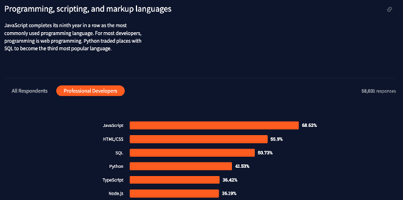

> 2) https://insights.stackoverflow.com/survey/2021#most-popular-technologies-language-prof

언어 자체가 급격한 성장을 겪으면서 그만큼 더 높은 보안 위협에 노출되는 위험도 뒤따랐다. 대표적인 공개 취약점 데이터베이스인 CVE 통계치를 살펴보면 자바스크립트가 본격적으로 독립적인 언어의 모습을 갖추기 시작한 2015년경부터 자바스크립트 엔진에서 많은 보안 취약점이 발견되기 시작했고 해마다 그 수준이 증가하고 있는 추세임을 확인 가능하다. 활용도가 높아지는 만큼 고려해야 할 보안적인 요소도 더욱 많아졌다고 볼 수 있다.

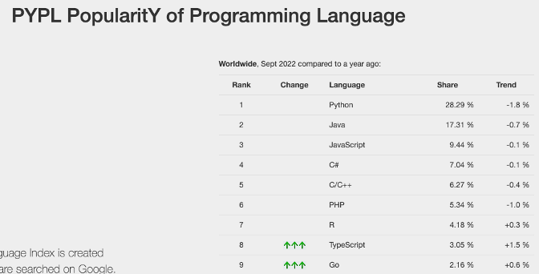

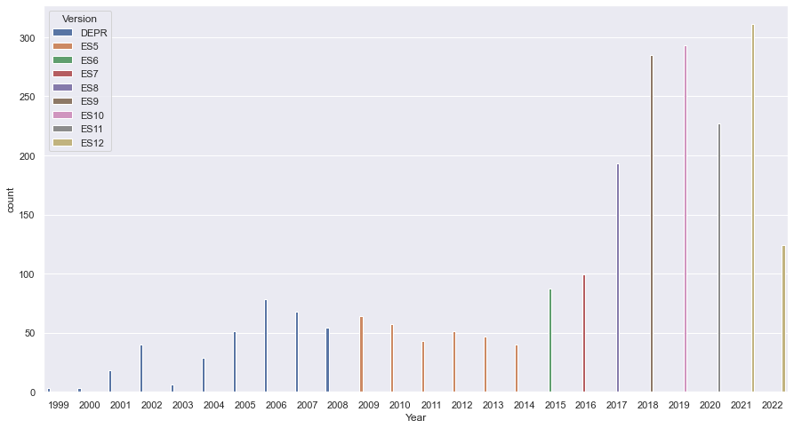

## 제3절 가이드 목적 및 구성

본 가이드는 소프트웨어 구현 단계에서 발생 가능한 보안약점 제거 기준을 토대로 안전한 자바스크립트 개발을 위한 가이드 및 지침을 제공한다. 언어 엔진 자체의 취약점은 가이드 범위에 포함하지 않으며, 개발자가 통제 가능한 영역 내에서 안전한 코드 작성을 돕는 것을 목표로 한다.

대부분 보안약점 항목은 웹 애플리케이션을 타겟으로 하고 있으며, 자바스크립트로 클라이언트측과 서버측 모두 개발이 가능한 점을 고려해 최대한 풀스택 상황에서의 보안 가이드를 모두 제시하는 것을 목표로 한다. 기본적으로 순수 자바스크립트 언어 예시를 제공하며, 해당되는 경우 클라이언트 측 코드 예시는 ReactJS를, 서버 측 코드 예시는 NodeJS 기반 ExpressJS 예시 코드를 포함했다. 기본적으로 클라이언트 측 코드는 공격자가 충분한 리소스만 투입한다면 분석 및 변조가 가능하므로, 안전한 클라이언트 측 코드가 제시된 항목의 경우에도 반드시 서버측 보안 기능을 반드시 적용해야 함을 주의해야 한다.

**구성**

- (1장) 자바스크립트 개발보안 가이드 개발 배경 및 목적
- (2장) 자바스크립트 언어 기반 구현단계 보안약점 제거 기준 설명
  - 구현단계 보안약점 제거 기준 항목(49개) 중 42개에 대해 소개

| 유형 | 주요 내용 |
|------|-----------|
| 입력데이터 검증 및 표현 | SQL 삽입, 코드 삽입, 경로 조작 및 자원 삽입 등 13개 항목 ※ (4개 항목 제외) (정수형/메모리 버퍼) 오버플로우, HTTP 응답분할, 포맷 스트링 삽입 |
| 보안기능 | 적절한 인증 없는 중요 기능 허용, 부적절한 인가 등 16개 항목 |
| 시간 및 상태 | 종료되지 않는 반복문 또는 재귀함수 1개 항목 ※ (1개 항목 제외) 경쟁조건: 검사 시점과 사용 시점(TOCTOU) |
| 에러처리 | 오류 메시지 정보노출, 오류상황 대응 부재 등 3개 항목 |
| 코드오류 | Null Pointer 역참조, 부적절한 자원 해제 등 3개 항목 ※ (2개 항목 제외) 해제된 자원 사용, 초기화되지 않은 변수 사용 |
| 캡슐화 | 잘못된 세션에 의한 데이터 정보노출 등 4개 항목 |
| API 오용 | DNS lookup에 의한 보안결정 2개 항목 |

- (3장) 구현단계 보안약점 제거 기준 및 용어 설명

---

# 제2장 시큐어코딩 가이드

## 제1절 입력데이터 검증 및 표현

프로그램 입력값에 대한 검증 누락 또는 부적절한 검증, 데이터의 잘못된 형식지정, 일관되지 않은 언어셋 사용 등으로 인해 발생되는 보안약점으로 SQL 삽입, 크로스사이트 스크립트(XSS) 등의 공격을 유발할 수 있다.

### 1. SQL 삽입

> VanillaJS: - / ReactJS: - / ExpressJS: O

#### 가. 개요

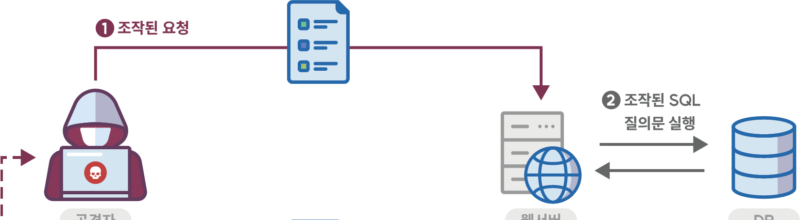

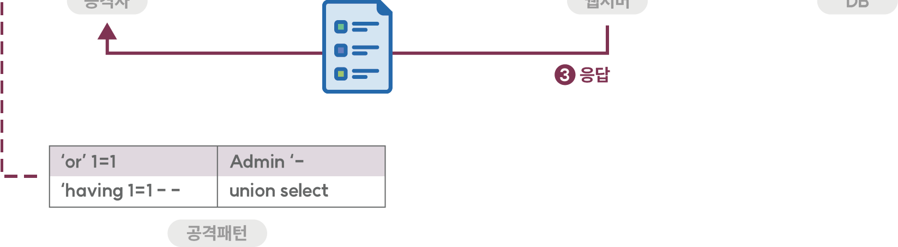

데이터베이스(DB)와 연동된 웹 응용프로그램에서 입력된 데이터에 대한 유효성 검증을 하지 않을 경우 공격자가 입력 폼 및 URL 입력란에 SQL 문을 삽입하여 DB로부터 정보를 열람하거나 조작할 수 있는 보안약점을 말한다. 취약한 웹 응용프로그램에서는 사용자로부터 입력된 값을 검증 없이 넘겨받아 동적쿼리(Dynamic Query)를 생성하기 때문에 개발자가 의도하지 않은 쿼리가 실행되어 정보유출에 악용될 수 있다.

자바스크립트에서는 관계형 데이터베이스, NoSQL 등 다양한 유형의 데이터베이스 시스템과 상호작용할 수 있는 라이브러리를 제공하며 크게 세 가지 유형의 방식을 사용할 수 있다.

- 데이터베이스 드라이버 : 클라이언트와 커넥터를 사용해 데이터베이스와 직접 상호작용 ex) mysql
- 쿼리 빌더(Query builder) : 데이터베이스 클라이언트보다 한 단계 높은 계층에서 동작하며, 자바스크립트 코드로 쿼리 데이터를 생성하고 데이터베이스와 상호작용 할 수 있음 ex) Knex.js
- ORM(Object Relational Mapping) : 개발자가 데이터베이스를 추상화된 객체 형식으로 다룰 수 있게 해주는 데이터베이스 툴킷 ex) Sequelize

데이터베이스 드라이버를 사용할 경우 개발자가 직접 쿼리 문자열을 정의하고 그 결과를 그대로 데이터베이스에 질의하게 되는데, 이 경우 검증되지 않은 외부 입력값으로 인한 SQL 삽입 공격이 발생할 수 있다. ORM을 사용하는 경우에도 복잡한 조건의 쿼리문 생성 어려움, 성능 저하 등의 이유로 ORM에서 지원하는 원시 쿼리 기능을 사용하면 공격에 취약해질 수 있다. SQL 인젝션 공격은 데이터베이스와 직접 상호작용하는 서버 측 코드에서만 발생할 수 있다.

#### 나. 안전한 코딩기법

사용자 입력값으로 쿼리를 생성하는 경우 쿼리 빌더를 사용해 SQL 인젝션 공격을 방어할 수 있다. 입력값 검증은 사용자가 전달한 값이 쿼리문 구성에 필요한 정보를 가지는지 검증하는 화이트리스트 기반 방식으로 구현이 간단하지만, 특수 문자를 필요로 하는 상황이나 복잡한 동적 쿼리의 경우 데이터베이스 구조에 따라 필터링 규칙을 조금씩 변형해야 하며 부득이한 경우 공격에 사용되는 문자를 필터링해서는 안 되는 경우가 발생할 수 있다.

데이터베이스 드라이버를 사용하거나 ORM에서 지원하는 원시 쿼리기능 사용 시 인자화된 쿼리를 통해 외부 입력값을 바인딩해서 사용하면 SQL 삽입 공격으로부터 안전하게 보호할 수 있다. 인자화된 쿼리는 사용자가 전달한 입력값을 그대로 쿼리 문자열로 만들지 않고 DB API에서 제공하는 기능을 사용해 쿼리 내에 사용자 입력값을 구성하는 방법을 의미한다. 인자화된 쿼리를 사용하면 사용자가 전달한 값을 그대로 쿼리에 사용하지 않고 미리 컴파일 된 쿼리 템플릿에 값을 삽입하는 방법을 사용해 입력값으로 인한 쿼리 조작이 불가능하게 된다.

#### 다. 코드예제

**가) 데이터베이스 드라이버 사용 예제**

다음은 사용자 입력값을 받아 원시 쿼리를 구성해 처리 하는 안전하지 않은 코드 예시를 보여 준다. 클라이언트에서 GET 요청의 인자로 전달된 id 값을 검증 없이 그대로 쿼리에 삽입하므로 공격자가 정상적인 정수형 id 값 대신 `'1 UNION SELECT group_concat(table_name) FROM information_schema.tables WHERE table_schema = database();'` 와 같은 공격문을 전달할 경우 데이터베이스 내의 모든 테이블 이름이 조회되고 이는 곧 공격자가 원하는 모든 쿼리를 실행 가능하다는 의미로 해석될 수 있다.

**안전하지 않은 코드**

```javascript
const mysql = require("mysql");
// 커넥션 초기화 옵션은 생략함
const connection = mysql.createConnection(...);
router.get("/vuln/email", (req, res) => {
  const con = connection;
  const userInput = req.query.id;
  // 사용자로부터 입력받은 값을 검증 없이 그대로 쿼리에 사용
  const query = `SELECT email FROM user WHERE user_id = ${userInput}`;
  con.query(query,
    (err, result) => {
      if (err) console.log(err);
      return res.send(result);
    }
  );
});
```

데이터베이스 라이브러리가 인자화된 쿼리 기능을 지원할 경우 해당 기능을 사용해 쿼리를 생성해야 한다. mysql 라이브러리에서는 인자화된 쿼리 기능은 제공하지 않지만 '?' 형식으로 유사한 기능을 구현할 수 있다. 다음은 위 코드를 안전한 코드로 변환한 예시를 보여준다.

**안전한 코드**

```javascript
const mysql = require("mysql");
...
router.get("/patched/email", (req, res) => {
  const con = connection;
  const userInput = req.query.id;
  const query = 'SELECT email FROM user WHERE user_id = ?';
  // 쿼리 함수에 사용자 입력값을 매개변수 형태로 전달, 이렇게 작성하면 사용자 입력값에
  // escape 처리를 한 것과 동일한 결과가 실행
  con.query(query, userInput,
    (err, result) => {
      if (err) console.log(err);
      return res.send(result);
    }
  );
});
```

**나) ORM 사용 예제**

ExpressJS에서 가장 일반적으로 사용하는 ORM 라이브러리인 Sequealize에서는 쿼리 인자화를 사용해 쿼리를 구성하기 때문에 SQL 삽입 공격으로부터 안전하다. 부득이하게 원시 SQL 또는 사용자 정의 SQL을 사용할 경우에도 외부 입력값을 인자화된 쿼리의 바인딩 변수로 사용하면 된다.

다음 코드는 ORM에서 지원하는 인자화된 쿼리 기능을 사용하지 않고 사용자 입력값을 그대로 쿼리에 삽입해 사용하는 예시를 보여 준다. 취약점 발생 원인과 가능한 공격 범위는 앞서 살펴본 mysql 취약 코드 예시와 동일하다.

**안전하지 않은 코드**

```javascript
const mysql = require("mysql");
const Sequelize = require("sequelize");
const { QueryTypes } = require("sequelize");
// 커넥션 및 ORM 초기화 옵션은 생략함
const connection = mysql.createConnection(...);
const sequelize = new Sequelize(...);
router.get("/vuln/orm/email", (req, res) => {
  const userInput = req.query.id;
  // 사용자로부터 입력받은 값을 검증 없이 그대로 쿼리에 사용
  const query = `SELECT email FROM user WHERE user_id = ${userInput}`;
  sequelize.query(query, { type: QueryTypes.SELECT })
    .then((result) => {
      return res.send(result);
    }).catch((err) => {
      console.log(err);
    });
});
```

다음 코드에서는 원시 코드 실행 시에도 인자화된 쿼리와 인자를 바인딩 후 사용하는 안전한 예시를 보여 준다. 쿼리에 삽입할 값은 $number로 구분한다(예를 들어, 쿼리 구성에 사용하는 사용자 입력값이 두 개인 경우 각각 $1, $2 지시어 사용).

**안전한 코드**

```javascript
....
router.get("/vuln/orm/email", (req, res) => {
  const userInput = req.query.id;
  // 쿼리 내에서 바인딩이 필요한 부분을 $number로 표기
  const query = `SELECT email FROM user WHERE user_id = $1`;
  // 인자화된 쿼리 기능을 통해 쿼리를 생성 및 실행
  sequelize.query(query, 
    { 
      bind: [userInput],
      type: QueryTypes.SELECT
    })
    .then((result) => {
      return res.send(result);
    }).catch((err) => {
      console.log(err);
    });
});
```

#### 라. 참고자료

- [CWE-89: Improper Neutralization of Special Elements used in an SQL Command ('SQL Injection'), MITRE](https://cwe.mitre.org/data/definitions/89.html)
- [SQL Injection Prevention Cheat Sheet, OWASP](https://cheatsheetseries.owasp.org/cheatsheets/SQL_Injection_Prevention_Cheat_Sheet.html)
- [The Javascript Guide: Web Application Secure Coding Practices](https://github.com/Checkmarx/JS-SCP/blob/master/dist/js-webapp-scp.pdf)
- [JavaScript Secure Coding Standard - Ministry of Transport and Communications](https://compliance.qcert.org/sites/default/files/library/2018-10/MOTC-CIPD_JavaScript_Coding_Standard(US).pdf)
- [Raw Queries, Sequelize](https://sequelize.org/docs/v6/core-concepts/raw-queries/)
- [mysql, npm](https://www.npmjs.com/package/mysql)
- [SQL Expression Language Tutorial, SQLAlchemy](https://docs.sqlalchemy.org/en/14/core/tutorial.html#using-textual-sql)

---

### 2. 코드 삽입

> VanillaJS: - / ReactJS: - / ExpressJS: O

#### 가. 개요

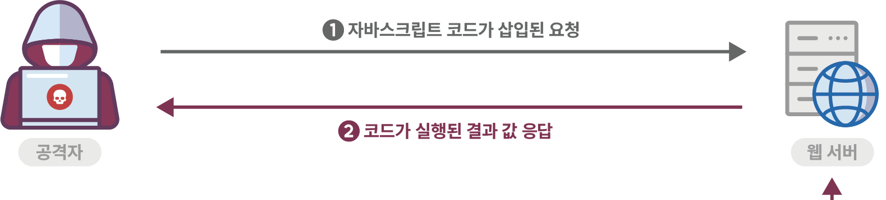

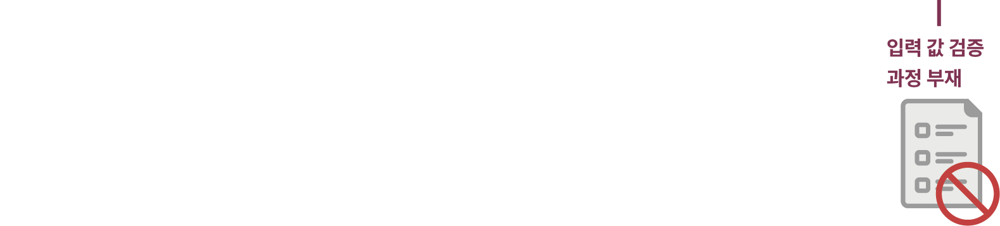

공격자가 소프트웨어의 의도된 동작을 변경하도록 임의 코드를 삽입해 소프트웨어가 비정상적으로 동작하도록 하는 보안약점을 말한다. 코드 삽입은 프로그래밍 언어 자체의 기능에 한해 이뤄진다는 점에서 운영체제 명령어 삽입과 다르다. 프로그램에서 사용자의 입력값 내에 코드가 포함되는 것을 허용할 경우 공격자는 개발자가 의도하지 않은 코드를 실행해 권한을 탈취하거나 인증 우회, 시스템 명령어 실행 등으로 이어질 수 있다.

자바스크립트에서 코드 삽입 공격을 유발할 수 있는 함수로는 eval(), setTimeOut(), setInterval() 등이 있다. 해당 함수의 인자를 면밀히 검증하지 않는 경우 공격자가 전달한 코드가 그대로 실행될 수 있다. 브라우저 위에서 동작하는 클라이언트측 환경에서는 주요 자원을 포함하는 서버와 달리 코드 삽입 자체만으로는 위협이 되지 않는다.

#### 나. 안전한 코딩기법

동적 코드를 실행할 수 있는 함수를 사용하지 않는다. 필요 시 실행 가능한 동적 코드를 입력값으로 받지 않도록 외부 입력값에 대해 화이트리스트 기반 검증을 수행해야 한다. 유효한 문자만 포함하도록 동적 코드에 사용되는 사용자 입력값을 필터링 하는 방법도 있다. 또한, 데이터와 명령어를 엄격히 분리해 처리하는 별도의 로직을 구현할 수도 있다.

#### 다. 코드예제

다음은 안전하지 않은 코드로 eval()을 사용해 사용자로부터 입력받은 값을 실행하여 결과를 반환 하는 예제다. 외부로부터 입력 받은 값을 아무런 검증 없이 eval() 함수의 인자로 사용하고 있다. 외부 입력값을 검증 없이 사용할 경우 공격자는 자바스크립트 코드를 통해 악성 기능 실행을 위한 라이브러리 로드 및 원격 대화형 쉘 등을 실행할 수도 있다.

**안전하지 않은 코드**

```javascript
const express = require('express');
router.post("/vuln/server", (req, res) => {
  // 사용자로부터 전달 받은 값을 그대로 eval 함수의 인자로 전달
  const data = eval(req.body.data);
  return res.send({ data });
});
```

다음은 안전한 코드로 변환한 예제를 보여 준다. 외부 입력값 내에 포함된 특수문자 등을 필터링 하는 사전 검증 코드를 추가하면 코드 삽입 공격 위험을 완화할 수 있다. 만약 부득이하게 클라이언트 요청으로 코드 실행을 해야 하는 경우 화이트리스트 기반 필터링을 통해 실행이 허용된 명령어가 포함된 입력값만 함수의 인자로 전달해야 한다.

**안전한 코드**

```javascript
const express = require('express');
function alphanumeric(input_text) {
  // 정규표현식 기반 문자열 검사
  const letterNumber = /^[0-9a-zA-Z]+$/;
  if (input_text.match(letterNumber)) {
    return true;
  } else { 
    return false; 
  }
}
  
router.post("/patched/server", (req, res) => {
  let ret = null;
  const { data } = req.body;
  // 사용자 입력을 영문, 숫자로 제한하며, 만약 입력값 내에 특수문자가 포함되어 
  // 있을 경우 에러 메시지를 반환
  if (alphanumeric(data)) {
    ret = eval(data);
  } else {
    ret = 'error';
  }
  return res.send({ ret });
});
```

#### 라. 참고자료

- [CWE-94: Improper Control of Generation of Code ('Code Injection'), MITRE](https://cwe.mitre.org/data/definitions/94.html)
- [CWE-95: Improper Neutralization of Directives in Dynamically Evaluated Code ('Eval Injection'), MITRE](https://cwe.mitre.org/data/definitions/95.html)
- [Code Injection, OWASP](https://owasp.org/www-community/attacks/Code_Injection)
- [JavaScript: HTML Form - checking for numbers and letters](https://www.w3resource.com/javascript/form/letters-numbers-field.php)
- [The Javascript Guide: Web Application Secure Coding Practices](https://github.com/Checkmarx/JS-SCP/blob/master/dist/js-webapp-scp.pdf)
- [NodeJs-Secure Code wiki](https://securecode.wiki/docs/lang/nodejs/)

---

### 3. 경로 조작 및 자원 삽입

> VanillaJS: - / ReactJS: - / ExpressJS: O

#### 가. 개요

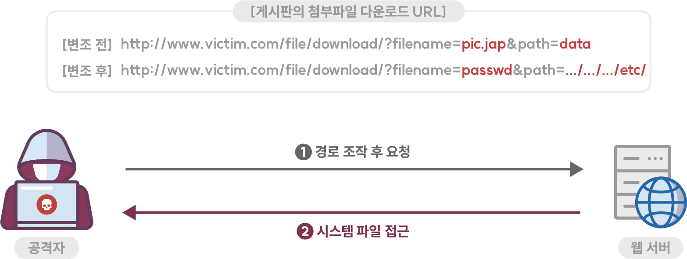

검증되지 않은 외부 입력값을 통해 파일 및 서버 등 시스템 자원(파일, 소켓의 포트 등)에 대한 접근 혹은 식별을 허용할 경우 입력값 조작으로 시스템이 보호하는 자원에 임의로 접근할 수 있는 보안약점이다. 경로조작 및 자원삽입 약점을 이용해 공격자는 자원 수정·삭제, 시스템 정보누출, 시스템 자원 간 충돌로 인한 서비스 장애 등을 유발시킬 수 있다. 또한 경로 조작 및 자원 삽입을 통해서 공격자가 허용되지 않은 권한을 획득해 설정 파일을 변경하거나 실행시킬 수 있다.

기본적으로, 클라이언트측 자바스크립트에서는 외부 입력값을 기반으로 하는 호스트 시스템의 프로세스 제어, 파이프 상호작용, 소켓 연결 등을 특별한 경우가 아니면 거의 사용하지 않으며, 사용하는 경우라도 코드 실행 위치가 사용자 시스템이므로 경로 조작이나 자원 삽입과 같은 위협이 큰 의미를 가지지 못한다. NodeJS 기반 서버 프로그램의 경우 fs 및 socket.io 라이브러리를 통해 프로세스 및 소켓 연결을 제어할 수 있다.

#### 나. 안전한 코딩기법

외부로부터 받은 입력값을 자원(파일, 소켓의 포트 등)의 식별자로 사용하는 경우 적절한 검증을 거치도록 하거나 사전에 정의된 리스트에 포함된 식별자만 사용하도록 해야 한다. 특히, 외부의 입력이 파일명인 경우에는 필터를 적용해 경로순회(directory traversal) 공격의 위험이 있는 문자( /, \, .. 등)를 제거해야 한다.

#### 다. 코드예제

**가) 경로 조작 예제**

다음은 외부 입력값으로 파일 경로 등을 입력받아 파일을 여는 예시를 보여 준다. 만약 공격자가 `'../../../../etc/passwd'` 와 같은 값을 전달하면 사용자 계정 및 패스워드 정보가 담긴 파일의 내용이 클라이언트 측에 표시되어 의도치 않은 시스템 정보노출 문제가 발생한다.

**안전하지 않은 코드**

```javascript
const express = require('express');
const path = require('path');
router.get("/vuln/file", (req, res) => {
  // 외부 입력값으로부터 파일명을 입력 받음
  const requestFile = req.query.file;
  // 입력값을 검증 없이 파일 처리에 사용
  fs.readFile(path.resolve(__dirname, requestFile), 'utf8', function(err, data) {
    if (err) {
      return res.send('error');
    }
    return res.send(data);
  })
});
```

외부 입력값에서 경로 조작 문자열( /, \, .. 등)을 제거한 후 파일의 경로 설정에 사용하면 코드를 안전하게 만들 수 있다.

**안전한 코드**

```javascript
const express = require('express');
const path = require('path');
router.get("/patched/file", (req, res) => {
  const requestFile = req.query.file;
  // 정규표현식을 사용해 사용자 입력값을 필터링
  const filtered = requestFile.replace(/[.\\\/]/gi, '');
  fs.readFile(filtered, 'utf8', function(err, data) {
    if (err) {
      return res.send('error');
    }
    return res.send(data);
  })
});
```

**나) 자원 삽입 예제**

다음은 안전하지 않은 코드 예시로, 외부 입력을 소켓 연결 주소로 그대로 사용하고 있다. 외부 입력값을 검증 없이 사용할 경우 기존 자원과의 충돌로 의도치 않은 에러가 발생할 수 있다.

**안전하지 않은 코드**

```javascript
const express = require('express');
const io = require("socket.io");
router.get("/vuln/socket", (req, res) => {
  try {
    // 외부로부터 입력받은 검증되지 않은 주소를 이용하여 
    // 소켓을 바인딩 하여 사용하고 있어 안전하지 않음
    const socket = io(req.query.url);
    return res.send(socket);
  } catch (err) {
    return res.send("[error] fail to connect");
  }
});
```

다음은 안전한 예제를 보여 준다. 내부 자원에 접근 시 외부에서 입력 받은 값을 소켓 연결 주소와 같은 식별자로 그대로 사용하는 것은 바람직하지 않으며, 꼭 필요한 경우엔 허용 가능한 목록을 설정한 후 목록 내에 포함된 주소만 연결을 허용하도록 코드를 작성해야 한다.

**안전한 코드**

```javascript
const express = require('express');
const io = require("socket.io");
router.get("/patched/socket", (req, res) => {
  // 화이트리스트 내에 속하는 주소만 허용
  const whitelist = ["ws://localhost", "ws://127.0.0.1"];
  if (whitelist.indexOf(req.query.url) < 0) {
    return res.send("wrong url");
  }
  try {
    const socket = io(req.query.url);
    return res.send(socket);
  } catch (err) {
    return res.send("[error] fail to connect");
  }
});
```

#### 라. 참고자료

- [CWE-22: Improper Limitation of a Pathname to a Restricted Directory ('Path Traversal'), MITRE](https://cwe.mitre.org/data/definitions/22.html)
- [CWE-99: Improper Control of Resource Identifiers ('Resource Injection'), MITRE](https://cwe.mitre.org/data/definitions/99.html)
- [Path Traversal, OWASP](https://owasp.org/www-community/attacks/Path_Traversal)
- [Resource Injection, OWASP](https://owasp.org/www-community/attacks/Resource_Injection)
- [Fortify Taxonomy: Software Security Errors](https://vulncat.fortify.com/en/detail?id=desc.dataflow.java.resource_injection#JavaScript%2FTypeScript)
- [socket.io](https://socket.io/docs/v4/)

---

### 4. 크로스사이트 스크립트(XSS)

> VanillaJS: O / ReactJS: O / ExpressJS: O

#### 가. 개요

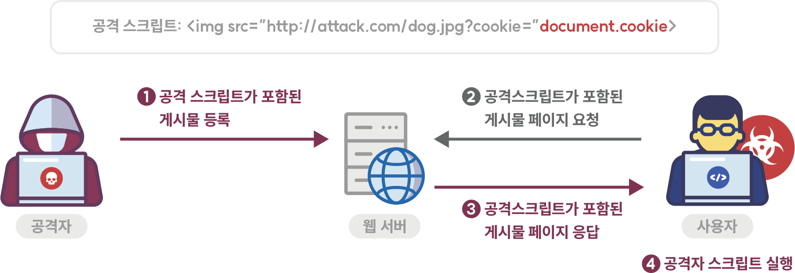

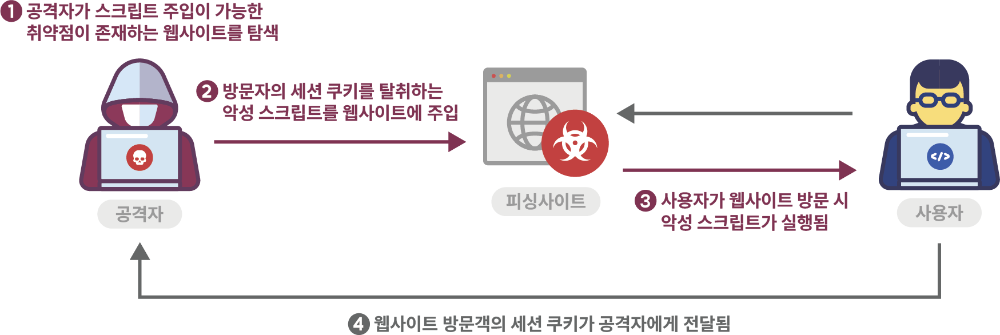


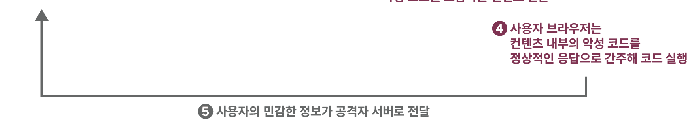

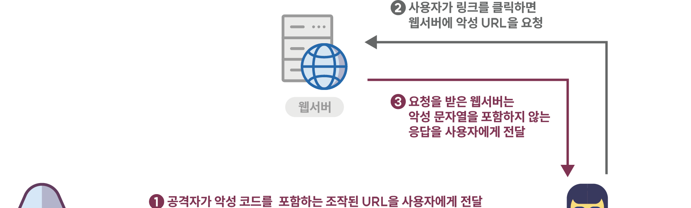

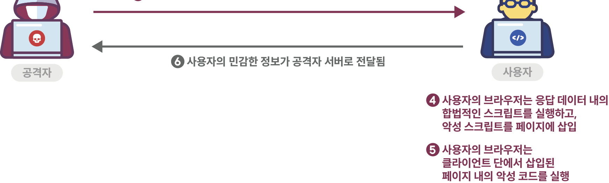

크로스사이트 스크립트 공격(Cross-site scripting Attacks)은 웹사이트에 악성코드를 삽입하는 공격 방법이다. 공격자는 대상 웹 응용프로그램의 결함을 이용해 악성코드(일반적으로 클라이언트 측 자바스크립트 사용)를 사용자에게 보낸다. XSS 공격은 일반적으로 애플리케이션 호스트 자체보다 사용자를 목표로 삼는다.

XSS는 공격자가 웹 응용프로그램을 속여 브라우저에서 실행될 수 있는 형식의 데이터(코드)를 다른 사용자에게 전달할 때 발생한다. 공격자가 임의로 구성한 기본 웹 코드 외에도 악성코드 다운로드, 플러그인 또는 미디어 콘텐츠를 이용할 수도 있다. 사용자가 폼 양식에 입력한 데이터 또는 서버에서 클라이언트 단말(브라우저) 전달된 데이터가 적절한 검증 없이 사용자에게 표시되도록 허용되는 경우 발생한다.

XSS 공격에는 크게 세 가지 유형의 방식이 있다.

- **유형 1 : Reflective XSS (or Non-persistent XSS)**
  - Reflective XSS는 공격 코드를 사용자의 HTTP 요청에 삽입한 후 해당 공격 코드를 서버 응답 내용에 그대로 반사(Reflected)시켜 브라우저에서 실행하는 공격 기법이다. Reflective XSS 공격을 수행하려면 사용자로 하여금 공격자가 만든 서버로 데이터를 보내도록 해야 한다. 이 방법은 보통 악의적으로 제작된 링크를 사용자가 클릭하도록 유도하는 방식을 수반한다. 공격자는 피해자가 취약한 사이트를 참조하는 URL을 방문하도록 유도하고 피해자가 링크를 방문하면 스크립트가 피해자의 브라우저에서 자동으로 실행된다. 대부분의 경우 Reflective XSS 공격 메커니즘은 공개 게시판, 피싱(Phishing) 이메일, 단축 URL 또는 실제와 유사한 URL을 사용한다.

- **유형 2 : Persistent XSS (or Stored XSS)**
  - Persistent XSS는 신뢰할 수 없거나 확인되지 않은 사용자 입력(코드)이 서버에 저장되고, 이 데이터가 다른 사용자들에게 전달될 때 발생한다. Persistent XSS는 게시글 및 댓글 또는 방문자 로그 기능에서 발생할 수 있다. 해당 기능을 통해 공격자의 악성 콘텐츠를 다른 사용자들이 열람할 수 있다. 소셜 미디어 사이트 및 회원 그룹에서 흔히 볼 수 있는 것과 같이 공개적으로 표시되는 프로필 페이지는 Persistent XSS의 대표적인 공격 대상 중 하나다. 공격자는 프로필 입력 폼에 악성 스크립트를 주입해 다른 사용자가 프로필을 방문하면 브라우저에서 자동으로 코드가 실행되도록 할 수 있다.

- **유형 3 : DOM XSS (or Client-Side XSS)**
  - DOM XSS은 웹 페이지에 있는 사용자 입력값을 적절하게 처리하기 위한 자바스크립트의 검증 로직을 무효화 하는 것을 목표로 한다. 공격 스크립트가 포함된 악성 URL을 통해 전달된다는 관점에서 Reflective XSS와 유사하다고 볼 수 있다. 그러나 신뢰할 수 있는 사이트의 HTTP 응답에 페이로드를 포함하는 대신 DOM 또는 문서 개체 모델을 수정해 브라우저와 독립적인 공격을 실행한다는 점에서 차이가 있다.
  - 공격자는 DOM XSS 공격을 통해 세션 및 개인 정보를 포함한 쿠키 데이터를 피해자의 컴퓨터에서 공격자 시스템으로 전송할 수 있다. 이 정보를 사용해 특정 웹사이트에 악의적인 요청을 보낼 수 있으며 피해자가 해당 사이트를 관리 할 수 있는 관리자 권한이 있는 경우 심각한 위협을 초래할 수도 있다. 또한 신뢰할 수 있는 웹 사이트를 모방하고 피해자가 암호를 입력하도록 속여 공격자가 해당 웹 사이트에서 피해자의 계정을 손상시키는 피싱(Phishing) 공격으로도 이어질 수 있다.

웹 서비스 개발에 사용되는 다른 언어와 달리 자바스크립트는 클라이언트측 코드와 서버측 코드 모두 개발이 가능한 언어로, XSS 공격 예방을 위해 클라이언트와 서버 양쪽 모두를 고려해야 한다. 서버가 생성한 HTML 응답 데이터 내에 신뢰할 수 없는 데이터가 포함되거나 위험한 자바스크립트 호출을 통해 DOM을 업데이트 하는데 사용되는 입력값이 전달될 경우 XSS 공격이 발생하게 된다.

#### 나. 안전한 코딩기법

외부 입력값 또는 출력값에 스크립트가 삽입되지 못하도록 문자열 치환 함수를 사용하여 `&<>*'/()` 등을 `&amp; &lt; &gt; &quot; &#x27; &#x2F; &#x28; &#x29;`로 치환하거나 자바스크립트 라이브러리에서 제공하는 escape 기능을 사용해 문자열을 변환해야 한다. 자바스크립트에서 기본적으로 제공하는 escape() 함수는 deprecated되어 더 이상 사용을 권장하지 않고 있으며, 그 대신 encodeURI() 또는 encodeURIComponent() 함수를 사용하면 된다. HTML 태그를 허용해야 하는 게시판에서는 허용할 HTML 태그들을 화이트리스트로 만들어 해당 태그만 지원하도록 한다.

XSS 방어 코드는 클라이언트측과 서버측에 모두 적용해야 한다. 물론 클라이언트측 코드는 공격자가 중간에 가로채 변조하거나 코드를 수정할 수 있지만 서버로 데이터가 넘어가기 전 1차적인 방어선 역할을 해줄 수 있다. 클라이언트측 코드를 조작하더라도 서버에서 사용자 입력값을 검증하면 XSS 공격을 예방할 수 있다. 마지막으로 서버로부터 가져온 데이터를 클라이언트측에서 다시 사용자에게 보여줄 때 코드가 포함된 내용일 경우에도 공격에 사용되는 문자열을 필터링해야 한다.

#### 다. 코드예제

**가) 클라이언트측 VanillaJS 예제**

클라이언트측 코드 내에 사용자가 전달한 입력값을 코드 실행의 일부분으로 사용하거나 사용자가 작성한 텍스트 내부의 스크립트 코드를 실행할 수 있는 기능이 제공될 경우 XSS 공격이 발생할 수 있다. 다음 예제는 사용자가 폼 또는 에디터로 작성한 내용을 서버에 저장하고 저장된 내용을 다시 서버로부터 받아와 DOM에 출력하는 예시를 보여 준다. 이 때, 서버로부터 받은 데이터를 검증 없이 그대로 사용할 경우 악성 스크립트가 실행될 수 있다.

**안전하지 않은 코드**

```html
<html>
<body>
  <script>
    const query = "<script>alert('hello world')<"+"/script>";
    async function req() {
      // 사용자가 에디터와 같은 입력 폼에 입력한 데이터를 서버에 저장
      const response = await fetch(`/vuln/search?q=${query}`, { method: 'GET' })
      const data = await response.text();
      // 외부로부터 받은 데이터(HTML 코드)를 아무런 검증 없이 DOM으로 기록
      document.write(data);
    }
    req();
  </script>
</body>
</html>
```

자바스크립트에서는 encodeURI(), encodeURIComponent() 함수를 통해 이스케이프 기능을 제공한다. 외부로부터 받은 데이터를 사용해 DOM에 변화를 주는 코드가 실행되기 전에 입력값을 이스케이프 해주면 XSS 공격을 막을 수 있다. 이스케이프 후 decodeURI() 함수를 호출해야 스크립트 실행 방지와 함께 원하는 결과를 DOM에 출력할 수 있다.

**안전한 코드 1 (내장함수 사용)**

```html
<html>
<body>
  <script>
    const query = "<script>alert('hello world')<"+"/script>";
    async function req() {
      const response = await fetch(`/vuln/search?q=${query}`, { method: 'GET' })
      const data = await response.text(); 
      // 외부로부터 받은 데이터를 이스케이프 처리 후 사용
      document.write(decodeURI(encodeURIComponent(data)));
    }
    req();
  </script>
</body>
</html>
```

encodeURIComponent 함수는 내장 함수로 사용이 쉽고 가볍다는 장점이 있지만 모든 XSS 공격 패턴에 대응할 수는 없다. 따라서 XSS 검증을 위한 별도의 필터링 함수를 구현하거나 개발자 커뮤니티에서 널리 사용되고 안정적이며 지속적으로 관리되고 있는 라이브러리를 사용해 문자열을 변환해야 한다. 아래 예시는 xss-filters 라이브러리를 활용한 필터링 사례를 보여 준다.

**안전한 코드 2 (라이브러리 사용)**

```html
<html>
  <head>
    <script src="https://cdn.rawgit.com/yahoo/xss-filters/master/dist/xss-filters.js"></script>
  </head>
  <body>
    <script>
      async function req() {
      ...
        // xss-filters 라이브러리를 사용해 문자열을 이스케이프 처리
        document.write(xssFilters.inHTMLData(data));
      }
      req();
    </script>
  </body>
</html>
```

**나) 클라이언트측 ReactJS 예제**

ReactJS에서는 JSX(타입스크립트에서는 TSX) 확장자를 가지는 리액트 엘리먼트를 통해 코드를 처리한다. 기본적으로 React DOM은 JSX 렌더링 전에 코드 내의 모든 값을 이스케이프 처리한다. 다시 말해서 리액트 애플리케이션 내에서 명시적으로 악성 스크립트를 주입하는 것은 불가능하다. ReactJS에서 강제하는 규칙을 따르는 것만으로도 클라이언트측 XSS 공격을 방어할 수 있다.

하지만 ReactJS는 HTML 입력값을 그대로 렌더링할 수 있는 dangerouslySetInnerHTML 함수를 제공한다. 만약 개발자가 사용자 게시글 표현 등을 위해 이 함수를 사용할 경우 XSS 공격에 노출될 수 있다.

**안전하지 않은 코드**

```javascript
function possibleXSS() {
  return {
   __html:
     '
      </img>',
    };
  }
  
const App = ( ) => (
  // XSS에 취약한 함수를 사용해 HTML 코드 데이터를 렌더링
  <div dangerouslySetInnerHTML={possibleXSS()} />
);
ReactDOM.render(<App />, document.getElementById("root"));
```

가급적이면 dangerouslySetInnerHTML 함수를 사용하지 않는 것이 좋겠지만 서비스 개발을 위해 부득이하게 사용이 필요한 경우 HTML 및 자바스크립트 코드를 직접 이스케이프 처리하는 컴포넌트를 별도로 개발하거나 dompurify와 같이 이스케이프 기능을 제공하는 라이브러리를 사용해 문자열 처리 후 사용해야 한다.

**안전한 코드**

```javascript
<script src="https://cdnjs.cloudflare.com/ajax/libs/dompurify/2.4.0/purify.min.js"></script>
...
function possibleXSS() {
  return {
   __html:
    // dompurify 라이브러리를 사용해 입력값을 이스케이프 처리
    DOMPurify.sanitize('</img>'),
   };
}
const App = ( ) => (
  <div dangerouslySetInnerHTML={possibleXSS()} />
);
ReactDOM.render(<App />, document.getElementById("root"));
```

**다) 서버측 ExpressJS 예제**

클라이언트측에서 사용자 입력값을 검증 및 이스케이프 처리했다고 하더라도 반드시 서버측에서도 검증 코드를 추가해야 한다. 게시판, 고객 문의와 같이 사용자로부터 다양한 형식의 데이터를 입력받아야 하는 경우 사용자가 입력한 텍스트뿐만 아니라 텍스트를 둘러싸고 있는 HTML 및 자바스크립트 코드도 함께 서버에 저장하게 된다. 이 때 사용자가 입력한 데이터를 서버측에서 검증 없이 데이터베이스에 저장할 경우 해당 게시글 또는 문의글을 열람하는 모든 사용자의 시스템에서 악성 스크립트가 실행될 수 있다. 다음은 사용자로부터 검색 대상을 전달받아 그 결과를 반환하는 취약한 예시를 보여 준다.

**안전하지 않은 코드**

```javascript
const express = require('express');
router.get("/vuln/search", (req, res) => {
  // 사용자로부터 전달 받은 쿼리 데이터로 데이터 조회
  const results = selectFromDB(req.query.q);
  if (results.length === 0) {
    // 검색 결과가 발견되지 않을 경우, '요청한 값'을 찾지 못했다는 메시지를 반환하는데,
    // 이 때 정상적인 질의문이 아닌 악성 스크립트가 포함된 데이터를 입력 받은 경우라면
    // 클라이언트측에서 악성 스크립트가 실행될 수 있음
    return res.send('<p>No results found for "' + req.query.q + '"</p>');
  } 
...
});
```

서버측에서 XSS 공격을 방어하는 방법은 클라이언트측과 동일하다. 사용자 입력값에 HTML 및 자바스크립트 코드가 포함되는 경우 XSS 공격에 사용되는 패턴을 필터링하는 별도의 함수를 구현하거나 라이브러리를 사용해 안전하게 처리한 후 데이터베이스에 저장하거나 사용자에게 다시 반환해 주어야 한다.

**안전한 코드**

```javascript
const express = require('express');
const xssFilters = require("xss-filters");
...
router.get("/patched/search", (req, res) => {
  const unsafeFirstname = req.query.q;
  // xss-filters 라이브러리를 사용해 사용자 입력값을 이스케이프 처리
  const safeFirstname = xssFilters.inHTMLData(unsafeFirstname);
  const results = selectFromDB(safeFirstname);
  
  if (results.length === 0) {
    res.send(util.format("<p>Hello %s</p>", safeFirstname));
  }
...
});
```

#### 라. 참고자료

- [CWE-79: Improper Neutralization of Input During Web Page Generation ('Cross-site Scripting'), MITRE](https://cwe.mitre.org/data/definitions/79.html)
- [Cross Site Scripting (XSS), OWASP](https://owasp.org/www-community/attacks/xss/)
- [encodeURIComponent, mdn web docs](https://developer.mozilla.org/ko/docs/Web/JavaScript/Reference/Global_Objects/encodeURIComponent)
- [The Javascript Guide: Web Application Secure Coding Practices](https://github.com/Checkmarx/JS-SCP/blob/master/dist/js-webapp-scp.pdf)
- [NodeJs-Secure Code wiki](https://securecode.wiki/docs/lang/nodejs/)

---

### 5. 운영체제 명령어 삽입

> VanillaJS: - / ReactJS: - / ExpressJS: O

#### 가. 개요

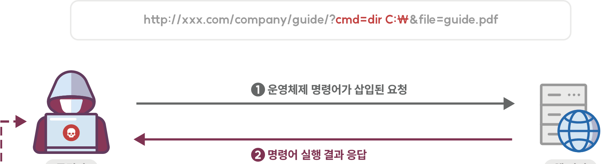

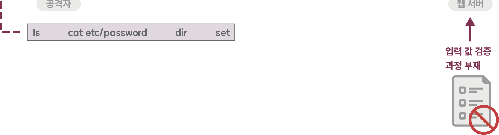

적절한 검증 절차를 거치지 않은 사용자 입력값이 운영체제 명령어의 일부 또는 전부로 구성되어 실행되는 경우 의도하지 않은 시스템 명령어가 실행돼 부적절하게 권한이 변경되거나 시스템 동작 및 운영에 악영향을 미칠 수 있다.

명령어 라인의 파라미터나 스트림 입력 등 외부 입력을 사용해 시스템 명령어를 생성 하는 프로그램을 많이 찾아볼 수 있다. 이 경우 프로그램 외부로부터 받은 입력 문자열은 기본적으로 신뢰할 수 없기 때문에 적절한 처리를 해주지 않으면 공격으로 이어질 수 있다.

NodeJS에서는 child_process 라이브러리를 사용해 코드 내부에서 시스템 명령어를 실행할 수 있다. 만약 시스템 명령어 실행 함수에 사용자가 입력한 값을 전달할 수 있고 그 값이 적절히 검증되지 않을 경우 패스워드 파일 조회, 시스템 프로세스 강제 종료 등 의도하지 않은 악의적인 명령어 실행으로 이어질 수 있다.

#### 나. 안전한 코딩기법

외부 입력값 내에 시스템 명령어를 포함하는 경우 `|, ;, &, :, >, <, \`(backtick), \, !` 과 같이 멀티라인 및 리다이렉트 문자 등을 필터링 하고 명령을 수행할 파일명과 옵션을 제한해 인자로만 사용될 수 있도록 해야 한다. 외부 입력에 따라 명령어를 생성하거나 선택이 필요한 경우에는 명령어 생성에 필요한 값들을 미리 지정해 놓고 사용해야 한다.

#### 다. 코드예제

다음 예제는 사용자에게 특정 경로의 파일 목록을 제공하는 프로그램 예시를 보여 준다. 만약 경로값 안에 파이프라인 명령어가 포함될 경우 악의적인 명령어가 실행될 수 있다 (ex: `/vuln?path=/usr/app | cat /etc/passwd`).

**안전하지 않은 코드**

```javascript
const express = require('express');
const child_process = require("child_process");
router.get("/vuln", (req, res) => {
  // 사용자가 입력한 명령어 인자값을 검증 없이 사용해 의도치 않은 추가 명령어 실행 가능
  child_process.exec("ls -l " + req.query.path, function (err, data) {
    return res.send(data);
  });
});
```

임의의 명령어 실행을 예방하려면 사용자가 입력한 값의 패턴을 검사해 허가되지 않은 패턴이 포함될 경우 기능을 실행하지 않거나 사용자 입력값 전체를 실행하고자 하는 명령어(예를 들어, 위 코드에서는 /bin/ls)의 인자로 간주해 사용하는 방법이 있다.

**안전한 코드**

```javascript
const express = require('express');
const child_process = require("child_process");
router.get("/patched", (req, res) => {
  const inputPath = req.query.path;
  const regPath = /^(\/[\w^]+)+\/?$/;
  // 첫 번째 방법, 사용자 입력값 필터링 - 리눅스 경로 지정에 필요한 문자만 허용
  if (!inputPath.match(regPath)) {
    return res.send('not valid path');
  }
  // 두 번째 방법, 사용자 입력값이 명령어의 인자로만 사용되도록 하는 함수 사용
  child_process.execFile(
    "/bin/ls", ["-l", inputPath],
    function (err, data) {
      if (err) {
        return res.send('not valid path');
      } else {
        return res.send(data);
      }
    }
  );
});
```

#### 라. 참고자료

- [CWE-78: Improper Neutralization of Special Elements used in an OS Command ('OS Command Injection'), MITRE](https://cwe.mitre.org/data/definitions/78.html)
- [Command Injection, OWASP](https://owasp.org/www-community/attacks/Command_Injection)
- [OS Command Injection Defense Cheat Sheet, OWASP](https://cheatsheetseries.owasp.org/cheatsheets/OS_Command_Injection_Defense_Cheat_Sheet.html)
- [NodeJs-Secure Code wiki](https://securecode.wiki/docs/lang/nodejs/)
- [Child process, NodeJS](https://nodejs.org/api/child_process.html)

---

### 6. 위험한 형식 파일 업로드

> VanillaJS: - / ReactJS: - / ExpressJS: O

#### 가. 개요

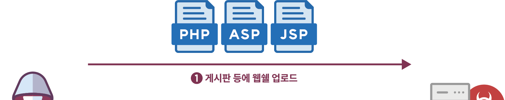

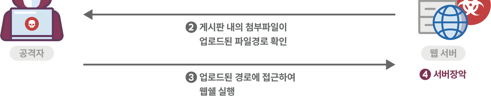

서버 측에서 실행 가능한 스크립트 파일(asp, jsp, php, sh 파일 등)이 업로드 가능하고 이 파일을 공격자가 웹을 통해 직접 실행시킬 수 있는 경우 시스템 내부 명령어를 실행하거나 외부와 연결해 시스템을 제어할 수 있는 보안약점이다. 서버 사이드 언어(ASP, JSP, PHP)와 달리 NodeJS에서는 파일 업로드가 성공했다고 하더라도 설정파일 수정 및 반영과 같이 파일 실행을 위해 거쳐야 할 추가 작업들로 인해 웹쉘 공격이 그리 간단하지 않다. 가능성이 낮을 뿐 NodeJS를 기반으로 하는 서버 또한 업로드 공격에 취약하므로 이에 대비가 필요하다.

#### 나. 안전한 코딩기법

파일 업로드 공격을 방지하기 위해서 특정 파일 유형만 허용하도록 화이트리스트 방식으로 파일 유형을 제한해야 한다. 이때 파일의 확장자 및 업로드 된 파일의 Content-Type도 함께 확인해야 한다. 또한 파일 크기 및 파일 개수를 제한하여 시스템 자원 고갈 등으로 서비스 거부 공격이 발생하지 않도록 제한해야 한다. 업로드 된 파일을 웹 루트 폴더 외부에 저장해 공격자가 URL을 통해 파일을 실행할 수 없도록 해야 하며, 가능하면 업로드 된 파일의 이름은 공격자가 추측할 수 없는 무작위한 이름으로 변경 후 저장하는 것이 안전하다. 또한 업로드 된 파일을 저장할 경우에는 최소 권한만 부여하는 것이 안전하고 실행 여부를 확인하여 실행 권한을 삭제해야 한다.

#### 다. 코드예제

업로드 대상 파일 개수, 크기, 확장자 등의 유효성 검사를 하지 않고 파일 시스템에 그대로 저장할 경우 공격자에 의해 악성코드, 쉘코드 등 위험한 형식의 파일이 시스템에 업로드 될 수 있다.

**안전하지 않은 코드**

```javascript
const express = require('express');
router.post("/vuln", (req, res) => {
  const file = req.files.products;
  const fileName = file.name;
 
  // 업로드 한 파일 타입 검증 부재로 악성 스크립트 파일 업로드 가능
  file.mv("/usr/app/temp/" + fileName, (err) => {
    if (err) return res.send(err);
    res.send("upload success");
  });
});
```

아래 코드는 업로드 하는 파일의 개수, 크기, 파일 확장자 등을 검사해 업로드를 제한하고 있다. 파일 타입 확인은 MIME 타입을 확인하는 과정으로 파일 이름에서 확장자만 검사할 경우 변조된 확장자를 통해 업로드 제한을 회피할 수 있어 파일 자체의 시그니처를 확인하는 과정을 보여 준다.

**안전한 코드**

```javascript
const express = require('express');
router.post("/patched", (req, res) => {
  const allowedMimeTypes = ["image/png", "image/jpeg"];
  const allowedSize = 5242880;
  const file = req.files.products;
  const fileName = file.name;
  // 업로드 한 파일 타입 검증을 통해 악성 스크립트 파일 업로드 방지
  if (allowedMimeTypes.indexOf(file.mimetype) < 0) {
    res.send("file type not allowed");
  } else {
    file.mv("/usr/app/temp/" + fileName, (err) => {
      if (err) return res.send(err);
      res.send("upload success");
    });
  }
});
```

#### 라. 참고자료

- [CWE-434: Unrestricted Upload of File with Dangerous Type, MITRE](https://cwe.mitre.org/data/definitions/434.html)
- [Unrestricted File Upload, OWASP](https://owasp.org/www-community/vulnerabilities/Unrestricted_File_Upload)
- [express-fileupload, npm](https://www.npmjs.com/package/express-fileupload)
- [NodeJs-Secure Code wiki](https://securecode.wiki/docs/lang/nodejs/)
- [The Javascript Guide: Web Application Secure Coding Practices](https://github.com/Checkmarx/JS-SCP/blob/master/dist/js-webapp-scp.pdf)

---

### 7. 신뢰되지 않은 URL주소로 자동접속 연결

> VanillaJS: - / ReactJS: - / ExpressJS: O

#### 가. 개요

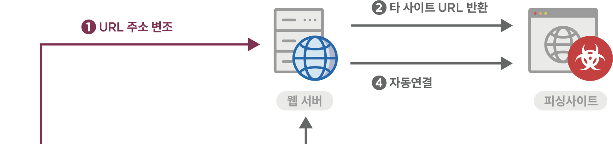

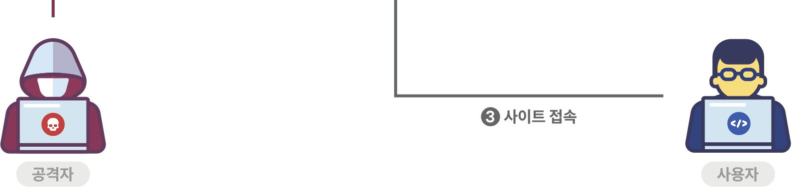

사용자가 입력하는 값을 외부 사이트 주소로 사용해 해당 사이트로 자동 접속하는 서버 프로그램은 피싱(Phishing) 공격에 노출되는 취약점을 가진다. 클라이언트에서 전송된 URL 주소로 연결하기 때문에 안전하다고 생각할 수 있으나 공격자는 정상적인 폼 요청을 변조해 사용자가 위험한 URL로 접속할 수 있도록 공격할 수 있다.

#### 나. 안전한 코딩기법

리다이렉션을 허용하는 모든 URL을 서버 측 화이트리스트로 관리하고 사용자 입력값을 리다이렉트 할 URL이 존재하는지 검증해야 한다.

만약 사용자 입력값이 화이트리스트로 관리가 불가능하고 리다이렉션 URL의 인자 값으로 사용되어야만 하는 경우는 모든 리다이렉션에서 프로토콜과 host 정보가 들어가지 않는 상대 URL(relative URL)을 사용 및 검증해야 한다. 또는 절대 URL(absolute URL)을 사용할 경우 리다이렉션을 실행하기 전에 사용자 입력 URL이 `https://myhompage.com/` 처럼 정상 서비스 중인 URL로 시작하는지 확인해야 한다.

#### 다. 코드예제

ExpressJS에서는 redirect() 함수를 사용해 사용자 요청을 다른 페이지로 리다이렉트할 수 있다. 다음은 사용자로부터 입력받은 url 주소를 검증 없이 redirect 함수의 인자로 사용해 의도하지 않은 사이트로 접근하도록 하거나 피싱(Phishing)공격에 노출되는 예시를 보여 준다.

**안전하지 않은 코드**

```javascript
const express = require('express');
router.get("/vuln", (req, res) => {
  const url = req.query.url;
  // 사용자가 전달한 URL 주소를 검증 없이 그대로 리다이렉트 처리
  res.redirect(url);
});
```

다음은 안전한 코드 예제로 사용자로부터 주소를 입력받아 리다이렉트하고 있는 코드로 위험한 도메인이 포함될 수 있기 때문에 화이트리스트로 사전에 정의된 안전한 웹사이트에 한하여 리다이렉트 할 수 있도록 한다.

**안전한 코드**

```javascript
const express = require('express');
router.get("/patched", (req, res) => {
  const whitelist = ["http://safe-site.com", "https://www.example.com"];
  const url = req.query.url;
    
  // 화이트리스트에 포함된 주소가 아니라면 리다이렉트 없이 에러 반환
  if (whitelist.indexOf(url) < 0) {
    res.send("wrong url");
  } else {
    res.redirect(url);
  }
});
```

#### 라. 참고자료

- [CWE-601: URL Redirection to Untrusted Site ('Open Redirect'), MITRE](https://cwe.mitre.org/data/definitions/601.html)
- [Unvalidated Redirects and Forwards Cheat Sheet, OWASP](https://cheatsheetseries.owasp.org/cheatsheets/Unvalidated_Redirects_and_Forwards_Cheat_Sheet.html)
- [JavaScript Secure Coding Standard - Ministry of Transport and Communications](https://compliance.qcert.org/sites/default/files/library/2018-10/MOTC-CIPD_JavaScript_Coding_Standard(US).pdf)
- [express Documentation - StrongLoop, IBM](https://devdocs.io/express/index#res.redirect)

---

### 8. 부적절한 XML 외부 개체 참조

> VanillaJS: - / ReactJS: - / ExpressJS: O

#### 가. 개요

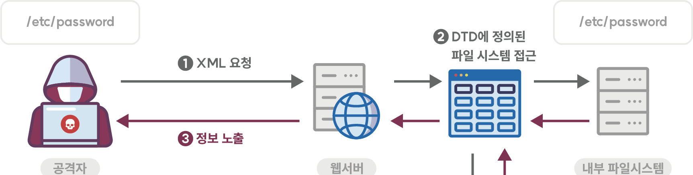

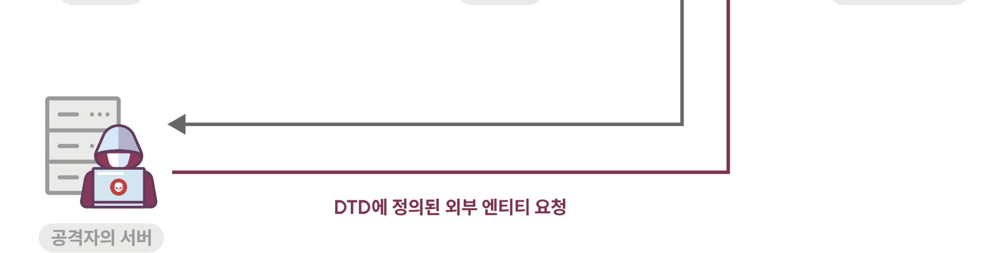

XML 문서에는 DTD(Document Type Definition)를 포함할 수 있으며 DTD는 XML 엔티티(entity)를 정의한다. 부적절한 XML 외부개체 참조 보안약점은 서버에서 XML 외부 엔티티를 처리할 수 있도록 설정된 경우에 발생할 수 있다. 취약한 XML parser가 외부값을 참조하는 XML을 처리할 때 공격자가 삽입한 공격 구문이 동작되어 서버 파일 접근, 불필요한 자원 사용, 인증 우회, 정보 노출 등이 발생할 수 있다.

NodeJS에서는 내장 XML 파싱 엔진을 지원하지 않으며, 별도의 라이브러리를 사용해야 한다. 어떠한 라이브러리를 사용해도 무방하지만 반드시 외부 엔티티 파싱 기능을 비활성화 하는 옵션을 설정해 주어야 한다.

#### 나. 안전한 코딩기법

로컬 정적 DTD를 사용하도록 설정하고 외부에서 전송된 XML 문서에 포함된 DTD를 완전하게 비활성화해야 한다. 비활성화를 할 수 없는 경우에는 외부 엔티티 및 외부 문서 유형 선언을 각 파서에 맞는 고유한 방식으로 비활성화 한다. 외부 라이브러리를 사용할 경우 기본적으로 외부 엔티티에 대한 구문 분석 기능을 제공하는지 확인하고, 제공이 되는 경우 해당 기능을 비활성화 할 수 있는 방법을 확인해 외부 엔티티 구문 분석 기능을 비활성화 한다.

#### 다. 코드예제

다음 예제는 XML 소스를 읽어와 분석하는 코드를 보여 준다. 공격자는 아래와 같이 XML 외부 엔티티를 참조하는 xxe.xml 데이터를 전송하고 서버에서 해당 데이터 파싱 시 /etc/passwd 파일 내용이 사용자에게 전달될 수 있다.

```xml
<?xml version="1.0" encoding="ISO-8859-1"?>
<!DOCTYPE foo [
  <!ELEMENT foo ANY >
  <!ENTITY xxe1 SYSTEM "file:///etc/passwd" >
]>
<foo>&xxe1;</foo>
```

**안전하지 않은 코드**

```javascript
const express = require('express');
const libxmljs = require("libxmljs");
router.post("/vuln", (req, res) => {
  if (req.files.products && req.files.products.mimetype == "application/xml") {
    const products = libxmljs.parseXmlString(
      req.files.products.data.toString("utf8"),
      // 외부 엔티티 파싱 허용 설정(미설정 시 기본값은 false)
      { noent: true }
    );
    return res.send(products.get("//foo").text());
  }
  return res.send("fail");
});
```

libxmljs 라이브러리에서는 기본적으로 외부 엔티티 파싱 기능이 비활성화 되어 있지만 명시적으로 비활성 선언을 해주는 것이 좋다.

**안전한 코드**

```javascript
const express = require('express');
const libxmljs = require("libxmljs");
router.post("/patched", (req, res) => {
  if (req.files.products && req.files.products.mimetype == "application/xml") {
    const products = libxmljs.parseXmlString(
      req.files.products.data.toString("utf8"),
      // 외부 엔티티 파싱을 허용하지 않도록 설정
      // 미설정 시 기본값은 false이지만, 명시적으로 선언을 해 주는 것이 좋음
      { noent: false }
    );
    return res.send(products.get("//foo").text());
  }
  return res.send("fail");
});
```

#### 라. 참고자료

- [CWE-611: Improper Restriction of XML External Entity Reference, MITRE](https://cwe.mitre.org/data/definitions/611.html)
- [XML External Entity (XXE) Processing, OWASP](https://owasp.org/www-community/vulnerabilities/XML_External_Entity_(XXE)_Processing)
- [XML External Entity Prevention Cheat Sheet, OWASP](https://cheatsheetseries.owasp.org/cheatsheets/XML_External_Entity_Prevention_Cheat_Sheet.html)
- [JavaScript Secure Coding Standard - Ministry of Transport and Communications](https://compliance.qcert.org/sites/default/files/library/2018-10/MOTC-CIPD_JavaScript_Coding_Standard(US).pdf)
- [NodeJs-Secure Code wiki](https://securecode.wiki/docs/lang/nodejs/)
- [Sonar Rules](https://rules.sonarsource.com/javascript/RSPEC-2755)

---

### 9. XML 삽입

> VanillaJS: - / ReactJS: - / ExpressJS: O

#### 가. 개요

검증되지 않은 외부 입력값이 XQuery 또는 XPath 쿼리문을 생성하는 문자열로 사용되어 공격자가 쿼리문의 구조를 임의로 변경하고 임의의 쿼리를 실행해 허가되지 않은 데이터를 열람하거나 인증절차를 우회할 수 있는 보안약점이다.

#### 나. 안전한 코딩기법

XQuery 또는 XPath 쿼리에 사용되는 외부 입력 데이터에 대하여 특수문자 및 쿼리 예약어를 필터링 하고 인자화된 쿼리문을 지원하는 XQuery를 사용해야 한다.

#### 다. 코드예제

다음은 자바스크립트 xpath 패키지를 사용해 XML 데이터를 처리하는 예시를 보여 준다. 사용자 이름과 패스워드가 XML 내의 값과 일치할 경우 사용자 홈 디렉터리를 반환하는 예시로, 인자화된 쿼리문을 사용하지 않고 XPath 쿼리문을 생성하고 있어 공격자가 요청문을 조작해 패스워드 검증 로직을 우회할 수 있다.

**안전하지 않은 코드**

```javascript
const express = require('express');
const xpath = require('xpath');
const dom = require('xmldom').DOMParser;
const xml = `<users>
  <user>
    <login>john</login>
    <password>abracadabra</password>
    <home_dir>/home/john</home_dir>
  </user>
  <user>
    <login>cbc</login>
    <password>1mgr8</password>
    <home_dir>/home/cbc</home_dir>
  </user>
  </users>`;
router.get("/vuln", (req, res) => {
  const userName = req.query.userName;
  const userPass = req.query.userPass;
  const doc = new dom().parseFromString(xml);
  // 조작된 입력값(/vuln?userName=john' or ''='&userPass="' or ''='")을 통해
  // 패스워드 검사 로직을 우회할 수 있음
  const badXPathExpr = "//users/user[login/text()='" + userName 
                        + "' and password/text() = '" + userPass + "']/home_dir/text()";
  const selected = xpath.select(badXPathExpr, doc);
  try {
    const userPath = selected[0].toString();
    return res.send(`userPath = ${userPath}`);
  } catch {
    return res.send('not found');
  }
});
```

xpath에서는 parse 및 select 함수를 사용해 인자화된 쿼리를 생성하고 쿼리문에 필요한 변수값을 전달할 수 있다. 만약 xpath가 아닌 다른 패키지를 사용할 경우 반드시 인자화된 쿼리를 지원하는지 확인해야 한다. 다음은 인자화된 쿼리를 통해 사용자가 조작한 입력값이 실행되지 않도록 하는 안전한 예시를 보여 준다.

**안전한 코드**

```javascript
const express = require('express');
const xpath = require('xpath');
const dom = require('xmldom').DOMParser;
const xml = `<users>
  ...
  </users>`;
  
router.get("/patched", (req, res) => {
  const userName = req.query.userName;
  const userPass = req.query.userPass;
  const doc = new dom().parseFromString(xml);
  // 인자화된 쿼리 생성
  const goodXPathExpr = xpath.parse("//users/user[login/text()=$userName and password/text() 
  =$userPass]/home_dir/text()");
  // 쿼리문에 변수값 전달 및 XML 조회
  const selected = goodXPathExpr.select({
    node: doc,
    variables: { userName: userName, userPass: userPass }
  });
  try {
    const userPath = selected[0].toString();
    return res.send(`userPath = ${userPath}`);
  } catch {
    return res.send('not found');
  }
});
```

#### 라. 참고자료

- [CWE-643: Improper Neutralization of Data within XPath Expressions ('XPath Injection'), MITRE](https://cwe.mitre.org/data/definitions/643.html)
- [XPATH Injection, OWASP](https://owasp.org/www-community/attacks/XPATH_Injection)

---

### 10. LDAP 삽입

> VanillaJS: - / ReactJS: - / ExpressJS: O

#### 가. 개요

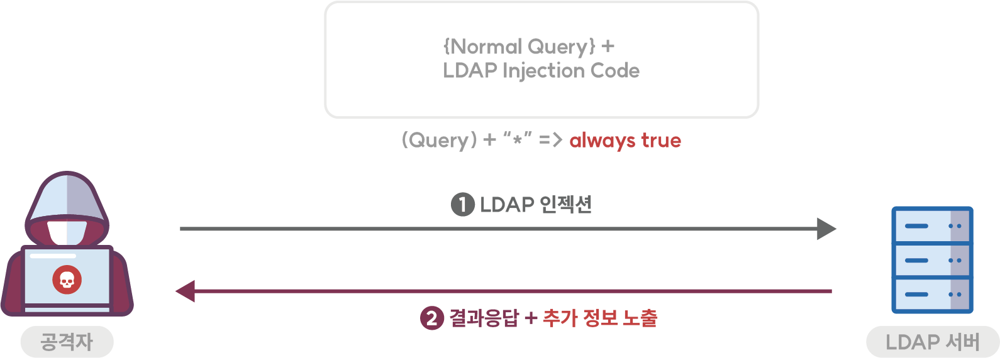

외부 입력값을 적절한 처리 없이 LDAP 쿼리문이나 결과의 일부로 사용하는 경우, LDAP 쿼리문이 실행될 때 공격자는 LDAP 쿼리문의 내용을 마음대로 변경할 수 있다. 이로 인해 프로세스가 명령을 실행한 컴포넌트와 동일한 권한(Permission)을 가지고 동작하게 된다. 자바스크립트에서는 LDAP 데이터 처리를 위한 다양한 패키지가 존재하며, 그 중 ldapjs가 가장 사용자들이 선호하는 패키지로 알려져 있다.

#### 나. 안전한 코딩기법

다른 삽입 공격들과 마찬가지로 LDAP 삽입에 대한 기본적인 방어 방법은 적절한 유효성 검사를 적용하는 것이다.

- 올바른 인코딩(Encoding) 함수를 사용해 모든 변수 이스케이프 처리
- 화이트리스트 방식의 입력값 유효성 검사
- 사용자 패스워드와 같은 민감한 정보가 포함된 필드 인덱싱
- LDAP 바인딩 계정에 할당된 권한 최소화

#### 다. 코드예제

사용자의 입력을 그대로 LDAP 질의문에 사용하고 있으며 이 경우 권한 상승 등의 공격에 노출될 수 있다.

**안전하지 않은 코드**

```javascript
const express = require('express');
const ldap = require('ldapjs');
const config = {
  url: 'ldap://ldap.forumsys.com',
  base: 'dc=example,dc=com',
  dn: 'cn=read-only-admin,dc=example,dc=com',
  secret: 'd0accf0ac0dfb0d0fd...',
};
async function searchLDAP (search) {
...
}
router.get("/vuln", async (req, res) => {
  // 사용자의 입력을 그대로 LDAP 질의문으로 사용해 권한 상승 등의 공격에 노출
  const search = req.query.search; 
  const result = await searchLDAP(search);
  return res.send(result);
});
```

사용자의 입력 중 LDAP 질의문에 사용될 변수를 이스케이프 하여 질의문 실행 시 공격에 노출되는 것을 예방할 수 있다. ldapjs 패키지에서는 사용자 입력값을 이스케이핑 할 수 있는 parseFilter 함수를 제공한다.

**안전한 코드**

```javascript
const express = require('express');
const ldap = require('ldapjs');
const parseFilter = require('ldapjs').parseFilter;
const config = {
  url: 'ldap://ldap.forumsys.com',
  base: 'dc=example,dc=com',
  dn: 'cn=read-only-admin,dc=example,dc=com',
  secret: 'd0accf0ac0dfb0d0fd...',
};
async function searchLDAP (search) {
...
}
router.get("/patched", async (req, res) => {
  let search;
  // 사용자의 입력에 필터링을 적용해 공격에 사용될 수 있는 문자 발견 시
  // 사용자에게 잘못된 요청값임을 알리고, 질의문을 요청하지 않음
  try {
    search = parseFilter(req.query.search); 
  } catch {
    return res.send('잘못된 요청값입니다.');
  }
  const result = await searchLDAP(search);
  return res.send(result);
});
```

**참고: 자바스크립트 기반 LDAP 데이터 처리 함수**

```javascript
// (참고) ldapjs 패키지를 사용해 ldap 데이터를 처리하는 코드 예시로, 앞서 제시한 두 코드에서
// 생략된 searchLDAP 함수의 전체 코드
const ldap = require('ldapjs');
const config = {
  url: 'ldap://ldap.forumsys.com',
  base: 'dc=example,dc=com',
  dn: 'cn=read-only-admin,dc=example,dc=com',
  password: 'password',
};
async function searchLDAP (search) {
  const opts = {
    filter: `(&(objectClass=${search}))`,
    attributes: ['sn', 'cn', 'mail', 'telephonenumber', 'uid'],
    scope: 'sub',
  };
  const users = [];
  const client = ldap.createClient({ url: config.url });
  return new Promise((resolve, reject) => {
    client.bind(config.dn, config.password, (err) => {
      if (err) {
        console.log('LDAP bind error - ', err);
      } else {
        client.search(config.base, opts, (err, res) => {  
          res.on('searchEntry', (entry) => {
            users.push(entry.object);
          });
          ...
          res.on('end', (result) => {
            console.log('status: ' + result.status);
            resolve(users);
          });
        });
      }
    });
  });
}
```

#### 라. 참고자료

- [CWE-90: Improper Neutralization of Special Elements used in an LDAP Query ('LDAP Injection'), MITRE](https://cwe.mitre.org/data/definitions/90.html)
- [LDAP Injection Prevention Cheat Sheet, OWASP](https://cheatsheetseries.owasp.org/cheatsheets/LDAP_Injection_Prevention_Cheat_Sheet.html)
- [ldapjs Filters API](http://ldapjs.org/filters.html)

---

### 11. 크로스사이트 요청 위조(CSRF)

> VanillaJS: O / ReactJS: O / ExpressJS: O

#### 가. 개요

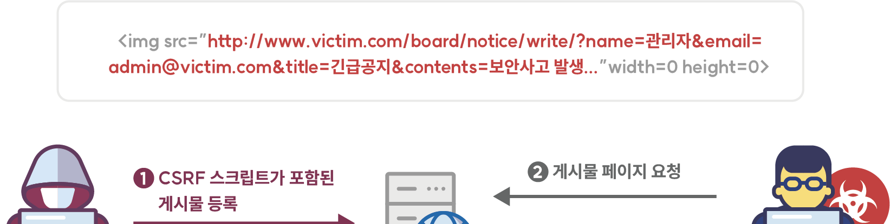

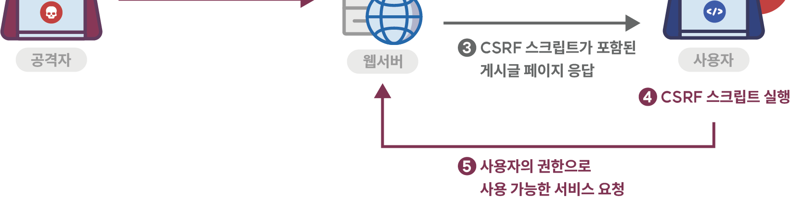

특정 웹사이트에 대해 사용자가 인지하지 못한 상황에서 사용자의 의도와는 무관하게 공격자가 의도한 행위(수정, 삭제, 등록 등)를 요청하게 하는 공격을 말한다. 웹 응용프로그램이 사용자로부터 받은 요청이 해당 사용자가 의도한 대로 작성되고 전송된 것인지 확인하지 않는 경우 발생 가능하다. 특히 사용자가 관리자 권한을 가지는 경우 사용자 권한관리, 게시물 삭제, 사용자 등록 등 관리자 권한으로만 수행 가능한 기능을 공격자의 의도대로 실행시킬 수 있게 된다. 공격자는 사용자가 인증한 세션이 특정 동작을 수행해도 계속 유지되어 정상적인 요청과 비정상적인 요청을 구분하지 못하는 점을 악용한다.

자바스크립트의 대표적인 웹 애플리케이션 프레임워크인 ExpressJS에서는 기본적으로 CSRF 토큰 기능을 지원하지 않으며, csurf와 같은 별도의 패키지를 사용해 CSRF 토큰을 적용할 수 있다. csurf는 많은 시큐어 코딩 문서 및 가이드에서 CSRF 공격 대응에 사용 가능한 것으로 알려져 있다. 초기에는 안전한 것으로 알려졌으나 해당 패키지 적용만으로 대응이 어려운 다양한 유형의 보안 취약점 발견 및 구현 자체의 제약(취약한 해쉬함수 사용)으로 인해 공식 리파지토리에서는 더 이상 유지되지 않은 deprecated 패키지로 공지되어 있다.

비록 패키지 자체만으로 완전한 CSRF 공격 대응이 불가능하다는 단점이 있지만, 이를 대체할 수 있는 것으로 검증된 패키지가 아직까지 등장하지 않았고 추가 옵션 적용을 통해 보안성을 강화할 수 있다. 토큰 값 세션 저장, 토큰 헤더 키 추가와 같은 방법을 사용 가능하다.

#### 나. 안전한 코딩기법

해당 요청이 정상적인 사용자가 절차에 따라 요청한 것인지 구분하기 위해 세션별로 CSRF 토큰을 생성하여 세션에 저장하고 사용자가 작업 페이지를 요청할 때마다 hidden 값으로 클라이언트에게 토큰을 전달한 뒤, 해당 클라이언트의 데이터 처리 요청 시 전달되는 CSRF 토큰값을 체크하여 요청의 유효성을 검사하도록 한다.

#### 다. 코드예제

템플릿 엔진을 사용해 클라이언트측 코드를 렌더링 할 경우, 서버로 데이터를 전송하거나 기능을 호출하는 부분에 csrf 토큰을 포함하지 않을 경우 CSRF 공격에 취약하다.

**안전하지 않은 코드** (클라이언트)

```html
<html>
...
<body>
  <form method='post' action='/api/vuln'>
    <!-- CSRF 토큰 없이 폼 데이터를 서버에 전달 -->
    <fieldset>
      <legend>Your Profile:</legend>
      <label for='username'> Name:</label>
      <input name='username' class='username' type='text'> <br><br>
      <label for='email' > Email:</label>
      <input name='email' class='useremail' type='email'> <br><br> 
      <button type='submit'>UPDATE</button>
    </fieldset>
  </form>
</body>
</html>
```

다음은 CSRF 토큰 처리가 없는 서버측 라우터 예시를 보여 준다. 만약 공격자가 사용자 업데이트 페이지를 모방해 사용자가 해당 페이지를 통해 서버로 업데이트 요청을 보내도록 할 경우 서버는 정상적인 세션을 가지는 클라이언트의 요청을 아무런 검증 없이 실행하게 된다.

**안전하지 않은 코드** (서버)

```javascript
const express = require('express');
router.post("/api/vuln", (req, res) => {
  const userName = req.body.username; 
  const userEmail = req.body.useremail;
  // 사용자 업데이트 요청이 정상 사용자로부터 온 것이라고 간주하고,
  // 사용자로부터 받은 값을 그대로 내부 함수에 전달
  if (update_user(userName, userEmail)) {
    return res.send('update completed');
  } else {
    return res.send('update error');
  }
});
```

다음은 csurf 패키지를 사용해 CSRF 공격에 대응하는 예시를 보여 준다. 앞서 설명한 것처럼, csurf를 포함해 어떠한 패키지를 사용하더라도 다양한 변종 CSRF 패턴을 모두 방어하는 것은 불가능하다. 다만 다음 예시에서 보는 것처럼 csurf 기능의 한계를 인지한 상태에서 세션에 정보 저장, 토큰 접두어 사용 등의 부가적인 보안 대책을 적용해 방어 수준을 높일 수 있다.

**안전한 코드** (서버)

```javascript
const csrf = require('csurf');
const express = require('express');
const session = require("express-session");
const app = express();
// 토큰을 쿠키가 아닌 세션에 저장
app.use(session({
  secret: process.env.COOKIE_SECRET,
  cookie: { path: '/', secure: true, httpOnly: true, sameSite: 'strict' },
  saveUninitialized: false,
  resave: false
}));
// CSRF 토큰 이름 앞에 __Host- 접두어 추가
const csrfProtection = csrf({
  key: '__Host-token',
}); 
// 클라이언트측 프레임워크(ReactJS)를 위한 토큰 값 제공
router.get("/getCSRFToken", csrfProtection, (req, res) => {
  res.json({ csrfToken: req.csrfToken() });
});
// 템플릿 페이지를위한 토큰 값 제공
router.get("/page", csrfProtection, (req, res) => {
  res.render('csrf', { csrfToken: req.csrfToken() });
});
// 라우터 데이터 처리 전 클라이언트의 csrf 토큰을 검사
router.post("/api/patched", csrfProtection, (req, res) => {
  const userName = req.body.username; 
  const userEmail = req.body.useremail;
  if (update_user(userName, userEmail)) {
    return res.send('update completed');
  } else {
    return res.send('update error');
  }
});
```

클라이언트측 코드 내의 form action 또는 axios와 같은 서버 기능 호출 부분에도 csrf 토큰을 추가해야 한다. 템플릿 엔진에서 폼 형태로 데이터를 전달하는 경우 hidden 필드에 토큰 값을 할당하면 된다.

**안전한 코드** (템플릿 클라이언트)

```html
...
  <form method='post' action='/api/vuln'>
    <!-- 서버로부터 제공 받은 CSRF 토큰을 폼 데이터에 hidden 값으로 포함해 전달 -->
    <input type='hidden' name='_csrf' value='<%= csrfToken  %>'>  
    <fieldset>
      <legend>Your Profile:</legend>
      <label for='username'> Name:</label>
      <input name='username' class='username' type='text'> <br><br>
      <label for='email' > Email:</label>
      <input name='email' class='useremail' type='email'> <br><br> 
      <button type='submit'>UPDATE</button>
    </fieldset>
  </form>
...
```

클라이언트측에서 렌더링을 처리하는 ReactJS의 경우 서버 기능 호출 전 서버로부터 토큰을 받아와 요청 헤더 내에 삽입해야 한다.

**안전한 코드** (ReactJS 클라이언트)

```javascript
const App = () => {
  const getData = async () => {
    // 서버에 기능 호출 전 먼저 CSRF 토큰을 받아와 헤더에 저장
    const response = await axios.get('getCSRFToken');
    axios.defaults.headers.post['X-CSRF-Token'] = response.data.csrfToken;
    // CSRF 토큰이 설정된 상태에서 서버 기능 호출
    const res = await axios.post('api/patched', {
      username: 'hello_user',
      useremail: 'test@email.com',
    });
    document.write(res.data);
  };
  React.useEffect(() => { getData(); }, []);
  return <div>react-test</div>;
};
ReactDOM.render(<App />, document.getElementById("root"));
```

#### 라. 참고자료

- [CWE-352: Cross-Site Request Forgery (CSRF), MITRE](https://cwe.mitre.org/data/definitions/352.html)
- [Cross Site Request Forgery (CSRF), OWASP](https://owasp.org/www-community/attacks/csrf)
- [Cross-Site Request Forgery Prevention Cheat Sheet, OWASP](https://cheatsheetseries.owasp.org/cheatsheets/Cross-Site_Request_Forgery_Prevention_Cheat_Sheet.html)
- [NodeJS Secure Code Wiki - Payatu](https://securecode.wiki/docs/lang/nodejs)
- [Disabling CSR protections is security-sensitive](https://rules.sonarsource.com/javascript/RSPEC-4502)

---

### 12. 서버사이드 요청 위조

> VanillaJS: - / ReactJS: - / ExpressJS: O

#### 가. 개요

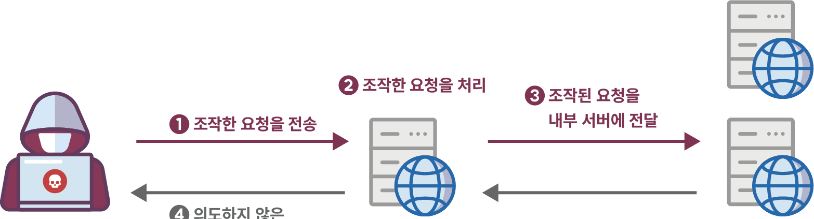

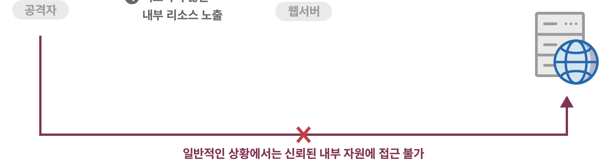

적절한 검증 절차를 거치지 않은 사용자 입력값을 내부 서버간의 요청에 사용해 악의적인 행위가 발생할 수 있는 보안약점이다. 외부에 노출된 웹 서버가 취약한 애플리케이션을 포함하는 경우 공격자는 URL 또는 요청문을 위조해 접근통제를 우회하는 방식으로 비정상적인 동작을 유도하거나 신뢰된 네트워크에 있는 데이터를 획득할 수 있다.

#### 나. 안전한 코딩기법

식별 가능한 범위 내에서 사용자의 입력값을 다른 시스템의 서비스 호출에 사용하는 경우 사용자의 입력값을 화이트리스트 방식으로 필터링한다.

부득이하게 사용자가 지정하는 무작위의 URL을 받아들여야 하는 경우라면 내부 URL을 블랙리스트로 지정하여 필터링 한다. 또한 동일한 내부 네트워크에 있더라도 기기 인증, 접근권한을 확인하여 요청이 이루어질 수 있도록 한다.

#### 다. 코드예제

**참고 : 삽입 코드의 예**

| 설명 | 삽입 코드의 예 |
|------|---------------|
| 내부망 중요 정보 획득 | `http://sample_site.com/connect?url=http://192.168.0.45/member/list.json` |
| 외부 접근 차단된 admin 페이지 접근 | `http://sample_site.com/connect?url=http://192.168.0.45/admin` |
| 도메인 체크를 우회하여 중요 정보 획득 | `http://sample_site.com/connect?url=http://sample_site.com:x@192.168.0.45/member/list.json` |
| 단축 URL을 이용한 Filter 우회 | `http://sample_site.com/connect?url=http://bit.ly/sdjk3kjhkl3` |
| 도메인을 사설IP로 설정해 중요정보 획득 | `http://sample_site.com/connect?url=http://192.168.0.45/member/list.json` |
| 서버 내 파일 열람 | `http://sample_site.com/connect?url=file:///etc/passwd` |

다음 예제는 안전하지 않은 코드를 보여 준다. 사용자로부터 입력된 URL 주소를 검증 없이 사용하면 의도하지 않은 다른 서버의 자원에 접근할 수 있게 된다.

**안전하지 않은 코드**

```javascript
const request = require('request');
const express = require('express');
router.get("/vuln", async (req, res) => {
  const url = req.query.url;
  // 사용자가 입력한 주소를 검증하지 않고 HTTP 요청을 보낸 후
  // 그 응답을 그대로 사용자에게 전달
  await request(url, (err, response) => {
    const resData = response.body;
    return res.send(resData);
  });
});
```

다음과 같이 안전한 코드를 작성하면 사전에 정의된 서버 목록에서 정의하고 매칭되는 URL만 사용할 수 있으므로 URL 값을 임의로 조작할 수 없다.

**안전한 코드**

```javascript
const request = require('request');
const express = require('express');
router.get("/patched", async (req, res) => {
  const url = req.query.url;
  const whiteList = [ 'www.example.com', 'www.safe.com'];
 
  // 사용자가 입력한 URL을 화이트리스트로 검증한 후 그 결과를 반환하여
  // 검증되지 않은 주소로 요청을 보내지 않도록 제한
  if (whiteList.includes(url)) {
    await request(url, (err, response) => {
      const resData = response.body;
      return res.send(resData);
    });
  } else {
    return res.send('잘못된 요청입니다');
  }
});
```

#### 라. 참고자료

- [CWE-918: Server-Side Request Forgery (SSRF), MITRE](https://cwe.mitre.org/data/definitions/918.html)
- [Server Side Request Forgery, OWASP](https://owasp.org/www-community/attacks/Server_Side_Request_Forgery)
- [Server-Side Request Forgery Prevention Cheat Sheet, OWASP](https://cheatsheetseries.owasp.org/cheatsheets/Server_Side_Request_Forgery_Prevention_Cheat_Sheet.html)

---

### 13. 보안기능 결정에 사용되는 부적절한 입력값

> VanillaJS: - / ReactJS: - / ExpressJS: O

#### 가. 개요

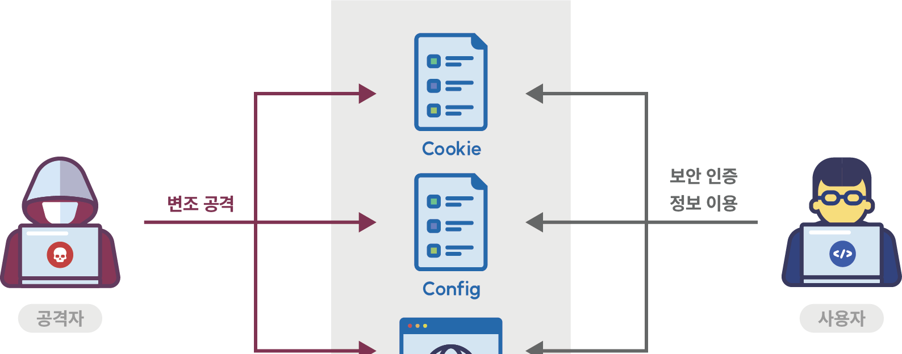

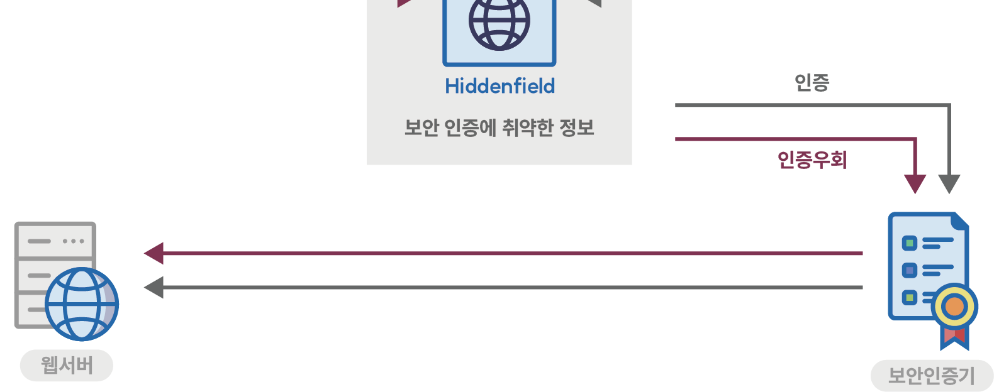

응용 프로그램이 외부 입력값에 대한 신뢰를 전제로 보호 메커니즘을 사용하는 경우 공격자가 입력값을 조작할 수 있다면 보호 메커니즘(인증, 인가 등)을 우회할 수 있게 된다.

흔히 쿠키, 환경변수 또는 히든필드와 같은 입력값이 조작될 수 없다고 가정하지만 공격자는 다양한 방법을 통해 이러한 입력값들을 변경할 수 있고 조작된 내용은 탐지되지 않을 수 있다. 인증이나 인가와 같은 보안 결정이 이런 입력값(쿠키, 환경변수, 히든필드 등)에 기반을 두어 수행되는 경우 공격자는 입력값을 조작해 응용프로그램의 보안을 우회할 수 있다. 따라서 인증, 인가 등과 같은 보안기능 결정 과정에서 공격자가 데이터를 임의로 변경할 수 없도록 충분한 암호화, 무결성 체크를 수행하고 이와 같은 메커니즘이 없는 경우엔 외부 사용자에 의한 입력값을 신뢰해서는 안 된다.

#### 나. 안전한 코딩기법

상태 정보나 민감한 데이터 특히 사용자 세션 정보와 같은 중요 정보는 서버에 저장하고 보안확인 절차도 서버에서 실행한다. 또한, 인증 절차가 여러 단계인 경우 각 단계의 인증 절차가 진행될 때마다 서버에서는 각 단계별 인증값이 변조되지 않았는지 검증하여야 한다.

이와 같이 보안설계 관점에서 신뢰할 수 없는 입력값이 응용 프로그램 내부로 들어올 수 있는 지점을 검토하고, 민감한 보안 기능 결정에 사용되는 입력값을 식별해 입력값에 대한 의존성을 없애는 구조로 변경 가능한지 분석한다.

#### 다. 코드예제

다음은 안전하지 않은 코드로 쿠키에 저장된 권한 등급을 가져와 관리자인지 확인 후에 사용자의 패스워드를 초기화 하고 메일을 보내는 예제다. 쿠키에서 등급을 가져와 관리자 여부를 확인한다.

**안전하지 않은 코드**

```javascript
const express = require('express');
router.get("/admin", (req, res) => {
  // 쿠키에서 권한 정보를 가져옴
  const role = req.cookies.role;
  if (role === "admin") {
    // 쿠키에서 가져온 권한 정보로 관리자 페이지 접속 처리
    return res.render('admin'. { title: '관리자 페이지' } ));
  } else {
    return res.send("사용 권한이 없습니다.");
  }
});
```

중요 기능 수행을 결정하는 데이터는 위변조 가능성이 높은 쿠키보다 세션에 저장하도록 한다.

**안전한 코드**

```javascript
const express = require('express');
const session = require("express-session");
app.use(session({
  secret: 'test',
  resave: true,
  saveUninitialized: true,
  store: new MemoryStore({checkPeriod: 60 * 60 * 1000})
}));
router.get("/patched", (req, res) => {
  // 세션에서 권한 정보를 가져옴
  const role = req.session.role;
  if (role === "admin") {
    // 세션에서 가져온 권한 정보로 관리자 페이지 접속 처리
    return res.render('admin'. { title: '관리자 페이지' } ));
  } else {
    return res.send("사용 권한이 없습니다.");
  }
});
```

#### 라. 참고자료

- [CWE-807: Reliance on Untrusted Inputs in a Security Decision, MITRE](https://cwe.mitre.org/data/definitions/807.html)
- [express-session, npm](https://www.npmjs.com/package/express-session)

---

## 제2절 보안기능

보안기능(인증, 접근제어, 기밀성, 암호화, 권한관리 등)을 부적절하게 구현 시 발생할 수 있는 보안약점에는 적절한 인증 없는 중요기능 허용, 부적절한 인가 등이 있다.

### 1. 적절한 인증 없는 중요 기능 허용

> VanillaJS: - / ReactJS: - / ExpressJS: O

#### 가. 개요

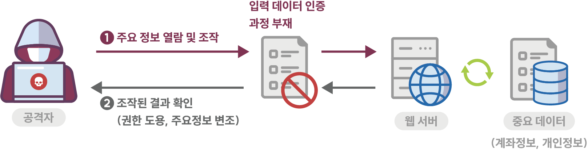

서버측에서는 NodeJS에서 제공되는 기본 기능을 사용해 인증 기능을 구현할 수도 있으며 ExpressJS나 nest.js와 같은 대표적인 서버 프레임워크에서 제공하는 기능을 사용하는 방법도 있다. 클라이언트측에서도 다양한 라이브러리를 사용해 인증 기능을 구현할 수 있지만 궁극적으로는 서버측에서 안전한 인증이 지원되지 않으면 보안 문제가 발생할 수 있다.

#### 나. 안전한 코딩기법

클라이언트의 보안 검사를 우회하여 서버에 접근하지 못하도록 설계하고 중요한 정보가 있는 페이지는 재인증을 적용한다. 또한 안전하다고 검증된 라이브러리나 프레임워크를 사용해야 한다.

#### 다. 코드예제

다음은 패스워드 수정 시 수정을 요청한 패스워드와 DB에 저장된 사용자 패스워드 일치 여부를 확인하지 않고 처리하고 있으며 패스워드의 재확인 절차도 생략되어 취약한 코드 예시를 보여 준다.

**안전하지 않은 코드**

```javascript
const express = require('express');
const crypto = require("crypto");
router.post("/vuln", (req, res) => {
  const newPassword = req.body.newPassword;
  const user = req.session.userid;
  const hs = crypto.createHash("sha256")
  const newHashPassword = hs.update(newPassword).digest("base64");
  // 현재 패스워드와 일치 여부를 확인하지 않고 업데이트
  updatePasswordFromDB(user, newHashPassword);
  return res.send({message: "패스워드가 변경되었습니다.", userId, password, hashPassword});
});
```

DB에 저장된 사용자 패스워드와 변경을 요청한 패스워드의 일치 여부를 확인하고 변경 요청한 패스워드와 재확인 패스워드가 일치하는지 확인 후 DB의 패스워드를 수정해 안전하게 코드를 적용할 수 있다.

**안전한 코드**

```javascript
const express = require('express');
const crypto = require("crypto");
router.post("/patched", (req, res) => {
  const newPassword = req.body.newPassword;
  const user = req.session.userid;
  const oldPassword = getPasswordFromDB(user);
  const salt = crypto.randomBytes(16).toString('hex');
  const hs = crypto.createHash("sha256")
  const currentPassword = req.body.currentPassword;
  const currentHashPassword = hs.update(currentPassword + salt).digest("base64");
  
  // 현재 패스워드 확인 후 사용자 정보 업데이트
  if (currentHashPassword === oldPassword) {
    const newHashPassword = hs.update(newPassword + salt).digest("base64");
    updatePasswordFromDB(user, newHashPassword);
    return res.send({ message: "패스워드가 변경되었습니다." });
  } else {
    return res.send({ message: "패스워드가 일치하지 않습니다." });
  }
});
```

#### 라. 참고자료

- [CWE-306: Missing Authentication for Critical Function, MITRE](https://cwe.mitre.org/data/definitions/306.html)
- [Access Control, OWASP](https://www.owasp.org/index.php/Access_Control_Cheat_Sheet)

---

이 문서는 분량 제한으로 인해 이하 항목(제2절 2~16항, 제3~7절, 제3장 부록)의 상세 내용은 원본 문서를 참조하시기 바랍니다. 아래에 나머지 전체 항목을 계속 수록합니다.

---

### 2. 부적절한 인가

> VanillaJS: - / ReactJS: - / ExpressJS: O

#### 가. 개요

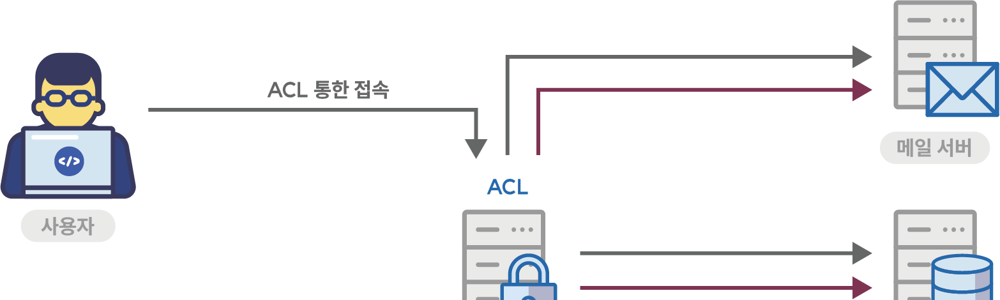

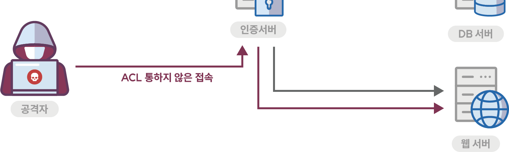

사용자가 접근 가능한 모든 실행 경로에 대해서 접근 제어를 정확히 처리하지 않거나 불완전하게 검사하는 경우 공격자는 접근 가능한 실행경로를 통해 정보를 유출할 수 있다.

#### 나. 안전한 코딩기법

응용 프로그램이 제공하는 정보와 기능이 가지는 역할에 맞게 분리 개발함으로써 공격자에게 노출되는 공격 노출면(Attack Surface)을 최소화하고 사용자의 권한에 따른 ACL(Access Control List)을 관리한다.

#### 다. 코드예제

**안전하지 않은 코드**

```javascript
const express = require('express');
function deleteContentFromDB(contentId) {
 ...
}
router.delete("/vuln", (req, res) => {
  const contentId = req.body.contentId;
  // 작업 요청을 하는 사용자의 권한 확인 없이 삭제 작업 수행
  deleteContentFromDB(contentId);
  return res.send("삭제가 완료되었습니다.");
});
```

**안전한 코드**

```javascript
const express = require('express');
function deleteContentFromDB(contentId) { ... }
router.delete("/patched", (req, res) => {
  const contentId = req.body.contentId;
  const role = req.session.role;
  // 삭제 기능을 수행할 권한이 있는 경우에만 삭제 작업 수행
  if (role === "admin") {
    deleteContentFromDB(contentId); 
    return res.send("삭제가 완료되었습니다.");
  } else {
    return res.send("권한이 없습니다.");
  }
});
```

#### 라. 참고자료

- [CWE-285: Improper Authorization, MITRE](https://cwe.mitre.org/data/definitions/285.html)
- [Authorization, OWASP](https://cheatsheetseries.owasp.org/cheatsheets/Authorization_Cheat_Sheet.html)

---

### 3. 중요한 자원에 대한 잘못된 권한 설정

> VanillaJS: - / ReactJS: - / ExpressJS: O

#### 가. 개요

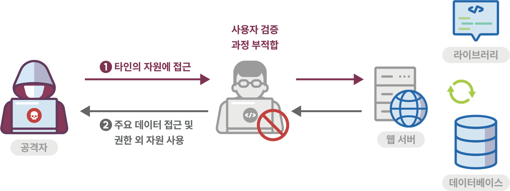

응용프로그램이 중요한 보안관련 자원에 대해 읽기 또는 수정하기 권한을 의도하지 않게 허가할 경우 권한을 갖지 않은 사용자가 해당 자원을 사용하게 된다. NodeJS에서는 fs.chmodSync 함수를 사용해 파일 생성, 수정 및 읽기 권한을 설정할 수 있다.

#### 나. 안전한 코딩기법

설정 파일, 실행 파일, 라이브러리 등은 관리자에 의해서만 읽고 쓰기가 가능하도록 설정하고 설정 파일과 같이 중요한 자원을 사용하는 경우 허가 받지 않은 사용자가 중요한 자원에 접근 가능한지 검사한다.

#### 다. 코드예제

**안전하지 않은 코드**

```javascript
const fs = require("fs");
function writeFile() {
  // 모든 사용자가 읽기, 쓰기, 실행 권한을 가지게 됨
  fs.chmodSync("/root/system config", 0o777);
  fs.open("/root/system_config", "w", function(err,fd) {
    if (err) throw err;
  });
  fs.writeFile("/root/system_config", "your config is broken", function(err) {
    if (err) throw err;
    console.log('write end');
  });
}
```

**안전한 코드**

```javascript
const fs = require("fs");
function writeFile() {
  // 소유자 이외에는 권한을 가지지 않음
  fs.chmodSync("/root/system_config", 0o700);
  fs.open("/root/system_config", "w", function(err,fd) {
    if (err) throw err;
  });
  fs.writeFile("/root/system_config", "your config is broken", function(err) {
    if (err) throw err;
    console.log('write end');
  })
}
```

#### 라. 참고자료

- [CWE-732: Incorrect Permission Assignment for Critical Resource, MITRE](https://cwe.mitre.org/data/definitions/732.html)
- [File System, NodeJS](https://nodejs.org/api/fs.html#file-system)

---

### 4. 취약한 암호화 알고리즘 사용

> VanillaJS: O / ReactJS: O / ExpressJS: O

#### 가. 개요

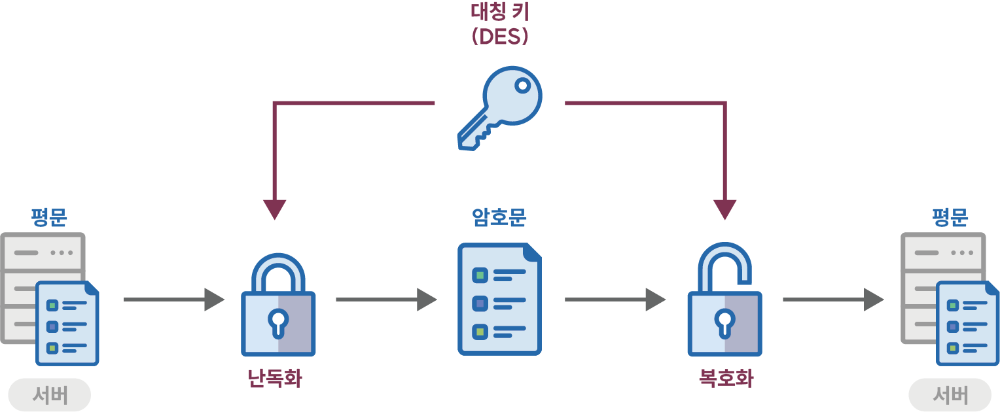

정보보호 측면에서 취약하거나 위험한 암호화 알고리즘을 사용해서는 안 된다. RC2, RC4, RC5, RC6, MD4, MD5, SHA1, DES 알고리즘이 취약한 알고리즘에 해당된다.

#### 나. 안전한 코딩기법

학계 및 업계에서 이미 검증된 표준화된 알고리즘을 사용해야 한다. 기존에 취약하다고 알려진 DES, RC5 등의 암호알고리즘을 대신하여 3TDEA, AES, SEED 등의 안전한 암호알고리즘으로 대체하여 사용한다.

#### 다. 코드예제

**안전하지 않은 코드** (암호화)

```javascript
const crypto = require("crypto");
function getEncText(plainText, key) {
  // 취약한 알고리즘인 DES를 사용하여 안전하지 않음
  const cipherDes = crypto.createCipheriv('des-ecb', key, '');
  const encryptedData = cipherDes.update(plainText, 'utf8', 'base64');
  const finalEnctypedData = cipherDes.final('base64');
  return encryptedData + finalEnctypedData;
}
```

**안전한 코드** (암호화)

```javascript
const crypto = require("crypto");
function getEncText(plainText, key, iv) {
  // 권장 알고리즘인 AES를 사용하여 안전함
  const cipherAes = crypto.createCipheriv('aes-256-cbc', key, iv);
  const encryptedData = cipherAes.update(plainText, 'utf8', 'base64');
  const finalEnctypedData = cipherAes.final('base64');
  return encryptedData + finalEnctypedData;
}
```

**안전하지 않은 코드** (해쉬)

```javascript
const crypto = require("crypto");
function makeMd5(plainText) {
  // 취약한 md5 해쉬함수 사용
  const hashText = crypto.createHash('md5').update(plainText).digest("hex");
  return hashText;
}
```

**안전한 코드** (해쉬)

```javascript
const crypto = require("crypto");
function makeSha256(plainText) {
  const salt = crypto.randomBytes(16).toString('hex');
  // 안전한 sha-256 해쉬함수 사용
  const hashText = crypto.createHash('sha256').update(plainText + salt).digest("hex");
  return hashText;
}
```

#### 라. 참고자료

- [CWE-327: Use of a Broken or Risky Cryptographic Algorithm, MITRE](https://cwe.mitre.org/data/definitions/327.html)
- [Approved Security functions FIPS 140 Annex a, NIST](http://csrc.nist.gov/publications/fips/fips140-2/fips1402annexa.pdf)
- [Crypto, NodeJS](https://nodejs.org/api/crypto.html)

---

### 5. 암호화되지 않은 중요정보

> VanillaJS: O / ReactJS: O / ExpressJS: O

#### 가. 개요

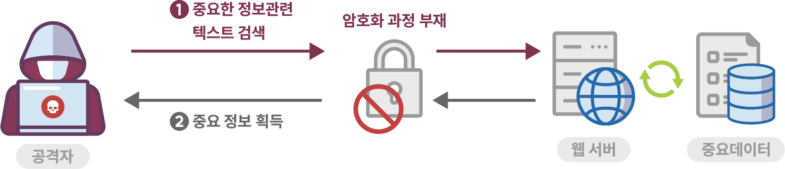

사용자 또는 시스템의 중요 정보가 포함된 데이터를 평문으로 송·수신 또는 저장 시 인가되지 않은 사용자에게 민감한 정보가 노출될 수 있다.

#### 나. 안전한 코딩기법

중요정보를 저장하거나 통신채널로 전송할 때는 반드시 암호화 과정을 거쳐야 하며 가능하다면 SSL 또는 HTTPS 등과 같은 보안 채널을 사용해야 한다.

#### 다. 코드예제

**안전하지 않은 코드** (평문저장)

```javascript
function updatePass(dbconn, password, user_id) {
  // 암호화되지 않은 비밀번호를 DB에 저장하는 경우 위험함
  const sql = 'UPDATE user SET password=? WHERE user_id=?';
  const params = [password, user_id];
  dbconn.query(sql, params, function(err, rows, fields){
    if (err) console.log(err);
  })
}
```

**안전한 코드** (평문저장)

```javascript
const crypto = require("crypto");
function updatePass(dbconn, password, user_id, salt) {
  // 단방향 암호화를 이용하여 비밀번호를 암호화
  const sql = 'UPDATE user SET password=? WHERE user_id=?';
  const hashPw = crypto.createHash('sha256').update(password + salt, 'utf-8').digest('hex');
  const params = [hashPw, user_id];
  dbconn.query(sql, params, function(err, rows, fields){
    if (err) console.log(err);
  })
}
```

**안전하지 않은 코드** (평문전송)

```javascript
const { io } = require("socket.io-client");
const socket = io("http://localhost:3000");
function sendPassword(password) {
  // 패스워드를 암호화 하지 않고 전송하여 안전하지 않음
  socket.emit("password", password);
}
socket.on("password", function(data) {
  if (data === 'success') {
    console.log("\nSuccess to send a message to a server \n")
  }
});
```

**안전한 코드** (평문전송)

```javascript
const { io } = require("socket.io-client");
const crypto = require("crypto");
const socket = io("http://localhost:3000");
const PASSWORD = getPassword();
function aesEncrypt(plainText) {
  const key = getCryptKey();
  const iv = getCryptIV();
  const cipherAes = crypto.createCipheriv('aes-256-cbc', key, iv);
  const encryptedData = cipherAes.update(plainText, 'utf8', 'base64');
  const finalEncryptedData = cipherAes.final('base64');
  return encryptedData + finalEncryptedData;
}
function sendPassword(password) {
  // 패스워드 등 중요정보는 암호화하여 전송하는 것이 안전함
  const encPassword = aesEncrypt(password);
  socket.emit("password", encPassword);
}
socket.on("password", function(data) {
  if (data === 'success') {
    console.log("\nSuccess to send a message to a server \n")
  }
});
```

#### 라. 참고자료

- [CWE-312: Cleartext Storage of Sensitive Information, MITRE](https://cwe.mitre.org/data/definitions/312.html)
- [CWE-319: Cleartext Transmission of Sensitive Information, MITRE](https://cwe.mitre.org/data/definitions/319.html)
- [Password Plaintext Storage, OWASP](https://owasp.org/www-community/vulnerabilities/Password_Plaintext_Storage)

---

### 6. 하드코드된 중요정보

> VanillaJS: O / ReactJS: O / ExpressJS: O

#### 가. 개요

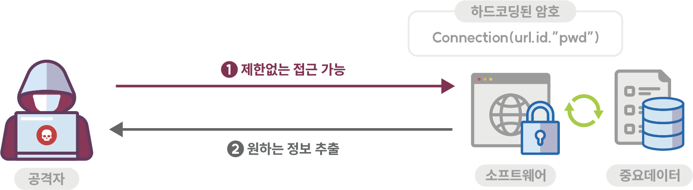

프로그램 코드 내부에 하드코드된 패스워드를 포함하고, 이를 이용해 내부 인증에 사용하거나 외부 컴포넌트와 통신을 하는 경우 관리자의 정보가 노출될 수 있어 위험하다. 또한 하드코드된 암호화 키를 사용해 암호화를 수행하면 암호화된 정보가 유출될 가능성이 높아진다.

#### 나. 안전한 코딩기법

패스워드는 암호화 후 별도의 파일에 저장하여 사용한다. 또한 중요 정보 암호화 시 상수가 아닌 암호화 키를 사용하도록 하며 암호화가 잘 되었더라도 코드 내부에 상수 형태의 암호화 키를 주석으로 달거나 저장하지 않도록 한다.

#### 다. 코드예제

**안전하지 않은 코드**

```javascript
const express = require('express');
const mysql = require("mysql");
const crypto = require("crypto");
const dbQuery = "SELECT email, name FROM user WHERE name = 'test'";
router.get("/vuln", (req, res) => {
  // 데이터베이스 연결에 필요한 인증 정보가 평문으로 하드코딩되어 있음
  const connection = mysql.createConnection({
    host: 'localhost',
    user: 'root',
    password: 'root1234',
    database: 'javascript',
    port: 3306,
  });      
  connection.query(
    dbQuery, (err, result) => {
      if (err) return res.send(err);
        return res.send(result);
  })
});
```

**안전한 코드**

```javascript
const express = require('express');
const mysql = require("mysql");
const crypto = require("crypto");
const dbQuery = "SELECT email, name FROM user WHERE name = 'test'";
const key = getCryptKey(); // 32bytes
const iv = getCryptIV(); // 16bytes
router.get("/patched", (req, res) => {
  // 설정파일에 암호화 되어 있는 user, password 정보를 가져와 복호화 한 후 사용
  const decipher = crypto.createDecipheriv('aes-256-cbc', key, iv);
  const user = decipher.update(process.env.USER, 'base64', 'utf8') + decipher.final('utf8');
  const decipher2 = crypto.createDecipheriv('aes-256-cbc', key, iv);
  const password = decipher2.update(process.env.PASSWORD, 'base64', 'utf8') + decipher2.final('utf8');
  // DB 연결 정보도 설정파일에서 가져와 사용
  const connection = mysql.createConnection({
    host: process.env.DB_HOST,
    user: user,
    password: password,
    database: process.env.DB_NAME,
    port: process.env.PORT,
  });
 ...
```

#### 라. 참고자료

- [CWE-259: Use of Hard-coded Password, MITRE](https://cwe.mitre.org/data/definitions/259.html)
- [CWE-321: Use of Hard-coded Cryptographic Key, MITRE](https://cwe.mitre.org/data/definitions/321.html)
- [Use of hard-coded password, OWASP](https://owasp.org/www-community/vulnerabilities/Use_of_hard-coded_password)
- [Hard-coded credentials are security-sensitive, sona-rules](https://rules.sonarsource.com/javascript/RSPEC-2068)

---

### 7. 충분하지 않은 키 길이 사용

> VanillaJS: O / ReactJS: O / ExpressJS: O

#### 가. 개요

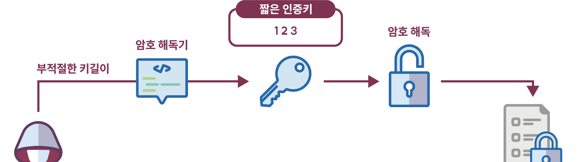

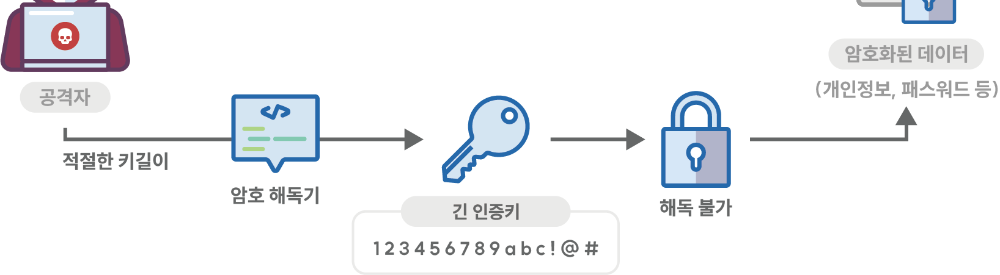

짧은 길이의 키를 사용하는 것은 암호화 알고리즘을 취약하게 만들 수 있다. 검증된 암호화 알고리즘을 사용하더라도 키 길이가 충분히 길지 않으면 짧은 시간 안에 키를 찾아낼 수 있다.

#### 나. 안전한 코딩기법

RSA 알고리즘은 적어도 2,048 비트 이상의 길이를 가진 키와 함께 사용해야 하고 대칭 암호화 알고리즘의 경우에는 적어도 보안 강도 112비트 이상을 지원하는 알고리즘을 사용해야 한다.

#### 다. 코드예제

**안전하지 않은 코드**

```javascript
const crypto = require("crypto");
function vulnMakeRsaKeyPair() {
  // RSA키 길이를 1024 비트로 설정하는 경우 안전하지 않음
  const { publicKey, privateKey } = crypto.generateKeyPairSync('rsa',
  {
    modulusLength: 1024,
    publicKeyEncoding: { type: "spki", format: 'pem' },
    privateKeyEncoding: { type: "pkcs8", format: 'pem' }
  });
  return { PRIVATE: publicKey, PUBLIC: privateKey }
}
function vulnMakeEcc() {
  // ECC 키 길이가 224비트 이하이면 안전하지 않음
  const { publicKey, privateKey } = crypto.generateKeyPairSync('ec', {
    namedCurve: 'secp192k1',
    publicKeyEncoding: { type: 'spki', format: 'der' },
    privateKeyEncoding: { type: 'pkcs8', format: 'der' }
  });
  return { PRIVATE: publicKey.toString('hex'), PUBLIC: privateKey.toString('hex') }
}
```

**안전한 코드**

```javascript
const crypto = require("crypto");
function vulnMakeRsaKeyPair() {
  // RSA키 길이를 2048 비트로 설정해 안전함
  const { publicKey, privateKey } = crypto.generateKeyPairSync('rsa',
  {
    modulusLength: 2048,
    publicKeyEncoding: { type: "spki", format: 'pem' },
    privateKeyEncoding: { type: "pkcs8", format: 'pem' }
  });
  return { PRIVATE: publicKey, PUBLIC: privateKey }
}
function vulnMakeEcc() {
  // ECC 키 길이를 256 비트로 설정해 안전함
  const { publicKey, privateKey } = crypto.generateKeyPairSync('ec', {
    namedCurve: 'secp256k1',
    publicKeyEncoding: { type: 'spki', format: 'der' },
    privateKeyEncoding: { type: 'pkcs8', format: 'der' }
  });
  return { PRIVATE: publicKey.toString('hex'), PUBLIC: privateKey.toString('hex') }
}
```

#### 라. 참고자료

- [CWE-326: Inadequate Encryption Strength, MITRE](https://cwe.mitre.org/data/definitions/326.html)
- [암호 알고리즘 및 키 길이 이용 안내서, KISA](https://www.kisa.or.kr/2060305/form?postSeq=5&lang_type=KO#fnPostAttachDownload)

---

### 8. 적절하지 않은 난수 값 사용

> VanillaJS: O / ReactJS: O / ExpressJS: O

#### 가. 개요

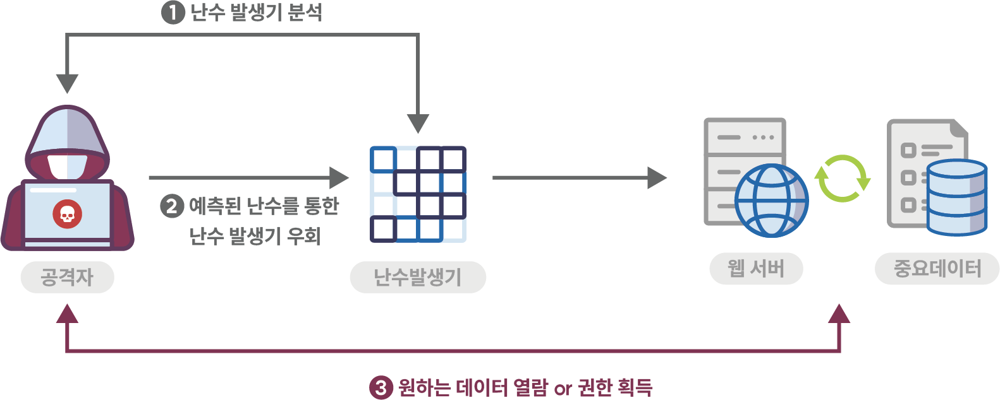

예측 불가능한 숫자가 필요한 상황에서 예측 가능한 난수를 사용한다면 공격자가 생성되는 다음 숫자를 예상해 시스템을 공격할 수 있다.

#### 나. 안전한 코딩기법

NodeJS 엔진에서는 crypto.getRandomBytes를 사용해 암호학적으로 안전한 의사 난수 바이트를 생성할 수 있다. 브라우저에서는 RandomSource.getRandomValues를 사용한다.

#### 다. 코드예제

**안전하지 않은 코드**

```javascript
function getOtpNumber() {
  let randomStr = '';
  // Math.random 라이브러리는 보안기능에 사용하면 위험함
  for (let i = 0; i < 6; i++) {
    randomStr += String(Math.floor(Math.random() * 10))
  }
  return randomStr;
}
```

**안전한 코드**

```javascript
const crypto = require("crypto");
function getOtpNumber() {
  // 보안기능에 적합한 난수 생성용 crypto 라이브러리 사용
  const array = new Uint32Array(1);
  // 브라우저에서는 crypto 대신에 window.crypto를 사용
  const randomStr = crypto.getRandomValues(array);
  let result;
  for (let i = 0; i < randomStr.length; i++) {
    result = array[i];
  }
  return String(result).substring(0, 6);
}
```

#### 라. 참고자료

- [CWE-330: Use of Insufficiently Random Values, MITRE](https://cwe.mitre.org/data/definitions/330.html)
- [Insecure Randomness, OWASP](https://owasp.org/www-community/vulnerabilities/Insecure_Randomness)

---

### 9. 취약한 패스워드 허용

> VanillaJS: O / ReactJS: O / ExpressJS: O

#### 가. 개요

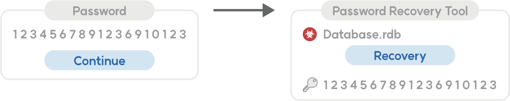

강한 패스워드 조합 규칙을 사용하도록 강제하지 않으면 패스워드 공격으로부터 사용자 계정이 위험에 빠질 수 있다.

#### 나. 안전한 코딩기법

패스워드 생성 시 강한 조건 검증을 수행한다. 패스워드는 숫자와 영문자, 특수문자 등을 혼합하여 사용하고 주기적으로 변경하여 사용하도록 해야 한다.

#### 다. 코드예제

**안전하지 않은 코드**

```javascript
const express = require('express');
const mysql = require("mysql");
const connection = mysql.createConnection( ... );
  
router.post("/vuln", (req, res) => {
  const con = connection;
  const { email, password, name } = req.body;
  // 패스워드 생성 규칙 검증 없이 회원 가입 처리
  con.query(
    "INSERT INTO user (email, password, name) VALUES (?, ?, ?)",
    [email, password, name],
    (err, result) => {
      if (err) return res.send(err);
      return res.send("회원가입 성공");
    });
});
```

**안전한 코드**

```javascript
const express = require('express');
const mysql = require("mysql");
const connection = mysql.createConnection(...);
  
router.post("/patched", (req, res) => {
  const con = connection;
  const { email, password, name } = req.body;
  function checkPassword(password) {
    // 2종 이상 문자로 구성된 8자리 이상 비밀번호 검사 정규식
    const pt1 = /^(?=.*[A-Z])(?=.*[a-z])[A-Za-z\d!@#$%^&*]{8,}$/;
    const pt2 = /^(?=.*[A-Z])(?=.*\d)[A-Za-z\d!@#$%^&*]{8,}$/;
    const pt3 = /^(?=.*[A-Z])(?=.*[!@#$%^&*])[A-Za-z\d!@#$%^&*]{8,}$/;
    const pt4 = /^(?=.*[a-z])(?=.*\d)[A-Za-z\d!@#$%^&*]{8,}$/;
    const pt5 = /^(?=.*[a-z])(?=.*[!@#$%^&*])[A-Za-z\d!@#$%^&*]{8,}$/;
    const pt6 = /^(?=.*\d)(?=.*[!@#$%^&*])[A-Za-z\d!@#$%^&*]{8,}$/;
    // 문자 구성 상관없이 10자리 이상 비밀번호 검사 정규식
    const pt7 = /^[A-Za-z\d!@#$%^&*]{10,}$/;
    for (let pt of [pt1, pt2, pt3, pt4, pt5, pt6, pt7]) {
      if (pt.test(password)) return true;
    }
    return false;
  }
  if (checkPassword(password)) {
    con.query(
      "INSERT INTO user (email, password, name) VALUES (?, ?, ?)",
      [email, password, name],
      (err, result) => {
        if (err) return res.send(err);
        return res.send("회원가입 성공");
      }
    );
  } else {
     return res.send("비밀번호는 영문 대문자, 소문자, 숫자, 특수문자 조합 중 2가지 이상 8자리이거나 문자 구성 상관없이 10자리 이상이어야 합니다.");
  }
});
```

#### 라. 참고자료

- [CWE-521: Weak Password Requirements, MITRE](https://cwe.mitre.org/data/definitions/521.html)
- [Authentication Cheat Sheet, OWASP](https://cheatsheetseries.owasp.org/cheatsheets/Authentication_Cheat_Sheet.html)

---

### 10. 부적절한 전자서명 확인

> VanillaJS: - / ReactJS: - / ExpressJS: O

#### 가. 개요

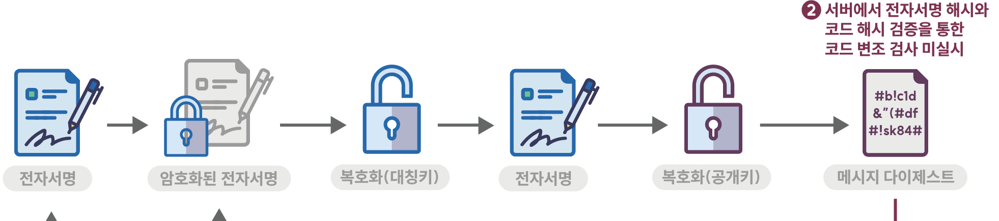

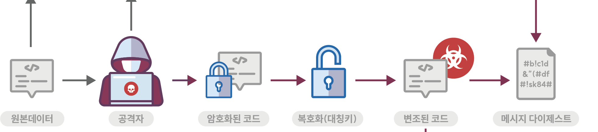

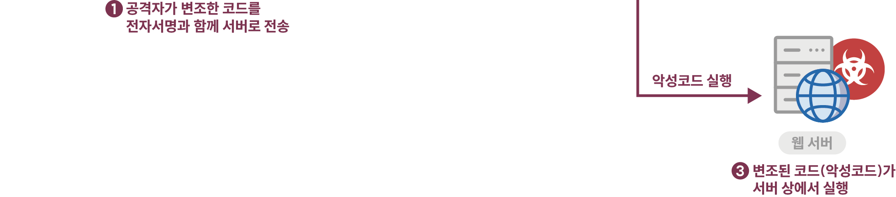

프로그램, 라이브러리, 코드의 전자서명에 대한 유효성 검증이 적절하지 않아 공격자의 악의적인 코드가 실행 가능한 보안약점이다. 데이터 전송 또는 다운로드 시 함께 전달되는 전자서명은 원문 데이터의 암호화된 해쉬 값으로, 수신측에서 이 서명을 검증해 데이터 변조 여부를 확인할 수 있다.

#### 나. 안전한 코딩기법

주요 데이터 전송 또는 다운로드 시 데이터에 대한 전자서명을 함께 전송하고 수신측에서는 전달 받은 전자서명을 검증해 파일의 변조 여부를 확인해야 한다.

#### 다. 코드예제

**안전하지 않은 코드**

```javascript
const express = require('express');
const crypto = require("crypto");
const fs = require('fs');
 
router.post("/vuln", (req, res) => {
  // 클라이언트로부터 전달받은 데이터(전자서명을 수신 처리 하지 않음)
  const { encrypted_msg } = req.body;
  let secret_key;
  fs.readFile('/keys/secret_key.out', 'utf8', (err, data) => {
    if (err) { console.error(err); return; }
    secret_key = data;
  }
  const decrypted = decrypt_with_symmetric_key(encrypted_msg, secret_key);
  // 클라이언트로부터 전달 받은 코드 실행
  eval(decrypted);
  res.send('요청한 코드를 실행했습니다');
});
```

**안전한 코드**

```javascript
const express = require('express');
const crypto = require("crypto");
router.post("/patched", (req, res) => {
  const { encrypted_msg, encrypted_sig, client_pub_key } = req.body;
  let secret_key;
  fs.readFile('/keys/secret_key.out', 'utf8', (err, data) => {
    if (err) { console.error(err); return; }
    secret_key = data;
  }
  // 대칭키로 클라이언트 데이터 및 전자서명 복호화
  const decrypted_msg = decrypt_with_symmetric_key(encrypted_msg);
  const decrypted_sig = decrypt_with_symmetric_key(encrypted_sig);
  // 전자서명 검증에 통과한 경우에만 데이터 실행
  if (verify_digit_signature(decrypted_msg, decrypted_sig, client_pub_key)) {
    eval(decrypted_msg);
    res.send('요청한 코드를 실행했습니다');
  } else {
    res.send('[!] 에러 - 서명이 올바르지 않습니다.');
  }
});
```

#### 라. 참고자료

- [CWE-347: Improper Verification of Cryptographic Signature, MITRE](https://cwe.mitre.org/data/definitions/347.html)
- [Class: verify, NodeJS](https://nodejs.org/api/crypto.html#class-verify)

---

### 11. 부적절한 인증서 유효성 검증

> VanillaJS: - / ReactJS: - / ExpressJS: O

#### 가. 개요

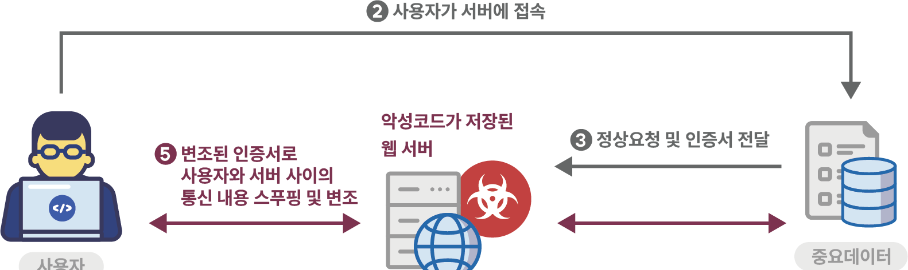

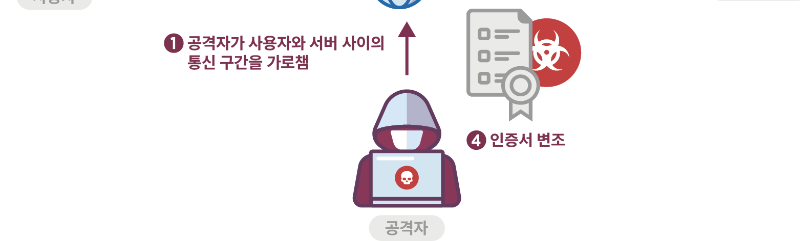

인증서가 유효하지 않거나 악성인 경우 공격자가 호스트와 클라이언트 사이의 통신 구간을 가로채 신뢰하는 엔티티인 것처럼 속일 수 있다.

#### 나. 안전한 코딩기법

데이터 통신에 인증서를 사용하는 경우 송신측에서 전달한 인증서가 유효한지 검증한 후 데이터를 송수신해야 한다.

#### 다. 코드예제

**안전하지 않은 코드**

```javascript
const https = require('https');
const getServer = () => {
  const options = {
    hostname: "dangerous.website",
    port: 443,
    method: "GET",
    path: "/",
    // 유효하지 않은 인증서를 가지고 있어도 무시하는 옵션으로 안전하지 않음
    rejectUnauthorized: false 
  };
  https.request(options, (response) => {
    console.log('response - ', response.statusCode);
  });
});
```

**안전한 코드**

```javascript
const express = require('express');
const https = require('https');
const getServer = () => {
  const options = {
    hostname: "dangerous.website",
    port: 443,
    method: "GET",
    path: "/",
    // 유효하지 않은 인증서 발견 시 예외 발생
    rejectUnauthorized: true 
  };
  const hreq = https.request(options, (response) => {
    console.log('response - ', response.statusCode);
  });
  hreq.on('error', (e) => {
    console.error('에러발생 - ', e);
  });
});
```

#### 라. 참고자료

- [CWE-295: Improper Certificate Validation, MITRE](https://cwe.mitre.org/data/definitions/295.html)
- [https, NodeJS](https://nodejs.org/api/https.html#httpsrequestoptions-callback)

---

### 12. 사용자 하드디스크에 저장되는 쿠키를 통한 정보 노출

> VanillaJS: - / ReactJS: - / ExpressJS: O

#### 가. 개요

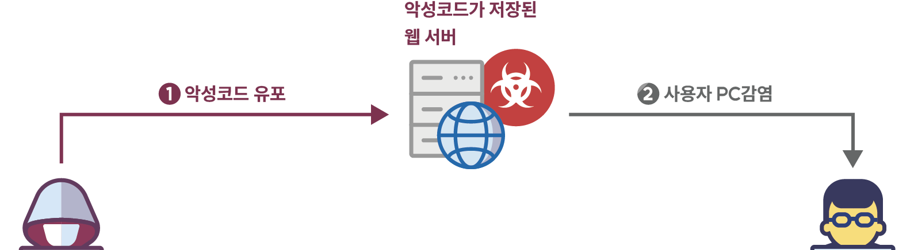

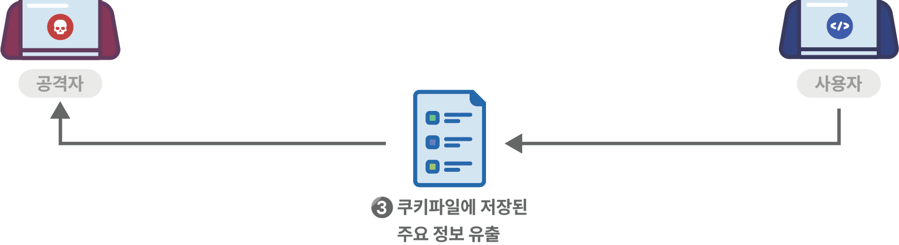

영속적인 쿠키(Persistent Cookie)에 개인정보, 인증 정보 등이 저장된다면 공격자는 쿠키에 접근할 수 있는 보다 많은 기회를 가지게 된다.

#### 나. 안전한 코딩기법

쿠키의 만료시간은 세션 지속 시간을 고려하여 최소한으로 설정하고 영속적인 쿠키에는 중요 정보가 포함되지 않도록 한다.

#### 다. 코드예제

**안전하지 않은 코드**

```javascript
const express = require('express');
router.get("/vuln", (req, res) => {
  // 쿠키의 만료 시간을 1년으로 과도하게 길게 설정하고 있어 안전하지 않다
  res.cookie('rememberme', '1', {
    expires: new Date(Date.now() + 365*24*60*60*1000)
  });
  return res.send("쿠키 발급 완료");
});
```

**안전한 코드**

```javascript
const express = require('express');
router.get("/patched", (req, res) => {
  // 쿠키의 만료 시간을 적절하게 부여하고 secure 옵션을 활성화
  res.cookie('rememberme', '1', {
    expires: new Date(Date.now() + 60*60*1000),
    secure: true,
    httpOnly: true
  });
  return res.send("쿠키 발급 완료");
});
```

#### 라. 참고자료

- [CWE-539: Use of Persistent Cookies Containing Sensitive Information, MITRE](https://cwe.mitre.org/data/definitions/539.html)

---

### 13. 주석문 안에 포함된 시스템 주요정보

> VanillaJS: O / ReactJS: O / ExpressJS: O

#### 가. 개요

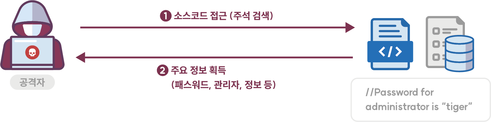

소프트웨어 개발자가 편의를 위해서 주석문에 패스워드를 적어둔 경우 공격자가 소스코드에 접근할 수 있다면 시스템에 손쉽게 침입할 수 있다.

#### 나. 안전한 코딩기법

주석에는 아이디, 패스워드 등 보안과 관련된 내용을 기입하지 않는다.

#### 다. 코드예제

**안전하지 않은 코드**

```javascript
const express = require('express');
router.post("/vuln", (req, res) => {
  // 주석문에 포함된 중요 시스템의 인증 정보
  // id = admin
  // password = 1234
  const result = login(req.body.id, req.body.password);
  return res.send(result);
});
```

**안전한 코드**

```javascript
const express = require('express');
router.post("/vuln", (req, res) => {
  // 주석문에 포함된 민감한 정보는 삭제
  const result = login(req.body.id, req.body.password);
  return res.send(result);
});
```

#### 라. 참고자료

- [CWE-615: Inclusion of Sensitive Information in Source Code Comments, MITRE](https://cwe.mitre.org/data/definitions/615.html)

---

### 14. 솔트 없이 일방향 해쉬 함수 사용

> VanillaJS: - / ReactJS: - / ExpressJS: O

#### 가. 개요

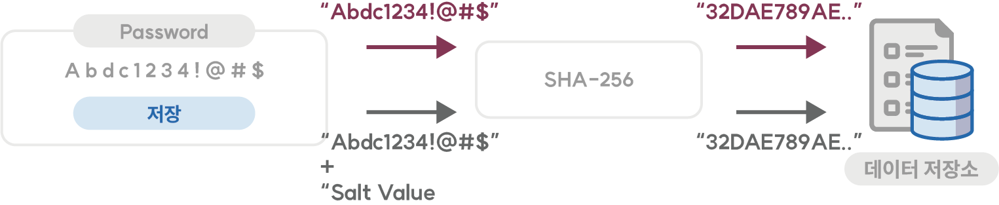

중요정보를 솔트(Salt)없이 일방향 해쉬 함수를 사용해 저장한다면 공격자는 미리 계산된 레인보우 테이블을 이용해 해쉬값을 알아낼 수 있다.

#### 나. 안전한 코딩기법

솔트값은 사용자별로 유일하게 생성해야 하며, 이를 위해 사용자별 솔트 값을 별도로 저장하는 과정이 필요하다.

#### 다. 코드예제

**안전하지 않은 코드**

```javascript
const crypto = require("crypto");
function getHashFromPwd(pw) {
  // salt가 없이 생성된 해쉬값은 강도가 약해 취약
  const hash = crypto.createHash('sha256').update(pw).digest('hex');
  return hash;
}
```

**안전한 코드**

```javascript
const crypto = require("crypto");
function getHashFromPwd(pw) {
  // 솔트 값을 사용하면 길이가 짧은 패스워드로도 고강도의 해쉬를 생성할 수 있음
  const salt = crypto.randomBytes(16).toString('hex');
  const hash = crypto.createHash('sha256').update(pw + salt).digest('hex');
  return { hash, salt };
}
```

#### 라. 참고자료

- [CWE-759: Use of a One-Way Hash without a Salt, MITRE](https://cwe.mitre.org/data/definitions/759.html)
- [Password Storage Cheat Sheet - Salting, OWASP](https://cheatsheetseries.owasp.org/cheatsheets/Password_Storage_Cheat_Sheet.html#salting)

---

### 15. 무결성 검사없는 코드 다운로드

> VanillaJS: - / ReactJS: - / ExpressJS: O

#### 가. 개요

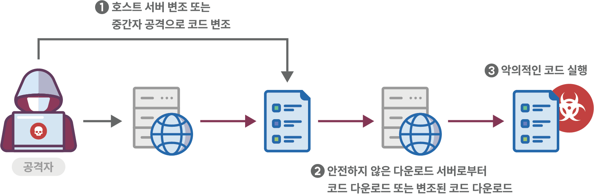

원격지에 위치한 소스코드 또는 실행 파일을 무결성 검사 없이 다운로드 후 이를 실행하는 프로그램은 DNS 스푸핑(Spoofing) 또는 전송 시의 코드 변조 등의 방법을 이용해 공격자가 악의적인 코드를 실행하는 위협에 노출시킬 수 있다.

#### 나. 안전한 코딩기법

소스코드는 신뢰할 수 있는 사이트에서만 다운로드해야 하고 파일의 인증서 또는 해쉬값을 검사해 변조되지 않은 파일인지 확인하여야 한다.

#### 다. 코드예제

**안전하지 않은 코드**

```javascript
const express = require('express');
const fs = require("fs");
const http = require("http");
router.get("/vuln", (req, res) => {
  const url = "https://www.somewhere.com/storage/code.js";
  http.get(url, (res) => {
    const path = "./temp/sample1.js"
    const writeStream = fs.createWriteStream(path);
    res.pipe(writeStream);
    writeStream.on("finish", () => { writeStream.close(); });
  });
  // 무결성 검증 없이 파일 사용
  fs.readFile("./temp/sample1.js", "utf8", function (err, buf) {
    res.end(buf);
  })
});
```

**안전한 코드**

```javascript
const express = require('express');
const fs = require("fs");
const http = require("http");
const crypto = require("crypto");
router.get("/patched", async (req, res) => {
  const url = "https://www.somewhere.com/storage/code.js";
  const codeHash = req.body.codeHash;
  http.get(url, (res) => {
    const path = "./temp/sample1.js"
    const writeStream = fs.createWriteStream(path);
    res.pipe(writeStream);
    writeStream.on("finish", () => { writeStream.close(); });
  });
  const hash = crypto.createHash('sha256');
  const input = fs.createReadStream("./temp/sample1.js");
  let promise = new Promise ((resolve, reject) => { 
    input.on("readable", () => {
      const data = input.read();
        if (data) { hash.update(data); }
        else { resolve(); }
     })
  });
  await promise;
  const fileHash = hash.digest('hex');
  // 무결성 검증에 통과할 경우에만 파일 사용
  if (fileHash === codeHash) {
    fs.readFile("./temp/sample1.js", "utf8", function (err, buf) {
      res.end(buf);
    })
  } else {
    return res.send("파일이 손상되었습니다.")
  }  
});
```

#### 라. 참고자료

- [CWE-494: Download of Code Without Integrity Check, MITRE](https://cwe.mitre.org/data/definitions/494.html)

---

### 16. 반복된 인증시도 제한 기능 부재

> VanillaJS: O / ReactJS: O / ExpressJS: O

#### 가. 개요

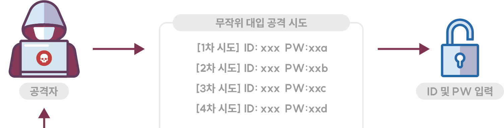

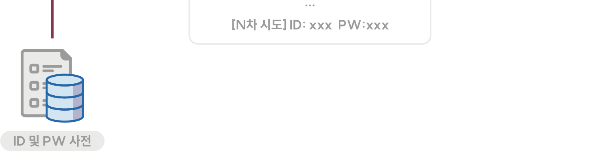

일정 시간 내에 여러 번의 인증 시도 시 계정 잠금 또는 추가 인증 방법 등의 충분한 조치가 수행되지 않는 경우 공격자는 무차별 대입(brute-force)하여 로그인 성공 및 권한 획득이 가능하다.

#### 나. 안전한 코딩기법

최대 인증시도 횟수를 적절한 횟수로 제한하고 설정된 인증 실패 횟수를 초과할 경우 계정을 잠금 하거나 추가적인 인증 과정을 거쳐서 시스템에 접근이 가능하도록 한다.

#### 다. 코드예제

**안전하지 않은 코드**

```javascript
const express = require('express');
const crypto = require('crypto');
router.post("/vuln", (req, res) => {
  const id = req.body.id;
  const password = req.body.password;
  const hashPassword = crypto.createHash("sha512").update(password).digest("base64");
  const currentHashPassword = getUserPasswordFromDB(id);
  
  // 인증 시도에 따른 제한이 없어 반복적인 인증 시도가 가능
  if (hashPassword === currentHashPassword) {
    return res.send("login success");
  } else {
    return res.send("login fail")
  }
});
```

**안전한 코드**

```javascript
const express = require('express');
const crypto = require('crypto');
const LOGIN_TRY_LIMIT = 5;
router.post("/patched", (req, res) => {
  const id = req.body.id;
  const password = req.body.password;
  // 로그인 실패기록 가져오기
  const loginFailCount = getUserLoginFailCount(id);
  // 로그인 실패횟수 초과로 인해 잠금된 계정에 대한 인증 시도 제한
  if (loginFailCount >= LOGIN_TRY_LIMIT) {
    return res.send("account lock(too many failed)")
  } 
  // 해시 생성시 솔트를 사용하는 것이 안전하나, 코드의 복잡성을 피하기 위해 생략
  const hashPassword = crypto.createHash("sha512").update(password).digest("base64");
  const currentHashPassword = getUserPasswordFromDB(id);
  if (hashPassword === currentHashPassword) {
    deleteUserLoginFailCount(id);
    return res.send("login success");
  } else {
    updateUserLoginFailCount(id);
    return res.send("login fail")
  }
});
```

#### 라. 참고자료

- [CWE-307: Improper Restriction of Excessive Authentication Attempts, MITRE](https://cwe.mitre.org/data/definitions/307.html)
- [Blocking Brute Force Attacks, OWASP](https://owasp.org/www-community/controls/Blocking_Brute_Force_Attacks)

---

## 제3절 시간 및 상태

> VanillaJS: O / ReactJS: O / ExpressJS: O

동시 또는 거의 동시에 여러 코드 수행을 지원하는 병렬 시스템이나 하나 이상의 프로세스가 동작되는 환경에서 시간 및 상태를 부적절하게 관리하여 발생할 수 있는 보안약점이다.

### 1. 종료되지 않는 반복문 또는 재귀 함수

#### 가. 개요

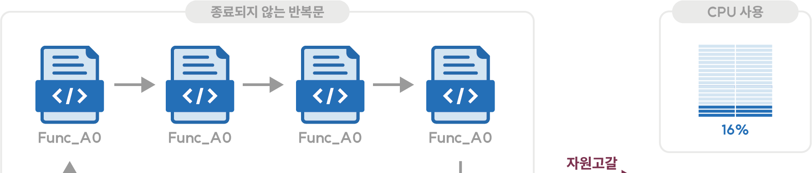

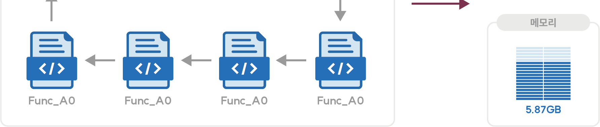

재귀 함수의 순환 횟수를 제어하지 못해 할당된 메모리나 프로그램 스택 등의 자원을 과도하게 초과해 사용하면 위험하다. 대부분의 경우 기본 케이스(Base Case)가 정의되어 있지 않은 재귀 함수는 무한 루프에 빠져들게 되고 자원고갈을 유발한다.

#### 나. 안전한 코딩기법

모든 재귀 호출 시 호출 횟수를 제한하거나 재귀 함수 종료 조건을 명확히 정의해 호출을 제어해야 한다.

#### 다. 코드예제

**안전하지 않은 코드**

```javascript
function factorial(x) {
  // 재귀함수 탈출조건을 설정하지 않아 동작 중 에러 발생
  return x * factorial(x - 1);
}
```

**안전한 코드**

```javascript
function factorial(x) {
  // 재귀함수 사용 시에는 탈출 조건을 명시해야 한다
  if ( x === 0 ) {
    return;
  }
  else {
     return x * factorial(x - 1);
  }
}
```

#### 라. 참고자료

- [CWE-674: Uncontrolled Recursion, MITRE](https://cwe.mitre.org/data/definitions/674.html)
- [CWE-835: Loop with Unreachable Exit Condition ('Infinite Loop'), MITRE](https://cwe.mitre.org/data/definitions/835.html)

---

## 제4절 에러처리

에러를 처리하지 않거나, 불충분하게 처리하여 에러 정보에 중요정보(시스템 내부정보 등)가 포함될 때 발생할 수 있는 보안약점이다.

### 1. 오류 메시지 정보노출

> VanillaJS: - / ReactJS: O / ExpressJS: O

#### 가. 개요

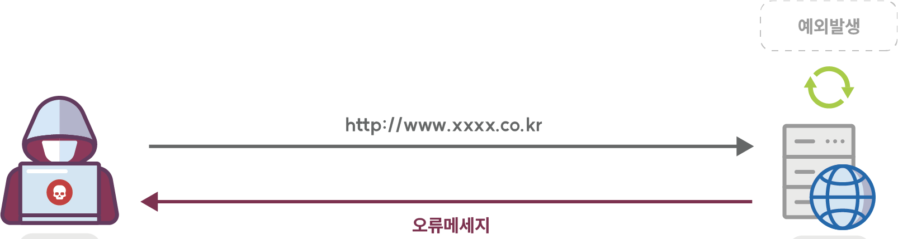

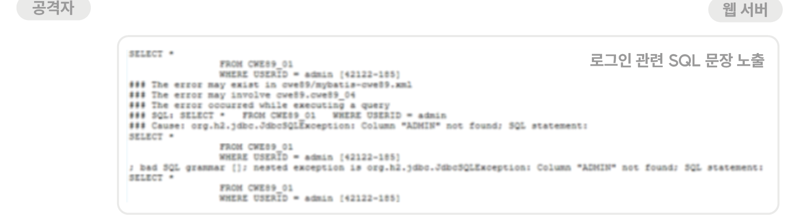

응용 프로그램이 실행환경, 사용자 등 관련 데이터에 대한 민감한 정보를 포함하는 오류 메시지를 생성해 외부에 제공하는 경우 공격자의 악성 행위로 이어질 수 있다.

#### 나. 안전한 코딩기법

오류 메시지는 정해진 사용자에게 유용한 최소한의 정보만 포함하도록 한다. Express 프레임워크에서는 미들웨어 방식으로 에러 페이지 핸들러를 정의할 수 있다.

#### 다. 코드예제

**안전하지 않은 코드**

```javascript
const express = require('express');
const fs = require("fs");
router.get("/vuln", (req, res) => {
  const filePath = "./file/secret/password";
  fs.readFile(filePath, (err, data) => {
    if (err) {
      // 서버 내부에서 발생한 에러 메시지를 그대로 사용자에 전달해 주요 정보 노출 위험
      return res.status(500).send(err);
    } else {
      return res.send(data);
    }
  })
});
```

**안전한 코드**

```javascript
const express = require('express');
const fs = require("fs");
router.get("/vuln", (req, res) => {
  const filePath = "./file/secret/password";
  fs.readFile(filePath, (err, data) => {
    if (err) {
      // 에러 내용을 그대로 전달하지 않고 필터링 처리
      return res.status(500).send({ message: "잘못된 요청입니다" });
    } else {
      return res.send(data);
    }
  })
});
```

**안전한 코드** (errorHandler 미들웨어)

```javascript
const express = require("express");
const app = express();
app.use(clientErrorHandler);
app.use(errorHandler);
function clientErrorHandler (err, req, res, next) {
    if (req.xhr) {
      res.status(500).send({ error: 'Something failed!' });
    } else {
      next(err);
    }
}
function errorHandler (err, req, res, next) {
    if (err.name = "ValidError") {
        res.status(400)
        res.render('400error', { error: err }) 
    } else if (err.name = "AuthError") {
        res.status(401)
        res.render('401error', { error: err }) 
    } else if (err.name = "ForbiddenError") {
        res.status(403)
        res.render('403error', { error: err }) 
    } else if (err.name = "DBError") {
        res.status(500)
        res.render('500error', { error: err }) 
    }
}
```

#### 라. 참고자료

- [CWE-209: Generation of Error Message Containing Sensitive Information, MITRE](https://cwe.mitre.org/data/definitions/209.html)
- [Improper Error Handling, OWASP](https://owasp.org/www-community/Improper_Error_Handling)

---

### 2. 오류상황 대응 부재

> VanillaJS: O / ReactJS: O / ExpressJS: O

#### 가. 개요

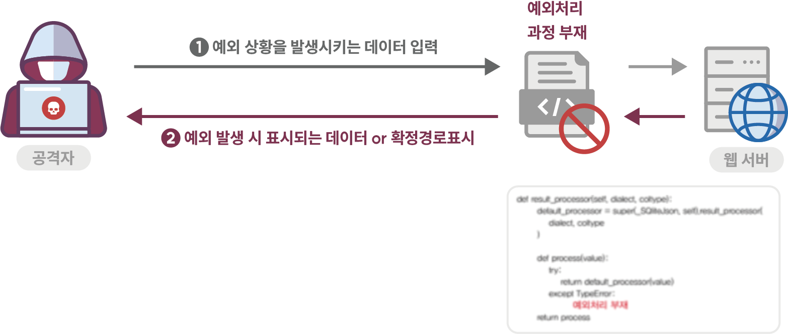

오류가 발생할 수 있는 부분을 확인하였으나 이러한 오류에 대해 예외 처리를 하지 않을 경우 공격자는 오류 상황을 악용해 개발자가 의도하지 않은 방향으로 프로그램이 동작하도록 할 수 있다.

#### 나. 안전한 코딩기법

오류가 발생할 수 있는 부분에 대하여 제어문(try-catch)을 사용해 적절하게 예외 처리 한다.

#### 다. 코드예제

**안전하지 않은 코드**

```javascript
const express = require('express');
const crypto = require("crypto");
const staticKeys = [
    { "key" : "a6823ecf34012b1ca5ca7889f4eabb51", "iv" : "e79ce03b4563647a" }, 
    { "key" : "9e7c30e899f296a1daca7d9a0f92e71c", "iv" : "ab39941053fb5f6a" }
  ];
router.post("/vuln", (req, res) => { 
  let statickKey = { "key" : "00000000000000000000000000000000", "iv" : "0000000000000000" };
  const inputText = req.body.text;
  const keyId = req.body.id;
  try {
    staticKey.key = staticKeys[keyId].key;
    staticKey.iv = staticKeys[keyId].iv;
  } catch (err) {
    // key 선택 중 오류 발생 시 기본으로 설정된 암호화 키인
    // '0000000000000000' 으로 암호화가 수행됨
    console.log(err);
  }
  const cipher = crypto.createCipheriv('aes-256-cbc', statickKey.key, statickKey.iv);
  const encryptedText = cipher.update(inputText, 'utf8', 'base64') + cipher.final('base64');
  return res.send(encryptedText);
});
```

**안전한 코드**

```javascript
const express = require('express');
const crypto = require("crypto");
const staticKeys = [
    { "key" : "a6823ecf34012b1ca5ca7889f4eabb51", "iv" : "e79ce03b4563647a" }, 
    { "key" : "9e7c30e899f296a1daca7d9a0f92e71c", "iv" : "ab39941053fb5f6a" }
  ];
router.post("/vuln", (req, res) => { 
  let statickKey = { "key" : "00000000000000000000000000000000", "iv" : "0000000000000000" };
  const inputText = req.body.text;
  const keyId = req.body.id;
  try {
    staticKey.key = staticKeys[keyId].key;
    staticKey.iv = staticKeys[keyId].iv;
  } catch (err) {
    // 키 선택 중 오류 발생 시 랜덤으로 암호화 키를 생성하도록 설정
    staticKey.key = crypto.randomBytes(16).toString('hex');
    staticKey.iv = crypto.randomBytes(8).toString('hex');
  }
  const cipher = crypto.createCipheriv('aes-256-cbc', statickKey.key, statickKey.iv);
  const encryptedText = cipher.update(inputText, 'utf8', 'base64') + cipher.final('base64');
  return res.send(encryptedText);
});
```

#### 라. 참고자료

- [CWE-390: Detection of Error Condition Without Action, MITRE](https://cwe.mitre.org/data/definitions/390.html)

---

### 3. 부적절한 예외 처리

> VanillaJS: O / ReactJS: O / ExpressJS: O

#### 가. 개요

프로그램 수행 중에 함수의 결과 값에 대한 적절한 처리 또는 예외 상황에 대한 조건을 적절하게 검사 하지 않을 경우 예기치 않은 문제를 야기할 수 있다.

#### 나. 안전한 코딩기법

값을 반환하는 모든 함수의 결과값을 검사해야 한다. 예외 처리를 사용하는 경우에 광범위한 예외 처리 대신 구체적인 예외 처리를 수행한다.

#### 다. 코드예제

안전하지 않은 코드에서는 서로 다른 예외 상황에서도 동일한 에러 메시지만 출력하고, 안전한 코드에서는 발생 가능한 예외를 세분화한 후 예외상황에 따라 적합한 처리를 수행한다. 클라이언트에는 에러 발생 여부만 전달하고 상세 내용은 서버 로그에 기록한다.

#### 라. 참고자료

- [CWE-754: Improper Check for Unusual or Exceptional Conditions, MITRE](https://cwe.mitre.org/data/definitions/754.html)

---

## 제5절 코드오류

타입 변환 오류, 자원(메모리 등)의 부적절한 반환 등과 같이 개발자가 범할 수 있는 코딩 오류로 인해 유발되는 보안약점이다.

### 1. Null Pointer 역참조

> VanillaJS: O / ReactJS: O / ExpressJS: O

#### 가. 개요

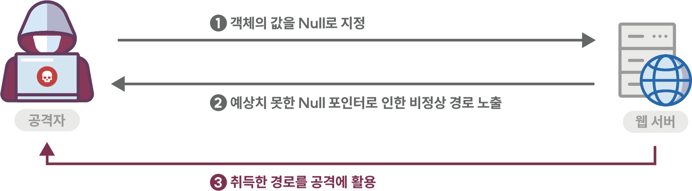

자바스크립트에서는 Null pointer dereference가 발생하지 않는다. 정의되지 않은 변수는 undefined로, null 개체는 null 값을 가지며 '정의되지 않음'과 '없음'을 다르게 처리한다.

#### 나. 안전한 코딩기법

undefined 또는 null이 될 수 있는 데이터를 참조하기 전에 해당 데이터의 값을 정확히 검사하여 시스템 오류를 줄일 수 있다.

#### 다. 코드예제

**안전하지 않은 코드**

```javascript
const express = require('express');
router.get("/vuln", (req, res) => {
  const id = req.query.id;
  // 사용자가 id 값을 전달하지 않을 경우(undefined) 에러 발생
  return res.send("length = " + id.length);
});
```

**안전한 코드**

```javascript
const express = require('express');
router.get("/patched", (req, res) => {
  const id = req.query.id;
  if (id === undefined) {
    // id 값이 전달되지 않을 경우 사용자에게 요구하는 예외 코드 추가
    return res.send("id is required");
  } else {
    return res.send("length = " + id.length);
  }
});
```

#### 라. 참고자료

- [CWE-476: NULL Pointer Dereference, MITRE](https://cwe.mitre.org/data/definitions/476.html)

---

### 2. 부적절한 자원 해제

> VanillaJS: O / ReactJS: O / ExpressJS: O

#### 가. 개요

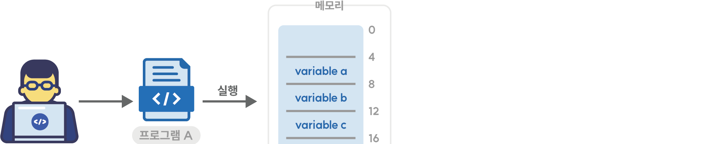


프로그램의 자원(열려 있는 파일, 힙 메모리, 소켓 등)은 유한한 자원이다. 사용이 끝난 자원을 반환하지 못하는 경우에 문제가 발생할 수 있다.

#### 나. 안전한 코딩기법

자원을 획득하여 사용한 다음에는 반드시 자원을 해제 후 반환한다.

#### 다. 코드예제

**안전하지 않은 코드**

```javascript
const express = require('express');
const fs = require('fs');
router.get("/vuln", (req, res) => {
  const configPath = './config.cfg';
  let fid = null;
  let fdata = null;
  try {
    fid = fs.openSync(configPath, 'r');
    fdata = fs.readFileSync(fid, 'utf8');
    fdata = fs.readFileSync('100', 'utf8');
    // try 절에서 할당된 자원이 반환(close)되기 전에 예외가 발생하면
    // 할당된 자원이 시스템에 바로 반환되지 않음
    fs.close(fid, err => {
      if (err) { console.log('error occured while file closing'); }
      else { console.log('file closed'); }
    });   
  } catch (e) {
    console.log('error occured!' , e);
  }
  return res.send(fdata);
});
```

**안전한 코드**

```javascript
const express = require('express');
const fs = require('fs');
router.get("/patched", (req, res) => {
  const configPath = './config.cfg';
  let fid = null;
  let fdata = null;
  try {
    fid = fs.openSync(configPath, 'r');
    fdata = fs.readFileSync(fid, 'utf8');
    fdata = fs.readFileSync(100, 'utf8');
  } catch (e) {
    console.log('error occured!' , e);
  // try 절에서 할당된 자원은 finally 절에서 시스템에 반환을 해야 함
  } finally {
    fs.close(fid, err => {
      if (err) { console.log('error occured while file closing'); }
      else { console.log('file closed'); }
    });
  }
  return res.send(fdata);
});
```

#### 라. 참고자료

- [CWE-404: Improper Resource Shutdown or Release, MITRE](https://cwe.mitre.org/data/definitions/404.html)

---

### 3. 신뢰할 수 없는 데이터의 역직렬화

> VanillaJS: O / ReactJS: - / ExpressJS: O

#### 가. 개요

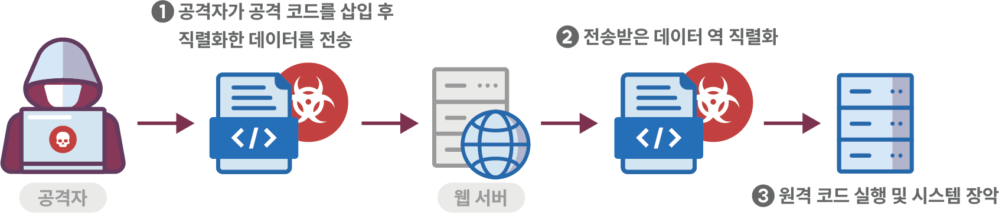

역직렬화(Deserialization)에서 공격자가 전송한 데이터 또는 저장된 스트림을 조작할 수 있는 경우 무결성 침해, 원격 코드 실행, 서비스 거부 공격 등이 발생할 수 있다.

#### 나. 안전한 코딩기법

신뢰할 수 없는 데이터를 역직렬화 하지 않도록 구성한다. 최소한 송신 측에서 서명을 추가하고 수신 측에서 서명을 확인하여 데이터의 무결성을 검증해야 한다.

#### 다. 코드예제

**안전하지 않은 코드**

```javascript
const express = require('express');
const serializedData = req.query.data;
// 사용자로부터 입력받은 알 수 없는 데이터를 역직렬화
const user = JSON.parse(serializedData);
return res.send({user: user.user, isAdmin: user.isAdmin});
```

**안전한 코드**

```javascript
const express = require('express');
const crypto = require('crypto');
const serializedData = req.query.data;
const body = JSON.parse(serializedData);
// 데이터 변조를 확인하기 위한 해시값
const hashedMac = body.hashed;
const userInfo = JSON.stringify(body.userInfo); 
const secretKey = 'secret_key';
const hmac = crypto.createHmac('sha512', secretKey);
hmac.update(userInfo);
const calculatedHMAC = hmac.digest('hex');
// 전달받은 해시값과 직렬화 데이터의 해시값을 비교하여 검증
if (calculatedHMAC === hashedMac) {
    const userObj = JSON.parse(userInfo);
    return res.send(userObj);  
} else {
    return res.send('신뢰할 수 없는 데이터입니다.');
}
```

#### 라. 참고자료

- [CWE-502: Deserialization of Untrusted Data, MITRE](https://cwe.mitre.org/data/definitions/502.html)
- [Deserialization Cheat Sheet, OWASP](https://cheatsheetseries.owasp.org/cheatsheets/Deserialization_Cheat_Sheet.html)

---

## 제6절 캡슐화

중요한 데이터 또는 기능을 불충분하게 캡슐화하거나 잘못 사용함으로써 발생하는 보안약점으로 정보노출, 권한 문제 등이 발생할 수 있다.

### 1. 잘못된 세션에 의한 데이터 정보 노출

> VanillaJS: - / ReactJS: - / ExpressJS: O

#### 가. 개요

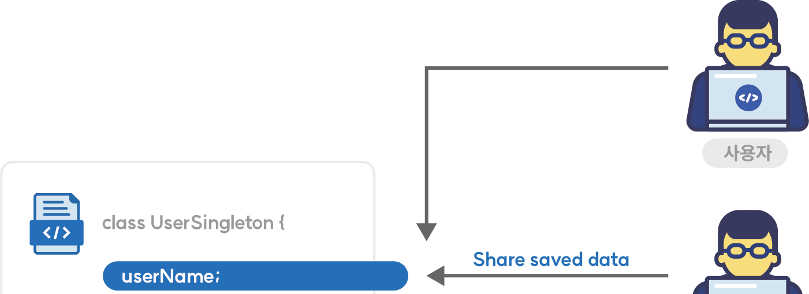

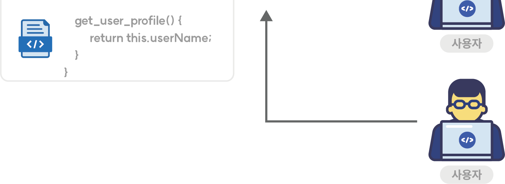

다중 스레드 환경에서는 싱글톤(Singleton) 객체 필드에 경쟁조건(Race Condition)이 발생할 수 있다. 전역 변수가 포함되지 않도록 코드를 작성해 서로 다른 세션에서 데이터를 공유하지 않도록 해야 한다.

#### 다. 코드예제

**안전하지 않은 코드**

```javascript
let instance;
class UserSingleton {
  constructor() {
    this.userName = 'testUser';
    if (instance) { return instance; }
    instance = this;
  }
  getUserProfile() { return this.userName; }
};
router.get("/vuln", (req, res) => {
    const user = new UserSingleton();
    const profile = user.getUserProfile();
    return res.send(profile);
});
```

**안전한 코드**

```javascript
class User {
  constructor() { this.userName = 'testUser'; }
  getUserProfile() { return this.userName; }
};
router.get("/patched", (req, res) => {
    const user = new User();
    const profile = user.getUserProfile();
    return res.send(profile);
});
```

#### 라. 참고자료

- [CWE-488: Exposure of Data Element to Wrong Session, MITRE](https://cwe.mitre.org/data/definitions/488.html)

---

### 2. 제거되지 않고 남은 디버그 코드

> VanillaJS: O / ReactJS: O / ExpressJS: O

#### 가. 개요

디버깅 목적으로 삽입된 코드는 개발이 완료되면 제거해야 한다.

#### 다. 코드예제

**안전한 코드** (ReactJS)

```javascript
// 애플리케이션 진입 코드인 Index.js에 다음 코드를 추가
if (process.env.NODE_ENV === 'production' && typeof window !== 'undefined') {
  console.log = () => {};
}
```

**안전한 코드** (ExpressJS)

```javascript
// 서버 진입 코드인 index.js 내의 서버 구동 부분에 다음 코드 추가
app.listen(80, () => {
  if (!process.env.DEBUG) {
    console.log = function(){}
  }
});
```

#### 라. 참고자료

- [CWE-489: Active Debug Code, MITRE](https://cwe.mitre.org/data/definitions/489.html)

---

### 3. Public 메소드로부터 반환된 Private 배열

> VanillaJS: O / ReactJS: O / ExpressJS: O

#### 가. 개요

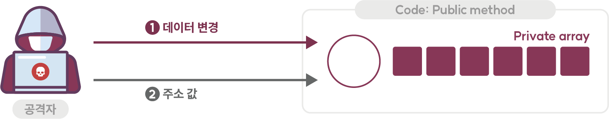

public으로 선언된 메소드에서 배열을 반환하면 해당 배열의 참조 객체가 외부에 공개되어 외부에서 배열 수정과 객체 속성 변경이 가능해진다.

#### 다. 코드예제

**안전하지 않은 코드**

```javascript
class UserObj {
  #privArray = [];
  // private 배열을 리턴하는 public 메소드를 사용하는 경우 취약
  get_private_member = () => {
    return this.#privArray;
  }
}
```

**안전한 코드**

```javascript
class UserObj {
  #privArray = [];
  // private 배열을 반환하는 경우 복사본을 사용
  get_private_member = () => {
    const copied = Object.assign([], this.#privArray);
    return copied;
  }
}
```

#### 라. 참고자료

- [CWE-495: Private Data Structure Returned From A Public Method, MITRE](https://cwe.mitre.org/data/definitions/495.html)

---

### 4. Private 배열에 Public 데이터 할당

> VanillaJS: O / ReactJS: O / ExpressJS: O

#### 가. 개요

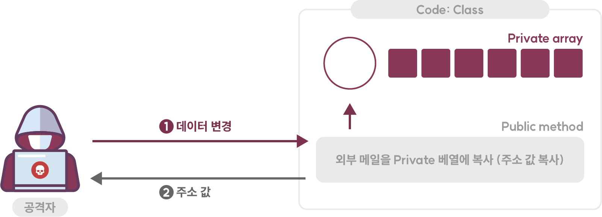

public으로 선언된 메소드의 인자가 private로 선언된 배열에 저장되면 private 배열을 외부에서 접근하여 변경이 가능해진다.

#### 다. 코드예제

**안전하지 않은 코드**

```javascript
class UserObj {
  #privArray = [];
  // private 배열에 외부 값을 바로 대입하는 public 메소드를 사용하는 경우 취약
  set_private_member = (input_list) => {
    this.#privArray = input_list;
  }
}
```

**안전한 코드**

```javascript
class UserObj2 {
  #privArray = [];
  // 사용자가 전달한 값을 private가 아닌 public 배열로 저장
  set_private_member = (input_list) => {
    this.userInput = input_list;
  }
}
```

#### 라. 참고자료

- [CWE-496: Public Data Assigned to Private Array-Typed Field, MITRE](https://cwe.mitre.org/data/definitions/496.html)

---

## 제7절 API 오용

의도된 사용에 반하는 방법으로 API를 사용하거나 보안에 취약한 API를 사용하여 발생할 수 있는 보안약점이다.

### 1. DNS lookup에 의존한 보안결정

> VanillaJS: - / ReactJS: - / ExpressJS: O

#### 가. 개요

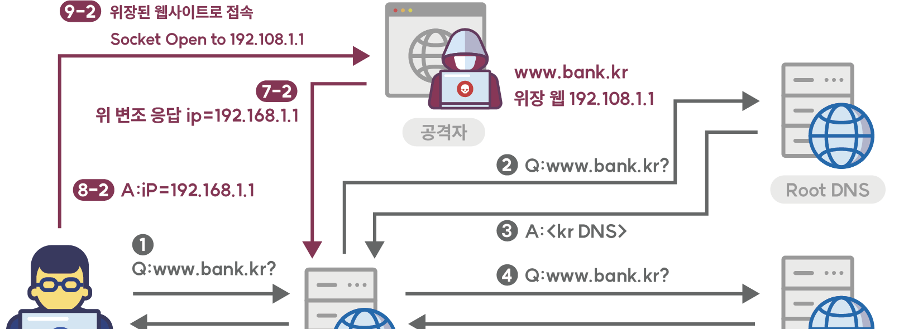

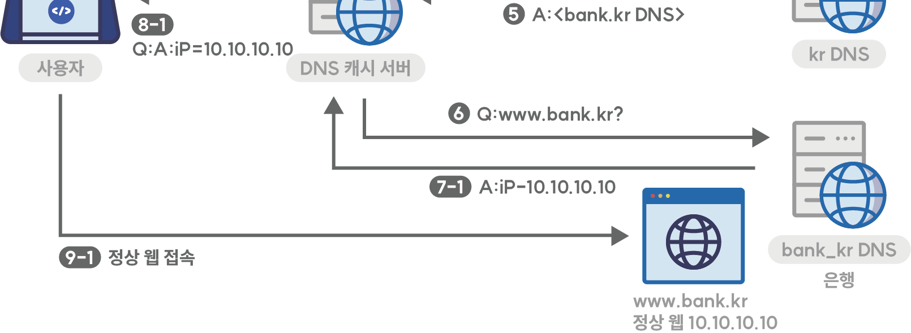

공격자가 DNS 엔트리를 속일 수 있으므로 도메인명에 의존해서 보안결정(인증 및 접근 통제 등)을 하지 않아야 한다.

#### 나. 안전한 코딩기법

보안결정에서 도메인명을 이용한 DNS lookup을 하지 않도록 한다.

#### 다. 코드예제

**안전하지 않은 코드**

```javascript
const express = require('express');
const dns = require("dns");
router.get("/vuln", (req, res) => {
  let trusted = false;
  const trustedHost = "www.google.com";
  const hostName = req.query.host;
  // 공격자에 의해 실행되는 서버의 DNS가 변경될 수 있으므로 안전하지 않음
  if (hostName === trustedHost) {
    trusted = true;
  }
  return res.send({trusted});
});
```

**안전한 코드**

```javascript
const express = require('express');
const dns = require("dns");
router.get("/patched", async (req, res) => {
  let trusted = false;
  const trustedHost = "142.250.207.100";
  // 실제 서버의 IP 주소를 비교하여 DNS 변조에 대응
  async function dnsLookup() { 
    return new Promise((resolve, reject) => { 
      dns.lookup(req.query.host, 4, (err, address, family) => {
        if (err) reject(err);
        resolve(address);
      })
    })
  }
  const hostName = await dnsLookup();
  if (hostName === trustedHost) {
    trusted = true;
  }
  return res.send({trusted});
});
```

#### 라. 참고자료

- [CWE-350: Reliance on Reverse DNS Resolution for a Security-Critical Action, MITRE](https://cwe.mitre.org/data/definitions/350.html)

---

### 2. 취약한 API 사용

> VanillaJS: O / ReactJS: O / ExpressJS: O

#### 가. 개요

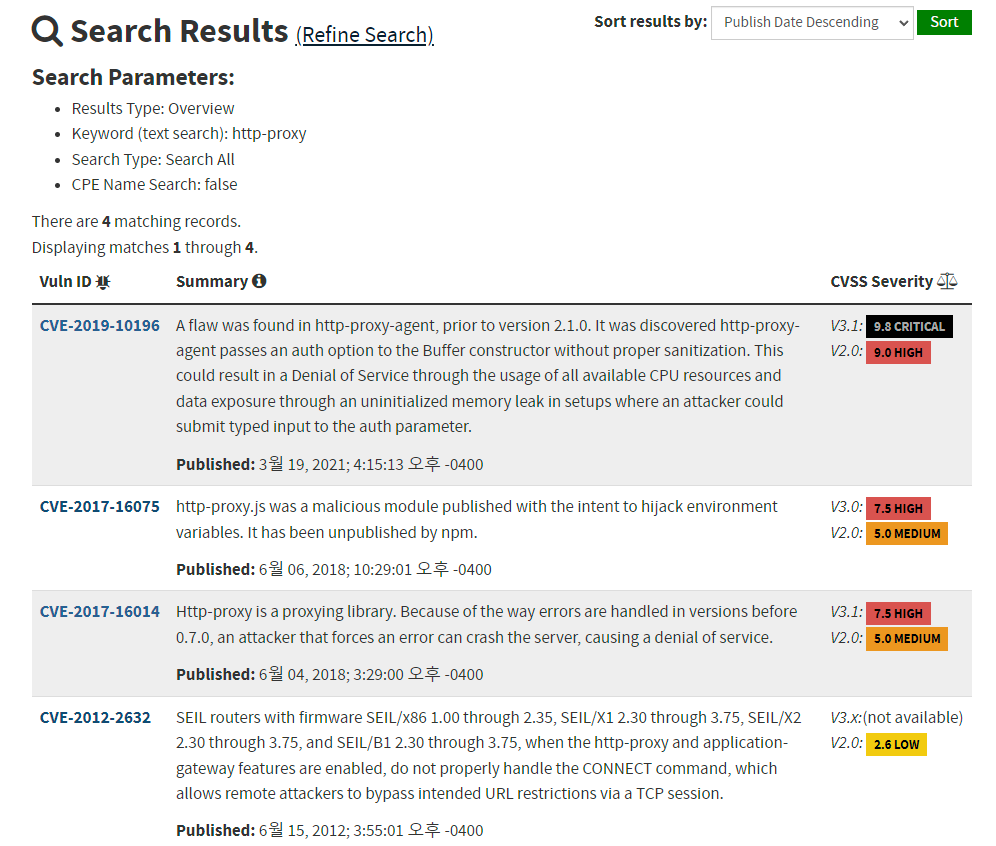

자바스크립트는 외부 의존성을 기본으로 하는 생태계를 토대로 한다. 패키지(package)라고 부르는 모듈 집합을 통해 서로 다른 제작자의 작업 결과물을 손쉽게 프로그램에 탑재할 수 있다. 이러한 특성은 잠재적인 보안 위협을 내포하고 있다.

프로그램 코드에서 외부 패키지 사용 시 보안 문제가 발생하게 되는 원인:
1. 사용자 배포 패키지 내의 결함으로 인한 취약점
2. 언어 엔진 자체의 결함으로 인한 취약점(기본 제공 패키지)

#### 나. 안전한 API 선택

최초 패키지 사용 시 다음과 같은 내용을 검토해 패키지 사용 여부를 결정한다:

- **사용 통계** : 얼마나 많은 사람들이 해당 패키지를 다운로드 했고, 선호하고 있는지
- **이슈 관리** : 지속적으로 발견되는 버그 또는 이슈를 어떻게 처리하고 있는지
- **마지막 버전** : 코드 유지관리가 잘 되고 있는지
- **발견된 취약점** : 특정 버전에서 취약점이 발견 되었는지, 결함이 제거된 버전이 공개되어 있는지

취약점 검색 사이트:

| 이름 | 주소 | 설명 |
|------|------|------|
| NIST(National Vulnerability Database) | https://nvd.nist.gov/vuln/search | 미국국립표준기술연구소에서 제공하는 취약점 검색 서비스 |
| CVEdetails | https://www.cvedetails.com | CVE 정보 검색, 통계 확인 등을 제공하는 온라인 서비스 |

#### 다. 사후 관리

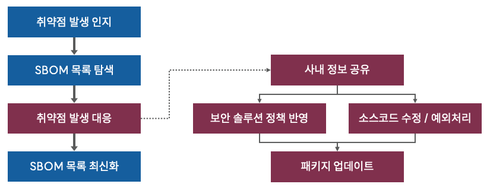

모든 API는 보안 취약점에서 완전히 자유로울 수 없다. 개발 제품에 오픈소스를 사용하는 경우 SBOM(Software Bill of Material)을 적용해야 한다. SBOM의 필수 구성요소: 공급자 이름, 컴포넌트 이름, 컴포넌트 버전, 컴포넌트 해시, 고유 특성자(UID), 의존 관계, 작성자

SBOM이 적용된 취약점 대응 프로세스:

1. **신규 취약점 발생 인지** : 신규 취약점 모니터링 과정에서 발견된 신규 취약점 위협 정보 입수
2. **SBOM 목록 탐색** : 운용 중인 제품의 SBOM 목록에 신규 취약점 관련 컴포넌트가 있는지 탐색
3. **취약점 발생 대응** : 사내 정보 공유, 보안 솔루션 정책 반영, 소스코드 수정/예외처리
4. **패키지 업데이트** : 취약점 개선 버전을 소프트웨어 패키지에 적용
5. **SBOM 목록 최신화** : 취약점 개선 버전이 반영된 패키지의 세부 정보를 SBOM 목록에 반영

#### 라. 참고자료

- [NTIA - SBOM](https://www.ntia.gov/page/software-bill-materials)
- [CISA - SBOM](https://www.cisa.gov/sbom)

---

# 제3장 부록

## 제1절 구현단계 보안약점 제거 기준

### 1. 입력데이터 검증 및 표현

| 번호 | 보안약점 | 설명 |
|------|---------|------|
| 1 | SQL 삽입 | SQL 질의문을 생성할 때 검증되지 않은 외부 입력값을 허용하여 악의적인 질의문이 실행가능한 보안약점 |
| 2 | 코드 삽입 | 프로세스가 외부 입력값을 코드로 해석·실행할 수 있고 검증되지 않은 외부 입력값을 허용한 경우 악의적인 코드가 실행 가능한 보안약점 |
| 3 | 경로 조작 및 자원 삽입 | 시스템 자원 접근경로 또는 자원제어 명령어에 검증되지 않은 외부 입력값을 허용하여 시스템 자원에 무단 접근 및 악의적인 행위가 가능한 보안약점 |
| 4 | 크로스사이트 스크립트 | 사용자 브라우저에 검증되지 않은 외부 입력값을 허용하여 악의적인 스크립트가 실행 가능한 보안약점 |
| 5 | 운영체제 명령어 삽입 | 운영체제 명령어를 생성할 때 검증되지 않은 외부 입력값을 허용하여 악의적인 명령어가 실행 가능한 보안약점 |
| 6 | 위험한 형식 파일 업로드 | 파일의 확장자 등 파일형식에 대한 검증없이 파일 업로드를 허용하여 공격이 가능한 보안약점 |
| 7 | 신뢰되지 않는 URL 주소로 자동접속 연결 | URL 링크 생성에 검증되지 않은 외부 입력값을 허용하여 악의적인 사이트로 자동 접속 가능한 보안약점 |
| 8 | 부적절한 XML 외부 개체 참조 | 임의로 조작된 XML 외부개체에 대한 적절한 검증 없이 참조를 허용하여 공격이 가능한 보안약점 |
| 9 | XML 삽입 | XQuery, XPath 질의문을 생성할 때 검증되지 않은 외부 입력값을 허용하여 악의적인 질의문이 실행 가능한 보안약점 |
| 10 | LDAP 삽입 | LDAP 명령문을 생성할 때 검증되지 않은 외부 입력값을 허용하여 악의적인 명령어가 실행 가능한 보안약점 |
| 11 | 크로스사이트 요청 위조 | 사용자 브라우저에 검증되지 않은 외부 입력값을 허용하여 사용자 본인의 의지와는 무관하게 공격자가 의도한 행위가 실행 가능한 보안약점 |
| 12 | 서버사이드 요청 위조 | 서버 간 처리되는 요청에 검증되지 않은 외부 입력값을 허용하여 공격자가 의도한 서버로 전송하거나 변조하는 보안약점 |
| 13 | HTTP 응답분할 | HTTP 응답헤더에 개행문자가 포함된 검증되지 않은 외부 입력값을 허용하여 악의적인 코드가 실행 가능한 보안약점 |
| 14 | 정수형 오버플로우 | 정수형 변수에 저장된 값이 허용된 정수 값 범위를 벗어나 프로그램이 예기치 않게 동작 가능한 보안약점 |
| 15 | 보안기능 결정에 사용되는 부적절한 입력값 | 보안기능 결정에 검증되지 않은 외부 입력값을 허용하여 보안기능을 우회하는 보안약점 |
| 16 | 메모리 버퍼 오버플로우 | 메모리 버퍼의 경계값을 넘어서 메모리값을 읽거나 저장하여 예기치 않은 결과가 발생하는 보안약점 |
| 17 | 포맷 스트링 삽입 | 포맷 스트링 제어함수에 검증되지 않은 외부 입력값을 허용하여 발생하는 보안약점 |

### 2. 보안기능

| 번호 | 보안약점 | 설명 |
|------|---------|------|
| 1 | 적절한 인증 없는 중요 기능 허용 | 중요정보를 적절한 인증없이 열람(또는 변경) 가능한 보안약점 |
| 2 | 부적절한 인가 | 중요자원에 접근할 때 적절한 제어가 없어 비인가자의 접근이 가능한 보안약점 |
| 3 | 중요한 자원에 대한 잘못된 권한 설정 | 중요자원에 적절한 접근 권한을 부여하지 않아 중요정보가 노출·수정 가능한 보안약점 |
| 4 | 취약한 암호화 알고리즘 사용 | 취약한 암호화 알고리즘을 사용하여 정보가 노출 가능한 보안약점 |
| 5 | 암호화되지 않은 중요정보 | 중요정보 전송/저장 시 암호화 하지 않아 정보가 노출 가능한 보안약점 |
| 6 | 하드코드된 중요정보 | 소스코드에 중요정보를 직접 코딩하여 소스코드 유출 시 중요정보가 노출되는 보안약점 |
| 7 | 충분하지 않은 키 길이 사용 | 암호화 등에 사용되는 키의 길이가 충분하지 않아 기밀성·무결성을 보장할 수 없는 보안약점 |
| 8 | 적절하지 않은 난수 값 사용 | 사용한 난수가 예측 가능하여 공격자가 시스템을 공격 가능한 보안약점 |
| 9 | 취약한 패스워드 허용 | 패스워드 조합규칙 미흡 및 길이가 충분하지 않아 패스워드가 노출 가능한 보안약점 |
| 10 | 부적절한 전자서명 확인 | 전자서명에 대한 유효성 검증이 적절하지 않아 악의적인 코드가 실행 가능한 보안약점 |
| 11 | 부적절한 인증서 유효성 검증 | 인증서에 대한 유효성 검증이 적절하지 않아 발생하는 보안약점 |
| 12 | 사용자 하드디스크에 저장되는 쿠키를 통한 정보노출 | 쿠키를 사용자 하드디스크에 저장하여 중요정보가 노출 가능한 보안약점 |
| 13 | 주석문 안에 포함된 시스템 주요정보 | 소스코드 주석문에 인증정보 등 시스템 주요정보가 포함되어 노출 가능한 보안약점 |
| 14 | 솔트 없이 일방향 해쉬 함수 사용 | 솔트를 사용하지 않고 생성된 해쉬 값으로부터 원본 정보를 복원가능한 보안약점 |
| 15 | 무결성 검사 없는 코드 다운로드 | 소스코드 또는 실행파일을 무결성 검사 없이 다운로드 받아 실행하는 보안약점 |
| 16 | 반복된 인증시도 제한 기능 부재 | 인증 시도 수를 제한하지 않아 공격자가 반복적으로 계정 권한을 획득 가능한 보안약점 |

### 3. 시간 및 상태

| 번호 | 보안약점 | 설명 |
|------|---------|------|
| 1 | 경쟁조건 : 검사 시점과 사용 시점 | 멀티 프로세스 상에서 자원을 검사하는 시점과 사용하는 시점이 달라서 발생하는 보안약점 |
| 2 | 종료되지 않는 반복문 또는 재귀함수 | 종료조건 없는 제어문 사용으로 반복문 또는 재귀함수가 무한히 반복되어 발생할 수 있는 보안약점 |

### 4. 에러처리

| 번호 | 보안약점 | 설명 |
|------|---------|------|
| 1 | 오류 메시지 정보노출 | 오류메시지나 스택정보에 시스템 내부구조가 포함되어 민감한 정보가 노출 가능한 보안약점 |
| 2 | 오류상황 대응 부재 | 시스템 오류상황을 처리하지 않아 의도하지 않은 상황이 발생 가능한 보안약점 |
| 3 | 부적절한 예외처리 | 예외사항을 부적절하게 처리하여 의도하지 않은 상황이 발생 가능한 보안약점 |

### 5. 코드오류

| 번호 | 보안약점 | 설명 |
|------|---------|------|
| 1 | Null Pointer 역참조 | 변수의 주소 값이 Null인 객체를 참조하는 보안약점 |
| 2 | 부적절한 자원 해제 | 사용 완료된 자원을 해제하지 않아 자원이 고갈되는 보안약점 |
| 3 | 해제된 자원 사용 | 메모리 등 해제된 자원을 참조하여 예기치 않은 오류가 발생하는 보안약점 |
| 4 | 초기화되지 않은 변수 사용 | 변수를 초기화하지 않고 사용하여 예기치 않은 오류가 발생하는 보안약점 |
| 5 | 신뢰할 수 없는 데이터의 역직렬화 | 악의적인 코드가 삽입·수정된 직렬화 데이터를 적절한 검증 없이 역직렬화하여 발생하는 보안약점 |

### 6. 캡슐화

| 번호 | 보안약점 | 설명 |
|------|---------|------|
| 1 | 잘못된 세션에 의한 데이터 정보노출 | 잘못된 세션에 의해 인가되지 않은 사용자에게 중요정보가 노출 가능한 보안약점 |
| 2 | 제거되지 않고 남은 디버그 코드 | 디버깅을 위한 코드를 제거하지 않아 중요정보가 노출 가능한 보안약점 |
| 3 | Public 메서드로부터 반환된 Private 배열 | Public 메소드에서 Private 배열을 반환하면 외부에서 수정 가능한 보안약점 |
| 4 | Private 배열에 Public 데이터 할당 | Public 데이터가 Private 배열에 저장되면 외부에서 접근하여 수정 가능한 보안약점 |

### 7. API 오용

| 번호 | 보안약점 | 설명 |
|------|---------|------|
| 1 | DNS lookup에 의존한 보안결정 | 도메인명 확인으로 보안결정을 수행할 때 악의적으로 변조된 DNS 정보로 보안위협에 노출되는 보안약점 |
| 2 | 취약한 API 사용 | 취약한 함수를 사용해서 예기치 않은 보안위협에 노출되는 보안약점 |

---

## 제2절 용어정리

- **AES(Advanced Encryption Standard)**: 미국 정부 표준으로 지정된 블록 암호 형식으로 이전의 DES를 대체하며, NIST가 2001년 연방 정보처리표준(FIPS 197)으로 발표하였다.
- **DES 알고리즘**: 암호화 키와 복호화키가 같은 대칭키 암호로 64비트의 암호화키를 사용한다. 전수공격(Brute Force)공격에 취약하다.
- **HMAC(Hash-based Message Authentication Code)**: 해쉬 기반 메시지 인증 코드, MD5, SHA-1 등 반복적인 암호화 해쉬 기능을 비밀 공용키와 함께 사용하는 키 기반의 메시지 인증 알고리즘이다.
- **HTTPS**: WWW 통신 프로토콜인 HTTP의 보안이 강화된 버전이다.
- **LDAP(Lightweight Directory Access Protocol)**: TCP/IP 위에서 디렉토리 서비스를 조회하고 수정하는 응용 프로토콜이다.
- **SHA(Secure Hash Algorithm)**: 해쉬알고리즘의 일종으로 MD5의 취약성을 대신하여 사용한다. SHA, SHA-1, SHA-2 등의 다양한 버전이 있다.
- **umask**: 파일 또는 디렉토리의 권한을 설정하기 위한 명령어이다.
- **개인키(Private Key)**: 공개키 기반구조에서 암·복호화를 위해 비밀 메시지를 교환하는 당사자만이 알고 있는 키이다.
- **공개키(Public Key)**: 지정된 인증기관에 의해 제공되는 키값으로서, 개인키와 함께 결합되어 메시지 및 전자서명의 암·복호화에 사용된다.
- **경로순회(directory traversal)**: 상대경로 참조 방식을 이용해 다른 디렉토리의 중요파일에 접근하는 공격방법이다.
- **동적 SQL(Dynamic SQL)**: 프로그램의 조건에 따라 SQL문이 다르게 생성되는 경우, 프로그램 실행 시에 전체 쿼리문이 완성되어 DB에 요청하는 SQL문을 말한다.
- **동적 쿼리(Dynamic Query)**: 컬럼이나 테이블명을 바꿔 SQL 쿼리를 실시간 생성해 DB에 전달하여 처리하는 방식이다.
- **소프트웨어 개발보안**: 소프트웨어 개발과정에서 보안취약점을 최소화하고, 해킹 등 보안위협에 대응할 수 있는 안전한 소프트웨어를 개발하기 위한 일련의 과정이다.
- **소프트웨어 보안약점**: 소프트웨어 결함, 오류 등으로 해킹 등 사이버공격을 유발할 가능성이 있는 잠재적인 보안취약점을 말한다.
- **싱글톤 패턴(Singleton Pattern)**: 하나의 프로그램 내에서 하나의 인스턴스만을 생성해야만 하는 패턴이다.
- **정적 쿼리(Static Query)**: 프로그램 소스코드에 이미 쿼리문이 완성된 형태로 고정되어 있다.
- **해쉬함수**: 주어진 원문에서 고정된 길이의 의사난수를 생성하는 연산기법이다.
- **화이트 리스트(White List)**: 신뢰할 수 있는 사이트나 IP주소 목록을 말한다.
- **파싱(Parsing)**: 일련의 문자열을 의미 있는 token으로 분해하고 Parse tree를 만드는 과정이다.
- **파서(Parser)**: 컴파일러의 일부로 원시 프로그램을 읽어 들여 구문 분석을 행하는 프로그램이다.
- **XML(eXtensible Markup Language)**: W3C에서 개발되었으며, 인터넷에 연결된 시스템끼리 데이터를 쉽게 주고받을 수 있도록 만들어졌다.
- **DTD(Document Type Definition)**: XML 문서의 구조 및 해당 문서에서 사용할 수 있는 적법한 요소와 속성을 정의한다.
- **공개 키 인증서(Public Key Certificate)**: 공개키의 소유권을 증명하는데 사용되는 전자 문서이다.
- **솔트(salt)**: 해싱 처리 과정 중 각 패스워드에 추가되는 랜덤으로 생성된 유일한 문자열을 의미한다.
